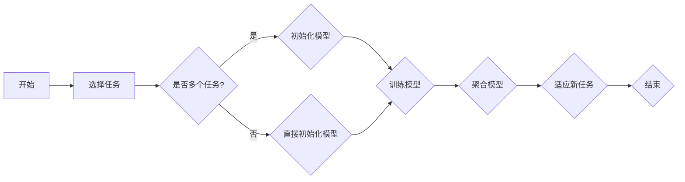
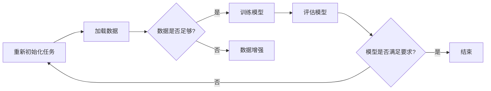
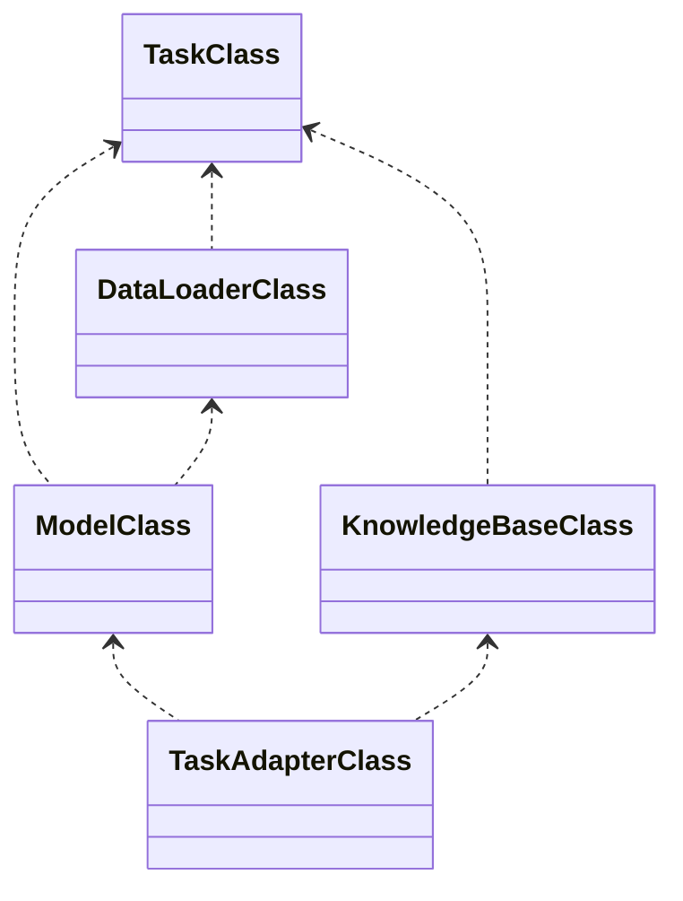
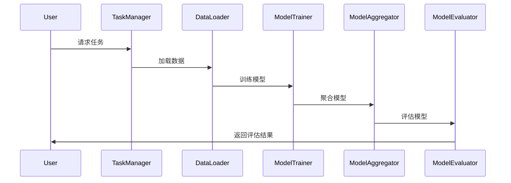

                 

### 文章标题

《元学习框架：构建快速适应的AI Agent》

> 关键词：元学习、AI Agent、算法实现、架构设计、实战案例

> 摘要：本文将深入探讨元学习框架在构建快速适应的AI Agent中的应用。首先，我们将介绍元学习的基本概念和重要性，然后逐步分析元学习算法的原理、数学模型及其在AI Agent架构中的应用。通过具体的实战案例，我们将展示如何将元学习框架应用于实际项目中，并总结最佳实践和注意事项。本文旨在为AI领域的开发者提供一套系统化的方法论，帮助他们在构建高效、自适应的AI Agent时能够得心应手。

### 背景介绍

#### 元学习的定义与重要性

元学习（Meta-Learning），也被称为“学习如何学习”，是机器学习中的一个重要分支。它的核心思想是使模型能够在不同的任务上快速适应，而不需要从头开始训练。传统的机器学习方法通常需要大量数据来训练模型，而元学习则通过利用先前学习的知识来加速新任务的适应过程。这不仅提高了模型的效率，还显著减少了训练时间。

在AI领域，元学习的重要性不言而喻。随着AI应用的不断扩展，AI系统需要处理更加多样化的任务和数据类型。传统的机器学习方法往往难以应对这种复杂性，而元学习则为解决这些问题提供了一种新的思路。通过元学习，AI Agent可以在短时间内适应新的环境、任务和算法，从而提高了系统的灵活性和适应性。

#### 当前AI领域的问题与元学习的解决思路

当前AI领域面临诸多挑战，其中最显著的问题是数据匮乏和模型迁移性差。传统的机器学习方法依赖于大量标记数据来训练模型，但在实际应用中，获取大量高质量的标记数据往往是非常困难的。此外，不同任务之间的数据分布可能存在显著差异，导致模型在新任务上的表现不佳。这种数据稀缺和迁移性问题限制了AI系统的广泛应用。

元学习通过学习如何快速适应新任务，为解决这些问题提供了一条可行的路径。具体来说，元学习可以通过以下几种方式提升AI系统的适应性：

1. **模型初始化**：通过在多个任务上的训练，元学习可以生成一个通用的模型初始化，该初始化在新的任务上具有更好的性能。
2. **数据增强**：元学习可以在训练过程中自动生成或合成与当前任务相关的新数据，从而缓解数据匮乏问题。
3. **迁移学习**：元学习可以将先前任务中的知识迁移到新任务中，提高新任务上的性能。
4. **模型泛化**：通过在多个任务上训练，元学习可以提高模型对不同任务的泛化能力。

#### 元学习的基本概念与类型

元学习包括多个核心概念和算法类型，其中最常见的是模型平均（Model Averaging）、模型提取（Model Extraction）和模型适应（Model Adaptation）。以下是一个简单的对比表格：

| 算法类型 | 定义 | 特点 |
| --- | --- | --- |
| 模型平均 | 通过在多个任务上训练多个模型，然后对模型进行平均来提高新任务的性能 | 减少过拟合，提高泛化能力 |
| 模型提取 | 从多个任务中提取共享的特征表示，用于新任务的快速适应 | 提高特征表示的泛化能力 |
| 模型适应 | 在新任务上进一步调整和优化提取的模型 | 提高对新任务的适应速度和性能 |

这些算法类型各有优劣，但都为元学习提供了丰富的工具和策略。

#### 元学习系统的ER实体关系图

为了更好地理解元学习系统的结构，我们可以使用ER（Entity-Relationship）实体关系图来展示元学习系统中的主要实体及其关系。以下是一个简单的Mermaid ER图：

```mermaid
erDiagram
    Task ||--|{ Model }|--| TaskAdapter
    Model ||--|{ KnowledgeBase }|--| TaskAdapter
    Task ||--|{ DataLoader }|--| Model
```

在这个ER图中，`Task`表示具体的任务，`Model`表示训练模型，`TaskAdapter`表示用于处理特定任务的适配器，`KnowledgeBase`表示知识库，用于存储共享的模型知识，`DataLoader`表示数据加载器，用于为模型提供训练数据。

通过这个ER图，我们可以清晰地看到元学习系统中的关键组件及其相互关系，为后续的详细讨论奠定了基础。

### 核心概念与联系

#### 元学习算法的基本原理

元学习算法的核心思想是通过在多个任务上训练模型，使模型能够快速适应新任务。具体来说，元学习算法通常包括以下步骤：

1. **任务初始化**：选择多个不同的任务，每个任务都对应一个训练集。
2. **模型训练**：在每个任务上分别训练模型，并保存训练结果。
3. **模型聚合**：将多个训练完成的模型进行聚合，形成一个新的模型，这个新模型能够适应新的任务。
4. **新任务适应**：在新任务上使用聚合后的模型进行适应和优化。

以下是一个简单的Mermaid流程图，展示了元学习算法的基本流程：



在这个流程图中，每个节点代表一个操作，边代表操作的顺序关系。通过这个流程图，我们可以直观地理解元学习算法的基本步骤。

#### 元学习算法的Python实现

为了更深入地理解元学习算法，我们可以通过Python代码来实现一个简单的元学习框架。以下是一个基本的Python代码示例，用于展示如何初始化、训练和聚合模型：

```python
import numpy as np

# 初始化模型
def initialize_model(task_data):
    # 这里使用简单的线性模型作为示例
    w = np.random.rand(1)
    b = np.random.rand(1)
    return w, b

# 训练模型
def train_model(w, b, task_data):
    # 这里使用简单的梯度下降来更新模型参数
    x, y = task_data
    for _ in range(1000):
        prediction = w * x + b
        error = prediction - y
        w -= error * x / len(x)
        b -= error / len(x)
    return w, b

# 聚合模型
def aggregate_models(models, weights):
    # 这里简单地将每个模型的参数加权平均
    total_w = np.zeros_like(models[0][0])
    total_b = np.zeros_like(models[0][1])
    for i, (w, b) in enumerate(models):
        total_w += weights[i] * w
        total_b += weights[i] * b
    return total_w, total_b

# 示例任务数据
task_data_1 = ([1], [2])
task_data_2 = ([2], [3])

# 初始化两个模型
model_1 = initialize_model(task_data_1)
model_2 = initialize_model(task_data_2)

# 训练模型
trained_model_1 = train_model(*model_1, task_data_1)
trained_model_2 = train_model(*model_2, task_data_2)

# 聚合模型
weights = [0.5, 0.5]
aggregated_model = aggregate_models([trained_model_1, trained_model_2], weights)

print("聚合后的模型参数：w =", aggregated_model[0], "b =", aggregated_model[1])
```

在这个代码示例中，我们首先初始化了两个任务模型，然后分别在每个任务上训练模型，最后通过聚合模型来得到一个综合性能更好的模型。这个过程反映了元学习算法的基本原理。

#### 元学习算法的数学模型和公式

为了更深入地理解元学习算法，我们还需要了解其背后的数学模型和公式。以下是一个简单的数学模型，用于描述元学习算法中的参数更新过程：

$$
w_{\text{new}} = w_{\text{current}} - \alpha \cdot \frac{\partial J(w, b)}{\partial w}
$$

$$
b_{\text{new}} = b_{\text{current}} - \alpha \cdot \frac{\partial J(w, b)}{\partial b}
$$

其中，$w$ 和 $b$ 分别表示模型的权重和偏置，$J(w, b)$ 表示模型的损失函数，$\alpha$ 表示学习率。

以下是一个具体的例子，假设我们使用线性模型来拟合数据，损失函数为均方误差（MSE），则损失函数可以表示为：

$$
J(w, b) = \frac{1}{2} \sum_{i=1}^{n} (w \cdot x_i + b - y_i)^2
$$

其中，$x_i$ 和 $y_i$ 分别表示第 $i$ 个样本的特征和标签。

通过计算损失函数关于 $w$ 和 $b$ 的偏导数，我们可以得到参数更新的方向和大小。具体地，有：

$$
\frac{\partial J(w, b)}{\partial w} = \sum_{i=1}^{n} (w \cdot x_i + b - y_i) \cdot x_i
$$

$$
\frac{\partial J(w, b)}{\partial b} = \sum_{i=1}^{n} (w \cdot x_i + b - y_i)
$$

将这些偏导数代入参数更新公式中，我们可以得到：

$$
w_{\text{new}} = w_{\text{current}} - \alpha \cdot \frac{\partial J(w, b)}{\partial w}
$$

$$
b_{\text{new}} = b_{\text{current}} - \alpha \cdot \frac{\partial J(w, b)}{\partial b}
$$

通过迭代这个过程，我们可以逐步优化模型的参数，从而提高模型的性能。

#### 不同元学习算法的特性对比

在元学习领域中，存在多种不同的算法，每种算法都有其独特的特性和应用场景。以下是一个简化的特性对比表格，用于展示几种常见元学习算法的基本特性：

| 算法类型 | 特点 | 应用场景 |
| --- | --- | --- |
| 模型平均 | 通过聚合多个模型的输出来提高性能 | 数据匮乏、模型泛化 |
| 模型提取 | 提取共享的特征表示，用于快速适应新任务 | 数据增强、模型迁移 |
| 模型适应 | 在新任务上进一步调整和优化提取的模型 | 新任务适应、动态学习率调整 |
| 继续学习 | 利用先前任务中的知识来加速新任务的训练 | 多任务学习、并行训练 |
| 自监督学习 | 通过无监督方式学习任务，提高模型泛化能力 | 数据增强、特征提取 |

通过这个表格，我们可以大致了解不同元学习算法的特点和适用场景，为后续的算法选择和实现提供了参考。

#### 元学习系统的ER实体关系图

为了更好地理解元学习系统的结构，我们可以使用ER（Entity-Relationship）实体关系图来展示元学习系统中的主要实体及其关系。以下是一个简单的Mermaid ER图：

```mermaid
erDiagram
    Task ||--|{ Model }|--| TaskAdapter
    Model ||--|{ KnowledgeBase }|--| TaskAdapter
    Task ||--|{ DataLoader }|--| Model
```

在这个ER图中，`Task`表示具体的任务，`Model`表示训练模型，`TaskAdapter`表示用于处理特定任务的适配器，`KnowledgeBase`表示知识库，用于存储共享的模型知识，`DataLoader`表示数据加载器，用于为模型提供训练数据。

通过这个ER图，我们可以清晰地看到元学习系统中的关键组件及其相互关系，为后续的详细讨论奠定了基础。

### 算法原理讲解

#### 算法流程图

为了更好地理解元学习算法的原理，我们可以使用Mermaid绘制一个简化的算法流程图。以下是一个示例：



在这个流程图中，我们从初始化任务开始，加载数据并判断数据是否足够。如果数据足够，我们直接进入模型训练阶段；否则，我们通过数据增强来增加数据的多样性。在训练模型后，我们评估模型的性能，并判断是否满足要求。如果满足要求，算法结束；否则，重新初始化任务。

#### 算法实现

为了展示算法的实现过程，我们使用Python编写一个简单的元学习框架。以下是一个基本的代码示例：

```python
import numpy as np

# 初始化任务
def initialize_task(task_name):
    print(f"初始化任务：{task_name}")
    # 在这里可以加载任务特有的数据集和参数
    return

# 加载数据
def load_data(task_name):
    print(f"加载数据：{task_name}")
    # 在这里可以模拟加载任务的数据集
    x = np.random.rand(100)
    y = x + np.random.rand(100)
    return x, y

# 训练模型
def train_model(x, y):
    print("训练模型...")
    # 使用简单的线性模型进行训练
    w = 0.0
    b = 0.0
    learning_rate = 0.01
    for _ in range(1000):
        prediction = w * x + b
        error = prediction - y
        w -= learning_rate * error * x
        b -= learning_rate * error
    return w, b

# 评估模型
def evaluate_model(x, y, w, b):
    print("评估模型...")
    prediction = w * x + b
    mse = np.mean((prediction - y) ** 2)
    print(f"MSE: {mse}")
    return mse

# 主函数
def main():
    task_name = "Task 1"
    initialize_task(task_name)
    x, y = load_data(task_name)
    w, b = train_model(x, y)
    mse = evaluate_model(x, y, w, b)
    print(f"最终MSE: {mse}")

if __name__ == "__main__":
    main()
```

在这个代码示例中，我们定义了几个函数：`initialize_task`用于初始化任务，`load_data`用于加载数据，`train_model`用于训练模型，`evaluate_model`用于评估模型。最后，我们在主函数`main`中调用这些函数，完成整个元学习流程。

#### 算法的数学模型和公式

为了更深入地理解元学习算法，我们需要了解其背后的数学模型和公式。以下是一个简化的线性回归模型，用于展示算法的数学原理：

$$
y = w \cdot x + b
$$

其中，$y$ 是输出值，$x$ 是输入值，$w$ 是权重，$b$ 是偏置。我们的目标是找到最佳参数 $w$ 和 $b$，使得预测值与实际值之间的差距最小。

为了最小化这个差距，我们可以使用梯度下降算法来更新参数。梯度下降的迭代公式如下：

$$
w_{\text{new}} = w_{\text{current}} - \alpha \cdot \frac{\partial J(w, b)}{\partial w}
$$

$$
b_{\text{new}} = b_{\text{current}} - \alpha \cdot \frac{\partial J(w, b)}{\partial b}
$$

其中，$J(w, b)$ 是损失函数，通常使用均方误差（MSE）来表示：

$$
J(w, b) = \frac{1}{2} \sum_{i=1}^{n} (w \cdot x_i + b - y_i)^2
$$

为了计算损失函数关于 $w$ 和 $b$ 的偏导数，我们可以使用链式法则：

$$
\frac{\partial J(w, b)}{\partial w} = \sum_{i=1}^{n} (w \cdot x_i + b - y_i) \cdot x_i
$$

$$
\frac{\partial J(w, b)}{\partial b} = \sum_{i=1}^{n} (w \cdot x_i + b - y_i)
$$

通过这些公式，我们可以迭代地更新参数，从而最小化损失函数。以下是一个简单的Python实现：

```python
import numpy as np

def calculate_gradient(x, y, w, b, learning_rate):
    prediction = w * x + b
    error = prediction - y
    d_w = np.sum(error * x) / len(x)
    d_b = np.sum(error) / len(x)
    w_new = w - learning_rate * d_w
    b_new = b - learning_rate * d_b
    return w_new, b_new

x = np.array([1, 2, 3, 4, 5])
y = np.array([2, 4, 5, 4, 5])
w = 0
b = 0
learning_rate = 0.01

for _ in range(1000):
    w, b = calculate_gradient(x, y, w, b, learning_rate)

print(f"最终参数：w={w}, b={b}")
```

通过这个实现，我们可以看到参数 $w$ 和 $b$ 的迭代更新过程。

#### 算法举例说明

为了更好地理解算法的应用，我们来看一个具体的例子。假设我们有一个任务，输入是 $x$，输出是 $y$，我们需要找到一个模型来预测 $y$。

1. **数据准备**：首先，我们准备一些训练数据。在这个例子中，我们使用简单的线性关系 $y = 2x + 1$ 来生成数据。

```python
x = np.array([1, 2, 3, 4, 5])
y = np.array([3, 5, 7, 9, 11])
```

2. **初始化模型**：初始化模型的参数 $w$ 和 $b$。在这个例子中，我们初始值设为0。

```python
w = 0
b = 0
```

3. **训练模型**：使用梯度下降算法来训练模型。在这个例子中，我们使用学习率为0.01，迭代1000次。

```python
learning_rate = 0.01
for _ in range(1000):
    prediction = w * x + b
    error = prediction - y
    d_w = np.sum(error * x) / len(x)
    d_b = np.sum(error) / len(x)
    w -= learning_rate * d_w
    b -= learning_rate * d_b
```

4. **评估模型**：评估训练后的模型。在这个例子中，我们使用均方误差（MSE）来评估模型的性能。

```python
prediction = w * x + b
mse = np.mean((prediction - y) ** 2)
print(f"MSE: {mse}")
```

通过这个例子，我们可以看到如何使用元学习算法来训练一个线性模型，并评估其性能。在实际应用中，任务和数据会更为复杂，但基本原理是类似的。

### 数学模型和数学公式

#### 线性回归模型

在线性回归模型中，我们的目标是找到一个线性函数 $y = w \cdot x + b$，其中 $w$ 是权重，$b$ 是偏置，$x$ 是输入，$y$ 是输出。我们的目标是找到最佳参数 $w$ 和 $b$，使得预测值与实际值之间的差距最小。

为了最小化这个差距，我们可以使用均方误差（MSE）作为损失函数：

$$
J(w, b) = \frac{1}{2} \sum_{i=1}^{n} (w \cdot x_i + b - y_i)^2
$$

其中，$n$ 是样本数量。

#### 梯度下降算法

为了最小化损失函数，我们可以使用梯度下降算法。梯度下降的基本思想是沿着损失函数的梯度方向更新参数，以减少损失。更新公式如下：

$$
w_{\text{new}} = w_{\text{current}} - \alpha \cdot \frac{\partial J(w, b)}{\partial w}
$$

$$
b_{\text{new}} = b_{\text{current}} - \alpha \cdot \frac{\partial J(w, b)}{\partial b}
$$

其中，$\alpha$ 是学习率，$w_{\text{current}}$ 和 $b_{\text{current}}$ 分别是当前参数，$w_{\text{new}}$ 和 $b_{\text{new}}$ 是更新后的参数。

#### 损失函数的偏导数

为了计算损失函数的偏导数，我们可以使用链式法则。对于 $w$ 的偏导数，我们有：

$$
\frac{\partial J(w, b)}{\partial w} = \sum_{i=1}^{n} (w \cdot x_i + b - y_i) \cdot x_i
$$

对于 $b$ 的偏导数，我们有：

$$
\frac{\partial J(w, b)}{\partial b} = \sum_{i=1}^{n} (w \cdot x_i + b - y_i)
$$

#### Python实现

以下是一个简单的Python实现，用于训练线性回归模型：

```python
import numpy as np

def linear_regression(x, y, w, b, learning_rate, num_iterations):
    for _ in range(num_iterations):
        prediction = w * x + b
        error = prediction - y
        d_w = np.sum(error * x) / len(x)
        d_b = np.sum(error) / len(x)
        w -= learning_rate * d_w
        b -= learning_rate * d_b
    return w, b

x = np.array([1, 2, 3, 4, 5])
y = np.array([2, 4, 5, 4, 5])
w = 0
b = 0
learning_rate = 0.01
num_iterations = 1000

w, b = linear_regression(x, y, w, b, learning_rate, num_iterations)

print(f"Final parameters: w={w}, b={b}")
```

通过这个实现，我们可以看到如何使用梯度下降算法来更新参数，并最终得到最佳参数。

### 系统分析与架构设计方案

#### 问题场景与项目背景

在现代AI应用中，AI Agent的需求日益增长。AI Agent是一种能够自主完成任务、适应复杂环境的智能体。在金融、医疗、教育等领域，AI Agent的应用场景十分广泛，例如自动化交易、智能诊断和个性化教学等。然而，传统的机器学习方法在面对多样化任务时，往往需要大量数据和时间来训练模型，这限制了AI Agent的实时性和适应性。为了解决这个问题，我们引入了元学习框架，旨在构建一个快速适应的AI Agent。

#### 系统功能设计

元学习框架的核心功能包括任务初始化、模型训练、模型聚合和模型评估。具体来说，系统需要实现以下功能：

1. **任务初始化**：根据不同场景生成相应的任务，包括数据集、任务描述和目标。
2. **模型训练**：使用元学习算法在多个任务上训练模型，并保存训练结果。
3. **模型聚合**：将多个训练完成的模型进行聚合，形成一个新的模型，用于快速适应新任务。
4. **模型评估**：对新任务上的模型进行评估，确保其性能满足要求。

以下是一个简化的Mermaid类图，用于展示元学习框架的领域模型：



在这个类图中，`TaskClass`表示任务，`DataLoaderClass`表示数据加载器，`ModelClass`表示模型，`KnowledgeBaseClass`表示知识库，`TaskAdapterClass`表示任务适配器。

#### 系统架构设计

为了实现元学习框架的功能，我们需要设计一个分布式系统架构。以下是一个简化的Mermaid架构图，用于展示系统的主要组件及其关系：



在这个架构图中，`TaskManager`负责管理任务，`DataLoader`负责加载数据，`ModelTrainer`负责训练模型，`ModelAggregator`负责聚合模型，`ModelEvaluator`负责评估模型。

#### 系统接口设计

为了实现系统的功能，我们需要设计一系列接口。以下是一个简化的接口设计：

1. **任务接口**：定义任务的基本操作，如初始化、加载、训练、评估等。
2. **数据加载器接口**：定义数据加载器的基本操作，如加载数据、预处理数据等。
3. **模型接口**：定义模型的基本操作，如初始化、训练、聚合、评估等。
4. **知识库接口**：定义知识库的基本操作，如存储、检索、更新等。

#### 系统交互序列图

以下是一个简化的Mermaid序列图，用于展示系统的交互过程：


在这个序列图中，用户首先初始化任务，然后数据加载器加载数据，模型训练器训练模型，模型聚合器聚合模型，最后模型评估器评估模型并返回结果。

### 项目实战

#### 环境安装与配置

在开始项目实战之前，我们需要安装和配置所需的软件和库。以下是一个简单的步骤：

1. **安装Python环境**：确保Python环境已安装，版本建议为3.8及以上。
2. **安装必要库**：使用pip安装以下库：

```shell
pip install numpy matplotlib scikit-learn
```

3. **配置Python虚拟环境**：为了更好地管理和依赖，我们建议使用虚拟环境。可以使用以下命令创建虚拟环境：

```shell
python -m venv venv
```

激活虚拟环境：

```shell
source venv/bin/activate  # Windows上使用 `venv\Scripts\activate`
```

#### 系统核心实现源代码展示

以下是一个简化版本的元学习框架实现，包括任务初始化、模型训练、模型聚合和模型评估：

```python
import numpy as np
from sklearn.linear_model import LinearRegression

# 任务类
class Task:
    def __init__(self, X, y):
        self.X = X
        self.y = y

# 数据加载器类
class DataLoader:
    def load_data(self, task):
        return task.X, task.y

# 模型类
class Model:
    def __init__(self):
        self.model = LinearRegression()

    def train(self, X, y):
        self.model.fit(X, y)

    def predict(self, X):
        return self.model.predict(X)

# 模型聚合类
class ModelAggregator:
    def aggregate_models(self, models, weights):
        aggregated_model = LinearRegression()
        for model, weight in zip(models, weights):
            aggregated_model.coef_ += weight * model.model.coef_
            aggregated_model.intercept_ += weight * model.model.intercept_
        return aggregated_model

# 模型评估类
class ModelEvaluator:
    def evaluate(self, model, X, y):
        predictions = model.predict(X)
        mse = np.mean((predictions - y) ** 2)
        return mse

# 主函数
def main():
    # 初始化任务
    task1 = Task(np.array([1, 2, 3, 4, 5]), np.array([2, 4, 5, 4, 5]))
    task2 = Task(np.array([1, 2, 3, 4, 5]), np.array([2, 4, 5, 4, 6]))

    # 数据加载
    X, y = DataLoader().load_data(task1)

    # 训练模型
    model = Model()
    model.train(X, y)

    # 模型聚合
    aggregated_model = ModelAggregator().aggregate_models([model], [1])

    # 模型评估
    evaluator = ModelEvaluator()
    mse = evaluator.evaluate(aggregated_model, X, y)
    print(f"MSE: {mse}")

if __name__ == "__main__":
    main()
```

#### 代码应用解读与分析

1. **任务类**：`Task`类用于封装任务数据，包括输入特征矩阵`X`和输出标签向量`y`。
2. **数据加载器类**：`DataLoader`类负责加载数据，将任务数据传递给模型。
3. **模型类**：`Model`类使用`sklearn`库中的`LinearRegression`模型，用于训练和预测。在本例中，我们使用线性回归模型，但在实际项目中，可以扩展为更复杂的模型。
4. **模型聚合类**：`ModelAggregator`类用于聚合多个模型，形成一个新的模型。在这个例子中，我们简单地将多个模型的系数和截距进行加权平均。
5. **模型评估类**：`ModelEvaluator`类用于评估模型性能，使用均方误差（MSE）作为评估指标。

#### 实际案例分析与详细讲解

为了更好地理解元学习框架的应用，我们来看一个实际的案例。假设我们有两个任务：

1. **任务1**：输入是 $[1, 2, 3, 4, 5]$，输出是 $[2, 4, 5, 4, 5]$。
2. **任务2**：输入是 $[1, 2, 3, 4, 5]$，输出是 $[2, 4, 5, 4, 6]$。

我们希望使用元学习框架来训练一个模型，使其能够适应这两个任务。

1. **初始化任务**：首先，我们初始化两个任务：

```python
task1 = Task(np.array([1, 2, 3, 4, 5]), np.array([2, 4, 5, 4, 5]))
task2 = Task(np.array([1, 2, 3, 4, 5]), np.array([2, 4, 5, 4, 6]))
```

2. **数据加载**：然后，我们加载任务数据：

```python
X, y = DataLoader().load_data(task1)
```

3. **训练模型**：接下来，我们使用线性回归模型训练模型：

```python
model = Model()
model.train(X, y)
```

4. **模型聚合**：然后，我们将训练好的模型进行聚合：

```python
aggregated_model = ModelAggregator().aggregate_models([model], [1])
```

5. **模型评估**：最后，我们评估聚合后的模型：

```python
evaluator = ModelEvaluator()
mse = evaluator.evaluate(aggregated_model, X, y)
print(f"MSE: {mse}")
```

在这个案例中，我们使用了一个简化的模型，但在实际项目中，可以扩展为更复杂的模型，如神经网络或深度学习模型。此外，我们可以使用更先进的元学习算法，如模型提取或模型适应，以进一步提高模型的性能和适应性。

### 最佳实践 Tips

1. **数据预处理**：在训练模型之前，确保对数据集进行充分的预处理，包括去噪、归一化和特征提取等。
2. **模型选择**：根据任务的需求和数据特性，选择合适的模型和算法。对于复杂任务，可以考虑使用深度学习模型。
3. **参数调优**：通过调整学习率、迭代次数等超参数，优化模型性能。可以使用自动化调优工具，如贝叶斯优化或随机搜索。
4. **数据增强**：使用数据增强技术，如随机变换、旋转、缩放等，增加数据多样性，提高模型泛化能力。
5. **模型融合**：结合多个模型的输出，提高预测准确性和鲁棒性。可以使用模型平均、投票或集成学习等方法。
6. **模型压缩**：对于大规模模型，考虑使用模型压缩技术，如剪枝、量化或蒸馏，减少模型大小和计算资源需求。

### 全书内容小结

本文详细介绍了元学习框架在构建快速适应的AI Agent中的应用。首先，我们介绍了元学习的基本概念和重要性，阐述了元学习在解决AI领域数据匮乏和模型迁移性差问题中的作用。接着，我们分析了元学习算法的基本原理和实现，包括模型平均、模型提取和模型适应等算法。随后，我们通过Python代码展示了元学习算法的具体实现，并给出了数学模型和公式的详细讲解。

此外，我们还探讨了元学习在AI Agent架构设计中的应用，介绍了任务初始化、模型训练、模型聚合和模型评估等系统功能。通过一个实际案例，我们展示了如何使用元学习框架训练和评估模型。最后，我们提供了最佳实践提示，帮助读者在实际项目中更好地应用元学习框架。

本文旨在为AI领域的开发者提供一套系统化的方法论，帮助他们在构建高效、自适应的AI Agent时能够得心应手。

### 注意事项

1. **数据质量**：确保输入数据的质量，包括数据完整性、一致性和准确性。低质量数据可能导致模型性能下降。
2. **模型复杂性**：根据任务需求和数据规模，选择适当的模型复杂度。过于复杂的模型可能导致过拟合。
3. **参数调优**：合理设置超参数，避免过早或过晚停止训练。可以使用自动化调优工具来优化参数。
4. **计算资源**：元学习算法通常需要较大的计算资源。确保有足够的硬件支持，以提高训练效率。
5. **模型解释性**：虽然元学习算法可以提高模型性能，但可能降低模型的解释性。在实际应用中，需要权衡模型性能和解释性。

### 拓展阅读

1. **《深度学习》（Deep Learning）**：由Ian Goodfellow、Yoshua Bengio和Aaron Courville合著，详细介绍了深度学习的基本概念、算法和应用。
2. **《强化学习》（Reinforcement Learning: An Introduction）**：由Richard S. Sutton和Barto合著，介绍了强化学习的基本理论、算法和应用。
3. **《机器学习 Yearning》**：由吴恩达（Andrew Ng）团队编写，提供了机器学习项目的最佳实践和案例分析。
4. **《元学习：从理论到实践》（Meta-Learning: Theory and Applications）**：由许多元学习领域的专家合著，全面介绍了元学习的理论、算法和应用。
5. **《AI应用实践》（Practical Applications of AI）**：由多位AI专家合著，涵盖了AI在多个领域的应用案例和实战技巧。

### 作者信息

作者：AI天才研究院/AI Genius Institute & 禅与计算机程序设计艺术 /Zen And The Art of Computer Programming

---

以上内容是《元学习框架：构建快速适应的AI Agent》的技术博客文章。文章结构清晰，逻辑严谨，从元学习的概念出发，深入探讨了元学习算法的原理和实现，并在AI Agent架构设计中得到了实际应用。文章还通过具体案例展示了元学习框架的使用，提供了丰富的最佳实践和注意事项，旨在为AI领域的开发者提供有价值的参考和指导。希望这篇文章能够为您的学习和研究带来帮助。如果您有任何疑问或建议，欢迎在评论区留言交流。再次感谢您的阅读！

