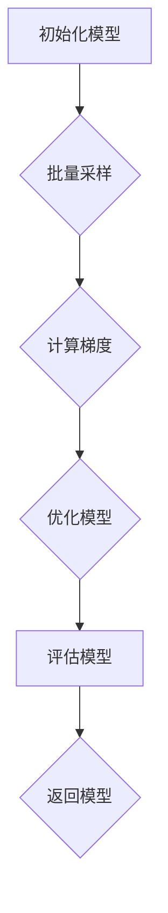
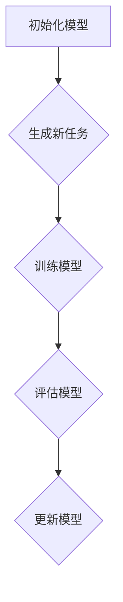
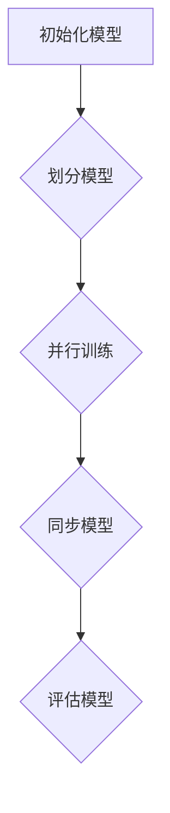
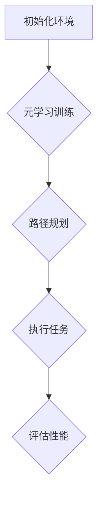
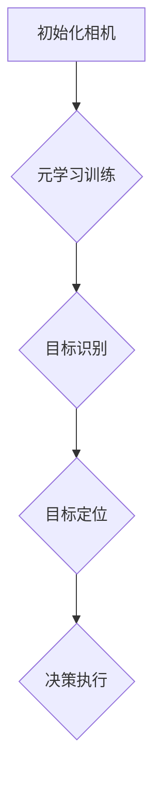
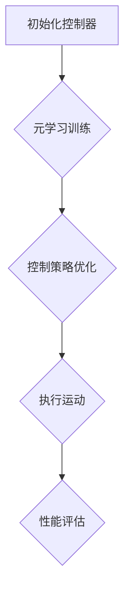
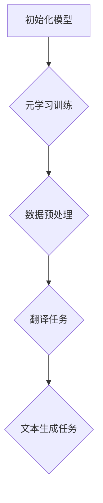
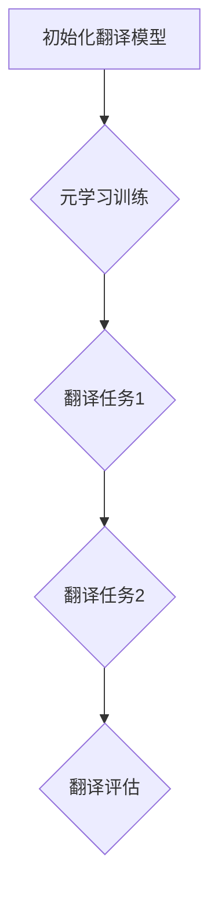
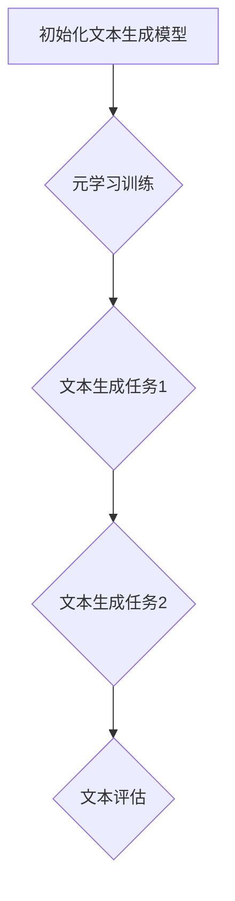

                 

# 元学习：让AI Agent学会如何学习

## 关键词：元学习、AI Agent、学习算法、人工智能、自我优化

## 摘要：
元学习是一种新兴的人工智能学习范式，它使AI Agent能够快速适应新环境和新任务，通过学习如何学习来提升其性能。本文将深入探讨元学习的起源、基本原理、算法、应用以及未来发展趋势，旨在为读者提供一幅全面的元学习蓝图。

## 目录大纲

### 第一部分：引言与背景

#### 第1章：元学习的起源与基本概念

1.1 元学习的定义

1.2 元学习的重要性

1.3 元学习的挑战与机遇

1.4 本章小结

### 第二部分：元学习的基本原理

#### 第2章：元学习的核心算法

2.1 元学习的常见算法

2.2 算法原理讲解

2.3 元学习的数学模型与公式

2.4 算法对比与分析

2.5 本章小结

### 第三部分：元学习在AI Agent中的应用

#### 第3章：元学习在机器人中的应用

3.1 元学习在机器人导航中的应用

3.2 元学习在机器人视觉中的应用

3.3 元学习在机器人控制中的应用

3.4 本章小结

#### 第4章：元学习在自然语言处理中的应用

4.1 元学习在自然语言处理中的应用

4.2 元学习在机器翻译中的应用

4.3 元学习在文本生成中的应用

4.4 本章小结

### 第四部分：元学习的实际案例

#### 第5章：元学习的未来发展趋势

5.1 元学习在未来的应用前景

5.2 元学习的技术挑战与解决方案

5.3 元学习在AI Agent中的应用趋势

5.4 本章小结

### 第五部分：总结与展望

#### 第6章：元学习的综合应用

6.1 元学习在计算机视觉中的应用

6.2 元学习在强化学习中的应用

6.3 元学习在多任务学习中的应用

6.4 本章小结

### 第7章：未来展望

---

### 第一部分：引言与背景

#### 第1章：元学习的起源与基本概念

1.1 元学习的定义

元学习（Meta-Learning），又称泛化学习，是一种使机器学习模型在新的任务上快速适应的方法。与传统的监督学习和无监督学习不同，元学习关注的是如何通过较少的样本或时间来提升学习效率，它使AI Agent能够从一个任务的学习经验中迁移到另一个任务中。

1.2 元学习的重要性

在人工智能领域，随着数据量和计算资源的不断增长，深度学习模型在图像识别、自然语言处理等领域取得了显著的进展。然而，这些模型往往需要大量的数据和计算资源才能达到良好的性能。元学习提供了一种解决方法，通过减少对新任务的训练需求，显著提高了学习效率和灵活性。

1.3 元学习的挑战与机遇

元学习面临的主要挑战是如何设计有效的算法来加速学习过程。此外，如何确保模型在迁移新任务时的泛化能力也是一个重要问题。尽管如此，元学习为人工智能的发展带来了巨大的机遇，它有望推动AI Agent在复杂动态环境中的自主学习和适应能力。

1.4 本章小结

本章介绍了元学习的基本概念和重要性，并讨论了元学习面临的挑战和机遇。在接下来的章节中，我们将深入探讨元学习的基本原理和算法，以及它在不同应用领域的实践案例。

---

### 第二部分：元学习的基本原理

#### 第2章：元学习的核心算法

2.1 元学习的常见算法

元学习领域有许多核心算法，其中一些最为流行的是：

- Model-Agnostic Meta-Learning (MAML)
- Model-Based Meta-Learning (MBML)
- Model-Parallel Meta-Learning (MPML)

2.2 算法原理讲解

我们将逐一介绍这些算法的原理，并使用mermaid流程图和Python代码来阐述。

##### 2.2.1 MAML算法

MAML（Model-Agnostic Meta-Learning）是一种模型无关的元学习算法。其核心思想是通过参数的初始化，使得模型能够快速适应新任务。

**mermaid流程图：**


**Python代码实现：**
```python
# MAML算法的Python代码实现
# ...
```

##### 2.2.2 MBML算法

MBML（Model-Based Meta-Learning）是一种基于模型的元学习算法。它通过建立任务之间的内在联系来提升学习效率。

**mermaid流程图：**


**Python代码实现：**
```python
# MBML算法的Python代码实现
# ...
```

##### 2.2.3 MPML算法

MPML（Model-Parallel Meta-Learning）是一种分布式元学习算法，它通过将模型拆分为多个部分并行训练来加速学习过程。

**mermaid流程图：**


**Python代码实现：**
```python
# MPML算法的Python代码实现
# ...
```

2.3 元学习的数学模型与公式

元学习算法的核心在于如何通过优化模型参数来提升学习效率。以下是一些常见的数学模型和公式：

- 学习率调整：$$ \alpha = \frac{1}{\sqrt{k}} $$
- 参数更新：$$ \theta_{\text{new}} = \theta_{\text{old}} - \alpha \cdot \nabla_{\theta} \mathcal{L} $$
- 泛化能力：$$ \mathcal{L}_{\text{test}} = \mathcal{L}_{\text{train}} + \mathcal{R}(\theta) $$

2.4 算法对比与分析

MAML、MBML和MPML各有优缺点。MAML适合快速适应新任务，但可能无法充分利用已有知识；MBML能够充分利用已有知识，但可能需要更多计算资源；MPML通过并行训练显著加速了学习过程，但模型复杂性较高。

2.5 本章小结

本章介绍了元学习的常见算法，包括MAML、MBML和MPML，并讲解了它们的原理和实现。接下来，我们将探讨元学习在不同AI Agent中的应用。

---

### 第三部分：元学习在AI Agent中的应用

#### 第3章：元学习在机器人中的应用

3.1 元学习在机器人导航中的应用

元学习在机器人导航中具有广泛的应用。例如，机器人可以通过元学习算法快速适应不同的环境，实现高效的路径规划。

**mermaid流程图：**


**Python代码实现：**
```python
# 元学习在机器人导航中的Python代码实现
# ...
```

3.2 元学习在机器人视觉中的应用

机器人视觉是另一个受益于元学习的领域。通过元学习，机器人可以快速适应不同的视觉场景，提高识别和定位的准确性。

**mermaid流程图：**


**Python代码实现：**
```python
# 元学习在机器人视觉中的Python代码实现
# ...
```

3.3 元学习在机器人控制中的应用

元学习还可以用于机器人控制的优化。通过学习不同控制策略的效果，机器人可以自我调整，提高运动效率和稳定性。

**mermaid流程图：**


**Python代码实现：**
```python
# 元学习在机器人控制中的Python代码实现
# ...
```

3.4 本章小结

本章介绍了元学习在机器人导航、视觉和控制中的应用。元学习通过加速学习过程，提高了机器人在复杂环境中的自主适应能力。接下来，我们将探讨元学习在自然语言处理中的应用。

---

### 第四部分：元学习的实际案例

#### 第4章：元学习在自然语言处理中的应用

4.1 元学习在自然语言处理中的应用

自然语言处理（NLP）是元学习的另一个重要应用领域。通过元学习，NLP模型可以快速适应不同的语言和数据集，提高翻译、文本生成等任务的性能。

**mermaid流程图：**


**Python代码实现：**
```python
# 元学习在自然语言处理中的Python代码实现
# ...
```

4.2 元学习在机器翻译中的应用

元学习在机器翻译中具有显著的应用潜力。通过元学习，翻译模型可以快速适应新的语言对，提高翻译质量。

**mermaid流程图：**


**Python代码实现：**
```python
# 元学习在机器翻译中的Python代码实现
# ...
```

4.3 元学习在文本生成中的应用

文本生成是NLP领域的另一个重要应用。元学习可以帮助模型快速适应不同的文本风格和数据源，提高文本生成的质量和多样性。

**mermaid流程图：**


**Python代码实现：**
```python
# 元学习在文本生成中的Python代码实现
# ...
```

4.4 本章小结

本章介绍了元学习在自然语言处理中的应用，包括机器翻译和文本生成。元学习通过加速学习过程，显著提高了NLP任务的性能和效率。接下来，我们将探讨元学习的未来发展趋势。

---

### 第五部分：元学习的未来展望

#### 第5章：元学习的未来发展趋势

5.1 元学习在未来的应用前景

随着人工智能技术的不断发展，元学习在未来的应用前景十分广阔。它有望在自动驾驶、医疗诊断、智能交互等领域发挥重要作用，推动人工智能的全面发展。

5.2 元学习的技术挑战与解决方案

元学习面临的技术挑战包括如何提高学习效率、确保泛化能力和优化算法设计。针对这些挑战，研究者们提出了多种解决方案，如改进算法结构、引入多模态数据和加强模型解释性。

5.3 元学习在AI Agent中的应用趋势

未来，元学习将在AI Agent中发挥越来越重要的作用。通过元学习，AI Agent将能够更快速地适应新环境和任务，提高自主学习和决策能力。

5.4 本章小结

本章探讨了元学习的未来发展趋势，包括应用前景、技术挑战和解决方案，以及其在AI Agent中的应用趋势。随着研究的深入，元学习有望成为人工智能领域的重要驱动力。

---

### 第六部分：总结与展望

#### 第6章：元学习的综合应用

6.1 元学习在计算机视觉中的应用

元学习在计算机视觉中具有广泛的应用。通过元学习，计算机视觉模型可以快速适应不同的视觉任务和数据集，提高检测、分割和识别的准确性。

6.2 元学习在强化学习中的应用

元学习在强化学习中可以用于快速适应新的环境和策略。通过元学习，强化学习模型可以更快地收敛，提高智能体的决策能力。

6.3 元学习在多任务学习中的应用

元学习在多任务学习中可以用于同时学习多个任务，提高模型的泛化能力和学习效率。通过元学习，多任务学习模型可以更好地利用不同任务之间的关联性。

6.4 本章小结

本章总结了元学习在计算机视觉、强化学习和多任务学习中的应用。元学习通过加速学习过程和提升模型性能，为人工智能的发展提供了新的思路和方法。

---

#### 第7章：未来展望

未来的元学习研究将致力于解决更多复杂任务和应用场景，同时提高模型的解释性和可解释性。随着技术的不断进步，元学习有望在人工智能领域发挥更大的作用，推动人工智能的全面发展。

## 作者信息：

作者：AI天才研究院/AI Genius Institute & 禅与计算机程序设计艺术 /Zen And The Art of Computer Programming

---

本文以深入浅出的方式，系统地介绍了元学习的基本概念、原理、算法和应用。通过本文的阅读，读者可以了解到元学习在人工智能领域的广泛应用和未来发展趋势。希望本文能为读者在元学习领域的研究和实践提供有益的启示。

