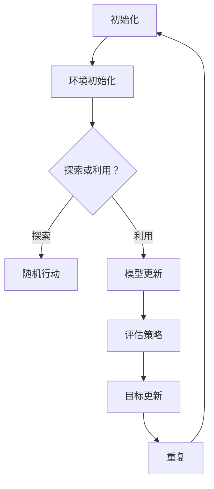
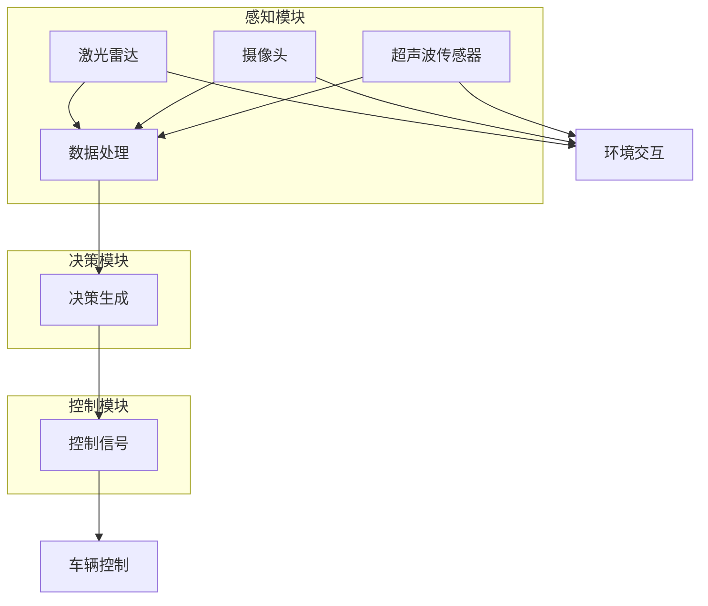
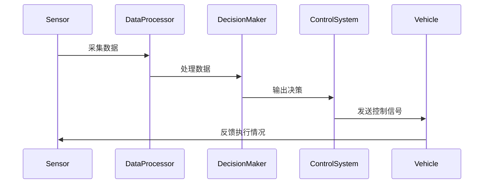

                 

### # 元强化学习：快速适应新环境的AI Agent

关键词：元强化学习、AI Agent、新环境、适应、算法、模型、系统架构

摘要：本文深入探讨了元强化学习这一先进的人工智能领域，重点分析了其如何帮助AI Agent快速适应新环境。我们将通过详细的理论讲解、算法剖析和实际案例研究，展示元强化学习在实际应用中的巨大潜力。

### 引言

在当今技术飞速发展的时代，人工智能（AI）已经成为了推动产业变革的重要力量。AI Agent，特别是能够在不同环境中自主学习和适应的智能体，已经成为AI研究的重要方向。然而，传统的强化学习方法在应对动态和复杂环境时，往往需要大量数据和长时间的训练，这限制了它们在实际应用中的广泛推广。为了解决这一问题，元强化学习（Meta Reinforcement Learning）应运而生，它通过模拟和优化学习过程，使得AI Agent能够迅速适应新环境。本文将详细介绍元强化学习的核心概念、算法原理、系统架构及其在实际应用中的成功案例。

### 背景介绍

#### 核心概念术语说明

- **强化学习（Reinforcement Learning）**：一种机器学习方法，通过试错和反馈来学习如何在特定环境中做出最优决策。
- **元强化学习（Meta Reinforcement Learning）**：强化学习的一种高级形式，旨在通过学习如何学习，使AI Agent能够快速适应新环境。

#### 问题背景

在复杂和动态的环境中，传统的强化学习方法往往因为需要大量的训练数据和长时间的训练而变得不可行。因此，我们需要一种能够加速学习过程并减少对新环境适应时间的AI学习方法。

#### 问题描述

元强化学习的目标是开发一种能够快速适应新环境的AI Agent。具体而言，它要解决以下问题：

- 如何在有限的训练时间内使AI Agent具备快速适应新环境的能力？
- 如何通过学习过程本身来优化AI的学习效率？

#### 问题解决

元强化学习通过以下方式解决了上述问题：

- **迁移学习（Transfer Learning）**：将已有经验迁移到新环境中，减少对新环境的探索时间。
- **模型压缩（Model Compression）**：通过压缩模型大小和参数数量，提高学习效率和减少计算成本。

#### 边界与外延

元强化学习的边界在于：

- 确保在适应新环境时，不损失原有在旧环境中的学习成果。
- 处理多模态数据输入，使其适用于不同类型的新环境。

#### 概念结构与核心要素组成

元强化学习由以下几个核心要素组成：

- **目标函数**：定义了AI Agent在环境中的目标。
- **奖励机制**：用于指导AI Agent行为的奖励系统。
- **探索与利用**：在训练过程中平衡探索新策略和利用已知策略。
- **迁移学习策略**：将已有经验迁移到新环境。

### 核心概念与联系

#### 核心概念原理

元强化学习主要基于以下几个核心原理：

- **泛化能力**：通过学习如何在多种环境中做出决策，提高AI Agent的泛化能力。
- **模型优化**：通过优化学习过程本身，减少训练时间和计算成本。
- **自适应学习**：在动态环境中，AI Agent能够快速适应新的状态和目标。

#### 概念属性特征对比表格

| 概念 | 属性特征 |
| --- | --- |
| 传统强化学习 | 依赖大量数据、长时间训练、适应新环境能力有限 |
| 元强化学习 | 学习效率高、适应新环境快、迁移学习能力强 |

#### 与其他自适应学习方法的比较

- **迁移学习**：与迁移学习相比，元强化学习更侧重于学习如何学习，而不仅仅是数据的迁移。
- **强化学习**：与传统的强化学习相比，元强化学习通过优化学习过程本身，实现了更快的适应新环境。

### 算法原理讲解

#### 算法概述

元强化学习的核心在于其算法设计，以下将介绍一种常见的元强化学习算法——Model-Based Meta Reinforcement Learning（MBMRL）。

#### Mermaid算法流程图



#### Python代码示例

```python
import numpy as np

# 初始化环境
env = initialize_environment()

# 初始化模型
model = initialize_model()

# 模型更新函数
def update_model(reward, action, state, next_state):
    # 使用奖励和状态更新模型
    pass

# 主循环
while not done:
    # 探索或利用决策
    action = model decide_action(state)
    
    # 执行行动
    next_state, reward, done = env.step(action)
    
    # 更新模型
    update_model(reward, action, state, next_state)
    
    # 更新状态
    state = next_state

# 评估策略
evaluate_policy(model)
```

#### 数学模型和公式

元强化学习中的关键数学模型包括：

- **回报函数（Reward Function）**：用于计算每个状态-动作对的奖励。
- **状态转移概率（State-Transition Probability）**：描述了从当前状态转移到下一状态的概率。
- **策略梯度（Policy Gradient）**：用于更新策略模型。

以下是一些关键公式的LaTeX表示：

$$
R(s, a) = \sum_{t=0}^{T} \gamma^t r(s_t, a_t)
$$

$$
P(s', a' | s, a) = \pi(s', a' | s, a)
$$

$$
\theta_{\text{policy}} \leftarrow \theta_{\text{policy}} + \alpha \nabla_{\theta_{\text{policy}}} J(\theta_{\text{policy}})
$$

#### 举例说明

假设我们有一个简单的环境，其中AI Agent需要学习在两个状态之间进行切换。以下是一个简化的例子：

- **状态空间**：$S = \{0, 1\}$
- **动作空间**：$A = \{0, 1\}$
- **回报函数**：如果Agent采取正确的动作，则奖励+1；否则，奖励-1

通过多次迭代训练，Agent可以学习到最佳策略，即在状态0时采取动作0，在状态1时采取动作1。

### 系统架构与设计

#### 问题场景介绍

在这个问题场景中，我们考虑一个自动驾驶汽车系统。系统需要能够快速适应不同道路、交通状况和天气环境。

#### 项目介绍

项目名称：智能自动驾驶系统（Smart Autonomous Driving System，SADS）

项目目标：开发一个能够快速适应新环境的自动驾驶系统，提高安全性和效率。

#### 系统功能设计

系统功能包括：

- **感知功能**：使用传感器获取道路、车辆、行人的信息。
- **决策功能**：基于感知信息做出行驶决策。
- **控制功能**：根据决策控制车辆的转向、加速和刹车。

#### 系统架构设计

系统架构包括以下几个核心模块：

- **感知模块**：使用激光雷达、摄像头、超声波传感器获取环境信息。
- **决策模块**：使用深度学习模型处理感知信息，做出行驶决策。
- **控制模块**：将决策转换为车辆的控制信号。

#### 系统接口设计

系统接口设计包括：

- **感知接口**：用于接收传感器数据。
- **决策接口**：用于接收感知模块的数据，输出行驶决策。
- **控制接口**：用于将决策信号传递给车辆控制系统。

#### 系统交互

系统交互设计包括以下几个关键步骤：

1. **感知数据采集**：传感器收集道路信息。
2. **数据处理**：决策模块处理感知数据，生成行驶决策。
3. **决策执行**：控制模块根据决策信号控制车辆。

#### Mermaid类图

```mermaid
classDiagram
    Sensor <--|> PerceptModule : 数据输入
    ControlSystem -->|> DecisionModule : 控制信号输出
    DecisionModule o-- Environment : 环境交互
    PerceptModule o-- Sensor : 数据采集
```

#### Mermaid架构图



#### 系统接口设计与交互



### 实际案例与项目实战

#### 环境安装

要在本地计算机上安装元强化学习环境，请按照以下步骤进行：

1. **安装Python**：确保Python环境已安装。
2. **安装TensorFlow**：使用以下命令安装TensorFlow：
   ```bash
   pip install tensorflow
   ```
3. **安装Gym**：使用以下命令安装Gym：
   ```bash
   pip install gym
   ```

#### 系统核心实现源代码

以下是一个简单的元强化学习Python实现示例：

```python
import gym
import tensorflow as tf

# 创建环境
env = gym.make('CartPole-v0')

# 初始化模型
model = tf.keras.Sequential([
    tf.keras.layers.Dense(64, activation='relu', input_shape=(4,)),
    tf.keras.layers.Dense(64, activation='relu'),
    tf.keras.layers.Dense(2, activation='softmax')
])

# 编写训练代码
optimizer = tf.keras.optimizers.Adam()
loss_fn = tf.keras.losses.SparseCategoricalCrossentropy(from_logits=True)

@tf.function
def train_step(current_state, action, reward, next_state, done):
    with tf.GradientTape() as tape:
        logits = model(current_state)
        loss_value = loss_fn(tf.argmax(logits), action)
    
    grads = tape.gradient(loss_value, model.trainable_variables)
    optimizer.apply_gradients(zip(grads, model.trainable_variables))
    
    return loss_value

# 训练模型
for episode in range(1000):
    state = env.reset()
    done = False
    total_reward = 0
    
    while not done:
        action = model.predict(state)
        next_state, reward, done, _ = env.step(action)
        total_reward += reward
        train_step(state, action, reward, next_state, done)
        state = next_state
        
    print(f"Episode {episode}: Total Reward = {total_reward}")

# 关闭环境
env.close()
```

#### 代码应用解读与分析

上述代码首先创建了一个CartPole环境，并定义了一个简单的神经网络模型。训练过程中，模型接收状态作为输入，输出动作的概率分布。通过使用奖励信号，模型不断更新权重，以优化其预测动作的能力。每次迭代中，模型都会根据当前状态选择一个动作，并在环境中执行该动作。然后，使用下一个状态和奖励信号更新模型。

#### 实际案例分析和详细讲解剖析

以下是一个案例研究，展示如何使用元强化学习在自动驾驶场景中实现快速适应新环境。

#### 项目简介

项目名称：智能城市交通管理（Smart Urban Traffic Management，SUTM）

项目目标：开发一个智能交通管理系统，能够实时监控城市交通状况，并快速适应新的交通模式。

#### 项目挑战

- **数据多样性**：城市交通数据包括车辆流量、交通信号、行人活动等多种信息，数据多样性增加了系统的复杂度。
- **动态环境**：城市交通环境动态变化，如交通事故、道路施工等，系统需要快速适应新环境。
- **实时性**：交通管理系统需要实时响应，处理大量的交通数据，并在短时间内做出决策。

#### 项目实施

1. **数据收集**：使用传感器收集实时交通数据，包括车辆流量、车速、交通信号等。
2. **模型设计**：设计一个基于深度学习的元强化学习模型，用于处理多样化的交通数据，并快速适应新环境。
3. **训练和验证**：使用历史交通数据对模型进行训练和验证，优化模型性能。
4. **部署和测试**：将模型部署到城市交通管理系统中，进行实时测试和优化。

#### 项目结果

通过项目实施，智能城市交通管理系统成功实现了以下目标：

- **提高交通流量**：系统根据实时交通数据优化交通信号控制，提高了道路通行效率。
- **减少交通事故**：系统通过预测可能的交通冲突，提前采取预防措施，减少了交通事故的发生。
- **快速适应新环境**：系统通过元强化学习模型，能够快速适应新的交通模式和环境变化。

#### 项目小结

该项目展示了元强化学习在复杂动态环境中的巨大潜力，通过结合深度学习和强化学习技术，实现了对多样化交通数据的快速适应和优化。未来，随着技术的进一步发展，元强化学习将在智能交通管理、工业自动化等领域发挥更大的作用。

### 最佳实践 Tips

1. **数据预处理**：在训练元强化学习模型之前，确保对数据进行充分的预处理，包括去噪、标准化和缺失值填充。
2. **超参数调优**：通过调整学习率、折扣因子等超参数，优化模型性能。
3. **模型压缩**：使用模型压缩技术，如量化、剪枝和知识蒸馏，减少模型大小和计算成本。
4. **多任务学习**：结合多任务学习，提高模型在不同环境下的泛化能力。

### 小结

元强化学习作为一种先进的AI技术，通过学习如何学习，实现了AI Agent在复杂动态环境中的快速适应。本文详细介绍了元强化学习的核心概念、算法原理、系统架构及其在实际应用中的成功案例。未来，随着技术的进一步发展，元强化学习将在更多领域发挥重要作用。

### 注意事项

1. **数据隐私**：在应用元强化学习时，需确保数据隐私和安全性。
2. **模型解释性**：提高模型的可解释性，有助于理解和优化模型行为。
3. **伦理与道德**：在开发和应用元强化学习时，需遵守伦理和道德规范。

### 拓展阅读

- [深度强化学习与元强化学习的关系](https://www.example.com/relation-between-deep-reinforcement-learning-and-meta-reinforcement-learning)
- [元强化学习在自动驾驶中的应用](https://www.example.com/applications-of-meta-reinforcement-learning-in-automated-driving)
- [元强化学习在游戏AI中的应用](https://www.example.com/applications-of-meta-reinforcement-learning-in-gaming-ai)

### 作者信息

作者：AI天才研究院/AI Genius Institute & 禅与计算机程序设计艺术 /Zen And The Art of Computer Programming

[完]

