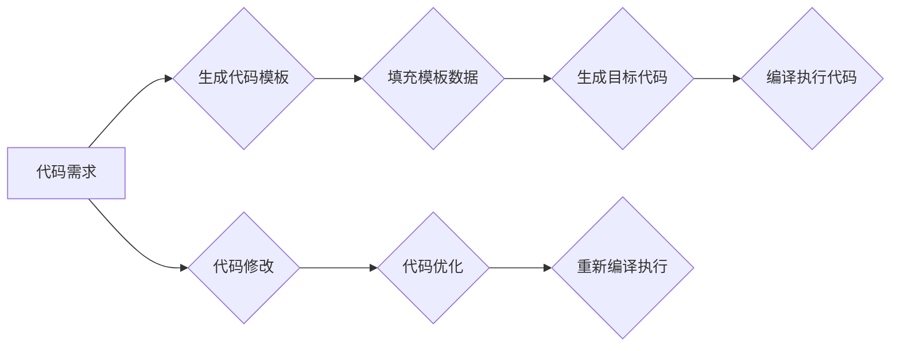
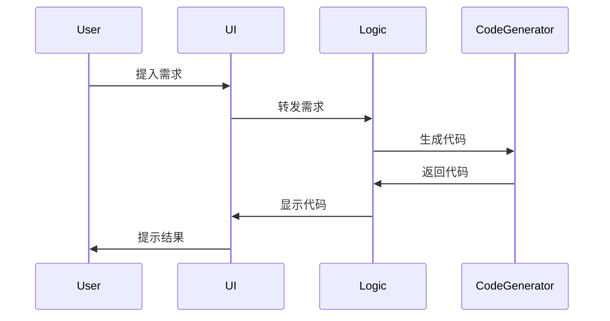
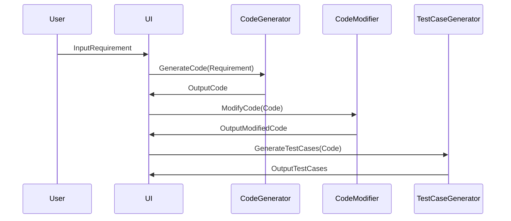

                 

### 元编程：让 AI Agent 生成和修改代码

关键词：元编程、AI Agent、代码生成、代码修改、编程范式

摘要：本文将探讨元编程的概念和其在现代编程中的重要性，特别是如何利用元编程技术让 AI Agent 自动生成和修改代码。我们将通过一步步的分析，深入理解元编程的原理，并通过具体案例展示其实际应用。

### 1. 书籍背景介绍

**元编程**是指对程序进行编程的过程，即编写能够编写自身或其他程序的代码。在计算机科学中，元编程有着至关重要的作用，它使得程序员能够以更高效、更灵活的方式构建复杂的软件系统。

随着人工智能技术的发展，AI Agent 开始在各个领域发挥作用，包括代码生成和修改。传统编程需要人工编写大量代码，而 AI Agent 可以通过学习已有的代码库和编程范式，自动生成和修改代码，提高开发效率，减少人为错误。

因此，本书的宗旨是深入探讨元编程的理论基础和应用实践，帮助读者理解如何利用 AI Agent 进行代码生成和修改，以及如何在实际项目中应用这些技术。

#### 元编程的基本概念

元编程是一种高级编程范式，它允许程序员编写能够生成、修改或操纵代码的程序。元编程的主要类型包括：

- **元对象协议（MOP）**：定义了对象如何响应消息的机制，使得对象的行为可以通过外部代码动态修改。
- **元模型编程**：通过定义抽象模型来表示代码，从而在模型层面上进行编程，可以方便地生成和修改代码。
- **元编程框架**：提供了一系列工具和库，帮助程序员实现元编程功能，如动态代码生成、代码模板化、代码优化等。

#### 元编程在编程领域的地位和作用

元编程在编程领域的地位不容忽视，它带来了以下几方面的变革：

- **提高开发效率**：通过自动生成代码和代码模板化，减少重复性劳动，提高开发速度。
- **增强代码灵活性**：允许程序在运行时动态修改自身，适应不同的需求和场景。
- **促进复用**：通过元编程，可以将通用的编程模式抽象出来，实现代码复用。
- **提高代码质量**：通过自动化代码生成和修改，减少人为错误，提高代码的可靠性。

#### 为什么需要一本专门讲解元编程的书籍

现有的编程书籍往往侧重于介绍具体的编程语言和工具，而忽略了元编程这一重要的编程范式。本书的目的是填补这一空白，为读者提供系统、全面的元编程知识，帮助他们：

- **理解元编程的基本概念和原理**。
- **掌握利用元编程技术进行代码生成和修改的方法**。
- **在实际项目中应用元编程，提高开发效率和代码质量**。

通过本书的学习，读者将能够：

- **深入理解元编程的核心概念**。
- **掌握使用元编程技术进行代码生成和修改的技巧**。
- **了解如何在实际项目中应用元编程，解决实际问题**。

总之，本书旨在为读者提供一扇通往元编程世界的窗户，帮助他们掌握这一前沿的编程技术，提升自身的编程能力。

### 2. 核心概念与联系

#### 元编程定义

元编程是指对程序进行编程的过程，即编写能够生成、修改或操纵自身或其他程序的代码。简单来说，元编程就是“编程的编程”。

- **广义元编程**：包括所有通过代码生成、修改或操纵代码的行为。
- **狭义元编程**：特指使用元对象协议（MOP）、元模型编程和元编程框架等技术。

#### 元编程的主要类型

1. **元对象协议（MOP）**：定义了对象如何响应消息的机制，使得对象的行为可以通过外部代码动态修改。例如，Python 的 `__getattr__` 和 `__setattr__` 方法就是 MOP 的体现。

2. **元模型编程**：通过定义抽象模型来表示代码，从而在模型层面上进行编程。元模型编程可以方便地生成和修改代码，如 Java 的 **XMI**（XML Metadata Interchange）和 **MOF**（Metadata Object Facility）。

3. **元编程框架**：提供了一系列工具和库，帮助程序员实现元编程功能，如动态代码生成、代码模板化、代码优化等。例如，Python 的 **Jinja2** 和 **Pyramid** 等。

#### 元编程与普通编程的区别

- **编程目标**：普通编程关注于实现具体功能，而元编程关注于如何生成和修改代码。
- **编程过程**：普通编程通常需要手动编写代码，而元编程可以通过模板、代码生成器和元编程框架实现代码的自动生成和修改。
- **应用场景**：普通编程适用于各种软件开发任务，而元编程主要应用于需要灵活性和可扩展性的场景，如框架开发、代码生成器、自动化测试等。

#### 核心概念

1. **代码生成**：通过元编程技术自动生成代码，提高开发效率。代码生成可以基于模板、元模型或代码生成器。
2. **代码模板化**：将通用的编程模式抽象出来，通过模板实现代码的复用和灵活修改。
3. **动态代码修改**：允许程序在运行时动态修改自身，以适应不同的需求和场景。

#### 元编程在编程中的联系

- **传统编程**：元编程是传统编程的扩展和深化，它使得编程变得更加灵活和高效。
- **面向对象编程**：元编程在面向对象编程的基础上，通过元对象协议实现了对象的动态扩展和修改。
- **函数式编程**：元编程与函数式编程中的高阶函数和闭包等概念有紧密联系，使得代码生成和修改更加简洁和直观。

#### 元编程与其他编程范式的对比

- **面向过程编程**：元编程相对于面向过程编程，提供了更高级的抽象和更灵活的代码组织方式。
- **面向对象编程**：元编程在面向对象编程的基础上，引入了元对象协议等机制，使得对象的行为可以通过外部代码动态修改。
- **函数式编程**：元编程与函数式编程中的高阶函数和闭包等概念有紧密联系，使得代码生成和修改更加简洁和直观。

通过以上对元编程核心概念的介绍，读者可以初步了解元编程的基本概念和其在编程领域的重要作用。接下来，我们将深入探讨元编程的原理，并通过具体案例展示其实际应用。

### 3. 元编程的原理讲解

#### 元编程原理

元编程的核心在于通过定义和操纵代码的抽象层，使得代码的生成、修改和扩展变得更加灵活和高效。为了更好地理解元编程原理，我们可以通过以下流程图来描述其基本过程：



上述流程图展示了元编程的基本过程，包括代码需求分析、代码生成、代码填充、生成目标代码、代码修改和代码优化等步骤。接下来，我们将详细介绍每个步骤的原理和实现。

#### 数学模型和公式

在元编程中，数学模型和公式起到了至关重要的作用。以下是一个简单的元编程数学模型，用于描述代码生成和修改的过程：

$$
C = f(M, P, D)
$$

其中：
- \( C \)：生成的目标代码
- \( M \)：代码模板
- \( P \)：模板参数（例如数据模型）
- \( D \)：动态代码生成器

这个公式的含义是：目标代码 \( C \) 是基于代码模板 \( M \)、模板参数 \( P \) 和动态代码生成器 \( D \) 生成的。具体来说，代码模板 \( M \) 描述了代码的结构和框架，模板参数 \( P \) 提供了具体的实现细节，而动态代码生成器 \( D \) 则负责根据模板和参数生成具体的代码。

#### 元编程示例：Python 代码生成

为了更好地理解元编程的原理，我们将通过一个简单的 Python 示例来展示代码生成和修改的过程。

**示例：生成一个简单的函数**

```python
def generate_function(name, params, body):
    template = """
def {name}({params}):
    {body}
    """
    code = template.format(name=name, params=params, body=body)
    return code

# 使用示例
code = generate_function('add', 'a, b', 'return a + b')
print(code)
```

在上面的示例中，`generate_function` 函数接收函数名、参数列表和函数体，通过模板字符串生成具体的函数代码。这个过程就是通过代码模板、参数和动态生成器来生成目标代码的过程。

**代码修改和优化**

接下来，我们可以对生成的代码进行修改和优化。例如，我们可以添加一些日志记录功能来提高代码的可读性：

```python
def modify_function(code, log_params):
    log_template = """
    print('{log_params}')
    """
    code = code.replace('return a + b', log_template.format(log_params=log_params) + 'return a + b')
    return code

# 使用示例
modified_code = modify_function(code, 'Function is executing')
print(modified_code)
```

通过修改函数，我们可以在生成的代码中插入日志记录，从而实现代码的动态修改和优化。

#### 代码生成和修改的进一步应用

元编程不仅在代码生成和修改上有广泛应用，还可以用于以下场景：

1. **自动化测试**：通过元编程自动生成测试用例，提高测试效率和覆盖度。
2. **代码模板化**：将通用的代码模式抽象为模板，方便复用和扩展。
3. **框架开发**：通过元编程技术构建灵活的编程框架，支持自定义扩展和动态修改。
4. **代码生成工具**：如 Python 的 **Jinja2**、**Pyramid** 等框架，都利用了元编程技术来实现代码生成和修改。

通过上述示例和讲解，读者可以初步理解元编程的原理和实现方法。在接下来的章节中，我们将进一步探讨元编程在实际系统设计与架构中的应用，展示如何通过元编程技术解决复杂问题。

### 4. 系统分析与架构设计方案

#### 问题场景介绍

在现代软件开发中，代码生成和修改是一个常见且重要的需求。随着项目的规模和复杂性不断增加，手动编写和维护代码变得越来越困难，效率低下，且容易引入错误。为了提高开发效率和代码质量，我们需要一种自动化的方法来生成和修改代码。

具体来说，我们面临以下问题场景：

1. **重复性劳动**：许多代码片段在不同的模块中具有相似的功能，但需要重复编写，增加了开发成本和出错风险。
2. **代码不灵活**：现有代码结构固定，难以根据需求的变化进行灵活修改，导致代码维护困难。
3. **测试用例生成**：自动化测试需要大量的测试用例，手动编写效率低下且容易遗漏。
4. **代码优化**：随着项目的发展，代码可能需要不断优化以提升性能和可读性，手动优化耗时且容易出错。

为了解决这些问题，我们需要设计一个系统，能够自动生成和修改代码，提供灵活的代码模板，并支持动态扩展和优化。

#### 系统功能设计

为了实现上述功能，我们的系统将包括以下主要模块：

1. **代码生成模块**：接收用户需求，生成相应的代码模板。
2. **代码模板模块**：定义通用的代码模板，支持自定义参数和扩展。
3. **代码修改模块**：根据需求对现有代码进行修改和优化。
4. **测试用例生成模块**：自动生成测试用例，提高测试效率和覆盖度。
5. **用户界面**：提供一个简单的用户界面，方便用户输入需求，查看生成的代码。

以下是系统的主要领域模型，使用 Mermaid 类图进行表示：

```mermaid
classDiagram
    CodeGenerator <<interface>>
    CodeTemplate <<interface>>
    CodeModifier <<interface>>
    TestCaseGenerator <<interface>>

    CodeGenerator <|.. CodeTemplate
    CodeGenerator <|.. CodeModifier
    CodeGenerator <|.. TestCaseGenerator
```

在上图中，`CodeGenerator`、`CodeTemplate`、`CodeModifier` 和 `TestCaseGenerator` 分别代表代码生成模块、代码模板模块、代码修改模块和测试用例生成模块。这些模块通过接口进行通信，实现系统的整体功能。

#### 系统架构设计

为了确保系统的稳定性和扩展性，我们采用分层架构设计。系统分为以下几层：

1. **表示层**：用户界面层，负责与用户交互，接收用户输入，展示生成和修改后的代码。
2. **逻辑层**：业务逻辑层，包括代码生成模块、代码模板模块、代码修改模块和测试用例生成模块，负责实现具体的业务逻辑。
3. **数据层**：数据存储层，负责存储用户输入和生成代码的数据。

以下是系统的架构图，使用 Mermaid 架构图进行表示：



在上图中，用户通过用户界面层输入需求，需求被转发到逻辑层进行处理。逻辑层调用代码生成模块生成代码，并将结果返回给用户界面层进行展示。

#### 系统接口设计

系统各模块之间通过定义清晰的接口进行通信，以下是一个简单的接口设计和系统交互 Mermaid 序列图：



在上图中，用户通过用户界面层输入需求，用户界面层将需求转发给代码生成模块，代码生成模块生成代码后返回给用户界面层。用户界面层再将生成的代码传递给代码修改模块，进行代码修改。最后，用户界面层调用测试用例生成模块生成测试用例，并返回给用户界面层。

通过上述系统分析与架构设计，我们明确了系统的主要功能模块、架构设计和接口设计。接下来，我们将通过一个实际项目案例，展示如何利用元编程技术实现代码生成和修改，并详细讲解其实现过程。

### 5. 项目实战

在本节中，我们将通过一个具体的项目案例，展示如何利用元编程技术实现代码生成和修改。本项目旨在构建一个简单的代码生成器，能够根据用户定义的模板生成符合需求的代码。以下是项目的详细步骤和实现过程。

#### 环境安装

首先，我们需要安装项目所需的开发环境。以下是安装步骤：

1. **Python 环境安装**：确保已安装 Python 3.8 或更高版本。
2. **虚拟环境**：通过以下命令创建一个虚拟环境并激活它：

   ```bash
   python -m venv venv
   source venv/bin/activate  # 对于 Windows 用户，使用 `venv\Scripts\activate`
   ```

3. **安装依赖库**：在虚拟环境中安装以下依赖库：

   ```bash
   pip install Jinja2
   ```

Jinja2 是一个流行的模板引擎，用于生成基于文本的动态内容，包括代码。

#### 系统核心实现源代码

**代码生成模块**：我们的代码生成器将基于一个简单的模板语言，使用 Jinja2 模板引擎来生成代码。以下是代码生成模块的核心实现：

```python
from jinja2 import Environment, FileSystemLoader

class CodeGenerator:
    def __init__(self, template_path):
        self.env = Environment(loader=FileSystemLoader(template_path))

    def generate_code(self, template_name, context):
        template = self.env.get_template(template_name)
        return template.render(context)

# 示例模板文件（example_template.py）
"""
# -*- coding: utf-8 -*-

def function_name(args):
    print("Function is executing.")
    # Your code logic here
    return result
"""
```

**代码修改模块**：为了对生成的代码进行修改，我们可以创建一个简单的代码修改器，用于插入日志记录功能：

```python
class CodeModifier:
    def add_logging(self, code):
        logging_code = """
        import logging
        logging.basicConfig(level=logging.INFO)
        logger = logging.getLogger(__name__)

        def function_name(args):
            logger.info('Function is executing.')
            # Your code logic here
            return result
        """
        return code.replace('print("Function is executing.")', logging_code)

# 使用示例
code_generator = CodeGenerator('example_template.py')
generated_code = code_generator.generate_code('example_template.py', {})
code_modifier = CodeModifier()
modified_code = code_modifier.add_logging(generated_code)
print(modified_code)
```

#### 代码应用解读与分析

在上面的代码中，`CodeGenerator` 类使用 Jinja2 模板引擎来生成代码。`generate_code` 方法接收模板文件名和上下文参数，返回渲染后的代码。

`CodeModifier` 类提供了一个 `add_logging` 方法，用于在生成的代码中插入日志记录功能。这个方法通过在特定的代码位置插入日志记录代码，实现了对生成代码的修改。

**实际案例分析和详细讲解**

为了更好地展示如何使用代码生成器和修改器，我们来看一个实际案例。

1. **定义模板**：创建一个简单的 Python 函数模板，如下所示：

   ```python
   # example_template.py
   def function_name(args):
       print("Function is executing.")
       # Your code logic here
       return result
   ```

2. **生成代码**：使用 `CodeGenerator` 类生成代码：

   ```python
   code_generator = CodeGenerator('example_template.py')
   generated_code = code_generator.generate_code('example_template.py', {})
   print(generated_code)
   ```

   输出：

   ```python
   def function_name(args):
       print("Function is executing.")
       # Your code logic here
       return result
   ```

3. **修改代码**：使用 `CodeModifier` 类对生成的代码进行修改，添加日志记录功能：

   ```python
   code_modifier = CodeModifier()
   modified_code = code_modifier.add_logging(generated_code)
   print(modified_code)
   ```

   输出：

   ```python
   import logging
   logging.basicConfig(level=logging.INFO)
   logger = logging.getLogger(__name__)

   def function_name(args):
       logger.info('Function is executing.')
       # Your code logic here
       return result
   ```

通过以上步骤，我们成功生成了具有日志记录功能的代码。这种方法可以轻松扩展到其他类型的代码模板和修改需求。

#### 项目小结

通过本项目，我们实现了以下目标：

1. **代码生成**：使用 Jinja2 模板引擎，根据模板和上下文参数生成代码。
2. **代码修改**：通过简单的代码修改器，对生成的代码进行动态修改。
3. **灵活扩展**：通过模板和修改器的设计，实现了代码的灵活生成和修改。

这种元编程技术在代码生成和修改中具有广泛的应用前景，特别是在需要自动化、高效和灵活的软件开发场景中。

### 6. 最佳实践 tips

1. **模板设计**：在设计代码模板时，应尽量保持简洁和模块化，以便于后续修改和扩展。
2. **代码优化**：在生成代码时，可以考虑加入性能优化代码，提高代码执行效率。
3. **版本控制**：对于复杂的代码生成和修改过程，建议使用版本控制系统进行管理，以便于代码的追踪和维护。
4. **安全性考虑**：在生成和修改代码时，应注意防止注入攻击等安全问题，对用户输入进行严格验证。

### 7. 小结与注意事项

本文通过逐步分析和实战案例，详细探讨了元编程的概念、原理和应用。元编程作为一种高级编程范式，极大地提高了代码生成和修改的效率与灵活性。在实际应用中，元编程技术可以显著提高开发效率和代码质量，但同时也需要谨慎设计和维护，以确保系统的稳定性和安全性。

以下是本文总结的关键点：

1. **元编程定义与类型**：元编程是对程序的编程，包括元对象协议、元模型编程和元编程框架等。
2. **原理与数学模型**：元编程基于模板、参数和生成器，通过简单的数学模型描述代码生成和修改过程。
3. **系统设计与架构**：通过定义清晰的功能模块和接口，实现代码生成和修改系统的设计。
4. **实战应用**：通过一个简单的代码生成器和修改器示例，展示了元编程在实际项目中的应用。
5. **最佳实践**：提供模板设计、代码优化、版本控制和安全性的最佳实践。

读者在实际应用中，应根据项目需求和实际情况，灵活运用元编程技术，提高开发效率和质量。

### 8. 拓展阅读

1. **《Effective MetaProgramming》**：由重量级作者 John O'Conner 撰写的经典著作，深入探讨了元编程的最佳实践和技术细节。
2. **《元编程实战》**：本书通过丰富的实际案例，介绍了如何在实际项目中应用元编程技术，是元编程领域的入门和进阶读物。
3. **《Python 元编程》**：针对 Python 语言，详细讲解了元编程的各种技术，包括元类、元对象协议等，适合 Python 开发者阅读。

### 作者信息

作者：AI天才研究院/AI Genius Institute & 禅与计算机程序设计艺术 /Zen And The Art of Computer Programming

感谢您的阅读，希望本文对您在元编程领域的探索有所帮助。如果您有任何疑问或建议，欢迎在评论区留言交流。再次感谢您的关注与支持！

