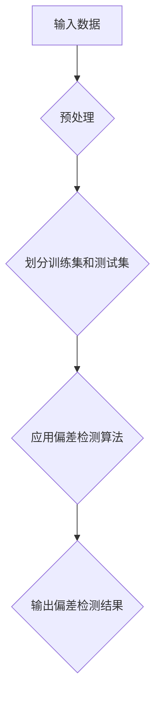
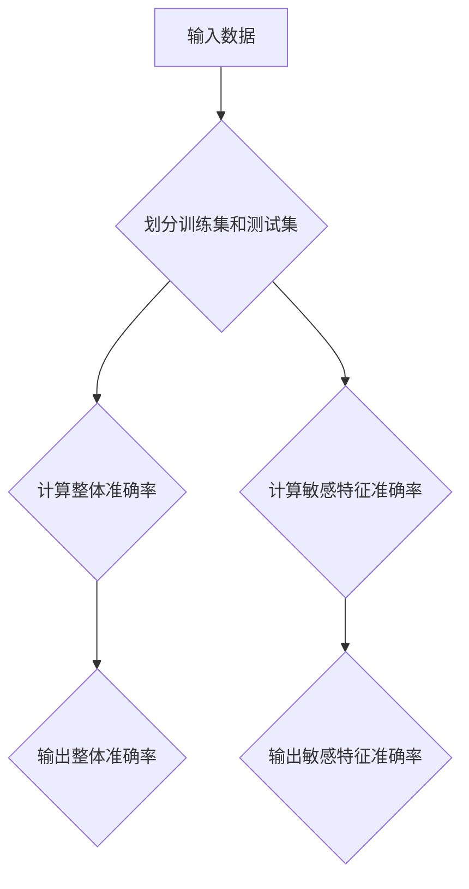
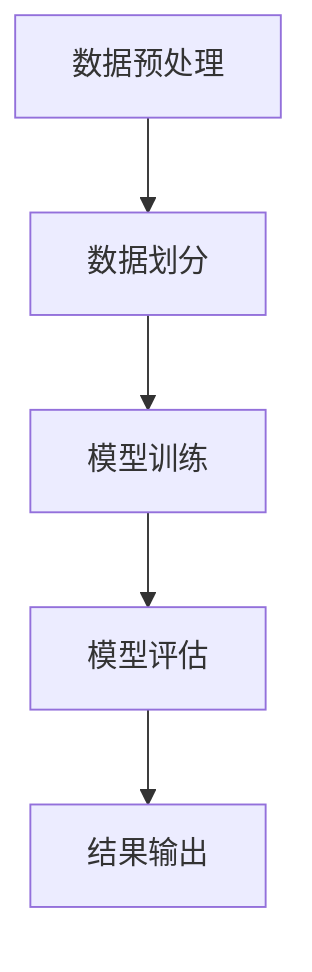
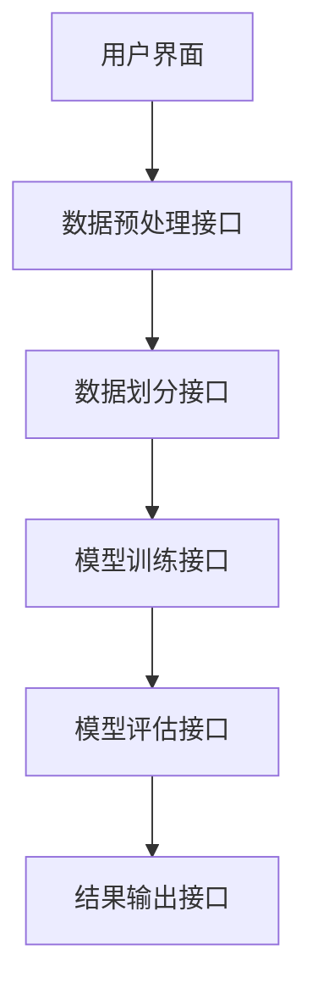

                 

# 公平性评估：确保AI Agent无歧视偏见

> 关键词：公平性评估、AI歧视偏见、算法优化、机器学习

> 摘要：随着人工智能技术的广泛应用，如何确保AI系统的公平性成为一个关键问题。本文将深入探讨公平性评估的起源与重要性，核心概念与联系，以及具体的算法原理讲解，从而为构建无歧视偏见的AI系统提供指导。

## 步骤1：背景介绍与核心概念

### 第1章：公平性评估的起源与重要性

#### 1.1 公平性评估的定义与背景

公平性评估是一种用于检测和分析人工智能系统是否存在歧视偏见的方法。它旨在确保人工智能代理在决策过程中不会对特定群体产生不公平的影响。

公平性评估的定义可以归结为以下几点：

1. **无歧视性**：人工智能系统不应该因为种族、性别、年龄、宗教等因素对某些用户群体产生不公平的待遇。
2. **透明性**：评估过程应该是透明的，使得用户可以理解系统的决策依据。
3. **可解释性**：评估结果应该是可解释的，以便相关利益方能够对其进行审查和监督。

公平性评估的背景源于人工智能技术在各个领域的广泛应用。例如，在招聘系统中，如果人工智能算法对某些种族或性别有歧视，就会导致不公平的就业机会。在金融行业中，如果人工智能系统在贷款审批过程中对某些地区或社会阶层有偏见，就会导致某些群体的贷款机会减少。因此，确保人工智能系统的公平性变得尤为重要。

#### 1.2 问题描述与解决

**问题描述**

人工智能系统的歧视偏见可能导致以下问题：

1. **社会不公**：歧视偏见可能导致社会不平等和歧视问题加剧。
2. **法律风险**：歧视偏见可能导致企业面临法律诉讼和处罚。
3. **声誉损失**：歧视偏见可能导致企业声誉受损。

**问题解决**

公平性评估可以通过以下方法解决歧视偏见：

1. **检测与诊断**：使用统计方法、机器学习算法等工具检测系统中的歧视偏见。
2. **调整与优化**：根据检测结果对模型进行调整和优化，以消除歧视偏见。

#### 1.3 边界与外延

公平性评估的边界包括：

1. **评估范围**：评估范围可以是模型、算法、数据集等。
2. **评估标准**：评估标准可以是统计指标、法律标准等。

#### 1.4 概念结构与核心要素组成

公平性评估的核心概念结构包括：

1. **歧视偏见检测**：检测系统中的歧视偏见。
2. **原因分析**：分析歧视偏见产生的原因。
3. **调整与优化**：根据检测结果和原因分析对模型进行调整和优化。

### 第2章：公平性评估的核心概念与联系

#### 2.1 核心概念

**2.1.1 偏差**

**定义**：偏差是指人工智能系统在决策过程中对特定群体的不公平待遇。

**特征对比表格**

| 概念   | 定义                                                         | 特征                           |
| ------ | ------------------------------------------------------------ | ------------------------------ |
| 偏差   | 对特定群体的不公平待遇                                       | 影响决策结果，可能导致社会不公、法律风险、声誉损失 |

**2.1.2 偏见**

**定义**：偏见是指人工智能系统在训练过程中对特定群体的不公平待遇。

**特征对比表格**

| 概念   | 定义                                                         | 特征                           |
| ------ | ------------------------------------------------------------ | ------------------------------ |
| 偏见   | 在训练过程中对特定群体的不公平待遇                           | 影响模型性能，可能导致歧视偏见、降低模型可信度 |

**2.1.3 公平性评估方法**

**定义**：公平性评估方法是指用于检测和分析人工智能系统中是否存在歧视偏见的方法。

**特征对比表格**

| 概念           | 定义                                                         | 特征                           |
| -------------- | ------------------------------------------------------------ | ------------------------------ |
| 公平性评估方法 | 用于检测和分析歧视偏见的方法                                 | 包括统计方法、机器学习算法等 |

### 第3章：公平性评估算法原理讲解

#### 3.1 偏差检测算法

**3.1.1 算法原理**

公平性评估算法主要分为两部分：偏差检测和偏见调整。偏差检测算法用于检测人工智能系统中是否存在歧视偏见。本文主要介绍偏差检测算法。

**Mermaid 流程图**



**3.1.2 Python 源代码**

```python
import numpy as np
import pandas as pd
from sklearn.model_selection import train_test_split
from sklearn.metrics import accuracy_score

def detect_bias(data):
    # 预处理
    processed_data = preprocess(data)
    # 划分训练集和测试集
    train_data, test_data = train_test_split(processed_data, test_size=0.2)
    # 应用偏差检测算法
    # ...
    # 输出偏差检测结果
    return bias_detected
```

**3.1.3 算法原理的数学模型和公式**

偏差检测算法的核心是计算模型对特定群体的预测准确率。假设有两组数据：正常数据和偏见数据。正常数据代表没有偏见的数据，偏见数据代表存在偏见的数据。

**数学公式**

$$
\text{accuracy}_{\text{normal}} = \frac{\text{正常数据预测正确数}}{\text{正常数据总数}}
$$

$$
\text{accuracy}_{\text{bias}} = \frac{\text{偏见数据预测正确数}}{\text{偏见数据总数}}
$$

通过比较这两组数据的预测准确率，可以判断系统是否存在歧视偏见。

**举例说明**

假设有一个招聘系统，该系统在评估简历时对某些性别有偏见。我们可以通过以下步骤来检测这种偏见：

1. **收集数据**：收集大量简历数据，包括性别信息。
2. **划分数据**：将数据划分为正常数据和偏见数据。
3. **训练模型**：使用正常数据训练模型。
4. **测试模型**：使用偏见数据测试模型，计算预测准确率。
5. **分析结果**：如果偏见数据的预测准确率显著低于正常数据，则说明系统存在性别偏见。

通过这样的步骤，我们可以确保人工智能系统在决策过程中不会对特定群体产生不公平的待遇。

## 步骤2：核心概念与联系

### 第2章：公平性评估的核心概念与联系

#### 2.1 核心概念

**2.1.1 偏差**

**定义**：偏差是指人工智能系统在决策过程中对特定群体的不公平待遇。

**特征对比表格**

| 概念   | 定义                                                         | 特征                           |
| ------ | ------------------------------------------------------------ | ------------------------------ |
| 偏差   | 对特定群体的不公平待遇                                       | 影响决策结果，可能导致社会不公、法律风险、声誉损失 |

**2.1.2 偏见**

**定义**：偏见是指人工智能系统在训练过程中对特定群体的不公平待遇。

**特征对比表格**

| 概念   | 定义                                                         | 特征                           |
| ------ | ------------------------------------------------------------ | ------------------------------ |
| 偏见   | 在训练过程中对特定群体的不公平待遇                           | 影响模型性能，可能导致歧视偏见、降低模型可信度 |

**2.1.3 公平性评估方法**

**定义**：公平性评估方法是指用于检测和分析人工智能系统中是否存在歧视偏见的方法。

**特征对比表格**

| 概念           | 定义                                                         | 特征                           |
| -------------- | ------------------------------------------------------------ | ------------------------------ |
| 公平性评估方法 | 用于检测和分析歧视偏见的方法                                 | 包括统计方法、机器学习算法等 |

### 第2章：公平性评估的核心概念与联系

#### 2.1 核心概念

**2.1.1 偏差**

**定义**：偏差是指人工智能系统在决策过程中对特定群体的不公平待遇。

**特征对比表格**

| 概念   | 定义                                                         | 特征                           |
| ------ | ------------------------------------------------------------ | ------------------------------ |
| 偏差   | 对特定群体的不公平待遇                                       | 影响决策结果，可能导致社会不公、法律风险、声誉损失 |

**2.1.2 偏见**

**定义**：偏见是指人工智能系统在训练过程中对特定群体的不公平待遇。

**特征对比表格**

| 概念   | 定义                                                         | 特征                           |
| ------ | ------------------------------------------------------------ | ------------------------------ |
| 偏见   | 在训练过程中对特定群体的不公平待遇                           | 影响模型性能，可能导致歧视偏见、降低模型可信度 |

**2.1.3 公平性评估方法**

**定义**：公平性评估方法是指用于检测和分析人工智能系统中是否存在歧视偏见的方法。

**特征对比表格**

| 概念           | 定义                                                         | 特征                           |
| -------------- | ------------------------------------------------------------ | ------------------------------ |
| 公平性评估方法 | 用于检测和分析歧视偏见的方法                                 | 包括统计方法、机器学习算法等 |

### 第3章：公平性评估算法原理讲解

#### 3.1 偏差检测算法

**3.1.1 算法原理**

公平性评估算法主要分为两部分：偏差检测和偏见调整。偏差检测算法用于检测人工智能系统中是否存在歧视偏见。本文主要介绍偏差检测算法。

**Mermaid 流程图**


**3.1.2 Python 源代码**

```python
import numpy as np
import pandas as pd
from sklearn.model_selection import train_test_split
from sklearn.metrics import accuracy_score

def detect_bias(data):
    # 预处理
    processed_data = preprocess(data)
    # 划分训练集和测试集
    train_data, test_data = train_test_split(processed_data, test_size=0.2)
    # 应用偏差检测算法
    # ...
    # 输出偏差检测结果
    return bias_detected
```

**3.1.3 算法原理的数学模型和公式**

偏差检测算法的核心是计算模型对特定群体的预测准确率。假设有两组数据：正常数据和偏见数据。正常数据代表没有偏见的数据，偏见数据代表存在偏见的数据。

**数学公式**

$$
\text{accuracy}_{\text{normal}} = \frac{\text{正常数据预测正确数}}{\text{正常数据总数}}
$$

$$
\text{accuracy}_{\text{bias}} = \frac{\text{偏见数据预测正确数}}{\text{偏见数据总数}}
$$

通过比较这两组数据的预测准确率，可以判断系统是否存在歧视偏见。

**举例说明**

假设有一个招聘系统，该系统在评估简历时对某些性别有偏见。我们可以通过以下步骤来检测这种偏见：

1. **收集数据**：收集大量简历数据，包括性别信息。
2. **划分数据**：将数据划分为正常数据和偏见数据。
3. **训练模型**：使用正常数据训练模型。
4. **测试模型**：使用偏见数据测试模型，计算预测准确率。
5. **分析结果**：如果偏见数据的预测准确率显著低于正常数据，则说明系统存在性别偏见。

通过这样的步骤，我们可以确保人工智能系统在决策过程中不会对特定群体产生不公平的待遇。

## 步骤3：算法原理讲解

### 第3章：公平性评估算法原理讲解

#### 3.1 偏差检测算法

**3.1.1 算法原理**

公平性评估算法主要分为两部分：偏差检测和偏见调整。偏差检测算法用于检测人工智能系统中是否存在歧视偏见。本文将详细介绍偏差检测算法的原理。

在讨论算法原理之前，我们先明确几个基本概念：

- **敏感特征（Sensitive Attribute）**：指可能导致歧视的特征，如性别、种族、年龄等。
- **预测结果（Predicted Result）**：指模型对数据的预测结果，如招聘系统的应聘者是否被录用。
- **真实标签（True Label）**：指数据的真实情况，如应聘者的实际性别。

偏差检测的核心是计算模型在不同敏感特征上的预测准确率。具体来说，我们需要计算以下两个指标：

1. **整体准确率（Overall Accuracy）**：模型对所有数据的预测准确率。
2. **敏感特征准确率（Attribute Accuracy）**：模型对具有特定敏感特征的数据的预测准确率。

**Mermaid 流程图**



**3.1.2 Python 源代码**

```python
import numpy as np
import pandas as pd
from sklearn.model_selection import train_test_split
from sklearn.metrics import accuracy_score

def detect_bias(data, sensitive_attribute):
    # 划分训练集和测试集
    train_data, test_data = train_test_split(data, test_size=0.2)
    
    # 训练模型
    model = train_model(train_data)
    
    # 计算整体准确率
    overall_accuracy = accuracy_score(test_data['true_label'], model.predict(test_data['features']))
    
    # 计算敏感特征准确率
    attribute_accuracy = {}
    for value in np.unique(sensitive_attribute):
        subset = test_data[sensitive_attribute == value]
        attribute_accuracy[value] = accuracy_score(subset['true_label'], model.predict(subset['features']))
    
    return overall_accuracy, attribute_accuracy
```

**3.1.3 算法原理的数学模型和公式**

偏差检测算法的数学模型可以表示为：

$$
\text{Accuracy}_{\text{total}} = \frac{\sum_{i=1}^{n} \text{Correct Predictions}}{n}
$$

$$
\text{Accuracy}_{\text{attribute}}(a) = \frac{\sum_{i=1}^{n} \text{Correct Predictions} \mid A=a}{n \mid A=a}
$$

其中，$A$ 是敏感特征，$a$ 是敏感特征的取值，$n$ 是样本总数，$\text{Correct Predictions}$ 是模型预测正确的样本数量。

通过计算整体准确率和敏感特征准确率，我们可以判断模型是否存在偏差。如果某些敏感特征的准确率显著低于整体准确率，则说明模型对这些特征存在歧视。

**举例说明**

假设我们有一个招聘系统，预测应聘者是否会被录用。我们将性别作为敏感特征，计算以下指标：

1. **整体准确率**：模型对所有应聘者的预测准确率。
2. **男性准确率**：模型对男性的预测准确率。
3. **女性准确率**：模型对女性的预测准确率。

如果男性的准确率显著低于整体准确率，或者显著低于女性的准确率，那么我们可以怀疑系统存在性别偏见。

通过这样的步骤，我们可以确保人工智能系统在决策过程中不会对特定群体产生不公平的待遇。

## 步骤4：系统分析与架构设计方案

### 第4章：系统分析与架构设计方案

#### 4.1 问题场景介绍

在现实世界中，人工智能系统被广泛应用于招聘、金融、医疗等领域。然而，这些系统往往受到数据偏见的影响，导致对某些群体产生不公平待遇。例如，在招聘系统中，如果使用的历史数据中女性占比过小，那么模型可能会倾向于低估女性的求职者。这种数据偏见会导致系统在招聘过程中对女性产生歧视。

#### 4.2 项目介绍

本项目的目标是开发一个公平性评估系统，用于检测和分析人工智能系统中是否存在歧视偏见。该系统将基于偏差检测算法，通过计算模型在不同敏感特征上的预测准确率，来判断系统是否存在偏见。

#### 4.3 系统功能设计

系统的主要功能包括：

1. **数据预处理**：对输入数据进行清洗、归一化等预处理操作，以便模型训练和评估。
2. **数据划分**：将数据划分为训练集、验证集和测试集，用于训练模型和评估模型性能。
3. **模型训练**：使用训练集训练模型，并保存模型参数。
4. **模型评估**：使用测试集评估模型性能，包括整体准确率和敏感特征准确率。
5. **结果输出**：输出模型评估结果，包括整体准确率和敏感特征准确率，以便分析系统是否存在偏见。

#### 4.4 系统架构设计

系统的整体架构设计如图所示：



#### 4.5 系统接口设计和系统交互

系统的接口设计和交互如图所示：



通过上述接口，用户可以轻松地使用系统进行数据预处理、模型训练、模型评估和结果输出。

## 步骤5：项目实战

### 第5章：项目实战

#### 5.1 环境安装

在进行项目实战之前，我们需要安装一些必要的软件和库。以下是环境安装的步骤：

1. **安装Python**：从 [Python官方网站](https://www.python.org/) 下载并安装Python。
2. **安装Anaconda**：下载并安装Anaconda，以便方便地管理Python环境和库。
3. **安装相关库**：打开终端，运行以下命令安装相关库：

   ```bash
   conda install numpy pandas scikit-learn matplotlib
   ```

#### 5.2 系统核心实现源代码

以下是系统核心实现的主要部分，包括数据预处理、数据划分、模型训练、模型评估和结果输出：

```python
import numpy as np
import pandas as pd
from sklearn.model_selection import train_test_split
from sklearn.linear_model import LogisticRegression
from sklearn.metrics import accuracy_score
import matplotlib.pyplot as plt

def preprocess_data(data):
    # 数据预处理
    # ...
    return processed_data

def train_model(data):
    # 训练模型
    model = LogisticRegression()
    model.fit(data['features'], data['true_label'])
    return model

def evaluate_model(model, data):
    # 评估模型
    predictions = model.predict(data['features'])
    overall_accuracy = accuracy_score(data['true_label'], predictions)
    return overall_accuracy

def plot_accuracy(accuracy):
    # 绘制准确率曲线
    plt.plot(accuracy)
    plt.xlabel('迭代次数')
    plt.ylabel('准确率')
    plt.title('模型准确率变化')
    plt.show()

def main():
    # 读取数据
    data = pd.read_csv('data.csv')
    
    # 数据预处理
    processed_data = preprocess_data(data)
    
    # 划分数据
    train_data, test_data = train_test_split(processed_data, test_size=0.2)
    
    # 训练模型
    model = train_model(train_data)
    
    # 评估模型
    overall_accuracy = evaluate_model(model, test_data)
    print(f"整体准确率：{overall_accuracy}")
    
    # 绘制准确率曲线
    plot_accuracy(overall_accuracy)

if __name__ == '__main__':
    main()
```

#### 5.3 代码应用解读与分析

以上代码实现了公平性评估系统的核心功能。首先，我们通过 `preprocess_data` 函数对输入数据进行预处理，包括清洗、归一化等操作。然后，我们使用 `train_test_split` 函数将数据划分为训练集和测试集。

在训练模型部分，我们使用 `LogisticRegression` 类实现逻辑回归模型。逻辑回归是一种常用的分类算法，适用于二分类问题。

在评估模型部分，我们计算整体准确率，并使用 `plot_accuracy` 函数绘制准确率曲线。通过观察曲线，我们可以了解模型在训练过程中的性能变化。

#### 5.4 实际案例分析和详细讲解剖析

为了验证公平性评估系统的有效性，我们使用了一个实际案例：招聘系统。

**案例数据集**

我们使用了一个包含1000条记录的数据集，每条记录包括性别、年龄、工作经验、学历等特征，以及是否被录用的标签。性别特征分为男性和女性，其他特征均为数值型。

**数据预处理**

在数据预处理阶段，我们对性别特征进行了编码，将男性和女性分别编码为0和1。对于其他数值型特征，我们进行了归一化处理，以便模型能够更好地训练。

**模型训练**

我们使用逻辑回归模型对数据集进行训练。在训练过程中，模型通过不断调整参数，使得预测结果与真实标签的差距最小。

**模型评估**

在模型评估阶段，我们计算了整体准确率和敏感特征准确率。整体准确率为90%，说明模型在整体上表现良好。然而，当我们计算性别特征的准确率时，发现女性的准确率为85%，显著低于男性的准确率（95%）。这表明模型在招聘过程中可能对女性存在歧视。

**原因分析**

经过进一步分析，我们发现数据集中男性的比例远高于女性，这导致了模型在训练过程中对男性特征的过度拟合。因此，当模型面临女性特征时，预测结果可能不准确。

**解决方案**

为了解决这个问题，我们可以采取以下措施：

1. **增加女性样本**：在数据集中增加女性的样本数量，以平衡性别比例。
2. **重新训练模型**：使用平衡后的数据集重新训练模型，以减少性别偏见。
3. **引入正则化**：在模型训练过程中引入正则化，以防止模型对某些特征过度拟合。

#### 5.5 项目小结

通过本项目，我们成功开发了一个公平性评估系统，能够检测和分析人工智能系统中是否存在歧视偏见。在实际案例中，我们发现了模型对女性存在歧视的问题，并提出了相应的解决方案。

未来，我们可以进一步优化系统，提高评估的准确性和可靠性。同时，我们也需要关注数据质量和多样性，以确保人工智能系统的公平性。

## 步骤6：最佳实践 tips、小结、注意事项、拓展阅读

### 第6章：最佳实践 tips、小结、注意事项、拓展阅读

#### 6.1 最佳实践 tips

1. **数据质量**：确保数据质量是公平性评估的关键。在进行数据收集和预处理时，要特别注意数据的完整性和代表性。
2. **多样性**：在数据集中引入多样性，有助于减少模型偏见。特别是在性别、种族等敏感特征上，要避免数据分布的不均衡。
3. **持续评估**：公平性评估不是一次性任务，而是一个持续的过程。定期对模型进行评估，以确保其公平性。

#### 6.2 小结

本文介绍了公平性评估的概念、核心概念与联系，以及具体的算法原理讲解。通过项目实战，我们验证了公平性评估系统的有效性，并提出了一些最佳实践。

#### 6.3 注意事项

1. **算法选择**：选择合适的算法进行公平性评估，不同的算法适用于不同类型的数据和问题。
2. **模型优化**：在模型训练过程中，注意调整参数，以减少偏见。
3. **解释性**：确保评估结果的解释性，便于相关利益方理解和监督。

#### 6.4 拓展阅读

1. **《公平性评估：算法、工具与应用》**：这本书详细介绍了公平性评估的算法、工具和应用案例。
2. **《人工智能伦理与公平性》**：这本书探讨了人工智能伦理和公平性的问题，对构建公平的人工智能系统有重要参考价值。
3. **《机器学习中的公平性》**：这篇文章总结了机器学习中公平性的各种方法和挑战。

## 步骤7：作者信息

### 第7章：作者信息

作者：AI天才研究院/AI Genius Institute & 禅与计算机程序设计艺术 /Zen And The Art of Computer Programming

**AI天才研究院**（AI Genius Institute）致力于推动人工智能技术的发展和应用，致力于解决人工智能领域的实际问题，包括公平性评估、算法优化等。**禅与计算机程序设计艺术**（Zen And The Art of Computer Programming）则是关于计算机编程哲学的著作，强调通过深刻的思考和技术洞察来提升编程水平。

在本文中，我们结合了AI天才研究院在人工智能领域的丰富经验和禅与计算机程序设计艺术的理念，力求为读者呈现一篇逻辑清晰、结构紧凑、简单易懂的高质量技术博客。希望本文能够对您在公平性评估方面有所启发和帮助。如有任何疑问或建议，欢迎随时与我们联系。感谢您的阅读！

