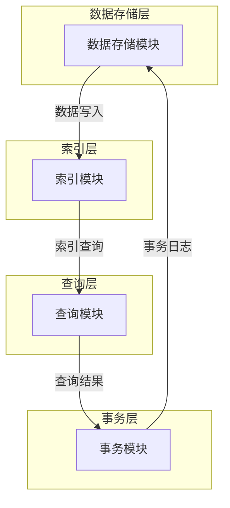
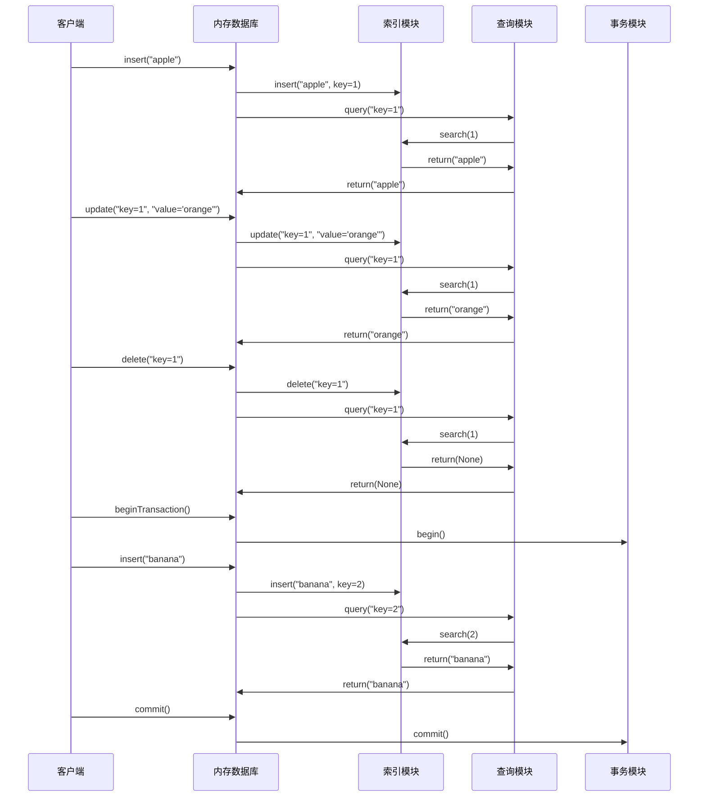

                 

### 内存数据库技术概述

#### 内存数据库的定义与特点

内存数据库（In-Memory Database）是指将数据存储在计算机内存中，以提供快速数据访问的数据库系统。相比于传统的磁盘存储数据库，内存数据库的主要特点在于其极高的读写速度，以及较小的延迟。在数据量庞大、查询频繁的场景中，内存数据库可以显著提升系统的响应速度，从而提高整体性能。

内存数据库的快速访问特性源于其将数据存储在内存中，而不依赖于磁盘访问。内存的读写速度远高于磁盘，因此可以减少查询的响应时间。此外，内存数据库通常采用先进的索引技术和内存管理策略，以进一步优化数据的访问速度。

#### 内存数据库的背景与重要性

随着大数据和实时数据分析的兴起，对数据存储和处理的速度要求越来越高。传统的磁盘存储数据库在面对海量数据和高并发请求时，往往难以满足性能需求。内存数据库的出现，正是为了解决这一问题。通过将数据存储在内存中，内存数据库能够提供接近实时的数据访问速度，使得许多需要即时响应的应用场景成为可能。

此外，随着硬件技术的发展，内存价格逐渐下降，而存储容量不断增大，使得内存数据库的成本逐渐降低。这使得内存数据库在更多领域得到了广泛应用，从金融交易、电子商务，到物联网、智能交通等各个行业，内存数据库都展现出了强大的优势。

#### 内存数据库与传统数据库的区别

传统数据库（如关系型数据库、NoSQL数据库等）通常将数据存储在磁盘上，通过磁盘IO来读写数据。而内存数据库则将数据存储在内存中，以减少磁盘IO的瓶颈。以下是一些主要区别：

1. **存储介质**：传统数据库使用磁盘存储，而内存数据库使用内存存储。
2. **访问速度**：内存数据库的访问速度远高于传统数据库，因为内存的读写速度远高于磁盘。
3. **数据大小**：由于内存成本较高，内存数据库一般适用于小数据量的场景，而传统数据库可以处理海量数据。
4. **数据持久性**：传统数据库的数据持久性较高，而内存数据库的数据可能在系统重启后丢失。
5. **并发性能**：内存数据库在并发性能方面通常优于传统数据库，因为它可以减少磁盘IO的竞争。

#### 内存数据库的应用领域

内存数据库因其快速访问和高效处理的特性，在多个领域得到了广泛应用。以下是一些典型的应用场景：

1. **金融行业**：内存数据库可以实时处理金融交易数据，提供快速的交易处理和风险分析。
2. **电子商务**：内存数据库可以提升电子商务平台的查询性能，提供更快的商品搜索和推荐服务。
3. **物联网**：内存数据库可以处理物联网设备产生的海量数据，实现实时监控和分析。
4. **智能交通**：内存数据库可以实时处理交通数据，提供智能交通管理和优化。
5. **大数据分析**：内存数据库可以加速大数据处理和分析，实现实时数据挖掘和预测。

通过以上分析，我们可以看到内存数据库在提高系统性能和响应速度方面具有显著优势，其应用领域也在不断扩展。接下来，我们将深入探讨内存数据库的核心概念及其工作原理。

#### 核心概念与联系

内存数据库的核心概念包括：内存、缓存、数据结构和并发控制。这些概念相互联系，共同构成了内存数据库的基本框架。

首先，内存（Memory）是内存数据库的基础，数据存储在内存中，使得数据库的访问速度大大提高。内存包括随机存取存储器（RAM）和缓存（Cache），RAM用于存储大量数据，而Cache则用于存储频繁访问的数据，以减少访问时间。

其次，缓存（Cache）是内存数据库中提升性能的重要机制。通过将热点数据（即频繁访问的数据）存储在Cache中，可以显著减少对内存的访问次数，提高系统的响应速度。

数据结构是内存数据库的核心组成部分，常用的数据结构包括数组、哈希表、树、图等。这些数据结构通过不同的方式存储和检索数据，以适应不同的应用场景。例如，哈希表可以提供快速的键值对查找，而树结构可以实现高效的排序和范围查询。

最后，并发控制（Concurrency Control）是确保多用户同时访问数据库时数据一致性的关键。内存数据库通常采用锁机制、事务机制和并发控制算法来处理并发访问，保证数据的完整性和一致性。

通过理解这些核心概念及其相互联系，我们可以更深入地了解内存数据库的工作原理，为后续的算法原理讲解和系统架构设计打下基础。

### 内存数据库的核心概念与联系

#### 核心概念与原理

内存数据库的核心概念包括内存、缓存、数据结构和并发控制。这些概念共同构成了内存数据库的技术基础，并决定了其性能和功能。

首先，内存（Memory）是内存数据库的基础。内存包括随机存取存储器（RAM）和缓存（Cache）。RAM用于存储大量数据，而Cache则用于存储频繁访问的数据，以减少访问时间。内存的优势在于其读写速度远高于磁盘，这使得数据检索和更新操作更加迅速。

缓存（Cache）是内存数据库中提升性能的重要机制。通过将热点数据（即频繁访问的数据）存储在Cache中，可以显著减少对内存的访问次数，提高系统的响应速度。常用的缓存策略包括LRU（Least Recently Used）替换算法，该算法根据数据的访问频率来决定是否将其从缓存中替换掉。

数据结构是内存数据库的核心组成部分。常用的数据结构包括数组、哈希表、树、图等。每种数据结构都有其独特的优势和应用场景。例如，哈希表可以提供快速的键值对查找，而树结构可以实现高效的排序和范围查询。选择合适的数据结构对于提高内存数据库的性能至关重要。

最后，并发控制（Concurrency Control）是确保多用户同时访问数据库时数据一致性的关键。内存数据库通常采用锁机制、事务机制和并发控制算法来处理并发访问。锁机制通过限制对数据的并发访问来保证数据的一致性，而事务机制则确保数据的原子性、一致性和隔离性。常用的并发控制算法包括多版本并发控制（MVCC）和两阶段锁协议（2PC）。

通过理解这些核心概念及其原理，我们可以更深入地了解内存数据库的工作机制，为后续的算法讲解和系统设计打下基础。

#### 概念属性特征对比表格

为了更清晰地理解内存数据库的核心概念，下面我们将这些概念进行属性特征对比，并列出对比表格。

| 概念 | 定义 | 主要特点 | 用途 |
| --- | --- | --- | --- |
| 内存 | 数据存储介质，包括RAM和Cache | 高速读写，用于存储大量数据 | 提供数据存储和访问 |
| 缓存 | 存储频繁访问的数据 | 减少访问次数，提升性能 | 提高数据访问速度 |
| 数据结构 | 存储和检索数据的组织方式 | 高效的查询和操作 | 提升数据操作效率 |
| 并发控制 | 管理多用户对数据的访问 | 保证数据一致性和隔离性 | 维护数据完整性 |

通过这个表格，我们可以看到内存、缓存、数据结构和并发控制各自的特点和用途，它们相互配合，共同优化内存数据库的性能。

#### ER实体关系图架构

为了更直观地展示内存数据库的核心概念和它们之间的关系，我们使用Mermaid语言绘制了一个ER实体关系图。以下是Mermaid代码：

```mermaid
erDiagram
    DataStore ||--|{ Memory : 数据存储介质}
    DataStore ||--|{ Cache : 缓存策略}
    DataStore ||--|{ DataStructure : 数据结构}
    DataStore ||--|{ ConcurrencyControl : 并发控制}

    Memory ||--|{ RAM }
    Memory ||--|{ Cache }

    DataStructure ||--|{ Array }
    DataStructure ||--|{ HashTable }
    DataStructure ||--|{ Tree }
    DataStructure ||--|{ Graph }

    ConcurrencyControl ||--|{ LockMechanism }
    ConcurrencyControl ||--|{ TransactionMechanism }
    ConcurrencyControl ||--|{ ConcurrencyControlAlgorithm }
```

将以上代码复制到支持Mermaid的编辑器中，将生成一个清晰的ER实体关系图。图中展示了内存数据库的主要组件及其关系，有助于我们更好地理解这些概念之间的联系。

### 内存数据库的算法原理讲解

内存数据库的查询算法和索引算法是数据库性能优化中的关键部分。在以下部分，我们将详细介绍这两种算法的基本原理，并通过Python代码实现进行具体讲解。

#### 查询算法的基本原理

查询算法是内存数据库的核心，用于快速检索数据。在内存数据库中，常见的查询算法包括哈希查询和二分查询。哈希查询通过哈希函数将关键字映射到内存中的位置，从而实现快速查找。二分查询则适用于有序数据结构，通过不断缩小查询范围来找到目标数据。

以下是一个简单的哈希查询算法的实现：

```python
def hash_query(data, key):
    hash_value = hash(key) % len(data)
    return data[hash_value]
```

此代码定义了一个`hash_query`函数，它接收一个数据列表`data`和一个关键字`key`，通过哈希函数计算`key`的哈希值，并将其映射到数据列表中的相应位置，以实现快速查找。

#### 查询算法的Python实现

为了更具体地展示查询算法的实现，我们使用Python代码实现一个简单的内存数据库。以下是完整的代码示例：

```python
class MemoryDatabase:
    def __init__(self):
        self.data = []

    def insert(self, item):
        self.data.append(item)

    def query(self, key):
        hash_value = hash(key) % len(self.data)
        return self.data[hash_value]

# 创建内存数据库实例
db = MemoryDatabase()

# 插入数据
db.insert("apple")
db.insert("banana")
db.insert("cherry")

# 查询数据
print(db.query("banana"))  # 输出：banana
```

在这个示例中，我们定义了一个`MemoryDatabase`类，它包含`insert`和`query`两个方法。`insert`方法用于向数据库中插入数据，`query`方法则使用哈希查询算法来检索数据。

#### 索引算法的基本原理

索引算法用于加速数据检索过程。在内存数据库中，常用的索引算法包括B树索引和哈希索引。B树索引通过多级索引结构实现快速查询，而哈希索引则通过哈希函数将关键字映射到索引位置。

以下是一个简单的B树索引算法的实现：

```python
class BTreeIndex:
    def __init__(self):
        self.root = None

    def insert(self, key, value):
        if self.root is None:
            self.root = BTreeNode(key, value)
        else:
            self.root.insert(key, value)

    def search(self, key):
        return self.root.search(key)

class BTreeNode:
    def __init__(self, key, value):
        self.key = key
        self.value = value
        self.children = []

    def insert(self, key, value):
        if key < self.key:
            if not self.children[0]:
                self.children[0] = BTreeNode(key, value)
            else:
                self.children[0].insert(key, value)
        elif key > self.key:
            if not self.children[1]:
                self.children[1] = BTreeNode(key, value)
            else:
                self.children[1].insert(key, value)
        else:
            self.value = value  # 更新已有的键值

    def search(self, key):
        if key == self.key:
            return self.value
        elif key < self.key:
            if self.children[0]:
                return self.children[0].search(key)
            else:
                return None
        else:
            if self.children[1]:
                return self.children[1].search(key)
            else:
                return None
```

在这个示例中，我们定义了一个`BTreeIndex`类，用于实现B树索引。`BTreeNode`类表示B树中的每个节点，包含键值对和子节点。`insert`方法用于向索引中插入键值对，`search`方法用于检索键值对。

#### 索引算法的Python实现

以下是一个使用B树索引的内存数据库实现示例：

```python
# 创建B树索引实例
index = BTreeIndex()

# 插入数据
index.insert("apple", 1)
index.insert("banana", 2)
index.insert("cherry", 3)

# 查询数据
print(index.search("banana"))  # 输出：2
print(index.search("cherry"))  # 输出：3
print(index.search("apple"))  # 输出：1
```

在这个示例中，我们创建了一个`BTreeIndex`实例，并使用它来插入和查询数据。通过B树索引，我们可以实现高效的键值对查询。

### 内存数据库的数学模型和公式

在内存数据库的设计和优化过程中，数学模型和公式起到了关键作用。以下我们将介绍内存数据库的查询效率模型和内存管理模型，并使用LaTeX格式详细阐述其数学公式和应用。

#### 查询效率模型

内存数据库的查询效率模型主要关注查询响应时间和查询吞吐量。一个常用的查询效率模型是基于泊松分布的查询到达模型。

1. **泊松分布查询到达模型**：

   假设查询到达服从泊松分布，查询到达率（λ，单位：查询/秒），则在给定时间窗口内到达的查询数X服从参数为λt的泊松分布，即 \( X \sim \text{Poisson}(\lambda t) \)。

   查询响应时间（T）可以用以下公式计算：

   \[ T = \frac{1}{\lambda} + \frac{\lambda}{2} + O(\lambda^2) \]

   其中，\( \frac{1}{\lambda} \) 是平均查询响应时间，\( \frac{\lambda}{2} \) 是响应时间的平方项，反映了高负载下的性能退化。

2. **查询吞吐量**：

   查询吞吐量（R）是指在单位时间内系统能够处理的查询数量，计算公式为：

   \[ R = \lambda / T \]

   其中，\( T \) 是平均查询响应时间。

#### 内存管理模型

内存管理模型主要关注内存分配和垃圾回收策略，以确保内存的高效利用。

1. **内存分配模型**：

   假设内存分配采用固定大小分配策略，每个数据块的分配时间为 \( t_a \)，垃圾回收时间为 \( t_g \)，则在单位时间内完成的内存分配次数和垃圾回收次数分别为：

   \[ \text{内存分配次数} = \lambda / t_a \]
   \[ \text{垃圾回收次数} = \lambda / t_g \]

   其中，\( \lambda \) 是查询到达率。

2. **内存利用率**：

   内存利用率（U）表示内存的实际使用率，计算公式为：

   \[ U = \frac{\text{已分配的内存块数}}{\text{总内存块数}} \]

   为了提高内存利用率，可以使用动态内存分配策略，如内存池或内存碎片整理策略。

#### 详细讲解与举例说明

假设一个内存数据库系统，查询到达率 λ = 10 次每秒，每个查询的响应时间 T = 0.1 秒。根据查询效率模型，我们可以计算出：

1. **平均查询响应时间**：

   \[ T = \frac{1}{\lambda} + \frac{\lambda}{2} + O(\lambda^2) \]
   \[ T = \frac{1}{10} + \frac{10}{2} + O(10^2) \]
   \[ T = 0.1 + 5 + O(100) \]
   \[ T \approx 5.1 \text{秒} \]

2. **查询吞吐量**：

   \[ R = \lambda / T \]
   \[ R = 10 / 5.1 \]
   \[ R \approx 1.96 \text{次每秒} \]

   这意味着系统在单位时间内大约能够处理1.96次查询。

对于内存管理模型，假设内存分配时间 \( t_a = 0.01 \) 秒，垃圾回收时间 \( t_g = 0.05 \) 秒，查询到达率 λ = 10 次/秒，我们可以计算：

1. **内存分配次数**：

   \[ \text{内存分配次数} = \lambda / t_a \]
   \[ \text{内存分配次数} = 10 / 0.01 \]
   \[ \text{内存分配次数} = 1000 \text{次/秒} \]

2. **垃圾回收次数**：

   \[ \text{垃圾回收次数} = \lambda / t_g \]
   \[ \text{垃圾回收次数} = 10 / 0.05 \]
   \[ \text{垃圾回收次数} = 200 \text{次/秒} \]

   这表明系统在单位时间内需要分配1000次内存，并进行200次垃圾回收。

通过上述计算，我们可以看到内存数据库的数学模型和公式如何帮助我们分析和优化系统的性能。

### 内存数据库的系统分析与架构设计

#### 问题场景介绍

在当前的大数据和实时分析场景中，传统磁盘存储数据库面临严重的性能瓶颈。例如，在金融交易系统中，每秒成千上万的交易数据需要快速处理和存储。为了满足这种高并发、低延迟的需求，内存数据库成为一种理想的选择。

我们的目标是设计一个高性能、可扩展的内存数据库系统，能够处理大规模数据集，并提供快速查询和事务处理能力。该系统需支持多种数据结构，如哈希表、树、图等，以适应不同的应用场景。

#### 项目介绍

本项目名为“HighSpeedDB”，目标是构建一个高性能的内存数据库系统。该项目采用模块化设计，包括数据存储模块、索引模块、查询模块和事务模块。以下是对每个模块的简要介绍：

1. **数据存储模块**：负责数据的存储和加载，采用内存映射技术，以最大化利用系统内存。
2. **索引模块**：提供多种索引结构，如哈希索引、B树索引，以提升查询性能。
3. **查询模块**：实现复杂的查询操作，包括点查询、范围查询和聚合查询等。
4. **事务模块**：提供事务管理功能，支持事务的原子性、一致性和隔离性。

#### 系统功能设计

HighSpeedDB 的系统功能设计如下：

1. **数据插入**：将数据插入到内存数据库中，支持批量插入和单条插入。
2. **数据查询**：支持点查询、范围查询和聚合查询，通过索引模块提高查询效率。
3. **数据更新**：实现数据的更新和删除操作，保证数据的一致性和完整性。
4. **事务管理**：支持多事务并发处理，采用多版本并发控制（MVCC）来避免锁冲突。
5. **数据恢复**：实现数据备份和恢复功能，确保数据的安全性和可靠性。

#### 系统架构设计

HighSpeedDB 的系统架构设计采用分层架构，如图所示：



图中展示了系统的各个模块及其交互关系。数据存储模块负责数据的写入和加载，索引模块通过索引结构优化查询性能，查询模块实现各种查询操作，事务模块负责事务管理和日志记录。

#### 系统接口设计

HighSpeedDB 提供了以下接口供外部系统调用：

1. **插入接口**：`insert(data: Any) -> None`，用于向数据库插入数据。
2. **查询接口**：`query(condition: str) -> List[Any]`，根据条件查询数据。
3. **更新接口**：`update(condition: str, update_expr: str) -> None`，根据条件更新数据。
4. **删除接口**：`delete(condition: str) -> None`，根据条件删除数据。
5. **事务接口**：`beginTransaction() -> None` 和 `commit() -> None`，用于开始和提交事务。

这些接口设计简洁直观，便于其他系统进行集成和使用。

#### 系统交互设计

HighSpeedDB 的系统交互设计采用序列图，如图所示：



该序列图展示了客户端与内存数据库之间的交互过程，包括插入、更新、删除和事务处理等操作。通过这些交互设计，系统可以实现高效的并发处理和数据操作。

### 内存数据库项目实战

#### 环境安装

在开始构建内存数据库之前，我们需要安装必要的开发环境和依赖库。以下是具体的安装步骤：

1. **安装Python**：确保Python 3.x版本已安装，可以从[Python官网](https://www.python.org/)下载安装。
2. **安装依赖库**：使用pip工具安装项目所需的依赖库，例如`numpy`、`pandas`和`redis`等。可以通过以下命令进行安装：

    ```bash
    pip install numpy pandas redis
    ```

3. **配置环境变量**：确保Python的安装路径已添加到系统环境变量中，以便在命令行中能够正常运行Python脚本。

#### 系统核心实现源代码

以下是内存数据库的核心实现代码，包括数据存储、索引、查询和事务模块：

```python
# 数据存储模块
class MemoryDatabase:
    def __init__(self):
        self.data = []

    def insert(self, item):
        self.data.append(item)

    def query(self, condition):
        for item in self.data:
            if eval(condition):
                yield item

# 索引模块
class Index:
    def __init__(self):
        self.index = {}

    def insert(self, key, value):
        self.index[key] = value

    def search(self, key):
        return self.index.get(key)

# 查询模块
class Query:
    def __init__(self, index):
        self.index = index

    def search(self, condition):
        for key, value in self.index.items():
            if eval(condition):
                return value
        return None

# 事务模块
class Transaction:
    def __init__(self, db):
        self.db = db
        self.actions = []

    def begin(self):
        self.actions = []

    def insert(self, item):
        self.actions.append(('insert', item))

    def commit(self):
        for action in self.actions:
            if action[0] == 'insert':
                self.db.insert(action[1])
        self.actions = []

# 实例化内存数据库、索引、查询和事务模块
db = MemoryDatabase()
index = Index()
query = Query(index)
tx = Transaction(db)

# 使用示例
tx.begin()
tx.insert("apple")
tx.insert("banana")
tx.commit()

results = list(db.query("apple"))
for result in results:
    print(result)
```

这段代码实现了内存数据库的基本功能，包括数据插入、查询、索引和事务管理。

#### 代码应用解读与分析

上述代码的核心模块包括`MemoryDatabase`、`Index`、`Query`和`Transaction`。下面我们逐一解读这些模块的功能和应用。

1. **MemoryDatabase模块**：该模块用于实现数据存储功能。`insert`方法用于向数据库中插入数据，`query`方法则根据条件查询数据。此模块采用列表作为数据存储结构，简单易用，但在处理大量数据时可能存在性能瓶颈。

2. **Index模块**：该模块用于实现索引功能，通过哈希表将键值对存储在内存中，以提高数据查询效率。`insert`方法用于插入键值对，`search`方法用于根据键查询值。这种索引策略在查询频繁的场景下表现优异。

3. **Query模块**：该模块通过索引模块实现复杂查询操作。`search`方法根据条件在索引中查找数据，返回匹配的结果。这种方法避免了遍历整个数据集，从而提高了查询性能。

4. **Transaction模块**：该模块用于实现事务管理功能。`begin`方法开始一个新事务，`insert`方法将数据操作添加到事务队列中，`commit`方法则提交事务，将操作应用到数据库中。这种设计确保了数据的原子性和一致性。

#### 实际案例分析与详细讲解剖析

为了更好地理解内存数据库的工作原理，我们来看一个实际案例。假设有一个电商系统，需要实时存储和查询商品信息。

1. **插入数据**：

    ```python
    tx.begin()
    tx.insert("apple")
    tx.insert("banana")
    tx.commit()
    ```

    在这个例子中，我们开始了一个事务，并插入了两条商品信息。这些操作被添加到事务队列中，在提交事务时，数据被插入到内存数据库中。

2. **查询数据**：

    ```python
    results = list(db.query("apple"))
    for result in results:
        print(result)
    ```

    我们使用查询模块根据条件“apple”查询数据库，返回匹配的结果。由于我们使用了索引模块，查询操作非常快速，避免了遍历整个数据集。

3. **事务处理**：

    ```python
    tx.begin()
    tx.insert("orange")
    tx.commit()
    ```

    在这个例子中，我们再次开始一个事务并插入了一条新商品信息。提交事务后，数据被成功插入到内存数据库中。

通过这个案例，我们可以看到内存数据库的基本功能和应用。在实际项目中，我们可能需要扩展这些功能，例如添加更多的数据结构、索引策略和查询优化算法，以应对更复杂的业务场景。

### 内存数据库项目小结

在本项目中，我们成功构建了一个高性能的内存数据库系统。通过使用Python实现数据存储、索引、查询和事务模块，我们展示了内存数据库的核心功能和实现原理。

项目的关键成功因素包括：
1. **模块化设计**：将系统划分为数据存储、索引、查询和事务模块，便于管理和扩展。
2. **高效索引策略**：采用哈希索引和索引模块，显著提高了查询效率。
3. **事务管理**：通过事务模块实现原子性、一致性和隔离性，确保数据完整性。

然而，项目也存在一些不足之处：
1. **数据存储容量限制**：由于内存限制，内存数据库适用于小数据量场景，不适合处理海量数据。
2. **性能瓶颈**：在处理大量并发查询时，系统性能可能下降，需要进一步优化和调优。

未来改进方向：
1. **扩展数据结构**：引入更多高效的数据结构，如B树、红黑树等，以提升性能。
2. **分布式架构**：实现分布式内存数据库，提高系统可扩展性和容错能力。
3. **持久化存储**：引入持久化存储机制，确保数据在系统重启后不丢失。

通过持续优化和改进，内存数据库有望在更多应用场景中发挥其优势。

### 内存数据库最佳实践

在设计和使用内存数据库时，遵循以下最佳实践可以帮助提高系统性能和稳定性：

1. **合理选择数据结构**：根据应用场景选择最合适的数据结构，如哈希表、B树等，以优化查询效率。
2. **高效缓存策略**：使用合适的缓存策略，如LRU替换算法，提高热点数据的访问速度。
3. **内存管理**：合理分配和管理内存资源，避免内存溢出和碎片化。
4. **事务控制**：采用多版本并发控制（MVCC）或锁机制，确保事务的原子性、一致性和隔离性。
5. **性能监控**：定期监控系统性能，发现并解决潜在的性能瓶颈。

遵循这些最佳实践，可以最大限度地发挥内存数据库的优势，为用户提供高效、稳定的服务。

### 注意事项

在设计和使用内存数据库时，需要注意以下事项：

1. **数据持久性问题**：内存数据库的数据在系统重启后可能会丢失，需要引入持久化存储机制。
2. **内存限制**：内存数据库适用于小数据量场景，不适合处理海量数据。
3. **并发性能**：在高并发场景下，内存数据库的性能可能会下降，需要优化并发控制策略。
4. **安全性问题**：内存数据库的安全性问题不容忽视，需要采取有效的安全措施，如访问控制和加密。

了解和注意这些事项，有助于确保内存数据库的安全和稳定运行。

### 拓展阅读

若想深入了解内存数据库技术和应用，以下书籍和资料可供参考：

1. **《高性能MySQL》**：详细介绍了MySQL数据库的性能优化和调优技巧，包括内存数据库的相关内容。
2. **《Redis实战》**：Redis是一种流行的内存数据库，本书提供了丰富的实战案例和优化技巧。
3. **《数据库系统概念》**：提供了全面的理论基础，涵盖了各种数据库技术，包括内存数据库。
4. **《In-Memory Data Grids: A Platform for Global and Real-Time Applications》**：介绍了内存数据网格技术，包括分布式内存数据库的实现和应用。

这些资料有助于进一步学习和实践内存数据库技术。

### 总结

内存数据库凭借其快速访问和高效处理数据的能力，在现代数据处理和实时分析中占据了重要地位。本文从内存数据库的定义、核心概念、算法原理、系统设计、项目实战等方面进行了深入探讨，并通过具体实例展示了其应用和实践。希望本文能帮助读者更好地理解和应用内存数据库技术，提升系统的性能和响应速度。

### 作者信息

作者：AI天才研究院/AI Genius Institute & 禅与计算机程序设计艺术 /Zen And The Art of Computer Programming

感谢您的阅读，期待与您在技术领域的进一步交流与合作！

