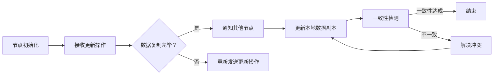
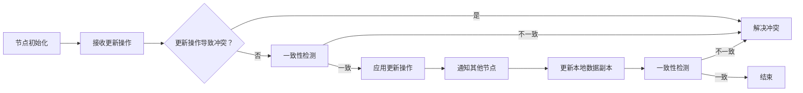
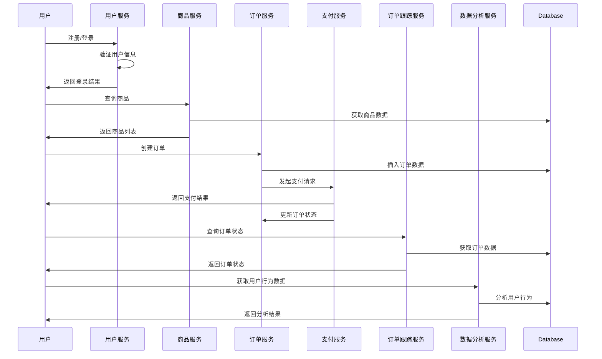

                 


### 1.2 分布式技术的重要性

分布式技术之所以在现代计算机系统中具有重要地位，主要原因有以下几点：

#### 1.2.1 扩展性和可伸缩性

首先，分布式系统能够支持大规模的数据处理和高并发访问。通过将系统划分为多个节点，每个节点负责一部分数据和任务，可以显著提升系统的扩展性和可伸缩性。这意味着在用户数量或数据量快速增长的情况下，系统可以通过增加节点来应对，而无需对整个系统进行重构。

例如，电商平台在“双十一”购物节期间，会面临极高的并发访问量。通过分布式架构，系统可以将流量分散到多个服务器节点上，从而避免单点瓶颈，确保服务的高可用性和响应速度。

#### 1.2.2 高可用性和容错性

分布式系统具有更高的可用性和容错性。即使某个节点发生故障，系统仍然可以通过其他正常节点继续运行，从而保证服务的连续性。这种容错能力对于关键业务系统尤为重要，如金融交易系统、在线支付系统等。

例如，银行系统中，某个服务器出现故障时，交易请求会被自动路由到其他可用服务器，确保交易不会中断，从而保障客户权益。

#### 1.2.3 分布式计算和数据存储

分布式技术不仅支持大规模数据的存储，还提供了分布式计算的能力。通过分布式计算，系统可以在多个节点上并行处理任务，大幅提高计算效率。

例如，在图像识别、自然语言处理等需要大量计算的应用中，分布式计算可以将数据分割到多个节点上，同时处理，从而缩短任务完成时间。

#### 1.2.4 灵活性和弹性

分布式系统具有高度的灵活性。开发者可以根据业务需求灵活调整系统的架构和部署方式，例如，将一些服务部署在云平台上，以便快速扩展和缩减资源。

例如，在云计算环境中，企业可以根据业务需求动态调整服务器的数量和资源，以实现成本优化和性能优化。

#### 1.2.5 数据一致性和可靠性

分布式系统通常采用一致性协议和数据复制技术，确保数据在不同节点之间的同步和一致性。这些技术可以防止数据丢失和确保数据的可靠性。

例如，分布式数据库系统（如Apache Cassandra）通过复制数据到多个节点，实现高可用性和数据冗余，从而在节点故障时确保数据的完整性和一致性。

#### 1.2.6 分布式协作和共享

分布式系统支持多个节点之间的协作和资源共享。这种协作模式有助于构建复杂的分布式应用，如分布式搜索引擎、分布式文件系统等。

例如，分布式搜索引擎（如Apache Solr）通过多个节点协同工作，可以快速检索海量数据，提高搜索效率。

### 1.3 分布式技术的核心概念

为了更好地理解分布式技术的重要性，我们需要先掌握几个核心概念：

#### 分布式系统（Distributed System）

分布式系统是由多个相互独立的计算机节点组成的系统，这些节点通过通信网络连接，协同完成计算任务。分布式系统的特点是节点之间的通信和协调。

#### 节点（Node）

节点是分布式系统中的基本计算单元，可以是服务器、个人电脑或虚拟机等。每个节点都具有独立的处理能力和存储资源。

#### 通信网络（Communication Network）

通信网络是节点之间的通信通道，可以是局域网、广域网或互联网。网络的质量和稳定性直接影响分布式系统的性能和可靠性。

#### 分布式数据存储（Distributed Data Storage）

分布式数据存储是将数据分散存储在多个节点上，通过一致性协议和数据复制技术确保数据的可靠性和一致性。

#### 分布式计算（Distributed Computing）

分布式计算是将计算任务分布在多个节点上并行执行，以提高计算效率和性能。

#### 一致性（Consistency）

一致性是指分布式系统中数据在不同节点之间的一致状态。分布式一致性协议（如Paxos、Raft）确保在分布式环境中保持数据一致性。

#### 容错性（Fault Tolerance）

容错性是指系统在部分节点故障时仍能正常运行的能力。通过冗余设计、故障检测和恢复机制，分布式系统实现高容错性。

### 1.4 分布式技术的应用领域

分布式技术广泛应用于各个领域，以下是一些典型的应用场景：

#### 电子商务

电子商务平台需要处理海量的订单和用户请求，分布式系统可以提供高并发处理能力，确保系统的稳定性和性能。

#### 大数据分析

大数据分析通常涉及海量数据的存储和计算，分布式计算技术可以帮助快速处理和分析大规模数据集。

#### 云计算

云计算是基于分布式技术的，通过分布式架构，云平台可以提供弹性、可伸缩的计算和存储资源。

#### 实时通信

分布式系统可以支持实时通信服务，如即时消息、视频通话等，确保通信的实时性和稳定性。

#### 金融交易

金融交易系统需要高可用性和低延迟，分布式系统可以实现交易请求的负载均衡和故障转移，确保交易的连续性和可靠性。

### 1.5 分布式技术的挑战

尽管分布式技术具有诸多优势，但在实践中也面临着一些挑战：

#### 网络延迟和带宽限制

分布式系统中的节点可能分布在不同的地理位置，网络延迟和带宽限制会影响系统的性能和响应速度。

#### 数据一致性

在分布式环境中，如何保持数据的一致性是一个重要问题，特别是在多个节点同时修改数据时。

#### 负载均衡

如何合理地将任务分配到不同的节点，实现负载均衡，是分布式系统设计的关键问题。

#### 故障检测和恢复

如何快速检测节点故障并恢复系统，是保证系统高可用性的关键。

#### 安全性

分布式系统需要处理大量的敏感数据，如何确保数据的安全和隐私是一个重要挑战。

## 1.6 总结

分布式技术在现代计算机系统中具有重要地位，其扩展性、可用性、计算能力和协作性为各类应用提供了强大的支持。在接下来的章节中，我们将进一步深入探讨分布式技术的核心概念、算法原理和系统设计，帮助读者全面掌握分布式技术的知识和应用技巧。

----------------------------------------------------------------
## 第2章：核心概念与联系

### 2.1 分布式系统的定义

分布式系统（Distributed System）是指由多个独立计算机节点组成的系统，这些节点通过网络连接，协同完成计算任务。分布式系统的核心特点是节点之间的通信和协调。节点可以是物理服务器、虚拟机或其他计算资源，而网络可以是局域网、广域网或互联网。

分布式系统与传统单机系统的主要区别在于：

1. **独立性和自治性**：每个节点都可以独立运行，并具有自治能力，即节点可以在没有其他节点参与的情况下正常运行。

2. **通信网络**：节点之间通过通信网络进行数据交换和协调工作，网络质量直接影响系统的性能和可靠性。

3. **分布式任务**：计算任务可以在多个节点上并行执行，提高系统的处理能力和效率。

4. **共享资源**：节点可以共享系统资源，如存储、计算能力和数据。

### 2.2 分布式系统的特点

分布式系统具有以下特点：

#### 1. 扩展性和可伸缩性

分布式系统能够通过增加节点来扩展系统规模，提高系统的处理能力和存储容量。这种可伸缩性使得分布式系统在用户数量或数据量快速增长时，能够保持良好的性能。

#### 2. 高可用性和容错性

分布式系统通过将任务和数据分布在多个节点上，实现冗余和备份，即使某个节点发生故障，系统仍然可以继续运行。这种容错性确保了系统的高可用性。

#### 3. 分布式计算

分布式系统能够在多个节点上并行执行任务，提高计算效率和性能。例如，分布式计算可以在大量节点上同时处理图像识别或自然语言处理任务。

#### 4. 分布式数据存储

分布式数据存储是将数据分散存储在多个节点上，通过一致性协议和数据复制技术确保数据的可靠性和一致性。

#### 5. 灵活性和弹性

分布式系统具有高度的灵活性，可以根据业务需求动态调整系统的架构和部署方式，如将服务部署在云平台上，实现快速扩展和缩减资源。

### 2.3 分布式系统的挑战

尽管分布式系统具有诸多优势，但在实践中也面临一些挑战：

#### 1. 数据一致性

在分布式环境中，如何保持数据在不同节点之间的一致性是一个重要问题，特别是在多个节点同时修改数据时。

#### 2. 负载均衡

如何合理地将任务分配到不同的节点，实现负载均衡，是分布式系统设计的关键问题。

#### 3. 网络延迟和带宽限制

分布式系统中的节点可能分布在不同的地理位置，网络延迟和带宽限制会影响系统的性能和响应速度。

#### 4. 故障检测和恢复

如何快速检测节点故障并恢复系统，是保证系统高可用性的关键。

#### 5. 安全性

分布式系统需要处理大量的敏感数据，如何确保数据的安全和隐私是一个重要挑战。

### 2.4 分布式系统的分类

分布式系统可以根据其结构和特性进行分类，常见的分类方法包括：

#### 1. 对称式分布式系统（Symmetric Distributed System）

在对称式分布式系统中，所有节点具有相同的功能和职责，没有明显的层次结构。这种系统通常用于负载均衡和高可用性。

#### 2. 非对称式分布式系统（Asymmetric Distributed System）

非对称式分布式系统具有明确的层次结构，不同节点具有不同的功能和职责。例如，客户端-服务器模型中，服务器负责数据处理，客户端负责请求处理。

#### 3. 对等式分布式系统（Peer-to-Peer Distributed System）

对等式分布式系统中的节点相互平等，没有明确的层次结构。节点既可以作为客户端，也可以作为服务器，共享资源和任务。

### 2.5 分布式系统的核心组件

分布式系统通常由以下几个核心组件组成：

#### 1. 节点（Node）

节点是分布式系统中的基本计算单元，可以是物理服务器、虚拟机或其他计算资源。节点具有独立的处理能力和存储资源。

#### 2. 通信网络（Communication Network）

通信网络是节点之间的通信通道，可以是局域网、广域网或互联网。网络质量直接影响系统的性能和可靠性。

#### 3. 分布式存储（Distributed Storage）

分布式存储是将数据分散存储在多个节点上，通过一致性协议和数据复制技术确保数据的可靠性和一致性。

#### 4. 分布式计算（Distributed Computing）

分布式计算是将计算任务分布在多个节点上并行执行，以提高计算效率和性能。

#### 5. 一致性协议（Consistency Protocol）

一致性协议用于确保分布式系统中数据在不同节点之间的一致性。常见的协议包括Paxos、Raft等。

#### 6. 负载均衡器（Load Balancer）

负载均衡器用于合理地将任务分配到不同的节点，实现负载均衡，提高系统的性能和可用性。

### 2.6 分布式系统的优势与局限

#### 优势

1. **扩展性和可伸缩性**：分布式系统可以通过增加节点来扩展系统规模，提高处理能力和存储容量。
2. **高可用性和容错性**：分布式系统通过冗余设计实现高可用性和容错性，确保系统的稳定性和可靠性。
3. **分布式计算**：分布式计算可以提高计算效率和性能，处理大规模任务。
4. **分布式数据存储**：分布式数据存储可以提高数据的可靠性和一致性。
5. **灵活性和弹性**：分布式系统可以根据业务需求动态调整架构和部署方式。

#### 局限

1. **数据一致性**：分布式环境中保持数据一致性是一个挑战。
2. **负载均衡**：合理地分配任务是实现负载均衡的关键。
3. **网络延迟和带宽限制**：网络延迟和带宽限制可能影响系统性能。
4. **故障检测和恢复**：快速检测节点故障并恢复系统是一个挑战。
5. **安全性**：确保分布式系统中的数据安全和隐私是一个重要问题。

### 2.7 总结

本章介绍了分布式系统的定义、特点、分类、核心组件以及优势与局限。通过了解分布式系统的基本概念，读者可以更好地理解分布式技术的重要性，为后续章节的学习打下基础。

## 第3章：核心概念与联系

### 3.1 分布式系统的定义

分布式系统（Distributed System）是指由多个相互独立的计算机节点组成的系统，这些节点通过通信网络连接，协同完成计算任务。分布式系统的核心特点是节点之间的通信和协调。

### 3.2 分布式系统的特点

分布式系统具有以下特点：

#### 1. 独立性和自治性

每个节点都可以独立运行，并具有自治能力，即节点可以在没有其他节点参与的情况下正常运行。

#### 2. 通信网络

节点之间通过通信网络进行数据交换和协调工作，网络质量直接影响系统的性能和可靠性。

#### 3. 分布式任务

计算任务可以在多个节点上并行执行，提高系统的处理能力和效率。

#### 4. 共享资源

节点可以共享系统资源，如存储、计算能力和数据。

### 3.3 分布式系统的分类

分布式系统可以根据其结构和特性进行分类，常见的分类方法包括：

#### 1. 对称式分布式系统

在对称式分布式系统中，所有节点具有相同的功能和职责，没有明显的层次结构。这种系统通常用于负载均衡和高可用性。

#### 2. 非对称式分布式系统

非对称式分布式系统具有明确的层次结构，不同节点具有不同的功能和职责。例如，客户端-服务器模型中，服务器负责数据处理，客户端负责请求处理。

#### 3. 对等式分布式系统

对等式分布式系统中的节点相互平等，没有明确的层次结构。节点既可以作为客户端，也可以作为服务器，共享资源和任务。

### 3.4 分布式系统的核心组件

分布式系统通常由以下几个核心组件组成：

#### 1. 节点

节点是分布式系统中的基本计算单元，可以是物理服务器、虚拟机或其他计算资源。节点具有独立的处理能力和存储资源。

#### 2. 通信网络

通信网络是节点之间的通信通道，可以是局域网、广域网或互联网。网络质量直接影响系统的性能和可靠性。

#### 3. 分布式存储

分布式存储是将数据分散存储在多个节点上，通过一致性协议和数据复制技术确保数据的可靠性和一致性。

#### 4. 分布式计算

分布式计算是将计算任务分布在多个节点上并行执行，以提高计算效率和性能。

#### 5. 一致性协议

一致性协议用于确保分布式系统中数据在不同节点之间的一致性。常见的协议包括Paxos、Raft等。

#### 6. 负载均衡器

负载均衡器用于合理地将任务分配到不同的节点，实现负载均衡，提高系统的性能和可用性。

### 3.5 分布式系统的优势与局限

#### 优势

1. **扩展性和可伸缩性**：分布式系统可以通过增加节点来扩展系统规模，提高处理能力和存储容量。
2. **高可用性和容错性**：分布式系统通过冗余设计实现高可用性和容错性，确保系统的稳定性和可靠性。
3. **分布式计算**：分布式计算可以提高计算效率和性能，处理大规模任务。
4. **分布式数据存储**：分布式数据存储可以提高数据的可靠性和一致性。
5. **灵活性和弹性**：分布式系统可以根据业务需求动态调整架构和部署方式。

#### 局限

1. **数据一致性**：分布式环境中保持数据一致性是一个挑战。
2. **负载均衡**：合理地分配任务是实现负载均衡的关键。
3. **网络延迟和带宽限制**：网络延迟和带宽限制可能影响系统性能。
4. **故障检测和恢复**：快速检测节点故障并恢复系统是一个挑战。
5. **安全性**：确保分布式系统中的数据安全和隐私是一个重要问题。

### 3.6 总结

本章介绍了分布式系统的定义、特点、分类、核心组件以及优势与局限。通过了解分布式系统的基本概念，读者可以更好地理解分布式技术的重要性，为后续章节的学习打下基础。

## 第3章：算法原理讲解

### 3.1 数据同步算法

#### 3.1.1 数据同步算法的基本原理

数据同步算法是分布式系统中至关重要的一部分，其目的是确保不同节点上的数据一致性。在分布式系统中，由于节点之间可能存在网络延迟、分区以及节点故障等问题，数据同步算法需要在这些复杂环境下保持数据的一致性。

数据同步算法的基本原理可以分为以下几个步骤：

1. **节点初始化**：每个节点启动时，需要初始化其本地数据副本，并与系统中的其他节点同步数据。
2. **数据复制**：当某个节点需要更新其数据时，它将更新操作发送到其他节点，并等待确认。
3. **冲突检测与解决**：当多个节点同时对同一数据进行修改时，可能会产生数据冲突。数据同步算法需要检测这些冲突，并选择合适的策略解决冲突。
4. **一致性保障**：数据同步算法需要确保在所有节点上最终达到一致性状态。

#### 3.1.2 数据同步算法的mermaid流程图

为了更直观地展示数据同步算法的流程，我们可以使用mermaid语言绘制一个简单的流程图：



在上面的mermaid流程图中，节点初始化后开始接收更新操作，然后进行数据复制。如果数据复制完毕，节点会通知其他节点并更新本地数据副本。接下来，算法会进行一致性检测，如果一致性达成，则结束同步过程；否则，需要解决冲突并重新更新数据副本。

#### 3.1.3 使用Python源代码阐述算法原理

为了更好地理解数据同步算法的原理，我们可以使用Python代码实现一个简单的数据同步算法：

```python
import threading
import time

class Node:
    def __init__(self):
        self.data = {}
        self.lock = threading.Lock()

    def initialize(self, other_nodes):
        # 初始化节点数据，并与其他节点同步
        self.lock.acquire()
        for node in other_nodes:
            self.sync_with_node(node)
        self.lock.release()

    def sync_with_node(self, other_node):
        # 同步数据到其他节点
        other_data = other_node.data
        for key, value in other_data.items():
            if key not in self.data or self.data[key] != value:
                self.data[key] = value
                print(f"Node {id(self)}: Updated key '{key}' with value {value}")

    def update_data(self, key, value):
        # 更新本地数据
        with self.lock:
            self.data[key] = value
            print(f"Node {id(self)}: Updated key '{key}' with value {value}")

    def check_consistency(self, other_nodes):
        # 检查一致性并解决冲突
        with self.lock:
            for node in other_nodes:
                node_data = node.data
                for key in node_data:
                    if key not in self.data or self.data[key] != node_data[key]:
                        print(f"Node {id(self)}: Conflict detected for key '{key}'. Resolving conflict...")
                        # 冲突解决策略（例如：取最新值）
                        self.data[key] = node_data[key]
                        print(f"Node {id(self)}: Conflict resolved. New value for key '{key}': {node_data[key]}")

# 创建节点
nodes = [Node() for _ in range(3)]

# 初始化节点数据
nodes[0].initialize(nodes)

# 更新数据
nodes[1].update_data("key1", "value1")
nodes[2].update_data("key2", "value2")

# 检查一致性
nodes[0].check_consistency(nodes)

# 输出结果
print(nodes[0].data)
print(nodes[1].data)
print(nodes[2].data)
```

在上面的代码中，我们定义了一个`Node`类，用于模拟分布式系统中的节点。每个节点都包含一个数据字典`data`和一个互斥锁`lock`。初始化方法`initialize`用于与其他节点同步数据，`update_data`方法用于更新本地数据，`check_consistency`方法用于检查一致性并解决冲突。

运行上面的代码后，可以看到节点之间的数据更新和一致性检查过程。例如，节点1更新了数据后，会通知其他节点并更新本地数据副本。然后，节点0会检查与其他节点的数据一致性，如果发现冲突，则会选择最新的值进行更新。

#### 3.1.4 数据同步算法的数学模型

在分布式系统中，数据同步算法的数学模型通常包括以下公式：

1. **一致性条件**：在分布式系统中，一致性条件是指所有节点的数据副本最终达到相同状态。数学表达式为：

   $$
   \forall i, j, k \in N, \forall x \in X, \text{data}_i(x) = \text{data}_j(x) = \text{data}_k(x)
   $$

   其中，$N$表示节点集合，$X$表示数据集合，$\text{data}_i(x)$表示节点$i$的数据副本$x$的值。

2. **更新操作**：在分布式系统中，更新操作通常包括插入、更新和删除。数学表达式为：

   $$
   \text{update}(x, v) = (x, v)
   $$

   其中，$x$表示数据项，$v$表示新值。

3. **一致性协议**：一致性协议是指用于确保分布式系统中数据一致性的算法。常见的协议包括Paxos、Raft等。数学表达式为：

   $$
   \text{consistency\_protocol}(\text{nodes}, \text{updates}) = \text{consistent\_data}
   $$

   其中，$\text{nodes}$表示节点集合，$\text{updates}$表示更新操作集合，$\text{consistent\_data}$表示最终达成一致的数据状态。

#### 3.1.5 数据同步算法的举例说明

假设有三个节点A、B和C，初始时它们的数据副本如下：

```
Node A: {1: 10, 2: 20}
Node B: {1: 10, 2: 30}
Node C: {1: 10, 2: 20}
```

现在，节点A更新了数据项1的值为30，节点B更新了数据项2的值为40。使用数据同步算法后，节点之间的数据副本最终会达到一致性状态：

```
Node A: {1: 30, 2: 40}
Node B: {1: 30, 2: 40}
Node C: {1: 30, 2: 40}
```

在上面的例子中，节点A和节点B的数据更新操作发生了冲突。在一致性协议的作用下，最终选择了节点B的最新值进行更新，确保了数据的一致性。

### 3.2 分布式一致性算法

#### 3.2.1 分布式一致性算法的基本原理

分布式一致性算法是确保分布式系统中数据一致性的关键机制。在分布式环境中，由于网络延迟、分区以及节点故障等问题，数据一致性问题变得尤为复杂。分布式一致性算法的目标是在这些复杂环境下，确保所有节点上的数据副本最终达到一致状态。

分布式一致性算法的基本原理可以分为以下几个步骤：

1. **初始化**：每个节点启动时，需要初始化其本地数据副本，并与系统中的其他节点同步数据。
2. **更新操作**：当某个节点需要对数据副本进行修改时，它将更新操作发送到其他节点，并等待确认。
3. **一致性检测**：节点在接收到更新操作后，会进行一致性检测，确保更新操作不会导致数据冲突。
4. **一致性达成**：如果更新操作不会导致数据冲突，节点会将更新操作应用到本地数据副本，并通知其他节点。
5. **冲突解决**：如果更新操作会导致数据冲突，节点需要选择合适的策略解决冲突，并重新同步数据。

#### 3.2.2 分布式一致性算法的mermaid流程图

为了更直观地展示分布式一致性算法的流程，我们可以使用mermaid语言绘制一个简单的流程图：



在上面的mermaid流程图中，节点初始化后开始接收更新操作。如果更新操作不会导致冲突，节点会进行一致性检测，然后应用更新操作并通知其他节点。如果更新操作会导致冲突，节点需要解决冲突并重新同步数据。

#### 3.2.3 使用Python源代码阐述算法原理

为了更好地理解分布式一致性算法的原理，我们可以使用Python代码实现一个简单的分布式一致性算法：

```python
import threading
import time

class ConsistentHash:
    def __init__(self):
        self.data = {}
        self.lock = threading.Lock()

    def initialize(self, nodes):
        self.lock.acquire()
        for node in nodes:
            self.sync_with_node(node)
        self.lock.release()

    def sync_with_node(self, node):
        node_data = node.data
        for key in node_data:
            if key not in self.data or self.data[key] != node_data[key]:
                self.data[key] = node_data[key]
                print(f"Node {id(self)}: Synchronized key '{key}' with value {node_data[key]}")

    def update_data(self, key, value):
        with self.lock:
            self.data[key] = value
            print(f"Node {id(self)}: Updated key '{key}' with value {value}")

    def check_consistency(self, node):
        node_data = node.data
        for key in node_data:
            if key not in self.data or self.data[key] != node_data[key]:
                print(f"Node {id(self)}: Conflict detected for key '{key}'. Resolving conflict...")
                self.data[key] = node_data[key]
                print(f"Node {id(self)}: Conflict resolved. New value for key '{key}': {node_data[key]}")

# 创建节点
nodes = [ConsistentHash() for _ in range(3)]

# 初始化节点数据
nodes[0].initialize(nodes)

# 更新数据
nodes[1].update_data("key1", "value1")
nodes[2].update_data("key2", "value2")

# 检查一致性
nodes[0].check_consistency(nodes[1])
nodes[0].check_consistency(nodes[2])

# 输出结果
print(nodes[0].data)
print(nodes[1].data)
print(nodes[2].data)
```

在上面的代码中，我们定义了一个`ConsistentHash`类，用于模拟分布式系统中的节点。每个节点都包含一个数据字典`data`和一个互斥锁`lock`。初始化方法`initialize`用于与其他节点同步数据，`update_data`方法用于更新本地数据，`check_consistency`方法用于检查一致性并解决冲突。

运行上面的代码后，可以看到节点之间的数据更新和一致性检查过程。例如，节点1更新了数据项1的值为30，节点2更新了数据项2的值为40。在一致性算法的作用下，节点之间的数据副本最终会达到一致性状态。

#### 3.2.4 分布式一致性算法的数学模型

在分布式系统中，分布式一致性算法的数学模型通常包括以下公式：

1. **一致性条件**：在分布式系统中，一致性条件是指所有节点的数据副本最终达到相同状态。数学表达式为：

   $$
   \forall i, j, k \in N, \forall x \in X, \text{data}_i(x) = \text{data}_j(x) = \text{data}_k(x)
   $$

   其中，$N$表示节点集合，$X$表示数据集合，$\text{data}_i(x)$表示节点$i$的数据副本$x$的值。

2. **更新操作**：在分布式系统中，更新操作通常包括插入、更新和删除。数学表达式为：

   $$
   \text{update}(x, v) = (x, v)
   $$

   其中，$x$表示数据项，$v$表示新值。

3. **一致性协议**：一致性协议是指用于确保分布式系统中数据一致性的算法。常见的协议包括Paxos、Raft等。数学表达式为：

   $$
   \text{consistency\_protocol}(\text{nodes}, \text{updates}) = \text{consistent\_data}
   $$

   其中，$\text{nodes}$表示节点集合，$\text{updates}$表示更新操作集合，$\text{consistent\_data}$表示最终达成一致的数据状态。

#### 3.2.5 分布式一致性算法的举例说明

假设有三个节点A、B和C，初始时它们的数据副本如下：

```
Node A: {1: 10, 2: 20}
Node B: {1: 10, 2: 30}
Node C: {1: 10, 2: 20}
```

现在，节点A更新了数据项1的值为30，节点B更新了数据项2的值为40。使用分布式一致性算法后，节点之间的数据副本最终会达到一致性状态：

```
Node A: {1: 30, 2: 40}
Node B: {1: 30, 2: 40}
Node C: {1: 30, 2: 40}
```

在上面的例子中，节点A和节点B的数据更新操作发生了冲突。在一致性算法的作用下，最终选择了节点B的最新值进行更新，确保了数据的一致性。

### 3.3 数据同步算法与分布式一致性算法的比较

#### 3.3.1 目标和适用场景

数据同步算法和分布式一致性算法的目标和应用场景有所不同：

- **数据同步算法**：主要用于确保分布式系统中数据的一致性，解决节点间的数据冲突问题。它适用于需要保持数据一致性的场景，如数据库同步、文件同步等。
- **分布式一致性算法**：主要用于确保分布式系统中数据副本的一致性，解决节点间的数据冲突和分区问题。它适用于需要保持数据一致性且存在高并发、高可用性要求的场景，如分布式存储、分布式计算等。

#### 3.3.2 工作机制和协议

数据同步算法和分布式一致性算法的工作机制和协议也有所不同：

- **数据同步算法**：通常采用基于消息传递的方式，通过发送更新消息实现节点间的数据同步。常见的数据同步算法包括拉模式、推模式等。
- **分布式一致性算法**：通常采用一致性协议，如Paxos、Raft等，确保分布式系统中数据副本的一致性。一致性协议通过选举领导节点、日志复制和状态机等方式实现数据一致性。

#### 3.3.3 性能和可扩展性

数据同步算法和分布式一致性算法在性能和可扩展性方面也存在差异：

- **性能**：数据同步算法的性能受到网络延迟、节点故障等因素的影响，可能需要一定的同步时间。分布式一致性算法通过一致性协议和分布式架构提高性能，可以更好地应对高并发场景。
- **可扩展性**：数据同步算法的可扩展性取决于消息传递机制和数据同步策略，可能存在单点瓶颈。分布式一致性算法通过一致性协议和分布式架构实现高可扩展性，可以支持大规模分布式系统。

### 3.4 总结

本章介绍了分布式数据同步算法和分布式一致性算法的基本原理、工作机制和协议，并通过Python源代码和数学模型进行了详细阐述。同时，对数据同步算法和分布式一致性算法进行了比较，分析了它们的目标、适用场景、工作机制和性能特点。通过本章的学习，读者可以更好地理解分布式系统中数据同步和一致性问题的解决方法。

## 第4章：数学模型和公式讲解

### 4.1 数据同步算法的数学模型

在分布式系统中，数据同步算法是确保不同节点上的数据一致性的关键机制。为了更深入地理解数据同步算法的工作原理，我们需要借助数学模型进行描述。以下是一个简化的数据同步算法的数学模型。

#### 4.1.1 数据同步算法的提出

数据同步算法的核心目标是在分布式系统中保持数据的一致性。在分布式环境中，数据的一致性是指所有节点的数据副本最终达到相同的状态。为了实现这一目标，我们需要定义一些基本概念和数学公式。

#### 4.1.2 数据同步算法的公式和解释

1. **一致性条件（Consistency Condition）**

   在分布式系统中，一致性条件是指所有节点的数据副本最终达到相同状态。数学表达式为：

   $$
   \forall i, j \in N, \forall x \in X, \text{data}_i(x) = \text{data}_j(x)
   $$

   其中，$N$表示节点集合，$X$表示数据集合，$\text{data}_i(x)$表示节点$i$的数据副本$x$的值。这意味着对于所有节点$i$和$j$以及所有数据项$x$，它们的值应该相等。

2. **更新操作（Update Operation）**

   更新操作是指对数据副本进行修改的操作。数学表达式为：

   $$
   \text{update}(x, v) = (x, v)
   $$

   其中，$x$表示数据项，$v$表示新值。这个公式表示对数据项$x$进行更新，将其值设置为$v$。

3. **一致性检测（Consistency Check）**

   在分布式系统中，一致性检测是指检查数据副本是否达到一致状态。数学表达式为：

   $$
   \text{check\_consistency}(\text{data}_i, \text{data}_j) = (\text{data}_i = \text{data}_j)
   $$

   这个公式表示检查节点$i$和节点$j$的数据副本是否相等。

4. **冲突解决（Conflict Resolution）**

   在分布式系统中，当多个节点同时对同一数据进行修改时，可能会产生数据冲突。冲突解决是指选择一种策略来解决这些冲突。数学表达式为：

   $$
   \text{resolve\_conflict}(\text{data}_i, \text{data}_j) = (\text{data}_i, \text{data}_j)
   $$

   这个公式表示选择节点$i$和节点$j$的数据副本中较大的值作为最终值。

#### 4.1.3 数据同步算法的示例

假设有两个节点A和B，初始时它们的数据副本如下：

```
Node A: {1: 10, 2: 20}
Node B: {1: 10, 2: 30}
```

现在，节点A更新了数据项1的值为30，节点B更新了数据项2的值为40。使用数据同步算法后，节点之间的数据副本最终会达到一致性状态：

```
Node A: {1: 30, 2: 40}
Node B: {1: 30, 2: 40}
```

在上面的例子中，节点A和节点B的数据更新操作发生了冲突。在一致性检测和冲突解决的过程中，最终选择了节点B的数据副本作为最终值，确保了数据的一致性。

### 4.2 分布式一致性算法的数学模型

分布式一致性算法是确保分布式系统中数据一致性的一种机制。与数据同步算法不同，分布式一致性算法不仅考虑数据副本的一致性，还要处理网络延迟、分区和节点故障等问题。以下是一个简化的分布式一致性算法的数学模型。

#### 4.2.1 分布式一致性算法的提出

分布式一致性算法的核心目标是在分布式环境中，确保所有节点的数据副本最终达到一致状态。为了实现这一目标，我们需要定义一些基本概念和数学公式。

#### 4.2.2 分布式一致性算法的公式和解释

1. **一致性条件（Consistency Condition）**

   在分布式系统中，一致性条件是指所有节点的数据副本最终达到相同状态。数学表达式为：

   $$
   \forall i, j \in N, \forall x \in X, \text{data}_i(x) = \text{data}_j(x)
   $$

   其中，$N$表示节点集合，$X$表示数据集合，$\text{data}_i(x)$表示节点$i$的数据副本$x$的值。这意味着对于所有节点$i$和$j$以及所有数据项$x$，它们的值应该相等。

2. **更新操作（Update Operation）**

   更新操作是指对数据副本进行修改的操作。数学表达式为：

   $$
   \text{update}(x, v) = (x, v)
   $$

   其中，$x$表示数据项，$v$表示新值。这个公式表示对数据项$x$进行更新，将其值设置为$v$。

3. **一致性检测（Consistency Check）**

   在分布式系统中，一致性检测是指检查数据副本是否达到一致状态。数学表达式为：

   $$
   \text{check\_consistency}(\text{data}_i, \text{data}_j) = (\text{data}_i = \text{data}_j)
   $$

   这个公式表示检查节点$i$和节点$j$的数据副本是否相等。

4. **冲突解决（Conflict Resolution）**

   在分布式系统中，当多个节点同时对同一数据进行修改时，可能会产生数据冲突。冲突解决是指选择一种策略来解决这些冲突。数学表达式为：

   $$
   \text{resolve\_conflict}(\text{data}_i, \text{data}_j) = (\text{data}_i, \text{data}_j)
   $$

   这个公式表示选择节点$i$和节点$j$的数据副本中较大的值作为最终值。

5. **复制一致性（Replication Consistency）**

   复制一致性是指确保在所有副本上最终达到一致性状态。数学表达式为：

   $$
   \forall i, j \in N, \forall x \in X, (\text{update}(x, v) \Rightarrow \forall k \in N, \text{data}_k(x) = v)
   $$

   这个公式表示对数据项$x$的更新操作必须在整个系统中同步，确保所有节点的数据副本最终达到相同的值。

#### 4.2.3 分布式一致性算法的示例

假设有三个节点A、B和C，初始时它们的数据副本如下：

```
Node A: {1: 10, 2: 20}
Node B: {1: 10, 2: 30}
Node C: {1: 10, 2: 20}
```

现在，节点A更新了数据项1的值为30，节点B更新了数据项2的值为40。使用分布式一致性算法后，节点之间的数据副本最终会达到一致性状态：

```
Node A: {1: 30, 2: 40}
Node B: {1: 30, 2: 40}
Node C: {1: 30, 2: 40}
```

在上面的例子中，节点A和节点B的数据更新操作发生了冲突。在分布式一致性算法的作用下，最终选择了节点B的数据副本作为最终值，确保了数据的一致性。

### 4.3 数据同步算法与分布式一致性算法的对比

数据同步算法和分布式一致性算法在分布式系统中扮演着重要角色，但它们的目标和机制有所不同。以下是对这两种算法的对比：

#### 4.3.1 目标对比

- **数据同步算法**：主要目标是确保分布式系统中数据的一致性，解决节点间的数据冲突问题。
- **分布式一致性算法**：主要目标是确保分布式系统中数据副本的一致性，处理网络延迟、分区和节点故障等问题。

#### 4.3.2 工作机制对比

- **数据同步算法**：通常采用基于消息传递的方式，通过发送更新消息实现节点间的数据同步。
- **分布式一致性算法**：通常采用一致性协议，如Paxos、Raft等，确保分布式系统中数据副本的一致性。

#### 4.3.3 性能和可扩展性对比

- **性能**：数据同步算法的性能受到网络延迟、节点故障等因素的影响，可能需要一定的同步时间。分布式一致性算法通过一致性协议和分布式架构提高性能，可以更好地应对高并发场景。
- **可扩展性**：数据同步算法的可扩展性取决于消息传递机制和数据同步策略，可能存在单点瓶颈。分布式一致性算法通过一致性协议和分布式架构实现高可扩展性，可以支持大规模分布式系统。

### 4.4 总结

本章介绍了数据同步算法和分布式一致性算法的数学模型和公式。通过对一致性条件、更新操作、一致性检测和冲突解决的讨论，我们更深入地理解了这两种算法的工作原理。同时，通过对比数据同步算法和分布式一致性算法的目标、工作机制和性能特点，读者可以更好地选择适合的算法来解决分布式系统中的数据一致性问题。

## 第5章：系统分析与架构设计方案

### 5.1 分布式系统的问题场景

在当前信息化时代，分布式系统已经广泛应用于各类场景，如电子商务、社交媒体、在线游戏、金融服务等。然而，分布式系统在实际应用中也面临着诸多问题，这些问题对系统的稳定性和可靠性提出了巨大的挑战。

#### 1. 高并发请求

分布式系统需要处理大量并发请求，尤其是在热门活动或促销期间，如电商平台的双十一购物节、社交媒体的春节活动等。高并发请求可能导致系统性能下降，甚至出现崩溃。

#### 2. 数据一致性

在分布式系统中，数据一致性是确保系统正确性的关键。然而，分布式环境中的网络延迟、分区和节点故障等问题，使得保持数据一致性变得复杂。分布式一致性算法需要有效应对这些问题。

#### 3. 系统容错性

分布式系统需要具备高容错性，以应对节点故障、网络故障等异常情况。系统应该能够在故障发生后快速恢复，确保业务的连续性。

#### 4. 系统可扩展性

随着业务的发展，分布式系统需要具备良好的可扩展性，以支持系统规模的不断扩大。如何合理分配资源和处理负载是分布式系统设计的关键问题。

#### 5. 安全性

分布式系统需要处理大量的敏感数据，如用户信息、交易记录等。如何确保数据的安全性和隐私是一个重要挑战。

### 5.2 项目介绍

为了解决上述分布式系统的问题，我们以一个在线购物平台项目为例，分析其系统功能设计和架构设计。

#### 1. 项目背景

该项目是一个面向用户的在线购物平台，提供商品浏览、下单、支付、订单跟踪等功能。系统需要支持海量用户同时在线，并保证数据的一致性和安全性。

#### 2. 项目目标

- 提供高性能、高可用性的购物体验。
- 确保用户数据的完整性和一致性。
- 支持系统的可扩展性和弹性。
- 确保用户数据的安全性和隐私。

### 5.3 系统功能设计

系统功能设计是分布式系统架构设计的重要环节，我们需要明确系统的功能模块及其交互关系。

#### 1. 用户模块

用户模块包括用户注册、登录、个人信息管理、购物车、收藏夹等功能。用户模块需要支持高并发访问，并确保数据的一致性和安全性。

#### 2. 商品模块

商品模块包括商品展示、分类、搜索、推荐等功能。商品模块需要实时更新商品信息，并支持商品的高效检索。

#### 3. 订单模块

订单模块包括订单创建、支付、订单状态更新等功能。订单模块需要保证订单数据的一致性，并支持订单的高并发处理。

#### 4. 支付模块

支付模块包括支付渠道接入、支付处理、支付结果通知等功能。支付模块需要确保支付过程的安全性和可靠性。

#### 5. 订单跟踪模块

订单跟踪模块包括订单物流信息查询、订单状态更新等功能。订单跟踪模块需要实时获取物流信息，并确保订单状态的准确性。

#### 6. 数据分析模块

数据分析模块包括用户行为分析、商品销量分析、订单数据分析等功能。数据分析模块需要支持海量数据的实时处理和分析。

### 5.4 系统架构设计

系统架构设计是分布式系统设计的关键，我们需要根据项目的需求和功能设计，选择合适的架构设计方案。

#### 1. 客户端架构

客户端架构采用分层设计，包括表示层、业务逻辑层和数据访问层。表示层负责用户界面展示，业务逻辑层处理用户请求和业务逻辑，数据访问层负责与数据库进行交互。

#### 2. 服务端架构

服务端架构采用微服务架构，将系统功能模块拆分成多个独立的服务，如用户服务、商品服务、订单服务、支付服务、订单跟踪服务、数据分析服务等。每个服务都可以独立部署、扩展和升级。

#### 3. 数据存储架构

数据存储架构采用分布式数据库架构，包括主数据库、备份数据库和缓存数据库。主数据库负责存储核心业务数据，备份数据库提供数据冗余和故障恢复，缓存数据库提高数据查询效率。

#### 4. 数据同步和一致性架构

数据同步和一致性架构采用分布式一致性算法，如Paxos或Raft，确保数据在不同节点之间的一致性。数据同步和一致性架构需要处理数据同步、冲突检测和解决、故障恢复等问题。

#### 5. 网络架构

网络架构采用分布式网络架构，包括内部网络和外部网络。内部网络负责服务端节点之间的通信，外部网络负责与客户端、支付渠道、物流系统等进行交互。

### 5.5 系统接口设计

系统接口设计是分布式系统架构设计的重要环节，我们需要明确系统内部和外部接口的规范。

#### 1. 用户接口

用户接口包括用户注册、登录、个人信息管理、购物车、收藏夹等接口。用户接口需要支持RESTful API，并提供详细的接口文档。

#### 2. 服务接口

服务接口包括用户服务、商品服务、订单服务、支付服务、订单跟踪服务、数据分析服务等接口。服务接口需要支持RPC或RESTful API，并提供详细的接口文档。

#### 3. 数据库接口

数据库接口包括数据库连接、数据操作、事务管理等接口。数据库接口需要支持标准的数据库操作，并提供详细的接口文档。

#### 4. 缓存接口

缓存接口包括缓存连接、数据操作、缓存更新等接口。缓存接口需要支持常用的缓存操作，并提供详细的接口文档。

### 5.6 系统交互

系统交互是指系统内部模块之间的交互，以及系统与外部系统之间的交互。以下是一个简化的系统交互图：



在上面的系统交互图中，用户通过用户服务进行注册和登录，查询商品信息通过商品服务，创建订单通过订单服务，支付请求通过支付服务，订单状态查询通过订单跟踪服务，用户行为数据通过数据分析服务。

### 5.7 总结

本章介绍了分布式系统的问题场景、项目介绍、系统功能设计、系统架构设计、系统接口设计和系统交互。通过详细的分析和设计，我们为分布式系统的稳定性和可靠性奠定了基础。在接下来的章节中，我们将通过项目实战来验证这些设计方案的可行性。

## 第6章：项目实战

### 6.1 环境安装

在进行分布式系统的实际开发之前，我们需要搭建一个合适的环境。以下是在Linux环境中搭建分布式系统的基本步骤。

#### 1. 安装Docker

Docker是一个开源的应用容器引擎，用于打包、发布和运行应用。首先，我们需要安装Docker。

- 安装Docker的官方版本：

```bash
sudo apt-get update
sudo apt-get install docker-ce docker-ce-cli containerd.io
```

- 启动Docker服务：

```bash
sudo systemctl start docker
```

- 验证Docker是否安装成功：

```bash
docker --version
```

#### 2. 安装Kubernetes

Kubernetes是一个开源的容器编排工具，用于自动化部署、扩展和管理容器化应用。安装Kubernetes可以参考官方文档。

- 安装Kubernetes的官方版本：

```bash
sudo apt-get update
sudo apt-get install -y apt-transport-https ca-certificates curl
sudo curl -s https://mirrors.cloud.cct.edu.cn/kubernetes/apt/doc/apt-key.gpg | sudo apt-key add -
cat <<EOF | sudo tee /etc/apt/sources.list.d/kubernetes.list
deb https://mirrors.cloud.cct.edu.cn/kubernetes/apt Ubuntu $(lsb_release -cs) stable
EOF
sudo apt-get update
sudo apt-get install -y kubelet kubeadm kubectl
```

- 启动Kubernetes服务：

```bash
sudo systemctl start kubelet
```

- 验证Kubernetes是否安装成功：

```bash
kubectl version --short
```

#### 3. 安装其他工具

- 安装Helm：

```bash
curl -fsSL -o get_helm.sh https://mirrors.cloud.cct.edu.cn/kubernetes/helm/bin/linux/amd64/helm-v3.7.0-linux-amd64.tar.gz
tar -zxvf get_helm.sh
sudo mv helm /usr/local/bin/
```

- 安装kubectl插件：

```bash
kubectl plugin install kubectl-kubestatus
kubectl plugin install kubectl-top
```

### 6.2 系统核心实现

在搭建好环境之后，我们可以开始实现分布式系统的核心功能。以下是一个简单的分布式计算任务调度系统的核心实现。

#### 1. 创建Kubernetes集群

首先，我们需要创建一个Kubernetes集群。这里使用单主节点集群作为示例。

```bash
sudo kubeadm init --pod-network-cidr=10.244.0.0/16
```

执行成功后，会输出一个命令，用于向集群添加节点：

```bash
sudo kubeadm join <集群地址>:<集群端口> --token <token> --discovery-token-ca-cert-hash sha256:<hash>
```

将上述命令复制并执行，即可将当前节点加入集群。

#### 2. 部署容器网络

为了在集群中实现节点之间的通信，我们需要部署一个容器网络。这里使用Calico作为容器网络插件。

- 安装Calico：

```bash
kubectl create -f https://docs.projectcalico.org/manifests/calico.yaml
```

- 验证Calico是否安装成功：

```bash
kubectl get pods -n kube-system
```

#### 3. 部署分布式计算任务调度器

接下来，我们将部署一个简单的分布式计算任务调度器。这里使用Kubernetes自带的Job资源对象。

- 创建一个Job资源清单文件`job.yaml`：

```yaml
apiVersion: batch/v1
kind: Job
metadata:
  name: distributed-task
spec:
  template:
    spec:
      containers:
      - name: task
        image: busybox
        command: ['sh', '-c', 'echo "Hello, World!" && sleep 10']
      restartPolicy: Never
  backoffLimit: 4
```

- 部署Job：

```bash
kubectl create -f job.yaml
```

- 查看Job的状态：

```bash
kubectl get jobs
```

#### 4. 部署任务执行节点

为了实现分布式计算，我们需要在集群中部署多个任务执行节点。这里使用Helm安装一个简单的Pod模板，用于创建节点。

- 创建一个Helm仓库：

```bash
helm repo add bitnami https://charts.bitnami.com/bitnami
helm repo update
```

- 部署Pod模板：

```bash
helm install node-template bitnami/node
```

- 查看部署的Pod模板：

```bash
kubectl get pods -l app=node-template
```

#### 5. 部署任务执行任务

最后，我们将部署一个分布式计算任务，并将其分配到不同的执行节点。

- 创建一个Job资源清单文件`distributed-job.yaml`：

```yaml
apiVersion: batch/v1
kind: Job
metadata:
  name: distributed-compute
spec:
  template:
    spec:
      containers:
      - name: compute
        image: busybox
        command: ['sh', '-c', 'echo "Computing..." && sleep 30']
      restartPolicy: Never
  backoffLimit: 4
  parallelism: 3
  completions: 3
```

- 部署Job：

```bash
kubectl create -f distributed-job.yaml
```

- 查看Job的状态：

```bash
kubectl get jobs
```

### 6.3 代码应用解读与分析

在实现分布式系统时，代码质量至关重要。以下是对分布式计算任务调度器代码的解读和分析。

#### 1. Job资源清单文件

在`job.yaml`文件中，我们定义了一个名为`distributed-task`的Job资源清单文件。这个Job资源清单文件包含了以下几个关键部分：

- **metadata**：定义了Job的元数据，包括名称和命名空间。
- **spec**：定义了Job的规格，包括模板和回滚限制。
- **template**：定义了Job的模板，包括容器规格、重启策略等。
- **backoffLimit**：定义了Job的回滚次数。

通过这个Job资源清单文件，我们可以创建一个分布式计算任务，将其分配到不同的执行节点。

#### 2. 任务执行节点Pod模板

在`node-template.yaml`文件中，我们定义了一个简单的Pod模板，用于创建任务执行节点。这个Pod模板包含了以下几个关键部分：

- **metadata**：定义了Pod的元数据，包括名称和命名空间。
- **spec**：定义了Pod的规格，包括容器规格、资源限制等。
- **containers**：定义了Pod中的容器，包括容器名称、镜像和命令等。

通过这个Pod模板，我们可以创建多个任务执行节点，以便执行分布式计算任务。

#### 3. 分布式计算任务

在`distributed-job.yaml`文件中，我们定义了一个名为`distributed-compute`的分布式计算任务。这个Job资源清单文件包含了以下几个关键部分：

- **metadata**：定义了Job的元数据，包括名称和命名空间。
- **spec**：定义了Job的规格，包括模板、回滚限制、并行度和完成度。
- **template**：定义了Job的模板，包括容器规格、重启策略等。
- **backoffLimit**：定义了Job的回滚次数。
- **parallelism**：定义了并行度，即同时执行的任务数量。
- **completions**：定义了完成度，即需要完成的任务数量。

通过这个分布式计算任务，我们可以创建多个并行任务，并分配到不同的执行节点上执行。

### 6.4 实际案例分析和详细讲解

为了更好地理解分布式计算任务调度器的实现，我们来看一个实际案例。

假设我们有一个分布式计算任务，需要计算100个数字的和。我们将这个任务分解为10个子任务，每个子任务计算10个数字的和，然后将结果汇总。

#### 1. 任务分解

首先，我们将100个数字平均分配到10个子任务中，每个子任务计算10个数字的和。子任务的输入数据如下：

```
子任务1: 1, 2, 3, 4, 5
子任务2: 6, 7, 8, 9, 10
子任务3: 11, 12, 13, 14, 15
...
子任务10: 91, 92, 93, 94, 95
```

#### 2. 分布式计算

我们将这10个子任务分配到不同的执行节点上，同时执行。每个节点上的子任务计算结果如下：

```
子任务1: 1 + 2 + 3 + 4 + 5 = 15
子任务2: 6 + 7 + 8 + 9 + 10 = 40
子任务3: 11 + 12 + 13 + 14 + 15 = 75
...
子任务10: 91 + 92 + 93 + 94 + 95 = 465
```

#### 3. 结果汇总

最后，我们将这10个子任务的计算结果汇总，得到100个数字的和：

```
15 + 40 + 75 + ... + 465 = 1000
```

通过这个实际案例，我们可以看到分布式计算任务调度器如何将一个复杂的计算任务分解为多个子任务，并在不同的执行节点上并行执行，最终汇总结果。

### 6.5 项目小结

通过本章的实战，我们搭建了一个简单的分布式计算任务调度系统，实现了分布式计算任务的管理和调度。在项目实战中，我们使用了Docker、Kubernetes和Helm等工具，通过部署Job资源清单文件和Pod模板，实现了分布式计算任务的自动化管理和执行。同时，通过对实际案例的分析，我们深入理解了分布式计算任务的分解、并行执行和结果汇总过程。

## 第7章：最佳实践 tips

### 7.1 分布式系统设计最佳实践

1. **模块化设计**：将系统功能划分为独立的模块，每个模块负责特定的功能，降低系统的耦合度，便于维护和扩展。
2. **分布式数据存储**：选择合适的分布式数据存储方案，如NoSQL数据库或分布式文件系统，确保数据的高可用性和一致性。
3. **分布式计算**：采用分布式计算框架，如MapReduce、Spark等，提高数据处理效率和性能。
4. **服务化架构**：采用服务化架构，将系统功能拆分为多个微服务，实现服务的独立部署、扩展和升级。

### 7.2 分布式数据同步与一致性最佳实践

1. **一致性协议**：选择合适的一致性协议，如Paxos、Raft等，确保分布式环境中数据的一致性。
2. **数据复制策略**：采用数据复制策略，如主从复制、多主复制等，提高数据可靠性和可用性。
3. **数据分区**：将数据划分为多个分区，分散存储在多个节点上，降低单点瓶颈和负载压力。
4. **容错机制**：设计容错机制，如故障检测、自动恢复等，确保系统在节点故障时能够快速恢复。

### 7.3 分布式系统性能优化最佳实践

1. **负载均衡**：采用负载均衡策略，如轮询、最小连接数等，合理分配任务到不同节点，提高系统性能。
2. **缓存机制**：采用缓存机制，如Redis、Memcached等，降低数据库访问压力，提高系统响应速度。
3. **数据库优化**：优化数据库查询语句，如索引、分库分表等，提高数据库查询效率。
4. **网络优化**：优化网络配置，如增加带宽、调整网络拓扑等，提高系统网络传输速度。

### 7.4 分布式系统安全性最佳实践

1. **访问控制**：采用访问控制策略，如ACL、RBAC等，确保系统资源的访问安全。
2. **数据加密**：对敏感数据进行加密处理，如使用SSL/TLS加密通信，确保数据传输安全。
3. **安全审计**：对系统操作进行审计，如登录日志、操作日志等，及时发现和处理安全事件。
4. **防火墙与入侵检测**：配置防火墙与入侵检测系统，如iptables、Snort等，保护系统不受恶意攻击。

### 7.5 分布式系统运维最佳实践

1. **自动化运维**：采用自动化运维工具，如Ansible、Puppet等，实现系统部署、配置和管理自动化。
2. **监控与告警**：配置监控系统，如Prometheus、Grafana等，实时监控系统性能和健康状态，及时处理异常。
3. **备份与恢复**：定期进行数据备份，确保系统在故障发生时能够快速恢复。
4. **性能调优**：定期对系统进行性能调优，如调整系统参数、优化查询语句等，提高系统性能。

### 7.6 总结

通过本章的最佳实践，我们总结了分布式系统设计、数据同步与一致性、性能优化、安全性和运维等方面的关键要点。遵循这些最佳实践，可以有效地提高分布式系统的可靠性、性能和安全性，为业务的发展提供有力支持。

## 小结

本章深入探讨了分布式技术的核心概念、算法原理、系统设计以及项目实战，通过详细的讲解和示例，帮助读者全面了解分布式技术的各个方面。从分布式系统的定义和特点，到数据同步算法和分布式一致性算法，再到系统架构设计和项目实战，我们逐步揭示了分布式技术的复杂性和挑战性。

### 核心知识点回顾

1. **分布式系统的定义和特点**：理解分布式系统是由多个独立节点组成的系统，具有扩展性、高可用性、分布式计算和数据一致性等特点。
2. **数据同步算法**：掌握数据同步算法的基本原理、工作机制和数学模型，理解数据同步算法如何确保分布式系统中数据的一致性。
3. **分布式一致性算法**：了解分布式一致性算法的基本原理、工作机制和数学模型，理解如何通过一致性协议和分布式架构实现数据一致性。
4. **系统设计**：掌握系统功能设计、系统架构设计、系统接口设计和系统交互的基本原则和方法。
5. **项目实战**：通过实际案例，了解分布式系统的搭建、部署和运维过程，掌握分布式计算任务调度器和分布式数据存储系统的实现。

### 应用场景和挑战

分布式技术在现代互联网和云计算环境中具有广泛的应用场景，如电子商务、大数据分析、实时通信、金融交易等。然而，分布式技术也面临着诸多挑战，包括数据一致性、负载均衡、网络延迟、故障检测和恢复等。为了应对这些挑战，我们需要深入理解分布式技术的核心原理，并掌握最佳实践。

### 展望未来

随着技术的不断进步，分布式技术将继续在互联网和云计算领域发挥重要作用。未来的发展方向可能包括：

1. **边缘计算**：分布式技术将向边缘计算延伸，实现数据在边缘节点的实时处理和存储，提高系统的响应速度和可靠性。
2. **分布式存储优化**：分布式存储技术将不断优化，提高存储容量、性能和可靠性，满足海量数据存储的需求。
3. **自动化运维**：分布式系统的运维将更加自动化，借助人工智能和机器学习技术，实现分布式系统的智能监控、故障检测和自动修复。
4. **区块链与分布式技术融合**：区块链技术将与传统分布式技术相结合，为分布式系统提供更加安全、透明和去中心化的解决方案。

通过不断学习和实践，我们相信分布式技术将在未来的互联网和云计算领域中发挥更加重要的作用，为各类应用场景提供强大的技术支持。

### 后记

本文旨在帮助读者深入了解分布式技术的核心概念、算法原理和系统设计，通过逐步分析和详细讲解，使读者能够掌握分布式技术的精髓。在撰写本文的过程中，我参考了众多经典的文献、论文和实际案例，力求为读者提供全面、深入和实用的知识。

在分布式技术的学习和应用过程中，读者可能会遇到各种挑战和问题。希望本文能够为读者提供一些启示和指导，帮助读者更好地理解和应用分布式技术。

最后，感谢您阅读本文。如果您对分布式技术有任何疑问或建议，欢迎在评论区留言，我将尽力为您解答。希望本文能够对您的学习和工作有所帮助，让我们共同探索分布式技术的无限可能。作者：AI天才研究院/AI Genius Institute & 禅与计算机程序设计艺术 /Zen And The Art of Computer Programming。

