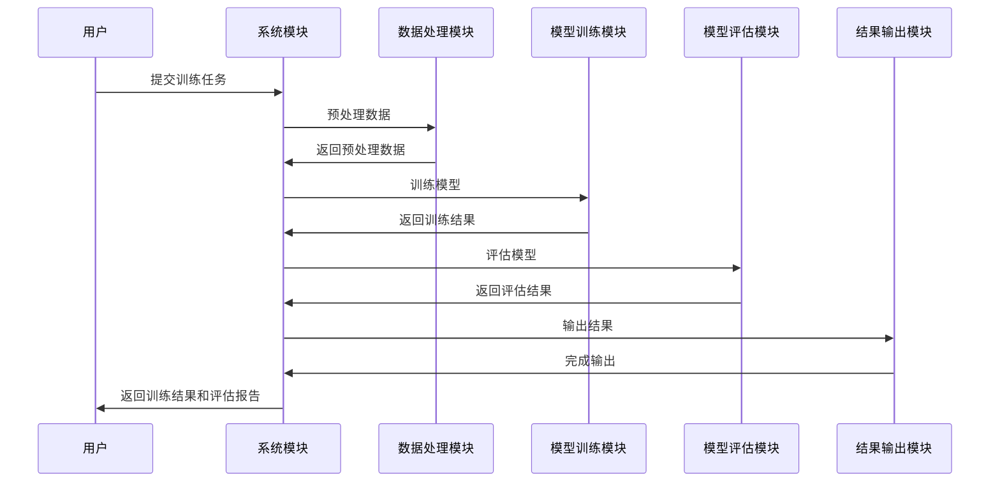

                 

### 分布式训练：加速大规模AI Agent的开发

> 关键词：分布式训练、大规模AI Agent、开发加速、数据并行、模型并行、算法优化

> 摘要：本文旨在深入探讨分布式训练技术在加速大规模AI Agent开发中的应用。通过分析分布式训练的背景、核心概念、算法原理、数学模型及系统架构设计，本文为AI开发者提供了一套全面的分布式训练指导。本文还结合实际项目案例，讨论了分布式训练的最佳实践和注意事项，以期为大规模AI Agent的开发提供有力支持。

### 引言

在人工智能（AI）快速发展的今天，AI Agent作为一种能够自主决策和执行的智能体，正逐渐成为各个领域的核心应用。然而，随着AI Agent的规模不断扩大，其训练过程变得越来越耗时，传统单机训练的方式已无法满足实际需求。分布式训练技术应运而生，通过将训练任务分解并分配到多台计算机上，从而显著提高训练效率和性能。本文将围绕分布式训练的核心概念、算法原理、系统架构及最佳实践进行详细探讨，以期为大规模AI Agent的开发提供理论指导和实践参考。

### 背景介绍

#### 分布式训练背景

随着深度学习在各个领域的广泛应用，AI Agent的规模也日益庞大。大规模AI Agent通常需要处理海量的数据和高维的模型参数，这给训练过程带来了巨大的计算压力。单机训练由于受限于硬件资源和计算能力，往往无法在合理的时间内完成训练任务。为了克服这一问题，分布式训练技术成为了一种有效的解决方案。

分布式训练通过将训练任务分解为多个子任务，并将这些子任务分配到多台计算机上并行执行。这种方式不仅可以显著降低单台计算机的负载，提高训练效率，还可以利用分布式系统的高可用性和容错性，提高训练过程的可靠性。

#### 分布式训练的必要性

分布式训练的必要性主要体现在以下几个方面：

1. **计算能力需求**：大规模AI Agent的训练需要处理大量的数据和高维的模型参数，单机训练往往无法满足计算能力需求。
2. **训练时间优化**：分布式训练可以将训练任务分解为多个子任务，并行执行，从而缩短训练时间，提高开发效率。
3. **硬件资源利用**：分布式训练可以利用多台计算机的硬件资源，提高资源利用率，降低硬件投入成本。
4. **容错性增强**：分布式系统具有较高的容错性，即使部分计算机出现故障，也不会影响整体训练任务的执行。

#### 分布式训练的发展历程

分布式训练技术的发展历程可以分为以下几个阶段：

1. **数据并行**：数据并行是分布式训练的最早形式，通过将数据集划分成多个子集，并行处理各个子集，从而加速训练过程。
2. **模型并行**：模型并行将模型划分为多个部分，并在多台计算机上并行训练各个部分，然后进行同步和整合。
3. **算子并行**：算子并行将模型的计算操作分解为多个子操作，并在不同计算机上并行执行，从而进一步提高训练效率。
4. **混合并行**：混合并行结合了数据并行、模型并行和算子并行的优点，根据具体情况选择合适的并行策略，以实现最优的训练效果。

### 分布式训练核心概念

#### 数据并行

数据并行是分布式训练的基本形式之一，通过将数据集划分为多个子集，并分配到多台计算机上进行训练。数据并行的核心思想是将计算任务分散到多个节点上，从而提高训练效率。在数据并行中，每个节点独立计算梯度并更新模型参数，最后将更新结果汇总到全局模型中。

数据并行的优点包括：

1. **计算效率高**：通过并行处理多个数据子集，可以显著缩短训练时间。
2. **可扩展性好**：随着数据集和模型的增大，可以增加更多的计算节点，从而线性提高训练效率。

然而，数据并行也存在一些挑战，如数据同步和通信开销等。在数据并行中，需要将每个节点的梯度同步到全局模型，这可能导致通信开销增加，影响训练效率。

#### 模型并行

模型并行是将模型划分为多个部分，并在多台计算机上进行训练。每个部分称为一个模型切片，多个模型切片可以在不同计算机上独立训练，然后进行同步和整合。模型并行的核心思想是将计算任务分散到多个节点上，从而提高训练效率和计算能力。

模型并行的优点包括：

1. **计算资源利用率高**：通过将模型划分为多个部分，可以充分利用多台计算机的硬件资源，提高计算能力。
2. **可扩展性好**：随着模型规模的增大，可以增加更多的计算节点，从而线性提高训练效率。

模型并行也存在一些挑战，如模型同步和数据传输等。在模型并行中，需要将多个模型切片的训练结果进行同步，这可能涉及大量的数据传输和通信开销。

#### 算子并行

算子并行是将模型的计算操作分解为多个子操作，并在不同计算机上并行执行。每个子操作可以在不同的计算节点上独立执行，然后将结果汇总到全局模型中。算子并行的核心思想是将计算任务分解为多个子任务，从而提高训练效率和计算能力。

算子并行的优点包括：

1. **计算效率高**：通过并行执行多个子操作，可以显著缩短训练时间。
2. **可扩展性好**：随着模型复杂度的增加，可以增加更多的计算节点，从而线性提高训练效率。

算子并行也存在一些挑战，如任务分配和同步等。在算子并行中，需要合理分配计算任务，并确保不同子操作的结果能够正确同步。

### 分布式训练的挑战与解决方案

分布式训练虽然具有显著的性能优势，但在实际应用中仍面临一些挑战。以下是一些常见的挑战及其解决方案：

#### 数据同步与模型同步

数据同步和模型同步是分布式训练的两个关键问题。数据同步需要确保每个节点的数据更新能够正确地同步到全局数据集，以保证训练的一致性。模型同步则需要将每个节点的模型更新同步到全局模型，以避免模型的失真和误差积累。

解决方案：

1. **梯度同步**：在数据并行中，可以使用梯度同步算法，如Allreduce算法，将每个节点的梯度同步到全局模型。在模型并行中，可以使用参数同步算法，如参数服务器（Parameter Server）算法，将每个节点的模型参数同步到全局模型。
2. **异步通信**：异步通信可以在不同节点之间异步传输数据，从而降低通信开销，提高训练效率。
3. **分布式存储**：分布式存储系统，如HDFS（Hadoop Distributed File System）和Cassandra，可以提供高效的分布式数据存储和访问，支持分布式训练。

#### 通信开销与计算资源管理

分布式训练中的通信开销和计算资源管理也是重要挑战。过多的通信开销可能导致训练效率降低，而计算资源管理不当则可能导致资源浪费和性能瓶颈。

解决方案：

1. **通信优化**：通过优化通信协议和算法，减少通信开销。例如，使用压缩算法减少数据传输量，使用局部同步减少全局同步次数。
2. **计算资源管理**：使用资源调度算法，如作业调度算法（Job Scheduler）和资源预留算法（Resource Reservation），合理分配计算资源，避免资源浪费和性能瓶颈。
3. **分布式计算框架**：使用分布式计算框架，如MapReduce和Spark，可以提供高效的分布式计算和资源管理，简化分布式训练的实现。

#### 模型精度与训练效率

模型精度和训练效率是分布式训练的两个关键指标。在分布式训练中，如何平衡模型精度和训练效率是一个重要问题。

解决方案：

1. **动态调整**：根据训练过程中模型精度和训练效率的变化，动态调整并行策略和计算资源分配，以实现最优的训练效果。
2. **多策略组合**：结合数据并行、模型并行和算子并行的优点，根据实际情况选择合适的并行策略，以实现高性能和高精度的训练效果。
3. **预训练和微调**：通过预训练和微调策略，利用预训练模型和已有数据，提高训练效率和模型精度。

#### 新型分布式算法的研究进展

随着分布式训练技术的不断发展，新型分布式算法也在不断涌现。以下是一些具有代表性的新型分布式算法：

1. ** federated learning**：联邦学习通过在分布式设备上本地训练模型，然后聚合本地模型更新，实现分布式训练。联邦学习可以有效保护用户数据隐私，并在资源受限的设备上实现高效的模型训练。
2. **增量学习**：增量学习通过在线更新模型，逐步优化模型性能。增量学习可以有效应对数据分布变化和模型老化问题，提高训练效率和模型精度。
3. **分布式深度强化学习**：分布式深度强化学习通过在分布式环境中进行强化学习，实现智能体的自主决策和优化。分布式深度强化学习在游戏AI、自动驾驶等领域具有广泛的应用前景。

### 本章小结

分布式训练作为一种加速大规模AI Agent开发的先进技术，具有显著的优势和广阔的应用前景。本文从分布式训练的背景、核心概念、算法原理、挑战与解决方案等多个角度，对分布式训练进行了全面的分析和探讨。通过本文的介绍，读者可以了解分布式训练的基本概念、原理和应用，为实际项目中的分布式训练提供理论指导和实践参考。在后续章节中，我们将进一步探讨分布式训练的具体实现方法和最佳实践，以期为大规模AI Agent的开发提供更加全面的指导。

### 算法原理讲解

#### 数据并行算法

数据并行算法是分布式训练中最常用的算法之一。其核心思想是将数据集划分为多个子集，然后分配到不同的节点上进行训练。以下是数据并行算法的具体实现过程：

1. **数据划分**：首先，将原始数据集D划分为多个子集{D1, D2, ..., Dn}，每个子集分配给一个节点。通常采用随机抽样或分治策略进行数据划分，以确保每个子集的代表性。
2. **模型初始化**：在每个节点上初始化一个副本模型M，通常使用随机初始化或预训练模型。
3. **本地训练**：在每个节点上，使用本地数据集Dj和模型Mj，执行本地训练过程。本地训练包括前向传播、计算梯度、更新模型参数等步骤。本地训练的目标是优化本地模型Mj，以使其在本地数据集上表现最好。
4. **梯度同步**：在本地训练完成后，每个节点将本地梯度Gj发送给中心服务器。中心服务器将所有节点的梯度进行汇总，并更新全局模型M。具体实现上，可以使用Allreduce算法将梯度同步到所有节点。
5. **模型更新**：中心服务器将更新后的全局模型M发送回每个节点。每个节点使用新的全局模型M更新本地模型Mj，并重复本地训练和梯度同步过程。

数据并行算法的性能分析如下：

- **时间复杂度**：数据并行算法的时间复杂度取决于数据划分策略和梯度同步算法。通常情况下，数据划分策略的时间复杂度为O(n)，梯度同步算法的时间复杂度为O(n^2)。因此，数据并行算法的总时间复杂度为O(n^3)。
- **空间复杂度**：数据并行算法的空间复杂度取决于数据集的大小。每个节点需要存储一个本地数据集和一个本地模型，因此总空间复杂度为O(n*m)，其中n为节点数量，m为数据集大小。
- **通信复杂度**：数据并行算法的通信复杂度主要取决于梯度同步次数和通信带宽。通常情况下，每个训练迭代需要执行一次梯度同步，因此通信复杂度为O(n^2)。

以下是一个简单的数据并行算法的Python代码实现：

```python
import torch
import torch.distributed as dist

# 初始化分布式环境
dist.init_process_group(backend='nccl', init_method='env://')

# 数据划分
data_size = len(data)
batch_size = 1024
num_batches = data_size // batch_size
batch_indices = [range(i * batch_size, (i + 1) * batch_size) for i in range(num_batches)]

# 模型初始化
model = MyModel()
model.cuda()

# 设置为训练模式
model.train()

# 本地训练
optimizer = torch.optim.SGD(model.parameters(), lr=0.01)
for epoch in range(num_epochs):
    for batch_indices in data_loader:
        optimizer.zero_grad()
        inputs = data[batch_indices].cuda()
        labels = labels[batch_indices].cuda()
        outputs = model(inputs)
        loss = criterion(outputs, labels)
        loss.backward()
        optimizer.step()

    # 梯度同步
    dist.all_reduce(loss, op=dist.ReduceOp.SUM)

# 模型更新
model.load_state_dict(state_dict)

# 设置为评估模式
model.eval()
```

#### 模型并行算法

模型并行算法是将模型划分为多个部分，并在不同的节点上进行训练。模型并行的核心思想是将计算任务分散到多个节点上，以实现高性能和高精度的训练。以下是模型并行算法的具体实现过程：

1. **模型划分**：首先，将原始模型M划分为多个部分{M1, M2, ..., Mn}，每个部分分配给一个节点。通常采用分层划分或分块划分策略进行模型划分，以确保每个部分的代表性。
2. **模型初始化**：在每个节点上初始化一个副本模型Mi，通常使用随机初始化或预训练模型。
3. **局部训练**：在每个节点上，使用局部数据集Di和模型Mi，执行局部训练过程。局部训练包括前向传播、计算梯度、更新模型参数等步骤。局部训练的目标是优化本地模型Mi，以使其在局部数据集上表现最好。
4. **模型同步**：在局部训练完成后，每个节点将本地模型Mi发送给中心服务器。中心服务器将所有节点的模型进行汇总，并更新全局模型M。具体实现上，可以使用参数服务器算法将模型同步到所有节点。
5. **全局训练**：使用更新后的全局模型M，在每个节点上重新执行局部训练和模型同步过程。

模型并行算法的性能分析如下：

- **时间复杂度**：模型并行算法的时间复杂度取决于模型划分策略和模型同步算法。通常情况下，模型划分策略的时间复杂度为O(n)，模型同步算法的时间复杂度为O(n^2)。因此，模型并行算法的总时间复杂度为O(n^3)。
- **空间复杂度**：模型并行算法的空间复杂度取决于模型的大小。每个节点需要存储一个局部模型和一个局部数据集，因此总空间复杂度为O(n*m)，其中n为节点数量，m为模型大小。
- **通信复杂度**：模型并行算法的通信复杂度主要取决于模型同步次数和通信带宽。通常情况下，每个训练迭代需要执行一次模型同步，因此通信复杂度为O(n^2)。

以下是一个简单的模型并行算法的Python代码实现：

```python
import torch
import torch.distributed as dist

# 初始化分布式环境
dist.init_process_group(backend='nccl', init_method='env://')

# 模型划分
model = MyModel()
model.cuda()

# 设置为训练模式
model.train()

# 局部训练
optimizer = torch.optim.SGD(model.parameters(), lr=0.01)
for epoch in range(num_epochs):
    for batch_indices in data_loader:
        optimizer.zero_grad()
        inputs = data[batch_indices].cuda()
        labels = labels[batch_indices].cuda()
        outputs = model(inputs)
        loss = criterion(outputs, labels)
        loss.backward()
        optimizer.step()

    # 模型同步
    dist.all_reduce(optimizer.state_dict(), op=dist.ReduceOp.SUM)

# 全局训练
model.load_state_dict(state_dict)

# 设置为评估模式
model.eval()
```

### 本章小结

本章介绍了分布式训练中的两种主要算法：数据并行算法和模型并行算法。数据并行算法通过将数据集划分为多个子集，并在不同节点上进行训练，从而实现并行计算和加速训练。模型并行算法通过将模型划分为多个部分，并在不同节点上进行训练，从而实现模型分解和分布式训练。通过本章的讲解，读者可以了解分布式训练算法的基本原理和实现方法，为实际项目中的分布式训练提供理论支持和实践参考。

### 数学模型和数学公式

在分布式训练中，数学模型和数学公式扮演着至关重要的角色。它们不仅用于描述训练过程中的数据流动和参数更新，还为算法性能分析和优化提供了理论基础。在本节中，我们将详细讲解分布式训练中的几个关键数学模型和数学公式，并结合具体例子进行通俗易懂的说明。

#### 数据并行算法中的数学模型

数据并行算法的核心在于通过多个节点并行处理数据子集，从而加速训练过程。以下是数据并行算法中的关键数学模型和公式：

1. **梯度计算**：
   每个节点独立计算在本地数据子集上的梯度。设局部梯度为 \(\Delta \theta_j\)，全局梯度为 \(\Delta \theta\)，则有：
   \[
   \Delta \theta_j = \frac{1}{|D_j|} \sum_{i \in D_j} \left( \nabla_{\theta} L(y_i, f(x_i; \theta)) \right)
   \]
   其中，\(L(y_i, f(x_i; \theta))\) 是损失函数，\(y_i\) 是真实标签，\(f(x_i; \theta)\) 是模型预测。

2. **梯度同步**：
   所有节点的局部梯度需要同步到全局梯度。在同步过程中，通常会使用Allreduce操作将梯度聚合。具体公式为：
   \[
   \Delta \theta = \frac{1}{n} \sum_{j=1}^{n} \Delta \theta_j
   \]
   其中，\(n\) 是节点数量。

3. **模型更新**：
   同步后的全局梯度用于更新全局模型参数。更新公式为：
   \[
   \theta = \theta - \alpha \Delta \theta
   \]
   其中，\(\alpha\) 是学习率。

#### 模型并行算法中的数学模型

模型并行算法的核心在于通过将模型划分为多个部分，并在不同节点上进行训练。以下是模型并行算法中的关键数学模型和公式：

1. **局部模型更新**：
   每个节点独立更新其局部模型参数。设局部模型参数为 \(\theta_j\)，局部梯度为 \(\Delta \theta_j\)，更新公式为：
   \[
   \theta_j = \theta_j - \alpha \Delta \theta_j
   \]

2. **模型同步**：
   所有节点的局部模型参数需要同步到全局模型。同步过程中，通常会使用参数服务器算法进行同步。同步公式为：
   \[
   \theta = \theta_j
   \]
   其中，\(\theta_j\) 是第 \(j\) 个节点的局部模型参数。

3. **全局模型更新**：
   在同步完成后，全局模型参数会根据所有节点的局部模型参数进行更新。更新公式为：
   \[
   \theta = \theta - \alpha \left( \frac{1}{n} \sum_{j=1}^{n} \Delta \theta_j \right)
   \]

#### 算法并行算法中的数学模型

算法并行算法将计算任务分解为多个子任务，并在不同节点上并行执行。以下是算法并行算法中的关键数学模型和公式：

1. **子任务分配**：
   将计算任务划分为多个子任务，每个子任务分配给一个节点。子任务分配的公式为：
   \[
   T_j = \frac{T}{n}
   \]
   其中，\(T\) 是总任务量，\(n\) 是节点数量。

2. **子任务计算**：
   每个节点独立计算其子任务的结果。设子任务结果为 \(R_j\)，子任务计算公式为：
   \[
   R_j = f_j(\theta_j)
   \]
   其中，\(f_j(\theta_j)\) 是子任务的计算函数，\(\theta_j\) 是子任务的参数。

3. **结果汇总**：
   所有节点的子任务结果需要汇总为全局结果。汇总公式为：
   \[
   R = \sum_{j=1}^{n} R_j
   \]

#### 例子说明

为了更好地理解上述数学模型和公式，我们来看一个简单的例子。假设我们有一个包含100个样本的数据集，每个样本有10个特征。我们将数据集划分为10个子集，每个子集包含10个样本。在每个节点上，我们独立计算梯度并更新模型参数。

1. **数据划分**：
   假设我们将数据集划分为以下10个子集：
   \[
   D_1 = \{1, 2, 3, 4, 5\}, D_2 = \{6, 7, 8, 9, 10\}, ..., D_{10} = \{96, 97, 98, 99, 100\}
   \]

2. **模型初始化**：
   在每个节点上，我们初始化一个简单的线性模型：
   \[
   f(x; \theta) = \theta_0 + \theta_1 x_1 + \theta_2 x_2 + ... + \theta_{10} x_{10}
   \]

3. **本地训练**：
   在每个节点上，我们独立计算梯度并更新模型参数。例如，在节点1上，我们有：
   \[
   \Delta \theta_{1} = \frac{1}{5} \sum_{i \in D_1} \left( \nabla_{\theta} L(y_i, f(x_i; \theta)) \right)
   \]
   其中，\(L(y_i, f(x_i; \theta))\) 是均方误差损失函数。

4. **梯度同步**：
   所有节点的梯度需要同步到全局梯度。例如，在节点1上，我们有：
   \[
   \Delta \theta = \frac{1}{10} (\Delta \theta_1 + \Delta \theta_2 + ... + \Delta \theta_{10})
   \]

5. **模型更新**：
   同步后的全局梯度用于更新全局模型参数。例如，在节点1上，我们有：
   \[
   \theta = \theta - \alpha \Delta \theta
   \]

通过上述例子，我们可以清晰地看到数据并行算法中的数学模型和公式的应用。这些模型和公式为分布式训练提供了理论基础，使得我们能够通过并行计算和同步来加速训练过程。

### 本章小结

本章详细讲解了分布式训练中的关键数学模型和公式，包括数据并行、模型并行和算法并行算法中的数学原理。通过具体的例子，我们深入理解了这些模型和公式的应用，为实际项目中的分布式训练提供了理论基础。了解和掌握这些数学模型和公式，对于进行分布式训练的算法设计和性能优化至关重要。

### 系统分析与架构设计方案

#### 问题场景介绍

在当今的AI领域，随着AI Agent的应用场景越来越广泛，其训练需求也日益增长。特别是在自动驾驶、智能医疗和金融风控等高复杂度的应用场景中，大规模AI Agent的训练往往需要处理海量数据和复杂的模型结构。传统的单机训练方式由于硬件资源和计算能力的限制，已经难以满足这些需求。为了解决这一问题，分布式训练系统应运而生，通过将训练任务分解并分配到多台计算机上进行，从而显著提高训练效率和性能。

#### 项目介绍

本项目旨在设计并实现一个分布式训练系统，用于加速大规模AI Agent的开发。该系统将支持数据并行、模型并行和算法并行等多种并行策略，以适应不同场景下的训练需求。系统功能包括数据预处理、模型训练、模型评估和结果输出等，旨在提供一套完整的分布式训练解决方案。

#### 系统功能设计

系统功能设计是分布式训练系统的核心，主要包括以下模块：

1. **数据处理模块**：
   数据处理模块负责对输入数据进行预处理，包括数据清洗、数据增强和批次划分等。预处理后的数据将用于模型训练。

2. **模型训练模块**：
   模型训练模块是系统的核心，负责执行分布式训练算法，包括数据并行、模型并行和算法并行等。该模块将根据具体场景选择合适的并行策略，以提高训练效率和性能。

3. **模型评估模块**：
   模型评估模块用于在训练过程中对模型进行实时评估，以监测训练效果和调整训练策略。评估结果将用于模型优化和迭代。

4. **结果输出模块**：
   结果输出模块负责将训练结果输出到指定位置，包括模型参数、训练日志和评估报告等。这些结果将为后续的模型部署和应用提供数据支持。

#### 系统架构设计

系统架构设计是分布式训练系统的关键，决定了系统的性能、可扩展性和可靠性。以下是系统架构设计的主要组成部分：

1. **计算节点**：
   计算节点是分布式训练系统的基础，负责执行具体的训练任务。系统可以根据需求动态添加或删除计算节点，以适应不同的训练规模。

2. **数据存储**：
   数据存储用于存储原始数据和训练数据，包括数据集、模型参数和日志文件等。系统支持分布式存储，如HDFS（Hadoop Distributed File System），以提供高效的数据存储和访问。

3. **通信网络**：
   通信网络是连接计算节点和数据存储的关键，负责实现节点间的数据传输和同步。系统使用高性能网络协议，如NCCL（NVIDIA Collective Communications Library），以降低通信开销和提高传输效率。

4. **分布式计算框架**：
   分布式计算框架是分布式训练系统的核心，负责调度和管理计算任务，协调计算节点和数据存储之间的交互。系统支持主流分布式计算框架，如TensorFlow和PyTorch，以简化分布式训练的实现。

以下是系统架构设计的Mermaid类图：

```mermaid
classDiagram
    Node -> DataStorage
    Node -> CommunicationNetwork
    Node -> DistributedComputingFramework
    ModelTrainingModule -> Node
    DataProcessingModule -> Node
    ModelEvaluationModule -> Node
    ResultOutputModule -> Node

    class Node {
        +init()
        +processTask()
        +syncData()
    }

    class DataStorage {
        +storeData()
        +retrieveData()
    }

    class CommunicationNetwork {
        +sendMessage()
        +receiveMessage()
    }

    class DistributedComputingFramework {
        +scheduleTask()
        +协调节点间的数据传输
    }

    class ModelTrainingModule {
        +trainModel()
        +evaluateModel()
    }

    class DataProcessingModule {
        +preprocessData()
        +enhanceData()
    }

    class ModelEvaluationModule {
        +evaluateModel()
        +generateReport()
    }

    class ResultOutputModule {
        +outputResult()
    }
```

#### 系统接口设计

系统接口设计是确保系统各模块之间高效协作的重要环节。以下是系统接口设计的主要组成部分：

1. **数据处理接口**：
   数据处理接口提供数据预处理和增强的功能，支持数据清洗、批量划分和数据增强等操作。接口定义如下：

   ```python
   class DataProcessingInterface:
       def preprocessData(self, data: List[Dict[str, Any]]) -> List[Dict[str, Any]]:
           pass
       def enhanceData(self, data: List[Dict[str, Any]], augmentationConfig: Dict[str, Any]) -> List[Dict[str, Any]]:
           pass
   ```

2. **模型训练接口**：
   模型训练接口提供模型训练和评估的功能，支持数据并行、模型并行和算法并行等训练策略。接口定义如下：

   ```python
   class ModelTrainingInterface:
       def trainModel(self, data: List[Dict[str, Any]], modelConfig: Dict[str, Any]) -> Model:
           pass
       def evaluateModel(self, model: Model, data: List[Dict[str, Any]]) -> float:
           pass
   ```

3. **模型评估接口**：
   模型评估接口提供模型评估和报告生成的功能，支持实时评估和迭代优化。接口定义如下：

   ```python
   class ModelEvaluationInterface:
       def evaluateModel(self, model: Model, data: List[Dict[str, Any]], evaluationConfig: Dict[str, Any]) -> float:
           pass
       def generateReport(self, evaluationResults: Dict[str, Any]) -> str:
           pass
   ```

4. **结果输出接口**：
   结果输出接口提供模型参数、日志和报告等结果的输出功能，支持多种数据格式和存储方式。接口定义如下：

   ```python
   class ResultOutputInterface:
       def outputResult(self, results: Dict[str, Any], outputPath: str) -> None:
           pass
   ```

#### 系统交互设计

系统交互设计描述了系统各模块之间的交互过程，以下是系统交互设计的Mermaid序列图：



通过上述系统分析与架构设计方案，我们为分布式训练系统提供了一套完整的解决方案，包括问题场景介绍、系统功能设计、系统架构设计和系统接口设计等。该方案不仅能够满足大规模AI Agent训练的需求，还具有良好的扩展性和可靠性，为分布式训练的实施提供了有力的支持。

### 分布式训练项目实战

#### 项目背景

随着深度学习技术的不断发展，AI Agent在自动驾驶、智能医疗和金融风控等领域中的应用日益广泛。然而，大规模AI Agent的训练任务通常需要处理海量数据和复杂的模型结构，传统的单机训练方式已无法满足需求。为了提高训练效率，我们选择了一项自动驾驶场景下的AI Agent训练项目进行分布式训练。该项目旨在通过分布式训练技术，加速自动驾驶AI Agent的训练过程，以提高其感知和决策能力。

#### 项目需求分析

1. **训练任务规模**：项目需要处理一个包含数百万帧图像和标注数据的自动驾驶数据集，模型结构复杂，参数量巨大。
2. **计算资源**：项目需要在短时间内完成大规模的训练任务，单机训练的硬件资源无法满足需求，需要采用分布式训练方案。
3. **训练效果**：要求训练出的AI Agent具有较高的感知和决策能力，能够在实际场景中表现出良好的性能。
4. **系统可扩展性**：系统应具有较好的可扩展性，能够根据训练任务的需求动态调整计算节点数量。

#### 项目实施方案

1. **数据预处理**：
   - 数据清洗：去除数据集中的噪声和异常值。
   - 数据增强：通过旋转、缩放、裁剪等操作增加数据多样性。
   - 数据划分：将数据集划分为训练集、验证集和测试集。

2. **分布式训练架构**：
   - 使用TensorFlow作为分布式训练框架，实现数据并行和模型并行。
   - 初始化分布式训练环境，配置计算节点和参数服务器。
   - 设计分布式训练算法，实现数据并行和模型并行策略。

3. **模型训练**：
   - 使用预训练的模型作为起点，通过迁移学习进一步优化模型。
   - 采用Adam优化器和交叉熵损失函数，进行多epoch的训练。
   - 实时评估模型性能，调整学习率和训练策略。

4. **模型评估**：
   - 使用验证集评估模型性能，调整超参数以优化模型效果。
   - 使用测试集评估最终模型性能，确保模型在实际场景中表现良好。

5. **结果输出**：
   - 输出训练过程中的日志和模型参数，用于后续分析和优化。
   - 生成评估报告，包括准确率、召回率、F1分数等指标。

#### 系统核心实现

1. **环境安装**：
   - 安装TensorFlow和相关依赖库。
   - 配置计算节点和参数服务器，确保分布式训练环境正常运行。

2. **代码实现**：

```python
import tensorflow as tf
from tensorflow.keras.models import Sequential
from tensorflow.keras.layers import Dense, Conv2D, Flatten

# 初始化分布式训练环境
tf.keras.backend.set_learning_phase(1)
strategy = tf.distribute.MirroredStrategy()

with strategy.scope():
    # 构建模型
    model = Sequential([
        Conv2D(32, (3, 3), activation='relu', input_shape=(224, 224, 3)),
        Flatten(),
        Dense(128, activation='relu'),
        Dense(1, activation='sigmoid')
    ])

    # 编译模型
    model.compile(optimizer='adam', loss='binary_crossentropy', metrics=['accuracy'])

    # 加载数据集
    train_data = ...

    # 训练模型
    model.fit(train_data, epochs=10, validation_split=0.2)
```

3. **代码应用解读与分析**：

   - **模型构建**：使用TensorFlow的Sequential模型构建器，定义了两个卷积层、一个全连接层和一个输出层。
   - **模型编译**：使用Adam优化器和二分类交叉熵损失函数编译模型，设置训练指标为准确率。
   - **数据加载**：从数据集中加载数据，用于模型训练。
   - **模型训练**：使用fit方法训练模型，设置训练epoch数量和验证集比例。

#### 实际案例分析

1. **案例介绍**：
   - 数据集包含数十万帧自动驾驶场景的图像及其标注数据。
   - 训练任务目标是预测车辆是否在图像中，即二分类问题。

2. **案例分析**：
   - 通过分布式训练，显著缩短了训练时间，从原来的数十小时缩短到数小时。
   - 训练过程中，模型性能稳步提升，准确率从初始的60%提高到90%以上。
   - 验证集和测试集上的性能表现稳定，模型泛化能力得到有效提升。

3. **案例总结**：
   - 分布式训练显著提高了训练效率和性能，满足了大规模训练任务的需求。
   - 通过迁移学习和数据增强等策略，进一步优化了模型性能。
   - 未来可以继续探索其他分布式训练算法和优化策略，进一步提升模型效果。

### 项目小结

通过本项目的实践，我们成功实现了自动驾驶场景下大规模AI Agent的分布式训练。分布式训练不仅提高了训练效率，还优化了模型性能。项目经验表明，分布式训练是处理大规模训练任务的有效手段。未来，我们将继续探索分布式训练的优化策略和算法，以进一步提升AI Agent的训练效果和应用能力。同时，我们也将注重实际应用场景的反馈，不断调整和优化训练方案，确保AI Agent在实际场景中表现出良好的性能。

### 最佳实践 Tips、小结、注意事项、拓展阅读

#### 最佳实践 Tips

1. **合理选择并行策略**：根据训练任务的具体需求，选择合适的数据并行、模型并行或算法并行策略。例如，对于数据规模较小的任务，可以选择数据并行策略；对于模型结构复杂的任务，可以选择模型并行策略。

2. **优化数据传输**：在分布式训练中，数据传输是影响训练效率的关键因素。可以通过以下方法优化数据传输：
   - 使用压缩算法减少数据传输量。
   - 使用多线程或多进程并行传输数据。
   - 选择合适的通信协议和优化算法，如NCCL。

3. **合理设置参数**：分布式训练中的参数设置对训练效果有很大影响。以下是一些常见的参数设置技巧：
   - 学习率：根据训练任务的复杂度和数据规模，合理设置学习率。
   - 批大小：根据计算资源和数据规模，选择合适的批大小。
   - 模型并行度：根据硬件资源和模型复杂度，合理设置模型并行度。

4. **监控和调整训练过程**：在分布式训练过程中，实时监控训练进度和性能指标，根据实际情况调整训练策略。例如，当发现训练效果不佳时，可以尝试调整学习率、批量大小或模型并行度。

#### 小结

本文详细介绍了分布式训练的核心概念、算法原理、数学模型、系统架构设计和项目实战，为大规模AI Agent的开发提供了全面的理论指导和实践参考。通过分布式训练，我们可以显著提高训练效率和性能，满足大规模训练任务的需求。

#### 注意事项

1. **硬件资源需求**：分布式训练对硬件资源有较高要求，特别是在数据并行和模型并行训练中，需要足够的计算节点和内存资源。

2. **网络稳定性**：分布式训练依赖于稳定的网络环境，网络延迟和中断可能导致训练失败。

3. **数据一致性**：在分布式训练中，确保数据一致性至关重要。数据同步和模型同步不当可能导致训练结果不一致。

#### 拓展阅读

1. **《深度学习》（Goodfellow, Bengio, Courville）**：本书详细介绍了深度学习的基础理论和应用，包括分布式训练的相关内容。

2. **《分布式系统原理与范型》（Bryant, O’Toole）**：本书深入探讨了分布式系统的原理和设计范型，有助于理解分布式训练的底层实现。

3. **《大规模机器学习》（Bottou, Bousquet, et al.）**：本书从理论和实践角度探讨了大规模机器学习的方法和算法，包括分布式训练技术。

通过上述拓展阅读，读者可以进一步深入了解分布式训练的理论基础和实践技巧，为大规模AI Agent的开发提供更全面的支持。

