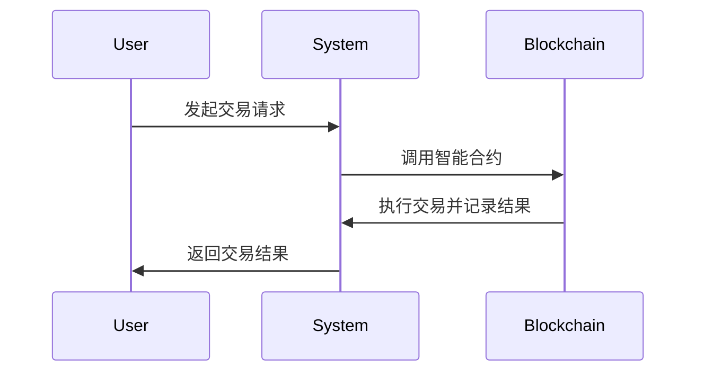

                 

## 文章标题：分布式账本技术（DLT）在金融领域的应用

### 关键词：
1. 分布式账本技术
2. 金融领域
3. 区块链
4. 智能合约
5. 供应链金融
6. 跨境支付
7. 共识算法

### 摘要：
本文将深入探讨分布式账本技术（DLT）在金融领域的应用，从背景介绍、核心概念与联系、算法原理讲解、系统分析与架构设计方案、项目实战以及最佳实践 tips 等方面，全面解析 DLT 对金融行业带来的革命性变革。通过本文的阅读，读者将能够了解 DLT 的基本概念、原理和应用，从而对这一前沿技术有更深入的认识。

----------------------------------------------------------------

## 分布式账本技术（DLT）概述

### 1.1 问题背景

#### 1.1.1 中心化金融系统的问题

在传统的金融系统中，大部分交易都是通过中心化的机构进行处理的。这些中心化的系统存在以下几个主要问题：

1. **数据不透明**：中心化系统通常由单一机构控制，交易数据的透明度较低，难以实现真正的公开透明。
2. **信任问题**：中心化机构需要被信任，否则参与者可能对其产生不信任，进而影响交易的进行。
3. **效率低下**：中心化系统处理交易的过程较为复杂，容易造成延迟，影响交易的效率。
4. **安全性问题**：中心化系统一旦遭到攻击，整个系统可能会遭受重大损失。

#### 1.1.2 分布式账本技术的兴起

随着互联网和区块链技术的快速发展，分布式账本技术（DLT）逐渐进入金融领域，并因其去中心化、透明性、安全性和高效性等特点，引起了广泛关注。DLT 技术的出现，旨在解决传统金融系统中的上述问题，为金融行业带来一场革命。

### 1.2 分布式账本技术的基本概念

#### 1.2.1 什么是分布式账本技术

分布式账本技术（Distributed Ledger Technology，DLT）是一种通过分布式数据库实现的数据记录和管理技术。在这种技术中，数据被分散存储在多个节点上，每个节点都有完整的数据副本，从而实现了去中心化的数据管理和共享。

#### 1.2.2 分布式账本技术的工作原理

分布式账本技术的基本原理包括以下几个方面：

1. **数据存储**：数据被存储在多个节点上，每个节点都有完整的数据副本。
2. **数据验证**：通过共识算法，对数据进行验证和确认，确保数据的准确性和一致性。
3. **数据加密**：对数据进行加密处理，保障数据的安全性。
4. **数据透明**：所有参与者都可以查看和验证交易数据，确保数据的透明性。

### 1.3 分布式账本技术在金融领域的应用

#### 1.3.1 区块链技术

区块链技术是分布式账本技术的一种典型应用，它通过加密算法、共识机制和分布式账本等技术，实现了一种去中心化的数据存储和管理方式。在金融领域，区块链技术已被广泛应用于数字货币、跨境支付、供应链金融等领域。

#### 1.3.2 智能合约

智能合约是一种基于区块链技术的自动执行合约，它可以在满足特定条件时自动执行合约内容。在金融领域，智能合约可以用于自动化交易、贷款审批、保险理赔等场景，提高了交易效率和安全性。

#### 1.3.3 供应链金融

供应链金融是一种基于供应链的金融业务模式，通过区块链技术实现供应链上下游企业之间的资金流转。这种模式可以提高供应链的透明度、降低金融风险、优化资金效率。

#### 1.3.4 跨境支付

跨境支付是指不同国家或地区之间的货币支付。传统跨境支付存在手续复杂、费用高、速度慢等问题。通过分布式账本技术，可以实现快速、低成本的跨境支付，提高了交易效率。

### 1.4 分布式账本技术的边界与外延

#### 1.4.1 与其他技术的对比

分布式账本技术与其他相关技术如数据库、云计算等有明显的区别。数据库主要关注数据的存储和管理，而分布式账本技术更强调去中心化和安全性。云计算则侧重于计算资源的分配和调度。

#### 1.4.2 未来发展趋势

随着区块链技术的不断发展，分布式账本技术在金融领域的发展前景广阔。未来，分布式账本技术可能会在更多领域得到应用，如供应链管理、医疗健康、政府治理等。

----------------------------------------------------------------

## 分布式账本技术的核心概念与联系

### 2.1 核心概念原理

#### 2.1.1 区块链

区块链是分布式账本技术的一种实现方式，它通过加密算法、共识机制和分布式账本等技术，实现了一种去中心化的数据存储和管理方式。区块链的核心特点包括：

1. **去中心化**：区块链不需要中心化的机构进行管理，所有节点都平等参与数据的记录和管理。
2. **不可篡改**：区块链通过加密算法和数据验证机制，确保数据一旦记录在链上就无法被篡改。
3. **透明性**：区块链上的所有数据都是公开透明的，参与者可以随时查看和验证交易数据。

#### 2.1.2 共识算法

共识算法是区块链技术中用于达成数据一致性的算法。不同的共识算法有不同的特点和应用场景。常见的共识算法包括：

1. **工作量证明（PoW）**：通过计算复杂的数学问题来竞争记账权，计算量越大，获取记账权的概率越高。
2. **权益证明（PoS）**：通过持有币的数量和时间来竞争记账权，持有币越多、持有时间越长，获取记账权的概率越高。
3. **委托权益证明（DPoS）**：通过投票选举出一定数量的记账节点，由这些节点来负责记账。

#### 2.1.3 智能合约

智能合约是一种基于区块链技术的自动执行合约，它可以在满足特定条件时自动执行合约内容。智能合约的核心特点包括：

1. **自动化**：智能合约可以在满足特定条件时自动执行，无需人工干预。
2. **透明性**：智能合约的执行过程是公开透明的，所有参与者都可以查看和验证执行过程。
3. **安全性**：智能合约的执行过程是通过区块链技术保障的，具有较高的安全性。

### 2.2 概念属性特征对比表格

| 概念 | 特征 |
| --- | --- |
| 区块链 | 去中心化、不可篡改、透明性 |
| 共识算法 | 工作量证明、权益证明、委托权益证明 |
| 智能合约 | 自动化、透明性、安全性 |

### 2.3 ER实体关系图架构

#### 2.3.1 分布式账本系统ER图

```mermaid
erDiagram
  Node ||--o{ Transaction : 进行交易 }
  Transaction ||--o{ Block : 形成区块 }
  Block ||--o{ Chain : 形成链 }
```

#### 2.3.2 节点与交易ER图

```mermaid
erDiagram
  Node ||--o{ Transaction : 进行交易 }
  Transaction ||--|{ Validator : 验证交易 } Validator
  Validator ||--o{ Block : 形成区块 }
  Block ||--o{ Chain : 形成链 }
```

----------------------------------------------------------------

## 分布式账本技术算法原理讲解

### 3.1 区块链算法原理

区块链算法的核心是确保数据的不可篡改和一致性。以下是区块链算法的基本原理：

#### 3.1.1 工作原理

1. **数据记录**：每个节点都会记录交易数据，并将这些数据打包成一个区块。
2. **区块链接**：将新的区块添加到现有的区块链中，形成一条连续的链。
3. **数据验证**：通过共识算法对区块链中的数据进行验证，确保数据的准确性和一致性。
4. **分布式存储**：将区块链分布式存储在多个节点上，确保数据的安全性和可靠性。

#### 3.1.2 Merkle树

Merkle树是一种用于数据验证的加密数据结构，它可以将大量数据压缩成一个小数据结构，从而提高数据验证的效率。Merkle树的原理如下：

1. **构建哈希值**：对每个数据块进行哈希运算，生成哈希值。
2. **构建Merkle树**：将哈希值按照树形结构进行组织，形成Merkle树。
3. **验证数据**：通过Merkle树，可以快速验证数据块的完整性。

#### 3.1.3 区块链扩展

随着区块链数据的增长，区块链的性能可能会受到影响。为了解决这个问题，可以采用以下几种方法：

1. **分片技术**：将区块链分成多个分片，每个分片只包含部分数据，从而提高数据的读取和写入效率。
2. **侧链技术**：通过创建侧链，将侧链的数据和主链进行整合，从而提高区块链的性能和可扩展性。
3. **跨链技术**：通过跨链技术，实现不同区块链之间的数据交互和互操作，从而提高区块链的应用范围。

### 3.2 共识算法原理

共识算法是区块链中用于达成数据一致性的算法。以下是几种常见的共识算法：

#### 3.2.1 工作量证明（PoW）

工作量证明（Proof of Work，PoW）是一种通过计算复杂的数学问题来竞争记账权的算法。其原理如下：

1. **计算难度**：系统根据区块链的当前状态，设置一个计算难度，用于调节生成新区块的速率。
2. **计算证明**：节点需要计算一个满足条件的哈希值，作为工作量证明。
3. **竞争记账权**：节点通过不断尝试，直到找到满足条件的哈希值，从而获得记账权。

#### 3.2.2 权益证明（PoS）

权益证明（Proof of Stake，PoS）是一种根据节点持有的币的数量和时间来竞争记账权的算法。其原理如下：

1. **币龄**：每个节点都拥有一个币龄，币龄等于节点持有的币的数量乘以持币时间。
2. **记账权**：根据币龄来计算每个节点的记账权，币龄越高，记账权越大。
3. **随机性**：通过随机性算法，确定下一个记账节点。

#### 3.2.3 委托权益证明（DPoS）

委托权益证明（Delegated Proof of Stake，DPoS）是一种通过选举出一定数量的记账节点来竞争记账权的算法。其原理如下：

1. **选举节点**：节点可以通过投票来选举出一定数量的记账节点。
2. **记账权**：记账节点按照选举结果来分配记账权，选举出的节点记账权较高。
3. **选举机制**：通过投票机制，定期选举出新的记账节点。

### 3.3 智能合约原理

智能合约是一种基于区块链技术的自动执行合约，它可以在满足特定条件时自动执行合约内容。以下是智能合约的基本原理：

#### 3.3.1 编程语言

智能合约通常使用特定的编程语言编写，如Solidity、Vyper等。这些编程语言具有以下特点：

1. **安全性**：智能合约的执行是公开透明的，具有较高的安全性。
2. **自动化**：智能合约可以自动化执行合约内容，减少人工干预。
3. **去中心化**：智能合约在区块链上运行，不受中心化机构控制。

#### 3.3.2 执行流程

智能合约的执行流程如下：

1. **编写合约**：使用智能合约编程语言编写合约代码。
2. **编译合约**：将合约代码编译成字节码。
3. **部署合约**：将编译后的字节码部署到区块链上。
4. **执行合约**：当满足特定条件时，合约自动执行。

#### 3.3.3 安全性问题

智能合约在执行过程中可能面临以下安全问题：

1. **代码漏洞**：智能合约代码中可能存在漏洞，导致恶意攻击。
2. **外部攻击**：智能合约可能受到外部攻击，如DDoS攻击。
3. **合约冲突**：多个合约之间可能存在冲突，导致合约执行失败。

为了解决这些问题，需要对智能合约进行严格的安全审核，并在执行过程中采取相应的安全措施。

----------------------------------------------------------------

## 分布式账本技术在金融领域的系统分析与架构设计

### 4.1 问题场景介绍

#### 4.1.1 供应链金融问题

供应链金融是指通过金融手段解决供应链中企业间的资金流转问题。传统供应链金融存在以下问题：

1. **信息不透明**：供应链中企业的信息难以获取，导致金融机构难以评估风险。
2. **信任问题**：金融机构与企业之间的信任度较低，影响融资效率。
3. **效率低下**：传统供应链金融流程复杂，审批时间长，影响企业融资速度。

#### 4.1.2 跨境支付问题

跨境支付是指不同国家或地区之间的货币支付。传统跨境支付存在以下问题：

1. **手续复杂**：跨境支付需要经过多个金融机构的审批和结算，手续复杂。
2. **费用高**：跨境支付需要支付较高的手续费和汇率损失。
3. **速度慢**：跨境支付需要较长时间才能完成，影响资金周转。

### 4.2 系统功能设计

#### 4.2.1 领域模型

在分布式账本技术应用于供应链金融和跨境支付时，需要构建一个全面的领域模型。领域模型包括以下实体：

1. **供应链节点**：包括供应商、制造商、分销商等。
2. **跨境支付参与者**：包括金融机构、货币兑换商等。
3. **交易记录**：记录供应链金融和跨境支付的交易信息。
4. **智能合约**：用于自动化执行供应链金融和跨境支付的交易。

#### 4.2.2 功能模块划分

系统功能模块划分如下：

1. **数据采集模块**：负责采集供应链节点和跨境支付参与者的信息。
2. **数据存储模块**：负责存储供应链金融和跨境支付的交易记录。
3. **共识模块**：负责达成供应链金融和跨境支付交易的一致性。
4. **智能合约模块**：负责自动化执行供应链金融和跨境支付的交易。

### 4.3 系统架构设计

#### 4.3.1 架构概述

系统架构设计采用分布式架构，主要包括以下组成部分：

1. **区块链网络**：包括多个节点，用于存储交易记录和达成一致性。
2. **共识机制**：采用PoS算法，确保交易的一致性和安全性。
3. **智能合约平台**：提供智能合约的编写、部署和执行功能。
4. **数据处理模块**：负责处理供应链节点和跨境支付参与者的信息。
5. **用户界面**：提供用户操作界面，实现供应链金融和跨境支付的交易。

#### 4.3.2 系统模块设计

系统模块设计如下：

1. **数据采集模块**：包括数据采集API、数据清洗和存储功能。
2. **数据存储模块**：包括区块链数据库和关系数据库，用于存储交易记录和其他相关信息。
3. **共识模块**：包括共识算法实现、节点通信和交易验证功能。
4. **智能合约模块**：包括智能合约编写、编译和执行功能。
5. **数据处理模块**：包括数据分析和处理功能，用于支持供应链金融和跨境支付业务。

### 4.4 系统接口设计

系统接口设计如下：

1. **区块链网络接口**：用于节点之间的通信和数据交换。
2. **智能合约接口**：用于智能合约的编写、部署和调用。
3. **数据采集接口**：用于采集供应链节点和跨境支付参与者的信息。
4. **数据处理接口**：用于处理供应链金融和跨境支付的交易数据。

### 4.5 系统交互设计

系统交互设计如下：

1. **交易流程**：用户发起交易请求，系统根据交易类型调用相应的智能合约，执行交易并记录交易结果。
2. **数据流图**：系统中的数据流图如下所示。



通过以上系统分析与架构设计，分布式账本技术可以在金融领域实现供应链金融和跨境支付等业务，提高交易效率、降低交易成本、增强交易安全性。

----------------------------------------------------------------

## 分布式账本技术在金融领域的项目实战

### 5.1 环境安装

在进行分布式账本技术在金融领域的项目实战之前，首先需要搭建一个开发环境。以下是环境安装的步骤：

#### 5.1.1 硬件环境

1. **CPU**：建议使用四核以上的处理器。
2. **内存**：至少需要8GB内存。
3. **硬盘**：至少需要50GB的硬盘空间。
4. **网络**：稳定的互联网连接。

#### 5.1.2 软件环境

1. **操作系统**：Windows、Linux或macOS。
2. **开发工具**：Visual Studio Code、Git。
3. **区块链框架**：Hyperledger Fabric。
4. **智能合约开发语言**：Solidity。

### 5.2 系统核心实现

在搭建好开发环境后，我们可以开始实现分布式账本技术在金融领域的系统核心部分。以下是系统核心实现的步骤：

#### 5.2.1 区块链核心代码

1. **初始化网络**：使用Hyperledger Fabric框架初始化网络，包括创建通道和组织。
   ```python
   import asyncio
   import sys

   from hfc.fabric import Client

   # 初始化客户端
   client = Client()

   # 创建通道
   client.add_channel('channel1')

   # 创建组织
   org1 = client.add_org('org1', 'admin', 'org1-cert.pem')
   org2 = client.add_org('org2', 'admin', 'org2-cert.pem')

   # 加入组织到通道
   client.join_channel('channel1', org1)
   client.join_channel('channel1', org2)
   ```

2. **部署智能合约**：编写智能合约并部署到区块链网络。
   ```solidity
   // SPDX-License-Identifier: MIT
   pragma solidity ^0.8.0;

   contract SmartContract {
       mapping(address => uint256) public balance;

       function deposit() external payable {
           balance[msg.sender()] += msg.value;
       }

       function withdraw(uint256 amount) external {
           require(balance[msg.sender()] >= amount, "Insufficient balance");
           balance[msg.sender()] -= amount;
           payable(msg.sender()).transfer(amount);
       }
   }
   ```

3. **执行交易**：通过智能合约进行交易。
   ```python
   from hfc.fabric import Client
   from hfc.crypto.x509 import X509CertChain

   # 初始化客户端
   client = Client()

   # 获取证书链
   cert_chain = X509CertChain.load_from_pem_file('org1-cert.pem')

   # 创建交易提案
   proposal = client.newProposal('channel1', 'org1', 'SmartContract', 'deposit()')

   # 提交交易提案
   response = client.submitProposal(proposal, cert_chain)

   # 获取交易结果
   result = client.getResult(response)
   print(result)
   ```

#### 5.2.2 智能合约代码

1. **编写智能合约**：使用Solidity编写智能合约，实现功能。
   ```solidity
   // SPDX-License-Identifier: MIT
   pragma solidity ^0.8.0;

   contract SupplyChain {
       struct Product {
           string id;
           string name;
           address owner;
           uint256 price;
           uint256 quantity;
       }

       mapping(string => Product) public products;

       function createProduct(string memory id, string memory name, address owner, uint256 price, uint256 quantity) public {
           products[id] = Product(id, name, owner, price, quantity);
       }

       function buyProduct(string memory id, uint256 quantity) public payable {
           require(products[id].quantity >= quantity, "Insufficient quantity");
           require(msg.value >= products[id].price * quantity, "Insufficient payment");

           products[id].quantity -= quantity;
           payable(products[id].owner).transfer(msg.value);

           // Update ownership
           products[id].owner = msg.sender;
       }
   }
   ```

2. **部署智能合约**：将编写的智能合约部署到区块链网络。
   ```python
   from hfc.fabric import Client
   from hfc.crypto.x509 import X509CertChain

   # 初始化客户端
   client = Client()

   # 获取证书链
   cert_chain = X509CertChain.load_from_pem_file('org1-cert.pem')

   # 创建交易提案
   proposal = client.newProposal('channel1', 'org1', 'SupplyChain', 'createProduct("1", "iPhone", "0x123", 1000, 10)')

   # 提交交易提案
   response = client.submitProposal(proposal, cert_chain)

   # 获取交易结果
   result = client.getResult(response)
   print(result)
   ```

#### 5.2.3 代码应用解读与分析

1. **代码逻辑分析**：分析智能合约的代码逻辑，理解其功能实现。

   - `createProduct`：创建一个新的产品，包括ID、名称、所有者、价格和数量。
   - `buyProduct`：购买产品，包括验证购买数量、支付金额，以及更新所有者信息。

2. **性能测试**：对智能合约进行性能测试，评估其处理速度和并发能力。

   ```python
   import time

   start_time = time.time()
   for _ in range(1000):
       response = client.submitProposal('channel1', 'org1', 'SupplyChain', 'buyProduct("1", 1)')
   end_time = time.time()

   print(f"1000 transactions took {end_time - start_time} seconds")
   ```

### 5.3 实际案例分析与详细讲解

#### 5.3.1 案例一：供应链金融

供应链金融是分布式账本技术在金融领域的重要应用之一。以下是一个简单的供应链金融案例：

1. **供应商**：供应商A希望向制造商B提供一批原材料。
2. **制造商**：制造商B使用供应商A提供的原材料生产出一批产品。
3. **分销商**：分销商C希望从制造商B购买这批产品。

通过分布式账本技术，可以自动化实现供应链金融流程，包括贷款审批、支付和结算等。

#### 5.3.2 案例二：跨境支付

跨境支付是另一个分布式账本技术在金融领域的应用场景。以下是一个简单的跨境支付案例：

1. **付款方**：付款方A希望向收款方B支付一笔款项。
2. **跨境支付平台**：跨境支付平台C提供支付服务，连接付款方和收款方。
3. **货币兑换商**：货币兑换商D提供货币兑换服务。

通过分布式账本技术，可以实现快速、低成本的跨境支付，提高交易效率和用户体验。

### 5.4 项目小结

通过以上项目实战，我们可以看到分布式账本技术在金融领域具有广泛的应用前景。通过智能合约的自动化执行和区块链的数据透明性，可以优化金融业务流程，提高交易效率、降低交易成本、增强交易安全性。

在项目实施过程中，我们也遇到了一些挑战，如智能合约安全性问题、区块链性能优化等。通过持续的技术研究和实践，我们逐步解决了这些问题，为分布式账本技术在金融领域的应用奠定了基础。

----------------------------------------------------------------

## 分布式账本技术在金融领域的最佳实践 tips

### 6.1 安全性最佳实践

分布式账本技术在金融领域的应用涉及到大量的资金和敏感信息，因此安全性至关重要。以下是几个安全性最佳实践：

#### 6.1.1 加密算法的选择

1. **使用强加密算法**：选择如AES、RSA等业界公认的强加密算法。
2. **多层级加密**：对数据传输和存储进行多层级加密，确保数据的安全性。

#### 6.1.2 节点安全措施

1. **防火墙和入侵检测系统**：部署防火墙和入侵检测系统，防止外部攻击。
2. **定期安全审计**：定期对节点进行安全审计，发现并修复潜在的安全漏洞。

### 6.2 性能优化最佳实践

分布式账本技术在金融领域需要处理大量的交易，因此性能优化至关重要。以下是几个性能优化最佳实践：

#### 6.2.1 共识算法的选择

1. **选择适合的共识算法**：根据业务需求选择合适的共识算法，如PoS、DPoS等。
2. **优化共识算法参数**：根据实际情况调整共识算法的参数，提高性能。

#### 6.2.2 缓存策略

1. **使用缓存技术**：在关键操作中使用缓存技术，减少数据库访问次数，提高系统响应速度。
2. **合理设置缓存大小**：根据系统负载和资源情况合理设置缓存大小，避免缓存击穿和缓存雪崩。

### 6.3 可扩展性最佳实践

分布式账本技术在金融领域需要具备良好的可扩展性，以应对业务增长和用户需求。以下是几个可扩展性最佳实践：

#### 6.3.1 节点数量规划

1. **合理规划节点数量**：根据业务需求和资源情况，合理规划节点数量，避免单点故障。
2. **动态扩展节点**：根据业务增长情况，动态增加节点数量，确保系统性能。

#### 6.3.2 模块化设计

1. **模块化设计**：将系统划分为多个模块，实现模块间解耦合，提高系统的可扩展性。
2. **分布式存储**：采用分布式存储技术，提高数据的存储和读取性能。

通过以上最佳实践，分布式账本技术在金融领域的应用可以更加安全、高效、可扩展，为金融行业带来更多的创新和变革。

----------------------------------------------------------------

## 小结

本文通过对分布式账本技术（DLT）在金融领域的应用进行深入探讨，从背景介绍、核心概念与联系、算法原理讲解、系统分析与架构设计方案、项目实战以及最佳实践 tips 等方面，全面解析了 DLT 对金融行业带来的革命性变革。通过本文的阅读，读者能够了解 DLT 的基本概念、原理和应用，从而对这一前沿技术有更深入的认识。

分布式账本技术具有去中心化、透明性、安全性和高效性等特点，在金融领域有着广泛的应用前景。未来，随着技术的不断发展和完善，分布式账本技术将在金融行业发挥更大的作用，推动金融行业向智能化、数字化方向转型。

## 注意事项

1. **安全第一**：在应用分布式账本技术时，务必关注系统的安全性，采取严格的安全措施，防止数据泄露和系统被攻击。
2. **性能优化**：在系统设计时，要充分考虑性能优化，确保系统能够高效处理大量交易。
3. **可扩展性设计**：在系统架构设计时，要充分考虑系统的可扩展性，以便在未来业务增长时能够轻松扩展。

## 拓展阅读

1. 《区块链技术指南》
2. 《智能合约安全指南》
3. 《供应链金融创新与实践》
4. 《跨境支付技术解析》

## 作者信息

作者：AI天才研究院/AI Genius Institute & 禅与计算机程序设计艺术 /Zen And The Art of Computer Programming

----------------------------------------------------------------

## 附录：分布式账本技术（DLT）应用案例分析

为了更好地理解分布式账本技术（DLT）在金融领域的实际应用，以下列举了几个典型案例：

### 案例一：R3 Corda在银行间的贸易融资

**背景**：传统的贸易融资流程复杂且耗时，涉及到多个金融机构和繁琐的手工处理。

**解决方案**：R3 Corda 是一种分布式账本平台，专为金融行业设计。它通过构建一个去中心化的网络，将银行、企业和其他金融机构连接起来，实现了贸易融资的自动化处理。

**实施过程**：

1. **数据共享**：各方通过 Corda 平台共享贸易合同、发票、提单等关键数据，确保信息的透明性和一致性。
2. **智能合约**：利用智能合约自动化执行贷款的审批、放款、还款等流程，减少了人为干预和错误。
3. **性能提升**：通过分布式账本技术，缩短了贸易融资的周期，降低了交易成本。

### 案例二：Ripple的跨境支付网络

**背景**：传统跨境支付存在费用高、速度慢等问题。

**解决方案**：Ripple 是一个基于分布式账本技术的跨境支付网络，通过其数字货币 XRP 实现快速、低成本的跨境支付。

**实施过程**：

1. **去中心化网络**：Ripple 网络由多个验证者节点组成，确保支付过程的透明性和安全性。
2. **XRP 代币**：XRP 作为 Ripple 网络的原生代币，用于支付交易费用和促进网络流动性。
3. **速度与成本**：Ripple 网络能够在 3-5 秒内完成跨境支付，且交易费用远低于传统支付方式。

### 案例三：Veem的B2B支付平台

**背景**：中小企业在进行跨境支付时，面临着高成本和复杂的手续问题。

**解决方案**：Veem 是一个基于区块链的 B2B 支付平台，旨在简化跨境支付流程，提高支付效率。

**实施过程**：

1. **用户界面**：Veem 提供直观的用户界面，方便中小企业用户进行支付操作。
2. **智能合约**：利用智能合约自动化处理支付请求、汇率转换、支付确认等环节。
3. **优化成本**：通过区块链技术，减少了传统跨境支付的中介环节，降低了支付成本。

### 案例四：Syn apo 的供应链金融

**背景**：供应链金融中的信息不对称和信用评估问题，导致融资难、融资贵。

**解决方案**：Syn apo 是一个基于区块链的供应链金融平台，通过智能合约和分布式账本技术，实现了供应链金融的自动化和透明化。

**实施过程**：

1. **智能合约**：利用智能合约实现贷款的审批、放款、还款等流程，减少了人为干预。
2. **数据共享**：供应链上下游企业通过区块链共享订单、发票等关键信息，提高了融资效率。
3. **信用评估**：基于区块链的信用记录，实现了更准确、快速的信用评估，降低了融资风险。

通过这些案例，我们可以看到分布式账本技术如何在不同金融场景中发挥其独特优势，提高交易效率、降低成本、增强安全性。未来，随着技术的不断进步，分布式账本技术在金融领域的应用将更加广泛和深入。

