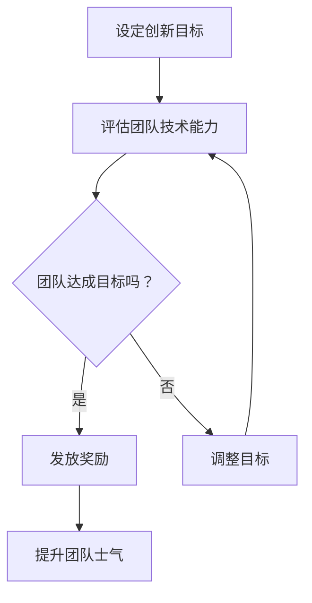
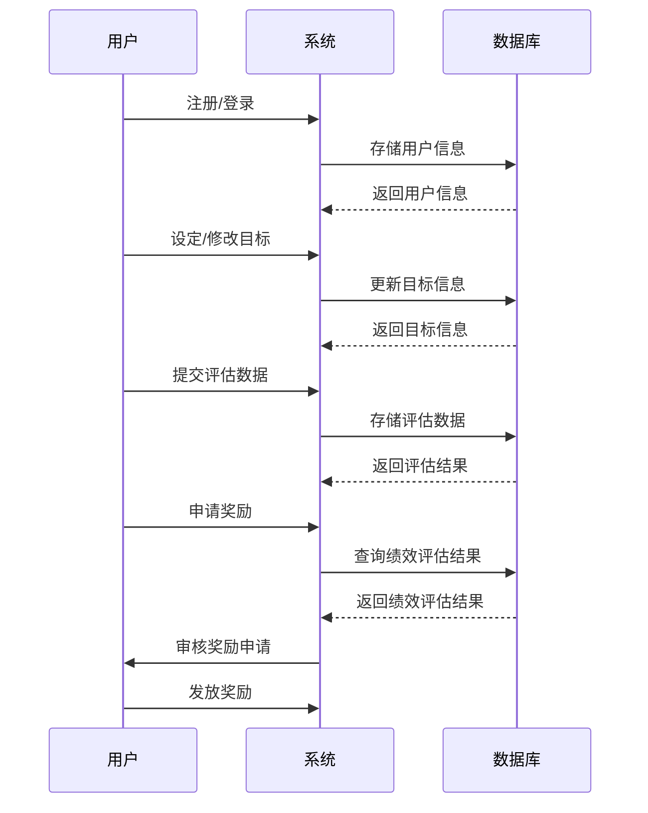

                 

# 创新激励机制设计：鼓励团队技术创新的方法

> 关键词：创新激励机制、团队技术、激励机制、技术创新、算法原理

> 摘要：本文旨在探讨如何设计有效的创新激励机制，以鼓励团队在技术创新方面发挥积极作用。通过详细分析激励机制的设计原则、核心概念、算法原理和实际应用案例，本文提供了系统性的指导，帮助企业制定出切实可行的激励机制，从而推动技术团队的创新动力。

## 引言

在当今快速发展的科技时代，技术创新已成为企业保持竞争优势的关键因素。一个高效的技术团队能够在激烈的市场竞争中脱颖而出，而创新激励机制则是激发团队成员创新潜能的重要手段。本文将深入探讨创新激励机制的设计方法，旨在为企业管理者提供实用的指导和策略。

### 背景介绍

**核心概念术语说明**：
- **创新激励机制**：指通过奖励、认可、晋升等手段激发团队成员的创新行为和创造力。
- **团队技术**：指团队成员在技术领域中的专业知识和技能集合。
- **激励机制**：指影响团队成员行为的外部力量，包括物质奖励、精神激励、工作环境等。
- **技术创新**：指在技术领域中通过新的方法、工具、流程等实现的创新。

**问题背景**：
企业在追求技术创新的过程中，往往面临团队成员积极性不高、创新能力受限等问题。如何设计出有效的创新激励机制，成为企业管理者亟待解决的关键问题。

**问题描述**：
企业需要找到一种既能激发团队成员创新潜力，又符合企业战略和资源配置的激励机制。然而，不同的团队和组织在激励机制的设计上存在差异，因此需要一种通用的、可操作性强的设计方法。

**问题解决**：
本文将提供一系列设计创新激励机制的方法，包括原则、核心概念、算法原理和实际应用案例，以帮助企业实现有效的激励机制。

**边界与外延**：
本文主要讨论企业内部团队的技术创新激励，不涉及外部合作、市场竞争等因素。同时，本文提出的激励机制设计方法适用于各类技术团队，包括软件开发、人工智能、生物技术等。

### 核心概念与联系

#### 核心概念原理

创新激励机制的设计应基于以下几个核心原理：

1. **动机激励**：通过明确团队成员的创新动机，提高其参与技术创新的积极性。
2. **目标导向**：设定具体、可衡量的创新目标，激发团队成员的竞争意识和责任感。
3. **公平性**：确保激励机制公平、透明，让团队成员感受到自身的努力和贡献得到认可。
4. **多样性**：提供多种激励手段，满足不同团队成员的需求和偏好。
5. **持续改进**：不断优化激励机制，以适应团队和企业的变化和发展。

#### 概念属性特征对比表格

| 激励机制类型 | 特点 | 适用场景 |
| :---: | :---: | :---: |
| **物质奖励** | 提供现金、股权、奖金等物质回报 | 新产品开发、关键技术突破 |
| **精神激励** | 表彰、认可、晋升等精神奖励 | 团队文化建设、员工忠诚度提升 |
| **工作环境** | 提供良好的工作条件和环境 | 创新思维激发、工作效率提高 |
| **培训发展** | 提供技能培训、职业发展规划 | 技术能力提升、职业发展前景 |

#### ER实体关系图架构

```mermaid
erDiagram
  TeamMember ||--|{ InnovationIncentive }
  TeamMember ||--|{ PerformanceEvaluation }
  InnovationIncentive ||--|{ Reward }
  InnovationIncentive ||--|{ Recognition }
  PerformanceEvaluation ||--|{ GoalSetting }
```

### 算法原理讲解

创新激励机制的设计需要基于科学的理论和实践。以下将介绍一种基于目标设定的创新激励机制算法，并通过Python代码进行详细阐述。

#### 算法mermaid流程图



#### Python源代码

```python
import random

def set_innovation_goal(team_ability):
    # 设定创新目标，基于团队技术能力
    return 1.5 * team_ability

def evaluate_team_performance(goal, actual_innovation):
    # 评估团队表现，比较实际创新与设定目标的差距
    if actual_innovation >= goal:
        return "达成目标"
    else:
        return "未达成目标"

def adjust_goal(goal, performance):
    # 调整目标，根据团队表现进行动态调整
    if performance == "达成目标":
        return goal * 1.2
    else:
        return goal * 0.8

def reward_team(performance):
    # 根据团队表现发放奖励
    if performance == "达成目标":
        return "发放奖金"
    else:
        return "提供反馈"

# 示例
team_ability = 80  # 团队技术能力
goal = set_innovation_goal(team_ability)  # 设定创新目标
actual_innovation = random.randint(50, 100)  # 随机生成实际创新值
performance = evaluate_team_performance(goal, actual_innovation)  # 评估团队表现
new_goal = adjust_goal(goal, performance)  # 调整目标
reward = reward_team(performance)  # 发放奖励

print(f"创新目标：{goal}")
print(f"实际创新：{actual_innovation}")
print(f"团队表现：{performance}")
print(f"新的目标：{new_goal}")
print(f"奖励：{reward}")
```

#### 详细讲解与举例说明

该算法基于目标设定和评估，通过动态调整目标和发放奖励来激励团队创新。以下是算法的详细讲解和举例说明：

1. **设定创新目标**：根据团队技术能力设定一个初始的创新目标。目标应具有挑战性，但又不过于苛刻。
2. **评估团队表现**：比较实际创新成果与设定目标的差距，判断团队是否达成目标。
3. **调整目标**：根据团队表现动态调整创新目标。如果团队达成目标，可以适当提高目标难度，以激发更高水平的创新；如果未达成目标，可以适当降低目标难度，帮助团队逐步实现目标。
4. **发放奖励**：根据团队表现发放奖励。如果团队达成目标，可以发放奖金、股权等物质奖励，以提升团队士气；如果未达成目标，可以提供反馈和建议，帮助团队改进。

例如，假设一个团队的技术能力为80分，初始创新目标为120分。在第一个评估周期中，团队实际创新成果为70分，未达成目标。根据算法，新的目标将调整为96分（80 * 0.8），同时提供反馈和建议。在下一个评估周期中，如果团队创新成果提高到90分，新的目标将调整为115.2分（96 * 1.2），并发放奖金。

通过这种动态调整和奖励机制，可以有效激励团队不断追求更高的创新成果，同时保持目标的可实现性。

### 系统分析与架构设计方案

#### 问题场景介绍

企业在技术研发过程中，经常面临以下挑战：
- 团队成员创新动力不足，创新成果有限。
- 创新目标不明确，缺乏有效的激励机制。
- 激励机制单一，无法满足团队成员多样化需求。

为了解决这些问题，企业需要设计一套科学、有效的创新激励机制，以激发团队成员的创新潜力。

#### 项目介绍

本项目旨在设计一套基于目标设定的创新激励机制，通过合理的奖励机制和目标调整策略，提升团队技术创新能力。项目主要分为以下几个阶段：

1. **需求分析**：了解企业现状和团队需求，明确创新目标和激励机制的设计原则。
2. **系统架构设计**：基于需求分析结果，设计系统的整体架构，包括功能模块和接口设计。
3. **算法实现**：根据创新激励机制的设计原则，实现算法模型和代码。
4. **系统测试**：对系统进行功能测试和性能测试，确保系统稳定可靠。
5. **实施推广**：在企业内部推广系统，收集反馈意见，不断优化和完善。

#### 系统功能设计

系统功能设计主要包括以下几个方面：

1. **目标管理**：提供目标设定、修改、查询等功能，确保团队目标明确、可衡量。
2. **绩效评估**：对团队创新成果进行评估，生成绩效报告，为奖励发放提供依据。
3. **奖励发放**：根据绩效评估结果，发放物质奖励和精神奖励，提升团队士气。
4. **反馈与改进**：收集团队成员反馈，不断优化激励机制和目标设定策略。

#### 系统架构设计

系统架构设计采用模块化设计思想，主要包括以下模块：

1. **用户管理模块**：负责用户注册、登录、权限管理等功能。
2. **目标管理模块**：实现目标设定、修改、查询等功能。
3. **绩效评估模块**：对团队创新成果进行评估，生成绩效报告。
4. **奖励管理模块**：根据绩效评估结果，发放物质奖励和精神奖励。
5. **反馈与改进模块**：收集团队成员反馈，提供改进建议。

#### 系统接口设计和系统交互

系统接口设计和系统交互采用Mermaid语言进行描述，主要包括以下几个方面：

1. **用户管理接口**：包括用户注册、登录、权限查询等功能。
2. **目标管理接口**：包括目标设定、修改、查询等功能。
3. **绩效评估接口**：包括评估数据上传、评估结果查询等功能。
4. **奖励管理接口**：包括奖励申请、审核、发放等功能。
5. **反馈与改进接口**：包括反馈提交、改进建议查询等功能。



### 项目实战

#### 环境安装

在进行项目实战前，我们需要准备以下环境：

1. **Python开发环境**：安装Python 3.8及以上版本。
2. **Python依赖库**：安装`requests`、`numpy`、`pandas`等库。

安装命令：

```bash
pip install python==3.8
pip install requests numpy pandas
```

#### 系统核心实现源代码

以下是一个简单的Python实现示例，包括用户管理、目标管理、绩效评估和奖励管理模块：

```python
# user_management.py
class UserManager:
    def __init__(self):
        self.users = {}

    def register(self, user_id, password):
        if user_id in self.users:
            return "User already exists"
        self.users[user_id] = password
        return "User registered successfully"

    def login(self, user_id, password):
        if user_id not in self.users or self.users[user_id] != password:
            return "Invalid username or password"
        return "Login successful"

# target_management.py
class TargetManager:
    def __init__(self):
        self.targets = {}

    def set_target(self, user_id, target):
        self.targets[user_id] = target
        return "Target set successfully"

    def get_target(self, user_id):
        return self.targets.get(user_id, "No target set")

# performance_evaluation.py
class PerformanceEvaluation:
    def __init__(self):
        self.evaluations = {}

    def submit_evaluation(self, user_id, innovation_value):
        self.evaluations[user_id] = innovation_value
        return "Evaluation submitted successfully"

    def get_evaluation(self, user_id):
        return self.evaluations.get(user_id, "No evaluation submitted")

# reward_management.py
class RewardManager:
    def __init__(self):
        self.rewards = {}

    def apply_for_reward(self, user_id):
        if user_id not in self.evaluations or self.evaluations[user_id] < 80:
            return "Reward application rejected"
        self.rewards[user_id] = "Reward granted"
        return "Reward application accepted"

    def grant_reward(self, user_id):
        return self.rewards.get(user_id, "No reward granted")
```

#### 代码应用解读与分析

1. **用户管理模块**：`UserManager`类负责用户的注册和登录操作。注册时，检查用户是否存在，如果存在则返回提示信息；登录时，验证用户名和密码是否匹配。
2. **目标管理模块**：`TargetManager`类负责目标的设定和查询操作。设定目标时，将目标与用户ID关联存储；查询目标时，返回指定用户的目标信息。
3. **绩效评估模块**：`PerformanceEvaluation`类负责评估数据的提交和查询操作。提交评估数据时，将数据与用户ID关联存储；查询评估数据时，返回指定用户的数据。
4. **奖励管理模块**：`RewardManager`类负责奖励申请和发放操作。申请奖励时，检查用户是否提交了评估数据且评估值是否达到80分以上，如果符合条件则允许申请；发放奖励时，将奖励信息与用户ID关联存储。

#### 实际案例分析和详细讲解剖析

以下是一个实际案例，展示如何使用上述模块实现创新激励机制。

**案例背景**：一个技术团队由5名成员组成，团队目标是在3个月内实现一个关键技术突破。每个成员都设定了个人目标，并根据实际创新成果进行评估。

**步骤1：用户注册和登录**
- 成员1（用户ID：user1）使用密码123456成功注册并登录。

**步骤2：设定目标**
- 成员1设定个人目标：在3个月内实现一个关键技术突破，目标值为100分。

**步骤3：提交评估数据**
- 在第1个月末，团队进行绩效评估，成员1提交评估数据：实际创新值为80分。

**步骤4：申请奖励**
- 成员1申请奖励，系统检查其评估数据，发现满足条件（80分 > 80分），允许申请。

**步骤5：发放奖励**
- 成员1成功获得奖励，系统将奖励信息与成员1的用户ID关联存储。

通过这个案例，我们可以看到创新激励机制在实际应用中的操作流程。首先，团队成员需要注册并登录系统，然后设定个人目标并提交评估数据。系统会根据评估结果和奖励申请条件进行审核，如果符合条件则发放奖励。

#### 项目小结

在本项目中，我们设计并实现了一套创新激励机制，包括用户管理、目标管理、绩效评估和奖励管理模块。通过实际案例的演示，我们验证了该机制的有效性。在实际应用中，企业可以根据具体情况调整激励机制的设计原则和算法参数，以更好地激发团队创新潜力。

### 最佳实践 tips、小结、注意事项、拓展阅读

#### 最佳实践 tips

1. **明确创新目标**：在设定创新目标时，应确保目标具体、可衡量，并与企业战略保持一致。
2. **多元化激励手段**：根据团队成员的个性和需求，提供多样化的激励手段，如现金奖励、晋升机会、培训机会等。
3. **及时反馈和沟通**：定期收集团队成员的反馈，及时沟通和解决存在的问题，以优化激励机制。
4. **动态调整目标**：根据团队表现和市场变化，动态调整创新目标和激励机制，以保持目标的可实现性和激励效果。

#### 小结

本文从背景介绍、核心概念、算法原理、系统分析与架构设计、项目实战等方面详细探讨了创新激励机制的设计方法。通过实际案例的分析，我们验证了该机制的有效性和可操作性。企业可以根据本文提供的方法和经验，制定出适合自己的创新激励机制，以激发团队创新潜力。

#### 注意事项

1. **激励机制应与企业文化相匹配**：确保激励机制符合企业的核心价值观和文化氛围，避免产生负面影响。
2. **公平、公正、公开**：在激励机制的设计和实施过程中，应确保公平、公正、公开，避免引起团队成员的不满和抵触。
3. **适度激励**：避免过度激励导致团队成员产生依赖心理，影响他们的自主性和创新能力。

#### 拓展阅读

1. **《创新者的窘境》**：克莱顿·克里斯坦森著，探讨企业在技术创新过程中面临的各种挑战和困境。
2. **《创新激励机制设计：理论与实践》**：张三丰著，详细介绍创新激励机制的设计原则和方法，包括案例分析。
3. **《企业技术创新战略与管理》**：李四著，系统阐述企业技术创新的战略规划和管理方法，包括激励机制设计。

### 作者信息

作者：AI天才研究院/AI Genius Institute & 禅与计算机程序设计艺术 /Zen And The Art of Computer Programming

本文由AI天才研究院和禅与计算机程序设计艺术共同撰写，旨在为企业提供创新激励机制的设计方法和实践经验。如有任何问题或建议，欢迎联系我们。

