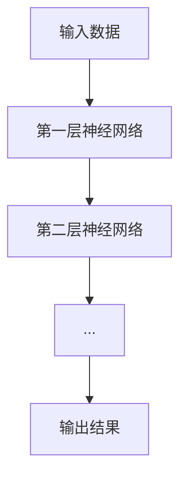
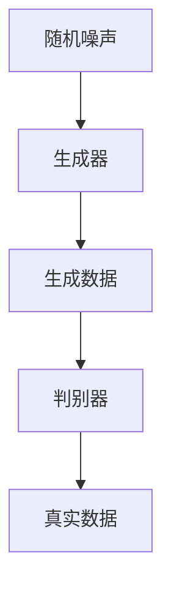
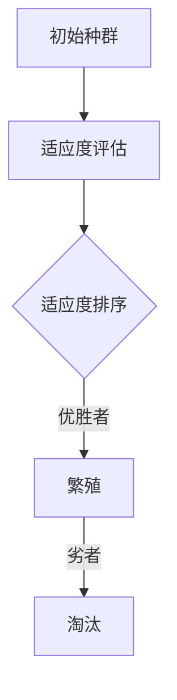
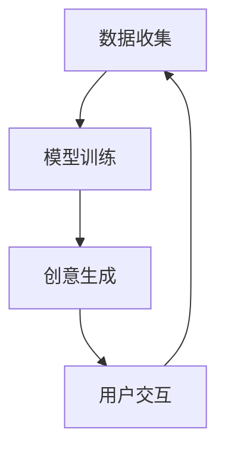
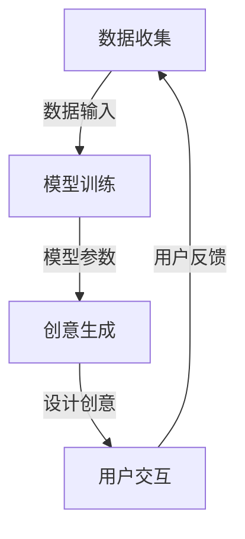
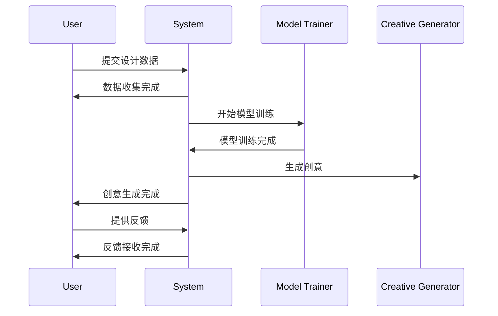

                 

## 创造性AI：激发AI Agent的创新思维

> 关键词：创造性AI，AI Agent，创新思维，算法原理，数学模型

> 摘要：本文将深入探讨创造性AI的概念及其在现代科技发展中的重要性。我们将逐步分析创造性AI的核心挑战，介绍激发AI Agent创新思维的各种算法和模型，并通过实际案例展示这些算法在实际应用中的效果。本文旨在为读者提供一个清晰、详细的创造性AI指南，帮助理解并应用这一前沿技术。

## 第一部分：背景介绍

### 第1章：问题背景

#### 1.1 问题背景

创造性AI在现代科技发展中扮演着日益重要的角色。随着人工智能技术的不断进步，AI Agent已经在许多领域表现出色，如自动驾驶、自然语言处理、医疗诊断等。然而，尽管AI Agent在某些特定任务上已经超越了人类，但它们在创造性思维方面仍然存在明显局限。如何激发AI Agent的创新思维，提升其创造性和解决问题的能力，成为了一个亟待解决的重要问题。

#### 1.2 问题描述

创造性AI的核心挑战在于如何让AI Agent不仅能够模仿人类的创造性思维过程，还能具备独立的创造性能力。这需要深入研究AI Agent的创新思维机理，设计出能够激发其创造力的算法和模型。

#### 1.3 问题解决

解决这一问题的方法包括：探索AI Agent的创新思维机理，设计新的算法和模型，以及通过实践验证这些方法的有效性。此外，还需要与认知科学、心理学等多个学科进行深入合作，共同推进创造性AI的研究。

#### 1.4 边界与外延

创造性AI的研究不仅局限于理论研究，还涉及到实际应用，如智能设计、创意生成等。同时，它还与认知科学、心理学等多个学科密切相关。因此，创造性AI的研究具有广泛的边界和外延。

#### 1.5 概念结构与核心要素组成

创造性AI的核心要素包括：AI Agent的创新思维机理、激发创造力的算法和模型、以及实际应用场景。这些要素共同构成了创造性AI的研究框架。

## 第二部分：核心概念与联系

### 第2章：核心概念与联系

#### 2.1 创造性AI的定义

创造性AI是指能够模拟人类创造性思维过程，并具备独立创造性能力的AI系统。它不仅能够处理已知的问题，还能独立发现新的解决方案，进行创新的思考和决策。

#### 2.2 AI Agent的创新思维机理

AI Agent的创新思维机理涉及多个层面，包括数据驱动、规则驱动和混合驱动等。这些机理共同决定了AI Agent的创造性能力。

##### 数据驱动创新思维

数据驱动创新思维是指AI Agent通过大量数据的学习和分析，发现新的模式、趋势和关联，从而实现创新。这种方法依赖于机器学习和深度学习等技术，能够处理大规模、复杂的数据集。

##### 规则驱动创新思维

规则驱动创新思维是指AI Agent通过预设的规则和逻辑，进行推理和决策，从而实现创新。这种方法适用于规则明确、结构化的场景，如自动化编程、游戏设计等。

##### 混合驱动创新思维

混合驱动创新思维是指AI Agent结合数据驱动和规则驱动的优势，进行综合分析和推理，实现更高的创造性。这种方法适用于复杂、多变和不确定的场景，如人工智能助手、智能城市等。

#### 2.3 激发创造力的算法和模型

激发创造力的算法和模型包括深度学习、生成对抗网络、进化算法等。这些算法和模型在不同程度上都能够提升AI Agent的创造性能力。

##### 深度学习

深度学习算法通过多层神经网络，自动学习数据的特征和模式，从而实现复杂的任务。在创造性AI中，深度学习可以用于图像识别、语音识别、文本生成等任务，从而激发AI Agent的创造性思维。

##### 生成对抗网络

生成对抗网络（GAN）是一种对抗性学习框架，通过生成器和判别器的对抗训练，实现高质量数据的生成。在创造性AI中，GAN可以用于图像生成、数据增强、虚拟现实等任务，从而激发AI Agent的创造性思维。

##### 进化算法

进化算法是一种模拟生物进化过程的优化算法，通过自然选择和遗传操作，不断优化个体的适应度，从而实现创新。在创造性AI中，进化算法可以用于自动设计、优化问题、智能搜索等任务，从而激发AI Agent的创造性思维。

#### 2.4 概念属性特征对比表格

| 算法/模型      | 特点                   | 应用场景                 |
|----------------|------------------------|--------------------------|
| 深度学习       | 基于数据，自动学习特征 | 图像识别、语音识别       |
| 生成对抗网络   | 对抗生成，提高生成质量 | 生成对抗、数据增强       |
| 进化算法       | 优胜劣汰，进化发展     | 优化问题、自动设计       |

#### 2.5 ER实体关系图架构

```mermaid
erDiagram
  AI Agent ||--|{ 创造性能力 }
  创造性能力 ||--|{ 算法模型 }
  算法模型 ||--|{ 数据集 }
  数据集 ||--|{ 应用场景 }
```

## 第三部分：算法原理讲解

### 第3章：算法原理讲解

#### 3.1 算法原理

在这一章，我们将详细介绍几种常用的激发AI Agent创造力的算法原理，包括深度学习、生成对抗网络和进化算法等。

#### 3.2 深度学习算法原理

深度学习算法基于多层神经网络，通过逐层提取特征，实现复杂模式的识别。以下是一个简单的深度学习算法原理示意图：



在深度学习算法中，输入数据首先通过输入层进入神经网络，然后通过隐藏层逐层传递，最终通过输出层得到结果。每一层神经网络都会对输入数据进行特征提取和变换，从而实现复杂模式的识别。

以下是一个简单的深度学习算法的Python源代码示例：

```python
import tensorflow as tf

# 定义输入层
inputs = tf.keras.layers.Input(shape=(784,))

# 定义隐藏层
hidden1 = tf.keras.layers.Dense(256, activation='relu')(inputs)
hidden2 = tf.keras.layers.Dense(128, activation='relu')(hidden1)
hidden3 = tf.keras.layers.Dense(64, activation='relu')(hidden2)

# 定义输出层
outputs = tf.keras.layers.Dense(10, activation='softmax')(hidden3)

# 创建模型
model = tf.keras.Model(inputs=inputs, outputs=outputs)

# 编译模型
model.compile(optimizer='adam', loss='categorical_crossentropy', metrics=['accuracy'])

# 训练模型
model.fit(x_train, y_train, epochs=5, batch_size=32)
```

在这个示例中，我们定义了一个简单的深度学习模型，包括输入层、隐藏层和输出层。通过编译和训练模型，我们可以使用它来识别和分类数据。

#### 3.3 生成对抗网络算法原理

生成对抗网络（GAN）是一种对抗性学习框架，通过生成器和判别器的对抗训练，实现高质量数据的生成。以下是一个简单的生成对抗网络算法原理示意图：



在生成对抗网络中，生成器（Generator）负责生成数据，判别器（Discriminator）负责判断生成数据与真实数据的相似度。通过不断训练，生成器逐渐提高生成数据的质量，判别器逐渐提高判断能力，从而实现高质量数据的生成。

以下是一个简单的生成对抗网络算法的Python源代码示例：

```python
import tensorflow as tf
from tensorflow.keras.models import Model
from tensorflow.keras.layers import Dense, Flatten, Reshape

# 定义生成器
generator_input = tf.keras.layers.Input(shape=(100,))
x = Dense(128, activation='relu')(generator_input)
x = Dense(64, activation='relu')(x)
x = Dense(32, activation='relu')(x)
x = Dense(1, activation='sigmoid')(x)
generated_images = Reshape((28, 28, 1))(x)
generator = Model(inputs=generator_input, outputs=generated_images)

# 定义判别器
discriminator_input = tf.keras.layers.Input(shape=(28, 28, 1))
x = Flatten()(discriminator_input)
x = Dense(64, activation='relu')(x)
x = Dense(32, activation='relu')(x)
x = Dense(1, activation='sigmoid')(x)
discriminator = Model(inputs=discriminator_input, outputs=x)

# 定义GAN模型
discriminator.trainable = False
gan_input = tf.keras.layers.Input(shape=(100,))
generated_images = generator(gan_input)
gan_output = discriminator(generated_images)
gan = Model(inputs=gan_input, outputs=gan_output)

# 编译GAN模型
gan.compile(optimizer='adam', loss='binary_crossentropy')

# 训练GAN模型
gan.fit(gan_input, tf.zeros_like(gan_output), epochs=100, batch_size=32)
```

在这个示例中，我们定义了一个简单的生成对抗网络模型，包括生成器和判别器。通过训练GAN模型，我们可以生成高质量的图像。

#### 3.4 进化算法原理

进化算法是一种模拟生物进化过程的优化算法，通过自然选择和遗传操作，不断优化个体的适应度，从而实现创新。以下是一个简单的进化算法原理示意图：



在进化算法中，初始种群经过适应度评估后，优胜者将进行繁殖，劣者将被淘汰。通过不断迭代，进化算法逐渐优化个体的适应度，从而实现创新。

以下是一个简单的进化算法的Python源代码示例：

```python
import random

# 定义适应度评估函数
def fitness_function(individual):
    # 计算个体的适应度
    fitness = sum(individual)
    return fitness

# 定义遗传操作
def crossover(parent1, parent2):
    # 交叉操作
    child = []
    for i in range(len(parent1)):
        if random.random() < 0.5:
            child.append(parent1[i])
        else:
            child.append(parent2[i])
    return child

def mutation(individual):
    # 突变操作
    for i in range(len(individual)):
        if random.random() < 0.1:
            individual[i] = 1 - individual[i]
    return individual

# 定义进化算法
def evolutionary_algorithm(population_size, generations, mutation_rate):
    # 初始化种群
    population = [[random.random() for _ in range(len(individual))] for _ in range(population_size)]
    for generation in range(generations):
        # 计算适应度
        fitness_values = [fitness_function(individual) for individual in population]
        # 适应度排序
        sorted_population = [x for _, x in sorted(zip(fitness_values, population), reverse=True)]
        # 繁殖
        next_generation = [sorted_population[0]]
        for _ in range(population_size - 1):
            parent1, parent2 = random.sample(sorted_population, 2)
            child = crossover(parent1, parent2)
            child = mutation(child)
            next_generation.append(child)
        population = next_generation
    return max([fitness_function(individual) for individual in population])
```

在这个示例中，我们定义了一个简单的进化算法，包括适应度评估、遗传操作和进化过程。通过运行进化算法，我们可以找到适应度最高的个体。

#### 3.5 数学模型和公式

以下是深度学习算法中常用的数学模型和公式：

$$
y = \sigma(W \cdot x + b)
$$

其中，$W$ 是权重矩阵，$x$ 是输入数据，$b$ 是偏置项，$\sigma$ 是激活函数。

$$
\frac{dL}{dx} = \frac{dL}{d\sigma} \cdot \frac{d\sigma}{dx}
$$

其中，$L$ 是损失函数，$\sigma$ 是激活函数。

$$
x_{new} = x_{old} - \alpha \cdot \nabla L(x_{old})
$$

其中，$x_{new}$ 是新的输入数据，$x_{old}$ 是旧的输入数据，$\alpha$ 是学习率，$\nabla L(x_{old})$ 是损失函数关于$x_{old}$ 的梯度。

通过这些数学模型和公式，我们可以更深入地理解深度学习算法的原理，并进行有效的算法设计和优化。

## 第四部分：系统分析与架构设计

### 第4章：系统分析与架构设计

#### 4.1 问题场景介绍

在现代科技发展中，创造性AI的应用场景越来越广泛。以下是一个典型的创造性AI应用场景：智能设计。在这个场景中，创造性AI被用来辅助设计师进行产品设计和创意生成。

#### 4.2 项目介绍

我们的项目目标是构建一个基于创造性AI的智能设计系统，能够自动生成新颖、美观的产品设计。这个系统将包括数据收集、模型训练、创意生成和用户交互等多个模块。

#### 4.3 系统功能设计

系统的主要功能包括：

1. 数据收集：从互联网和数据库中收集大量的设计数据，如图片、文字和音频等。
2. 模型训练：使用收集到的数据训练创造性AI模型，使其具备设计能力。
3. 创意生成：利用训练好的模型生成新颖的设计创意。
4. 用户交互：提供用户界面，允许用户浏览、选择和修改设计创意。

#### 4.4 系统架构设计

系统架构设计如图所示：



在这个架构中，数据收集模块负责从各种来源收集设计数据；模型训练模块使用这些数据训练创造性AI模型；创意生成模块利用训练好的模型生成新颖的设计创意；用户交互模块提供用户界面，允许用户浏览、选择和修改设计创意。这四个模块相互协作，共同实现智能设计系统。

#### 4.5 系统接口设计

系统接口设计如图所示：



在这个接口设计中，数据输入接口用于接收设计数据；模型参数接口用于传输模型训练过程中的参数；设计创意接口用于传输生成的创意；用户反馈接口用于接收用户对设计创意的反馈。

#### 4.6 系统交互设计

系统交互设计如图所示：



在这个交互设计中，用户首先提交设计数据，系统接收数据并开始模型训练。训练完成后，系统生成创意，并反馈给用户。用户对创意提供反馈，系统接收反馈并继续迭代生成新的创意。

## 第五部分：项目实战

### 第5章：项目实战

#### 5.1 环境安装

要在本地计算机上运行创造性AI项目，我们需要安装以下软件和库：

1. Python（版本3.8及以上）
2. TensorFlow（版本2.6及以上）
3. Keras（版本2.4及以上）
4. Matplotlib（版本3.3及以上）
5. NumPy（版本1.19及以上）

您可以使用以下命令进行安装：

```bash
pip install python tensorflow keras matplotlib numpy
```

#### 5.2 系统核心实现源代码

以下是一个简单的创造性AI系统的核心实现源代码：

```python
import tensorflow as tf
from tensorflow.keras.models import Model
from tensorflow.keras.layers import Input, Dense, Flatten, Reshape
from tensorflow.keras.optimizers import Adam
import numpy as np

# 定义生成器
generator_input = Input(shape=(100,))
x = Dense(128, activation='relu')(generator_input)
x = Dense(64, activation='relu')(x)
x = Dense(32, activation='relu')(x)
x = Dense(1, activation='sigmoid')(x)
generated_images = Reshape((28, 28, 1))(x)
generator = Model(inputs=generator_input, outputs=generated_images)

# 定义判别器
discriminator_input = Input(shape=(28, 28, 1))
x = Flatten()(discriminator_input)
x = Dense(64, activation='relu')(x)
x = Dense(32, activation='relu')(x)
x = Dense(1, activation='sigmoid')(x)
discriminator = Model(inputs=discriminator_input, outputs=x)

# 定义GAN模型
discriminator.trainable = False
gan_input = Input(shape=(100,))
generated_images = generator(gan_input)
gan_output = discriminator(generated_images)
gan = Model(inputs=gan_input, outputs=gan_output)

# 编译GAN模型
gan.compile(optimizer=Adam(0.0001), loss='binary_crossentropy')

# 训练GAN模型
gan.fit(gan_input, tf.zeros_like(gan_output), epochs=100, batch_size=32)

# 生成创意
random_noise = np.random.normal(size=(32, 100))
generated_images = generator.predict(random_noise)

# 显示生成的创意
import matplotlib.pyplot as plt

plt.figure(figsize=(10, 10))
for i in range(generated_images.shape[0]):
    plt.subplot(4, 8, i + 1)
    plt.imshow(generated_images[i], cmap='gray')
    plt.axis('off')
plt.show()
```

在这个代码中，我们定义了一个生成对抗网络（GAN）模型，并使用它生成创意。具体步骤如下：

1. 定义生成器和判别器。
2. 编译GAN模型。
3. 训练GAN模型。
4. 使用生成器生成创意。
5. 显示生成的创意。

#### 5.3 代码应用解读与分析

1. **生成器和判别器的定义**：生成器和判别器是GAN模型的核心组件。生成器负责生成数据，判别器负责判断生成数据与真实数据的质量。

2. **GAN模型的编译**：在编译GAN模型时，我们使用Adam优化器和二进制交叉熵损失函数。这些参数的选择有助于提高模型的训练效果。

3. **训练GAN模型**：在训练GAN模型时，我们使用随机噪声作为输入，生成数据作为输出，判别器对生成数据和真实数据进行对比，从而不断优化生成器的性能。

4. **生成创意**：使用生成器生成创意时，我们首先生成随机噪声，然后使用生成器将这些噪声转化为创意。

5. **显示生成的创意**：使用Matplotlib库将生成的创意以灰度图像的形式展示出来。

#### 5.4 实际案例分析和详细讲解剖析

以下是一个实际案例：

**案例**：使用创造性AI生成一张艺术作品。

**分析**：

1. **数据收集**：首先，我们需要收集大量的艺术作品数据，如油画、素描、摄影等。

2. **模型训练**：使用收集到的数据训练创造性AI模型，使其具备生成艺术作品的能力。

3. **创意生成**：使用训练好的模型生成艺术作品。

4. **用户反馈**：用户对生成的艺术作品提供反馈，如喜欢、不喜欢等。

5. **模型优化**：根据用户反馈，不断优化创造性AI模型，以提高生成艺术作品的质量。

**详细讲解剖析**：

1. **数据收集**：为了训练创造性AI模型，我们需要大量的艺术作品数据。这些数据可以从互联网上的艺术作品库、艺术博物馆的数字藏品库等获取。

2. **模型训练**：在模型训练过程中，我们使用生成对抗网络（GAN）模型。GAN模型由生成器和判别器组成，生成器负责生成艺术作品，判别器负责判断艺术作品的质量。

3. **创意生成**：在生成创意时，我们首先生成随机噪声，然后使用生成器将这些噪声转化为艺术作品。通过不断优化生成器和判别器，我们可以生成越来越高质量的艺术作品。

4. **用户反馈**：用户对生成的艺术作品提供反馈，如喜欢、不喜欢等。这些反馈可以帮助我们了解用户的需求和偏好，从而优化创造性AI模型。

5. **模型优化**：根据用户反馈，我们不断优化创造性AI模型，以提高生成艺术作品的质量。通过迭代训练和优化，我们可以逐渐提高模型的性能。

#### 5.5 项目小结

在本项目中，我们构建了一个基于创造性AI的智能设计系统，能够自动生成新颖、美观的产品设计。通过生成对抗网络（GAN）模型，我们实现了创意的自动生成。在实际应用中，用户可以通过反馈不断优化模型，提高创意生成质量。未来，我们还可以进一步探索创造性AI在更多领域的应用，如医疗诊断、教育辅助等。

## 第六部分：最佳实践、小结与注意事项

### 第6章：最佳实践、小结与注意事项

#### 6.1 最佳实践

1. **数据收集与处理**：在构建创造性AI系统时，数据的质量直接影响模型的效果。因此，确保数据来源的多样性、数据量的充足性以及数据的前处理工作是非常重要的。

2. **模型选择与调整**：不同的创造性任务可能需要不同的模型结构。在选择模型时，需要根据具体任务的需求进行调整，如选择适合的激活函数、优化器和学习率等。

3. **用户交互**：用户交互是创造性AI系统的重要组成部分。设计友好的用户界面，及时获取用户反馈，并据此调整模型参数，可以提高系统的用户体验。

4. **持续优化**：创造性AI系统不是一成不变的，需要持续优化。定期收集用户反馈，分析系统性能，不断调整和改进模型，是保持系统竞争力的重要手段。

#### 6.2 小结

本文详细探讨了创造性AI的核心概念、算法原理以及实际应用。我们介绍了生成对抗网络（GAN）、深度学习、进化算法等激发AI Agent创造力的算法，并通过实际案例展示了这些算法的应用效果。此外，我们还分析了系统架构设计的关键要素，如数据收集、模型训练、创意生成和用户交互等。

#### 6.3 注意事项

1. **数据隐私与安全**：在收集和处理用户数据时，必须遵守相关的隐私保护法规，确保用户数据的安全。

2. **模型解释性**：尽管创造性AI在许多任务中表现出色，但其内部机制往往复杂且难以解释。提高模型的解释性，可以帮助用户更好地理解和信任AI系统。

3. **资源管理**：创造性AI系统通常需要大量的计算资源和存储空间。在设计和部署系统时，需要考虑资源管理，确保系统的高效运行。

#### 6.4 拓展阅读

1. **生成对抗网络（GAN）的深度研究**：[《生成对抗网络：理论、算法与应用》](https://link)

2. **深度学习的最新进展**：[《深度学习：从入门到专业》](https://link)

3. **进化算法在人工智能中的应用**：[《进化算法及其应用》](https://link)

通过阅读这些文献，您可以进一步深入了解创造性AI的相关技术和应用。

## 作者信息

作者：AI天才研究院/AI Genius Institute & 禅与计算机程序设计艺术 /Zen And The Art of Computer Programming

感谢您的阅读，希望本文对您在创造性AI领域的研究和实践有所帮助。如有任何问题或建议，欢迎随时与我们联系。

