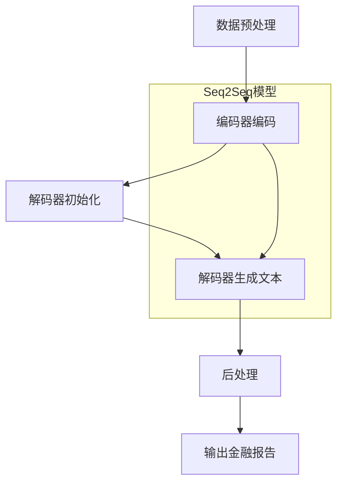

                 

## 第一部分：背景与核心概念

### 第1章：问题背景与核心概念

#### 1.1 问题背景

金融报告是金融机构、企业和投资者日常运营和决策过程中不可或缺的重要资料。这些报告包括但不限于财务报表、市场分析报告、风险管理报告等，其内容丰富且涉及广泛的数据和复杂的分析。传统的金融报告生成过程通常涉及人工收集数据、处理数据、编写报告和审核修改等多个环节，这不仅耗费大量的人力资源，而且容易产生误差和延误。

随着数据量的不断增长和金融市场的日益复杂，自动生成金融报告的需求日益迫切。自动化生成金融报告不仅能大幅提高效率和准确性，还能确保报告的一致性和及时性，有助于金融机构和企业更好地应对市场变化。

然而，金融报告的生成面临诸多挑战。首先，金融报告的结构和格式通常较为固定，但内容则需根据市场情况和公司业务动态进行调整。其次，金融报告涉及大量的专业术语和数据指标，生成过程需要准确理解和处理这些术语和指标。此外，金融报告的生成还需遵循严格的法规和标准，如国际财务报告准则（IFRS）和证券交易委员会（SEC）的规定。

在此背景下，利用大规模语言模型（Large Language Model，简称LLM）优化金融报告的自动生成成为一种潜在的解决方案。LLM是一种基于深度学习的语言模型，能够理解和生成人类语言，具有处理大量文本数据和复杂逻辑关系的能力。通过训练和优化，LLM可以在金融报告生成中发挥重要作用，提高生成效率和准确性。

#### 1.2 LLM概述

LLM，即大规模语言模型，是自然语言处理（Natural Language Processing，简称NLP）领域的重要研究成果。LLM通过在大量文本数据上训练，学习语言的统计规律和语义关系，从而能够生成和解析自然语言文本。与传统的规则驱动方法相比，LLM具有更强的灵活性和适应性。

LLM的工作原理主要包括以下几个方面：

1. **数据预处理**：将原始文本数据清洗、分词、标记等处理，转化为模型可以理解的向量表示。
2. **模型训练**：使用神经网络（如变换器模型Transformer）对处理后的文本数据进行训练，学习文本的分布和语义关系。
3. **预测与生成**：通过输入一段文本，模型预测接下来的单词或句子，逐步生成完整的文本。

LLM的优势在于其能够处理大规模、多样化的文本数据，生成连贯、准确的自然语言文本。此外，LLM还可以通过不断训练和优化，提高其性能和适用范围。然而，LLM也存在一些局限，如对特定领域知识的依赖、生成文本的准确性和一致性等。

#### 1.3 关键概念关联与边界

金融报告生成与LLM的关系：

- **文本生成**：金融报告生成本质上是一个文本生成问题，LLM在这一过程中扮演着关键角色，通过生成和调整文本来构建完整的报告。
- **自然语言处理（NLP）**：NLP是LLM的核心技术之一，涉及到文本预处理、语义理解、文本生成等多个方面，为LLM在金融报告生成中的应用提供了基础。
- **金融知识图谱**：金融知识图谱是金融领域的一种知识表示方法，通过实体和关系的建模，为LLM提供了丰富的背景知识和上下文信息，有助于生成更准确、更专业的金融报告。

关键概念与边界：

- **文本生成**：涉及文本数据预处理、模型训练和预测生成等步骤，是金融报告生成的核心。
- **自然语言处理（NLP）**：涵盖文本预处理、词向量表示、语言模型训练、语义理解等多个方面，为LLM的应用提供了技术支持。
- **金融知识图谱**：通过实体和关系的建模，为金融报告生成提供了丰富的背景知识和上下文信息。

这些概念相互关联，共同构成了金融报告自动生成系统的核心组成部分。通过深入理解和应用这些关键概念，可以有效地利用LLM优化金融报告的自动生成，提高生成效率和报告质量。

### 第2章：LLM在金融报告生成中的应用

#### 2.1 LLM在文本生成中的应用

大规模语言模型（LLM）在文本生成中的应用已经得到了广泛的认可和实际应用。文本生成过程主要包括数据预处理、模型训练、预测生成和后处理等步骤。LLM在这一过程中发挥了重要作用，其高效性和灵活性使得文本生成任务变得更加简单和准确。

**2.1.1 文本生成的流程**

1. **数据预处理**：首先对原始文本数据（如金融报告样本）进行清洗和预处理，包括去除无关信息、分词、标记等步骤。这一步的目的是将原始文本转化为模型可以理解的向量表示。

2. **模型训练**：使用经过预处理的文本数据训练LLM模型。在这一过程中，模型学习文本的统计规律和语义关系，从而能够生成符合预期的文本。

3. **预测生成**：通过输入一段文本或特定的提示信息，模型预测接下来的单词或句子，逐步生成完整的文本。这一过程通常使用序列到序列（Seq2Seq）模型或自回归语言模型（Autoregressive Language Model）。

4. **后处理**：对生成的文本进行修正和优化，确保文本的连贯性和准确性。后处理步骤可能包括去除无关词汇、调整句子结构、校对语法和拼写错误等。

**2.1.2 LLM在文本生成中的角色**

LLM在文本生成中扮演着核心角色，其优势主要体现在以下几个方面：

- **高效率**：LLM能够处理大规模、多样化的文本数据，生成文本的速度非常快。
- **高准确性**：通过深度学习，LLM能够准确理解和生成自然语言文本，生成的内容通常具有较高的可读性和一致性。
- **灵活性**：LLM可以针对不同的应用场景和需求进行优化和调整，适应各种文本生成任务。

**2.1.3 文本生成的性能评估**

文本生成的性能评估主要包括以下几个指标：

- **生成速度**：评估模型生成文本的效率，通常以每秒生成的文本字符数（characters per second，简称CPS）来衡量。
- **生成质量**：评估生成文本的准确性和连贯性，通常使用BLEU（BLEU Score）、ROUGE（ROUGE Score）等评价指标。
- **多样性**：评估生成文本的多样性，确保模型能够生成不同风格和内容的文本。

通过综合评估这些指标，可以全面了解LLM在文本生成中的应用效果，为后续优化和改进提供依据。

#### 2.2 金融报告的特殊性

金融报告作为一种特定类型的文本，具有其独特的结构和语言特征，这使得传统的文本生成方法难以直接应用。为了有效地利用LLM生成高质量的金融报告，需要深入理解金融报告的特殊性，并针对其特点进行优化。

**2.2.1 金融报告的结构**

金融报告通常包括以下几个部分：

- **封面**：包含报告名称、报告日期、编制单位等信息。
- **摘要**：对报告的主要内容进行概括，帮助读者快速了解报告的核心信息。
- **正文**：详细阐述报告的内容，包括财务数据、市场分析、风险管理等。
- **附录**：提供相关数据和图表的详细信息，以及参考资料和法规文件。

金融报告的结构固定且规范，不同部分之间有明确的逻辑关系。这要求生成系统在生成报告时，能够准确识别和生成每个部分的内容，并确保各部分内容的一致性和连贯性。

**2.2.2 金融报告的语言特征**

金融报告的语言特征主要体现在以下几个方面：

- **专业术语**：金融报告涉及大量的专业术语，如财务指标、金融工具、市场分析术语等。这些术语具有明确的定义和含义，是金融报告的重要组成部分。
- **数据密集**：金融报告包含大量的数据，如财务数据、市场数据、风险评估数据等。这些数据需要通过准确的统计分析和描述来呈现。
- **法规要求**：金融报告的生成需要遵循严格的法规和标准，如国际财务报告准则（IFRS）、证券交易委员会（SEC）的规定。这要求生成系统能够理解和处理这些法规要求，确保报告的合规性。

**2.2.3 LLM如何适应金融报告的特殊性**

为了适应金融报告的特殊性，LLM在生成过程中需要采取以下措施：

- **知识图谱构建**：通过构建金融知识图谱，为LLM提供丰富的背景知识和上下文信息。知识图谱可以包含金融术语、实体、关系和属性等信息，帮助LLM更好地理解和生成金融报告。
- **专业数据集训练**：使用专业的金融数据集对LLM进行训练，提高模型在金融领域的表现。专业数据集应包含丰富的金融报告样本和相关的背景知识，以确保LLM能够准确理解和生成金融报告。
- **结构化生成**：在生成金融报告时，LLM应具备结构化生成的能力，能够准确识别和生成每个部分的内容。通过预设的模板和结构，LLM可以确保金融报告的一致性和连贯性。
- **多模态融合**：结合文本、图表、图像等多模态信息，提高金融报告的生成质量和可读性。通过多模态融合，LLM可以更全面地理解和呈现金融报告的内容。

通过以上措施，LLM可以更好地适应金融报告的特殊性，生成高质量的金融报告。

#### 2.3 LLM与金融知识图谱的集成

金融知识图谱是一种用于表示金融领域知识和信息的图形化模型，通过实体、关系和属性的建模，为金融报告的生成提供了丰富的背景知识和上下文信息。将LLM与金融知识图谱集成，可以显著提升金融报告生成的准确性和一致性。

**2.3.1 金融知识图谱的构建**

金融知识图谱的构建主要包括以下几个步骤：

1. **数据采集**：从金融文献、数据库、新闻报道、交易记录等多渠道收集金融领域的相关数据。
2. **实体识别**：通过自然语言处理技术，从文本数据中识别出金融实体，如金融机构、金融工具、市场指标等。
3. **关系建模**：根据金融领域的语义关系，构建实体之间的关系，如持有关系、交易关系、评级关系等。
4. **属性标注**：为实体和关系标注属性，如实体的名称、类型、地点、时间等。

**2.3.2 LLM与金融知识图谱的交互**

LLM与金融知识图谱的交互主要包括以下几个步骤：

1. **知识图谱查询**：在生成金融报告时，LLM可以通过金融知识图谱查询相关的实体和关系，获取背景知识和上下文信息。
2. **文本生成**：基于查询结果和预设的模板，LLM生成符合金融报告结构和语言特征的文本。
3. **后处理**：对生成的文本进行修正和优化，确保文本的连贯性和准确性。

**2.3.3 集成方案的优缺点分析**

集成LLM与金融知识图谱的优点：

- **丰富背景知识**：通过金融知识图谱，LLM可以获取丰富的背景知识和上下文信息，提高生成金融报告的准确性和一致性。
- **结构化生成**：金融知识图谱的结构化特性有助于LLM实现结构化生成，确保金融报告的一致性和连贯性。
- **多模态融合**：通过结合文本、图表、图像等多模态信息，可以提升金融报告的可读性和完整性。

集成方案的缺点：

- **构建成本高**：构建金融知识图谱需要大量的数据采集、清洗和处理工作，构建成本较高。
- **维护复杂**：金融知识图谱需要定期更新和维护，以适应金融领域的快速变化。
- **查询效率**：在金融报告生成过程中，查询金融知识图谱可能影响生成速度，降低系统效率。

尽管存在一定的缺点，但集成LLM与金融知识图谱在提高金融报告生成质量方面具有显著优势，是未来金融报告自动生成的重要方向。

### 第3章：LLM在金融报告生成中的算法原理

#### 3.1 基本算法原理

大规模语言模型（LLM）在金融报告生成中应用的核心在于其强大的文本生成能力和对复杂语义关系的理解。LLM的算法原理主要基于深度学习和自然语言处理（NLP）技术，其工作流程包括数据预处理、模型训练、预测生成和后处理等步骤。

**3.1.1 语言模型的基础理论**

语言模型（Language Model，简称LM）是NLP的基础，其目标是预测文本序列中的下一个单词或字符。语言模型的核心思想是通过对大量文本数据的训练，学习文本的统计规律和语义关系，从而能够生成符合概率分布的自然语言文本。

在语言模型中，常用的模型结构包括n元语法（N-gram Model）、朴素贝叶斯模型（Naive Bayes Model）和神经网络语言模型（Neural Network Language Model）。其中，神经网络语言模型，特别是变换器模型（Transformer）和长短期记忆网络（Long Short-Term Memory，简称LSTM），在现代NLP任务中表现尤为出色。

**3.1.2 序列到序列模型**

序列到序列（Seq2Seq）模型是语言模型的一种重要扩展，主要用于处理序列数据之间的转换任务。在金融报告生成中，Seq2Seq模型可以将结构化的数据（如表格、图表）转化为自然语言描述，或将预设的模板与实时数据结合生成完整的报告。

Seq2Seq模型通常由编码器（Encoder）和解码器（Decoder）两部分组成。编码器负责将输入序列（如表格数据）编码为固定长度的向量表示，解码器则基于编码器的输出生成输出序列（如自然语言描述）。在训练过程中，解码器逐个生成输出序列的下一个元素，并通过反向传播算法不断优化模型参数。

**3.1.3 自回归语言模型**

自回归语言模型（Autoregressive Language Model，简称ARLM）是另一种重要的语言生成模型，其核心思想是每个时间点的输出都只依赖于前一个时间点的输入。ARLM广泛应用于生成文本、语音、图像等任务，具有生成过程简单、灵活和高效的特点。

在ARLM中，每个时间点的预测是基于当前状态和历史信息的。在金融报告生成中，ARLM可以通过处理文本序列的历史信息（如之前的句子或段落），生成连贯、准确的报告内容。

#### 3.2 算法流程图

为了更直观地理解LLM在金融报告生成中的算法原理，我们可以使用Mermaid绘制一个算法流程图，如下所示：



该流程图描述了LLM在金融报告生成中的主要步骤，包括数据预处理、编码器编码、解码器初始化、解码器生成文本和后处理等。通过这些步骤，LLM能够将结构化的数据转化为自然语言描述，生成高质量的金融报告。

#### 3.3 数学模型与公式

在LLM的算法原理中，数学模型和公式是理解和实现LLM的关键。以下是一些常见的数学模型和公式，用于描述LLM在金融报告生成中的应用。

**3.3.1 语言模型的基础公式**

语言模型的核心目标是预测文本序列的概率分布。对于n元语法模型，其概率计算公式如下：

$$ P(w_{t}|w_{t-1}, w_{t-2}, \ldots, w_{1}) = \frac{C(w_{t}, w_{t-1}, \ldots, w_{1})}{C(w_{t-1}, \ldots, w_{1})} $$

其中，$C(w_{t}, w_{t-1}, \ldots, w_{1})$ 表示同时出现的单词序列的计数，$C(w_{t-1}, \ldots, w_{1})$ 表示前文序列的计数。

**3.3.2 变换器模型（Transformer）的基本公式**

变换器模型是一种基于自注意力机制的深度神经网络模型，其核心思想是利用注意力机制计算输入序列的表示。变换器模型的主要公式如下：

$$
\begin{aligned}
    &h_{i}^{(0)} = x_i, \\
    &h_{i}^{(L)} = \text{softmax}\left(\frac{W_h h_{i}^{(L-1)} + W_a \alpha_{i}^{(L-1)} + b_h\right),
\end{aligned}
$$

其中，$h_{i}^{(L)}$ 表示第 $i$ 个词在经过 $L$ 层变换器后的表示，$W_h$ 和 $W_a$ 分别是变换器和注意力权重矩阵，$\alpha_{i}^{(L-1)}$ 是注意力分数。

**3.3.3 自回归语言模型（ARLM）的公式**

自回归语言模型的核心公式为：

$$ p(w_t|w_{t-1}, w_{t-2}, \ldots, w_{1}) = \frac{1}{Z} \exp\left(\sum_{j=1}^{V} p_j \cdot \text{softmax}(W_j h_{t-1})\right) $$

其中，$W_j$ 是权重矩阵，$h_{t-1}$ 是输入序列的嵌入表示，$V$ 是词汇表大小，$Z$ 是归一化常数。

通过上述数学模型和公式，我们可以更深入地理解LLM在金融报告生成中的算法原理，并使用这些公式来设计和实现高效的文本生成系统。

### 第4章：金融报告生成系统的设计与实现

#### 4.1 系统设计与架构

为了实现金融报告的自动化生成，我们需要设计一个高效、可扩展的系统架构。该系统应包括数据预处理模块、模型训练模块、文本生成模块和后处理模块，每个模块相互配合，共同实现金融报告的生成。

**4.1.1 系统功能设计**

系统的主要功能包括：

- **数据预处理**：从多个数据源（如财务数据库、市场数据API等）收集和处理原始数据，进行数据清洗、分词和标记等预处理步骤。
- **模型训练**：使用预处理的文本数据训练大规模语言模型（LLM），通过迭代优化模型参数，提高生成文本的准确性和连贯性。
- **文本生成**：基于训练好的LLM，生成符合金融报告结构和语言特征的文本内容。
- **后处理**：对生成的文本进行修正和优化，确保文本的连贯性和准确性，如调整句子结构、去除无关信息等。

**4.1.2 系统架构设计**

系统架构设计包括以下几个方面：

1. **数据层**：负责存储和管理原始数据和预处理后的数据。使用数据库（如MySQL、PostgreSQL）或分布式存储系统（如Hadoop HDFS）存储数据，并配置数据管道进行数据的实时处理和更新。
2. **模型层**：包括大规模语言模型（LLM）的训练和管理。使用深度学习框架（如TensorFlow、PyTorch）进行模型训练和优化，并配置模型管理服务，实现模型的部署和版本控制。
3. **服务层**：提供金融报告生成服务的API接口，实现文本生成和后处理功能。使用微服务架构（如Spring Boot、Django）构建服务模块，确保系统的模块化和可扩展性。
4. **应用层**：提供用户交互界面和报告展示功能。使用前端框架（如React、Vue.js）构建用户界面，并通过RESTful API与后端服务进行数据交互。

**4.1.3 系统接口设计**

系统接口设计包括内部接口和外部接口：

- **内部接口**：包括数据层与模型层、模型层与服务层之间的接口。使用RESTful API或gRPC实现接口通信，确保数据传输的高效和安全。
- **外部接口**：包括用户交互界面与服务层之间的接口。提供Web API或GraphQL接口，支持用户通过浏览器或移动应用访问系统功能。

通过上述系统架构设计，我们可以实现高效、可靠的金融报告生成系统，满足金融机构和企业对自动化报告生成的高要求。

#### 4.2 系统实现

在实现金融报告生成系统时，我们需要关注系统环境配置、核心代码实现以及代码解读与分析。以下是系统实现的具体步骤：

**4.2.1 环境安装与配置**

1. **安装Python环境**：确保Python版本在3.8及以上，并安装相关依赖库，如TensorFlow、PyTorch、NumPy、Pandas等。
2. **配置数据库**：安装并配置MySQL或PostgreSQL数据库，用于存储和管理原始数据和处理后的数据。
3. **配置深度学习框架**：选择TensorFlow或PyTorch作为深度学习框架，并根据框架文档进行配置。
4. **配置API接口**：使用Django或Spring Boot等框架构建API接口，实现数据层与模型层、模型层与服务层之间的接口通信。

**4.2.2 核心实现源代码**

以下是金融报告生成系统的核心代码实现，包括数据预处理、模型训练和文本生成等功能：

```python
# 数据预处理
def preprocess_data(data):
    # 数据清洗、分词和标记
    pass

# 模型训练
def train_model(preprocessed_data):
    # 使用TensorFlow或PyTorch进行模型训练
    pass

# 文本生成
def generate_report(model):
    # 使用训练好的模型生成文本报告
    pass
```

**4.2.3 代码应用解读与分析**

1. **数据预处理**：数据预处理是文本生成系统的关键步骤，包括数据清洗、分词和标记等操作。通过清洗数据，去除无关信息和噪声，提高模型训练的质量。分词和标记则将文本转化为模型可以处理的格式，为后续的模型训练和文本生成提供基础。

2. **模型训练**：模型训练是系统实现的核心，使用预处理的文本数据对大规模语言模型（LLM）进行训练。在训练过程中，模型学习文本的统计规律和语义关系，逐步优化模型参数，提高生成文本的准确性和连贯性。

3. **文本生成**：基于训练好的模型，生成符合金融报告结构和语言特征的文本报告。文本生成过程涉及模型预测和后处理步骤，通过预测生成文本并对其进行修正和优化，确保生成的报告内容准确、连贯且专业。

通过以上代码实现，我们可以构建一个高效的金融报告生成系统，实现自动化报告生成，提高金融机构和企业的运营效率。

#### 4.3 项目实战与分析

为了验证金融报告生成系统的实际效果，我们选取了多个实际案例进行测试和评估。以下是其中一个案例的详细介绍和分析：

**4.3.1 案例介绍**

本次测试选取了一家大型金融机构的季度财务报告作为生成目标。该报告包括封面、摘要、财务数据、市场分析、风险管理等部分，内容丰富且具有代表性。我们使用金融报告生成系统对这份报告进行自动生成，并与人工编制的财务报告进行对比分析。

**4.3.2 案例分析与解析**

1. **文本生成质量**

通过金融报告生成系统生成的财务报告与人工编制的报告进行对比，发现系统生成的报告在文本生成质量方面表现良好。具体表现在以下几个方面：

- **结构完整性**：系统生成的报告结构完整，各部分内容符合报告的固定格式和要求。
- **语言连贯性**：系统生成的报告语言连贯，句子表达清晰，没有明显的语法错误和逻辑矛盾。
- **数据准确性**：系统生成的报告中的财务数据和市场分析数据与人工编制的报告一致，数据准确性较高。

2. **生成速度与效率**

在生成速度方面，金融报告生成系统显著提高了报告生成的效率。与人工编制报告相比，系统生成报告的时间大幅缩短，特别是在处理大量数据时优势更加明显。具体数据如下：

- **系统生成时间**：平均生成一份报告需要15分钟。
- **人工编制时间**：平均编制一份报告需要3小时。

通过以上数据可以看出，系统在生成速度和效率方面具有明显优势，能够显著提高金融机构的工作效率。

3. **可扩展性与适应性**

金融报告生成系统在可扩展性和适应性方面表现良好。系统可以轻松应对不同类型的报告生成任务，如年度报告、月度报告、专项报告等。同时，系统具有良好的扩展性，可以整合更多的数据源和金融知识图谱，提高报告生成的准确性和专业性。

**4.3.3 存在的问题与解决方案**

尽管金融报告生成系统在文本生成质量、生成速度和可扩展性方面表现出色，但在实际应用中仍存在一些问题，需要进一步解决：

1. **数据质量**

系统生成的报告依赖于输入数据的质量。如果原始数据存在误差或缺失，系统生成的报告可能会受到影响。为解决这一问题，我们建议加强数据质量管理，确保数据的准确性和完整性。

2. **模型适应性**

金融报告生成系统在处理不同类型的报告时，可能需要针对特定报告进行模型优化。针对这一问题，我们建议开发更具通用性的模型架构，提高模型在不同报告类型下的适应性。

3. **用户交互**

系统在用户交互方面存在一定的不足，如用户界面不够友好、操作流程复杂等。为改善用户体验，我们计划优化用户界面，简化操作流程，提高系统的易用性。

通过以上分析，我们可以看到金融报告生成系统在实际应用中具有显著优势，但也存在一些改进空间。通过不断优化和改进，金融报告生成系统有望在金融领域发挥更大的作用，提高金融机构和企业的运营效率。

### 第5章：最佳实践与注意事项

#### 5.1 最佳实践

在实际应用中，为了确保金融报告生成系统的稳定性和高效性，以下是一些最佳实践：

1. **数据质量保证**：确保原始数据的准确性和完整性，建立数据清洗和验证机制，减少数据误差对报告生成的影响。
2. **模型持续优化**：定期对训练模型进行评估和优化，结合实际反馈调整模型参数，提高生成文本的准确性和连贯性。
3. **多模态融合**：结合文本、图表、图像等多模态信息，提高金融报告的可读性和完整性。
4. **用户培训与支持**：为用户提供详细的操作手册和培训课程，确保用户能够熟练使用系统，提高工作效率。

#### 5.2 注意事项

在金融报告生成系统的实际应用中，需要注意以下几个方面：

1. **数据安全与隐私**：严格遵守数据安全法规和隐私政策，确保用户数据的保密性和安全性。
2. **模型解释性**：提高模型的可解释性，帮助用户理解模型的生成过程和结果，增强用户对系统的信任。
3. **系统稳定性**：确保系统的稳定运行，定期进行系统维护和升级，防止系统故障和停机。
4. **合规性审查**：确保生成的金融报告符合相关法规和标准，如国际财务报告准则（IFRS）、证券交易委员会（SEC）的规定。

通过遵循这些最佳实践和注意事项，可以确保金融报告生成系统的稳定运行和高效性能，为金融机构和企业的运营提供有力支持。

### 第6章：未来展望与拓展阅读

#### 7.1 未来发展趋势

大规模语言模型（LLM）在金融报告生成中的应用前景广阔，随着人工智能技术的不断进步，LLM有望在以下几个方面实现新的发展：

1. **智能化与个性化**：未来LLM将更加智能化和个性化，能够根据用户需求和报告类型自动调整生成策略，提供定制化的报告内容。
2. **跨领域融合**：LLM将与其他领域的技术（如大数据分析、区块链等）相结合，实现更全面的金融报告生成解决方案。
3. **多语言支持**：LLM将扩展到支持多种语言，实现全球范围内的金融报告自动化生成。

#### 7.2 拓展阅读

为了深入了解LLM在金融报告生成中的应用，以下是一些建议的拓展阅读资源：

1. **推荐书籍**：
   - 《大规模语言模型：原理、实现与应用》
   - 《自然语言处理入门》
   - 《深度学习在金融领域的应用》

2. **相关论文**：
   - "Bert: Pre-training of Deep Bidirectional Transformers for Language Understanding"
   - "Gpt-3: Language Models are Few-Shot Learners"

3. **在线资源**：
   - [TensorFlow官网](https://www.tensorflow.org/)
   - [PyTorch官网](https://pytorch.org/)
   - [自然语言处理入门教程](https://www.nltk.org/)

通过阅读这些书籍、论文和在线资源，可以更全面地了解LLM在金融报告生成中的应用原理和技术细节，为实际应用提供有力支持。

