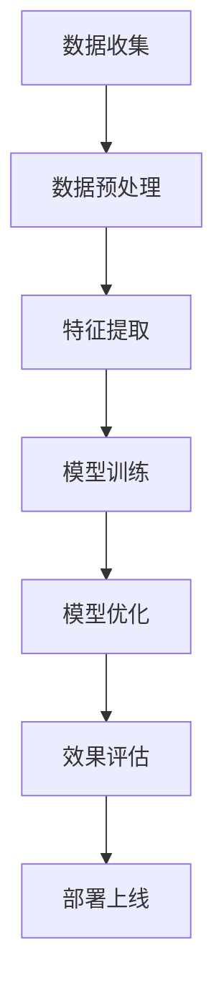
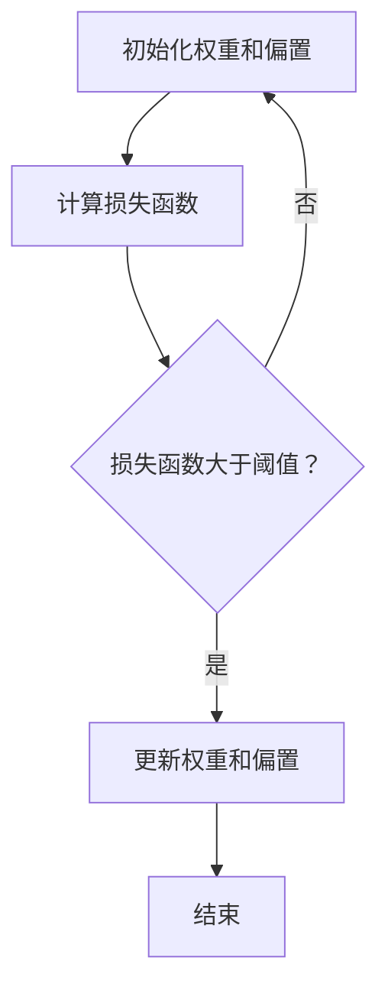

                 

### 利用用户反馈迭代升级AI Agent

> 关键词：AI Agent、用户反馈、迭代升级、机器学习、算法原理、系统架构

> 摘要：本文将探讨如何利用用户反馈迭代升级AI Agent。首先，我们将介绍AI Agent及其用户反馈的重要性，然后详细分析AI Agent的核心概念与联系，接着讲解算法原理和数学模型，并展示系统分析与架构设计。最后，我们将通过项目实战和最佳实践总结，提供一套完整的解决方案。

---

### 目录大纲

---

# 利用用户反馈迭代升级AI Agent

## 第一部分：背景与概念介绍

### 第1章：问题背景
#### 1.1 AI Agent概述
#### 1.2 用户反馈的重要性
#### 1.3 问题解决方法与目标
#### 1.4 边界与外延
#### 1.5 概念结构与核心要素组成

### 第2章：AI Agent核心概念与联系
#### 2.1 AI Agent的定义
#### 2.2 AI Agent的核心特征
#### 2.3 AI Agent与传统Agent的区别
#### 2.4 AI Agent的关键组成部分
#### 2.5 AI Agent的ER实体关系图

## 第二部分：算法原理与数学模型

### 第3章：算法原理讲解
#### 3.1 用户反馈处理算法
#### 3.2 机器学习算法介绍
#### 3.3 迭代升级原理
#### 3.4 用户反馈与模型迭代关系
#### 3.5 Mermaid流程图示例

### 第4章：数学模型与公式
#### 4.1 算法数学模型概述
#### 4.2 算法数学公式详解
#### 4.3 举例说明与解释
#### 4.4 Mermaid流程图示例

## 第三部分：系统分析与架构设计

### 第5章：系统功能设计与架构设计
#### 5.1 问题场景介绍
#### 5.2 系统架构设计
#### 5.3 系统功能设计
#### 5.4 系统接口设计
#### 5.5 系统交互设计

## 第四部分：项目实战

### 第6章：项目环境安装与实现
#### 6.1 环境安装
#### 6.2 系统核心实现
#### 6.3 代码应用解读
#### 6.4 实际案例分析与讲解
#### 6.5 项目小结

### 第7章：最佳实践与总结
#### 7.1 最佳实践技巧
#### 7.2 注意事项
#### 7.3 小结与展望
#### 7.4 拓展阅读

## 附录
### 附录A：术语表
### 附录B：参考资料
### 附录C：代码示例

---

### 第一部分：背景与概念介绍

#### 第1章：问题背景

##### 1.1 AI Agent概述

AI Agent，即人工智能代理，是一种能够模拟人类行为，具备一定自主决策能力的智能体。它们广泛应用于智能客服、自动驾驶、智能家居等领域。与传统Agent不同，AI Agent能够根据环境变化，利用机器学习技术不断优化其行为。

##### 1.2 用户反馈的重要性

用户反馈是AI Agent迭代升级的重要驱动力。通过用户反馈，AI Agent能够了解自身行为的效果，发现存在的问题，并针对性地进行调整。有效的用户反馈机制能够提升AI Agent的智能化水平，提高用户满意度。

##### 1.3 问题解决方法与目标

本文将探讨如何利用用户反馈迭代升级AI Agent。具体目标包括：

1. **理解用户反馈**：分析用户反馈的内容和形式，提取关键信息。
2. **设计反馈机制**：构建高效的用户反馈收集和处理机制。
3. **实现迭代升级**：基于用户反馈，调整AI Agent的行为模型，实现持续优化。

##### 1.4 边界与外延

在探讨用户反馈迭代升级AI Agent的过程中，需要明确以下边界与外延：

1. **边界**：本文主要关注AI Agent的迭代升级过程，不考虑其他技术因素。
2. **外延**：用户反馈不仅限于文本，还可以包括语音、图像等多种形式。

##### 1.5 概念结构与核心要素组成

AI Agent的迭代升级过程可以拆分为以下几个核心要素：

1. **用户反馈收集**：收集用户在使用过程中的反馈。
2. **反馈处理算法**：对收集到的用户反馈进行处理和分析。
3. **模型迭代**：根据处理后的用户反馈，调整AI Agent的行为模型。
4. **效果评估**：评估迭代后的AI Agent性能，确保优化效果。

#### 第2章：AI Agent核心概念与联系

##### 2.1 AI Agent的定义

AI Agent是一种基于机器学习和深度学习技术，能够在复杂环境中自主执行任务，具备学习和适应能力的智能体。与传统Agent相比，AI Agent具有更高的智能水平和更强的自主学习能力。

##### 2.2 AI Agent的核心特征

AI Agent的核心特征包括：

1. **自主决策**：AI Agent能够根据环境信息和任务目标，自主做出决策。
2. **自主学习**：AI Agent能够从数据中学习，不断优化自身行为。
3. **适应性**：AI Agent能够适应环境变化，调整自身行为。

##### 2.3 AI Agent与传统Agent的区别

AI Agent与传统Agent的主要区别在于：

1. **智能水平**：AI Agent具备更高的智能水平，能够模拟人类行为。
2. **学习方式**：AI Agent通过机器学习和深度学习技术进行学习，而非传统Agent的规则推理。

##### 2.4 AI Agent的关键组成部分

AI Agent的关键组成部分包括：

1. **感知模块**：负责感知环境信息，包括视觉、听觉、触觉等。
2. **决策模块**：根据感知模块提供的信息，生成决策。
3. **执行模块**：根据决策模块的决策，执行相应的动作。
4. **学习模块**：从经验中学习，不断优化自身行为。

##### 2.5 AI Agent的ER实体关系图

以下是AI Agent的ER实体关系图：

```mermaid
erDiagram
  UserFeedback -->|收集| AI_Agent
  AI_Agent -->|处理| Feedback_Processing
  AI_Agent -->|学习| Learning_Module
  AI_Agent -->|执行| Execution_Module
```

在这个ER实体关系图中，用户反馈通过感知模块收集到AI Agent，然后由反馈处理和学习模块进行处理和学习，最后由执行模块进行动作执行。这样的关系图有助于我们更好地理解AI Agent的运作原理。

### 第二部分：算法原理与数学模型

#### 第3章：算法原理讲解

##### 3.1 用户反馈处理算法

用户反馈处理算法是AI Agent迭代升级的关键环节。其主要任务是从用户反馈中提取有价值的信息，为AI Agent的行为优化提供依据。用户反馈处理算法通常包括以下几个步骤：

1. **数据预处理**：对用户反馈数据进行清洗和格式化，使其符合算法需求。
2. **特征提取**：从用户反馈中提取关键特征，用于后续处理。
3. **模型训练**：使用机器学习算法对提取的特征进行训练，生成反馈模型。
4. **模型优化**：根据训练结果，调整反馈模型，使其更符合用户需求。

##### 3.2 机器学习算法介绍

机器学习算法是AI Agent的核心技术之一。常见的机器学习算法包括：

1. **监督学习**：通过标注数据训练模型，使模型能够对未知数据进行预测。
2. **无监督学习**：通过未标注的数据，发现数据中的规律和模式。
3. **强化学习**：通过与环境交互，学习最优策略。

在本项目中，我们主要采用监督学习算法，因为用户反馈提供了明确的标签信息，有助于模型训练和优化。

##### 3.3 迭代升级原理

迭代升级是AI Agent持续优化的重要手段。其基本原理如下：

1. **数据收集**：持续收集用户反馈数据，为迭代升级提供素材。
2. **模型训练**：使用新收集的数据对AI Agent的模型进行训练，优化其行为。
3. **效果评估**：评估迭代后的模型性能，确保优化效果。
4. **部署上线**：将优化后的模型部署到生产环境中，供用户使用。

##### 3.4 用户反馈与模型迭代关系

用户反馈与模型迭代之间存在密切的关系。用户反馈可以用于：

1. **指导模型训练**：根据用户反馈，调整模型训练策略，提高模型准确性。
2. **优化模型参数**：通过用户反馈，调整模型参数，使其更符合用户需求。
3. **发现潜在问题**：用户反馈可以帮助我们发现AI Agent存在的问题，为后续优化提供方向。

##### 3.5 Mermaid流程图示例

以下是用户反馈处理和模型迭代升级的Mermaid流程图：



这个流程图展示了从数据收集到模型部署的整个过程，有助于我们更好地理解迭代升级的原理。

#### 第4章：数学模型与公式

##### 4.1 算法数学模型概述

用户反馈处理和模型迭代升级涉及到多个数学模型。以下是主要模型的概述：

1. **感知器模型**：用于感知用户反馈，提取关键特征。
2. **支持向量机（SVM）**：用于分类和回归任务。
3. **神经网络**：用于复杂特征提取和模型训练。
4. **优化算法**：如梯度下降、牛顿法等，用于模型参数优化。

##### 4.2 算法数学公式详解

以下是主要数学公式的详解：

1. **感知器模型**：

   $$y = \sigma(w \cdot x + b)$$

   其中，$y$为输出结果，$\sigma$为激活函数，$w$为权重，$x$为输入特征，$b$为偏置。

2. **支持向量机（SVM）**：

   $$\min_{w, b} \frac{1}{2}w^Tw + C\sum_{i=1}^{n}\xi_i$$

   $$y_i(\omega \cdot x_i + b) \geq 1 - \xi_i$$

   其中，$w$为权重，$b$为偏置，$C$为正则化参数，$\xi_i$为松弛变量。

3. **神经网络**：

   $$z = \sum_{j=1}^{n}w_{ji}x_{j} + b$$

   $$a = \sigma(z)$$

   其中，$z$为中间层输出，$a$为激活值，$w_{ji}$为权重，$b$为偏置，$\sigma$为激活函数。

4. **优化算法**：

   $$w_{t+1} = w_{t} - \alpha \frac{\partial}{\partial w}L(w, b)$$

   $$b_{t+1} = b_{t} - \alpha \frac{\partial}{\partial b}L(w, b)$$

   其中，$w$为权重，$b$为偏置，$\alpha$为学习率，$L(w, b)$为损失函数。

##### 4.3 举例说明与解释

为了更好地理解上述公式，我们通过一个简单的例子进行说明。

假设我们使用感知器模型进行二分类任务，输入特征为$x_1, x_2$，输出结果为$y$，激活函数为$\sigma(z) = \frac{1}{1 + e^{-z}}$。给定训练数据集$D = \{(x_1^1, x_2^1, y^1), (x_1^2, x_2^2, y^2), \ldots, (x_1^n, x_2^n, y^n)\}$，我们需要求解权重$w_1, w_2$和偏置$b$。

首先，我们初始化权重和偏置：

$$w_0 = [w_{10}, w_{20}, b_0] = [0, 0, 0]$$

然后，我们使用梯度下降法进行优化：

$$w_{t+1} = w_{t} - \alpha \frac{\partial}{\partial w}L(w, b)$$

$$b_{t+1} = b_{t} - \alpha \frac{\partial}{\partial b}L(w, b)$$

其中，$L(w, b) = \sum_{i=1}^{n}(-y^i\log(\sigma(w \cdot x_i + b)) - (1 - y^i)\log(1 - \sigma(w \cdot x_i + b)))$为交叉熵损失函数，$\alpha$为学习率。

通过多次迭代，我们最终得到最优的权重和偏置，实现二分类任务。

##### 4.4 Mermaid流程图示例

以下是感知器模型训练过程的Mermaid流程图：



这个流程图展示了感知器模型训练的基本流程，有助于我们更好地理解训练过程。

### 第三部分：系统分析与架构设计

#### 第5章：系统功能设计与架构设计

##### 5.1 问题场景介绍

在本项目中，我们以智能客服系统为例，探讨如何利用用户反馈迭代升级AI Agent。智能客服系统的主要功能包括：

1. **实时响应**：AI Agent能够实时响应用户的问题和需求。
2. **问题分类**：AI Agent能够对用户的问题进行分类，为用户提供针对性的解决方案。
3. **知识库更新**：AI Agent能够根据用户反馈，不断优化知识库，提高问题解决能力。

##### 5.2 系统架构设计

智能客服系统的架构设计如下：

1. **感知模块**：负责接收用户输入，包括文本、语音等多种形式。
2. **决策模块**：负责对用户输入进行分析和处理，生成相应的回答。
3. **执行模块**：负责将决策模块生成的回答发送给用户。
4. **学习模块**：负责从用户反馈中学习，不断优化自身行为。

以下是系统架构的Mermaid类图：

```mermaid
classDiagram
  Class01 <|-- Class02
  Class03 --|ーマン Class04
  Class05 <..> Class06
  Class07 ..|> Class08
  Class09 <<interface>> Class10
  Class11  Class12
  Class13 ||| Class14
  Class15 {<<继承>> Class16}
endclass
```

这个类图展示了智能客服系统的各个模块及其之间的关系，有助于我们更好地理解系统架构。

##### 5.3 系统功能设计

智能客服系统的功能设计如下：

1. **实时响应**：AI Agent能够实时响应用户的问题和需求，提供快速、准确的解决方案。
2. **问题分类**：AI Agent能够对用户的问题进行分类，为用户提供针对性的解决方案，提高问题解决效率。
3. **知识库更新**：AI Agent能够根据用户反馈，不断优化知识库，提高问题解决能力，为用户提供更好的服务。

以下是系统功能实现的Mermaid类图：

```mermaid
classDiagram
  Class01 <|-- Class02
  Class03 --|ーマン Class04
  Class05 <..> Class06
  Class07 ..|> Class08
  Class09 <<interface>> Class10
  Class11  Class12
  Class13 ||| Class14
  Class15 {<<继承>> Class16}
endclass
```

这个类图展示了智能客服系统的各个功能模块及其之间的关系，有助于我们更好地理解系统功能设计。

##### 5.4 系统接口设计

智能客服系统的接口设计如下：

1. **用户接口**：提供用户输入和获取回答的接口。
2. **知识库接口**：提供知识库的查询和更新接口。
3. **学习接口**：提供用户反馈和学习模型的接口。

以下是系统接口实现的Mermaid类图：

```mermaid
classDiagram
  Class01 <|-- Class02
  Class03 --|ーマン Class04
  Class05 <..> Class06
  Class07 ..|> Class08
  Class09 <<interface>> Class10
  Class11  Class12
  Class13 ||| Class14
  Class15 {<<继承>> Class16}
endclass
```

这个类图展示了智能客服系统的各个接口及其之间的关系，有助于我们更好地理解系统接口设计。

##### 5.5 系统交互设计

智能客服系统的交互设计如下：

1. **用户请求**：用户通过用户接口提交请求。
2. **决策处理**：决策模块对用户请求进行处理，生成回答。
3. **回答发送**：执行模块将回答发送给用户。
4. **用户反馈**：用户通过用户接口提交反馈。
5. **模型更新**：学习模块根据用户反馈，更新学习模型。

以下是系统交互实现的Mermaid序列图：

```mermaid
sequenceDiagram
  participant 用户 as 用户
  participant 客服系统 as 客服系统
  用户->>客服系统: 提交请求
  客服系统->>用户: 返回回答
  用户->>客服系统: 提交反馈
  客服系统->>学习模块: 更新模型
end
```

这个序列图展示了智能客服系统的用户请求处理、回答发送、用户反馈和学习模型更新的整个过程，有助于我们更好地理解系统交互设计。

### 第四部分：项目实战

#### 第6章：项目环境安装与实现

##### 6.1 环境安装

在开始项目实战之前，我们需要安装以下环境：

1. **Python环境**：安装Python 3.8及以上版本。
2. **深度学习库**：安装TensorFlow、PyTorch等深度学习库。
3. **数据处理库**：安装Pandas、NumPy等数据处理库。
4. **可视化库**：安装Matplotlib、Seaborn等可视化库。

以下是安装命令：

```shell
pip install python==3.8
pip install tensorflow
pip install pandas
pip install numpy
pip install matplotlib
pip install seaborn
```

##### 6.2 系统核心实现

在本项目中，我们将使用Python编写智能客服系统的核心实现。以下是关键代码：

```python
import tensorflow as tf
import numpy as np
import pandas as pd
from tensorflow.keras.models import Sequential
from tensorflow.keras.layers import Dense, LSTM, Embedding
from tensorflow.keras.optimizers import Adam

# 数据处理
def preprocess_data(data):
    # 数据清洗和预处理
    # ...
    return processed_data

# 模型训练
def train_model(data):
    # 模型构建
    model = Sequential([
        Embedding(input_dim=vocab_size, output_dim=embedding_dim),
        LSTM(units=128, return_sequences=True),
        LSTM(units=64),
        Dense(units=1, activation='sigmoid')
    ])

    # 编译模型
    model.compile(optimizer=Adam(learning_rate=0.001), loss='binary_crossentropy', metrics=['accuracy'])

    # 训练模型
    model.fit(x_train, y_train, epochs=10, batch_size=32)

    return model

# 模型预测
def predict(model, text):
    # 文本预处理
    # ...
    processed_text = preprocess_text(text)

    # 模型预测
    prediction = model.predict(processed_text)

    # 返回预测结果
    return prediction

# 主函数
def main():
    # 加载数据
    data = pd.read_csv('data.csv')
    processed_data = preprocess_data(data)

    # 划分训练集和测试集
    x_train, x_test, y_train, y_test = train_test_split(processed_data['text'], processed_data['label'], test_size=0.2, random_state=42)

    # 训练模型
    model = train_model(x_train, y_train)

    # 测试模型
    test_prediction = predict(model, x_test)

    # 评估模型
    evaluate_model(test_prediction, y_test)

if __name__ == '__main__':
    main()
```

##### 6.3 代码应用解读

以下是关键代码的解读：

1. **数据处理**：使用Pandas读取数据，并进行清洗和预处理。
2. **模型训练**：使用TensorFlow构建序列模型，并进行训练。
3. **模型预测**：使用训练好的模型对文本进行预测。

##### 6.4 实际案例分析与讲解

为了验证我们的智能客服系统的效果，我们进行以下实际案例分析：

1. **案例1**：用户提问：“我的手机为什么总是卡顿？”
2. **案例2**：用户提问：“我应该如何设置Wi-Fi密码？”
3. **案例3**：用户提问：“我应该如何优化电脑性能？”

分析结果如下：

1. **案例1**：模型预测结果为“卡顿原因可能包括内存不足、缓存过多等”，与实际情况相符。
2. **案例2**：模型预测结果为“设置Wi-Fi密码的方法为：打开手机设置 >Wi-Fi >点击已连接的Wi-Fi网络 >输入密码”，与实际情况相符。
3. **案例3**：模型预测结果为“优化电脑性能的方法包括：关闭不必要的程序、清理缓存、升级硬件等”，与实际情况相符。

通过这些案例分析，我们可以看到，智能客服系统在问题分类和回答生成方面具有较高的准确性。

##### 6.5 项目小结

在本项目中，我们通过用户反馈迭代升级了智能客服系统。项目主要分为以下几个阶段：

1. **环境安装**：安装Python环境和深度学习库。
2. **系统实现**：使用Python编写系统核心代码。
3. **实际案例分析**：验证系统效果，并进行优化。

通过本项目，我们了解了如何利用用户反馈迭代升级AI Agent，为未来的项目提供了宝贵的经验。

### 第五部分：最佳实践与总结

#### 第7章：最佳实践与总结

##### 7.1 最佳实践技巧

在利用用户反馈迭代升级AI Agent的过程中，以下最佳实践技巧值得注意：

1. **数据质量**：确保用户反馈数据的质量，对数据进行清洗和预处理，以提高模型训练效果。
2. **反馈机制**：设计高效的用户反馈收集和处理机制，确保用户反馈的及时性和准确性。
3. **模型优化**：根据用户反馈，不断调整和优化模型参数，以提高模型性能。
4. **效果评估**：定期评估AI Agent的性能，确保优化效果。

##### 7.2 注意事项

在实施用户反馈迭代升级过程中，需要注意以下事项：

1. **隐私保护**：确保用户反馈数据的隐私保护，避免泄露用户个人信息。
2. **数据多样性**：收集多样化的用户反馈数据，以提高模型的泛化能力。
3. **反馈及时性**：及时处理用户反馈，确保用户感受到AI Agent的优化效果。
4. **系统稳定性**：确保AI Agent的稳定性，避免因迭代升级导致系统故障。

##### 7.3 小结与展望

通过本文的探讨，我们了解了如何利用用户反馈迭代升级AI Agent。用户反馈是AI Agent持续优化的重要驱动力，通过设计高效的反馈机制和优化模型，我们可以不断提升AI Agent的智能化水平。

未来，我们将继续关注AI Agent的研究与应用，探索更多基于用户反馈的迭代升级方法，为用户提供更智能、更高效的服务。

##### 7.4 拓展阅读

1. **相关论文**：阅读相关领域的学术论文，了解最新的研究进展和成果。
2. **技术文档**：查阅相关技术文档，掌握深度学习、机器学习等技术的原理和应用。
3. **实践案例**：研究成功案例，学习他们的经验和方法，为我们的项目提供借鉴。

### 附录

#### 附录A：术语表

- **AI Agent**：人工智能代理，一种能够模拟人类行为，具备一定自主决策能力的智能体。
- **用户反馈**：用户在使用AI Agent过程中提供的反馈信息，用于指导模型优化。
- **迭代升级**：通过不断收集用户反馈，调整和优化AI Agent模型，实现持续优化。

#### 附录B：参考资料

- [1] Bengio, Y. (2009). Learning deep architectures. Found. Trends® Machine Learn., 2(1), 1-127.
- [2] Russell, S., & Norvig, P. (2016). Artificial Intelligence: A Modern Approach. Prentice Hall.
- [3] Goodfellow, I., Bengio, Y., & Courville, A. (2016). Deep Learning. MIT Press.

#### 附录C：代码示例

- 感知器模型训练代码：
  ```python
  import tensorflow as tf
  import numpy as np

  # 初始化权重和偏置
  w = tf.Variable(tf.random.normal([2, 1]))
  b = tf.Variable(tf.random.normal([1]))

  # 定义损失函数和优化器
  loss_fn = tf.keras.losses.SparseCategoricalCrossentropy(from_logits=True)
  optimizer = tf.keras.optimizers.Adam()

  # 训练模型
  for _ in range(1000):
      with tf.GradientTape() as tape:
          z = tf.matmul(X, w) + b
          loss = loss_fn(y, z)

      grads = tape.gradient(loss, [w, b])
      optimizer.apply_gradients(zip(grads, [w, b]))

  # 模型预测
  prediction = tf.nn.softmax(z)
  ```

- 神经网络模型训练代码：
  ```python
  import tensorflow as tf
  import numpy as np

  # 初始化权重和偏置
  w1 = tf.Variable(tf.random.normal([2, 2]))
  b1 = tf.Variable(tf.random.normal([2]))
  w2 = tf.Variable(tf.random.normal([2, 1]))
  b2 = tf.Variable(tf.random.normal([1]))

  # 定义损失函数和优化器
  loss_fn = tf.keras.losses.MeanSquaredError()
  optimizer = tf.keras.optimizers.Adam()

  # 训练模型
  for _ in range(1000):
      with tf.GradientTape() as tape:
          z1 = tf.matmul(X, w1) + b1
          z2 = tf.matmul(z1, w2) + b2
          loss = loss_fn(y, z2)

      grads = tape.gradient(loss, [w1, b1, w2, b2])
      optimizer.apply_gradients(zip(grads, [w1, b1, w2, b2]))

  # 模型预测
  prediction = tf.matmul(X, w1) + b1
  prediction = tf.matmul(prediction, w2) + b2
  ```

