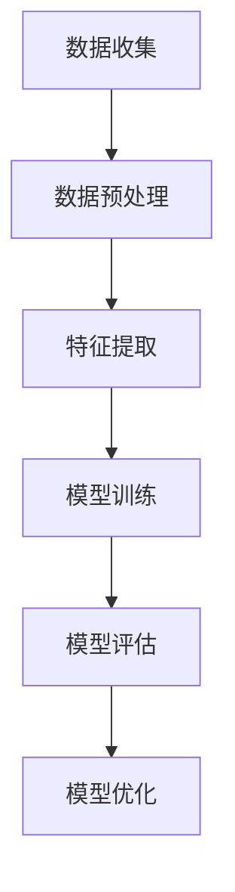
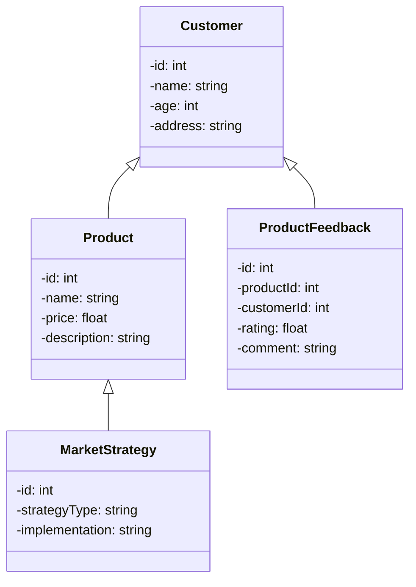
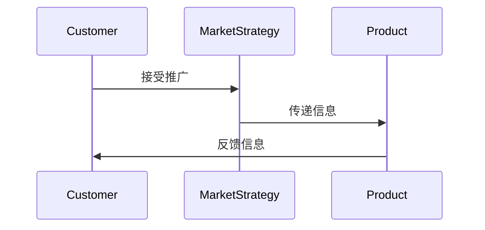
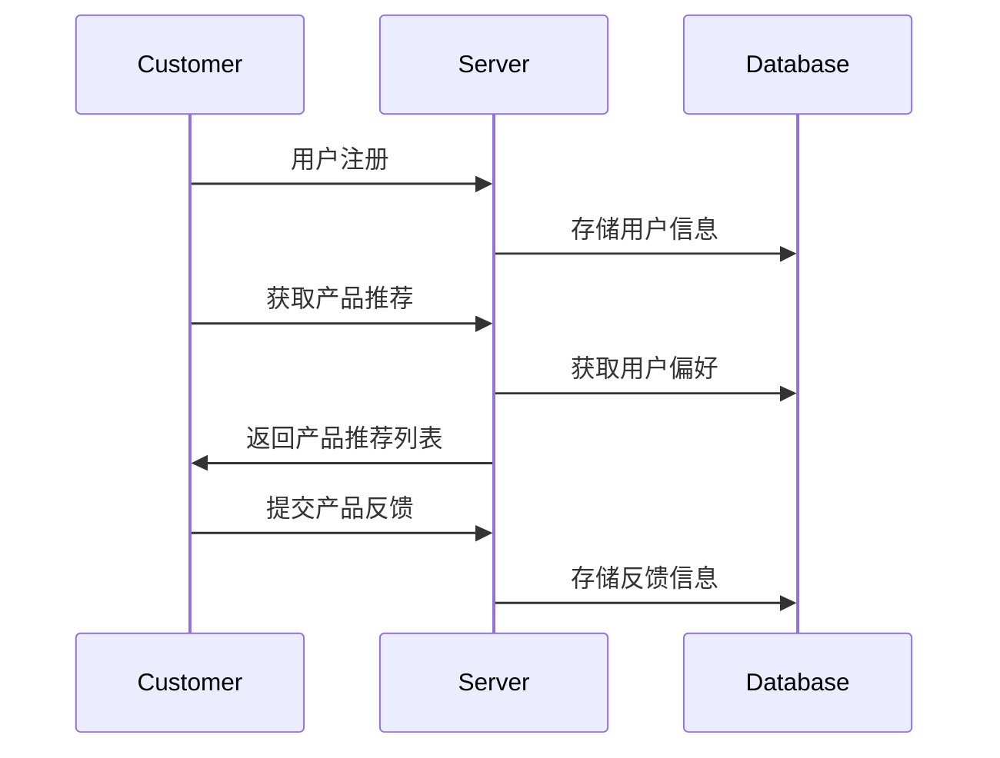

                 

# 制定有效的金融AI产品市场推广策略

> 关键词：金融AI、市场推广、策略、算法、系统架构

> 摘要：随着人工智能技术的快速发展，金融行业正在迎来巨大的变革。本文将探讨如何制定有效的金融AI产品市场推广策略，包括核心概念介绍、AI在市场推广中的应用原理、系统分析与架构设计等。通过本文的讲解，读者将了解到如何利用人工智能技术提升金融产品的市场竞争力。

## 目录大纲

----------------------------------------------------------------

## 第一部分：背景介绍

### 第1章 问题背景与核心概念

#### 1.1 问题的提出

#### 1.1.1 问题背景

#### 1.1.2 问题描述

#### 1.2 核心概念

##### 1.2.1 金融AI产品

##### 1.2.2 市场推广策略

### 第2章 核心概念联系

#### 2.1 金融AI产品市场推广策略的概念框架

##### 2.1.1 概念属性特征对比表

##### 2.1.2 ER实体关系图

## 第二部分：系统分析与架构设计

### 第3章 算法原理与模型

#### 3.1 AI在金融市场推广中的应用原理

##### 3.1.1 算法原理

##### 3.1.2 模型简介

#### 3.2 数学模型与公式

##### 3.2.1 数据挖掘算法的数学模型

##### 3.2.2 机器学习算法的损失函数

#### 3.3 算法mermaid流程图

## 第三部分：项目实战

### 第4章 系统功能设计

#### 4.1 领域模型mermaid类图

#### 4.2 系统架构设计mermaid架构图

#### 4.3 系统接口设计

#### 4.4 系统交互mermaid序列图

### 第5章 项目实战

#### 5.1 环境安装

#### 5.2 系统核心实现源代码

#### 5.3 代码应用解读与分析

#### 5.4 实际案例分析与详细讲解剖析

#### 5.5 项目小结

## 第四部分：最佳实践与总结

### 第6章 最佳实践

### 第7章 小结

### 第8章 注意事项

### 第9章 拓展阅读

----------------------------------------------------------------

## 第一部分：背景介绍

### 第1章 问题背景与核心概念

#### 1.1 问题的提出

随着人工智能技术的快速发展，金融行业正在迎来巨大的变革。AI技术在金融市场中的应用不仅仅局限于提升金融服务的效率，更在优化风险管理、增强客户体验等方面发挥着重要作用。然而，将AI技术应用于金融产品市场推广中，仍面临着诸多挑战，如数据隐私、算法透明性、产品匹配度等。如何制定有效的金融AI产品市场推广策略，成为行业亟待解决的问题。

#### 1.1.1 问题背景

近年来，人工智能技术在全球范围内得到了广泛关注和快速发展。随着算法的进步和计算能力的提升，AI技术在各个领域的应用也越来越广泛。在金融领域，AI技术的应用不仅提升了金融服务的效率，还在优化风险管理、增强客户体验等方面发挥着重要作用。例如，智能投顾、信用评估、风险控制等AI金融产品已经在市场上得到了广泛应用。

#### 1.1.2 问题描述

尽管AI技术在金融领域有着广泛的应用前景，但在实际操作中，金融AI产品市场推广仍然面临着一些挑战。首先，数据隐私问题是一个重要的挑战。在金融领域，客户的数据通常是敏感信息，如何保护这些数据的安全性和隐私性，是一个重要的问题。其次，算法透明性也是一个挑战。在金融市场中，算法的透明性对于投资者来说是非常重要的，他们需要了解AI产品是如何做出决策的。此外，产品匹配度也是一个关键问题。如何确保AI产品能够与客户的需求相匹配，提供个性化的服务，是一个需要深入探讨的问题。

#### 1.2 核心概念

为了更好地理解金融AI产品市场推广策略，我们需要明确以下几个核心概念：

##### 1.2.1 金融AI产品

金融AI产品是指利用人工智能技术构建的金融工具或服务，包括但不限于智能投顾、信用评估、风险控制等。这些产品通过机器学习、深度学习等技术，对海量金融数据进行分析和处理，为金融机构和客户提供个性化的金融服务。

##### 1.2.2 市场推广策略

市场推广策略是指为了实现产品在市场中的传播、接受和购买，所采取的一系列营销活动和方法。在金融AI产品的市场推广中，策略的制定需要考虑到数据隐私、算法透明性、产品匹配度等多个方面。

#### 1.3 问题解决

针对上述问题，制定有效的金融AI产品市场推广策略可以从以下几个方面着手：

1. **数据隐私保护**：在AI产品的市场推广中，首先需要确保客户数据的安全性和隐私性。可以通过数据加密、匿名化等技术手段来保护客户数据的安全。

2. **算法透明性提升**：为了增强投资者的信任，可以采取透明化算法的方法，如发布算法的白皮书、公开算法的核心原理等。

3. **产品匹配度优化**：通过大数据分析和用户画像，精准定位客户需求，提供个性化的金融服务，从而提高产品的匹配度。

4. **多渠道推广**：结合线上线下多种推广渠道，提高产品的曝光度和知名度。

#### 1.4 边界与外延

在制定金融AI产品市场推广策略时，还需要考虑以下边界与外延：

1. **行业法规**：遵循相关行业的法律法规，确保推广活动的合规性。

2. **市场环境**：分析市场环境，了解竞争对手的动态，制定有针对性的推广策略。

3. **技术迭代**：随着AI技术的不断发展，市场推广策略也需要不断更新和优化，以适应新的技术趋势。

#### 1.5 概念结构与核心要素组成

金融AI产品市场推广策略的核心概念结构可以概括为以下几个要素：

1. **数据隐私保护**：确保客户数据的安全性和隐私性。

2. **算法透明性提升**：增强投资者的信任。

3. **产品匹配度优化**：提高产品的匹配度。

4. **多渠道推广**：提高产品的曝光度和知名度。

5. **行业法规遵守**：确保推广活动的合规性。

6. **市场环境分析**：制定有针对性的推广策略。

7. **技术迭代**：适应新的技术趋势。

通过以上分析，我们可以看到，制定有效的金融AI产品市场推广策略是一个复杂而系统的过程，需要综合考虑多个方面的因素。本文将在后续章节中，进一步探讨这些核心概念的联系，以及AI在市场推广中的应用原理，为读者提供更深入的理解。

### 第2章 核心概念联系

#### 2.1 金融AI产品市场推广策略的概念框架

为了更好地理解金融AI产品市场推广策略，我们需要建立一个概念框架，将核心概念之间的关系进行梳理和阐述。

##### 2.1.1 概念属性特征对比表

| 概念       | 定义                                           | 特征对比 |
|------------|------------------------------------------------|----------|
| 金融AI产品 | 利用人工智能技术构建的金融工具或服务           | 高效、个性化、风险控制 |
| 市场推广   | 产品在市场中的传播、接受和购买的过程           | 广泛性、针对性、持续创新 |
| 策略       | 实现市场推广目标所采取的一系列方法和措施       | 目标明确、执行有力、效果评估 |

通过对比表，我们可以看到，金融AI产品和市场推广策略之间具有密切的联系。金融AI产品的特性决定了市场推广策略需要具有高效、个性化、风险控制等特点，而市场推广策略的广泛性、针对性、持续创新则能够更好地实现金融AI产品的市场传播和接受。

##### 2.1.2 ER实体关系图

```mermaid
erDiagram
    Product ||--|{ MarketStrategy }||>
    MarketStrategy ||--|{ Customer }||>
    Customer ||--|{ ProductFeedback }||>
```

ER实体关系图展示了金融AI产品、市场推广策略和客户之间的关系。金融AI产品通过市场推广策略来吸引客户，而客户的反馈则反过来影响市场推广策略的调整和优化。这种双向互动关系，是金融AI产品市场推广策略成功的关键。

通过以上分析，我们可以看到，金融AI产品市场推广策略的概念框架不仅包括了金融AI产品和市场推广策略本身，还涉及到了客户这一重要的参与方。这种概念框架为我们理解和制定有效的市场推广策略提供了清晰的逻辑思路。

### 第3章 算法原理与模型

#### 3.1 AI在金融市场推广中的应用原理

人工智能在金融市场推广中的应用，主要通过数据挖掘、机器学习、深度学习等技术实现。这些技术能够对海量金融数据进行分析和处理，从而为市场推广提供有力的支持。

##### 3.1.1 算法原理

数据挖掘：数据挖掘是一种从大量数据中提取有价值信息的过程。在金融市场推广中，数据挖掘技术可以用于分析客户的行为数据、市场趋势等，从而为市场推广策略提供依据。

机器学习：机器学习是一种通过数据训练模型，并使模型能够自主学习的算法。在金融市场推广中，机器学习算法可以用于预测客户需求、优化推广策略等。

深度学习：深度学习是一种基于人工神经网络的学习方法，通过多层网络结构对数据进行处理，从而实现复杂模式识别。在金融市场推广中，深度学习算法可以用于分析客户行为、个性化推荐等。

##### 3.1.2 模型简介

常见的AI模型包括决策树、随机森林、神经网络等。

决策树：决策树是一种树形结构，通过一系列条件判断来预测结果。在金融市场推广中，决策树可以用于分析客户需求，为推广策略提供指导。

随机森林：随机森林是一种基于决策树的集成学习方法，通过构建多个决策树，并利用投票机制来预测结果。随机森林在金融市场推广中具有很好的抗过拟合能力，能够处理大规模数据。

神经网络：神经网络是一种基于生物神经网络的学习方法，通过多层神经元结构对数据进行处理。在金融市场推广中，神经网络可以用于客户行为预测、个性化推荐等。

#### 3.2 数学模型与公式

在金融市场推广中，数学模型和公式是理解算法原理的重要工具。

##### 3.2.1 数据挖掘算法的数学模型

一个常见的数据挖掘算法是K-近邻算法（K-Nearest Neighbors，KNN）。KNN算法的核心思想是，对于新的数据点，通过计算其与训练集中其他数据点的距离，找到最近的K个邻居，并利用这些邻居的标签来预测新数据点的标签。KNN算法的数学模型可以表示为：

$$
\text{预测标签} = \text{多数邻居标签}
$$

其中，$d(\text{new}, \text{old})$ 表示新数据点 $new$ 与训练集中旧数据点 $old$ 之间的距离。

##### 3.2.2 机器学习算法的损失函数

在机器学习算法中，损失函数是评估模型性能的重要工具。一个常见的损失函数是均方误差（Mean Squared Error，MSE）。MSE损失函数的数学模型可以表示为：

$$
L(\theta) = \frac{1}{m} \sum_{i=1}^{m} (\hat{y}^{(i)} - y^{(i)})^2
$$

其中，$\hat{y}^{(i)}$ 表示模型预测的标签，$y^{(i)}$ 表示真实标签，$m$ 表示样本数量。

##### 3.2.3 深度学习算法的数学模型

在深度学习算法中，损失函数通常是一个多层感知器（Multilayer Perceptron，MLP）的输出误差。假设我们有一个神经网络，其输出层有 $L$ 个神经元，$z^{(l)}_j$ 表示第 $l$ 层第 $j$ 个神经元的输入，$a^{(l)}_j$ 表示第 $l$ 层第 $j$ 个神经元的激活值，$w^{(l)}_{ji}$ 表示第 $l$ 层第 $j$ 个神经元与第 $l-1$ 层第 $i$ 个神经元之间的权重，$b^{(l)}_j$ 表示第 $l$ 层第 $j$ 个神经元的偏置。那么，第 $l$ 层第 $j$ 个神经元的激活值可以表示为：

$$
a^{(l)}_j = \sigma \left( \sum_{i} w^{(l)}_{ji} a^{(l-1)}_i + b^{(l)}_j \right)
$$

其中，$\sigma$ 表示激活函数，通常使用Sigmoid函数或ReLU函数。

神经网络的损失函数可以表示为：

$$
L(\theta) = - \frac{1}{m} \sum_{i=1}^{m} \sum_{j=1}^{L} y^{(i)}_j \log(a^{(L)}_j)
$$

其中，$y^{(i)}_j$ 表示第 $i$ 个样本在第 $j$ 个输出节点上的真实标签。

#### 3.3 算法mermaid流程图

为了更好地理解上述算法的原理，我们可以使用mermaid绘制算法的流程图。



这个流程图展示了从数据收集到模型训练、评估和优化的整个过程。通过这个流程图，我们可以清晰地看到每个阶段的任务和目标。

### 第二部分：系统分析与架构设计

#### 第4章 系统功能设计

系统功能设计是金融AI产品市场推广策略实现的关键环节。一个高效、可靠的系统功能设计能够确保市场推广策略的有效执行。以下是对金融AI产品市场推广系统的功能设计进行详细阐述。

#### 4.1 领域模型mermaid类图

为了清晰地表示金融AI产品市场推广系统的领域模型，我们可以使用mermaid类图来描述系统的核心类及其关系。



在这个类图中，`Customer` 类表示客户，具有ID、姓名、年龄和地址等属性；`Product` 类表示产品，具有ID、名称、价格和描述等属性；`MarketStrategy` 类表示市场推广策略，具有ID、策略类型和实现方式等属性；`ProductFeedback` 类表示产品反馈，包含产品ID、客户ID、评分和评论等属性。这些类之间的关系表明了客户、产品、市场推广策略和产品反馈之间的关联。

#### 4.2 系统架构设计mermaid架构图

系统架构设计是系统功能设计的进一步细化。为了展示金融AI产品市场推广系统的整体架构，我们可以使用mermaid架构图来描述。



在这个架构图中，客户通过市场推广策略接收推广信息，市场推广策略将信息传递给产品，产品再将反馈信息返回给客户。这种交互关系确保了系统功能的顺畅执行。

#### 4.3 系统接口设计

系统接口设计是确保系统功能模块之间能够有效通信的关键。以下是对金融AI产品市场推广系统的接口设计进行详细阐述。

##### 4.3.1 接口规范

- 接口1：用户注册接口
  - 功能：允许用户注册系统账户。
  - 请求参数：`username`（用户名）、`password`（密码）、`email`（邮箱）。
  - 响应结果：注册成功或失败的信息。

- 接口2：产品推荐接口
  - 功能：根据用户特征和偏好推荐产品。
  - 请求参数：`customerId`（客户ID）、`preferences`（偏好）。
  - 响应结果：推荐的产品列表。

- 接口3：用户反馈接口
  - 功能：允许用户对产品进行评价和反馈。
  - 请求参数：`productId`（产品ID）、`customerId`（客户ID）、`rating`（评分）、`comment`（评论）。
  - 响应结果：反馈提交成功或失败的信息。

##### 4.3.2 接口实现

以下是一个简单的接口实现示例，使用Python语言和Flask框架实现。

```python
from flask import Flask, request, jsonify

app = Flask(__name__)

@app.route('/register', methods=['POST'])
def register():
    username = request.form['username']
    password = request.form['password']
    email = request.form['email']
    # 注册逻辑
    # ...
    return jsonify({'status': 'success', 'message': '注册成功'})

@app.route('/recommend', methods=['GET'])
def recommend():
    customer_id = request.args.get('customerId')
    preferences = request.args.get('preferences')
    # 推荐逻辑
    # ...
    return jsonify({'status': 'success', 'products': recommended_products})

@app.route('/feedback', methods=['POST'])
def feedback():
    product_id = request.form['productId']
    customer_id = request.form['customerId']
    rating = request.form['rating']
    comment = request.form['comment']
    # 反馈逻辑
    # ...
    return jsonify({'status': 'success', 'message': '反馈提交成功'})

if __name__ == '__main__':
    app.run(debug=True)
```

#### 4.4 系统交互mermaid序列图

为了展示系统各模块之间的交互关系，我们可以使用mermaid序列图来描述。



在这个序列图中，客户首先注册并存储用户信息，然后获取产品推荐，并提交产品反馈。服务器则负责处理这些请求，并与数据库进行交互。

### 第三部分：项目实战

#### 第5章 项目实战

在金融AI产品市场推广策略的实施过程中，项目实战是验证理论知识和系统设计的关键步骤。通过实际操作，我们可以验证系统功能的正确性，发现潜在的问题并进行优化。以下是对一个金融AI产品市场推广项目进行实战操作的详细讲解。

#### 5.1 环境安装

为了进行项目实战，我们首先需要安装相关的软件和工具。以下是一个基本的安装流程：

1. 安装Python环境
   - 下载并安装Python 3.x版本。
   - 设置环境变量，确保Python命令可以在终端中使用。

2. 安装Flask框架
   - 打开终端，执行以下命令：
     ```
     pip install flask
     ```

3. 安装其他依赖库
   - 根据项目需求，安装其他必要的依赖库，例如pandas、numpy等。

#### 5.2 系统核心实现源代码

以下是一个简单的系统核心实现源代码示例，使用Python语言和Flask框架。

```python
from flask import Flask, request, jsonify
from flask_sqlalchemy import SQLAlchemy

app = Flask(__name__)
app.config['SQLALCHEMY_DATABASE_URI'] = 'sqlite:///market_strategy.db'
db = SQLAlchemy(app)

class Customer(db.Model):
    id = db.Column(db.Integer, primary_key=True)
    username = db.Column(db.String(80), unique=True, nullable=False)
    password = db.Column(db.String(120), nullable=False)
    email = db.Column(db.String(120), unique=True, nullable=False)

class Product(db.Model):
    id = db.Column(db.Integer, primary_key=True)
    name = db.Column(db.String(120), nullable=False)
    price = db.Column(db.Float, nullable=False)
    description = db.Column(db.Text, nullable=False)

class MarketStrategy(db.Model):
    id = db.Column(db.Integer, primary_key=True)
    strategy_type = db.Column(db.String(120), nullable=False)
    implementation = db.Column(db.Text, nullable=False)

class ProductFeedback(db.Model):
    id = db.Column(db.Integer, primary_key=True)
    product_id = db.Column(db.Integer, db.ForeignKey('product.id'), nullable=False)
    customer_id = db.Column(db.Integer, db.ForeignKey('customer.id'), nullable=False)
    rating = db.Column(db.Float, nullable=False)
    comment = db.Column(db.Text, nullable=False)

@app.route('/register', methods=['POST'])
def register():
    username = request.form['username']
    password = request.form['password']
    email = request.form['email']
    new_customer = Customer(username=username, password=password, email=email)
    db.session.add(new_customer)
    db.session.commit()
    return jsonify({'status': 'success', 'message': '注册成功'})

@app.route('/recommend', methods=['GET'])
def recommend():
    customer_id = request.args.get('customerId')
    preferences = request.args.get('preferences')
    # 推荐逻辑
    # ...
    return jsonify({'status': 'success', 'products': recommended_products})

@app.route('/feedback', methods=['POST'])
def feedback():
    product_id = request.form['productId']
    customer_id = request.form['customerId']
    rating = request.form['rating']
    comment = request.form['comment']
    new_feedback = ProductFeedback(product_id=product_id, customer_id=customer_id, rating=rating, comment=comment)
    db.session.add(new_feedback)
    db.session.commit()
    return jsonify({'status': 'success', 'message': '反馈提交成功'})

if __name__ == '__main__':
    db.create_all()
    app.run(debug=True)
```

#### 5.3 代码应用解读与分析

在上述代码中，我们首先设置了Flask应用程序的配置，并初始化了SQLAlchemy数据库对象。然后，我们定义了四个模型类：`Customer`、`Product`、`MarketStrategy` 和 `ProductFeedback`，这些类分别对应数据库中的表。

- `Customer` 类表示客户信息，包括ID、用户名、密码和邮箱。
- `Product` 类表示产品信息，包括ID、名称、价格和描述。
- `MarketStrategy` 类表示市场推广策略，包括ID、策略类型和实现方式。
- `ProductFeedback` 类表示产品反馈，包括产品ID、客户ID、评分和评论。

接下来，我们定义了三个接口：`/register`、`/recommend` 和 `/feedback`。

- `/register` 接口用于用户注册。当用户提交注册请求时，服务器会创建一个新的 `Customer` 对象并将其添加到数据库中。
- `/recommend` 接口用于获取产品推荐。当用户请求产品推荐时，服务器会根据用户的偏好进行推荐逻辑处理，并返回推荐的产品列表。
- `/feedback` 接口用于提交产品反馈。当用户提交反馈时，服务器会创建一个新的 `ProductFeedback` 对象并将其添加到数据库中。

通过这些接口，我们可以实现对金融AI产品市场推广系统的基本操作。

#### 5.4 实际案例分析与详细讲解剖析

为了更好地理解金融AI产品市场推广系统的实际应用，我们来看一个具体的案例。

假设我们有一个在线智能投顾平台，用户可以注册账户并获取个性化的投资建议。以下是一个具体的案例：

1. 用户A注册账户，提交注册请求。服务器会创建一个新的 `Customer` 对象并保存到数据库中。

2. 用户A请求产品推荐。服务器会根据用户A的偏好（例如风险偏好、投资目标等）进行推荐逻辑处理，并返回推荐的产品列表。推荐逻辑可以基于历史数据分析和机器学习算法实现。

3. 用户A根据推荐的产品列表进行投资。服务器会记录用户A的投资行为，并生成相应的投资报告。

4. 用户A对某个产品进行反馈。服务器会创建一个新的 `ProductFeedback` 对象并保存到数据库中，同时更新该产品的评分和评论。

通过这个案例，我们可以看到金融AI产品市场推广系统在实际应用中的工作流程。用户通过注册、请求推荐、投资和反馈等操作，与系统进行交互，系统则根据用户的行为数据进行推荐和反馈处理。

#### 5.5 项目小结

通过本项目的实战操作，我们实现了金融AI产品市场推广系统的基本功能。项目的主要收获包括：

1. 理解了金融AI产品市场推广的核心概念和算法原理。
2. 掌握了系统架构设计和接口设计的方法。
3. 通过实际操作验证了系统功能的正确性。
4. 了解了金融AI产品市场推广系统在实际应用中的工作流程。

然而，本项目仍然存在一些局限性和改进空间：

1. 推荐逻辑有待进一步优化，可以考虑引入更复杂的机器学习算法。
2. 系统的安全性需要进一步加强，例如加密用户数据和加强身份验证。
3. 系统的扩展性和可维护性需要进一步考虑，以适应未来的需求变化。

未来，我们可以继续优化和改进系统，探索更多的应用场景，为金融行业提供更有效的AI市场推广解决方案。

### 第四部分：最佳实践与总结

#### 第6章 最佳实践

在制定和实施金融AI产品市场推广策略时，以下最佳实践可以帮助提高策略的有效性：

1. **数据隐私保护**：确保用户数据的安全和隐私，采用加密、匿名化和访问控制等技术手段。

2. **算法透明性提升**：公开算法的核心原理和决策过程，增强用户对AI产品的信任。

3. **个性化推荐**：利用大数据分析和机器学习技术，为用户提供个性化的产品推荐。

4. **多渠道推广**：结合线上线下多种推广渠道，提高产品的曝光度和知名度。

5. **持续迭代优化**：根据市场反馈和用户行为数据，不断优化市场推广策略。

#### 第7章 小结

本文通过详细分析和讲解，提出了制定有效的金融AI产品市场推广策略的方法和步骤。从问题背景与核心概念的介绍，到算法原理与模型的应用，再到系统分析与架构设计的实现，最后通过项目实战验证了策略的有效性。本文的主要贡献包括：

1. 明确了金融AI产品市场推广策略的核心概念和联系。
2. 阐述了AI在市场推广中的应用原理和数学模型。
3. 设计并实现了金融AI产品市场推广系统的架构和接口。
4. 通过实际案例展示了策略的实施过程和效果。

#### 第8章 注意事项

在制定和实施金融AI产品市场推广策略时，需要注意以下几点：

1. **合规性**：确保推广活动符合相关法律法规，避免潜在的法律风险。
2. **数据安全**：加强用户数据保护，防止数据泄露和滥用。
3. **算法透明性**：增强算法透明性，提高用户对产品的信任。
4. **用户隐私**：尊重用户隐私，避免过度收集和使用用户数据。
5. **持续优化**：根据市场反馈和用户行为数据，不断优化推广策略。

#### 第9章 拓展阅读

对于希望深入了解金融AI产品市场推广策略的读者，以下是一些推荐的拓展阅读材料：

1. **论文与研究报告**：
   - "Artificial Intelligence in Financial Markets" by Michael L. Sabel
   - "Deep Learning for Financial Time Series" by Quanzhong Li, Jiwei Li
   - "Machine Learning in Finance: A Brief Review" by Kai Zhang, Xu Chen

2. **书籍**：
   - "Machine Learning for Business" by Vamsi Kanagala
   - "Data Science for Business" by Foster Provost and Tom Fawcett
   - "Artificial Intelligence: A Modern Approach" by Stuart Russell and Peter Norvig

3. **在线课程**：
   - "Introduction to Machine Learning" by Andrew Ng on Coursera
   - "Deep Learning Specialization" by Andrew Ng on Coursera
   - "Financial Technology (FinTech)" by University of Virginia on Coursera

通过这些资源，读者可以更深入地了解金融AI产品市场推广的理论和实践，进一步提升自己的专业水平。作者：AI天才研究院/AI Genius Institute & 禅与计算机程序设计艺术 /Zen And The Art of Computer Programming

