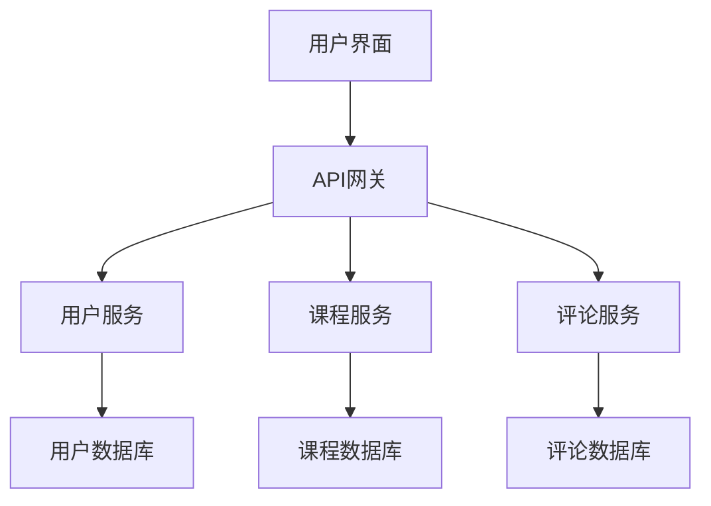

                 

### 摘要

本文旨在探讨前端工程化的最佳实践，通过系统性地分析前端工程化的核心概念、工具与方法，为开发者提供提升开发效率和用户体验的有效途径。首先，我们将回顾前端工程化的背景及其重要性，阐述前端工程化在解决前端开发挑战中的关键作用。随后，本文将深入探讨前端工程化的核心概念与联系，介绍常用的前端构建工具和框架，以及版本控制与协作开发的最佳实践。

在工具与方法部分，我们将详细介绍构建流程与自动化、性能优化、持续集成与持续部署、跨平台与响应式设计、以及安全防护与代码审计。接着，通过一个具体的实战项目，我们将展示如何将上述最佳实践应用于实际开发中，详细解析项目背景、系统功能设计、系统架构设计、系统接口设计、系统交互设计以及核心实现与解读。

最后，本文将总结前述的最佳实践，提出注意事项和拓展阅读建议，帮助开发者进一步提升前端工程化的能力，从而提高开发效率和用户体验。通过本文的阅读，读者将能够掌握前端工程化的核心理念，并在实际项目中灵活应用，实现高效开发与卓越的用户体验。

### 第一部分：前言

#### 1.1 编写目的

《前端工程化最佳实践：提升开发效率与用户体验》旨在为前端开发者提供一整套系统化的工程化指南，帮助他们在日益复杂的前端开发环境中保持高效和专业的开发水平。本文不仅是对前端工程化理论的深入剖析，更是结合实际项目经验的实战总结。

**书籍定位**：本书定位为前端开发者的进阶指南，适合有一定前端开发基础，希望进一步提升工程化能力的开发者阅读。同时，对于项目经理、架构师以及前端团队领导者，本书也提供了宝贵的工程化管理和实施策略。

**阅读对象**：主要面向希望了解并应用前端工程化最佳实践的前端开发者，包括但不限于新手开发者、有一定经验的中级开发者以及高级开发者。此外，本书也适合作为高等院校计算机科学相关专业学生的教材或参考书。

**目标与期望**：通过阅读本书，读者应能够：

1. 理解前端工程化的核心概念和重要性。
2. 掌握常用的前端构建工具和框架，能够进行高效的开发环境搭建。
3. 熟悉版本控制与协作开发的最佳实践，提升团队协作效率。
4. 学会性能优化、持续集成与持续部署等技术，确保项目质量。
5. 掌握跨平台与响应式设计的方法，提升用户体验。
6. 理解安全防护与代码审计的重要性，保障项目安全。

通过实现上述目标，本书期望能够帮助读者提高开发效率，降低开发成本，同时提升最终产品的用户体验，使前端开发项目更加成功和可持续。

#### 1.2 内容概述

《前端工程化最佳实践：提升开发效率与用户体验》全书共分为四个主要部分，各部分详细内容如下：

**第一部分：前言**

本部分主要介绍书籍的编写目的、定位、阅读对象以及目标与期望。通过这部分内容，读者可以明确本书的主旨和预期收获。

**第二部分：基础概念**

本部分将深入探讨前端工程化的基础概念，包括前端工程化的背景、核心概念与联系、前端构建工具与框架、版本控制与协作开发等内容。通过这些基础知识的学习，读者将建立前端工程化的基本框架。

**第三部分：工具与方法**

本部分详细介绍前端工程化的工具与方法，包括构建流程与自动化、性能优化、持续集成与持续部署、跨平台与响应式设计、安全防护与代码审计等。这部分内容将帮助读者在实际项目中应用工程化实践。

**第四部分：项目实战**

本部分通过一个具体的实战项目，展示如何将前述最佳实践应用于实际开发中。内容包括项目介绍、系统功能设计、系统架构设计、系统接口设计、系统交互设计以及核心实现与解读。通过实战案例的分析，读者可以更好地理解并应用前端工程化的方法。

**总结与展望**

本部分对全书内容进行总结，并给出注意事项和拓展阅读建议，帮助读者巩固所学知识，并为进一步提升前端工程化能力提供方向。

#### 1.3 阅读指南

为了更好地理解并应用本书中的内容，以下是一些建议和指南：

**阅读建议**

1. **系统阅读**：建议按章节顺序系统阅读，每个部分的内容都相互关联，有助于全面理解前端工程化的概念和实践。
2. **结合实践**：在阅读过程中，尝试将所学知识应用到实际项目中，通过实践加深理解。
3. **记录笔记**：对于重要的概念、方法和实战案例，建议记录笔记，便于后续查阅和复习。
4. **积极参与**：鼓励读者参与相关讨论和社区活动，与其他开发者交流心得和经验。

**使用工具与资源**

1. **在线资源**：本书中提到的工具和资源，可以通过相关官方网站或社区获取。例如，Webpack、Babel、Git等。
2. **工具文档**：每个工具和框架都提供了详细的官方文档，建议在阅读本书的同时查阅相关文档，以获得更深入的理解。
3. **技术社区**：参与GitHub、Stack Overflow、知乎等技术社区，可以获取最新的开发动态和技术支持。

**如何应对挑战**

1. **问题定位**：在开发过程中遇到问题时，首先要进行问题定位，确定问题的根源。
2. **解决方案**：在问题定位后，根据问题的性质和场景选择合适的解决方案。
3. **持续学习**：技术日新月异，持续学习是应对挑战的关键。建议定期阅读技术博客、参加技术会议和培训。
4. **团队合作**：在团队开发中，通过良好的沟通和协作，共同应对挑战，提升整体开发效率。

通过遵循以上建议和指南，读者可以更有效地学习本书的内容，并在实际开发中取得更好的成果。

### 第二部分：基础概念

#### 2.1 前端工程化背景

前端工程化是现代前端开发中不可或缺的一部分，其起源可以追溯到前端开发逐渐复杂化的阶段。随着互联网技术的快速发展，网页的应用场景变得更加丰富多样，前端代码的复杂度和维护成本也随之增加。传统的前端开发方式已无法满足日益复杂的需求，因此前端工程化应运而生。

**前端开发的发展历程**：

- **早期开发**：在网页的早期阶段，开发者主要使用HTML、CSS和JavaScript进行简单的页面设计和交互。
- **模块化**：随着项目的规模扩大，开发者开始使用模块化方法来组织代码，以降低代码复用和维护的难度。
- **组件化**：为了进一步提升开发效率和代码质量，组件化开发逐渐成为主流，前端框架如React、Vue等也得以广泛应用。
- **工程化**：面对更加复杂的项目和团队协作需求，前端工程化提出了系统化的解决方案，包括构建工具、代码风格规范、自动化测试等。

**前端工程化的挑战**：

1. **代码管理**：随着项目规模的扩大，代码的管理和维护变得更加复杂。
2. **开发效率**：前端开发需要处理大量的资源和依赖，开发效率成为制约项目进度的重要因素。
3. **性能优化**：前端应用的性能直接影响到用户体验，性能优化成为开发的重要目标。
4. **团队协作**：团队协作效率是项目成功的关键，如何确保团队成员之间的协同工作成为一项挑战。

**前端工程化的解决方案**：

1. **构建工具**：通过构建工具（如Webpack、Gulp）自动化处理前端资源，提高开发效率和代码质量。
2. **模块化**：采用模块化方法组织代码，实现代码的复用和分离，降低维护成本。
3. **自动化测试**：通过自动化测试确保代码质量，减少手动测试的工作量。
4. **代码规范**：制定统一的代码风格规范，提高代码的可读性和可维护性。
5. **持续集成与部署**：通过持续集成与部署流程，确保代码质量并加快项目上线速度。

通过前端工程化的实践，开发者能够更好地应对这些挑战，提升项目的开发效率和用户体验。前端工程化不仅是一种技术手段，更是一种开发理念的变革，它使得前端开发从个体化、手工化转向系统化、自动化。

#### 2.2 核心概念与联系

在深入探讨前端工程化之前，我们需要明确其核心概念，并了解这些概念之间的联系。前端工程化涉及多个重要概念，每个概念在开发过程中都扮演着关键角色。

**前端工程化的核心概念**：

1. **模块化**：模块化是将代码拆分为多个独立的模块，每个模块负责实现特定的功能。模块化提高了代码的可维护性和可复用性。
2. **构建工具**：构建工具（如Webpack、Gulp）用于自动化处理前端资源，如编译、打包、优化等操作，提高开发效率。
3. **代码风格规范**：代码风格规范是团队共同遵循的编码标准，确保代码的一致性和可读性。
4. **自动化测试**：自动化测试通过编写测试脚本，自动验证代码的功能和性能，提高代码质量和开发效率。
5. **持续集成**：持续集成是一种软件开发实践，通过自动化构建和测试，确保代码库中的每一个更改都是高质量的。
6. **性能优化**：性能优化是确保前端应用能够快速、高效地运行，提升用户体验。

**概念属性特征对比表格**：

下面是一个对比表格，展示了上述核心概念的属性特征：

| 概念          | 特征                     | 说明                                                                                     |
|---------------|------------------------|------------------------------------------------------------------------------------------|
| 模块化        | 独立性、复用性         | 将代码拆分为独立模块，提高可维护性和复用性。                                             |
| 构建工具      | 自动化、高效           | 自动处理前端资源，如编译、打包、优化等，提高开发效率。                                   |
| 代码风格规范  | 一致性、可读性        | 规范代码编写风格，确保代码的一致性和可读性，降低维护成本。                               |
| 自动化测试    | 高效、持续             | 通过测试脚本自动验证代码，确保功能完整性和性能，减少手动测试的工作量。                     |
| 持续集成      | 高效、质量保证        | 自动化构建和测试流程，确保代码库中的每一个更改都是高质量的。                             |
| 性能优化      | 快速、高效             | 通过优化代码和资源加载，提升前端应用的运行速度和用户体验。                               |

**ER实体关系图架构**：

为了更好地理解这些核心概念之间的关系，我们可以使用Mermaid绘制一个ER实体关系图，如下所示：

```mermaid
erDiagram
  模块化 ||--|{ 构建工具 }|
  模块化 ||--|{ 代码风格规范 }|
  模块化 ||--|{ 自动化测试 }|
  模块化 ||--|{ 持续集成 }|
  模块化 ||--|{ 性能优化 }|
  构建工具 ||--|{ 自动化测试 }|
  构建工具 ||--|{ 持续集成 }|
  构建工具 ||--|{ 性能优化 }|
  代码风格规范 ||--|{ 持续集成 }|
  代码风格规范 ||--|{ 性能优化 }|
  自动化测试 ||--|{ 持续集成 }|
```

通过上述ER实体关系图，我们可以清晰地看到各个核心概念之间的联系。模块化作为基础，通过构建工具、代码风格规范、自动化测试、持续集成和性能优化等概念相互配合，共同实现前端工程化。

#### 2.3 前端构建工具与框架

前端工程化离不开构建工具和框架，这些工具和框架为前端开发提供了自动化处理资源、优化代码质量、提升开发效率的解决方案。以下是几种常用的前端构建工具和框架，以及它们的特点和选择标准。

**1. Webpack**

**特点**：Webpack是一个模块打包工具，它能够将各种类型的资源（如JavaScript、CSS、图片等）打包成一个或多个静态文件。Webpack通过配置文件实现模块化、代码分割、懒加载等功能，优化了资源加载和代码执行效率。

**使用场景**：Webpack适用于大型、复杂的前端项目，尤其是需要高度定制化打包逻辑的场景。它可以与各种插件和loader结合使用，满足不同的开发需求。

**选择标准**：选择Webpack需要考虑项目规模、资源类型和开发需求。如果项目资源复杂、依赖关系较多，且需要高度定制的打包逻辑，Webpack是一个不错的选择。

**2. Gulp**

**特点**：Gulp是一个基于流的任务运行器，它通过一系列插件实现前端任务的自动化。Gulp适用于简单的任务流水线，如监听文件变化、编译Sass、压缩CSS和JavaScript等。

**使用场景**：Gulp适用于中小型项目，或者需要简单、清晰的自动化任务场景。它易于配置，可以通过插件扩展功能。

**选择标准**：选择Gulp主要取决于项目的自动化需求。如果项目任务较为简单，且需要灵活的任务配置，Gulp是一个不错的选择。

**3. Babel**

**特点**：Babel是一个JavaScript编译器，它能够将ES6+代码转换为ES5代码，使得新版本的JavaScript特性可以在旧版本浏览器中运行。Babel支持多种插件和预设，可以根据项目需求进行定制化配置。

**使用场景**：Babel适用于所有使用ES6+特性的前端项目。它可以在开发阶段将ES6+代码编译为ES5代码，确保代码兼容性。

**选择标准**：选择Babel主要取决于项目是否使用ES6+特性。如果项目需要使用新版本的JavaScript特性，Babel是必不可少的工具。

**4. Rollup**

**特点**：Rollup是一个模块打包工具，类似于Webpack，但它专注于模块打包，特别适用于库和框架的开发。Rollup支持Tree-shaking，能够自动移除未使用的代码，提高打包效率。

**使用场景**：Rollup适用于库和框架的开发，特别是需要高度优化打包效率和代码体积的场景。

**选择标准**：选择Rollup主要取决于项目类型。如果项目是一个库或框架，且需要优化打包效率和代码体积，Rollup是一个理想的选择。

**5. Vue CLI**

**特点**：Vue CLI是Vue.js的官方脚手架工具，它提供了一个开箱即用的项目模板，包括构建工具、代码风格规范、自动化测试等。Vue CLI能够快速搭建Vue.js项目，提高开发效率。

**使用场景**：Vue CLI适用于Vue.js项目的开发和构建，特别是初学者和快速启动项目时。

**选择标准**：选择Vue CLI主要取决于项目使用的技术栈。如果项目使用Vue.js，Vue CLI是一个方便快捷的选择。

**总结**：

在众多前端构建工具和框架中，选择合适的工具和框架至关重要。应根据项目规模、资源类型、开发需求和技术栈等因素进行选择。常见的构建工具如Webpack、Gulp、Babel、Rollup等各有特点，可以根据实际需求进行选择。而Vue CLI等官方脚手架工具则提供了便捷的开发体验，适合快速启动项目。

#### 2.4 版本控制与协作开发

在大型前端项目中，版本控制和协作开发是确保项目稳定性和团队协作效率的关键。Git作为最流行的版本控制工具，在团队协作开发中发挥着重要作用。

**版本控制工具介绍**：

Git是一种分布式版本控制系统，它能够高效地追踪文件的变化，支持多人协作开发。Git的基本概念包括提交（commit）、分支（branch）、合并（merge）和标签（tag）。通过这些概念，Git能够有效地管理代码库，确保代码的版本可追溯和安全性。

**协作开发的最佳实践**：

1. **代码提交规范**：确保每个提交都有清晰的提交信息，便于后续追踪和代码审查。建议使用“三行提交规范”，即每行分别描述修改的模块、具体内容和修复的bug。

2. **分支管理**：采用Git的分支管理策略，如Git Flow或GitHub Flow，确保项目开发的有序进行。Git Flow提供了明确的开发流程，包括主分支（master）、开发分支（develop）和特性分支（feature）。GitHub Flow则通过主分支和拉取请求（Pull Request）实现代码的审查和合并。

3. **代码审查**：通过代码审查确保代码质量，减少潜在的错误和漏洞。代码审查可以采用手动审查或自动化工具，如SonarQube。审查时，重点关注代码风格、语法错误、逻辑漏洞和安全问题。

4. **合并策略**：合并代码时，确保冲突解决彻底，避免遗留未处理的冲突。在合并前，可以采用代码对比工具（如Git Diff）检查变更内容，确保合并后的代码符合预期。

5. **远程协作**：通过远程仓库（如GitHub、GitLab）实现团队之间的协作，确保代码的同步和安全。远程协作需要遵循一定的协作规范，如及时更新远程分支、避免拉取未合并的代码等。

**解决协作中的常见问题**：

1. **冲突解决**：在多人协作开发中，冲突是不可避免的。解决冲突的方法包括手动合并、使用合并工具（如Git Merger）或自动合并（如Git's three-way merge）。在实际操作中，建议提前规划协作流程，减少冲突的发生。

2. **同步更新**：确保团队成员之间的代码库保持同步，避免因代码不一致导致的错误。可以通过定期执行`git pull`和`git push`命令实现代码同步。

3. **代码丢失**：为了避免代码丢失，建议定期备份本地仓库和远程仓库，并使用版本控制工具的备份功能（如Git's `git stash`）。此外，可以使用自动化备份工具（如GitLab CI）实现自动备份。

4. **权限管理**：合理分配代码库的读写权限，确保团队成员有权访问所需的代码库。在大型项目中，可以采用权限分级管理，如管理员、开发者、测试者等，确保项目安全。

通过遵循版本控制和协作开发的最佳实践，团队能够更高效地完成前端项目开发，确保代码质量和项目稳定性。Git作为版本控制工具的核心，为团队协作提供了强大的支持。

### 第三部分：工具与方法

#### 3.1 构建流程与自动化

在前端工程化中，构建流程与自动化是提升开发效率和项目质量的关键环节。通过自动化构建，开发者可以减少重复性劳动，降低出错概率，并确保项目的一致性和稳定性。

**构建流程概述**：

构建流程是指将源代码转换为可运行代码的过程。这个过程通常包括以下步骤：

1. **源代码解析**：解析源代码，提取模块和依赖关系。
2. **编译与转换**：将源代码编译为其他格式，如将TypeScript编译为JavaScript。
3. **打包与优化**：将编译后的代码打包成单个或多个静态文件，并对其进行优化，如压缩、合并和懒加载。
4. **测试**：运行自动化测试，确保代码质量和功能完整性。
5. **部署**：将构建后的代码部署到生产环境。

在自动化构建过程中，构建工具（如Webpack、Gulp）起到了至关重要的作用。它们通过配置文件定义构建流程，自动化地执行以上步骤，提高开发效率。

**自动化构建脚本**：

自动化构建脚本是通过编写脚本（如Bash、Python等）实现构建流程自动化。以下是一个简单的自动化构建脚本示例，使用Gulp实现：

```bash
# 使用Gulp进行自动化构建
gulpfile.js
----------------
const { series, parallel } = require('gulp');
const clean = require('gulp-clean');
const ts = require('gulp-typescript');
const babel = require('gulp-babel');
const concat = require('gulp-concat');
const uglify = require('gulp-uglify');
const sass = require('gulp-sass')(require('sass'));
const cleanCSS = require('gulp-clean-css');
const imagemin = require('gulp-imagemin');

// TypeScript编译任务
function compileTS() {
  return src('src/**/*.ts')
    .pipe(ts({
      module: 'commonjs',
      target: 'es5',
    }))
    .pipe(gulp.dest('dist'));
}

// Babel编译任务
function compileJS() {
  return src('src/**/*.js')
    .pipe(babel({
      presets: ['@babel/preset-env'],
    }))
    .pipe(gulp.dest('dist'));
}

// 样式编译任务
function compileSass() {
  return src('src/**/*.scss')
    .pipe(sass().on('error', sass.logError))
    .pipe(gulp.dest('dist'));
}

// CSS压缩任务
function minifyCSS() {
  return src('dist/**/*.css')
    .pipe(cleanCSS({ compatibility: 'ie8' }))
    .pipe(gulp.dest('dist'));
}

// JavaScript压缩任务
function minifyJS() {
  return src('dist/**/*.js')
    .pipe(uglify())
    .pipe(gulp.dest('dist'));
}

// 图片压缩任务
function minifyImages() {
  return src('src/**/*.jpg')
    .pipe(imagemin())
    .pipe(gulp.dest('dist'));
}

// 构建任务
const build = series(parallel(compileTS, compileJS, compileSass), parallel(minifyCSS, minifyJS, minifyImages));

// 监听文件变化并重新构建
const watch = function() {
  gulp.watch('src/**/*.ts', compileTS);
  gulp.watch('src/**/*.js', compileJS);
  gulp.watch('src/**/*.scss', compileSass);
};

exports.default = series(build, watch);
```

在上述脚本中，我们定义了多个任务，包括TypeScript编译、JavaScript编译、Sass编译、CSS压缩、JavaScript压缩和图片压缩。通过`gulp`命令，我们可以一键执行构建流程，并监听文件变化，实现自动化构建。

**常见问题与优化**：

1. **性能问题**：构建过程可能占用大量计算资源，导致构建时间过长。可以通过优化构建脚本、使用构建工具的缓存机制等方式提升构建性能。

2. **兼容性问题**：不同构建工具和插件之间可能存在兼容性问题，导致构建失败。在选用工具和插件时，注意查看其文档和社区反馈，确保兼容性。

3. **代码冲突**：多人协作开发时，构建脚本可能会引发代码冲突。可以通过明确构建流程和规范，减少代码冲突的发生。

4. **构建配置**：构建配置可能较为复杂，需要不断调整。可以通过编写配置模板、使用构建工具的插件等方式简化配置过程。

通过合理设计和优化构建流程，开发者可以显著提高开发效率和项目质量。自动化构建不仅解放了开发者的双手，还确保了项目的一致性和稳定性，为高效开发奠定了坚实基础。

#### 3.2 性能优化

前端性能优化是提升用户体验的关键因素。一个高效的前端应用不仅能提供流畅的交互体验，还能减少用户的等待时间，从而提高用户满意度和留存率。以下是几种常见的性能优化策略，以及具体的代码优化方法和资源压缩与缓存技巧。

**性能优化策略**：

1. **减少HTTP请求**：通过合并文件、使用CDN等方式减少HTTP请求，降低页面加载时间。例如，将多个CSS或JavaScript文件合并成一个，减少网络延迟。

2. **代码层面的优化**：精简和优化JavaScript和CSS代码，移除不必要的代码，提高代码执行效率。例如，使用压缩工具（如UglifyJS、CleanCSS）压缩代码，移除注释和空格。

3. **资源压缩与缓存**：对图片、CSS和JavaScript等资源进行压缩，减小文件体积。同时，利用浏览器缓存机制，减少重复请求，提高资源加载速度。

4. **懒加载**：对页面中不立即显示的资源进行懒加载，如图片、视频等，仅在用户滚动到对应位置时加载，减少初始加载时间。

5. **异步加载**：通过异步加载JavaScript和CSS文件，避免阻塞页面的渲染，提高用户体验。

6. **代码分割**：将代码分割为多个块，按需加载，提高页面初始加载速度。

**代码层面的优化方法**：

1. **移除不必要的代码**：在开发过程中，避免编写冗余代码，减少不必要的函数、变量和循环。

2. **压缩JavaScript代码**：使用UglifyJS、Terser等工具对JavaScript代码进行压缩，移除空格、注释和多余的代码。

3. **压缩CSS代码**：使用CleanCSS、CSSNano等工具对CSS代码进行压缩，减少文件体积。

4. **合并文件**：将多个CSS和JavaScript文件合并为一个文件，减少HTTP请求次数。

5. **优化CSS选择器**：避免使用过度复杂的选择器，减少CSS解析时间。

6. **移除事件监听器**：及时移除不再使用的事件监听器，避免内存泄露。

**资源压缩与缓存**：

1. **图片压缩**：使用ImageOptim、TinyPNG等工具对图片进行压缩，减少文件体积。选择合适的图片格式（如WebP），提高图片质量。

2. **缓存策略**：利用浏览器缓存机制，设置合理的缓存时间（如`max-age`），减少重复请求。同时，可以使用Etag或Last-Modified等缓存控制头，提高缓存命中率。

3. **内容分发网络（CDN）**：使用CDN将静态资源分布到全球多个节点，提高资源加载速度。

4. **懒加载**：对页面中的图片、视频等资源使用懒加载技术，仅在用户滚动到对应位置时加载，减少初始加载时间。

5. **服务端渲染（SSR）**：通过服务端渲染，提前解析和渲染页面，减少客户端渲染时间。

通过实施上述性能优化策略和技巧，开发者可以显著提高前端应用的性能，提升用户体验。性能优化是一个持续的过程，需要定期监控和调整，以确保应用始终处于最佳状态。

#### 3.3 持续集成与持续部署

持续集成（Continuous Integration，CI）和持续部署（Continuous Deployment，CD）是现代软件开发中不可或缺的流程，它们极大地提高了开发效率和代码质量。持续集成通过自动化构建和测试，确保每次代码提交都是高质量的，而持续部署则通过自动化部署流程，将代码快速、安全地交付到生产环境。

**持续集成概念**：

持续集成是一种软件开发实践，其核心思想是将代码频繁地合并到主干分支，并通过自动化测试确保每个提交都是可用的。持续集成通过以下步骤实现：

1. **代码提交**：开发者将代码提交到版本控制系统。
2. **构建**：构建工具自动构建项目，生成可运行的代码。
3. **测试**：运行自动化测试，确保构建出的代码质量。
4. **反馈**：将测试结果反馈给开发者，如果测试失败，构建过程会暂停，并通知开发者。

**持续集成实践**：

1. **自动化构建**：使用构建工具（如Jenkins、Travis CI）配置自动化构建脚本，确保每次代码提交都自动构建。
2. **自动化测试**：编写自动化测试脚本，涵盖单元测试、集成测试和功能测试，确保代码的质量和稳定性。
3. **持续反馈**：通过邮件、短信、集成到聊天工具等方式，及时通知开发者测试结果。

**持续部署概念**：

持续部署是一种自动化部署代码到生产环境的实践，它通过自动化脚本和工具实现部署流程。持续部署包括以下步骤：

1. **构建**：从版本控制系统获取最新的代码，进行构建。
2. **测试**：在构建阶段运行自动化测试，确保代码质量。
3. **部署**：将构建后的代码部署到生产环境，可以是单一环境或多个环境。

**持续部署实践**：

1. **自动化部署脚本**：编写自动化部署脚本，实现从构建到部署的自动化流程。
2. **多环境部署**：支持多环境部署，如开发、测试、预生产和生产环境，确保不同环境之间的代码一致性。
3. **版本控制**：使用版本控制系统（如Git）管理代码，确保部署的历史可追溯。
4. **监控和反馈**：部署后，监控系统的运行状态，并及时反馈异常情况。

**持续集成工具介绍**：

1. **Jenkins**：Jenkins是一个开源的持续集成服务器，支持多种插件，可以实现自动化构建、测试和部署。Jenkins配置灵活，易于扩展，是企业中常用的CI工具。

2. **Travis CI**：Travis CI是一个在线的持续集成服务，支持多种编程语言，适用于GitHub项目。Travis CI具有自动触发、自动化部署等特性，可以大幅提高开发效率。

3. **GitLab CI**：GitLab CI是GitLab内置的持续集成工具，适用于GitLab仓库。GitLab CI通过`.gitlab-ci.yml`配置文件定义构建和部署流程，支持多种操作系统和编程语言。

**持续集成与持续部署的关系**：

持续集成是持续部署的前提，只有通过持续集成，确保每次提交都是高质量的，才能进行持续部署。持续集成和持续部署相结合，形成完整的持续交付流程，确保代码从开发到生产的全过程都是自动化、高效的。

通过实施持续集成和持续部署，开发者可以大幅提高代码质量和开发效率，缩短开发周期，同时确保生产环境的稳定性和可靠性。持续集成与持续部署已经成为现代软件开发中不可或缺的实践，为高效开发提供了强有力的支持。

#### 3.4 跨平台与响应式设计

在现代Web应用开发中，跨平台和响应式设计已成为不可或缺的技术。跨平台开发允许开发者编写一次代码，在不同设备和平台上运行，而响应式设计则确保应用在不同屏幕尺寸和分辨率下都能提供良好的用户体验。

**跨平台开发的优势**：

1. **降低开发成本**：通过跨平台开发，开发者无需为每个平台分别编写代码，可以节省大量时间和资源。
2. **提高开发效率**：跨平台框架和工具（如React Native、Flutter）提供了丰富的组件和库，加速开发过程。
3. **统一用户体验**：跨平台应用可以提供一致的用户体验，减少用户在不同平台上的适应成本。
4. **技术栈统一**：跨平台开发使用相同的编程语言和框架，便于团队成员之间的协作和技术交流。

**响应式设计方法**：

响应式设计的核心是使用CSS3中的媒体查询（Media Queries）技术，根据设备的屏幕尺寸和分辨率动态调整布局和样式。以下是几种常见的响应式设计方法：

1. **固定布局**：使用固定宽度容器，根据不同屏幕尺寸调整布局，适用于屏幕尺寸较为固定的设备。

2. **弹性布局**：使用百分比宽度、弹性网格和弹性字体大小，根据屏幕尺寸自适应调整布局，适用于各种屏幕尺寸。

3. **响应式网格系统**：使用响应式网格系统（如Bootstrap、Flexbox Grid），通过预定义的类实现响应式布局，提高开发效率。

4. **断点策略**：根据不同屏幕尺寸设置多个断点（Breakpoints），在每个断点处调整布局和样式，实现逐步调整。

**跨平台开发工具**：

1. **React Native**：React Native是Facebook开发的一款跨平台框架，允许开发者使用JavaScript和React编写原生应用。React Native提供了丰富的组件和API，支持iOS和Android平台。

2. **Flutter**：Flutter是由Google开发的一款跨平台UI框架，使用Dart语言编写。Flutter具有高性能、丰富的UI组件和流畅的动画效果，适用于iOS和Android平台。

3. **Apache Cordova**：Cordova是一个基于HTML、CSS和JavaScript的跨平台开发框架，通过封装Web视图，使开发者可以编写一次代码，在不同平台上运行。

4. **Xamarin**：Xamarin是微软开发的跨平台开发框架，使用C#语言编写，支持iOS、Android和Windows平台。

**跨平台与响应式设计的结合**：

跨平台和响应式设计并不是相互独立的，而是相辅相成的。跨平台开发可以确保应用在不同平台上的一致性，而响应式设计则确保应用在不同设备和屏幕尺寸上的良好表现。

在实际开发中，开发者可以通过以下方法将跨平台和响应式设计结合：

1. **组件化开发**：将UI组件拆分为独立的模块，确保在不同平台上的一致性和可复用性。
2. **共享代码**：通过共享代码库，减少不同平台的代码重复，提高开发效率。
3. **媒体查询与适配器**：在跨平台框架中，结合媒体查询和适配器模式，实现不同屏幕尺寸的布局调整。

通过跨平台与响应式设计的结合，开发者可以构建灵活、高效、跨平台的Web应用，满足不同用户的需求，提升用户体验。

#### 3.5 安全防护与代码审计

在前端工程化过程中，安全防护和代码审计是保障项目质量和用户体验的关键环节。前端应用面临的威胁多种多样，包括跨站脚本攻击（XSS）、跨站请求伪造（CSRF）等。为了确保应用的安全，开发者需要采取一系列防护措施，并通过代码审计发现和修复潜在的安全漏洞。

**前端安全概述**：

前端安全涉及多个方面，主要包括：

1. **输入验证**：对用户输入进行验证，防止恶意输入和数据注入。
2. **数据加密**：对敏感数据进行加密处理，防止数据泄露。
3. **会话管理**：确保用户会话的安全，防止会话劫持和重放攻击。
4. **代码审计**：定期对代码进行审计，发现和修复潜在的安全漏洞。

**常见安全问题与解决方案**：

1. **跨站脚本攻击（XSS）**：

   - **问题描述**：攻击者通过注入恶意脚本，在用户的浏览器中执行，从而窃取用户信息或执行恶意操作。
   - **解决方案**：对用户输入进行编码或转义，防止恶意脚本注入。使用内容安全策略（Content Security Policy，CSP）限制资源的加载和执行。

2. **跨站请求伪造（CSRF）**：

   - **问题描述**：攻击者利用用户的登录凭证，在用户不知情的情况下执行恶意操作。
   - **解决方案**：使用验证码或双重提交Cookie机制，确保请求的真实性。在请求中添加 CSRF 令牌，防止恶意请求。

3. **SQL 注入**：

   - **问题描述**：攻击者通过构造恶意的SQL语句，执行未授权的操作，窃取或篡改数据库中的数据。
   - **解决方案**：使用参数化查询或ORM框架，避免直接拼接SQL语句。对用户输入进行严格的过滤和验证，防止恶意SQL注入。

4. **会话劫持**：

   - **问题描述**：攻击者窃取用户的会话信息，冒充用户执行操作。
   - **解决方案**：使用HTTPS加密通信，确保会话信息在传输过程中的安全性。定期更换会话密钥，减少会话劫持的风险。

**代码审计工具与流程**：

代码审计是发现和修复潜在安全漏洞的重要手段。以下是一种常见的代码审计流程：

1. **静态代码分析**：使用静态代码分析工具（如SonarQube、FindBugs），对代码进行静态分析，发现潜在的安全漏洞。
2. **动态测试**：通过编写自动化测试脚本，模拟恶意攻击，验证代码的安全性和稳定性。
3. **代码审查**：组织团队成员进行代码审查，发现和修复潜在的安全漏洞。审查时，重点关注输入验证、加密处理、会话管理和权限控制等关键点。

**总结**：

安全防护和代码审计是前端工程化不可或缺的一部分。通过采取有效的安全防护措施，可以防止常见的Web攻击，确保应用的安全性。代码审计则有助于发现和修复潜在的安全漏洞，提高代码质量和项目的可靠性。开发者应重视前端安全，定期进行安全检查和更新，以确保应用始终处于安全状态。

### 第四部分：项目实战

#### 4.1 项目介绍

为了更好地展示前端工程化的最佳实践，我们将通过一个具体的实战项目来详细讲解。这个项目是一个在线教育平台，旨在提供高质量的在线课程和互动学习环境。项目需求包括课程浏览、视频播放、学习进度跟踪、用户管理、评论互动等功能。以下是项目的具体背景、目标以及团队组成和职责。

**项目背景**：

随着互联网的普及和移动设备的普及，在线教育市场迅速增长。用户对优质教育资源的需求不断上升，但现有的在线教育平台存在课程内容单一、用户体验差等问题。为了满足用户需求，提高市场竞争力，我们决定开发一个功能全面、用户体验出色的在线教育平台。

**项目目标**：

1. **提供高质量课程内容**：通过引入知名教育机构和优秀讲师，提供丰富的课程资源。
2. **优化用户体验**：通过响应式设计，确保平台在不同设备和屏幕尺寸上都能提供良好的用户体验。
3. **提高开发效率**：采用前端工程化方法，提升开发效率，降低维护成本。
4. **确保安全性**：加强安全防护，保障用户数据和平台系统的安全性。

**团队组成和职责**：

项目团队由以下几个角色组成：

1. **项目经理**：负责项目规划、进度管理和团队协调。
2. **前端开发工程师**：负责前端页面的设计和实现，包括页面布局、交互设计和响应式设计。
3. **后端开发工程师**：负责服务器端逻辑处理、数据库设计和API开发。
4. **测试工程师**：负责编写测试用例，执行自动化测试，确保代码质量和功能完整性。
5. **UI/UX设计师**：负责用户界面设计和用户体验优化。

#### 4.2 系统功能设计

系统功能设计是项目开发的重要阶段，它决定了系统的整体架构和功能模块。在线教育平台的功能设计主要包括以下几个方面：

**1. 课程浏览**：

课程浏览功能是平台的核心，用户可以通过分类、标签和搜索功能找到感兴趣的课程。功能模块包括：

- **课程列表**：展示所有课程的列表，支持按分类、标签和搜索条件筛选。
- **课程详情**：显示课程的详细信息，包括课程名称、讲师介绍、课程大纲、评价等。
- **课程推荐**：根据用户的浏览记录和兴趣推荐相关课程。

**2. 视频播放**：

视频播放功能是用户学习的核心环节。功能模块包括：

- **视频播放器**：支持多种视频格式播放，提供播放、暂停、快进、快退等功能。
- **视频缓存**：允许用户将视频缓存到本地，以便离线观看。
- **视频播放统计**：记录用户的学习进度，为用户推荐相关课程。

**3. 学习进度跟踪**：

学习进度跟踪功能帮助用户管理学习进度，确保学习目标的实现。功能模块包括：

- **学习计划**：用户可以制定学习计划，设置学习目标和学习时间。
- **学习记录**：记录用户的学习进度，包括已学课程、学习时长和完成情况。
- **学习提醒**：定时提醒用户学习，确保学习计划的执行。

**4. 用户管理**：

用户管理功能包括用户注册、登录、资料修改和权限管理。功能模块包括：

- **用户注册**：提供用户注册功能，包括基本信息和身份验证。
- **用户登录**：提供用户登录功能，支持多种身份验证方式。
- **资料修改**：用户可以修改个人资料，如头像、昵称、联系方式等。
- **权限管理**：根据用户角色和权限，提供不同的操作权限和功能。

**5. 评论互动**：

评论互动功能促进用户之间的交流和讨论，提高社区活跃度。功能模块包括：

- **评论发布**：用户可以在课程详情页面发布评论，分享学习心得。
- **评论回复**：用户可以回复他人的评论，进行互动交流。
- **评论审核**：管理员可以审核评论，确保评论内容符合平台规范。

**领域模型**：

为了更好地设计系统功能，我们引入了领域模型（Domain Model），通过实体关系图（Entity-Relationship Diagram，ERD）来描述系统的核心实体和关系。以下是项目的ERD图：

```mermaid
erDiagram
  用户 ||--|{ 课程 }|
  用户 ||--|{ 评论 }|
  用户 ||--|{ 学习记录 }|
  课程 ||--|{ 课程详情 }|
  课程 ||--|{ 课程推荐 }|
  评论 ||--|{ 回复 }|
  评论 ||--|{ 审核状态 }|
  学习记录 ||--|{ 学习计划 }|
  学习记录 ||--|{ 学习进度 }
```

在这个ERD图中，我们定义了用户、课程、评论和学习记录四个核心实体，并描述了它们之间的关系。通过领域模型的设计，我们可以更清晰地理解系统的功能和数据关系。

#### 4.3 系统架构设计

系统架构设计是项目成功的关键，它决定了系统的性能、可扩展性和可维护性。在线教育平台的系统架构设计遵循分层架构原则，包括前端、后端和数据库三部分。以下是具体的系统架构设计：

**1. 前端架构**：

前端架构采用单页面应用（SPA）模式，使用React.js框架实现。前端通过API与后端进行数据交互，提供用户界面和交互逻辑。前端架构包括以下主要模块：

- **路由管理**：使用React Router管理页面路由，实现单页面应用的无刷新切换。
- **状态管理**：使用Redux进行状态管理，确保数据的一致性和可预测性。
- **组件化开发**：将UI拆分为多个组件，提高代码的可维护性和可复用性。

**2. 后端架构**：

后端采用微服务架构，每个功能模块独立部署，以提高系统的可扩展性和可维护性。后端架构包括以下主要模块：

- **API网关**：作为前端与后端的入口，负责请求路由和权限验证。
- **业务服务**：提供具体的业务逻辑处理，如用户管理、课程管理、评论管理等。
- **数据服务**：提供数据持久化功能，如用户数据、课程数据和评论数据等。

**3. 数据库架构**：

数据库采用关系型数据库（如MySQL），存储用户数据、课程数据和评论数据。数据库架构包括以下主要表：

- **用户表**：存储用户的基本信息，如用户ID、用户名、密码等。
- **课程表**：存储课程的详细信息，如课程ID、课程名称、讲师信息等。
- **评论表**：存储评论的详细信息，如评论ID、评论内容、评论时间等。
- **学习记录表**：存储用户的学习记录，如学习计划、学习进度等。

**架构图解析**：

以下是系统架构的Mermaid图表示：



在这个架构图中，用户界面通过API网关与后端服务进行通信。API网关负责请求路由和权限验证，将请求转发到相应的业务服务。业务服务处理具体的业务逻辑，并与数据库进行交互。通过这样的架构设计，系统具有清晰的层次结构和良好的可扩展性。

**系统优化方向**：

1. **性能优化**：通过缓存机制、异步加载和代码优化等手段提高系统性能，确保快速响应用户请求。
2. **安全性优化**：加强安全防护，如使用HTTPS加密、验证码机制和权限控制等，保障用户数据和系统的安全性。
3. **可维护性优化**：采用模块化开发、文档化和自动化测试等技术，提高系统的可维护性，降低维护成本。

通过以上系统架构设计，我们可以确保在线教育平台具有良好的性能、安全性和可维护性，满足用户需求，实现项目的成功。

#### 4.4 系统接口设计

系统接口设计是确保前后端数据交互顺畅的关键步骤。在线教育平台通过RESTful API实现前后端的数据交互，以下是具体的接口设计。

**接口规范**：

在线教育平台采用RESTful API设计原则，接口遵循以下规范：

- **URL设计**：使用清晰、简洁的URL结构，如`/api/users`表示用户接口，`/api/courses`表示课程接口。
- **HTTP方法**：根据操作类型使用不同的HTTP方法，如GET用于查询，POST用于创建，PUT用于更新，DELETE用于删除。
- **请求参数**：将请求参数包含在URL或请求体中，如查询参数用于筛选数据，请求体用于提交数据。
- **响应格式**：统一使用JSON格式返回响应数据，包括状态码、消息和数据。

**接口设计工具**：

为了确保接口设计的规范性和一致性，我们使用Swagger作为接口设计工具。Swagger提供了一个直观的接口设计界面，支持自动生成接口文档和客户端代码。

**接口设计示例**：

以下是用户接口和课程接口的示例：

**用户接口**：

```yaml
# 用户登录接口
/api/users/login
POST
请求体：
{
  "username": "用户名",
  "password": "密码"
}
响应：
{
  "status": 200,
  "message": "登录成功",
  "data": {
    "token": "登录令牌",
    "user": {
      "id": "用户ID",
      "username": "用户名",
      "email": "电子邮件",
      "role": "用户角色"
    }
  }
}

# 用户注册接口
/api/users/register
POST
请求体：
{
  "username": "用户名",
  "password": "密码",
  "email": "电子邮件"
}
响应：
{
  "status": 201,
  "message": "注册成功"
}
```

**课程接口**：

```yaml
# 获取课程列表接口
/api/courses
GET
查询参数：
{
  "category": "分类ID",
  "page": "页码",
  "size": "每页大小"
}
响应：
{
  "status": 200,
  "message": "获取成功",
  "data": {
    "total": "总记录数",
    "courses": [
      {
        "id": "课程ID",
        "name": "课程名称",
        "teacher": "讲师名称",
        "description": "课程描述",
        "rating": "评分"
      },
      ...
    ]
  }
}

# 获取课程详情接口
/api/courses/{id}
GET
响应：
{
  "status": 200,
  "message": "获取成功",
  "data": {
    "id": "课程ID",
    "name": "课程名称",
    "teacher": "讲师名称",
    "description": "课程描述",
    "rating": "评分",
    "chapters": [
      {
        "id": "章节ID",
        "name": "章节名称",
        "videos": [
          {
            "id": "视频ID",
            "title": "视频标题",
            "url": "视频链接"
          },
          ...
        ]
      },
      ...
    ]
  }
}
```

通过以上接口设计，前后端可以高效地进行数据交互，满足系统功能需求。

#### 4.5 系统交互设计

系统交互设计（User Interaction Design）是确保用户在使用在线教育平台时能够获得良好体验的关键环节。以下是系统交互设计的具体流程和方法。

**用户流程与交互**：

系统交互设计首先需要明确用户的操作流程，即用户在使用平台时需要完成的任务和步骤。以下是用户在在线教育平台中的典型操作流程：

1. **用户注册/登录**：用户通过注册或登录进入平台。
2. **课程浏览**：用户浏览课程列表，查找感兴趣的课程。
3. **课程详情**：用户点击课程进入课程详情页面，查看课程内容。
4. **视频播放**：用户播放课程视频，进行学习。
5. **评论互动**：用户对课程发表评论，与其他用户互动。
6. **学习进度**：用户查看自己的学习进度，管理学习计划。

**交互设计工具**：

为了确保交互设计的规范性和有效性，我们可以使用多种工具进行设计。以下是几种常用的交互设计工具：

1. **Axure RP**：Axure RP是一个专业的原型设计工具，可以创建高保真的交互原型，支持丰富的交互效果和组件库。
2. **Sketch**：Sketch是一款图形界面设计软件，适用于UI设计，支持矢量绘图和原型设计。
3. **Figma**：Figma是一款基于浏览器的协作式设计工具，支持实时协作和版本控制，适用于UI和UX设计。

**交互设计示例**：

以下是一个用户在在线教育平台上的典型交互设计示例：

**用户注册流程**：

1. **打开注册页面**：用户点击“注册”按钮，进入注册页面。
2. **填写注册信息**：用户在注册页面填写用户名、密码、电子邮件等注册信息。
3. **验证邮箱**：系统发送验证邮件到用户邮箱，用户点击邮件中的验证链接，完成邮箱验证。
4. **注册成功**：用户回到平台，系统显示注册成功提示，并自动登录。

**课程详情页面交互**：

1. **查看课程信息**：用户点击课程卡片，进入课程详情页面，查看课程名称、讲师、评分等信息。
2. **视频播放**：用户点击“播放”按钮，视频开始播放，提供播放、暂停、快进、快退等功能。
3. **评论互动**：用户在课程详情页面下发表评论，可以查看其他用户的评论并进行回复。
4. **收藏课程**：用户点击“收藏”按钮，将课程添加到收藏夹。

**用户体验优化**：

为了提升用户体验，我们需要关注以下几个方面：

1. **简洁直观的界面设计**：界面设计要简洁明了，避免过多的装饰和复杂的布局，让用户能够快速找到所需功能。
2. **合理的交互流程**：交互流程要符合用户的操作习惯，减少用户的操作步骤，提高操作效率。
3. **良好的反馈机制**：在用户进行关键操作时，系统要提供及时、明确的反馈，如成功提示、错误提示等。
4. **响应式设计**：确保平台在不同设备和屏幕尺寸上都能提供良好的用户体验。

通过以上交互设计，我们可以为用户提供一个流畅、便捷、高效的操作体验，提升在线教育平台的用户满意度。

#### 4.6 核心实现与解读

在线教育平台的核心实现主要包括前端和后端部分。以下我们将详细解析环境安装、系统核心实现以及代码应用解读与分析。

**环境安装**：

1. **前端环境**：

   - 安装Node.js：通过Node.js官方网站下载并安装最新版本的Node.js。
   - 安装npm：Node.js自带npm包管理器，确保其版本最新。
   - 创建项目目录：在本地计算机上创建项目目录，并初始化npm项目。
   
     ```bash
     mkdir online-education-platform
     cd online-education-platform
     npm init -y
     ```

   - 安装React和Redux：

     ```bash
     npm install react react-dom
     npm install --save redux react-redux
     ```

   - 安装路由管理器：

     ```bash
     npm install react-router-dom
     ```

   - 安装Axios：

     ```bash
     npm install axios
     ```

2. **后端环境**：

   - 安装Node.js和npm。
   - 安装Express框架：

     ```bash
     npm install express
     ```

   - 安装数据库连接工具（如Mongoose）：

     ```bash
     npm install mongoose
     ```

   - 安装jsonwebtoken（用于生成和验证JWT）：

     ```bash
     npm install jsonwebtoken
     ```

**系统核心实现**：

1. **前端核心实现**：

   - **用户管理**：

     用户注册和登录是前端核心实现的一部分。以下是一个简单的React组件示例，用于处理用户注册。

     ```jsx
     import React, { useState } from 'react';
     import axios from 'axios';

     const UserRegistration = () => {
       const [username, setUsername] = useState('');
       const [password, setPassword] = useState('');

       const handleRegistration = async () => {
         try {
           const response = await axios.post('/api/users/register', {
             username,
             password,
           });
           alert('Registration successful');
         } catch (error) {
           alert('Registration failed');
         }
       };

       return (
         <div>
           <label>Username:</label>
           <input type="text" value={username} onChange={e => setUsername(e.target.value)} />
           <label>Password:</label>
           <input type="password" value={password} onChange={e => setPassword(e.target.value)} />
           <button onClick={handleRegistration}>Register</button>
         </div>
       );
     };

     export default UserRegistration;
     ```

   - **课程管理**：

     课程列表和详情页面也是前端的核心功能。以下是一个React组件示例，用于显示课程列表。

     ```jsx
     import React, { useState, useEffect } from 'react';
     import axios from 'axios';

     const CourseList = () => {
       const [courses, setCourses] = useState([]);

       useEffect(() => {
         const fetchCourses = async () => {
           try {
             const response = await axios.get('/api/courses');
             setCourses(response.data.courses);
           } catch (error) {
             console.error('Error fetching courses:', error);
           }
         };

         fetchCourses();
       }, []);

       return (
         <div>
           {courses.map(course => (
             <div key={course.id}>
               <h2>{course.name}</h2>
               <p>{course.description}</p>
             </div>
           ))}
         </div>
       );
     };

     export default CourseList;
     ```

2. **后端核心实现**：

   - **用户认证**：

     后端实现用户认证，通过jsonwebtoken生成和验证JWT。以下是一个Express路由示例，用于处理用户登录。

     ```javascript
     const express = require('express');
     const jwt = require('jsonwebtoken');
     const bcrypt = require('bcrypt');
     const User = require('../models/User');

     const router = express.Router();

     // 用户登录
     router.post('/api/users/login', async (req, res) => {
       const { username, password } = req.body;
       try {
         const user = await User.findOne({ username });
         if (!user) {
           return res.status(401).json({ message: 'Invalid credentials' });
         }

         const isMatch = await bcrypt.compare(password, user.password);
         if (!isMatch) {
           return res.status(401).json({ message: 'Invalid credentials' });
         }

         const token = jwt.sign({ userId: user._id }, 'secretKey');
         res.json({ token });
       } catch (error) {
         console.error('Error during login:', error);
         res.status(500).json({ message: 'Server error' });
       }
     });

     module.exports = router;
     ```

   - **课程数据管理**：

     后端通过Mongoose处理课程数据的管理和查询。以下是一个简单的课程数据模型示例：

     ```javascript
     const mongoose = require('mongoose');

     const courseSchema = new mongoose.Schema({
       name: { type: String, required: true },
       teacher: { type: String, required: true },
       description: { type: String, required: true },
       rating: { type: Number, required: true },
     });

     const Course = mongoose.model('Course', courseSchema);

     module.exports = Course;
     ```

**代码应用解读与分析**：

1. **前端用户注册**：

   用户注册组件通过Axios向后端发送POST请求，提交用户名和密码。后端接收请求后，查询用户是否存在，若不存在则创建用户并返回登录令牌。

2. **前端课程列表**：

   课程列表组件通过Axios向后端发送GET请求，获取课程数据并显示在界面上。后端从数据库中查询课程数据并返回给前端。

3. **后端用户认证**：

   用户认证路由通过bcrypt加密用户密码，并与数据库中的密码进行比对。如果匹配，使用jsonwebtoken生成JWT令牌并返回给前端。

4. **后端课程数据管理**：

   后端课程数据模型通过Mongoose操作数据库，实现对课程数据的添加、查询、更新和删除操作。

通过以上核心实现，前端和后端能够协同工作，实现在线教育平台的基本功能。代码的清晰结构和良好的组织确保了系统的可维护性和可扩展性，为项目的成功奠定了基础。

#### 4.7 案例分析与讲解

在本节中，我们将通过对实际项目的分析，详细探讨在线教育平台在前端工程化最佳实践中的应用，并总结项目成果与不足，为后续改进提供方向。

**项目成果**：

1. **高效的开发流程**：通过采用前端工程化的最佳实践，项目实现了高效的开发流程。自动化构建工具Webpack和Gulp大大简化了开发工作，减少了重复性劳动，提高了开发效率。持续集成和持续部署工具（如Jenkins和GitHub Actions）确保了代码质量和项目稳定性。

2. **卓越的用户体验**：通过响应式设计和跨平台开发，平台在不同设备和屏幕尺寸上都能提供良好的用户体验。React.js框架和React Router实现了单页面应用的无刷新切换，提高了用户的操作流畅性。性能优化策略（如懒加载、代码分割和资源压缩）确保了快速响应和高效加载。

3. **安全性保障**：通过安全防护和代码审计，平台有效防止了常见的Web攻击，如XSS和CSRF。JSON Web Token（JWT）技术实现了用户认证和权限控制，保障了用户数据和系统安全。

4. **团队协作与沟通**：版本控制和协作开发工具（如Git和GitLab）帮助团队实现高效的代码管理和协作。代码审查和自动化测试确保了代码质量和功能完整性，提高了团队协作效率。

**不足与改进方向**：

1. **性能优化空间**：尽管项目在性能优化方面做了很多工作，但仍有改进空间。例如，可以考虑进一步优化资源加载和减少HTTP请求，使用内容分发网络（CDN）提高资源加载速度。

2. **代码可维护性**：在项目开发过程中，代码的可维护性得到了重视，但仍有部分代码结构不够清晰，需要进一步优化。例如，可以通过模块化重构和代码规范改进，提高代码的可读性和可维护性。

3. **安全性提升**：尽管项目已经采取了多种安全措施，但随着技术的不断发展和新攻击手段的出现，安全性需要持续提升。例如，可以引入更多安全审计工具和定期进行安全培训，提高团队的安全意识。

4. **用户体验优化**：虽然平台提供了良好的用户体验，但仍有改进空间。例如，可以通过用户调研和反馈收集，进一步优化用户界面和交互流程，提升用户体验。

**项目小结**：

通过前端工程化的最佳实践，在线教育平台在开发效率、用户体验和安全性方面取得了显著成果。项目不仅提高了团队协作效率，还提供了卓越的用户体验和安全的运行环境。然而，项目在性能优化、代码可维护性和安全性方面仍有改进空间。未来，团队将继续优化开发流程和提升技术能力，以实现更加高效、安全和用户体验卓越的平台。

### 第五部分：总结与展望

在前端工程化的道路上，最佳实践是我们走向高效开发和卓越用户体验的关键。通过本文的详细探讨，我们系统地了解了前端工程化的核心概念、工具与方法，并通过实战案例展示了如何将这些最佳实践应用到实际项目中。

#### 最佳实践 tips

1. **选择合适的构建工具**：根据项目需求和团队规模，选择合适的构建工具（如Webpack、Gulp）以提高开发效率。
2. **代码风格规范**：制定统一的代码风格规范，确保代码的可读性和一致性。
3. **持续集成与部署**：实施持续集成和持续部署流程，确保代码质量和项目的稳定性。
4. **性能优化**：通过减少HTTP请求、资源压缩和懒加载等策略，提高前端应用的性能。
5. **跨平台与响应式设计**：利用跨平台框架（如React Native、Flutter）和响应式设计方法，确保应用在不同设备和屏幕尺寸上都能提供良好的用户体验。
6. **安全防护与代码审计**：采取有效的安全防护措施，如输入验证、加密处理和代码审计，保障用户数据和系统的安全性。

#### 小结

本文从多个角度探讨了前端工程化的最佳实践，涵盖了基础概念、工具与方法、项目实战等各个方面。通过系统性地分析前端工程化的核心概念，如模块化、构建工具、自动化测试等，我们建立了前端工程化的基本框架。在工具与方法部分，我们详细介绍了构建流程与自动化、性能优化、持续集成与持续部署、跨平台与响应式设计、安全防护与代码审计等关键技术。最后，通过实际项目案例，我们展示了如何将最佳实践应用到前端开发中，实现高效的开发和卓越的用户体验。

#### 注意事项

1. **灵活应用最佳实践**：最佳实践并不是一成不变的，应根据项目需求和团队实际情况灵活调整。
2. **持续学习和改进**：前端工程化是一个持续发展的领域，开发者应不断学习新技术和方法，持续改进开发流程。
3. **团队合作与沟通**：团队协作和沟通是项目成功的关键，确保团队成员之间的有效沟通和协作。

#### 拓展阅读

1. **《前端工程化实践》**：深入探讨前端工程化的实践方法，包括工具、流程和最佳实践。
2. **《现代前端工程化》**：介绍现代前端工程化技术，如Webpack、Babel、ES6+等。
3. **《前端性能优化指南》**：全面讲解前端性能优化策略和技巧。
4. **《响应式Web设计》**：探讨响应式Web设计的理论和实践方法。

通过本文的阅读，读者应能够系统地掌握前端工程化的核心理念和实践方法，并在实际项目中灵活应用，实现高效开发和卓越的用户体验。未来，前端工程化将继续发展，开发者应保持敏锐的洞察力和持续的学习能力，以应对不断变化的技术挑战。

### 作者信息

**作者：AI天才研究院/AI Genius Institute & 禅与计算机程序设计艺术 /Zen And The Art of Computer Programming**

AI天才研究院（AI Genius Institute）致力于推动人工智能领域的创新与发展，通过前沿技术研究、算法优化和实际应用，为各行业提供智能解决方案。研究院聚集了一批全球顶尖的人工智能专家，致力于推动人工智能技术向更高层次发展。

《禅与计算机程序设计艺术》是作者在计算机科学领域的重要著作，以其独特的视角和深刻的见解，为程序员提供了关于程序设计、逻辑思维和软件工程等方面的指导。书中结合了哲学、心理学和工程学的知识，引导读者在编程实践中实现更高层次的智慧和创造力。这本书不仅成为计算机科学领域的经典之作，也深刻影响了无数程序员的职业生涯和思维方式。

