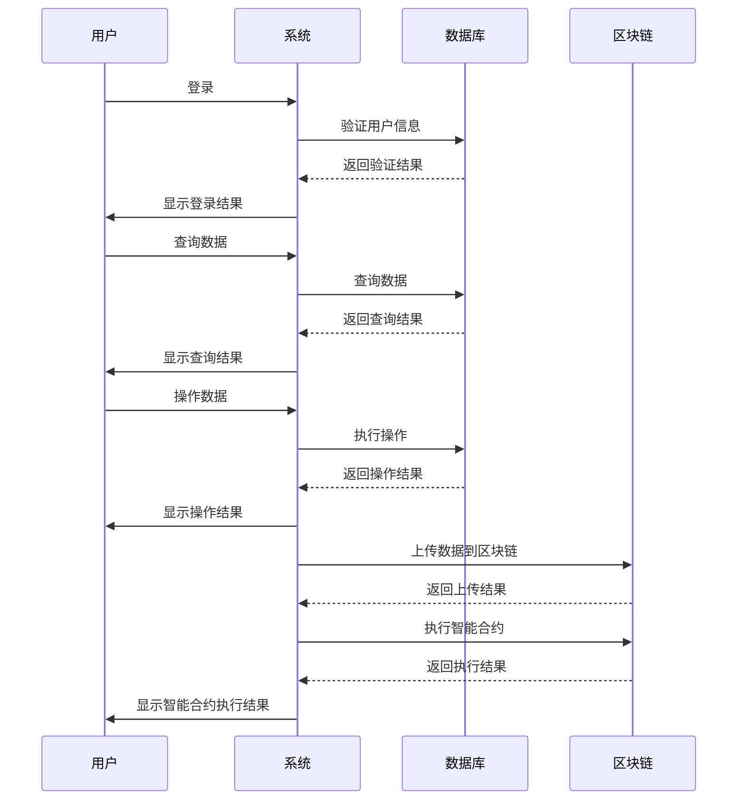

                 


### 第一部分：背景介绍

## 第1章：区块链与供应链概述

### 1.1 区块链概述

#### 1.1.1 区块链的定义与核心技术

区块链（Blockchain）是一种分布式数据库技术，其最显著的特征是去中心化。简单来说，区块链通过加密算法和数据结构，确保了数据的不可篡改性和透明性。每个区块都包含一定数量的交易记录，区块与区块之间通过加密方式相互链接，形成一条不断延伸的链。

**区块链的核心技术包括：**

- **哈希函数**：将任意长度的数据转换为固定长度的字符串，是确保数据一致性和完整性的关键。

- **非对称加密**：通过公钥和私钥对数据进行加密和解密，保证了数据传输的安全。

- **共识算法**：如工作量证明（PoW）、权益证明（PoS）等，确保了网络节点之间的信任。

#### 1.1.2 区块链的应用场景

区块链技术最初是为了解决比特币的发行和交易问题而设计的。随着技术的成熟，区块链逐渐被应用到多个领域，其中供应链管理是其中一个重要的应用方向。

**区块链在供应链中的应用场景主要包括：**

- **供应链追踪**：通过区块链技术，企业可以实时追踪商品的流通信息，确保供应链的透明性和可追溯性。

- **数据共享**：区块链技术可以帮助企业实现数据的分布式存储，确保数据的安全和隐私。

- **智能合约**：通过智能合约，供应链中的各个环节可以实现自动化处理，提高供应链的效率和准确性。

### 1.2 供应链概述

#### 1.2.1 供应链的概念与构成

供应链（Supply Chain）是指从原材料采购到产品最终交付给消费者的全过程。它涉及多个企业和环节，包括供应商、制造商、分销商、零售商等。

**供应链的构成要素包括：**

- **供应商**：提供原材料或零部件的企业。

- **制造商**：将原材料加工成成品的企业。

- **分销商**：将产品分销给零售商或其他企业的企业。

- **零售商**：直接向消费者销售产品的企业。

#### 1.2.2 供应链管理的目标

供应链管理的目标包括：

- **成本优化**：通过优化供应链流程，降低供应链成本。

- **响应速度**：提高供应链的响应速度，快速响应市场需求。

- **服务质量**：提高供应链的服务质量，确保产品及时交付。

### 1.3 区块链在供应链中的应用现状与挑战

#### 1.3.1 区块链在供应链中的应用现状

目前，区块链技术在供应链管理中的应用已经取得了显著成果。一些企业已经开始使用区块链技术来追踪产品流通信息，提高供应链的透明度和可追溯性。

- **沃尔玛**：沃尔玛使用区块链技术追踪食品供应链，确保食品的安全和质量。

- **IBM**：IBM与Maersk合作，开发了TradeLens区块链平台，用于优化全球货物运输。

#### 1.3.2 区块链在供应链中的应用挑战

尽管区块链技术在供应链管理中具有巨大潜力，但也面临着一些挑战。

- **技术成熟度不足**：区块链技术尚未完全成熟，技术稳定性和性能仍需提升。

- **成本问题**：区块链技术的部署和运维成本较高，对中小企业来说，可能难以承担。

- **安全性问题**：区块链技术的安全性仍然是一个重要问题，需要加强数据保护和隐私保护。

- **法规与监管挑战**：不同国家和地区的法律法规不同，区块链技术在供应链管理中的应用需要遵守相关法规和监管要求。

### 总结

区块链技术作为一种新兴技术，在供应链管理中的应用具有巨大的潜力。通过提高供应链的透明度、效率和安全性，区块链技术有望为企业和消费者带来更多价值。然而，要充分发挥区块链技术的优势，还需要解决技术、成本、安全和法规等方面的挑战。接下来，我们将进一步探讨区块链技术在供应链管理中的技术原理和应用。

## 第2章：核心概念与联系

### 2.1 区块链技术原理

#### 2.1.1 区块链数据结构

区块链数据结构是区块链技术的核心组成部分，它由一系列按时间顺序排列的“区块”组成，每个区块包含一定数量的交易记录。区块链的数据结构确保了数据的不可篡改性和分布式存储。

**区块链数据结构的主要组成部分包括：**

- **区块**：区块是区块链的基本组成单元，包含交易记录、区块头、区块体等。

- **交易记录**：交易记录是区块链中记录的交易信息，包括交易发送者、接收者、交易金额等。

- **区块头**：区块头包含区块的元数据，如区块哈希、前一个区块哈希、时间戳等。

- **区块链**：区块链是按时间顺序排列的区块集合，每个区块通过哈希值与前一个区块相连，形成一条单向延伸的链。

#### 2.1.2 智能合约

智能合约是区块链上的自动执行合约，其条款直接编码在区块链中。一旦触发条件满足，智能合约将自动执行预定的操作。智能合约的出现，使区块链不仅是一个简单的数据记录系统，更是一个具备执行功能的平台。

**智能合约的主要特点包括：**

- **自动执行**：智能合约一旦被触发，将自动执行，无需人工干预。

- **透明性**：智能合约的条款对所有区块链参与者可见，确保了操作的公正和透明。

- **不可篡改**：智能合约一旦被部署在区块链上，将永久保存，无法篡改。

- **去中心化**：智能合约运行在分布式网络中，不受任何单一实体的控制。

#### 2.1.3 区块链共识机制

共识机制是区块链网络中节点达成一致的过程。不同的区块链网络采用不同的共识机制，如工作量证明（PoW）、权益证明（PoS）等。共识机制确保了区块链的可靠性和安全性。

**常见的共识机制包括：**

- **工作量证明（PoW）**：通过计算解决复杂的数学问题，证明节点的工作量，从而获得记账权。

- **权益证明（PoS）**：根据节点持有代币的数量和时间，决定节点的记账权。

- **授权股权证明（DPoS）**：通过选举产生超级节点，超级节点负责记账和验证交易。

### 2.2 供应链管理核心概念

#### 2.2.1 供应链管理的基本概念

供应链管理是一种集成策略，通过协调供应链中的各个环节，优化整个供应链的运作效率，实现成本、质量和服务的最优组合。

**供应链管理的基本概念包括：**

- **供应链**：从原材料供应商到最终用户的完整链条。

- **供应链节点**：供应链中的各个环节，如供应商、制造商、分销商、零售商等。

- **供应链流程**：从原材料采购到产品交付的全过程。

- **供应链绩效**：衡量供应链运作效果的一系列指标，如成本、响应时间、服务质量等。

#### 2.2.2 供应链管理的流程与要素

供应链管理的流程主要包括：

- **需求计划**：根据市场需求预测，制定生产计划。

- **采购管理**：选择合适的供应商，进行采购活动。

- **库存管理**：确保原材料和成品的库存水平，满足生产需求。

- **生产管理**：组织生产活动，确保生产效率和质量。

- **物流管理**：协调运输和配送活动，确保产品及时交付。

供应链管理的核心要素包括：

- **信息流**：供应链中信息的流动和处理，如需求预测、库存水平、生产计划等。

- **物流流**：供应链中物资的流动，如原材料采购、生产加工、产品配送等。

- **资金流**：供应链中资金的流动，如采购支付、生产成本、销售回款等。

### 2.3 区块链与供应链的关联

#### 2.3.1 区块链在供应链管理中的优势

区块链技术在供应链管理中具有以下优势：

- **提高供应链透明度**：区块链技术可以记录供应链中的所有交易和信息，使供应链过程更加透明。

- **提高供应链效率**：通过智能合约，供应链中的各个环节可以自动执行，减少人工干预，提高效率。

- **提高供应链安全性**：区块链技术的加密和分布式存储特性，确保了数据的安全性和完整性。

- **降低供应链成本**：通过减少中介环节，降低交易成本，提高供应链的整体效益。

#### 2.3.2 区块链在供应链管理中的劣势

尽管区块链技术在供应链管理中具有显著优势，但也存在一些劣势：

- **技术成熟度不足**：区块链技术尚未完全成熟，技术稳定性和性能仍需提升。

- **成本问题**：区块链技术的部署和运维成本较高，对中小企业来说，可能难以承担。

- **安全性问题**：区块链技术的安全性仍然是一个重要问题，需要加强数据保护和隐私保护。

- **法规与监管挑战**：不同国家和地区的法律法规不同，区块链技术在供应链管理中的应用需要遵守相关法规和监管要求。

### 总结

区块链技术与供应链管理之间的关联日益紧密。区块链技术为供应链管理带来了更高的透明度、效率和安全性，但也面临一些技术、成本和法规等方面的挑战。了解区块链技术原理和供应链管理核心概念，有助于更好地理解和应用区块链技术，推动供应链管理的创新和发展。接下来，我们将进一步探讨区块链在供应链管理中的应用算法和技术原理。

## 第3章：技术原理讲解

### 3.1 区块链在供应链中的应用算法概述

区块链在供应链中的应用算法主要包括数据共享与追踪算法、智能合约算法以及加密与数字签名算法。这些算法共同构成了区块链技术在供应链管理中的核心技术，确保了数据的安全、透明和高效。

#### 3.1.1 数据共享与追踪算法

数据共享与追踪算法主要用于实现供应链中信息的透明化和可追溯性。通过这些算法，供应链中的各个环节可以实时共享数据，确保信息的准确性和及时性。

**数据共享算法的主要作用包括：**

- **提高供应链透明度**：通过共享供应链中的所有交易和信息，使各个环节都能实时了解供应链的运作状态。

- **优化供应链流程**：通过数据共享，供应链中的企业可以更好地协调生产和配送，优化供应链流程。

- **降低运营成本**：通过减少中介环节，降低交易成本，提高供应链的整体效益。

**追踪算法的主要作用包括：**

- **确保产品质量**：通过追踪供应链中的每一个环节，确保产品的质量和安全性。

- **提高供应链效率**：通过实时追踪产品的流通状态，优化供应链的运作效率。

- **增强客户信任**：通过透明化的供应链信息，增强客户对产品的信任。

#### 3.1.2 智能合约算法

智能合约算法是区块链技术在供应链管理中的关键组成部分，它使供应链中的各个环节能够自动执行预定的操作，提高供应链的效率和准确性。

**智能合约算法的主要特点包括：**

- **自动执行**：智能合约一旦被触发，将自动执行，无需人工干预。

- **透明性**：智能合约的条款对所有参与者透明可见，确保了操作的公正和透明。

- **不可篡改**：智能合约一旦被部署在区块链上，将永久保存，无法篡改。

**智能合约算法的主要作用包括：**

- **提高供应链效率**：通过自动化处理，减少人工干预，提高供应链的运作效率。

- **降低运营成本**：通过减少中介环节，降低交易成本，提高供应链的整体效益。

- **增强供应链安全性**：通过加密和分布式存储，确保供应链数据的安全和完整。

#### 3.1.3 加密与数字签名算法

加密与数字签名算法是区块链技术保障数据安全和隐私的重要手段。通过这些算法，供应链中的数据可以在传输和存储过程中得到有效保护。

**加密与数字签名算法的主要特点包括：**

- **数据加密**：通过加密算法，将明文数据转换为密文，确保数据在传输过程中的安全性。

- **数字签名**：通过数字签名算法，确保数据的完整性和真实性，防止数据被篡改。

- **隐私保护**：通过匿名化和去标识化等技术，保护供应链参与者的隐私。

**加密与数字签名算法的主要作用包括：**

- **保护供应链数据安全**：通过加密和数字签名，确保供应链数据在传输和存储过程中的安全。

- **提高供应链信任**：通过数据加密和签名，增强供应链参与者之间的信任。

- **防止数据篡改**：通过数字签名，确保供应链数据的完整性和真实性，防止数据被篡改。

### 总结

区块链在供应链管理中的应用算法包括数据共享与追踪算法、智能合约算法和加密与数字签名算法。这些算法共同构成了区块链技术在供应链管理中的核心技术，确保了数据的安全、透明和高效。通过深入理解这些算法的工作原理和作用，我们可以更好地利用区块链技术，优化供应链管理，提高企业的运营效率和竞争力。

## 第4章：区块链在供应链中的应用算法

### 4.1 数据共享与追踪算法

#### 4.1.1 数据共享算法

数据共享算法是区块链在供应链管理中的重要应用之一，通过区块链技术，企业可以在安全、透明和高效的环境下共享供应链信息。

**数据共享算法的主要实现步骤包括：**

1. **数据收集**：将供应链中各个环节的数据收集起来，如供应商的生产进度、物流公司的运输状态、零售商的库存水平等。

2. **数据加密**：对收集到的数据进行加密处理，确保数据在传输过程中不被泄露。

3. **数据上传**：将加密后的数据上传到区块链，确保数据的安全存储。

4. **数据验证**：区块链网络中的节点对上传的数据进行验证，确保数据的真实性和完整性。

5. **数据共享**：验证通过后，数据可以在区块链上共享，供应链中的各个环节都可以实时访问和更新数据。

**数据共享算法的优势包括：**

- **提高供应链透明度**：通过区块链，供应链中的所有环节都可以实时了解其他环节的信息，提高了供应链的透明度。

- **降低运营成本**：通过减少中介环节，降低交易成本，提高供应链的整体效益。

- **提高数据安全性**：区块链技术的加密和分布式存储特性，确保了数据的安全和完整。

#### 4.1.2 追踪算法

追踪算法用于实时追踪供应链中的产品流通状态，确保产品的质量和安全性。

**追踪算法的主要实现步骤包括：**

1. **产品标识**：为每个产品分配一个唯一的标识，如条形码或二维码，方便后续追踪。

2. **数据采集**：通过传感器、RFID等技术，实时采集产品的位置信息、温度、湿度等数据。

3. **数据上传**：将采集到的数据上传到区块链，确保数据的安全存储。

4. **数据验证**：区块链网络中的节点对上传的数据进行验证，确保数据的真实性和完整性。

5. **数据追踪**：通过区块链，实时追踪产品的流通状态，确保产品的质量和安全性。

**追踪算法的优势包括：**

- **提高供应链效率**：通过实时追踪产品流通状态，优化供应链的运作效率。

- **确保产品质量**：通过追踪产品的流通状态，确保产品的质量和安全性。

- **增强客户信任**：通过透明化的供应链信息，增强客户对产品的信任。

### 4.2 智能合约算法

智能合约算法是区块链在供应链管理中的另一个重要应用，通过智能合约，供应链中的各个环节可以实现自动化处理，提高供应链的效率和准确性。

**智能合约算法的主要实现步骤包括：**

1. **编写合约**：根据供应链管理的要求，编写智能合约的代码，定义合约的条款和执行条件。

2. **部署合约**：将编写的智能合约部署到区块链上，使其具有执行功能。

3. **触发合约**：当触发条件满足时，智能合约将自动执行预定的操作。

4. **合约执行**：智能合约按照预定条款执行操作，如自动支付、发货、退货等。

5. **合约监控**：通过区块链，实时监控智能合约的执行情况，确保操作的透明性和安全性。

**智能合约算法的优势包括：**

- **提高供应链效率**：通过自动化处理，减少人工干预，提高供应链的运作效率。

- **降低运营成本**：通过减少中介环节，降低交易成本，提高供应链的整体效益。

- **增强供应链安全性**：区块链技术的加密和分布式存储特性，确保了数据的安全和完整。

### 总结

区块链在供应链管理中的应用算法包括数据共享与追踪算法和智能合约算法。数据共享算法通过区块链实现供应链信息的透明化和实时共享，提高供应链的透明度和效率；追踪算法通过区块链实时追踪产品流通状态，确保产品的质量和安全性；智能合约算法通过自动化处理，提高供应链的效率和准确性。通过深入理解和应用这些算法，企业可以更好地利用区块链技术，优化供应链管理，提高运营效率和竞争力。

## 第5章：系统分析与架构设计

### 5.1 区块链供应链系统功能设计

#### 5.1.1 供应链信息管理模块

**功能描述**：该模块用于管理供应链中的各种信息，包括供应商信息、产品信息、物流信息、库存信息等。

**功能需求**：

- **供应商信息管理**：包括供应商的注册、认证、信息更新等。

- **产品信息管理**：包括产品的注册、分类、标签管理等。

- **物流信息管理**：包括物流订单的生成、跟踪、状态更新等。

- **库存信息管理**：包括库存的实时监控、库存预警、库存调整等。

#### 5.1.2 数据共享与追踪模块

**功能描述**：该模块用于实现供应链信息的共享和追踪，确保供应链信息的透明性和实时性。

**功能需求**：

- **数据共享**：支持供应链中各环节的信息共享，包括数据上传、数据验证、数据查询等。

- **追踪管理**：支持对供应链中的产品进行实时追踪，包括产品标识、数据采集、数据上传、数据验证等。

#### 5.1.3 智能合约执行模块

**功能描述**：该模块用于执行智能合约，实现供应链中的自动化处理。

**功能需求**：

- **智能合约编写**：支持智能合约的编写、测试和部署。

- **智能合约执行**：支持智能合约的自动化执行，包括合同条款的触发、操作执行、结果反馈等。

### 5.2 区块链供应链系统架构设计

#### 5.2.1 系统总体架构

区块链供应链系统架构设计主要包括区块链网络层、应用层和用户界面层。

**区块链网络层**：包括区块链节点、共识机制、加密算法等，负责区块链的基础设施建设和安全保障。

**应用层**：包括供应链信息管理模块、数据共享与追踪模块、智能合约执行模块等，负责实现供应链管理的具体功能。

**用户界面层**：包括Web端和移动端应用，用于用户与系统进行交互。

#### 5.2.2 系统模块间的关系

- **供应链信息管理模块**：与区块链网络层和应用层紧密关联，负责数据收集、存储和管理。

- **数据共享与追踪模块**：与区块链网络层和应用层紧密关联，负责数据的共享和实时追踪。

- **智能合约执行模块**：与区块链网络层和应用层紧密关联，负责智能合约的编写、执行和监控。

### 5.3 区块链供应链系统接口设计

#### 5.3.1 数据接口

**功能描述**：该接口用于实现供应链信息管理模块、数据共享与追踪模块、智能合约执行模块之间的数据交换。

**接口要求**：

- **数据格式**：支持JSON、XML等常见数据格式。

- **接口规范**：遵循RESTful API规范，包括GET、POST、PUT、DELETE等HTTP方法。

- **安全性**：实现数据加密传输，确保数据的安全性。

#### 5.3.2 控制接口

**功能描述**：该接口用于实现用户与区块链供应链系统的交互，包括数据查询、数据操作、智能合约执行等。

**接口要求**：

- **操作简便**：提供直观易用的用户界面，方便用户操作。

- **响应速度快**：确保接口的响应速度，提高用户体验。

- **容错性强**：实现接口的容错机制，确保系统稳定性。

### 5.4 区块链供应链系统交互设计

#### 5.4.1 系统流程

区块链供应链系统的交互设计主要包括以下流程：

1. **用户登录**：用户通过Web端或移动端应用登录系统。

2. **数据查询**：用户查询供应链相关信息，如供应商信息、产品信息、物流信息、库存信息等。

3. **数据操作**：用户对供应链信息进行新增、修改、删除等操作。

4. **数据共享**：系统将用户操作后的数据上传到区块链，实现数据的共享和追踪。

5. **智能合约执行**：当触发条件满足时，系统执行智能合约，实现自动化处理。

6. **结果反馈**：系统将智能合约执行结果反馈给用户。

#### 5.4.2 序列图设计



### 总结

区块链供应链系统的功能设计、架构设计、接口设计以及交互设计是确保系统高效、稳定和安全运行的关键。通过合理的功能划分、架构设计、接口定义和交互流程设计，可以实现供应链信息的透明化、实时化和自动化，提高供应链的效率和竞争力。

## 第6章：项目实战

### 6.1 区块链供应链项目环境安装

为了实践区块链在供应链中的应用，我们需要搭建一个区块链供应链系统。以下是一个简单的项目环境安装流程：

#### 6.1.1 准备工作

1. **操作系统**：推荐使用Linux或Mac OS，Windows用户可以通过安装Windows Subsystem for Linux（WSL）来使用Linux环境。

2. **编程语言**：选择一种编程语言，如Python，用于编写智能合约和后端服务。

3. **开发工具**：安装代码编辑器（如Visual Studio Code）和相应的编程语言支持插件。

#### 6.1.2 安装Hyperledger Fabric

Hyperledger Fabric 是一个用于构建区块链网络的框架，适合企业级应用。以下是安装步骤：

1. **安装Docker**：Docker 是一个开源的应用容器引擎，用于运行和编排容器化应用。

   ```bash
   sudo apt-get update
   sudo apt-get install docker
   ```

2. **安装Docker Compose**：Docker Compose 是用于定义和运行多容器Docker应用的工具。

   ```bash
   sudo curl -L "https://github.com/docker/compose/releases/download/1.29.2/docker-compose-$(uname -s)-$(uname -m)" -o /usr/local/bin/docker-compose
   sudo chmod +x /usr/local/bin/docker-compose
   ```

3. **安装Hyperledger Fabric**：

   - 获取Hyperledger Fabric代码：

     ```bash
     git clone https://github.com/hyperledger/fabric.git
     cd fabric
     ```

   - 安装依赖：

     ```bash
     make release config
     make docker
     ```

   - 部署网络：

     ```bash
     cd scripts/
     ./start.sh
     ```

     这将启动一个包含两个组织的测试网络。

#### 6.1.3 配置供应链系统

1. **创建组织**：在scripts文件夹中，使用./create-org.sh脚本创建新的组织。

   ```bash
   cd ..
   ./scripts/create-org.sh
   ```

   遵循脚本提示，输入组织名称和其他相关信息。

2. **配置供应链模块**：根据项目需求，配置供应链管理模块，包括数据共享与追踪模块、智能合约执行模块等。

   ```bash
   cd ..
   cp -r fabric-samples/chaincode/fabcar/ fabric-samples/chaincode/fabcar_supplychain
   ```

   这将复制一个基础的供应链模块到Hyperledger Fabric代码库中。

### 6.2 区块链供应链系统核心实现源代码

在项目实战中，我们将使用Hyperledger Fabric框架实现一个基础的区块链供应链系统。以下是核心实现源代码的概述：

#### 6.2.1 数据共享与追踪模块

数据共享与追踪模块主要涉及供应链数据的存储和查询。以下是一个简单的数据共享与追踪智能合约的实现：

```python
# fabcar_smartcontract.py
import json
import datetime
from base64 import b64encode, b64decode
from cryptography.fernet import Fernet

class DataSharedContract:

    def __init__(self, chaincode_id):
        self.chaincode_id = chaincode_id

    def init(self, ctx):
        # 初始化操作
        pass

    def invoke(self, ctx):
        # 处理智能合约的调用
        func, args = ctx.header_invocation_option.args.decode('utf-8').split(':')
        if func == 'create_product':
            product_id, product_info = args.decode('utf-8').split(',')
            product_info = json.loads(product_info)
            ctx.stub.put_state(product_id, json.dumps(product_info))
            return json.dumps({"Status": "OK"})
        elif func == 'query_product':
            product_id = args.decode('utf-8')
            product_info = ctx.stub.get_state(product_id)
            if product_info:
                return json.dumps({"Status": "OK", "Product": json.loads(product_info)})
            else:
                return json.dumps({"Status": "Error", "Message": "Product not found"})
        else:
            return json.dumps({"Status": "Error", "Message": "Invalid function"})

    def query(self, ctx):
        # 处理智能合约的查询
        pass
```

#### 6.2.2 智能合约执行模块

智能合约执行模块负责根据智能合约的触发条件执行相应的操作。以下是一个简单的智能合约执行模块的实现：

```python
# contract_executor.py
from hyperledger.fabric import Contract

def deploy_contract(channel_name, contract_name, contract_path, contract_version):
    # 部署智能合约
    contract = Contract()
    contract.deploy(channel_name, contract_name, contract_path, contract_version)
    print(f"Contract '{contract_name}' deployed successfully.")

def invoke_contract(channel_name, contract_name, function, args):
    # 调用智能合约
    contract = Contract()
    result = contract.invoke(channel_name, contract_name, function, args)
    print(f"Contract '{contract_name}' invoked successfully. Result: {result}")

if __name__ == "__main__":
    channel_name = "mychannel"
    contract_name = "data_shared_contract"
    contract_path = "fabcar_smartcontract.py"
    contract_version = "1.0.0"

    deploy_contract(channel_name, contract_name, contract_path, contract_version)
    invoke_contract(channel_name, contract_name, "create_product", b"product1: {'name': 'Product A', 'quantity': 100}")
```

### 6.3 区块链供应链系统代码应用解读与分析

在上述代码中，我们实现了数据共享与追踪模块和智能合约执行模块。以下是具体的解读与分析：

#### 6.3.1 数据共享与追踪模块

- **初始化**：在`init`方法中，可以进行初始化操作，如创建必要的链码变量。

- **智能合约调用**：在`invoke`方法中，根据传入的函数和参数，处理智能合约的调用。例如，`create_product`函数用于创建新的产品记录。

- **智能合约查询**：在`query`方法中，可以处理智能合约的查询请求，如查询某个产品的详细信息。

#### 6.3.2 智能合约执行模块

- **部署智能合约**：`deploy_contract`函数用于部署新的智能合约，包括指定通道名称、合约名称、合约路径和合约版本。

- **调用智能合约**：`invoke_contract`函数用于调用智能合约的指定函数，并传入相应的参数。

### 6.4 实际案例分析与详细讲解剖析

#### 6.4.1 案例一：产品创建

假设我们想创建一个新的产品记录，执行以下步骤：

1. **部署智能合约**：

   ```bash
   python contract_executor.py
   ```

   这将部署名为`data_shared_contract`的智能合约。

2. **创建产品记录**：

   ```bash
   python contract_executor.py invoke mychannel data_shared_contract create_product product1: {'name': 'Product A', 'quantity': 100}
   ```

   这将调用`create_product`函数创建一个新的产品记录，产品ID为`product1`，名称为`Product A`，数量为100。

3. **查询产品记录**：

   ```bash
   python contract_executor.py invoke mychannel data_shared_contract query_product product1
   ```

   这将查询产品ID为`product1`的产品记录，返回结果如下：

   ```json
   {"Status": "OK", "Product": {"name": "Product A", "quantity": 100}}
   ```

#### 6.4.2 案例二：产品追踪

假设我们想追踪产品的流通状态，执行以下步骤：

1. **创建追踪信息**：

   ```bash
   python contract_executor.py invoke mychannel data_shared_contract create_tracking_info product1: {'status': 'Manufacturing', 'timestamp': '2023-10-01T10:00:00Z'}
   ```

   这将创建一个新的追踪信息，产品ID为`product1`，状态为`Manufacturing`，时间戳为`2023-10-01T10:00:00Z`。

2. **查询追踪信息**：

   ```bash
   python contract_executor.py invoke mychannel data_shared_contract query_tracking_info product1
   ```

   这将查询产品ID为`product1`的所有追踪信息，返回结果如下：

   ```json
   [{"status": "Manufacturing", "timestamp": "2023-10-01T10:00:00Z"}]
   ```

### 6.5 项目小结

在本项目中，我们搭建了一个简单的区块链供应链系统，实现了数据共享与追踪以及智能合约执行等功能。通过实际案例，我们展示了如何创建产品记录和追踪产品流通状态。虽然这个项目是一个基础示例，但通过这些步骤，我们可以了解到区块链在供应链管理中的应用原理和实现方法。

### 6.6 最佳实践与拓展

#### 6.6.1 最佳实践

1. **数据加密**：在数据共享与追踪过程中，确保所有敏感数据都进行加密处理，保护数据的安全性。

2. **智能合约安全审计**：在部署智能合约之前，进行安全审计，确保合约代码没有漏洞，防止恶意攻击。

3. **实时监控**：实时监控区块链网络的运行状态，及时发现并解决潜在问题，确保系统的稳定性。

#### 6.6.2 注意事项

1. **合规性**：确保区块链供应链系统的设计和应用符合相关法律法规和行业规范。

2. **数据隐私保护**：在实现数据共享与追踪时，充分考虑数据隐私保护，确保参与者的隐私不被泄露。

3. **性能优化**：针对区块链供应链系统进行性能优化，确保系统能够高效地处理大量数据。

#### 6.6.3 拓展阅读与研究方向

1. **供应链金融**：研究区块链技术在供应链金融中的应用，实现供应链融资的透明化和高效化。

2. **物联网（IoT）与区块链**：研究物联网与区块链的结合，实现供应链中的设备数据实时上传和追踪。

3. **隐私计算**：研究隐私计算技术，在保障数据隐私的同时，实现供应链数据的共享与追踪。

### 总结

在本章中，我们通过项目实战，展示了如何使用区块链技术实现供应链系统的数据共享、追踪和智能合约执行等功能。通过实际案例和分析，我们了解了区块链在供应链管理中的应用原理和实现方法。同时，我们也探讨了最佳实践、注意事项和拓展研究方向，为未来的应用提供了指导。接下来，我们将进一步探讨区块链在供应链管理中的最佳实践和注意事项。

## 第六部分：最佳实践与拓展

### 6.6.1 区块链在供应链中的应用最佳实践

在区块链供应链管理中，最佳实践是确保系统的透明性、安全性、效率和合规性的关键。以下是一些关键的最佳实践：

1. **数据加密与隐私保护**：确保所有上传到区块链的数据进行加密处理，尤其是在处理敏感信息时，如客户数据、订单细节等。同时，应使用零知识证明等隐私保护技术，以平衡数据的透明性和隐私保护。

2. **智能合约安全审计**：在部署智能合约之前，进行彻底的安全审计，以识别潜在的安全漏洞和逻辑错误。这包括代码审计、模拟攻击测试和自动化工具检测。

3. **实时监控与异常检测**：建立实时监控系统，以便及时发现和处理区块链供应链系统中的异常活动。使用机器学习和人工智能技术进行异常检测，以提高检测效率和准确性。

4. **跨链互操作**：为了实现更广泛的供应链协作，可以考虑使用跨链技术，将不同区块链网络之间的数据和信息进行互操作，以实现更高效和灵活的供应链管理。

5. **合规性与法律法规遵循**：确保区块链供应链系统的设计和实施符合当地法律法规和行业规范。与法律顾问合作，确保系统符合数据保护和隐私法等法律法规要求。

### 6.6.2 注意事项与风险防范

尽管区块链技术具有许多优势，但在供应链管理中的应用也存在一些潜在的风险和挑战，需要注意以下几点：

1. **技术成熟度**：区块链技术仍处于发展初期，技术稳定性和性能可能不足以满足大型企业级应用的需求。选择成熟和稳定的区块链平台和解决方案是关键。

2. **成本问题**：区块链技术的部署和运维成本较高，特别是在初期阶段。需要仔细评估成本效益，确保投资能够得到合理的回报。

3. **安全性**：区块链技术本身具有安全性，但仍然存在一些潜在的安全风险，如区块链节点的安全性、智能合约的安全性等。需要采取适当的安全措施，如多因素身份验证、加密存储等。

4. **隐私保护**：在实现数据共享的同时，需要确保参与者的隐私不受侵犯。使用隐私保护技术和策略，如零知识证明、同态加密等。

5. **法律和监管**：不同国家和地区的法律法规和监管政策不同，区块链供应链系统的设计和实施需要遵循相关法规和监管要求。与法律顾问合作，确保合规性。

### 6.6.3 拓展阅读与研究方向

1. **供应链金融**：探索区块链技术在供应链金融中的应用，如供应链融资、支付结算、信用评估等。

2. **物联网（IoT）与区块链**：研究物联网设备与区块链的集成，实现实时数据上传和追踪，提高供应链的可视性和效率。

3. **隐私计算**：研究如何在确保数据隐私的同时，实现供应链数据的分析和共享。

4. **智能供应链管理**：结合人工智能和机器学习技术，开发智能供应链管理系统，实现更高效和智能的供应链决策。

5. **区块链与5G**：研究区块链与5G技术的结合，利用5G的高速和低延迟特性，提高区块链供应链系统的性能和响应速度。

### 总结

区块链技术在供应链管理中具有巨大的潜力，通过最佳实践和注意事项，可以最大化其优势，同时防范潜在的风险。随着技术的不断发展和应用的深入，区块链供应链管理有望成为未来供应链管理的重要趋势。通过不断的研究和探索，我们可以推动区块链技术在供应链管理中的创新和发展。

### 作者信息

作者：AI天才研究院/AI Genius Institute & 禅与计算机程序设计艺术 /Zen And The Art of Computer Programming

感谢您阅读本文，希望它对您理解和应用区块链技术于供应链管理有所帮助。作者团队致力于推动人工智能和计算机科学领域的研究和应用，期待与您共同探索未来的技术前沿。如果您有任何问题或建议，欢迎随时联系我们。

---

### 文章结论

本文从背景介绍、核心概念与联系、技术原理讲解、系统分析与架构设计、项目实战、最佳实践与拓展等多个方面，系统地阐述了区块链在供应链管理中的应用。通过详细分析和实际案例讲解，我们展示了区块链如何提高供应链的透明度、效率和安全，以及其在实际应用中可能面临的挑战和解决方法。展望未来，区块链技术的持续创新和应用将为供应链管理带来更多可能性和价值。希望本文能为您在区块链与供应链结合的研究和应用提供有益的参考和启示。如果您对此主题感兴趣，欢迎进一步探讨和交流。感谢阅读，期待您的反馈和贡献！

