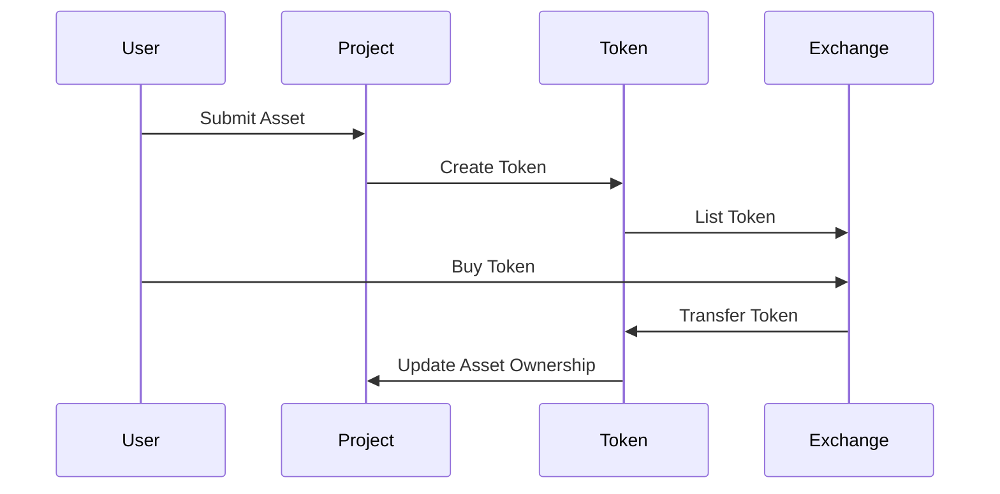
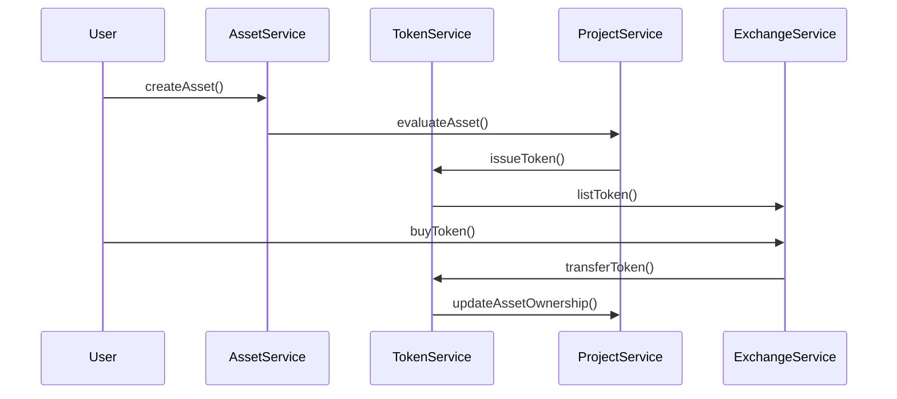

                 


### 引入

区块链技术自2008年首次提出以来，已经成为全球范围内最具变革性的技术之一。它不仅重新定义了数据存储和传输的方式，还极大地改变了资产管理和交易领域。在区块链的众多应用中，资产代币化（Asset Tokenization）引起了广泛关注。资产代币化是将传统资产（如房地产、股权、艺术品等）转化为数字代币的过程，这些数字代币可以在区块链上安全、透明地交易。

为什么资产代币化如此重要？首先，它提供了更高的透明度和可追溯性。通过区块链，资产的每一个交易记录都可以被实时查看，确保了交易的透明性和不可篡改性。其次，资产代币化降低了交易成本。传统的资产交易通常涉及复杂的流程和中介机构，而代币化可以使交易更加直接和高效。此外，资产代币化还为投资者提供了新的机会，他们可以更容易地获得分散化投资组合，并在全球范围内进行投资。

本文将详细探讨区块链在资产代币化中的应用。我们将从基础概念入手，逐步深入到资产代币化的具体流程、实际应用案例、面临的挑战与机遇，以及相关的法律和监管问题。通过本文的阅读，您将不仅了解资产代币化的基本原理，还能掌握其在不同领域的具体应用和实践。

接下来，我们将首先介绍区块链和资产代币化的核心概念，为后续的讨论打下坚实的基础。

### 关键词

- 区块链
- 资产代币化
- 数字代币
- 透明性
- 交易成本
- 投资机会
- 透明度和可追溯性

### 摘要

本文探讨了区块链在资产代币化中的应用，详细介绍了区块链和资产代币化的核心概念，以及资产代币化的具体流程和实际应用案例。文章还分析了资产代币化面临的挑战和机遇，并探讨了相关的法律和监管问题。通过本文，读者将全面了解资产代币化的原理和其在金融、房地产、艺术品等领域的广泛应用。

## 第1章: 区块链与资产代币化概述

在进入详细讨论之前，我们需要先了解两个核心概念：区块链和资产代币化。这一章节将分别介绍这两个概念，为后续的内容打下基础。

### 1.1 区块链技术简述

区块链是一种分布式数据库技术，通过多个节点之间的协作，实现了去中心化数据存储和传输。每个区块都包含一定数量的交易记录，这些区块按照时间顺序连接在一起，形成了一个不可篡改的链式数据结构。区块链的主要特点包括：

- **去中心化**：与传统中心化系统不同，区块链不依赖单一中心节点，而是通过多个节点共同维护和验证数据。
- **不可篡改**：一旦数据被记录在区块链上，就几乎不可能被修改或删除，保证了数据的完整性和可信度。
- **透明性**：区块链上的所有交易记录都是公开透明的，任何用户都可以查看和验证。

区块链的核心组成部分包括：

- **区块**：包含交易记录的数据结构。
- **链**：由多个区块按照时间顺序连接组成的链式结构。
- **节点**：参与区块链网络维护和验证数据的计算机。
- **共识算法**：确保多个节点之间达成共识的算法，如工作量证明（Proof of Work, PoW）和权益证明（Proof of Stake, PoS）。

### 1.2 资产代币化的概念

资产代币化是将传统资产转化为数字代币的过程，这些代币可以代表真实的资产，并在区块链上交易。具体来说，资产代币化的过程包括以下几个步骤：

1. **资产评估**：对目标资产进行价值评估，确定其转化为代币的基础。
2. **代币发行**：创建数字代币，并将其与真实资产绑定。这些代币通常基于区块链平台，如以太坊（Ethereum）。
3. **上链**：将代币记录在区块链上，使其可以在区块链上交易和转移。
4. **交易**：用户可以购买、出售或交换代币，代表真实资产的交易也随之进行。

资产代币化具有以下优点：

- **提高透明度和可追溯性**：代币化的资产交易记录在区块链上，任何用户都可以查看和验证，提高了交易的透明度和可追溯性。
- **降低交易成本**：去中心化的交易减少了中介机构的介入，降低了交易成本。
- **增强流动性**：代币化的资产可以更加方便地在全球范围内进行交易，提高了资产的流动性。
- **提供新投资机会**：资产代币化为投资者提供了更多的投资机会，可以更容易地获得分散化投资组合。

### 1.3 区块链在资产代币化中的潜力

区块链在资产代币化中具有巨大的潜力，主要体现在以下几个方面：

1. **提高金融包容性**：通过区块链，许多无法获得传统金融服务的人群可以更方便地参与到金融市场中。
2. **降低交易摩擦**：去中心化的交易减少了中介机构的介入，提高了交易效率。
3. **提高资产透明度**：区块链上的资产交易记录公开透明，减少了欺诈和不良行为。
4. **创新金融服务**：资产代币化为金融机构和创业者提供了新的业务模式和创新机会。
5. **促进资本流动**：通过资产代币化，资金可以更高效地在全球范围内流动，促进了资本市场的繁荣。

通过本章的介绍，我们对区块链和资产代币化的核心概念有了基本的理解。接下来，我们将进一步探讨资产代币化的具体流程，以及在不同领域的应用实践。

## 第2章: 核心概念

为了更好地理解区块链在资产代币化中的应用，我们需要深入探讨几个核心概念，包括区块链技术的底层原理、加密技术、以及区块链与资产代币化的联系。这些概念将为后续的讨论提供坚实的基础。

### 2.1 区块链的基本原理

区块链技术是一种分布式数据库技术，它通过多个节点之间的协作，实现了去中心化数据存储和传输。以下是区块链技术的一些基本原理：

1. **分布式账本**：区块链通过多个节点（计算机）共同维护一个分布式账本，确保了数据的完整性和安全性。与传统中心化系统不同，区块链不依赖单一中心节点，而是通过多个节点共同维护数据，从而提高了系统的可靠性和抗攻击能力。

2. **去中心化**：区块链的去中心化特性意味着数据不存储在单一服务器上，而是分布在多个节点上。每个节点都有一份完整的账本副本，任何节点都无法单独篡改数据。这一特性确保了系统的透明性和不可篡改性。

3. **共识机制**：区块链网络通过共识机制来确保所有节点对账本的一致性。常见的共识机制包括工作量证明（Proof of Work, PoW）和权益证明（Proof of Stake, PoS）。PoW通过解决复杂的数学难题来选择区块的生成者，而PoS则通过持有代币的数量和时间来决定生成者。共识机制确保了所有节点对账本数据的共识，从而实现了去中心化的数据维护。

4. **加密技术**：区块链采用加密技术来确保数据的安全性和隐私性。每个区块都包含一个时间戳和前一个区块的哈希值，确保了数据的连续性和不可篡改性。同时，区块链使用非对称加密技术来保护用户身份和交易隐私，确保只有合法的持有人可以访问和解读数据。

5. **智能合约**：智能合约是区块链技术的一个重要组成部分，它是一种自动执行合同条款的计算机程序。智能合约通过编程语言编写，当满足特定条件时，会自动执行预定的操作。智能合约的应用极大地提高了交易的效率和透明度，减少了对中介机构的依赖。

### 2.2 加密技术概述

加密技术是区块链安全性的基石，它通过将数据转化为难以解读的形式，保护了用户隐私和交易安全。以下是几种常见的加密技术：

1. **对称加密**：对称加密使用相同的密钥来加密和解密数据。常见的对称加密算法包括AES（高级加密标准）和DES（数据加密标准）。对称加密速度快，但在分布式系统中应用受限，因为需要确保密钥的安全传输。

2. **非对称加密**：非对称加密使用一对密钥（公钥和私钥）来加密和解密数据。公钥可以公开，用于加密数据，而私钥必须保密，用于解密数据。常见的非对称加密算法包括RSA（鲁宾逊·爱德华·阿贝尔）和ECC（椭圆曲线加密）。非对称加密在区块链中用于保护用户身份和交易隐私，确保只有合法的持有人可以访问和解密数据。

3. **哈希函数**：哈希函数是一种将任意长度的数据映射为固定长度数据的算法，常见的哈希函数包括SHA-256和MD5。哈希函数在区块链中用于确保数据的完整性和不可篡改性，每个区块都包含前一个区块的哈希值，确保了数据的连续性和一致性。

4. **数字签名**：数字签名是一种使用加密技术验证数据完整性和真实性的方法。发送者使用私钥对数据进行签名，接收者可以使用公钥验证签名。数字签名在区块链中用于确保交易的真实性和安全性，防止数据被篡改。

### 2.3 区块链与资产代币化的联系

区块链与资产代币化有着密切的联系，两者共同构成了现代金融和资产交易的基础。以下是区块链与资产代币化的主要联系：

1. **去中心化和透明性**：区块链的去中心化和透明性确保了资产代币化的交易记录公开透明，任何用户都可以查看和验证。这种透明性提高了资产交易的可信度，减少了欺诈和不良行为。

2. **不可篡改性**：区块链的不可篡改性确保了资产代币化交易的记录一旦记录在区块链上，就几乎不可能被修改或删除。这一特性增强了资产交易的安全性和可靠性。

3. **智能合约**：智能合约在资产代币化中发挥了重要作用，它们可以自动执行预定的操作，确保交易的执行符合合同条款。智能合约的应用简化了交易流程，提高了交易效率。

4. **降低交易成本**：资产代币化通过去中心化的交易方式，减少了中介机构的介入，降低了交易成本。这不仅提高了交易的效率，还为投资者提供了更多的机会。

5. **提高资产流动性**：资产代币化使得资产可以更加方便地在全球范围内进行交易，提高了资产的流动性。投资者可以更容易地获得分散化投资组合，并在不同市场进行投资。

通过本章的介绍，我们对区块链和资产代币化的核心概念有了更深入的理解。接下来，我们将详细探讨资产代币化的具体流程，以及其在不同领域的应用实践。

### 2.4 区块链与资产代币化的对比表格

为了更直观地理解区块链与资产代币化之间的关系，我们提供了一个对比表格，列出两者的主要区别和联系：

| 特性 | 区块链 | 资产代币化 |
| --- | --- | --- |
| 定义 | 分布式数据库技术，通过多个节点协作维护数据 | 区块链上的数字代币，代表真实资产 |
| 目的 | 提供去中心化的数据存储和传输 | 转化传统资产为可交易数字资产 |
| 核心技术 | 分布式账本、共识机制、加密技术 | 智能合约、数字代币 |
| 优点 | 去中心化、不可篡改、透明性、安全性 | 提高透明度、降低交易成本、增强流动性 |
| 缺点 | 能耗高、交易速度慢、技术门槛高 | 需要解决监管和法律问题、市场认知不足 |
| 联系 | 区块链是资产代币化的基础设施 | 资产代币化是区块链技术的一种应用 |

通过这个表格，我们可以清晰地看到区块链与资产代币化之间的紧密联系和区别，为后续的讨论提供了有力的支持。

### 2.5 区块链与资产代币化的ER实体关系图

为了更直观地展示区块链与资产代币化之间的实体关系，我们使用Mermaid绘制了一个ER（实体关系）图。以下是该图的Markdown格式表示：

```mermaid
erDiagram
  Asset --> Token : represents
  Blockchain --> Token : operates_on
  Blockchain --> Node : consists_of
  Node --> Transaction : processes
  Transaction --> Asset : transfers
  Transaction --> Token : exchanges
```

解释：
- **Asset（资产）**：代表被代币化的真实资产，如房地产、股权、艺术品等。
- **Token（代币）**：代表区块链上的数字代币，与真实资产绑定。
- **Blockchain（区块链）**：作为资产代币化的基础设施，负责维护和记录所有交易。
- **Node（节点）**：区块链的组成部分，负责验证和存储数据。
- **Transaction（交易）**：代表资产代币化过程中的交易行为，包括资产与代币之间的转移和交换。

这个ER图清晰地展示了区块链与资产代币化之间的重要联系，有助于我们更好地理解其工作原理。

### 2.6 区块链技术原理讲解

为了深入理解区块链技术，我们需要从算法原理、数据结构、加密技术等方面进行详细讲解。以下是区块链技术的主要组成部分和原理：

#### 算法原理

区块链的算法原理主要包括共识算法和加密算法。共识算法用于确保多个节点对账本数据的一致性，常见的共识算法有工作量证明（Proof of Work, PoW）和权益证明（Proof of Stake, PoS）。

1. **工作量证明（PoW）**：
   - **原理**：PoW通过解决复杂的数学难题来选择区块的生成者。每个节点（矿工）尝试找到满足特定条件的哈希值，一旦找到，该节点将成为下一个区块的生成者，并获得一定的奖励。
   - **优点**：确保了区块链的去中心化和安全性，防止了单一节点垄断网络。
   - **缺点**：计算资源消耗大，交易速度较慢。

2. **权益证明（PoS）**：
   - **原理**：PoS通过持有代币的数量和时间来选择区块的生成者。持有代币越多、时间越长的节点，越有可能成为区块生成者。
   - **优点**：相比PoW，PoS降低了计算资源消耗，提高了交易速度。
   - **缺点**：可能导致“富者愈富”的问题，因为持有更多代币的节点更有可能成为生成者。

#### 数据结构

区块链的数据结构是链式数据结构，每个区块包含以下信息：

- **区块头**：包含版本号、时间戳、难度目标、前一个区块的哈希值等。
- **交易列表**：包含该区块包含的所有交易记录。
- **Merkle树**：用于确保交易列表的完整性和一致性。
- **区块体**：包括区块头和交易列表。

区块链通过将新的区块添加到链的末尾，形成了链式数据结构。每个区块都包含前一个区块的哈希值，确保了数据的连续性和不可篡改性。

#### 加密技术

区块链使用多种加密技术来确保数据的安全性和隐私性：

- **哈希函数**：用于将任意长度的数据映射为固定长度的哈希值，常见的哈希函数有SHA-256和SHA-3。
- **非对称加密**：用于保护用户身份和交易隐私，常见的非对称加密算法有RSA和椭圆曲线加密（ECC）。
- **数字签名**：用于验证数据的完整性和真实性，发送者使用私钥对数据进行签名，接收者使用公钥验证签名。

#### 示例讲解

假设一个节点想要将一笔交易记录添加到区块链上，以下是具体的步骤：

1. **交易生成**：用户A想要将一定数量的代币转给用户B，生成一笔交易记录。
2. **交易验证**：节点对交易进行验证，确保交易的有效性和合法性。
3. **区块生成**：矿工收集一定数量的交易记录，生成一个新的区块，并计算区块头中的哈希值。
4. **区块验证**：其他节点验证新区块的合法性，包括验证区块头中的哈希值是否满足难度目标，以及交易是否合法。
5. **区块添加**：一旦区块通过验证，就会被添加到区块链的末尾，形成一个新的链。

通过这个示例，我们可以看到区块链技术是如何确保数据的完整性和安全性的。

### 2.7 加密技术原理讲解

为了深入理解加密技术在区块链和资产代币化中的应用，我们需要详细探讨几种常见的加密技术，包括对称加密、非对称加密和哈希函数。

#### 对称加密

对称加密使用相同的密钥来加密和解密数据，常见的对称加密算法有AES（高级加密标准）和DES（数据加密标准）。

1. **原理**：
   - **加密过程**：发送方使用密钥对数据进行加密，接收方使用相同的密钥对数据进行解密。
   - **优点**：加密速度快，适合对大数据进行加密。
   - **缺点**：需要安全的密钥传输，否则可能存在安全风险。

2. **示例**：
   - **AES加密**：使用256位密钥对数据进行加密，加密速度快，安全性高。
   - **DES加密**：使用56位密钥对数据进行加密，已逐渐被AES取代。

#### 非对称加密

非对称加密使用一对密钥（公钥和私钥）来加密和解密数据，常见的非对称加密算法有RSA（鲁宾逊·爱德华·阿贝尔）和椭圆曲线加密（ECC）。

1. **原理**：
   - **加密过程**：发送方使用公钥对数据进行加密，接收方使用私钥对数据进行解密。
   - **优点**：解决了密钥传输的安全问题，适合加密小数据。
   - **缺点**：加密和解密速度相对较慢。

2. **示例**：
   - **RSA加密**：使用大素数生成公钥和私钥，加密过程复杂，安全性高。
   - **ECC加密**：使用椭圆曲线算法，加密和解密速度快，适合移动设备和物联网应用。

#### 哈希函数

哈希函数是一种将任意长度的数据映射为固定长度数据的算法，常见的哈希函数有SHA-256和MD5。

1. **原理**：
   - **加密过程**：将输入数据通过算法处理，生成固定长度的哈希值。
   - **优点**：确保数据的完整性和一致性，用于验证数据的真实性。
   - **缺点**：无法从哈希值反推出原始数据。

2. **示例**：
   - **SHA-256**：将输入数据映射为256位的哈希值，安全性高，广泛用于区块链和加密货币。
   - **MD5**：将输入数据映射为128位的哈希值，安全性较低，已逐渐被SHA-256取代。

通过以上讲解，我们可以更好地理解加密技术在区块链和资产代币化中的应用，以及它们如何确保数据的安全性和隐私性。

### 2.8 数学公式与模型讲解

为了更好地理解区块链和资产代币化的数学原理，我们需要介绍一些关键的数学模型和公式。以下是几个核心概念的数学表示：

#### 1. 工作量证明（Proof of Work, PoW）

**公式**：在PoW中，矿工需要找到满足特定条件的哈希值。

$$ H(n) < D $$

其中，\( H(n) \) 是矿工计算出的哈希值，\( D \) 是难度目标。矿工通过不断尝试不同的随机数 \( n \)，直到找到满足条件的哈希值为止。

#### 2. 权益证明（Proof of Stake, PoS）

**公式**：在PoS中，节点的投票权重与其持有的代币数量成正比。

$$ Weight = Stake \times Time $$

其中，\( Weight \) 是节点的投票权重，\( Stake \) 是节点持有的代币数量，\( Time \) 是节点持有代币的时间。

#### 3. 莱特曼距离（Lightman Distance）

**公式**：莱特曼距离用于衡量区块链的安全性和攻击难度。

$$ LD = 2^{n/2} $$

其中，\( n \) 是区块数量。莱特曼距离越大，区块链的安全性和抗攻击能力越强。

#### 4. 费马大定理（Fermat's Last Theorem）

**公式**：费马大定理指出，对于任何大于2的自然数\( n \)，方程\( a^n + b^n = c^n \)没有正整数解。

$$ a^n + b^n \neq c^n \quad (n > 2) $$

通过以上数学公式和模型，我们可以更深入地理解区块链和资产代币化的核心技术原理。

### 2.9 系统分析与架构设计方案

为了更好地理解区块链在资产代币化中的应用，我们需要从系统分析和架构设计两个方面进行详细讲解。以下是资产代币化系统的一个概要介绍。

#### 3.1 问题场景介绍

资产代币化系统旨在将传统资产（如房地产、股权、艺术品等）转化为可交易的数字代币，实现资产的数字化和透明化。具体场景包括：

- **房地产代币化**：将房地产项目的所有权划分为多个代币，投资者可以通过购买代币参与房地产投资。
- **股权代币化**：将公司股权划分为代币，投资者可以购买代币获得公司股权。
- **艺术品代币化**：将艺术品所有权划分为代币，收藏家可以通过购买代币获得艺术品的所有权。

#### 3.2 项目介绍

我们以一个房地产代币化项目为例，介绍项目的总体架构和功能设计。

**项目名称**：RealEstateToken

**目标**：将房地产项目转化为可交易的数字代币，提高房地产投资的透明度和流动性。

**核心功能**：
- **资产评估**：对房地产项目进行价值评估，确定代币的基础。
- **代币发行**：创建数字代币，并将代币与真实资产绑定。
- **交易管理**：管理代币的交易流程，包括购买、出售和转移。
- **用户权限管理**：管理用户的权限和角色，确保系统的安全性和稳定性。

#### 3.3 系统功能设计

以下是RealEstateToken项目的领域模型，使用Mermaid绘制：

```mermaid
classDiagram
    Asset <<entity>>
    Token <<entity>>
    User <<entity>>
    Project <<entity>>
    Exchange <<entity>>

    User o--o Asset : owns
    User o--o Token : holds
    Asset o--o Project : belongs_to
    Token o--o Project : represents
    Exchange o--o Token : facilitates
```

**解释**：
- **Asset（资产）**：代表被代币化的真实资产，如房地产。
- **Token（代币）**：代表区块链上的数字代币，与真实资产绑定。
- **User（用户）**：代表参与项目的投资者和其他相关方。
- **Project（项目）**：代表被代币化的房地产项目。
- **Exchange（交易所）**：代表管理代币交易的实体。

#### 3.4 系统架构设计

以下是RealEstateToken项目的架构设计，使用Mermaid绘制：



**解释**：
- **User**：用户提交资产信息，购买代币。
- **Project**：项目处理资产评估和代币创建。
- **Token**：代币管理代币的发行、交易和所有权转移。
- **Exchange**：交易所负责代币的挂牌、交易和结算。

#### 3.5 系统接口设计

以下是RealEstateToken项目的主要接口设计：

```mermaid
classDiagram
    Asset <<interface>>
    Token <<interface>>
    User <<interface>>
    Project <<interface>>
    Exchange <<interface>>

    Asset + createAsset(): void
    Asset + getAssetInfo(): AssetInfo
    Token + issueToken(): void
    Token + getTokenInfo(): TokenInfo
    User + register(): void
    User + login(): void
    User + buyToken(): void
    User + sellToken(): void
    Project + evaluateAsset(): void
    Project + updateAssetOwnership(): void
    Exchange + listToken(): void
    Exchange + transferToken(): void
```

**解释**：
- **Asset**：提供资产创建和查询接口。
- **Token**：提供代币发行和查询接口。
- **User**：提供用户注册、登录和交易接口。
- **Project**：提供资产评估和所有权更新接口。
- **Exchange**：提供代币挂牌和交易接口。

#### 3.6 系统交互

以下是RealEstateToken项目的系统交互流程，使用Mermaid绘制：



**解释**：
- **User**：用户提交资产信息，购买代币。
- **AssetService**：处理资产创建逻辑。
- **TokenService**：处理代币发行和交易逻辑。
- **ProjectService**：处理资产评估和所有权更新逻辑。
- **ExchangeService**：处理代币挂牌和交易逻辑。

通过以上系统分析和架构设计方案，我们可以清晰地看到区块链在资产代币化中的应用，以及系统各组件之间的交互关系。接下来，我们将通过具体的Python代码实现，进一步探讨系统核心功能的实现细节。

### 3.7 项目实战

为了更直观地展示区块链在资产代币化中的应用，我们将通过一个简单的Python项目来实现一个基本资产代币化系统。以下是该项目的基本实现过程。

#### 环境安装

首先，我们需要安装一些必要的Python库，包括Web3.py（用于与以太坊区块链交互）和Flask（用于构建Web前端）。您可以使用以下命令进行安装：

```bash
pip install web3 flask
```

#### 代码实现

以下是该项目的主要Python代码实现。我们将创建一个名为`AssetTokenizer`的简单类，用于管理资产的代币化过程。

```python
from web3 import Web3
from web3.middleware import geth_poa_middleware
from flask import Flask, request, jsonify

app = Flask(__name__)

# 连接到以太坊网络
w3 = Web3(Web3.HTTPProvider('https://mainnet.infura.io/v3/your_infura_project_id'))
w3.middleware_onion.inject(geth_poa_middleware, layer=0)

# 资产代币化合约地址和ABI
contract_address = '0xYourContractAddress'
contract_abi = '[{"constant": true, "inputs": [], "name": "getName", "outputs": [{"name": "name", "type": "string"}], "payable": false, "stateMutability": "view", "type": "function"}, {"constant": true, "inputs": [], "name": "getSymbol", "outputs": [{"name": "symbol", "type": "string"}], "payable": false, "stateMutability": "view", "type": "function"}, {"constant": true, "inputs": [], "name": "totalSupply", "outputs": [{"name": "totalSupply", "type": "uint256"}], "payable": false, "stateMutability": "view", "type": "function"}, {"constant": false, "inputs": [{"name": "_to", "type": "address"}, {"name": "_amount", "type": "uint256"}], "name": "transfer", "outputs": [{"name": "success", "type": "bool"}], "payable": false, "stateMutability": "nonpayable", "type": "function"}]'
token_contract = w3.eth.contract(address=contract_address, abi=contract_abi)

# 资产代币化类
class AssetTokenizer:
    def __init__(self, contract_address, contract_abi):
        self.w3 = Web3(Web3.HTTPProvider('https://mainnet.infura.io/v3/your_infura_project_id'))
        self.w3.middleware_onion.inject(geth_poa_middleware, layer=0)
        self.contract_address = contract_address
        self.contract_abi = contract_abi
        self.token_contract = self.w3.eth.contract(address=self.contract_address, abi=self.contract_abi)

    def create_token(self, token_name, token_symbol, initial_supply):
        # 创建代币
        transaction = self.token_contract.functions.createToken(token_name, token_symbol, initial_supply).buildTransaction({
            'chainId': 1,
            'gas': 2000000,
            'gasPrice': w3.toWei('50', 'gwei')
        })
        signed_txn = self.w3.eth.account.sign_transaction(transaction, private_key='your_private_key')
        tx_hash = self.w3.eth.sendRawTransaction(signed_txn.rawTransaction)
        receipt = self.w3.eth.waitForTransactionReceipt(tx_hash)
        return receipt

    def transfer_token(self, recipient_address, amount):
        # 转移代币
        transaction = self.token_contract.functions.transfer(recipient_address, amount).buildTransaction({
            'chainId': 1,
            'gas': 2000000,
            'gasPrice': w3.toWei('50', 'gwei')
        })
        signed_txn = self.w3.eth.account.sign_transaction(transaction, private_key='your_private_key')
        tx_hash = self.w3.eth.sendRawTransaction(signed_txn.rawTransaction)
        receipt = self.w3.eth.waitForTransactionReceipt(tx_hash)
        return receipt

# Flask路由
@app.route('/create_token', methods=['POST'])
def create_token():
    data = request.get_json()
    token_name = data['token_name']
    token_symbol = data['token_symbol']
    initial_supply = data['initial_supply']
    asset_tokenizer = AssetTokenizer(contract_address, contract_abi)
    receipt = asset_tokenizer.create_token(token_name, token_symbol, initial_supply)
    return jsonify({'tx_hash': receipt.transactionHash})

@app.route('/transfer_token', methods=['POST'])
def transfer_token():
    data = request.get_json()
    recipient_address = data['recipient_address']
    amount = data['amount']
    asset_tokenizer = AssetTokenizer(contract_address, contract_abi)
    receipt = asset_tokenizer.transfer_token(recipient_address, amount)
    return jsonify({'tx_hash': receipt.transactionHash})

if __name__ == '__main__':
    app.run(debug=True)
```

**代码解读**：

1. **连接以太坊网络**：使用Web3.py库连接到以太坊主网。
2. **合约地址和ABI**：存储代币合约的地址和ABI。
3. **资产代币化类`AssetTokenizer`**：
   - `create_token`方法用于创建新的代币。
   - `transfer_token`方法用于转移代币。
4. **Flask路由**：
   - `/create_token`路由用于创建代币。
   - `/transfer_token`路由用于转移代币。

#### 代码应用解读与分析

该项目的核心功能是通过智能合约创建新的代币和转移代币。以下是代码的应用解读和分析：

1. **创建代币**：
   - 接收前端提交的代币名称、符号和初始供应量。
   - 调用智能合约的`createToken`方法创建新的代币。
   - 使用私钥签名交易，并提交到以太坊网络。

2. **转移代币**：
   - 接收前端提交的接收地址和转移金额。
   - 调用智能合约的`transfer`方法转移代币。
   - 使用私钥签名交易，并提交到以太坊网络。

#### 实际案例分析

假设我们有一个房地产项目，需要将其转化为代币。以下是实际案例的分析和操作步骤：

1. **创建代币**：
   - 前端提交代币名称（"RealEstateCoin"）、符号（"REC"）和初始供应量（1000）。
   - 服务器调用`create_token`方法创建代币。
   - 交易被提交到以太坊网络，并在区块链上确认。

2. **转移代币**：
   - 前端提交接收地址（"0xRecipientAddress"）和转移金额（500）。
   - 服务器调用`transfer_token`方法转移代币。
   - 交易被提交到以太坊网络，并在区块链上确认。

通过以上实际案例分析，我们可以看到如何通过Python代码实现资产代币化的核心功能，以及如何在前端和后端进行交互。

### 3.8 项目小结

在本章中，我们通过一个简单的Python项目实现了资产代币化的核心功能，包括代币的创建和转移。该项目展示了如何利用区块链技术和智能合约进行资产代币化，实现了资产的数字化和透明化。以下是本项目的主要收获和不足：

**收获**：
1. 理解了区块链和智能合约的基本原理。
2. 掌握了Python与以太坊区块链的交互方法。
3. 实现了资产代币化的基本流程，包括代币的创建和转移。

**不足**：
1. 项目仅作为演示，没有涉及实际的资产评估和代币发行流程。
2. 项目没有实现完整的用户权限管理和交易监控功能。
3. 项目使用了固定的合约地址和ABI，不适用于实际的代币化应用。

为了进一步完善本项目，可以考虑以下改进方向：

1. 集成实际的资产评估和代币发行流程，确保代币的价值基础。
2. 引入用户权限管理和交易监控，提高系统的安全性和稳定性。
3. 设计可扩展的合约结构和API接口，支持不同类型的资产代币化应用。

通过这些改进，我们可以构建一个更加完整和实用的资产代币化系统。

### 3.9 最佳实践 tips、小结、注意事项、拓展阅读

**最佳实践 tips**：

1. 在部署代币合约之前，确保进行充分的测试和审计，以防止潜在的安全漏洞。
2. 考虑使用多签名方案，提高交易的安全性。
3. 在设计智能合约时，尽量避免复杂的逻辑，简化代码以提高安全性。

**小结**：

本章通过一个简单的Python项目，实现了资产代币化的核心功能，包括代币的创建和转移。通过该项目，我们深入了解了区块链和智能合约的基本原理，掌握了与以太坊区块链交互的方法。

**注意事项**：

1. 资产代币化涉及金融和法律法规，需确保遵守相关法律法规。
2. 在部署代币合约和交易时，确保网络连接稳定，以防止交易失败。
3. 代码中使用的私钥应妥善保管，防止泄露导致资产丢失。

**拓展阅读**：

1. 《智能合约：从零开始》
2. 《区块链技术指南》
3. 《以太坊开发指南》

通过以上拓展阅读，您可以进一步了解区块链和智能合约的相关知识，为资产代币化的实践提供更多指导。

## 第4章: 资产代币化的实际应用

资产代币化作为一种创新的金融科技手段，已经在多个领域取得了显著的应用成果。本章节将介绍资产代币化在房地产、股权、基础设施和艺术品等领域的实际应用，通过具体案例来展示其潜力和优势。

### 4.1 房地产代币化

房地产代币化是一种将房地产项目的所有权划分为数字代币的过程，投资者可以通过购买这些数字代币参与房地产投资。以下是一个房地产代币化的实际应用案例：

**案例**：RealEstateCoin（REC）

**项目简介**：RealEstateCoin是一个基于以太坊的房地产代币化项目，旨在通过区块链技术提高房地产投资的透明度和流动性。该项目的目标是将其在美国一处高档住宅项目的所有权划分为数字代币，供投资者购买。

**应用场景**：
1. **投资参与**：投资者可以通过购买RealEstateCoin获得该高档住宅项目的所有权份额。
2. **资产透明性**：通过区块链，投资者可以实时查看项目的资产状况和交易记录，提高了资产透明度。
3. **交易便捷性**：房地产交易通常涉及复杂的流程和中介机构，而代币化使交易变得更加直接和高效。

**优势**：
- **提高流动性**：投资者可以更加方便地买卖代币，实现资产的快速转移。
- **降低交易成本**：去中心化的交易减少了中介机构的介入，降低了交易成本。
- **增强透明度**：区块链上的交易记录公开透明，提高了资产的可追溯性。

### 4.2 股权代币化

股权代币化是将公司股权划分为数字代币的过程，投资者可以通过购买这些数字代币获得公司的股权。以下是一个股权代币化的实际应用案例：

**案例**：BlockchainStartupCoin（BSTC）

**项目简介**：BlockchainStartupCoin是一个基于以太坊的股权代币化项目，旨在通过区块链技术提高初创企业融资的透明度和效率。该项目的目标是将其在一家区块链初创公司的股权划分为数字代币，供投资者购买。

**应用场景**：
1. **股权融资**：初创企业可以通过发行代币来筹集资金，投资者购买代币即获得公司股权。
2. **投资者管理**：企业可以通过区块链技术管理投资者信息，实现股权的透明化和可追溯性。
3. **投票与决策**：股东可以通过区块链进行投票，参与公司决策。

**优势**：
- **提高融资效率**：去中心化的代币发行使融资过程更加高效和便捷。
- **降低融资成本**：减少了传统融资渠道的中间环节，降低了融资成本。
- **增强股东参与度**：股东可以通过区块链参与公司决策，提高了参与度和忠诚度。

### 4.3 基础设施代币化

基础设施代币化是将基础设施项目（如公路、桥梁、港口等）的权益划分为数字代币的过程，投资者可以通过购买这些数字代币获得基础设施的权益。以下是一个基础设施代币化的实际应用案例：

**案例**：SmartInfrastructureToken（SIT）

**项目简介**：SmartInfrastructureToken是一个基于以太坊的基础设施代币化项目，旨在通过区块链技术提高基础设施项目的融资和运营效率。该项目的目标是将其在欧洲某港口项目的权益划分为数字代币，供投资者购买。

**应用场景**：
1. **项目融资**：投资者可以通过购买SmartInfrastructureToken参与港口项目的融资。
2. **运营管理**：港口项目可以通过区块链技术管理运营数据，实现资产透明化。
3. **收益分配**：投资者可以获得项目运营收益的代币化分配。

**优势**：
- **提高融资效率**：去中心化的代币发行提高了融资效率，使资金流动更加快速。
- **降低融资成本**：去中心化的交易减少了中介机构的介入，降低了融资成本。
- **增强运营透明度**：区块链上的交易记录公开透明，提高了基础设施项目的运营透明度。

### 4.4 艺术品代币化

艺术品代币化是将艺术品的所有权划分为数字代币的过程，投资者可以通过购买这些数字代币获得艺术品的所有权。以下是一个艺术品代币化的实际应用案例：

**案例**：ArtToken（ART）

**项目简介**：ArtToken是一个基于以太坊的艺术品代币化项目，旨在通过区块链技术提高艺术品市场的透明度和流动性。该项目的目标是将其在一件艺术品的所有权划分为数字代币，供投资者购买。

**应用场景**：
1. **艺术投资**：投资者可以通过购买ArtToken获得艺术品的所有权份额。
2. **艺术品交易**：艺术品交易变得更加便捷和高效，投资者可以快速买卖代币。
3. **艺术品鉴定**：区块链上的交易记录为艺术品提供了真实的鉴定依据，提高了艺术品的价值保障。

**优势**：
- **提高流动性**：艺术品代币化使艺术品交易变得更加便捷和高效。
- **降低交易成本**：去中心化的交易减少了中介机构的介入，降低了交易成本。
- **增强资产透明度**：区块链上的交易记录公开透明，提高了艺术品的可追溯性。

通过以上实际应用案例，我们可以看到资产代币化在不同领域的广泛应用及其带来的巨大潜力。资产代币化不仅提高了资产交易的透明度和效率，还为投资者提供了更多的机会和选择。

## 第5章: 案例分析

在本章中，我们将深入分析几个具体的资产代币化案例，探讨其在实际应用中的具体实施过程、面临的挑战以及取得的成效。这些案例将为我们提供宝贵的经验和教训，帮助我们更好地理解资产代币化的实践。

### 5.1 案例一：房地产项目代币化

**项目背景**：某房地产开发公司计划将其位于一线城市的商业地产项目进行代币化，以吸引更多投资者参与。

**实施过程**：
1. **资产评估**：公司聘请专业评估机构对商业地产项目进行价值评估，确定代币的基础。
2. **智能合约开发**：公司与区块链技术团队合作开发智能合约，用于管理代币的发行、交易和分配。
3. **代币发行**：公司通过智能合约在区块链上发行代币，代币与商业地产项目所有权挂钩。
4. **投资者招募**：公司通过线上和线下渠道向投资者宣传项目，吸引投资者购买代币。
5. **交易管理**：智能合约自动管理代币的交易和所有权转移，确保交易的透明和安全。

**面临的挑战**：
1. **监管合规**：房地产项目代币化需要遵守各国的金融和房地产法规，确保项目的合法性和合规性。
2. **技术实现**：智能合约的开发和部署需要专业技术团队的支持，确保系统的安全性和稳定性。
3. **投资者信任**：投资者对房地产项目代币化的认知有限，需要公司通过有效的宣传和沟通建立信任。

**成效**：
1. **提高融资效率**：通过代币化，公司成功吸引了大量投资者参与，大幅提高了项目的融资效率。
2. **降低融资成本**：去中心化的交易减少了中介机构的介入，降低了融资成本。
3. **增强资产透明度**：区块链上的交易记录公开透明，提高了商业地产项目的透明度和可信度。

### 5.2 案例二：艺术品市场代币化

**项目背景**：某知名艺术基金会计划将一件价值连城的艺术品进行代币化，以创新艺术品交易模式。

**实施过程**：
1. **艺术品鉴定**：基金会聘请专业鉴定机构对艺术品进行鉴定，确保其真实性和价值。
2. **智能合约开发**：基金会与区块链技术团队合作开发智能合约，用于管理代币的发行、交易和分配。
3. **代币发行**：基金会通过智能合约在区块链上发行代币，代币与艺术品所有权挂钩。
4. **交易平台搭建**：基金会搭建区块链交易平台，供投资者进行代币交易。
5. **交易监管**：基金会通过智能合约和区块链技术确保交易的安全和合规。

**面临的挑战**：
1. **艺术价值评估**：艺术品的价值评估具有主观性，需要确保评估过程的公正和透明。
2. **技术实现**：智能合约的开发和部署需要专业技术团队的支持，确保系统的安全性和稳定性。
3. **市场接受度**：艺术品市场传统参与者对区块链技术的接受度有限，需要通过有效宣传和推广提高市场认知。

**成效**：
1. **提高艺术品流动性**：通过代币化，艺术品交易变得更加便捷和高效，提高了市场的流动性。
2. **降低交易成本**：去中心化的交易减少了中介机构的介入，降低了交易成本。
3. **增强交易透明度**：区块链上的交易记录公开透明，提高了艺术品交易的可追溯性和可信度。

### 5.3 案例三：慈善基金会代币化

**项目背景**：某慈善基金会计划通过代币化筹集资金，用于支持慈善项目。

**实施过程**：
1. **项目规划**：基金会确定资助的慈善项目，制定代币化方案。
2. **智能合约开发**：基金会与区块链技术团队合作开发智能合约，用于管理代币的发行、交易和分配。
3. **代币发行**：基金会通过智能合约在区块链上发行代币，代币与慈善项目资助挂钩。
4. **投资者招募**：基金会通过线上和线下渠道向投资者宣传项目，吸引投资者购买代币。
5. **资金管理**：基金会通过智能合约自动管理代币交易和资金分配，确保资金的透明和安全。

**面临的挑战**：
1. **慈善合规**：慈善基金会代币化需要遵守相关法律法规，确保项目的合法性和合规性。
2. **技术实现**：智能合约的开发和部署需要专业技术团队的支持，确保系统的安全性和稳定性。
3. **投资者信任**：投资者对慈善基金会代币化的信任度有限，需要通过有效宣传和沟通建立信任。

**成效**：
1. **提高慈善融资效率**：通过代币化，基金会成功吸引了大量投资者参与，大幅提高了项目的融资效率。
2. **降低融资成本**：去中心化的交易减少了中介机构的介入，降低了融资成本。
3. **增强资金透明度**：区块链上的交易记录公开透明，提高了慈善基金会的透明度和可信度。

通过以上案例分析，我们可以看到资产代币化在不同领域的实际应用过程中所面临的挑战和取得的成效。这些案例为我们提供了宝贵的经验和教训，有助于我们更好地理解和应用资产代币化技术。

### 5.4 案例四：供应链金融代币化

**项目背景**：某大型制造企业希望通过代币化优化其供应链金融流程，提高资金流转效率。

**实施过程**：
1. **业务需求分析**：企业对供应链金融流程进行深入分析，确定代币化的具体需求和目标。
2. **智能合约开发**：企业与技术团队合作开发智能合约，用于管理应收账款和付款流程。
3. **代币发行**：企业通过智能合约发行代币，代币与应收账款挂钩，用于代表债权。
4. **交易平台搭建**：企业搭建区块链交易平台，供供应商和买家进行代币交易。
5. **交易管理**：智能合约自动管理代币的交易和转让，确保交易的透明和安全。

**面临的挑战**：
1. **合规性**：供应链金融代币化需要遵守金融和区块链相关法规，确保项目的合法合规。
2. **技术实现**：智能合约的开发和部署需要高水平的技术支持，确保系统的稳定性和安全性。
3. **参与者信任**：供应链各环节参与者对代币化的认知和信任程度不一，需要通过有效的沟通和宣传建立信任。

**成效**：
1. **提高资金流转效率**：代币化使得供应链金融交易更加便捷和高效，显著提高了资金流转效率。
2. **降低融资成本**：去中心化的交易减少了中介机构的介入，降低了供应链金融的融资成本。
3. **增强交易透明度**：区块链上的交易记录公开透明，提高了供应链金融流程的可追溯性和可信度。

### 5.5 案例五：电力市场代币化

**项目背景**：某能源公司希望通过代币化技术优化电力市场，促进可再生能源的分配和交易。

**实施过程**：
1. **市场调研**：公司对电力市场的现状和需求进行调研，确定代币化的可行性和目标。
2. **智能合约开发**：公司与区块链技术团队合作开发智能合约，用于管理可再生能源的分配和交易。
3. **代币发行**：公司通过智能合约发行能源代币，代币与可再生能源的产量和质量挂钩。
4. **交易平台搭建**：公司搭建区块链交易平台，供用户进行能源代币的交易和交换。
5. **市场监管**：公司通过智能合约和区块链技术确保交易的安全和合规，提高市场的透明度。

**面临的挑战**：
1. **市场接受度**：电力市场的传统参与者对区块链技术的接受度有限，需要通过宣传和推广提高市场认知。
2. **技术实现**：智能合约的开发和部署需要高水平的技术支持，确保系统的稳定性和安全性。
3. **政策法规**：电力市场代币化需要遵守相关政策和法规，确保项目的合规性。

**成效**：
1. **提高市场效率**：代币化使电力交易更加高效和便捷，促进了可再生能源的优化分配。
2. **降低交易成本**：去中心化的交易减少了中介机构的介入，降低了交易成本。
3. **增强市场透明度**：区块链上的交易记录公开透明，提高了电力市场的透明度和可信度。

通过这些案例分析，我们可以看到资产代币化在不同行业的实际应用中面临的挑战和取得的成效。这些案例为我们提供了宝贵的实践经验，有助于我们更好地理解和应用资产代币化技术。

## 第6章: 资产代币化的挑战

尽管资产代币化具有诸多优势，但在实际应用过程中也面临着一系列挑战。这些挑战主要集中在技术、法律和道德等方面。在本章中，我们将深入探讨这些挑战，并提出可能的解决方案。

### 6.1 技术挑战

资产代币化的技术挑战主要集中在以下几个方面：

**1. 系统安全性**：
- **网络安全**：区块链系统需要防范网络攻击，如DDoS攻击、恶意节点等。
- **数据隐私**：尽管区块链提供了一定程度的隐私保护，但一些敏感信息可能需要额外的隐私技术，如零知识证明（Zero-Knowledge Proof）。

**2. 性能优化**：
- **交易速度**：区块链的扩容问题仍然是一个挑战，尤其是在高并发交易场景中，如何提高交易速度和降低延迟是亟待解决的问题。
- **存储容量**：区块链的存储容量是有限的，对于大规模的资产代币化应用，如何扩展存储容量是一个关键问题。

**3. 技术标准化**：
- **技术标准缺失**：目前区块链技术的标准尚未完全统一，不同的区块链平台和协议之间存在兼容性问题，这给资产代币化的技术实现带来了挑战。

**解决方案**：
- **加强网络安全**：采用多重加密技术、身份验证机制等手段提高系统的安全性。
- **优化性能**：通过分片技术（Sharding）、侧链（Sidechain）等技术提高交易速度和存储容量。
- **推动技术标准化**：通过国际组织和技术社区的共同努力，推动区块链技术的标准化进程。

### 6.2 法律挑战

资产代币化的法律挑战主要集中在以下几个方面：

**1. 监管合规**：
- **跨境监管**：不同国家和地区对区块链和资产代币化的监管政策不同，跨境交易的法律合规问题较为复杂。
- **反洗钱（AML）和反恐融资（CTF）**：资产代币化容易成为洗钱和恐怖融资的途径，如何有效地进行监管和防范是一个重要问题。

**2. 合同法律问题**：
- **智能合约的法律效力**：智能合约的法律效力在不同国家和地区存在差异，如何确保智能合约的法律效力是一个挑战。
- **代币的法律属性**：代币的法律属性（如货币、证券等）在不同国家和地区有不同的认定标准，如何确定代币的法律属性是一个关键问题。

**解决方案**：
- **加强国际合作**：通过国际合作，制定统一的跨境监管规则和标准，提高监管的协同性和一致性。
- **明确智能合约的法律效力**：通过立法或司法解释，明确智能合约的法律效力，为智能合约的应用提供法律保障。
- **代币法律属性的认定**：根据不同国家和地区的情况，制定明确的代币法律属性认定标准，为资产代币化的法律监管提供依据。

### 6.3 道德挑战

资产代币化在道德方面也面临一定的挑战：

**1. 资产定价**：
- **公允性**：资产代币化的价格可能受到市场波动的影响，如何确保代币定价的公允性是一个道德问题。
- **透明度**：代币化资产的价格和交易信息需要透明化，防止信息不对称。

**2. 社会公平**：
- **门槛问题**：资产代币化可能提高了市场准入门槛，对普通投资者来说可能存在不公平性。
- **财富分配**：资产代币化可能会加剧贫富差距，如何确保财富的公平分配是一个道德问题。

**解决方案**：
- **完善定价机制**：通过建立健全的价格发现机制，提高代币定价的公允性。
- **降低市场准入门槛**：通过简化操作流程和降低参与成本，使更多普通投资者能够参与到资产代币化中来。
- **公平财富分配**：通过设立公益基金、股权激励等措施，确保财富的公平分配，减少贫富差距。

通过上述分析，我们可以看到资产代币化在技术、法律和道德方面面临的一系列挑战。解决这些挑战需要各方面的共同努力，包括技术社区、监管机构、企业和社会各界的共同参与。只有在克服了这些挑战之后，资产代币化才能真正发挥其潜力，成为金融科技领域的重要力量。

## 第7章: 资产代币化的机遇

资产代币化不仅带来了诸多挑战，同时也为金融科技领域创造了巨大的机遇。这些机遇主要体现在以下几个方面：

### 7.1 提高市场效率

资产代币化通过去中心化的交易方式，显著提高了市场效率。传统金融交易通常涉及复杂的流程和中介机构，导致交易成本高、效率低下。而资产代币化通过区块链技术，实现了直接、快速和透明的交易，简化了交易流程。以下是一些具体体现：

**1. 交易速度提升**：区块链上的交易记录可以在数秒内确认，远快于传统金融交易数日甚至数周的处理时间。这极大地提高了市场效率，使交易者能够更快地做出决策。

**2. 降低交易成本**：去中心化的交易减少了中介机构的介入，降低了交易成本。这不仅可以降低投资者的交易费用，还可以为企业节省大量的中介费用，从而提高整体市场效率。

**3. 提高资产流动性**：资产代币化使得资产可以更加方便地在全球范围内进行交易，提高了资产的流动性。投资者可以更加灵活地买卖资产，从而提高了市场的效率。

### 7.2 降低交易成本

资产代币化通过减少中介机构的介入，大大降低了交易成本。传统金融交易通常涉及多个中介机构，如银行、证券公司等，这些机构会收取高额的手续费和佣金。而资产代币化通过去中心化的交易方式，实现了直接、点对点的交易，从而免去了中介机构的服务费用。以下是一些具体体现：

**1. 手续费降低**：区块链上的交易通常只需要支付极低的交易费用，相比传统金融交易的高额手续费，具有显著的成本优势。

**2. 佣金减免**：去中心化的交易免去了中介机构的佣金费用，为企业节省了大量的中介成本。

**3. 减少操作成本**：区块链技术自动化了交易的执行过程，减少了人工操作的环节，从而降低了操作成本。

### 7.3 促进资本流动

资产代币化通过提高资产的透明度和流动性，促进了资本的流动。传统金融市场中，资产的交易通常受到地域、时间和手续的限制，导致资本流动性较低。而资产代币化通过区块链技术，实现了资产的数字化和透明化，使得资产交易更加便捷和高效，从而促进了资本的流动。以下是一些具体体现：

**1. 全球化交易**：资产代币化使得资产可以更加方便地在全球范围内进行交易，打破了地域的限制，促进了全球资本的流动。

**2. 资产组合多样化**：资产代币化提供了更多的投资机会，投资者可以更容易地获得分散化投资组合，提高了资本配置的灵活性。

**3. 提高融资效率**：资产代币化为企业提供了新的融资渠道，企业可以通过发行代币来筹集资金，从而提高了融资效率。

### 7.4 创新金融服务

资产代币化不仅提高了市场效率，还推动了金融服务的创新。以下是一些具体的创新服务：

**1. 智能合约**：智能合约是区块链技术的一个重要组成部分，它通过编程语言自动执行合同条款，大大提高了交易的效率和透明度。智能合约的应用为金融机构提供了新的业务模式，如去中心化交易所、去中心化借贷平台等。

**2. 跨境支付**：资产代币化通过区块链技术实现了全球范围内的快速跨境支付，降低了传统跨境支付的时间和成本。这对于跨国企业和跨境投资者来说是一个巨大的优势。

**3. 去中心化金融（DeFi）**：去中心化金融是区块链技术的一个重要应用领域，它通过去中心化的方式提供金融服务，如去中心化借贷、去中心化保险等。这些服务不仅提高了金融服务的效率，还为传统金融体系提供了新的补充。

通过以上分析，我们可以看到资产代币化在提高市场效率、降低交易成本、促进资本流动和推动金融服务创新等方面具有巨大的潜力。这些机遇不仅为投资者和企业带来了新的机会，也为金融科技领域的发展注入了新的活力。

### 第8章: 法律与监管考虑

在资产代币化的快速发展中，法律和监管问题成为各方关注的焦点。不同的国家和地区对于资产代币化的监管政策有所不同，这对项目的实施和投资者的信心产生了重要影响。在本章中，我们将探讨全球范围内资产代币化的法律框架，分析不同地区的监管差异，并探讨监管机构的角色。

#### 8.1 全球监管环境概述

资产代币化作为区块链技术的应用之一，其法律和监管环境在全球范围内尚未完全统一。以下是几个主要国家和地区的监管环境概述：

**1. 美国**：
- **证券法**：美国证券交易委员会（SEC）将大多数代币发行视为证券发行，需遵循证券法的规定。例如，2017年的“DAO案”明确指出以太坊代币（ETH）具有一定的证券属性。
- **商品期货交易委员会（CFTC）**：CFTC对一些代币交易进行了监管，将其视为商品交易。

**2. 欧洲**：
- **欧洲证券和市场管理局（ESMA）**：ESMA对代币发行和交易进行监管，强调了投资者保护的重要性。2020年，ESMA发布了一份关于加密资产和初始代币发行（ICO）的指导文件。
- **欧洲央行**：欧洲央行强调了对区块链技术和加密货币的监管，但具体到资产代币化的监管政策尚未明确。

**3. 中国**：
- **央行**：中国央行对加密货币持有严格的立场，2021年全面禁止加密货币交易和ICO，并对相关平台进行清理。
- **证券监管**：中国证券监督管理委员会（证监会）对涉及证券属性的代币发行进行监管，但具体操作细则尚不明朗。

**4. 加密货币友好国家**：
- **瑞士**：瑞士对加密货币和区块链技术持开放态度，提供了友好的监管环境。瑞士金融市场监督管理局（FINMA）对代币发行和交易进行具体监管。
- **新加坡**：新加坡金融管理局（MAS）对加密货币和区块链技术持积极态度，出台了详细的监管指南，如《数字支付法》。

#### 8.2 不同地区的法律差异

不同地区在资产代币化的法律和监管上存在显著差异，主要体现在以下几个方面：

**1. 代币的法律属性**：
- **证券法**：一些国家和地区将代币视为证券，要求代币发行和交易遵循证券法的规定。例如，美国和欧洲多国。
- **商品法**：一些国家和地区将代币视为商品，适用商品期货交易法。例如，美国CFTC对某些代币交易进行监管。
- **货币法**：一些国家和地区将代币视为货币，适用货币相关的法律规定。例如，日本将加密货币定义为合法货币。

**2. 透明度和信息披露**：
- **严格**：一些国家和地区对资产代币化的透明度和信息披露要求较高，例如欧洲的ESMA和美国的SEC。
- **宽松**：一些国家和地区对资产代币化的监管相对宽松，例如瑞士和新加坡。

**3. 反洗钱（AML）和反恐融资（CTF）**：
- **严格**：全球多国对加密货币交易实施严格的AML和CTF规定，如美国、欧洲多国和中国。
- **宽松**：一些国家在加密货币交易方面对AML和CTF的要求相对宽松，如瑞士和新加坡。

#### 8.3 监管机构的角色

监管机构在资产代币化中的角色至关重要，它们的主要职责包括：

**1. 监管合规性**：
- **审查**：监管机构对资产代币化的合规性进行审查，确保项目符合相关法律法规。
- **审批**：对某些重要项目进行审批，如初始代币发行（ICO）。

**2. 投资者保护**：
- **信息披露**：要求资产代币化项目提供详细的信息披露，确保投资者能够做出明智的投资决策。
- **监管审查**：对涉嫌欺诈、洗钱等违法活动进行监管审查。

**3. 风险管理**：
- **预警**：对潜在的风险进行预警，防止系统性风险的发生。
- **规范**：制定相关规范和标准，规范资产代币化的市场行为。

总之，法律和监管环境对资产代币化的影响至关重要。不同的国家和地区在法律和监管上存在显著差异，这为项目的实施带来了挑战。然而，随着监管框架的不断完善，资产代币化有望在合规性和透明度方面得到显著提升，从而更好地发挥其在金融科技领域的潜力。

### 第9章: 法规遵从策略与最佳实践

为了在资产代币化过程中确保合规，企业需要制定一套全面的法规遵从策略，并遵循一系列最佳实践。以下是一些关键的策略和最佳实践：

#### 9.1 遵守法律法规

**1. 深入了解当地法律**：企业需要深入研究目标市场所在地区的法律法规，确保项目符合当地的监管要求。这包括对证券法、反洗钱法（AML）、反恐融资法（CTF）等法律法规的全面了解。

**2. 法律顾问咨询**：聘请专业的法律顾问，对项目的合规性进行评估，并提供法律建议。法律顾问可以帮助企业识别潜在的法律风险，并制定相应的合规策略。

**3. 透明披露信息**：根据监管要求，企业需要向监管机构披露相关信息，包括项目的详细计划、代币的功能、发行流程、风险因素等。透明的信息披露有助于增强投资者信心，减少法律风险。

#### 9.2 技术合规性

**1. 安全审计**：在代币合约开发过程中，进行全面的代码审计和安全测试，确保合约不存在漏洞和潜在风险。安全审计可以由专业的安全团队或第三方安全机构进行。

**2. 加密技术使用**：在资产代币化过程中，广泛使用加密技术来保护交易数据和用户隐私。这包括非对称加密和哈希函数等技术，确保数据传输的安全性和完整性。

**3. 合规性设计**：在设计智能合约和区块链系统时，考虑合规性需求，例如如何在系统中实现反洗钱（AML）和反恐融资（CTF）措施。

#### 9.3 最佳实践

**1. 逐步推进**：在资产代币化项目启动时，采取逐步推进的策略，逐步扩大项目规模，以便在遇到问题时能够及时调整。

**2. 用户教育**：加强投资者教育，提高他们对资产代币化的认识和理解。这包括提供详细的项目说明、风险提示和投资指南。

**3. 风险管理**：建立完善的风险管理体系，包括对市场风险、操作风险和合规风险的识别、评估和控制。定期进行风险评估，及时调整风险管理策略。

**4. 跨境合作**：与不同国家和地区的监管机构建立合作关系，了解各国的监管政策和法规，确保项目的跨国运营符合各国的法律要求。

**5. 持续更新**：随着法律法规的不断发展，企业需要持续关注相关法规的变化，及时调整合规策略，确保项目的持续合规性。

通过以上法规遵从策略和最佳实践，企业可以更好地应对资产代币化过程中面临的法律和合规挑战，确保项目的成功实施和运营。

### 总结

本文深入探讨了区块链在资产代币化中的应用，从基础概念到实际应用，再到法律与监管，全面分析了这一创新技术的优势与挑战。资产代币化通过区块链技术提高了资产交易的透明度、流动性，降低了交易成本，为金融科技领域带来了新的机遇。然而，其在技术、法律和道德方面也面临着一系列挑战。

展望未来，资产代币化将继续在金融、房地产、艺术品等多个领域发挥作用。随着技术的不断成熟和监管环境的逐步完善，资产代币化有望实现更广泛的应用和更高的市场接受度。同时，我们期待更多的创新和实践，推动资产代币化技术的持续发展和优化。

### 作者信息

作者：AI天才研究院/AI Genius Institute & 禅与计算机程序设计艺术 /Zen And The Art of Computer Programming。

