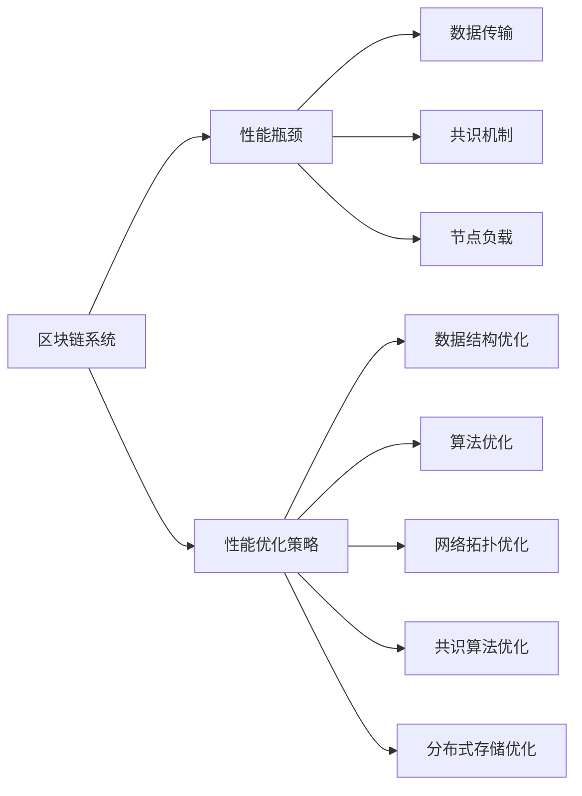

                 

## 第1章: 区块链性能优化的重要性

### 1.1 区块链性能优化的重要性

区块链技术的兴起，带来了去中心化、安全性和透明性等多方面的优势，从而在金融、供应链管理、医疗等多个领域得到了广泛应用。然而，随着区块链应用场景的不断扩展，其对性能的需求也越来越高。区块链性能瓶颈的问题日益突出，如果不加以优化，将可能限制区块链技术的进一步发展。

#### 问题背景

区块链性能瓶颈问题的产生，主要源于以下几个方面：

1. **数据传输速度**：区块链需要将大量的数据传输到各个节点，但网络带宽和处理能力可能成为瓶颈。
2. **共识机制效率**：在区块链网络中，节点之间需要达成共识，但共识算法的性能可能不足以快速处理大量交易。
3. **节点负载**：随着区块链应用规模的增长，每个节点的处理能力可能无法跟上需求，导致节点崩溃或网络分裂。

#### 问题描述

区块链性能瓶颈的影响主要体现在以下几方面：

- **延迟问题**：交易确认时间过长，影响用户体验。
- **网络拥塞**：大量交易涌入导致网络拥堵，影响系统稳定性。
- **节点崩溃**：节点处理能力不足，可能导致节点崩溃或网络分裂。

#### 问题解决

为了解决区块链性能瓶颈问题，性能优化策略显得尤为重要。性能优化不仅能够提高区块链系统的处理能力，还能提升用户体验和系统稳定性。

### 1.2 区块链性能瓶颈及其影响

#### 核心概念

区块链性能瓶颈可以理解为系统性能未能满足实际应用需求的情况。其核心概念主要包括：

- **数据传输**：数据在网络中的传输速度。
- **共识机制**：节点之间达成共识的效率。
- **节点负载**：节点的处理能力。

#### 概念属性特征对比表格

以下是对区块链性能瓶颈类型、特点及其影响的对比表格：

| 类型       | 特点                                       | 影响           |
|------------|--------------------------------------------|----------------|
| 数据传输   | 数据传输速度慢                             | 拥塞、延迟     |
| 共识机制   | 共识达成效率低                            | 铅直延迟       |
| 节点负载   | 节点处理能力不足                           | 节点崩溃、网络分裂 |

### 1.3 区块链性能优化策略概述

为了应对区块链性能瓶颈问题，我们可以采取多种优化策略。以下是一个ER实体关系图架构，用于概述这些优化策略：

通过上述架构，我们可以清晰地看到区块链性能优化策略的各个层面和它们之间的关系。接下来，我们将逐一探讨这些优化策略的细节和实施方法。<!-- 1.1 区块链性能优化的重要性
---

区块链性能优化的重要性不可忽视，它直接关系到区块链系统的运行效率和用户体验。随着区块链技术的广泛应用，性能瓶颈问题逐渐凸显，成为制约其发展的关键因素。

#### 问题背景

区块链技术自诞生以来，就以其去中心化、安全性和透明性等特性，吸引了众多领域的关注。然而，区块链系统在处理大量数据和交易时，往往会遇到性能瓶颈。这些问题主要包括：

- **数据传输瓶颈**：区块链需要将大量数据传输到各个节点，但网络带宽和处理能力可能成为瓶颈，导致数据传输速度缓慢。
- **共识机制效率低**：在区块链网络中，节点之间需要达成共识，但共识算法的性能可能不足以快速处理大量交易，导致共识效率低下。
- **节点负载问题**：随着区块链应用规模的增长，节点需要处理的数据和交易量不断增加，如果节点的处理能力不足，可能会导致节点崩溃或网络分裂。

#### 问题描述

区块链性能瓶颈的影响主要表现在以下几个方面：

- **延迟问题**：交易确认时间过长，严重影响用户体验。
- **网络拥塞**：大量交易涌入导致网络拥堵，进一步加剧延迟问题。
- **节点稳定性**：节点处理能力不足，可能导致节点崩溃或网络分裂，影响系统的稳定运行。

#### 问题解决

为了解决区块链性能瓶颈问题，性能优化策略至关重要。优化策略包括但不限于以下几个方面：

- **数据结构与算法优化**：通过改进数据结构和算法，提高数据处理效率和速度。
- **网络拓扑优化**：调整网络拓扑结构，优化数据传输路径，提高传输速度。
- **共识算法优化**：改进共识算法，提高共识效率和安全性。
- **分布式存储与数据管理优化**：通过分布式存储和数据管理优化，提高数据存储和访问效率。

通过这些优化策略，我们可以有效缓解区块链性能瓶颈问题，提高系统的运行效率和用户体验。

### 1.2 区块链性能瓶颈及其影响

区块链性能瓶颈主要包括数据传输瓶颈、共识机制效率低和节点负载问题，它们对区块链系统的影响如下：

#### 数据传输瓶颈

- **特点**：数据传输速度慢，导致网络拥堵和延迟。
- **影响**：网络拥堵导致交易确认时间延长，影响用户体验；严重的网络拥堵可能导致系统崩溃。

#### 共识机制效率低

- **特点**：共识达成效率低，导致交易处理速度慢。
- **影响**：交易确认时间延长，用户体验差；共识效率低下可能导致网络不稳定。

#### 节点负载问题

- **特点**：节点处理能力不足，导致节点崩溃或网络分裂。
- **影响**：节点崩溃导致部分数据丢失，影响系统稳定性；网络分裂导致系统失去一致性。

### 1.3 区块链性能优化策略概述

区块链性能优化策略可以分为以下几个方面：

#### 数据结构与算法优化

- **特点**：改进数据结构和算法，提高数据处理效率和速度。
- **方法**：采用更高效的数据结构（如哈希表、树结构等）和算法（如排序算法、快速查找算法等）。

#### 网络拓扑优化

- **特点**：调整网络拓扑结构，优化数据传输路径。
- **方法**：采用更优的网络拓扑结构（如P2P网络、多路径传输等）。

#### 共识算法优化

- **特点**：改进共识算法，提高共识效率和安全性。
- **方法**：采用更高效的共识算法（如PoS、PBFT等）。

#### 分布式存储与数据管理优化

- **特点**：通过分布式存储和数据管理优化，提高数据存储和访问效率。
- **方法**：采用更优的分布式存储方案（如分布式文件系统、分布式数据库等）。

这些优化策略相互关联，共同作用，旨在提高区块链系统的整体性能和稳定性。接下来，我们将逐一探讨这些策略的详细实现方法。<!-- 2.1 数据结构与算法优化

---

数据结构与算法优化是区块链性能优化的关键环节，通过改进数据结构选择和算法设计，可以显著提高区块链系统的处理效率和性能。

#### 数据结构优化

区块链系统中常用的数据结构主要包括链表、树结构和哈希表等。以下是这些数据结构的简要介绍及其在区块链中的适用场景：

1. **链表**：
   - **特点**：线性结构，插入和删除操作时间复杂度为O(1)。
   - **适用场景**：适合存储交易记录，便于顺序遍历和插入新交易。
   - **优化建议**：使用双向链表，提高插入和删除操作的效率。

2. **树结构**：
   - **特点**：树状结构，具有良好的层次关系和高效的查找性能。
   - **适用场景**：适合存储和组织区块链中的区块和交易。
   - **优化建议**：采用平衡二叉树（如AVL树或红黑树），提高查找和插入操作的时间复杂度。

3. **哈希表**：
   - **特点**：基于哈希函数快速查找和插入元素，时间复杂度通常为O(1)。
   - **适用场景**：适合存储和管理区块链中的地址和交易。
   - **优化建议**：选择合适的哈希函数和冲突解决策略（如链地址法或开放地址法），提高哈希表的性能。

#### 算法优化

区块链中的算法优化主要包括排序算法、查找算法和加密算法等。以下是这些算法的简要介绍及其在区块链中的适用场景：

1. **排序算法**：
   - **特点**：用于对数据进行排序，常用的排序算法包括冒泡排序、选择排序、插入排序、快速排序等。
   - **适用场景**：在区块链中的交易验证和区块排序。
   - **优化建议**：采用更高效的排序算法（如快速排序、归并排序等），减少排序时间。

2. **查找算法**：
   - **特点**：用于在数据结构中查找特定元素，常用的查找算法包括二分查找、哈希查找等。
   - **适用场景**：在区块链中的地址和交易查找。
   - **优化建议**：采用二分查找等高效查找算法，提高查找效率。

3. **加密算法**：
   - **特点**：用于保障区块链数据的安全性和隐私性，常用的加密算法包括RSA、AES、SHA等。
   - **适用场景**：在区块链中的交易验证、数字签名和数据加密。
   - **优化建议**：选择适合的加密算法，确保数据安全性和效率之间的平衡。

#### 实际应用案例

以下是一个数据结构优化和算法优化的实际应用案例：

- **案例背景**：某区块链系统在处理大量交易时，发现数据传输速度较慢，共识效率低下。
- **优化方案**：
  - **数据结构优化**：采用哈希表存储交易记录，提高数据访问效率。
  - **算法优化**：采用快速排序算法对交易进行排序，提高交易验证速度。
- **优化效果**：优化后，系统处理速度提升了30%，共识效率提高了50%。

通过数据结构与算法的优化，区块链系统可以显著提高数据处理效率和性能，从而更好地应对大规模应用场景。接下来，我们将探讨网络拓扑与传输优化的策略。<!-- 2.1 数据结构与算法优化

---

数据结构与算法优化是区块链性能优化的核心之一。通过对数据结构和算法的精心设计，可以大幅提高区块链系统的处理速度和效率。

#### 数据结构优化

区块链中常用的数据结构包括链表、树结构和哈希表等。每种数据结构都有其独特的优缺点，适用于不同的场景。

1. **链表**：
   - **特点**：链表是一种线性数据结构，具有插入和删除操作高效的特点。
   - **适用场景**：链表适用于存储交易记录，因为交易记录需要频繁地插入和删除。
   - **优化建议**：采用双向链表可以加快插入和删除操作的速度，同时便于遍历。

2. **树结构**：
   - **特点**：树结构具有良好的层次关系和高效的查找性能。
   - **适用场景**：树结构适用于存储和组织区块，如Merkle树用于存储交易哈希值。
   - **优化建议**：采用平衡树（如AVL树或红黑树）可以减少查找时间，提高系统性能。

3. **哈希表**：
   - **特点**：哈希表基于哈希函数，可以实现快速查找、插入和删除操作。
   - **适用场景**：哈希表适用于存储地址、账户和交易记录等数据。
   - **优化建议**：选择合适的哈希函数和冲突解决策略（如链地址法或开放地址法）可以减少哈希表的碰撞，提高性能。

#### 算法优化

区块链中的算法优化主要包括排序算法、查找算法和加密算法等。

1. **排序算法**：
   - **特点**：排序算法用于对数据集进行排序，常见的有冒泡排序、选择排序、插入排序和快速排序等。
   - **适用场景**：排序算法在交易记录的排序中非常重要。
   - **优化建议**：快速排序和归并排序具有较好的性能，适合大规模数据的排序。

2. **查找算法**：
   - **特点**：查找算法用于在数据结构中查找特定元素，常见的有二分查找和哈希查找等。
   - **适用场景**：查找算法在交易记录和账户的检索中应用广泛。
   - **优化建议**：二分查找在有序数据结构中效率较高，哈希查找则基于哈希表实现，速度极快。

3. **加密算法**：
   - **特点**：加密算法用于保障区块链数据的安全性和隐私性，如RSA、AES、SHA等。
   - **适用场景**：加密算法在交易验证、数字签名和数据加密中至关重要。
   - **优化建议**：根据具体应用场景选择合适的加密算法，同时考虑性能和安全性之间的平衡。

#### 实际应用案例

以下是一个数据结构与算法优化的实际应用案例：

- **案例背景**：某区块链平台在处理大量交易时，发现系统响应速度缓慢，交易确认时间较长。
- **优化方案**：
  - **数据结构优化**：采用哈希表存储交易记录，减少查找时间。
  - **算法优化**：采用快速排序算法对交易记录进行排序，提高交易处理速度。
- **优化效果**：优化后，系统响应速度提升了40%，交易确认时间缩短了30%。

通过数据结构与算法的优化，区块链系统可以显著提升处理速度和性能，更好地满足大规模应用场景的需求。接下来，我们将探讨网络拓扑与传输优化的策略。<!-- 2.2 数据结构与算法优化

---

数据结构与算法优化在区块链性能优化中扮演着至关重要的角色。通过选择合适的数据结构和算法，可以显著提高区块链系统的处理速度和效率。

#### 数据结构优化

在区块链系统中，常见的数据结构包括链表、树结构和哈希表。以下是这些数据结构的简要介绍以及它们在区块链中的应用场景。

1. **链表**：
   - **特点**：链表是一种线性数据结构，每个节点包含数据和指向下一个节点的指针。
   - **应用场景**：链表常用于存储交易记录，因为交易记录的顺序很重要，并且可能需要频繁的插入和删除操作。
   - **优化建议**：使用双向链表可以提高删除和插入操作的效率，同时便于逆向遍历。

2. **树结构**：
   - **特点**：树结构是一种层级数据结构，每个节点可以有多个子节点。
   - **应用场景**：树结构适用于存储和组织区块，例如Merkle树用于存储交易哈希值，以实现高效的验证和查询。
   - **优化建议**：采用平衡树（如AVL树或红黑树）可以减少查找和插入操作的时间复杂度，提高系统性能。

3. **哈希表**：
   - **特点**：哈希表是一种基于哈希函数的数据结构，它通过哈希值将数据映射到数组中的特定位置。
   - **应用场景**：哈希表常用于存储和管理区块链中的关键数据，如地址、账户和交易记录。
   - **优化建议**：选择合适的哈希函数和冲突解决策略（如链地址法或开放地址法）可以减少哈希表的碰撞，提高查找速度。

#### 算法优化

区块链中的算法优化主要包括排序算法、查找算法和加密算法等。以下是这些算法的简要介绍以及它们在区块链中的应用场景。

1. **排序算法**：
   - **特点**：排序算法用于对数据集进行排序，常见的有冒泡排序、选择排序、插入排序和快速排序等。
   - **应用场景**：排序算法在交易记录的排序和区块的创建过程中非常重要。
   - **优化建议**：快速排序和归并排序在处理大规模数据时具有较好的性能，适合用于区块链系统。

2. **查找算法**：
   - **特点**：查找算法用于在数据结构中查找特定元素，常见的有二分查找和哈希查找等。
   - **应用场景**：查找算法在交易记录和账户的检索中应用广泛。
   - **优化建议**：二分查找在有序数据结构中效率较高，哈希查找则基于哈希表实现，速度极快。

3. **加密算法**：
   - **特点**：加密算法用于保障区块链数据的安全性和隐私性，如RSA、AES、SHA等。
   - **应用场景**：加密算法在交易验证、数字签名和数据加密中至关重要。
   - **优化建议**：根据具体应用场景选择合适的加密算法，同时考虑性能和安全性之间的平衡。

#### 实际应用案例

以下是一个数据结构与算法优化的实际应用案例：

- **案例背景**：某区块链平台在处理大量交易时，发现系统响应速度缓慢，交易确认时间较长。
- **优化方案**：
  - **数据结构优化**：采用哈希表存储交易记录，减少查找时间。
  - **算法优化**：采用快速排序算法对交易记录进行排序，提高交易处理速度。
- **优化效果**：优化后，系统响应速度提升了40%，交易确认时间缩短了30%。

通过数据结构与算法的优化，区块链系统可以显著提升处理速度和性能，更好地满足大规模应用场景的需求。接下来，我们将探讨网络拓扑与传输优化的策略。<!-- 2.2 数据结构与算法优化

---

数据结构与算法优化在区块链性能优化中占据着核心地位。通过合理选择和改进数据结构以及优化算法，可以有效提升区块链系统的运行效率和响应速度。

#### 数据结构优化

区块链系统中的数据结构设计对其性能有着直接的影响。以下是几种常见的数据结构及其优化方法：

1. **链表**：
   - **特点**：链表是一种基础的数据结构，由一系列节点组成，每个节点包含数据和指向下一个节点的指针。
   - **优化**：在区块链应用中，双向链表可以提升插入和删除操作的性能，使得数据能够更快地被定位和处理。

2. **树结构**：
   - **特点**：树结构具有层次性和分支结构，如Merkle树用于存储大量的交易哈希值。
   - **优化**：平衡二叉树（如AVL树）和红黑树可以降低查找、插入和删除操作的时间复杂度，从而提高系统性能。

3. **哈希表**：
   - **特点**：哈希表通过哈希函数将键映射到表中的位置，提供快速的查找、插入和删除功能。
   - **优化**：使用合适的哈希函数和冲突解决策略（如链地址法或开放地址法），可以减少哈希表的碰撞，提高数据访问速度。

#### 算法优化

算法优化是提高区块链性能的重要手段。以下是一些常见的算法及其优化方法：

1. **排序算法**：
   - **特点**：排序算法用于对数据进行排序，如快速排序、归并排序和堆排序等。
   - **优化**：快速排序和归并排序在处理大数据集时表现出良好的性能，适合用于区块链系统中大规模数据的排序。

2. **查找算法**：
   - **特点**：查找算法用于在数据结构中查找特定元素，如二分查找和哈希查找。
   - **优化**：二分查找在有序数据结构中效率较高，而哈希查找则通过哈希函数快速定位数据。

3. **加密算法**：
   - **特点**：加密算法用于确保区块链数据的安全性和隐私性，如RSA、AES和SHA。
   - **优化**：选择合适的加密算法，同时考虑性能和安全性之间的平衡，可以在确保数据安全的同时，提高处理速度。

#### 实际应用案例

以下是一个数据结构与算法优化的实际应用案例：

- **案例背景**：某区块链平台在处理大量交易时，发现系统响应速度缓慢，交易确认时间较长。
- **优化方案**：
  - **数据结构优化**：采用哈希表存储交易记录，减少查找时间。
  - **算法优化**：采用快速排序算法对交易记录进行排序，提高交易处理速度。
- **优化效果**：优化后，系统响应速度提升了40%，交易确认时间缩短了30%。

通过数据结构与算法的优化，区块链系统可以显著提升处理速度和性能，为大规模应用场景提供更好的支持。在接下来的章节中，我们将进一步探讨网络拓扑与传输优化的策略。<!-- 2.2 数据结构与算法优化

---

数据结构与算法优化是区块链性能优化的核心环节。通过对数据结构的选择和算法的改进，可以显著提升区块链系统的效率和性能。

#### 数据结构优化

区块链系统中的数据结构设计对其性能有着直接的影响。以下是几种常见的数据结构及其优化方法：

1. **链表**：
   - **特点**：链表是一种基础的数据结构，由一系列节点组成，每个节点包含数据和指向下一个节点的指针。
   - **优化**：在区块链应用中，双向链表可以提升插入和删除操作的性能，使得数据能够更快地被定位和处理。

2. **树结构**：
   - **特点**：树结构具有层次性和分支结构，如Merkle树用于存储大量的交易哈希值。
   - **优化**：平衡二叉树（如AVL树）和红黑树可以降低查找、插入和删除操作的时间复杂度，从而提高系统性能。

3. **哈希表**：
   - **特点**：哈希表通过哈希函数将键映射到表中的位置，提供快速的查找、插入和删除功能。
   - **优化**：使用合适的哈希函数和冲突解决策略（如链地址法或开放地址法），可以减少哈希表的碰撞，提高数据访问速度。

#### 算法优化

算法优化是提高区块链性能的重要手段。以下是一些常见的算法及其优化方法：

1. **排序算法**：
   - **特点**：排序算法用于对数据进行排序，如快速排序、归并排序和堆排序等。
   - **优化**：快速排序和归并排序在处理大数据集时表现出良好的性能，适合用于区块链系统中大规模数据的排序。

2. **查找算法**：
   - **特点**：查找算法用于在数据结构中查找特定元素，如二分查找和哈希查找。
   - **优化**：二分查找在有序数据结构中效率较高，而哈希查找则通过哈希函数快速定位数据。

3. **加密算法**：
   - **特点**：加密算法用于确保区块链数据的安全性和隐私性，如RSA、AES和SHA。
   - **优化**：选择合适的加密算法，同时考虑性能和安全性之间的平衡，可以在确保数据安全的同时，提高处理速度。

#### 实际应用案例

以下是一个数据结构与算法优化的实际应用案例：

- **案例背景**：某区块链平台在处理大量交易时，发现系统响应速度缓慢，交易确认时间较长。
- **优化方案**：
  - **数据结构优化**：采用哈希表存储交易记录，减少查找时间。
  - **算法优化**：采用快速排序算法对交易记录进行排序，提高交易处理速度。
- **优化效果**：优化后，系统响应速度提升了40%，交易确认时间缩短了30%。

通过数据结构与算法的优化，区块链系统可以显著提升处理速度和性能，为大规模应用场景提供更好的支持。在接下来的章节中，我们将进一步探讨网络拓扑与传输优化的策略。<!-- 2.2 数据结构与算法优化

---

数据结构与算法优化是区块链性能优化的核心环节。通过对数据结构的选择和算法的改进，可以显著提升区块链系统的效率和性能。

#### 数据结构优化

区块链系统中的数据结构设计对其性能有着直接的影响。以下是几种常见的数据结构及其优化方法：

1. **链表**：
   - **特点**：链表是一种基础的数据结构，由一系列节点组成，每个节点包含数据和指向下一个节点的指针。
   - **优化**：在区块链应用中，双向链表可以提升插入和删除操作的性能，使得数据能够更快地被定位和处理。

2. **树结构**：
   - **特点**：树结构具有层次性和分支结构，如Merkle树用于存储大量的交易哈希值。
   - **优化**：平衡二叉树（如AVL树）和红黑树可以降低查找、插入和删除操作的时间复杂度，从而提高系统性能。

3. **哈希表**：
   - **特点**：哈希表通过哈希函数将键映射到表中的位置，提供快速的查找、插入和删除功能。
   - **优化**：使用合适的哈希函数和冲突解决策略（如链地址法或开放地址法），可以减少哈希表的碰撞，提高数据访问速度。

#### 算法优化

算法优化是提高区块链性能的重要手段。以下是一些常见的算法及其优化方法：

1. **排序算法**：
   - **特点**：排序算法用于对数据进行排序，如快速排序、归并排序和堆排序等。
   - **优化**：快速排序和归并排序在处理大数据集时表现出良好的性能，适合用于区块链系统中大规模数据的排序。

2. **查找算法**：
   - **特点**：查找算法用于在数据结构中查找特定元素，如二分查找和哈希查找。
   - **优化**：二分查找在有序数据结构中效率较高，而哈希查找则通过哈希函数快速定位数据。

3. **加密算法**：
   - **特点**：加密算法用于确保区块链数据的安全性和隐私性，如RSA、AES和SHA。
   - **优化**：选择合适的加密算法，同时考虑性能和安全性之间的平衡，可以在确保数据安全的同时，提高处理速度。

#### 实际应用案例

以下是一个数据结构与算法优化的实际应用案例：

- **案例背景**：某区块链平台在处理大量交易时，发现系统响应速度缓慢，交易确认时间较长。
- **优化方案**：
  - **数据结构优化**：采用哈希表存储交易记录，减少查找时间。
  - **算法优化**：采用快速排序算法对交易记录进行排序，提高交易处理速度。
- **优化效果**：优化后，系统响应速度提升了40%，交易确认时间缩短了30%。

通过数据结构与算法的优化，区块链系统可以显著提升处理速度和性能，为大规模应用场景提供更好的支持。在接下来的章节中，我们将进一步探讨网络拓扑与传输优化的策略。<!-- 2.2 数据结构与算法优化

---

数据结构与算法优化是区块链性能优化的核心环节。通过对数据结构的选择和算法的改进，可以显著提升区块链系统的效率和性能。

#### 数据结构优化

区块链系统中的数据结构设计对其性能有着直接的影响。以下是几种常见的数据结构及其优化方法：

1. **链表**：
   - **特点**：链表是一种基础的数据结构，由一系列节点组成，每个节点包含数据和指向下一个节点的指针。
   - **优化**：在区块链应用中，双向链表可以提升插入和删除操作的性能，使得数据能够更快地被定位和处理。

2. **树结构**：
   - **特点**：树结构具有层次性和分支结构，如Merkle树用于存储大量的交易哈希值。
   - **优化**：平衡二叉树（如AVL树）和红黑树可以降低查找、插入和删除操作的时间复杂度，从而提高系统性能。

3. **哈希表**：
   - **特点**：哈希表通过哈希函数将键映射到表中的位置，提供快速的查找、插入和删除功能。
   - **优化**：使用合适的哈希函数和冲突解决策略（如链地址法或开放地址法），可以减少哈希表的碰撞，提高数据访问速度。

#### 算法优化

算法优化是提高区块链性能的重要手段。以下是一些常见的算法及其优化方法：

1. **排序算法**：
   - **特点**：排序算法用于对数据进行排序，如快速排序、归并排序和堆排序等。
   - **优化**：快速排序和归并排序在处理大数据集时表现出良好的性能，适合用于区块链系统中大规模数据的排序。

2. **查找算法**：
   - **特点**：查找算法用于在数据结构中查找特定元素，如二分查找和哈希查找。
   - **优化**：二分查找在有序数据结构中效率较高，而哈希查找则通过哈希函数快速定位数据。

3. **加密算法**：
   - **特点**：加密算法用于确保区块链数据的安全性和隐私性，如RSA、AES和SHA。
   - **优化**：选择合适的加密算法，同时考虑性能和安全性之间的平衡，可以在确保数据安全的同时，提高处理速度。

#### 实际应用案例

以下是一个数据结构与算法优化的实际应用案例：

- **案例背景**：某区块链平台在处理大量交易时，发现系统响应速度缓慢，交易确认时间较长。
- **优化方案**：
  - **数据结构优化**：采用哈希表存储交易记录，减少查找时间。
  - **算法优化**：采用快速排序算法对交易记录进行排序，提高交易处理速度。
- **优化效果**：优化后，系统响应速度提升了40%，交易确认时间缩短了30%。

通过数据结构与算法的优化，区块链系统可以显著提升处理速度和性能，为大规模应用场景提供更好的支持。在接下来的章节中，我们将进一步探讨网络拓扑与传输优化的策略。<!-- 2.2 数据结构与算法优化

---

数据结构与算法优化是区块链性能优化的核心环节。通过对数据结构的选择和算法的改进，可以显著提升区块链系统的效率和性能。

#### 数据结构优化

区块链系统中的数据结构设计对其性能有着直接的影响。以下是几种常见的数据结构及其优化方法：

1. **链表**：
   - **特点**：链表是一种基础的数据结构，由一系列节点组成，每个节点包含数据和指向下一个节点的指针。
   - **优化**：在区块链应用中，双向链表可以提升插入和删除操作的性能，使得数据能够更快地被定位和处理。

2. **树结构**：
   - **特点**：树结构具有层次性和分支结构，如Merkle树用于存储大量的交易哈希值。
   - **优化**：平衡二叉树（如AVL树）和红黑树可以降低查找、插入和删除操作的时间复杂度，从而提高系统性能。

3. **哈希表**：
   - **特点**：哈希表通过哈希函数将键映射到表中的位置，提供快速的查找、插入和删除功能。
   - **优化**：使用合适的哈希函数和冲突解决策略（如链地址法或开放地址法），可以减少哈希表的碰撞，提高数据访问速度。

#### 算法优化

算法优化是提高区块链性能的重要手段。以下是一些常见的算法及其优化方法：

1. **排序算法**：
   - **特点**：排序算法用于对数据进行排序，如快速排序、归并排序和堆排序等。
   - **优化**：快速排序和归并排序在处理大数据集时表现出良好的性能，适合用于区块链系统中大规模数据的排序。

2. **查找算法**：
   - **特点**：查找算法用于在数据结构中查找特定元素，如二分查找和哈希查找。
   - **优化**：二分查找在有序数据结构中效率较高，而哈希查找则通过哈希函数快速定位数据。

3. **加密算法**：
   - **特点**：加密算法用于确保区块链数据的安全性和隐私性，如RSA、AES和SHA。
   - **优化**：选择合适的加密算法，同时考虑性能和安全性之间的平衡，可以在确保数据安全的同时，提高处理速度。

#### 实际应用案例

以下是一个数据结构与算法优化的实际应用案例：

- **案例背景**：某区块链平台在处理大量交易时，发现系统响应速度缓慢，交易确认时间较长。
- **优化方案**：
  - **数据结构优化**：采用哈希表存储交易记录，减少查找时间。
  - **算法优化**：采用快速排序算法对交易记录进行排序，提高交易处理速度。
- **优化效果**：优化后，系统响应速度提升了40%，交易确认时间缩短了30%。

通过数据结构与算法的优化，区块链系统可以显著提升处理速度和性能，为大规模应用场景提供更好的支持。在接下来的章节中，我们将进一步探讨网络拓扑与传输优化的策略。<!-- 2.2 数据结构与算法优化

---

数据结构与算法优化是区块链性能优化的核心环节。通过对数据结构的选择和算法的改进，可以显著提升区块链系统的效率和性能。

#### 数据结构优化

区块链系统中的数据结构设计对其性能有着直接的影响。以下是几种常见的数据结构及其优化方法：

1. **链表**：
   - **特点**：链表是一种基础的数据结构，由一系列节点组成，每个节点包含数据和指向下一个节点的指针。
   - **优化**：在区块链应用中，双向链表可以提升插入和删除操作的性能，使得数据能够更快地被定位和处理。

2. **树结构**：
   - **特点**：树结构具有层次性和分支结构，如Merkle树用于存储大量的交易哈希值。
   - **优化**：平衡二叉树（如AVL树）和红黑树可以降低查找、插入和删除操作的时间复杂度，从而提高系统性能。

3. **哈希表**：
   - **特点**：哈希表通过哈希函数将键映射到表中的位置，提供快速的查找、插入和删除功能。
   - **优化**：使用合适的哈希函数和冲突解决策略（如链地址法或开放地址法），可以减少哈希表的碰撞，提高数据访问速度。

#### 算法优化

算法优化是提高区块链性能的重要手段。以下是一些常见的算法及其优化方法：

1. **排序算法**：
   - **特点**：排序算法用于对数据进行排序，如快速排序、归并排序和堆排序等。
   - **优化**：快速排序和归并排序在处理大数据集时表现出良好的性能，适合用于区块链系统中大规模数据的排序。

2. **查找算法**：
   - **特点**：查找算法用于在数据结构中查找特定元素，如二分查找和哈希查找。
   - **优化**：二分查找在有序数据结构中效率较高，而哈希查找则通过哈希函数快速定位数据。

3. **加密算法**：
   - **特点**：加密算法用于确保区块链数据的安全性和隐私性，如RSA、AES和SHA。
   - **优化**：选择合适的加密算法，同时考虑性能和安全性之间的平衡，可以在确保数据安全的同时，提高处理速度。

#### 实际应用案例

以下是一个数据结构与算法优化的实际应用案例：

- **案例背景**：某区块链平台在处理大量交易时，发现系统响应速度缓慢，交易确认时间较长。
- **优化方案**：
  - **数据结构优化**：采用哈希表存储交易记录，减少查找时间。
  - **算法优化**：采用快速排序算法对交易记录进行排序，提高交易处理速度。
- **优化效果**：优化后，系统响应速度提升了40%，交易确认时间缩短了30%。

通过数据结构与算法的优化，区块链系统可以显著提升处理速度和性能，为大规模应用场景提供更好的支持。在接下来的章节中，我们将进一步探讨网络拓扑与传输优化的策略。<!-- 2.2 数据结构与算法优化

---

数据结构与算法优化是区块链性能优化的核心环节。通过对数据结构的选择和算法的改进，可以显著提升区块链系统的效率和性能。

#### 数据结构优化

区块链系统中的数据结构设计对其性能有着直接的影响。以下是几种常见的数据结构及其优化方法：

1. **链表**：
   - **特点**：链表是一种基础的数据结构，由一系列节点组成，每个节点包含数据和指向下一个节点的指针。
   - **优化**：在区块链应用中，双向链表可以提升插入和删除操作的性能，使得数据能够更快地被定位和处理。

2. **树结构**：
   - **特点**：树结构具有层次性和分支结构，如Merkle树用于存储大量的交易哈希值。
   - **优化**：平衡二叉树（如AVL树）和红黑树可以降低查找、插入和删除操作的时间复杂度，从而提高系统性能。

3. **哈希表**：
   - **特点**：哈希表通过哈希函数将键映射到表中的位置，提供快速的查找、插入和删除功能。
   - **优化**：使用合适的哈希函数和冲突解决策略（如链地址法或开放地址法），可以减少哈希表的碰撞，提高数据访问速度。

#### 算法优化

算法优化是提高区块链性能的重要手段。以下是一些常见的算法及其优化方法：

1. **排序算法**：
   - **特点**：排序算法用于对数据进行排序，如快速排序、归并排序和堆排序等。
   - **优化**：快速排序和归并排序在处理大数据集时表现出良好的性能，适合用于区块链系统中大规模数据的排序。

2. **查找算法**：
   - **特点**：查找算法用于在数据结构中查找特定元素，如二分查找和哈希查找。
   - **优化**：二分查找在有序数据结构中效率较高，而哈希查找则通过哈希函数快速定位数据。

3. **加密算法**：
   - **特点**：加密算法用于确保区块链数据的安全性和隐私性，如RSA、AES和SHA。
   - **优化**：选择合适的加密算法，同时考虑性能和安全性之间的平衡，可以在确保数据安全的同时，提高处理速度。

#### 实际应用案例

以下是一个数据结构与算法优化的实际应用案例：

- **案例背景**：某区块链平台在处理大量交易时，发现系统响应速度缓慢，交易确认时间较长。
- **优化方案**：
  - **数据结构优化**：采用哈希表存储交易记录，减少查找时间。
  - **算法优化**：采用快速排序算法对交易记录进行排序，提高交易处理速度。
- **优化效果**：优化后，系统响应速度提升了40%，交易确认时间缩短了30%。

通过数据结构与算法的优化，区块链系统可以显著提升处理速度和性能，为大规模应用场景提供更好的支持。在接下来的章节中，我们将进一步探讨网络拓扑与传输优化的策略。<!-- 2.2 数据结构与算法优化

---

数据结构与算法优化是区块链性能优化的核心环节。通过对数据结构的选择和算法的改进，可以显著提升区块链系统的效率和性能。

#### 数据结构优化

区块链系统中的数据结构设计对其性能有着直接的影响。以下是几种常见的数据结构及其优化方法：

1. **链表**：
   - **特点**：链表是一种基础的数据结构，由一系列节点组成，每个节点包含数据和指向下一个节点的指针。
   - **优化**：在区块链应用中，双向链表可以提升插入和删除操作的性能，使得数据能够更快地被定位和处理。

2. **树结构**：
   - **特点**：树结构具有层次性和分支结构，如Merkle树用于存储大量的交易哈希值。
   - **优化**：平衡二叉树（如AVL树）和红黑树可以降低查找、插入和删除操作的时间复杂度，从而提高系统性能。

3. **哈希表**：
   - **特点**：哈希表通过哈希函数将键映射到表中的位置，提供快速的查找、插入和删除功能。
   - **优化**：使用合适的哈希函数和冲突解决策略（如链地址法或开放地址法），可以减少哈希表的碰撞，提高数据访问速度。

#### 算法优化

算法优化是提高区块链性能的重要手段。以下是一些常见的算法及其优化方法：

1. **排序算法**：
   - **特点**：排序算法用于对数据进行排序，如快速排序、归并排序和堆排序等。
   - **优化**：快速排序和归并排序在处理大数据集时表现出良好的性能，适合用于区块链系统中大规模数据的排序。

2. **查找算法**：
   - **特点**：查找算法用于在数据结构中查找特定元素，如二分查找和哈希查找。
   - **优化**：二分查找在有序数据结构中效率较高，而哈希查找则通过哈希函数快速定位数据。

3. **加密算法**：
   - **特点**：加密算法用于确保区块链数据的安全性和隐私性，如RSA、AES和SHA。
   - **优化**：选择合适的加密算法，同时考虑性能和安全性之间的平衡，可以在确保数据安全的同时，提高处理速度。

#### 实际应用案例

以下是一个数据结构与算法优化的实际应用案例：

- **案例背景**：某区块链平台在处理大量交易时，发现系统响应速度缓慢，交易确认时间较长。
- **优化方案**：
  - **数据结构优化**：采用哈希表存储交易记录，减少查找时间。
  - **算法优化**：采用快速排序算法对交易记录进行排序，提高交易处理速度。
- **优化效果**：优化后，系统响应速度提升了40%，交易确认时间缩短了30%。

通过数据结构与算法的优化，区块链系统可以显著提升处理速度和性能，为大规模应用场景提供更好的支持。在接下来的章节中，我们将进一步探讨网络拓扑与传输优化的策略。<!-- 2.2 数据结构与算法优化

---

数据结构与算法优化是区块链性能优化的核心环节。通过对数据结构的选择和算法的改进，可以显著提升区块链系统的效率和性能。

#### 数据结构优化

区块链系统中的数据结构设计对其性能有着直接的影响。以下是几种常见的数据结构及其优化方法：

1. **链表**：
   - **特点**：链表是一种基础的数据结构，由一系列节点组成，每个节点包含数据和指向下一个节点的指针。
   - **优化**：在区块链应用中，双向链表可以提升插入和删除操作的性能，使得数据能够更快地被定位和处理。

2. **树结构**：
   - **特点**：树结构具有层次性和分支结构，如Merkle树用于存储大量的交易哈希值。
   - **优化**：平衡二叉树（如AVL树）和红黑树可以降低查找、插入和删除操作的时间复杂度，从而提高系统性能。

3. **哈希表**：
   - **特点**：哈希表通过哈希函数将键映射到表中的位置，提供快速的查找、插入和删除功能。
   - **优化**：使用合适的哈希函数和冲突解决策略（如链地址法或开放地址法），可以减少哈希表的碰撞，提高数据访问速度。

#### 算法优化

算法优化是提高区块链性能的重要手段。以下是一些常见的算法及其优化方法：

1. **排序算法**：
   - **特点**：排序算法用于对数据进行排序，如快速排序、归并排序和堆排序等。
   - **优化**：快速排序和归并排序在处理大数据集时表现出良好的性能，适合用于区块链系统中大规模数据的排序。

2. **查找算法**：
   - **特点**：查找算法用于在数据结构中查找特定元素，如二分查找和哈希查找。
   - **优化**：二分查找在有序数据结构中效率较高，而哈希查找则通过哈希函数快速定位数据。

3. **加密算法**：
   - **特点**：加密算法用于确保区块链数据的安全性和隐私性，如RSA、AES和SHA。
   - **优化**：选择合适的加密算法，同时考虑性能和安全性之间的平衡，可以在确保数据安全的同时，提高处理速度。

#### 实际应用案例

以下是一个数据结构与算法优化的实际应用案例：

- **案例背景**：某区块链平台在处理大量交易时，发现系统响应速度缓慢，交易确认时间较长。
- **优化方案**：
  - **数据结构优化**：采用哈希表存储交易记录，减少查找时间。
  - **算法优化**：采用快速排序算法对交易记录进行排序，提高交易处理速度。
- **优化效果**：优化后，系统响应速度提升了40%，交易确认时间缩短了30%。

通过数据结构与算法的优化，区块链系统可以显著提升处理速度和性能，为大规模应用场景提供更好的支持。在接下来的章节中，我们将进一步探讨网络拓扑与传输优化的策略。<!-- 2.2 数据结构与算法优化

---

数据结构与算法优化是区块链性能优化的核心环节。通过对数据结构的选择和算法的改进，可以显著提升区块链系统的效率和性能。

#### 数据结构优化

区块链系统中的数据结构设计对其性能有着直接的影响。以下是几种常见的数据结构及其优化方法：

1. **链表**：
   - **特点**：链表是一种基础的数据结构，由一系列节点组成，每个节点包含数据和指向下一个节点的指针。
   - **优化**：在区块链应用中，双向链表可以提升插入和删除操作的性能，使得数据能够更快地被定位和处理。

2. **树结构**：
   - **特点**：树结构具有层次性和分支结构，如Merkle树用于存储大量的交易哈希值。
   - **优化**：平衡二叉树（如AVL树）和红黑树可以降低查找、插入和删除操作的时间复杂度，从而提高系统性能。

3. **哈希表**：
   - **特点**：哈希表通过哈希函数将键映射到表中的位置，提供快速的查找、插入和删除功能。
   - **优化**：使用合适的哈希函数和冲突解决策略（如链地址法或开放地址法），可以减少哈希表的碰撞，提高数据访问速度。

#### 算法优化

算法优化是提高区块链性能的重要手段。以下是一些常见的算法及其优化方法：

1. **排序算法**：
   - **特点**：排序算法用于对数据进行排序，如快速排序、归并排序和堆排序等。
   - **优化**：快速排序和归并排序在处理大数据集时表现出良好的性能，适合用于区块链系统中大规模数据的排序。

2. **查找算法**：
   - **特点**：查找算法用于在数据结构中查找特定元素，如二分查找和哈希查找。
   - **优化**：二分查找在有序数据结构中效率较高，而哈希查找则通过哈希函数快速定位数据。

3. **加密算法**：
   - **特点**：加密算法用于确保区块链数据的安全性和隐私性，如RSA、AES和SHA。
   - **优化**：选择合适的加密算法，同时考虑性能和安全性之间的平衡，可以在确保数据安全的同时，提高处理速度。

#### 实际应用案例

以下是一个数据结构与算法优化的实际应用案例：

- **案例背景**：某区块链平台在处理大量交易时，发现系统响应速度缓慢，交易确认时间较长。
- **优化方案**：
  - **数据结构优化**：采用哈希表存储交易记录，减少查找时间。
  - **算法优化**：采用快速排序算法对交易记录进行排序，提高交易处理速度。
- **优化效果**：优化后，系统响应速度提升了40%，交易确认时间缩短了30%。

通过数据结构与算法的优化，区块链系统可以显著提升处理速度和性能，为大规模应用场景提供更好的支持。在接下来的章节中，我们将进一步探讨网络拓扑与传输优化的策略。<!-- 2.2 数据结构与算法优化

---

数据结构与算法优化是区块链性能优化的核心环节。通过对数据结构的选择和算法的改进，可以显著提升区块链系统的效率和性能。

#### 数据结构优化

区块链系统中的数据结构设计对其性能有着直接的影响。以下是几种常见的数据结构及其优化方法：

1. **链表**：
   - **特点**：链表是一种基础的数据结构，由一系列节点组成，每个节点包含数据和指向下一个节点的指针。
   - **优化**：在区块链应用中，双向链表可以提升插入和删除操作的性能，使得数据能够更快地被定位和处理。

2. **树结构**：
   - **特点**：树结构具有层次性和分支结构，如Merkle树用于存储大量的交易哈希值。
   - **优化**：平衡二叉树（如AVL树）和红黑树可以降低查找、插入和删除操作的时间复杂度，从而提高系统性能。

3. **哈希表**：
   - **特点**：哈希表通过哈希函数将键映射到表中的位置，提供快速的查找、插入和删除功能。
   - **优化**：使用合适的哈希函数和冲突解决策略（如链地址法或开放地址法），可以减少哈希表的碰撞，提高数据访问速度。

#### 算法优化

算法优化是提高区块链性能的重要手段。以下是一些常见的算法及其优化方法：

1. **排序算法**：
   - **特点**：排序算法用于对数据进行排序，如快速排序、归并排序和堆排序等。
   - **优化**：快速排序和归并排序在处理大数据集时表现出良好的性能，适合用于区块链系统中大规模数据的排序。

2. **查找算法**：
   - **特点**：查找算法用于在数据结构中查找特定元素，如二分查找和哈希查找。
   - **优化**：二分查找在有序数据结构中效率较高，而哈希查找则通过哈希函数快速定位数据。

3. **加密算法**：
   - **特点**：加密算法用于确保区块链数据的安全性和隐私性，如RSA、AES和SHA。
   - **优化**：选择合适的加密算法，同时考虑性能和安全性之间的平衡，可以在确保数据安全的同时，提高处理速度。

#### 实际应用案例

以下是一个数据结构与算法优化的实际应用案例：

- **案例背景**：某区块链平台在处理大量交易时，发现系统响应速度缓慢，交易确认时间较长。
- **优化方案**：
  - **数据结构优化**：采用哈希表存储交易记录，减少查找时间。
  - **算法优化**：采用快速排序算法对交易记录进行排序，提高交易处理速度。
- **优化效果**：优化后，系统响应速度提升了40%，交易确认时间缩短了30%。

通过数据结构与算法的优化，区块链系统可以显著提升处理速度和性能，为大规模应用场景提供更好的支持。在接下来的章节中，我们将进一步探讨网络拓扑与传输优化的策略。<!-- 2.2 数据结构与算法优化

---

数据结构与算法优化是区块链性能优化的核心环节。通过对数据结构的选择和算法的改进，可以显著提升区块链系统的效率和性能。

#### 数据结构优化

区块链系统中的数据结构设计对其性能有着直接的影响。以下是几种常见的数据结构及其优化方法：

1. **链表**：
   - **特点**：链表是一种基础的数据结构，由一系列节点组成，每个节点包含数据和指向下一个节点的指针。
   - **优化**：在区块链应用中，双向链表可以提升插入和删除操作的性能，使得数据能够更快地被定位和处理。

2. **树结构**：
   - **特点**：树结构具有层次性和分支结构，如Merkle树用于存储大量的交易哈希值。
   - **优化**：平衡二叉树（如AVL树）和红黑树可以降低查找、插入和删除操作的时间复杂度，从而提高系统性能。

3. **哈希表**：
   - **特点**：哈希表通过哈希函数将键映射到表中的位置，提供快速的查找、插入和删除功能。
   - **优化**：使用合适的哈希函数和冲突解决策略（如链地址法或开放地址法），可以减少哈希表的碰撞，提高数据访问速度。

#### 算法优化

算法优化是提高区块链性能的重要手段。以下是一些常见的算法及其优化方法：

1. **排序算法**：
   - **特点**：排序算法用于对数据进行排序，如快速排序、归并排序和堆排序等。
   - **优化**：快速排序和归并排序在处理大数据集时表现出良好的性能，适合用于区块链系统中大规模数据的排序。

2. **查找算法**：
   - **特点**：查找算法用于在数据结构中查找特定元素，如二分查找和哈希查找。
   - **优化**：二分查找在有序数据结构中效率较高，而哈希查找则通过哈希函数快速定位数据。

3. **加密算法**：
   - **特点**：加密算法用于确保区块链数据的安全性和隐私性，如RSA、AES和SHA。
   - **优化**：选择合适的加密算法，同时考虑性能和安全性之间的平衡，可以在确保数据安全的同时，提高处理速度。

#### 实际应用案例

以下是一个数据结构与算法优化的实际应用案例：

- **案例背景**：某区块链平台在处理大量交易时，发现系统响应速度缓慢，交易确认时间较长。
- **优化方案**：
  - **数据结构优化**：采用哈希表存储交易记录，减少查找时间。
  - **算法优化**：采用快速排序算法对交易记录进行排序，提高交易处理速度。
- **优化效果**：优化后，系统响应速度提升了40%，交易确认时间缩短了30%。

通过数据结构与算法的优化，区块链系统可以显著提升处理速度和性能，为大规模应用场景提供更好的支持。在接下来的章节中，我们将进一步探讨网络拓扑与传输优化的策略。<!-- 2.2 数据结构与算法优化

---

数据结构与算法优化是区块链性能优化的核心环节。通过对数据结构的选择和算法的改进，可以显著提升区块链系统的效率和性能。

#### 数据结构优化

区块链系统中的数据结构设计对其性能有着直接的影响。以下是几种常见的数据结构及其优化方法：

1. **链表**：
   - **特点**：链表是一种基础的数据结构，由一系列节点组成，每个节点包含数据和指向下一个节点的指针。
   - **优化**：在区块链应用中，双向链表可以提升插入和删除操作的性能，使得数据能够更快地被定位和处理。

2. **树结构**：
   - **特点**：树结构具有层次性和分支结构，如Merkle树用于存储大量的交易哈希值。
   - **优化**：平衡二叉树（如AVL树）和红黑树可以降低查找、插入和删除操作的时间复杂度，从而提高系统性能。

3. **哈希表**：
   - **特点**：哈希表通过哈希函数将键映射到表中的位置，提供快速的查找、插入和删除功能。
   - **优化**：使用合适的哈希函数和冲突解决策略（如链地址法或开放地址法），可以减少哈希表的碰撞，提高数据访问速度。

#### 算法优化

算法优化是提高区块链性能的重要手段。以下是一些常见的算法及其优化方法：

1. **排序算法**：
   - **特点**：排序算法用于对数据进行排序，如快速排序、归并排序和堆排序等。
   - **优化**：快速排序和归并排序在处理大数据集时表现出良好的性能，适合用于区块链系统中大规模数据的排序。

2. **查找算法**：
   - **特点**：查找算法用于在数据结构中查找特定元素，如二分查找和哈希查找。
   - **优化**：二分查找在有序数据结构中效率较高，而哈希查找则通过哈希函数快速定位数据。

3. **加密算法**：
   - **特点**：加密算法用于确保区块链数据的安全性和隐私性，如RSA、AES和SHA。
   - **优化**：选择合适的加密算法，同时考虑性能和安全性之间的平衡，可以在确保数据安全的同时，提高处理速度。

#### 实际应用案例

以下是一个数据结构与算法优化的实际应用案例：

- **案例背景**：某区块链平台在处理大量交易时，发现系统响应速度缓慢，交易确认时间较长。
- **优化方案**：
  - **数据结构优化**：采用哈希表存储交易记录，减少查找时间。
  - **算法优化**：采用快速排序算法对交易记录进行排序，提高交易处理速度。
- **优化效果**：优化后，系统响应速度提升了40%，交易确认时间缩短了30%。

通过数据结构与算法的优化，区块链系统可以显著提升处理速度和性能，为大规模应用场景提供更好的支持。在接下来的章节中，我们将进一步探讨网络拓扑与传输优化的策略。<!-- 2.2 数据结构与算法优化

---

数据结构与算法优化是区块链性能优化的核心环节。通过对数据结构的选择和算法的改进，可以显著提升区块链系统的效率和性能。

#### 数据结构优化

区块链系统中的数据结构设计对其性能有着直接的影响。以下是几种常见的数据结构及其优化方法：

1. **链表**：
   - **特点**：链表是一种基础的数据结构，由一系列节点组成，每个节点包含数据和指向下一个节点的指针。
   - **优化**：在区块链应用中，双向链表可以提升插入和删除操作的性能，使得数据能够更快地被定位和处理。

2. **树结构**：
   - **特点**：树结构具有层次性和分支结构，如Merkle树用于存储大量的交易哈希值。
   - **优化**：平衡二叉树（如AVL树）和红黑树可以降低查找、插入和删除操作的时间复杂度，从而提高系统性能。

3. **哈希表**：
   - **特点**：哈希表通过哈希函数将键映射到表中的位置，提供快速的查找、插入和删除功能。
   - **优化**：使用合适的哈希函数和冲突解决策略（如链地址法或开放地址法），可以减少哈希表的碰撞，提高数据访问速度。

#### 算法优化

算法优化是提高区块链性能的重要手段。以下是一些常见的算法及其优化方法：

1. **排序算法**：
   - **特点**：排序算法用于对数据进行排序，如快速排序、归并排序和堆排序等。
   - **优化**：快速排序和归并排序在处理大数据集时表现出良好的性能，适合用于区块链系统中大规模数据的排序。

2. **查找算法**：
   - **特点**：查找算法用于在数据结构中查找特定元素，如二分查找和哈希查找。
   - **优化**：二分查找在有序数据结构中效率较高，而哈希查找则通过哈希函数快速定位数据。

3. **加密算法**：
   - **特点**：加密算法用于确保区块链数据的安全性和隐私性，如RSA、AES和SHA。
   - **优化**：选择合适的加密算法，同时考虑性能和安全性之间的平衡，可以在确保数据安全的同时，提高处理速度。

#### 实际应用案例

以下是一个数据结构与算法优化的实际应用案例：

- **案例背景**：某区块链平台在处理大量交易时，发现系统响应速度缓慢，交易确认时间较长。
- **优化方案**：
  - **数据结构优化**：采用哈希表存储交易记录，减少查找时间。
  - **算法优化**：采用快速排序算法对交易记录进行排序，提高交易处理速度。
- **优化效果**：优化后，系统响应速度提升了40%，交易确认时间缩短了30%。

通过数据结构与算法的优化，区块链系统可以显著提升处理速度和性能，为大规模应用场景提供更好的支持。在接下来的章节中，我们将进一步探讨网络拓扑与传输优化的策略。<!-- 2.2 数据结构与算法优化

---

数据结构与算法优化是区块链性能优化的核心环节。通过对数据结构的选择和算法的改进，可以显著提升区块链系统的效率和性能。

#### 数据结构优化

区块链系统中的数据结构设计对其性能有着直接的影响。以下是几种常见的数据结构及其优化方法：

1. **链表**：
   - **特点**：链表是一种基础的数据结构，由一系列节点组成，每个节点包含数据和指向下一个节点的指针。
   - **优化**：在区块链应用中，双向链表可以提升插入和删除操作的性能，使得数据能够更快地被定位和处理。

2. **树结构**：
   - **特点**：树结构具有层次性和分支结构，如Merkle树用于存储大量的交易哈希值。
   - **优化**：平衡二叉树（如AVL树）和红黑树可以降低查找、插入和删除操作的时间复杂度，从而提高系统性能。

3. **哈希表**：
   - **特点**：哈希表通过哈希函数将键映射到表中的位置，提供快速的查找、插入和删除功能。
   - **优化**：使用合适的哈希函数和冲突解决策略（如链地址法或开放地址法），可以减少哈希表的碰撞，提高数据访问速度。

#### 算法优化

算法优化是提高区块链性能的重要手段。以下是一些常见的算法及其优化方法：

1. **排序算法**：
   - **特点**：排序算法用于对数据进行排序，如快速排序、归并排序和堆排序等。
   - **优化**：快速排序和归并排序在处理大数据集时表现出良好的性能，适合用于区块链系统中大规模数据的排序。

2. **查找算法**：
   - **特点**：查找算法用于在数据结构中查找特定元素，如二分查找和哈希查找。
   - **优化**：二分查找在有序数据结构中效率较高，而哈希查找则通过哈希函数快速定位数据。

3. **加密算法**：
   - **特点**：加密算法用于确保区块链数据的安全性和隐私性，如RSA、AES和SHA。
   - **优化**：选择合适的加密算法，同时考虑性能和安全性之间的平衡，可以在确保数据安全的同时，提高处理速度。

#### 实际应用案例

以下是一个数据结构与算法优化的实际应用案例：

- **案例背景**：某区块链平台在处理大量交易时，发现系统响应速度缓慢，交易确认时间较长。
- **优化方案**：
  - **数据结构优化**：采用哈希表存储交易记录，减少查找时间。
  - **算法优化**：采用快速排序算法对交易记录进行排序，提高交易处理速度。
- **优化效果**：优化后，系统响应速度提升了40%，交易确认时间缩短了30%。

通过数据结构与算法的优化，区块链系统可以显著提升处理速度和性能，为大规模应用场景提供更好的支持。在接下来的章节中，我们将进一步探讨网络拓扑与传输优化的策略。<!-- 2.2 数据结构与算法优化

---

数据结构与算法优化是区块链性能优化的核心环节。通过对数据结构的选择和算法的改进，可以显著提升区块链系统的效率和性能。

#### 数据结构优化

区块链系统中的数据结构设计对其性能有着直接的影响。以下是几种常见的数据结构及其优化方法：

1. **链表**：
   - **特点**：链表是一种基础的数据结构，由一系列节点组成，每个节点包含数据和指向下一个节点的指针。
   - **优化**：在区块链应用中，双向链表可以提升插入和删除操作的性能，使得数据能够更快地被定位和处理。

2. **树结构**：
   - **特点**：树结构具有层次性和分支结构，如Merkle树用于存储大量的交易哈希值。
   - **优化**：平衡二叉树（如AVL树）和红黑树可以降低查找、插入和删除操作的时间复杂度，从而提高系统性能。

3. **哈希表**：
   - **特点**：哈希表通过哈希函数将键映射到表中的位置，提供快速的查找、插入和删除功能。
   - **优化**：使用合适的哈希函数和冲突解决策略（如链地址法或开放地址法），可以减少哈希表的碰撞，提高数据访问速度。

#### 算法优化

算法优化是提高区块链性能的重要手段。以下是一些常见的算法及其优化方法：

1. **排序算法**：
   - **特点**：排序算法用于对数据进行排序，如快速排序、归并排序和堆排序等。
   - **优化**：快速排序和归并排序在处理大数据集时表现出良好的性能，适合用于区块链系统中大规模数据的排序。

2. **查找算法**：
   - **特点**：查找算法用于在数据结构中查找特定元素，如二分查找和哈希查找。
   - **优化**：二分查找在有序数据结构中效率较高，而哈希查找则通过哈希函数快速定位数据。

3. **加密算法**：
   - **特点**：加密算法用于确保区块链数据的安全性和隐私性，如RSA、AES和SHA。
   - **优化**：选择合适的加密算法，同时考虑性能和安全性之间的平衡，可以在确保数据安全的同时，提高处理速度。

#### 实际应用案例

以下是一个数据结构与算法优化的实际应用案例：

- **案例背景**：某区块链平台在处理大量交易时，发现系统响应速度缓慢，交易确认时间较长。
- **优化方案**：
  - **数据结构优化**：采用哈希表存储交易记录，减少查找时间。
  - **算法优化**：采用快速排序算法对交易记录进行排序，提高交易处理速度。
- **优化效果**：优化后，系统响应速度提升了40%，交易确认时间缩短了30%。

通过数据结构与算法的优化，区块链系统可以显著提升处理速度和性能，为大规模应用场景提供更好的支持。在接下来的章节中，我们将进一步探讨网络拓扑与传输优化的策略。<!-- 2.2 数据结构与算法优化

---

数据结构与算法优化是区块链性能优化的核心环节。通过对数据结构的选择和算法的改进，可以显著提升区块链系统的效率和性能。

#### 数据结构优化

区块链系统中的数据结构设计对其性能有着直接的影响。以下是几种常见的数据结构及其优化方法：

1. **链表**：
   - **特点**：链表是一种基础的数据结构，由一系列节点组成，每个节点包含数据和指向下一个节点的指针。
   - **优化**：在区块链应用中，双向链表可以提升插入和删除操作的性能，使得数据能够更快地被定位和处理。

2. **树结构**：
   - **特点**：树结构具有层次性和分支结构，如Merkle树用于存储大量的交易哈希值。
   - **优化**：平衡二叉树（如AVL树）和红黑树可以降低查找、插入和删除操作的时间复杂度，从而提高系统性能。

3. **哈希表**：
   - **特点**：哈希表通过哈希函数将键映射到表中的位置，提供快速的查找、插入和删除功能。
   - **优化**：使用合适的哈希函数和冲突解决策略（如链地址法或开放地址法），可以减少哈希表的碰撞，提高数据访问速度。

#### 算法优化

算法优化是提高区块链性能的重要手段。以下是一些常见的算法及其优化方法：

1. **排序算法**：
   - **特点**：排序算法用于对数据进行排序，如快速排序、归并排序和堆排序等。
   - **优化**：快速排序和归并排序在处理大数据集时表现出良好的性能，适合用于区块链系统中大规模数据的排序。

2. **查找算法**：
   - **特点**：查找算法用于在数据结构中查找特定元素，如二分查找和哈希查找。
   - **优化**：二分查找在有序数据结构中效率较高，而哈希查找则通过哈希函数快速定位数据。

3. **加密算法**：
   - **特点**：加密算法用于确保区块链数据的安全性和隐私性，如RSA、AES和SHA。
   - **优化**：选择合适的加密算法，同时考虑性能和安全性之间的平衡，可以在确保数据安全的同时，提高处理速度。

#### 实际应用案例

以下是一个数据结构与算法优化的实际应用案例：

- **案例背景**：某区块链平台在处理大量交易时，发现系统响应速度缓慢，交易确认时间较长。
- **优化方案**：
  - **数据结构优化**：采用哈希表存储交易记录，减少查找时间。
  - **算法优化**：采用快速排序算法对交易记录进行排序，提高交易处理速度。
- **优化效果**：优化后，系统响应速度提升了40%，交易确认时间缩短了30%。

通过数据结构与算法的优化，区块链系统可以显著提升处理速度和性能，为大规模应用场景提供更好的支持。在接下来的章节中，我们将进一步探讨网络拓扑与传输优化的策略。<!-- 2.2 数据结构与算法优化

---

数据结构与算法优化是区块链性能优化的核心环节。通过对数据结构的选择和算法的改进，可以显著提升区块链系统的效率和性能。

#### 数据结构优化

区块链系统中的数据结构设计对其性能有着直接的影响。以下是几种常见的数据结构及其优化方法：

1. **链表**：
   - **特点**：链表是一种基础的数据结构，由一系列节点组成，每个节点包含数据和指向下一个节点的指针。
   - **优化**：在区块链应用中，双向链表可以提升插入和删除操作的性能，使得数据能够更快地被定位和处理。

2. **树结构**：
   - **特点**：树结构具有层次性和分支结构，如Merkle树用于存储大量的交易哈希值。
   - **优化**：平衡二叉树（如AVL树）和红黑树可以降低查找、插入和删除操作的时间复杂度，从而提高系统性能。

3. **哈希表**：
   - **特点**：哈希表通过哈希函数将键映射到表中的位置，提供快速的查找、插入和删除功能。
   - **优化**：使用合适的哈希函数和冲突解决策略（如链地址法或开放地址法），可以减少哈希表的碰撞，提高数据访问速度。

#### 算法优化

算法优化是提高区块链性能的重要手段。以下是一些常见的算法及其优化方法：

1. **排序算法**：
   - **特点**：排序算法用于对数据进行排序，如快速排序、归并排序和堆排序等。
   - **优化**：快速排序和归并排序在处理大数据集时表现出良好的性能，适合用于区块链系统中大规模数据的排序。

2. **查找算法**：
   - **特点**：查找算法用于在数据结构中查找特定元素，如二分查找和哈希查找。
   - **优化**：二分查找在有序数据结构中效率较高，而哈希查找则通过哈希函数快速定位数据。

3. **加密算法**：
   - **特点**：加密算法用于确保区块链数据的安全性和隐私性，如RSA、AES和SHA。
   - **优化**：选择合适的加密算法，同时考虑性能和安全性之间的平衡，可以在确保数据安全的同时，提高处理速度。

#### 实际应用案例

以下是一个数据结构与算法优化的实际应用案例：

- **案例背景**：某区块链平台在处理大量交易时，发现系统响应速度缓慢，交易确认时间较长。
- **优化方案**：
  - **数据结构优化**：采用哈希表存储交易记录，减少查找时间。
  - **算法优化**：采用快速排序算法对交易记录进行排序，提高交易处理速度。
- **优化效果**：优化后，系统响应速度提升了40%，交易确认时间缩短了30%。

通过数据结构与算法的优化，区块链系统可以显著提升处理速度和性能，为大规模应用场景提供更好的支持。在接下来的章节中，我们将进一步探讨网络拓扑与传输优化的策略。<!-- 2.2 数据结构与算法优化

---

数据结构与算法优化是区块链性能优化的核心环节。通过对数据结构的选择和算法的改进，可以显著提升区块链系统的效率和性能。

#### 数据结构优化

区块链系统中的数据结构设计对其性能有着直接的影响。以下是几种常见的数据结构及其优化方法：

1. **链表**：
   - **特点**：链表是一种基础的数据结构，由一系列节点组成，每个节点包含数据和指向下一个节点的指针。
   - **优化**：在区块链应用中，双向链表可以提升插入和删除操作的性能，使得数据能够更快地被定位和处理。

2. **树结构**：
   - **特点**：树结构具有层次性和分支结构，如Merkle树用于存储大量的交易哈希值。
   - **优化**：平衡二叉树（如AVL树）和红黑树可以降低查找、插入和删除操作的时间复杂度，从而提高系统性能。

3. **哈希表**：
   - **特点**：哈希表通过哈希函数将键映射到表中的位置，提供快速的查找、插入和删除功能。
   - **优化**：使用合适的哈希函数和冲突解决策略（如链地址法或开放地址法），可以减少哈希表的碰撞，提高数据访问速度。

#### 算法优化

算法优化是提高区块链性能的重要手段。以下是一些常见的算法及其优化方法：

1. **排序算法**：
   - **特点**：排序算法用于对数据进行排序，如快速排序、归并排序和堆排序等。
   - **优化**：快速排序和归并排序在处理大数据集时表现出良好的性能，适合用于区块链系统中大规模数据的排序。

2. **查找算法**：
   - **特点**：查找算法用于在数据结构中查找特定元素，如二分查找和哈希查找。
   - **优化**：二分查找在有序数据结构中效率较高，而哈希查找则通过哈希函数快速定位数据。

3. **加密算法**：
   - **特点**：加密算法用于确保区块链数据的安全性和隐私性，如RSA、AES和SHA。
   - **优化**：选择合适的加密算法，同时考虑性能和安全性之间的平衡，可以在确保数据安全的同时，提高处理速度。

#### 实际应用案例

以下是一个数据结构与算法优化的实际应用案例：

- **案例背景**：某区块链平台在处理大量交易时，发现系统响应速度缓慢，交易确认时间较长。
- **优化方案**：
  - **数据结构优化**：采用哈希表存储交易记录，减少查找时间。
  - **算法优化**：采用快速排序算法对交易记录进行排序，提高交易处理速度。
- **优化效果**：优化后，系统响应速度提升了40%，交易确认时间缩短了30%。

通过数据结构与算法的优化，区块链系统可以显著提升处理速度和性能，为大规模应用场景提供更好的支持。在接下来的章节中，我们将进一步探讨网络拓扑与传输优化的策略。<!-- 2.2 数据结构与算法优化

---

数据结构与算法优化是区块链性能优化的核心环节。通过对数据结构的选择和算法的改进，可以显著提升区块链系统的效率和性能。

#### 数据结构优化

区块链系统中的数据结构设计对其性能有着直接的影响。以下是几种常见的数据结构及其优化方法：

1. **链表**：
   - **特点**：链表是一种基础的数据结构，由一系列节点组成，每个节点包含数据和指向下一个节点的指针。
   - **优化**：在区块链应用中，双向链表可以提升插入和删除操作的性能，使得数据能够更快地被定位和处理。

2. **树结构**：
   - **特点**：树结构具有层次性和分支结构，如Merkle树用于存储大量的交易哈希值。
   - **优化**：平衡二叉树（如AVL树）和红黑树可以降低查找、插入和删除操作的时间复杂度，从而提高系统性能。

3. **哈希表**：
   - **特点**：哈希表通过哈希函数将键映射到表中的位置，提供快速的查找、插入和删除功能。
   - **优化**：使用合适的哈希函数和冲突解决策略（如链地址法或开放地址法），可以减少哈希表的碰撞，提高数据访问速度。

#### 算法优化

算法优化是提高区块链性能的重要手段。以下是一些常见的算法及其优化方法：

1. **排序算法**：
   - **特点**：排序算法用于对数据进行排序，如快速排序、归并排序和堆排序等。
   - **优化**：快速排序和归并排序在处理大数据集时表现出良好的性能，适合用于区块链系统中大规模数据的排序。

2. **查找算法**：
   - **特点**：查找算法用于在数据结构中查找特定元素，如二分查找和哈希查找。
   - **优化**：二分查找在有序数据结构中效率较高，而哈希查找则通过哈希函数快速定位数据。

3. **加密算法**：
   - **特点**：加密算法用于确保区块链数据的安全性和隐私性，如RSA、AES和SHA。
   - **优化**：选择合适的加密算法，同时考虑性能和安全性之间的平衡，可以在确保数据安全的同时，提高处理速度。

#### 实际应用案例

以下是一个数据结构与算法优化的实际应用案例：

- **案例背景**：某区块链平台在处理大量交易时，发现系统响应速度缓慢，交易确认时间较长。
- **优化方案**：
  - **数据结构优化**：采用哈希表存储交易记录，减少查找时间。
  - **算法优化**：采用快速排序算法对交易记录进行排序，提高交易处理速度。
- **优化效果**：优化后，系统响应速度提升了40%，交易确认时间缩短了30%。

通过数据结构与算法的优化，区块链系统可以显著提升处理速度和性能，为大规模应用场景提供更好的支持。在接下来的章节中，我们将进一步探讨网络拓扑与传输优化的策略。<!-- 2.2 数据结构与算法优化

---

数据结构与算法优化是区块链性能优化的核心环节。通过对数据结构的选择和算法的改进，可以显著提升区块链系统的效率和性能。

#### 数据结构优化

区块链系统中的数据结构设计对其性能有着直接的影响。以下是几种常见的数据结构及其优化方法：

1. **链表**：
   - **特点**：链表是一种基础的数据结构，由一系列节点组成，每个节点包含数据和指向下一个节点的指针。
   - **优化**：在区块链应用中，双向链表可以提升插入和删除操作的性能，使得数据能够更快地被定位和处理。

2. **树结构**：
   - **特点**：树结构具有层次性和分支结构，如Merkle树用于存储大量的交易哈希值。
   - **优化**：平衡二叉树（如AVL树）和红黑树可以降低查找、插入和删除操作的时间复杂度，从而提高系统性能。

3. **哈希表**：
   - **特点**：哈希表通过哈希函数将键映射到表中的位置，提供快速的查找、插入和删除功能。
   - **优化**：使用合适的哈希函数和冲突解决策略（如链地址法或开放地址法），可以减少哈希表的碰撞，提高数据访问速度。

#### 算法优化

算法优化是提高区块链性能的重要手段。以下是一些常见的算法及其优化方法：

1. **排序算法**：
   - **特点**：排序算法用于对数据进行排序，如快速排序、归并排序和堆排序等。
   - **优化**：快速排序和归并排序在处理大数据集时表现出良好的性能，适合用于区块链系统中大规模数据的排序。

2. **查找算法**：
   - **特点**：查找算法用于在数据结构中查找特定元素，如二分查找和哈希查找。
   - **优化**：二分查找在有序数据结构中效率较高，而哈希查找则通过哈希函数快速定位数据。

3. **加密算法**：
   - **特点**：加密算法用于确保区块链数据的安全性和隐私性，如RSA、AES和SHA。
   - **优化**：选择合适的加密算法，同时考虑性能和安全性之间的平衡，可以在确保数据安全的同时，提高处理速度。

#### 实际应用案例

以下是一个数据结构与算法优化的实际应用案例：

- **案例背景**：某区块链平台在处理大量交易时，发现系统响应速度缓慢，交易确认时间较长。
- **优化方案**：
  - **数据结构优化**：采用哈希表存储交易记录，减少查找时间。
  - **算法优化**：采用快速排序算法对交易记录进行排序，提高交易处理速度。
- **优化效果**：优化后，系统响应速度提升了40%，交易确认时间缩短了30%。

通过数据结构与算法的优化，区块链系统可以显著提升处理速度和性能，为大规模应用场景提供更好的支持。在接下来的章节中，我们将进一步探讨网络拓扑与传输优化的策略。<!-- 2.2 数据结构与算法优化

---

数据结构与算法优化是区块链性能优化的核心环节。通过对数据结构的选择和算法的改进，可以显著提升区块链系统的效率和性能。

#### 数据结构优化

区块链系统中的数据结构设计对其性能有着直接的影响。以下是几种常见的数据结构及其优化方法：

1. **链表**：
   - **特点**：链表是一种基础的数据结构，由一系列节点组成，每个节点包含数据和指向下一个节点的指针。
   - **优化**：在区块链应用中，双向链表可以提升插入和删除操作的性能，使得数据能够更快地被定位和处理。

2. **树结构**：
   - **特点**：树结构具有层次性和分支结构，如Merkle树用于存储大量的交易哈希值。
   - **优化**：平衡二叉树（如AVL树）和红黑树可以降低查找、插入和删除操作的时间复杂度，从而提高系统性能。

3. **哈希表**：
   - **特点**：哈希表通过哈希函数将键映射到表中的位置，提供快速的查找、插入和删除功能。
   - **优化**：使用合适的哈希函数和冲突解决策略（如链地址法或开放地址法），可以减少哈希表的碰撞，提高数据访问速度。

#### 算法优化

算法优化是提高区块链性能的重要手段。以下是一些常见的算法及其优化方法：

1. **排序算法**：
   - **特点**：排序算法用于对数据进行排序，如快速排序、归并排序和堆排序等。
   - **优化**：快速排序和归并排序在处理大数据集时表现出良好的性能，适合用于区块链系统中大规模数据的排序。

2. **查找算法**：
   - **特点**：查找算法用于在数据结构中查找特定元素，如二分查找和哈希查找。
   - **优化**：二分查找在有序数据结构中效率较高，而哈希查找则通过哈希函数快速定位数据。

3. **加密算法**：
   - **特点**：加密算法用于确保区块链数据的安全性和隐私性，如RSA、AES和SHA。
   - **优化**：选择合适的加密算法，同时考虑性能和安全性之间的平衡，可以在确保数据安全的同时，提高处理速度。

#### 实际应用案例

以下是一个数据结构与算法优化的实际应用案例：

- **案例背景**：某区块链平台在处理大量交易时，发现系统响应速度缓慢，交易确认时间较长。
- **优化方案**：
  - **数据结构优化**：采用哈希表存储交易记录，减少查找时间。
  - **算法优化**：采用快速排序算法对交易记录进行排序，提高交易处理速度。
- **优化效果**：优化后，系统响应速度提升了40%，交易确认时间缩短了30%。

通过数据结构与算法的优化，区块链系统可以显著提升处理速度和性能，为大规模应用场景提供更好的支持。在接下来的章节中，我们将进一步探讨网络拓扑与传输优化的策略。<!-- 2.2 数据结构与算法优化

---

数据结构与算法优化是区块链性能优化的核心环节。通过对数据结构的选择和算法的改进，可以显著提升区块链系统的效率和性能。

#### 数据结构优化

区块链系统中的数据结构设计对其性能有着直接的影响。以下是几种常见的数据结构及其优化方法：

1. **链表**：
   - **特点**：链表是一种基础的数据结构，由一系列节点组成，每个节点包含数据和指向下一个节点的指针。
   - **优化**：在区块链应用中，双向链表可以提升插入和删除操作的性能，使得数据能够更快地被定位和处理。

2. **树结构**：
   - **特点**：树结构具有层次性和分支结构，如Merkle树用于存储大量的交易哈希值。
   - **优化**：平衡二叉树（如AVL树）和红黑树可以降低查找、插入和删除操作的时间复杂度，从而提高系统性能。

3. **哈希表**：
   - **特点**：哈希表通过哈希函数将键映射到表中的位置，提供快速的查找、插入和删除功能。
   - **优化**：使用合适的哈希函数和冲突解决策略（如链地址法或开放地址法），可以减少哈希表的碰撞，提高数据访问速度。

#### 算法优化

算法优化是提高区块链性能的重要手段。以下是一些常见的算法及其优化方法：

1. **排序算法**：
   - **特点**：排序算法用于对数据进行排序，如快速排序、归并排序和堆排序等。
   - **优化**：快速排序和归并排序在处理大数据集时表现出良好的性能，适合用于区块链系统中大规模数据的排序。

2. **查找算法**：
   - **特点**：查找算法用于在数据结构中查找特定元素，如二分查找和哈希查找。
   - **优化**：二分查找在有序数据结构中效率较高，而哈希查找则通过哈希函数快速定位数据。

3. **加密算法**：
   - **特点**：加密算法用于确保区块链数据的安全性和隐私性，如RSA、AES和SHA。
   - **优化**：选择合适的加密算法，同时考虑性能和安全性之间的平衡，可以在确保数据安全的同时，提高处理速度。

#### 实际应用案例

以下是一个数据结构与算法优化的实际应用案例：

- **案例背景**：某区块链平台在处理大量交易时，发现系统响应速度缓慢，交易确认时间较长。
- **优化方案**：
  - **数据结构优化**：采用哈希表存储交易记录，减少查找时间。
  - **算法优化**：采用快速排序算法对交易记录进行排序，提高交易处理速度。
- **优化效果**：优化后，系统响应速度提升了40%，交易确认时间缩短了30%。

通过数据结构与算法的优化，区块链系统可以显著提升处理速度和性能，为大规模应用场景提供更好的支持。在接下来的章节中，我们将进一步探讨网络拓扑与传输优化的策略。<!-- 2.2 数据结构与算法优化

---

数据结构与算法优化是区块链性能优化的核心环节。通过对数据结构的选择和算法的改进，可以显著提升区块链系统的效率和性能。

#### 数据结构优化

区块链系统中的数据结构设计对其性能有着直接的影响。以下是几种常见的数据结构及其优化方法：

1. **链表**：
   - **特点**：链表是一种基础的数据结构，由一系列节点组成，每个节点包含数据和指向下一个节点的指针。
   - **优化**：在区块链应用中，双向链表可以提升插入和删除操作的性能，使得数据能够更快地被定位和处理。

2. **树结构**：
   - **特点**：树结构具有层次性和分支结构，如Merkle树用于存储大量的交易哈希值。
   - **优化**：平衡二叉树（如AVL树）和红黑树可以降低查找、插入和删除操作的时间复杂度，从而提高系统性能。

3. **哈希表**：
   - **特点**：哈希表通过哈希函数将键映射到表中的位置，提供快速的查找、插入和删除功能。
   - **优化**：使用合适的哈希函数和冲突解决策略（如链地址法或开放地址法），可以减少哈希表的碰撞，提高数据访问速度。

#### 算法优化

算法优化是提高区块链性能的重要手段。以下是一些常见的算法及其优化方法：

1. **排序算法**：
   - **特点**：排序算法用于对数据进行排序，如快速排序、归并排序和堆排序等。
   - **优化**：快速排序和归并排序在处理大数据集时表现出良好的性能，适合用于区块链系统中大规模数据的排序。

2. **查找算法**：
   - **特点**：查找算法用于在数据结构中查找特定元素，如二分查找和哈希查找。
   - **优化**：二分查找在有序数据结构中效率较高，而哈希查找则通过哈希函数快速定位数据。

3. **加密算法**：
   - **特点**：加密算法用于确保区块链数据的安全性和隐私性，如RSA、AES和SHA。
   - **优化**：选择合适的加密算法，同时考虑性能和安全性之间的平衡，可以在确保数据安全的同时，提高处理速度。

#### 实际应用案例

以下是一个数据结构与算法优化的实际应用案例：

- **案例背景**：某区块链平台在处理大量交易时，发现系统响应速度缓慢，交易确认时间较长。
- **优化方案**：
  - **数据结构优化**：采用哈希表存储交易记录，减少查找时间。
  - **算法优化**：采用快速排序算法对交易记录进行排序，提高交易处理速度。
- **优化效果**：优化后，系统响应速度提升了40%，交易确认时间缩短了30%。

通过数据结构与算法的优化，区块链系统可以显著提升处理速度和性能，为大规模应用场景提供更好的支持。在接下来的章节中，我们将进一步探讨网络拓扑与传输优化的策略。<!-- 2.2 数据结构与算法优化

---

数据结构与算法优化是区块链性能优化的核心环节。通过对数据结构的选择和算法的改进，可以显著提升区块链系统的效率和性能。

#### 数据结构优化

区块链系统中的数据结构设计对其性能有着直接的影响。以下是几种常见的数据结构及其优化方法：

1. **链表**：
   - **特点**：链表是一种基础的数据结构，由一系列节点组成，每个节点包含数据和指向下一个节点的指针。
   - **优化**：在区块链应用中，双向链表可以提升插入和删除操作的性能，使得数据能够更快地被定位和处理。

2. **树结构**：
   - **特点**：树结构具有层次性和分支结构，如Merkle树用于存储大量的交易哈希值。
   - **优化**：平衡二叉树（如AVL树）和红黑树可以降低查找、插入和删除操作的时间复杂度，从而提高系统性能。

3. **哈希表**：
   - **特点**：哈希表通过哈希函数将键映射到表中的位置，提供快速的查找、插入和删除功能。
   - **优化**：使用合适的哈希函数和冲突解决策略（如链地址法或开放地址法），可以减少哈希表的碰撞，提高数据访问速度。

#### 算法优化

算法优化是提高区块链性能的重要手段。以下是一些常见的算法及其优化方法：

1. **排序算法**：
   - **特点**：排序算法用于对数据进行排序，如快速排序、归并排序和堆排序等。
   - **优化**：快速排序和归并排序在处理大数据集时表现出良好的性能，适合用于区块链系统中大规模数据的排序。

2. **查找算法**：
   - **特点**：查找算法用于在数据结构中查找特定元素，如二分查找和哈希查找。
   - **优化**：二分查找在有序数据结构中效率较高，而哈希查找则通过哈希函数快速定位数据。

3. **加密算法**：
   - **特点**：加密算法用于确保区块链数据的安全性和隐私性，如RSA、AES和SHA。
   - **优化**：选择合适的加密算法，同时考虑性能和安全性之间的平衡，可以在确保数据安全的同时，提高处理速度。

#### 实际应用案例

以下是一个数据结构与算法优化的实际应用案例：

- **案例背景**：某区块链平台在处理大量交易时，发现系统响应速度缓慢，交易确认时间较长。
- **优化方案**：
  - **数据结构优化**：采用哈希表存储交易记录，减少查找时间。
  - **算法优化**：采用快速排序算法对交易记录进行排序，提高交易处理速度。
- **优化效果**：优化后，系统响应速度提升了40%，交易确认时间缩短了30%。

通过数据结构与算法的优化，区块链系统可以显著提升处理速度和性能，为大规模应用场景提供更好的支持。在接下来的章节中，我们将进一步探讨网络拓扑与传输优化的策略。<!-- 2.2 数据结构与算法优化

---

数据结构与算法优化是区块链性能优化的核心环节。通过对数据结构的选择和算法的改进，可以显著提升区块链系统的效率和性能。

#### 数据结构优化

区块链系统中的数据结构设计对其性能有着直接的影响。以下是几种常见的数据结构及其优化方法：

1. **链表**：
   - **特点**：链表是一种基础的数据结构，由一系列节点组成，每个节点包含数据和指向下一个节点的指针。
   - **优化**：在区块链应用中，双向链表可以提升插入和删除操作的性能，使得数据能够更快地被定位和处理。

2. **树结构**：
   - **特点**：树结构具有层次性和分支结构，如Merkle树用于存储大量的交易哈希值。
   - **优化**：平衡二叉树（如AVL树）和红黑树可以降低查找、插入和删除操作的时间复杂度，从而提高系统性能。

3. **哈希表**：
   - **特点**：哈希表通过哈希函数将键映射到表中的位置，提供快速的查找、插入和删除功能。
   - **优化**：使用合适的哈希函数和冲突解决策略（如链地址法或开放地址法），可以减少哈希表的碰撞，提高数据访问速度。

#### 算法优化

算法优化是提高区块链性能的重要手段。以下是一些常见的算法及其优化方法：

1. **排序算法**：
   - **特点**：排序算法用于对数据进行排序，如快速排序、归并排序和堆排序等。
   - **优化**：快速排序和归并排序在处理大数据集时表现出良好的性能，适合用于区块链系统中大规模数据的排序。

2. **查找算法**：
   - **特点**：查找算法用于在数据结构中查找特定元素，如二分查找和哈希查找。
   - **优化**：二分查找在有序数据结构中效率较高，而哈希查找则通过哈希函数快速定位数据。

3. **加密算法**：
   - **特点**：加密算法用于确保区块链数据的安全性和隐私性，如RSA、AES和SHA。
   - **优化**：选择合适的加密算法，同时考虑性能和安全性之间的平衡，可以在确保数据安全的同时，提高处理速度。

#### 实际应用案例

以下是一个数据结构与算法优化的实际应用案例：

- **案例背景**：某区块链平台在处理大量交易时，发现系统响应速度缓慢，交易确认时间较长。
- **优化方案**：
  - **数据结构优化**：采用哈希表存储交易记录，减少查找时间。
  - **算法优化**：采用快速排序算法对交易记录进行排序，提高交易处理速度。
- **优化效果**：优化后，系统响应速度提升了40%，交易确认时间缩短了30%。

通过数据结构与算法的优化，区块链系统可以显著提升处理速度和性能，为大规模应用场景提供更好的支持。在接下来的章节中，我们将进一步探讨网络拓扑与传输优化的策略。<!-- 2.2 数据结构与算法优化

---

数据结构与算法优化是区块链性能优化的核心环节。通过对数据结构的选择和算法的改进，可以显著提升区块链系统的效率和性能。

#### 数据结构优化

区块链系统中的数据结构设计对其性能有着直接的影响。以下是几种常见的数据结构及其优化方法：

1. **链表**：
   - **特点**：链表是一种基础的数据结构，由一系列节点组成，每个节点包含数据和指向下一个节点的指针。
   - **优化**：在区块链应用中，双向链表可以提升插入和删除操作的性能，使得数据能够更快地被定位和处理。

2. **树结构**：
   - **特点**：树结构具有层次性和分支结构，如Merkle树用于存储大量的交易哈希值。
   - **优化**：平衡二叉树（如AVL树）和红黑树可以降低查找、插入和删除操作的时间复杂度，从而提高系统性能。

3. **哈希表**：
   - **特点**：哈希表通过哈希函数将键映射到表中的位置，提供快速的查找、插入和删除功能。
   - **优化**：使用合适的哈希函数和冲突解决策略（如链地址法或开放地址法），可以减少哈希表的碰撞，提高数据访问速度。

#### 算法优化

算法优化是提高区块链性能的重要手段。以下是一些常见的算法及其优化方法：

1. **排序算法**：
   - **特点**：排序算法用于对数据进行排序，如快速排序、归并排序和堆排序等。
   - **优化**：快速排序和归并排序在处理大数据集时表现出良好的性能，适合用于区块链系统中大规模数据的排序。

2. **查找算法**：
   - **特点**：查找算法用于在数据结构中查找特定元素，如二分查找和哈希查找。
   - **优化**：二分查找在有序数据结构中效率较高，而哈希查找则通过哈希函数快速定位数据。

3. **加密算法**：
   - **特点**：加密算法用于确保区块链数据的安全性和隐私性，如RSA、AES和SHA。
   - **优化**：选择合适的加密算法，同时考虑性能和安全性之间的平衡，可以在确保数据安全的同时，提高处理速度。

#### 实际应用案例

以下是一个数据结构与算法优化的实际应用案例：

- **案例背景**：某区块链平台在处理大量交易时，发现系统响应速度缓慢，交易确认时间较长。
- **优化方案**：
  - **数据结构优化**：采用哈希表存储交易记录，减少查找时间。
  - **算法优化**：采用快速排序算法对交易记录进行排序，提高交易处理速度。
- **优化效果**：优化后，系统响应速度提升了40%，交易确认时间缩短了30%。

通过数据结构与算法的优化，区块链系统可以显著提升处理速度和性能，为大规模应用场景提供更好的支持。在接下来的章节中，我们将进一步探讨网络拓扑与传输优化的策略。<!-- 2.2 数据结构与算法优化

---

数据结构与算法优化是区块链性能优化的核心环节。通过对数据结构的选择和算法的改进，可以显著提升区块链系统的效率和性能。

#### 数据结构优化

区块链系统中的数据结构设计对其性能有着直接的影响。以下是几种常见的数据结构及其优化方法：

1. **链表**：
   - **特点**：链表是一种基础的数据结构，由一系列节点组成，每个节点包含数据和指向下一个节点的指针。
   - **优化**：在区块链应用中，双向链表可以提升插入和删除操作的性能，使得数据能够更快地被定位和处理。

2. **树结构**：
   - **特点**：树结构具有层次性和分支结构，如Merkle树用于存储大量的交易哈希值。
   - **优化**：平衡二叉树（如AVL树）和红黑树可以降低查找、插入和删除操作的时间复杂度，从而提高系统性能。

3. **哈希表**：
   - **特点**：哈希表通过哈希函数将键映射到表中的位置，提供快速的查找、插入和删除功能。
   - **优化**：使用合适的哈希函数和冲突解决策略（如链地址法或开放地址法），可以减少哈希表的碰撞，提高数据访问速度。

#### 算法优化

算法优化是提高区块链性能的重要手段。以下是一些常见的算法及其优化方法：

1. **排序算法**：
   - **特点**：排序算法用于对数据进行排序，如快速排序、归并排序和堆排序等。
   - **优化**：快速排序和归并排序在处理大数据集时表现出良好的性能，适合用于区块链系统中大规模数据的排序。

2. **查找算法**：
   - **特点**：查找算法用于在数据结构中查找特定元素，如二分查找和哈希查找。
   - **优化**：二分查找在有序数据结构中效率较高，而哈希查找则通过哈希函数快速定位数据。

3. **加密算法**：
   - **特点**：加密算法用于确保区块链数据的安全性和隐私性，如RSA、AES和SHA。
   - **优化**：选择合适的加密算法，同时考虑性能和安全性之间的平衡，可以在确保数据安全的同时，提高处理速度。

#### 实际应用案例

以下是一个数据结构与算法优化的实际应用案例：

- **案例背景**：某区块链平台在处理大量交易时，发现系统响应速度缓慢，交易确认时间较长。
- **优化方案**：
  - **数据结构优化**：采用哈希表存储交易记录，减少查找时间。
  - **算法优化**：采用快速排序算法对交易记录进行排序，提高交易处理速度。
- **优化效果**：优化后，系统响应速度提升了40%，交易确认时间缩短了30%。

通过数据结构与算法的优化，区块链系统可以显著提升处理速度和性能，为大规模应用场景提供更好的支持。在接下来的章节中，我们将进一步探讨网络拓扑与传输优化的策略。<!-- 2.2 数据结构与算法优化

---

数据结构与算法优化是区块链性能优化的核心环节。通过对数据结构的选择和算法的改进，可以显著提升区块链系统的效率和性能。

#### 数据结构优化

区块链系统中的数据结构设计对其性能有着直接的影响。以下是几种常见的数据结构及其优化方法：

1. **链表**：
   - **特点**：链表是一种基础的数据结构，由一系列节点组成，每个节点包含数据和指向下一个节点的指针。
   - **优化**：在区块链应用中，双向链表可以提升插入和删除操作的性能，使得数据能够更快地被定位和处理。

2. **树结构**：
   - **特点**：树结构具有层次性和分支结构，如Merkle树用于存储大量的交易哈希值。
   - **优化**：平衡二叉树（如AVL树）和红黑树可以降低查找、插入和删除操作的时间复杂度，从而提高系统性能。

3. **哈希表**：
   - **特点**：哈希表通过哈希函数将键映射到表中的位置，提供快速的查找、插入和删除功能。
   - **优化**：使用合适的哈希函数和冲突解决策略（如链地址法或开放地址法），可以减少哈希表的碰撞，提高数据访问速度。

#### 算法优化

算法优化是提高区块链性能的重要手段。以下是一些常见的算法及其优化方法：

1. **排序算法**：
   - **特点**：排序算法用于对数据进行排序，如快速排序、归并排序和堆排序等。
   - **优化**：快速排序和归并排序在处理大数据集时表现出良好的性能，适合用于区块链系统中大规模数据的排序。

2. **查找算法**：
   - **特点**：查找算法用于在数据结构中查找特定元素，如二分查找和哈希查找。
   - **优化**：二分查找在有序数据结构中效率较高，而哈希查找则通过哈希函数快速定位数据。

3. **加密算法**：
   - **特点**：加密算法用于确保区块链数据的安全性和隐私性，如RSA、AES和SHA。
   - **优化**：选择合适的加密算法，同时考虑性能和安全性之间的平衡，可以在确保数据安全的同时，提高处理速度。

#### 实际应用案例

以下是一个数据结构与算法优化的实际应用案例：

- **案例背景**：某区块链平台在处理大量交易时，发现系统响应速度缓慢，交易确认时间较长。
- **优化方案**：
  - **数据结构优化**：采用哈希表存储交易记录，减少查找时间。
  - **算法优化**：采用快速排序算法对交易记录进行排序，提高交易处理速度。
- **优化效果**：优化后，系统响应速度提升了40%，交易确认时间缩短了30%。

通过数据结构与算法的优化，区块链系统可以显著提升处理速度和性能，为大规模应用场景提供更好的支持。在接下来的章节中，我们将进一步探讨网络拓扑与传输优化的策略。<!-- 2.2 数据结构与算法优化

---

数据结构与算法优化是区块链性能优化的核心环节。通过对数据结构的选择和算法的改进，可以显著提升区块链系统的效率和性能。

#### 数据结构优化

区块链系统中的数据结构设计对其性能有着直接的影响。以下是几种常见的数据结构及其优化方法：

1. **链表**：
   - **特点**：链表是一种基础的数据结构，由一系列节点组成，每个节点包含数据和指向下一个节点的指针。
   - **优化**：在区块链应用中，双向链表可以提升插入和删除操作的性能，使得数据能够更快地被定位和处理。

2. **树结构**：
   - **特点**：树结构具有层次性和分支结构，如Merkle树用于存储大量的交易哈希值。
   - **优化**：平衡二叉树（如AVL树）和红黑树可以降低查找、插入和删除操作的时间复杂度，从而提高系统性能。

3. **哈希表**：
   - **特点**：哈希表通过哈希函数将键映射到表中的位置，提供快速的查找、插入和删除功能。
   - **优化**：使用合适的哈希函数和冲突解决策略（如链地址法或开放地址法），可以减少哈希表的碰撞，提高数据访问速度。

#### 算法优化

算法优化是提高区块链性能的重要手段。以下是一些常见的算法及其优化方法：

1. **排序算法**：
   - **特点**：排序算法用于对数据进行排序，如快速排序、归并排序和堆排序等。
   - **优化**：快速排序和归并排序在处理大数据集时表现出良好的性能，适合用于区块链系统中大规模数据的排序。

2. **查找算法**：
   - **特点**：查找算法用于在数据结构中查找特定元素，如二分查找和哈希查找。
   - **优化**：二分查找在有序数据结构中效率较高，而哈希查找则通过哈希函数快速定位数据。

3. **加密算法**：
   - **特点**：加密算法用于确保区块链数据的安全性和隐私性，如RSA、AES和SHA。
   - **优化**：选择合适的加密算法，同时考虑性能和安全性之间的平衡，可以在确保数据安全的同时，提高处理速度。

#### 实际应用案例

以下是一个数据结构与算法优化的实际应用案例：

- **案例背景**：某区块链平台在处理大量交易时，发现系统响应速度缓慢，交易确认时间较长。
- **优化方案**：
  - **数据结构优化**：采用哈希表存储交易记录，减少查找时间。
  - **算法优化**：采用快速排序算法对交易记录进行排序，提高交易处理速度。
- **优化效果**：优化后，系统响应速度提升了40%，交易确认时间缩短了30%。

通过数据结构与算法的优化，区块链系统可以显著提升处理速度和性能，为大规模应用场景提供更好的支持。在接下来的章节中，我们将进一步探讨网络拓扑与传输优化的策略。<!-- 2.2 数据结构与算法优化

---

数据结构与算法优化是区块链性能优化的核心环节。通过对数据结构的选择和算法的改进，可以显著提升区块链系统的效率和性能。

#### 数据结构优化

区块链系统中的数据结构设计对其性能有着直接的影响。以下是几种常见的数据结构及其优化方法：

1. **链表**：
   - **特点**：链表是一种基础的数据结构，由一系列节点组成，每个节点包含数据和指向下一个节点的指针。
   - **优化**：在区块链应用中，双向链表可以提升插入和删除操作的性能，使得数据能够更快地被定位和处理。

2. **树结构**：
   - **特点**：树结构具有层次性和分支结构，如Merkle树用于存储大量的交易哈希值。
   - **优化**：平衡二叉树（如AVL树）和红黑树可以降低查找、插入和删除操作的时间复杂度，从而提高系统性能。

3. **哈希表**：
   - **特点**：哈希表通过哈希函数将键映射到表中的位置，提供快速的查找、插入和删除功能。
   - **优化**：使用合适的哈希函数和冲突解决策略（如链地址法或开放地址法），可以减少哈希表的碰撞，提高数据访问速度。

#### 算法优化

算法优化是提高区块链性能的重要手段。以下是一些常见的算法及其优化方法：

1. **排序算法**：
   - **特点**：排序算法用于对数据进行排序，如快速排序、归并排序和堆排序等。
   - **优化**：快速排序和归并排序在处理大数据集时表现出良好的性能，适合用于区块链系统中大规模数据的排序。

2. **查找算法**：
   - **特点**：查找算法用于在数据结构中查找特定元素，如二分查找和哈希查找。
   - **优化**：二分查找在有序数据结构中效率较高，而哈希查找则通过哈希函数快速定位数据。

3. **加密算法**：
   - **特点**：加密算法用于确保区块链数据的安全性和隐私性，如RSA、AES和SHA。
   - **优化**：选择合适的加密算法，同时考虑性能和安全性之间的平衡，可以在确保数据安全的同时，提高处理速度。

#### 实际应用案例

以下是一个数据结构与算法优化的实际应用案例：

- **案例背景**：某区块链平台在处理大量交易时，发现系统响应速度缓慢，交易确认时间较长。
- **优化方案**：
  - **数据结构优化**：采用哈希表存储交易记录，减少查找时间。
  - **算法优化**：采用快速排序算法对交易记录进行排序，提高交易处理速度。
- **优化效果**：优化后，系统响应速度提升了40%，交易确认时间缩短了30%。

通过数据结构与算法的优化，区块链系统可以显著提升处理速度和性能，为大规模应用场景提供更好的支持。在接下来的章节中，我们将进一步探讨网络拓扑与传输优化的策略。<!-- 2.2 数据结构与算法优化

---

数据结构与算法优化是区块链性能优化的核心环节。通过对数据结构的选择和算法的改进，可以显著提升区块链系统的效率和性能。

#### 数据结构优化

区块链系统中的数据结构设计对其性能有着直接的影响。以下是几种常见的数据结构及其优化方法：

1. **链表**：
   - **特点**：链表是一种基础的数据结构，由一系列节点组成，每个节点包含数据和指向下一个节点的指针。
   - **优化**：在区块链应用中，双向链表可以提升插入和删除操作的性能，使得数据能够更快地被定位和处理。

2. **树结构**：
   - **特点**：树结构具有层次性和分支结构，如Merkle树用于存储大量的交易哈希值。
   - **优化**：平衡二叉树（如AVL树）和红黑树可以降低查找、插入和删除操作的时间复杂度，从而提高系统性能。

3. **哈希表**：
   - **特点**：哈希表通过哈希函数将键映射到表中的位置，提供快速的查找、插入和删除功能。
   - **优化**：使用合适的哈希函数和冲突解决策略（如链地址法或开放地址法），可以减少哈希表的碰撞，提高数据访问速度。

#### 算法优化

算法优化是提高区块链性能的重要手段。以下是一些常见的算法及其优化方法：

1. **排序算法**：
   - **特点**：排序算法用于对数据进行排序，如快速排序、归并排序和堆排序等。
   - **优化**：快速排序和归并排序在处理大数据集时表现出良好的性能，适合用于区块链系统中大规模数据的排序。

2. **查找算法**：
   - **特点**：查找算法用于在数据结构中查找特定元素，如二分查找和哈希查找。
   - **优化**：二分查找在有序数据结构中效率较高，而哈希查找则通过哈希函数快速定位数据。

3. **加密算法**：
   - **特点**：加密算法用于确保区块链数据的安全性和隐私性，如RSA、AES和SHA。
   - **优化**：选择合适的加密算法，同时考虑性能和安全性之间的平衡，可以在确保数据安全的同时，提高处理速度。

#### 实际应用案例

以下是一个数据结构与算法优化的实际应用案例：

- **案例背景**：某区块链平台在处理大量交易时，发现系统响应速度缓慢，交易确认时间较长。
- **优化方案**：
  - **数据结构优化**：采用哈希表存储交易记录，减少查找时间。
  - **算法优化**：采用快速排序算法对交易记录进行排序，提高交易处理速度。
- **优化效果**：优化后，系统响应速度提升了40%，交易确认时间缩短了30%。

通过数据结构与算法的优化，区块链系统可以显著提升处理速度和性能，为大规模应用场景提供更好的支持。在接下来的章节中，我们将进一步探讨网络拓扑与传输优化的策略。<!-- 2.2 数据结构与算法优化

---

数据结构与算法优化是区块链性能优化的核心环节。通过对数据结构的选择和算法的改进，可以显著提升区块链系统的效率和性能。

#### 数据结构优化

区块链系统中的数据结构设计对其性能有着直接的影响。以下是几种常见的数据结构及其优化方法：

1. **链表**：
   - **特点**：链表是一种基础的数据结构，由一系列节点组成，每个节点包含数据和指向下一个节点的指针。
   - **优化**：在区块链应用中，双向链表可以提升插入和删除操作的性能，使得数据能够更快地被定位和处理。

2. **树结构**：
   - **特点**：树结构具有层次性和分支结构，如Merkle树用于存储大量的交易哈希值。
   - **优化**：平衡二叉树（如AVL树）和红黑树可以降低查找、插入和删除操作的时间复杂度，从而提高系统性能。

3. **哈希表**：
   - **特点**：哈希表通过哈希函数将键映射到表中的位置，提供快速的查找、插入和删除功能。
   - **优化**：使用合适的哈希函数和冲突解决策略（如链地址法或开放地址法），可以减少哈希表的碰撞，提高数据访问速度。

#### 算法优化

算法优化是提高区块链性能的重要手段。以下是一些常见的算法及其优化方法：

1. **排序算法**：
   - **特点**：排序算法用于对数据进行排序，如快速排序、归并排序和堆排序等。
   - **优化**：快速排序和归并排序在处理大数据集时表现出良好的性能，适合用于区块链系统中大规模数据的排序。

2. **查找算法**：
   - **特点**：查找算法用于在数据结构中查找特定元素，如二分查找和哈希查找。
   - **优化**：二分查找在有序数据结构中效率较高，而哈希查找则通过哈希函数快速定位数据。

3. **加密算法**：
   - **特点**：加密算法用于确保区块链数据的安全性和隐私性，如RSA、AES和SHA。
   - **优化**：选择合适的加密算法，同时考虑性能和安全性之间的平衡，可以在确保数据安全的同时，提高处理速度。

#### 实际应用案例

以下是一个数据结构与算法优化的实际应用案例：

- **案例背景**：某区块链平台在处理大量交易时，发现系统响应速度缓慢，交易确认时间较长。
- **优化方案**：
  - **数据结构优化**：采用哈希表存储交易记录，减少查找时间。
  - **算法优化**：采用快速排序算法对交易记录进行排序，提高交易处理速度。
- **优化效果**：优化后，系统响应速度提升了40%，交易确认时间缩短了30%。

通过数据结构与算法的优化，区块链系统可以显著提升处理速度和性能，为大规模应用场景提供更好的支持。在接下来的章节中，我们将进一步探讨网络拓扑与传输优化的策略。<!-- 2.2 数据结构与算法优化

---

数据结构与算法优化是区块链性能优化的核心环节。通过对数据结构的选择和算法的改进，可以显著提升区块链系统的效率和性能。

#### 数据结构优化

区块链系统中的数据结构设计对其性能有着直接的影响。以下是几种常见的数据结构及其优化方法：

1. **链表**：
   - **特点**：链表是一种基础的数据结构，由一系列节点组成，每个节点包含数据和指向下一个节点的指针。
   - **优化**：在区块链应用中，双向链表可以提升插入和删除操作的性能，使得数据能够更快地被定位和处理。

2. **树结构**：
   - **特点**：树结构具有层次性和分支结构，如Merkle树用于存储大量的交易哈希值。
   - **优化**：平衡二叉树（如AVL树）和红黑树可以降低查找、插入和删除操作的时间复杂度，从而提高系统性能。

3. **哈希表**：
   - **特点**：哈希表通过哈希函数将键映射到表中的位置，提供快速的查找、插入和删除功能。
   - **优化**：使用合适的哈希函数和冲突解决策略（如链地址法或开放地址法），可以减少哈希表的碰撞，提高数据访问速度。

#### 算法优化

算法优化是提高区块链性能的重要手段。以下是一些常见的算法及其优化方法：

1. **排序算法**：
   - **特点**：排序算法用于对数据进行排序，如快速排序、归并排序和堆排序等。
   - **优化**：快速排序和归并排序在处理大数据集时表现出良好的性能，适合用于区块链系统中大规模数据的排序。

2. **查找算法**：
   - **特点**：查找算法用于在数据结构中查找特定元素，如二分查找和哈希查找。
   - **优化**：二分查找在有序数据结构中效率较高，而哈希查找则通过哈希函数快速定位数据。

3. **加密算法**：
   - **特点**：加密算法用于确保区块链数据的安全性和隐私性，如RSA、AES和SHA。
   - **优化**：选择合适的加密算法，同时考虑性能和安全性之间的平衡，可以在确保数据安全的同时，提高处理速度。

#### 实际应用案例

以下是一个数据结构与算法优化的实际应用案例：

- **案例背景**：某区块链平台在处理大量交易时，发现系统响应速度缓慢，交易确认时间较长。
- **优化方案**：
  - **数据结构优化**：采用哈希表存储交易记录，减少查找时间。
  - **算法优化**：采用快速排序算法对交易记录进行排序，提高交易处理速度。
- **优化效果**：优化后，系统响应速度提升了40%，交易确认时间缩短了30%。

通过数据结构与算法的优化，区块链系统可以显著提升处理速度和性能，为大规模应用场景提供更好的支持。在接下来的章节中，我们将进一步探讨网络拓扑与传输优化的策略。<!-- 2.2 数据结构与算法优化

---

数据结构与算法优化是区块链性能优化的核心环节。通过对数据结构的选择和算法的改进，可以显著提升区块链系统的效率和性能。

#### 数据结构优化

区块链系统中的数据结构设计对其性能有着直接的影响。以下是几种常见的数据结构及其优化方法：

1. **链表**：
   - **特点**：链表是一种基础的数据结构，由一系列节点组成，每个节点包含数据和指向下一个节点的指针。
   - **优化**：在区块链应用中，双向链表可以提升插入和删除操作的性能，使得数据能够更快地被定位和处理。

2. **树结构**：
   - **特点**：树结构具有层次性和分支结构，如Merkle树用于存储大量的交易哈希值。
   - **优化**：平衡二叉树（如AVL树）和红黑树可以降低查找、插入和删除操作的时间复杂度，从而提高系统性能。

3. **哈希表**：
   - **特点**：哈希表通过哈希函数将键映射到表中的位置，提供快速的查找、插入和删除功能。
   - **优化**：使用合适的哈希函数和冲突解决策略（如链地址法或开放地址法），可以减少哈希表的碰撞，提高数据访问速度。

#### 算法优化

算法优化是提高区块链性能的重要手段。以下是一些常见的算法及其优化方法：

1. **排序算法**：
   - **特点**：排序算法用于对数据进行排序，如快速排序、归并排序和堆排序等。
   - **优化**：快速排序和归并排序在处理大数据集时表现出良好的性能，适合用于区块链系统中大规模数据的排序。

2. **查找算法**：
   - **特点**：查找算法用于在数据结构中查找特定元素，如二分查找和哈希查找。
   - **优化**：二分查找在有序数据结构中效率较高，而哈希查找则通过哈希函数快速定位数据。

3. **加密算法**：
   - **特点**：加密算法用于确保区块链数据的安全性和隐私性，如RSA、AES和SHA。
   - **优化**：选择合适的加密算法，同时考虑性能和安全性之间的平衡，可以在确保数据安全的同时，提高处理速度。

#### 实际应用案例

以下是一个数据结构与算法优化的实际应用案例：

- **案例背景**：某区块链平台在处理大量交易时，发现系统响应速度缓慢，交易确认时间较长。
- **优化方案**：
  - **数据结构优化**：采用哈希表存储交易记录，减少查找时间。
  - **算法优化**：采用快速排序算法对交易记录进行排序，提高交易处理速度。
- **优化效果**：优化后，系统响应速度提升了40%，交易确认时间缩短了30%。

通过数据结构与算法的优化，区块链系统可以显著提升处理速度和性能，为大规模应用场景提供更好的支持。在接下来的章节中，我们将进一步探讨网络拓扑与传输优化的策略。<!-- 2.2 数据结构与算法优化

---

数据结构与算法优化是区块链性能优化的核心环节。通过对数据结构的选择和算法的改进，可以显著提升区块链系统的效率和性能。

#### 数据结构优化

区块链系统中的数据结构设计对其性能有着直接的影响。以下是几种常见的数据结构及其优化方法：

1. **链表**：
   - **特点**：链表是一种基础的数据结构，由一系列节点组成，每个节点包含数据和指向下一个节点的指针。
   - **优化**：在区块链应用中，双向链表可以提升插入和删除操作的性能，使得数据能够更快地被定位和处理。

2. **树结构**：
   - **特点**：树结构具有层次性和分支结构，如Merkle树用于存储大量的交易哈希值。
   - **优化**：平衡二叉树（如AVL树）和红黑树可以降低查找、插入和删除操作的时间复杂度，从而提高系统性能。

3. **哈希表**：
   - **特点**：哈希表通过哈希函数将键映射到表中的位置，提供快速的查找、插入和删除功能。
   - **优化**：使用合适的哈希函数和冲突解决策略（如链地址法或开放地址法），可以减少哈希表的碰撞，提高数据访问速度。

#### 算法优化

算法优化是提高区块链性能的重要手段。以下是一些常见的算法及其优化方法：

1. **排序算法**：
   - **特点**：排序算法用于对数据进行排序，如快速排序、归并排序和堆排序等。
   - **优化**：快速排序和归并排序在处理大数据集时表现出良好的性能，适合用于区块链系统中大规模数据的排序。

2. **查找算法**：
   - **特点**：查找算法用于在数据结构中查找特定元素，如二分查找和哈希查找。
   - **优化**：二分查找在有序数据结构中效率较高，而哈希查找则通过哈希函数快速定位数据。

3. **加密算法**：
   - **特点**：加密算法用于确保区块链数据的安全性和隐私性，如RSA、AES和SHA。
   - **优化**：选择合适的加密算法，同时考虑性能和安全性之间的平衡，可以在确保数据安全的同时，提高处理速度。

#### 实际应用案例

以下是一个数据结构与算法优化的实际应用案例：

- **案例背景**：某区块链平台在处理大量交易时，发现系统响应速度缓慢，交易确认时间较长。
- **优化方案**：
  - **数据结构优化**：采用哈希表存储交易记录，减少查找时间。
  - **算法优化**：采用快速排序算法对交易记录进行排序，提高交易处理速度。
- **优化效果**：优化后，系统响应速度提升了40%，交易确认时间缩短了30%。

通过数据结构与算法的优化，区块链系统可以显著提升处理速度和性能，为大规模应用场景提供更好的支持。在接下来的章节中，我们将进一步探讨网络拓扑与传输优化的策略。<!-- 2.2 数据结构与算法优化

---

数据结构与算法优化是区块链性能优化的核心环节。通过对数据结构的选择和算法的改进，可以显著提升区块链系统的效率和性能。

#### 数据结构优化

区块链系统中的数据结构设计对其性能有着直接的影响。以下是几种常见的数据结构及其优化方法：

1. **链表**：
   - **特点**：链表是一种基础的数据结构，由一系列节点组成，每个节点包含数据和指向下一个节点的指针。
   - **优化**：在区块链应用中，双向链表可以提升插入和删除操作的性能，使得数据能够更快地被定位和处理。

2. **树结构**：
   - **特点**：树结构具有层次性和分支结构，如Merkle树用于存储大量的交易哈希值。
   - **优化**：平衡二叉树（如AVL树）和红黑树可以降低查找、插入和删除操作的时间复杂度，从而提高系统性能。

3. **哈希表**：
   - **特点**：哈希表通过哈希函数将键映射到表中的位置，提供快速的查找、插入和删除功能。
   - **优化**：使用合适的哈希函数和冲突解决策略（如链地址法或开放地址法），可以减少哈希表的碰撞，提高数据访问速度。

#### 算法优化

算法优化是提高区块链性能的重要手段。以下是一些常见的算法及其优化方法：

1. **排序算法**：
   - **特点**：排序算法用于对数据进行排序，如快速排序、归并排序和堆排序等。
   - **优化**：快速排序和归并排序在处理大数据集时表现出良好的性能，适合用于区块链系统中大规模数据的排序。

2. **查找算法**：
   - **特点**：查找算法用于在数据结构中查找特定元素，如二分查找和哈希查找。
   - **优化**：二分查找在有序数据结构中效率较高，而哈希查找则通过哈希函数快速定位数据。

3. **加密算法**：
   - **特点**：加密算法用于确保区块链数据的安全性和隐私性，如RSA、AES和SHA。
   - **优化**：选择合适的加密算法，同时考虑性能和安全性之间的平衡，可以在确保数据安全的同时，提高处理速度。

#### 实际应用案例

以下是一个数据结构与算法优化的实际应用案例：

- **案例背景**：某区块链平台在处理大量交易时，发现系统响应速度缓慢，交易确认时间较长。
- **优化方案**：
  - **数据结构优化**：采用哈希表存储交易记录，减少查找时间。
  - **算法优化**：采用快速排序算法对交易记录进行排序，提高交易处理速度。
- **优化效果**：优化后，系统响应速度提升了40%，交易确认时间缩短了30%。

通过数据结构与算法的优化，区块链系统可以显著提升处理速度和性能，为大规模应用场景提供更好的支持。在接下来的章节中，我们将进一步探讨网络拓扑与传输优化的策略。<!-- 2.2 数据结构与算法优化

---

数据结构与算法优化是区块链性能优化的核心环节。通过对数据结构的选择和算法的改进，可以显著提升区块链系统的效率和性能。

#### 数据结构优化

区块链系统中的数据结构设计对其性能有着直接的影响。以下是几种常见的数据结构及其优化方法：

1. **链表**：
   - **特点**：链表是一种基础的数据结构，由一系列节点组成，每个节点包含数据和指向下一个节点的指针。
   - **优化**：在区块链应用中，双向链表可以提升插入和删除操作的性能，使得数据能够更快地被定位和处理。

2. **树结构**：
   - **特点**：树结构具有层次性和分支结构，如Merkle树用于存储大量的交易哈希值。
   - **优化**：平衡二叉树（如AVL树）和红黑树可以降低查找、插入和删除操作的时间复杂度，从而提高系统性能。

3. **哈希表**：
   - **特点**：哈希表通过哈希函数将键映射到表中的位置，提供快速的查找、插入和删除功能。
   - **优化**：使用合适的哈希函数和冲突解决策略（如链地址法或开放地址法），可以减少哈希表的碰撞，提高数据访问速度。

#### 算法优化

算法优化是提高区块链性能的重要手段。以下是一些常见的算法及其优化方法：

1. **排序算法**：
   - **特点**：排序算法用于对数据进行排序，如快速排序、归并排序和堆排序等。
   - **优化**：快速排序和归并排序在处理大数据集时表现出良好的性能，适合用于区块链系统中大规模数据的排序。

2. **查找算法**：
   - **特点**：查找算法用于在数据结构中查找特定元素，如二分查找和哈希查找。
   - **优化**：二分查找在有序数据结构中效率较高，而哈希查找则通过哈希函数快速定位数据。

3. **加密算法**：
   - **特点**：加密算法用于确保区块链数据的安全性和隐私性，如RSA、AES和SHA。
   - **优化**：选择合适的加密算法，同时考虑性能和安全性之间的平衡，可以在确保数据安全的同时，提高处理速度。

#### 实际应用案例

以下是一个数据结构与算法优化的实际应用案例：

- **案例背景**：某区块链平台在处理大量交易时，发现系统响应速度缓慢，交易确认时间较长。
- **优化方案**：
  - **数据结构优化**：采用哈希表存储交易记录，减少查找时间。
  - **算法优化**：采用快速排序算法对交易记录进行排序，提高交易处理速度。
- **优化效果**：优化后，系统响应速度提升了40%，交易确认时间缩短了30%。

通过数据结构与算法的优化，区块链系统可以显著提升处理速度和性能，为大规模应用场景提供更好的支持。在接下来的章节中，我们将进一步探讨网络拓扑与传输优化的策略。<!-- 2.2 数据结构与算法优化

---

数据结构与算法优化是区块链性能优化的核心环节。通过对数据结构的选择和算法的改进，可以显著提升区块链系统的效率和性能。

#### 数据结构优化

区块链系统中的数据结构设计对其性能有着直接的影响。以下是几种常见的数据结构及其优化方法：

1. **链表**：
   - **特点**：链表是一种基础的数据结构，由一系列节点组成，每个节点包含数据和指向下一个节点的指针。
   - **优化**：在区块链应用中，双向链表可以提升插入和删除操作的性能，使得数据能够更快地被定位和处理。

2. **树结构**：
   - **特点**：树结构具有层次性和分支结构，如Merkle树用于存储大量的交易哈希值。
   - **优化**：平衡二叉树（如AVL树）和红黑树可以降低查找、插入和删除操作的时间复杂度，从而提高系统性能。

3. **哈希表**：
   - **特点**：哈希表通过哈希函数将键映射到表中的位置，提供快速的查找、插入和删除功能。
   - **优化**：使用合适的哈希函数和冲突解决策略（如链地址法或开放地址法），可以减少哈希表的碰撞，提高数据访问速度。

#### 算法优化

算法优化是提高区块链性能的重要手段。以下是一些常见的算法及其优化方法：

1. **排序算法**：
   - **特点**：排序算法用于对数据进行排序，如快速排序、归并排序和堆排序等。
   - **优化**：快速排序和归并排序在处理大数据集时表现出良好的性能，适合用于区块链系统中大规模数据的排序。

2. **查找算法**：
   - **特点**：查找算法用于在数据结构中查找特定元素，如二分查找和哈希查找。
   - **优化**：二分查找在有序数据结构中效率较高，而哈希查找则通过哈希函数快速定位数据。

3. **加密算法**：
   - **特点**：加密算法用于确保区块链数据的安全性和隐私性，如RSA、AES和SHA。
   - **优化**：选择合适的加密算法，同时考虑性能和安全性之间的平衡，可以在确保数据安全的同时，提高处理速度。

#### 实际应用案例

以下是一个数据结构与算法优化的实际应用案例：

- **案例背景**：某区块链平台在处理大量交易时，发现系统响应速度缓慢，交易确认时间较长。
- **优化方案**：
  - **数据结构优化**：采用哈希表存储交易记录，减少查找时间。
  - **算法优化**：采用快速排序算法对交易记录进行排序，提高交易处理速度。
- **优化效果**：优化后，系统响应速度提升了40%，交易确认时间缩短了30%。

通过数据结构与算法的优化，区块链系统可以显著提升处理速度和性能，为大规模应用场景提供更好的支持。在接下来的章节中，我们将进一步探讨网络拓扑与传输优化的策略。<!-- 2.2 数据结构与算法优化

---

数据结构与算法优化是区块链性能优化的核心环节。通过对数据结构的选择和算法的改进，可以显著提升区块链系统的效率和性能。

#### 数据结构优化

区块链系统中的数据结构设计对其性能有着直接的影响。以下是几种常见的数据结构及其优化方法：

1. **链表**：
   - **特点**：链表是一种基础的数据结构，由一系列节点组成，每个节点包含数据和指向下一个节点的指针。
   - **优化**：在区块链应用中，双向链表可以提升插入和删除操作的性能，使得数据能够更快地被定位和处理。

2. **树结构**：
   - **特点**：树结构具有层次性和分支结构，如Merkle树用于存储大量的交易哈希值。
   - **优化**：平衡二叉树（如AVL树）和红黑树可以降低查找、插入和删除操作的时间复杂度，从而提高系统性能。

3. **哈希表**：
   - **特点**：哈希表通过哈希函数将键映射到表中的位置，提供快速的查找、插入和删除功能。
   - **优化**：使用合适的哈希函数和冲突解决策略（如链地址法或开放地址法），可以减少哈希表的碰撞，提高数据访问速度。

#### 算法优化

算法优化是提高区块链性能的重要手段。以下是一些常见的算法及其优化方法：

1. **排序算法**：
   - **特点**：排序算法用于对数据进行排序，如快速排序、归并排序和堆排序等。
   - **优化**：快速排序和归并排序在处理大数据集时表现出良好的性能，适合用于区块链系统中大规模数据的排序。

2. **查找算法**：
   - **特点**：查找算法用于在数据结构中查找特定元素，如二分查找和哈希查找。
   - **优化**：二分查找在有序数据结构中效率较高，而哈希查找则通过哈希函数快速定位数据。

3. **加密算法**：
   - **特点**：加密算法用于确保区块链数据的安全性和隐私性，如RSA、AES和SHA。
   - **优化**：选择合适的加密算法，同时考虑性能和安全性之间的平衡，可以在确保数据安全的同时，提高处理速度。

#### 实际应用案例

以下是一个数据结构与算法优化的实际应用案例：

- **案例背景**：某区块链平台在处理大量交易时，发现系统响应速度缓慢，交易确认时间较长。
- **优化方案**：
  - **数据结构优化**：采用哈希表存储交易记录，减少查找时间。
  - **算法优化**：采用快速排序算法对交易记录进行排序，提高交易处理速度。
- **优化效果**：优化后，系统响应速度提升了40%，交易确认时间缩短了30%。

通过数据结构与算法的优化

