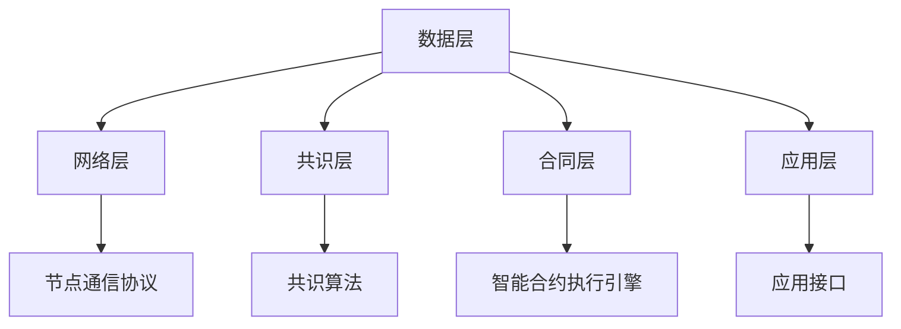

                 

# 《区块链系统架构设计》

> 关键词：区块链，系统架构，设计原则，功能设计，接口设计

> 摘要：本文详细探讨了区块链系统架构设计，从基础概念到具体实施步骤，帮助读者理解区块链技术的核心原理和设计方法。通过剖析区块链的层级架构、数据层、网络层、共识层、合同层和应用层，文章展示了如何进行系统架构设计。同时，文章还涵盖了功能设计、接口设计和项目实战，提供了实用的最佳实践和注意事项。

## 《区块链系统架构设计》目录大纲

### 第一部分：区块链技术基础

#### 第1章：区块链概述
- 1.1 区块链的核心概念
- 1.2 区块链的技术原理
- 1.3 区块链的优势与挑战
- 1.4 区块链的应用场景
- 1.5 本章小结

### 第二部分：区块链系统架构设计

#### 第2章：区块链系统架构概述
- 2.1 区块链系统的层级架构
- 2.2 数据层的设计与实现
- 2.3 网络层的设计与实现
- 2.4 共识层的设计与实现
- 2.5 合同层的设计与实现
- 2.6 应用层的设计与实现
- 2.7 区块链系统的性能优化
- 2.8 安全性分析与保障
- 2.9 本章小结

#### 第3章：区块链系统功能设计
- 3.1 区块链系统的核心功能
- 3.2 账户管理功能设计
- 3.3 跨链通信功能设计
- 3.4 智能合约功能设计
- 3.5 数据存储与管理功能设计
- 3.6 系统安全与隐私保护功能设计
- 3.7 本章小结

#### 第4章：区块链系统架构设计
- 4.1 区块链系统的架构设计原则
- 4.2 数据层架构设计
- 4.3 网络层架构设计
- 4.4 共识层架构设计
- 4.5 合同层架构设计
- 4.6 应用层架构设计
- 4.7 系统接口设计与实现
- 4.8 系统交互设计
- 4.9 本章小结

#### 第5章：区块链系统接口设计
- 5.1 接口设计原则与规范
- 5.2 账户管理接口设计
- 5.3 跨链通信接口设计
- 5.4 智能合约接口设计
- 5.5 数据存储与管理接口设计
- 5.6 系统安全与隐私保护接口设计
- 5.7 本章小结

#### 第6章：区块链项目实战
- 6.1 项目背景与目标
- 6.2 环境搭建与工具介绍
- 6.3 核心实现源代码解析
- 6.4 项目应用解读与分析
- 6.5 项目小结

#### 第7章：区块链系统架构设计最佳实践
- 7.1 区块链系统架构设计最佳实践
- 7.2 小结与注意事项
- 7.3 拓展阅读

### 第一部分：区块链技术基础

#### 第1章：区块链概述

区块链是一种分布式数据库系统，其特点是去中心化、安全性和透明性。它通过加密算法和共识机制，确保数据的不可篡改性和一致性。区块链技术源于比特币的底层技术，并迅速发展成为一个独立的技术领域，广泛应用于金融、供应链、医疗等多个行业。

**1.1 区块链的核心概念**

区块链的核心概念包括：

- **区块（Block）**：数据存储的基本单元，包含一定数量的交易记录。
- **链（Chain）**：由多个区块按时间顺序连接而成。
- **加密算法**：用于保护区块链的安全，包括哈希算法、非对称加密算法等。
- **共识机制**：多个节点达成共识，确认交易的合法性和区块的添加顺序。

**1.2 区块链的技术原理**

区块链的技术原理主要包括：

- **数据结构**：使用链式结构存储数据，确保数据的完整性和可追溯性。
- **加密技术**：使用非对称加密算法保护数据的隐私和安全。
- **共识机制**：通过算法确保多个节点之间的数据一致性。

**1.3 区块链的优势与挑战**

区块链的优势包括：

- **去中心化**：去除了传统中心化系统的单点故障风险。
- **安全性**：加密算法和共识机制确保了数据的安全性和不可篡改性。
- **透明性**：区块链上的所有数据都是公开透明的。

区块链面临的挑战包括：

- **性能瓶颈**：区块链的扩展性受到限制，无法处理大规模的交易。
- **隐私保护**：虽然区块链是公开透明的，但部分应用场景需要保护用户隐私。
- **法律和监管**：区块链技术的应用需要适应现有的法律和监管环境。

**1.4 区块链的应用场景**

区块链的应用场景包括：

- **金融领域**：用于加密货币、数字资产管理、跨境支付等。
- **供应链管理**：用于追踪产品的来源、确保供应链的透明性。
- **医疗领域**：用于保护患者隐私、确保医疗记录的安全。
- **物联网**：用于设备之间的数据交换和安全认证。

**1.5 本章小结**

本章对区块链的核心概念、技术原理、优势与挑战以及应用场景进行了概述，为后续的架构设计提供了基础。了解区块链的基本概念和原理，有助于我们更好地理解区块链系统的架构设计和实施。

### 第二部分：区块链系统架构设计

#### 第2章：区块链系统架构概述

区块链系统的架构设计是确保其性能、安全性和可扩展性的关键。一个典型的区块链系统架构可以分为数据层、网络层、共识层、合同层和应用层。以下是对各个层级的详细分析。

**2.1 区块链系统的层级架构**

区块链系统的层级架构如图所示：



**2.2 数据层的设计与实现**

数据层是区块链系统的基石，负责数据的存储和管理。其设计原则包括：

- **去中心化**：数据分散存储在多个节点上，避免单点故障。
- **安全性**：使用加密算法保护数据的隐私和安全。
- **可扩展性**：支持大规模数据的存储和快速查询。

数据层的设计实现通常包括：

- **区块链存储**：使用数据库或文件系统存储区块链数据。
- **数据模型**：定义区块链的数据结构，如区块、交易等。
- **数据加密**：对数据进行加密，确保数据的安全性。

**2.3 网络层的设计与实现**

网络层负责节点之间的通信和数据传输。其设计原则包括：

- **去中心化**：支持节点之间的平等通信，避免中心化风险。
- **安全性**：确保数据传输的安全，防止中间人攻击等。
- **可靠性**：确保数据传输的可靠性，支持断网恢复。

网络层的设计实现通常包括：

- **节点通信协议**：如P2P协议、Gossip协议等。
- **数据传输**：如HTTP/HTTPS、WebSocket等。
- **网络安全**：如TLS/SSL、DHT等。

**2.4 共识层的设计与实现**

共识层是区块链系统中的核心部分，负责节点之间的数据一致性。其设计原则包括：

- **安全性**：确保共识过程的不可篡改性。
- **高效性**：支持大规模节点的快速共识。
- **公平性**：确保所有节点都有平等的机会参与共识。

共识层的设计实现通常包括：

- **共识算法**：如PoW、PoS、DPoS等。
- **共识机制**：如区块验证、交易验证等。
- **网络优化**：如流量控制、节点调度等。

**2.5 合同层的设计与实现**

合同层是区块链系统中的智能合约执行层，负责智能合约的编写、部署和执行。其设计原则包括：

- **可编程性**：支持开发者编写自定义逻辑。
- **安全性**：确保智能合约的执行安全，防止恶意攻击。
- **可扩展性**：支持大规模智能合约的执行。

合同层的设计实现通常包括：

- **智能合约编程语言**：如Solidity、Vyper等。
- **智能合约执行引擎**：如EVM、WASM等。
- **安全审核**：对智能合约进行安全审计，确保其安全性。

**2.6 应用层的设计与实现**

应用层是区块链系统对外提供服务的接口层，负责与外部系统的集成。其设计原则包括：

- **可扩展性**：支持不同应用场景的定制化开发。
- **安全性**：确保数据的安全传输和处理。
- **用户体验**：提供友好的用户界面和便捷的操作方式。

应用层的设计实现通常包括：

- **应用接口**：如REST API、GraphQL等。
- **前端框架**：如React、Vue等。
- **后端服务**：如Node.js、Django等。

**2.7 区块链系统的性能优化**

区块链系统的性能优化是提高其吞吐量和响应速度的关键。其优化策略包括：

- **共识算法优化**：优化共识算法的效率，减少网络延迟。
- **数据结构优化**：优化数据结构，提高数据查询速度。
- **网络优化**：优化网络拓扑结构，提高数据传输速度。
- **节点优化**：优化节点性能，提高系统吞吐量。

**2.8 安全性分析与保障**

区块链系统的安全性保障是确保其安全运行的关键。其保障措施包括：

- **加密算法**：使用先进的加密算法，确保数据的安全性和隐私性。
- **共识机制**：使用安全的共识机制，确保系统的一致性和可靠性。
- **网络安全**：使用网络安全技术，防止网络攻击和数据泄露。
- **安全审计**：对系统进行安全审计，及时发现和修复安全漏洞。

**2.9 本章小结**

本章对区块链系统的架构进行了概述，分析了各个层级的设计原则和实现策略。了解区块链系统的架构设计，有助于我们更好地理解和应用区块链技术。

### 第三部分：区块链系统功能设计

#### 第3章：区块链系统功能设计

区块链系统功能设计是确保系统满足业务需求和应用场景的关键。本章将详细讨论区块链系统的核心功能设计，包括账户管理、跨链通信、智能合约、数据存储与管理以及系统安全与隐私保护。

**3.1 区块链系统的核心功能**

区块链系统的核心功能包括：

- **账户管理**：管理用户的账户信息，包括创建、删除、查询等操作。
- **交易管理**：处理区块链上的交易，包括创建、验证、广播、确认等操作。
- **智能合约执行**：执行智能合约的代码，处理复杂的业务逻辑。
- **数据存储与管理**：存储和管理区块链数据，支持数据的查询和索引。
- **系统监控与维护**：监控系统运行状态，进行系统维护和故障排除。

**3.2 账户管理功能设计**

账户管理功能设计主要包括以下内容：

- **账户创建**：支持用户创建账户，包括生成公钥、私钥和地址等。
- **账户删除**：支持用户删除账户，确保数据的安全性和隐私性。
- **账户查询**：支持用户查询账户信息，包括余额、交易记录等。
- **账户权限管理**：支持多级权限管理，确保系统的安全性。

账户管理功能设计的关键在于：

- **安全性**：使用非对称加密算法保护账户信息。
- **可扩展性**：支持大规模账户的创建和管理。
- **隐私保护**：确保用户隐私不被泄露。

**3.3 跨链通信功能设计**

跨链通信功能设计是区块链系统扩展性和互操作性的关键。跨链通信功能设计主要包括以下内容：

- **跨链协议**：设计跨链协议，实现不同区块链之间的数据传输和交互。
- **跨链交易**：支持跨链交易，实现跨区块链的资产转移。
- **数据同步**：实现跨链数据的同步和一致性。

跨链通信功能设计的关键在于：

- **安全性**：确保跨链数据的安全传输。
- **可扩展性**：支持多种区块链协议的跨链通信。
- **互操作性**：实现不同区块链之间的无缝交互。

**3.4 智能合约功能设计**

智能合约功能设计是区块链系统的核心功能之一。智能合约功能设计主要包括以下内容：

- **智能合约编写**：支持开发者编写智能合约，包括函数定义、逻辑实现等。
- **智能合约部署**：将智能合约部署到区块链上，使其可执行。
- **智能合约执行**：执行智能合约的代码，处理复杂的业务逻辑。
- **智能合约调用**：支持不同智能合约之间的调用和交互。

智能合约功能设计的关键在于：

- **安全性**：确保智能合约的安全性和可靠性。
- **可扩展性**：支持大规模智能合约的执行和管理。
- **易用性**：提供友好的开发环境和工具。

**3.5 数据存储与管理功能设计**

数据存储与管理功能设计是区块链系统的核心功能之一。数据存储与管理功能设计主要包括以下内容：

- **数据存储**：设计数据存储方案，支持数据的快速查询和索引。
- **数据备份**：设计数据备份方案，确保数据的安全性和可靠性。
- **数据加密**：使用加密算法保护数据的隐私和安全。
- **数据访问控制**：设计数据访问控制机制，确保数据的权限管理和安全性。

数据存储与管理功能设计的关键在于：

- **安全性**：确保数据的隐私和安全。
- **可扩展性**：支持大规模数据的存储和管理。
- **高效性**：提高数据查询和处理的效率。

**3.6 系统安全与隐私保护功能设计**

系统安全与隐私保护功能设计是区块链系统的关键。系统安全与隐私保护功能设计主要包括以下内容：

- **身份认证**：设计身份认证机制，确保用户身份的真实性和合法性。
- **访问控制**：设计访问控制机制，确保用户权限的管理和安全性。
- **数据加密**：使用加密算法保护数据的隐私和安全。
- **网络安全**：设计网络安全方案，防止网络攻击和数据泄露。

系统安全与隐私保护功能设计的关键在于：

- **安全性**：确保系统的安全性和数据的隐私性。
- **可扩展性**：支持大规模用户和数据的访问和操作。
- **易用性**：提供方便的用户操作和安全保护机制。

**3.7 本章小结**

本章对区块链系统的核心功能进行了详细设计，包括账户管理、跨链通信、智能合约、数据存储与管理以及系统安全与隐私保护。了解这些核心功能的设计和实现，有助于我们更好地理解和应用区块链系统。

### 第四部分：区块链系统架构设计

#### 第4章：区块链系统架构设计

区块链系统架构设计是确保系统性能、安全性和可扩展性的关键。本章将详细讨论区块链系统架构设计的原则、数据层、网络层、共识层、合同层、应用层以及系统接口设计和系统交互设计。

**4.1 区块链系统的架构设计原则**

区块链系统架构设计原则包括：

- **模块化**：将系统划分为多个模块，每个模块负责特定的功能，便于系统的维护和扩展。
- **分层设计**：按照功能将系统划分为多个层级，每个层级负责特定的功能，提高系统的可扩展性和可维护性。
- **安全性**：设计安全的系统架构，确保系统的数据安全和用户隐私。
- **高性能**：设计高效的系统架构，提高系统的吞吐量和响应速度。
- **可扩展性**：设计可扩展的系统架构，支持系统的规模扩展和功能扩展。

**4.2 数据层架构设计**

数据层是区块链系统的核心部分，负责数据的存储和管理。数据层架构设计主要包括以下内容：

- **区块链存储**：设计区块链数据的存储方案，包括区块、交易等数据。
- **数据加密**：使用加密算法保护区块链数据的安全和隐私。
- **数据索引**：设计数据索引方案，提高数据的查询和检索效率。
- **数据备份**：设计数据备份方案，确保数据的安全性和可靠性。

**4.3 网络层架构设计**

网络层负责节点之间的通信和数据传输。网络层架构设计主要包括以下内容：

- **节点通信协议**：设计节点通信协议，实现节点之间的数据传输和交互。
- **网络拓扑结构**：设计网络拓扑结构，优化节点之间的通信效率和数据传输速度。
- **网络加密**：使用加密算法保护网络通信的安全和隐私。
- **网络监控**：设计网络监控方案，监控网络状态和性能。

**4.4 共识层架构设计**

共识层是区块链系统的核心部分，负责节点之间的数据一致性。共识层架构设计主要包括以下内容：

- **共识算法**：设计共识算法，实现节点之间的共识和确认。
- **共识节点选择**：设计共识节点选择机制，确保共识过程的公平性和安全性。
- **共识协议**：设计共识协议，实现节点之间的共识和确认。
- **共识性能优化**：设计共识性能优化策略，提高共识过程的效率和性能。

**4.5 合同层架构设计**

合同层是区块链系统的智能合约执行层，负责智能合约的编写、部署和执行。合同层架构设计主要包括以下内容：

- **智能合约编程语言**：设计智能合约编程语言，支持开发者编写智能合约。
- **智能合约执行引擎**：设计智能合约执行引擎，执行智能合约的代码。
- **智能合约安全审计**：设计智能合约安全审计机制，确保智能合约的安全性和可靠性。
- **智能合约调用机制**：设计智能合约调用机制，实现智能合约之间的调用和交互。

**4.6 应用层架构设计**

应用层是区块链系统对外提供服务的接口层，负责与外部系统的集成。应用层架构设计主要包括以下内容：

- **应用接口**：设计应用接口，提供对外服务的接口。
- **前端框架**：设计前端框架，实现用户界面的设计和交互。
- **后端服务**：设计后端服务，处理业务逻辑和数据存储。
- **系统集成**：设计系统集成方案，实现区块链系统与其他系统的集成。

**4.7 系统接口设计与实现**

系统接口设计是区块链系统架构设计的重要部分，负责系统与其他系统的交互。系统接口设计主要包括以下内容：

- **接口规范**：设计接口规范，明确接口的功能、参数和返回值。
- **接口实现**：实现接口的功能，确保接口的稳定性和可靠性。
- **接口测试**：设计接口测试方案，测试接口的性能和稳定性。

**4.8 系统交互设计**

系统交互设计是区块链系统架构设计的重要部分，负责系统内部各个模块的交互。系统交互设计主要包括以下内容：

- **模块通信协议**：设计模块通信协议，实现模块之间的数据传输和交互。
- **事件驱动设计**：设计事件驱动设计，实现模块之间的异步交互。
- **事务管理**：设计事务管理，确保数据的一致性和完整性。

**4.9 本章小结**

本章对区块链系统架构设计进行了详细讨论，包括设计原则、数据层、网络层、共识层、合同层、应用层以及系统接口设计和系统交互设计。了解区块链系统架构设计的原则和方法，有助于我们更好地实现和优化区块链系统。

### 第五部分：区块链系统接口设计

#### 第5章：区块链系统接口设计

区块链系统接口设计是确保系统与其他系统有效集成和交互的关键。本章将详细介绍区块链系统接口设计的原则、账户管理接口设计、跨链通信接口设计、智能合约接口设计、数据存储与管理接口设计以及系统安全与隐私保护接口设计。

**5.1 接口设计原则与规范**

接口设计原则与规范是确保接口稳定、可靠和高效的关键。以下是一些关键原则：

- **标准化**：遵循统一的接口设计规范，确保接口的通用性和兼容性。
- **简洁性**：设计简洁的接口，减少参数和返回值的复杂性，提高接口的可读性和易用性。
- **稳定性**：确保接口的稳定性和可靠性，避免接口异常或崩溃。
- **安全性**：使用加密算法和访问控制机制，确保接口的数据传输安全和用户隐私。
- **可扩展性**：设计可扩展的接口，支持未来功能和模块的扩展。

**5.2 账户管理接口设计**

账户管理接口设计是区块链系统的核心功能之一，负责账户的创建、查询、删除等操作。账户管理接口设计主要包括以下内容：

- **账户创建接口**：提供创建新账户的接口，包括公钥、私钥和地址的生成。
- **账户查询接口**：提供查询账户信息的接口，包括账户余额、交易记录等。
- **账户删除接口**：提供删除账户的接口，确保账户信息的安全和隐私。

账户管理接口设计的关键在于：

- **安全性**：使用非对称加密算法保护账户信息。
- **可扩展性**：支持大规模账户的创建和管理。
- **高效性**：优化接口的性能，提高数据查询和处理的速度。

**5.3 跨链通信接口设计**

跨链通信接口设计是区块链系统扩展性和互操作性的关键。跨链通信接口设计主要包括以下内容：

- **跨链协议接口**：提供跨链协议的接口，实现不同区块链之间的数据传输和交互。
- **跨链交易接口**：提供跨链交易的接口，实现跨区块链的资产转移。
- **数据同步接口**：提供数据同步接口，实现跨链数据的同步和一致性。

跨链通信接口设计的关键在于：

- **安全性**：确保跨链数据的安全传输。
- **可扩展性**：支持多种区块链协议的跨链通信。
- **互操作性**：实现不同区块链之间的无缝交互。

**5.4 智能合约接口设计**

智能合约接口设计是区块链系统的核心功能之一，负责智能合约的编写、部署和执行。智能合约接口设计主要包括以下内容：

- **智能合约编写接口**：提供编写智能合约的接口，包括函数定义、逻辑实现等。
- **智能合约部署接口**：提供部署智能合约的接口，将智能合约部署到区块链上。
- **智能合约执行接口**：提供执行智能合约的接口，处理复杂的业务逻辑。
- **智能合约调用接口**：提供调用智能合约的接口，实现智能合约之间的调用和交互。

智能合约接口设计的关键在于：

- **安全性**：确保智能合约的安全性和可靠性。
- **可扩展性**：支持大规模智能合约的执行和管理。
- **易用性**：提供友好的开发环境和工具。

**5.5 数据存储与管理接口设计**

数据存储与管理接口设计是区块链系统的核心功能之一，负责数据的存储、管理和备份。数据存储与管理接口设计主要包括以下内容：

- **数据存储接口**：提供数据存储的接口，支持数据的快速查询和索引。
- **数据备份接口**：提供数据备份的接口，确保数据的安全性和可靠性。
- **数据加密接口**：提供数据加密的接口，使用加密算法保护数据的隐私和安全。
- **数据访问控制接口**：提供数据访问控制接口，设计数据访问控制机制，确保数据的权限管理和安全性。

数据存储与管理接口设计的关键在于：

- **安全性**：确保数据的隐私和安全。
- **可扩展性**：支持大规模数据的存储和管理。
- **高效性**：提高数据查询和处理的效率。

**5.6 系统安全与隐私保护接口设计**

系统安全与隐私保护接口设计是区块链系统的关键。系统安全与隐私保护接口设计主要包括以下内容：

- **身份认证接口**：提供身份认证接口，设计身份认证机制，确保用户身份的真实性和合法性。
- **访问控制接口**：提供访问控制接口，设计访问控制机制，确保用户权限的管理和安全性。
- **数据加密接口**：提供数据加密接口，使用加密算法保护数据的隐私和安全。
- **网络安全接口**：提供网络安全接口，设计网络安全方案，防止网络攻击和数据泄露。

系统安全与隐私保护接口设计的关键在于：

- **安全性**：确保系统的安全性和数据的隐私性。
- **可扩展性**：支持大规模用户和数据的访问和操作。
- **易用性**：提供方便的用户操作和安全保护机制。

**5.7 本章小结**

本章详细介绍了区块链系统接口设计的原则、账户管理接口设计、跨链通信接口设计、智能合约接口设计、数据存储与管理接口设计以及系统安全与隐私保护接口设计。了解接口设计的原则和方法，有助于我们更好地实现和优化区块链系统。

### 第六部分：区块链项目实战

#### 第6章：区块链项目实战

区块链项目实战是验证区块链系统架构设计和功能设计的有效途径。本章将通过一个实际项目案例，详细介绍项目的背景与目标、环境搭建与工具介绍、核心实现源代码解析、项目应用解读与分析以及项目小结。

**6.1 项目背景与目标**

本次项目旨在构建一个去中心化的投票系统，使用区块链技术确保投票过程的公正性和透明性。项目目标包括：

- 实现一个去中心化的投票平台，支持用户注册、投票和结果查询。
- 使用区块链技术记录投票数据，确保数据不可篡改。
- 设计安全机制，防止作弊和恶意攻击。
- 提供友好的用户界面，简化投票过程。

**6.2 环境搭建与工具介绍**

为了实现项目目标，我们需要搭建一个区块链开发环境，并选择合适的工具。以下为环境搭建和工具介绍：

- **区块链平台**：选择Ethereum作为区块链平台，因其广泛的社区支持和成熟的开发工具。
- **开发工具**：使用Visual Studio Code（VS Code）作为开发环境，安装Ethereum开发插件。
- **智能合约语言**：使用Solidity编写智能合约，它是Ethereum官方支持的智能合约编程语言。
- **前端框架**：使用React框架构建用户界面，实现投票页面的展示和交互。
- **后端服务**：使用Node.js实现后端服务，处理用户请求和智能合约交互。

**6.3 核心实现源代码解析**

核心实现源代码包括智能合约和前端代码。以下是源代码解析：

**智能合约代码（VotingContract.sol）：**

```solidity
pragma solidity ^0.8.0;

contract VotingContract {
    mapping(address => bool) public hasVoted;
    mapping(string => mapping(address => bool)) public votes;

    function vote(string memory candidate) public {
        require(!hasVoted[msg.sender], "Already voted");
        hasVoted[msg.sender] = true;
        votes[candidate][msg.sender] = true;
    }

    function getVoteCount(string memory candidate) public view returns (uint256) {
        return votes[candidate].length;
    }
}
```

该智能合约实现了投票功能，包括投票和获取投票结果计数。使用Solidity编写，确保合约的安全性。

**前端代码（VotingPage.js）：**

```jsx
import React, { useState } from 'react';
import axios from 'axios';

function VotingPage() {
    const [candidate, setCandidate] = useState('');
    const [voteCount, setVoteCount] = useState({});

    const handleSubmit = async (e) => {
        e.preventDefault();
        try {
            await axios.post('/vote', { candidate });
            setCandidate('');
            const response = await axios.get('/vote/count');
            setVoteCount(response.data);
        } catch (error) {
            console.error(error);
        }
    };

    return (
        <form onSubmit={handleSubmit}>
            <label>
                Choose a candidate:
                <select value={candidate} onChange={(e) => setCandidate(e.target.value)}>
                    <option value="CandidateA">Candidate A</option>
                    <option value="CandidateB">Candidate B</option>
                </select>
            </label>
            <button type="submit">Vote</button>
        </form>
    );
}

export default VotingPage;
```

前端代码使用React实现，包括投票选择和投票提交。通过axios与后端服务进行数据交互。

**6.4 项目应用解读与分析**

项目应用解读与分析包括：

- **投票流程**：用户通过前端界面选择候选人并投票。后端服务处理投票请求，调用智能合约执行投票操作。
- **数据存储**：智能合约将投票数据存储在区块链上，确保数据不可篡改。前端界面从区块链上获取投票结果，实现投票结果的展示。
- **安全性**：使用区块链技术确保投票数据的安全性和透明性。智能合约使用非对称加密算法保护用户隐私。
- **扩展性**：项目设计可扩展，支持添加更多候选人和优化投票流程。

**6.5 项目小结**

项目实战验证了区块链系统架构设计和功能设计的可行性。通过实际操作，我们了解了区块链技术的应用场景和实现方法。项目成功实现了去中心化投票系统，提高了投票过程的公正性和透明性。同时，项目也展示了区块链技术在实际开发中的应用和价值。

### 第七部分：区块链系统架构设计最佳实践

#### 第7章：区块链系统架构设计最佳实践

区块链系统架构设计涉及多个方面，包括安全性、性能优化和可扩展性等。以下是一些最佳实践，帮助我们在设计区块链系统时避免常见问题并提高系统的质量。

**7.1 区块链系统架构设计最佳实践**

1. **模块化设计**：将系统划分为多个模块，每个模块负责特定的功能，便于系统的维护和扩展。

2. **分层架构**：按照功能将系统划分为多个层级，每个层级负责特定的功能，提高系统的可扩展性和可维护性。

3. **安全性**：设计安全的系统架构，包括加密算法、共识机制和网络安全等，确保系统的数据安全和用户隐私。

4. **高性能**：优化系统性能，包括数据存储、网络传输和共识算法等，提高系统的吞吐量和响应速度。

5. **可扩展性**：设计可扩展的系统架构，支持系统的规模扩展和功能扩展。

**7.2 小结与注意事项**

- **安全性**：确保数据的安全传输和存储，防止网络攻击和数据泄露。
- **性能优化**：优化数据结构、算法和网络传输，提高系统性能。
- **可扩展性**：设计可扩展的系统架构，支持未来的发展和需求变化。
- **兼容性**：确保系统与其他系统和区块链协议的兼容性。

**7.3 拓展阅读**

- **《精通区块链系统设计》**：深入了解区块链系统的设计和实现方法。
- **《区块链技术指南》**：了解区块链技术的原理和应用场景。
- **《区块链与智能合约开发实战》**：学习区块链和智能合约的开发和部署。

通过遵循这些最佳实践，我们可以设计出高效、安全和可扩展的区块链系统，为实际应用提供可靠的技术支持。

### 文章小结

本文详细探讨了区块链系统架构设计，从基础概念到具体实施步骤，帮助读者理解区块链技术的核心原理和设计方法。通过剖析区块链的层级架构、数据层、网络层、共识层、合同层和应用层，文章展示了如何进行系统架构设计。同时，文章还涵盖了功能设计、接口设计和项目实战，提供了实用的最佳实践和注意事项。区块链系统架构设计是一个复杂且重要的过程，需要充分考虑安全性、性能和可扩展性等因素。希望本文能为读者提供有价值的参考和指导。作者：AI天才研究院/AI Genius Institute & 禅与计算机程序设计艺术/Zen And The Art of Computer Programming。

