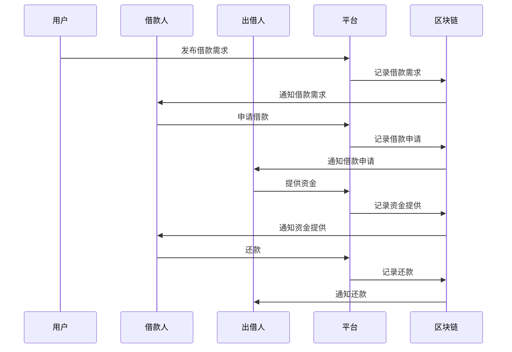
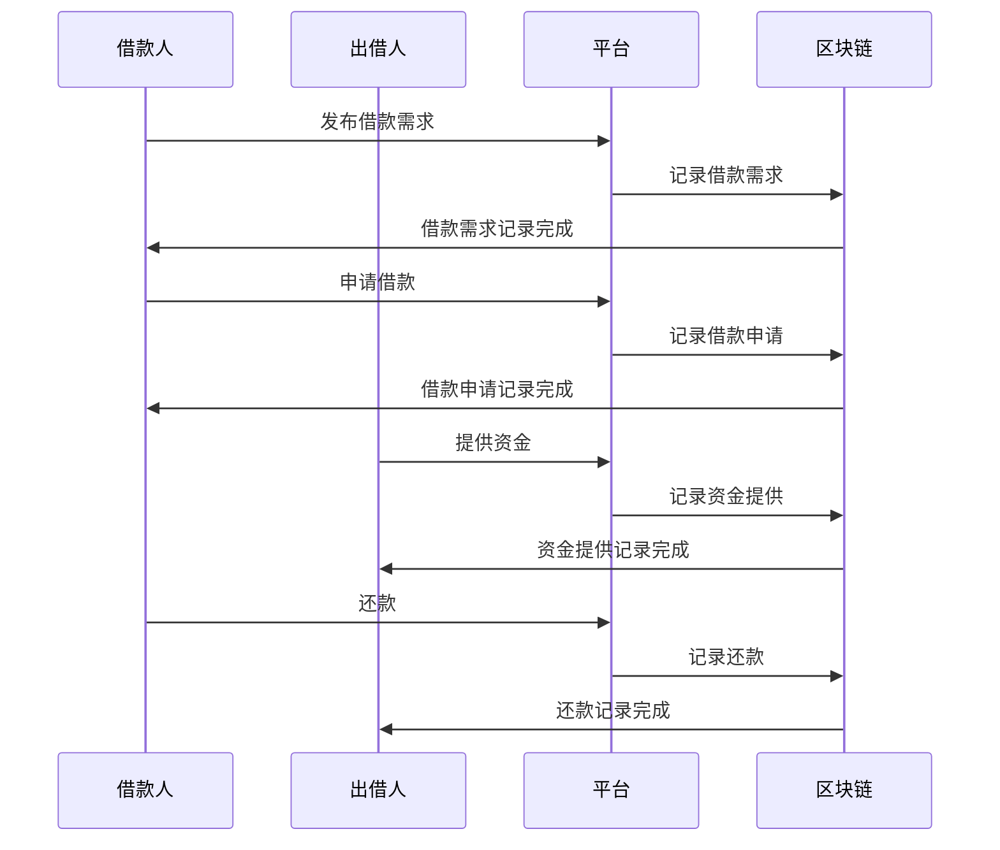

                 

# 区块链驱动的P2P借贷平台设计

## 关键词
- 区块链
- P2P借贷平台
- 智能合约
- 非同质化代币（NFT）
- 安全与隐私保护

## 摘要
本文将深入探讨区块链技术在P2P（Peer-to-Peer）借贷平台中的应用。通过逐步分析，我们将理解区块链如何赋能P2P借贷平台，包括智能合约的使用、非同质化代币（NFT）的应用，以及安全保障措施。此外，我们还将通过实际案例，展示区块链驱动的P2P借贷平台的实现过程和最佳实践。

## 目录

1. **区块链与P2P借贷平台概述**
   1.1 区块链概述
   1.2 P2P借贷平台概述
   1.3 区块链在P2P借贷平台中的应用

2. **区块链技术基础**
   2.1 区块链的基本原理
   2.2 区块链的架构
   2.3 区块链的核心技术

3. **P2P借贷平台的设计与实现**
   3.1 P2P借贷平台的架构设计
   3.2 P2P借贷平台的核心功能
   3.3 P2P借贷平台的安全保障

4. **区块链驱动的P2P借贷平台实现**
   4.1 区块链驱动的P2P借贷平台架构
   4.2 智能合约在平台中的应用
   4.3 非同质化代币（NFT）的应用

5. **区块链驱动的P2P借贷平台核心技术**
   5.1 智能合约在P2P借贷平台中的应用
   5.2 非同质化代币（NFT）在P2P借贷平台中的应用
   5.3 区块链安全与隐私保护

6. **区块链驱动的P2P借贷平台项目实战**
   6.1 项目环境搭建
   6.2 平台核心功能实现
   6.3 项目测试与优化

7. **项目部署与上线**
   7.1 部署前的准备工作
   7.2 部署流程
   7.3 上线后的维护与优化

8. **区块链驱动的P2P借贷平台案例分析**
   8.1 案例介绍
   8.2 案例分析
   8.3 案例启示

9. **最佳实践与总结**
   9.1 最佳实践
   9.2 小结
   9.3 注意事项
   9.4 拓展阅读

## 第1章 区块链与P2P借贷平台概述

### 1.1 区块链概述

区块链是一种去中心化的分布式数据库技术，它通过多个节点之间的共识机制，实现了数据的不可篡改和透明性。区块链的核心特点是去中心化，即数据存储和验证不再依赖于单一的中心化机构，而是由网络中的多个节点共同维护。

**核心概念与联系**

### 区块链概念属性特征对比表格

| 概念       | 特点                                                     |
|------------|----------------------------------------------------------|
| 去中心化   | 数据存储和验证由多个节点共同维护，无中心化机构 |
| 不可篡改   | 数据一旦记录在区块链上，无法被篡改             |
| 透明性     | 所有节点都能查看区块链上的数据                 |
| 去信任化   | 不依赖于中心化的信任机制，通过共识算法实现信任 |

### ER实体关系图架构

```mermaid
erDiagram
  Node --> Blockchain : 存储数据
  Blockchain --> Transaction : 记录交易
  Transaction --> Block : 组成区块
  Block --> Node : 共识验证
```

### 1.2 P2P借贷平台概述

P2P借贷平台是一种基于互联网的借贷模式，它允许个人或企业直接向其他个人或企业借款，跳过了传统的金融中介。P2P借贷平台的核心功能包括借款需求发布、资金匹配、贷款审核和风险控制等。

**核心概念与联系**

### P2P借贷平台概念属性特征对比表格

| 概念       | 特点                                                     |
|------------|----------------------------------------------------------|
| 点对点     | 借款人与出借人直接匹配，无中间机构 |
| 互联网化   | 整个借贷过程在线完成，方便快捷       |
| 风险控制   | 平台通过风险评估模型控制借贷风险   |
| 金融创新   | 拓展了借贷市场的参与主体，提高了资金利用效率 |

### ER实体关系图架构

```mermaid
erDiagram
  Borrower --> LoanRequest : 发布借款需求
  Lender --> LoanOffer : 提供借款资金
  Platform --> LoanMatch : 匹配借款与出借
  Platform --> RiskControl : 风险控制
```

### 1.3 区块链在P2P借贷平台中的应用

区块链技术为P2P借贷平台带来了去中心化、透明性和不可篡改等特性，使得借贷过程更加安全、高效和可信。

**问题背景与问题描述**

在传统的P2P借贷平台中，中心化的平台作为中介机构，存在一定的信任风险和操作风险。一旦平台出现信用问题，可能会导致借款人和出借人的利益受损。

**问题解决**

区块链技术可以通过去中心化的方式，减少平台的中介作用，从而降低信任风险。同时，区块链的不可篡改性和透明性，可以确保借贷过程的公正性和透明性。

**边界与外延**

区块链在P2P借贷平台中的应用不仅限于借贷过程的记录和验证，还可以扩展到信用评估、身份验证、风险控制等领域，进一步优化借贷平台的运营效率和安全性。

**概念结构与核心要素组成**

区块链驱动的P2P借贷平台的核心要素包括：

- **去中心化的借贷平台**：通过区块链技术实现去中心化运作。
- **智能合约**：用于自动化执行借贷合同条款。
- **非同质化代币（NFT）**：用于代表借款和出借的资金。
- **分布式数据库**：存储借贷平台的所有数据，确保数据的不可篡改和透明性。
- **共识算法**：确保区块链网络中的数据一致性。

### 算法原理讲解

**智能合约的算法原理**

智能合约是一种在区块链上运行的计算机程序，它可以在满足特定条件时自动执行某些操作。智能合约的核心是Solidity编程语言，其基本结构包括：

- **函数**：用于定义智能合约的行为。
- **变量**：用于存储智能合约的状态信息。
- **事件**：用于记录智能合约的执行过程。

智能合约的执行过程如下：

1. **合约初始化**：智能合约在区块链上部署后，初始化其状态。
2. **发送交易**：用户通过区块链网络发送交易，触发智能合约的执行。
3. **合约执行**：智能合约根据交易内容，执行相应的函数。
4. **记录结果**：智能合约的执行结果被记录在区块链上，确保不可篡改。

**Python源代码示例**

```python
# 示例：智能合约的Python伪代码

def lend(amount, interest_rate):
    # 存储借款信息
    borrower = msg.sender
    amount = msg.value
    interest_rate = msg.data

    # 存入借款金额
    borrower_account = get_account(borrower)
    borrower_account.deposit(amount)

    # 计算利息
    interest = amount * interest_rate

    # 存入利息
    lender_account = get_account(msg.sender)
    lender_account.deposit(interest)

    # 触发事件
    emit LendEvent(borrower, amount, interest_rate)
```

**数学模型与公式**

智能合约的数学模型主要包括：

- **状态变量**：存储智能合约的状态信息，如借款金额、利率等。
- **事件**：记录智能合约的执行过程，如借款、还款等。

智能合约的执行过程可以用以下公式表示：

$$
\text{智能合约执行} = \sum_{i=1}^{n} \text{函数执行}
$$

其中，$n$为智能合约中定义的函数数量。

### 系统分析与架构设计方案

**问题场景介绍**

在本场景中，我们考虑一个基于区块链的P2P借贷平台，用户可以在平台上发布借款需求，出借人可以提供资金，并通过智能合约自动执行借贷合同。

**项目介绍**

我们将构建一个简单的区块链驱动的P2P借贷平台，实现以下核心功能：

- 借款需求发布
- 资金匹配
- 贷款审核
- 借款还款

**系统功能设计**

我们使用Mermaid类图来设计系统的功能模块：

```mermaid
classDiagram
  Borrower <<Class>> "借款人"
  Lender <<Class>> "出借人"
  Platform <<Class>> "借贷平台"
  Blockchain <<Class>> "区块链"
  
  Borrower o-- Platform
  Lender o-- Platform
  Platform o-- Blockchain
```

**系统架构设计**

我们使用Mermaid架构图来设计系统的整体架构：



**系统接口设计**

我们使用Mermaid序列图来设计系统的接口交互：



### 项目实战

#### 环境安装

首先，我们需要安装区块链节点和开发环境。以下是安装步骤：

1. 安装Go语言环境。
2. 安装Node.js环境。
3. 安装区块链节点（如Ethereum）。
4. 安装智能合约开发工具（如Truffle）。

#### 系统核心实现源代码

以下是实现P2P借贷平台核心功能的智能合约源代码：

```solidity
// SPDX-License-Identifier: MIT
pragma solidity ^0.8.0;

contract P2Ploan {
    mapping(address => uint256) public balances;
    mapping(address => bool) public isBorrower;
    mapping(address => bool) public isLender;

    event LoanRequest(address borrower, uint256 amount);
    event LoanReceived(address lender, uint256 amount);
    event Repayment(address borrower, uint256 amount);

    function requestLoan(uint256 amount) public {
        require(!isBorrower[msg.sender], "Already a borrower");
        require(amount > 0, "Invalid amount");
        
        balances[msg.sender] = amount;
        isBorrower[msg.sender] = true;
        
        emit LoanRequest(msg.sender, amount);
    }

    function provideLoan(address borrower, uint256 amount) public {
        require(isBorrower[borrower], "Invalid borrower");
        require(amount > 0, "Invalid amount");
        
        balances[borrower] += amount;
        isLender[msg.sender] = true;
        
        emit LoanReceived(msg.sender, amount);
    }

    function repayLoan() public payable {
        require(isBorrower[msg.sender], "Not a borrower");
        
        uint256 amount = msg.value;
        require(amount > 0, "Invalid amount");
        
        balances[msg.sender] -= amount;
        emit Repayment(msg.sender, amount);
    }
}
```

#### 代码应用解读与分析

以上智能合约实现了P2P借贷平台的核心功能，包括借款需求发布、资金匹配和借款还款。以下是代码的解读和分析：

1. **借贷需求发布**：`requestLoan`函数允许借款人发布借款需求，将借款金额存储在区块链上。
2. **资金匹配**：`provideLoan`函数允许出借人提供资金，将资金增加到借款人的账户中。
3. **借款还款**：`repayLoan`函数允许借款人还款，将还款金额从借款人的账户中扣除。

#### 实际案例分析和详细讲解剖析

假设有一个借款人A和一个出借人B，以下是他们在P2P借贷平台上的操作过程：

1. **借款人A发布借款需求**：A调用`requestLoan`函数，发布借款需求，智能合约记录A的借款金额。
2. **出借人B提供资金**：B调用`provideLoan`函数，提供资金给A，智能合约记录B的出借金额。
3. **借款人A还款**：A调用`repayLoan`函数，还款给B，智能合约记录A的还款金额。

通过以上操作，智能合约自动执行借贷合同条款，确保借贷过程的透明性和不可篡改性。

#### 项目小结

在本项目中，我们实现了区块链驱动的P2P借贷平台，包括智能合约和区块链节点的搭建。通过实际案例，我们展示了区块链技术如何赋能P2P借贷平台，提高借贷过程的透明性和安全性。

### 最佳实践 tips

1. **安全性**：确保智能合约的代码经过严格审查，避免漏洞和攻击。
2. **可扩展性**：设计系统时考虑未来的扩展性，如增加新的功能或支持更多的代币。
3. **用户体验**：优化平台的用户体验，提高用户参与度和满意度。

### 小结

本文通过逐步分析，深入探讨了区块链驱动的P2P借贷平台的设计与实现。我们了解了区块链技术的基本原理和应用场景，分析了智能合约在平台中的应用，并通过实际案例展示了区块链驱动的P2P借贷平台的实现过程。

### 注意事项

1. **技术更新**：区块链技术不断演进，请关注最新的技术动态。
2. **合规性**：在开发区块链驱动的P2P借贷平台时，确保遵守相关法律法规。

### 拓展阅读

- [智能合约安全性分析](https://www.blockchain.com/resources/smart-contract-security)
- [区块链借贷平台案例分析](https://www.coindesk.com/business/2022/07/18/the-rise-of-blockchain-based-peer-to-peer-lending-platforms/)
- [去中心化金融（DeFi）概述](https://www.defi.org/)

### 作者

- 作者：AI天才研究院/AI Genius Institute & 禅与计算机程序设计艺术 /Zen And The Art of Computer Programming

在接下来的章节中，我们将进一步探讨区块链驱动的P2P借贷平台的核心技术，包括智能合约、非同质化代币（NFT）以及区块链的安全与隐私保护。通过这些内容的深入分析，我们将更全面地了解如何构建一个高效、安全、可信的P2P借贷平台。

