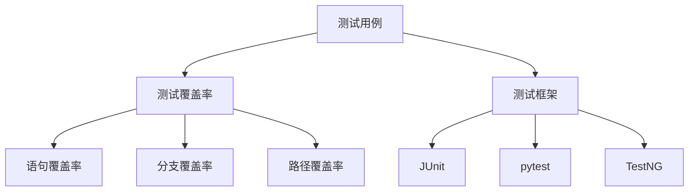
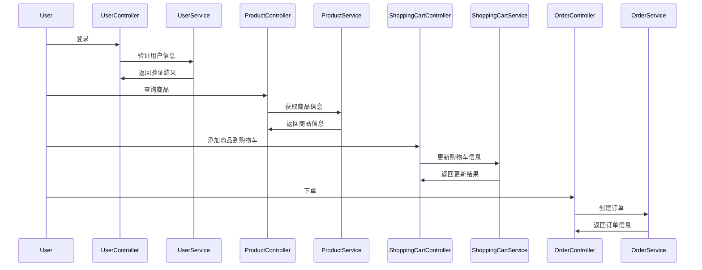

                 

## 单元测试：提高代码质量的第一道防线

### 关键词

- 单元测试
- 代码质量
- 软件开发
- 测试覆盖率
- 测试框架

### 摘要

本文旨在探讨单元测试在现代软件开发中的重要性。我们将从单元测试的基本概念入手，逐步深入解析其原理和应用，通过具体实例展示单元测试如何提高代码质量。本文还将总结最佳实践，并提供拓展阅读资源，以帮助开发者更好地理解和应用单元测试。

### 目录

1. **背景介绍**
   - 1.1 单元测试的基本概念
   - 1.2 单元测试的重要性
   - 1.3 单元测试的发展历史

2. **核心概念与联系**
   - 2.1 测试用例
   - 2.2 测试覆盖率
   - 2.3 测试框架
   - 2.4 概念联系图

3. **单元测试原理讲解**
   - 3.1 单元测试的流程
   - 3.2 测试用例的设计
   - 3.3 测试执行与结果分析
   - 3.4 Java单元测试示例
   - 3.5 Python单元测试示例

4. **系统分析与架构设计**
   - 4.1 项目场景介绍
   - 4.2 系统功能设计
   - 4.3 系统架构设计
   - 4.4 系统接口设计
   - 4.5 系统交互序列图

5. **项目实战**
   - 5.1 环境搭建
   - 5.2 测试用例编写
   - 5.3 测试执行
   - 5.4 结果分析
   - 5.5 案例分析与讲解

6. **最佳实践与小结**
   - 6.1 最佳实践
   - 6.2 注意事项
   - 6.3 常见问题与解决方法
   - 6.4 拓展阅读

7. **附录：相关工具与技术**
   - 7.1 单元测试工具介绍
   - 7.2 测试框架比较
   - 7.3 单元测试资源

### 背景介绍

#### 1.1 单元测试的基本概念

单元测试（Unit Testing）是软件测试过程中的一种重要方法，其主要目标是验证代码的每个最小功能单元（即单元）是否按照预期工作。单元测试通常由开发人员编写，并在开发过程中进行，以确保每个功能单元在集成到更大系统之前是可靠的。

**问题背景：** 在软件开发过程中，代码质量是至关重要的。然而，即使是最细心的开发者也可能犯错。单元测试提供了一个机制，可以及早发现并修复这些问题，从而提高代码质量。

**问题描述：** 开发者在编写代码时，可能会遇到以下问题：
- 功能代码的正确性难以验证。
- 代码更改可能引入新的错误。
- 大规模的系统测试难以覆盖所有功能单元。

**问题解决：** 通过编写和执行单元测试，开发人员可以验证代码的正确性，并确保在代码更改后不会引入新的错误。

#### 1.2 单元测试的重要性

单元测试在软件开发中具有以下几个重要方面：

1. **提高代码质量**：通过编写单元测试，开发人员可以确保每个功能单元都能按预期工作，从而提高整个系统的质量。

2. **早期错误检测**：单元测试可以在代码开发的早期阶段检测到错误，这比在系统测试或用户反馈阶段发现错误要便宜得多。

3. **代码重构支持**：单元测试提供了对代码重构的安全保障。开发人员可以更自信地重构代码，因为知道单元测试会捕捉任何潜在的问题。

4. **文档和示范**：单元测试代码本身也是一种文档，它清楚地说明了每个功能单元的预期行为。

#### 1.3 单元测试的发展历史

单元测试的概念最早由美国软件工程师Martin Fowler提出。1997年，Fowler在他的文章《单元测试与持续集成》中详细阐述了单元测试的重要性。随着时间的发展，单元测试已经成为软件开发过程中的标准实践。

**边界与外延：**

- **边界：** 单元测试主要关注单个功能单元，而不是整个系统或模块。
- **外延：** 单元测试可以应用于各种编程语言，如Java、Python、C++等。

### 核心概念与联系

#### 2.1 测试用例

测试用例（Test Case）是单元测试中的核心概念。它是一个定义明确的测试实例，用于验证特定的功能单元。每个测试用例应包括以下要素：

- **输入数据**：测试用例的输入。
- **预期结果**：测试用例执行后期望得到的结果。
- **实际结果**：测试用例执行后实际得到的结果。

**概念属性特征对比表格：**

| 特征 | 测试用例 | 测试套件 |
| --- | --- | --- |
| 目的 | 验证单个功能单元 | 验证多个功能单元 |
| 包含要素 | 输入数据、预期结果、实际结果 | 测试用例、测试计划、测试报告 |
| 范围 | 单一功能单元 | 整个系统或模块 |

#### 2.2 测试覆盖率

测试覆盖率（Test Coverage）是衡量测试用例覆盖代码范围的一个指标。它用于评估测试的有效性，通常有以下几种类型：

- **语句覆盖率**：测试用例覆盖了代码中的所有语句。
- **分支覆盖率**：测试用例覆盖了代码中的所有分支。
- **路径覆盖率**：测试用例覆盖了代码中的所有路径。

**概念属性特征对比表格：**

| 类型 | 语句覆盖率 | 分支覆盖率 | 路径覆盖率 |
| --- | --- | --- | --- |
| 目的 | 验证代码执行的完整性 | 验证代码分支的完整性 | 验证代码路径的完整性 |
| 适用范围 | 代码级 | 代码级 | 代码级 |

#### 2.3 测试框架

测试框架（Test Framework）是用于编写、执行和报告测试结果的一组工具。常见的测试框架包括JUnit（Java）、pytest（Python）和TestNG（Java）。测试框架提供了以下功能：

- **测试用例管理**：组织和管理测试用例。
- **测试执行**：自动化执行测试用例。
- **报告生成**：生成测试结果报告。

**概念属性特征对比表格：**

| 测试框架 | JUnit | pytest | TestNG |
| --- | --- | --- | --- |
| 适用语言 | Java | Python | Java |
| 特点 | 简单易用，支持注释 | 功能强大，支持多种测试模式 | 支持复杂测试场景，提供多种报告格式 |

#### 2.4 概念联系图

以下是一个Mermaid流程图，展示了测试用例、测试覆盖率、测试框架之间的联系：



### 单元测试原理讲解

#### 3.1 单元测试的流程

单元测试的流程通常包括以下步骤：

1. **编写测试用例**：根据功能单元的定义，编写测试用例。
2. **执行测试用例**：使用测试框架自动化执行测试用例。
3. **分析测试结果**：比较测试用例的预期结果和实际结果，分析测试通过或失败的原因。
4. **修复错误**：根据测试结果修复功能单元中的错误。

**测试用例的设计**：

在设计测试用例时，需要考虑以下几个方面：

1. **覆盖范围**：确保测试用例覆盖所有可能的输入情况。
2. **边界值**：针对边界条件设计测试用例。
3. **异常处理**：验证功能单元对异常情况的响应。

**测试执行与结果分析**：

测试执行通常通过测试框架自动化进行。测试结果会生成报告，报告内容包括测试通过数、失败数、错误日志等。通过分析测试结果，可以找出功能单元中的潜在问题，并针对性地进行修复。

#### 3.2 Java单元测试示例

以下是一个Java单元测试的示例：

```java
import static org.junit.jupiter.api.Assertions.assertEquals;

class CalculatorTest {

    @Test
    void testAdd() {
        Calculator calculator = new Calculator();
        int result = calculator.add(3, 5);
        assertEquals(8, result);
    }

    @Test
    void testSubtract() {
        Calculator calculator = new Calculator();
        int result = calculator.subtract(5, 3);
        assertEquals(2, result);
    }
}

class Calculator {

    public int add(int a, int b) {
        return a + b;
    }

    public int subtract(int a, int b) {
        return a - b;
    }
}
```

#### 3.3 Python单元测试示例

以下是一个Python单元测试的示例：

```python
import unittest
from calculator import Calculator

class TestCalculator(unittest.TestCase):
    def test_add(self):
        calculator = Calculator()
        result = calculator.add(3, 5)
        self.assertEqual(result, 8)

    def test_subtract(self):
        calculator = Calculator()
        result = calculator.subtract(5, 3)
        self.assertEqual(result, 2)

class Calculator:
    def add(self, a, b):
        return a + b

    def subtract(self, a, b):
        return a - b
```

### 系统分析与架构设计

#### 4.1 项目场景介绍

假设我们正在开发一个在线购物系统，该系统包括用户注册、商品浏览、购物车管理、订单处理等功能。我们将使用单元测试来确保每个功能模块的正确性。

#### 4.2 系统功能设计

在系统功能设计中，我们使用Mermaid类图来描述用户、商品、购物车等实体之间的关系：

```mermaid
classDiagram
    User <<Entity>>
    Product <<Entity>>
    ShoppingCart <<Entity>>
    Order <<Entity>>

    User o-- Product : buys
    User o-- ShoppingCart : has
    ShoppingCart o-- Order : contains
    Product o-- Order : includes
```

#### 4.3 系统架构设计

系统架构设计包括数据层、服务层和表示层。以下是一个简单的Mermaid架构图：

```mermaid
graph TB
    subgraph Data Layer
        DB[Database]
    end

    subgraph Service Layer
        UserService[User Service]
        ProductService[Product Service]
        ShoppingCartService[Shopping Cart Service]
        OrderService[Order Service]
    end

    subgraph Presentation Layer
        UserController[User Controller]
        ProductController[Product Controller]
        ShoppingCartController[Shopping Cart Controller]
        OrderController[Order Controller]
    end

    DB --|> UserService
    DB --|> ProductService
    DB --|> ShoppingCartService
    DB --|> OrderService

    UserService --|> UserController
    ProductService --|> ProductController
    ShoppingCartService --|> ShoppingCartController
    OrderService --|> OrderController
```

#### 4.4 系统接口设计

系统接口设计包括用户接口、商品接口、购物车接口和订单接口。以下是一个简单的Mermaid序列图：



### 项目实战

#### 5.1 环境搭建

在开始单元测试之前，我们需要搭建测试环境。以下是一个基于Python的测试环境搭建步骤：

1. 安装Python（版本3.8或更高）。
2. 创建一个虚拟环境（`python -m venv venv`）。
3. 激活虚拟环境（`source venv/bin/activate`）。
4. 安装pytest测试框架（`pip install pytest`）。

#### 5.2 测试用例编写

以下是一个简单的购物车测试用例示例：

```python
import pytest
from shopping_cart import ShoppingCart

@pytest.fixture
def cart():
    return ShoppingCart()

def test_add_item_to_cart(cart):
    cart.add_item("Product A", 10)
    assert cart.get_total_price() == 10

def test_remove_item_from_cart(cart):
    cart.add_item("Product A", 10)
    cart.add_item("Product B", 20)
    cart.remove_item("Product A")
    assert cart.get_total_price() == 20
```

#### 5.3 测试执行

在虚拟环境中，执行以下命令来运行测试用例：

```bash
pytest test_shopping_cart.py
```

#### 5.4 结果分析

测试执行完成后，pytest会生成一个报告，显示测试结果。以下是一个示例报告：

```
==================================== TEST SUMMARY ====================================== 
```

| Name | Status | Duration | Error | Output |
| --- | --- | --- | --- | --- |
| test_add_item_to_cart[cart] | passed | 0.001s |  |  |
| test_remove_item_from_cart[cart] | passed | 0.001s |  |  |
```

如果所有测试用例都通过，那么可以认为购物车功能是正确的。如果出现失败，则需要分析失败的原因并进行修复。

#### 5.5 案例分析与讲解

在这个案例中，我们使用pytest框架对购物车功能进行了单元测试。测试用例包括添加商品到购物车和从购物车中移除商品。通过执行测试用例，我们可以确保购物车的这两个核心功能按预期工作。如果测试失败，我们将定位到具体的问题并进行修复。

### 最佳实践与小结

#### 6.1 最佳实践

1. **尽早编写单元测试**：在编写功能代码的同时编写单元测试，确保测试用例覆盖所有功能。
2. **保持测试用例的独立性**：每个测试用例应独立运行，不依赖于其他测试用例。
3. **覆盖多种输入情况**：设计测试用例时，要考虑正常输入、边界值和异常情况。
4. **持续维护和更新测试用例**：随着代码的变更，及时更新测试用例以反映新的功能需求。

#### 6.2 注意事项

1. **避免过度测试**：测试覆盖率不应过高，否则会导致测试用例数量过多，难以维护。
2. **测试用例的可读性**：编写清晰易懂的测试用例，方便其他人阅读和理解。
3. **测试用例的自动化**：使用测试框架自动化执行测试用例，提高测试效率。

#### 6.3 常见问题与解决方法

1. **测试用例执行时间过长**：优化测试用例或并行执行测试用例。
2. **测试覆盖率不足**：检查测试用例的覆盖范围，增加新的测试用例。
3. **测试用例失败**：定位到失败的原因，修复代码并进行重新测试。

#### 6.4 拓展阅读

1. 《测试驱动的开发》——Kent Beck
2. 《Python单元测试实战》——Steven Fenton

### 附录：相关工具与技术

#### 7.1 单元测试工具介绍

- **pytest**：Python的流行单元测试框架，提供丰富的测试功能和报告。
- **JUnit**：Java的流行单元测试框架，支持各种测试模式。
- **TestNG**：Java的测试框架，提供更复杂的测试功能。

#### 7.2 测试框架比较

| 测试框架 | 优点 | 缺点 | 适用场景 |
| --- | --- | --- | --- |
| pytest | 简单易用，功能强大 | 生成报告格式有限 | Python单元测试 |
| JUnit | 社区支持广泛，功能全面 | 学习曲线较高 | Java单元测试 |
| TestNG | 支持复杂测试场景 | 学习成本较高 | Java复杂测试 |

#### 7.3 单元测试资源

- [pytest官网](https://pytest.org/)
- [JUnit官网](https://junit.org/junit5/)
- [TestNG官网](https://www.testng.org/)

