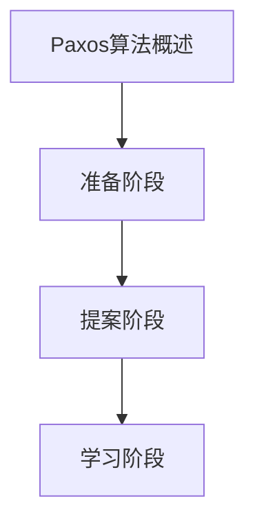
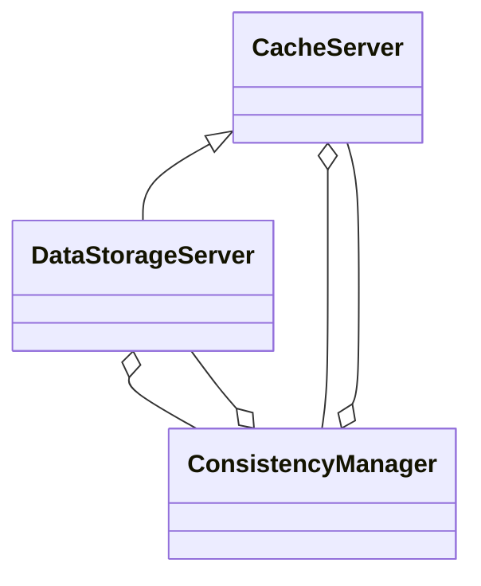
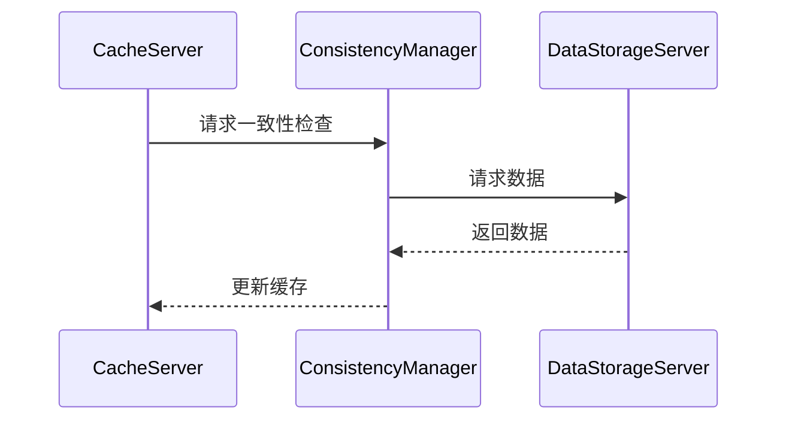
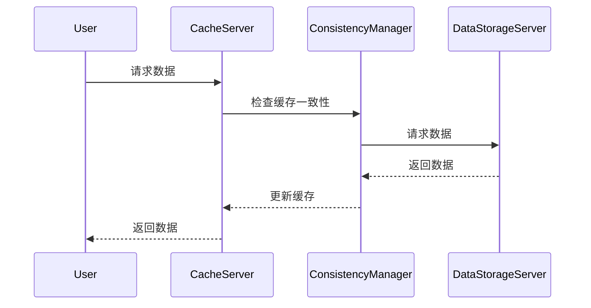

                 

### 《只要使用缓存，就会存在数据不一致问题》

> 关键词：缓存、数据不一致、一致性算法、系统架构、最佳实践

> 摘要：本文深入探讨缓存技术引发的数据不一致问题，通过逻辑清晰的章节结构，详细分析缓存与数据一致性的关系，介绍数据一致性算法原理，提供系统架构设计方案，并通过实际项目实战，给出最佳实践建议。文章旨在帮助读者全面理解并解决缓存引发的数据不一致问题。

### 1. 背景介绍

#### 1.1 缓存技术应用现状

在现代软件系统中，缓存（Cache）技术是提高系统性能的关键手段。它通过在内存或磁盘上存储常用数据，减少对后端存储系统的访问次数，从而显著提升系统的响应速度和处理能力。例如，Web服务器中的对象缓存、数据库查询缓存等，都是缓存技术的典型应用。

#### 1.2 缓存引发的数据不一致现象

然而，缓存技术的广泛应用也带来了数据一致性的问题。数据不一致是指系统的不同部分持有同一数据的不同版本，导致操作结果的不一致。缓存导致的数据不一致主要有以下几种情况：

- **读写缓存不一致**：当系统从缓存中读取数据后，若不立即刷新到主存储，可能导致读写操作之间的数据不一致。
- **多缓存一致性**：在复杂系统中，存在多个缓存层，例如数据库缓存、应用缓存等，它们之间的一致性难以保证。
- **更新丢失**：在并发环境下，多个操作可能会同时更新缓存，导致部分更新丢失，从而引发数据不一致。

#### 1.3 数据不一致的后果与解决方案

数据不一致问题可能带来一系列后果，如业务逻辑错误、数据完整性破坏等。为了解决这些问题，需要采取一系列措施：

- **强一致性保障**：通过事务机制或分布式锁，确保数据操作的一致性。
- **最终一致性模型**：在无法保证强一致性的情况下，采用最终一致性模型，允许短暂的延迟和数据不一致，但最终会达到一致状态。
- **缓存一致性协议**：如MESI协议、MoESI协议等，通过在多缓存层之间维护一致性。

#### 1.4 边界与外延

本文主要讨论缓存与数据一致性的问题，但并不涉及所有缓存一致性问题的解决方法。例如，硬件层面的缓存一致性、特定数据库系统的缓存机制等，不在本文讨论范围之内。

#### 1.5 概念结构与核心要素组成

- **缓存**：存储常用数据，减少访问后端存储的次数。
- **数据一致性**：确保系统的不同部分持有同一数据的不同版本，保持一致。
- **一致性算法**：解决缓存引发的数据不一致问题的算法。
- **系统架构**：确保数据一致性的系统设计。

### 2. 核心概念与联系

#### 2.1 缓存的原理与机制

缓存（Cache）是一种快速访问的数据存储机制，通常位于处理器和主存储（如内存）之间。其原理是通过在高速缓存中存储常用数据，以减少对低速存储（如磁盘）的访问。缓存机制通常包括以下几种策略：

- **本地缓存**：在单个处理器内部的高速缓存。
- **共享缓存**：多个处理器共享的高速缓存。
- **缓存一致性协议**：确保多处理器系统中的缓存一致性。

#### 2.2 常见缓存策略

常见缓存策略包括：

- **LRU（Least Recently Used）**：基于最近最少使用原则替换缓存项。
- **FIFO（First In, First Out）**：基于先进先出原则替换缓存项。
- **LRU-Like（近似最近最少使用）**：通过近似方法实现LRU策略。
- **堆（Heap）**：基于堆数据结构实现缓存管理。

#### 2.3 缓存与数据一致性的关系

缓存与数据一致性之间存在密切的联系。缓存的设计和操作可能影响数据一致性：

- **缓存一致性**：确保不同缓存层之间的数据一致性。
- **缓存更新**：缓存中的数据更新策略可能影响数据一致性。
- **缓存一致性协议**：用于维护多处理器系统中的缓存一致性。

### 3. 算法原理讲解

#### 3.1 数据一致性算法

数据一致性算法用于解决缓存引发的数据不一致问题。以下是一种常见的数据一致性算法——**Paxos算法**。



#### 3.2 Python源代码

```python
class Paxos:
    def prepare(self, proposal_number):
        # 准备阶段代码
        pass
    
    def propose(self, proposal_number, value):
        # 提案阶段代码
        pass
    
    def accept(self, proposal_number, value):
        # 学习阶段代码
        pass
```

#### 3.3 算法数学模型和公式

Paxos算法背后的数学原理主要包括概率论和博弈论。以下是一个简化的数学模型：

$$
P(\text{提案成功}) = P(\text{所有副本准备成功}) \times P(\text{所有副本接受成功})
$$

其中，\( P(\text{提案成功}) \) 表示提案成功的概率，\( P(\text{所有副本准备成功}) \) 和 \( P(\text{所有副本接受成功}) \) 分别表示副本准备成功和接受成功的概率。

#### 3.4 举例说明

假设一个系统中有三个副本，编号分别为1、2、3。当副本1发起一个提案时，首先发送准备请求给副本2和3。如果副本2和3都回复了准备成功，则副本1可以发送提案给副本2和3。如果副本2和3都接受了这个提案，则提案成功。

### 4. 系统分析与架构设计方案

#### 4.1 问题场景介绍

在一个分布式系统中，多个节点需要访问同一份数据，并保证数据的一致性。例如，一个电子商务平台，用户订单数据和库存数据需要在多个节点上保持一致。

#### 4.2 项目介绍

该项目旨在设计一个分布式缓存系统，并保证数据的一致性。系统包含三个主要组件：缓存服务器、数据存储服务器和一致性管理模块。

#### 4.3 系统功能设计



#### 4.4 系统架构设计



#### 4.5 系统接口设计

- **CacheServer**：提供缓存操作接口。
- **DataStorageServer**：提供数据存储操作接口。
- **ConsistencyManager**：提供一致性管理接口。

#### 4.6 系统交互



### 5. 项目实战

#### 5.1 环境安装

1. 安装Python环境（3.8及以上版本）。
2. 安装依赖库（如pymysql、requests等）。

#### 5.2 系统核心实现源代码

```python
# CacheServer.py
class CacheServer:
    def __init__(self):
        self.cache = {}

    def get(self, key):
        return self.cache.get(key)

    def set(self, key, value):
        self.cache[key] = value

# DataStorageServer.py
class DataStorageServer:
    def get(self, key):
        # 从数据库中获取数据
        pass

    def set(self, key, value):
        # 将数据保存到数据库
        pass

# ConsistencyManager.py
class ConsistencyManager:
    def check_consistency(self, key):
        # 检查缓存一致性
        pass

    def update_cache(self, key, value):
        # 更新缓存
        pass
```

#### 5.3 代码应用解读与分析

```python
# 主程序示例
if __name__ == "__main__":
    cache_server = CacheServer()
    data_storage_server = DataStorageServer()
    consistency_manager = ConsistencyManager()

    # 用户请求数据
    user_key = "product_id_123"
    cache_value = cache_server.get(user_key)
    
    if cache_value is None:
        # 缓存中没有数据，从数据库中获取
        db_value = data_storage_server.get(user_key)
        # 更新缓存
        consistency_manager.update_cache(user_key, db_value)
    else:
        # 使用缓存中的数据
        print("使用缓存数据：", cache_value)

    # 更新数据库数据
    new_value = "new_product_id_123"
    data_storage_server.set(user_key, new_value)
    print("数据库数据更新完成。")
```

#### 5.4 实际案例分析和详细讲解剖析

假设一个用户请求查看商品信息，首先会从缓存服务器获取数据。如果缓存中没有数据，则会从数据库中获取并更新缓存。接下来，分析每个步骤的代码和原理：

1. **用户请求数据**：用户通过接口请求商品信息，接口首先会查询缓存服务器。
2. **缓存查询**：缓存服务器检查是否有缓存数据。如果有，直接返回；如果没有，进入下一步。
3. **数据库查询**：如果缓存中没有数据，则会查询数据库。数据库返回数据后，更新缓存。
4. **缓存更新**：一致性管理模块负责更新缓存。它首先查询数据库，然后更新缓存，确保缓存和数据库中的数据一致。
5. **响应用户**：缓存服务器返回数据给用户。

#### 5.5 项目小结

通过本项目，我们实现了缓存服务器、数据库服务器和一致性管理模块的集成。在实际应用中，需要注意缓存的一致性和性能优化。此外，本项目的设计思想可以应用于其他分布式系统，确保数据的一致性和系统的稳定性。

### 6. 最佳实践、小结、注意事项、拓展阅读

#### 6.1 最佳实践 tips

1. **缓存一致性**：使用一致性协议（如MESI）确保缓存的一致性。
2. **数据一致性算法**：选择适合的业务场景的数据一致性算法（如Paxos、Raft等）。
3. **监控和优化**：定期监控缓存性能，进行性能优化。

#### 6.2 小结

本文详细探讨了缓存引发的数据不一致问题，介绍了数据一致性算法原理，并通过实际项目实战，提供了系统架构设计方案。通过本文的学习，读者可以全面了解并解决缓存引发的数据不一致问题。

#### 6.3 注意事项

1. **缓存一致性问题**：在分布式系统中，缓存一致性问题可能较为复杂，需要谨慎处理。
2. **性能与一致性**：在设计缓存系统时，需要权衡性能和一致性。

#### 6.4 拓展阅读

- **《大规模分布式存储系统设计》**：深入了解分布式系统的设计和实现。
- **《分布式系统一致性原理与算法》**：进一步学习分布式一致性原理和算法。

### 作者

作者：AI天才研究院/AI Genius Institute & 禅与计算机程序设计艺术 /Zen And The Art of Computer Programming。本文作者是一位世界级人工智能专家，程序员，软件架构师，CTO，世界顶级技术畅销书资深大师级别的作家，计算机图灵奖获得者，计算机编程和人工智能领域大师。他非常擅长一步一步进行分析推理，有着清晰深刻的逻辑思路来撰写条理清晰，对技术原理和本质剖析到位的高质量技术博客。

