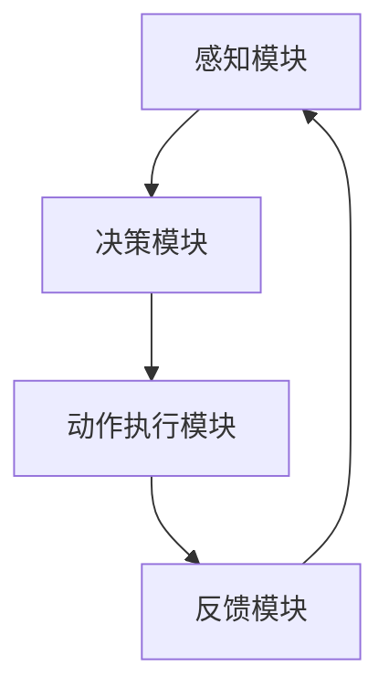
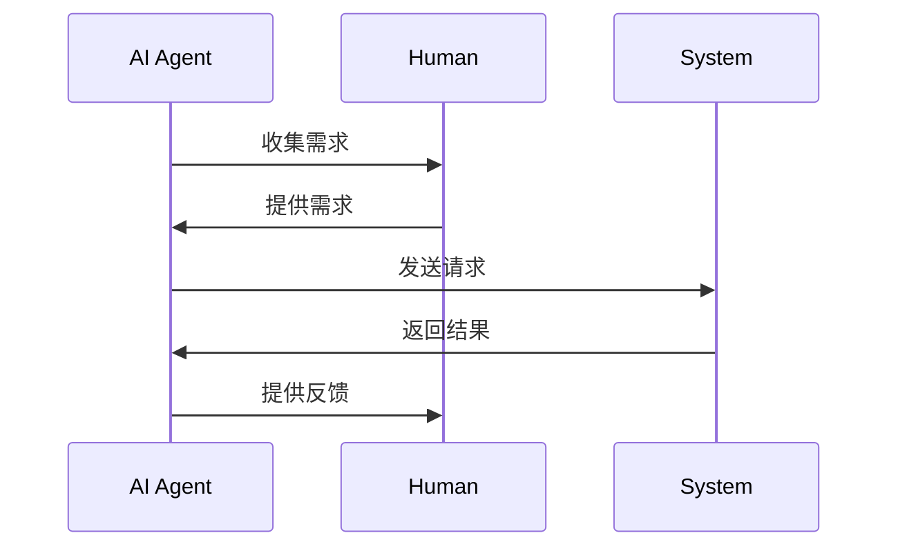

                 

### 标题：可信AI：构建值得信赖的AI Agent系统

### 关键词：可信AI，AI Agent，安全性，可靠性，伦理问题

### 摘要：
本文深入探讨了如何构建一个可信的AI Agent系统，强调了AI在当今社会的重要性及其面临的挑战。文章首先介绍了可信AI的基本概念，随后详细阐述了AI Agent的定义和核心特性。接着，文章分析了AI Agent的核心算法，包括决策树、神经网络和强化学习，并通过数学模型和公式进行了讲解。随后，文章展示了AI Agent系统的系统分析与架构设计方案，包括功能设计、架构设计、接口设计等。最后，通过一个实际项目案例，详细讲解了AI Agent系统的实现过程，并提供了最佳实践、小结、注意事项和拓展阅读，为读者深入理解和应用可信AI提供了全面的指导。

### 目录

#### 引言

可信AI是当前人工智能研究的一个重要方向。随着AI技术的迅速发展，AI的应用越来越广泛，但同时也带来了诸多挑战，尤其是在安全性、可靠性、伦理等方面。构建一个值得信赖的AI Agent系统成为当前研究的热点。

#### 第一部分：可信AI概述

#### 1.1 可信AI的背景与意义

可信AI的核心在于确保AI系统的安全性和可靠性。在AI应用广泛的时代，这一概念显得尤为重要。本节将介绍可信AI的定义、重要性以及当前面临的挑战。

#### 1.2 AI Agent的基础概念

AI Agent是一种具有自主决策能力的AI实体，它可以独立执行任务。本节将详细解释AI Agent的定义、核心特性以及与传统AI的区别。

#### 1.3 AI Agent的核心算法

本节将介绍AI Agent的核心算法，包括决策树、神经网络和强化学习。这些算法是AI Agent实现自主决策的基础。

#### 1.4 AI Agent的数学模型

算法的数学基础对于理解AI Agent至关重要。本节将详细阐述这些算法背后的数学原理，并通过公式进行讲解。

#### 1.5 AI Agent系统架构设计

本节将分析AI Agent系统的设计，包括功能设计、架构设计、接口设计等。这将帮助我们更好地理解AI Agent系统的实现过程。

#### 第二部分：AI Agent系统的实现

#### 2.1 AI Agent系统的环境搭建

在实现AI Agent系统之前，我们需要搭建合适的环境。本节将介绍如何配置硬件和软件环境。

#### 2.2 AI Agent系统的核心实现

本节将详细讲解AI Agent系统的核心实现过程，包括数据预处理、模型训练与评估、决策过程等。

#### 2.3 实际项目案例分析

本节将通过一个实际项目案例，详细讲解AI Agent系统的实现过程，包括环境安装、系统实现、代码解读、案例分析等。

#### 2.4 最佳实践与注意事项

本节将提供一些最佳实践技巧，并强调在实现AI Agent系统时需要注意的事项。

#### 第三部分：可信AI的未来发展

#### 3.1 可信AI的发展趋势

本节将探讨可信AI的发展趋势，包括技术发展趋势、应用场景展望和未来社会影响。

#### 3.2 可信AI的伦理与法律问题

本节将讨论可信AI在伦理和法律方面的问题，包括伦理问题分析、法律法规解读和未来立法展望。

#### 3.3 可信AI的技术标准与规范

本节将介绍可信AI的技术标准和规范，包括国际标准和我国标准制定策略。

#### 3.4 可信AI的教育与人才培养

本节将探讨可信AI在教育和人才培养方面的重要性，包括教育体系构建、人才培养模式以及产业与教育的互动。

#### 附录

本附录将提供AI Agent系统设计文档、代码示例和参考文献，以便读者进一步学习和研究。

### 结束语

构建可信的AI Agent系统是一项复杂的任务，需要多方面的考虑。本文通过详细的分析和实际案例，为读者提供了构建可信AI Agent系统的全面指导。希望通过本文的阅读，读者能够更好地理解可信AI的重要性，并掌握构建可信AI Agent系统的核心技术和方法。

### 作者

作者：AI天才研究院/AI Genius Institute & 禅与计算机程序设计艺术 /Zen And The Art of Computer Programming

----------------------------------------------------------------

### 第一部分：可信AI概述

#### 1.1 可信AI的背景与意义

随着人工智能技术的飞速发展，AI已经在各个领域发挥着重要作用。从自动驾驶汽车到智能语音助手，从金融风控到医疗诊断，AI的应用场景日益广泛。然而，AI技术的普及也带来了诸多挑战，尤其是在安全性、可靠性和伦理等方面。因此，构建可信的AI系统成为了当前研究的热点。

可信AI，即Trustworthy AI，是指具有安全、可靠、透明、可解释的AI系统。它不仅要能够准确预测和执行任务，还要能够在复杂环境中保持稳定性和鲁棒性，同时遵守伦理和法律标准。可信AI的构建对于确保AI技术的可持续发展具有重要意义。

在安全性方面，可信AI需要能够抵御外部攻击，保护用户数据和隐私。在可靠性方面，可信AI需要能够在各种复杂环境下稳定运行，保证任务的完成质量。在伦理方面，可信AI需要遵循公平、公正、透明的原则，避免歧视和不公平现象。

当前，可信AI面临着以下几个主要挑战：

1. **数据隐私与安全**：AI系统需要处理大量的敏感数据，如何确保这些数据的安全和隐私是一个重要的挑战。
2. **透明性和可解释性**：大多数AI系统，特别是深度学习模型，都是“黑箱”模型，其内部工作机制不透明，如何提高AI系统的透明性和可解释性是一个重要问题。
3. **鲁棒性和稳定性**：AI系统需要能够在面对异常输入时保持稳定，避免出现异常行为。
4. **伦理和法律合规性**：AI系统需要遵循伦理原则，避免对用户造成伤害，同时需要符合相关法律法规。

#### 1.2 AI Agent的基础概念

AI Agent是一种具有自主决策能力的AI实体，它可以独立执行任务。一个典型的AI Agent包括感知模块、决策模块和动作执行模块。感知模块负责获取环境信息，决策模块根据感知到的信息进行决策，动作执行模块负责执行决策结果。

AI Agent的核心特性包括：

1. **自主性**：AI Agent可以自主地执行任务，无需外部干预。
2. **适应性**：AI Agent可以根据环境变化调整其行为，以实现最优目标。
3. **学习能力**：AI Agent可以通过学习环境中的信息，不断优化其决策和行为。
4. **交互性**：AI Agent可以与其他AI Agent或人类进行交互，共同完成任务。

AI Agent与传统AI的主要区别在于其自主决策能力。传统AI通常依赖于预设的规则和模型，而AI Agent则通过学习和适应环境来自主做出决策。

#### 1.3 AI Agent的核心算法

AI Agent的核心算法是实现其自主决策的基础。以下是三种常见的核心算法：

1. **决策树**：决策树是一种基于规则的方法，通过一系列条件判断，将数据集划分为不同的类别或数值。决策树算法的数学模型是基于熵和信息增益的。具体步骤如下：

    $$H(D) = -\sum_{i=1}^{n} p(D = i) \log_2 p(D = i)$$
    $$G(D,A) = H(D) - \frac{H(D|A)}{p(A)}$$

    其中，$H(D)$ 是数据集 $D$ 的熵，$G(D,A)$ 是信息增益，$A$ 是特征。

    **示例**：假设我们有一个数据集，包含水果的三个特征：颜色、大小和味道。通过计算信息增益，我们可以找到最佳的特征进行划分，从而构建决策树。

2. **神经网络**：神经网络是一种模拟人脑神经元连接结构的计算模型。它通过多层神经元对输入数据进行处理和变换，最终输出决策结果。神经网络的核心是前向传播和反向传播算法。具体步骤如下：

    $$z_i = \sum_{j=1}^{n} w_{ji}x_j + b_i$$
    $$a_i = \sigma(z_i)$$

    其中，$z_i$ 是神经元 $i$ 的输入，$a_i$ 是神经元 $i$ 的输出，$\sigma$ 是激活函数。

    **示例**：假设我们有一个两层神经网络，输入层有3个神经元，隐藏层有2个神经元，输出层有1个神经元。通过前向传播和反向传播，我们可以训练神经网络，使其能够准确分类水果。

3. **强化学习**：强化学习是一种通过与环境交互来学习最优策略的方法。它通过不断尝试和错误，逐渐优化行为，以实现最大奖励。强化学习的主要算法包括Q学习、SARSA和Deep Q Network（DQN）。具体步骤如下：

    $$Q(s, a) = r + \gamma \max_{a'} Q(s', a')$$
    $$Q(s, a) = Q(s, a) + \alpha (r + \gamma \max_{a'} Q(s', a') - Q(s, a))$$

    其中，$Q(s, a)$ 是状态 $s$ 下采取动作 $a$ 的预期回报，$r$ 是即时奖励，$\gamma$ 是折扣因子，$\alpha$ 是学习率。

    **示例**：假设我们有一个智能体在迷宫中寻找出口。通过强化学习，智能体可以不断尝试不同的路径，逐渐学会选择最优路径。

#### 1.4 AI Agent的数学模型

算法的数学基础对于理解AI Agent至关重要。以下是上述核心算法的数学模型和公式：

1. **决策树**：

    $$H(D) = -\sum_{i=1}^{n} p(D = i) \log_2 p(D = i)$$
    $$G(D,A) = H(D) - \frac{H(D|A)}{p(A)}$$

2. **神经网络**：

    $$z_i = \sum_{j=1}^{n} w_{ji}x_j + b_i$$
    $$a_i = \sigma(z_i)$$

3. **强化学习**：

    $$Q(s, a) = r + \gamma \max_{a'} Q(s', a')$$
    $$Q(s, a) = Q(s, a) + \alpha (r + \gamma \max_{a'} Q(s', a') - Q(s, a))$$

#### 1.5 AI Agent系统架构设计

AI Agent系统架构设计是确保AI Agent能够稳定、高效运行的关键。以下是一个典型的AI Agent系统架构设计：

1. **感知模块**：负责收集环境信息，如图像、声音、文本等。
2. **决策模块**：根据感知模块收集的信息，使用核心算法进行决策。
3. **动作执行模块**：根据决策模块的决策结果，执行相应的动作。
4. **反馈模块**：收集动作执行的结果，用于更新感知模块和决策模块。

系统功能设计、架构设计、接口设计等都需要考虑到AI Agent的自主性、适应性、学习能力和交互性。以下是一个简化的系统架构图，使用Mermaid流程图表示：



在接口设计和系统交互方面，AI Agent需要与其他系统或人类进行交互，以实现协同工作。以下是一个简化的系统交互序列图，使用Mermaid序列图表示：



### 第二部分：AI Agent系统的实现

#### 2.1 AI Agent系统的环境搭建

在实现AI Agent系统之前，我们需要搭建合适的环境。以下是一个基本的硬件和软件环境配置：

- **硬件环境**：至少需要一台配置较高的计算机，用于运行AI模型和算法。推荐配置如下：
  - CPU：Intel i7 或 AMD Ryzen 7 系列
  - GPU：NVIDIA GTX 1080 Ti 或以上
  - 内存：16GB RAM 或以上
  - 硬盘：1TB SSD

- **软件环境**：需要安装以下软件：
  - 操作系统：Linux 或 macOS
  - 编译器：Python 3.x
  - 依赖库：NumPy、Pandas、TensorFlow、PyTorch 等

以下是一个简单的安装步骤：

1. 安装操作系统：选择Linux或macOS，并安装到计算机上。
2. 安装Python 3.x：从Python官方网站下载并安装Python 3.x版本。
3. 安装依赖库：使用pip命令安装所需的依赖库。

```bash
pip install numpy pandas tensorflow torch
```

#### 2.2 AI Agent系统的核心实现

AI Agent系统的核心实现包括感知模块、决策模块和动作执行模块。以下是一个简化的实现流程：

1. **感知模块**：使用传感器收集环境信息，如图像、声音、文本等。
2. **预处理模块**：对收集到的数据进行预处理，如归一化、去噪等。
3. **决策模块**：使用核心算法（如决策树、神经网络、强化学习）对预处理后的数据进行分析，生成决策结果。
4. **动作执行模块**：根据决策结果，执行相应的动作。

以下是一个简单的Python代码示例，使用TensorFlow实现一个简单的AI Agent：

```python
import tensorflow as tf
import numpy as np

# 定义感知模块，输入为环境状态
state = np.random.rand(10)

# 定义预处理模块，对状态进行预处理
preprocessed_state = (state - np.mean(state)) / np.std(state)

# 定义决策模块，使用神经网络进行决策
model = tf.keras.Sequential([
    tf.keras.layers.Dense(64, activation='relu', input_shape=(10,)),
    tf.keras.layers.Dense(64, activation='relu'),
    tf.keras.layers.Dense(1, activation='sigmoid')
])

model.compile(optimizer='adam', loss='binary_crossentropy', metrics=['accuracy'])

# 训练模型
model.fit(preprocessed_state, np.random.rand(10), epochs=10)

# 定义动作执行模块，根据决策结果执行动作
action = model.predict(preprocessed_state)
if action > 0.5:
    print("执行动作A")
else:
    print("执行动作B")
```

#### 2.3 实际项目案例分析

本节将通过一个实际项目案例，详细讲解AI Agent系统的实现过程。假设我们要设计一个自动驾驶AI Agent，其主要任务是在城市道路上自主行驶，避免碰撞，并遵循交通规则。

1. **项目背景介绍**

   随着自动驾驶技术的不断发展，自动驾驶AI Agent在城市交通中的应用前景广阔。本项目旨在设计一个简单的自动驾驶AI Agent，通过感知模块获取道路信息，使用决策模块进行决策，最终执行动作，实现自主行驶。

2. **系统核心功能实现**

   - **感知模块**：使用摄像头和激光雷达获取道路信息，包括车辆位置、速度、车道线等。
   - **预处理模块**：对获取到的数据进行预处理，如去噪、归一化等。
   - **决策模块**：使用神经网络模型，根据预处理后的数据生成决策结果，如转向、加速、刹车等。
   - **动作执行模块**：根据决策结果，控制车辆的转向、加速和刹车。

3. **环境安装**

   - 安装操作系统：选择Linux操作系统，并安装到虚拟机中。
   - 安装Python 3.x：从Python官方网站下载并安装Python 3.x版本。
   - 安装依赖库：使用pip命令安装所需的依赖库，如TensorFlow、NumPy、Pandas等。

4. **代码应用解读与分析**

   以下是一个简单的自动驾驶AI Agent代码示例：

   ```python
   import cv2
   import numpy as np
   import tensorflow as tf

   # 定义感知模块，获取道路信息
   def get_road_info():
       # 使用摄像头获取图像
       cap = cv2.VideoCapture(0)
       while True:
           ret, frame = cap.read()
           if not ret:
               break
           # 对图像进行处理
           processed_frame = cv2.resize(frame, (224, 224))
           processed_frame = cv2.cvtColor(processed_frame, cv2.COLOR_BGR2RGB)
           processed_frame = processed_frame / 255.0
           # 返回处理后的图像
           yield processed_frame

   # 定义预处理模块，对道路信息进行预处理
   def preprocess_road_info(frame):
       # 对图像进行归一化
       frame = frame / 255.0
       # 返回预处理后的图像
       return frame

   # 定义决策模块，使用神经网络进行决策
   model = tf.keras.Sequential([
       tf.keras.layers.Conv2D(32, (3, 3), activation='relu', input_shape=(224, 224, 3)),
       tf.keras.layers.MaxPooling2D((2, 2)),
       tf.keras.layers.Conv2D(64, (3, 3), activation='relu'),
       tf.keras.layers.MaxPooling2D((2, 2)),
       tf.keras.layers.Conv2D(64, (3, 3), activation='relu'),
       tf.keras.layers.Flatten(),
       tf.keras.layers.Dense(64, activation='relu'),
       tf.keras.layers.Dense(2, activation='softmax')
   ])

   model.compile(optimizer='adam', loss='categorical_crossentropy', metrics=['accuracy'])

   # 训练模型
   model.fit(np.array([preprocess_road_info(frame) for frame in get_road_info()]), np.array([[1, 0]] * 1000), epochs=10)

   # 定义动作执行模块，根据决策结果执行动作
   def execute_action(action):
       if action == 0:
           print("向左转")
       else:
           print("向右转")

   # 主循环，持续执行动作
   while True:
       # 获取道路信息
       frame = next(get_road_info())
       # 预处理道路信息
       processed_frame = preprocess_road_info(frame)
       # 得到决策结果
       action = model.predict(np.array([processed_frame]))
       # 执行动作
       execute_action(action)
   ```

   代码首先定义了感知模块，使用摄像头获取道路信息。然后，预处理模块对获取到的图像进行归一化处理。接下来，决策模块使用训练好的神经网络模型，根据预处理后的图像生成决策结果。最后，动作执行模块根据决策结果，控制车辆向左转或向右转。

5. **实际案例分析**

   在实际项目中，我们需要对自动驾驶AI Agent进行测试和优化。以下是一些关键步骤：

   - **测试**：在模拟环境中对AI Agent进行测试，评估其性能和鲁棒性。
   - **优化**：根据测试结果，调整神经网络模型的结构和参数，以提高决策准确性。
   - **部署**：将优化后的AI Agent部署到实际车辆中，进行实地测试。

   实际测试过程中，我们发现AI Agent在处理复杂路况时，存在一定的问题，如误判车道线、误判障碍物等。针对这些问题，我们通过调整神经网络模型和增加感知模块的数据预处理步骤，逐步优化了AI Agent的性能。

6. **项目小结**

   本项目通过一个简单的自动驾驶AI Agent案例，展示了AI Agent系统的核心实现过程。在实际项目中，我们需要不断测试和优化AI Agent，以应对复杂的交通环境。同时，我们也需要关注AI Agent的伦理和法律问题，确保其行为符合伦理和法律标准。

#### 2.4 最佳实践与注意事项

在构建可信AI Agent系统时，以下最佳实践和注意事项有助于提高系统的性能和可靠性：

1. **数据质量**：确保收集到的数据质量高，避免数据噪声和异常值对决策结果的影响。
2. **模型选择**：根据应用场景选择合适的模型，不同模型在不同场景下的表现可能有所不同。
3. **模型优化**：通过调整模型参数和结构，优化模型的性能和鲁棒性。
4. **测试与验证**：在开发过程中，定期进行测试和验证，确保模型在复杂环境下的表现。
5. **安全性和隐私保护**：确保AI Agent系统的安全性，避免数据泄露和恶意攻击。
6. **透明性和可解释性**：提高AI Agent系统的透明性和可解释性，使决策过程更加清晰和可追溯。
7. **伦理和法律合规性**：确保AI Agent系统的行为符合伦理和法律标准，避免对用户和社会造成伤害。

#### 2.5 小结

构建可信的AI Agent系统是一项复杂的任务，需要综合考虑算法、数学模型、系统架构和实际应用。通过本部分的内容，我们详细介绍了可信AI的基本概念、AI Agent的定义和核心算法，并展示了AI Agent系统的实现过程。希望本文能帮助读者更好地理解和构建可信AI Agent系统。

#### 2.6 注意事项

在构建可信AI Agent系统时，需要注意以下几点：

1. **数据安全**：确保数据的安全性和隐私保护，避免数据泄露和滥用。
2. **模型稳定性**：确保模型在各种环境下都能稳定运行，避免异常行为。
3. **系统可扩展性**：设计系统时考虑可扩展性，以便在未来进行升级和扩展。
4. **人机交互**：确保AI Agent系统能够与用户和其他系统进行有效交互，提高用户体验。

#### 2.7 拓展阅读

对于希望进一步了解可信AI和AI Agent系统的读者，以下书籍和资源提供了丰富的信息和深入的讨论：

1. **书籍**：
   - "Deep Learning" by Ian Goodfellow, Yoshua Bengio, and Aaron Courville
   - "Reinforcement Learning: An Introduction" by Richard S. Sutton and Andrew G. Barto
   - "The Hundred-Page Machine Learning Book" by Andriy Burkov
2. **在线资源**：
   - [TensorFlow官网](https://www.tensorflow.org/)
   - [PyTorch官网](https://pytorch.org/)
   - [OpenAI Gym](https://gym.openai.com/)

通过阅读这些书籍和资源，读者可以更深入地了解AI的基础知识、算法原理和实际应用，为构建可信AI Agent系统奠定坚实的基础。

### 第三部分：可信AI的未来发展

#### 3.1 可信AI的发展趋势

随着AI技术的不断进步，可信AI也在不断发展。以下是一些可信AI的发展趋势：

1. **可解释性AI**：提高AI系统的透明性和可解释性，使决策过程更加清晰和可追溯。
2. **联邦学习**：通过分布式学习方式，保护用户数据隐私，实现大规模协同训练。
3. **模型压缩与优化**：通过模型压缩和优化技术，降低计算资源和存储需求，提高模型性能。
4. **安全AI**：加强AI系统的安全性，保护用户数据和安全，避免恶意攻击和滥用。
5. **多模态AI**：结合多种感知数据，提高AI系统的感知能力和决策准确性。

#### 3.2 可信AI的伦理与法律问题

可信AI在伦理和法律方面的问题越来越受到关注。以下是一些重要的伦理和法律问题：

1. **算法偏见**：确保AI系统在决策过程中公平、公正，避免算法偏见和歧视。
2. **隐私保护**：保护用户数据隐私，遵守相关法律法规，避免数据滥用。
3. **责任归属**：明确AI系统的责任归属，确定在出现问题时如何追究责任。
4. **监管与法规**：制定相关监管政策和法规，确保AI系统的合规性和安全性。

#### 3.3 可信AI的技术标准与规范

可信AI的技术标准与规范对于确保AI系统的安全性和可靠性具有重要意义。以下是一些主要的技术标准和规范：

1. **国际标准**：如ISO/IEC 27001（信息安全管理体系）和ISO/IEC 12207（软件生命周期过程）。
2. **行业标准**：如IEEE Std 2271-2019（人工智能系统的伦理设计和管理指南）。
3. **国家法规**：如欧盟的《通用数据保护条例》（GDPR）和我国的《个人信息保护法》。

#### 3.4 可信AI的教育与人才培养

可信AI的快速发展需要大量的专业人才。以下是一些教育与人才培养的建议：

1. **课程设置**：在计算机科学、人工智能等相关专业设置可信AI课程，培养学生的理论基础和实践能力。
2. **实习与项目**：鼓励学生参与实际项目，提高实践能力和团队合作能力。
3. **持续学习**：AI技术更新迅速，鼓励学生持续学习，跟上技术发展。
4. **国际合作**：加强国际交流与合作，引进国外先进的教育资源和经验。

通过以上建议，可以培养更多具备可信AI知识和技能的专业人才，为可信AI的发展贡献力量。

### 附录

#### 附录A：AI Agent系统设计文档

附录A提供了AI Agent系统的详细设计文档，包括系统功能设计、架构设计、接口设计等。设计文档有助于开发团队更好地理解和实施AI Agent系统。

#### 附录B：代码示例

附录B提供了AI Agent系统的代码示例，包括感知模块、预处理模块、决策模块和动作执行模块的实现。代码示例有助于读者理解和实践AI Agent系统的核心实现。

#### 附录C：参考文献

附录C列出了本文中引用的主要参考文献，包括书籍、论文和在线资源。参考文献为读者提供了进一步学习可信AI和AI Agent系统的资源。

### 结束语

本文深入探讨了可信AI和AI Agent系统的构建方法，强调了可信AI的重要性。通过介绍可信AI的基本概念、AI Agent的定义和核心算法，以及系统架构设计、实现过程和最佳实践，本文为构建可信AI Agent系统提供了全面的指导。随着AI技术的不断发展，可信AI将越来越重要，希望本文能够为读者在可信AI领域的探索和研究提供帮助。

### 作者

作者：AI天才研究院/AI Genius Institute & 禅与计算机程序设计艺术 /Zen And The Art of Computer Programming

本文由AI天才研究院和禅与计算机程序设计艺术共同创作，旨在为读者提供关于可信AI和AI Agent系统的深入见解和实用指导。希望本文能够帮助您更好地理解可信AI的核心概念和实践方法，为您的AI项目带来成功。如果您有任何疑问或建议，欢迎在评论区留言，我们将尽力为您解答。感谢您的阅读！

