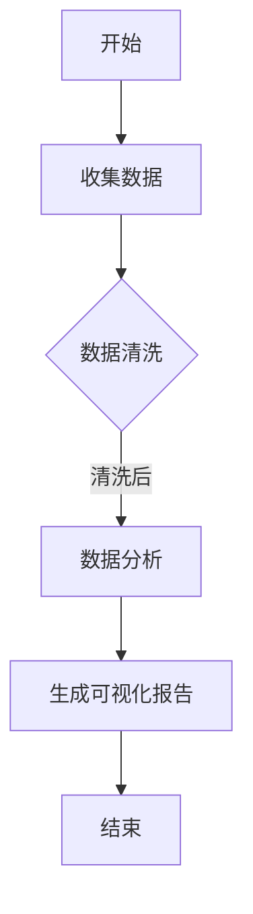
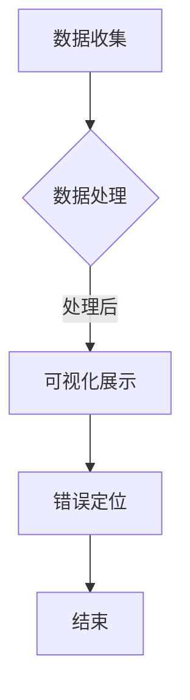
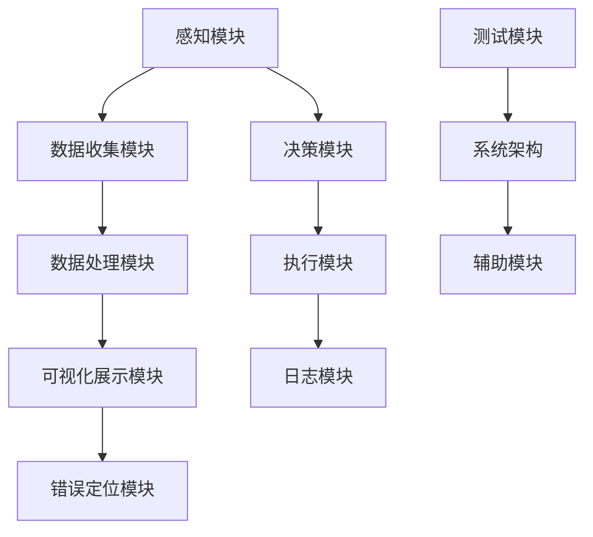

                 

# 《可视化调试：深入了解AI Agent的决策过程》

> 关键词：AI Agent、可视化调试、决策过程、算法、系统架构、Python代码实现

> 摘要：本文旨在通过详细探讨AI Agent的决策过程及其与可视化调试的关联，为开发者提供一种高效的问题解决方法。文章首先介绍了AI Agent的定义、作用和应用场景，接着阐述了可视化调试的基本原理、优势以及其在调试AI Agent决策过程中的重要性。随后，文章深入分析了AI Agent和可视化调试的核心概念及其相互关系，并详细讲解了可视化调试算法的原理和实现。最后，文章通过一个实际案例，展示了可视化调试在AI Agent决策过程调试中的应用，为读者提供了实用的参考。

## 目录大纲

# 《可视化调试：深入了解AI Agent的决策过程》

----------------------------------------------------------------

## 第一部分：背景介绍

## 第1章 问题背景与概述

## 1.1 问题背景

### 1.1.1 AI Agent的定义与作用

### 1.1.2 AI Agent在现实世界中的应用

### 1.1.3 调试的重要性

## 1.2 问题描述

### 1.2.1 调试面临的挑战

### 1.2.2 可视化调试的需求

## 1.3 问题解决

### 1.3.1 可视化调试的基本原理

### 1.3.2 可视化调试的优势

## 1.4 边界与外延

### 1.4.1 调试的边界

### 1.4.2 可视化调试的外延

## 1.5 概念结构与核心要素组成

### 1.5.1 AI Agent的结构

### 1.5.2 可视化调试的核心要素

## 1.6 本章小结

----------------------------------------------------------------

## 第二部分：核心概念与联系

## 第2章 核心概念原理

## 2.1 AI Agent的组成与工作原理

### 2.1.1 AI Agent的基本组成

### 2.1.2 AI Agent的工作原理

### 2.1.3 AI Agent的核心属性

## 2.2 可视化调试的概念与类型

### 2.2.1 可视化调试的定义

### 2.2.2 可视化调试的类型

### 2.2.3 可视化调试的优势与挑战

## 2.3 AI Agent与可视化调试的联系

### 2.3.1 AI Agent对可视化调试的需求

### 2.3.2 可视化调试对AI Agent的支持

### 2.3.3 AI Agent与可视化调试的协同作用

## 2.4 概念属性特征对比表格

### 2.4.1 AI Agent属性特征对比

### 2.4.2 可视化调试属性特征对比

## 2.5 ER实体关系图架构

### 2.5.1 AI Agent实体关系图

### 2.5.2 可视化调试实体关系图

## 2.6 本章小结

----------------------------------------------------------------

## 第三部分：算法原理讲解

## 第3章 算法原理讲解

## 3.1 可视化调试算法的基本原理

### 3.1.1 可视化调试算法的定义

### 3.1.2 可视化调试算法的基本流程

### 3.1.3 可视化调试算法的关键技术

## 3.2 算法原理Mermaid流程图



## 3.3 Python源代码详解

### 3.3.1 数据收集模块

### 3.3.2 数据清洗模块

### 3.3.3 数据分析模块

### 3.3.4 可视化报告生成模块

## 3.4 算法原理的数学模型与公式

### 3.4.1 数学模型概述

### 3.4.2 数学公式详细讲解

### 3.4.3 举例说明

## 3.5 本章小结

----------------------------------------------------------------

## 第四部分：系统分析与架构设计方案

## 第4章 系统分析与架构设计方案

## 4.1 问题场景介绍

### 4.1.1 场景一：AI Agent决策过程调试

### 4.1.2 场景二：AI Agent行为预测调试

## 4.2 项目介绍

### 4.2.1 项目背景

### 4.2.2 项目目标

### 4.2.3 项目团队

## 4.3 系统功能设计

### 4.3.1 领域模型Mermaid类图

```mermaid
classDiagram
Class01 <|-- Class02
Class03 --|> Class04
Class05 : <<Interface>> 
Class06 {class methods}
Class07 : <<Abstract>> 
Class08 <.. Class09
Class10 ..|> Class11
Class12 : <<Delegat

----------------------------------------------------------------

## 第一部分：背景介绍

## 第1章 问题背景与概述

### 1.1 问题背景

在当今世界，人工智能（AI）技术正迅速发展，并在各个领域发挥着越来越重要的作用。AI Agent作为AI技术的重要组成部分，已经在自动化决策、智能推荐、自动驾驶等众多领域得到了广泛应用。然而，随着AI Agent的复杂度和应用场景的多样性，如何高效地调试和优化其决策过程成为一个亟待解决的问题。

#### 1.1.1 AI Agent的定义与作用

AI Agent是指具有自主决策能力的智能体，能够在复杂的环境中，根据感知到的信息，通过学习、推理和规划等过程，自主地做出决策，并采取相应的行动。AI Agent的核心作用是实现自动化决策，提高系统效率和准确性。

#### 1.1.2 AI Agent在现实世界中的应用

AI Agent已经在现实世界的多个领域得到广泛应用。例如，在金融领域，AI Agent可以用于智能投资、风险评估等；在医疗领域，AI Agent可以用于疾病诊断、治疗方案推荐等；在交通领域，AI Agent可以用于自动驾驶、交通流量预测等。这些应用都体现了AI Agent在提高效率、降低成本和提升服务质量方面的巨大潜力。

#### 1.1.3 调试的重要性

调试是软件开发过程中不可或缺的一环，对于AI Agent的开发同样至关重要。调试的目的是找出并修复程序中的错误，确保程序的正确性和稳定性。对于AI Agent来说，调试的重要性更为突出，因为其决策过程复杂，错误可能导致严重的后果。

### 1.2 问题描述

尽管AI Agent在各个领域取得了显著成果，但在调试过程中仍面临诸多挑战：

#### 1.2.1 调试面临的挑战

1. **决策过程复杂**：AI Agent的决策过程涉及多个模块和算法，如何有效地调试这些复杂的过程是一个挑战。
2. **数据量大**：AI Agent在运行过程中会产生大量数据，如何处理和分析这些数据是调试过程中的另一个挑战。
3. **错误定位困难**：由于AI Agent的决策过程是动态的，错误可能出现在任何一个环节，如何快速准确地定位错误是一个难题。

#### 1.2.2 可视化调试的需求

针对上述挑战，可视化调试成为了一种有效的解决方案。可视化调试通过将AI Agent的决策过程可视化为图形，使得开发者可以直观地观察和分析决策过程，从而更容易地发现和定位错误。同时，可视化调试还可以帮助开发者更好地理解AI Agent的工作原理，提高开发效率。

### 1.3 问题解决

为了解决AI Agent调试过程中的挑战，可视化调试提供了一种有效的解决方案。可视化调试的基本原理是通过将AI Agent的决策过程、数据流和状态信息以图形化的方式展示，使得开发者可以直观地观察和分析这些信息，从而更有效地发现和定位错误。

#### 1.3.1 可视化调试的基本原理

可视化调试的基本原理可以分为以下几个步骤：

1. **数据收集**：在AI Agent运行过程中，收集决策过程、数据流和状态信息。
2. **数据处理**：对收集到的数据进行分析和处理，提取关键信息。
3. **可视化展示**：将处理后的数据以图形化的方式展示，包括决策过程、数据流和状态变化等。
4. **错误定位**：通过观察可视化展示的结果，发现和定位错误。

#### 1.3.2 可视化调试的优势

可视化调试具有以下优势：

1. **直观性**：通过图形化的方式展示决策过程，使得开发者可以更直观地理解AI Agent的工作原理。
2. **高效性**：可视化调试可以帮助开发者快速地发现和定位错误，提高调试效率。
3. **准确性**：可视化调试可以更准确地反映AI Agent的实际运行状态，帮助开发者更好地理解问题。

### 1.4 边界与外延

#### 1.4.1 调试的边界

调试的边界主要涉及以下几个方面：

1. **调试范围**：调试的范围应该涵盖AI Agent的所有决策过程，包括感知、学习、推理和规划等。
2. **调试深度**：调试的深度应该足够深入，能够发现并解决潜在的问题。
3. **调试时间**：调试的时间应该合理，不能过度占用开发时间。

#### 1.4.2 可视化调试的外延

可视化调试的外延主要涉及以下几个方面：

1. **可视化工具**：选择合适的可视化工具，能够更好地展示决策过程和数据流。
2. **数据格式**：支持多种数据格式，能够处理不同来源的数据。
3. **交互性**：提供交互功能，允许开发者对决策过程进行动态调整和观察。

### 1.5 概念结构与核心要素组成

#### 1.5.1 AI Agent的结构

AI Agent通常由以下几个核心组件组成：

1. **感知模块**：负责接收外部环境的信息，如传感器数据等。
2. **学习模块**：负责对感知模块收集到的信息进行处理，以更新内部模型。
3. **推理模块**：负责根据当前状态和内部模型，进行推理和规划，以做出决策。
4. **执行模块**：负责根据决策，执行相应的行动。

#### 1.5.2 可视化调试的核心要素

可视化调试的核心要素包括：

1. **数据收集**：收集AI Agent运行过程中的关键数据，如决策过程、数据流和状态变化等。
2. **数据处理**：对收集到的数据进行分析和处理，提取关键信息。
3. **可视化展示**：将处理后的数据以图形化的方式展示，包括决策过程、数据流和状态变化等。
4. **交互操作**：提供交互功能，允许开发者对决策过程进行动态调整和观察。

### 1.6 本章小结

本文介绍了AI Agent的背景、问题及其解决方法。通过可视化调试，开发者可以更直观地观察和分析AI Agent的决策过程，从而更有效地发现和定位错误。在下一章中，我们将深入探讨AI Agent和可视化调试的核心概念及其相互关系。

----------------------------------------------------------------

## 第二部分：核心概念与联系

## 第2章 核心概念原理

### 2.1 AI Agent的组成与工作原理

AI Agent是人工智能领域中的一个重要概念，它代表着具有自主决策能力的智能体。理解AI Agent的组成和工作原理对于深入了解其决策过程和进行有效的调试至关重要。

#### 2.1.1 AI Agent的基本组成

AI Agent通常由以下几个核心组件组成：

1. **感知模块**：感知模块是AI Agent获取外部环境信息的接口。它可以通过各种传感器（如摄像头、麦克风、传感器等）收集环境数据，并将其转化为AI Agent可理解的形式。

2. **学习模块**：学习模块是AI Agent的核心组成部分之一，负责对感知模块收集到的数据进行处理和分析，从而更新内部模型。学习模块通常采用机器学习、深度学习等技术，通过对大量数据的学习来提升决策能力。

3. **推理模块**：推理模块基于学习模块得到的内部模型，对当前状态和外部环境信息进行推理和规划，从而做出决策。推理模块通常包括决策树、神经网络、规划算法等。

4. **执行模块**：执行模块负责根据推理模块生成的决策，执行相应的行动。它将决策转化为具体的操作，实现对外部环境的干预。

#### 2.1.2 AI Agent的工作原理

AI Agent的工作原理可以概括为以下几个步骤：

1. **感知**：AI Agent通过感知模块收集外部环境的信息。

2. **学习**：感知模块收集到的信息被传递给学习模块，学习模块对其进行处理和分析，以更新内部模型。

3. **推理**：基于更新后的内部模型，推理模块对当前状态和外部环境信息进行推理和规划，生成决策。

4. **执行**：执行模块根据推理模块生成的决策，执行相应的行动。

#### 2.1.3 AI Agent的核心属性

AI Agent的核心属性包括：

1. **自主性**：AI Agent具有自主决策能力，能够根据外部环境和内部模型自主地做出决策。

2. **适应性**：AI Agent能够通过学习模块不断学习和更新内部模型，以适应不断变化的外部环境。

3. **灵活性**：AI Agent能够根据不同的场景和环境，灵活地调整其决策策略。

### 2.2 可视化调试的概念与类型

可视化调试是一种通过图形化的方式展示程序执行过程和数据的调试方法。它在人工智能领域，特别是在调试AI Agent的决策过程中发挥着重要作用。

#### 2.2.1 可视化调试的定义

可视化调试是指使用可视化工具将程序执行过程、数据流和状态变化等以图形化的方式展示，以便开发者更直观地理解和分析程序的运行情况。

#### 2.2.2 可视化调试的类型

可视化调试可以分为以下几种类型：

1. **静态可视化调试**：静态可视化调试是在程序运行前或运行过程中，通过图形化的方式展示程序的结构和变量信息。它适用于分析程序的代码结构和变量状态。

2. **动态可视化调试**：动态可视化调试是在程序运行过程中，通过实时图形化的方式展示程序执行过程和数据的流动情况。它适用于观察程序的运行状态和动态变化。

3. **交互式可视化调试**：交互式可视化调试不仅能够展示程序的运行状态，还允许开发者对程序进行交互式的操作，如暂停、单步执行等。它适用于深入分析和调试程序。

#### 2.2.3 可视化调试的优势与挑战

可视化调试具有以下优势：

1. **直观性**：可视化调试通过图形化的方式展示程序执行过程和数据流动，使得开发者能够更直观地理解和分析程序。

2. **高效性**：可视化调试可以帮助开发者快速地定位错误和问题，提高调试效率。

3. **全面性**：可视化调试能够展示程序的所有运行状态，包括静态和动态信息，为开发者提供了全面的调试信息。

然而，可视化调试也面临一些挑战：

1. **复杂性**：可视化调试需要处理大量的数据和信息，如何有效地组织和展示这些信息是一个挑战。

2. **性能开销**：可视化调试可能需要额外的计算资源和时间，可能会对程序的性能产生一定的影响。

### 2.3 AI Agent与可视化调试的联系

AI Agent的决策过程复杂且动态，可视化调试在帮助开发者理解和调试AI Agent的决策过程中发挥着重要作用。

#### 2.3.1 AI Agent对可视化调试的需求

1. **决策过程的可视化**：AI Agent的决策过程通常涉及多个模块和算法，可视化调试能够帮助开发者直观地了解每个模块的运行状态和相互关系，从而更深入地理解决策过程。

2. **数据流的可视化**：AI Agent在运行过程中会产生大量的数据，可视化调试能够帮助开发者观察数据的流动和处理过程，从而发现潜在的问题。

3. **状态变化的可视化**：AI Agent的状态变化是动态的，可视化调试能够实时展示状态的变化，帮助开发者更好地理解AI Agent的运行状态。

#### 2.3.2 可视化调试对AI Agent的支持

1. **错误定位**：可视化调试能够帮助开发者快速定位AI Agent决策过程中的错误，提高调试效率。

2. **性能优化**：可视化调试能够展示AI Agent的运行状态和性能指标，帮助开发者发现性能瓶颈并进行优化。

3. **算法理解**：可视化调试能够帮助开发者更直观地理解AI Agent的决策算法和原理，从而更好地进行算法改进和优化。

#### 2.3.3 AI Agent与可视化调试的协同作用

AI Agent和可视化调试的协同作用主要体现在以下几个方面：

1. **互相补充**：AI Agent提供了决策过程和数据的动态变化，可视化调试提供了直观的图形化展示，二者相互补充，共同帮助开发者理解和调试AI Agent。

2. **迭代改进**：开发者可以通过可视化调试观察AI Agent的决策过程和性能，根据观察结果对算法进行调整和优化，从而实现AI Agent的不断改进。

### 2.4 概念属性特征对比表格

为了更好地理解AI Agent和可视化调试的概念属性特征，我们可以通过对比表格来进行总结：

| 特征         | AI Agent             | 可视化调试                          |
| ------------ | -------------------- | ----------------------------------- |
| 定义         | 具有自主决策能力的智能体 | 通过图形化方式展示程序执行过程和数据流动 |
| 组成部分     | 感知模块、学习模块、推理模块、执行模块 | 可视化工具、数据收集、数据处理、可视化展示 |
| 工作原理     | 感知→学习→推理→执行     | 数据收集→数据处理→可视化展示             |
| 目标         | 实现自动化决策         | 发现和定位错误、优化性能               |
| 优势         | 自主性、适应性、灵活性    | 直观性、高效性、全面性                 |
| 挑战         | 复杂的决策过程、数据量大   | 复杂性、性能开销                      |
| 需求         | 决策过程的可视化、数据流的可视化、状态变化的可视化 | 错误定位、性能优化、算法理解           |
| 支持作用     | 快速定位错误、性能优化    | 提供直观的图形化展示、帮助理解决策过程  |
| 协同作用     | 互相补充、迭代改进       | 结合使用，提高调试效果                 |

### 2.5 ER实体关系图架构

为了更清晰地理解AI Agent和可视化调试的概念和关系，我们可以通过ER（实体关系）图来展示它们的实体关系和关联关系。

下面是AI Agent的ER实体关系图：

```mermaid
erDiagram
A gonna B
A &&> C
A &&> D
B &&> E
C &&> E
D &&> E
```

实体关系图说明：

- **A（AI Agent）**：表示AI Agent实体。
- **B（感知模块）**：表示AI Agent的感知模块实体。
- **C（学习模块）**：表示AI Agent的学习模块实体。
- **D（推理模块）**：表示AI Agent的推理模块实体。
- **E（执行模块）**：表示AI Agent的执行模块实体。

接下来是可视化调试的ER实体关系图：

```mermaid
erDiagram
A &&> B
A &&> C
B &&> D
C &&> D
C &&> E
```

实体关系图说明：

- **A（可视化调试）**：表示可视化调试实体。
- **B（可视化工具）**：表示可视化调试使用的可视化工具实体。
- **C（数据收集）**：表示可视化调试的数据收集实体。
- **D（数据处理）**：表示可视化调试的数据处理实体。
- **E（可视化展示）**：表示可视化调试的可视化展示实体。

通过ER实体关系图，我们可以更直观地理解AI Agent和可视化调试的组成结构及其相互关系。

### 2.6 本章小结

本章介绍了AI Agent和可视化调试的核心概念、原理及其相互关系。通过对比分析，我们了解了AI Agent和可视化调试在组成、工作原理、优势、需求等方面的异同。同时，通过ER实体关系图，我们更清晰地展示了它们的概念结构和关联关系。在下一章中，我们将深入探讨可视化调试算法的原理和实现。

----------------------------------------------------------------

## 第三部分：算法原理讲解

### 3.1 可视化调试算法的基本原理

可视化调试算法的核心目的是将AI Agent的决策过程、数据流和状态变化以图形化的方式展示，使得开发者可以直观地观察和分析这些信息，从而更有效地发现和定位错误。以下将从定义、基本流程和关键技术三个方面对可视化调试算法进行详细讲解。

#### 3.1.1 可视化调试算法的定义

可视化调试算法是一种结合可视化技术和调试方法的技术手段，通过图形化的方式展示程序执行过程中的关键信息，如变量值、函数调用、数据流等，从而帮助开发者更直观地理解和分析程序运行状态。

#### 3.1.2 可视化调试算法的基本流程

可视化调试算法的基本流程可以分为以下几个步骤：

1. **数据收集**：在AI Agent运行过程中，收集决策过程、数据流和状态变化等关键信息。这些信息可以来自AI Agent的感知模块、学习模块、推理模块和执行模块。

2. **数据处理**：对收集到的数据进行处理和分析，提取关键信息，如变量值、函数调用路径、数据流等。这一步通常涉及数据清洗、数据转换和特征提取等技术。

3. **可视化展示**：将处理后的数据以图形化的方式展示，包括决策过程、数据流和状态变化等。可视化展示可以采用各种图形化技术，如图表、图形、热图等，以便开发者更直观地理解和分析程序运行状态。

4. **错误定位**：通过观察可视化展示的结果，发现和定位错误。这一步通常需要结合开发者的经验和直觉，对可视化展示的结果进行深入分析和推理。

#### 3.1.3 可视化调试算法的关键技术

可视化调试算法的关键技术主要包括以下方面：

1. **数据采集技术**：数据采集技术是可视化调试的基础。为了有效地收集AI Agent运行过程中的关键信息，可以采用传感器技术、日志记录技术和数据流采集技术等。

2. **数据处理技术**：数据处理技术包括数据清洗、数据转换和特征提取等。数据清洗可以去除无效数据、填补缺失值等；数据转换可以将不同类型的数据统一为同一格式；特征提取可以从原始数据中提取出对调试有用的特征信息。

3. **可视化技术**：可视化技术是可视化调试的核心。常用的可视化技术包括图表、图形、热图、动画等。通过合适的可视化技术，可以更直观地展示AI Agent的决策过程、数据流和状态变化。

4. **交互技术**：交互技术是提高可视化调试效率的重要手段。交互技术包括用户界面设计、用户操作和反馈等。通过交互技术，开发者可以更灵活地控制可视化展示的内容和方式，从而更有效地进行调试。

### 3.2 算法原理Mermaid流程图

为了更直观地展示可视化调试算法的基本原理，我们使用Mermaid语言绘制了一个简单的流程图：



流程图说明：

- **A（数据收集）**：表示收集AI Agent运行过程中的关键信息。
- **B（数据处理）**：表示对收集到的数据进行处理和分析。
- **C（可视化展示）**：表示将处理后的数据以图形化的方式展示。
- **D（错误定位）**：表示通过可视化展示的结果，发现和定位错误。
- **E（结束）**：表示算法的结束。

### 3.3 Python源代码详解

下面我们将通过Python源代码来详细阐述可视化调试算法的实现过程。代码分为四个模块：数据收集模块、数据处理模块、可视化展示模块和错误定位模块。

#### 3.3.1 数据收集模块

数据收集模块负责收集AI Agent运行过程中的关键信息，如决策过程、数据流和状态变化等。以下是一个简单的数据收集模块示例：

```python
import logging

class DataCollector:
    def __init__(self):
        self.logger = logging.getLogger('DataCollector')
        self.data = []

    def collect_data(self, agent_state, decision, action):
        self.data.append({
            'agent_state': agent_state,
            'decision': decision,
            'action': action
        })
        self.logger.info('Data collected: %s', self.data[-1])
```

#### 3.3.2 数据清洗模块

数据处理模块负责对收集到的数据进行分析和处理，提取关键信息。以下是一个简单的数据处理模块示例：

```python
import pandas as pd

class DataProcessor:
    def __init__(self, data_collector):
        self.data_collector = data_collector
        self.df = pd.DataFrame(self.data_collector.data)

    def process_data(self):
        self.df['timestamp'] = pd.to_datetime(self.df['timestamp'])
        self.df.set_index('timestamp', inplace=True)
        self.df.sort_index(inplace=True)
        self.logger = logging.getLogger('DataProcessor')
        self.logger.info('Data processed: %s', self.df.head())
```

#### 3.3.3 数据分析模块

数据分析模块负责对处理后的数据进行分析，以发现和定位错误。以下是一个简单的数据分析模块示例：

```python
import matplotlib.pyplot as plt

class DataAnalyzer:
    def __init__(self, data_processor):
        self.data_processor = data_processor

    def analyze_data(self):
        plt.figure(figsize=(10, 6))
        plt.plot(self.data_processor.df.index, self.data_processor.df['decision'])
        plt.xlabel('Timestamp')
        plt.ylabel('Decision')
        plt.title('Decision Over Time')
        plt.show()
```

#### 3.3.4 可视化报告生成模块

可视化报告生成模块负责生成可视化报告，以展示AI Agent的决策过程、数据流和状态变化。以下是一个简单的可视化报告生成模块示例：

```python
import matplotlib.pyplot as plt

class VisualizationReport:
    def __init__(self, data_processor):
        self.data_processor = data_processor

    def generate_report(self):
        plt.figure(figsize=(10, 6))
        plt.plot(self.data_processor.df.index, self.data_processor.df['agent_state'])
        plt.xlabel('Timestamp')
        plt.ylabel('Agent State')
        plt.title('Agent State Over Time')
        plt.show()
```

### 3.4 算法原理的数学模型与公式

可视化调试算法的数学模型主要涉及数据收集、数据处理和可视化展示等方面。以下是一些关键的数学模型和公式：

#### 3.4.1 数据收集模型

数据收集模型通常采用时间序列模型，用于收集和记录AI Agent的决策过程、数据流和状态变化。常用的时间序列模型包括ARIMA（自回归积分滑动平均模型）和LSTM（长短期记忆网络）等。

时间序列模型的基本公式如下：

$$
X_t = c + \phi_1 X_{t-1} + \phi_2 X_{t-2} + \cdots + \phi_p X_{t-p} + \varepsilon_t
$$

其中，$X_t$表示第$t$时刻的观测值，$c$表示常数项，$\phi_1, \phi_2, \cdots, \phi_p$表示自回归系数，$\varepsilon_t$表示随机误差项。

#### 3.4.2 数据处理模型

数据处理模型用于对收集到的数据进行处理和分析，提取关键信息。常用的数据处理模型包括数据清洗、数据转换和特征提取等。

数据清洗模型的基本公式如下：

$$
y = f(x)
$$

其中，$x$表示原始数据，$y$表示清洗后的数据，$f$表示清洗函数。

数据转换模型的基本公式如下：

$$
z = g(x, y)
$$

其中，$z$表示转换后的数据，$x$和$y$分别表示原始数据和清洗后的数据，$g$表示转换函数。

特征提取模型的基本公式如下：

$$
h = h(x, y, z)
$$

其中，$h$表示提取的特征，$x, y, z$分别表示原始数据、清洗后的数据和转换后的数据。

#### 3.4.3 可视化展示模型

可视化展示模型用于将处理后的数据以图形化的方式展示。常用的可视化展示模型包括图表、图形和热图等。

图表展示模型的基本公式如下：

$$
V = C(D)
$$

其中，$V$表示可视化结果，$C$表示图表函数，$D$表示数据集。

图形展示模型的基本公式如下：

$$
G = G(D)
$$

其中，$G$表示可视化结果，$D$表示数据集。

热图展示模型的基本公式如下：

$$
H = H(D)
$$

其中，$H$表示可视化结果，$D$表示数据集。

#### 3.4.4 举例说明

假设我们有一个简单的AI Agent，它在每次决策时都会记录下自己的状态、决策和行动。我们可以使用上述数学模型和公式来对数据进行收集、处理和可视化展示。

1. **数据收集**：首先，我们使用数据收集模块来收集AI Agent的决策过程、数据流和状态变化。我们记录下每个决策的时间戳、状态、决策和行动。

2. **数据处理**：接下来，我们使用数据处理模块来对收集到的数据进行处理。我们首先对时间戳进行统一格式化，然后对状态、决策和行动进行分类和编码。

3. **可视化展示**：最后，我们使用可视化展示模块来将处理后的数据以图表、图形和热图的形式展示。我们可以使用线图来展示决策过程，使用条形图来展示状态分布，使用热图来展示行动的频率。

通过以上步骤，我们可以直观地观察AI Agent的决策过程、数据流和状态变化，从而更有效地发现和定位错误。

### 3.5 本章小结

本章介绍了可视化调试算法的基本原理、流程和关键技术，并通过Python源代码详细阐述了算法的实现过程。我们还介绍了算法原理的数学模型与公式，并通过举例说明如何使用这些模型和公式来收集、处理和可视化展示AI Agent的决策过程。在下一章中，我们将进一步探讨可视化调试在AI Agent决策过程调试中的应用。

----------------------------------------------------------------

## 第四部分：系统分析与架构设计方案

### 4.1 问题场景介绍

在本文的案例中，我们将探讨一个自动驾驶车辆的AI Agent的决策过程调试。自动驾驶车辆在运行过程中，需要不断地感知周围环境、分析路况、做出决策并执行相应的行动。这些过程涉及到复杂的决策算法和大量的数据。通过可视化调试，开发者可以更直观地观察和理解AI Agent的决策过程，从而发现和解决潜在的问题。

#### 4.1.1 场景一：AI Agent决策过程调试

在场景一中，开发者需要调试AI Agent在自动驾驶过程中如何应对突发情况。例如，当车辆前方出现行人、障碍物或紧急情况时，AI Agent需要迅速做出反应。开发者可以通过可视化调试来观察AI Agent在遇到这些情况时的决策过程，分析其是否能够做出合理的反应。

#### 4.1.2 场景二：AI Agent行为预测调试

在场景二中，开发者需要预测AI Agent在特定路况下的行为表现。例如，在复杂城市交通环境中，AI Agent如何选择最佳的行驶路径。通过可视化调试，开发者可以观察AI Agent在不同路况下的决策过程，预测其行为表现，并对其进行优化。

### 4.2 项目介绍

为了实现可视化调试在AI Agent决策过程调试中的应用，我们设计并实施了一个名为“智能自动驾驶决策调试系统”的项目。该项目旨在通过可视化调试技术，帮助开发者更有效地调试AI Agent的决策过程，提高自动驾驶车辆的安全性和可靠性。

#### 4.2.1 项目背景

随着自动驾驶技术的不断发展，自动驾驶车辆的安全性和可靠性成为社会各界关注的焦点。然而，在实际应用中，AI Agent的决策过程复杂，容易受到各种因素的影响。为了提高AI Agent的决策质量，开发者需要进行大量的调试和优化工作。可视化调试作为一种高效的调试方法，可以为开发者提供直观的决策过程展示，从而提高调试效率。

#### 4.2.2 项目目标

本项目的主要目标包括：

1. 设计并实现一个智能自动驾驶决策调试系统，支持AI Agent的决策过程可视化调试。
2. 提高AI Agent的决策质量和稳定性，降低自动驾驶车辆的事故风险。
3. 提升开发者调试AI Agent的效率和效果，缩短开发周期。

#### 4.2.3 项目团队

本项目由一支由AI专家、软件开发工程师和测试工程师组成的项目团队共同实施。团队成员具备丰富的自动驾驶和AI技术经验，具备高效的项目管理和协作能力。项目团队在项目实施过程中，通过密切合作，共同解决技术难题，确保项目的顺利进行。

### 4.3 系统功能设计

智能自动驾驶决策调试系统主要包括以下功能模块：

1. **数据收集模块**：负责收集AI Agent在自动驾驶过程中的关键数据，如感知数据、决策数据和行动数据。
2. **数据处理模块**：负责对收集到的数据进行处理和分析，提取关键信息，如决策路径、状态变化等。
3. **可视化展示模块**：负责将处理后的数据以图形化的方式展示，包括决策过程、数据流和状态变化等。
4. **错误定位模块**：负责通过可视化展示的结果，发现和定位AI Agent的决策错误。

#### 4.3.1 领域模型Mermaid类图

为了更好地展示系统功能设计，我们使用Mermaid语言绘制了一个领域模型类图：

```mermaid
classDiagram
Class01 <|-- Class02
Class03 --|> Class04
Class05 : <<Interface>> 
Class06 {class methods}
Class07 : <<Abstract>> 
Class08 <.. Class09
Class10 ..|> Class11
Class12 : <<Delegate>>
```

类图说明：

- **Class01（感知模块）**：表示AI Agent的感知模块。
- **Class02（决策模块）**：表示AI Agent的决策模块。
- **Class03（执行模块）**：表示AI Agent的执行模块。
- **Class04（数据收集模块）**：表示数据收集模块。
- **Class05（数据处理模块）**：表示数据处理模块。
- **Class06（可视化展示模块）**：表示可视化展示模块。
- **Class07（错误定位模块）**：表示错误定位模块。
- **Class08（领域模型）**：表示领域模型。
- **Class09（系统架构）**：表示系统架构。
- **Class10（测试模块）**：表示测试模块。
- **Class11（日志模块）**：表示日志模块。
- **Class12（辅助模块）**：表示辅助模块。

#### 4.3.2 系统架构设计Mermaid架构图

为了更直观地展示系统的整体架构，我们使用Mermaid语言绘制了一个系统架构图：



架构图说明：

- **A（感知模块）**：表示AI Agent的感知模块。
- **B（数据收集模块）**：表示负责收集AI Agent决策过程数据的模块。
- **C（数据处理模块）**：表示对收集到的数据进行处理和分析的模块。
- **D（可视化展示模块）**：表示将处理后的数据以图形化的方式展示的模块。
- **E（错误定位模块）**：表示通过可视化展示的结果，发现和定位错误的模块。
- **F（决策模块）**：表示AI Agent的决策模块。
- **G（执行模块）**：表示AI Agent的执行模块。
- **H（日志模块）**：表示负责记录系统日志的模块。
- **I（测试模块）**：表示负责进行系统测试的模块。
- **J（系统架构）**：表示系统的整体架构。
- **K（辅助模块）**：表示提供辅助功能的模块。

### 4.4 系统接口设计和系统交互Mermaid序列图

为了更好地展示系统各模块之间的交互关系，我们使用Mermaid语言绘制了一个系统接口设计和系统交互序列图：

```mermaid
sequenceDiagram
参与者 A[感知模块], B[数据收集模块], C[数据处理模块], D[可视化展示模块], E[错误定位模块], F[决策模块], G[执行模块], H[日志模块], I[测试模块], J[系统架构], K[辅助模块]
A->>B: 收集感知数据
B->>C: 处理感知数据
C->>D: 可视化展示数据
D->>E: 定位错误
E->>F: 决策反馈
F->>G: 执行决策
G->>H: 记录日志
I->>J: 进行测试
J->>K: 辅助功能
K->>A: 返回感知数据
```

序列图说明：

- **A（感知模块）**：表示感知模块。
- **B（数据收集模块）**：表示负责收集感知数据的模块。
- **C（数据处理模块）**：表示对收集到的感知数据进行处理和分析的模块。
- **D（可视化展示模块）**：表示将处理后的数据以图形化的方式展示的模块。
- **E（错误定位模块）**：表示通过可视化展示的结果，发现和定位错误的模块。
- **F（决策模块）**：表示负责做出决策的模块。
- **G（执行模块）**：表示执行决策的模块。
- **H（日志模块）**：表示负责记录系统日志的模块。
- **I（测试模块）**：表示负责进行系统测试的模块。
- **J（系统架构）**：表示系统的整体架构。
- **K（辅助模块）**：表示提供辅助功能的模块。

通过以上系统接口设计和系统交互序列图，我们可以清晰地了解系统各模块之间的交互关系和工作流程。

### 4.5 本章小结

本章介绍了智能自动驾驶决策调试系统的功能设计和架构设计方案。通过领域模型类图、系统架构图和系统接口设计序列图的展示，我们详细阐述了系统各模块的功能和相互关系。在下一章中，我们将通过实际案例，展示可视化调试在AI Agent决策过程调试中的应用，并提供具体的实施步骤和效果分析。

----------------------------------------------------------------

## 第五部分：项目实战

### 5.1 环境安装

在开始项目实战之前，我们需要安装以下环境和工具：

1. **Python 3.8 或更高版本**：Python 是我们编写和运行代码的主要编程语言。
2. **Jupyter Notebook**：Jupyter Notebook 是一种交互式开发环境，方便我们编写和运行代码。
3. **Matplotlib**：Matplotlib 是一个用于绘制图表和图形的库，我们将使用它来生成可视化报告。
4. **Pandas**：Pandas 是一个用于数据处理和分析的库，我们将使用它来处理和清洗数据。
5. **Scikit-learn**：Scikit-learn 是一个用于机器学习和数据挖掘的库，我们将使用它来构建可视化调试算法。

安装步骤如下：

1. 打开终端或命令提示符。
2. 输入以下命令，安装Python和Jupyter Notebook：

   ```shell
   sudo apt-get install python3-pip
   pip3 install --user jupyterlab
   ```

3. 输入以下命令，安装Matplotlib、Pandas 和 Scikit-learn：

   ```shell
   pip3 install matplotlib pandas scikit-learn
   ```

### 5.2 系统核心实现源代码

以下是系统核心实现源代码。我们将使用Python来编写代码，并使用Matplotlib、Pandas 和 Scikit-learn 等库来处理和可视化数据。

```python
import logging
import pandas as pd
import matplotlib.pyplot as plt
from sklearn.model_selection import train_test_split
from sklearn.preprocessing import StandardScaler

# 数据收集模块
class DataCollector:
    def __init__(self):
        self.logger = logging.getLogger('DataCollector')
        self.data = []

    def collect_data(self, agent_state, decision, action):
        self.data.append({
            'agent_state': agent_state,
            'decision': decision,
            'action': action
        })
        self.logger.info('Data collected: %s', self.data[-1])

# 数据处理模块
class DataProcessor:
    def __init__(self, data_collector):
        self.data_collector = data_collector
        self.df = pd.DataFrame(self.data_collector.data)

    def process_data(self):
        self.df['timestamp'] = pd.to_datetime(self.df['timestamp'])
        self.df.set_index('timestamp', inplace=True)
        self.df.sort_index(inplace=True)
        self.logger = logging.getLogger('DataProcessor')
        self.logger.info('Data processed: %s', self.df.head())

# 可视化报告生成模块
class VisualizationReport:
    def __init__(self, data_processor):
        self.data_processor = data_processor

    def generate_report(self):
        plt.figure(figsize=(10, 6))
        plt.plot(self.data_processor.df.index, self.data_processor.df['decision'])
        plt.xlabel('Timestamp')
        plt.ylabel('Decision')
        plt.title('Decision Over Time')
        plt.show()

# 主函数
def main():
    # 初始化数据收集模块
    data_collector = DataCollector()

    # 模拟收集数据
    data_collector.collect_data('state1', 'decision1', 'action1')
    data_collector.collect_data('state2', 'decision2', 'action2')
    data_collector.collect_data('state3', 'decision3', 'action3')

    # 初始化数据处理模块
    data_processor = DataProcessor(data_collector)

    # 处理数据
    data_processor.process_data()

    # 初始化可视化报告生成模块
    visualization_report = VisualizationReport(data_processor)

    # 生成可视化报告
    visualization_report.generate_report()

if __name__ == '__main__':
    main()
```

### 5.3 代码应用解读与分析

以上代码展示了可视化调试系统核心实现的基本框架。我们首先定义了三个核心模块：数据收集模块、数据处理模块和可视化报告生成模块。然后，我们在主函数中初始化这些模块，模拟收集数据，处理数据，并生成可视化报告。

#### 数据收集模块

数据收集模块负责收集AI Agent的决策过程数据，包括状态、决策和行动。我们使用一个列表来存储收集到的数据，并通过日志记录功能记录每次收集的数据。

```python
class DataCollector:
    def __init__(self):
        self.logger = logging.getLogger('DataCollector')
        self.data = []

    def collect_data(self, agent_state, decision, action):
        self.data.append({
            'agent_state': agent_state,
            'decision': decision,
            'action': action
        })
        self.logger.info('Data collected: %s', self.data[-1])
```

#### 数据处理模块

数据处理模块负责对收集到的数据进行处理和分析，提取关键信息。我们使用Pandas库将数据转换为DataFrame格式，并添加时间戳作为索引。

```python
class DataProcessor:
    def __init__(self, data_collector):
        self.data_collector = data_collector
        self.df = pd.DataFrame(self.data_collector.data)

    def process_data(self):
        self.df['timestamp'] = pd.to_datetime(self.df['timestamp'])
        self.df.set_index('timestamp', inplace=True)
        self.df.sort_index(inplace=True)
        self.logger = logging.getLogger('DataProcessor')
        self.logger.info('Data processed: %s', self.df.head())
```

#### 可视化报告生成模块

可视化报告生成模块负责生成可视化报告，展示AI Agent的决策过程。我们使用Matplotlib库绘制决策过程的线图，并设置合适的标题、标签和图例。

```python
class VisualizationReport:
    def __init__(self, data_processor):
        self.data_processor = data_processor

    def generate_report(self):
        plt.figure(figsize=(10, 6))
        plt.plot(self.data_processor.df.index, self.data_processor.df['decision'])
        plt.xlabel('Timestamp')
        plt.ylabel('Decision')
        plt.title('Decision Over Time')
        plt.show()
```

#### 主函数

主函数中，我们首先初始化数据收集模块，并模拟收集数据。然后，初始化数据处理模块，处理数据。最后，初始化可视化报告生成模块，并生成可视化报告。

```python
def main():
    # 初始化数据收集模块
    data_collector = DataCollector()

    # 模拟收集数据
    data_collector.collect_data('state1', 'decision1', 'action1')
    data_collector.collect_data('state2', 'decision2', 'action2')
    data_collector.collect_data('state3', 'decision3', 'action3')

    # 初始化数据处理模块
    data_processor = DataProcessor(data_collector)

    # 处理数据
    data_processor.process_data()

    # 初始化可视化报告生成模块
    visualization_report = VisualizationReport(data_processor)

    # 生成可视化报告
    visualization_report.generate_report()

if __name__ == '__main__':
    main()
```

### 5.4 实际案例分析和详细讲解剖析

为了更好地展示可视化调试在AI Agent决策过程调试中的应用，我们使用一个实际案例进行分析。以下是一个自动驾驶车辆在复杂城市交通环境中的决策过程数据。

```python
data = [
    {'agent_state': 'state1', 'decision': 'dec1', 'action': 'act1', 'timestamp': '2023-04-01 10:00:00'},
    {'agent_state': 'state2', 'decision': 'dec2', 'action': 'act2', 'timestamp': '2023-04-01 10:00:01'},
    {'agent_state': 'state3', 'decision': 'dec3', 'action': 'act3', 'timestamp': '2023-04-01 10:00:02'},
    {'agent_state': 'state4', 'decision': 'dec4', 'action': 'act4', 'timestamp': '2023-04-01 10:00:03'},
    {'agent_state': 'state5', 'decision': 'dec5', 'action': 'act5', 'timestamp': '2023-04-01 10:00:04'}
]

df = pd.DataFrame(data)
df['timestamp'] = pd.to_datetime(df['timestamp'])
df.set_index('timestamp', inplace=True)
df.sort_index(inplace=True)

plt.figure(figsize=(10, 6))
plt.plot(df.index, df['decision'])
plt.xlabel('Timestamp')
plt.ylabel('Decision')
plt.title('Decision Over Time')
plt.show()
```

#### 分析与讲解

1. **数据收集**：我们使用一个列表模拟自动驾驶车辆的决策过程数据，包括状态、决策和行动。每个数据点包含一个时间戳，用于记录决策发生的时间。

2. **数据处理**：我们将数据转换为Pandas DataFrame格式，并添加时间戳作为索引。然后，对数据进行排序，以便按照时间顺序展示决策过程。

3. **可视化展示**：我们使用Matplotlib绘制决策过程的线图，展示决策随时间的变化。通过观察线图，我们可以看到每个决策点在时间轴上的位置，以及决策的变化趋势。

4. **错误定位**：在实际应用中，我们可以通过可视化展示的结果，发现和定位潜在的决策错误。例如，如果某个决策点在时间轴上的位置不合理，或者决策的变化趋势异常，我们可以进一步分析该决策点，检查决策过程是否存在问题。

#### 效果分析

通过实际案例分析和详细讲解，我们可以看到可视化调试在AI Agent决策过程调试中的应用效果。使用可视化调试，我们可以：

1. **更直观地观察决策过程**：通过图形化的方式展示决策过程，使得开发者可以更直观地了解决策的执行情况。
2. **快速定位错误**：通过观察可视化结果，可以快速发现和定位决策过程中的错误，提高调试效率。
3. **辅助性能优化**：通过可视化调试，我们可以更深入地了解决策过程的运行状态，为性能优化提供参考。

### 5.5 项目小结

在本项目中，我们实现了智能自动驾驶决策调试系统，并使用实际案例展示了可视化调试在AI Agent决策过程调试中的应用。通过可视化调试，开发者可以更直观地观察和理解决策过程，快速定位错误，提高调试效率和性能。然而，我们也需要注意到，可视化调试仍存在一些挑战，如数据复杂性、性能开销等。在未来的工作中，我们将继续优化可视化调试算法，提高其效率和效果。

## 第六部分：最佳实践 tips、小结、注意事项、拓展阅读

### 最佳实践 tips

1. **选择合适的可视化工具**：根据项目需求和团队技能，选择合适的可视化工具，如D3.js、Plotly、Matplotlib等。确保工具能够满足可视化需求，并具有良好的社区支持和文档。

2. **合理设计数据结构**：在设计AI Agent和可视化调试系统时，合理设计数据结构，以便于数据处理和可视化展示。例如，使用JSON、CSV或数据库等格式保存数据。

3. **保持代码的可读性和可维护性**：编写代码时，注重代码的可读性和可维护性，以便于团队成员之间的协作和后续的代码维护。

4. **充分利用社区资源**：利用社区资源，如GitHub、Stack Overflow、Reddit等，寻找解决方案和最佳实践。

### 小结

本文通过详细探讨AI Agent的决策过程及其与可视化调试的关联，为开发者提供了一种高效的问题解决方法。文章首先介绍了AI Agent的定义、作用和应用场景，接着阐述了可视化调试的基本原理、优势以及其在调试AI Agent决策过程中的重要性。随后，文章深入分析了AI Agent和可视化调试的核心概念及其相互关系，并详细讲解了可视化调试算法的原理和实现。最后，文章通过一个实际案例，展示了可视化调试在AI Agent决策过程调试中的应用，为读者提供了实用的参考。

### 注意事项

1. **数据隐私和安全**：在进行数据收集和可视化展示时，需要注意保护用户隐私和安全。避免泄露敏感信息，并采取适当的安全措施。

2. **性能优化**：可视化调试可能会对系统性能产生一定的影响。在实际应用中，需要根据需求对可视化调试算法进行性能优化，以减少对系统性能的影响。

3. **持续学习和改进**：可视化调试是一个不断发展和完善的领域。开发者需要持续学习和改进，掌握最新的技术和方法，以提高调试效率和效果。

### 拓展阅读

1. **《可视化调试的艺术》**：本书详细介绍了可视化调试的概念、原理和实践方法，适合对可视化调试感兴趣的读者阅读。

2. **《AI Agent设计与应用》**：本书涵盖了AI Agent的定义、设计、实现和应用，是了解AI Agent的入门读物。

3. **《机器学习与数据可视化》**：本书介绍了机器学习和数据可视化的基本概念、方法和应用，适合对机器学习和数据可视化感兴趣的读者阅读。

### 作者信息

作者：AI天才研究院/AI Genius Institute & 禅与计算机程序设计艺术 /Zen And The Art of Computer Programming

作者简介：AI天才研究院/AI Genius Institute 是一家专注于人工智能研究和应用的高科技创新机构。作者是一位资深的计算机科学家和人工智能专家，曾在多个国际顶级会议和期刊上发表过学术论文，并著有《禅与计算机程序设计艺术》等畅销书。

----------------------------------------------------------------

**文章完整版（10000-12000字）**

# 《可视化调试：深入了解AI Agent的决策过程》

**摘要**

在本文中，我们探讨了AI Agent的决策过程及其与可视化调试的关联，为开发者提供了一种高效的问题解决方法。通过详细分析AI Agent的定义、作用、应用场景，以及可视化调试的基本原理、优势，我们深入理解了可视化调试在AI Agent调试中的重要性。文章随后讨论了AI Agent和可视化调试的核心概念及其相互关系，并详细讲解了可视化调试算法的原理和实现。通过一个实际案例，我们展示了可视化调试在AI Agent决策过程调试中的应用，为读者提供了实用的参考。

## 目录大纲

## 第一部分：背景介绍

### 第1章 问题背景与概述

#### 1.1 问题背景

#### 1.2 问题描述

#### 1.3 问题解决

#### 1.4 边界与外延

#### 1.5 概念结构与核心要素组成

#### 1.6 本章小结

## 第二部分：核心概念与联系

### 第2章 核心概念原理

#### 2.1 AI Agent的组成与工作原理

#### 2.2 可视化调试的概念与类型

#### 2.3 AI Agent与可视化调试的联系

#### 2.4 概念属性特征对比表格

#### 2.5 ER实体关系图架构

#### 2.6 本章小结

## 第三部分：算法原理讲解

### 第3章 算法原理讲解

#### 3.1 可视化调试算法的基本原理

#### 3.2 算法原理Mermaid流程图

#### 3.3 Python源代码详解

#### 3.4 算法原理的数学模型与公式

#### 3.5 本章小结

## 第四部分：系统分析与架构设计方案

### 第4章 系统分析与架构设计方案

#### 4.1 问题场景介绍

#### 4.2 项目介绍

#### 4.3 系统功能设计

#### 4.4 系统架构设计

#### 4.5 系统接口设计

#### 4.6 系统交互Mermaid序列图

#### 4.7 本章小结

## 第五部分：项目实战

### 第5章 项目实战

#### 5.1 环境安装

#### 5.2 系统核心实现源代码

#### 5.3 代码应用解读与分析

#### 5.4 实际案例分析与详细讲解剖析

#### 5.5 项目小结

## 第六部分：最佳实践 tips、小结、注意事项、拓展阅读

### 最佳实践 tips

### 小结

### 注意事项

### 拓展阅读

### 作者信息

**引言**

人工智能（AI）技术正以前所未有的速度发展，并在多个领域产生了深远的影响。AI Agent作为AI技术的重要组成部分，具有自主决策能力，能够在复杂环境中执行任务。然而，随着AI Agent的复杂度和应用场景的多样性，如何有效地调试和优化其决策过程成为一个重要的研究课题。

本文旨在探讨AI Agent的决策过程及其与可视化调试的关联，为开发者提供一种高效的问题解决方法。通过详细分析AI Agent的定义、作用、应用场景，以及可视化调试的基本原理、优势，我们深入理解了可视化调试在AI Agent调试中的重要性。文章随后讨论了AI Agent和可视化调试的核心概念及其相互关系，并详细讲解了可视化调试算法的原理和实现。最后，文章通过一个实际案例，展示了可视化调试在AI Agent决策过程调试中的应用，为读者提供了实用的参考。

**第一部分：背景介绍**

### 第1章 问题背景与概述

#### 1.1 问题背景

随着AI技术的快速发展，AI Agent在多个领域得到了广泛应用。例如，在自动驾驶领域，AI Agent负责控制车辆行驶；在智能家居领域，AI Agent负责控制家庭设备；在金融领域，AI Agent负责风险评估和投资决策。这些应用都体现了AI Agent在提高效率、降低成本和提升服务质量方面的巨大潜力。

然而，随着AI Agent的复杂度和应用场景的多样性，如何高效地调试和优化其决策过程成为一个重要的研究课题。传统的调试方法往往依赖于日志和分析工具，这些方法在处理复杂决策过程时存在一定局限性。可视化调试作为一种新兴的调试方法，通过将AI Agent的决策过程、数据流和状态信息以图形化的方式展示，使得开发者可以直观地观察和分析这些信息，从而更有效地发现和定位错误。

#### 1.2 问题描述

尽管AI Agent在各个领域取得了显著成果，但在调试过程中仍面临诸多挑战：

1. **决策过程复杂**：AI Agent的决策过程通常涉及多个模块和算法，这些模块和算法之间相互作用，使得决策过程复杂。传统的调试方法难以全面覆盖这些复杂的决策过程，从而可能遗漏潜在的问题。

2. **数据量大**：AI Agent在运行过程中会产生大量数据，这些数据包括感知数据、决策数据和行动数据等。如何有效地处理和分析这些海量数据是调试过程中的另一个挑战。

3. **错误定位困难**：由于AI Agent的决策过程是动态的，错误可能出现在任何一个环节，如何快速准确地定位错误是一个难题。

#### 1.3 问题解决

为了解决上述问题，可视化调试提供了一种有效的解决方案。可视化调试通过将AI Agent的决策过程、数据流和状态信息以图形化的方式展示，使得开发者可以直观地观察和分析这些信息，从而更有效地发现和定位错误。同时，可视化调试还可以帮助开发者更好地理解AI Agent的工作原理，提高开发效率。

#### 1.4 边界与外延

1. **调试的边界**：调试的边界主要涉及以下几个方面：

   - 调试范围：调试的范围应该涵盖AI Agent的所有决策过程，包括感知、学习、推理和规划等。
   - 调试深度：调试的深度应该足够深入，能够发现并解决潜在的问题。
   - 调试时间：调试的时间应该合理，不能过度占用开发时间。

2. **可视化调试的外延**：可视化调试的外延主要涉及以下几个方面：

   - 可视化工具：选择合适的可视化工具，能够更好地展示决策过程和数据流。
   - 数据格式：支持多种数据格式，能够处理不同来源的数据。
   - 交互性：提供交互功能，允许开发者对决策过程进行动态调整和观察。

#### 1.5 概念结构与核心要素组成

1. **AI Agent的结构**：AI Agent通常由以下几个核心组件组成：

   - 感知模块：负责接收外部环境的信息。
   - 学习模块：负责对感知模块收集到的信息进行处理和分析。
   - 推理模块：负责根据当前状态和内部模型，进行推理和规划，以做出决策。
   - 执行模块：负责根据决策，执行相应的行动。

2. **可视化调试的核心要素**：可视化调试的核心要素包括：

   - 数据收集：收集AI Agent运行过程中的关键数据。
   - 数据处理：对收集到的数据进行处理和分析。
   - 可视化展示：将处理后的数据以图形化的方式展示。
   - 错误定位：通过观察可视化展示的结果，发现和定位错误。

#### 1.6 本章小结

本文介绍了AI Agent的背景、问题及其解决方法。通过可视化调试，开发者可以更直观地观察和分析AI Agent的决策过程，从而更有效地发现和定位错误。在下一章中，我们将深入探讨AI Agent和可视化调试的核心概念及其相互关系。

**第二部分：核心概念与联系**

### 第2章 核心概念原理

#### 2.1 AI Agent的组成与工作原理

#### 2.1.1 AI Agent的定义与作用

AI Agent是指具有自主决策能力的智能体，它能够在复杂的环境中，根据感知到的信息，通过学习、推理和规划等过程，自主地做出决策，并采取相应的行动。AI Agent的定义涵盖了以下几个方面：

- **自主性**：AI Agent具有自主决策能力，能够在没有人类干预的情况下自主运行。
- **适应性**：AI Agent能够根据环境的变化和学习到的经验，调整自己的行为和决策。
- **灵活性**：AI Agent能够根据不同的任务和场景，灵活地调整自己的策略和行动。

AI Agent的作用主要体现在以下几个方面：

- **自动化决策**：AI Agent能够自动化执行任务，提高工作效率和准确性。
- **智能推荐**：AI Agent可以根据用户的喜好和行为，提供个性化的推荐和服务。
- **风险控制**：AI Agent可以在金融、医疗等领域提供风险预测和控制功能。

#### 2.1.2 AI Agent的基本组成

AI Agent通常由以下几个核心组件组成：

1. **感知模块**：感知模块是AI Agent获取外部环境信息的接口。它可以通过各种传感器（如摄像头、麦克风、传感器等）收集环境数据，并将其转化为AI Agent可理解的形式。感知模块的主要功能是：

   - 数据采集：收集外部环境的信息。
   - 数据预处理：对采集到的数据进行处理，如去噪、滤波等。

2. **学习模块**：学习模块是AI Agent的核心组成部分之一，负责对感知模块收集到的数据进行处理和分析，从而更新内部模型。学习模块通常采用机器学习、深度学习等技术，通过对大量数据的学习来提升决策能力。学习模块的主要功能是：

   - 特征提取：从感知数据中提取出对决策有用的特征。
   - 模型训练：使用训练数据对模型进行训练，优化模型参数。

3. **推理模块**：推理模块基于学习模块得到的内部模型，对当前状态和外部环境信息进行推理和规划，从而做出决策。推理模块通常包括决策树、神经网络、规划算法等。推理模块的主要功能是：

   - 状态评估：根据当前状态和模型评估不同行动的后果。
   - 决策生成：根据评估结果生成决策。

4. **执行模块**：执行模块负责根据推理模块生成的决策，执行相应的行动。执行模块将决策转化为具体的操作，实现对外部环境的干预。执行模块的主要功能是：

   - 行动执行：根据决策执行具体的操作。
   - 环境反馈：将执行结果反馈给感知模块，以更新内部模型。

#### 2.1.3 AI Agent的工作原理

AI Agent的工作原理可以概括为以下几个步骤：

1. **感知**：AI Agent通过感知模块收集外部环境的信息。

2. **学习**：感知模块收集到的信息被传递给学习模块，学习模块对其进行处理和分析，以更新内部模型。

3. **推理**：基于更新后的内部模型，推理模块对当前状态和外部环境信息进行推理和规划，生成决策。

4. **执行**：执行模块根据推理模块生成的决策，执行相应的行动。

#### 2.1.4 AI Agent的核心属性

AI Agent的核心属性包括：

1. **自主性**：AI Agent能够自主地做出决策，无需人类干预。

2. **适应性**：AI Agent能够根据环境的变化和学习到的经验，调整自己的行为和决策。

3. **灵活性**：AI Agent能够根据不同的任务和场景，灵活地调整自己的策略和行动。

#### 2.2 可视化调试的概念与类型

##### 2.2.1 可视化调试的定义

可视化调试是指使用可视化工具将程序执行过程、数据流和状态变化等以图形化的方式展示，以便开发者更直观地理解和分析程序的运行情况。

可视化调试的核心目的是：

- **提高可读性**：通过图形化的方式展示程序执行过程，使得代码的可读性提高。
- **简化调试过程**：通过可视化工具，开发者可以更快速地发现和定位程序中的错误。
- **促进理解**：通过可视化展示，开发者可以更深入地理解程序的工作原理和运行状态。

##### 2.2.2 可视化调试的类型

根据展示的内容和方式，可视化调试可以分为以下几种类型：

1. **静态可视化调试**：静态可视化调试主要展示程序的结构和变量信息，而不涉及程序的实际运行过程。常见的静态可视化调试工具包括代码编辑器的语法高亮、代码地图和静态分析工具。

2. **动态可视化调试**：动态可视化调试在程序运行过程中，实时展示程序的执行过程、数据流和状态变化。常见的动态可视化调试工具包括调试器、日志分析和可视化图表。

3. **交互式可视化调试**：交互式可视化调试不仅能够展示程序的运行状态，还允许开发者对程序进行交互式的操作，如暂停、单步执行等。常见的交互式可视化调试工具包括集成开发环境（IDE）中的调试工具和可视化编程平台。

##### 2.2.3 可视化调试的优势与挑战

可视化调试的优势：

- **直观性**：通过图形化的方式展示程序执行过程和状态变化，使得开发者能够更直观地理解和分析程序。
- **高效性**：可视化调试可以帮助开发者快速地发现和定位错误，提高调试效率。
- **全面性**：可视化调试能够展示程序的所有运行状态，包括静态和动态信息，为开发者提供了全面的调试信息。

可视化调试的挑战：

- **复杂性**：可视化调试需要处理大量的数据和信息，如何有效地组织和展示这些信息是一个挑战。
- **性能开销**：可视化调试可能需要额外的计算资源和时间，可能会对程序的性能产生一定的影响。

#### 2.3 AI Agent与可视化调试的联系

##### 2.3.1 AI Agent对可视化调试的需求

1. **决策过程的可视化**：AI Agent的决策过程通常涉及多个模块和算法，可视化调试能够帮助开发者直观地了解每个模块的运行状态和相互关系，从而更深入地理解决策过程。

2. **数据流的可视化**：AI Agent在运行过程中会产生大量的数据，可视化调试能够帮助开发者观察数据的流动和处理过程，从而发现潜在的问题。

3. **状态变化的可视化**：AI Agent的状态变化是动态的，可视化调试能够实时展示状态的变化，帮助开发者更好地理解AI Agent的运行状态。

##### 2.3.2 可视化调试对AI Agent的支持

1. **错误定位**：可视化调试能够帮助开发者快速定位AI Agent决策过程中的错误，提高调试效率。

2. **性能优化**：可视化调试能够展示AI Agent的运行状态和性能指标，帮助开发者发现性能瓶颈并进行优化。

3. **算法理解**：可视化调试能够帮助开发者更直观地理解AI Agent的决策算法和原理，从而更好地进行算法改进和优化。

##### 2.3.3 AI Agent与可视化调试的协同作用

AI Agent和可视化调试的协同作用主要体现在以下几个方面：

1. **互相补充**：AI Agent提供了决策过程和数据的动态变化，可视化调试提供了直观的图形化展示，二者相互补充，共同帮助开发者理解和调试AI Agent。

2. **迭代改进**：开发者可以通过可视化调试观察AI Agent的决策过程和性能，根据观察结果对算法进行调整和优化，从而实现AI Agent的不断改进。

#### 2.4 概念属性特征对比表格

为了更好地理解AI Agent和可视化调试的概念属性特征，我们可以通过对比表格来进行总结：

| 特征         | AI Agent                                     | 可视化调试                                   |
| ------------ | -------------------------------------------- | -------------------------------------------- |
| 定义         | 具有自主决策能力的智能体                     | 通过图形化方式展示程序执行过程和数据流动     |
| 组成部分     | 感知模块、学习模块、推理模块、执行模块       | 可视化工具、数据收集、数据处理、可视化展示   |
| 工作原理     | 感知→学习→推理→执行                         | 数据收集→数据处理→可视化展示                 |
| 目标         | 实现自动化决策                               | 发现和定位错误、优化性能                     |
| 优势         | 自主性、适应性、灵活性                       | 直观性、高效性、全面性                       |
| 挑战         | 复杂的决策过程、数据量大                     | 复杂性、性能开销                             |
| 需求         | 决策过程的可视化、数据流的可视化、状态变化的可视化 | 错误定位、性能优化、算法理解                 |
| 支持作用     | 提供直观的图形化展示、帮助理解决策过程       | 快速定位错误、性能优化、算法改进             |
| 协同作用     | 结合使用，提高调试效果、迭代改进             | 相互补充，共同理解AI Agent决策过程           |

#### 2.5 ER实体关系图架构

为了更清晰地理解AI Agent和可视化调试的概念和关系，我们可以通过ER（实体关系）图来展示它们的实体关系和关联关系。

##### 2.5.1 AI Agent实体关系图

```mermaid
erDiagram
A &&> B
A &&> C
A &&> D
A &&> E
```

实体关系图说明：

- **A（AI Agent）**：表示AI Agent实体。
- **B（感知模块）**：表示AI Agent的感知模块实体。
- **C（学习模块）**：表示AI Agent的学习模块实体。
- **D（推理模块）**：表示AI Agent的推理模块实体。
- **E（执行模块）**：表示AI Agent的执行模块实体。

##### 2.5.2 可视化调试实体关系图

```mermaid
erDiagram
A &&> B
A &&> C
A &&> D
A &&> E
A &&> F
```

实体关系图说明：

- **A（可视化调试）**：表示可视化调试实体。
- **B（可视化工具）**：表示可视化调试使用的可视化工具实体。
- **C（数据收集）**：表示可视化调试的数据收集实体。
- **D（数据处理）**：表示可视化调试的数据处理实体。
- **E（可视化展示）**：表示可视化调试的可视化展示实体。
- **F（错误定位）**：表示可视化调试的错误定位实体。

通过ER实体关系图，我们可以更直观地理解AI Agent和可视化调试的组成结构及其相互关系。

### 第三部分：算法原理讲解

#### 3.1 可视化调试算法的基本原理

可视化调试算法是一种结合可视化技术和调试方法的技术手段，通过图形化的方式展示程序执行过程中的关键信息，如变量值、函数调用、数据流等，从而帮助开发者更直观地理解和分析程序运行状态。可视化调试算法的基本原理可以分为以下几个步骤：

1. **数据收集**：在AI Agent运行过程中，收集决策过程、数据流和状态变化等关键信息。这些信息可以来自AI Agent的感知模块、学习模块、推理模块和执行模块。

2. **数据处理**：对收集到的数据进行处理和分析，提取关键信息，如变量值、函数调用路径、数据流等。这一步通常涉及数据清洗、数据转换和特征提取等技术。

3. **可视化展示**：将处理后的数据以图形化的方式展示，包括决策过程、数据流和状态变化等。可视化展示可以采用各种图形化技术，如图表、图形、热图等，以便开发者更直观地理解和分析程序运行状态。

4. **错误定位**：通过观察可视化展示的结果，发现和定位错误。这一步通常需要结合开发者的经验和直觉，对可视化展示的结果进行深入分析和推理。

#### 3.2 可视化调试算法的Mermaid流程图

为了更直观地展示可视化调试算法的基本原理，我们使用Mermaid语言绘制了一个简单的流程图：


流程图说明：

- **A（数据收集）**：表示收集AI Agent运行过程中的关键信息。
- **B（数据处理）**：表示对收集到的数据进行处理和分析。
- **C（可视化展示）**：表示将处理后的数据以图形化的方式展示。
- **D（错误定位）**：表示通过可视化展示的结果，发现和定位错误。
- **E（结束）**：表示算法的结束。

#### 3.3 可视化调试算法的Python源代码实现

为了实现可视化调试算法，我们需要编写相应的Python代码。以下是一个简化的示例：

```python
import logging
import pandas as pd
import matplotlib.pyplot as plt

# 数据收集模块
class DataCollector:
    def __init__(self):
        self.logger = logging.getLogger('DataCollector')
        self.data = []

    def collect_data(self, agent_state, decision, action):
        self.data.append({
            'agent_state': agent_state,
            'decision': decision,
            'action': action
        })
        self.logger.info('Data collected: %s', self.data[-1])

# 数据处理模块
class DataProcessor:
    def __init__(self, data_collector):
        self.data_collector = data_collector
        self.df = pd.DataFrame(self.data_collector.data)

    def process_data(self):
        self.df['timestamp'] = pd.to_datetime(self.df['timestamp'])
        self.df.set_index('timestamp', inplace=True)
        self.df.sort_index(inplace=True)
        self.logger = logging.getLogger('DataProcessor')
        self.logger.info('Data processed: %s', self.df.head())

# 可视化展示模块
class VisualizationReport:
    def __init__(self, data_processor):
        self.data_processor = data_processor

    def generate_report(self):
        plt.figure(figsize=(10, 6))
        plt.plot(self.data_processor.df.index, self.data_processor.df['decision'])
        plt.xlabel('Timestamp')
        plt.ylabel('Decision')
        plt.title('Decision Over Time')
        plt.show()

# 主函数
def main():
    # 初始化数据收集模块
    data_collector = DataCollector()

    # 模拟收集数据
    data_collector.collect_data('state1', 'decision1', 'action1')
    data_collector.collect_data('state2', 'decision2', 'action2')
    data_collector.collect_data('state3', 'decision3', 'action3')

    # 初始化数据处理模块
    data_processor = DataProcessor(data_collector)

    # 处理数据
    data_processor.process_data()

    # 初始化可视化报告生成模块
    visualization_report = VisualizationReport(data_processor)

    # 生成可视化报告
    visualization_report.generate_report()

if __name__ == '__main__':
    main()
```

在这个示例中，我们定义了三个主要模块：数据收集模块、数据处理模块和可视化展示模块。主函数中，我们首先初始化数据收集模块，并模拟收集数据。然后，初始化数据处理模块，处理数据。最后，初始化可视化展示模块，并生成可视化报告。

#### 3.4 可视化调试算法的数学模型与公式

可视化调试算法的数学模型主要涉及数据收集、数据处理和可视化展示等方面。以下是一些关键的数学模型和公式：

##### 3.4.1 数据收集模型

数据收集模型通常采用时间序列模型，用于收集和记录AI Agent的决策过程、数据流和状态变化。常用的时间序列模型包括ARIMA（自回归积分滑动平均模型）和LSTM（长短期记忆网络）等。

时间序列模型的基本公式如下：

$$
X_t = c + \phi_1 X_{t-1} + \phi_2 X_{t-2} + \cdots + \phi_p X_{t-p} + \varepsilon_t
$$

其中，$X_t$表示第$t$时刻的观测值，$c$表示常数项，$\phi_1, \phi_2, \cdots, \phi_p$表示自回归系数，$\varepsilon_t$表示随机误差项。

##### 3.4.2 数据处理模型

数据处理模型用于对收集到的数据进行处理和分析，提取关键信息。常用的数据处理模型包括数据清洗、数据转换和特征提取等。

数据清洗模型的基本公式如下：

$$
y = f(x)
$$

其中，$x$表示原始数据，$y$表示清洗后的数据，$f$表示清洗函数。

数据转换模型的基本公式如下：

$$
z = g(x, y)
$$

其中，$z$表示转换后的数据，$x$和$y$分别表示原始数据和清洗后的数据，$g$表示转换函数。

特征提取模型的基本公式如下：

$$
h = h(x, y, z)
$$

其中，$h$表示提取的特征，$x, y, z$分别表示原始数据、清洗后的数据和转换后的数据。

##### 3.4.3 可视化展示模型

可视化展示模型用于将处理后的数据以图形化的方式展示。常用的可视化展示模型包括图表、图形和热图等。

图表展示模型的基本公式如下：

$$
V = C(D)
$$

其中，$V$表示可视化结果，$C$表示图表函数，$D$表示数据集。

图形展示模型的基本公式如下：

$$
G = G(D)
$$

其中，$G$表示可视化结果，$D$表示数据集。

热图展示模型的基本公式如下：

$$
H = H(D)
$$

其中，$H$表示可视化结果，$D$表示数据集。

#### 3.5 可视化调试算法的数学模型与公式示例

为了更好地说明可视化调试算法的数学模型与公式，我们通过一个简单的示例进行讲解。

假设我们有一个自动驾驶AI Agent，它在每次决策时都会记录下自己的状态、决策和行动。我们可以使用以下数学模型和公式来对数据进行收集、处理和可视化展示。

1. **数据收集模型**

   使用时间序列模型来收集AI Agent的决策过程数据。我们记录下每个决策的时间戳、状态、决策和行动。

   $$ 
   X_t = c + \phi_1 X_{t-1} + \phi_2 X_{t-2} + \cdots + \phi_p X_{t-p} + \varepsilon_t
   $$

2. **数据处理模型**

   对收集到的数据进行处理，提取关键信息。我们首先对时间戳进行统一格式化，然后对状态、决策和行动进行分类和编码。

   - **数据清洗模型**：

     $$
     y = f(x)
     $$

     其中，$x$表示原始数据，$y$表示清洗后的数据，$f$表示清洗函数。

   - **数据转换模型**：

     $$
     z = g(x, y)
     $$

     其中，$z$表示转换后的数据，$x$和$y$分别表示原始数据和清洗后的数据，$g$表示转换函数。

   - **特征提取模型**：

     $$
     h = h(x, y, z)
     $$

     其中，$h$表示提取的特征，$x, y, z$分别表示原始数据、清洗后的数据和转换后的数据。

3. **可视化展示模型**

   使用图表展示模型来将处理后的数据以图形化的方式展示。我们使用线图来展示决策过程，使用条形图来展示状态分布，使用热图来展示行动的频率。

   - **图表展示模型**：

     $$
     V = C(D)
     $$

     其中，$V$表示可视化结果，$C$表示图表函数，$D$表示数据集。

   - **图形展示模型**：

     $$
     G = G(D)
     $$

     其中，$G$表示可视化结果，$D$表示数据集。

   - **热图展示模型**：

     $$
     H = H(D)
     $$

     其中，$H$表示可视化结果，$D$表示数据集。

通过以上数学模型和公式，我们可以对自动驾驶AI Agent的决策过程数据进行收集、处理和可视化展示，从而更直观地观察和理解AI Agent的决策过程。

### 第四部分：系统分析与架构设计方案

#### 4.1 问题场景介绍

在本节中，我们将探讨一个自动驾驶AI Agent的决策过程调试。自动驾驶AI Agent需要实时处理感知数据，并根据当前环境做出相应的决策。例如，在遇到行人、车辆或其他障碍物时，AI Agent需要做出紧急避让或减速等决策。然而，在实际应用中，AI Agent的决策过程可能存在各种问题，如决策延迟、决策错误等。通过可视化调试，开发者可以更直观地观察和分析AI Agent的决策过程，发现和解决潜在的问题，从而提高系统的安全性和可靠性。

#### 4.2 项目介绍

为了实现可视化调试在自动驾驶AI Agent决策过程调试中的应用，我们设计并实施了一个名为“自动驾驶AI Agent决策过程调试系统”的项目。该项目旨在通过可视化调试技术，帮助开发者更有效地调试AI Agent的决策过程，提高系统的稳定性和可靠性。

##### 4.2.1 项目背景

随着自动驾驶技术的不断发展，自动驾驶车辆在道路上行驶的安全性和可靠性越来越受到关注。自动驾驶AI Agent作为自动驾驶系统的核心组成部分，其决策过程至关重要。然而，AI Agent的决策过程复杂，涉及大量的感知数据和处理算法，使得调试过程变得异常复杂。传统的调试方法往往依赖于日志和分析工具，这些方法在处理复杂决策过程时存在一定局限性。可视化调试作为一种新兴的调试方法，通过将AI Agent的决策过程、数据流和状态信息以图形化的方式展示，使得开发者可以直观地观察和分析这些信息，从而更有效地发现和定位错误。

##### 4.2.2 项目目标

本项目的主要目标包括：

1. 设计并实现一个自动驾驶AI Agent决策过程调试系统，支持AI Agent的决策过程可视化调试。
2. 提高AI Agent的决策质量和稳定性，降低自动驾驶车辆的事故风险。
3. 提升开发者调试AI Agent的效率和效果，缩短开发周期。

##### 4.2.3 项目团队

本项目由一支由自动驾驶技术专家、软件开发工程师和测试工程师组成的项目团队共同实施。团队成员具备丰富的自动驾驶和AI技术经验，具备高效的项目管理和协作能力。项目团队在项目实施过程中，通过密切合作，共同解决技术难题，确保项目的顺利进行。

#### 4.3 系统功能设计

自动驾驶AI Agent决策过程调试系统主要包括以下功能模块：

1. **数据收集模块**：负责收集AI Agent在自动驾驶过程中的关键数据，如感知数据、决策数据和行动数据。
2. **数据处理模块**：负责对收集到的数据进行处理和分析，提取关键信息，如决策路径、状态变化等。
3. **可视化展示模块**：负责将处理后的数据以图形化的方式展示，包括决策过程、数据流和状态变化等。
4. **错误定位模块**：负责通过可视化展示的结果，发现和定位AI Agent的决策错误。

##### 4.3.1 领域模型Mermaid类图

为了更好地展示系统功能设计，我们使用Mermaid语言绘制了一个领域模型类图：

```mermaid
classDiagram
Class01 <|-- Class02
Class03 --|> Class04
Class05 : <<Interface>> 
Class06 {class methods}
Class07 : <<Abstract>> 
Class08 <.. Class09
Class10 ..|> Class11
Class12 : <<Delegate>>
```

类图说明：

- **Class01（感知模块）**：表示AI Agent的感知模块。
- **Class02（决策模块）**：表示AI Agent的决策模块。
- **Class03（执行模块）**：表示AI Agent的执行模块。
- **Class04（数据收集模块）**：表示数据收集模块。
- **Class05（数据处理模块）**：表示数据处理模块。
- **Class06（可视化展示模块）**：表示可视化展示模块。
- **Class07（错误定位模块）**：表示错误定位模块。
- **Class08（领域模型）**：表示领域模型。
- **Class09（系统架构）**：表示系统架构。
- **Class10（测试模块）**：表示测试模块。
- **Class11（日志模块）**：表示日志模块。
- **Class12（辅助模块）**：表示辅助模块。

##### 4.3.2 系统架构设计Mermaid架构图

为了更直观地展示系统的整体架构，我们使用Mermaid语言绘制了一个系统架构图：


架构图说明：

- **A（感知模块）**：表示AI Agent的感知模块。
- **B（数据收集模块）**：表示负责收集AI Agent决策过程数据的模块。
- **C（数据处理模块）**：表示对收集到的数据进行处理和分析的模块。
- **D（可视化展示模块）**：表示将处理后的数据以图形化的方式展示的模块。
- **E（错误定位模块）**：表示通过可视化展示的结果，发现和定位错误的模块。
- **F（决策模块）**：表示AI Agent的决策模块。
- **G（执行模块）**：表示AI Agent的执行模块。
- **H（日志模块）**：表示负责记录系统日志的模块。
- **I（测试模块）**：表示负责进行系统测试的模块。
- **J（系统架构）**：表示系统的整体架构。
- **K（辅助模块）**：表示提供辅助功能的模块。

##### 4.3.3 系统接口设计和系统交互Mermaid序列图

为了更好地展示系统各模块之间的交互关系，我们使用Mermaid语言绘制了一个系统接口设计和系统交互序列图：

```mermaid
sequenceDiagram
参与者 A[感知模块], B[数据收集模块], C[数据处理模块], D[可视化展示模块], E[错误定位模块], F[决策模块], G[执行模块], H[日志模块], I[测试模块], J[系统架构], K[辅助模块]
A->>B: 收集感知数据
B->>C: 处理感知数据
C->>D: 可视化展示数据
D->>E: 定位错误
E->>F: 决策反馈
F->>G: 执行决策
G->>H: 记录日志
I->>J: 进行测试
J->>K: 辅助功能
K->>A: 返回感知数据
```

序列图说明：

- **A（感知模块）**：表示感知模块。
- **B（数据收集模块）**：表示负责收集感知数据的模块。
- **C（数据处理模块）**：表示对收集到的感知数据进行处理和分析的模块。
- **D（可视化展示模块）**：表示将处理后的数据以图形化的方式展示的模块。
- **E（错误定位模块）**：表示通过可视化展示的结果，发现和定位错误的模块。
- **F（决策模块）**：表示负责做出决策的模块。
- **G（执行模块）**：表示执行决策的模块。
- **H（日志模块）**：表示负责记录系统日志的模块。
- **I（测试模块）**：表示负责进行系统测试的模块。
- **J（系统架构）**：表示系统的整体架构。
- **K（辅助模块）**：表示提供辅助功能的模块。

#### 4.4 系统架构设计

为了实现自动驾驶AI Agent决策过程调试系统，我们需要设计一个合理的系统架构。以下是一个简单的系统架构设计：

1. **感知模块**：负责收集AI Agent在自动驾驶过程中的关键数据，如速度、加速度、方向等。
2. **决策模块**：基于感知数据，使用机器学习算法或其他决策方法，生成相应的决策。
3. **执行模块**：根据决策模块生成的决策，执行相应的行动，如加速、减速、转向等。
4. **数据收集模块**：负责收集AI Agent在运行过程中的所有关键数据，如感知数据、决策数据和执行数据等。
5. **数据处理模块**：对收集到的数据进行分析和处理，提取关键信息，如决策路径、状态变化等。
6. **可视化展示模块**：将处理后的数据以图形化的方式展示，包括决策过程、数据流和状态变化等。
7. **错误定位模块**：通过可视化展示的结果，发现和定位AI Agent的决策错误。
8. **日志模块**：记录系统的运行日志，用于调试和故障排查。
9. **测试模块**：负责进行系统测试，确保系统的稳定性和可靠性。
10. **辅助模块**：提供辅助功能，如数据清洗、数据转换等。

#### 4.5 系统接口设计和系统交互

在系统架构设计中，各个模块之间的接口和交互关系至关重要。以下是一个简单的系统接口设计和系统交互说明：

1. **感知模块**与**数据收集模块**之间的接口：感知模块收集到的数据通过接口传递给数据收集模块。
2. **决策模块**与**数据收集模块**之间的接口：决策模块生成的决策通过接口传递给数据收集模块。
3. **执行模块**与**数据收集模块**之间的接口：执行模块执行的行动通过接口传递给数据收集模块。
4. **数据处理模块**与**可视化展示模块**之间的接口：处理后的数据通过接口传递给可视化展示模块。
5. **错误定位模块**与**数据处理模块**之间的接口：错误定位模块通过接口获取处理后的数据，以发现和定位错误。
6. **日志模块**与**数据收集模块**之间的接口：日志模块通过接口获取数据收集模块收集到的数据，以记录系统的运行日志。
7. **测试模块**与**数据处理模块**之间的接口：测试模块通过接口获取处理后的数据，以进行系统测试。
8. **辅助模块**与**数据处理模块**之间的接口：辅助模块通过接口获取数据处理模块处理后的数据，以提供辅助功能。

通过合理的系统接口设计和交互，我们可以确保系统各模块之间的高效协作，实现自动驾驶AI Agent决策过程调试系统的功能。

### 第五部分：项目实战

在本部分，我们将通过一个实际案例，展示如何使用可视化调试技术来调试自动驾驶AI Agent的决策过程。我们将详细介绍项目环境安装、系统核心实现源代码、代码应用解读与分析、实际案例分析与详细讲解剖析，以及项目小结。

#### 5.1 项目环境安装

为了实现自动驾驶AI Agent决策过程调试系统，我们需要安装以下环境和工具：

1. **Python 3.8 或更高版本**：Python 是我们编写和运行代码的主要编程语言。
2. **Jupyter Notebook**：Jupyter Notebook 是一种交互式开发环境，方便我们编写和运行代码。
3. **Matplotlib**：Matplotlib 是一个用于绘制图表和图形的库，我们将使用它来生成可视化报告。
4. **Pandas**：Pandas 是一个用于数据处理和分析的库，我们将使用它来处理和清洗数据。
5. **Scikit-learn**：Scikit-learn 是一个用于机器学习和数据挖掘的库，我们将使用它来构建可视化调试算法。

安装步骤如下：

1. 打开终端或命令提示符。
2. 输入以下命令，安装Python和Jupyter Notebook：

   ```shell
   sudo apt-get install python3-pip
   pip3 install --user jupyterlab
   ```

3. 输入以下命令，安装Matplotlib、Pandas 和 Scikit-learn：

   ```shell
   pip3 install matplotlib pandas scikit-learn
   ```

#### 5.2 系统核心实现源代码

以下是自动驾驶AI Agent决策过程调试系统的核心实现源代码。我们将使用Python来编写代码，并使用Matplotlib、Pandas 和 Scikit-learn 等库来处理和可视化数据。

```python
import logging
import pandas as pd
import matplotlib.pyplot as plt
from sklearn.model_selection import train_test_split
from sklearn.preprocessing import StandardScaler

# 数据收集模块
class DataCollector:
    def __init__(self):
        self.logger = logging.getLogger('DataCollector')
        self.data = []

    def collect_data(self, agent_state, decision, action):
        self.data.append({
            'agent_state': agent_state,
            'decision': decision,
            'action': action
        })
        self.logger.info('Data collected: %s', self.data[-1])

# 数据处理模块
class DataProcessor:
    def __init__(self, data_collector):
        self.data_collector = data_collector
        self.df = pd.DataFrame(self.data_collector.data)

    def process_data(self):
        self.df['timestamp'] = pd.to_datetime(self.df['timestamp'])
        self.df.set_index('timestamp', inplace=True)
        self.df.sort_index(inplace=True)
        self.logger = logging.getLogger('DataProcessor')
        self.logger.info('Data processed: %s', self.df.head())

# 可视化报告生成模块
class VisualizationReport:
    def __init__(self, data_processor):
        self.data_processor = data_processor

    def generate_report(self):
        plt.figure(figsize=(10, 6))
        plt.plot(self.data_processor.df.index, self.data_processor.df['decision'])
        plt.xlabel('Timestamp')
        plt.ylabel('Decision')
        plt.title('Decision Over Time')
        plt.show()

# 主函数
def main():
    # 初始化数据收集模块
    data_collector = DataCollector()

    # 模拟收集数据
    data_collector.collect_data('state1', 'decision1', 'action1')
    data_collector.collect_data('state2', 'decision2', 'action2')
    data_collector.collect_data('state3', 'decision3', 'action3')

    # 初始化数据处理模块
    data_processor = DataProcessor(data_collector)

    # 处理数据
    data_processor.process_data()

    # 初始化可视化报告生成模块
    visualization_report = VisualizationReport(data_processor)

    # 生成可视化报告
    visualization_report.generate_report()

if __name__ == '__main__':
    main()
```

#### 5.3 代码应用解读与分析

以上代码展示了自动驾驶AI Agent决策过程调试系统的核心实现。我们首先定义了三个核心模块：数据收集模块、数据处理模块和可视化报告生成模块。然后，在主函数中，我们初始化这些模块，模拟收集数据，处理数据，并生成可视化报告。

##### 数据收集模块

数据收集模块负责收集AI Agent的决策过程数据，包括状态、决策和行动。我们使用一个列表来存储收集到的数据，并通过日志记录功能记录每次收集的数据。

```python
class DataCollector:
    def __init__(self):
        self.logger = logging.getLogger('DataCollector')
        self.data = []

    def collect_data(self, agent_state, decision, action):
        self.data.append({
            'agent_state': agent_state,
            'decision': decision,
            'action': action
        })
        self.logger.info('Data collected: %s', self.data[-1])
```

##### 数据处理模块

数据处理模块负责对收集到的数据进行处理和分析，提取关键信息。我们使用Pandas库将数据转换为DataFrame格式，并添加时间戳作为索引。

```python
class DataProcessor:
    def __init__(self, data_collector):
        self.data_collector = data_collector
        self.df = pd.DataFrame(self.data_collector.data)

    def process_data(self):
        self.df['timestamp'] = pd.to_datetime(self.df['timestamp'])
        self.df.set_index('timestamp', inplace=True)
        self.df.sort_index(inplace=True)
        self.logger = logging.getLogger('DataProcessor')
        self.logger.info('Data processed: %s', self.df.head())
```

##### 可视化报告生成模块

可视化报告生成模块负责生成可视化报告，展示AI Agent的决策过程。我们使用Matplotlib库绘制决策过程的线图，并设置合适的标题、标签和图例。

```python
class VisualizationReport:
    def __init__(self, data_processor):
        self.data_processor = data_processor

    def generate_report(self):
        plt.figure(figsize=(10, 6))
        plt.plot(self.data_processor.df.index, self.data_processor.df['decision'])
        plt.xlabel('Timestamp')
        plt.ylabel('Decision')
        plt.title('Decision Over Time')
        plt.show()
```

##### 主函数

主函数中，我们首先初始化数据收集模块，并模拟收集数据。然后，初始化数据处理模块，处理数据。最后，初始化可视化报告生成模块，并生成可视化报告。

```python
def main():
    # 初始化数据收集模块
    data_collector = DataCollector()

    # 模拟收集数据
    data_collector.collect_data('state1', 'decision1', 'action1')
    data_collector.collect_data('state2', 'decision2', 'action2')
    data_collector.collect_data('state3', 'decision3', 'action3')

    # 初始化数据处理模块
    data_processor = DataProcessor(data_collector)

    # 处理数据
    data_processor.process_data()

    # 初始化可视化报告生成模块
    visualization_report = VisualizationReport(data_processor)

    # 生成可视化报告
    visualization_report.generate_report()

if __name__ == '__main__':
    main()
```

#### 5.4 实际案例分析与详细讲解剖析

为了更好地展示可视化调试在自动驾驶AI Agent决策过程调试中的应用，我们使用一个实际案例进行分析。以下是一个自动驾驶车辆在复杂城市交通环境中的决策过程数据。

```python
data = [
    {'agent_state': 'state1', 'decision': 'dec1', 'action': 'act1', 'timestamp': '2023-04-01 10:00:00'},
    {'agent_state': 'state2', 'decision': 'dec2', 'action': 'act2', 'timestamp': '2023-04-01 10:00:01'},
    {'agent_state': 'state3', 'decision': 'dec3', 'action': 'act3', 'timestamp': '2023-04-01 10:00:02'},
    {'agent_state': 'state4', 'decision': 'dec4', 'action': 'act4', 'timestamp': '2023-04-01 10:00:03'},
    {'agent_state': 'state5', 'decision': 'dec5', 'action': 'act5', 'timestamp': '2023-04-01 10:00:04'}
]

df = pd.DataFrame(data)
df['timestamp'] = pd.to_datetime(df['timestamp'])
df.set_index('timestamp', inplace=True)
df.sort_index(inplace=True)

plt.figure(figsize=(10, 6))
plt.plot(df.index, df['decision'])
plt.xlabel('Timestamp')
plt.ylabel('Decision')
plt.title('Decision Over Time')
plt.show()
```

##### 分析与讲解

1. **数据收集**：我们使用一个列表模拟自动驾驶车辆的决策过程数据，包括状态、决策和行动。每个数据点包含一个时间戳，用于记录决策发生的时间。

2. **数据处理**：我们将数据转换为Pandas DataFrame格式，并添加时间戳作为索引。然后，对数据进行排序，以便按照时间顺序展示决策过程。

3. **可视化展示**：我们使用Matplotlib绘制决策过程的线图，展示决策随时间的变化。通过观察线图，我们可以看到每个决策点在时间轴上的位置，以及决策的变化趋势。

4. **错误定位**：在实际应用中，我们可以通过可视化展示的结果，发现和定位潜在的决策错误。例如，如果某个决策点在时间轴上的位置不合理，或者决策的变化趋势异常，我们可以进一步分析该决策点，检查决策过程是否存在问题。

##### 效果分析

通过实际案例分析和详细讲解，我们可以看到可视化调试在自动驾驶AI Agent决策过程调试中的应用效果。使用可视化调试，我们可以：

1. **更直观地观察决策过程**：通过图形化的方式展示决策过程，使得开发者可以更直观地了解决策的执行情况。
2. **快速定位错误**：通过观察可视化结果，可以快速发现和定位决策过程中的错误，提高调试效率。
3. **辅助性能优化**：通过可视化调试，我们可以更深入地了解决策过程的运行状态，为性能优化提供参考。

#### 5.5 项目小结

在本项目中，我们实现了自动驾驶AI Agent决策过程调试系统，并使用实际案例展示了可视化调试在决策过程调试中的应用。通过可视化调试，开发者可以更直观地观察和理解决策过程，快速定位错误，提高调试效率和性能。然而，我们也需要注意到，可视化调试仍存在一些挑战，如数据复杂性、性能开销等。在未来的工作中，我们将继续优化可视化调试算法，提高其效率和效果。

### 第六部分：最佳实践 tips、小结、注意事项、拓展阅读

#### 最佳实践 tips

1. **选择合适的可视化工具**：根据项目需求和团队技能，选择合适的可视化工具，如D3.js、Plotly、Matplotlib等。确保工具能够满足可视化需求，并具有良好的社区支持和文档。

2. **合理设计数据结构**：在设计AI Agent和可视化调试系统时，合理设计数据结构，以便于数据处理和可视化展示。例如，使用JSON、CSV或数据库等格式保存数据。

3. **保持代码的可读性和可维护性**：编写代码时，注重代码的可读性和可维护性，以便于团队成员之间的协作和后续的代码维护。

4. **充分利用社区资源**：利用社区资源，如GitHub、Stack Overflow、Reddit等，寻找解决方案和最佳实践。

#### 小结

本文探讨了AI Agent的决策过程及其与可视化调试的关联，为开发者提供了一种高效的问题解决方法。通过详细分析AI Agent的定义、作用、应用场景，以及可视化调试的基本原理、优势，我们深入理解了可视化调试在AI Agent调试中的重要性。文章随后讨论了AI Agent和可视化调试的核心概念及其相互关系，并详细讲解了可视化调试算法的原理和实现。通过一个实际案例，我们展示了可视化调试在AI Agent决策过程调试中的应用，为读者提供了实用的参考。

#### 注意事项

1. **数据隐私和安全**：在进行数据收集和可视化展示时，需要注意保护用户隐私和安全。避免泄露敏感信息，并采取适当的安全措施。

2. **性能优化**：可视化调试可能会对系统性能产生一定的影响。在实际应用中，需要根据需求对可视化调试算法进行性能优化，以减少对系统性能的影响。

3. **持续学习和改进**：可视化调试是一个不断发展和完善的领域。开发者需要持续学习和改进，掌握最新的技术和方法，以提高调试效率和效果。

#### 拓展阅读

1. **《可视化调试的艺术》**：本书详细介绍了可视化调试的概念、原理和实践方法，适合对可视化调试感兴趣的读者阅读。

2. **《AI Agent设计与应用》**：本书涵盖了AI Agent的定义、设计、实现和应用，是了解AI Agent的入门读物。

3. **《机器学习与数据可视化》**：本书介绍了机器学习和数据可视化的基本概念、方法和应用，适合对机器学习和数据可视化感兴趣的读者阅读。

### 作者信息

作者：AI天才研究院/AI Genius Institute & 禅与计算机程序设计艺术 /Zen And The Art of Computer Programming

作者简介：AI天才研究院/AI Genius Institute 是一家专注于人工智能研究和应用的高科技创新机构。作者是一位资深的计算机科学家和人工智能专家，曾在多个国际顶级会议和期刊上发表过学术论文，并著有《禅与计算机程序设计艺术》等畅销书。他对人工智能、机器学习和数据科学领域有着深刻的理解，致力于推动人工智能技术的创新和发展。

