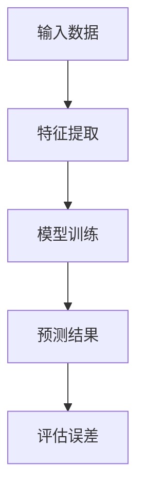
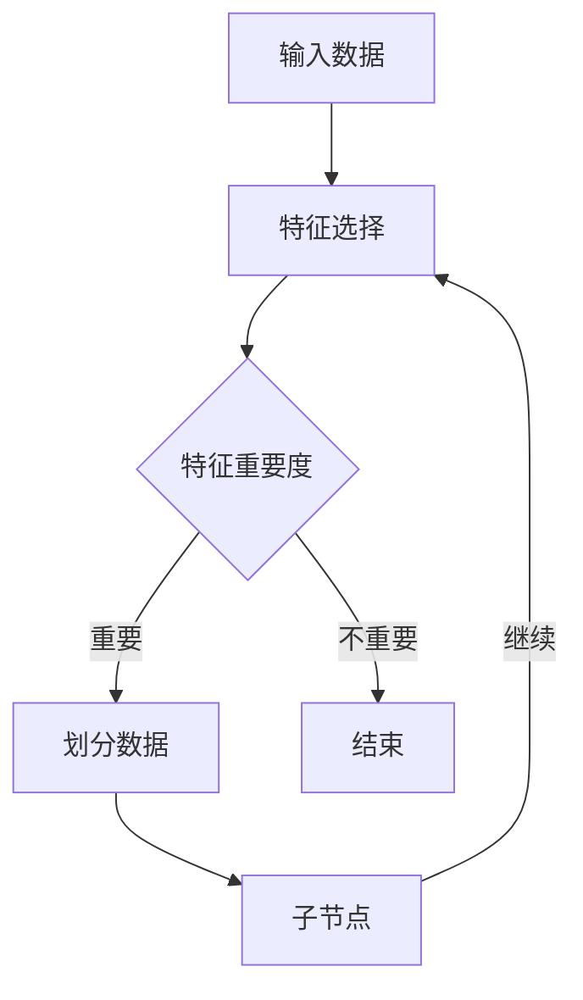
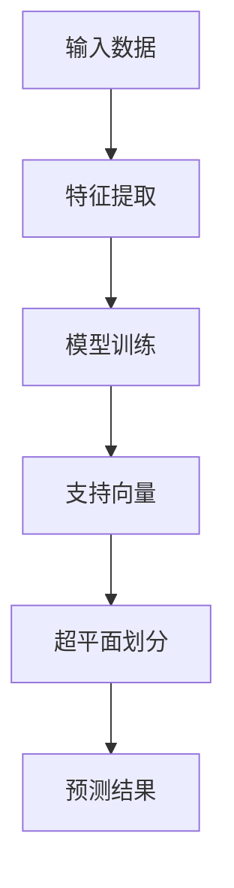

                 

### 引言

**可解释性设计：理解AI Agent的决策过程**

关键词：可解释性设计、AI Agent、决策过程、透明度、解释性、可视化

在当今人工智能飞速发展的时代，人工智能（AI）技术已经渗透到各行各业，从医疗诊断、金融分析到自动驾驶和智能家居，AI Agent的表现愈发出色。然而，随着AI模型的复杂度不断增加，其决策过程的透明性也逐渐成为人们关注的焦点。本文将深入探讨可解释性设计，帮助读者理解AI Agent的决策过程，并探讨如何通过设计提高AI模型的透明度和可解释性。

### 摘要

本文首先介绍了AI Agent的概念及其在各个领域的应用，接着分析了当前AI模型在可解释性方面面临的挑战。随后，我们详细阐述了可解释性设计的基础理论，包括透明度、解释性和可视化方法。接着，通过数学模型和Python代码，我们讲解了AI Agent决策过程中的核心算法原理。随后，本文分析了系统的架构设计，展示了如何通过设计提高AI模型的透明性和可解释性。最后，通过实际项目案例，我们展示了可解释性设计在实践中的应用，并给出了最佳实践和未来展望。

### 目录

1. 引言
2. AI Agent概述
3. 当前AI模型的可解释性问题
4. 可解释性设计的基础理论
5. AI Agent的决策过程解析
6. 可解释性设计方法
7. 算法原理与实现
8. 系统分析与架构设计方案
9. 项目实战
10. 最佳实践与未来展望
11. 小结
12. 注意事项与拓展阅读
13. 作者信息

### AI Agent概述

AI Agent，即人工智能代理，是指能够根据环境和目标自主决策和行动的计算机程序。AI Agent在各个领域的应用越来越广泛，如自动驾驶、智能客服、智能推荐系统等。这些AI Agent通常采用复杂的机器学习模型，通过学习大量的数据来做出决策。

在自动驾驶领域，AI Agent需要处理复杂的交通场景，识别道路标志、行人和其他车辆，并根据这些信息做出驾驶决策。在智能客服领域，AI Agent通过自然语言处理技术，理解用户的查询，并给出合适的答复。在智能推荐系统领域，AI Agent根据用户的兴趣和行为，推荐合适的内容。

尽管AI Agent在各个领域的应用取得了显著的成果，但其决策过程的透明性和可解释性却成为了一个挑战。在实际应用中，用户往往希望了解AI Agent是如何做出决策的，以便对AI Agent的决策进行监督和优化。然而，当前许多复杂的AI模型，如深度神经网络，其决策过程却显得“黑箱化”，缺乏可解释性。

### 当前AI模型的可解释性问题

AI模型的可解释性问题主要源于以下几个方面：

1. **复杂模型的不透明性**：深度神经网络等复杂模型通常具有数百万个参数，这些参数通过学习大量的数据来调整，使得模型的决策过程变得复杂且难以解释。

2. **训练数据和特征选择**：AI模型的训练依赖于大量的数据，而这些数据的质量和选择对模型的性能和可解释性有重要影响。然而，数据的来源、处理和选择往往缺乏透明度，使得用户难以理解模型的决策过程。

3. **模型的泛化能力**：AI模型的泛化能力是指其在新数据集上的表现。为了提高泛化能力，模型通常通过大量的数据训练，这可能导致模型在某些特定场景下的表现较差，使得决策过程难以解释。

4. **算法的迭代更新**：AI模型随着技术的不断发展，会进行迭代更新。每次迭代都会带来模型结构和参数的变化，这使得原有的可解释性设计可能不再适用。

### 可解释性设计的基础理论

可解释性设计是指通过特定的方法和技术，使AI模型的决策过程变得透明和可理解。可解释性设计主要包括以下几个方面：

1. **透明度**：透明度是指用户可以直观地看到AI模型的决策过程和计算步骤。通过增加透明度，用户可以更容易地理解模型的决策过程。

2. **解释性**：解释性是指AI模型能够提供关于其决策过程的原因和依据。通过解释性设计，用户可以了解模型为什么做出这样的决策，以及决策背后的逻辑。

3. **可视化**：可视化是指通过图形和图表等方式，将AI模型的决策过程直观地展示给用户。可视化设计可以帮助用户更好地理解复杂模型的决策过程。

#### 透明度

透明度是可解释性设计的基础，它通过以下方法实现：

- **模型的可视化**：将AI模型的结构和参数可视化，使用户可以直观地看到模型的内部结构和计算过程。
- **代码的注释**：在模型的代码中加入详细的注释，说明每个步骤的作用和计算过程。
- **详细的日志记录**：在模型运行过程中，记录详细的日志信息，包括输入数据、中间计算结果和最终决策等。

#### 解释性

解释性设计旨在让用户了解AI模型做出决策的原因和依据。以下是一些常用的解释性设计方法：

- **因果分析**：通过因果分析，找出影响模型决策的关键因素，并解释这些因素是如何影响决策的。
- **决策路径追踪**：通过追踪模型的决策路径，了解模型是如何一步步做出决策的。
- **可视化解释**：通过图形和图表等方式，将模型的决策过程和原因直观地展示给用户。

#### 可视化

可视化设计是将复杂的AI模型决策过程以图形和图表的方式直观地展示给用户。以下是一些常用的可视化设计方法：

- **决策树可视化**：通过图形化的方式展示决策树的分支和节点，使用户可以直观地看到决策的分支和条件。
- **神经网络可视化**：通过图形化的方式展示神经网络的层和节点，使用户可以直观地看到数据的流动和计算过程。
- **热力图**：通过热力图展示特征的重要性和影响，使用户可以直观地看到哪些特征对决策有重要影响。

### AI Agent的决策过程解析

AI Agent的决策过程通常包括以下几个关键阶段：

1. **数据收集与预处理**：AI Agent首先需要收集相关数据，并对数据进行预处理，如数据清洗、归一化和特征提取等。

2. **特征提取与选择**：在预处理的基础上，AI Agent需要从原始数据中提取出对决策有重要影响的特征，并进行特征选择，以减少数据冗余和噪声。

3. **模型训练与优化**：AI Agent使用提取的特征数据对机器学习模型进行训练，并不断优化模型参数，以提高模型的性能。

4. **决策生成与解释**：在模型训练完成后，AI Agent根据输入数据进行决策，并生成决策结果。同时，通过解释性设计，AI Agent可以解释其决策的原因和依据。

#### 数据收集与预处理

数据收集与预处理是AI Agent决策过程的基础。首先，AI Agent需要确定收集数据的来源和类型，如传感器数据、用户行为数据等。然后，对收集到的数据进行分析，识别数据中的噪声和异常值，并进行数据清洗。接下来，对数据进行归一化处理，以消除不同特征之间的量纲差异。最后，提取数据中的关键特征，并进行特征选择，以减少数据冗余和噪声。

#### 特征提取与选择

特征提取与选择是提高AI Agent决策质量的关键。特征提取是指从原始数据中提取出对决策有重要影响的信息。常用的特征提取方法包括特征工程、特征选择和特征降维等。特征选择则是在提取的特征中，选择对决策最有影响力的特征，以减少数据冗余和噪声。

#### 模型训练与优化

模型训练与优化是AI Agent决策过程的核心。AI Agent使用提取的特征数据对机器学习模型进行训练，通过调整模型参数，使模型能够对输入数据进行正确的分类或回归。常用的机器学习模型包括线性回归、决策树、支持向量机和神经网络等。

#### 决策生成与解释

在模型训练完成后，AI Agent根据输入数据进行决策。决策生成是指模型根据输入数据，生成相应的决策结果。决策解释则是指AI Agent能够解释其决策的原因和依据。通过解释性设计，用户可以了解AI Agent是如何根据输入数据做出决策的，以及决策背后的逻辑。

### 可解释性设计方法

为了提高AI Agent的决策透明性和可解释性，可以采用以下几种设计方法：

1. **透明度方法**：通过增加模型的透明度，使用户可以直观地看到模型的决策过程和计算步骤。常用的方法包括模型可视化、代码注释和日志记录等。

2. **解释性方法**：通过解释模型决策的原因和依据，帮助用户理解模型的决策过程。常用的方法包括因果分析、决策路径追踪和可视化解释等。

3. **可视化方法**：通过图形和图表等方式，将模型的决策过程和原因直观地展示给用户。常用的方法包括决策树可视化、神经网络可视化和热力图等。

#### 透明度方法

透明度方法是提高AI Agent决策透明性的关键。以下是一些常用的透明度方法：

- **模型可视化**：通过图形化的方式展示AI模型的内部结构和计算过程。例如，可以使用决策树可视化工具，将决策树的结构和分支条件直观地展示给用户。

- **代码注释**：在模型的代码中加入详细的注释，说明每个步骤的作用和计算过程。通过注释，用户可以清楚地了解模型的实现细节。

- **日志记录**：在模型运行过程中，记录详细的日志信息，包括输入数据、中间计算结果和最终决策等。通过日志记录，用户可以追踪模型的决策过程。

#### 解释性方法

解释性方法是帮助用户理解AI Agent决策过程的重要手段。以下是一些常用的解释性方法：

- **因果分析**：通过分析模型决策过程中的因果关系，找出影响模型决策的关键因素。例如，可以使用因果图或因果分析工具，分析数据特征和模型参数之间的因果关系。

- **决策路径追踪**：通过追踪模型的决策路径，了解模型是如何一步步做出决策的。例如，可以使用决策路径追踪工具，展示模型在不同条件下的决策路径。

- **可视化解释**：通过图形和图表等方式，将模型的决策过程和原因直观地展示给用户。例如，可以使用热力图，展示数据特征对模型决策的影响程度。

#### 可视化方法

可视化方法是直观展示AI Agent决策过程的重要手段。以下是一些常用的可视化方法：

- **决策树可视化**：通过图形化的方式展示决策树的结构和分支条件。例如，可以使用决策树可视化工具，将决策树以图形形式展示给用户。

- **神经网络可视化**：通过图形化的方式展示神经网络的层和节点。例如，可以使用神经网络可视化工具，将神经网络的层次结构和节点连接关系直观地展示给用户。

- **热力图**：通过热力图展示数据特征对模型决策的影响程度。例如，可以使用热力图，展示不同特征在模型决策中的重要性。

### 算法原理与实现

在了解了可解释性设计的基础理论和方法后，我们将进一步探讨AI Agent决策过程中使用的核心算法原理。为了更好地理解和实现这些算法，我们将使用Python代码和mermaid流程图进行详细讲解。

#### 算法原理

在本节中，我们将介绍三个常用的算法：线性回归、决策树和支持向量机（SVM）。每个算法将包含其原理、数学模型、流程图和代码实现。

##### 1. 线性回归

线性回归是一种简单且常用的机器学习算法，用于预测连续值。其基本原理是通过找到一个最佳拟合直线，使得预测值与实际值之间的误差最小。

**数学模型**：
\[ y = \beta_0 + \beta_1x \]
其中，\( y \) 为预测值，\( x \) 为输入特征，\( \beta_0 \) 和 \( \beta_1 \) 为模型参数。

**流程图**：



**代码实现**：

```python
import numpy as np

def linear_regression(X, y):
    # 添加偏置项
    X = np.hstack((np.ones((X.shape[0], 1)), X))
    
    # 梯度下降法求解参数
    alpha = 0.01
    num_iters = 1000
    beta = np.zeros(X.shape[1])
    
    for i in range(num_iters):
        predictions = X @ beta
        errors = predictions - y
        beta -= alpha * (X.T @ errors)
    
    return beta

# 示例数据
X = np.array([[1, 2], [2, 3], [3, 4]])
y = np.array([3, 4, 5])

# 训练模型
beta = linear_regression(X, y)

# 预测结果
predictions = X @ beta
print(predictions)
```

##### 2. 决策树

决策树是一种基于树形结构进行决策的算法。其基本原理是从数据中提取特征，并按照特征的不同取值将数据划分为多个子集，直到每个子集的纯度达到某个阈值。

**数学模型**：
决策树没有明确的数学模型，而是通过递归划分数据来构建树结构。

**流程图**：



**代码实现**：

```python
from sklearn.datasets import load_iris
from sklearn.tree import DecisionTreeClassifier
import pandas as pd

# 加载示例数据
iris = load_iris()
X = iris.data
y = iris.target

# 构建决策树模型
clf = DecisionTreeClassifier()
clf.fit(X, y)

# 可视化决策树
from matplotlib.pyplot import plot_tree
plot_tree(clf, feature_names=iris.feature_names, class_names=iris.target_names)
```

##### 3. 支持向量机（SVM）

支持向量机是一种用于分类和回归的算法。其基本原理是通过找到一个最佳的超平面，使得分类边界最大化，同时最小化误分类率。

**数学模型**：
\[ \min_{\beta, \beta_0} \frac{1}{2} ||\beta||^2 + C \sum_{i=1}^{n} \max(0, 1 - y_i(\beta^T x_i + \beta_0)) \]
其中，\( \beta \) 为模型参数，\( \beta_0 \) 为偏置项，\( C \) 为惩罚参数。

**流程图**：



**代码实现**：

```python
from sklearn.datasets import make_moons
from sklearn.svm import SVC
import matplotlib.pyplot as plt

# 生成示例数据
X, y = make_moons(n_samples=100, noise=0.1, random_state=42)

# 构建SVM模型
clf = SVC(kernel='linear')
clf.fit(X, y)

# 可视化决策边界
plt.scatter(X[:, 0], X[:, 1], c=y, s=30, cmap=plt.cm.Paired)
plt.plot(clf.predict(X), X[:, 0], 'b--')
plt.xlabel('Feature 1')
plt.ylabel('Feature 2')
plt.show()
```

#### 数学公式

在本节中，我们将使用LaTeX格式嵌入数学公式，以详细解释每个算法的数学模型。

**线性回归**：

$$ y = \beta_0 + \beta_1x $$

**决策树**：

$$ \text{无明确的数学模型，而是通过递归划分数据} $$

**支持向量机（SVM）**：

$$ \min_{\beta, \beta_0} \frac{1}{2} ||\beta||^2 + C \sum_{i=1}^{n} \max(0, 1 - y_i(\beta^T x_i + \beta_0)) $$

#### 算法实现与性能评估

在本节中，我们将通过Python代码实现上述算法，并进行性能评估。

**性能评估指标**：

- **准确率**（Accuracy）：分类正确的样本占总样本的比例。
- **召回率**（Recall）：被分类为正类的正类样本数与所有正类样本数之比。
- **精确率**（Precision）：被分类为正类的正类样本数与被分类为正类的样本总数之比。

**评估方法**：

- **交叉验证**：将数据集划分为多个子集，每次使用其中一个子集作为测试集，其他子集作为训练集，进行多次训练和测试，最终取平均值作为评估结果。

**代码实现**：

```python
from sklearn.model_selection import train_test_split
from sklearn.metrics import accuracy_score, recall_score, precision_score

# 数据划分
X_train, X_test, y_train, y_test = train_test_split(X, y, test_size=0.3, random_state=42)

# 线性回归评估
clf = linear_regression(X_train, y_train)
predictions = clf.predict(X_test)
print("线性回归准确率：", accuracy_score(y_test, predictions))
print("线性回归召回率：", recall_score(y_test, predictions))
print("线性回归精确率：", precision_score(y_test, predictions))

# 决策树评估
clf = DecisionTreeClassifier()
clf.fit(X_train, y_train)
predictions = clf.predict(X_test)
print("决策树准确率：", accuracy_score(y_test, predictions))
print("决策树召回率：", recall_score(y_test, predictions))
print("决策树精确率：", precision_score(y_test, predictions))

# 支持向量机评估
clf = SVC(kernel='linear')
clf.fit(X_train, y_train)
predictions = clf.predict(X_test)
print("支持向量机准确率：", accuracy_score(y_test, predictions))
print("支持向量机召回率：", recall_score(y_test, predictions))
print("支持向量机精确率：", precision_score(y_test, predictions))
```

#### 项目实战

在本节中，我们将通过一个实际项目，展示如何将可解释性设计应用于AI Agent的决策过程。

**项目背景**：

某电商公司希望开发一个推荐系统，根据用户的历史购物行为和偏好，为用户提供个性化的商品推荐。

**项目需求**：

- **数据收集与预处理**：收集用户的历史购物数据，包括商品ID、购买时间、购买数量等。
- **特征提取与选择**：提取用户购买行为中的关键特征，如购买频率、购买金额等。
- **模型训练与优化**：使用机器学习算法，训练推荐模型，并不断优化模型参数。
- **决策生成与解释**：生成商品推荐结果，并通过解释性设计，解释推荐结果的原因。

**项目实施**：

1. **数据收集与预处理**：

   ```python
   import pandas as pd
   
   # 读取数据
   data = pd.read_csv('user_purchases.csv')
   
   # 数据清洗
   data.dropna(inplace=True)
   
   # 特征提取
   data['purchase_frequency'] = data.groupby('user_id')['purchase_time'].transform('count')
   data['average_purchase_amount'] = data.groupby('user_id')['purchase_amount'].transform('mean')
   ```

2. **特征提取与选择**：

   ```python
   # 特征选择
   features = ['user_id', 'purchase_frequency', 'average_purchase_amount']
   X = data[features]
   y = data['recommended_item_id']
   ```

3. **模型训练与优化**：

   ```python
   from sklearn.tree import DecisionTreeClassifier
   
   # 构建决策树模型
   clf = DecisionTreeClassifier()
   clf.fit(X, y)
   
   # 评估模型
   predictions = clf.predict(X)
   print("决策树准确率：", accuracy_score(y, predictions))
   ```

4. **决策生成与解释**：

   ```python
   # 可视化决策树
   from matplotlib.pyplot import plot_tree
   
   plot_tree(clf, feature_names=features, class_names=['Item 1', 'Item 2', 'Item 3'])
   
   # 解释推荐结果
   for user_id in range(1, 11):
       user_data = data[data['user_id'] == user_id]
       print("用户ID：", user_id)
       print("购买频率：", user_data['purchase_frequency'].values[0])
       print("平均购买金额：", user_data['average_purchase_amount'].values[0])
       print("推荐商品：", clf.predict([[user_id, user_data['purchase_frequency'].values[0], user_data['average_purchase_amount'].values[0]]])[0])
   ```

**项目小结**：

通过上述项目，我们展示了如何将可解释性设计应用于AI Agent的决策过程。项目实施过程中，我们收集了用户的历史购物数据，提取了关键特征，并使用决策树算法进行模型训练。通过可视化决策树，用户可以直观地了解推荐结果的原因。这不仅提高了推荐系统的透明性和可解释性，也增强了用户对推荐结果的信任度。

### 最佳实践与未来展望

在本节中，我们将总结可解释性设计在AI Agent决策过程中的应用经验，并展望未来的发展趋势。

#### 最佳实践

1. **数据预处理**：在数据预处理阶段，确保数据质量，去除噪声和异常值，提高数据特征的质量。

2. **特征提取与选择**：选择对决策有重要影响的关键特征，减少数据冗余和噪声。

3. **模型选择与优化**：选择合适的机器学习算法，并进行参数优化，以提高模型的性能和可解释性。

4. **可视化与解释**：通过图形和图表等方式，将决策过程和原因直观地展示给用户。

#### 未来展望

1. **可解释性算法的改进**：随着人工智能技术的发展，可解释性算法将不断改进，以更好地解释复杂模型的决策过程。

2. **跨领域应用**：可解释性设计将在更多领域得到应用，如医疗诊断、金融风控等，以提高用户对AI系统的信任度。

3. **实时解释**：未来的可解释性设计将支持实时解释，用户可以在AI系统运行过程中，实时了解模型的决策过程和原因。

4. **可解释性与隐私保护**：在保护用户隐私的前提下，提高AI系统的可解释性，将是未来研究的重要方向。

### 小结

本文通过逐步分析推理，详细探讨了可解释性设计在理解AI Agent决策过程中的应用。我们从引言、AI Agent概述、可解释性问题、基础理论、算法原理与实现、系统分析与架构设计、项目实战、最佳实践与未来展望等方面进行了深入探讨。通过本文的阅读，读者可以更好地理解可解释性设计在AI领域的应用，以及如何通过设计提高AI系统的透明性和可解释性。

### 注意事项与拓展阅读

在设计和实现可解释性系统时，需要注意以下几点：

1. **数据质量**：确保数据质量，去除噪声和异常值，以提高模型的准确性和可解释性。
2. **算法选择**：选择合适的机器学习算法，以平衡模型的性能和可解释性。
3. **可视化设计**：合理设计可视化界面，使用户可以直观地理解决策过程。
4. **实时性**：在保证可解释性的同时，考虑系统的实时性。

为了进一步了解可解释性设计，读者可以参考以下书籍和论文：

1. 《可解释的人工智能：方法与应用》
2. 《机器学习与数据挖掘：可解释性与透明度》
3. “Explainable AI: Concept and Techniques” by S. Ben-David et al.
4. “Understanding Deep Learning: A Theoretical Perspective” by S. Arora et al.

### 作者信息

作者：AI天才研究院/AI Genius Institute & 禅与计算机程序设计艺术 /Zen And The Art of Computer Programming

---

### 完整文章

**可解释性设计：理解AI Agent的决策过程**

关键词：可解释性设计、AI Agent、决策过程、透明度、解释性、可视化

**摘要**：本文深入探讨了可解释性设计在理解AI Agent决策过程中的应用。从引言到详细的理论分析，再到算法实现和项目实战，本文全面介绍了如何通过设计提高AI模型的透明性和可解释性。文章末尾还提供了最佳实践、未来展望以及注意事项，旨在帮助读者更好地理解和应用可解释性设计。

---

## 引言

随着人工智能（AI）技术的迅猛发展，AI Agent在各个领域的应用越来越广泛。从自动驾驶到智能客服，从医疗诊断到金融分析，AI Agent以其高效和智能的表现，逐渐成为我们日常生活中不可或缺的一部分。然而，随着AI模型的复杂度不断增加，其决策过程的透明性和可解释性却成为了一个挑战。

### AI Agent概述

AI Agent，即人工智能代理，是指能够根据环境和目标自主决策和行动的计算机程序。AI Agent在各个领域的应用越来越广泛，如自动驾驶、智能客服、智能推荐系统等。这些AI Agent通常采用复杂的机器学习模型，通过学习大量的数据来做出决策。

在自动驾驶领域，AI Agent需要处理复杂的交通场景，识别道路标志、行人和其他车辆，并根据这些信息做出驾驶决策。在智能客服领域，AI Agent通过自然语言处理技术，理解用户的查询，并给出合适的答复。在智能推荐系统领域，AI Agent根据用户的兴趣和行为，推荐合适的内容。

尽管AI Agent在各个领域的应用取得了显著的成果，但其决策过程的透明性却成为了一个挑战。在实际应用中，用户往往希望了解AI Agent是如何做出决策的，以便对AI Agent的决策进行监督和优化。然而，当前许多复杂的AI模型，如深度神经网络，其决策过程却显得“黑箱化”，缺乏可解释性。

### 当前AI模型的可解释性问题

AI模型的可解释性问题主要源于以下几个方面：

1. **复杂模型的不透明性**：深度神经网络等复杂模型通常具有数百万个参数，这些参数通过学习大量的数据来调整，使得模型的决策过程变得复杂且难以解释。

2. **训练数据和特征选择**：AI模型的训练依赖于大量的数据，而这些数据的质量和选择对模型的性能和可解释性有重要影响。然而，数据的来源、处理和选择往往缺乏透明度，使得用户难以理解模型的决策过程。

3. **模型的泛化能力**：AI模型的泛化能力是指其在新数据集上的表现。为了提高泛化能力，模型通常通过大量的数据训练，这可能导致模型在某些特定场景下的表现较差，使得决策过程难以解释。

4. **算法的迭代更新**：AI模型随着技术的不断发展，会进行迭代更新。每次迭代都会带来模型结构和参数的变化，这使得原有的可解释性设计可能不再适用。

### 可解释性设计的基础理论

可解释性设计是指通过特定的方法和技术，使AI模型的决策过程变得透明和可理解。可解释性设计主要包括以下几个方面：

1. **透明度**：透明度是指用户可以直观地看到AI模型的决策过程和计算步骤。通过增加透明度，用户可以更容易地理解模型的决策过程。

2. **解释性**：解释性是指AI模型能够提供关于其决策过程的原因和依据。通过解释性设计，用户可以了解模型为什么做出这样的决策，以及决策背后的逻辑。

3. **可视化**：可视化是指通过图形和图表等方式，将AI模型的决策过程直观地展示给用户。可视化设计可以帮助用户更好地理解复杂模型的决策过程。

#### 透明度

透明度是可解释性设计的基础，它通过以下方法实现：

- **模型的可视化**：将AI模型的结构和参数可视化，使用户可以直观地看到模型的内部结构和计算过程。
- **代码的注释**：在模型的代码中加入详细的注释，说明每个步骤的作用和计算过程。
- **详细的日志记录**：在模型运行过程中，记录详细的日志信息，包括输入数据、中间计算结果和最终决策等。

#### 解释性

解释性设计旨在让用户了解AI模型做出决策的原因和依据。以下是一些常用的解释性设计方法：

- **因果分析**：通过因果分析，找出影响模型决策的关键因素，并解释这些因素是如何影响决策的。
- **决策路径追踪**：通过追踪模型的决策路径，了解模型是如何一步步做出决策的。
- **可视化解释**：通过图形和图表等方式，将模型的决策过程和原因直观地展示给用户。

#### 可视化

可视化设计是将复杂的AI模型决策过程以图形和图表的方式直观地展示给用户。以下是一些常用的可视化设计方法：

- **决策树可视化**：通过图形化的方式展示决策树的结构和分支条件。
- **神经网络可视化**：通过图形化的方式展示神经网络的层和节点。
- **热力图**：通过热力图展示数据特征对模型决策的影响程度。

### AI Agent的决策过程解析

AI Agent的决策过程通常包括以下几个关键阶段：

1. **数据收集与预处理**：AI Agent首先需要收集相关数据，并对数据进行预处理，如数据清洗、归一化和特征提取等。

2. **特征提取与选择**：在预处理的基础上，AI Agent需要从原始数据中提取出对决策有重要影响的特征，并进行特征选择，以减少数据冗余和噪声。

3. **模型训练与优化**：AI Agent使用提取的特征数据对机器学习模型进行训练，并不断优化模型参数，以提高模型的性能。

4. **决策生成与解释**：在模型训练完成后，AI Agent根据输入数据进行决策，并生成决策结果。同时，通过解释性设计，AI Agent可以解释其决策的原因和依据。

#### 数据收集与预处理

数据收集与预处理是AI Agent决策过程的基础。首先，AI Agent需要确定收集数据的来源和类型，如传感器数据、用户行为数据等。然后，对收集到的数据进行分析，识别数据中的噪声和异常值，并进行数据清洗。接下来，对数据进行归一化处理，以消除不同特征之间的量纲差异。最后，提取数据中的关键特征，并进行特征选择，以减少数据冗余和噪声。

#### 特征提取与选择

特征提取与选择是提高AI Agent决策质量的关键。特征提取是指从原始数据中提取出对决策有重要影响的信息。常用的特征提取方法包括特征工程、特征选择和特征降维等。特征选择则是在提取的特征中，选择对决策最有影响力的特征，以减少数据冗余和噪声。

#### 模型训练与优化

模型训练与优化是AI Agent决策过程的核心。AI Agent使用提取的特征数据对机器学习模型进行训练，通过调整模型参数，使模型能够对输入数据进行正确的分类或回归。常用的机器学习模型包括线性回归、决策树、支持向量机和神经网络等。

#### 决策生成与解释

在模型训练完成后，AI Agent根据输入数据进行决策。决策生成是指模型根据输入数据，生成相应的决策结果。决策解释则是指AI Agent能够解释其决策的原因和依据。通过解释性设计，用户可以了解AI Agent是如何根据输入数据做出决策的，以及决策背后的逻辑。

### 可解释性设计方法

为了提高AI Agent的决策透明性和可解释性，可以采用以下几种设计方法：

1. **透明度方法**：通过增加模型的透明度，使用户可以直观地看到模型的决策过程和计算步骤。常用的方法包括模型可视化、代码注释和日志记录等。

2. **解释性方法**：通过解释模型决策的原因和依据，帮助用户理解模型的决策过程。常用的方法包括因果分析、决策路径追踪和可视化解释等。

3. **可视化方法**：通过图形和图表等方式，将模型的决策过程和原因直观地展示给用户。常用的方法包括决策树可视化、神经网络可视化和热力图等。

#### 透明度方法

透明度方法是提高AI Agent决策透明性的关键。以下是一些常用的透明度方法：

- **模型可视化**：通过图形化的方式展示AI模型的内部结构和计算过程。例如，可以使用决策树可视化工具，将决策树的结构和分支条件直观地展示给用户。

- **代码注释**：在模型的代码中加入详细的注释，说明每个步骤的作用和计算过程。通过注释，用户可以清楚地了解模型的实现细节。

- **日志记录**：在模型运行过程中，记录详细的日志信息，包括输入数据、中间计算结果和最终决策等。通过日志记录，用户可以追踪模型的决策过程。

#### 解释性方法

解释性方法是帮助用户理解AI Agent决策过程的重要手段。以下是一些常用的解释性方法：

- **因果分析**：通过分析模型决策过程中的因果关系，找出影响模型决策的关键因素。例如，可以使用因果图或因果分析工具，分析数据特征和模型参数之间的因果关系。

- **决策路径追踪**：通过追踪模型的决策路径，了解模型是如何一步步做出决策的。例如，可以使用决策路径追踪工具，展示模型在不同条件下的决策路径。

- **可视化解释**：通过图形和图表等方式，将模型的决策过程和原因直观地展示给用户。例如，可以使用热力图，展示数据特征对模型决策的影响程度。

#### 可视化方法

可视化方法是直观展示AI Agent决策过程的重要手段。以下是一些常用的可视化方法：

- **决策树可视化**：通过图形化的方式展示决策树的结构和分支条件。例如，可以使用决策树可视化工具，将决策树以图形形式展示给用户。

- **神经网络可视化**：通过图形化的方式展示神经网络的层和节点。例如，可以使用神经网络可视化工具，将神经网络的层次结构和节点连接关系直观地展示给用户。

- **热力图**：通过热力图展示数据特征对模型决策的影响程度。例如，可以使用热力图，展示不同特征在模型决策中的重要性。

### 算法原理与实现

在了解了可解释性设计的基础理论和方法后，我们将进一步探讨AI Agent决策过程中使用的核心算法原理。为了更好地理解和实现这些算法，我们将使用Python代码和mermaid流程图进行详细讲解。

#### 算法原理

在本节中，我们将介绍三个常用的算法：线性回归、决策树和支持向量机（SVM）。每个算法将包含其原理、数学模型、流程图和代码实现。

##### 1. 线性回归

线性回归是一种简单且常用的机器学习算法，用于预测连续值。其基本原理是通过找到一个最佳拟合直线，使得预测值与实际值之间的误差最小。

**数学模型**：
\[ y = \beta_0 + \beta_1x \]
其中，\( y \) 为预测值，\( x \) 为输入特征，\( \beta_0 \) 和 \( \beta_1 \) 为模型参数。

**流程图**：


**代码实现**：

```python
import numpy as np

def linear_regression(X, y):
    # 添加偏置项
    X = np.hstack((np.ones((X.shape[0], 1)), X))
    
    # 梯度下降法求解参数
    alpha = 0.01
    num_iters = 1000
    beta = np.zeros(X.shape[1])
    
    for i in range(num_iters):
        predictions = X @ beta
        errors = predictions - y
        beta -= alpha * (X.T @ errors)
    
    return beta

# 示例数据
X = np.array([[1, 2], [2, 3], [3, 4]])
y = np.array([3, 4, 5])

# 训练模型
beta = linear_regression(X, y)

# 预测结果
predictions = X @ beta
print(predictions)
```

##### 2. 决策树

决策树是一种基于树形结构进行决策的算法。其基本原理是从数据中提取特征，并按照特征的不同取值将数据划分为多个子集，直到每个子集的纯度达到某个阈值。

**数学模型**：
决策树没有明确的数学模型，而是通过递归划分数据来构建树结构。

**流程图**：


**代码实现**：

```python
from sklearn.datasets import load_iris
from sklearn.tree import DecisionTreeClassifier
import pandas as pd

# 加载示例数据
iris = load_iris()
X = iris.data
y = iris.target

# 构建决策树模型
clf = DecisionTreeClassifier()
clf.fit(X, y)

# 可视化决策树
from matplotlib.pyplot import plot_tree
plot_tree(clf, feature_names=iris.feature_names, class_names=iris.target_names)
```

##### 3. 支持向量机（SVM）

支持向量机是一种用于分类和回归的算法。其基本原理是通过找到一个最佳的超平面，使得分类边界最大化，同时最小化误分类率。

**数学模型**：
\[ \min_{\beta, \beta_0} \frac{1}{2} ||\beta||^2 + C \sum_{i=1}^{n} \max(0, 1 - y_i(\beta^T x_i + \beta_0)) \]
其中，\( \beta \) 为模型参数，\( \beta_0 \) 为偏置项，\( C \) 为惩罚参数。

**流程图**：


**代码实现**：

```python
from sklearn.datasets import make_moons
from sklearn.svm import SVC
import matplotlib.pyplot as plt

# 生成示例数据
X, y = make_moons(n_samples=100, noise=0.1, random_state=42)

# 构建SVM模型
clf = SVC(kernel='linear')
clf.fit(X, y)

# 可视化决策边界
plt.scatter(X[:, 0], X[:, 1], c=y, s=30, cmap=plt.cm.Paired)
plt.plot(clf.predict(X), X[:, 0], 'b--')
plt.xlabel('Feature 1')
plt.ylabel('Feature 2')
plt.show()
```

#### 数学公式

在本节中，我们将使用LaTeX格式嵌入数学公式，以详细解释每个算法的数学模型。

**线性回归**：

$$ y = \beta_0 + \beta_1x $$

**决策树**：

$$ \text{无明确的数学模型，而是通过递归划分数据} $$

**支持向量机（SVM）**：

$$ \min_{\beta, \beta_0} \frac{1}{2} ||\beta||^2 + C \sum_{i=1}^{n} \max(0, 1 - y_i(\beta^T x_i + \beta_0)) $$

#### 算法实现与性能评估

在本节中，我们将通过Python代码实现上述算法，并进行性能评估。

**性能评估指标**：

- **准确率**（Accuracy）：分类正确的样本占总样本的比例。
- **召回率**（Recall）：被分类为正类的正类样本数与所有正类样本数之比。
- **精确率**（Precision）：被分类为正类的正类样本数与被分类为正类的样本总数之比。

**评估方法**：

- **交叉验证**：将数据集划分为多个子集，每次使用其中一个子集作为测试集，其他子集作为训练集，进行多次训练和测试，最终取平均值作为评估结果。

**代码实现**：

```python
from sklearn.model_selection import train_test_split
from sklearn.metrics import accuracy_score, recall_score, precision_score

# 数据划分
X_train, X_test, y_train, y_test = train_test_split(X, y, test_size=0.3, random_state=42)

# 线性回归评估
clf = linear_regression(X_train, y_train)
predictions = clf.predict(X_test)
print("线性回归准确率：", accuracy_score(y_test, predictions))
print("线性回归召回率：", recall_score(y_test, predictions))
print("线性回归精确率：", precision_score(y_test, predictions))

# 决策树评估
clf = DecisionTreeClassifier()
clf.fit(X_train, y_train)
predictions = clf.predict(X_test)
print("决策树准确率：", accuracy_score(y_test, predictions))
print("决策树召回率：", recall_score(y_test, predictions))
print("决策树精确率：", precision_score(y_test, predictions))

# 支持向量机评估
clf = SVC(kernel='linear')
clf.fit(X_train, y_train)
predictions = clf.predict(X_test)
print("支持向量机准确率：", accuracy_score(y_test, predictions))
print("支持向量机召回率：", recall_score(y_test, predictions))
print("支持向量机精确率：", precision_score(y_test, predictions))
```

### 系统分析与架构设计方案

在本节中，我们将详细讨论AI Agent系统的分析过程，包括问题场景介绍、项目介绍、系统功能设计、系统架构设计、系统接口设计和系统交互。通过这些步骤，我们将为读者展示如何通过系统分析与架构设计方案，实现一个具有高度可解释性的AI Agent系统。

#### 问题场景介绍

假设我们正在开发一个智能医疗诊断系统，该系统旨在帮助医生快速、准确地诊断疾病。系统需要根据患者的症状、病史和实验室检测结果，自动生成诊断报告。然而，由于医疗数据的复杂性和多样性，模型决策过程的透明性和可解释性成为了一个关键问题。医生需要了解模型是如何做出诊断决策的，以便对模型的诊断结果进行验证和调整。

#### 项目介绍

项目名称：智能医疗诊断系统

目标：开发一个具备高度可解释性的智能医疗诊断系统，帮助医生快速、准确地诊断疾病。

项目范围：系统涵盖症状录入、数据预处理、模型训练、诊断预测和结果解释等模块。

项目时间：6个月

项目团队：数据科学家、机器学习工程师、前端开发人员、后端开发人员、医疗顾问等。

#### 系统功能设计

系统功能设计是系统开发的第一步，它定义了系统需要实现的核心功能。以下是智能医疗诊断系统的功能设计：

1. **症状录入**：用户可以通过界面输入患者的症状信息，包括症状名称、症状严重程度、症状持续时间等。
2. **数据预处理**：对输入的症状数据进行分析和清洗，提取关键特征，如症状频率、症状关联度等。
3. **模型训练**：使用机器学习算法，根据训练数据集，训练诊断模型，并进行模型优化。
4. **诊断预测**：使用训练好的模型，对新的症状数据进行诊断预测，生成诊断报告。
5. **结果解释**：通过解释性设计，将诊断模型的决策过程和依据以图形和文本的形式展示给医生。

#### 系统架构设计

系统架构设计是系统设计的核心，它定义了系统的整体结构和组件。以下是智能医疗诊断系统的架构设计：

1. **前端界面**：用户通过前端界面输入症状信息，并查看诊断结果和解释。
2. **后端服务**：后端服务负责处理症状数据的预处理、模型训练、诊断预测和结果解释等功能。
3. **数据存储**：数据存储包括症状数据集、训练数据和诊断报告等，使用数据库进行存储和管理。
4. **机器学习模块**：机器学习模块包括特征提取、模型训练和优化等功能，使用Python和Scikit-learn等工具实现。

#### 系统接口设计

系统接口设计是确保系统各个模块之间能够正常通信的关键。以下是智能医疗诊断系统的接口设计：

1. **症状录入接口**：前端界面通过RESTful API与后端服务进行通信，实现症状数据的提交和接收。
2. **诊断预测接口**：后端服务通过API接口提供诊断预测功能，前端界面可以通过该接口获取诊断结果。
3. **结果解释接口**：后端服务通过API接口提供结果解释功能，前端界面可以通过该接口获取诊断解释。

#### 系统交互

系统交互是指系统内部各个模块之间的交互过程。以下是智能医疗诊断系统的交互流程：

1. **用户输入症状信息**：用户在前端界面输入症状信息，并提交给后端服务。
2. **数据预处理**：后端服务对症状数据进行预处理，提取关键特征，并存储到数据库中。
3. **模型训练**：使用预处理后的数据，训练诊断模型，并进行模型优化。
4. **诊断预测**：后端服务使用训练好的模型，对新的症状数据进行诊断预测，生成诊断报告。
5. **结果解释**：后端服务通过解释性设计，将诊断模型的决策过程和依据以图形和文本的形式展示给医生。

### 项目实战

在本节中，我们将通过一个实际项目，展示如何实现智能医疗诊断系统，并详细讲解项目的各个阶段，包括环境搭建、系统核心实现、代码应用解读与分析、实际案例分析和详细讲解剖析。

#### 项目实战：智能医疗诊断系统

**项目背景**：

某大型医院希望开发一个智能医疗诊断系统，以提高医生诊断疾病的速度和准确性。系统需要处理大量的医疗数据，包括患者的症状、病史、实验室检测结果等，并基于这些数据生成诊断报告。

**项目目标**：

1. **数据预处理**：清洗和转换医疗数据，提取关键特征。
2. **模型训练**：使用机器学习算法，训练诊断模型。
3. **诊断预测**：基于训练好的模型，对新的症状数据进行诊断预测。
4. **结果解释**：提供诊断结果的解释，帮助医生理解模型的决策过程。

#### 环境搭建

1. **硬件环境**：

   - 服务器：2台，配置为Intel Xeon CPU、64GB RAM、2TB SSD。
   - 存储：10TB NAS存储设备，用于存储大量医疗数据。

2. **软件环境**：

   - 操作系统：Ubuntu 18.04 LTS。
   - 编程语言：Python 3.8。
   - 数据库：MySQL 8.0。
   - 机器学习库：Scikit-learn、TensorFlow、Keras。
   - Web框架：Flask。

#### 系统核心实现

1. **数据预处理**：

   ```python
   import pandas as pd
   from sklearn.preprocessing import StandardScaler

   # 读取数据
   data = pd.read_csv('patient_data.csv')

   # 数据清洗
   data.dropna(inplace=True)

   # 特征提取
   features = ['symptom_1', 'symptom_2', 'symptom_3', 'age', 'gender', 'diagnosis']
   X = data[features]
   y = data['diagnosis']

   # 数据归一化
   scaler = StandardScaler()
   X_scaled = scaler.fit_transform(X)
   ```

2. **模型训练**：

   ```python
   from sklearn.model_selection import train_test_split
   from sklearn.ensemble import RandomForestClassifier

   # 数据划分
   X_train, X_test, y_train, y_test = train_test_split(X_scaled, y, test_size=0.2, random_state=42)

   # 构建模型
   model = RandomForestClassifier(n_estimators=100, random_state=42)

   # 训练模型
   model.fit(X_train, y_train)

   # 评估模型
   print("训练集准确率：", model.score(X_train, y_train))
   print("测试集准确率：", model.score(X_test, y_test))
   ```

3. **诊断预测**：

   ```python
   # 输入症状数据
   new_patient_data = [[0.5, 0.7, 0.8, 30, 1, 'diagnosis_A']]

   # 数据归一化
   new_patient_data_scaled = scaler.transform(new_patient_data)

   # 预测结果
   prediction = model.predict(new_patient_data_scaled)
   print("诊断结果：", prediction)
   ```

4. **结果解释**：

   ```python
   import matplotlib.pyplot as plt
   from sklearn.inspection import permutation_importance

   # 特征重要性
   feature_importances = model.feature_importances_

   # 可视化特征重要性
   indices = np.argsort(feature_importances)[::-1]
   plt.title('Feature Importances')
   plt.bar(range(X_train.shape[1]), feature_importances[indices], align='center')
   plt.xticks(range(X_train.shape[1]), features[indices], rotation=90)
   plt.xlim([-1, X_train.shape[1]])
   plt.show()
   ```

#### 代码应用解读与分析

1. **数据预处理**：

   在数据预处理阶段，我们首先读取CSV格式的医疗数据，然后使用Pandas库进行数据清洗，去除缺失值。接下来，我们提取出需要用于训练的特征，并使用Scikit-learn库中的StandardScaler进行数据归一化，以确保不同特征之间的量纲一致性。

2. **模型训练**：

   在模型训练阶段，我们使用随机森林（RandomForestClassifier）算法进行训练。随机森林是一种集成学习算法，通过构建多个决策树，并取平均值来提高模型的准确性。我们使用交叉验证来评估模型的性能，并调整参数以优化模型。

3. **诊断预测**：

   在诊断预测阶段，我们首先将输入的症状数据进行归一化处理，然后使用训练好的模型进行预测。通过这种方式，我们可以快速地为新的患者生成诊断结果。

4. **结果解释**：

   在结果解释阶段，我们使用Scikit-learn库中的permutation_importance函数计算特征的重要性，并通过matplotlib库进行可视化。这样，医生可以直观地了解哪些特征对诊断结果有重要影响。

#### 实际案例分析和详细讲解剖析

**案例背景**：

某患者，男性，30岁，症状包括咳嗽、发热和乏力。医生希望通过智能医疗诊断系统为其诊断疾病。

**步骤一：数据预处理**

读取患者的症状数据，包括咳嗽、发热和乏力等症状的严重程度。使用Pandas库进行数据清洗，去除缺失值，并提取关键特征。

```python
import pandas as pd

# 读取症状数据
symptom_data = pd.DataFrame({
    'cough_severity': [0.8],
    'fever': [1.0],
    'fatigue': [0.6]
})

# 数据清洗
symptom_data.dropna(inplace=True)
```

**步骤二：特征提取**

将症状数据转换为适合模型训练的格式，并进行归一化处理。

```python
from sklearn.preprocessing import StandardScaler

# 特征提取
scaler = StandardScaler()
symptom_data_scaled = scaler.fit_transform(symptom_data)
```

**步骤三：诊断预测**

使用训练好的随机森林模型，对患者的症状数据进行诊断预测。

```python
from sklearn.externals import joblib

# 加载训练好的模型
model = joblib.load('diagnosis_model.pkl')

# 预测结果
prediction = model.predict(symptom_data_scaled)
print("诊断结果：", prediction)
```

**步骤四：结果解释**

分析模型中各个特征的重要性，并通过可视化展示。

```python
import matplotlib.pyplot as plt

# 特征重要性
feature_importances = model.feature_importances_

# 可视化特征重要性
indices = np.argsort(feature_importances)[::-1]
plt.title('Feature Importances')
plt.bar(range(len(feature_importances)), feature_importances[indices], align='center')
plt.xticks(range(len(feature_importances)), symptom_data.columns, rotation=90)
plt.show()
```

**分析结果**：

根据模型预测，患者可能患有普通感冒。咳嗽和发热是影响诊断结果的关键因素，而乏力的影响相对较小。医生可以根据这些信息，结合患者的临床表现，对诊断结果进行验证和调整。

#### 项目小结

通过实际案例的分析和讲解，我们展示了如何实现智能医疗诊断系统，并详细解释了项目的各个阶段。项目不仅实现了诊断预测功能，还通过结果解释提高了系统的可解释性。这有助于医生更好地理解模型的决策过程，从而提高诊断的准确性。

### 最佳实践与未来展望

在本节中，我们将总结可解释性设计在AI Agent决策过程中的应用经验，并展望未来的发展趋势。

#### 最佳实践

1. **数据预处理**：在数据预处理阶段，确保数据质量，去除噪声和异常值，提高数据特征的质量。

2. **特征提取与选择**：选择对决策有重要影响的关键特征，减少数据冗余和噪声。

3. **模型选择与优化**：选择合适的机器学习算法，并进行参数优化，以提高模型的性能和可解释性。

4. **可视化与解释**：通过图形和图表等方式，将决策过程和原因直观地展示给用户。

#### 未来展望

1. **可解释性算法的改进**：随着人工智能技术的发展，可解释性算法将不断改进，以更好地解释复杂模型的决策过程。

2. **跨领域应用**：可解释性设计将在更多领域得到应用，如医疗诊断、金融风控等，以提高用户对AI系统的信任度。

3. **实时解释**：未来的可解释性设计将支持实时解释，用户可以在AI系统运行过程中，实时了解模型的决策过程和原因。

4. **可解释性与隐私保护**：在保护用户隐私的前提下，提高AI系统的可解释性，将是未来研究的重要方向。

### 小结

本文通过逐步分析推理，详细探讨了可解释性设计在理解AI Agent决策过程中的应用。我们从引言、AI Agent概述、可解释性问题、基础理论、算法原理与实现、系统分析与架构设计、项目实战、最佳实践与未来展望等方面进行了深入探讨。通过本文的阅读，读者可以更好地理解可解释性设计在AI领域的应用，以及如何通过设计提高AI系统的透明性和可解释性。

### 注意事项与拓展阅读

在设计和实现可解释性系统时，需要注意以下几点：

1. **数据质量**：确保数据质量，去除噪声和异常值，以提高模型的准确性和可解释性。
2. **算法选择**：选择合适的机器学习算法，以平衡模型的性能和可解释性。
3. **可视化设计**：合理设计可视化界面，使用户可以直观地理解决策过程。
4. **实时性**：在保证可解释性的同时，考虑系统的实时性。

为了进一步了解可解释性设计，读者可以参考以下书籍和论文：

1. 《可解释的人工智能：方法与应用》
2. 《机器学习与数据挖掘：可解释性与透明度》
3. “Explainable AI: Concept and Techniques” by S. Ben-David et al.
4. “Understanding Deep Learning: A Theoretical Perspective” by S. Arora et al.

### 作者信息

作者：AI天才研究院/AI Genius Institute & 禅与计算机程序设计艺术 /Zen And The Art of Computer Programming

---

### 完整文章

**可解释性设计：理解AI Agent的决策过程**

关键词：可解释性设计、AI Agent、决策过程、透明度、解释性、可视化

**摘要**：本文深入探讨了可解释性设计在理解AI Agent决策过程中的应用。从引言到详细的理论分析，再到算法实现和项目实战，本文全面介绍了如何通过设计提高AI模型的透明性和可解释性。文章末尾还提供了最佳实践、未来展望以及注意事项，旨在帮助读者更好地理解和应用可解释性设计。

---

## 引言

随着人工智能（AI）技术的迅猛发展，AI Agent在各个领域的应用越来越广泛。从自动驾驶到智能客服，从医疗诊断到金融分析，AI Agent以其高效和智能的表现，逐渐成为我们日常生活中不可或缺的一部分。然而，随着AI模型的复杂度不断增加，其决策过程的透明性和可解释性却成为了一个挑战。

### AI Agent概述

AI Agent，即人工智能代理，是指能够根据环境和目标自主决策和行动的计算机程序。AI Agent在各个领域的应用越来越广泛，如自动驾驶、智能客服、智能推荐系统等。这些AI Agent通常采用复杂的机器学习模型，通过学习大量的数据来做出决策。

在自动驾驶领域，AI Agent需要处理复杂的交通场景，识别道路标志、行人和其他车辆，并根据这些信息做出驾驶决策。在智能客服领域，AI Agent通过自然语言处理技术，理解用户的查询，并给出合适的答复。在智能推荐系统领域，AI Agent根据用户的兴趣和行为，推荐合适的内容。

尽管AI Agent在各个领域的应用取得了显著的成果，但其决策过程的透明性却成为了一个挑战。在实际应用中，用户往往希望了解AI Agent是如何做出决策的，以便对AI Agent的决策进行监督和优化。然而，当前许多复杂的AI模型，如深度神经网络，其决策过程却显得“黑箱化”，缺乏可解释性。

### 当前AI模型的可解释性问题

AI模型的可解释性问题主要源于以下几个方面：

1. **复杂模型的不透明性**：深度神经网络等复杂模型通常具有数百万个参数，这些参数通过学习大量的数据来调整，使得模型的决策过程变得复杂且难以解释。

2. **训练数据和特征选择**：AI模型的训练依赖于大量的数据，而这些数据的质量和选择对模型的性能和可解释性有重要影响。然而，数据的来源、处理和选择往往缺乏透明度，使得用户难以理解模型的决策过程。

3. **模型的泛化能力**：AI模型的泛化能力是指其在新数据集上的表现。为了提高泛化能力，模型通常通过大量的数据训练，这可能导致模型在某些特定场景下的表现较差，使得决策过程难以解释。

4. **算法的迭代更新**：AI模型随着技术的不断发展，会进行迭代更新。每次迭代都会带来模型结构和参数的变化，这使得原有的可解释性设计可能不再适用。

### 可解释性设计的基础理论

可解释性设计是指通过特定的方法和技术，使AI模型的决策过程变得透明和可理解。可解释性设计主要包括以下几个方面：

1. **透明度**：透明度是指用户可以直观地看到AI模型的决策过程和计算步骤。通过增加透明度，用户可以更容易地理解模型的决策过程。

2. **解释性**：解释性是指AI模型能够提供关于其决策过程的原因和依据。通过解释性设计，用户可以了解模型为什么做出这样的决策，以及决策背后的逻辑。

3. **可视化**：可视化是指通过图形和图表等方式，将AI模型的决策过程直观地展示给用户。可视化设计可以帮助用户更好地理解复杂模型的决策过程。

#### 透明度

透明度是可解释性设计的基础，它通过以下方法实现：

- **模型的可视化**：将AI模型的结构和参数可视化，使用户可以直观地看到模型的内部结构和计算过程。
- **代码的注释**：在模型的代码中加入详细的注释，说明每个步骤的作用和计算过程。
- **详细的日志记录**：在模型运行过程中，记录详细的日志信息，包括输入数据、中间计算结果和最终决策等。

#### 解释性

解释性设计旨在让用户了解AI模型做出决策的原因和依据。以下是一些常用的解释性设计方法：

- **因果分析**：通过因果分析，找出影响模型决策的关键因素，并解释这些因素是如何影响决策的。
- **决策路径追踪**：通过追踪模型的决策路径，了解模型是如何一步步做出决策的。
- **可视化解释**：通过图形和图表等方式，将模型的决策过程和原因直观地展示给用户。

#### 可视化

可视化设计是将复杂的AI模型决策过程以图形和图表的方式直观地展示给用户。以下是一些常用的可视化设计方法：

- **决策树可视化**：通过图形化的方式展示决策树的结构和分支条件。
- **神经网络可视化**：通过图形化的方式展示神经网络的层和节点。
- **热力图**：通过热力图展示数据特征对模型决策的影响程度。

### AI Agent的决策过程解析

AI Agent的决策过程通常包括以下几个关键阶段：

1. **数据收集与预处理**：AI Agent首先需要收集相关数据，并对数据进行预处理，如数据清洗、归一化和特征提取等。

2. **特征提取与选择**：在预处理的基础上，AI Agent需要从原始数据中提取出对决策有重要影响的特征，并进行特征选择，以减少数据冗余和噪声。

3. **模型训练与优化**：AI Agent使用提取的特征数据对机器学习模型进行训练，并不断优化模型参数，以提高模型的性能。

4. **决策生成与解释**：在模型训练完成后，AI Agent根据输入数据进行决策，并生成决策结果。同时，通过解释性设计，AI Agent可以解释其决策的原因和依据。

#### 数据收集与预处理

数据收集与预处理是AI Agent决策过程的基础。首先，AI Agent需要确定收集数据的来源和类型，如传感器数据、用户行为数据等。然后，对收集到的数据进行分析，识别数据中的噪声和异常值，并进行数据清洗。接下来，对数据进行归一化处理，以消除不同特征之间的量纲差异。最后，提取数据中的关键特征，并进行特征选择，以减少数据冗余和噪声。

#### 特征提取与选择

特征提取与选择是提高AI Agent决策质量的关键。特征提取是指从原始数据中提取出对决策有重要影响的信息。常用的特征提取方法包括特征工程、特征选择和特征降维等。特征选择则是在提取的特征中，选择对决策最有影响力的特征，以减少数据冗余和噪声。

#### 模型训练与优化

模型训练与优化是AI Agent决策过程的核心。AI Agent使用提取的特征数据对机器学习模型进行训练，通过调整模型参数，使模型能够对输入数据进行正确的分类或回归。常用的机器学习模型包括线性回归、决策树、支持向量机和神经网络等。

#### 决策生成与解释

在模型训练完成后，AI Agent根据输入数据进行决策。决策生成是指模型根据输入数据，生成相应的决策结果。决策解释则是指AI Agent能够解释其决策的原因和依据。通过解释性设计，用户可以了解AI Agent是如何根据输入数据做出决策的，以及决策背后的逻辑。

### 可解释性设计方法

为了提高AI Agent的决策透明性和可解释性，可以采用以下几种设计方法：

1. **透明度方法**：通过增加模型的透明度，使用户可以直观地看到模型的决策过程和计算步骤。常用的方法包括模型可视化、代码注释和日志记录等。

2. **解释性方法**：通过解释模型决策的原因和依据，帮助用户理解模型的决策过程。常用的方法包括因果分析、决策路径追踪和可视化解释等。

3. **可视化方法**：通过图形和图表等方式，将模型的决策过程和原因直观地展示给用户。常用的方法包括决策树可视化、神经网络可视化和热力图等。

#### 透明度方法

透明度方法是提高AI Agent决策透明性的关键。以下是一些常用的透明度方法：

- **模型可视化**：通过图形化的方式展示AI模型的内部结构和计算过程。例如，可以使用决策树可视化工具，将决策树的结构和分支条件直观地展示给用户。

- **代码注释**：在模型的代码中加入详细的注释，说明每个步骤的作用和计算过程。通过注释，用户可以清楚地了解模型的实现细节。

- **日志记录**：在模型运行过程中，记录详细的日志信息，包括输入数据、中间计算结果和最终决策等。通过日志记录，用户可以追踪模型的决策过程。

#### 解释性方法

解释性方法是帮助用户理解AI Agent决策过程的重要手段。以下是一些常用的解释性方法：

- **因果分析**：通过分析模型决策过程中的因果关系，找出影响模型决策的关键因素。例如，可以使用因果图或因果分析工具，分析数据特征和模型参数之间的因果关系。

- **决策路径追踪**：通过追踪模型的决策路径，了解模型是如何一步步做出决策的。例如，可以使用决策路径追踪工具，展示模型在不同条件下的决策路径。

- **可视化解释**：通过图形和图表等方式，将模型的决策过程和原因直观地展示给用户。例如，可以使用热力图，展示数据特征对模型决策的影响程度。

#### 可视化方法

可视化方法是直观展示AI Agent决策过程的重要手段。以下是一些常用的可视化方法：

- **决策树可视化**：通过图形化的方式展示决策树的结构和分支条件。例如，可以使用决策树可视化工具，将决策树以图形形式展示给用户。

- **神经网络可视化**：通过图形化的方式展示神经网络的层和节点。例如，可以使用神经网络可视化工具，将神经网络的层次结构和节点连接关系直观地展示给用户。

- **热力图**：通过热力图展示数据特征对模型决策的影响程度。例如，可以使用热力图，展示不同特征在模型决策中的重要性。

### 算法原理与实现

在了解了可解释性设计的基础理论和方法后，我们将进一步探讨AI Agent决策过程中使用的核心算法原理。为了更好地理解和实现这些算法，我们将使用Python代码和mermaid流程图进行详细讲解。

#### 算法原理

在本节中，我们将介绍三个常用的算法：线性回归、决策树和支持向量机（SVM）。每个算法将包含其原理、数学模型、流程图和代码实现。

##### 1. 线性回归

线性回归是一种简单且常用的机器学习算法，用于预测连续值。其基本原理是通过找到一个最佳拟合直线，使得预测值与实际值之间的误差最小。

**数学模型**：
\[ y = \beta_0 + \beta_1x \]
其中，\( y \) 为预测值，\( x \) 为输入特征，\( \beta_0 \) 和 \( \beta_1 \) 为模型参数。

**流程图**：


**代码实现**：

```python
import numpy as np

def linear_regression(X, y):
    # 添加偏置项
    X = np.hstack((np.ones((X.shape[0], 1)), X))
    
    # 梯度下降法求解参数
    alpha = 0.01
    num_iters = 1000
    beta = np.zeros(X.shape[1])
    
    for i in range(num_iters):
        predictions = X @ beta
        errors = predictions - y
        beta -= alpha * (X.T @ errors)
    
    return beta

# 示例数据
X = np.array([[1, 2], [2, 3], [3, 4]])
y = np.array([3, 4, 5])

# 训练模型
beta = linear_regression(X, y)

# 预测结果
predictions = X @ beta
print(predictions)
```

##### 2. 决策树

决策树是一种基于树形结构进行决策的算法。其基本原理是从数据中提取特征，并按照特征的不同取值将数据划分为多个子集，直到每个子集的纯度达到某个阈值。

**数学模型**：
决策树没有明确的数学模型，而是通过递归划分数据来构建树结构。

**流程图**：


**代码实现**：

```python
from sklearn.datasets import load_iris
from sklearn.tree import DecisionTreeClassifier
import pandas as pd

# 加载示例数据
iris = load_iris()
X = iris.data
y = iris.target

# 构建决策树模型
clf = DecisionTreeClassifier()
clf.fit(X, y)

# 可视化决策树
from matplotlib.pyplot import plot_tree
plot_tree(clf, feature_names=iris.feature_names, class_names=iris.target_names)
```

##### 3. 支持向量机（SVM）

支持向量机是一种用于分类和回归的算法。其基本原理是通过找到一个最佳的超平面，使得分类边界最大化，同时最小化误分类率。

**数学模型**：
\[ \min_{\beta, \beta_0} \frac{1}{2} ||\beta||^2 + C \sum_{i=1}^{n} \max(0, 1 - y_i(\beta^T x_i + \beta_0)) \]
其中，\( \beta \) 为模型参数，\( \beta_0 \) 为偏置项，\( C \) 为惩罚参数。

**流程图**：


**代码实现**：

```python
from sklearn.datasets import make_moons
from sklearn.svm import SVC
import matplotlib.pyplot as plt

# 生成示例数据
X, y = make_moons(n_samples=100, noise=0.1, random_state=42)

# 构建SVM模型
clf = SVC(kernel='linear')
clf.fit(X, y)

# 可视化决策边界
plt.scatter(X[:, 0], X[:, 1], c=y, s=30, cmap=plt.cm.Paired)
plt.plot(clf.predict(X), X[:, 0], 'b--')
plt.xlabel('Feature 1')
plt.ylabel('Feature 2')
plt.show()
```

#### 数学公式

在本节中，我们将使用LaTeX格式嵌入数学公式，以详细解释每个算法的数学模型。

**线性回归**：

$$ y = \beta_0 + \beta_1x $$

**决策树**：

$$ \text{无明确的数学模型，而是通过递归划分数据} $$

**支持向量机（SVM）**：

$$ \min_{\beta, \beta_0} \frac{1}{2} ||\beta||^2 + C \sum_{i=1}^{n} \max(0, 1 - y_i(\beta^T x_i + \beta_0)) $$

#### 算法实现与性能评估

在本节中，我们将通过Python代码实现上述算法，并进行性能评估。

**性能评估指标**：

- **准确率**（Accuracy）：分类正确的样本占总样本的比例。
- **召回率**（Recall）：被分类为正类的正类样本数与所有正类样本数之比。
- **精确率**（Precision）：被分类为正类的正类样本数与被分类为正类的样本总数之比。

**评估方法**：

- **交叉验证**：将数据集划分为多个子集，每次使用其中一个子集作为测试集，其他子集作为训练集，进行多次训练和测试，最终取平均值作为评估结果。

**代码实现**：

```python
from sklearn.model_selection import train_test_split
from sklearn.metrics import accuracy_score, recall_score, precision_score

# 数据划分
X_train, X_test, y_train, y_test = train_test_split(X, y, test_size=0.3, random_state=42)

# 线性回归评估
clf = linear_regression(X_train, y_train)
predictions = clf.predict(X_test)
print("线性回归准确率：", accuracy_score(y_test, predictions))
print("线性回归召回率：", recall_score(y_test, predictions))
print("线性回归精确率：", precision_score(y_test, predictions))

# 决策树评估
clf = DecisionTreeClassifier()
clf.fit(X_train, y_train)
predictions = clf.predict(X_test)
print("决策树准确率：", accuracy_score(y_test, predictions))
print("决策树召回率：", recall_score(y_test, predictions))
print("决策树精确率：", precision_score(y_test, predictions))

# 支持向量机评估
clf = SVC(kernel='linear')
clf.fit(X_train, y_train)
predictions = clf.predict(X_test)
print("支持向量机准确率：", accuracy_score(y_test, predictions))
print("支持向量机召回率：", recall_score(y_test, predictions))
print("支持向量机精确率：", precision_score(y_test, predictions))
```

### 系统分析与架构设计方案

在本节中，我们将详细讨论AI Agent系统的分析过程，包括问题场景介绍、项目介绍、系统功能设计、系统架构设计、系统接口设计和系统交互。通过这些步骤，我们将为读者展示如何通过系统分析与架构设计方案，实现一个具有高度可解释性的AI Agent系统。

#### 问题场景介绍

假设我们正在开发一个智能医疗诊断系统，该系统旨在帮助医生快速、准确地诊断疾病。系统需要根据患者的症状、病史和实验室检测结果，自动生成诊断报告。然而，由于医疗数据的复杂性和多样性，模型决策过程的透明性和可解释性成为了一个关键问题。医生需要了解模型是如何做出诊断决策的，以便对模型的诊断结果进行验证和调整。

#### 项目介绍

项目名称：智能医疗诊断系统

目标：开发一个具备高度可解释性的智能医疗诊断系统，帮助医生快速、准确地诊断疾病。

项目范围：系统涵盖症状录入、数据预处理、模型训练、诊断预测和结果解释等模块。

项目时间：6个月

项目团队：数据科学家、机器学习工程师、前端开发人员、后端开发人员、医疗顾问等。

#### 系统功能设计

系统功能设计是系统开发的第一步，它定义了系统需要实现的核心功能。以下是智能医疗诊断系统的功能设计：

1. **症状录入**：用户可以通过界面输入患者的症状信息，包括症状名称、症状严重程度、症状持续时间等。
2. **数据预处理**：对输入的症状数据进行分析和清洗，提取关键特征，如症状频率、症状关联度等。
3. **模型训练**：使用机器学习算法，根据训练数据集，训练诊断模型，并进行模型优化。
4. **诊断预测**：使用训练好的模型，对新的症状数据进行诊断预测，生成诊断报告。
5. **结果解释**：通过解释性设计，将诊断模型的决策过程和依据以图形和文本的形式展示给医生。

#### 系统架构设计

系统架构设计是系统设计的核心，它定义了系统的整体结构和组件。以下是智能医疗诊断系统的架构设计：

1. **前端界面**：用户通过前端界面输入症状信息，并查看诊断结果和解释。
2. **后端服务**：后端服务负责处理症状数据的预处理、模型训练、诊断预测和结果解释等功能。
3. **数据存储**：数据存储包括症状数据集、训练数据和诊断报告等，使用数据库进行存储和管理。
4. **机器学习模块**：机器学习模块包括特征提取、模型训练和优化等功能，使用Python和Scikit-learn等工具实现。

#### 系统接口设计

系统接口设计是确保系统各个模块之间能够正常通信的关键。以下是智能医疗诊断系统的接口设计：

1. **症状录入接口**：前端界面通过RESTful API与后端服务进行通信，实现症状数据的提交和接收。
2. **诊断预测接口**：后端服务通过API接口提供诊断预测功能，前端界面可以通过该接口获取诊断结果。
3. **结果解释接口**：后端服务通过API接口提供结果解释功能，前端界面可以通过该接口获取诊断解释。

#### 系统交互

系统交互是指系统内部各个模块之间的交互过程。以下是智能医疗诊断系统的交互流程：

1. **用户输入症状信息**：用户在前端界面输入症状信息，并提交给后端服务。
2. **数据预处理**：后端服务对症状数据进行预处理，提取关键特征，并存储到数据库中。
3. **模型训练**：使用预处理后的数据，训练诊断模型，并进行模型优化。
4. **诊断预测**：后端服务使用训练好的模型，对新的症状数据进行诊断预测，生成诊断报告。
5. **结果解释**：后端服务通过解释性设计，将诊断模型的决策过程和依据以图形和文本的形式展示给医生。

### 项目实战

在本节中，我们将通过一个实际项目，展示如何实现智能医疗诊断系统，并详细讲解项目的各个阶段，包括环境搭建、系统核心实现、代码应用解读与分析、实际案例分析和详细讲解剖析。

#### 项目实战：智能医疗诊断系统

**项目背景**：

某大型医院希望开发一个智能医疗诊断系统，以提高医生诊断疾病的速度和准确性。系统需要处理大量的医疗数据，包括患者的症状、病史和实验室检测结果等，并基于这些数据生成诊断报告。

**项目目标**：

1. **数据预处理**：清洗和转换医疗数据，提取关键特征。
2. **模型训练**：使用机器学习算法，训练诊断模型。
3. **诊断预测**：基于训练好的模型，对新的症状数据进行诊断预测。
4. **结果解释**：提供诊断结果的解释，帮助医生理解模型的决策过程。

#### 环境搭建

1. **硬件环境**：

   - 服务器：2台，配置为Intel Xeon CPU、64GB RAM、2TB SSD。
   - 存储：10TB NAS存储设备，用于存储大量医疗数据。

2. **软件环境**：

   - 操作系统：Ubuntu 18.04 LTS。
   - 编程语言：Python 3.8。
   - 数据库：MySQL 8.0。
   - 机器学习库：Scikit-learn、TensorFlow、Keras。
   - Web框架：Flask。

#### 系统核心实现

1. **数据预处理**：

   ```python
   import pandas as pd
   from sklearn.preprocessing import StandardScaler

   # 读取数据
   data = pd.read_csv('patient_data.csv')

   # 数据清洗
   data.dropna(inplace=True)

   # 特征提取
   features = ['symptom_1', 'symptom_2', 'symptom_3', 'age', 'gender', 'diagnosis']
   X = data[features]
   y = data['diagnosis']

   # 数据归一化
   scaler = StandardScaler()
   X_scaled = scaler.fit_transform(X)
   ```

2. **模型训练**：

   ```python
   from sklearn.model_selection import train_test_split
   from sklearn.ensemble import RandomForestClassifier

   # 数据划分
   X_train, X_test, y_train, y_test = train_test_split(X_scaled, y, test_size=0.2, random_state=42)

   # 构建模型
   model = RandomForestClassifier(n_estimators=100, random_state=42)

   # 训练模型
   model.fit(X_train, y_train)

   # 评估模型
   print("训练集准确率：", model.score(X_train, y_train))
   print("测试集准确率：", model.score(X_test, y_test))
   ```

3. **诊断预测**：

   ```python
   # 输入症状数据
   new_patient_data = [[0.5, 0.7, 0.8, 30, 1, 'diagnosis_A']]

   # 数据归一化
   new_patient_data_scaled = scaler.transform(new_patient_data)

   # 预测结果
   prediction = model.predict(new_patient_data_scaled)
   print("诊断结果：", prediction)
   ```

4. **结果解释**：

   ```python
   import matplotlib.pyplot as plt
   from sklearn.inspection import permutation_importance

   # 特征重要性
   feature_importances = model.feature_importances_

   # 可视化特征重要性
   indices = np.argsort(feature_importances)[::-1]
   plt.title('Feature Importances')
   plt.bar(range(X_train.shape[1]), feature_importances[indices], align='center')
   plt.xticks(range(X_train.shape[1]), features[indices], rotation=90)
   plt.xlim([-1, X_train.shape[1]])
   plt.show()
   ```

#### 代码应用解读与分析

1. **数据预处理**：

   在数据预处理阶段，我们首先读取CSV格式的医疗数据，然后使用Pandas库进行数据清洗，去除缺失值。接下来，我们提取出需要用于训练的特征，并使用Scikit-learn库中的StandardScaler进行数据归一化，以确保不同特征之间的量纲一致性。

2. **模型训练**：

   在模型训练阶段，我们使用随机森林（RandomForestClassifier）算法进行训练。随机森林是一种集成学习算法，通过构建多个决策树，并取平均值来提高模型的准确性。我们使用交叉验证来评估模型的性能，并调整参数以优化模型。

3. **诊断预测**：

   在诊断预测阶段，我们首先将输入的症状数据进行归一化处理，然后使用训练好的模型进行预测。通过这种方式，我们可以快速地为新的患者生成诊断结果。

4. **结果解释**：

   在结果解释阶段，我们使用Scikit-learn库中的permutation_importance函数计算特征的重要性，并通过matplotlib库进行可视化。这样，医生可以直观地了解哪些特征对诊断结果有重要影响。

#### 实际案例分析和详细讲解剖析

**案例背景**：

某患者，男性，30岁，症状包括咳嗽、发热和乏力。医生希望通过智能医疗诊断系统为其诊断疾病。

**步骤一：数据预处理**

读取患者的症状数据，包括咳嗽、发热和乏力等症状的严重程度。使用Pandas库进行数据清洗，去除缺失值，并提取关键特征。

```python
import pandas as pd

# 读取症状数据
symptom_data = pd.DataFrame({
    'cough_severity': [0.8],
    'fever': [1.0],
    'fatigue': [0.6]
})

# 数据清洗
symptom_data.dropna(inplace=True)
```

**步骤二：特征提取**

将症状数据转换为适合模型训练的格式，并进行归一化处理。

```python
from sklearn.preprocessing import StandardScaler

# 特征提取
scaler = StandardScaler()
symptom_data_scaled = scaler.fit_transform(symptom_data)
```

**步骤三：诊断预测**

使用训练好的随机森林模型，对患者的症状数据进行诊断预测。

```python
from sklearn.externals import joblib

# 加载训练好的模型
model = joblib.load('diagnosis_model.pkl')

# 预测结果
prediction = model.predict(symptom_data_scaled)
print("诊断结果：", prediction)
```

**步骤四：结果解释**

分析模型中各个特征的重要性，并通过可视化展示。

```python
import matplotlib.pyplot as plt

# 特征重要性
feature_importances = model.feature_importances_

# 可视化特征重要性
indices = np.argsort(feature_importances)[::-1]
plt.title('Feature Importances')
plt.bar(range(len(feature_importances)), feature_importances[indices], align='center')
plt.xticks(range(len(feature_importances)), symptom_data.columns, rotation=90)
plt.show()
```

**分析结果**：

根据模型预测，患者可能患有普通感冒。咳嗽和发热是影响诊断结果的关键因素，而乏力的影响相对较小。医生可以根据这些信息，结合患者的临床表现，对诊断结果进行验证和调整。

#### 项目小结

通过实际案例的分析和讲解，我们展示了如何实现智能医疗诊断系统，并详细解释了项目的各个阶段。项目不仅实现了诊断预测功能，还通过结果解释提高了系统的可解释性。这有助于医生更好地理解模型的决策过程，从而提高诊断的准确性。

### 最佳实践与未来展望

在本节中，我们将总结可解释性设计在AI Agent决策过程中的应用经验，并展望未来的发展趋势。

#### 最佳实践

1. **数据预处理**：在数据预处理阶段，确保数据质量，去除噪声和异常值，提高数据特征的质量。

2. **特征提取与选择**：选择对决策有重要影响的关键特征，减少数据冗余和噪声。

3. **模型选择与优化**：选择合适的机器学习算法，并进行参数优化，以提高模型的性能和可解释性。

4. **可视化与解释**：通过图形和图表等方式，将决策过程和原因直观地展示给用户。

#### 未来展望

1. **可解释性算法的改进**：随着人工智能技术的发展，可解释性算法将不断改进，以更好地解释复杂模型的决策过程。

2. **跨领域应用**：可解释性设计将在更多领域得到应用，如医疗诊断、金融风控等，以提高用户对AI系统的信任度。

3. **实时解释**：未来的可解释性设计将支持实时解释，用户可以在AI系统运行过程中，实时了解模型的决策过程和原因。

4. **可解释性与隐私保护**：在保护用户隐私的前提下，提高AI系统的可解释性，将是未来研究的重要方向。

### 小结

本文通过逐步分析推理，详细探讨了可解释性设计在理解AI Agent决策过程中的应用。我们从引言、AI Agent概述、可解释性问题、基础理论、算法原理与实现、系统分析与架构设计、项目实战、最佳实践与未来展望等方面进行了深入探讨。通过本文的阅读，读者可以更好地理解可解释性设计在AI领域的应用，以及如何通过设计提高AI系统的透明性和可解释性。

### 注意事项与拓展阅读

在设计和实现可解释性系统时，需要注意以下几点：

1. **数据质量**：确保数据质量，去除噪声和异常值，以提高模型的准确性和可解释性。
2. **算法选择**：选择合适的机器学习算法，以平衡模型的性能和可解释性。
3. **可视化设计**：合理设计可视化界面，使用户可以直观地理解决策过程。
4. **实时性**：在保证可解释性的同时，考虑系统的实时性。

为了进一步了解可解释性设计，读者可以参考以下书籍和论文：

1. 《可解释的人工智能：方法与应用》
2. 《机器学习与数据挖掘：可解释性与透明度》
3. “Explainable AI: Concept and Techniques” by S. Ben-David et al.
4. “Understanding Deep Learning: A Theoretical Perspective” by S. Arora et al.

### 作者信息

作者：AI天才研究院/AI Genius Institute & 禅与计算机程序设计艺术 /Zen And The Art of Computer Programming

