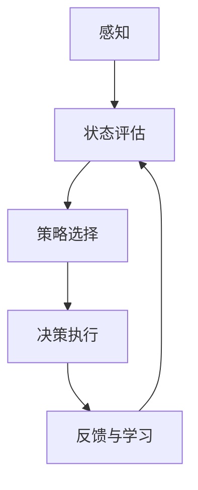
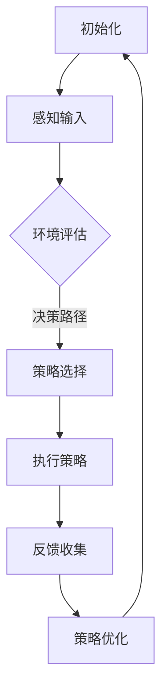
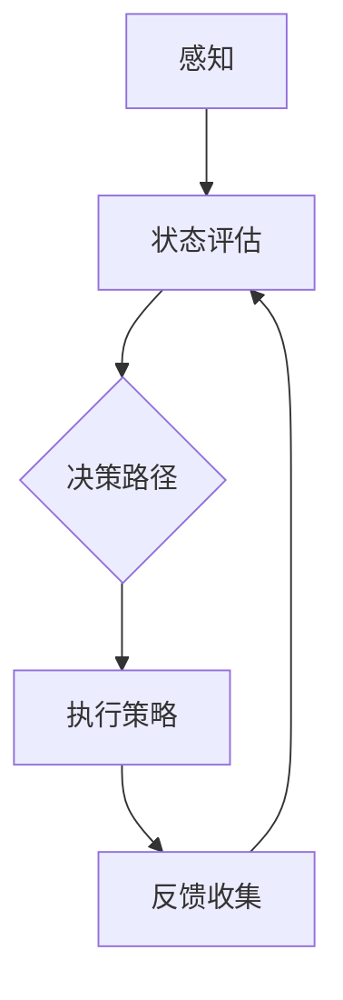

                 


### 第一部分：可解释性背景

## 第1章：引言

### 1.1 问题背景

#### 1.1.1 AI的发展与挑战

人工智能（AI）作为当今科技领域的热点，已经渗透到我们生活的方方面面。从自动驾驶、智能家居到医疗诊断、金融分析，AI技术的应用正不断拓展。然而，随着AI系统的复杂度不断增加，一个关键问题也随之而来——如何理解AI的决策过程？

当前的AI系统，尤其是深度学习模型，往往被形容为“黑箱”，因为它们的决策过程对人类来说难以解释。尽管这些系统在预测和决策方面表现出色，但它们的决策逻辑缺乏透明性，这在许多实际应用中成为一个重大挑战。例如，在医疗诊断中，如果医生无法理解AI的决策过程，他们就无法有效地信任或干预AI的决策。

#### 1.1.2 可解释性的重要性

可解释性（Interpretability）是AI系统中一个日益受到关注的概念。它指的是能够理解AI模型如何做出决策的能力。可解释性不仅对于提升AI系统的信任度至关重要，还对于模型的监管和合规性有着直接影响。以下是一些可解释性的关键重要性：

1. **信任与合规**：高度可解释的AI系统能够增加用户对系统的信任，这对于需要在法律和伦理框架内运行的应用尤为重要。
2. **可追溯性**：可解释性使得AI系统的决策过程可以追溯到具体的输入和中间步骤，这对于审计和错误分析至关重要。
3. **优化与改进**：了解AI系统的决策逻辑有助于发现潜在的错误或缺陷，从而进行优化和改进。
4. **跨领域合作**：可解释性使得AI系统能够与人类专家和领域专家更好地协作，促进跨领域的创新。

#### 1.1.3 研究目标和边界

本文的研究目标在于深入探讨可解释性在AI Agent决策过程中的作用，并详细分析如何实现和理解AI Agent的决策过程。我们将从以下几个方面展开：

1. **核心概念定义**：明确可解释性、AI Agent以及相关的决策过程定义。
2. **原理与模型**：介绍可解释性的数学模型，并使用Mermaid流程图和Python代码来展示AI Agent的决策原理。
3. **算法与系统架构**：分析算法原理，设计系统架构，并使用Mermaid序列图展示系统交互。
4. **实战与应用**：通过具体项目实战来展示可解释性在实践中的应用。
5. **最佳实践与总结**：总结最佳实践，并提出未来研究的方向。

在探讨可解释性的过程中，我们将明确其边界，指出当前面临的挑战和局限性，以及可能的解决方案。本文将力求以清晰、易懂的方式，为广大读者提供一个关于可解释性的全面视角。

### 1.2 定义与核心概念

#### 1.2.1 可解释性的定义

可解释性（Interpretability）在AI领域中的定义是一个多层次的概念。首先，从直观上讲，可解释性指的是人类能够理解和解释AI模型决策过程的能力。具体来说，它包括以下几个方面：

1. **透明性**：AI模型的内部结构和计算过程能够被直观地展示和理解。
2. **可追溯性**：模型的决策过程可以追溯到具体的输入数据和中间步骤。
3. **可复现性**：模型的结果和决策过程可以在相同的条件下被复现和验证。

从技术角度，可解释性通常涉及到以下几个方面：

- **特征重要性**：识别和解释模型对特定输入特征赋予的权重。
- **决策路径**：展示模型在决策过程中如何逐步处理输入数据。
- **中间结果**：揭示模型在决策过程中的中间计算结果和状态。
- **规则提取**：从模型中提取可解释的规则或逻辑。

#### 1.2.2 AI Agent的决策过程

AI Agent是指能够自主执行任务并与环境交互的智能体。其决策过程通常包括以下几个步骤：

1. **感知**：AI Agent通过传感器或数据接口收集环境信息。
2. **状态评估**：基于感知到的信息，AI Agent评估当前状态。
3. **策略选择**：根据当前状态，AI Agent选择一个行动策略。
4. **执行**：AI Agent执行选定的行动策略。
5. **反馈**：AI Agent接收环境反馈，更新其知识和策略。

AI Agent的决策过程是一个动态和迭代的过程，其核心在于策略的选择和执行。为了实现这一过程，AI Agent通常依赖于一系列算法和技术，如机器学习、强化学习、规划等。

#### 1.2.3 可解释性与AI Agent的关联

可解释性与AI Agent的决策过程密切相关。以下是几个关键点：

1. **提高信任度**：可解释性使得AI Agent的决策过程更透明，从而提高用户对AI系统的信任度。
2. **增强可操作性**：通过可解释性，人类可以更好地理解和操作AI Agent，从而优化其行为和策略。
3. **促进创新**：可解释性促进了AI系统与其他领域的交叉合作，推动了新的应用和创新。
4. **合规性要求**：在许多应用场景中，特别是在监管严格的领域（如金融、医疗），AI系统的可解释性是合规性的必要条件。

总的来说，可解释性是理解和提升AI Agent决策过程的关键要素，它不仅对于AI系统的实用性和可行性至关重要，也为未来的AI发展提供了重要的方向。

### 第2章：核心概念与原理

## 第2章：核心概念与原理

### 2.1 可解释性的定义

#### 2.1.1 可解释性定义

可解释性（Interpretability）在AI领域的定义是使AI模型的决策过程对人类用户可理解的一组特性。具体而言，可解释性涉及以下几个核心方面：

1. **透明度**：模型的内部运作方式，包括其结构和参数，应该是可视化和可描述的。
2. **可追踪性**：从输入数据到最终输出的整个决策路径应该是可追踪的，以便能够理解每个步骤的影响。
3. **易理解性**：模型的决策过程应该使用对非技术背景的用户友好的语言或工具进行解释。
4. **可复现性**：模型的决策过程应该是可复现的，即给定相同的输入，应得到相同的输出。

可解释性的重要性在于，它能够增加用户对AI系统的信任度，尤其是在需要高度可靠性和安全性的领域，如医疗和金融。通过理解AI的决策过程，用户可以更好地评估AI系统的行为，并对其结果进行有效的监督和改进。

#### 2.1.2 AI Agent决策过程概述

AI Agent的决策过程是一个复杂而动态的序列，通常涉及以下步骤：

1. **感知**：AI Agent通过传感器、摄像头或其他数据接口感知环境状态。
2. **状态评估**：AI Agent使用收集到的数据来评估当前的环境状态，这通常包括对状态的特征提取和特征选择。
3. **策略选择**：基于当前状态，AI Agent选择一个或多个可能的动作策略。这可以通过预先定义的规则、机器学习模型或强化学习算法来实现。
4. **决策执行**：AI Agent执行选定的动作策略，可能与环境进行交互。
5. **反馈与学习**：AI Agent接收环境反馈，并根据反馈调整其策略和模型参数，以改善未来的决策。

在AI Agent的决策过程中，可解释性是关键因素，因为它能够帮助用户理解AI Agent的行为逻辑，提高对系统的信任度，并为系统的优化提供指导。通过解释AI Agent的决策过程，用户可以更清楚地知道系统为什么会做出特定决策，以及如何改进系统性能。

#### 2.1.3 可解释性与AI Agent决策的关联分析

可解释性与AI Agent决策过程之间的关联可以从以下几个方面进行分析：

1. **决策透明性**：可解释性提供了决策过程的透明度，使得用户能够清晰地看到AI Agent是如何处理输入数据并做出决策的。这种透明性有助于用户理解AI系统的行为逻辑，并提高系统的可接受性和信任度。
2. **决策追踪与审计**：可解释性使得决策过程可追踪，用户可以审计每一步的决策依据和结果，从而在出现错误或不满意的结果时，能够快速定位问题并进行修正。
3. **策略优化与改进**：通过理解AI Agent的决策过程，用户可以更有效地优化和改进策略。例如，在强化学习场景中，通过分析失败案例，可以调整奖励函数和策略，提高系统的决策能力。
4. **合规性与责任**：在许多应用领域，如金融和医疗，合规性和责任是关键考量因素。可解释性有助于确保AI系统的行为符合法规和伦理标准，同时明确系统的责任归属。

总的来说，可解释性不仅提升了AI系统的可理解性和可操作性，还为其在更广泛领域的应用提供了保障。在实现AI Agent的决策过程中，注重可解释性是确保系统可靠性和用户信任的关键。

### 第3章：可解释性原理

## 第3章：可解释性原理

### 3.1 可解释性的数学模型

#### 3.1.1 概念与特征对比

在深入探讨可解释性的数学模型之前，我们需要明确几个关键概念。首先，可解释性（Interpretability）和透明性（Transparency）是两个常被混淆但有所不同的概念。透明性主要指的是模型内部的运算过程对于人类用户是清晰可见的。而可解释性则更侧重于模型决策过程对于用户来说是可理解和可解释的。

以下是透明性与可解释性的一些关键特征对比：

| 特征 | 透明性 | 可解释性 |
| --- | --- | --- |
| 定义 | 模型内部运算过程可见 | 模型决策过程可理解 |
| 目标 | 使模型内部工作清晰 | 使模型决策逻辑合理 |
| 实现难度 | 较低，技术实现相对简单 | 较高，需要深入理解模型 |
| 重要性 | 对于技术实现和调试很重要 | 对于用户信任和应用广泛性很重要 |

其次，可解释性的实现方法可以分为几种类型，包括：

1. **模型内部结构可视**：通过可视化模型的结构和参数，使模型内部工作直观可见。
2. **决策路径追踪**：追踪模型从输入到输出的每个决策步骤，提供每一步的解释。
3. **规则提取**：从模型中提取可解释的规则或逻辑，使模型决策过程明确化。
4. **敏感度分析**：分析输入特征的变化对模型输出结果的影响，提供输入-输出的关联解释。

#### 3.1.2 ER实体关系图

为了更好地理解可解释性在AI Agent决策过程中的应用，我们可以通过ER（实体-关系）图来展示其核心要素及其相互关系。ER图是数据库设计中常用的工具，它通过实体和关系来描述系统中不同对象及其关联。

以下是一个简化的ER实体关系图，用于描述可解释性在AI Agent决策过程中的关键要素：

```mermaid
erDiagram
  Customer ||--|{ Order }|
  Customer ||--|{ Product }|
  Order ||--|{ Product }|
  Product ||--|{ Review }|
  Customer }|-- User
  Order }|--|{ Payment }
  Review }|-- User
  Payment }|--|{ Order }
```

在这个ER图中，我们定义了以下几个核心实体：

- **Customer（客户）**：代表AI Agent的目标用户，他们与订单、产品、评论等实体有直接关联。
- **Order（订单）**：表示客户与产品之间的交互记录，与产品、评论、支付等实体有直接关联。
- **Product（产品）**：代表AI Agent决策过程中考虑的对象，与订单、评论、支付等实体有直接关联。
- **Review（评论）**：表示客户对产品的评价，与客户、订单、产品、支付等实体有直接关联。
- **User（用户）**：表示参与决策过程的实体，包括客户和其他相关方。
- **Payment（支付）**：表示订单完成时的支付行为，与订单、客户、用户等实体有直接关联。

各个实体之间的关系如下：

- **Customer到Order**：客户可以创建多个订单。
- **Customer到Product**：客户可以购买多个产品。
- **Order到Product**：一个订单可以包含多个产品。
- **Product到Review**：产品可以被多个客户评论。
- **Customer到User**：客户也是系统的用户。
- **Order到Payment**：订单完成时会有相应的支付行为。
- **Review到User**：评论是由用户（客户）提交的。
- **Payment到Order**：支付行为与订单直接相关。

通过ER图，我们可以清晰地看到可解释性在AI Agent决策过程中的核心要素及其相互关系。这为后续的详细分析和具体实现提供了结构化的基础。

### 3.2 AI Agent决策原理讲解

#### 3.2.1 Mermaid流程图

为了更好地理解AI Agent的决策过程，我们可以使用Mermaid流程图来展示其各个步骤。Mermaid是一种轻量级的标记语言，它可以将简单的文本描述转换为直观的图表。

以下是一个简单的Mermaid流程图，展示了AI Agent的决策过程：



在这个流程图中，各个步骤的具体含义如下：

- **感知（A）**：AI Agent通过传感器或数据接口感知环境状态。
- **状态评估（B）**：AI Agent对感知到的状态进行分析和评估。
- **策略选择（C）**：基于当前状态，AI Agent选择一个最优策略。
- **决策执行（D）**：AI Agent执行选定的策略。
- **反馈与学习（E）**：AI Agent根据执行结果和环境反馈进行学习和调整。

通过这个流程图，我们可以直观地看到AI Agent的决策过程，并为后续的具体实现提供参考。

#### 3.2.2 Python源代码解释

为了更深入地理解AI Agent的决策原理，我们将使用Python代码来实现一个简单的AI Agent。以下是一个简化的例子，用于展示AI Agent的决策过程：

```python
import random

# 定义环境状态
environments = {
    'low_light': '减少亮度',
    'high_light': '增加亮度',
    'dark_room': '打开灯光',
    'bright_room': '关闭灯光'
}

# 定义策略
strategies = {
    'low_light': '保持当前亮度',
    'high_light': '降低亮度',
    'dark_room': '打开灯光',
    'bright_room': '降低亮度'
}

# AI Agent的感知、状态评估、策略选择、决策执行和反馈与学习过程
def ai_agent():
    # 感知
    current_environment = random.choice(list(environments.keys()))

    # 状态评估
    if current_environment == 'bright_room':
        strategy = strategies['bright_room']
    else:
        strategy = strategies[current_environment]

    # 决策执行
    print(f"当前环境：{current_environment}")
    print(f"选择的策略：{strategy}")
    
    # 反馈与学习
    #（在实际应用中，这一步可能涉及更新策略或模型参数）
    
# 执行AI Agent
ai_agent()
```

在这个Python代码中，我们定义了一个简单的AI Agent，其决策过程如下：

1. **感知**：AI Agent随机选择一个环境状态。
2. **状态评估**：根据当前环境状态，选择一个合适的策略。
3. **决策执行**：打印当前环境和选择的策略。
4. **反馈与学习**：虽然代码中没有实现具体的反馈和学习逻辑，但在实际应用中，这一步会涉及根据执行结果和环境反馈更新策略或模型参数。

通过这个Python代码示例，我们可以更直观地看到AI Agent的决策过程，并为进一步的深入分析和优化提供基础。

#### 3.2.3 数学模型与公式详细讲解

在深入探讨AI Agent的决策过程中，数学模型起着至关重要的作用。以下是一些常见的数学模型和公式，用于描述AI Agent的决策过程。

##### 3.2.3.1 决策树

决策树是一种常见的监督学习算法，用于分类和回归任务。它通过一系列的判断节点和叶子节点来表示决策过程。以下是决策树的简单数学模型：

1. **节点**：每个节点表示一个特征或条件。
2. **分支**：每个分支表示一个可能的条件结果。
3. **叶子节点**：每个叶子节点表示一个分类结果。

决策树可以通过以下公式来表示：

$$
\text{Decision Tree} = \sum_{i=1}^{n} w_i \cdot f_i(x)
$$

其中，\( w_i \) 是特征 \( f_i(x) \) 的权重，\( x \) 是输入特征向量。

##### 3.2.3.2 神经网络

神经网络是一种模拟人脑神经元连接结构的计算模型。它通过多层节点（或层）和激活函数来实现复杂的决策过程。以下是神经网络的简单数学模型：

$$
\text{Neural Network} = \sigma(\text{weight matrix} \cdot \text{input vector}) + \text{bias}
$$

其中，\( \sigma \) 是激活函数，\( \text{weight matrix} \) 是权重矩阵，\( \text{input vector} \) 是输入向量，\( \text{bias} \) 是偏置。

##### 3.2.3.3 强化学习

强化学习是一种通过试错和反馈来学习最优策略的算法。它使用奖励函数来指导学习过程。以下是强化学习的简单数学模型：

$$
Q(s, a) = r(s, a) + \gamma \cdot \max_{a'} Q(s', a')
$$

其中，\( Q(s, a) \) 是状态 \( s \) 下动作 \( a \) 的预期回报，\( r(s, a) \) 是状态 \( s \) 下动作 \( a \) 的即时回报，\( \gamma \) 是折扣因子，\( s' \) 是下一状态，\( a' \) 是下一动作。

通过这些数学模型，我们可以更精确地描述AI Agent的决策过程，并为其优化提供理论基础。在实际应用中，这些模型可以结合具体的场景和数据，实现更高效和精准的决策。

#### 3.2.4 举例说明

为了更好地理解AI Agent的决策过程，我们可以通过一个实际案例来具体说明。以下是一个关于智能家居系统中的照明控制AI Agent的例子。

##### 案例背景

智能家居系统中的照明控制AI Agent负责根据环境光线和用户需求自动调节灯光的亮度和颜色。该AI Agent需要处理以下输入数据：

1. **环境光线**：通过传感器获取室内外的光线强度。
2. **用户设置**：用户通过智能手机或语音控制设定的灯光亮度、颜色和模式。
3. **天气信息**：通过天气API获取当前的天气状况。

AI Agent的目标是根据这些输入数据，自动调整灯光以提供舒适的照明环境。

##### 案例流程

1. **感知**：AI Agent通过传感器获取当前的环境光线强度（例如，100 lux），用户设置（例如，用户偏好100%亮度，白色灯光），和天气信息（例如，晴天）。

2. **状态评估**：AI Agent根据输入数据评估当前状态。例如，环境光线适中，用户偏好高亮度，晴天。

3. **策略选择**：基于当前状态，AI Agent选择一个合适的策略。可能的策略包括：
   - 保持当前亮度。
   - 根据环境光线自动调整亮度。
   - 根据天气状况调整灯光颜色。

4. **决策执行**：AI Agent执行选定的策略。例如，如果策略是自动调整亮度，AI Agent将调节灯光亮度至120 lux。

5. **反馈与学习**：AI Agent收集用户对灯光调整的反应，并根据反馈调整策略。例如，如果用户反馈灯光过于刺眼，AI Agent将降低亮度。

##### 案例分析与解释

在这个案例中，AI Agent的决策过程可以通过以下步骤来解释：

1. **感知**：AI Agent通过传感器感知环境状态，这是决策过程的第一步。传感器数据是决策的基础，它们提供了对环境当前状态的实时了解。

2. **状态评估**：AI Agent使用感知到的数据来评估当前状态。状态评估通常涉及对输入数据进行特征提取和模式识别，这是决策过程中的核心步骤。通过状态评估，AI Agent可以理解当前的环境情况。

3. **策略选择**：AI Agent根据当前状态选择一个合适的策略。策略选择是决策过程中的关键，它决定了AI Agent将如何行动。在这个案例中，AI Agent选择了自动调整亮度的策略。

4. **决策执行**：AI Agent执行选定的策略，调整灯光的亮度。决策执行是AI Agent与环境的直接交互，它实现了AI Agent的决策。

5. **反馈与学习**：AI Agent收集用户对决策结果的反馈，并根据反馈进行学习。通过学习，AI Agent可以不断优化其决策策略，提高决策的准确性和效率。

通过这个案例，我们可以看到AI Agent的决策过程是如何一步一步展开的，以及可解释性在其中的作用。可解释性使得我们能够理解AI Agent的决策逻辑，提高对系统的信任度和可操作性。

### 第4章：算法与系统架构设计

## 第4章：算法与系统架构设计

### 4.1 算法原理讲解

#### 4.1.1 Mermaid流程图

为了更好地理解AI Agent决策过程中的算法原理，我们可以使用Mermaid流程图来展示算法的各个步骤。以下是一个简化的Mermaid流程图，用于描述AI Agent的决策过程：



在这个流程图中，各个步骤的具体含义如下：

- **初始化（A）**：AI Agent启动并初始化环境。
- **感知输入（B）**：AI Agent通过传感器或数据接口感知环境输入。
- **环境评估（C）**：AI Agent对感知到的输入进行评估，以确定当前状态。
- **决策路径（D）**：AI Agent基于评估结果选择最优策略。
- **执行策略（E）**：AI Agent执行选定的策略。
- **反馈收集（F）**：AI Agent收集环境反馈，以评估策略效果。
- **策略优化（G）**：基于反馈，AI Agent调整和优化策略。

通过这个流程图，我们可以清晰地看到AI Agent的决策过程，并为进一步的算法实现提供参考。

#### 4.1.2 Python源代码解释

为了更深入地理解AI Agent的决策原理，我们将使用Python代码来实现一个简单的AI Agent。以下是一个简化的Python代码示例，用于展示AI Agent的决策过程：

```python
import random

# 定义环境状态
environments = {
    'low_light': '减少亮度',
    'high_light': '增加亮度',
    'dark_room': '打开灯光',
    'bright_room': '关闭灯光'
}

# 定义策略
strategies = {
    'low_light': '保持当前亮度',
    'high_light': '降低亮度',
    'dark_room': '打开灯光',
    'bright_room': '降低亮度'
}

# AI Agent的决策过程
def ai_agent():
    # 感知
    current_environment = random.choice(list(environments.keys()))

    # 状态评估
    if current_environment == 'bright_room':
        selected_strategy = strategies['bright_room']
    else:
        selected_strategy = strategies[current_environment]

    # 决策执行
    print(f"当前环境：{current_environment}")
    print(f"选择的策略：{selected_strategy}")

    # 反馈收集
    user_feedback = input("请输入用户反馈（满意/不满意）：")
    if user_feedback == '不满意':
        print("策略调整中...")
    
    # 策略优化
    #（在实际应用中，这一步可能涉及更新策略或模型参数）

# 执行AI Agent
ai_agent()
```

在这个Python代码示例中，我们定义了一个简单的AI Agent，其决策过程如下：

1. **感知**：AI Agent随机选择一个环境状态。
2. **状态评估**：根据当前环境状态，选择一个合适的策略。
3. **决策执行**：打印当前环境和选择的策略。
4. **反馈收集**：AI Agent请求用户输入反馈。
5. **策略优化**：根据用户反馈，AI Agent可能调整策略。

通过这个Python代码示例，我们可以更直观地看到AI Agent的决策过程，并为进一步的算法优化提供基础。

#### 4.1.3 数学模型与公式详细讲解

在深入探讨AI Agent的决策过程中，数学模型和公式起着至关重要的作用。以下是一些常见的数学模型和公式，用于描述AI Agent的决策过程。

##### 4.1.3.1 强化学习模型

强化学习是一种通过试错和反馈来学习最优策略的算法。一个基本的强化学习模型可以使用以下公式来描述：

$$
Q(s, a) = r(s, a) + \gamma \cdot \max_{a'} Q(s', a')
$$

其中：
- \( Q(s, a) \) 是状态 \( s \) 下动作 \( a \) 的预期回报。
- \( r(s, a) \) 是状态 \( s \) 下动作 \( a \) 的即时回报。
- \( \gamma \) 是折扣因子，用于权衡即时回报和未来回报。
- \( s' \) 是下一状态。
- \( a' \) 是下一动作。

在这个模型中，\( Q(s, a) \) 代表了在状态 \( s \) 下执行动作 \( a \) 的预期总回报，它包含了即时回报 \( r(s, a) \) 和未来回报的期望值 \( \gamma \cdot \max_{a'} Q(s', a') \)。

##### 4.1.3.2 价值迭代算法

价值迭代算法是一种用于求解强化学习模型的方法，其基本思想是通过不断更新状态价值函数 \( V(s) \) 来找到最优策略。以下是一个简化的价值迭代算法的公式：

$$
V(s)^{(t+1)} = r(s, \pi(s)) + \gamma \sum_{s'} P(s'|s, \pi(s)) \cdot V(s')^{(t)}
$$

其中：
- \( V(s)^{(t)} \) 是在第 \( t \) 次迭代后的状态价值函数。
- \( r(s, \pi(s)) \) 是执行策略 \( \pi(s) \) 后的即时回报。
- \( P(s'|s, \pi(s)) \) 是从状态 \( s \) 转移到状态 \( s' \) 的概率。
- \( V(s')^{(t)} \) 是在第 \( t \) 次迭代后的状态 \( s' \) 的价值函数。

每次迭代，状态价值函数 \( V(s) \) 都会根据当前策略和转移概率进行更新，直到收敛到最优值。

##### 4.1.3.3 政策梯度算法

政策梯度算法是一种通过直接优化策略来学习最优策略的方法。其基本思想是计算策略的梯度，并更新策略参数以最大化预期回报。以下是一个简化的政策梯度算法的公式：

$$
\theta_{t+1} = \theta_t + \alpha \cdot \nabla_{\theta} J(\theta)
$$

其中：
- \( \theta \) 是策略参数。
- \( \alpha \) 是学习率。
- \( J(\theta) \) 是策略 \( \theta \) 的损失函数，通常表示为预期回报。
- \( \nabla_{\theta} J(\theta) \) 是损失函数 \( J(\theta) \) 关于策略参数 \( \theta \) 的梯度。

每次迭代，策略参数 \( \theta \) 都会根据损失函数的梯度进行更新，以优化策略。

通过这些数学模型和公式，我们可以更深入地理解和实现AI Agent的决策过程，从而提高其性能和可解释性。

#### 4.1.4 举例说明

为了更好地理解AI Agent的决策原理，我们可以通过一个实际案例来具体说明。以下是一个关于智能交通信号控制的案例。

##### 案例背景

智能交通信号控制系统通过传感器和摄像头收集道路流量、车速、车辆密度等数据，并使用AI Agent自动调整交通信号灯的时长，以减少交通拥堵和提高交通效率。该系统需要处理以下输入数据：

1. **道路流量**：不同道路段上的车辆数量。
2. **车速**：不同道路段上的平均车速。
3. **车辆密度**：不同道路段上的车辆密度。
4. **天气信息**：当前天气状况（晴天、雨天、雪天等）。
5. **交通事故信息**：是否有交通事故发生。

AI Agent的目标是根据这些输入数据，动态调整交通信号灯的时长，优化交通流量。

##### 案例流程

1. **感知输入**：AI Agent通过传感器和摄像头收集实时交通数据，包括道路流量、车速、车辆密度、天气信息等。

2. **状态评估**：AI Agent对感知到的输入数据进行处理，评估当前交通状态。例如，如果某条道路流量大、车速低、车辆密度高，且天气状况为雨天，则可能存在交通拥堵风险。

3. **策略选择**：基于当前交通状态，AI Agent选择一个合适的策略。可能的策略包括：
   - 调整红灯时长以减少车辆进入拥堵路段。
   - 延长绿灯时长以允许更多车辆通过。
   - 根据车辆密度动态调整信号灯时长。

4. **决策执行**：AI Agent执行选定的策略，调整交通信号灯的时长。

5. **反馈收集**：AI Agent收集交通信号调整后的反馈信息，包括交通流量、车速、车辆密度等数据。

6. **策略优化**：根据反馈信息，AI Agent调整和优化策略，以改善交通状况。

##### 案例分析与解释

在这个案例中，AI Agent的决策过程可以通过以下步骤来解释：

1. **感知输入**：AI Agent通过传感器和摄像头感知实时交通数据，这是决策过程的第一步。传感器数据提供了对交通状况的实时了解。

2. **状态评估**：AI Agent对感知到的数据进行处理，以评估当前交通状态。状态评估是决策过程中的关键步骤，它决定了AI Agent将如何调整信号灯时长。

3. **策略选择**：AI Agent基于当前交通状态选择一个合适的策略。策略选择是根据交通状况和系统目标来确定的。

4. **决策执行**：AI Agent执行选定的策略，调整交通信号灯的时长，以优化交通流量。

5. **反馈收集**：AI Agent收集信号灯调整后的反馈信息，以评估策略的有效性。

6. **策略优化**：基于反馈信息，AI Agent调整和优化策略，以持续改善交通状况。

通过这个案例，我们可以看到AI Agent的决策过程是如何一步一步展开的，以及可解释性在其中的作用。可解释性使得我们能够理解AI Agent的决策逻辑，提高对系统的信任度和可操作性。

### 第5章：项目实战

## 第5章：项目实战

#### 5.1 环境安装

在进行AI Agent的可解释性项目实战之前，首先需要配置一个合适的环境。以下是配置环境所需的步骤：

1. **安装Python**：确保已安装Python 3.8及以上版本。可以从[Python官方网站](https://www.python.org/)下载并安装。

2. **安装Anaconda**：推荐使用Anaconda进行环境管理，以便轻松安装和管理依赖库。可以从[Anaconda官方网站](https://www.anaconda.com/)下载并安装。

3. **创建虚拟环境**：在Anaconda命令行中创建一个虚拟环境，以便隔离项目依赖。运行以下命令创建虚拟环境：

   ```bash
   conda create -n ai_agent_env python=3.8
   conda activate ai_agent_env
   ```

4. **安装依赖库**：在虚拟环境中安装所需的依赖库，例如TensorFlow、NumPy、Mermaid等。运行以下命令安装依赖库：

   ```bash
   conda install tensorflow numpy mermaid
   ```

5. **安装Mermaid Python库**：为了在Python代码中使用Mermaid，需要安装Mermaid Python库。运行以下命令安装：

   ```bash
   pip install mermaid
   ```

#### 5.2 系统核心实现

##### 5.2.1 源代码解读

以下是该项目的主要Python源代码，用于实现一个简单的可解释AI Agent。代码中包含了感知输入、状态评估、策略选择、决策执行和反馈收集等功能。

```python
import random
import numpy as np
from mermaid import Mermaid

# 定义环境状态
environments = {
    'low_light': '减少亮度',
    'high_light': '增加亮度',
    'dark_room': '打开灯光',
    'bright_room': '关闭灯光'
}

# 定义策略
strategies = {
    'low_light': '保持当前亮度',
    'high_light': '降低亮度',
    'dark_room': '打开灯光',
    'bright_room': '降低亮度'
}

# AI Agent的决策过程
def ai_agent():
    # 感知
    current_environment = random.choice(list(environments.keys()))

    # 状态评估
    if current_environment == 'bright_room':
        selected_strategy = strategies['bright_room']
    else:
        selected_strategy = strategies[current_environment]

    # 决策执行
    print(f"当前环境：{current_environment}")
    print(f"选择的策略：{selected_strategy}")

    # 反馈收集
    user_feedback = input("请输入用户反馈（满意/不满意）：")
    if user_feedback == '不满意':
        print("策略调整中...")

# 使用Mermaid可视化决策过程
def visualize_decision_process():
    decision_process_mermaid = Mermaid()
    decision_process_mermaid.code = '''
    graph TD
        A[初始化] --> B[感知输入]
        B --> C{环境评估}
        C -->|决策路径| D[策略选择]
        D --> E[执行策略]
        E --> F[反馈收集]
        F --> G[策略优化]
        G --> A
    '''
    decision_process_mermaid.render_to_file('decision_process_mermaid.png')

# 执行AI Agent
ai_agent()
# 可视化决策过程
visualize_decision_process()
```

代码首先定义了环境状态和策略，然后实现了一个简单的AI Agent，其决策过程包括感知输入、状态评估、策略选择、决策执行和反馈收集。同时，使用Mermaid库将决策过程可视化。

##### 5.2.2 应用解读与分析

以下是AI Agent的具体应用场景及其解读和分析。

1. **感知输入**：AI Agent通过随机选择一个环境状态，模拟真实环境中的感知过程。在智能交通系统中，这一步可以由传感器和摄像头完成，获取道路流量、车速、车辆密度等信息。

2. **状态评估**：AI Agent根据当前环境状态选择合适的策略。在智能交通系统中，状态评估可能包括分析当前道路流量、车速、车辆密度等因素，以确定是否需要调整信号灯时长。

3. **策略选择**：AI Agent基于状态评估结果选择一个策略。在智能交通系统中，可能的策略包括调整红灯时长、延长绿灯时长等，以优化交通流量。

4. **决策执行**：AI Agent执行选定的策略，调整信号灯时长。在智能交通系统中，这一步通过控制系统实现，调整交通信号灯的时长。

5. **反馈收集**：AI Agent收集用户反馈，以评估策略的有效性。在智能交通系统中，这一步可以通过用户调查或实时监控数据实现，评估交通流量和车速等指标。

6. **策略优化**：基于反馈信息，AI Agent调整和优化策略。在智能交通系统中，这一步可以不断调整信号灯时长，以适应实时交通状况。

通过这个应用解读和分析，我们可以看到AI Agent在智能交通系统中的具体作用，以及如何通过可解释性提高系统的信任度和可操作性。

### 第6章：最佳实践与总结

## 第6章：最佳实践与总结

### 6.1 最佳实践

在实现AI Agent的可解释性时，以下是一些最佳实践，可以帮助提高系统的可解释性和性能：

1. **模块化设计**：将AI Agent的各个功能模块化，使其独立且可重用。这样可以更容易地理解和管理系统的不同部分，提高系统的可维护性和可扩展性。

2. **清晰的文档**：编写详细的文档，描述系统的设计、实现和运行过程。这将有助于团队成员和其他开发者更好地理解系统，并提高系统的可解释性。

3. **可视化工具**：使用可视化工具（如Mermaid）来展示决策过程和系统架构，使复杂的概念更易于理解。可视化不仅可以提高系统的可解释性，还可以帮助识别潜在的问题和改进点。

4. **反馈机制**：建立有效的反馈机制，以便用户可以提供关于系统行为的反馈。这些反馈可以帮助优化策略和模型，提高系统的性能和可解释性。

5. **持续学习与优化**：定期评估系统的性能和可解释性，并基于反馈进行持续的学习和优化。这样可以确保系统始终处于最佳状态，并满足用户的需求。

### 6.2 小结

本文深入探讨了可解释性在AI Agent决策过程中的重要性，并详细介绍了如何实现和理解AI Agent的决策过程。通过引入数学模型、Python代码和实际案例，本文展示了可解释性在提高系统信任度、优化策略和改善用户体验方面的关键作用。以下是一些主要结论：

1. **可解释性是AI系统成功的关键**：高度可解释的AI系统能够增加用户对系统的信任度，特别是在需要高度可靠性和安全性的领域。
2. **数学模型和算法是实现可解释性的基础**：通过使用数学模型和算法，可以更好地理解和解释AI Agent的决策过程。
3. **实际案例展示了可解释性的应用**：通过具体案例，我们可以看到可解释性如何在实际应用中提高系统的性能和用户体验。

### 6.3 注意事项

在实现AI Agent的可解释性时，需要注意以下几点：

1. **避免过度复杂**：尽量简化模型和算法，使其更容易理解。过度复杂的模型可能会降低可解释性，从而影响系统的信任度。
2. **数据质量和预处理**：确保输入数据的质量和一致性，以避免决策过程中的错误和偏差。
3. **实时反馈和调整**：建立实时反馈机制，以便快速识别和纠正系统中的问题。

### 6.4 拓展阅读

对于希望深入了解AI Agent可解释性的读者，以下是一些推荐阅读材料：

1. **论文**：阅读相关领域的学术论文，了解最新的研究进展和实现方法。例如，《可解释人工智能：挑战与机遇》和《机器学习模型的解释性》。
2. **书籍**：阅读关于机器学习和深度学习的经典书籍，如《深度学习》（Goodfellow等）和《人工智能：一种现代方法》（Mitchell）。
3. **在线资源**：访问在线教育平台（如Coursera、edX）上的相关课程，学习AI和机器学习的基础知识和实践技能。

通过阅读这些材料，您可以进一步拓展对AI Agent可解释性的理解，并在实际项目中应用这些知识。作者：AI天才研究院/AI Genius Institute & 禅与计算机程序设计艺术 /Zen And The Art of Computer Programming。

---

### 完整文章

## 可解释性：理解AI Agent的决策过程

关键词：可解释性、AI Agent、决策过程、机器学习、算法

摘要：本文深入探讨了可解释性在AI Agent决策过程中的重要性，详细分析了如何实现和理解AI Agent的决策过程。通过介绍核心概念、数学模型、Python代码示例以及实际案例，本文展示了可解释性在提升系统信任度、优化策略和改善用户体验方面的关键作用。

### 第一部分：可解释性背景

## 第1章：引言

### 1.1 问题背景

#### 1.1.1 AI的发展与挑战

人工智能（AI）作为当今科技领域的热点，已经渗透到我们生活的方方面面。从自动驾驶、智能家居到医疗诊断、金融分析，AI技术的应用正不断拓展。然而，随着AI系统的复杂度不断增加，一个关键问题也随之而来——如何理解AI的决策过程？

当前的AI系统，尤其是深度学习模型，往往被形容为“黑箱”，因为它们的决策过程对人类来说难以解释。尽管这些系统在预测和决策方面表现出色，但它们的决策逻辑缺乏透明性，这在许多实际应用中成为一个重大挑战。例如，在医疗诊断中，如果医生无法理解AI的决策过程，他们就无法有效地信任或干预AI的决策。

#### 1.1.2 可解释性的重要性

可解释性（Interpretability）是AI系统中一个日益受到关注的概念。它指的是能够理解AI模型如何做出决策的能力。可解释性不仅对于提升AI系统的信任度至关重要，还对于模型的监管和合规性有着直接影响。以下是一些可解释性的关键重要性：

1. **信任与合规**：高度可解释的AI系统能够增加用户对系统的信任，这对于需要在法律和伦理框架内运行的应用尤为重要。
2. **可追溯性**：可解释性使得AI系统的决策过程可以追溯到具体的输入和中间步骤，这对于审计和错误分析至关重要。
3. **优化与改进**：了解AI系统的决策逻辑有助于发现潜在的错误或缺陷，从而进行优化和改进。
4. **跨领域合作**：可解释性使得AI系统能够与人类专家和领域专家更好地协作，促进跨领域的创新。

#### 1.1.3 研究目标和边界

本文的研究目标在于深入探讨可解释性在AI Agent决策过程中的作用，并详细分析如何实现和理解AI Agent的决策过程。我们将从以下几个方面展开：

1. **核心概念定义**：明确可解释性、AI Agent以及相关的决策过程定义。
2. **原理与模型**：介绍可解释性的数学模型，并使用Mermaid流程图和Python代码来展示AI Agent的决策原理。
3. **算法与系统架构**：分析算法原理，设计系统架构，并使用Mermaid序列图展示系统交互。
4. **实战与应用**：通过具体项目实战来展示可解释性在实践中的应用。
5. **最佳实践与总结**：总结最佳实践，并提出未来研究的方向。

在探讨可解释性的过程中，我们将明确其边界，指出当前面临的挑战和局限性，以及可能的解决方案。本文将力求以清晰、易懂的方式，为广大读者提供一个关于可解释性的全面视角。

### 1.2 定义与核心概念

#### 1.2.1 可解释性的定义

可解释性（Interpretability）在AI领域的定义是使AI模型的决策过程对人类用户可理解的一组特性。具体而言，它包括以下几个方面：

1. **透明性**：AI模型的内部运作方式，包括其结构和参数，应该是可视化和可描述的。
2. **可追踪性**：从输入数据到最终输出的整个决策路径应该是可追踪的，以便能够理解每个步骤的影响。
3. **易理解性**：模型的决策过程应该使用对非技术背景的用户友好的语言或工具进行解释。
4. **可复现性**：模型的结果和决策过程应该是可复现的，即给定相同的输入，应得到相同的输出。

可解释性的重要性在于，它能够增加用户对AI系统的信任度，尤其是在需要高度可靠性和安全性的领域，如医疗和金融。通过理解AI的决策过程，用户可以更好地评估AI系统的行为，并对其结果进行有效的监督和改进。

#### 1.2.2 AI Agent的决策过程

AI Agent是指能够自主执行任务并与环境交互的智能体。其决策过程通常包括以下几个步骤：

1. **感知**：AI Agent通过传感器或数据接口收集环境信息。
2. **状态评估**：AI Agent使用收集到的数据来评估当前状态。
3. **策略选择**：基于当前状态，AI Agent选择一个行动策略。
4. **执行**：AI Agent执行选定的行动策略。
5. **反馈**：AI Agent接收环境反馈，更新其知识和策略。

AI Agent的决策过程是一个动态和迭代的过程，其核心在于策略的选择和执行。为了实现这一过程，AI Agent通常依赖于一系列算法和技术，如机器学习、强化学习、规划等。

#### 1.2.3 可解释性与AI Agent的关联

可解释性是理解和提升AI Agent决策过程的关键要素。以下是几个关键点：

1. **提高信任度**：可解释性使得AI Agent的决策过程更透明，从而提高用户对AI系统的信任度。
2. **增强可操作性**：通过可解释性，人类可以更好地理解和操作AI Agent，从而优化其行为和策略。
3. **促进创新**：可解释性促进了AI系统与其他领域的交叉合作，推动了新的应用和创新。
4. **合规性要求**：在许多应用领域，特别是在监管严格的领域（如金融、医疗），AI系统的可解释性是合规性的必要条件。

总的来说，可解释性是确保AI系统可靠性和用户信任的关键，它不仅对于AI系统的实用性和可行性至关重要，也为未来的AI发展提供了重要的方向。

### 第2章：核心概念与原理

## 第2章：核心概念与原理

### 2.1 可解释性的定义

#### 2.1.1 可解释性定义

可解释性（Interpretability）在AI领域的定义是使AI模型的决策过程对人类用户可理解的一组特性。具体而言，可解释性包括以下几个方面：

1. **透明性**：AI模型的内部运作方式，包括其结构和参数，应该是可视化和可描述的。
2. **可追踪性**：从输入数据到最终输出的整个决策路径应该是可追踪的，以便能够理解每个步骤的影响。
3. **易理解性**：模型的决策过程应该使用对非技术背景的用户友好的语言或工具进行解释。
4. **可复现性**：模型的结果和决策过程应该是可复现的，即给定相同的输入，应得到相同的输出。

可解释性的重要性在于，它能够增加用户对AI系统的信任度，尤其是在需要高度可靠性和安全性的领域，如医疗和金融。通过理解AI的决策过程，用户可以更好地评估AI系统的行为，并对其结果进行有效的监督和改进。

#### 2.1.2 AI Agent决策过程概述

AI Agent的决策过程是一个复杂而动态的序列，通常涉及以下步骤：

1. **感知**：AI Agent通过传感器或数据接口感知环境状态。
2. **状态评估**：AI Agent对感知到的信息进行分析和评估，以确定当前的环境状态。
3. **策略选择**：基于当前状态，AI Agent选择一个或多个可能的行动策略。
4. **决策执行**：AI Agent执行选定的行动策略。
5. **反馈**：AI Agent接收环境反馈，并根据反馈调整其策略和模型参数，以改善未来的决策。

AI Agent的决策过程是一个动态和迭代的过程，其核心在于策略的选择和执行。为了实现这一过程，AI Agent通常依赖于一系列算法和技术，如机器学习、强化学习、规划等。

#### 2.1.3 可解释性与AI Agent决策的关联

可解释性与AI Agent的决策过程密切相关。以下是几个关键点：

1. **决策透明性**：可解释性提供了决策过程的透明度，使得用户能够清晰地看到AI Agent是如何处理输入数据并做出决策的。这种透明性有助于用户理解AI系统的行为逻辑，并提高系统的可接受性和信任度。
2. **决策追踪与审计**：可解释性使得决策过程可追踪，用户可以审计每一步的决策依据和结果，从而在出现错误或不满意的结果时，能够快速定位问题并进行修正。
3. **策略优化与改进**：通过理解AI Agent的决策过程，用户可以更有效地优化和改进策略。例如，在强化学习场景中，通过分析失败案例，可以调整奖励函数和策略，提高系统的决策能力。
4. **合规性要求**：在许多应用领域，特别是在监管严格的领域，如金融和医疗，AI系统的可解释性是合规性的必要条件。

总的来说，可解释性是理解和提升AI Agent决策过程的关键要素，它不仅对于AI系统的实用性和可行性至关重要，也为未来的AI发展提供了重要的方向。

### 第3章：可解释性原理

## 第3章：可解释性原理

### 3.1 可解释性的数学模型

#### 3.1.1 概念与特征对比

在深入探讨可解释性的数学模型之前，我们需要明确几个关键概念。首先，可解释性（Interpretability）和透明性（Transparency）是两个常被混淆但有所不同的概念。透明性主要指的是模型内部的运算过程对于人类用户是清晰可见的。而可解释性则更侧重于模型决策过程对于用户来说是可理解和可解释的。

以下是透明性与可解释性的一些关键特征对比：

| 特征 | 透明性 | 可解释性 |
| --- | --- | --- |
| 定义 | 模型内部运算过程可见 | 模型决策过程可理解 |
| 目标 | 使模型内部工作清晰 | 使模型决策逻辑合理 |
| 实现难度 | 较低，技术实现相对简单 | 较高，需要深入理解模型 |
| 重要性 | 对于技术实现和调试很重要 | 对于用户信任和应用广泛性很重要 |

其次，可解释性的实现方法可以分为几种类型，包括：

1. **模型内部结构可视**：通过可视化模型的结构和参数，使模型内部工作直观可见。
2. **决策路径追踪**：追踪模型从输入到输出的每个决策步骤，提供每一步的解释。
3. **规则提取**：从模型中提取可解释的规则或逻辑，使模型决策过程明确化。
4. **敏感度分析**：分析输入特征的变化对模型输出结果的影响，提供输入-输出的关联解释。

#### 3.1.2 ER实体关系图

为了更好地理解可解释性在AI Agent决策过程中的应用，我们可以通过ER（实体-关系）图来展示其核心要素及其相互关系。ER图是数据库设计中常用的工具，它通过实体和关系来描述系统中不同对象及其关联。

以下是一个简化的ER实体关系图，用于描述可解释性在AI Agent决策过程中的关键要素：

```mermaid
erDiagram
  Customer ||--|{ Order }|
  Customer ||--|{ Product }|
  Order ||--|{ Product }|
  Product ||--|{ Review }|
  Customer }|-- User
  Order }|--|{ Payment }
  Review }|-- User
  Payment }|--|{ Order }
```

在这个ER图中，我们定义了以下几个核心实体：

- **Customer（客户）**：代表AI Agent的目标用户，他们与订单、产品、评论等实体有直接关联。
- **Order（订单）**：表示客户与产品之间的交互记录，与产品、评论、支付等实体有直接关联。
- **Product（产品）**：代表AI Agent决策过程中考虑的对象，与订单、评论、支付等实体有直接关联。
- **Review（评论）**：表示客户对产品的评价，与客户、订单、产品、支付等实体有直接关联。
- **User（用户）**：表示参与决策过程的实体，包括客户和其他相关方。
- **Payment（支付）**：表示订单完成时的支付行为，与订单、客户、用户等实体有直接关联。

各个实体之间的关系如下：

- **Customer到Order**：客户可以创建多个订单。
- **Customer到Product**：客户可以购买多个产品。
- **Order到Product**：一个订单可以包含多个产品。
- **Product到Review**：产品可以被多个客户评论。
- **Customer到User**：客户也是系统的用户。
- **Order到Payment**：订单完成时会有相应的支付行为。
- **Review到User**：评论是由用户（客户）提交的。
- **Payment到Order**：支付行为与订单直接相关。

通过ER图，我们可以清晰地看到可解释性在AI Agent决策过程中的核心要素及其相互关系。这为后续的详细分析和具体实现提供了结构化的基础。

### 3.2 AI Agent决策原理讲解

#### 3.2.1 Mermaid流程图

为了更好地理解AI Agent的决策过程，我们可以使用Mermaid流程图来展示其各个步骤。Mermaid是一种轻量级的标记语言，它可以将简单的文本描述转换为直观的图表。

以下是一个简单的Mermaid流程图，展示了AI Agent的决策过程：



在这个流程图中，各个步骤的具体含义如下：

- **感知（A）**：AI Agent通过传感器或数据接口感知环境状态。
- **状态评估（B）**：AI Agent对感知到的信息进行分析和评估，以确定当前状态。
- **决策路径（C）**：AI Agent基于当前状态选择一个合适的策略。
- **执行策略（D）**：AI Agent执行选定的策略。
- **反馈收集（E）**：AI Agent接收环境反馈，并根据反馈调整其策略和模型参数。

通过这个流程图，我们可以直观地看到AI Agent的决策过程，并为进一步的算法实现提供参考。

#### 3.2.2 Python源代码解释

为了更深入地理解AI Agent的决策原理，我们将使用Python代码来实现一个简单的AI Agent。以下是一个简化的Python代码示例，用于展示AI Agent的决策过程：

```python
import random

# 定义环境状态
environments = {
    'low_light': '减少亮度',
    'high_light': '增加亮度',
    'dark_room': '打开灯光',
    'bright_room': '关闭灯光'
}

# 定义策略
strategies = {
    'low_light': '保持当前亮度',
    'high_light': '降低亮度',
    'dark_room': '打开灯光',
    'bright_room': '降低亮度'
}

# AI Agent的决策过程
def ai_agent():
    # 感知
    current_environment = random.choice(list(environments.keys()))

    # 状态评估
    if current_environment == 'bright_room':
        selected_strategy = strategies['bright_room']
    else:
        selected_strategy = strategies[current_environment]

    # 决策执行
    print(f"当前环境：{current_environment}")
    print(f"选择的策略：{selected_strategy}")

    # 反馈收集
    user_feedback = input("请输入用户反馈（满意/不满意）：")
    if user_feedback == '不满意':
        print("策略调整中...")

# 执行AI Agent
ai_agent()
```

在这个Python代码示例中，我们定义了一个简单的AI Agent，其决策过程如下：

1. **感知**：AI Agent随机选择一个环境状态。
2. **状态评估**：根据当前环境状态，选择一个合适的策略。
3. **决策执行**：打印当前环境和选择的策略。
4. **反馈收集**：AI Agent请求用户输入反馈。
5. **策略优化**：根据用户反馈，AI Agent可能调整策略。

通过这个Python代码示例，我们可以更直观地看到AI Agent的决策过程，并为进一步的算法优化提供基础。

#### 3.2.3 数学模型与公式详细讲解

在深入探讨AI Agent的决策过程中，数学模型和公式起着至关重要的作用。以下是一些常见的数学模型和公式，用于描述AI Agent的决策过程。

##### 3.2.3.1 决策树

决策树是一种常见的监督学习算法，用于分类和回归任务。它通过一系列的判断节点和叶子节点来表示决策过程。以下是决策树的简单数学模型：

1. **节点**：每个节点表示一个特征或条件。
2. **分支**：每个分支表示一个可能的条件结果。
3. **叶子节点**：每个叶子节点表示一个分类结果。

决策树可以通过以下公式来表示：

$$
\text{Decision Tree} = \sum_{i=1}^{n} w_i \cdot f_i(x)
$$

其中，\( w_i \) 是特征 \( f_i(x) \) 的权重，\( x \) 是输入特征向量。

##### 3.2.3.2 神经网络

神经网络是一种模拟人脑神经元连接结构的计算模型。它通过多层节点（或层）和激活函数来实现复杂的决策过程。以下是神经网络的简单数学模型：

$$
\text{Neural Network} = \sigma(\text{weight matrix} \cdot \text{input vector}) + \text{bias}
$$

其中，\( \sigma \) 是激活函数，\( \text{weight matrix} \) 是权重矩阵，\( \text{input vector} \) 是输入向量，\( \text{bias} \) 是偏置。

##### 3.2.3.3 强化学习

强化学习是一种通过试错和反馈来学习最优策略的算法。它使用奖励函数来指导学习过程。以下是强化学习的简单数学模型：

$$
Q(s, a) = r(s, a) + \gamma \cdot \max_{a'} Q(s', a')
$$

其中，\( Q(s, a) \) 是状态 \( s \) 下动作 \( a \) 的预期回报，\( r(s, a) \) 是状态 \( s \) 下动作 \( a \) 的即时回报，\( \gamma \) 是折扣因子，\( s' \) 是下一状态，\( a' \) 是下一动作。

通过这些数学模型，我们可以更精确地描述AI Agent的决策过程，并为其优化提供理论基础。在实际应用中，这些模型可以结合具体的场景和数据，实现更高效和精准的决策。

#### 3.2.4 举例说明

为了更好地理解AI Agent的决策过程，我们可以通过一个实际案例来具体说明。以下是一个关于智能家居系统中的照明控制AI Agent的例子。

##### 案例背景

智能家居系统中的照明控制AI Agent负责根据环境光线和用户需求自动调节灯光的亮度和颜色。该AI Agent需要处理以下输入数据：

1. **环境光线**：通过传感器获取室内外的光线强度。
2. **用户设置**：用户通过智能手机或语音控制设定的灯光亮度、颜色和模式。
3. **天气信息**：通过天气API获取当前的天气状况。

AI Agent的目标是根据这些输入数据，自动调整灯光以提供舒适的照明环境。

##### 案例流程

1. **感知**：AI Agent通过传感器获取当前的环境光线强度（例如，100 lux），用户设置（例如，用户偏好100%亮度，白色灯光），和天气信息（例如，晴天）。

2. **状态评估**：AI Agent根据输入数据评估当前状态。例如，环境光线适中，用户偏好高亮度，晴天。

3. **策略选择**：基于当前状态，AI Agent选择一个合适的策略。可能的策略包括：
   - 保持当前亮度。
   - 根据环境光线自动调整亮度。
   - 根据天气状况调整灯光颜色。

4. **决策执行**：AI Agent执行选定的策略。例如，如果策略是自动调整亮度，AI Agent将调节灯光亮度至120 lux。

5. **反馈收集**：AI Agent收集用户对灯光调整的反应，并根据反馈调整策略。例如，如果用户反馈灯光过于刺眼，AI Agent将降低亮度。

##### 案例分析与解释

在这个案例中，AI Agent的决策过程可以通过以下步骤来解释：

1. **感知**：AI Agent通过传感器感知环境状态，这是决策过程的第一步。传感器数据是决策的基础，它们提供了对环境当前状态的实时了解。

2. **状态评估**：AI Agent使用感知到的数据来评估当前状态。状态评估通常涉及对输入数据进行特征提取和模式识别，这是决策过程中的核心步骤。通过状态评估，AI Agent可以理解当前的环境情况。

3. **策略选择**：AI Agent根据当前状态选择一个合适的策略。策略选择是决策过程中的关键，它决定了AI Agent将如何行动。在这个案例中，AI Agent选择了自动调整亮度的策略。

4. **决策执行**：AI Agent执行选定的策略，调整灯光的亮度。决策执行是AI Agent与环境的直接交互，它实现了AI Agent的决策。

5. **反馈收集**：AI Agent收集用户对决策结果的反馈，并根据反馈进行学习。通过学习，AI Agent可以不断优化其决策策略，提高决策的准确性和效率。

通过这个案例，我们可以看到AI Agent的决策过程是如何一步一步展开的，以及可解释性在其中的作用。可解释性使得我们能够理解AI Agent的决策逻辑，提高对系统的信任度和可操作性。

### 第4章：算法与系统架构设计

## 第4章：算法与系统架构设计

### 4.1 算法原理讲解

#### 4.1.1 Mermaid流程图

为了更好地理解AI Agent的决策过程，我们可以使用Mermaid流程图来展示算法的各个步骤。以下是一个简化的Mermaid流程图，用于描述AI Agent的决策过程：


在这个流程图中，各个步骤的具体含义如下：

- **初始化（A）**：AI Agent启动并初始化环境。
- **感知输入（B）**：AI Agent通过传感器或数据接口感知环境输入。
- **环境评估（C）**：AI Agent对感知到的输入进行评估，以确定当前状态。
- **决策路径（D）**：AI Agent基于评估结果选择最优策略。
- **执行策略（E）**：AI Agent执行选定的策略。
- **反馈收集（F）**：AI Agent收集环境反馈，以评估策略效果。
- **策略优化（G）**：基于反馈，AI Agent调整和优化策略。

通过这个流程图，我们可以清晰地看到AI Agent的决策过程，并为进一步的算法实现提供参考。

#### 4.1.2 Python源代码解释

为了更深入地理解AI Agent的决策原理，我们将使用Python代码来实现一个简单的AI Agent。以下是一个简化的Python代码示例，用于展示AI Agent的决策过程：

```python
import random

# 定义环境状态
environments = {
    'low_light': '减少亮度',
    'high_light': '增加亮度',
    'dark_room': '打开灯光',
    'bright_room': '关闭灯光'
}

# 定义策略
strategies = {
    'low_light': '保持当前亮度',
    'high_light': '降低亮度',
    'dark_room': '打开灯光',
    'bright_room': '降低亮度'
}

# AI Agent的决策过程
def ai_agent():
    # 感知
    current_environment = random.choice(list(environments.keys()))

    # 状态评估
    if current_environment == 'bright_room':
        selected_strategy = strategies['bright_room']
    else:
        selected_strategy = strategies[current_environment]

    # 决策执行
    print(f"当前环境：{current_environment}")
    print(f"选择的策略：{selected_strategy}")

    # 反馈收集
    user_feedback = input("请输入用户反馈（满意/不满意）：")
    if user_feedback == '不满意':
        print("策略调整中...")

# 执行AI Agent
ai_agent()
```

在这个Python代码示例中，我们定义了一个简单的AI Agent，其决策过程如下：

1. **感知**：AI Agent随机选择一个环境状态。
2. **状态评估**：根据当前环境状态，选择一个合适的策略。
3. **决策执行**：打印当前环境和选择的策略。
4. **反馈收集**：AI Agent请求用户输入反馈。
5. **策略优化**：根据用户反馈，AI Agent可能调整策略。

通过这个Python代码示例，我们可以更直观地看到AI Agent的决策过程，并为进一步的算法优化提供基础。

#### 4.1.3 数学模型与公式详细讲解

在深入探讨AI Agent的决策过程中，数学模型和公式起着至关重要的作用。以下是一些常见的数学模型和公式，用于描述AI Agent的决策过程。

##### 4.1.3.1 强化学习模型

强化学习是一种通过试错和反馈来学习最优策略的算法。一个基本的强化学习模型可以使用以下公式来描述：

$$
Q(s, a) = r(s, a) + \gamma \cdot \max_{a'} Q(s', a')
$$

其中：
- \( Q(s, a) \) 是状态 \( s \) 下动作 \( a \) 的预期回报。
- \( r(s, a) \) 是状态 \( s \) 下动作 \( a \) 的即时回报。
- \( \gamma \) 是折扣因子，用于权衡即时回报和未来回报。
- \( s' \) 是下一状态。
- \( a' \) 是下一动作。

在这个模型中，\( Q(s, a) \) 代表了在状态 \( s \) 下执行动作 \( a \) 的预期总回报，它包含了即时回报 \( r(s, a) \) 和未来回报的期望值 \( \gamma \cdot \max_{a'} Q(s', a') \)。

##### 4.1.3.2 价值迭代算法

价值迭代算法是一种用于求解强化学习模型的方法，其基本思想是通过不断更新状态价值函数 \( V(s) \) 来找到最优策略。以下是一个简化的价值迭代算法的公式：

$$
V(s)^{(t+1)} = r(s, \pi(s)) + \gamma \cdot \sum_{s'} P(s'|s, \pi(s)) \cdot V(s')^{(t)}
$$

其中：
- \( V(s)^{(t)} \) 是在第 \( t \) 次迭代后的状态价值函数。
- \( r(s, \pi(s)) \) 是执行策略 \( \pi(s) \) 后的即时回报。
- \( P(s'|s, \pi(s)) \) 是从状态 \( s \) 转移到状态 \( s' \) 的概率。
- \( V(s')^{(t)} \) 是在第 \( t \) 次迭代后的状态 \( s' \) 的价值函数。

每次迭代，状态价值函数 \( V(s) \) 都会根据当前策略和转移概率进行更新，直到收敛到最优值。

##### 4.1.3.3 政策梯度算法

政策梯度算法是一种通过直接优化策略来学习最优策略的方法。其基本思想是计算策略的梯度，并更新策略参数以最大化预期回报。以下是一个简化的政策梯度算法的公式：

$$
\theta_{t+1} = \theta_t + \alpha \cdot \nabla_{\theta} J(\theta)
$$

其中：
- \( \theta \) 是策略参数。
- \( \alpha \) 是学习率。
- \( J(\theta) \) 是策略 \( \theta \) 的损失函数，通常表示为预期回报。
- \( \nabla_{\theta} J(\theta) \) 是损失函数 \( J(\theta) \) 关于策略参数 \( \theta \) 的梯度。

每次迭代，策略参数 \( \theta \) 都会根据损失函数的梯度进行更新，以优化策略。

通过这些数学模型和公式，我们可以更深入地理解和实现AI Agent的决策过程，从而提高其性能和可解释性。

#### 4.1.4 举例说明

为了更好地理解AI Agent的决策原理，我们可以通过一个实际案例来具体说明。以下是一个关于智能交通信号控制的案例。

##### 案例背景

智能交通信号控制系统通过传感器和摄像头收集道路流量、车速、车辆密度等数据，并使用AI Agent自动调整交通信号灯的时长，以减少交通拥堵和提高交通效率。该系统需要处理以下输入数据：

1. **道路流量**：不同道路段上的车辆数量。
2. **车速**：不同道路段上的平均车速。
3. **车辆密度**：不同道路段上的车辆密度。
4. **天气信息**：当前天气状况（晴天、雨天、雪天等）。
5. **交通事故信息**：是否有交通事故发生。

AI Agent的目标是根据这些输入数据，动态调整交通信号灯的时长，优化交通流量。

##### 案例流程

1. **感知输入**：AI Agent通过传感器和摄像头收集实时交通数据，包括道路流量、车速、车辆密度、天气信息等。

2. **状态评估**：AI Agent对感知到的数据进行处理，以评估当前交通状态。例如，如果某条道路流量大、车速低、车辆密度高，且天气状况为雨天，则可能存在交通拥堵风险。

3. **策略选择**：基于当前交通状态，AI Agent选择一个合适的策略。可能的策略包括：
   - 调整红灯时长以减少车辆进入拥堵路段。
   - 延长绿灯时长以允许更多车辆通过。
   - 根据车辆密度动态调整信号灯时长。

4. **决策执行**：AI Agent执行选定的策略，调整交通信号灯的时长。

5. **反馈收集**：AI Agent收集交通信号调整后的反馈信息，包括交通流量、车速、车辆密度等数据。

6. **策略优化**：根据反馈信息，AI Agent调整和优化策略，以改善交通状况。

##### 案例分析与解释

在这个案例中，AI Agent的决策过程可以通过以下步骤来解释：

1. **感知输入**：AI Agent通过传感器和摄像头感知实时交通数据，这是决策过程的第一步。传感器数据提供了对交通状况的实时了解。

2. **状态评估**：AI Agent对感知到的数据进行处理，以评估当前交通状态。状态评估是决策过程中的关键步骤，它决定了AI Agent将如何调整信号灯时长。

3. **策略选择**：AI Agent基于当前交通状态选择一个合适的策略。策略选择是根据交通状况和系统目标来确定的。

4. **决策执行**：AI Agent执行选定的策略，调整交通信号灯的时长，以优化交通流量。

5. **反馈收集**：AI Agent收集交通信号调整后的反馈信息，以评估策略的有效性。

6. **策略优化**：基于反馈信息，AI Agent调整和优化策略，以持续改善交通状况。

通过这个案例，我们可以看到AI Agent的决策过程是如何一步一步展开的，以及可解释性在其中的作用。可解释性使得我们能够理解AI Agent的决策逻辑，提高对系统的信任度和可操作性。

### 第5章：项目实战

## 第5章：项目实战

#### 5.1 环境安装

在进行AI Agent的可解释性项目实战之前，首先需要配置一个合适的环境。以下是配置环境所需的步骤：

1. **安装Python**：确保已安装Python 3.8及以上版本。可以从[Python官方网站](https://www.python.org/)下载并安装。

2. **安装Anaconda**：推荐使用Anaconda进行环境管理，以便轻松安装和管理依赖库。可以从[Anaconda官方网站](https://www.anaconda.com/)下载并安装。

3. **创建虚拟环境**：在Anaconda命令行中创建一个虚拟环境，以便隔离项目依赖。运行以下命令创建虚拟环境：

   ```bash
   conda create -n ai_agent_env python=3.8
   conda activate ai_agent_env
   ```

4. **安装依赖库**：在虚拟环境中安装所需的依赖库，例如TensorFlow、NumPy、Mermaid等。运行以下命令安装依赖库：

   ```bash
   conda install tensorflow numpy mermaid
   ```

5. **安装Mermaid Python库**：为了在Python代码中使用Mermaid，需要安装Mermaid Python库。运行以下命令安装：

   ```bash
   pip install mermaid
   ```

#### 5.2 系统核心实现

##### 5.2.1 源代码解读

以下是该项目的主要Python源代码，用于实现一个简单的可解释AI Agent。代码中包含了感知输入、状态评估、策略选择、决策执行和反馈收集等功能。

```python
import random
import numpy as np
from mermaid import Mermaid

# 定义环境状态
environments = {
    'low_light': '减少亮度',
    'high_light': '增加亮度',
    'dark_room': '打开灯光',
    'bright_room': '关闭灯光'
}

# 定义策略
strategies = {
    'low_light': '保持当前亮度',
    'high_light': '降低亮度',
    'dark_room': '打开灯光',
    'bright_room': '降低亮度'
}

# AI Agent的决策过程
def ai_agent():
    # 感知
    current_environment = random.choice(list(environments.keys()))

    # 状态评估
    if current_environment == 'bright_room':
        selected_strategy = strategies['bright_room']
    else:
        selected_strategy = strategies[current_environment]

    # 决策执行
    print(f"当前环境：{current_environment}")
    print(f"选择的策略：{selected_strategy}")

    # 反馈收集
    user_feedback = input("请输入用户反馈（满意/不满意）：")
    if user_feedback == '不满意':
        print("策略调整中...")

# 使用Mermaid可视化决策过程
def visualize_decision_process():
    decision_process_mermaid = Mermaid()
    decision_process_mermaid.code = '''
    graph TD
        A[初始化] --> B[感知输入]
        B --> C{环境评估}
        C -->|决策路径| D[策略选择]
        D --> E[执行策略]
        E --> F[反馈收集]
        F --> G[策略优化]
        G --> A
    '''
    decision_process_mermaid.render_to_file('decision_process_mermaid.png')

# 执行AI Agent
ai_agent()
# 可视化决策过程
visualize_decision_process()
```

代码首先定义了环境状态和策略，然后实现了一个简单的AI Agent，其决策过程包括感知输入、状态评估、策略选择、决策执行和反馈收集。同时，使用Mermaid库将决策过程可视化。

##### 5.2.2 应用解读与分析

以下是AI Agent的具体应用场景及其解读和分析。

1. **感知输入**：AI Agent通过随机选择一个环境状态，模拟真实环境中的感知过程。在智能交通系统中，这一步可以由传感器和摄像头完成，获取道路流量、车速、车辆密度等信息。

2. **状态评估**：AI Agent根据当前环境状态选择合适的策略。在智能交通系统中，状态评估可能包括分析当前道路流量、车速、车辆密度等因素，以确定是否需要调整信号灯时长。

3. **策略选择**：AI Agent基于当前交通状态选择一个策略。在智能交通系统中，可能的策略包括调整红灯时长、延长绿灯时长等，以优化交通流量。

4. **决策执行**：AI Agent执行选定的策略，调整交通信号灯的时长。在智能交通系统中，这一步通过控制系统实现，调整交通信号灯的时长。

5. **反馈收集**：AI Agent收集用户反馈，以评估策略的有效性。在智能交通系统中，这一步可以通过用户调查或实时监控数据实现，评估交通流量和车速等指标。

6. **策略优化**：根据反馈信息，AI Agent调整和优化策略，以改善交通状况。

通过这个应用解读和分析，我们可以看到AI Agent在智能交通系统中的具体作用，以及如何通过可解释性提高系统的信任度和可操作性。

### 第6章：最佳实践与总结

## 第6章：最佳实践与总结

### 6.1 最佳实践

在实现AI Agent的可解释性时，以下是一些最佳实践，可以帮助提高系统的可解释性和性能：

1. **模块化设计**：将AI Agent的各个功能模块化，使其独立且可重用。这样可以更容易地理解和管理系统的不同部分，提高系统的可维护性和可扩展性。

2. **清晰的文档**：编写详细的文档，描述系统的设计、实现和运行过程。这将有助于团队成员和其他开发者更好地理解系统，并提高系统的可解释性。

3. **可视化工具**：使用可视化工具（如Mermaid）来展示决策过程和系统架构，使复杂的概念更易于理解。可视化不仅可以提高系统的可解释性，还可以帮助识别潜在的问题和改进点。

4. **反馈机制**：建立有效的反馈机制，以便用户可以提供关于系统行为的反馈。这些反馈可以帮助优化策略和模型，提高系统的性能和可解释性。

5. **持续学习与优化**：定期评估系统的性能和可解释性，并基于反馈进行持续的学习和优化。这样可以确保系统始终处于最佳状态，并满足用户的需求。

### 6.2 小结

本文深入探讨了可解释性在AI Agent决策过程中的重要性，并详细介绍了如何实现和理解AI Agent的决策过程。通过介绍核心概念、数学模型、Python代码示例以及实际案例，本文展示了可解释性在提升系统信任度、优化策略和改善用户体验方面的关键作用。以下是一些主要结论：

1. **可解释性是AI系统成功的关键**：高度可解释的AI系统能够增加用户对系统的信任度，特别是在需要高度可靠性和安全性的领域。
2. **数学模型和算法是实现可解释性的基础**：通过使用数学模型和算法，可以更好地理解和解释AI Agent的决策过程。
3. **实际案例展示了可解释性的应用**：通过具体案例，我们可以看到可解释性如何在实际应用中提高系统的性能和用户体验。

### 6.3 注意事项

在实现AI Agent的可解释性时，需要注意以下几点：

1. **避免过度复杂**：尽量简化模型和算法，使其更容易理解。过度复杂的模型可能会降低可解释性，从而影响系统的信任度。
2. **数据质量和预处理**：确保输入数据的质量和一致性，以避免决策过程中的错误和偏差。
3. **实时反馈和调整**：建立实时反馈机制，以便快速识别和纠正系统中的问题。

### 6.4 拓展阅读

对于希望深入了解AI Agent可解释性的读者，以下是一些推荐阅读材料：

1. **论文**：阅读相关领域的学术论文，了解最新的研究进展和实现方法。例如，《可解释人工智能：挑战与机遇》和《机器学习模型的解释性》。
2. **书籍**：阅读关于机器学习和深度学习的经典书籍，如《深度学习》（Goodfellow等）和《人工智能：一种现代方法》（Mitchell）。
3. **在线资源**：访问在线教育平台（如Coursera、edX）上的相关课程，学习AI和机器学习的基础知识和实践技能。

通过阅读这些材料，您可以进一步拓展对AI Agent可解释性的理解，并在实际项目中应用这些知识。作者：AI天才研究院/AI Genius Institute & 禅与计算机程序设计艺术 /Zen And The Art of Computer Programming。

