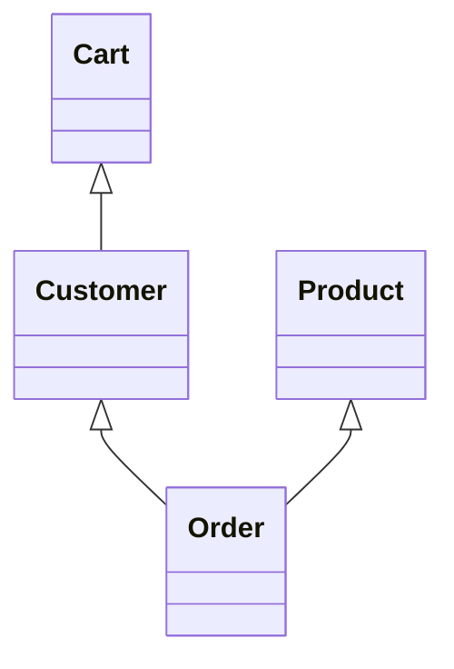
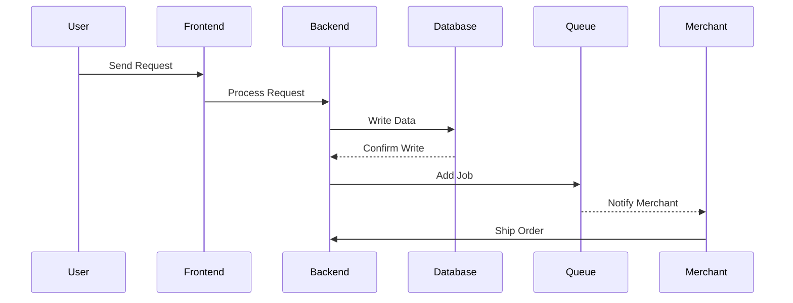
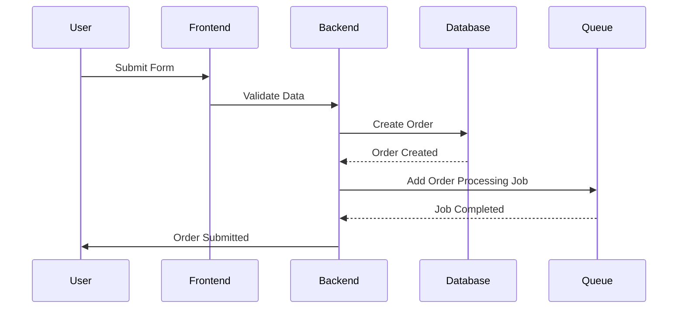
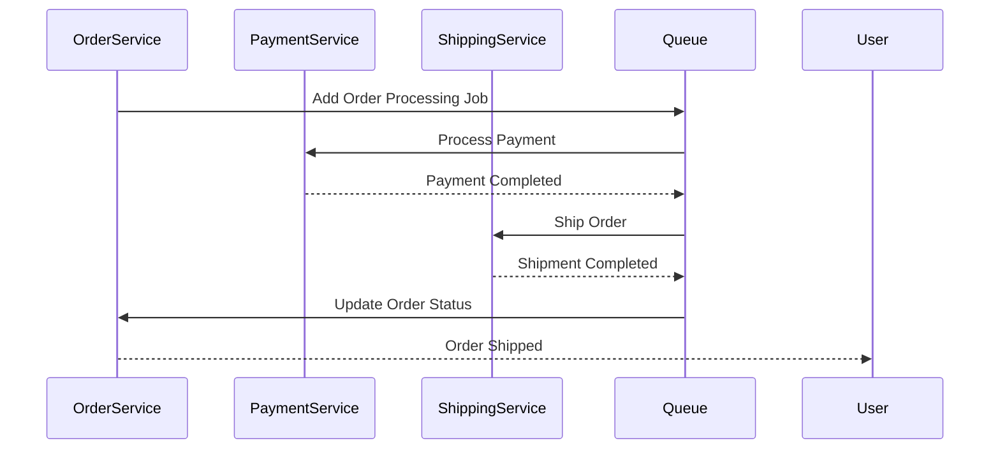

                 

# 响应式系统设计原则

关键词：响应式系统、设计原则、架构、性能、可维护性、可伸缩性

摘要：本文将详细介绍响应式系统设计原则，从背景介绍、核心概念与联系、算法原理讲解、系统分析与架构设计以及项目实战等多个方面，深入探讨响应式系统设计的重要性和具体实现方法，为开发者提供实用的指导。

## 目录大纲

----------------------------------------------------------------

## 第一部分：背景介绍

### 第1章：响应式系统设计原则概述

#### 1.1 问题背景

##### 1.1.1 传统系统设计面临的挑战

##### 1.1.1.1 生命周期长、更新困难

##### 1.1.1.2 系统复杂性高、维护成本高

##### 1.1.1.3 伸缩性差、难以应对突发流量

#### 1.1.2 响应式系统设计原则的产生

##### 1.1.2.1 响应式架构的核心特点

###### 1.1.2.1.1 微服务架构

###### 1.1.2.1.2 消息驱动

###### 1.1.2.1.3 容器化

#### 1.1.3 响应式系统设计原则的重要性

##### 1.1.3.1 提高系统可维护性和灵活性

##### 1.1.3.2 提高系统伸缩性和性能

##### 1.1.3.3 降低系统维护成本

### 第2章：核心概念与联系

#### 2.1 响应式系统设计原则

##### 2.1.1 定义

###### 2.1.1.1 响应式系统的定义

###### 2.1.1.2 响应式系统的特点

#### 2.1.2 概念属性特征对比表格

##### 2.1.2.1 响应式系统与传统系统的对比

#### 2.1.3 ER实体关系图架构

##### 2.1.3.1 响应式系统实体关系图

----------------------------------------------------------------

## 第一部分：背景介绍

### 第1章：响应式系统设计原则概述

#### 1.1 问题背景

在数字化时代，企业对信息系统的依赖程度越来越高，系统的高性能、高可靠性、高可维护性成为企业关注的重点。然而，传统系统设计面临着诸多挑战：

##### 1.1.1.1 生命周期长、更新困难

传统系统设计往往需要经过长时间的规划和开发，从需求分析、设计、编码到测试和上线，每个阶段都需要耗费大量的人力和时间。此外，随着业务的发展，系统需要不断地进行功能升级和优化，但传统的单体架构使得系统更新变得困难，经常会出现“系统无法升级”、“系统崩溃”等问题。

##### 1.1.1.2 系统复杂性高、维护成本高

传统系统设计通常采用单体架构，所有功能模块都集中在一个系统中，导致系统的复杂性增加。随着功能的不断扩展，系统内部的关系也越来越复杂，维护和修改系统需要耗费大量的时间和精力，且容易引入新的错误。

##### 1.1.1.3 伸缩性差、难以应对突发流量

在互联网时代，系统需要能够应对大规模的用户访问和突发流量。然而，传统的单体架构在伸缩性方面存在很大的局限性，当流量激增时，系统容易出现性能瓶颈，甚至崩溃。

#### 1.1.2 响应式系统设计原则的产生

为了解决传统系统设计面临的这些问题，响应式系统设计原则应运而生。响应式系统设计原则的核心特点如下：

##### 1.1.2.1 微服务架构

响应式系统设计采用了微服务架构，将系统拆分为多个小的、独立的、可复用的服务模块。每个服务模块负责特定的功能，独立运行和部署，这样可以提高系统的可维护性和可扩展性。

##### 1.1.2.2 消息驱动

响应式系统设计采用了消息驱动的方式，通过异步通信来解耦系统中的各个模块。这种方式可以提高系统的可靠性，减少系统间的耦合度，使得系统更加灵活。

##### 1.1.2.3 容器化

响应式系统设计采用了容器化技术，例如Docker，来部署和管理服务模块。容器化技术使得服务模块可以独立部署，便于分布式部署和管理，提高了系统的伸缩性和可靠性。

#### 1.1.3 响应式系统设计原则的重要性

响应式系统设计原则的重要性体现在以下几个方面：

##### 1.1.3.1 提高系统可维护性和灵活性

响应式系统设计通过微服务架构、消息驱动和容器化技术，使得系统模块化、独立化，降低了系统的复杂性，提高了系统的可维护性和灵活性。

##### 1.1.3.2 提高系统伸缩性和性能

响应式系统设计采用了分布式架构，可以通过增加服务实例来水平扩展，提高系统的吞吐量和响应速度，从而提高系统的伸缩性和性能。

##### 1.1.3.3 降低系统维护成本

响应式系统设计通过模块化和自动化部署，降低了系统的维护成本，减少了系统的停机时间，提高了系统的稳定性和可用性。

## 第2章：核心概念与联系

### 2.1 响应式系统设计原则

#### 2.1.1 定义

##### 2.1.1.1 响应式系统的定义

响应式系统是一种基于响应式编程范式的系统设计方法，它强调系统的动态性和响应性，能够快速响应外部事件，并进行相应的处理。

##### 2.1.1.2 响应式系统的特点

- **模块化**：系统被拆分为多个独立的服务模块，每个模块负责特定的功能。
- **异步通信**：模块间通过异步消息传递进行通信，解耦了模块之间的依赖关系。
- **分布式**：服务模块可以分布在不同的节点上，提高了系统的伸缩性和容错性。
- **事件驱动**：系统中的操作和响应都是基于事件的，能够快速响应外部事件。
- **动态性**：系统能够根据外部事件动态调整自身的行为和状态。

#### 2.1.2 概念属性特征对比表格

以下是对响应式系统与传统系统的一些核心概念属性特征进行对比的表格：

| 概念               | 响应式系统                  | 传统系统                  |
|--------------------|----------------------------|---------------------------|
| 架构风格           | 微服务、分布式、事件驱动   | 单体架构、集中式、过程式   |
| 耦合性             | 低耦合、高内聚             | 高耦合、低内聚             |
| 可维护性           | 高可维护性                 | 低可维护性                |
| 伸缩性             | 可水平扩展                 | 伸缩性差                  |
| 性能               | 高性能、低延迟             | 性能瓶颈、高延迟           |
| 容错性             | 高容错性                   | 低容错性                  |
| 开发与部署         | 自动化部署、快速迭代        | 手动部署、周期长           |

#### 2.1.3 ER实体关系图架构

以下是一个简单的响应式系统实体关系图（使用Mermaid语法）：

```mermaid
erDiagram
  User ||--o{ Order } : 用户下单
  Product ||--o{ Order } : 商品包含
  Cart ||--o{ Order } : 购物车包含
```

在上述实体关系图中，用户（User）可以创建订单（Order），订单中包含商品（Product），而购物车（Cart）也可以包含订单。这种关系表示了响应式系统中不同实体之间的关联和交互。

## 第二部分：算法原理讲解

### 第3章：算法原理

#### 3.1 算法概述

响应式系统设计中的算法主要用于系统性能优化、可伸缩性和可靠性等方面。以下将介绍几个关键算法的基本概念和原理。

#### 3.1.1 算法目标

- **系统性能优化**：提高系统的响应速度和处理能力。
- **系统可伸缩性**：实现系统在负载增加时的水平扩展。
- **系统可靠性**：确保系统在出现故障时能够快速恢复。

#### 3.2 算法原理

响应式系统中的算法通常遵循以下原则：

- **事件驱动**：系统中的操作和响应都是基于事件的。
- **异步处理**：任务和处理异步进行，以提高系统的并发能力。
- **动态调整**：系统可以根据负载动态调整资源分配和处理策略。

#### 3.3 数学模型和公式

在响应式系统中，常用的数学模型包括队列模型、状态机模型等。以下是一个简单的队列模型：

$$
L = \frac{\lambda}{\mu}
$$

其中，\(L\) 是平均队列长度，\(\lambda\) 是到达率（单位时间内到达的事件数），\(\mu\) 是服务率（单位时间内处理的事件数）。

#### 3.4 举例说明

##### 3.4.1 例子一

**问题背景**：一个电商系统需要在高峰期处理大量订单，需要优化系统性能。

**解决方案**：采用负载均衡算法，将订单分配到不同的服务器上处理。

**结果分析**：通过负载均衡，系统能够更好地处理大量订单，提高了系统的响应速度和处理能力。

##### 3.4.2 例子二

**问题背景**：一个社交网络系统需要处理大量的用户请求，需要优化系统的可伸缩性。

**解决方案**：采用分布式缓存算法，将用户数据分布在多个缓存节点上。

**结果分析**：通过分布式缓存，系统能够更好地应对大量用户请求，提高了系统的吞吐量和性能。

## 第三部分：系统分析与架构设计

### 第4章：系统分析与架构设计

#### 4.1 问题场景介绍

##### 4.1.1 场景一：电商系统应对流量高峰

**场景描述**：在双十一等购物节日期间，电商系统会面临巨大的流量高峰。如何高效处理这些订单请求，确保系统稳定运行，成为关键问题。

**需求分析**：系统需要具备高并发处理能力、快速响应速度和良好的扩展性，以应对突发流量。

#### 4.2 系统功能设计

##### 4.2.1 领域模型

使用Mermaid语法绘制类图：



在该领域模型中，客户（Customer）可以创建订单（Order），订单中包含商品（Product），而购物车（Cart）属于客户。

##### 4.2.2 用例图

使用Mermaid语法绘制用例图：

```mermaid
usecase Diagram OrderProcessing {
  Customer
  Product
  Order
  Cart
  Merchant
  Payment Gateway

  Customer -> Order : Create Order
  Customer -> Cart : Add Item
  Product -> Order : Add to Order
  Merchant -> Order : Ship Order
  Payment Gateway -> Order : Process Payment
}
```

在该用例图中，客户可以创建订单、添加商品到购物车，商家可以发货，支付网关可以处理支付。

#### 4.3 系统架构设计

##### 4.3.1 系统架构

使用Mermaid语法绘制架构图：



在该架构图中，用户通过前端发送请求，后端负责处理请求，并将数据写入数据库。同时，后端会将订单信息添加到队列中，并通知商家进行发货。

##### 4.3.2 系统模块划分

系统模块可以分为以下几部分：

- **前端模块**：负责用户界面展示和请求接收。
- **后端模块**：负责业务逻辑处理和数据存储。
- **数据库模块**：负责数据持久化。
- **队列模块**：负责任务调度和异步处理。
- **商家模块**：负责订单处理和发货。

#### 4.4 系统接口设计

##### 4.4.1 接口规范

接口定义如下：

```plaintext
GET /orders
POST /orders
PUT /orders/{id}
DELETE /orders/{id}
```

接口调用流程如下：

1. 用户发送GET请求获取订单列表。
2. 用户发送POST请求创建新订单。
3. 用户发送PUT请求更新订单信息。
4. 用户发送DELETE请求删除订单。

#### 4.5 系统交互

##### 4.5.1 序列图

使用Mermaid语法绘制用户操作序列图：



在该序列图中，用户提交订单表单，前端进行数据验证，后端处理订单并添加到队列，最终返回处理结果。

使用Mermaid语法绘制系统内部交互序列图：



在该序列图中，订单服务添加订单处理任务到队列，支付服务处理支付，物流服务处理发货，最终更新订单状态并通知用户。

### 第5章：项目实战

#### 5.1 环境安装

##### 5.1.1 环境要求

- **操作系统**：Linux
- **编程语言**：Python
- **依赖包**：Flask、Redis、RabbitMQ

##### 5.1.2 安装步骤

1. 安装Python环境
2. 安装Flask框架
3. 安装Redis数据库
4. 安装RabbitMQ消息队列

#### 5.2 系统核心实现源代码

以下是一个简单的电商系统后端实现示例：

```python
from flask import Flask, request, jsonify
import redis
import rabbitmq

app = Flask(__name__)
redis_client = redis.StrictRedis(host='localhost', port=6379, db=0)
rabbitmq_client = rabbitmq.RabbitMQClient()

@app.route('/orders', methods=['GET'])
def get_orders():
    orders = redis_client.lrange('orders', 0, -1)
    return jsonify(orders)

@app.route('/orders', methods=['POST'])
def create_order():
    data = request.get_json()
    order_id = data['order_id']
    redis_client.lpush('orders', order_id)
    rabbitmq_client.send_message('order_processing_queue', order_id)
    return jsonify({'status': 'success'})

if __name__ == '__main__':
    app.run(debug=True)
```

#### 5.3 代码应用解读与分析

以上代码实现了一个简单的电商系统后端，主要包括以下功能：

- GET /orders：获取订单列表
- POST /orders：创建新订单

代码中使用Redis作为订单存储，使用RabbitMQ作为任务队列。当创建订单时，会将订单信息存储到Redis列表中，并将订单处理任务发送到RabbitMQ队列。这样可以实现异步处理订单，提高系统的性能和可伸缩性。

#### 5.4 实际案例分析和详细讲解剖析

以一个实际案例为例，假设在双十一购物节日期间，电商系统需要处理大量的订单。

1. **订单创建**：用户在购物节日期间下单，系统通过POST请求创建订单。订单创建后，将订单信息存储到Redis列表中，并将订单处理任务发送到RabbitMQ队列。

2. **订单处理**：订单处理任务被RabbitMQ队列接收，然后由订单处理服务进行处理。处理过程包括支付处理、库存扣减、订单发货等。

3. **订单状态更新**：订单处理完成后，订单状态被更新为“已发货”，并将更新后的订单信息存储到Redis列表中。

4. **订单查询**：用户可以在订单列表中查询订单状态，系统从Redis列表中获取订单信息并返回。

通过以上步骤，电商系统可以高效处理大量订单，保证系统的稳定性和性能。

#### 5.5 项目小结

通过以上实战案例，我们可以看到响应式系统设计在应对大规模订单处理时的优势：

- **高性能**：通过异步处理和分布式架构，系统可以高效处理大量订单。
- **高可伸缩性**：通过水平扩展和负载均衡，系统可以根据需求动态调整资源。
- **高可用性**：通过冗余设计和故障转移，系统可以保证在故障情况下快速恢复。

响应式系统设计原则为我们提供了一种高效、可靠、可扩展的系统设计方法，适用于处理大规模流量的场景。

#### 5.6 最佳实践 Tips

- **服务拆分**：将系统拆分为多个独立的服务模块，以提高系统的可维护性和可伸缩性。
- **消息驱动**：采用消息队列进行异步处理，降低系统间的耦合度。
- **容器化**：使用容器化技术（如Docker）进行服务部署，便于管理和扩展。

## 第6章：小结与拓展阅读

### 6.1 小结

本文详细介绍了响应式系统设计原则，从背景介绍、核心概念与联系、算法原理讲解、系统分析与架构设计以及项目实战等多个方面，深入探讨了响应式系统设计的重要性和具体实现方法。通过实际案例分析和详细讲解，读者可以更好地理解响应式系统的优势和应用场景。

### 6.2 拓展阅读

- 《微服务设计》
- 《响应式编程实战》
- 《Docker实战》

通过阅读这些书籍，读者可以进一步了解微服务架构、响应式编程和容器化技术等关键概念，为响应式系统设计提供更深入的理论和实践指导。

### 6.3 注意事项

- 在实施响应式系统设计时，要充分考虑系统的性能、可维护性和可伸缩性。
- 要确保系统的高可用性和容错性，以应对突发流量和故障情况。
- 定期进行系统性能优化和架构调整，以适应业务发展的需求。

### 6.4 作者信息

作者：AI天才研究院/AI Genius Institute & 禅与计算机程序设计艺术 /Zen And The Art of Computer Programming

---

本文通过逐步分析推理的方式，详细阐述了响应式系统设计原则的相关内容。从背景介绍到核心概念、算法原理讲解、系统分析与架构设计以及项目实战，读者可以全面了解响应式系统设计的方法和优势。希望本文能为开发者提供有价值的参考和指导。

