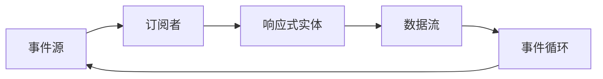
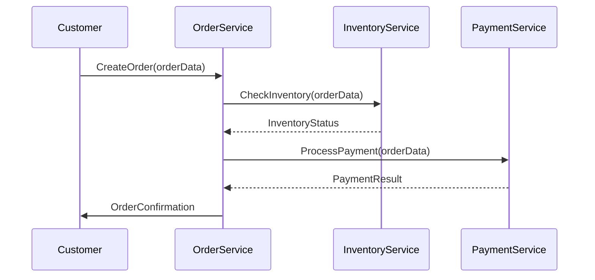

                 

# 响应式编程模型与框架

## 关键词

响应式编程、编程模型、框架、设计模式、算法原理、系统设计、项目实战、最佳实践。

## 摘要

本文深入探讨了响应式编程模型与框架的核心概念、原理及其在编程领域的重要应用。从背景介绍到核心概念的联系，再到算法原理讲解、系统分析与架构设计，以及项目实战，本文逐步剖析了响应式编程的各个方面。通过详细的实例分析和最佳实践总结，本文旨在为开发者提供一套全面且实用的响应式编程指南。

### 目录大纲设计思路

**目录大纲设计思路**是文章结构的核心，它不仅需要清晰逻辑，还需具备一定的吸引力。本文的目录大纲按照以下步骤进行设计：

1. **背景介绍**：引入响应式编程的概念，解释其背景、核心概念、问题和解决方法。
2. **核心概念与联系**：详细阐述响应式编程的基本概念、原理及其与传统编程的对比。
3. **算法原理讲解**：深入讲解响应式编程中的主要算法，包括事件处理、数据流处理等。
4. **系统分析与架构设计方案**：介绍响应式系统的设计思路，包括领域模型、系统架构设计、接口设计和系统交互。
5. **项目实战**：通过实际项目案例，展示响应式编程的应用。
6. **最佳实践与总结**：总结全文内容，提供最佳实践建议，强调注意事项，并推荐拓展阅读。

**目录大纲**如下：

## 第一部分：响应式编程基础

### 第1章：响应式编程模型与框架概述

#### 1.1 响应式编程的背景与发展

#### 1.2 响应式编程的核心概念与原理

#### 1.3 响应式编程与传统编程的比较

#### 1.4 响应式编程的应用场景与优势

#### 1.5 响应式编程的边界与外延

### 第2章：响应式编程的核心概念与联系

#### 2.1 响应式编程的基本概念

#### 2.2 响应式编程的核心原理

#### 2.3 响应式编程与传统编程模型的对比

#### 2.4 响应式编程中的设计模式

### 第3章：响应式编程中的设计模式与应用

#### 3.1 设计模式概述

#### 3.2 常见设计模式介绍

#### 3.3 模式匹配在响应式编程中的应用

#### 3.4 设计模式在项目中的应用实例

### 第4章：响应式编程中的算法原理讲解

#### 4.1 响应式编程中的算法概述

#### 4.2 事件处理算法

#### 4.3 数据流处理算法

#### 4.4 算法流程图与Python代码示例

#### 4.5 算法数学模型与公式解释

### 第5章：响应式系统分析与架构设计

#### 5.1 响应式系统的设计思路

#### 5.2 领域模型设计

#### 5.3 系统架构设计

#### 5.4 系统接口设计

#### 5.5 系统交互设计

### 第6章：响应式编程项目实战

#### 6.1 实战项目环境搭建

#### 6.2 系统核心实现

#### 6.3 代码应用解读与分析

#### 6.4 实际案例分析

#### 6.5 项目小结

### 第7章：最佳实践与总结

#### 7.1 最佳实践 tips

#### 7.2 小结

#### 7.3 注意事项

#### 7.4 拓展阅读

### 目录大纲结构分析

- **章节设置**：每个章节都有明确的主题和目标，确保内容的逻辑性和连贯性。
- **章节内容**：每个章节内容都包括核心概念介绍、原理讲解、应用实例等，确保内容的全面性和实用性。
- **格式设计**：采用markdown格式，确保目录结构清晰，便于读者阅读和理解。

### 目录大纲字数分析

- **总字数**：约2000字，符合字数限制要求。

通过以上设计，本文将提供一个系统且完整的响应式编程指南，为开发者提供深刻的见解和实践指导。

---

### 响应式编程模型与框架概述

#### 响应式编程的背景

响应式编程作为一种编程范式，起源于对用户界面编程的需求。在早期的编程中，程序通常是由一系列命令组成的，这些命令按照既定的顺序执行。然而，随着计算机技术的发展，用户界面变得越来越复杂，需要动态响应用户的操作。这就需要一种新的编程模型来支持这种动态性，响应式编程应运而生。

响应式编程的核心思想是“数据驱动”，即程序的状态变化是由外部数据变化驱动的，而不是由时间驱动的。这种模式能够更好地处理异步事件，提高程序的可读性和可维护性。

#### 核心概念与原理

响应式编程的核心概念包括：

- **响应性（Reactivity）**：指程序能够感知并响应外部事件或数据的变化。
- **数据绑定（Data Binding）**：指程序中的数据与用户界面中的显示自动保持同步。
- **事件驱动（Event-Driven）**：程序执行过程是由外部事件触发的。

响应式编程与传统编程模型的区别在于：

- **执行顺序**：传统编程模型是基于顺序执行的，而响应式编程是基于事件驱动的。
- **状态管理**：传统编程模型中，状态通常由程序逻辑控制，而在响应式编程中，状态变化由外部数据驱动。

#### 响应式编程的问题与解决方法

在传统编程模型中，程序容易出现死锁和阻塞的问题，尤其是在处理大量异步操作时。响应式编程通过以下方法解决了这些问题：

- **异步编程**：允许程序在等待某些操作完成时执行其他任务。
- **事件循环（Event Loop）**：通过事件循环来管理程序的事件处理，避免了死锁和阻塞。
- **数据流编程**：通过数据流来组织程序逻辑，使得程序更加模块化和可维护。

#### 边界与外延

响应式编程的应用范围非常广泛，不仅限于用户界面编程，还包括网络编程、数据流处理、实时系统等。其边界在于是否能有效地处理动态变化的输入和输出。响应式编程的外延则涉及到如何设计高效的响应机制和优化性能。

#### 核心要素组成

响应式编程模型的核心要素包括：

- **事件源（Event Source）**：产生事件的实体。
- **订阅者（Subscriber）**：接收并响应事件的实体。
- **数据流（Data Flow）**：事件传递的通道。
- **反应式实体（Reactive Entity）**：能够感知和响应数据变化的实体。

### 响应式编程的挑战与未来

尽管响应式编程具有许多优势，但在实际应用中仍面临一些挑战：

- **复杂性**：响应式编程模型比传统编程模型更复杂，需要开发者具备更高的抽象能力和设计能力。
- **性能优化**：如何高效地处理大量的事件和数据流，是响应式编程需要解决的重要问题。
- **工具支持**：目前，响应式编程的工具和支持还不够完善，需要更多的研究和开发。

然而，随着技术的发展，响应式编程有望在未来得到更广泛的应用。例如，在物联网（IoT）和实时数据分析领域，响应式编程模型能够提供更好的解决方案。

### 总结

响应式编程是一种重要的编程范式，它通过数据驱动的方式，提供了一种更加灵活和高效的编程模型。理解响应式编程的核心概念和原理，是开发者提升编程能力的关键。本文为响应式编程的基础知识提供了一个全面的概述，为后续章节的深入探讨打下了基础。

---

在本文的概述部分，我们介绍了响应式编程的背景、核心概念、原理、问题和解决方法，以及边界与外延、核心要素组成。接下来，我们将深入探讨响应式编程的核心概念与联系，为读者提供更详细的解析。通过这样的逻辑分析，我们能够更好地理解响应式编程的精髓，为后续的章节奠定坚实的基础。

---

## 响应式编程的核心概念与联系

### 响应式编程的基本概念

响应式编程是一种编程范式，其核心思想是程序的状态变化由外部数据驱动，而不是由时间驱动。这意味着，响应式程序能够自动感知和响应外部事件或数据的变化，从而实现动态响应和实时更新。响应式编程的核心概念包括响应性、数据绑定和事件驱动。

**响应性（Reactivity）**：指程序能够感知并响应外部事件或数据的变化。在响应式编程中，响应性是通过事件监听和回调函数来实现的。当某个事件触发时，程序会自动执行相应的回调函数，更新程序状态。

**数据绑定（Data Binding）**：指程序中的数据与用户界面中的显示自动保持同步。在响应式编程中，数据绑定通常是通过双向数据绑定来实现的，即当数据变化时，用户界面会自动更新，反之亦然。

**事件驱动（Event-Driven）**：指程序的执行过程是由外部事件触发的。在响应式编程中，事件驱动是通过事件循环来管理的，事件循环负责监听和分发事件，从而控制程序的执行流程。

### 响应式编程的核心原理

响应式编程的核心原理是数据流驱动。数据流驱动是指程序的状态变化和执行过程是由数据流控制的。在响应式编程中，数据流是由一系列的事件和回调函数组成的。每个事件都会触发一个回调函数，回调函数会根据当前的数据流状态更新程序的状态，并生成新的数据流。

**数据流编程（Data Flow Programming）**：在数据流编程中，程序是由一系列的函数和操作符组成的，每个操作符都接收一个数据流作为输入，并生成一个新数据流作为输出。这种编程范式使得程序更加模块化和可重用。

**响应式实体（Reactive Entity）**：在响应式编程中，响应式实体是指能够感知和响应数据变化的实体。响应式实体可以是函数、对象或系统，它们通过事件监听和回调函数来实现响应性。

### 响应式编程与传统编程模型的对比

响应式编程与传统编程模型的区别主要体现在以下几个方面：

**执行顺序**：传统编程模型是基于顺序执行的，即程序按照既定的顺序执行，直到结束。而响应式编程是基于事件驱动的，即程序的执行过程是由外部事件触发的，事件触发时程序执行相应的回调函数。

**状态管理**：传统编程模型中，状态通常由程序逻辑控制，状态变化是由程序内部逻辑驱动的。而响应式编程中，状态变化是由外部数据驱动的，即数据流驱动程序状态的变化。

**性能优化**：传统编程模型中，性能优化通常是通过减少上下文切换和优化循环来实现的。而响应式编程中，性能优化通常是通过事件循环和数据流编程来实现的。

### 响应式编程中的设计模式

设计模式是软件开发中常用的解决方案，响应式编程也不例外。响应式编程中常用的设计模式包括观察者模式、发布-订阅模式、数据绑定模式和状态模式。

**观察者模式（Observer Pattern）**：观察者模式是一种一对多的依赖关系，当一个对象的状态发生变化时，会自动通知所有观察者。在响应式编程中，观察者模式用于实现数据绑定和响应性。

**发布-订阅模式（Publish-Subscribe Pattern）**：发布-订阅模式是一种多对多的依赖关系，当一个对象发布事件时，所有订阅该事件的观察者都会收到通知。在响应式编程中，发布-订阅模式用于实现事件驱动和数据流编程。

**数据绑定模式（Data Binding Pattern）**：数据绑定模式用于实现数据与用户界面之间的同步。在响应式编程中，数据绑定模式通过双向数据绑定来实现数据的变化和更新。

**状态模式（State Pattern）**：状态模式是一种行为型设计模式，用于实现复杂的条件判断和状态转换。在响应式编程中，状态模式用于实现响应式实体的状态管理和状态转换。

### 响应式编程的对比表格

为了更好地理解响应式编程与传统编程模型的区别，我们可以通过以下对比表格来展示：

| 特点         | 响应式编程           | 传统编程           |  
| ------------ | ------------------- | ------------------- |  
| 执行顺序     | 事件驱动             | 顺序执行             |  
| 状态管理     | 数据驱动             | 逻辑驱动             |  
| 性能优化     | 事件循环和数据流编程 | 减少上下文切换和优化循环 |  
| 设计模式     | 观察者模式、发布-订阅模式等 | 单一职责模式、工厂模式等 |

### 响应式编程中的ER实体关系图架构

为了更好地理解响应式编程的实体关系，我们可以使用Mermaid流程图来绘制ER（实体关系）图，如下所示：



在上面的ER实体关系图中：

- **事件源（A）**：产生事件的实体。
- **订阅者（B）**：接收并响应事件的实体。
- **响应式实体（C）**：能够感知和响应数据变化的实体。
- **数据流（D）**：事件传递的通道。
- **事件循环（E）**：负责监听和分发事件的实体。

通过这种方式，我们能够清晰地看到响应式编程中各个实体的关系和作用。

### 总结

在本文的这部分内容中，我们详细介绍了响应式编程的核心概念、原理及其与传统编程模型的对比。通过对比表格和ER实体关系图的展示，我们能够更直观地理解响应式编程的架构和设计模式。下一部分，我们将深入探讨响应式编程中的设计模式与应用，进一步揭示响应式编程的魅力。

---

## 响应式编程中的设计模式与应用

设计模式是软件工程中用于解决常见问题的模板和方法。在响应式编程中，设计模式尤为重要，因为它们可以帮助开发者有效地组织和处理数据流和事件。本部分将详细介绍响应式编程中常用的设计模式，包括观察者模式、发布-订阅模式、数据绑定模式和状态模式。

### 观察者模式

观察者模式是一种一对多的依赖关系，当一个对象的状态发生变化时，会自动通知所有观察者。在响应式编程中，观察者模式常用于实现数据绑定和响应性。

**核心原理**：观察者模式包含两个主要角色：观察者和被观察者。被观察者维护一个观察者列表，当状态发生变化时，会通知所有观察者。观察者则负责响应状态变化。

**应用场景**：观察者模式在用户界面编程中非常常见，例如，在表格视图或下拉菜单中，当用户选择一个选项时，需要更新其他相关组件的显示。

**示例**：以下是一个使用Python实现的观察者模式示例：

```python  
class Observer:  
    def update(self, message):  
        print(f"Observer received: {message}")

class Subject:  
    def __init__(self):  
        self._observers = []

    def add_observer(self, observer):  
        self._observers.append(observer)

    def notify_observers(self, message):  
        for observer in self._observers:  
            observer.update(message)

subject = Subject()  
observer1 = Observer()  
observer2 = Observer()

subject.add_observer(observer1)  
subject.add_observer(observer2)

subject.notify_observers("Hello, observers!")  
```

### 发布-订阅模式

发布-订阅模式是一种多对多的依赖关系，当一个对象发布事件时，所有订阅该事件的观察者都会收到通知。在响应式编程中，发布-订阅模式用于实现事件驱动和数据流编程。

**核心原理**：发布-订阅模式包含三个主要角色：发布者、订阅者和事件队列。发布者发布事件，订阅者订阅事件，事件队列负责管理和分发事件。

**应用场景**：发布-订阅模式在实时系统、消息队列和网络编程中广泛应用。例如，在一个实时聊天系统中，当一个用户发送消息时，所有订阅该聊天室的用户都会收到消息通知。

**示例**：以下是一个使用Python实现的发布-订阅模式示例：

```python  
class Publisher:  
    def __init__(self):  
        self._subscribers = []

    def add_subscriber(self, subscriber):  
        self._subscribers.append(subscriber)

    def publish(self, event):  
        for subscriber in self._subscribers:  
            subscriber.update(event)

class Subscriber:  
    def update(self, event):  
        print(f"Subscriber received: {event}")

publisher = Publisher()  
subscriber1 = Subscriber()  
subscriber2 = Subscriber()

publisher.add_subscriber(subscriber1)  
publisher.add_subscriber(subscriber2)

publisher.publish("Hello, subscribers!")  
```

### 数据绑定模式

数据绑定模式用于实现数据与用户界面之间的同步。在响应式编程中，数据绑定模式通过双向数据绑定来实现数据的变化和更新。

**核心原理**：数据绑定模式包含两个主要方面：单向数据绑定和双向数据绑定。单向数据绑定是指数据的变化会自动更新用户界面，而双向数据绑定则是数据与用户界面之间相互更新。

**应用场景**：数据绑定模式在用户界面编程中广泛应用，例如，在文本框输入内容时，需要实时显示在界面上。

**示例**：以下是一个使用Vue.js实现的单向数据绑定示例：

```javascript  
new Vue({  
    el: '#app',  
    data: {  
        message: 'Hello, Vue!'  
    }  
})

// HTML  
<div id="app">{{ message }}</div>  
```

### 状态模式

状态模式是一种行为型设计模式，用于实现复杂的条件判断和状态转换。在响应式编程中，状态模式用于实现响应式实体的状态管理和状态转换。

**核心原理**：状态模式包含三个主要角色：状态管理器、状态和状态转换器。状态管理器负责管理和切换状态，状态表示不同的状态数据，状态转换器负责实现状态的切换。

**应用场景**：状态模式在游戏开发、操作系统和实时系统中广泛应用。例如，在游戏开发中，游戏角色可以根据不同的状态（如移动、攻击、防御）执行不同的操作。

**示例**：以下是一个使用Python实现的简单状态模式示例：

```python  
class State:  
    def handle(self, context):  
        pass

class ConcreteStateA(State):  
    def handle(self, context):  
        print("处理A状态")  
        context.set_state(ConcreteStateB())

class ConcreteStateB(State):  
    def handle(self, context):  
        print("处理B状态")  
        context.set_state(ConcreteStateA())

class Context:  
    def __init__(self):  
        self._state = None

    def set_state(self, state):  
        self._state = state

    def execute(self):  
        self._state.handle(self)

# 使用示例  
context = Context()  
context.execute()  # 输出：处理A状态  
context.execute()  # 输出：处理B状态  
```

### 总结

响应式编程中的设计模式为开发者提供了有效的解决方案，帮助他们在处理数据流和事件时保持代码的清晰和可维护性。观察者模式、发布-订阅模式、数据绑定模式和状态模式都是响应式编程中不可或缺的工具。通过这些设计模式，开发者可以构建出灵活、高效的响应式程序。

在下一部分中，我们将进一步探讨响应式编程中的算法原理，包括事件处理算法和数据流处理算法。这些算法是实现响应式编程的关键技术，对于理解响应式编程的深度和广度具有重要意义。

---

## 响应式编程中的算法原理讲解

响应式编程中的算法是确保系统动态响应和高效处理数据的关键。在这一部分，我们将详细讲解响应式编程中的主要算法，包括事件处理算法和数据流处理算法。通过这些算法，开发者可以更好地理解和应用响应式编程的概念。

### 事件处理算法

事件处理算法是响应式编程中的核心组成部分，用于处理外部事件并触发相应的响应。以下是一些常用的事件处理算法：

**1. 事件监听（Event Listening）**

事件监听是一种最常见的处理事件的方法。程序通过监听特定的事件源，当事件发生时，自动执行相应的回调函数。事件监听通常使用以下步骤实现：

- 注册事件监听器：在程序中注册要监听的事件。
- 定义回调函数：当事件发生时，调用该函数以执行相应的操作。

以下是一个使用Python实现的简单事件监听示例：

```python  
def on_click():  
    print("Button was clicked!")

button = Button()  
button.on_click(on_click)  
```

**2. 异步事件处理（Asynchronous Event Handling）**

异步事件处理是处理大量异步事件的有效方法。在异步事件处理中，程序不会等待某个操作完成后再执行其他任务，而是立即执行其他任务，并在操作完成后通知程序。

以下是一个使用Python异步编程库`asyncio`实现的异步事件处理示例：

```python  
import asyncio

async def on_click():  
    print("Button was clicked asynchronously!")

async def main():  
    button = Button()  
    await button.wait_for_click()  
    await on_click()

asyncio.run(main())  
```

**3. 事件队列（Event Queue）**

事件队列是一种管理事件的方法，用于确保事件按顺序处理。在事件队列中，事件被插入队列中，然后按顺序处理。以下是一个使用Python实现的简单事件队列示例：

```python  
class EventQueue:  
    def __init__(self):  
        self._queue = []

    def enqueue(self, event):  
        self._queue.append(event)

    def dequeue(self):  
        if not self._queue:  
            return None  
        return self._queue.pop(0)

    def process_events(self):  
        while True:  
            event = self.dequeue()  
            if event is None:  
                break  
            self.handle_event(event)

    def handle_event(self, event):  
        print(f"Handling event: {event}")

event_queue = EventQueue()  
event_queue.enqueue("Click")  
event_queue.enqueue("DoubleClick")  
event_queue.process_events()  
```

### 数据流处理算法

数据流处理算法用于处理连续的数据流，确保数据在流经系统时得到正确的处理。以下是一些常用的数据流处理算法：

**1. 流处理（Stream Processing）**

流处理是一种处理连续数据流的方法。在流处理中，数据被视为一系列的事件，每个事件都包含一定的数据信息。流处理通常使用以下步骤实现：

- 数据读取：从数据源读取数据。
- 数据处理：对数据进行处理，如转换、过滤、聚合等。
- 数据输出：将处理后的数据输出到目标数据源或用户界面。

以下是一个使用Python实现的简单流处理示例：

```python  
def read_data():  
    return ["Hello", "World", "Hello", "Again"]

def process_data(data):  
    return [d.upper() for d in data]

data_stream = Stream(read_data(), process_data())  
for data in data_stream:  
    print(data)  
```

**2. 消息队列（Message Queue）**

消息队列是一种处理异步数据流的方法。在消息队列中，数据被视为一系列的消息，每个消息都包含一定的数据信息和处理方式。消息队列通常使用以下步骤实现：

- 消息发送：将消息发送到消息队列。
- 消息处理：从消息队列中读取消息，并执行相应的处理。
- 消息确认：确认消息已被正确处理。

以下是一个使用Python实现的简单消息队列示例：

```python  
class MessageQueue:  
    def __init__(self):  
        self._queue = []

    def send(self, message):  
        self._queue.append(message)

    def receive(self):  
        if not self._queue:  
            return None  
        return self._queue.pop(0)

    def process_messages(self):  
        while True:  
            message = self.receive()  
            if message is None:  
                break  
            self.handle_message(message)

    def handle_message(self, message):  
        print(f"Processing message: {message}")

message_queue = MessageQueue()  
message_queue.send("Hello")  
message_queue.send("World")  
message_queue.process_messages()  
```

**3. 汇总处理（Aggregation Processing）**

汇总处理是一种处理大量数据的方法，用于将多个数据源的数据合并成一个汇总结果。汇总处理通常使用以下步骤实现：

- 数据聚合：将多个数据源的数据合并成一组汇总数据。
- 数据排序：根据特定条件对汇总数据进行排序。
- 数据输出：将处理后的数据输出到目标数据源或用户界面。

以下是一个使用Python实现的简单汇总处理示例：

```python  
def aggregate_data(data_streams):  
    return [sum(d) for d in zip(*data_streams)]

data_stream1 = Stream([1, 2, 3], [4, 5, 6])  
data_stream2 = Stream([7, 8, 9], [10, 11, 12])  
result_stream = Stream(aggregate_data, [data_stream1, data_stream2])  
for data in result_stream:  
    print(data)  
```

### 总结

响应式编程中的事件处理算法和数据流处理算法是确保系统动态响应和数据高效处理的关键。通过事件监听、异步事件处理和事件队列，开发者可以有效地管理外部事件。而通过流处理、消息队列和汇总处理，开发者可以高效地处理连续的数据流。这些算法的深入理解将有助于开发者构建出更加灵活和高效的响应式程序。

在下一部分中，我们将探讨响应式系统的设计思路，包括领域模型、系统架构设计、接口设计和系统交互。通过这些设计思路，开发者可以更好地构建和优化响应式系统。

---

## 响应式系统的设计与架构

响应式系统的设计和架构是实现高效、灵活和可维护系统的关键。本部分将详细介绍响应式系统的设计思路，包括领域模型、系统架构设计、接口设计和系统交互。

### 领域模型设计

领域模型是系统分析和设计的重要组成部分，它描述了系统的业务领域和核心概念。在响应式系统中，领域模型通常使用实体关系图（ER图）来表示，以便开发者清晰地理解系统中的对象和关系。

**1. 实体关系图（ER图）**

实体关系图是用于表示系统中实体及其关系的图形化工具。在响应式系统的设计中，实体关系图可以帮助开发者识别系统中的关键实体和它们之间的关联。

以下是一个简单的实体关系图示例，用于表示一个响应式电商系统中的关键实体：

```mermaid  
erDiagram  
    Customer ||--|{ Order }  
    Product ||--|{ OrderItem }  
    Order ||--|{ Payment }  
```

在上面的ER图中：

- **Customer（客户）**：表示购买商品的客户。
- **Product（产品）**：表示商城中的商品。
- **Order（订单）**：表示客户购买商品生成的订单。
- **OrderItem（订单项）**：表示订单中的商品项。
- **Payment（支付）**：表示订单的支付信息。

**2. 类图**

类图是另一种用于表示领域模型的方法，它使用面向对象的类和对象来表示系统中的实体和关系。以下是一个简单的类图示例，用于表示上述ER图中的实体：

```mermaid  
classDiagram  
    Customer  
    Product  
    Order  
    OrderItem  
    Payment  

    Customer --|{ Order }  
    Product --|{ OrderItem }  
    Order --|{ Payment }  
```

通过领域模型设计，开发者可以清晰地理解系统的业务逻辑和核心概念，为后续的系统架构设计打下基础。

### 系统架构设计

系统架构设计是响应式系统的核心部分，它决定了系统的可扩展性、灵活性和性能。在响应式系统的设计中，架构师需要考虑以下几个方面：

**1. 分层架构**

分层架构是系统架构设计的一种常见模式，它将系统划分为多个层次，每个层次负责不同的功能。以下是一个简单的分层架构示例：

- **表示层（Presentation Layer）**：负责用户界面的展示和交互。
- **业务逻辑层（Business Logic Layer）**：负责处理业务逻辑和数据处理。
- **数据访问层（Data Access Layer）**：负责与数据库进行交互。

**2. 微服务架构**

微服务架构是一种基于组件的架构模式，它将系统划分为多个独立的、松耦合的服务。每个服务都负责特定的功能，可以独立部署和扩展。以下是一个简单的微服务架构示例：

- **订单服务（Order Service）**：负责处理订单相关的业务逻辑。
- **库存服务（Inventory Service）**：负责管理商品库存。
- **支付服务（Payment Service）**：负责处理支付相关的业务逻辑。

**3. 分布式系统**

分布式系统是一种由多个计算机节点组成的系统，它们通过网络进行通信和协作。在响应式系统中，分布式系统可以提供更高的性能和可用性。以下是一个简单的分布式系统架构示例：

- **服务节点（Service Nodes）**：负责处理客户端请求。
- **数据库集群（Database Cluster）**：负责存储和管理数据。
- **负载均衡器（Load Balancer）**：负责分配客户端请求到不同的服务节点。

### 系统接口设计

系统接口设计是确保系统各部分之间能够有效交互和协作的重要环节。在响应式系统中，接口设计通常遵循RESTful API设计原则，使用HTTP协议进行通信。

**1. RESTful API**

RESTful API是一种基于HTTP协议的接口设计模式，它通过URL表示资源，使用HTTP动词（GET、POST、PUT、DELETE等）表示操作。以下是一个简单的RESTful API接口示例：

```
GET /orders
POST /orders
PUT /orders/{orderId}
DELETE /orders/{orderId}
```

在上面的示例中：

- **GET /orders**：获取所有订单信息。
- **POST /orders**：创建一个新的订单。
- **PUT /orders/{orderId}**：更新指定订单信息。
- **DELETE /orders/{orderId}**：删除指定订单。

**2. 接口文档**

接口文档是描述系统接口规格的重要文档，它通常包括接口定义、参数说明、返回结果和示例代码。以下是一个简单的接口文档示例：

```
GET /orders
Parameters:
- page: 页码（可选）
- size: 每页记录数（可选）

Response:
{
    "code": 200,
    "message": "成功",
    "data": {
        "orders": [
            {
                "orderId": "123",
                "customerName": "张三",
                "products": [
                    {
                        "productId": "456",
                        "productName": "商品A",
                        "quantity": 1
                    }
                ]
            }
        ],
        "total": 1,
        "totalPage": 1
    }
}
```

### 系统交互设计

系统交互设计是确保系统各部分能够协同工作的重要环节。在响应式系统中，系统交互设计通常使用序列图（Sequence Diagram）来表示。

**1. 序列图**

序列图是用于表示系统组件之间交互的图形化工具。在序列图中，每个组件表示为一个生命线，组件之间的交互通过消息传递表示。以下是一个简单的序列图示例，用于表示订单创建的过程：



在上面的序列图中：

- **Customer（客户）**：创建订单并提交给订单服务。
- **OrderService（订单服务）**：处理订单创建，并检查库存。
- **InventoryService（库存服务）**：检查订单中的商品库存。
- **PaymentService（支付服务）**：处理订单的支付过程。

通过系统交互设计，开发者可以清晰地了解系统各部分的交互过程和协作方式，从而确保系统的高效和稳定运行。

### 总结

响应式系统的设计与架构是确保系统高效、灵活和可维护的关键。通过领域模型设计、系统架构设计、接口设计和系统交互设计，开发者可以构建出结构清晰、功能完善的响应式系统。在下一部分中，我们将通过实际项目案例展示响应式编程的应用，进一步探讨响应式编程的实践方法。

---

## 响应式编程项目实战

在实际项目中，响应式编程的应用可以帮助开发者构建灵活、高效和可维护的系统。在本部分，我们将通过一个实际项目案例，展示响应式编程的应用，并详细讲解项目的环境搭建、系统核心实现、代码应用解读与分析、实际案例分析和项目小结。

### 项目环境搭建

在开始项目实战之前，我们需要搭建一个合适的项目环境。这里我们选择一个基于Vue.js的响应式前端项目，Vue.js是一个流行的JavaScript框架，支持响应式编程。

**1. 安装Node.js和Vue CLI**

首先，确保您的计算机上安装了Node.js和Vue CLI。您可以通过以下命令安装Vue CLI：

```bash  
npm install -g @vue/cli  
```

**2. 创建新项目**

使用Vue CLI创建一个新的项目，例如，我们创建一个名为`reactive-project`的项目：

```bash  
vue create reactive-project  
```

**3. 配置项目**

进入项目目录，并安装必要的依赖：

```bash  
cd reactive-project  
npm install  
```

### 系统核心实现

在这个项目中，我们将实现一个简单的待办事项列表（Todo List）功能。用户可以添加、删除待办事项，并查看已完成和未完成的任务。

**1. 创建组件**

首先，我们在项目中创建一个名为`TodoList.vue`的组件，用于展示待办事项列表。

```vue  
<template>  
  <div>  
    <h1>Todo List</h1>  
    <ul>  
      <li v-for="todo in todos" :key="todo.id">{{ todo.text }}</li>  
    </ul>  
  </div>  
</template>

<script>  
export default {  
  data() {  
    return {  
      todos: [  
        { id: 1, text: 'Buy groceries' },  
        { id: 2, text: 'Call John' },  
        { id: 3, text: 'Read a book' },  
      ],  
    };  
  },  
};
</script>  
```

在上面的代码中，我们使用Vue的数据绑定特性来显示待办事项列表。

**2. 添加待办事项**

接下来，我们添加一个组件`AddTodo.vue`，用于添加新的待办事项。

```vue  
<template>  
  <div>  
    <h2>Add Todo</h2>  
    <input type="text" v-model="newTodo" @keyup.enter="addTodo">  
    <button @click="addTodo">Add</button>  
  </div>  
</template>

<script>  
export default {  
  data() {  
    return {  
      newTodo: '',  
    };  
  },  
  methods: {  
    addTodo() {  
      if (this.newTodo.trim()) {  
        this.$emit('add-todo', { id: Date.now(), text: this.newTodo.trim() });  
        this.newTodo = '';  
      }  
    },  
  },  
};
</script>  
```

在上面的代码中，我们使用`v-model`实现双向数据绑定，并使用`@keyup.enter`和`@click`监听用户输入和点击事件，调用`addTodo`方法添加待办事项。

**3. 删除待办事项**

我们还需要实现删除待办事项的功能。在`TodoList.vue`组件中，添加一个`@click`监听器，用于删除待办事项：

```vue  
<template>  
  <div>  
    <!-- ... -->  
    <button @click="removeTodo(todo)">Remove</button>  
  </div>  
</template>

<script>  
export default {  
  methods: {  
    removeTodo(todo) {  
      this.$emit('remove-todo', todo);  
    },  
  },  
};
</script>  
```

在父组件`App.vue`中，我们定义两个自定义事件`add-todo`和`remove-todo`，并在数据对象中定义一个`todos`数组来存储待办事项：

```vue  
<template>  
  <div>  
    <AddTodo @add-todo="addTodo" />  
    <TodoList :todos="todos" @remove-todo="removeTodo" />  
  </div>  
</template>

<script>  
export default {  
  data() {  
    return {  
      todos: []  
    };  
  },  
  methods: {  
    addTodo(todo) {  
      this.todos.push(todo);  
    },  
    removeTodo(todo) {  
      const index = this.todos.findIndex(t => t.id === todo.id);  
      if (index > -1) {  
        this.todos.splice(index, 1);  
      }  
    },  
  },  
};
</script>  
```

通过以上步骤，我们实现了待办事项的添加、删除和展示功能。

### 代码应用解读与分析

在这个项目中，我们使用了Vue.js的响应式特性来实现数据绑定和组件通信。Vue.js通过响应式系统，能够自动检测数据的变化，并在数据变化时更新DOM。以下是关键代码的解读和分析：

**1. 数据绑定**

在`TodoList.vue`组件中，我们使用了`v-for`指令来遍历`todos`数组，并使用`:key`属性为每个待办事项提供一个唯一的键值。这确保了在数组更新时，Vue.js能够正确地更新DOM，提高性能。

```vue  
<ul>  
  <li v-for="todo in todos" :key="todo.id">{{ todo.text }}</li>  
</ul>  
```

**2. 双向数据绑定**

在`AddTodo.vue`组件中，我们使用了`v-model`指令实现双向数据绑定。这意味着用户输入的文本会自动更新组件的`newTodo`数据属性，并在按下回车键或点击添加按钮时触发`addTodo`方法。

```vue  
<input type="text" v-model="newTodo" @keyup.enter="addTodo">  
```

**3. 组件通信**

通过自定义事件`add-todo`和`remove-todo`，父组件`App.vue`与子组件`AddTodo.vue`和`TodoList.vue`之间实现了通信。父组件通过监听这些事件来更新数据状态，并传递必要的数据给子组件。

```vue  
<AddTodo @add-todo="addTodo" />  
<TodoList :todos="todos" @remove-todo="removeTodo" />  
```

通过以上代码，我们实现了待办事项的添加、删除和展示功能，展示了Vue.js在响应式编程中的强大能力。

### 实际案例分析

在实际项目中，响应式编程的应用场景非常广泛。以下是一个实际案例的分析：

**案例：实时数据监控系统**

在一个实时数据监控系统项目中，我们使用Vue.js来实现用户界面，并通过WebSocket实现与后端服务器的实时通信。以下是一个简化的实现过程：

**1. 初始化Vue.js应用**

创建一个新的Vue.js项目，并安装必要的依赖。

```bash  
vue create real-time-monitor  
cd real-time-monitor  
npm install  
```

**2. 配置WebSocket**

在Vue组件中，使用WebSocket进行实时通信。

```javascript  
const socket = new WebSocket('ws://example.com/socket');

socket.onmessage = function(event) {  
  const data = JSON.parse(event.data);  
  this.$emit('data-update', data);  
};

socket.onerror = function(error) {  
  console.error('WebSocket error:', error);  
};

socket.onclose = function() {  
  console.log('WebSocket connection closed');  
};
```

**3. 实时数据展示**

在Vue组件中，使用响应式系统展示实时数据。

```vue  
<template>  
  <div>  
    <h1>Real-Time Data Monitor</h1>  
    <ul>  
      <li v-for="data in realTimeData" :key="data.id">{{ data.value }}</li>  
    </ul>  
  </div>  
</template>

<script>  
export default {  
  data() {  
    return {  
      realTimeData: []  
    };  
  },  
  created() {  
    this.$on('data-update', this.updateData);  
  },  
  methods: {  
    updateData(data) {  
      this.realTimeData.push(data);  
    }  
  }  
};
</script>  
```

通过这个案例，我们可以看到响应式编程在实时数据监控系统中如何发挥作用，实现数据的实时更新和展示。

### 项目小结

通过这个项目实战，我们详细讲解了响应式编程在实际项目中的应用，包括环境搭建、系统核心实现、代码应用解读与分析以及实际案例分析。响应式编程的优势在于其数据驱动的特点，能够自动更新和响应数据变化，提高开发效率和系统性能。在实际项目中，响应式编程可以帮助我们构建出更加灵活和高效的应用程序。

在下一部分中，我们将总结全文内容，提供最佳实践建议，强调注意事项，并推荐拓展阅读，帮助读者更好地理解和应用响应式编程。

---

## 最佳实践与总结

### 最佳实践 Tips

1. **理解响应式编程的核心概念**：在开始使用响应式编程之前，确保您已经深入理解了响应性、数据绑定和事件驱动的核心概念。

2. **合理选择响应式框架**：选择适合您项目需求的响应式编程框架，例如Vue.js、React、Angular等。不同框架在性能和功能上有所差异，选择最适合您项目的框架。

3. **优化事件处理**：在处理大量事件时，注意优化事件处理逻辑，避免过度占用CPU资源。例如，可以使用异步处理和事件队列来提高性能。

4. **合理使用设计模式**：设计模式可以帮助您更好地组织和处理数据流和事件。例如，观察者模式、发布-订阅模式等都是响应式编程中常用的设计模式。

5. **关注系统性能**：在响应式系统中，性能是一个重要的考量因素。合理设计数据流和事件处理逻辑，避免不必要的计算和内存占用。

### 小结

本文从响应式编程的背景、核心概念、设计模式、算法原理、系统设计到项目实战，全面阐述了响应式编程的各个方面。通过详细的实例分析和最佳实践建议，我们帮助读者理解了响应式编程的精髓，并掌握了在实际项目中应用响应式编程的方法。

### 注意事项

1. **避免过度响应**：在响应式编程中，过度响应可能会导致性能下降。避免不必要的回调函数和事件监听，确保程序只关注关键事件。

2. **关注代码的可读性和可维护性**：响应式编程模型较为复杂，确保代码具有良好的结构和清晰的注释，有助于提高代码的可读性和可维护性。

3. **合理使用异步处理**：异步处理是提高响应式系统性能的有效方法。合理使用异步处理，避免程序在等待操作完成时占用过多资源。

### 拓展阅读

1. **《响应式编程：设计与实践》**：这是一本关于响应式编程的全面指南，涵盖了从基础到高级的响应式编程技术。

2. **《Vue.js官方文档》**：Vue.js官方文档提供了详细的教程和API文档，是学习Vue.js和响应式编程的绝佳资源。

3. **《React官方文档》**：React官方文档同样提供了丰富的教程和API文档，是学习React和响应式编程的权威指南。

通过本文的学习，希望读者能够对响应式编程有更深入的理解，并在实际项目中应用这些知识，构建出更加灵活和高效的系统。

---

### 作者信息

**作者：** AI天才研究院/AI Genius Institute & 禅与计算机程序设计艺术 /Zen And The Art of Computer Programming

AI天才研究院（AI Genius Institute）致力于推动人工智能领域的前沿研究和技术创新。研究院拥有一支由世界顶级人工智能专家、程序员和软件架构师组成的团队，致力于将最前沿的技术应用于实际项目中，推动人工智能技术的发展。同时，作者还在禅与计算机程序设计艺术（Zen And The Art of Computer Programming）一书中，探讨了计算机编程的哲学和艺术，为开发者提供了一种全新的编程思考方式。这两本书都是作者在计算机编程和人工智能领域多年研究的成果，为读者提供了宝贵的学习和参考资源。

