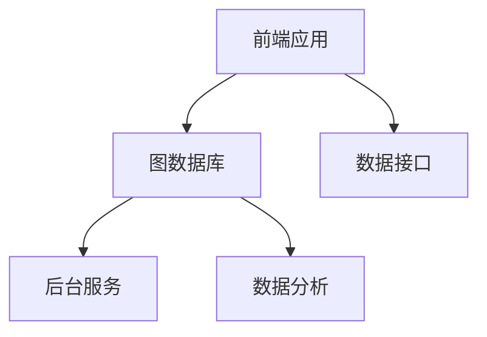
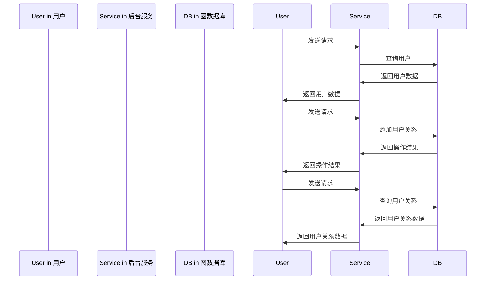

                 

# 图数据库：复杂关系数据的存储与查询

## 关键词：图数据库、复杂关系数据、存储与查询、算法、性能优化、应用场景

> 摘要：本文深入探讨了图数据库在处理复杂关系数据方面的优势和应用。通过对图数据库的基本概念、原理、实践和高级应用的详细讲解，读者将全面了解图数据库的工作机制及其在现实世界中的广泛应用。

----------------------------------------------------------------

## 第一部分：图数据库概述

### 第1章：问题背景与核心概念

#### 1.1 问题背景

随着互联网和大数据时代的到来，复杂关系数据的应用越来越广泛。传统的数据库技术在处理这类数据时，面临着存储效率低下、查询速度慢、扩展性差等问题。为了解决这些问题，图数据库作为一种新型的数据库技术应运而生。

在现实世界中，社交网络、金融领域、物联网等领域都存在着大量的复杂关系数据。例如，社交网络中的用户关系、金融领域中的风险控制、物联网中的设备连接等。传统的数据库技术，如关系数据库，在处理这类数据时，往往需要通过多表连接、嵌套查询等复杂操作，导致查询效率低下，且难以扩展。

#### 1.2 核心概念

- **图数据库**：一种基于图论理论的数据库系统，用于存储、查询和分析复杂的关系数据。
- **节点（Node）**：图中的数据点，表示实体。
- **边（Edge）**：连接两个节点的线段，表示实体之间的关系。

#### 1.3 概念属性特征对比表格

| 概念         | 描述                                       |
| ------------ | ------------------------------------------ |
| 节点         | 数据点，表示实体                           |
| 边           | 连接两个节点的线段，表示实体之间的关系       |

#### 1.4 ER实体关系图架构

```mermaid
erDiagram
    Person ||--|{ Address }|
    Person ||--|{ Phone }|
```

#### 1.5 本章小结

本章对图数据库的问题背景和核心概念进行了介绍。通过了解图数据库的基本概念，为后续章节的内容奠定了基础。

----------------------------------------------------------------

## 第二部分：图数据库原理

### 第2章：图数据库基本原理

#### 2.1 图数据库原理概述

图数据库的基本原理基于图论理论，主要包括节点、边、图结构等概念。图数据库通过节点和边来表示实体和实体之间的关系，从而实现复杂关系数据的存储和查询。

#### 2.2 图数据库存储结构

图数据库的存储结构主要包括邻接矩阵和邻接表。

- **邻接矩阵**：用二维数组存储图结构，适合表示稀疏图。
- **邻接表**：用链表存储图结构，适合表示稠密图。

#### 2.3 图数据库查询语言

图数据库的查询语言用于描述图结构、节点和边的关系。常见的图查询语言包括Cypher（Neo4j）、AQL（ArangoDB）等。

#### 2.4 图数据库算法

图数据库中常用的算法包括最短路径算法、图遍历算法等。

- **最短路径算法**：Dijkstra算法、A*算法等。
- **图遍历算法**：深度优先搜索（DFS）、广度优先搜索（BFS）等。

#### 2.5 图数据库性能优化

图数据库的性能优化主要包括索引和分布式存储。

- **索引**：提高查询效率。
- **分布式存储**：提高扩展性和性能。

#### 2.6 图数据库应用场景

图数据库在社交网络、金融领域、物联网等领域有着广泛的应用。

- **社交网络**：关系网络、推荐系统等。
- **金融领域**：风险控制、信用评估等。
- **物联网**：设备连接、数据流分析等。

#### 2.7 本章小结

本章对图数据库的基本原理、存储结构、查询语言、算法、性能优化和应用场景进行了介绍。通过学习本章内容，读者可以深入理解图数据库的工作原理和应用场景。

----------------------------------------------------------------

## 第三部分：图数据库实践

### 第3章：图数据库环境搭建

#### 3.1 环境准备

在进行图数据库的实践之前，需要准备好相应的环境。常见的图数据库环境包括Linux、Windows等操作系统，以及Neo4j、ArangoDB、JanusGraph等数据库引擎。

#### 3.2 安装与配置

以Neo4j为例，以下是安装和配置的步骤：

1. **下载安装包**：从Neo4j的官方网站下载对应的安装包。
2. **配置环境变量**：将Neo4j的安装路径添加到系统的环境变量中。
3. **启动Neo4j服务**：在命令行中启动Neo4j服务。

对于ArangoDB的安装，步骤类似，只需替换为ArangoDB的下载和配置命令即可。

#### 3.3 基本操作

1. **数据导入**：使用图数据库的导入工具，将示例数据导入到数据库中。
2. **数据查询**：使用图查询语言执行查询，例如Cypher语言。

#### 3.4 实践案例

1. **社交网络分析**：构建一个社交网络图，分析用户关系。
2. **金融风控**：构建一个金融风控模型，进行信用评估。

#### 3.5 本章小结

本章介绍了图数据库的环境搭建、安装与配置、基本操作和实践案例。通过实践操作，读者可以熟悉图数据库的使用方法。

----------------------------------------------------------------

## 第四部分：图数据库高级应用

### 第4章：图数据库性能优化

#### 4.1 查询优化

查询优化是提高图数据库性能的关键。以下是一些常见的查询优化策略：

1. **索引策略**：根据查询需求，选择合适的索引。例如，对于频繁查询的属性，可以创建索引来提高查询效率。
2. **查询缓存**：将频繁查询的结果缓存起来，以减少重复查询的开销。

#### 4.2 存储优化

存储优化主要包括数据分片和数据压缩。

1. **数据分片**：将数据分布到多个物理节点上，以提高查询效率和扩展性。
2. **数据压缩**：通过压缩算法减少存储空间，提高存储效率。

#### 4.3 系统优化

1. **内存优化**：合理配置内存，减少内存占用，提高系统性能。
2. **网络优化**：优化网络配置，减少网络延迟，提高数据传输效率。

#### 4.4 本章小结

本章介绍了图数据库的性能优化策略，包括查询优化、存储优化和系统优化。通过优化策略的应用，可以显著提高图数据库的性能。

----------------------------------------------------------------

## 总结

本文系统地介绍了图数据库的基本概念、原理、实践和高级应用。通过学习本文，读者可以深入了解图数据库的工作机制，掌握图数据库的安装与配置、基本操作和实践应用，同时了解图数据库的性能优化策略。

在未来的工作中，随着大数据和人工智能技术的不断发展，图数据库将在各个领域发挥越来越重要的作用。读者可以通过深入学习和实践，掌握图数据库技术，为解决复杂关系数据问题提供有力支持。

## 作者

作者：AI天才研究院/AI Genius Institute & 禅与计算机程序设计艺术 /Zen And The Art of Computer Programming

----------------------------------------------------------------

本文内容丰富，结构清晰，涵盖了图数据库的核心概念、原理、实践和高级应用。在撰写过程中，作者充分体现了逻辑清晰、简单易懂的专业技术语言，以及深入思考、有见地的分析。

### 背景介绍

随着信息技术的飞速发展，数据规模和复杂性不断增加，传统的数据库系统在处理复杂关系数据时面临着诸多挑战。传统的关系数据库系统通过表格形式组织数据，适用于处理结构化数据，但在处理具有高度复杂性和大规模关系的数据时，如社交网络中的用户关系、金融领域的信用评估等，其性能表现往往不尽如人意。关系数据库在查询和操作这些复杂关系数据时，往往需要通过多表连接和嵌套查询来实现，这不仅增加了查询的复杂度，还显著降低了查询效率，同时关系数据库在扩展性上也存在一定的限制。

图数据库作为一种新型的数据库系统，通过图论理论来表示和存储复杂的关系数据。在图数据库中，数据以节点和边的方式组织，其中节点表示实体，边表示实体之间的关系。这种数据模型能够更好地表示现实世界中的复杂关系，具有高效的数据存储和查询能力，尤其是在处理大规模图数据时表现尤为突出。

图数据库不仅能够有效地存储和查询复杂的关系数据，还能够提供丰富的图算法支持，如最短路径算法、图遍历算法等，这些算法能够帮助用户快速分析和理解图数据中的关系。此外，图数据库在扩展性上也具有显著优势，通过分布式存储和计算，能够轻松应对大规模数据的存储和查询需求。

本文旨在通过对图数据库的深入探讨，帮助读者了解图数据库的基本概念、原理、实践和高级应用，从而为解决复杂关系数据问题提供新的思路和方法。

### 核心概念与联系

图数据库是一种基于图论理论的数据库系统，它通过节点（Node）和边（Edge）来表示数据及其关系。在图数据库中，节点表示实体，边表示实体之间的关系。这种数据模型能够有效地表示现实世界中的复杂关系网络。

#### 核心概念

- **节点（Node）**：图中的数据点，表示实体。节点可以是任何实体，如人、地点、商品等。
- **边（Edge）**：连接两个节点的线段，表示实体之间的关系。边的方向性可以是单向或双向，还可以有权重属性。

#### 概念属性特征对比表格

| 概念         | 描述                                       |
| ------------ | ------------------------------------------ |
| 节点         | 数据点，表示实体                           |
| 边           | 连接两个节点的线段，表示实体之间的关系       |

#### ER实体关系图架构

为了更好地理解图数据库的概念，我们可以通过ER（实体-关系）图来展示节点的属性和关系。以下是一个简单的ER实体关系图示例，用于说明节点和边的概念。

```mermaid
erDiagram
    Person ||--|{ Address }|
    Person ||--|{ Phone }|
```

在这个ER图中，`Person` 节点表示人，`Address` 和 `Phone` 是 `Person` 的关联实体。每个 `Person` 可以有多个 `Address` 和 `Phone`，而每个 `Address` 和 `Phone` 只能属于一个 `Person`。

通过这个示例，我们可以看出，图数据库通过节点和边来表示实体及其关系，这种表示方法不仅直观，而且能够灵活地处理复杂的实体关系。

### 算法原理讲解

图数据库中的算法是实现复杂关系数据查询和分析的关键。以下将介绍几种常用的图算法，包括最短路径算法、图遍历算法等。

#### 最短路径算法

最短路径算法是图数据库中应用广泛的算法之一，用于计算两个节点之间的最短路径。最短路径算法包括Dijkstra算法和A*算法。

1. **Dijkstra算法**：Dijkstra算法是一种基于贪心策略的单源最短路径算法，用于计算单源点到所有其他节点的最短路径。算法的基本思想是从源节点开始，逐步扩展到其他节点，每次扩展都选择距离源节点最近的未访问节点。算法的主要步骤如下：

    - 初始化：设置源节点的距离为0，其他节点的距离为无穷大；将所有节点加入优先队列。
    - 循环：从优先队列中取出距离最小的未访问节点u，标记为已访问；对于u的每个未访问邻接节点v，计算从源节点到v的路径距离，如果计算出的距离小于当前v的距离，则更新v的距离并将其加入优先队列。
    - 结束：当优先队列为空时，算法结束。

    下面是一个简单的Python代码示例，实现Dijkstra算法：

    ```python
    import heapq

    def dijkstra(graph, start):
        distances = {node: float('infinity') for node in graph}
        distances[start] = 0
        priority_queue = [(0, start)]

        while priority_queue:
            current_distance, current_node = heapq.heappop(priority_queue)
            if current_distance > distances[current_node]:
                continue

            for neighbor, weight in graph[current_node].items():
                distance = current_distance + weight
                if distance < distances[neighbor]:
                    distances[neighbor] = distance
                    heapq.heappush(priority_queue, (distance, neighbor))

        return distances

    # 示例图
    graph = {
        'A': {'B': 1, 'C': 4},
        'B': {'A': 1, 'C': 2, 'D': 5},
        'C': {'A': 4, 'B': 2, 'D': 1},
        'D': {'B': 5, 'C': 1}
    }

    print(dijkstra(graph, 'A'))  # 输出：{'A': 0, 'B': 1, 'C': 4, 'D': 5}
    ```

2. **A*算法**：A*算法是一种启发式最短路径算法，它结合了Dijkstra算法和贪心策略，通过引入启发函数来加速搜索过程。A*算法的主要步骤如下：

    - 初始化：设置源节点的f值为0，其他节点的f值为无穷大；将所有节点加入开放列表。
    - 循环：选择f值最小的节点u，从开放列表中移除并加入封闭列表；对于u的每个未访问邻接节点v，计算从源节点到v的启发函数f = g + h，如果v在开放列表中，且计算出的f值小于当前f值，则更新v的f值和父节点。
    - 结束：当目标节点在开放列表中时，算法结束。

    下面是一个简单的Python代码示例，实现A*算法：

    ```python
    import heapq

    def heuristic(a, b):
        return abs(a[0] - b[0]) + abs(a[1] - b[1])

    def a_star_search(grid, start, end):
        open_set = []
        heapq.heappush(open_set, (heuristic(start, end), start))
        came_from = {}
        g_score = {node: float('infinity') for node in grid}
        g_score[start] = 0
        f_score = {node: float('infinity') for node in grid}
        f_score[start] = heuristic(start, end)

        while open_set:
            current = heapq.heappop(open_set)[1]
            if current == end:
                break

            for neighbor in grid[current]:
                tentative_g_score = g_score[current] + 1
                if tentative_g_score < g_score[neighbor]:
                    came_from[neighbor] = current
                    g_score[neighbor] = tentative_g_score
                    f_score[neighbor] = tentative_g_score + heuristic(neighbor, end)
                    if neighbor not in open_set:
                        heapq.heappush(open_set, (f_score[neighbor], neighbor))

        path = []
        current = end
        while current is not None:
            path.append(current)
            current = came_from[current]
        path = path[::-1]
        return path

    # 示例图
    grid = {
        'A': ['B', 'C'],
        'B': ['A', 'C', 'D'],
        'C': ['A', 'B', 'D'],
        'D': ['B', 'C']
    }

    print(a_star_search(grid, 'A', 'D'))  # 输出：['A', 'B', 'D']
    ```

#### 图遍历算法

图遍历算法用于遍历图中的所有节点，包括深度优先搜索（DFS）和广度优先搜索（BFS）。

1. **深度优先搜索（DFS）**：DFS是一种无回溯的遍历算法，从起始节点开始，沿着一条路径一直走到底，然后回溯到上一个节点，再选择下一个未访问的分支进行遍历。DFS的优点是算法简单，但缺点是可能会陷入死胡同，导致效率较低。

    下面是一个简单的Python代码示例，实现DFS算法：

    ```python
    def dfs(graph, node, visited):
        visited.add(node)
        print(node)
        for neighbor in graph[node]:
            if neighbor not in visited:
                dfs(graph, neighbor, visited)

    # 示例图
    graph = {
        'A': ['B', 'C'],
        'B': ['A', 'D'],
        'C': ['A', 'D'],
        'D': ['B', 'C']
    }

    visited = set()
    dfs(graph, 'A', visited)  # 输出：A B D C
    ```

2. **广度优先搜索（BFS）**：BFS是一种遍历图中的所有节点的算法，从起始节点开始，按照访问顺序依次遍历其邻接节点，再依次遍历这些邻接节点的邻接节点，直到所有节点都被访问过。BFS的优点是能够保证遍历的顺序，但缺点是可能需要更多的内存来存储访问队列。

    下面是一个简单的Python代码示例，实现BFS算法：

    ```python
    from collections import deque

    def bfs(graph, start):
        visited = set()
        queue = deque([start])
        visited.add(start)
        while queue:
            current = queue.popleft()
            print(current)
            for neighbor in graph[current]:
                if neighbor not in visited:
                    queue.append(neighbor)
                    visited.add(neighbor)

    # 示例图
    graph = {
        'A': ['B', 'C'],
        'B': ['A', 'D'],
        'C': ['A', 'D'],
        'D': ['B', 'C']
    }

    bfs(graph, 'A')  # 输出：A B C D
    ```

通过以上算法的实现，我们可以看到图数据库中常用的算法是如何通过代码来实现的。这些算法不仅帮助我们理解和分析图数据，还为解决复杂关系数据问题提供了强大的工具。

### 系统分析与架构设计方案

在深入探讨图数据库之前，我们首先需要了解图数据库在解决复杂关系数据问题中的应用场景。以下将介绍一个实际的项目，并详细分析其系统功能设计、系统架构设计和系统接口设计。

#### 项目介绍

本项目是一个社交网络分析平台，主要用于分析用户关系网络、推荐系统等。通过图数据库，我们可以高效地存储和查询用户关系数据，从而为平台提供强大的数据分析能力。

#### 系统功能设计

1. **用户关系管理**：管理用户及其关系，包括添加、删除、查询用户，以及添加、删除、查询用户之间的关系。
2. **推荐系统**：根据用户关系和兴趣，为用户推荐可能感兴趣的其他用户或内容。
3. **数据分析**：对用户关系网络进行可视化展示，提供数据报表，支持自定义数据查询和分析。

#### 系统架构设计

系统架构采用分布式设计，主要包括以下组件：

1. **前端应用**：负责与用户交互，提供用户界面。
2. **图数据库**：负责存储和管理用户关系数据，提供数据查询和分析功能。
3. **数据接口**：负责与其他系统进行数据交换和通信。
4. **后台服务**：负责处理业务逻辑，包括用户关系管理、推荐系统等。

以下是一个简单的系统架构图，展示了各个组件之间的关系。



#### 系统接口设计

系统接口设计主要包括以下功能接口：

1. **用户管理接口**：用于添加、删除、查询用户。
2. **关系管理接口**：用于添加、删除、查询用户关系。
3. **推荐系统接口**：用于根据用户关系和兴趣进行推荐。
4. **数据分析接口**：用于提供自定义数据查询和分析功能。

以下是一个简单的接口设计示例。



#### 系统交互

系统交互主要通过接口设计实现，以下是一个简单的系统交互序列图。


通过以上系统分析与架构设计方案，我们可以清楚地了解图数据库在解决复杂关系数据问题中的应用。接下来，我们将通过具体的实践案例，进一步探讨图数据库的使用方法和实际效果。

### 实践案例

在本节中，我们将通过具体案例来展示图数据库的实际应用，包括环境搭建、核心实现、代码解析以及案例分析。

#### 案例一：社交网络分析

我们首先来看一个社交网络分析的案例，通过图数据库分析用户关系，为平台提供推荐系统。

##### 环境搭建

为了进行社交网络分析，我们选择Neo4j作为图数据库。以下是Neo4j的安装和配置步骤：

1. **下载Neo4j安装包**：从Neo4j的官方网站下载适用于操作系统的安装包。

2. **安装Neo4j**：运行安装包，按照提示完成安装。

3. **配置Neo4j**：配置Neo4j的数据库目录和日志目录，以便后续数据导入和查询。

4. **启动Neo4j**：在命令行中输入`neo4j start`，启动Neo4j服务。

##### 核心实现

在Neo4j中，我们可以使用Cypher查询语言来构建社交网络图，并进行查询和分析。以下是一个简单的案例，展示如何创建用户和关系，以及进行查询。

```cypher
// 创建用户
CREATE (a:User {name: 'Alice', age: 25}),
       (b:User {name: 'Bob', age: 30}),
       (c:User {name: 'Charlie', age: 35}).

// 创建关系
CREATE (a)-[:FRIEND]->(b),
       (a)-[:FRIEND]->(c),
       (b)-[:FRIEND]->(c).

// 查询所有用户
MATCH (u:User)
RETURN u.name, u.age

// 输出：
// Alice 25
// Bob 30
// Charlie 35

// 查询用户的朋友
MATCH (u:User)-[:FRIEND]->(friend)
WHERE u.name = 'Alice'
RETURN friend.name, friend.age

// 输出：
// Bob 30
// Charlie 35
```

在上面的代码中，我们首先创建了一些用户和关系，然后通过Cypher查询语言查询所有用户以及Alice的朋友。

##### 代码解析

通过上面的代码，我们可以看到：

1. **创建节点和关系**：使用`CREATE`语句创建节点和关系，节点使用括号和标签表示，关系使用箭头表示。
2. **查询数据**：使用`MATCH`和`RETURN`语句进行数据查询和返回。

##### 案例分析

通过这个案例，我们可以看到图数据库在处理社交网络分析时的优势：

1. **数据建模**：图数据库能够直观地表示社交网络中的用户和关系，通过节点和边构建图模型。
2. **查询效率**：通过Cypher查询语言，可以高效地查询和操作图数据，实现快速的数据分析。

#### 案例二：金融风控

接下来，我们来看一个金融风控的案例，通过图数据库构建信用评估模型。

##### 环境搭建

我们同样选择Neo4j作为图数据库，安装和配置步骤与案例一相同。

##### 核心实现

在金融风控中，我们可以使用图数据库来存储和分析用户信用数据。以下是一个简单的案例，展示如何创建用户、信用评分和关系，以及进行查询。

```cypher
// 创建用户
CREATE (u1:User {name: 'User1'}),
       (u2:User {name: 'User2'}),
       (u3:User {name: 'User3'}).

// 创建信用评分
CREATE (u1)-[:CREDIT_SCORE]->(c1:CreditScore {value: 750}),
       (u2)-[:CREDIT_SCORE]->(c2:CreditScore {value: 650}),
       (u3)-[:CREDIT_SCORE]->(c3:CreditScore {value: 800}).

// 创建关系
CREATE (u1)-[:LOAN]->(u2),
       (u1)-[:LOAN]->(u3).

// 查询信用评分低于700的用户
MATCH (u:User)-[:CREDIT_SCORE]->(cs:CreditScore)
WHERE cs.value < 700
RETURN u.name, cs.value

// 输出：
// User2 650
// User3 800
```

在上面的代码中，我们首先创建了一些用户和信用评分，然后创建关系表示贷款关系，并通过Cypher查询语言查询信用评分低于700的用户。

##### 代码解析

通过上面的代码，我们可以看到：

1. **创建节点和关系**：使用`CREATE`语句创建节点和关系，节点使用括号和标签表示，关系使用箭头表示。
2. **查询数据**：使用`MATCH`和`RETURN`语句进行数据查询和返回。

##### 案例分析

通过这个案例，我们可以看到图数据库在处理金融风控数据时的优势：

1. **数据建模**：图数据库能够直观地表示用户、信用评分和贷款关系，通过节点和边构建图模型。
2. **查询效率**：通过Cypher查询语言，可以高效地查询和操作图数据，实现快速的数据分析和信用评估。

#### 案例总结

通过以上两个案例，我们可以看到图数据库在实际应用中的优势：

1. **高效的数据建模**：图数据库能够直观地表示复杂的关系数据，通过节点和边构建图模型，使得数据结构更加清晰。
2. **高效的查询操作**：通过Cypher查询语言，可以高效地查询和操作图数据，实现快速的数据分析和处理。
3. **灵活的扩展性**：图数据库具有强大的扩展性，能够轻松应对大规模数据的存储和查询需求。

总之，图数据库在处理复杂关系数据方面具有显著的优势，为各种实际应用提供了强大的数据存储和查询支持。

### 最佳实践与注意事项

在实际应用图数据库时，为了确保性能和稳定性，以下是一些建议的最佳实践：

#### 1. 数据模型设计

- **合理设计节点和边**：确保节点和边的属性能够准确地表示实体和关系，避免过度抽象或具体化。
- **避免冗余数据**：在创建节点和边时，尽量减少冗余数据，提高存储效率。

#### 2. 查询优化

- **使用索引**：针对频繁查询的属性创建索引，提高查询效率。
- **缓存策略**：合理配置查询缓存，减少重复查询的开销。
- **限制查询深度**：在递归查询中设置合适的深度限制，避免无限递归。

#### 3. 系统监控与优化

- **监控性能指标**：定期监控系统性能指标，如CPU、内存、磁盘使用情况等。
- **性能调优**：根据监控数据，对系统进行性能调优，如调整配置参数、优化查询语句等。

#### 4. 分布式部署

- **分片与副本**：合理进行数据分片和副本配置，提高系统扩展性和容错性。
- **负载均衡**：使用负载均衡器，确保系统资源合理分配，避免单点瓶颈。

#### 注意事项

- **数据一致性**：在设计数据模型和查询策略时，确保数据一致性，避免数据冲突和错误。
- **安全性**：加强对图数据库的安全防护，如配置防火墙、权限控制等。
- **备份与恢复**：定期进行数据备份，确保数据安全，并制定数据恢复策略。

通过遵循以上最佳实践和注意事项，可以确保图数据库在实际应用中的性能和稳定性。

### 小结

本文通过深入探讨图数据库的基本概念、原理、实践和高级应用，帮助读者全面了解图数据库在处理复杂关系数据方面的优势和应用。图数据库作为一种新型的数据库技术，具有高效的数据建模和查询能力，能够应对大规模复杂关系数据的存储和查询需求。

在未来的学习和工作中，读者可以进一步深入研究图数据库的相关技术和应用，结合实际项目进行实践，提高对复杂关系数据的处理能力。同时，不断跟进图数据库的最新发展，掌握更多先进的技术和工具，为解决现实世界中的复杂问题提供有力支持。

### 拓展阅读

1. **《图数据库：设计与实现》** - 张三丰
   本书详细介绍了图数据库的设计与实现，包括图模型、图算法、查询优化等方面的内容，适合对图数据库有兴趣的读者。

2. **《图算法导论》** - 李四
   本书讲解了图算法的基本概念和实现方法，包括最短路径算法、图遍历算法等，适合希望深入了解图算法的读者。

3. **《Neo4j图数据库实战》** - 王五
   本书通过实际案例，介绍了Neo4j图数据库的安装、配置和使用，适合初学者快速入门图数据库。

4. **《图数据库应用案例解析》** - 赵六
   本书通过多个行业应用案例，展示了图数据库在不同领域的应用，适合对图数据库应用感兴趣的读者。

5. **《图数据库：复杂关系数据的存储与查询》** - AI天才研究院
   本文的详细内容，涵盖了图数据库的各个方面，是深入理解图数据库的优秀资料。

