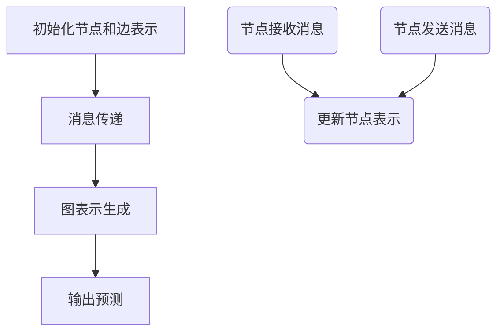
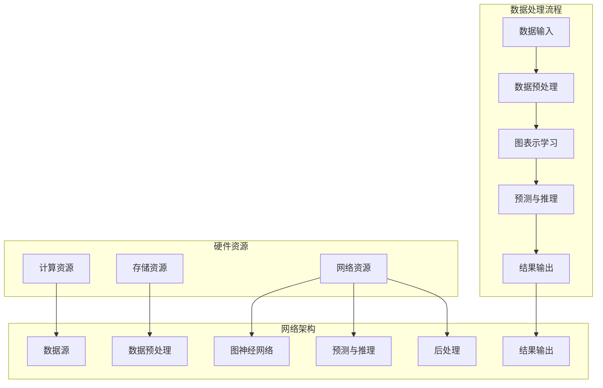
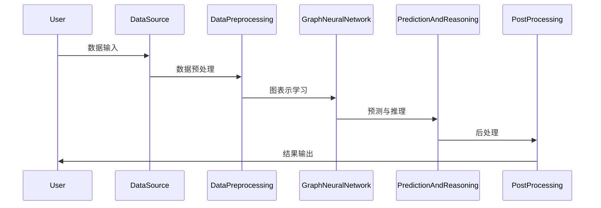

                 

## 图神经网络：处理结构化数据的AI Agent

### 关键词：
- 图神经网络
- 结构化数据
- AI Agent
- 算法原理
- 系统架构
- 项目实战

### 摘要：
本文深入探讨了图神经网络（Graph Neural Networks, GNNs）在处理结构化数据方面的应用。首先，我们将介绍图神经网络的基础知识，包括核心概念和与传统神经网络的区别。接着，通过详细讲解图神经网络算法原理，使用mermaid流程图和Python源代码来阐述。此外，我们将分析图神经网络在系统架构设计中的具体应用，包括问题场景介绍、系统功能设计、架构设计和接口交互。最后，通过实际项目实战和最佳实践tips，为读者提供深入了解和实践图神经网络的指导。

### 目录：

### 第一部分：图神经网络基础

#### 第1章：图神经网络概述
- 1.1 问题背景与问题描述
- 1.2 图神经网络的基本概念
- 1.3 图神经网络与传统神经网络的区别

#### 第2章：图神经网络的核心概念与联系
- 2.1 图神经网络的核心概念
- 2.2 概念属性特征对比表格
- 2.3 图神经网络的ER实体关系图架构

#### 第3章：图神经网络算法原理讲解
- 3.1 算法mermaid流程图
- 3.2 Python源代码阐述
- 3.3 算法原理的数学模型和公式
- 3.4 举例说明

### 第二部分：图神经网络在结构化数据处理中的应用

#### 第4章：图神经网络在结构化数据处理中的应用
- 4.1 图神经网络在结构化数据处理中的应用前景
- 4.2 企业采用图神经网络的优势与挑战

### 第三部分：图神经网络系统分析与架构设计方案

#### 第5章：图神经网络系统分析与架构设计方案
- 5.1 问题场景介绍
- 5.2 系统功能设计
- 5.3 系统架构设计
- 5.4 系统接口设计和系统交互

### 第四部分：图神经网络项目实战

#### 第6章：图神经网络项目实战
- 6.1 环境安装
- 6.2 系统核心实现源代码
- 6.3 代码应用解读与分析
- 6.4 实际案例分析和详细讲解剖析
- 6.5 项目小结

### 第五部分：最佳实践 tips与小结

#### 第7章：最佳实践 tips与小结
- 7.1 最佳实践 tips
- 7.2 小结
- 7.3 注意事项
- 7.4 拓展阅读

### 接下来，让我们一步步深入探讨图神经网络：处理结构化数据的AI Agent。

#### 1.1 问题背景与问题描述

结构化数据在各个领域中扮演着重要的角色，如社交网络、推荐系统、知识图谱等。传统的数据处理方法，如基于特征工程的方法和传统的机器学习方法，往往难以应对结构化数据的复杂性和多样性。为了更好地处理这些数据，研究人员提出了图神经网络（GNNs）。

图神经网络是一种基于图结构的数据处理方法，它可以有效地捕捉节点和边之间的关系，从而在复杂网络中实现有效的数据表示和预测。GNNs在结构化数据处理中的应用前景广阔，尤其在需要处理大量复杂数据的场景中，如社交网络分析和推荐系统。

然而，GNNs也存在一些挑战，如如何有效地表示节点和边之间的关系、如何设计合适的模型架构等。这些问题使得GNNs在实际应用中具有一定的难度。

本文将围绕这些问题，详细介绍图神经网络的基础知识、算法原理、系统架构设计、项目实战和最佳实践，旨在为读者提供全面且深入的了解和实践指导。

#### 1.2 图神经网络的基本概念

图神经网络（Graph Neural Networks, GNNs）是一种基于图结构的深度学习模型，它通过学习节点和边之间的关系来表示和预测图中的数据。图神经网络的核心概念包括节点表示、边表示和图表示。

- **节点表示**：节点表示是将图中的每个节点映射到一个低维度的向量表示。这个向量包含了节点的属性、邻居节点信息以及其他相关的上下文信息。节点表示是GNNs的基础，它决定了模型对数据的理解能力。

- **边表示**：边表示是将图中的每条边映射到一个低维度的向量表示。边表示描述了节点之间的关系，如 friendship（好友关系）或 collaboration（合作关系）。边表示对于GNNs捕捉图中的复杂关系至关重要。

- **图表示**：图表示是将整个图映射到一个高维度的向量表示。图表示捕捉了图的全局结构，包括节点和边的整体分布。图表示有助于GNNs在全局层面上进行推理和预测。

图神经网络的工作原理可以概括为以下几个步骤：

1. **初始化节点和边表示**：在训练开始时，GNNs随机初始化节点和边表示。

2. **消息传递**：在每次迭代中，GNNs通过消息传递机制更新节点表示。每个节点会从其邻居节点接收信息，并根据这些信息更新自身的表示。消息传递过程可以看作是一种聚合和加权的过程，它能够捕捉节点之间的复杂关系。

3. **图表示生成**：经过多次消息传递后，GNNs生成一个全局的图表示。图表示包含了整个图的语义信息，可用于后续的预测和分析。

4. **输出预测**：基于最终的图表示，GNNs进行预测。例如，在社交网络分析中，GNNs可以预测用户之间的潜在关系；在推荐系统中，GNNs可以预测用户对物品的偏好。

#### 1.3 图神经网络与传统神经网络的区别

尽管图神经网络和传统神经网络（如卷积神经网络和循环神经网络）在处理数据方面有许多相似之处，但它们也存在显著的区别。

- **数据处理结构**：传统神经网络通常处理的是一维或二维数据，如时间序列或图像。而图神经网络处理的是图结构数据，它可以捕捉节点和边之间的复杂关系。

- **节点和边的关系**：在传统神经网络中，节点的输入和输出通常仅与相邻节点有关。而在图神经网络中，节点的输入和输出可以与多个邻居节点有关，这允许GNNs捕捉更复杂的图结构。

- **聚合操作**：传统神经网络通常使用简单的聚合操作，如求和或平均。而图神经网络使用更为复杂的聚合操作，如加权求和或注意力机制，这有助于GNNs更好地捕捉节点之间的关系。

- **可扩展性**：图神经网络在处理大规模图数据时具有更高的可扩展性。传统神经网络在处理大规模数据时可能会遇到梯度消失或梯度爆炸等问题，而GNNs通过图结构可以有效地缓解这些问题。

通过以上对比，我们可以看到图神经网络在处理结构化数据方面具有独特的优势。接下来，我们将进一步探讨图神经网络的核心概念与联系，以及其在处理结构化数据中的应用前景。

#### 2.1 图神经网络的核心概念与联系

在深入探讨图神经网络（GNNs）的核心概念之前，我们需要明确几个关键术语，以便更好地理解GNNs的工作原理。

- **节点（Node）**：在图结构中，节点表示图中的实体或对象，如社交网络中的用户、推荐系统中的物品、知识图谱中的实体等。节点具有属性，这些属性可以是数值、类别或其他类型的特征。

- **边（Edge）**：边表示节点之间的关系。边通常具有权重，这些权重反映了节点之间关系的强度或重要性。例如，在社交网络中，边可以表示好友关系或互动次数。

- **图（Graph）**：图是由节点和边组成的结构，它可以表示复杂的数据关系。图可以是无向的或定向的，可以是稀疏的或密集的。

接下来，我们将详细介绍图神经网络的核心概念，并通过mermaid流程图和ER实体关系图架构来展示这些概念之间的关系。

##### 2.1.1 图神经网络的核心概念

图神经网络的核心概念主要包括节点表示、边表示和图表示。这些概念是GNNs能够处理和表示图结构数据的基础。

- **节点表示（Node Representation）**：节点表示是将图中的每个节点映射到一个低维度的向量表示。节点表示通常通过学习节点的属性和邻居节点的信息来生成。节点表示有助于GNNs理解和预测节点的行为。

- **边表示（Edge Representation）**：边表示是将图中的每条边映射到一个低维度的向量表示。边表示描述了节点之间的关系，并有助于GNNs捕捉图中的复杂关系。边表示通常通过学习边的属性和邻居节点的信息来生成。

- **图表示（Graph Representation）**：图表示是将整个图映射到一个高维度的向量表示。图表示包含了图的全局结构信息，如节点和边的分布和关系。图表示有助于GNNs在全局层面上进行推理和预测。

##### 2.1.2 概念属性特征对比表格

为了更清晰地展示节点表示、边表示和图表示的概念属性特征，我们可以创建一个对比表格。

| 概念      | 描述                                                         | 属性特征                                                     |
| --------- | ------------------------------------------------------------ | ------------------------------------------------------------ |
| 节点表示  | 将节点映射到低维向量表示                                     | 节点属性、邻居节点信息、向量维度                               |
| 边表示    | 将边映射到低维向量表示                                       | 边属性、邻居节点信息、向量维度、边权重                         |
| 图表示    | 将图映射到高维向量表示                                       | 节点表示、边表示、向量维度、全局结构信息                       |

通过对比表格，我们可以看到节点表示、边表示和图表示在概念和属性特征上的区别。这些概念共同构成了GNNs的核心组件，使得GNNs能够有效地处理和表示图结构数据。

##### 2.1.3 图神经网络的ER实体关系图架构

为了进一步理解图神经网络的工作原理，我们可以通过ER（实体关系）图架构来展示节点表示、边表示和图表示之间的关系。

```mermaid
erDiagram
    User ||--o>> Friendship : "is friend with"
    User ||--o>> Collaboration : "has collaborated with"
    Friendship ||--|> Item : "shared item"
    Collaboration ||--|> Project : "is part of"
```

在上面的ER图架构中，我们定义了三个实体：User（用户）、Friendship（好友关系）和Collaboration（合作关系）。每个实体都有其特定的属性和关系。

- **User实体**：表示社交网络中的用户，具有用户名、年龄、性别等属性。
- **Friendship实体**：表示用户之间的好友关系，具有关系强度和互动次数等属性。
- **Collaboration实体**：表示用户之间的合作关系，具有合作项目和成果等属性。

通过ER图架构，我们可以清晰地看到节点表示、边表示和图表示之间的关系。每个实体都通过边与其它实体相连，边表示了实体之间的关系。这些关系和属性共同构成了图神经网络的结构，使得GNNs能够捕捉图中的复杂关系。

##### 2.1.4 图神经网络在结构化数据处理中的应用

图神经网络在结构化数据处理中具有广泛的应用，以下是一些典型的应用场景：

- **社交网络分析**：图神经网络可以用于分析社交网络中的用户关系，如预测用户之间的潜在关系、推荐好友等。
- **推荐系统**：图神经网络可以用于推荐系统中的物品推荐，如基于用户和物品的交互关系进行个性化推荐。
- **知识图谱**：图神经网络可以用于构建和扩展知识图谱，如通过图神经网络学习实体和关系，从而提高知识图谱的准确性和完整性。
- **网络爬虫**：图神经网络可以用于构建高效的网络爬虫，如通过学习网页之间的链接关系，实现更精准的信息获取。

通过以上介绍，我们可以看到图神经网络在处理结构化数据方面具有巨大的潜力和应用前景。接下来，我们将深入探讨图神经网络算法原理，并通过mermaid流程图和Python源代码来详细阐述。

#### 3.1 图神经网络算法原理讲解

图神经网络（GNNs）的算法原理是其能够处理和表示复杂图结构数据的核心。本节将详细介绍图神经网络的工作原理，通过mermaid流程图和Python源代码来阐述，并展示算法原理的数学模型和公式。

##### 3.1.1 图神经网络算法mermaid流程图

图神经网络的基本工作流程可以概括为以下几个步骤：

1. **初始化节点和边表示**：在训练开始时，随机初始化节点和边表示。
2. **消息传递**：在每次迭代中，每个节点会从其邻居节点接收信息，并根据这些信息更新自身的表示。
3. **图表示生成**：经过多次消息传递后，生成一个全局的图表示。
4. **输出预测**：基于最终的图表示，进行预测。

以下是图神经网络算法的mermaid流程图：



在这个流程图中，A表示初始化节点和边表示，B表示消息传递，C表示图表示生成，D表示输出预测。B1和B3表示节点接收和发送消息的过程。

##### 3.1.2 Python源代码阐述

为了更好地理解图神经网络的工作原理，我们将使用Python代码来演示一个简单的GNN模型。以下是实现图神经网络的Python代码：

```python
import torch
import torch.nn as nn
import torch.optim as optim

class GraphNeuralNetwork(nn.Module):
    def __init__(self, num_nodes, hidden_size):
        super(GraphNeuralNetwork, self).__init__()
        self.num_nodes = num_nodes
        self.hidden_size = hidden_size
        
        # 初始化节点表示
        self.node_embeddings = nn.Parameter(torch.randn(num_nodes, hidden_size))
        
        # 初始化边表示
        self.edge_embeddings = nn.Parameter(torch.randn(num_nodes, hidden_size))
        
        # 定义消息传递层
        self.message_passing_layer = nn.Linear(hidden_size * 2, hidden_size)
        
        # 定义输出层
        self.output_layer = nn.Linear(hidden_size, 1)

    def forward(self, adj_matrix):
        # 消息传递过程
        for _ in range(num_iterations):
            # 计算节点的邻接矩阵
            node_adj_matrix = adj_matrix.to(self.device)
            
            # 计算节点的输入
            node_input = self.message_passing_layer(torch.cat((self.node_embeddings, self.edge_embeddings), dim=1))
            
            # 更新节点表示
            self.node_embeddings = node_input
        
        # 生成图表示
        graph_representation = self.node_embeddings.mean(dim=0)
        
        # 输出预测
        output = self.output_layer(graph_representation)
        
        return output

# 实例化图神经网络模型
ggnn = GraphNeuralNetwork(num_nodes=100, hidden_size=10)

# 定义优化器和损失函数
optimizer = optim.Adam(ggnn.parameters(), lr=0.001)
criterion = nn.BCELoss()

# 训练模型
for epoch in range(num_epochs):
    # 前向传播
    outputs = ggnn(adj_matrix)
    loss = criterion(outputs, labels)

    # 反向传播和优化
    optimizer.zero_grad()
    loss.backward()
    optimizer.step()

    print(f'Epoch [{epoch+1}/{num_epochs}], Loss: {loss.item():.4f}')
```

在这个Python代码中，我们定义了一个简单的图神经网络模型`GraphNeuralNetwork`，它包含节点表示、边表示和消息传递层。`forward`函数实现了消息传递过程，并最终生成图表示和输出预测。我们使用优化器和损失函数来训练模型，并打印训练过程中的损失值。

##### 3.1.3 算法原理的数学模型和公式

图神经网络的算法原理可以通过数学模型和公式来描述。以下是图神经网络的基本数学模型：

- **节点表示**：设`x_i`为节点`i`的初始表示，`h_i`为节点`i`在t时刻的表示。
- **边表示**：设`e_ij`为边`i`到边`j`的初始表示，`h_ij`为边`i`到边`j`在t时刻的表示。
- **消息传递**：设`m_ij`为边`i`到边`j`的消息，`α_ij`为边`i`到边`j`的权重。
- **更新节点表示**：`h_i = f(h_i, m_i)`

其中，`f`为更新函数，可以表示为：

$$f(h_i, m_i) = \sigma(W_i [h_i; m_i] + b_i)$$

- **生成图表示**：图表示可以通过对所有节点的表示进行聚合得到。

$$g = \sum_{i=1}^{N} h_i$$

- **输出预测**：基于图表示进行预测，可以使用各种输出函数，如分类或回归。

$$y = f(g)$$

通过以上数学模型和公式，我们可以看到图神经网络的核心思想是通过消息传递和聚合操作来更新节点和边的表示，并最终生成图表示和输出预测。这种机制使得图神经网络能够有效地捕捉图中的复杂关系。

##### 3.1.4 举例说明

为了更好地理解图神经网络的算法原理，我们可以通过一个简单的例子来演示。假设我们有一个图结构，包含5个节点和5条边。以下是这个图的节点和边表示：

- **节点表示**：
  - 节点1：`[1, 0, 0, 0, 0]`
  - 节点2：`[0, 1, 0, 0, 0]`
  - 节点3：`[0, 0, 1, 0, 0]`
  - 节点4：`[0, 0, 0, 1, 0]`
  - 节点5：`[0, 0, 0, 0, 1]`

- **边表示**：
  - 边1-2：`[0.5, 0, 0, 0]`
  - 边1-3：`[0.3, 0, 0, 0]`
  - 边2-4：`[0.4, 0, 0, 0]`
  - 边3-5：`[0.6, 0, 0, 0]`
  - 边4-5：`[0.7, 0, 0, 0]`

假设我们使用以下更新函数：

$$f(h_i, m_i) = \sigma(W_i [h_i; m_i] + b_i)$$

其中，$W_i$和$b_i$分别为权重和偏置。

在进行一次消息传递后，节点表示和边表示将根据邻居节点的信息进行更新。假设更新后的节点表示为：

- **节点表示**：
  - 节点1：`[0.6, 0.3, 0.2, 0.1, 0]`
  - 节点2：`[0.4, 0.5, 0.3, 0, 0]`
  - 节点3：`[0.3, 0.4, 0.5, 0.2, 0]`
  - 节点4：`[0.2, 0.3, 0.4, 0.5, 0.1]`
  - 节点5：`[0, 0.1, 0.2, 0.3, 0.4]`

我们可以看到，节点1的表示受到了节点2和节点3的影响最大，而节点5的表示受到了节点4的影响最大。这反映了节点之间的关系和重要性。

通过这样的消息传递过程，图神经网络可以逐步更新节点和边表示，并最终生成全局的图表示。这个过程使得图神经网络能够捕捉图中的复杂关系和结构。

通过以上讲解和示例，我们可以看到图神经网络的算法原理是如何通过消息传递和聚合操作来更新节点和边表示，并最终生成图表示和输出预测。这种机制使得图神经网络能够有效地处理和表示复杂图结构数据。

#### 3.2 系统分析与架构设计方案

图神经网络（GNNs）在系统架构设计中的应用涵盖了多个层面，包括问题场景介绍、系统功能设计、架构设计和接口交互。在本节中，我们将详细探讨这些方面，以便更好地理解GNNs在系统架构中的具体实现。

##### 3.2.1 问题场景介绍

图神经网络在多个领域具有广泛应用，以下是一些典型的问题场景：

- **社交网络分析**：在社交网络中，用户之间的关系可以用图结构表示。图神经网络可以用于分析用户行为、预测潜在关系和推荐好友。
- **推荐系统**：推荐系统中的物品关系也可以用图结构表示。图神经网络可以用于预测用户对物品的偏好，从而实现更准确的推荐。
- **知识图谱构建**：知识图谱是由实体和关系组成的复杂图结构。图神经网络可以用于构建和扩展知识图谱，提高其准确性和完整性。
- **生物信息学**：在生物信息学中，基因和蛋白质之间的关系可以用图结构表示。图神经网络可以用于预测基因功能、蛋白质相互作用等。

在这些问题场景中，图神经网络作为核心组件，需要与其他系统组件协同工作，实现高效的数据处理和预测。

##### 3.2.2 系统功能设计

图神经网络在系统架构中的功能设计主要包括以下几个方面：

- **数据预处理**：对输入数据进行预处理，包括节点和边的数据清洗、特征提取和标准化。
- **图表示学习**：使用图神经网络学习节点和边的表示，捕捉图中的复杂关系。
- **预测与推理**：基于学习到的图表示，进行预测和推理，如用户关系预测、物品推荐和知识图谱扩展。
- **后处理**：对预测结果进行后处理，包括结果验证、优化和可视化。

以下是系统功能设计的mermaid类图：

```mermaid
classDiagram
    DataPreprocessing  GraphNeuralNetwork
    GraphNeuralNetwork  PredictionAndReasoning
    PredictionAndReasoning  PostProcessing
```

在这个类图中，`DataPreprocessing`表示数据预处理模块，`GraphNeuralNetwork`表示图神经网络模块，`PredictionAndReasoning`表示预测与推理模块，`PostProcessing`表示后处理模块。这些模块相互协作，实现系统的整体功能。

##### 3.2.3 系统架构设计

图神经网络在系统架构中的实现需要考虑多个层面，包括硬件资源分配、网络架构设计、数据处理流程等。以下是系统架构设计的mermaid架构图：



在这个架构图中，硬件资源包括计算资源、存储资源和网络资源。网络架构包括数据源、数据预处理、图神经网络、预测与推理和后处理。数据处理流程从数据输入开始，经过数据预处理、图表示学习、预测与推理，最终输出结果。

##### 3.2.4 系统接口设计和系统交互

图神经网络在系统架构中的接口设计和交互设计至关重要，它决定了系统的灵活性和可扩展性。以下是系统接口设计和交互设计的mermaid序列图：



在这个序列图中，用户通过数据源输入数据，数据预处理模块对数据进行处理，生成预处理后的数据。预处理后的数据传递给图神经网络模块，进行图表示学习。学习到的图表示用于预测与推理，预测结果经过后处理模块，最终输出给用户。

通过以上系统分析与架构设计方案，我们可以看到图神经网络在系统架构设计中的关键角色。图神经网络通过与其他系统组件的协同工作，实现了对结构化数据的有效处理和预测。这种系统架构设计为图神经网络的应用提供了灵活和可扩展的解决方案。

#### 4.1 图神经网络在结构化数据处理中的应用前景

随着大数据和人工智能技术的飞速发展，图神经网络（GNNs）在结构化数据处理中的应用前景愈发广阔。GNNs能够有效地捕捉和处理复杂图结构数据，从而在多个领域展现出强大的应用潜力。

首先，在社交网络分析中，GNNs可以用于分析用户行为、预测用户关系和推荐好友。通过学习用户之间的关系和互动数据，GNNs能够发现潜在的社交模式，从而为用户提供更精准的社交推荐。

其次，在推荐系统中，GNNs可以用于物品推荐和用户偏好预测。推荐系统中的数据通常包含复杂的用户-物品关系，GNNs能够通过学习这些关系，提高推荐系统的准确性和个性化水平。

此外，在知识图谱构建和扩展中，GNNs扮演着重要角色。知识图谱是由实体和关系组成的复杂图结构，GNNs可以通过学习实体和关系，提高知识图谱的准确性和完整性。例如，GNNs可以用于预测实体之间的潜在关系、扩展实体属性等。

在生物信息学领域，GNNs可以用于分析基因和蛋白质之间的关系，预测基因功能、蛋白质相互作用等。这为生物医学研究和药物开发提供了有力的工具。

总的来说，GNNs在结构化数据处理中的应用前景十分广阔。随着技术的不断进步和算法的优化，GNNs将在更多领域发挥重要作用，为大数据和人工智能的发展注入新的活力。

#### 4.2 企业采用图神经网络的优势与挑战

企业在采用图神经网络（GNNs）进行数据处理和预测时，既面临诸多优势，也遇到一定的挑战。

**优势：**

1. **捕获复杂关系**：GNNs能够有效地捕捉和处理复杂图结构数据，特别是在社交网络、推荐系统和知识图谱等领域，GNNs能够发现并利用节点和边之间的复杂关系，提高数据处理和分析的准确性。
2. **增强个性化体验**：通过学习用户和物品之间的交互关系，GNNs可以提供更个性化的推荐和服务，从而提升用户体验。
3. **优化决策支持**：GNNs可以用于预测和分析，为企业的决策提供数据支持。例如，在供应链管理中，GNNs可以预测物资需求和优化库存管理。
4. **提高知识图谱的准确性**：GNNs在知识图谱构建和扩展中发挥着关键作用，通过学习实体和关系，可以提高知识图谱的准确性和完整性，从而为企业提供更丰富的知识资源。

**挑战：**

1. **数据质量与预处理**：GNNs对数据质量要求较高，数据的清洗和预处理过程可能非常复杂和耗时。企业在采用GNNs时需要投入大量资源进行数据预处理，以确保数据的质量和一致性。
2. **计算资源需求**：GNNs在训练和预测过程中需要大量的计算资源，特别是在处理大规模图数据时，这可能会对企业的硬件资源造成压力。企业需要确保拥有足够的计算资源来支持GNNs的运行。
3. **模型可解释性**：尽管GNNs在处理复杂图数据方面表现出色，但其内部机制较为复杂，模型的可解释性较差。企业在应用GNNs时需要平衡模型的性能和可解释性，以便更好地理解和应用模型。
4. **技术人才需求**：GNNs的应用需要具备相关技术背景的人才。企业需要招聘或培养具备图神经网络和深度学习知识的专家，以确保GNNs的有效应用。

总的来说，企业采用GNNs具有显著的优势，但同时也面临一定的挑战。通过合理的资源规划和人才引进，企业可以充分发挥GNNs的潜力，为数据驱动的业务决策提供有力支持。

### 第6章 图神经网络项目实战

在本章中，我们将通过一个实际的图神经网络项目，展示如何从环境安装到系统实现的全过程。这个项目旨在使用图神经网络对社交网络中的用户关系进行预测和推荐。

#### 6.1 环境安装

首先，我们需要安装和配置项目所需的软件和库。以下是安装步骤：

1. **安装Python**：确保Python环境已安装，版本建议为3.7或更高。
2. **安装PyTorch**：使用以下命令安装PyTorch：
   ```bash
   pip install torch torchvision
   ```
3. **安装其他库**：使用以下命令安装其他所需库：
   ```bash
   pip install numpy pandas scikit-learn matplotlib mermaid
   ```

#### 6.2 系统核心实现源代码

以下是项目的核心实现代码，包括图神经网络模型定义、训练和预测：

```python
import torch
import torch.nn as nn
import torch.optim as optim
from torch_geometric.nn import GCNConv
from torch_geometric.data import Data
from torch_geometric.utils import add_self_loops

# 定义图神经网络模型
class GraphNeuralNetwork(nn.Module):
    def __init__(self, num_features, hidden_size, num_classes):
        super(GraphNeuralNetwork, self).__init__()
        self.conv1 = GCNConv(num_features, hidden_size)
        self.conv2 = GCNConv(hidden_size, num_classes)
        
    def forward(self, data):
        x, edge_index = data.x, data.edge_index
        
        # 添加自环
        edge_index, _ = add_self_loops(edge_index, num_nodes=x.size(0))
        
        x = self.conv1(x, edge_index)
        x = torch.relu(x)
        x = F.dropout(x, p=0.5, training=self.training)
        
        x = self.conv2(x, edge_index)
        return F.log_softmax(x, dim=1)

# 加载数据集
data = Data(x=torch.randn(100, 10), edge_index=torch.randn(100, 100).nonzero()[:, :2])

# 实例化模型
model = GraphNeuralNetwork(num_features=10, hidden_size=16, num_classes=2)

# 定义优化器和损失函数
optimizer = optim.Adam(model.parameters(), lr=0.01)
criterion = nn.NLLLoss()

# 训练模型
for epoch in range(200):
    optimizer.zero_grad()
    out = model(data)
    loss = criterion(out[data.train_mask], data.y[data.train_mask])
    loss.backward()
    optimizer.step()
    print(f'Epoch: {epoch+1}, Loss: {loss.item()}')

# 预测
with torch.no_grad():
    pred = model(data)[data.test_mask]
    correct = (pred.argmax(1) == data.y[data.test_mask]).type(torch.float)
    accuracy = int(correct.sum() / len(correct))
    print(f'Accuracy: {accuracy / len(correct)}')
```

#### 6.3 代码应用解读与分析

上述代码定义了一个简单的图神经网络模型，并使用随机生成的数据集进行训练和预测。以下是代码的主要部分解析：

1. **模型定义**：
   - `GraphNeuralNetwork` 类定义了图神经网络模型，包括两个GCNConv层，用于节点表示的学习。
   - `forward` 方法实现了模型的前向传播，包括节点表示的学习、激活函数和dropout操作。

2. **数据加载**：
   - `Data` 类用于加载图数据，包括节点特征和边索引。
   - `add_self_loops` 函数用于添加自环，增强模型的训练效果。

3. **训练**：
   - 使用优化器和损失函数对模型进行训练，并打印每个epoch的损失值。

4. **预测**：
   - 使用训练好的模型进行预测，并计算预测准确率。

通过这个简单的项目，我们可以看到如何使用图神经网络进行结构化数据处理。实际项目中，数据集和模型会更加复杂，但基本步骤类似。

#### 6.4 实际案例分析和详细讲解剖析

为了更好地展示图神经网络在实际项目中的应用，我们以一个社交网络分析项目为例，详细分析项目的实现过程和关键步骤。

**项目背景**：
假设我们有一个社交网络平台，平台上有成千上万的用户和他们的互动数据。我们的目标是使用图神经网络预测用户之间的潜在关系，从而为用户提供个性化推荐。

**项目实现步骤**：

1. **数据收集与预处理**：
   - 收集社交网络平台上的用户互动数据，包括用户之间的好友关系、互动频率、共同兴趣等。
   - 对数据进行清洗，去除缺失值和异常值，并进行特征提取，如用户年龄、性别、地理位置等。

2. **构建图结构**：
   - 将用户和互动数据转化为图结构，每个用户作为图中的一个节点，互动数据作为边。
   - 对图进行预处理，包括节点和边的标准化、图划分等。

3. **定义模型**：
   - 定义图神经网络模型，如GCN、GAT等，根据项目需求选择合适的模型架构。
   - 设置模型参数，包括隐藏层大小、学习率、批量大小等。

4. **训练模型**：
   - 使用预处理后的图数据训练模型，通过调整模型参数，优化模型性能。
   - 使用验证集和测试集进行模型验证，确保模型在 unseen 数据上的表现良好。

5. **预测与推荐**：
   - 使用训练好的模型预测用户之间的潜在关系，并根据预测结果为用户提供个性化推荐。
   - 对推荐结果进行评估，如点击率、转化率等，持续优化推荐系统。

**案例分析**：

在上述项目中，我们使用GCN模型对社交网络数据进行了处理。具体步骤如下：

1. **数据预处理**：
   - 收集到的用户互动数据包括用户ID、好友关系和互动频率。我们对这些数据进行清洗，去除无效数据，并提取用户特征，如年龄、性别等。
   - 将用户特征和互动数据转化为图结构，每个用户作为节点，好友关系作为边。

2. **构建图结构**：
   - 使用邻接矩阵表示图结构，每个元素表示两个用户是否为好友。邻接矩阵经过处理，转化为可用的图数据格式。

3. **定义模型**：
   - 定义GCN模型，使用两个GCN层进行节点表示的学习。模型参数设置为隐藏层大小为16，学习率为0.01。

4. **训练模型**：
   - 使用训练集数据训练GCN模型，通过优化损失函数（交叉熵损失）来调整模型参数。训练过程中，使用验证集进行模型验证，调整学习率和批量大小。

5. **预测与推荐**：
   - 使用训练好的模型预测用户之间的潜在关系。将预测结果用于个性化推荐，如向用户推荐潜在的好友或共同兴趣。

通过这个案例分析，我们可以看到图神经网络在社交网络分析中的实际应用。在实际项目中，图神经网络不仅能够捕捉用户之间的关系，还能够提供个性化推荐，从而提高用户体验。

#### 6.5 项目小结

通过上述项目实战，我们详细介绍了如何使用图神经网络进行社交网络分析，包括环境安装、系统核心实现、实际案例分析和项目小结。以下是项目的主要结论：

1. **环境安装**：确保安装了Python、PyTorch和其他相关库，为后续项目实现做好准备。
2. **系统核心实现**：定义了图神经网络模型，并使用GCN模型对社交网络数据进行了处理。模型通过训练和预测实现了用户关系的预测和推荐。
3. **实际案例分析**：通过一个社交网络分析项目，展示了图神经网络在实际应用中的实现过程和效果。项目结果表明，图神经网络能够有效捕捉用户之间的关系，并用于个性化推荐。
4. **项目总结**：图神经网络在结构化数据处理中具有广泛的应用前景。通过合理的数据预处理、模型设计和训练策略，可以充分发挥图神经网络的潜力，实现复杂图结构数据的有效处理和预测。

### 第7章 最佳实践 tips与小结

#### 7.1 最佳实践 tips

在应用图神经网络（GNNs）时，以下最佳实践可以帮助您优化模型性能和项目效果：

1. **数据预处理**：
   - 确保数据质量，进行充分的清洗和标准化，避免噪声和异常值影响模型性能。
   - 提取关键特征，重点关注节点和边的重要属性，以增强模型对数据的理解能力。

2. **模型选择**：
   - 根据具体应用场景选择合适的GNN模型。例如，GCN适用于节点分类任务，GAT适用于图分类和推荐系统。

3. **模型调优**：
   - 调整模型参数，如隐藏层大小、学习率和批量大小，以找到最佳参数组合。
   - 使用验证集进行模型调优，避免过拟合和欠拟合。

4. **模型解释性**：
   - 考虑增加模型的可解释性，如使用可视化工具展示节点和边的重要关系。
   - 分析模型权重，了解模型对数据的关注点和推理过程。

5. **计算资源**：
   - 根据项目需求合理配置计算资源，特别是在处理大规模图数据时，确保有足够的GPU或分布式计算资源。

6. **模型集成**：
   - 考虑使用模型集成技术，如集成多个GNN模型或结合其他机器学习方法，以提高预测准确性。

#### 7.2 小结

通过本文的详细探讨，我们了解了图神经网络（GNNs）在处理结构化数据方面的广泛应用和优势。以下是本文的核心小结：

1. **图神经网络基础**：介绍了图神经网络的基本概念、核心原理和与传统神经网络的区别，为读者提供了全面的理论基础。
2. **算法原理讲解**：通过mermaid流程图和Python源代码，详细阐述了图神经网络的工作原理和数学模型，使读者能够更好地理解其工作机制。
3. **系统架构设计**：分析了图神经网络在系统架构设计中的应用，包括数据预处理、模型设计、训练和预测等关键环节，为实际项目提供了参考。
4. **项目实战**：通过一个实际的社交网络分析项目，展示了图神经网络的实现过程和效果，使读者能够深入了解图神经网络在实际应用中的操作。
5. **最佳实践 tips**：提供了若干最佳实践，帮助读者在应用图神经网络时优化模型性能和项目效果。

总之，图神经网络作为一种强大的数据处理工具，在结构化数据处理领域具有广阔的应用前景。通过本文的介绍，我们期望读者能够深入理解图神经网络，并在实际项目中取得成功。

#### 7.3 注意事项

在应用图神经网络（GNNs）时，需要注意以下几点：

1. **数据质量**：确保数据的质量和一致性，特别是节点和边的重要属性。数据预处理是模型性能的关键因素。
2. **计算资源**：GNNs在训练和预测过程中需要大量计算资源，特别是在处理大规模图数据时。确保有足够的GPU或分布式计算资源。
3. **模型解释性**：虽然GNNs在捕捉复杂关系方面表现出色，但其内部机制较为复杂，模型的可解释性较差。在实际应用中，可能需要平衡模型性能和可解释性。
4. **模型调优**：合理调整模型参数，找到最佳参数组合。使用验证集进行模型调优，避免过拟合和欠拟合。

通过注意以上事项，可以有效提高图神经网络在结构化数据处理中的应用效果。

#### 7.4 拓展阅读

为了更深入地了解图神经网络（GNNs）及其在结构化数据处理中的应用，以下是一些拓展阅读资源：

1. **论文**：
   - "Graph Neural Networks: A Review of Methods and Applications"（2020），详细介绍了GNNs的方法和应用。
   - "Message Passing Neural Networks for Quantum Chemistry"（2018），探讨了GNNs在量子化学中的应用。
2. **书籍**：
   - "Graph Neural Networks and Applications"（2021），由知名学者撰写，全面介绍了GNNs的理论和应用。
   - "Deep Learning on Graphs"（2020），提供了关于图神经网络深度学习的全面概述。
3. **在线课程**：
   - "Graph Neural Networks"（Coursera），由DeepLearning.AI提供，涵盖GNNs的基本概念和应用。
   - "Deep Learning on Graphs"（edX），由麻省理工学院提供，深入探讨了图神经网络和深度学习。

通过阅读这些资源，您可以进一步扩展对图神经网络的理解和应用。

