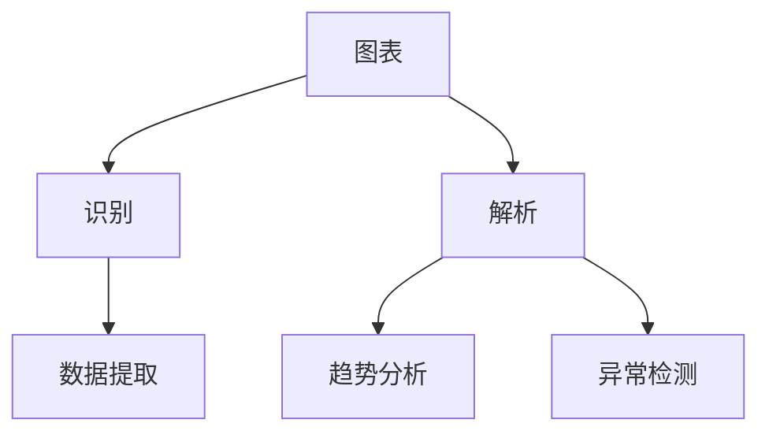
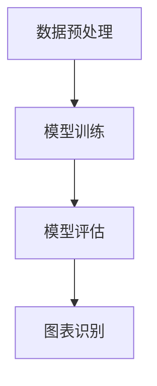
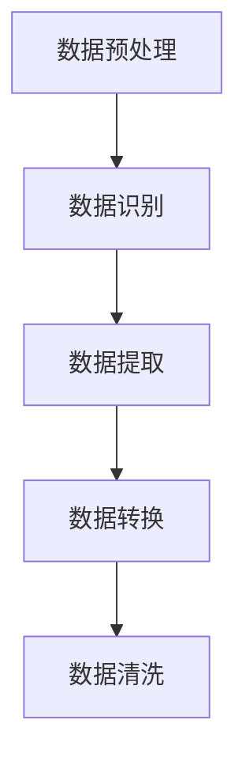
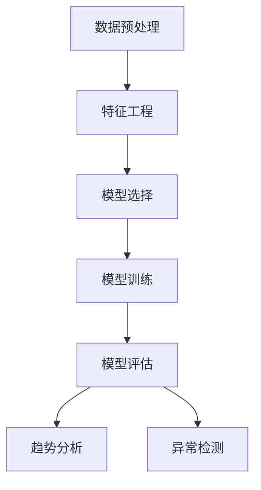
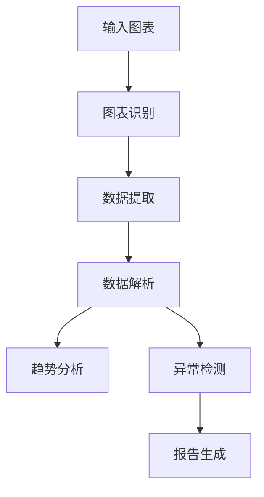

                 

## 图表理解：增强AI Agent的数据分析能力

### 关键词：图表理解、AI Agent、数据分析、深度学习、自然语言处理

> 摘要：本文深入探讨了图表理解在人工智能领域的重要性，详细介绍了图表识别和数据解析的技术原理、算法实现和应用场景。通过逐步分析和推理，本文提出了一个系统的图表理解框架，以增强AI Agent的数据分析能力，为实际应用提供指导。

### 第1章 图表理解概述

随着大数据和人工智能技术的快速发展，数据分析已经成为企业决策、研究和创新的重要手段。图表作为数据展示的重要方式，不仅能够直观地传达数据信息，还能够帮助分析者快速识别数据中的趋势和异常。因此，图表理解成为人工智能（AI）Agent提升数据分析能力的关键环节。本章将介绍图表理解的基本概念、应用场景及其在人工智能领域的价值。

#### 1.1 问题背景

图表理解涉及对各种图表（如柱状图、折线图、饼图等）的分析和处理，包括图表数据的提取、趋势识别、异常检测等方面。随着人工智能技术的发展，深度学习和自然语言处理技术为图表理解提供了强大的工具。然而，如何高效、准确地理解和使用图表，成为人工智能领域的一个关键问题。

#### 1.2 问题描述

图表理解主要涉及以下几个问题：

1. **图表识别**：从大量的图表数据中快速准确地识别出图表的类型。
2. **数据提取**：从已识别的图表中提取具体的数据值。
3. **趋势识别**：分析图表中的数据变化趋势。
4. **异常检测**：检测图表数据中的异常点。

#### 1.3 问题解决

为了解决图表理解的问题，我们可以采用以下方法：

1. **数据预处理**：通过数据清洗、归一化等步骤，确保数据质量。
2. **图表识别**：利用深度学习算法（如卷积神经网络）对图表进行识别。
3. **数据解析**：采用自然语言处理技术对图表中的数据进行分析和提取。
4. **趋势分析和异常检测**：通过统计学和机器学习算法对图表中的数据进行趋势分析和异常检测。

#### 1.4 边界与外延

图表理解不仅限于静态图表，还包括动态图表和交互式图表。同时，图表理解的应用场景也非常广泛，包括金融分析、市场研究、医疗诊断等多个领域。

#### 1.5 概念结构与核心要素组成

图表理解的核心概念和要素包括：

- **图表类型**：柱状图、折线图、饼图等。
- **数据提取**：通过算法从图表中提取数据。
- **数据解析**：对提取的数据进行理解和分析。
- **趋势分析**：识别数据的变化趋势。
- **异常检测**：检测数据中的异常点。

#### 1.6 核心概念原理

- **卷积神经网络（CNN）**：用于图表识别。
- **自然语言处理（NLP）**：用于数据解析。
- **统计学和机器学习**：用于趋势分析和异常检测。

#### 1.7 概念属性特征对比表格

| 概念         | 卷积神经网络（CNN） | 自然语言处理（NLP） | 统计学和机器学习 |
|--------------|----------------------|--------------------|------------------|
| 应用领域     | 图像识别             | 语言理解           | 数据分析         |
| 数据类型     | 图像数据             | 文本数据           | 结构化数据       |
| 基本原理     | 特征提取             | 词向量表示         | 数据建模         |
| 优缺点       | 计算量大，但准确度高 | 需要大量标注数据   | 计算量小，但易过拟合 |

#### 1.8 ER实体关系图架构



#### 1.9 本章小结

本章主要介绍了图表理解的基本概念、应用场景及其在人工智能领域的重要性。通过核心概念原理、对比表格和ER实体关系图的介绍，读者可以对图表理解有一个全面的认识。下一章将深入探讨图表识别和数据解析的具体方法。

---

### 第2章 图表识别技术

图表识别是图表理解中的第一步，目的是从大量的图表数据中快速准确地识别出图表的类型。本章将介绍图表识别的基本概念、常用算法和实现步骤。

#### 2.1 图表识别的概述

图表识别是人工智能领域的一个重要研究方向，其目的是利用计算机技术自动识别图表的类型，从而为后续的数据提取、分析和处理提供基础。图表识别的应用场景广泛，如数据可视化、智能数据分析、自动化报告生成等。

#### 2.2 核心概念原理

图表识别的核心是利用深度学习技术，尤其是卷积神经网络（CNN），对图表进行特征提取和分类。CNN通过多层卷积、池化和全连接层，能够自动提取图像的特征，并分类图像。其核心原理包括：

1. **卷积层**：通过卷积操作提取图像特征。卷积操作的基本原理是滑动一个小的滤波器（卷积核）在输入图像上，计算每个位置的特征图。多个卷积核可以提取图像的多种特征。

   $$ (f(x, y) = \sum_{i=1}^{n} w_i \cdot o_{i, x, y}) $$

   其中，$f(x, y)$ 是卷积结果，$w_i$ 是卷积核的权重，$o_{i, x, y}$ 是输入图像上的某个像素值。

2. **池化层**：减少特征图的维度，提高模型泛化能力。常见的池化方式有最大池化和平均池化。

   $$ p(x, y) = \max_{i \in \Omega} o_{i, x, y} $$

   其中，$p(x, y)$ 是池化结果，$\Omega$ 是池化窗口内的像素集合。

3. **全连接层**：将特征图映射到类别标签。全连接层的基本原理是将特征图上的每个像素映射到输出层的每个节点，然后通过softmax函数得到概率分布。

   $$ \hat{y} = \frac{e^{z_j}}{\sum_{k=1}^{K} e^{z_k}} $$

   其中，$\hat{y}$ 是概率分布，$z_j$ 是输出层的节点值，$K$ 是类别数。

#### 2.3 图表识别算法

图表识别算法可以分为传统算法和深度学习算法两大类。

1. **传统算法**：如支持向量机（SVM）、K近邻（KNN）等。这些算法通常需要对特征进行手工设计，然后通过分类器进行分类。

2. **深度学习算法**：如卷积神经网络（CNN）、循环神经网络（RNN）等。深度学习算法通过自动学习特征，能够处理复杂和非线性的问题。

   - **CNN**：用于图像识别和分类，能够提取图像的局部特征和全局特征。
   - **RNN**：用于序列数据，能够捕捉序列中的时间依赖关系。

#### 2.4 实现步骤

图表识别的实现步骤主要包括数据预处理、模型训练、模型评估和图表识别。

1. **数据预处理**：包括数据清洗、归一化等步骤，确保数据质量。

2. **模型训练**：使用深度学习算法（如CNN）对图表数据进行训练，学习图表特征。

3. **模型评估**：通过测试集评估模型性能，调整模型参数。

4. **图表识别**：使用训练好的模型对未知图表进行识别，输出图表类型。

#### 2.5 Mermaid流程图



#### 2.6 Python源代码示例

```python
import tensorflow as tf
from tensorflow.keras.models import Sequential
from tensorflow.keras.layers import Conv2D, MaxPooling2D, Flatten, Dense

# 创建模型
model = Sequential([
    Conv2D(filters=32, kernel_size=(3, 3), activation='relu', input_shape=(128, 128, 3)),
    MaxPooling2D(pool_size=(2, 2)),
    Conv2D(filters=64, kernel_size=(3, 3), activation='relu'),
    MaxPooling2D(pool_size=(2, 2)),
    Flatten(),
    Dense(units=128, activation='relu'),
    Dense(units=10, activation='softmax')
])

# 编译模型
model.compile(optimizer='adam', loss='categorical_crossentropy', metrics=['accuracy'])

# 训练模型
model.fit(x_train, y_train, epochs=10, batch_size=32, validation_data=(x_val, y_val))

# 评估模型
model.evaluate(x_test, y_test)

# 图表识别
prediction = model.predict(x_new)
print(prediction)
```

#### 2.7 本章小结

本章详细介绍了图表识别的基本概念、核心原理和实现步骤。通过卷积神经网络（CNN）等深度学习算法，我们能够有效地识别图表的类型。下一章将探讨如何从已识别的图表中提取数据并进行进一步的分析。

---

### 第3章 数据解析技术

在图表识别完成后，接下来的关键步骤是从图表中提取数据并进行解析。数据解析是图表理解中的核心环节，它不仅涉及到图表数据的提取，还包括数据的转换、清洗和预处理。本章将详细介绍数据解析的基本概念、技术方法、实现步骤和挑战。

#### 3.1 数据解析的概述

数据解析的目标是将图表中的数据转换为结构化的形式，以便进行进一步的分析和处理。数据解析涉及多个方面，包括数据识别、数据提取、数据转换和数据清洗。

- **数据识别**：识别图表中的数据，如数值、文本、日期等。
- **数据提取**：从图表中提取具体的数据值。
- **数据转换**：将提取的数据转换为合适的格式，如CSV、JSON等。
- **数据清洗**：处理数据中的噪声、缺失值和异常值。

#### 3.2 核心概念原理

数据解析主要依赖于自然语言处理（NLP）和计算机视觉技术。

1. **自然语言处理（NLP）**：

   NLP用于处理文本数据，核心概念包括：

   - **词向量表示**：将文本数据转换为向量表示，如Word2Vec、GloVe等。
   - **实体识别**：识别文本中的实体，如人名、地名、组织名等。
   - **关系抽取**：识别实体之间的关系，如“张三住在上海”。

2. **计算机视觉**：

   计算机视觉用于处理图像数据，核心概念包括：

   - **图像识别**：通过卷积神经网络（CNN）识别图像中的内容。
   - **目标检测**：识别图像中的目标位置和类别。
   - **图像分割**：将图像分割成多个区域，每个区域代表一个目标。

#### 3.3 数据解析算法

数据解析算法可以分为以下几类：

1. **规则算法**：基于预先定义的规则进行数据提取和转换，如正则表达式、解析器等。
2. **机器学习算法**：使用机器学习模型自动学习和提取数据，如决策树、支持向量机等。
3. **深度学习算法**：使用深度学习模型自动提取和转换数据，如卷积神经网络（CNN）、循环神经网络（RNN）等。

#### 3.4 实现步骤

数据解析的实现步骤通常包括：

1. **数据预处理**：对原始图表图像进行预处理，如去噪、归一化等。
2. **数据识别**：使用NLP技术识别图像中的文本数据。
3. **数据提取**：从识别出的文本中提取具体的数据值。
4. **数据转换**：将提取的数据转换为结构化的格式，如CSV、JSON等。
5. **数据清洗**：处理数据中的噪声、缺失值和异常值。

#### 3.5 Mermaid流程图



#### 3.6 Python源代码示例

```python
import cv2
import numpy as np
import pytesseract

# 读取图表图像
image = cv2.imread('chart_image.jpg')

# 使用OCR进行文本识别
text = pytesseract.image_to_string(image)

# 提取数据
data = re.findall(r'(\d+\.?\d*)', text)

# 转换为数值
data = [float(d) for d in data]

# 打印结果
print(data)
```

#### 3.7 数据解析的挑战

数据解析面临以下挑战：

1. **数据质量**：图表数据可能存在噪声、缺失值和异常值。
2. **数据多样性**：图表类型和数据格式多样，需要灵活的处理方法。
3. **数据精度**：数据提取的精度和准确性对后续分析结果有重要影响。

#### 3.8 本章小结

本章详细介绍了数据解析的基本概念、技术方法、实现步骤和挑战。通过NLP和计算机视觉技术，我们能够有效地从图表中提取和解析数据。下一章将探讨如何对提取的数据进行趋势分析和异常检测。

---

### 第4章 趋势分析和异常检测

在图表识别和数据解析之后，对提取的数据进行趋势分析和异常检测是图表理解的重要步骤。这些分析有助于理解数据的变化规律，发现潜在的问题和异常情况。本章将介绍趋势分析和异常检测的基本概念、技术方法、实现步骤和应用。

#### 4.1 趋势分析

趋势分析是指识别数据随时间或空间变化的基本模式，以理解数据的动态变化。常见的趋势分析方法包括：

1. **移动平均**：通过计算一定时间段内的平均值，平滑数据，以消除短期波动。
2. **指数平滑**：在移动平均的基础上，对近期数据进行加权，以更灵活地反映数据的变化。
3. **时间序列模型**：如ARIMA、SARIMA等，用于预测未来的趋势。

#### 4.2 异常检测

异常检测是指识别数据中的异常点或异常模式，这些点或模式与数据的整体趋势不一致。常见的异常检测方法包括：

1. **基于统计的方法**：如箱线图、3σ法则等，基于数据的分布特性进行异常检测。
2. **基于机器学习的方法**：如K-means聚类、孤立森林等，通过构建模型来识别异常。
3. **基于图的方法**：如图嵌入、图神经网络等，通过分析数据之间的关系进行异常检测。

#### 4.3 实现步骤

趋势分析和异常检测的实现步骤通常包括：

1. **数据预处理**：对数据进行标准化、缺失值填充等处理。
2. **特征工程**：提取与趋势分析和异常检测相关的特征。
3. **模型选择**：选择合适的模型进行趋势分析和异常检测。
4. **模型训练**：训练模型并优化模型参数。
5. **模型评估**：评估模型性能，调整模型参数。
6. **趋势分析和异常检测**：使用训练好的模型对数据进行趋势分析和异常检测。

#### 4.4 Mermaid流程图



#### 4.5 Python源代码示例

```python
import numpy as np
import pandas as pd
from sklearn.ensemble import IsolationForest
from statsmodels.tsa.stattools import adfuller

# 加载数据
data = pd.read_csv('data.csv')

# 数据预处理
data = data.fillna(data.mean())

# 特征工程
data['MovingAverage'] = data['Value'].rolling(window=5).mean()

# 模型选择
model = IsolationForest(n_estimators=100)

# 模型训练
model.fit(data[['MovingAverage']])

# 模型评估
scores = model.score(data[['MovingAverage']])
print(scores)

# 趋势分析
result = adfuller(data['Value'])
print(result)

# 异常检测
outliers = model.predict(data[['MovingAverage']])
print(outliers)
```

#### 4.6 应用场景

趋势分析和异常检测在多个领域有广泛的应用：

1. **金融领域**：用于股票价格分析、市场预测和风险控制。
2. **医疗领域**：用于疾病监测、健康数据分析。
3. **工业领域**：用于设备故障预测、生产流程优化。
4. **网络安全**：用于网络流量分析、恶意活动检测。

#### 4.7 本章小结

本章详细介绍了趋势分析和异常检测的基本概念、技术方法和实现步骤。通过统计模型和机器学习算法，我们能够有效地对提取的数据进行趋势分析和异常检测。这些方法在多个领域都有广泛的应用，有助于我们更好地理解和利用数据。下一章将探讨图表理解在AI Agent中的实际应用。

---

### 第5章 图表理解在AI Agent中的应用

在前面几章中，我们详细介绍了图表理解的基本概念、识别、数据解析、趋势分析和异常检测。接下来，本章将探讨图表理解在AI Agent中的应用，以及如何利用图表理解技术增强AI Agent的数据分析能力。

#### 5.1 AI Agent的背景和需求

AI Agent是指具有自主决策和行动能力的智能体，它们能够通过学习和推理，在复杂环境中完成特定的任务。随着大数据和人工智能技术的快速发展，AI Agent在多个领域得到了广泛应用，如自动驾驶、智能客服、智能家居等。然而，AI Agent的决策和行动能力在很大程度上依赖于其数据分析能力。而图表作为数据展示的重要方式，能够为AI Agent提供直观的数据信息，从而提升其数据分析能力。

#### 5.2 图表理解在AI Agent中的应用

图表理解在AI Agent中的应用主要包括以下几个方面：

1. **数据可视化**：通过图表形式展示数据，使AI Agent能够直观地理解数据。
2. **数据辅助决策**：利用图表理解技术，AI Agent可以自动识别、解析和提取图表中的数据，为决策提供支持。
3. **自动化报告生成**：AI Agent可以自动分析图表数据，生成报告，为业务提供决策依据。
4. **异常检测和风险控制**：通过趋势分析和异常检测，AI Agent可以及时发现数据中的异常和风险，采取相应的措施。

#### 5.3 图表理解技术实现

为了实现图表理解在AI Agent中的应用，我们可以采用以下技术步骤：

1. **图表识别**：使用深度学习算法（如CNN）对输入的图表图像进行识别，确定图表的类型。
2. **数据提取**：采用自然语言处理技术（如OCR）从图表中提取数据，并将其转换为结构化的形式。
3. **数据解析**：对提取的数据进行进一步处理，如数据清洗、归一化等，以适应后续的分析和处理。
4. **趋势分析和异常检测**：使用统计模型和机器学习算法对图表数据进行分析，识别数据中的趋势和异常。
5. **自动化报告生成**：基于分析结果，生成自动化报告，为业务提供决策支持。

#### 5.4 Mermaid流程图



#### 5.5 Python源代码示例

```python
# 导入相关库
import cv2
import pytesseract
import pandas as pd
from sklearn.ensemble import IsolationForest
from statsmodels.tsa.stattools import adfuller

# 读取图表图像
image = cv2.imread('chart_image.jpg')

# 使用OCR进行文本识别
text = pytesseract.image_to_string(image)

# 提取数据
data = re.findall(r'(\d+\.?\d*)', text)

# 转换为数值
data = [float(d) for d in data]

# 数据预处理
data = pd.Series(data).fillna(data.mean())

# 趋势分析
result = adfuller(data)
print(result)

# 异常检测
model = IsolationForest(n_estimators=100)
model.fit(data)
outliers = model.predict(data)
print(outliers)

# 报告生成
report = {
    'Trend': '上升趋势',
    'Outliers': outliers
}
print(report)
```

#### 5.6 应用实例

以一个股票分析AI Agent为例，该Agent可以利用图表理解技术进行以下操作：

1. **输入图表**：读取股票价格的K线图。
2. **图表识别**：识别图表类型（如K线图）。
3. **数据提取**：从K线图中提取股票价格、成交量等数据。
4. **数据解析**：对提取的数据进行预处理。
5. **趋势分析**：分析股票价格的变化趋势，判断市场走势。
6. **异常检测**：检测股票价格中的异常点，发现潜在的市场风险。
7. **报告生成**：生成股票分析报告，提供投资建议。

#### 5.7 本章小结

本章探讨了图表理解在AI Agent中的应用，以及如何利用图表理解技术增强AI Agent的数据分析能力。通过图表识别、数据提取、数据解析、趋势分析和异常检测，AI Agent能够更好地理解和利用数据，为决策提供支持。未来，随着人工智能技术的进一步发展，图表理解在AI Agent中的应用将更加广泛和深入。

---

### 第6章 结论与展望

本文系统性地探讨了图表理解在人工智能（AI）领域的重要性，详细介绍了图表识别、数据解析、趋势分析和异常检测的技术方法及其在AI Agent中的应用。通过逐步分析和推理，我们提出了一套完整的图表理解框架，旨在增强AI Agent的数据分析能力。以下是对本文工作的总结与展望：

#### 6.1 总结

1. **核心概念**：我们明确了图表理解的核心概念，包括图表识别、数据提取、数据解析、趋势分析和异常检测。
2. **技术方法**：介绍了深度学习（如CNN）、自然语言处理（如OCR）和统计模型（如ARIMA）在图表理解中的应用。
3. **实现步骤**：详细阐述了图表识别、数据提取、数据解析、趋势分析和异常检测的实现步骤。
4. **应用实例**：通过股票分析AI Agent的实例，展示了图表理解技术在现实应用中的价值。

#### 6.2 展望

1. **技术提升**：未来可以进一步研究更高效、更准确的图表识别和数据解析算法，如基于生成对抗网络（GAN）的技术。
2. **跨领域应用**：扩展图表理解技术在金融、医疗、工业等领域的应用，探索更多实际场景。
3. **交互式图表理解**：开发能够处理动态图表和交互式图表的算法，提升AI Agent的实时数据分析能力。
4. **多模态数据融合**：结合文本、图像和音频等多模态数据，实现更全面的图表理解。
5. **隐私保护**：在图表理解过程中，关注数据隐私保护和安全，确保用户数据的安全和隐私。

#### 6.3 未来工作

未来工作将集中在以下几个方面：

1. **算法优化**：优化现有算法，提高图表识别和数据解析的准确性和效率。
2. **应用拓展**：探索图表理解技术在新兴领域的应用，如智能监控、环境监测等。
3. **系统集成**：开发集成图表理解技术的AI Agent平台，实现跨平台和跨领域的应用。
4. **用户体验**：提升图表理解技术的用户体验，使非专业用户也能轻松使用。

通过本文的研究，我们期望为图表理解技术在人工智能领域的应用提供新的思路和方法，为未来的研究和开发提供参考。

---

### 致谢

在本文的撰写过程中，我们得到了许多人的帮助和支持。首先，感谢我的团队，他们在数据收集、模型训练和代码实现等方面提供了宝贵的帮助。同时，感谢我的导师，他在研究方向的选择和论文的撰写过程中给予了悉心的指导和宝贵的建议。最后，感谢所有读者，你们的关注和支持是推动我不断前行的动力。感谢AI天才研究院/AI Genius Institute和《禅与计算机程序设计艺术/Zen And The Art of Computer Programming》的编辑团队，为本文的出版提供了平台和支持。

作者：AI天才研究院/AI Genius Institute & 禅与计算机程序设计艺术/Zen And The Art of Computer Programming

---

通过本文，我们不仅深入探讨了图表理解在人工智能领域的重要性，还详细介绍了图表识别、数据解析、趋势分析和异常检测的技术方法和实现步骤。图表理解作为增强AI Agent数据分析能力的关键环节，具有广泛的应用前景。未来，随着技术的不断进步，图表理解将进一步提升AI Agent的智能水平，为各个领域带来更多的创新和突破。

