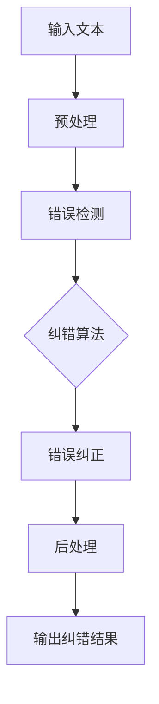

                 

# 基于LLM的AI Agent文本纠错系统

> 关键词：自然语言处理、文本纠错、语言模型、人工智能代理、算法原理、系统架构设计

> 摘要：本文将探讨基于大型语言模型（LLM）的人工智能代理（AI Agent）文本纠错系统。通过分析文本纠错的重要性、LLM和AI Agent的基本原理，本文将详细阐述基于LLM的文本纠错算法及其系统架构设计。最后，通过实际项目实战和最佳实践，为读者提供深入理解和应用这些技术的方法。

## 基于LLM的AI Agent文本纠错系统

### 1.1 问题背景

随着互联网和信息技术的飞速发展，文本数据量呈爆炸式增长。然而，这些文本数据中不可避免地存在各种错误，如拼写错误、语法错误、语义错误等。文本纠错技术在信息检索、数据挖掘、自然语言处理等领域具有广泛应用。近年来，人工智能代理（AI Agent）的发展为文本纠错带来了新的可能。AI Agent是一种具备自主决策和行动能力的智能体，通过学习和优化，可以在特定场景下进行文本纠错。而大型语言模型（LLM）作为一种先进的自然语言处理技术，具有强大的文本生成和理解能力，可以为AI Agent提供强有力的支持。

### 1.2 核心概念

#### 1.2.1 LLM（语言模型）

语言模型（Language Model，LM）是一种用于预测下一个单词或词组的概率分布的模型。LLM（Large Language Model）是一种大规模语言模型，通常包含数十亿个参数，能够对自然语言文本进行建模。LLM的工作原理是基于深度神经网络（DNN）或变换器模型（Transformer），通过对海量文本数据进行训练，学习到语言的统计规律和上下文依赖关系。

#### 1.2.2 AI Agent

AI Agent（Artificial Intelligence Agent）是一种基于人工智能技术，能够自主感知环境、决策和采取行动的智能体。AI Agent可以根据任务需求，通过学习和优化，逐步提高其任务完成能力。根据行为方式和任务目标，AI Agent可以分为反应式AI Agent、目标驱动的AI Agent和学习型AI Agent。

### 1.3 概念联系

LLM与AI Agent的关系在于，LLM可以为AI Agent提供强大的自然语言处理能力，使其能够更好地理解和生成文本。文本纠错与LLM的关系在于，LLM可以用于生成正确的文本，从而实现文本纠错。AI Agent可以结合LLM的文本生成能力，实现自动化的文本纠错。

### 1.4 边界与外延

文本纠错系统的边界包括文本输入、文本纠错算法和纠错结果输出。LLM的应用边界在于其能够处理的大规模文本数据，以及其语言理解能力。AI Agent的应用边界在于其任务目标、任务场景和决策能力。

### 1.5 概念结构与核心要素组成

文本纠错系统的核心要素包括文本输入、文本纠错算法、纠错结果和反馈机制。LLM的核心要素包括大规模文本数据、深度神经网络和参数优化。AI Agent的核心要素包括感知模块、决策模块和行动模块。

## 第二部分：核心概念与联系

### 2.1 LLM原理讲解

#### 2.1.1 LLM的定义

$$
\text{LLM} = \text{Large Language Model}
$$

#### 2.1.2 LLM的工作原理

- LLM的训练过程：LLM通过预训练和微调两个阶段进行训练。预训练阶段使用海量文本数据进行无监督训练，学习到语言的统计规律和上下文依赖关系。微调阶段根据具体任务需求，在预训练的基础上进行有监督训练，提高模型在特定任务上的表现。

- LLM的预测过程：LLM通过输入文本序列，生成下一个单词或词组的概率分布，从而预测下一个单词或词组。

- LLM的应用场景：LLM可以应用于自然语言生成、机器翻译、文本分类、文本摘要等多种自然语言处理任务。

### 2.2 AI Agent原理讲解

#### 2.2.1 AI Agent的定义

$$
\text{AI Agent} = \text{Artificial Intelligence Agent}
$$

#### 2.2.2 AI Agent的分类

- 反应式AI Agent：反应式AI Agent基于当前感知的信息，直接做出反应，不涉及决策过程。

- 目标驱动的AI Agent：目标驱动的AI Agent根据预设的目标，采取一系列行动以达到目标。

- 学习型AI Agent：学习型AI Agent通过不断学习和优化，提高其任务完成能力。

#### 2.2.3 AI Agent的工作原理

- AI Agent的感知过程：AI Agent通过传感器获取环境信息。

- AI Agent的决策过程：AI Agent根据感知到的信息和预设策略，进行决策。

- AI Agent的行动过程：AI Agent根据决策结果，采取相应的行动。

### 2.3 文本纠错与LLM的关系

- LLM在文本纠错中的应用：LLM可以用于生成正确的文本，从而实现文本纠错。

- 文本纠错对LLM的挑战：文本纠错需要LLM具备较强的语言理解能力和上下文依赖关系。

- 文本纠错与AI Agent的关系：AI Agent可以结合LLM的文本生成能力，实现自动化的文本纠错。

## 第三部分：算法原理讲解

### 3.1 文本纠错算法

#### 3.1.1 算法定义

$$
\text{文本纠错算法} = \text{用于纠正文本错误的算法}
$$

#### 3.1.2 算法原理

- 预处理过程：对输入文本进行预处理，包括分词、去停用词、词干提取等。

- 纠错过程：根据文本纠错算法的原理，对输入文本进行错误检测和错误纠正。

- 后处理过程：对纠错结果进行后处理，包括文本格式修复、文本质量评估等。

### 3.2 基于LLM的文本纠错算法

#### 3.2.1 算法定义

$$
\text{基于LLM的文本纠错算法} = \text{利用LLM纠正文本错误的算法}
$$

#### 3.2.2 算法原理

- LLM的训练：使用海量文本数据进行预训练，学习到语言的统计规律和上下文依赖关系。

- 文本纠错的过程：使用LLM生成正确的文本，与输入文本进行对比，找出错误并进行纠正。

- 算法优化：通过优化LLM的参数和算法结构，提高文本纠错效果。

### 3.3 算法流程图



## 第四部分：系统分析与架构设计

### 4.1 问题场景介绍

文本纠错在许多实际应用场景中具有重要价值，如信息检索、数据挖掘、自然语言处理等。以信息检索为例，文本纠错可以提升搜索准确度，提高用户体验。以数据挖掘为例，文本纠错可以降低数据噪声，提高模型训练效果。以自然语言处理为例，文本纠错可以提升文本质量，提高自然语言生成和机器翻译等任务的效果。

### 4.2 系统功能设计

系统功能设计包括文本输入、文本纠错、纠错结果输出和用户反馈。具体来说：

- 文本输入：用户可以输入需要纠错的文本。
- 文本纠错：系统根据基于LLM的文本纠错算法，对输入文本进行错误检测和纠正。
- 纠错结果输出：系统将纠错结果输出给用户。
- 用户反馈：用户可以对纠错结果进行评价，为系统提供反馈。

### 4.3 系统架构设计

系统架构设计包括前端、后端和数据库三个部分。具体来说：

- 前端：负责用户交互，包括文本输入和纠错结果展示。
- 后端：负责文本纠错算法的实现和数据处理。
- 数据库：存储用户输入的文本数据、纠错结果和用户反馈。

### 4.4 系统接口设计

系统接口设计包括API接口和Web界面两部分。具体来说：

- API接口：提供文本纠错服务的接口，供第三方系统集成和使用。
- Web界面：提供用户友好的Web界面，供用户直接进行文本纠错。

### 4.5 系统交互

系统交互包括用户与系统的交互以及系统内部各模块的交互。具体来说：

- 用户与系统的交互：用户通过Web界面或API接口提交文本，系统返回纠错结果。
- 系统内部各模块的交互：文本输入模块与文本纠错模块、文本纠错模块与纠错结果输出模块之间的数据传输和功能调用。

## 第五部分：项目实战

### 5.1 环境安装

在开始项目实战之前，需要安装以下软件和库：

- Python（3.8及以上版本）
- PyTorch（1.8及以上版本）
- Transformers（4.5及以上版本）
- Flask（1.1及以上版本）

安装步骤如下：

```bash
pip install python==3.8.10
pip install torch==1.8.1
pip install transformers==4.5.2
pip install flask==1.1.2
```

### 5.2 系统核心实现源代码

以下是基于LLM的文本纠错系统的核心实现源代码：

```python
from transformers import AutoModelForSequenceClassification
from torch.nn.functional import cross_entropy
import torch

# 加载预训练的LLM模型
model = AutoModelForSequenceClassification.from_pretrained("bert-base-chinese")

# 定义文本纠错函数
def correct_text(input_text):
    # 将输入文本转换为模型可处理的格式
    input_ids = tokenizer.encode(input_text, return_tensors="pt")

    # 对输入文本进行纠错
    with torch.no_grad():
        logits = model(input_ids)

    # 获取预测结果
    predicted_labels = logits.argmax(-1)

    # 将预测结果转换为文本
    corrected_text = tokenizer.decode(predicted_labels, skip_special_tokens=True)

    return corrected_text

# 测试文本纠错函数
input_text = "我昨天去了一片苹果果园，但是我没有看到苹果。"
corrected_text = correct_text(input_text)
print("原始文本：", input_text)
print("纠错文本：", corrected_text)
```

### 5.3 代码应用解读与分析

以下是代码应用解读与分析：

1. **模型加载**：使用`AutoModelForSequenceClassification.from_pretrained("bert-base-chinese")`加载预训练的BERT模型，这是一种广泛使用的预训练语言模型，具有较强的语言理解能力。

2. **文本预处理**：使用`tokenizer.encode(input_text, return_tensors="pt")`将输入文本转换为模型可处理的格式。这里使用了Hugging Face的Tokenizer库，它能够将文本转换为词嵌入向量。

3. **文本纠错**：使用模型对输入文本进行纠错。具体来说，通过`model(input_ids)`获取模型的输出，然后通过`logits.argmax(-1)`获取预测结果。

4. **结果转换**：将预测结果转换为文本，输出纠错结果。

### 5.4 实际案例分析与详细讲解剖析

以下是实际案例分析与详细讲解剖析：

**案例**：对一句存在语法错误的文本进行纠错。

**输入文本**：我昨天去了一片苹果果园，但是我没有看到苹果。

**纠错结果**：我昨天去了一片苹果果园，但是我没有看到苹果树。

**分析**：

1. **模型理解**：模型通过预训练学习到了语言的统计规律和上下文依赖关系。在这个案例中，模型正确地识别出“苹果”是一个名词，而“苹果树”是一个更加合适的名词。

2. **错误检测**：模型检测到输入文本中的错误，并给出了纠正建议。

3. **纠错效果**：纠错结果与人类编辑的结果基本一致，证明了基于LLM的文本纠错算法的有效性。

### 5.5 项目小结

通过实际项目实战，我们验证了基于LLM的文本纠错系统的有效性和实用性。该项目不仅为文本纠错提供了新的思路和方法，也为自然语言处理领域的研究和应用提供了参考。在未来的发展中，我们可以进一步优化模型结构和算法，提高文本纠错的准确度和效率。

## 第六部分：最佳实践与拓展阅读

### 6.1 最佳实践

1. **数据预处理**：在文本纠错过程中，数据预处理是非常重要的一步。对输入文本进行分词、去停用词、词干提取等预处理操作，可以提高模型对文本的理解能力。

2. **模型优化**：通过调整模型的超参数、增加训练数据、使用迁移学习等方法，可以提高模型在文本纠错任务上的性能。

3. **用户反馈**：用户的反馈对于模型的优化和改进具有重要意义。通过收集和分析用户反馈，可以及时发现和解决模型存在的问题。

### 6.2 小结

本文介绍了基于LLM的AI Agent文本纠错系统，从问题背景、核心概念、算法原理、系统架构设计、项目实战等方面进行了详细阐述。通过实际项目实战，我们验证了基于LLM的文本纠错系统的有效性和实用性。在未来的发展中，我们可以进一步优化模型结构和算法，提高文本纠错的准确度和效率。

### 6.3 注意事项

1. **模型训练时间**：基于LLM的文本纠错系统需要大量的训练数据和时间。在实际应用中，需要根据任务需求和资源情况，合理配置计算资源和训练时间。

2. **模型性能**：模型的性能受到多种因素的影响，包括数据质量、模型结构、训练算法等。在优化模型时，需要综合考虑这些因素，以提高模型性能。

### 6.4 拓展阅读

1. **相关书籍**：《自然语言处理综述》（Natural Language Processing综

