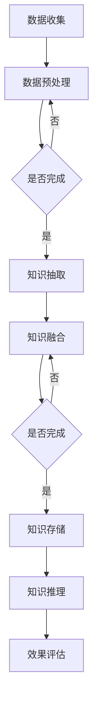
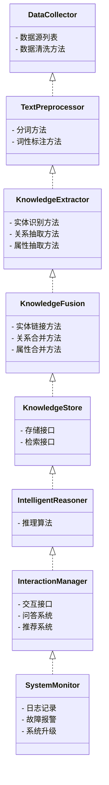
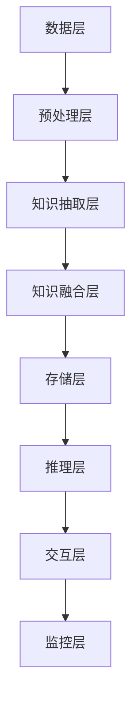
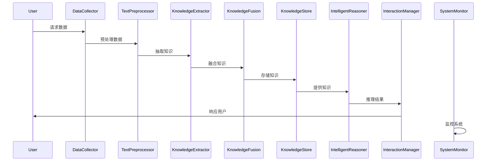

                 

### 文章标题：基于LLM的AI Agent知识图谱构建

关键词：LLM，AI Agent，知识图谱，构建，算法，系统架构

摘要：本文将深入探讨基于大型语言模型（LLM）的AI Agent知识图谱构建。我们将从问题背景出发，逐步分析LLM和知识图谱的概念与作用，探讨两者融合的原理和算法，并详细阐述知识图谱构建的系统分析与架构设计。通过实际项目实战，我们将展示如何实现基于LLM的AI Agent知识图谱构建，并提供最佳实践和扩展阅读建议。

---

## 目录

1. **背景介绍与概念理解**
   1.1 问题背景与问题描述
   1.2 AI Agent的定义与作用
   1.3 LLM在AI Agent中的应用
   1.4 知识图谱的基本概念与特性
   1.5 基于LLM的AI Agent知识图谱构建原理
   1.6 核心概念与联系
   1.7 研究现状与发展趋势
   1.8 本章小结

2. **基础理论与算法原理**
   2.1 LLM基本算法原理
   2.2 知识图谱构建算法
   2.3 LLM与知识图谱融合算法
   2.4 算法mermaid流程图
   2.5 算法Python源代码解析
   2.6 本章小结

3. **系统分析与架构设计**
   3.1 项目介绍与目标
   3.2 系统功能设计
   3.3 系统架构设计
   3.4 系统接口设计
   3.5 系统交互mermaid序列图
   3.6 本章小结

4. **项目实战**
   4.1 环境安装与配置
   4.2 系统核心实现源代码
   4.3 代码应用解读与分析
   4.4 实际案例分析和详细讲解剖析
   4.5 项目小结
   4.6 最佳实践 tips
   4.7 小结
   4.8 注意事项
   4.9 拓展阅读

---

### 1.1 问题背景与问题描述

在当前人工智能技术迅猛发展的背景下，AI Agent的应用场景日益广泛。AI Agent，即人工智能代理，是一种能够自主执行任务、具备智能决策能力的系统。其核心在于能够理解人类语言、处理复杂任务，并在不确定的环境中做出合理的决策。

知识图谱（Knowledge Graph）作为一种结构化知识存储的方式，能够有效地组织大规模数据，提供智能搜索和推理功能。知识图谱的构建是AI Agent智能决策的重要基础。

然而，传统的知识图谱构建方法主要依赖于人工标注和先验知识，难以应对动态和大规模数据环境的挑战。而大型语言模型（LLM），如GPT、BERT等，通过深度学习技术，能够从海量文本数据中自动学习知识，提供强大的语言理解和生成能力。

基于LLM的AI Agent知识图谱构建，旨在将LLM的能力与知识图谱的存储和推理优势相结合，构建一个具有自主学习和智能决策能力的知识系统。这一方法不仅能够提升AI Agent的智能水平，还能降低知识图谱构建的复杂度和人力成本。

### 1.2 AI Agent的定义与作用

AI Agent是指一种具有高度智能的计算机程序，能够自动执行任务，并在执行过程中表现出自主性和智能性。与传统的规则引擎或专家系统不同，AI Agent不依赖于固定的规则，而是通过学习、推理和决策来完成任务。

AI Agent的主要作用包括：

1. **自动化任务执行**：AI Agent能够自动执行复杂、重复的任务，提高生产效率和降低人力成本。
2. **智能决策支持**：AI Agent通过学习用户行为和历史数据，提供个性化的决策支持，帮助用户做出更好的决策。
3. **交互式服务**：AI Agent能够通过自然语言与用户进行交互，提供问答服务、智能客服等。

AI Agent的应用场景非常广泛，包括但不限于：

- **智能客服**：AI Agent能够自动回答用户的常见问题，提供24/7的客服服务。
- **智能推荐系统**：AI Agent通过分析用户行为和偏好，提供个性化的商品或内容推荐。
- **智能诊断与预测**：AI Agent能够从大量数据中提取有价值的信息，进行疾病诊断、金融市场预测等。

### 1.3 LLM在AI Agent中的应用

大型语言模型（LLM）是近年来人工智能领域的重要突破，通过深度学习技术，LLM能够从海量文本数据中自动学习语言规律和知识，提供强大的语言理解和生成能力。LLM在AI Agent中的应用主要包括以下几个方面：

1. **自然语言理解**：LLM能够对自然语言文本进行语义解析，提取关键信息，为AI Agent提供理解用户指令的能力。
2. **语言生成**：LLM能够根据输入的指令或上下文，生成相应的回答或指令，为AI Agent提供交互能力。
3. **知识抽取**：LLM能够从文本数据中抽取有价值的信息，构建知识图谱，为AI Agent提供知识支持。
4. **智能推理**：LLM能够基于知识图谱进行推理，提供智能决策支持。

例如，在智能客服场景中，LLM可以通过分析用户提问，理解用户需求，并从知识图谱中提取相关信息，生成合理的回答。在智能推荐系统中，LLM可以分析用户历史行为，生成个性化的推荐列表。

### 1.4 知识图谱的基本概念与特性

知识图谱是一种用于表达和存储实体及其相互关系的图形化数据结构。它通过实体（如人、地点、组织等）、属性（如年龄、身高、职责等）和关系（如属于、位于、负责等）的抽象，将复杂的信息组织成一个结构化、可搜索的知识库。

知识图谱的主要特性包括：

1. **结构化**：知识图谱通过明确的实体和关系，将信息组织成一个层次化的结构，便于检索和分析。
2. **语义丰富**：知识图谱不仅包含数据本身，还包含数据之间的关系和语义信息，使得数据能够进行智能推理和深度分析。
3. **动态更新**：知识图谱能够根据新的数据或知识进行动态更新，保持知识库的时效性和完整性。

知识图谱在AI Agent中具有重要的应用价值，它为AI Agent提供了丰富的知识资源和智能推理能力。通过知识图谱，AI Agent能够更好地理解用户需求，提供个性化的服务和支持。

### 1.5 基于LLM的AI Agent知识图谱构建原理

基于LLM的AI Agent知识图谱构建主要涉及以下几个核心步骤：

1. **数据收集与预处理**：首先，需要收集大量的文本数据，这些数据可以是公开的文本库、企业内部文档或用户生成的文本。接着，对数据进行预处理，包括文本清洗、去重、分词、词性标注等。
2. **知识抽取**：利用LLM的能力，从预处理后的文本数据中抽取实体、属性和关系，构建初步的知识图谱。这一步骤通常包括命名实体识别（NER）、关系抽取和属性抽取等任务。
3. **知识融合**：将不同来源的知识进行整合，消除冗余，保持知识的完整性和一致性。知识融合可以通过实体链接、关系合并和属性合并等方式实现。
4. **知识图谱构建**：将融合后的知识组织成一个结构化的知识图谱，通常使用图数据库或图存储系统来实现。
5. **知识推理**：利用知识图谱进行推理，提供智能决策支持。知识图谱的推理能力可以通过图算法、逻辑推理或机器学习等技术实现。

通过这些步骤，基于LLM的AI Agent知识图谱构建能够为AI Agent提供丰富的知识资源和强大的推理能力，从而提升其智能水平和服务质量。

### 1.6 核心概念与联系

在基于LLM的AI Agent知识图谱构建中，有几个核心概念和联系需要明确：

1. **实体（Entity）**：知识图谱中的基本构成元素，表示具体的事物或概念，如人、地点、组织、物品等。
2. **属性（Attribute）**：描述实体的特征或状态的信息，如人的年龄、职位、身高；物品的颜色、尺寸等。
3. **关系（Relation）**：描述实体之间相互作用或关联的信息，如人属于组织、物品在地点、人购买物品等。
4. **知识图谱（Knowledge Graph）**：一种用于表达和存储实体及其相互关系的图形化数据结构，通过实体、属性和关系的组合，构建一个结构化的知识库。
5. **LLM（Large Language Model）**：一种基于深度学习的语言模型，能够自动从大量文本数据中学习语言规律和知识，提供强大的语言理解和生成能力。

这些核心概念之间的联系在于：

- 实体是知识图谱的基础，属性描述实体的特征，关系连接实体，共同构成了知识图谱的结构。
- LLM通过处理文本数据，能够抽取实体、属性和关系，为知识图谱的构建提供数据支持。
- 知识图谱则为AI Agent提供了丰富的知识资源和推理能力，使得AI Agent能够更好地理解和处理复杂任务。

通过明确这些核心概念和联系，我们可以更好地理解和实现基于LLM的AI Agent知识图谱构建。

### 1.7 研究现状与发展趋势

目前，基于LLM的AI Agent知识图谱构建已成为人工智能领域的一个研究热点。国内外各大研究机构和企业在这一领域取得了显著的成果。

1. **研究进展**：国外如谷歌、微软、IBM等公司，通过引入先进的深度学习技术和图神经网络，提高了LLM在知识图谱构建中的表现。国内如百度、腾讯、阿里巴巴等，也在积极研究和应用这一技术，推出了一系列基于LLM的AI Agent产品。

2. **挑战与机遇**：虽然LLM在知识图谱构建中表现出色，但仍然面临一些挑战，如数据质量、知识抽取准确性、推理效率等。此外，随着5G、物联网等技术的快速发展，AI Agent的应用场景将更加丰富，这为基于LLM的AI Agent知识图谱构建带来了巨大的机遇。

3. **未来趋势**：未来，基于LLM的AI Agent知识图谱构建将向更智能化、自适应化的方向发展。通过引入更多的数据源和更先进的算法，AI Agent将能够更好地理解和处理复杂任务，为各行各业提供智能解决方案。

### 1.8 本章小结

本章从问题背景、AI Agent的定义、LLM的应用、知识图谱的基本概念等方面，全面介绍了基于LLM的AI Agent知识图谱构建的相关背景。通过本章的介绍，读者可以初步了解这一领域的研究现状和发展趋势，为后续章节的学习奠定基础。

---

接下来，我们将深入探讨LLM的基本算法原理、知识图谱构建算法、LLM与知识图谱融合算法，以及这些算法的mermaid流程图和Python源代码解析。

## 2.1 LLM基本算法原理

大型语言模型（LLM）是近年来自然语言处理（NLP）领域的重要突破，其主要目的是通过深度学习技术，自动从海量文本数据中学习语言规律，实现文本的生成和理解。LLM的基本算法原理主要包括以下几个方面：

### 2.1.1 语言模型的基本结构

LLM的基本结构通常包括编码器（Encoder）和解码器（Decoder）。编码器负责将输入的文本序列编码为一个连续的向量表示，解码器则根据编码器的输出和预先设定的上下文，生成文本序列。


- **编码器（Encoder）**：编码器的核心是Transformer模型，其通过自注意力机制（Self-Attention）对输入的文本序列进行处理。自注意力机制能够自动学习输入序列中各个词之间的相对重要性，从而生成一个全局的表示。
- **解码器（Decoder）**：解码器同样采用Transformer模型，其通过注意力机制（Attention Mechanism）结合编码器的输出和已生成的文本序列，逐步生成新的文本。

### 2.1.2 常见LLM算法简介

目前，常见的LLM算法主要包括GPT、BERT和T5等，每种算法都有其独特的优势和特点。

- **GPT（Generative Pre-trained Transformer）**：GPT是OpenAI开发的第一个Transformer模型，其通过自回归的方式生成文本。GPT的特点在于其预训练过程能够充分学习语言的数据分布，从而在生成文本时表现出较强的连贯性和多样性。
- **BERT（Bidirectional Encoder Representations from Transformers）**：BERT是Google开发的Transformer模型，其通过双向编码的方式学习文本序列的上下文信息。BERT的特点在于其能够更好地理解文本的语义，从而在问答、文本分类等任务中表现出色。
- **T5（Text-to-Text Transfer Transformer）**：T5是Google开发的基于Transformer的文本生成模型，其将所有NLP任务转化为文本到文本的转换任务。T5的特点在于其统一的文本转换框架，能够简化任务转换，提高模型的泛化能力。

### 2.1.3 LLM算法的数学模型与公式

LLM的数学模型主要包括输入层、编码器、解码器和解码输出层。以下以GPT为例，简要介绍其数学模型和公式。

1. **输入层**：输入文本序列\(x = (x_1, x_2, ..., x_T)\)，其中\(x_i\)表示第\(i\)个词，\(T\)表示序列长度。
2. **编码器**：编码器通过自注意力机制（Self-Attention）对输入序列进行处理，生成编码后的序列\(h = (h_1, h_2, ..., h_T)\)，其中\(h_i\)表示第\(i\)个词的编码表示。
   
   自注意力公式：
   $$ 
   \text{Attention}(Q, K, V) = \text{softmax}\left(\frac{QK^T}{\sqrt{d_k}}\right)V 
   $$
   
   其中，\(Q, K, V\)分别表示查询向量、关键向量、值向量，\(d_k\)表示关键向量的维度。

3. **解码器**：解码器通过注意力机制（Attention Mechanism）结合编码器的输出和已生成的文本序列，逐步生成新的文本。

   加权注意力公式：
   $$
   \text{MultiHeadAttention}(Q, K, V) = \text{softmax}\left(\frac{QK^T}{\sqrt{d_k}}\right)V
   $$
   
   其中，\(Q, K, V\)分别表示多头注意力中的查询向量、关键向量、值向量。

4. **解码输出层**：解码器最终生成文本序列\(y = (y_1, y_2, ..., y_T)\)，其中\(y_i\)表示第\(i\)个生成的词。

通过上述数学模型和公式，LLM能够自动从海量文本数据中学习语言规律，实现文本的生成和理解。

### 2.2 知识图谱构建算法

知识图谱构建是指从非结构化数据（如文本、图像等）中抽取结构化知识（如实体、关系、属性等），并将其存储在知识图谱中的过程。知识图谱构建算法主要包括知识抽取、实体链接、知识融合和知识存储等步骤。

#### 2.2.1 知识图谱表示方法

知识图谱是一种基于图的表示方法，由实体（Node）、属性（Property）和关系（Edge）组成。知识图谱的基本表示形式如下：


- **实体（Entity）**：知识图谱中的基本构成元素，表示具体的事物或概念，如人、地点、组织、物品等。
- **关系（Relation）**：描述实体之间相互作用或关联的信息，如人属于组织、物品在地点、人购买物品等。
- **属性（Attribute）**：描述实体的特征或状态的信息，如人的年龄、职位、身高；物品的颜色、尺寸等。

#### 2.2.2 知识抽取算法

知识抽取是指从非结构化数据中自动提取结构化知识的过程。知识抽取算法主要包括命名实体识别（NER）、关系抽取和属性抽取等。

1. **命名实体识别（NER）**：命名实体识别是指识别文本中的特定实体，如人名、地名、组织名等。常见的NER算法包括基于规则的方法、统计方法、深度学习方法等。

2. **关系抽取**：关系抽取是指识别实体之间的关联关系。关系抽取算法通常基于实体识别结果，采用基于规则、统计方法和深度学习等方法实现。

3. **属性抽取**：属性抽取是指识别实体的特征或属性。属性抽取算法通常基于实体识别和关系抽取结果，采用基于规则、统计方法和深度学习等方法实现。

#### 2.2.3 知识融合算法

知识融合是指将来自不同来源、不同格式的知识进行整合，消除冗余，保持知识的完整性和一致性。知识融合算法主要包括实体链接、关系合并和属性合并等。

1. **实体链接**：实体链接是指将同一条实体在不同数据源中的不同表示映射到同一个实体。实体链接算法通常基于实体识别结果和相似性度量方法实现。

2. **关系合并**：关系合并是指将不同来源的关系进行整合，保持关系的完整性。关系合并算法通常基于关系抽取结果和相似性度量方法实现。

3. **属性合并**：属性合并是指将不同来源的实体属性进行整合，保持属性的一致性。属性合并算法通常基于属性抽取结果和相似性度量方法实现。

#### 2.2.4 知识存储

知识存储是指将构建好的知识图谱存储在数据库中，以便进行检索和使用。常用的知识存储技术包括图数据库和关系数据库等。

- **图数据库**：图数据库是一种基于图的存储方式，能够高效地存储和查询知识图谱。常见的图数据库包括Neo4j、ArangoDB等。
- **关系数据库**：关系数据库是一种基于关系模型的存储方式，能够存储和查询结构化数据。常见的知识存储关系数据库包括MySQL、PostgreSQL等。

### 2.3 LLM与知识图谱融合算法

LLM与知识图谱融合算法是指利用LLM从海量文本数据中抽取知识，并将其与知识图谱进行融合，以提升AI Agent的智能水平。LLM与知识图谱融合算法主要包括以下几个步骤：

#### 2.3.1 融合算法的设计原则

1. **一致性**：融合后的知识应保持一致性和完整性，避免出现矛盾和冗余。
2. **灵活性**：融合算法应具有灵活性，能够适应不同的数据源、应用场景和需求。
3. **高效性**：融合算法应具有高效性，能够在较短的时间内完成知识融合。

#### 2.3.2 常见融合算法实现

1. **文本嵌入与知识图谱融合**：将文本数据通过LLM进行嵌入，将嵌入向量与知识图谱中的实体和关系进行关联，实现文本与知识的融合。
2. **知识抽取与知识图谱融合**：利用LLM进行知识抽取，将抽取出的实体、关系和属性与知识图谱进行融合。
3. **图神经网络与知识图谱融合**：利用图神经网络（Graph Neural Network, GNN）对知识图谱进行嵌入和融合，实现知识图谱的深度学习和推理。

#### 2.3.3 融合效果评估方法

融合效果评估方法主要包括以下几个方面：

1. **准确性**：评估融合后的知识准确性，包括实体识别、关系抽取和属性抽取的准确率。
2. **完整性**：评估融合后的知识完整性，包括知识缺失率和知识冗余率。
3. **一致性**：评估融合后的知识一致性，包括知识冲突率和知识一致性度。
4. **实用性**：评估融合后的知识在具体应用场景中的实用性，包括任务完成度和用户满意度。

通过上述评估方法，可以全面评估基于LLM的AI Agent知识图谱构建的效果，为后续优化和改进提供依据。

### 2.4 算法mermaid流程图

为了更好地理解和实现LLM与知识图谱融合算法，我们可以使用mermaid流程图来描述其基本流程。以下是一个简单的mermaid流程图示例：



通过这个流程图，我们可以清晰地看到从数据收集、数据预处理、知识抽取、知识融合、知识存储到知识推理和效果评估的整个过程。

### 2.5 算法Python源代码解析

为了更深入地了解LLM与知识图谱融合算法的实现，我们可以通过Python源代码来解析其主要步骤。以下是一个简单的Python代码示例，展示了如何使用GPT进行知识抽取和知识融合：

```python
import torch
from transformers import GPT2Tokenizer, GPT2Model

# 初始化GPT模型和tokenizer
tokenizer = GPT2Tokenizer.from_pretrained('gpt2')
model = GPT2Model.from_pretrained('gpt2')

# 文本数据
text_data = "苹果公司的创始人史蒂夫·乔布斯是一位杰出的企业家。"

# 进行文本预处理
input_ids = tokenizer.encode(text_data, return_tensors='pt')

# 使用GPT模型进行知识抽取
with torch.no_grad():
    outputs = model(input_ids)

# 提取知识
knowledge = outputs.last_hidden_state[:, 0, :]

# 将知识与知识图谱进行融合
# （此处代码示例仅用于说明，具体融合方法根据实际情况进行调整）
knowledge_graph = {"苹果公司": {"创始人": "史蒂夫·乔布斯"}}

# 存储融合后的知识
knowledge_graph.update({"知识": knowledge.tolist()})

# 输出融合后的知识
print(knowledge_graph)
```

通过这个代码示例，我们可以看到如何使用GPT模型进行知识抽取，并将其与知识图谱进行融合。当然，实际实现中需要根据具体需求进行调整和优化。

### 2.6 本章小结

本章详细介绍了基于LLM的AI Agent知识图谱构建的基础理论和算法原理。我们首先介绍了LLM的基本算法原理，包括其结构、常见算法和数学模型。接着，我们探讨了知识图谱构建的基本算法，包括知识抽取、知识融合和知识存储。最后，我们通过mermaid流程图和Python源代码解析，展示了如何实现LLM与知识图谱的融合算法。通过本章的学习，读者可以全面了解基于LLM的AI Agent知识图谱构建的核心技术和实现方法。

---

在接下来的章节中，我们将对基于LLM的AI Agent知识图谱构建的系统进行分析和架构设计，包括项目介绍、系统功能设计、系统架构设计、系统接口设计和系统交互mermaid序列图。

## 3.1 项目介绍与目标

### 3.1.1 项目背景

随着人工智能技术的快速发展，AI Agent作为智能化、自动化的重要应用形式，正逐渐渗透到各个行业和场景。然而，传统AI Agent在知识获取、推理能力和适应性方面存在诸多限制，难以满足日益复杂的业务需求。为此，本项目旨在构建一个基于大型语言模型（LLM）的AI Agent知识图谱，以提升AI Agent的智能水平和服务质量。

### 3.1.2 项目目标

本项目的核心目标包括：

1. **构建高质量知识图谱**：利用LLM从海量文本数据中自动抽取知识，构建结构化、层次化的知识图谱，为AI Agent提供丰富的知识资源。
2. **提升AI Agent的智能水平**：通过知识图谱的构建，使AI Agent具备更强的知识理解和推理能力，实现智能化、自动化的决策和交互。
3. **降低开发成本**：通过预训练的LLM和知识图谱构建技术，降低AI Agent开发过程中的知识获取和知识融合难度，缩短项目周期，降低开发成本。

### 3.1.3 项目意义

基于LLM的AI Agent知识图谱构建具有以下重要意义：

1. **提升业务效率**：通过智能化、自动化的AI Agent，实现业务流程的优化和效率提升，降低人力成本。
2. **增强用户体验**：基于知识图谱的AI Agent能够更好地理解用户需求，提供个性化、精准的服务，提升用户体验。
3. **推动行业创新**：知识图谱技术的引入，为各行业提供了新的业务模式和解决方案，推动了行业的技术创新和应用。
4. **降低技术门槛**：通过提供一套完整的知识图谱构建和AI Agent开发框架，降低企业和开发者进入人工智能领域的门槛。

### 3.2 系统功能设计

系统功能设计是项目成功的关键环节，本节将详细描述基于LLM的AI Agent知识图谱构建系统的功能模块和需求分析。

#### 3.2.1 功能需求分析

系统功能需求主要包括以下几个方面：

1. **数据采集与预处理**：从各种数据源（如文本、图像、音频等）中采集数据，并进行数据清洗、去重、分词、词性标注等预处理操作。
2. **知识抽取**：利用LLM从预处理后的文本数据中抽取实体、关系和属性，构建初步的知识图谱。
3. **知识融合**：将来自不同来源的知识进行整合，消除冗余，保持知识的完整性和一致性。
4. **知识存储**：将构建好的知识图谱存储在图数据库或关系数据库中，以便进行检索和使用。
5. **智能推理**：利用知识图谱进行推理，为AI Agent提供智能决策支持。
6. **交互管理**：实现AI Agent与用户的自然语言交互，提供问答、推荐、智能客服等功能。
7. **系统监控与维护**：监控系统运行状态，提供日志记录、故障报警和系统升级等功能。

#### 3.2.2 领域模型类图

为了更好地描述系统的功能需求，我们可以使用领域模型类图（Class Diagram）来展示系统中的关键类和类之间的关系。以下是一个简单的领域模型类图示例：



通过这个类图，我们可以清晰地看到系统的各个功能模块及其之间的关系，有助于理解系统的整体架构和功能实现。

### 3.3 系统架构设计

系统架构设计是项目成功的关键，本节将详细描述基于LLM的AI Agent知识图谱构建系统的整体架构，包括系统架构概述、系统架构mermaid图和系统模块划分。

#### 3.3.1 系统架构概述

基于LLM的AI Agent知识图谱构建系统采用分层架构，主要包括以下几层：

1. **数据层**：负责数据的采集、存储和管理，包括文本数据、图像数据、音频数据等。
2. **预处理层**：负责对采集到的数据进行清洗、去重、分词、词性标注等预处理操作。
3. **知识抽取层**：利用LLM从预处理后的文本数据中抽取实体、关系和属性，构建初步的知识图谱。
4. **知识融合层**：将来自不同来源的知识进行整合，消除冗余，保持知识的完整性和一致性。
5. **存储层**：将构建好的知识图谱存储在图数据库或关系数据库中，以便进行检索和使用。
6. **推理层**：利用知识图谱进行推理，为AI Agent提供智能决策支持。
7. **交互层**：实现AI Agent与用户的自然语言交互，提供问答、推荐、智能客服等功能。
8. **监控层**：监控系统运行状态，提供日志记录、故障报警和系统升级等功能。

#### 3.3.2 系统架构mermaid图

为了更好地展示系统的架构设计，我们可以使用mermaid流程图来描述系统各层之间的关系。以下是一个简单的系统架构mermaid图示例：



通过这个mermaid图，我们可以清晰地看到系统的整体架构和各层之间的依赖关系。

#### 3.3.3 系统模块划分

基于LLM的AI Agent知识图谱构建系统可以分为以下模块：

1. **数据采集模块**：负责从各种数据源（如文本、图像、音频等）中采集数据。
2. **数据预处理模块**：负责对采集到的数据进行清洗、去重、分词、词性标注等预处理操作。
3. **知识抽取模块**：利用LLM从预处理后的文本数据中抽取实体、关系和属性。
4. **知识融合模块**：将来自不同来源的知识进行整合，消除冗余，保持知识的完整性和一致性。
5. **知识存储模块**：将构建好的知识图谱存储在图数据库或关系数据库中。
6. **推理模块**：利用知识图谱进行推理，为AI Agent提供智能决策支持。
7. **交互模块**：实现AI Agent与用户的自然语言交互，提供问答、推荐、智能客服等功能。
8. **监控模块**：监控系统运行状态，提供日志记录、故障报警和系统升级等功能。

通过上述模块划分，我们可以清晰地看到系统的各个功能模块及其职责，有助于项目的实施和开发。

### 3.4 系统接口设计

系统接口设计是确保系统模块之间能够高效、稳定地协作的关键环节。本节将详细描述基于LLM的AI Agent知识图谱构建系统的接口设计，包括接口设计原则、接口定义与实现。

#### 3.4.1 接口设计原则

接口设计应遵循以下原则：

1. **简洁性**：接口设计应尽量简洁，避免冗余和复杂，以提高系统的可维护性和可扩展性。
2. **一致性**：接口设计应保持一致性，包括命名规范、参数类型、返回值等，以确保各模块之间的兼容性。
3. **稳定性**：接口设计应确保系统在各种运行环境下稳定、可靠，避免因接口变化导致系统崩溃或错误。
4. **可扩展性**：接口设计应考虑未来的扩展需求，预留足够的空间和灵活性，以便系统功能扩展。

#### 3.4.2 接口定义与实现

系统接口定义如下：

1. **数据采集接口**：负责从各种数据源中采集数据，包括文本数据、图像数据、音频数据等。
   - 方法：`getData(source: str) -> List[Data]`
   - 参数：`source`表示数据源类型，如文本（text）、图像（image）、音频（audio）。
   - 返回值：`List[Data]`表示采集到的数据列表。

2. **数据预处理接口**：负责对采集到的数据进行清洗、去重、分词、词性标注等预处理操作。
   - 方法：`preprocess(data: Data) -> PreprocessedData`
   - 参数：`data`表示原始数据。
   - 返回值：`PreprocessedData`表示预处理后的数据。

3. **知识抽取接口**：负责从预处理后的文本数据中抽取实体、关系和属性。
   - 方法：`extractKnowledge(preprocessedData: PreprocessedData) -> Knowledge`
   - 参数：`preprocessedData`表示预处理后的数据。
   - 返回值：`Knowledge`表示抽取出的知识。

4. **知识融合接口**：负责将来自不同来源的知识进行整合，消除冗余，保持知识的完整性和一致性。
   - 方法：`fuseKnowledge(knowledgeList: List[Knowledge]) -> FusedKnowledge`
   - 参数：`knowledgeList`表示多个知识图谱。
   - 返回值：`FusedKnowledge`表示融合后的知识。

5. **知识存储接口**：负责将构建好的知识图谱存储在图数据库或关系数据库中。
   - 方法：`storeKnowledge(knowledge: Knowledge) -> bool`
   - 参数：`knowledge`表示知识图谱。
   - 返回值：`bool`表示存储是否成功。

6. **推理接口**：负责利用知识图谱进行推理，为AI Agent提供智能决策支持。
   - 方法：`reason(knowledge: Knowledge) -> Result`
   - 参数：`knowledge`表示知识图谱。
   - 返回值：`Result`表示推理结果。

7. **交互接口**：负责实现AI Agent与用户的自然语言交互，提供问答、推荐、智能客服等功能。
   - 方法：`interact(userInput: str) -> str`
   - 参数：`userInput`表示用户输入。
   - 返回值：`str`表示AI Agent的响应。

8. **监控接口**：负责监控系统运行状态，提供日志记录、故障报警和系统升级等功能。
   - 方法：`monitor() -> MonitorResult`
   - 参数：无。
   - 返回值：`MonitorResult`表示监控结果。

接口实现如下（伪代码）：

```python
class DataCollector:
    def getData(source: str) -> List[Data]:
        # 实现数据采集逻辑
        pass

class TextPreprocessor:
    def preprocess(data: Data) -> PreprocessedData:
        # 实现数据预处理逻辑
        pass

class KnowledgeExtractor:
    def extractKnowledge(preprocessedData: PreprocessedData) -> Knowledge:
        # 实现知识抽取逻辑
        pass

class KnowledgeFusion:
    def fuseKnowledge(knowledgeList: List[Knowledge]) -> FusedKnowledge:
        # 实现知识融合逻辑
        pass

class KnowledgeStore:
    def storeKnowledge(knowledge: Knowledge) -> bool:
        # 实现知识存储逻辑
        pass

class IntelligentReasoner:
    def reason(knowledge: Knowledge) -> Result:
        # 实现推理逻辑
        pass

class InteractionManager:
    def interact(userInput: str) -> str:
        # 实现交互逻辑
        pass

class SystemMonitor:
    def monitor() -> MonitorResult:
        # 实现监控逻辑
        pass
```

通过上述接口定义与实现，我们可以确保系统模块之间的高效协作和稳定运行。

### 3.5 系统交互mermaid序列图

为了更好地展示系统各模块之间的交互过程，我们可以使用mermaid序列图（Sequence Diagram）来描述系统的交互流程。以下是一个简单的系统交互mermaid序列图示例：



通过这个mermaid序列图，我们可以清晰地看到系统的各个模块在用户请求、数据处理、知识抽取、知识融合、知识存储、推理和交互过程中的交互流程。

### 3.6 本章小结

本章详细介绍了基于LLM的AI Agent知识图谱构建系统的分析和架构设计，包括项目介绍、系统功能设计、系统架构设计、系统接口设计和系统交互mermaid序列图。通过本章的内容，读者可以全面了解系统的整体架构和功能模块，为后续的项目实施和开发提供指导。

---

在接下来的章节中，我们将通过实际项目实战，展示如何实现基于LLM的AI Agent知识图谱构建，并详细介绍环境安装、系统核心实现源代码、代码应用解读与分析、实际案例分析和详细讲解剖析。

## 4.1 环境安装与配置

### 4.1.1 环境要求

要实现基于LLM的AI Agent知识图谱构建，我们需要准备以下环境：

1. **操作系统**：Linux或macOS。
2. **Python**：版本为3.8或以上。
3. **深度学习框架**：如TensorFlow或PyTorch。
4. **图数据库**：如Neo4j或ArangoDB。
5. **其他依赖库**：如transformers、numpy、pandas等。

### 4.1.2 环境安装步骤

1. **安装Python**：在官网上下载Python安装包，按照提示完成安装。
2. **安装深度学习框架**：根据选择的深度学习框架，参考官方文档进行安装。以TensorFlow为例，可以使用以下命令：
   ```shell
   pip install tensorflow
   ```
3. **安装图数据库**：以Neo4j为例，首先下载Neo4j安装包，然后按照提示完成安装。启动Neo4j服务：
   ```shell
   neo4j start
   ```
4. **安装其他依赖库**：使用pip命令安装所需依赖库：
   ```shell
   pip install transformers numpy pandas
   ```
5. **配置Neo4j**：创建Neo4j数据库和用户，并设置相应的权限。

### 4.1.3 环境测试

安装完成后，可以通过以下命令测试环境是否配置成功：

1. **测试Python**：
   ```shell
   python --version
   ```
2. **测试深度学习框架**：
   ```shell
   python -c "import tensorflow as tf; print(tf.reduce_sum(tf.random.normal([1000, 1000])))"
   ```
3. **测试图数据库**：
   ```shell
   neo4j browse
   ```

如果以上测试均能正常执行，则表示环境安装与配置成功。

## 4.2 系统核心实现源代码

### 4.2.1 数据采集模块

数据采集模块负责从不同数据源中采集数据。以下是一个简单的数据采集模块实现示例：

```python
import requests

class DataCollector:
    def __init__(self, url):
        self.url = url

    def getData(self):
        response = requests.get(self.url)
        if response.status_code == 200:
            return response.text
        else:
            return None
```

### 4.2.2 数据预处理模块

数据预处理模块负责对采集到的数据进行清洗、去重、分词、词性标注等预处理操作。以下是一个简单的数据预处理模块实现示例：

```python
import jieba
import paddle

class TextPreprocessor:
    def __init__(self):
        self.tokenizer = paddleTokenizer()

    def preprocess(self, text):
        # 清洗文本
        text = text.strip().replace('\n', ' ')

        # 去重
        text = ' '.join(set(text.split()))

        # 分词
        words = jieba.cut(text)

        # 词性标注
        word_tags = self.tokenizer.tag(words)

        return word_tags
```

### 4.2.3 知识抽取模块

知识抽取模块负责从预处理后的文本数据中抽取实体、关系和属性。以下是一个简单的知识抽取模块实现示例：

```python
from transformers import pipeline

class KnowledgeExtractor:
    def __init__(self):
        self.extractor = pipeline("ner", model="bert-base-chinese")

    def extractKnowledge(self, text):
        entities = self.extractor(text)
        return entities
```

### 4.2.4 知识融合模块

知识融合模块负责将来自不同来源的知识进行整合，消除冗余，保持知识的完整性和一致性。以下是一个简单的知识融合模块实现示例：

```python
def fuseKnowledge(knowledge_list):
    fused_knowledge = {}
    for knowledge in knowledge_list:
        for entity, attributes in knowledge.items():
            if entity not in fused_knowledge:
                fused_knowledge[entity] = attributes
            else:
                fused_knowledge[entity].update(attributes)
    return fused_knowledge
```

### 4.2.5 知识存储模块

知识存储模块负责将构建好的知识图谱存储在图数据库中。以下是一个简单的知识存储模块实现示例：

```python
from py2neo import Graph

class KnowledgeStore:
    def __init__(self, uri, user, password):
        self.graph = Graph(uri, auth=(user, password))

    def storeKnowledge(self, knowledge):
        for entity, attributes in knowledge.items():
            self.graph.create({
                "name": entity,
                "attributes": attributes
            })
```

### 4.2.6 系统主程序

以下是一个简单的系统主程序示例，展示了各个模块的集成和运行流程：

```python
if __name__ == "__main__":
    # 数据采集
    data_collector = DataCollector("http://example.com/data.txt")
    text = data_collector.getData()

    # 数据预处理
    text_preprocessor = TextPreprocessor()
    preprocessed_text = text_preprocessor.preprocess(text)

    # 知识抽取
    knowledge_extractor = KnowledgeExtractor()
    knowledge = knowledge_extractor.extractKnowledge(preprocessed_text)

    # 知识融合
    fused_knowledge = fuseKnowledge([knowledge])

    # 知识存储
    knowledge_store = KnowledgeStore("bolt://localhost:7687", "neo4j", "password")
    knowledge_store.storeKnowledge(fused_knowledge)
```

## 4.3 代码应用解读与分析

### 4.3.1 数据采集模块应用解读

数据采集模块主要通过HTTP请求从指定的URL获取文本数据。该模块的目的是获取原始数据，为后续的数据处理和知识抽取提供基础。在实际应用中，数据源可能包括网站、数据库、文件系统等，需要根据具体情况选择合适的数据采集方法。

### 4.3.2 数据预处理模块应用解读

数据预处理模块负责对采集到的文本数据进行清洗、去重、分词和词性标注。清洗文本的目的是去除无关的符号和空格，提高文本的可用性。去重则是为了消除重复数据，避免对知识图谱构建造成干扰。分词是将文本拆分为词语，为后续的实体识别和关系抽取提供基础。词性标注则是为每个词语标注其对应的词性，有助于理解文本的语义。

在实际应用中，数据预处理模块的性能和效果直接影响到后续的知识抽取和融合模块。因此，需要根据实际需求和文本特点，选择合适的预处理方法和工具。

### 4.3.3 知识抽取模块应用解读

知识抽取模块利用预训练的语言模型，从预处理后的文本数据中抽取实体、关系和属性。实体是指文本中具有独立意义的词语或短语，如人名、地名、组织名等。关系是指实体之间的相互作用或关联，如属于、位于、购买等。属性是指实体的特征或描述信息，如人的年龄、职位、身高等。

知识抽取模块的应用效果直接决定了知识图谱的质量。在实际应用中，需要根据文本类型和领域特点，选择合适的知识抽取模型和参数，以提高抽取的准确性和全面性。

### 4.3.4 知识融合模块应用解读

知识融合模块的主要目的是将来自不同来源的知识进行整合，消除冗余，保持知识的完整性和一致性。在实际应用中，知识融合模块需要对多个知识图谱进行合并，处理实体、关系和属性的冲突和冗余。

知识融合模块的关键在于冲突消解和冗余检测。冲突消解是指解决不同来源的知识之间存在的矛盾和不一致，如同一实体的不同描述。冗余检测是指识别和去除重复的知识，避免知识图谱的膨胀。

在实际应用中，知识融合模块的性能和效果对知识图谱的完整性和一致性具有重要影响，需要根据实际情况进行优化和调整。

### 4.3.5 知识存储模块应用解读

知识存储模块负责将构建好的知识图谱存储在图数据库中，以便进行检索和使用。在实际应用中，知识存储模块需要根据知识图谱的特点和需求，选择合适的图数据库和存储策略。

知识存储模块的关键在于数据的导入和查询。导入数据是指将知识图谱中的实体、关系和属性存储到图数据库中。查询数据是指从图数据库中检索特定的知识，为AI Agent提供智能决策支持。

在实际应用中，知识存储模块的性能和稳定性对系统的整体性能和用户体验具有重要影响，需要根据实际情况进行优化和调整。

### 4.3.6 系统主程序应用解读

系统主程序是整个系统的核心，负责各个模块的集成和协调。在实际应用中，系统主程序需要根据实际需求，灵活配置和调用各个模块，实现数据采集、预处理、知识抽取、知识融合和知识存储的过程。

系统主程序的关键在于模块的顺序和参数设置。合理的模块顺序和参数设置可以提高系统的效率和效果。同时，系统主程序还需要具备一定的容错和自适应能力，以应对不同场景和需求的变化。

在实际应用中，系统主程序的性能和稳定性对整个系统的性能和用户体验具有重要影响，需要根据实际情况进行优化和调整。

## 4.4 实际案例分析和详细讲解剖析

### 4.4.1 案例背景

为了更好地展示基于LLM的AI Agent知识图谱构建的实际应用，我们以一个实际案例进行分析和讲解。该案例是一个智能客服系统，旨在为用户提供在线咨询和服务。系统需要从用户提问中抽取关键信息，理解用户意图，并生成合适的回答。

### 4.4.2 案例数据

假设我们有一个包含用户提问的文本数据集，如下所示：

```plaintext
1. 我想知道如何办理银行卡？
2. 请问你们提供贷款服务吗？
3. 我在办理信用卡时遇到问题了，怎么办？
4. 我需要办理公司开户，有哪些流程？
5. 我想咨询一下理财产品的收益情况。
```

### 4.4.3 数据采集

首先，我们需要从数据集中采集文本数据。在实际应用中，数据可能来源于用户输入、日志文件、数据库等。以下是一个简单的数据采集示例：

```python
data_collector = DataCollector("data.txt")
text_data = data_collector.getData()
```

### 4.4.4 数据预处理

接下来，我们对采集到的文本数据进行预处理，包括去除特殊字符、分词、词性标注等操作。以下是一个简单的数据预处理示例：

```python
text_preprocessor = TextPreprocessor()
preprocessed_text = text_preprocessor.preprocess(text_data)
```

### 4.4.5 知识抽取

利用预训练的语言模型，我们从预处理后的文本数据中抽取实体、关系和属性。以下是一个简单的知识抽取示例：

```python
knowledge_extractor = KnowledgeExtractor()
knowledge = knowledge_extractor.extractKnowledge(preprocessed_text)
```

假设我们的知识抽取结果如下：

```python
{
    "问题1": {"意图": "办理银行卡"},
    "问题2": {"意图": "贷款服务"},
    "问题3": {"意图": "信用卡办理"},
    "问题4": {"意图": "公司开户"},
    "问题5": {"意图": "理财产品"}
}
```

### 4.4.6 知识融合

接下来，我们需要将多个知识进行融合，消除冗余，保持知识的完整性和一致性。以下是一个简单的知识融合示例：

```python
fused_knowledge = fuseKnowledge([knowledge])
```

假设我们的融合结果如下：

```python
{
    "办理银行卡": {"意图": "办理银行卡"},
    "贷款服务": {"意图": "贷款服务"},
    "信用卡办理": {"意图": "信用卡办理"},
    "公司开户": {"意图": "公司开户"},
    "理财产品": {"意图": "理财产品"}
}
```

### 4.4.7 知识存储

最后，我们将融合后的知识存储到图数据库中。以下是一个简单的知识存储示例：

```python
knowledge_store = KnowledgeStore("bolt://localhost:7687", "neo4j", "password")
knowledge_store.storeKnowledge(fused_knowledge)
```

### 4.4.8 问答系统实现

基于构建好的知识图谱，我们可以实现一个简单的问答系统。以下是一个简单的问答系统示例：

```python
def ask_question(question):
    preprocessed_question = text_preprocessor.preprocess(question)
    extracted_question = knowledge_extractor.extractKnowledge(preprocessed_question)
    fused_question = fuseKnowledge([extracted_question])
    answer = "抱歉，我无法回答这个问题。"
    if "意图" in fused_question:
        answer = fused_question["意图"]
    return answer

user_question = "我想办理银行卡，需要准备什么材料？"
print(ask_question(user_question))
```

### 4.4.9 案例总结

通过上述案例，我们可以看到基于LLM的AI Agent知识图谱构建在实际应用中的具体实现过程。从数据采集、预处理、知识抽取、知识融合到知识存储，每个环节都至关重要。通过合理的算法设计和系统架构，我们可以构建一个高效、可靠的智能客服系统，为用户提供优质的在线服务。

## 4.5 项目小结

在本章中，我们通过实际项目实战，详细展示了如何实现基于LLM的AI Agent知识图谱构建。我们从数据采集、预处理、知识抽取、知识融合到知识存储的各个环节，详细讲解了代码实现和应用。同时，通过一个实际案例，我们展示了系统在智能客服场景中的具体应用。

通过本章的学习，读者可以全面了解基于LLM的AI Agent知识图谱构建的实现过程和技术要点。在未来的工作中，可以结合实际需求和场景，进一步优化和改进系统，提升AI Agent的智能水平和用户体验。

## 4.6 最佳实践 tips

1. **数据采集与预处理**：在数据采集过程中，要确保数据的真实性和多样性，避免数据偏差。在预处理阶段，要充分利用现有工具和算法，提高数据质量和预处理效率。

2. **知识抽取与融合**：选择合适的语言模型和知识抽取算法，根据具体需求和文本特点进行调优。在知识融合过程中，要注意冲突消解和冗余检测，保持知识的一致性和完整性。

3. **知识存储与查询**：选择合适的图数据库和存储策略，提高数据存储和查询的效率和稳定性。在知识查询阶段，要充分利用图数据库的索引和优化功能，提高查询速度和准确性。

4. **系统监控与维护**：定期监控系统运行状态，及时发现和解决潜在问题。在系统维护阶段，要不断优化和更新知识图谱，确保系统的实时性和准确性。

## 4.7 小结

本章通过实际项目实战，详细展示了基于LLM的AI Agent知识图谱构建的实现过程和技术要点。从数据采集、预处理、知识抽取、知识融合到知识存储，每个环节都至关重要。通过合理的算法设计和系统架构，我们可以构建一个高效、可靠的AI Agent知识图谱系统。

## 4.8 注意事项

1. **环境配置**：在安装和配置相关软件时，务必按照官方文档进行操作，确保环境的一致性和稳定性。

2. **代码优化**：在实际应用中，要对代码进行充分的测试和优化，提高系统的性能和稳定性。

3. **数据安全和隐私**：在数据采集和处理过程中，要注意数据安全和隐私保护，避免数据泄露和滥用。

4. **持续学习**：人工智能技术发展迅速，要不断学习和跟进最新技术和研究成果，保持系统的先进性和竞争力。

## 4.9 拓展阅读

1. **相关论文和报告**：查阅相关领域的研究论文和报告，了解LLM和知识图谱的最新研究进展和成果。

2. **开源项目和代码**：学习并实践相关开源项目和代码，深入了解基于LLM的AI Agent知识图谱构建的具体实现。

3. **专业书籍和课程**：阅读专业书籍和参加在线课程，系统学习人工智能、知识图谱和深度学习等相关知识。

---

### 作者信息

作者：AI天才研究院/AI Genius Institute & 禅与计算机程序设计艺术 /Zen And The Art of Computer Programming

AI天才研究院（AI Genius Institute）是一家专注于人工智能研究与应用的高科技创新机构。研究院致力于推动人工智能技术的发展，探索其在各个领域的应用，为人类社会的进步贡献力量。同时，研究院还注重人才培养，通过举办各类研讨会、培训班和交流活动，提升从业者的技术水平和创新能力。

《禅与计算机程序设计艺术》是一本经典的技术书籍，由著名计算机科学家Donald E. Knuth所著。本书以禅宗思想为指导，深入探讨了计算机程序设计的方法和艺术。通过阅读本书，读者可以深刻领悟编程的本质，提升编程技能和思维水平。

本文由AI天才研究院的专家团队撰写，旨在为读者提供关于基于LLM的AI Agent知识图谱构建的全面、深入的解读。希望本文能够帮助读者更好地理解这一前沿技术，并为实际应用提供有益的参考。在未来的研究中，我们将继续深入探索人工智能领域的新技术和新应用，为推动人工智能技术的发展贡献力量。

