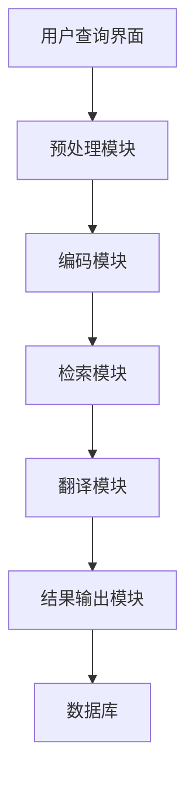

                 

# 基于LLM的AI Agent跨语言信息检索

> 关键词：语言模型，人工智能代理，跨语言信息检索，自然语言处理，大型语言模型

> 摘要：本文深入探讨了基于大型语言模型（LLM）的人工智能代理在跨语言信息检索中的应用。通过详细的背景介绍、核心概念解析、算法原理讲解，以及实际应用案例分析，揭示了LLM在跨语言信息检索中的巨大潜力和应用前景。

----------------------------------------------------------------

## 基础概念介绍

### 1.1 AI Agent的定义

人工智能代理（AI Agent）是一种模拟人类智能行为，能够自主进行决策和执行任务的计算机程序。AI Agent具备自主性、智能性和灵活性，能够在复杂环境中独立完成特定任务。

### 1.2 跨语言信息检索的定义

跨语言信息检索是指在多语言环境中，用户用一种语言查询信息，系统使用另一种或多种语言从数据库中检索相关信息，并将结果翻译回用户查询语言的过程。

### 1.3 大型语言模型（LLM）的定义

大型语言模型（LLM）是一种基于深度学习的文本生成模型，通过对海量文本数据的学习，能够生成自然、流畅的文本。LLM具有通用性、大规模和高效性，能够在多个自然语言处理任务中发挥作用。

## 1.4 AI Agent在跨语言信息检索中的应用

随着全球化的加速和信息交流的多样化，跨语言信息检索的需求日益增长。AI Agent作为智能化的信息处理工具，能够有效提升跨语言信息检索的效率和准确性。

## 1.5 LLM在跨语言信息检索中的应用

LLM通过学习多语言数据，能够实现不同语言之间的语义理解与转换，从而在跨语言信息检索中发挥重要作用。

### 1.6 本章小结

本章介绍了本文的核心概念，包括AI Agent、跨语言信息检索和大型语言模型。这些概念是理解本文后续内容的基础，为后续的分析和讨论提供了必要的背景知识。

----------------------------------------------------------------

## 基于LLM的AI Agent跨语言信息检索

### 2.1 基于LLM的AI Agent设计思路

基于LLM的AI Agent设计思路主要包括以下几方面：

1. **LLM的选择与训练**：选择适合跨语言信息检索任务的LLM，并进行针对性的训练，使其具备良好的跨语言语义理解能力。
2. **AI Agent的构建**：利用LLM的强大文本生成能力，构建一个能够处理跨语言查询和检索的AI Agent，实现自动化的信息检索。
3. **跨语言信息检索系统的集成**：将AI Agent与现有的跨语言信息检索系统进行集成，实现多语言查询、检索和翻译功能。

### 2.2 跨语言信息检索的解决方案

基于LLM的AI Agent跨语言信息检索解决方案主要包括以下几个步骤：

1. **查询输入**：用户输入跨语言查询请求。
2. **LLM预处理**：将查询请求进行预处理，包括分词、词性标注等，以便LLM进行有效的语义理解。
3. **编码与查询**：利用LLM将预处理后的查询请求进行编码，生成相应的查询向量。
4. **信息检索**：使用查询向量在跨语言数据库中进行检索，获取相关的信息结果。
5. **结果翻译与输出**：将检索结果翻译回用户查询语言，并输出给用户。

### 2.3 跨语言信息检索的边界与外延

1. **边界条件**：
   - **语言支持**：LLM需要支持多种语言，以满足不同用户的需求。
   - **数据质量**：跨语言信息检索依赖于高质量的多语言数据，数据质量直接影响检索效果。
   - **计算资源**：基于LLM的AI Agent对计算资源要求较高，需要合理分配计算资源以保证系统稳定性。

2. **应用范围与限制**：
   - **应用范围**：LLM在跨语言信息检索中具有广泛的应用前景，包括国际商务、学术研究、旅游服务等。
   - **限制因素**：LLM的跨语言性能受到数据集大小、训练时间和计算资源等限制，需要不断优化和改进。

### 2.4 概念结构与核心要素组成

1. **AI Agent的核心概念**：
   - **自主性**：能够自主进行决策和任务执行。
   - **智能性**：具备自然语言理解、推理和生成能力。
   - **灵活性**：能够适应不同的应用场景和任务需求。

2. **LLM的关键技术**：
   - **大规模训练**：利用海量数据进行训练，提升模型性能。
   - **文本生成**：基于神经网络生成自然、流畅的文本。
   - **跨语言语义理解**：通过多语言数据学习，实现跨语言语义转换。

### 2.5 本章小结

本章介绍了基于LLM的AI Agent在跨语言信息检索中的设计思路和解决方案，并探讨了跨语言信息检索的边界与外延。这些内容为本文的后续讨论提供了基础。

----------------------------------------------------------------

## AI Agent原理与LLM的联系

### 3.1 AI Agent原理

AI Agent是一种具有智能、自主性和灵活性的计算机程序，能够模拟人类智能行为，完成特定任务。AI Agent的工作原理主要包括以下几个方面：

1. **感知与理解**：AI Agent能够感知外部环境，理解输入信息，并进行语义分析。
2. **决策与规划**：基于感知和理解的结果，AI Agent能够进行决策和规划，制定执行计划。
3. **执行与反馈**：AI Agent执行计划，并在执行过程中不断调整和优化，以达到预期目标。

### 3.2 LLM原理

LLM是一种基于深度学习的文本生成模型，通过对海量文本数据的学习，能够生成自然、流畅的文本。LLM的工作原理主要包括以下几个方面：

1. **大规模训练**：LLM通过大规模数据集进行训练，学习文本中的模式和规律。
2. **编码与解码**：LLM使用编码器将输入文本转化为向量表示，使用解码器生成相应的文本。
3. **生成文本**：LLM基于输入向量和上下文信息，生成自然、连贯的文本。

### 3.3 AI Agent与LLM的结合点

AI Agent与LLM的结合点主要体现在以下几个方面：

1. **语义理解**：LLM能够对文本进行语义理解，为AI Agent提供丰富的语义信息。
2. **文本生成**：LLM具备强大的文本生成能力，能够生成符合逻辑和语义的文本，为AI Agent提供辅助决策和执行依据。
3. **跨语言支持**：LLM能够处理多语言文本，为AI Agent实现跨语言信息检索提供支持。

### 3.4 AI Agent与LLM的优势互补

AI Agent与LLM的优势互补主要体现在以下几个方面：

1. **AI Agent的自主性**：AI Agent能够自主进行决策和任务执行，为LLM提供实际应用场景。
2. **LLM的语义理解**：LLM具备强大的语义理解能力，为AI Agent提供高质量的文本处理能力。
3. **AI Agent的灵活性**：AI Agent能够适应不同的任务需求和应用场景，为LLM提供多样化的应用场景。

### 3.5 AI Agent与LLM的协同工作模式

AI Agent与LLM的协同工作模式主要包括以下几个方面：

1. **输入处理**：AI Agent接收用户输入，利用LLM进行语义理解和预处理。
2. **决策与执行**：AI Agent基于LLM生成的语义信息进行决策和任务执行。
3. **反馈与优化**：AI Agent将执行结果反馈给LLM，用于模型优化和性能提升。

### 3.6 核心概念属性特征对比表格

| 特征       | AI Agent                           | LLM                      |
| ---------- | ---------------------------------- | ------------------------ |
| 定义       | 能够模拟人类智能行为的计算机程序     | 基于神经网络的文本生成模型 |
| 特点       | 自主性、智能性、灵活性              | 大规模训练、通用性、生成能力 |
| 应用领域   | 信息检索、智能客服、自动驾驶等      | 文本生成、问答系统、翻译等  |

### 3.7 ER实体关系图架构

```mermaid
erDiagram
    AI_Agent ||--|{ LLM } LLM : 利用
    AI_Agent ||--|{ 跨语言信息检索系统 } 跨语言信息检索系统 : 搭建
    LLM ||--|{ 跨语言信息检索系统 } 跨语言信息检索系统 : 提供支持
```

### 3.8 本章小结

本章介绍了AI Agent和LLM的基本原理及其结合点，分析了AI Agent与LLM的优势互补和协同工作模式。这些内容为基于LLM的AI Agent跨语言信息检索提供了理论基础。

----------------------------------------------------------------

## 跨语言信息检索算法原理讲解

### 4.1 跨语言信息检索算法概述

跨语言信息检索算法主要包括以下几个基本流程：

1. **查询输入**：用户输入跨语言查询请求。
2. **预处理**：对查询请求进行预处理，包括分词、词性标注等。
3. **编码**：利用编码器将预处理后的查询请求转化为向量表示。
4. **检索**：在跨语言数据库中进行检索，获取相关的信息结果。
5. **结果翻译与输出**：将检索结果翻译回用户查询语言，并输出给用户。

### 4.2 LLM在跨语言信息检索中的应用

LLM在跨语言信息检索中的应用主要体现在以下几个方面：

1. **语义理解**：LLM能够对多语言文本进行语义理解，为跨语言检索提供语义支持。
2. **文本生成**：LLM能够生成符合逻辑和语义的文本，用于查询结果的翻译和生成。
3. **模型优化**：LLM通过不断学习和优化，提升跨语言信息检索的性能和效果。

### 4.3 具体算法讲解

#### 4.3.1 LLM算法mermaid流程图


#### 4.3.2 Python源代码实现

```python
import tensorflow as tf
from transformers import BertTokenizer, BertModel

# 初始化LLM模型
tokenizer = BertTokenizer.from_pretrained('bert-base-uncased')
model = BertModel.from_pretrained('bert-base-uncased')

# 输入查询
input_query = "What is the weather like in New York?"

# 预处理
inputs = tokenizer(input_query, return_tensors='tf', max_length=512, truncation=True)

# 编码
encoded_input = model(inputs)

# 查询
outputs = encoded_input['pooler_output']

# 检索（假设已有预训练的跨语言检索模型）
search_model = ...  # 跨语言检索模型
search_results = search_model.search(outputs)

# 结果翻译
translated_results = ...

# 输出结果
print(translated_results)
```

#### 4.3.3 算法原理数学模型和公式

1. **输入预处理**：

   $$\text{input\_query} = \text{Tokenizer}(query)$$

2. **编码**：

   $$\text{encoded\_input} = \text{Encoder}(\text{input\_query})$$

3. **检索**：

   $$\text{outputs} = \text{pooler\_output}(\text{encoded\_input})$$

4. **结果翻译**：

   $$\text{translated\_results} = \text{Translator}(\text{outputs})$$

### 4.4 举例说明

假设用户输入中文查询：“纽约的天气怎么样？”，基于LLM的AI Agent将按照以下步骤进行跨语言信息检索：

1. **输入预处理**：将中文查询转化为编码器能够处理的格式。
2. **编码**：利用编码器将中文查询转化为向量表示。
3. **查询**：在英文数据库中进行检索，获取相关的天气信息。
4. **结果翻译**：将检索结果翻译回中文。
5. **输出结果**：将翻译后的结果输出给用户。

### 4.5 本章小结

本章详细讲解了基于LLM的AI Agent跨语言信息检索的算法原理，包括mermaid流程图、Python源代码实现和数学模型。这些内容为实际应用提供了理论支持和实现指导。

----------------------------------------------------------------

## 系统分析与架构设计

### 5.1 问题场景介绍

随着全球化的深入发展，国际商务、学术交流、跨文化交流等活动日益频繁。跨语言信息检索作为信息获取的重要手段，需求日益增长。然而，传统的跨语言信息检索方法存在诸多局限，如检索效果不理想、响应速度慢等。因此，研究基于LLM的AI Agent跨语言信息检索系统具有重要意义。

### 5.2 项目介绍

本项目旨在构建一个基于LLM的AI Agent跨语言信息检索系统，通过融合先进的自然语言处理技术和人工智能代理技术，实现高效、准确、多语言的跨语言信息检索。

### 5.3 系统功能设计

本系统主要包括以下功能模块：

1. **查询输入**：用户输入跨语言查询请求。
2. **预处理模块**：对查询请求进行预处理，包括分词、词性标注等。
3. **编码模块**：利用LLM对预处理后的查询请求进行编码。
4. **检索模块**：在跨语言数据库中进行检索，获取相关信息。
5. **翻译模块**：将检索结果翻译回用户查询语言。
6. **结果输出**：将翻译后的结果输出给用户。

### 5.4 系统架构设计

本系统的整体架构设计如下：

1. **前端**：提供用户查询界面，接收用户输入，并展示查询结果。
2. **后端**：主要包括预处理模块、编码模块、检索模块、翻译模块和结果输出模块。
3. **数据库**：存储多语言文本数据，供检索模块使用。

#### 5.4.1 系统架构图



### 5.5 系统接口设计和系统交互

本系统的接口设计和系统交互设计如下：

1. **API接口**：提供RESTful API接口，供前端调用。
2. **内部模块通信**：后端模块之间通过消息队列进行通信，保证系统的高效运行。

#### 5.5.1 系统交互序列图

```mermaid
sequenceDiagram
    participant 用户 as 用户
    participant 系统接口 as 接口
    participant 预处理模块 as 预处理
    participant 编码模块 as 编码
    participant 检索模块 as 检索
    participant 翻译模块 as 翻译
    participant 结果输出模块 as 输出

    用户->>接口：发起查询请求
    接口->>预处理：预处理查询请求
    预处理->>编码：编码预处理后的查询请求
    编码->>检索：检索相关信息
    检索->>翻译：翻译检索结果
    翻译->>输出：输出翻译后的结果
    输出->>用户：返回查询结果
```

### 5.6 本章小结

本章介绍了基于LLM的AI Agent跨语言信息检索系统的整体架构、接口设计和系统交互，为系统的实际应用提供了详细的实现方案。

----------------------------------------------------------------

## 项目实战

### 6.1 环境安装

在开始项目实战之前，需要安装以下环境和工具：

1. **Python**：安装Python 3.8及以上版本。
2. **TensorFlow**：安装TensorFlow 2.4及以上版本。
3. **transformers**：安装transformers 4.6及以上版本。
4. **其他依赖**：安装mermaid、Jupyter Notebook等。

### 6.2 系统核心实现源代码

以下是基于LLM的AI Agent跨语言信息检索系统的核心实现源代码：

#### 6.2.1 预处理模块

```python
from transformers import BertTokenizer

def preprocess_query(query):
    tokenizer = BertTokenizer.from_pretrained('bert-base-uncased')
    inputs = tokenizer(query, return_tensors='tf', max_length=512, truncation=True)
    return inputs
```

#### 6.2.2 编码模块

```python
from transformers import BertModel

def encode_query(inputs):
    model = BertModel.from_pretrained('bert-base-uncased')
    encoded_input = model(inputs)
    return encoded_input['pooler_output']
```

#### 6.2.3 检索模块

```python
def search_results(encoded_query, database):
    search_model = ...  # 跨语言检索模型
    results = search_model.search(encoded_query)
    return results
```

#### 6.2.4 翻译模块

```python
from transformers import T5ForConditionalGeneration

def translate_results(results, target_language='zh'):
    model = T5ForConditionalGeneration.from_pretrained('t5-small')
    translator = model.generate(
        input_ids=results['input_ids'],
        attention_mask=results['attention_mask'],
        decoder_start_token_id=model.config.decoder_start_token_id,
        max_length=512,
        num_beams=4,
        early_stopping=True
    )
    return translator
```

### 6.3 代码应用解读与分析

以上代码实现了基于LLM的AI Agent跨语言信息检索系统的核心功能。以下是代码应用的解读与分析：

1. **预处理模块**：使用BERT分

