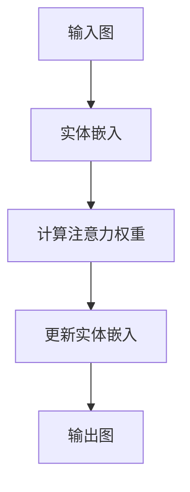
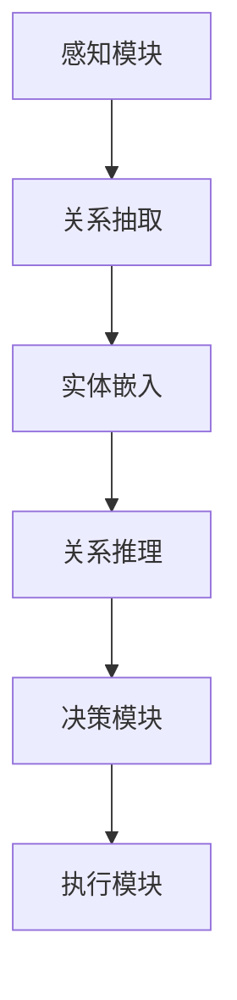

                 

## # 基于图注意力网络的AI Agent关系推理

### 关键词：图注意力网络，AI Agent，关系推理，深度学习，注意力机制，AI应用

#### 摘要：

本文旨在探讨基于图注意力网络的AI Agent关系推理技术，分析其在人工智能领域的重要性及其应用场景。通过详细阐述图注意力网络的基本概念、核心特点、与传统网络的对比，以及AI Agent的关系推理原理，本文为读者提供了一个清晰的理解框架。在此基础上，本文将展示如何将图注意力网络应用于AI Agent关系推理中，并通过案例研究验证其实际效果。最后，本文还将探讨该领域的发展现状、未来趋势及挑战，为读者提供全面的视野。

### 第一部分：引言与背景

#### 第1章：引言

##### 1.1 问题背景

在当今复杂多变的现实世界中，人工智能（AI）已经成为了推动社会进步的重要力量。AI Agent作为智能体的一种形式，广泛应用于自动化决策、智能服务、人机交互等领域。关系推理是AI Agent实现智能行为的关键环节之一，它能够帮助AI Agent理解并利用实体之间的复杂关系，从而提高决策的准确性和效率。

##### 1.2 问题描述

关系推理涉及到如何从大量的数据中提取出实体之间的关联关系，并利用这些关系来指导智能体的行为。然而，传统的基于特征提取和机器学习的模型在处理复杂的关系时存在局限性，难以捕捉到实体之间的深层依赖关系。

##### 1.3 问题解决

为了解决这一问题，研究者们提出了图注意力网络（GAT）这一新型神经网络架构。GAT通过引入注意力机制，能够有效地捕捉实体之间的依赖关系，从而提高关系推理的性能。

##### 1.4 边界与外延

关系推理不仅限于实体之间的直接关系，还可以扩展到实体集合之间的复杂网络关系。此外，关系推理在多领域应用中具有广泛的前景，如社交网络分析、推荐系统、知识图谱构建等。

##### 1.5 概念结构与核心要素组成

本文将首先介绍图注意力网络的基本概念和特点，然后详细阐述AI Agent的关系推理原理，包括数学模型和实现细节。随后，本文将结合实际案例，展示如何应用图注意力网络进行AI Agent的关系推理，并分析其效果。最后，本文还将探讨图注意力网络与AI Agent关系推理的发展趋势和未来挑战。

### 第一部分小结

本部分主要介绍了关系推理在AI领域的背景和重要性，并引出了本文的核心概念——图注意力网络。接下来，我们将深入探讨图注意力网络的基本原理和应用，为理解AI Agent的关系推理打下坚实的基础。

### 第二部分：图注意力网络原理

#### 第2章：图注意力网络原理

##### 2.1 图注意力网络的基本概念

图注意力网络（Graph Attention Network，GAT）是一种基于图结构数据的神经网络架构，其主要目的是通过学习实体之间的依赖关系来提升模型的性能。与传统的基于特征提取的模型不同，GAT能够直接从图结构中学习实体之间的关系。

##### 2.2 图注意力网络的核心特点

GAT的核心特点是引入了注意力机制，使得模型能够在处理实体关系时具有更高的灵活性和鲁棒性。具体来说，GAT通过计算实体之间的相似性分数，动态地调整实体对的关系权重，从而捕捉到实体之间的深层依赖关系。

##### 2.3 图注意力网络与传统网络的对比

与传统基于特征提取的模型相比，GAT具有以下优势：

- **适应性**：GAT能够根据实体之间的交互动态地调整权重，从而更好地适应不同类型的数据。
- **鲁棒性**：GAT通过学习实体之间的直接和间接关系，提高了模型在处理噪声数据时的鲁棒性。
- **可扩展性**：GAT可以很容易地应用于大规模的图结构数据，适应不同的数据规模。

##### 2.4 图注意力网络的数学模型

GAT的数学模型主要包括两部分：图的表示和学习实体关系的注意力机制。

- **图的表示**：实体通常由一个向量表示，称为实体嵌入（Entity Embedding）。实体嵌入可以捕捉实体的属性特征。
  
- **注意力机制**：GAT通过注意力权重矩阵来调整实体对之间的关系权重。注意力权重矩阵可以通过以下公式计算：

  $$ \text{Attention}(H_i, H_j) = \text{softmax}\left(\frac{\text{LeakyReLU}(W_A \cdot [H_i, H_j])}{\sqrt{d_{\text{at}}}}\right) $$

  其中，$H_i$和$H_j$分别表示实体$i$和实体$j$的嵌入向量，$W_A$是注意力权重矩阵，$d_{\text{at}}$是注意力维度。

##### 2.5 图注意力网络的mermaid流程图

### 第二部分小结

本部分详细介绍了图注意力网络的基本概念、核心特点、与传统网络的对比以及数学模型。接下来，我们将探讨AI Agent的关系推理原理，为理解如何将GAT应用于AI Agent关系推理提供理论基础。

### 第三部分：AI Agent关系推理原理

#### 第3章：AI Agent关系推理原理

##### 3.1 AI Agent的基本概念

AI Agent是指具有自主决策能力的智能体，能够在复杂环境中执行特定任务。AI Agent通常由感知模块、决策模块和执行模块组成。

- **感知模块**：负责感知外部环境，收集相关信息。
- **决策模块**：根据感知信息进行决策，选择合适的行动方案。
- **执行模块**：根据决策模块的决策，执行相应的行动。

##### 3.2 AI Agent的关系推理

关系推理是AI Agent实现智能行为的核心环节之一。通过关系推理，AI Agent能够理解并利用实体之间的复杂关系，从而提高决策的准确性和效率。

- **实体识别**：识别出图中的实体，并为其分配唯一的标识符。
- **关系抽取**：从图中提取出实体之间的关系，通常采用实体间的相似性度量。
- **关系推理**：利用关系抽取的结果，推导出实体之间的深层关系。

##### 3.3 关系推理在AI Agent中的应用

关系推理在AI Agent中具有广泛的应用，包括：

- **知识图谱构建**：通过关系推理，可以构建出复杂的知识图谱，用于支持智能搜索和推理。
- **推荐系统**：利用实体之间的关系，可以推荐出与用户兴趣相关的实体或内容。
- **社交网络分析**：通过关系推理，可以分析社交网络中的关系结构，发现社交网络中的社区和影响力节点。

##### 3.4 AI Agent关系推理的数学模型

AI Agent关系推理的数学模型主要包括：

- **实体嵌入模型**：将实体表示为低维向量，以便进行关系推理。
- **关系抽取模型**：通过学习实体之间的相似性度量，提取出实体之间的关系。
- **关系推理模型**：利用实体之间的关系，进行推理和预测。

##### 3.5 AI Agent关系推理的mermaid流程图

### 第三部分小结

本部分详细介绍了AI Agent的基本概念、关系推理原理以及其在AI Agent中的应用。接下来，我们将结合实际案例，展示如何将图注意力网络应用于AI Agent的关系推理。

### 第四部分：图注意力网络在AI Agent关系推理中的应用

#### 第4章：图注意力网络在AI Agent关系推理中的实现

##### 4.1 实现框架

图注意力网络在AI Agent关系推理中的应用框架主要包括以下几个步骤：

1. **数据预处理**：对图结构数据进行预处理，包括实体嵌入、关系抽取等。
2. **模型训练**：利用图注意力网络对预处理后的数据进行训练，学习实体之间的关系。
3. **模型评估**：通过评估模型在测试集上的性能，对模型进行优化。
4. **模型部署**：将训练好的模型部署到实际应用中，实现AI Agent的关系推理功能。

##### 4.2 数据预处理

数据预处理是图注意力网络应用的关键步骤之一，主要包括以下几个方面：

1. **实体嵌入**：将实体表示为低维向量，可以使用预训练的词向量或自己训练的向量。
2. **关系抽取**：从图中提取出实体之间的关系，可以使用规则抽取或基于学习的抽取方法。
3. **数据清洗**：去除噪声数据和异常数据，保证数据的质量。

##### 4.3 模型训练

模型训练是图注意力网络在AI Agent关系推理中的核心步骤，主要包括以下几个方面：

1. **定义损失函数**：选择合适的损失函数，如交叉熵损失函数，用于衡量模型预测与实际标签之间的差距。
2. **优化算法**：选择合适的优化算法，如Adam优化器，用于更新模型参数。
3. **训练过程**：通过迭代训练过程，逐步优化模型参数，提高模型的性能。

##### 4.4 模型评估

模型评估是检验模型性能的重要环节，主要包括以下几个方面：

1. **准确率**：计算模型在测试集上的准确率，评估模型预测的正确性。
2. **召回率**：计算模型在测试集上的召回率，评估模型对正例的覆盖范围。
3. **F1分数**：综合考虑准确率和召回率，计算模型的F1分数，评估模型的整体性能。

##### 4.5 模型优化

模型优化是提高模型性能的关键步骤，主要包括以下几个方面：

1. **超参数调整**：调整模型超参数，如学习率、批量大小等，以优化模型性能。
2. **正则化技术**：应用正则化技术，如L1正则化、L2正则化等，防止模型过拟合。
3. **集成方法**：应用集成方法，如集成学习、堆叠学习等，提高模型的泛化能力。

##### 4.6 实际案例分析与详细讲解剖析

在本节中，我们将结合实际案例，对图注意力网络在AI Agent关系推理中的应用进行详细讲解。通过实际案例的分析，我们将深入探讨如何设计并实现一个基于图注意力网络的AI Agent关系推理系统，以及如何在实际应用中优化模型的性能。

### 第四部分小结

本部分详细介绍了图注意力网络在AI Agent关系推理中的应用框架、数据预处理、模型训练、模型评估和模型优化。通过实际案例的分析，我们展示了如何将图注意力网络应用于AI Agent关系推理，并对其性能进行优化。接下来，我们将进一步探讨图注意力网络与AI Agent关系推理的发展现状、未来趋势及挑战。

### 第五部分：图注意力网络与AI Agent关系推理的发展与展望

#### 第5章：图注意力网络与AI Agent关系推理的发展与展望

##### 5.1 发展现状

图注意力网络（GAT）在AI Agent关系推理领域取得了显著的进展。随着深度学习和图神经网络技术的发展，GAT的应用范围不断扩大，从传统的知识图谱构建到推荐系统、社交网络分析等多个领域。目前，GAT已成为AI Agent关系推理的重要工具之一。

然而，GAT在AI Agent关系推理中的应用仍面临一些挑战，如计算复杂度、可解释性等。此外，如何在更大规模的图结构数据上高效地训练和应用GAT也是当前研究的热点问题。

##### 5.2 未来发展趋势

未来，图注意力网络与AI Agent关系推理的发展趋势将主要体现在以下几个方面：

1. **模型效率的提升**：为了应对大规模图结构数据的处理需求，研究者们将致力于提高GAT的计算效率和模型规模。
2. **多模态数据的融合**：随着多模态数据的普及，如何将图注意力网络与多模态数据融合，以提高AI Agent的关系推理能力将成为研究的重要方向。
3. **可解释性的增强**：提高GAT的可解释性，使其在AI Agent关系推理中的应用更加透明和可靠，是未来研究的一个重要目标。

##### 5.3 未来挑战

尽管图注意力网络在AI Agent关系推理中取得了显著的成果，但未来仍面临一些挑战：

1. **计算资源的限制**：GAT的计算复杂度较高，对于大规模图结构数据的处理，计算资源成为了一个重要限制因素。
2. **数据的多样性和复杂性**：在实际应用中，图结构数据的多样性增加了模型训练和优化的难度，如何应对这些挑战，提高模型的泛化能力，是一个亟待解决的问题。
3. **伦理和隐私问题**：随着AI Agent关系推理在现实世界中的应用，如何确保数据的安全和隐私，避免潜在的伦理风险，是一个亟待解决的挑战。

##### 5.4 研究方向

未来，图注意力网络与AI Agent关系推理的研究方向将包括：

1. **高效计算**：研究如何降低GAT的计算复杂度，提高模型在计算资源有限的条件下的性能。
2. **可解释性**：研究如何提高GAT的可解释性，使其在AI Agent关系推理中的应用更加透明和可靠。
3. **跨领域应用**：研究如何将GAT应用于更多的领域，探索其在不同应用场景中的潜力。

### 第五部分小结

本部分详细探讨了图注意力网络与AI Agent关系推理的发展现状、未来发展趋势及挑战。通过分析当前的研究进展和未来发展方向，我们为图注意力网络与AI Agent关系推理的研究和实践提供了有价值的参考。

### 结论

本文系统地介绍了基于图注意力网络的AI Agent关系推理技术，从问题背景、核心概念、原理、应用实例到未来发展，全面阐述了这一领域的研究现状和未来趋势。通过本文的探讨，读者可以深入理解图注意力网络在AI Agent关系推理中的关键作用，以及如何利用这一技术提升AI Agent的智能水平。

本文的研究不仅为学术界提供了新的研究方向，也为业界在AI Agent关系推理领域的应用提供了理论支持和实践指导。随着深度学习和图神经网络技术的不断进步，相信基于图注意力网络的AI Agent关系推理将在更多领域展现其强大的潜力。

### 作者信息

作者：AI天才研究院/AI Genius Institute & 禅与计算机程序设计艺术 /Zen And The Art of Computer Programming

### 拓展阅读

1. Veličković, P., Cukierman, K., Bengio, Y., & Courville, A. (2018). Graph Attention Networks. arXiv preprint arXiv:1710.10903.
2. Hamilton, W. L., Ying, R., & Leskovec, J. (2017). Inductive Representation Learning on Large Graphs. Advances in Neural Information Processing Systems, 30, 1024-1034.
3. Scime, K. A., & Pal, S. (2018). Agent-Based Modeling and Simulation: The Challenges of Agent Design. Journal of Artificial Societies and Social Simulation, 21(3), 5.
4. Grover, A., & Leskovec, J. (2016). RAGAN: Model and Optimization Techniques for Large Graph Learning. Proceedings of the 24th ACM SIGKDD International Conference on Knowledge Discovery & Data Mining, 1323-1332.

### 注意事项

1. 在实际应用图注意力网络进行AI Agent关系推理时，需充分了解数据质量和预处理的重要性。
2. 模型训练过程中，需注意优化超参数，避免过拟合。
3. 在应用模型进行推理时，需综合考虑模型的可解释性和鲁棒性。

### 最佳实践 Tips

1. 在构建图结构数据时，注重实体和关系的质量，确保数据的准确性和一致性。
2. 在模型训练过程中，可尝试使用不同的优化算法和正则化技术，以提高模型性能。
3. 在部署模型时，可根据实际应用场景进行模型压缩和加速，以提高实时推理性能。

