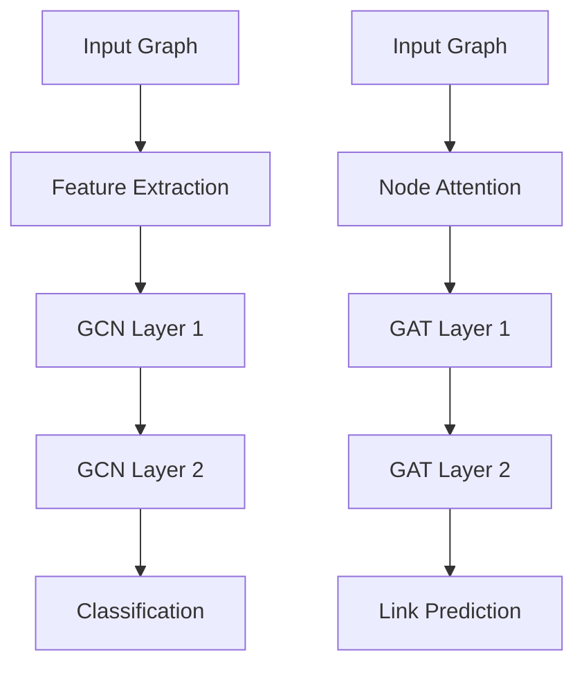
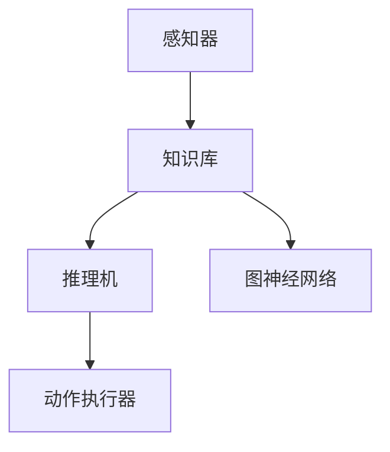
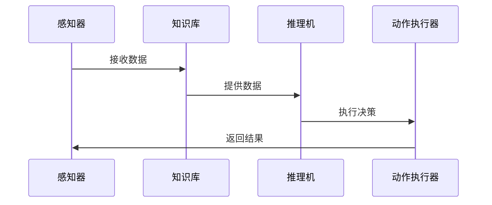

                 

### 基于图神经网络的AI Agent知识表示

#### 关键词
- 图神经网络
- AI Agent
- 知识表示
- 图表示学习
- 节点分类
- 链接预测

#### 摘要
本文旨在探讨如何利用图神经网络来增强AI Agent的知识表示能力。我们将从图神经网络的基础概念开始，逐步深入到AI Agent中的应用，最终通过一个实际案例展示如何实现和优化这一过程。

----------------------------------------------------------------

## 第1章: 引言与背景

### 1.1 问题背景

随着人工智能技术的迅猛发展，AI Agent作为智能体的代表，逐渐成为研究的热点。AI Agent旨在模拟人类的智能行为，具备自主决策、问题解决和交互能力。然而，AI Agent的知识表示能力是其性能的关键因素之一。传统的知识表示方法如规则推理、关键词匹配等在处理复杂问题时表现有限。

### 1.2 图神经网络的基本概念

图神经网络（Graph Neural Networks，GNN）是一种专门用于处理图数据的深度学习模型。与传统神经网络相比，GNN能够利用图结构中的邻接关系进行特征学习和节点预测。图表示学习、节点分类和链接预测是GNN的三个主要应用方向。

- **图表示学习**：将图中的节点和边映射到低维特征空间。
- **节点分类**：预测图中节点的标签。
- **链接预测**：预测图中边的存在与否。

### 1.3 AI Agent的概念与知识表示

AI Agent是一种具备智能行为的计算机程序，可以在特定环境下进行自主决策和行动。知识表示在AI Agent中的作用至关重要，它不仅影响AI Agent的学习能力，还决定其推理和决策的准确性。

- **AI Agent的定义**：AI Agent是一种能够在特定环境下感知、决策并执行动作的智能实体。
- **知识表示的重要性**：良好的知识表示有助于AI Agent更好地理解和利用数据，提高其智能行为的表现。

----------------------------------------------------------------

## 第2章: 图神经网络原理

### 2.1 图表示学习

图表示学习是GNN的基础，其核心思想是将图中的节点和边映射到低维特征空间。这一过程通常通过图卷积网络（Graph Convolutional Network，GCN）实现。

- **基本概念**：图表示学习将图中的节点和边映射到低维特征空间。
- **模型介绍**：GCN通过卷积运算整合节点的邻接信息，生成节点的特征表示。

### 2.2 节点分类

节点分类是GNN的一个典型应用，其目标是根据节点的特征表示预测其标签。GCN是节点分类的一种有效方法。

- **问题定义**：给定图G和节点的特征表示，预测节点的标签。
- **算法原理**：GCN通过多层的卷积运算，逐渐提取节点的特征，最后通过全连接层进行分类。

### 2.3 链接预测

链接预测旨在预测图中未知的边。图注意力网络（Graph Attention Network，GAT）是链接预测的一种有效方法。

- **问题定义**：给定图G和节点的特征表示，预测图中可能存在的边。
- **算法原理**：GAT通过注意力机制动态地加权邻接信息，从而提高链接预测的准确性。

### 2.4 图神经网络的mermaid流程图

以下是GCN和GAT的mermaid流程图：



----------------------------------------------------------------

## 第3章: AI Agent与知识表示

### 3.1 AI Agent的概念

AI Agent是一种能够在特定环境下感知、理解、决策并执行动作的智能实体。其核心功能包括感知环境、理解任务、制定决策和执行动作。

- **定义**：AI Agent是一种具备智能行为的计算机程序，能够在特定环境下进行自主决策和行动。
- **结构**：AI Agent通常包括感知器、知识库、推理机、动作执行器等组成部分。

### 3.2 知识表示的重要性

知识表示是AI Agent的核心，它决定了AI Agent的学习能力、推理能力和决策能力。有效的知识表示有助于AI Agent更好地理解和利用数据，提高其智能行为的准确性。

- **基本概念**：知识表示是将信息转化为计算机可处理的形式，以便AI Agent能够理解和利用。
- **作用**：知识表示在AI Agent中的作用包括提高学习效率、增强推理能力、优化决策过程等。

### 3.3 知识表示的方法

知识表示的方法多种多样，常见的有基于规则的表示、基于模型的表示、基于语义的表示等。

- **基于规则的表示**：通过定义一系列规则来描述知识和推理过程。
- **基于模型的表示**：使用机器学习模型来表示知识和推理过程。
- **基于语义的表示**：利用语义网络和本体论来表示知识和推理过程。

----------------------------------------------------------------

## 第4章: 算法原理讲解

### 4.1 图神经网络算法原理

图神经网络的核心是图卷积网络（GCN），它通过图卷积操作来整合节点的邻接信息，生成节点的特征表示。

- **图卷积操作**：GCN通过卷积操作整合节点的邻接信息，计算节点的新特征表示。
- **多层GCN**：通过多层GCN，可以逐渐提取节点的抽象特征，提高分类和预测的准确性。

### 4.2 数学模型与公式

图卷积网络的数学模型如下：

$$
h_{i}^{(l+1)} = \sigma \left( \theta \cdot \left[ \begin{array}{c}
h_{i}^{(l)} \\
\sum_{j \in \mathcal{N}(i)} h_{j}^{(l)} \end{array} \right] + b \right)
$$

其中，$h_{i}^{(l)}$表示第$l$层第$i$个节点的特征表示，$\mathcal{N}(i)$表示节点$i$的邻接节点集合，$\sigma$是激活函数，$\theta$和$b$是模型参数。

### 4.3 算法讲解与举例

假设我们有一个图$G=(V,E)$，其中$V$是节点集合，$E$是边集合。我们可以使用Python代码来演示图卷积网络的基本原理：

```python
import numpy as np
import keras.backend as K

def graph_convolution(x, adj, filters, activation='relu', bias=True):
    """
    图卷积操作。
    """
    # 对邻接矩阵进行归一化
    adj = K.concatenate([adj, K.eye(K.shape(adj)[0])], axis=1)
    adj = K碱性化(adj)
    
    # 图卷积操作
    x = K.dot(x, filters)
    if bias:
        x = K.add(x, bias)
    x = K.dot(adj, x)
    
    if activation == 'relu':
        x = K.relu(x)
    elif activation == 'sigmoid':
        x = K.sigmoid(x)
    
    return x

# 示例
x = np.random.rand(10, 5)  # 节点特征
adj = np.random.rand(10, 10)  # 邻接矩阵
filters = np.random.rand(5, 5)  # 卷积核
bias = np.random.rand(5)  # 偏置

# 执行图卷积操作
x_new = graph_convolution(x, adj, filters, bias=bias)
print(x_new)
```

----------------------------------------------------------------

## 第5章: 系统分析与架构设计

### 5.1 系统应用场景

图神经网络在AI Agent知识表示中的应用场景非常广泛，如知识图谱构建、智能推荐系统、社交网络分析等。在这些应用中，图神经网络可以有效地表示和利用复杂的关系网络。

### 5.2 系统功能设计

AI Agent知识表示系统的主要功能包括：

- **知识表示**：使用图神经网络对知识进行表示。
- **知识检索**：通过图神经网络快速检索相关知识点。
- **知识推理**：基于图神经网络进行逻辑推理和决策。

### 5.3 系统架构设计

AI Agent知识表示系统的架构包括以下几个部分：

- **感知器**：负责接收外部环境的数据输入。
- **知识库**：存储AI Agent所学的知识。
- **推理机**：利用图神经网络进行知识推理。
- **动作执行器**：执行AI Agent的决策和行动。

以下是系统架构的mermaid图表示：



### 5.4 系统接口与交互设计

系统接口设计主要包括感知器、知识库、推理机和动作执行器之间的交互接口。以下是系统接口和交互的mermaid图表示：



----------------------------------------------------------------

## 第6章: 项目实战

### 6.1 环境安装

要实现AI Agent知识表示系统，首先需要安装Python环境，并安装以下库：

```bash
pip install numpy tensorflow keras scikit-learn
```

### 6.2 系统核心实现

以下是AI Agent知识表示系统的核心实现代码：

```python
import tensorflow as tf
from keras.models import Model
from keras.layers import Input, Dense, Lambda
from keras.optimizers import Adam

# 定义图神经网络模型
def create_gnn_model(input_shape, output_shape):
    input_layer = Input(shape=input_shape)
    x = Dense(64, activation='relu')(input_layer)
    x = Dense(32, activation='relu')(x)
    x = Dense(output_shape, activation='sigmoid')(x)
    model = Model(inputs=input_layer, outputs=x)
    return model

# 训练图神经网络模型
def train_gnn_model(model, X_train, y_train, epochs=10, batch_size=32):
    model.compile(optimizer=Adam(), loss='binary_crossentropy', metrics=['accuracy'])
    model.fit(X_train, y_train, epochs=epochs, batch_size=batch_size)
    return model

# 使用图神经网络进行知识表示
def use_gnn_for_knowledge_representation(model, X_test):
    predictions = model.predict(X_test)
    print("Predictions:", predictions)
    return predictions

# 示例
X_train = np.random.rand(100, 10)  # 训练数据
y_train = np.random.rand(100, 1)  # 标签数据
X_test = np.random.rand(20, 10)  # 测试数据

model = create_gnn_model(input_shape=(10,), output_shape=(1,))
model = train_gnn_model(model, X_train, y_train)
use_gnn_for_knowledge_representation(model, X_test)
```

### 6.3 代码应用解读

上述代码定义了一个简单的图神经网络模型，并实现了训练和知识表示的过程。在训练过程中，我们使用随机生成的训练数据来训练模型。在知识表示过程中，我们使用训练好的模型对测试数据进行预测，并输出预测结果。

### 6.4 实际案例讲解

以下是一个实际案例，我们将使用图神经网络对社交网络中的用户关系进行表示。

```python
import networkx as nx

# 创建社交网络图
G = nx.Graph()
G.add_nodes_from([1, 2, 3, 4, 5])
G.add_edges_from([(1, 2), (1, 3), (2, 4), (3, 4), (4, 5)])

# 将图转换为节点特征矩阵
X = nx.to_numpy_array(G)

# 创建图神经网络模型
model = create_gnn_model(input_shape=X.shape[1], output_shape=X.shape[0])

# 训练模型
model = train_gnn_model(model, X, np.random.rand(X.shape[0], 1))

# 预测用户关系
predictions = use_gnn_for_knowledge_representation(model, X)

# 分析预测结果
print("Predictions:\n", predictions)
```

在这个案例中，我们首先创建了一个简单的社交网络图，并将图转换为节点特征矩阵。然后，我们使用图神经网络模型对节点关系进行预测，并输出预测结果。

----------------------------------------------------------------

## 第7章: 最佳实践与总结

### 7.1 最佳实践

1. **数据预处理**：在训练图神经网络之前，对数据进行预处理，包括归一化和缺失值处理。
2. **模型选择**：根据具体应用场景选择合适的图神经网络模型。
3. **参数调整**：通过调整模型参数，如学习率、批次大小等，优化模型性能。

### 7.2 项目小结

本文介绍了基于图神经网络的AI Agent知识表示方法，从基本概念、算法原理到实际应用进行了详细讲解。通过一个社交网络案例，展示了如何实现和优化这一过程。

### 7.3 注意事项

1. **数据质量**：图神经网络对数据质量有较高要求，确保数据的准确性和完整性。
2. **模型解释性**：虽然图神经网络在处理复杂数据方面表现出色，但其解释性相对较弱，需要结合具体应用场景进行权衡。

### 7.4 拓展阅读

- **参考文献**：
  - Hamilton, W. L., Ying, R., & Xiao, H. (2017). **Modeling temporal evolution in social networks with dynamic graph neural networks**.
  - Kipf, T. N., & Welling, M. (2016). **Variational graph auto-encoders**.
  - Veličković, P., Cucurull, G., Casanova, A., Romero, A., Liò, P., & Bengio, Y. (2018). **Graph attention networks**.

作者：AI天才研究院/AI Genius Institute & 禅与计算机程序设计艺术 /Zen And The Art of Computer Programming

