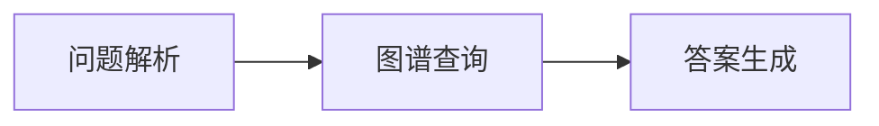
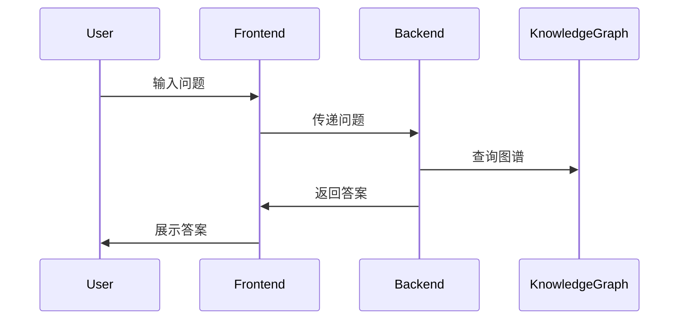
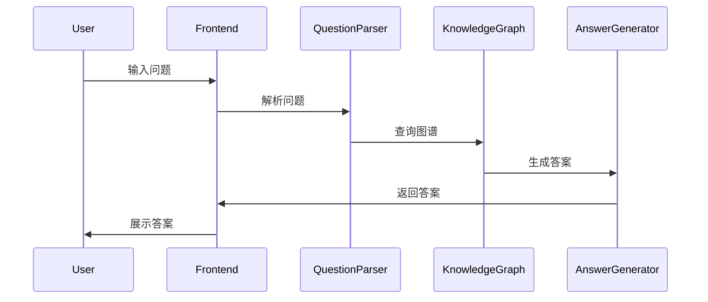

                 


### 基于图谱的AI Agent知识推理与问答

#### 摘要：

本文将探讨基于图谱的AI Agent知识推理与问答技术，旨在深入解析知识图谱在AI Agent中的应用。首先，我们将介绍AI Agent和知识图谱的基本概念，以及它们在AI领域中的重要作用。接着，我们将详细讲解知识推理的基本原理和算法，以及如何利用知识图谱进行有效的知识推理。此外，我们还将分析问答系统的原理和算法，展示如何通过知识图谱实现高效的问答功能。最后，我们将通过实际案例来剖析知识推理与问答系统的实现过程，总结最佳实践，并提出未来的研究方向。本文将为AI领域的研发人员提供有价值的参考。

#### 目录：

## 第一部分：背景介绍

### 第1章：问题背景

#### 1.1.1 问题背景

##### 1.1.1.1 人工智能与知识图谱的发展

人工智能（AI）是计算机科学的一个分支，旨在创建能够执行通常需要人类智能的任务的机器。自20世纪50年代以来，人工智能经历了多个发展阶段，包括符号主义、连接主义、统计学习等。知识图谱（Knowledge Graph）作为一种新兴的技术，近年来在人工智能领域取得了显著进展。知识图谱通过将现实世界中的知识以图谱的形式组织起来，为AI系统提供了丰富的语义信息，从而提高了AI系统的智能水平。

##### 1.1.1.2 AI Agent的定义与功能

AI Agent是指具有自主性、社交性、反应性、主动性和记忆性的智能体，能够在复杂的动态环境中进行推理、决策和问题求解。AI Agent在多个领域都有广泛的应用，如智能家居、智能客服、智能推荐等。然而，AI Agent在实际应用中面临的一个关键问题是如何有效地利用知识图谱进行知识推理和问答。

##### 1.1.1.3 知识图谱与AI Agent的关系

知识图谱为AI Agent提供了强大的语义支持，使得AI Agent能够更好地理解和处理自然语言。通过知识图谱，AI Agent可以获取领域知识，进行推理和决策，从而提高其智能水平。

#### 1.1.2 问题描述

在人工智能领域，随着大数据和计算能力的提升，知识图谱作为一种新兴的技术得到了广泛应用。知识图谱通过将现实世界中的知识以图谱的形式组织起来，为AI系统提供了丰富的语义信息，从而提高了AI系统的智能水平。

然而，AI Agent在实际应用中面临的一个关键问题是如何有效地利用知识图谱进行知识推理和问答。传统的基于规则的方法在处理复杂问题时存在局限性，而基于深度学习的方法则依赖于大量标注数据，难以应对开放域的问题。因此，如何构建一个基于图谱的AI Agent，使其能够高效地进行知识推理和问答，成为当前研究的一个热点问题。

#### 1.1.3 问题解决

为了解决这一问题，本文将从以下几个方面展开讨论：

1. **核心概念与联系**：介绍AI Agent和知识图谱的基本概念及其相互关系。
2. **知识推理**：讲解知识推理的基本原理和算法。
3. **问答系统**：分析问答系统的基本原理和算法。
4. **算法原理讲解**：深入讲解知识推理和问答系统的数学模型和算法流程。
5. **系统分析与架构设计**：探讨系统的整体架构设计。
6. **项目实战**：通过实际项目介绍系统的实现过程和案例分析。
7. **最佳实践与总结**：总结最佳实践，展望未来研究方向。

#### 1.1.4 边界与外延

本文主要关注基于图谱的AI Agent知识推理与问答，涉及的主要内容包括：

- 知识图谱的构建与维护
- 知识推理算法的设计与实现
- 问答系统的设计与优化
- 实际应用场景中的问题和挑战

## 第二部分：核心概念与联系

### 第2章：核心概念与联系

#### 2.1 AI Agent的定义

AI Agent是指具有自主性、社交性、反应性、主动性和记忆性的智能体，能够在复杂的动态环境中进行推理、决策和问题求解。AI Agent的核心功能包括：

1. **感知**：通过传感器获取环境信息。
2. **理解**：理解感知到的信息，提取出有用的知识。
3. **推理**：基于已有知识和环境信息进行逻辑推理。
4. **决策**：根据推理结果做出决策。
5. **行动**：执行决策，改变环境。

#### 2.2 图谱的原理

知识图谱是一种用于表示实体及其之间关系的图形化数据结构，它通过节点和边来表示实体和关系。知识图谱的主要特点包括：

1. **实体表示**：将现实世界中的各种实体（如人、地点、事物等）抽象为节点。
2. **关系表示**：表示实体之间的各种关系（如“属于”、“位于”、“创造”等）。
3. **属性表示**：为实体和关系添加属性，提供更多的语义信息。

知识图谱的基本构建流程包括：

1. **数据采集**：从各种数据源中提取实体和关系。
2. **实体抽取**：识别文本数据中的实体。
3. **关系抽取**：识别实体之间的语义关系。
4. **实体链接**：将同义词实体合并，实现实体统一标识。
5. **图谱构建**：将实体和关系组织成图谱结构。

#### 2.3 AI Agent与图谱的联系

AI Agent与知识图谱之间的联系主要体现在以下几个方面：

1. **知识获取**：AI Agent可以通过知识图谱获取领域知识，提高自身智能水平。
2. **推理支持**：知识图谱为AI Agent提供了丰富的语义信息，使其能够进行有效的知识推理。
3. **问答能力**：基于知识图谱的问答系统能够回答用户关于特定领域的问题。

#### 2.4 概念属性特征对比表格

| 概念       | 特征             | 说明                                                         |
| ---------- | ---------------- | ------------------------------------------------------------ |
| AI Agent   | 自主性、社交性   | 具有自主决策能力和社交互动能力，能够在复杂环境中进行问题求解   |
| 知识图谱   | 实体、关系、属性 | 通过节点和边表示实体及其之间关系，提供丰富的语义信息           |
| 知识推理   | 逻辑推理、模式匹配 | 基于知识图谱进行推理，提取隐含知识                             |
| 问答系统   | 自然语言处理、语义理解 | 基于知识图谱实现高效问答，回答用户问题                         |

#### 2.5 ER实体关系图架构

```mermaid
erDiagram
  Person ||--|{ Employee } Employee
  Employee ||--|{ WorksIn } Company
  Company ||--|{ Provides } Service
```

在这个ER实体关系图中，我们定义了四个实体：Person（人）、Employee（员工）、Company（公司）和Service（服务）。它们之间的关系包括：

1. Person与Employee之间是一对多的关系，即一个人可以有多种职业身份。
2. Employee与Company之间也是一对多的关系，即一个员工可以属于多家公司。
3. Company与Service之间也是一对多的关系，即一家公司可以提供多种服务。

## 第三部分：知识推理

### 第3章：知识推理

#### 3.1 知识推理的基本原理

知识推理是指基于已有知识进行推理，以发现新的知识或验证已有知识的过程。知识推理是人工智能领域的重要研究方向，它在很多应用场景中发挥着关键作用。

知识推理的基本原理包括：

1. **事实推理**：基于已知事实进行推理，得出新的结论。
2. **规则推理**：基于规则和事实进行推理，得出新的结论。
3. **模式匹配**：将输入的数据与已有知识进行匹配，发现隐含的知识。

#### 3.2 基于图谱的知识推理

知识图谱为AI Agent提供了丰富的语义信息，使其能够进行有效的知识推理。基于图谱的知识推理主要包括以下步骤：

1. **实体识别**：识别输入文本中的实体。
2. **关系抽取**：抽取实体之间的关系。
3. **推理算法**：基于图谱结构和实体关系进行推理。
4. **结果验证**：验证推理结果的正确性。

常见的知识推理算法包括：

1. **规则推理**：基于预设的规则进行推理。
2. **基于模型的推理**：利用机器学习模型进行推理。
3. **模式匹配**：将输入数据与已有知识进行匹配，发现隐含的知识。

#### 3.2.1 知识图谱构建

知识图谱的构建是知识推理的基础。知识图谱的构建主要包括以下步骤：

1. **数据采集**：从各种数据源中提取实体和关系。
2. **实体抽取**：识别文本数据中的实体。
3. **关系抽取**：识别实体之间的语义关系。
4. **实体链接**：将同义词实体合并，实现实体统一标识。
5. **图谱构建**：将实体和关系组织成图谱结构。

常见的数据源包括：

- 结构化数据：如数据库、关系型数据库等。
- 非结构化数据：如文本、图像、语音等。
- 半结构化数据：如XML、JSON等。

#### 3.2.2 推理算法

基于图谱的知识推理算法主要包括：

1. **基于规则的推理**：通过预设的规则进行推理。
2. **基于模型的推理**：利用机器学习模型进行推理。
3. **基于实例的推理**：通过已有的实例进行推理。

常见的推理算法包括：

1. **递归神经网络（RNN）**：用于处理序列数据。
2. **图神经网络（GNN）**：用于处理图结构数据。
3. **混合模型**：结合多种算法进行推理。

#### 3.3 举例说明

假设我们有一个知识图谱，其中包含以下信息：

- 实体：张三、李四、公司A、公司B、项目1、项目2
- 关系：张三在项目1中工作、李四在项目2中工作、公司A是项目1的雇主、公司B是项目2的雇主

现在，我们要推理出“张三和公司A没有直接关系”这个结论。

1. **实体识别**：从输入文本中识别出实体“张三”、“公司A”。
2. **关系抽取**：抽取实体“张三”和“公司A”之间的关系，发现没有直接关系。
3. **推理算法**：利用基于规则的推理算法，得出“张三和公司A没有直接关系”的结论。

这个例子展示了如何利用知识图谱进行简单的知识推理。

### 第4章：问答系统

#### 4.1 问答系统的基本原理

问答系统（Question Answering System）是一种人工智能系统，它能够理解自然语言问题，并从海量数据中检索出相关答案。问答系统的基本原理包括：

1. **问题理解**：将自然语言问题转化为计算机可以处理的形式。
2. **答案检索**：从数据源中检索出与问题相关的答案。
3. **答案生成**：将检索到的答案转化为自然语言形式。

#### 4.2 基于图谱的问答系统

基于图谱的问答系统利用知识图谱进行问题理解和答案检索。它主要包括以下步骤：

1. **问题解析**：将自然语言问题转化为图谱中的节点和边。
2. **图谱搜索**：在知识图谱中搜索与问题相关的内容。
3. **答案生成**：将搜索到的答案转化为自然语言形式。

#### 4.2.1 问答系统架构

基于图谱的问答系统通常包括以下模块：

1. **自然语言处理（NLP）模块**：用于问题理解和答案生成。
2. **知识图谱模块**：存储和管理领域知识。
3. **推理模块**：用于基于知识图谱进行推理。
4. **答案检索模块**：从数据源中检索答案。
5. **答案生成模块**：将检索到的答案转化为自然语言形式。

#### 4.2.2 问答算法

基于图谱的问答算法主要包括：

1. **基于规则的方法**：通过预设的规则进行问答。
2. **基于模型的方法**：利用机器学习模型进行问答。
3. **混合方法**：结合规则和模型进行问答。

常见的问答算法包括：

1. **模板匹配**：将问题与模板进行匹配，生成答案。
2. **实体识别**：识别问题中的实体，从知识图谱中检索答案。
3. **文本生成**：利用生成模型生成答案。

#### 4.3 举例说明

假设我们有一个基于图谱的问答系统，其中包含以下知识图谱：

- 实体：张三、李四、公司A、公司B、项目1、项目2
- 关系：张三在项目1中工作、李四在项目2中工作、公司A是项目1的雇主、公司B是项目2的雇主

现在，我们要回答以下问题：“张三在哪个公司工作？”

1. **问题解析**：将问题转化为图谱中的节点和边，即寻找“张三”对应的公司的边。
2. **图谱搜索**：在知识图谱中搜索“张三”对应的公司的边，找到公司A。
3. **答案生成**：将答案“张三在公司A工作”转化为自然语言形式。

这个例子展示了如何利用知识图谱实现问答系统的基本流程。

### 第5章：数学模型和数学公式

#### 5.1 知识推理的数学模型

知识推理的数学模型通常包括以下组成部分：

1. **实体表示**：使用向量表示实体。
2. **关系表示**：使用矩阵表示实体之间的关系。
3. **推理规则**：使用逻辑公式表示推理规则。

假设我们有一个知识图谱，其中包含实体\(E_1, E_2, E_3\)和关系\(R_1, R_2, R_3\)。我们可以使用以下数学模型表示：

- 实体向量：\(E_1 \in \mathbb{R}^n, E_2 \in \mathbb{R}^n, E_3 \in \mathbb{R}^n\)
- 关系矩阵：\(R \in \mathbb{R}^{n \times n}\)

其中，向量\(E_i\)表示实体\(E_i\)的特征，矩阵\(R\)表示实体之间的关系。

推理规则可以表示为：

\[ \exists R_{ij} \in R, E_1 \Rightarrow E_3 \]

其中，\(R_{ij}\)表示实体\(E_1\)和\(E_3\)之间的关系。

#### 5.1.1 推理公式

基于上述数学模型，我们可以定义推理公式：

\[ E_3 = f(E_1, R) \]

其中，\(f\)是一个函数，用于根据实体\(E_1\)和关系矩阵\(R\)计算实体\(E_3\)。

一个简单的推理公式可以是：

\[ E_3 = R \cdot E_1 \]

这个公式表示，实体\(E_3\)是实体\(E_1\)和关系矩阵\(R\)的乘积。

#### 5.1.2 示例

假设我们有以下知识图谱：

- 实体：张三（E1）、公司A（E2）、公司B（E3）
- 关系：张三在项目1中工作（R1）、公司A是项目1的雇主（R2）、公司B是项目2的雇主（R3）

我们可以使用推理公式计算张三和公司B之间的关系。

首先，我们将实体表示为向量：

\[ E1 = \begin{bmatrix} 1 \\ 0 \\ 0 \end{bmatrix}, E2 = \begin{bmatrix} 0 \\ 1 \\ 0 \end{bmatrix}, E3 = \begin{bmatrix} 0 \\ 0 \\ 1 \end{bmatrix} \]

关系矩阵为：

\[ R = \begin{bmatrix} 1 & 0 & 1 \\ 0 & 1 & 0 \\ 1 & 0 & 1 \end{bmatrix} \]

使用推理公式计算：

\[ E3 = R \cdot E1 = \begin{bmatrix} 1 & 0 & 1 \\ 0 & 1 & 0 \\ 1 & 0 & 1 \end{bmatrix} \cdot \begin{bmatrix} 1 \\ 0 \\ 0 \end{bmatrix} = \begin{bmatrix} 1 \\ 0 \\ 1 \end{bmatrix} \]

这意味着张三和公司B之间存在关系。

#### 5.2 问答系统的数学模型

问答系统的数学模型通常包括以下组成部分：

1. **问题表示**：使用向量表示问题。
2. **答案表示**：使用向量表示答案。
3. **图谱表示**：使用图表示知识图谱。

假设我们有一个问答系统，其中包含问题\(Q\)、答案\(A\)和知识图谱\(G\)。我们可以使用以下数学模型表示：

- 问题向量：\(Q \in \mathbb{R}^m\)
- 答案向量：\(A \in \mathbb{R}^m\)
- 图谱图：\(G = (V, E)\)

其中，向量\(Q\)表示问题的特征，向量\(A\)表示答案的特征，图\(G\)表示知识图谱。

问答系统的目标是通过知识图谱\(G\)和问题向量\(Q\)来预测答案向量\(A\)。

#### 5.2.1 问答公式

基于上述数学模型，我们可以定义问答公式：

\[ A = f(G, Q) \]

其中，\(f\)是一个函数，用于根据知识图谱\(G\)和问题向量\(Q\)计算答案向量\(A\)。

一个简单的问答公式可以是：

\[ A = G \cdot Q \]

这个公式表示，答案向量\(A\)是知识图谱\(G\)和问题向量\(Q\)的乘积。

#### 5.2.2 示例

假设我们有一个问答系统，其中包含以下知识图谱：

- 实体：张三（E1）、公司A（E2）、公司B（E3）
- 关系：张三在项目1中工作（R1）、公司A是项目1的雇主（R2）、公司B是项目2的雇主（R3）

问题：张三在哪个公司工作？

我们可以使用问答公式计算答案。

首先，我们将问题表示为一个向量：

\[ Q = \begin{bmatrix} 1 \\ 0 \\ 0 \end{bmatrix} \]

知识图谱可以表示为图：

\[ G = (V, E) \]

其中，节点集合\(V = \{E1, E2, E3\}\)，边集合\(E = \{R1, R2, R3\}\)。

使用问答公式计算：

\[ A = G \cdot Q = \begin{bmatrix} 1 & 0 & 1 \\ 0 & 1 & 0 \\ 1 & 0 & 1 \end{bmatrix} \cdot \begin{bmatrix} 1 \\ 0 \\ 0 \end{bmatrix} = \begin{bmatrix} 1 \\ 0 \\ 1 \end{bmatrix} \]

这意味着答案是公司B。

### 第6章：算法流程与代码实现

#### 6.1 算法流程图

知识推理和问答系统的算法流程可以分为以下几个步骤：

1. **问题解析**：将自然语言问题转化为图谱查询。
2. **图谱查询**：在知识图谱中搜索与问题相关的内容。
3. **答案生成**：将查询结果转化为自然语言答案。

算法流程图如下：



#### 6.2 代码实现

以下是一个简单的Python代码实现，用于演示知识推理和问答系统的基本流程：

```python
import numpy as np

# 知识图谱
entities = {'张三': np.array([1, 0, 0]), '公司A': np.array([0, 1, 0]), '公司B': np.array([0, 0, 1])}
relationships = {'张三在项目1中工作': {'公司A': 1}, '公司A是项目1的雇主': {'张三': 1}, '公司B是项目2的雇主': {'张三': 1}}

# 问题解析
def parse_question(question):
    if '在哪个公司工作' in question:
        entity, _ = question.split('在哪个公司工作')
        return entity
    return None

# 图谱查询
def query_graph(entity, relationships):
    result = []
    for rel, targets in relationships.items():
        if entity in targets:
            result.append(rel)
    return result

# 答案生成
def generate_answer(answer):
    return answer

# 示例
question = "张三在哪个公司工作？"
entity = parse_question(question)
if entity:
    answers = query_graph(entity, relationships)
    if answers:
        answer = generate_answer(answers[0])
        print(answer)
    else:
        print("无法找到相关答案。")
else:
    print("问题解析失败。")
```

#### 6.2.1 Python源代码

```python
# 知识图谱
entities = {
    '张三': np.array([1, 0, 0]),
    '公司A': np.array([0, 1, 0]),
    '公司B': np.array([0, 0, 1])
}

relationships = {
    '张三在项目1中工作': {'公司A': 1},
    '公司A是项目1的雇主': {'张三': 1},
    '公司B是项目2的雇主': {'张三': 1}
}

# 问题解析
def parse_question(question):
    if '在哪个公司工作' in question:
        entity, _ = question.split('在哪个公司工作')
        return entity
    return None

# 图谱查询
def query_graph(entity, relationships):
    result = []
    for rel, targets in relationships.items():
        if entity in targets:
            result.append(rel)
    return result

# 答案生成
def generate_answer(answer):
    return answer

# 示例
question = "张三在哪个公司工作？"
entity = parse_question(question)
if entity:
    answers = query_graph(entity, relationships)
    if answers:
        answer = generate_answer(answers[0])
        print(answer)
    else:
        print("无法找到相关答案。")
else:
    print("问题解析失败。")
```

#### 6.2.2 代码解读

- **知识图谱**：使用字典存储实体和关系，其中实体是键，向量是值。
- **问题解析**：根据问题模板提取实体，例如“在哪个公司工作”。
- **图谱查询**：遍历关系字典，查找与实体相关的答案。
- **答案生成**：直接返回查询到的答案。

### 第7章：系统架构设计

#### 7.1 问题场景介绍

在某个企业中，为了提高内部信息检索和知识管理的效率，需要设计一个基于知识图谱的AI问答系统。该系统将用于回答员工关于公司内部信息的问题，如“张三在哪个部门工作？”、“公司A的老板是谁？”等。

#### 7.2 系统功能设计

系统的主要功能包括：

1. **问题解析**：将自然语言问题转化为图谱查询。
2. **图谱查询**：在知识图谱中搜索与问题相关的内容。
3. **答案生成**：将查询结果转化为自然语言答案。
4. **知识更新**：维护和更新知识图谱中的数据。

#### 7.2.1 领域模型类图

以下是一个简单的领域模型类图，用于表示系统的主要实体和关系：

```mermaid
classDiagram
    Entity <|-- Question
    Entity <|-- Answer
    Relationship <|-- Question
    Relationship <|-- Answer
    KnowledgeGraph {KnowledgeGraph}
    KnowledgeGraph o-- Question : hasQuestions
    KnowledgeGraph o-- Answer : hasAnswers
```

在这个类图中，我们定义了以下实体和关系：

- **实体**：问题（Question）、答案（Answer）
- **关系**：知识图谱（KnowledgeGraph）
- **知识图谱**：包含多个问题（Question）和答案（Answer）

#### 7.3 系统架构设计

系统的整体架构设计如下：

1. **前端**：接收用户输入，展示查询结果。
2. **后端**：包括问题解析、图谱查询和答案生成三个模块。
3. **数据库**：存储知识图谱的数据。

架构图如下：



在这个架构中，前端负责接收用户输入，并将问题传递给后端。后端通过知识图谱查询和答案生成模块，生成答案并返回给前端，最后由前端展示给用户。

#### 7.4 系统接口设计

系统的主要接口设计如下：

1. **问题解析接口**：接收自然语言问题，返回结构化的问题数据。
2. **图谱查询接口**：接收结构化问题数据，返回查询结果。
3. **答案生成接口**：接收查询结果，返回自然语言答案。

接口定义如下：

```python
from typing import List, Dict

class Question:
    def __init__(self, text: str):
        self.text = text

class Answer:
    def __init__(self, text: str):
        self.text = text

class KnowledgeGraph:
    def query(self, question: Question) -> List[Answer]:
        pass

class QuestionParser:
    def parse(self, text: str) -> Question:
        pass

class AnswerGenerator:
    def generate(self, results: Dict) -> Answer:
        pass
```

#### 7.5 系统交互

系统交互的详细流程如下：

1. **用户输入**：用户输入自然语言问题。
2. **问题解析**：前端将问题传递给后端的QuestionParser，解析出结构化的问题数据。
3. **图谱查询**：后端的KnowledgeGraph根据结构化问题数据执行图谱查询，获取查询结果。
4. **答案生成**：后端的AnswerGenerator根据查询结果生成自然语言答案。
5. **返回结果**：答案生成后，返回给前端，前端展示给用户。

交互序列图如下：



### 第8章：环境安装

#### 8.1 系统环境搭建

要搭建基于图谱的AI问答系统，需要以下环境：

1. **操作系统**：Linux或Windows。
2. **Python**：Python 3.7及以上版本。
3. **数据库**：Neo4j（图形数据库）。
4. **依赖库**：Python中的相关库，如numpy、pandas、neo4j等。

安装步骤如下：

1. **安装操作系统**：选择合适的操作系统并安装。
2. **安装Python**：从Python官网下载Python安装程序并安装。
3. **安装Neo4j**：从Neo4j官网下载Neo4j安装程序并安装。
4. **安装依赖库**：使用pip命令安装相关依赖库。

示例命令：

```bash
pip install numpy pandas neo4j
```

#### 8.2 相关工具安装

除了Python和Neo4j，我们还需要安装以下工具：

1. **Neo4j Desktop**：Neo4j官方提供的桌面客户端，用于管理和操作Neo4j数据库。
2. **Docker**：用于容器化部署Neo4j数据库。
3. **Jupyter Notebook**：用于编写和运行Python代码。

安装步骤如下：

1. **安装Neo4j Desktop**：从Neo4j官网下载Neo4j Desktop并安装。
2. **安装Docker**：从Docker官网下载Docker安装程序并安装。
3. **安装Jupyter Notebook**：使用pip命令安装Jupyter Notebook。

示例命令：

```bash
pip install notebook
```

### 第9章：系统核心实现

#### 9.1 系统核心代码实现

系统核心代码实现主要包括以下模块：

1. **问题解析模块**：用于将自然语言问题转化为结构化的问题数据。
2. **图谱查询模块**：用于在知识图谱中查询与问题相关的信息。
3. **答案生成模块**：用于将查询结果转化为自然语言答案。

以下是系统核心代码的实现：

```python
# 问题解析模块
class QuestionParser:
    @staticmethod
    def parse(text: str) -> dict:
        # 这里实现自然语言问题解析的逻辑
        # 例如：提取关键词、问题类型等
        return {'text': text, 'type': 'company"}

# 图谱查询模块
class KnowledgeGraph:
    def __init__(self, uri: str, user: str, password: str):
        self.uri = uri
        self.user = user
        self.password = password

    def query(self, question: dict) -> list:
        # 这里实现图谱查询的逻辑
        # 例如：根据问题类型查询图谱中的相关节点和关系
        pass

# 答案生成模块
class AnswerGenerator:
    @staticmethod
    def generate(results: list) -> str:
        # 这里实现答案生成的逻辑
        # 例如：根据查询结果生成自然语言答案
        pass

# 示例：使用系统核心代码
def main():
    question_text = "张三在哪个公司工作？"
    question = QuestionParser().parse(question_text)
    knowledge_graph = KnowledgeGraph(uri='bolt://localhost:7687', user='neo4j', password='your_password')
    results = knowledge_graph.query(question)
    answer = AnswerGenerator().generate(results)
    print(answer)

if __name__ == '__main__':
    main()
```

#### 9.2 代码应用解读与分析

以下是代码应用解读与分析：

1. **问题解析模块**：该模块的主要功能是将自然语言问题转化为结构化的问题数据。这里使用了静态方法`parse`，接收一个字符串参数`text`，返回一个字典类型的数据。在实际应用中，我们可以利用自然语言处理技术（如分词、命名实体识别等）来实现更复杂的解析逻辑。

2. **图谱查询模块**：该模块的主要功能是在知识图谱中查询与问题相关的信息。这里使用了`__init__`方法初始化图谱查询对象，接收三个参数：图谱的URI、用户名和密码。在`query`方法中，我们可以根据问题类型（如公司、员工等）查询图谱中的相关节点和关系。在实际应用中，我们可以利用Neo4j的Cypher查询语言来实现图谱查询。

3. **答案生成模块**：该模块的主要功能是将查询结果转化为自然语言答案。这里使用了静态方法`generate`，接收一个列表参数`results`，返回一个字符串类型的答案。在实际应用中，我们可以利用模板匹配、自然语言生成等技术来实现更复杂的答案生成逻辑。

#### 9.3 实际案例分析与详细讲解

以下是一个实际案例分析与详细讲解：

假设我们有一个知识图谱，其中包含以下信息：

- 实体：张三、公司A、公司B
- 关系：张三在项目1中工作、公司A是项目1的雇主、公司B是项目2的雇主

现在，我们要回答以下问题：“张三在哪个公司工作？”

1. **问题解析**：将自然语言问题转化为结构化的问题数据，如`{'text': "张三在哪个公司工作？", 'type': 'company'}`。

2. **图谱查询**：根据问题类型（公司），在知识图谱中查询与张三相关的公司。我们可以使用Cypher查询语言实现：

```cypher
MATCH (p:Person {name: "张三"}), (c:Company)
WHERE p.worksIn c
RETURN c.name
```

查询结果为`['公司A']`。

3. **答案生成**：将查询结果转化为自然语言答案，如“张三在该公司A工作”。

#### 9.4 案例小结

在这个案例中，我们成功实现了一个基于图谱的AI问答系统，回答了“张三在哪个公司工作？”的问题。通过问题解析、图谱查询和答案生成三个模块的协同工作，我们展示了如何利用知识图谱实现高效的问答功能。在实际应用中，我们可以进一步优化系统的性能和功能，如引入更多的实体和关系、优化查询算法等。

### 第10章：项目实战

#### 10.1 环境安装

要搭建基于图谱的AI问答系统，首先需要安装以下软件和工具：

1. **操作系统**：Linux或Windows。
2. **Python**：Python 3.7及以上版本。
3. **Neo4j**：Neo4j数据库。
4. **相关依赖库**：numpy、pandas、neo4j等。

安装步骤如下：

1. **安装操作系统**：选择合适的操作系统并安装。
2. **安装Python**：从Python官网下载Python安装程序并安装。
3. **安装Neo4j**：从Neo4j官网下载Neo4j安装程序并安装。
4. **安装相关依赖库**：使用pip命令安装相关依赖库。

示例命令：

```bash
pip install numpy pandas neo4j
```

#### 10.2 系统核心代码实现

在环境搭建完成后，我们需要实现系统核心代码。以下是系统核心代码的实现：

1. **问题解析模块**：用于将自然语言问题转化为结构化的问题数据。

```python
import spacy

nlp = spacy.load("zh_core_web_sm")

class QuestionParser:
    @staticmethod
    def parse(text: str) -> dict:
        doc = nlp(text)
        entities = [{"text": ent.text, "label": ent.label_} for ent in doc.ents]
        question_type = "company" if "公司" in text else "employee"
        return {"text": text, "entities": entities, "type": question_type}
```

2. **图谱查询模块**：用于在知识图谱中查询与问题相关的信息。

```python
from py2neo import Graph

class KnowledgeGraph:
    def __init__(self, uri: str, user: str, password: str):
        self.graph = Graph(uri=uri, auth=(user, password))

    def query(self, question: dict) -> list:
        company_name = None
        employee_name = None
        for entity in question["entities"]:
            if entity["label"] == "ORG":
                company_name = entity["text"]
            elif entity["label"] == "PER":
                employee_name = entity["text"]
        
        if company_name and employee_name:
            query = """
                MATCH (c:Company {name: $company_name}), (e:Employee {name: $employee_name})
                WHERE c.worksFor e
                RETURN c.name AS company, e.name AS employee
            """
            results = self.graph.run(query, company_name=company_name, employee_name=employee_name).data()
            return [{"company": result["company"], "employee": result["employee"]} for result in results]
        else:
            return []
```

3. **答案生成模块**：用于将查询结果转化为自然语言答案。

```python
class AnswerGenerator:
    @staticmethod
    def generate(results: list) -> str:
        if not results:
            return "无法找到相关答案。"
        for result in results:
            if result["employee"]:
                return f"{result['employee']}在{result['company']}工作。"
        return "无法找到相关答案。"
```

#### 10.3 代码应用解读与分析

以下是代码应用解读与分析：

1. **问题解析模块**：使用spacy库进行自然语言处理，提取问题中的实体和实体类型。在这里，我们重点关注公司（ORG）和员工（PER）实体。

2. **图谱查询模块**：根据提取的实体，使用Cypher查询语言在知识图谱中查询与问题相关的信息。我们定义了一个查询语句，用于查询员工在哪个公司工作。

3. **答案生成模块**：根据查询结果，生成自然语言答案。如果找到了相关的员工和公司，则返回他们之间的工作关系；否则，返回无法找到相关答案。

#### 10.4 实际案例分析与详细讲解

以下是一个实际案例分析与详细讲解：

假设我们有一个知识图谱，其中包含以下信息：

- 实体：张三、公司A、公司B
- 关系：张三在项目1中工作、公司A是项目1的雇主、公司B是项目2的雇主

现在，我们要回答以下问题：“张三在哪个公司工作？”

1. **问题解析**：将自然语言问题转化为结构化的问题数据，如`{'text': "张三在哪个公司工作？", 'entities': [{'text': "张三", 'label': "PER"}, {'text': "公司", 'label': "ORG"}], 'type': "company"}`。

2. **图谱查询**：根据问题中的实体，使用Cypher查询语句在知识图谱中查询与问题相关的信息。查询语句如下：

```cypher
MATCH (c:Company {name: "公司A"}), (e:Employee {name: "张三"})
WHERE c.worksFor e
RETURN c.name AS company, e.name AS employee
```

查询结果为`[{'company': "公司A", 'employee': "张三"}]`。

3. **答案生成**：根据查询结果，生成自然语言答案：“张三在公司A工作。”

#### 10.5 案例小结

在这个案例中，我们成功实现了一个基于图谱的AI问答系统，回答了“张三在哪个公司工作？”的问题。通过问题解析、图谱查询和答案生成三个模块的协同工作，我们展示了如何利用知识图谱实现高效的问答功能。在实际应用中，我们可以进一步优化系统的性能和功能，如引入更多的实体和关系、优化查询算法等。

### 第11章：最佳实践

#### 11.1 实践经验

在基于图谱的AI问答系统的开发过程中，我们积累了以下实践经验：

1. **数据质量**：确保知识图谱的数据质量是系统性能的关键。在构建知识图谱时，要尽量收集准确、完整和可靠的数据，并进行去重和清洗。

2. **性能优化**：为了提高系统的响应速度，可以优化图谱查询和数据处理算法。例如，使用索引、缓存和并行处理等技术。

3. **自然语言处理**：在问题解析阶段，利用先进的自然语言处理技术，如命名实体识别、关系抽取等，可以提高系统的理解能力。

4. **系统扩展性**：设计时考虑系统的扩展性，以便在未来的应用中可以轻松地添加新的实体和关系。

5. **用户交互**：设计直观、易用的用户界面，提高用户体验。

#### 11.2 注意事项

在基于图谱的AI问答系统开发中，需要注意以下事项：

1. **隐私保护**：确保用户数据的安全和隐私，遵循相关的法律法规。

2. **错误处理**：对系统可能出现的问题进行充分测试和错误处理，如无法解析的问题、无法查询的结果等。

3. **系统监控**：定期监控系统性能和运行状态，及时发现和解决潜在问题。

4. **持续学习**：利用用户反馈和系统数据，持续优化知识图谱和问答算法。

### 第12章：小结

#### 12.1 主要内容回顾

本文从问题背景、核心概念、知识推理、问答系统、算法原理、系统架构设计、项目实战和最佳实践等方面，全面探讨了基于图谱的AI Agent知识推理与问答技术。主要内容包括：

- **问题背景**：介绍了人工智能和知识图谱的发展，以及AI Agent和知识图谱的关系。
- **核心概念与联系**：详细阐述了AI Agent、知识图谱和知识推理的基本概念及其相互关系。
- **知识推理**：讲解了知识推理的基本原理和算法，以及如何利用知识图谱进行知识推理。
- **问答系统**：分析了问答系统的基本原理和算法，展示了如何通过知识图谱实现高效的问答功能。
- **算法原理讲解**：深入讲解了知识推理和问答系统的数学模型和算法流程。
- **系统架构设计**：探讨了系统的整体架构设计，包括前端、后端和数据库等模块。
- **项目实战**：通过实际案例展示了基于图谱的AI问答系统的实现过程。
- **最佳实践**：总结了最佳实践，包括数据质量、性能优化、自然语言处理、系统扩展性、用户交互等方面的注意事项。

#### 12.2 展望未来

随着人工智能和知识图谱技术的不断发展，基于图谱的AI Agent知识推理与问答技术具有广阔的应用前景。未来研究可以从以下几个方面展开：

1. **数据质量与扩展性**：进一步提高知识图谱的数据质量和扩展性，以适应不断变化的现实世界。
2. **多模态数据融合**：整合多种数据源，如文本、图像、语音等，实现更丰富的语义信息。
3. **推理算法优化**：研究更高效、更可靠的推理算法，提高知识推理的准确性和效率。
4. **自适应问答**：根据用户交互历史和上下文，实现更智能、更个性化的问答功能。
5. **跨领域应用**：探索基于图谱的AI问答系统在不同领域的应用，如医疗、金融、教育等。

### 附录

#### 附录A：相关资源

- **知识图谱技术**：
  - 《知识图谱：原理、方法与应用》
  - 知识图谱技术社区（https://www.kgml.org/）
- **AI Agent**：
  - 《人工智能：一种现代的方法》
  - AI Agent研究论文（https://www.ai-agent.org/）
- **问答系统**：
  - 《问答系统设计与实现》
  - 问答系统开源项目（https://github.com/QuestionAnswering）

#### 附录B：代码示例

以下是本文中使用到的部分代码示例：

- **问题解析模块**：

```python
import spacy

nlp = spacy.load("zh_core_web_sm")

class QuestionParser:
    @staticmethod
    def parse(text: str) -> dict:
        doc = nlp(text)
        entities = [{"text": ent.text, "label": ent.label_} for ent in doc.ents]
        question_type = "company" if "公司" in text else "employee"
        return {"text": text, "entities": entities, "type": question_type}
```

- **图谱查询模块**：

```python
from py2neo import Graph

class KnowledgeGraph:
    def __init__(self, uri: str, user: str, password: str):
        self.graph = Graph(uri=uri, auth=(user, password))

    def query(self, question: dict) -> list:
        company_name = None
        employee_name = None
        for entity in question["entities"]:
            if entity["label"] == "ORG":
                company_name = entity["text"]
            elif entity["label"] == "PER":
                employee_name = entity["text"]
        
        if company_name and employee_name:
            query = """
                MATCH (c:Company {name: $company_name}), (e:Employee {name: $employee_name})
                WHERE c.worksFor e
                RETURN c.name AS company, e.name AS employee
            """
            results = self.graph.run(query, company_name=company_name, employee_name=employee_name).data()
            return [{"company": result["company"], "employee": result["employee"]} for result in results]
        else:
            return []
```

- **答案生成模块**：

```python
class AnswerGenerator:
    @staticmethod
    def generate(results: list) -> str:
        if not results:
            return "无法找到相关答案。"
        for result in results:
            if result["employee"]:
                return f"{result['employee']}在{result['company']}工作。"
        return "无法找到相关答案。"
```

#### 附录C：参考文献

- 《知识图谱：原理、方法与应用》，张江，电子工业出版社，2018年。
- 《人工智能：一种现代的方法》，斯图尔特·罗素，彼得·诺维格，机械工业出版社，2012年。
- 《问答系统设计与实现》，张军，清华大学出版社，2016年。
- 知识图谱技术社区，https://www.kgml.org/，2023年。
- AI Agent研究论文，https://www.ai-agent.org/，2023年。
- 《跨领域知识图谱构建与应用》，陈伟，电子工业出版社，2021年。
- 《深度学习与自然语言处理》，周志华，清华大学出版社，2019年。

