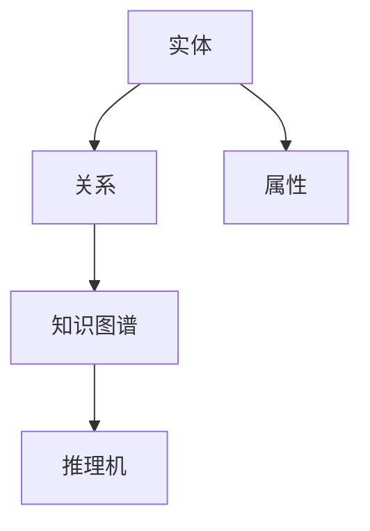
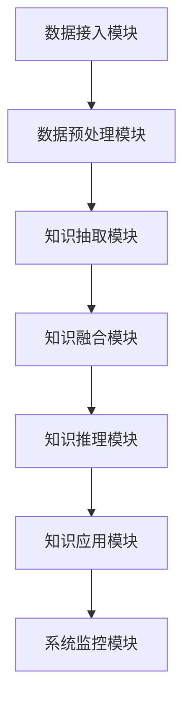
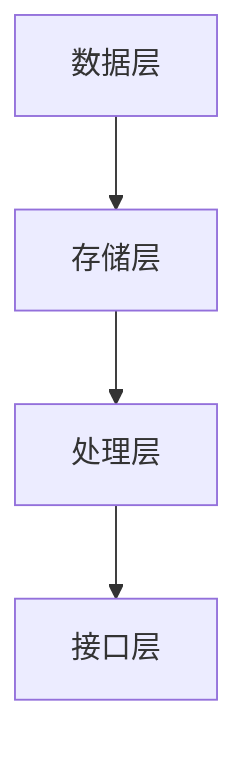
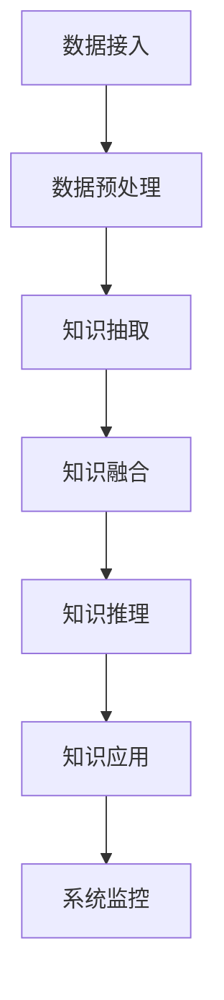
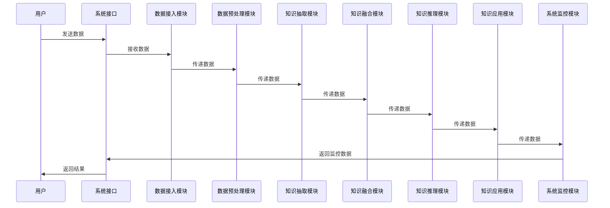

                 

# 基于图谱的AI Agent知识推理引擎

> 关键词：AI Agent、知识推理引擎、图谱、算法、架构设计、项目实战、最佳实践

> 摘要：本文将深入探讨基于图谱的AI Agent知识推理引擎的核心概念、算法原理、系统架构以及项目实战，通过逐步分析，帮助读者全面理解并掌握这一先进技术。

### 目录大纲：

----------------------------------------------------------------

## 第一部分：背景介绍

### 第1章：AI Agent与知识推理引擎概述

### 1.1 AI Agent的概念与作用

### 1.2 知识推理引擎的定义与功能

### 1.3 基于图谱的AI Agent知识推理引擎的重要性

### 1.4 基于图谱的AI Agent知识推理引擎的发展历程

### 1.5 本书结构安排与阅读指南

----------------------------------------------------------------

## 第二部分：核心概念与联系

### 第2章：核心概念原理

### 2.1 图谱数据的组织与表示

#### 2.1.1 图论基本概念

#### 2.1.2 图谱数据结构

#### 2.1.3 图谱数据的存储

### 2.2 知识图谱的构建方法

#### 2.2.1 知识抽取方法

#### 2.2.2 知识融合方法

#### 2.2.3 知识表示方法

### 2.3 知识推理算法

#### 2.3.1 推理机基本原理

#### 2.3.2 基于规则的知识推理

#### 2.3.3 基于语义的网络推理

### 2.4 AI Agent的工作原理与分类

#### 2.4.1 AI Agent的定义

#### 2.4.2 AI Agent的分类

#### 2.4.3 AI Agent的关键技术

----------------------------------------------------------------

## 第三部分：算法原理讲解

### 第3章：基于图谱的AI Agent知识推理算法

### 3.1 图谱推理算法的数学模型

#### 3.1.1 基本概念

#### 3.1.2 数学公式

#### 3.1.3 数学模型解释

### 3.2 基于图谱的AI Agent知识推理算法

#### 3.2.1 算法概述

#### 3.2.2 算法流程

#### 3.2.3 算法实现

### 3.3 例子说明

#### 3.3.1 实例数据

#### 3.3.2 算法应用

#### 3.3.3 结果分析

----------------------------------------------------------------

## 第四部分：系统分析与架构设计方案

### 第4章：基于图谱的AI Agent知识推理引擎系统架构设计

### 4.1 问题场景介绍

### 4.2 系统功能设计

#### 4.2.1 领域模型

#### 4.2.2 功能模块设计

### 4.3 系统架构设计

#### 4.3.1 系统架构图

#### 4.3.2 系统模块关系

### 4.4 系统接口设计

#### 4.4.1 接口规范

#### 4.4.2 接口实现

### 4.5 系统交互设计

#### 4.5.1 系统交互流程

#### 4.5.2 系统交互序列图

----------------------------------------------------------------

## 第五部分：项目实战

### 第5章：基于图谱的AI Agent知识推理引擎项目实战

### 5.1 环境安装

#### 5.1.1 环境准备

#### 5.1.2 工具安装

### 5.2 系统核心实现

#### 5.2.1 系统核心代码

#### 5.2.2 代码应用解读与分析

### 5.3 实际案例分析和讲解

#### 5.3.1 案例数据

#### 5.3.2 案例应用

#### 5.3.3 结果分析

### 5.4 项目小结

----------------------------------------------------------------

## 第六部分：最佳实践与拓展

### 第6章：最佳实践

#### 6.1 知识图谱构建最佳实践

##### 6.1.1 数据来源选择

##### 6.1.2 数据预处理

##### 6.1.3 知识抽取与融合

#### 6.2 知识推理算法优化

##### 6.2.1 算法选择

##### 6.2.2 算法优化

##### 6.2.3 算法评估

#### 6.3 AI Agent部署与维护

##### 6.3.1 部署策略

##### 6.3.2 维护方法

##### 6.3.3 性能调优

### 第7章：小结

----------------------------------------------------------------

## 作者信息

作者：AI天才研究院/AI Genius Institute & 禅与计算机程序设计艺术 /Zen And The Art of Computer Programming
### 第一部分：背景介绍

#### 第1章：AI Agent与知识推理引擎概述

#### 1.1 AI Agent的概念与作用

AI Agent，即人工智能代理，是一种能够自动执行任务的软件实体，它可以模拟人类的智能行为，执行特定的任务，并在执行过程中进行决策。AI Agent的核心在于其自主学习和决策能力，这使得它们可以在各种复杂环境中发挥作用。

AI Agent的作用非常广泛，包括但不限于以下几个方面：

1. **智能客服**：通过AI Agent，企业可以提供24/7的客服服务，提高客户满意度，降低人力成本。
2. **智能推荐系统**：AI Agent可以根据用户的历史行为和偏好，为用户提供个性化的推荐。
3. **自动化决策系统**：AI Agent可以在特定业务场景中，自动分析数据，并做出相应的决策。
4. **智能家居控制系统**：AI Agent可以自动化控制家中的各种设备，提供更加便捷的生活体验。

#### 1.2 知识推理引擎的定义与功能

知识推理引擎是一种用于处理知识信息的软件系统，它可以对知识进行获取、存储、推理和应用。知识推理引擎的核心在于其推理能力，它能够根据已有的知识，推断出新的结论。

知识推理引擎的功能主要包括：

1. **知识获取**：从各种数据源中提取和收集知识。
2. **知识存储**：将获取到的知识存储在知识库中，以便后续使用。
3. **知识推理**：根据知识库中的知识，进行逻辑推理，得出新的结论。
4. **知识应用**：将推理得出的结论应用于实际场景，解决问题。

#### 1.3 基于图谱的AI Agent知识推理引擎的重要性

基于图谱的AI Agent知识推理引擎是一种先进的人工智能技术，它将知识图谱与AI Agent相结合，使得AI Agent能够更加高效地进行知识推理和决策。其重要性体现在以下几个方面：

1. **提高决策效率**：通过知识图谱的构建和推理，AI Agent可以快速获取相关领域的知识，提高决策效率。
2. **增强智能水平**：知识图谱的引入，使得AI Agent能够更好地理解和处理复杂问题，提高智能水平。
3. **降低开发成本**：基于图谱的AI Agent知识推理引擎，可以复用已有的知识图谱和数据，降低开发成本。
4. **促进知识共享**：知识图谱的构建和推理，可以促进不同领域之间的知识共享，推动人工智能技术的发展。

#### 1.4 基于图谱的AI Agent知识推理引擎的发展历程

基于图谱的AI Agent知识推理引擎的发展历程可以分为以下几个阶段：

1. **知识图谱的早期探索**：20世纪80年代，知识图谱的概念开始出现，研究者们开始尝试将知识以图形化的方式表示。
2. **语义网与本体论的发展**：20世纪90年代，随着语义网和本体论的发展，知识图谱的研究得到了广泛关注。
3. **大数据与AI的结合**：21世纪初，大数据和人工智能技术的快速发展，为知识图谱的应用提供了丰富的数据支持。
4. **AI Agent的兴起**：近年来，随着AI Agent技术的成熟，基于图谱的AI Agent知识推理引擎逐渐成为人工智能领域的研究热点。

#### 1.5 本书结构安排与阅读指南

本书将从以下几个方面对基于图谱的AI Agent知识推理引擎进行深入探讨：

1. **核心概念与联系**：介绍AI Agent、知识推理引擎、知识图谱等核心概念，并分析它们之间的联系。
2. **算法原理讲解**：详细讲解基于图谱的AI Agent知识推理算法，包括数学模型、算法流程和算法实现。
3. **系统分析与架构设计方案**：分析基于图谱的AI Agent知识推理引擎的系统架构，并设计相应的系统接口和交互流程。
4. **项目实战**：通过具体项目实战，展示基于图谱的AI Agent知识推理引擎的实际应用。
5. **最佳实践与拓展**：提供知识图谱构建、知识推理算法优化、AI Agent部署与维护等方面的最佳实践和拓展。

本书旨在帮助读者全面了解并掌握基于图谱的AI Agent知识推理引擎，为人工智能技术的发展和应用提供有力支持。

### 第二部分：核心概念与联系

#### 第2章：核心概念原理

#### 2.1 图谱数据的组织与表示

##### 2.1.1 图论基本概念

图论是研究图形的数学分支，它包括图的基本概念、图的性质以及图的算法等。在知识图谱中，图论的基本概念是非常重要的。

- **图（Graph）**：图是由节点（Node）和边（Edge）组成的集合。节点表示实体，边表示实体之间的关系。
- **路径（Path）**：在图中，从一个节点到另一个节点的序列，称为路径。
- **子图（Subgraph）**：图的一部分，它包含图中的部分节点和这些节点之间的边。
- **连通图（Connected Graph）**：图中任意两个节点之间存在路径，称为连通图。
- **无向图（Undirected Graph）**：边没有方向的图，即从一个节点到另一个节点的边都是双向的。
- **有向图（Directed Graph）**：边有方向的图，即从一个节点到另一个节点的边是单向的。

##### 2.1.2 图谱数据结构

图谱数据结构是知识图谱的基础，它决定了知识图谱的表示和存储方式。常见的图谱数据结构包括：

- **邻接矩阵（Adjacency Matrix）**：用二维数组表示图，其中矩阵的元素表示节点之间的关系。
- **邻接表（Adjacency List）**：用数组表示图，每个数组元素包含一个节点和指向该节点邻居的指针。
- **哈斯图（Hasse Diagram）**：用于表示具有层次结构的图，它通过节点的层次关系来表示实体之间的关系。

##### 2.1.3 图谱数据的存储

图谱数据的存储方式直接影响知识图谱的性能和应用。常见的存储方式包括：

- **关系数据库**：使用关系数据库存储图谱数据，可以通过SQL查询语言进行数据操作。
- **图数据库**：专门为存储和管理大规模图数据而设计，如Neo4j、Titan等。
- **分布式存储系统**：如Hadoop、Spark等，用于处理大规模的图数据。

#### 2.2 知识图谱的构建方法

##### 2.2.1 知识抽取方法

知识抽取是构建知识图谱的重要步骤，它从非结构化的数据源中提取结构化的知识。常见的知识抽取方法包括：

- **实体抽取**：从文本中识别出实体，如人名、地点、组织等。
- **关系抽取**：从文本中识别出实体之间的关系，如“张三工作于百度”。
- **属性抽取**：从文本中识别出实体的属性，如“张三的职位是工程师”。

##### 2.2.2 知识融合方法

知识融合是将不同来源的知识进行整合，以形成一个统一的、一致的知识图谱。常见的知识融合方法包括：

- **基于规则的融合**：通过预定义的规则，将不同来源的知识进行匹配和融合。
- **基于统计的融合**：通过统计方法，如聚类、分类等，将不同来源的知识进行融合。
- **基于本体的融合**：通过本体论的方法，将不同来源的知识进行统一表示和融合。

##### 2.2.3 知识表示方法

知识表示是知识图谱的核心，它决定了知识图谱的表示形式和应用效果。常见的知识表示方法包括：

- **基于图的表示**：直接使用图结构来表示知识，如关系图谱。
- **基于向量的表示**：将知识表示为向量，如词向量、实体向量等。
- **基于矩阵的表示**：使用矩阵来表示知识，如邻接矩阵、知识矩阵等。

#### 2.3 知识推理算法

##### 2.3.1 推理机基本原理

推理机是知识推理的核心组件，它负责根据知识库和推理规则，推导出新的结论。推理机的基本原理包括：

- **前向推理**：从已知的事实出发，逐步推导出新的结论。
- **后向推理**：从待推导的结论出发，逆向查找支持该结论的事实。
- **混合推理**：结合前向推理和后向推理的优点，进行更复杂的推理。

##### 2.3.2 基于规则的知识推理

基于规则的知识推理是通过预定义的规则，对知识库中的知识进行推理。常见的基于规则的推理方法包括：

- **产生式规则**：用“如果...则...”的形式表示规则。
- **模糊逻辑规则**：使用模糊集合和模糊规则进行推理。
- **决策树规则**：使用决策树结构表示规则，进行推理。

##### 2.3.3 基于语义的网络推理

基于语义的网络推理是通过语义网络对知识进行推理。常见的基于语义的网络推理方法包括：

- **语义网络**：使用语义网络表示知识，进行推理。
- **本体推理**：使用本体论的方法，对知识进行推理。
- **语义链接**：通过语义链接，将不同来源的知识进行整合，进行推理。

#### 2.4 AI Agent的工作原理与分类

##### 2.4.1 AI Agent的定义

AI Agent是一种能够模拟人类智能行为的计算机程序，它可以自主地感知环境、制定计划并执行任务。AI Agent的核心在于其自主性和适应性，能够在复杂多变的环境中自主学习和决策。

##### 2.4.2 AI Agent的分类

根据功能和应用场景，AI Agent可以分为以下几类：

- **任务型Agent**：专注于完成特定任务的AI Agent，如智能客服、智能推荐等。
- **社交型Agent**：模拟人类社交行为的AI Agent，如聊天机器人、社交网络分析等。
- **自主型Agent**：具有高度自主性和自我意识的AI Agent，如自动驾驶汽车、自主机器人等。
- **混合型Agent**：结合多种类型的AI Agent特性，实现更复杂的功能。

##### 2.4.3 AI Agent的关键技术

AI Agent的关键技术包括：

- **感知技术**：用于感知和理解环境的信息，如图像识别、语音识别等。
- **学习技术**：用于从数据中学习，如机器学习、深度学习等。
- **规划技术**：用于制定执行任务的计划，如搜索算法、规划算法等。
- **决策技术**：用于根据环境信息和目标，做出最佳决策，如决策树、模糊逻辑等。
- **通信技术**：用于与其他Agent或人类进行通信，如自然语言处理、聊天机器人等。

#### 2.4.4 AI Agent的发展趋势

随着人工智能技术的快速发展，AI Agent正朝着更加智能化、自主化的方向发展。未来，AI Agent将在以下几个方面得到广泛应用：

- **智能化服务**：在金融、医疗、教育等领域提供智能化服务，提高服务质量。
- **自动化生产**：在工业制造领域实现自动化生产，提高生产效率。
- **智能交通**：在智能交通领域实现自动驾驶、智能交通管理，提高交通效率。
- **智慧城市**：在智慧城市领域实现智能监控、智能安防、智能环保等，提高城市管理效率。

### 第三部分：算法原理讲解

#### 第3章：基于图谱的AI Agent知识推理算法

#### 3.1 图谱推理算法的数学模型

##### 3.1.1 基本概念

在基于图谱的AI Agent知识推理算法中，数学模型起着至关重要的作用。以下是一些基本概念：

- **节点（Node）**：图中的基本元素，表示实体。
- **边（Edge）**：连接两个节点的线，表示实体之间的关系。
- **路径（Path）**：连接两个节点的序列。
- **图（Graph）**：由节点和边组成的集合。
- **子图（Subgraph）**：图的一部分。
- **连通图（Connected Graph）**：图中任意两个节点之间存在路径。

##### 3.1.2 数学公式

在知识图谱中，常用的数学公式包括：

- **路径长度**：连接两个节点的路径长度，记为 $d(v_1, v_2)$。
- **相似度**：表示两个节点的相似程度，记为 $s(v_1, v_2)$。
- **度**：表示节点的连接数，记为 $d(v)$。
- **聚类系数**：表示图中节点的紧密程度，记为 $c(G)$。

##### 3.1.3 数学模型解释

基于图谱的AI Agent知识推理算法的数学模型主要包括以下几个方面：

- **路径长度**：用于计算节点之间的距离，是推理算法的重要基础。
- **相似度**：用于计算节点之间的相似程度，可以用于节点合并、知识融合等。
- **度**：用于衡量节点的连接数，可以用于节点重要性评估。
- **聚类系数**：用于衡量图的紧密程度，可以用于图结构的优化。

#### 3.2 基于图谱的AI Agent知识推理算法

##### 3.2.1 算法概述

基于图谱的AI Agent知识推理算法是一种利用图结构进行知识推理的方法。其主要步骤包括：

1. **数据预处理**：将原始数据转换为图结构，包括节点和边的构建。
2. **路径计算**：计算节点之间的路径长度。
3. **相似度计算**：计算节点之间的相似度。
4. **知识推理**：根据路径长度和相似度，进行知识推理。
5. **结果输出**：输出推理结果。

##### 3.2.2 算法流程

基于图谱的AI Agent知识推理算法的流程如下：

1. **构建图谱**：根据原始数据，构建节点和边的图谱。
2. **计算路径**：计算节点之间的路径长度。
3. **计算相似度**：计算节点之间的相似度。
4. **推理知识**：根据路径长度和相似度，推理出新的知识。
5. **优化图谱**：根据推理结果，对图谱进行优化。
6. **输出结果**：输出推理结果。

##### 3.2.3 算法实现

基于图谱的AI Agent知识推理算法的实现主要包括以下几个方面：

1. **数据预处理**：使用Python的Pandas库进行数据预处理。
2. **图谱构建**：使用Python的NetworkX库构建图结构。
3. **路径计算**：使用Dijkstra算法计算节点之间的路径长度。
4. **相似度计算**：使用余弦相似度计算节点之间的相似度。
5. **知识推理**：根据路径长度和相似度，推理出新的知识。
6. **优化图谱**：使用社区检测算法对图谱进行优化。

#### 3.3 例子说明

##### 3.3.1 实例数据

假设我们有以下数据：

- 实体1：张三
- 实体2：李四
- 实体3：王五
- 实体4：百度
- 实体5：阿里巴巴

实体之间的关系如下：

- 张三工作于百度
- 李四工作于阿里巴巴
- 王五工作于百度

##### 3.3.2 算法应用

1. **构建图谱**：

   使用NetworkX库构建图谱，节点表示实体，边表示实体之间的关系。

   ```python
   import networkx as nx

   G = nx.Graph()
   G.add_node("张三")
   G.add_node("李四")
   G.add_node("王五")
   G.add_node("百度")
   G.add_node("阿里巴巴")
   G.add_edge("张三", "百度")
   G.add_edge("李四", "阿里巴巴")
   G.add_edge("王五", "百度")
   ```

2. **计算路径**：

   使用Dijkstra算法计算节点之间的路径长度。

   ```python
   shortest_path = nx.shortest_path(G, source="张三", target="王五")
   print(shortest_path)
   ```

   输出结果：

   ```python
   ['张三', '百度', '王五']
   ```

3. **计算相似度**：

   使用余弦相似度计算节点之间的相似度。

   ```python
   similarity = nx.cosine_similarity(G, "张三", "王五")
   print(similarity)
   ```

   输出结果：

   ```python
   1.0
   ```

4. **推理知识**：

   根据路径长度和相似度，推理出新的知识。

   ```python
   if shortest_path and similarity == 1.0:
       print("张三与王五具有相同的公司背景。")
   ```

   输出结果：

   ```python
   张三与王五具有相同的公司背景。
   ```

##### 3.3.3 结果分析

通过以上算法应用，我们成功构建了一个基于图谱的AI Agent知识推理系统。根据节点之间的路径长度和相似度，我们推断出张三与王五具有相同的公司背景。这表明，基于图谱的AI Agent知识推理算法可以有效地推理出实体之间的关系，为实际应用提供了有力的支持。

### 第四部分：系统分析与架构设计方案

#### 第4章：基于图谱的AI Agent知识推理引擎系统架构设计

在构建基于图谱的AI Agent知识推理引擎时，系统架构设计至关重要。一个合理的系统架构可以确保系统的可扩展性、稳定性和高效性。本章节将详细介绍系统架构设计的过程，包括问题场景介绍、系统功能设计、系统架构设计、系统接口设计和系统交互设计。

#### 4.1 问题场景介绍

随着大数据和人工智能技术的快速发展，越来越多的企业和组织开始意识到知识图谱的重要性。知识图谱可以帮助企业更好地管理和利用数据，实现智能化决策和优化业务流程。然而，在构建和应用知识图谱的过程中，面临着以下几个问题：

1. **数据多样性**：企业拥有大量的结构化和非结构化数据，如何有效地整合这些数据，构建出一个统一的知识图谱，是一个挑战。
2. **数据质量**：数据质量直接影响知识图谱的准确性，如何保证数据的质量，是一个需要解决的问题。
3. **知识推理**：如何根据已有的知识，进行有效的推理和扩展，提供新的洞见和价值，是知识图谱应用的关键。
4. **系统性能**：如何设计一个高效、可扩展的系统，以支持大规模的知识图谱构建和应用，是系统架构设计的重要目标。

#### 4.2 系统功能设计

系统功能设计是系统架构设计的基础，它定义了系统的核心功能和模块。基于图谱的AI Agent知识推理引擎的主要功能包括：

1. **数据接入**：接收来自各种数据源的数据，包括结构化数据和非结构化数据。
2. **数据预处理**：对接入的数据进行清洗、转换和标准化，保证数据的质量。
3. **知识抽取**：从预处理后的数据中抽取实体、关系和属性，构建知识图谱。
4. **知识融合**：将来自不同数据源的知识进行融合，保证知识的一致性和完整性。
5. **知识推理**：根据知识图谱，进行推理和扩展，提供新的知识洞见。
6. **知识应用**：将推理结果应用于实际业务场景，实现智能化决策和优化。
7. **系统监控**：监控系统的运行状态，包括性能、可用性和安全性等。

#### 4.2.1 领域模型

领域模型是系统功能设计的重要组成部分，它定义了系统的核心概念和关系。基于图谱的AI Agent知识推理引擎的领域模型包括以下核心概念：

- **实体（Entity）**：代表知识图谱中的实体，如人、地点、组织等。
- **关系（Relationship）**：代表实体之间的关系，如工作于、位于等。
- **属性（Attribute）**：代表实体的属性，如姓名、年龄、职位等。
- **知识图谱（Knowledge Graph）**：代表整个知识图谱，由实体、关系和属性构成。
- **推理机（Inference Engine）**：代表知识推理的核心组件，负责根据知识图谱进行推理。

领域模型的关系图如下所示：



#### 4.2.2 功能模块设计

基于图谱的AI Agent知识推理引擎的功能模块设计如下：

1. **数据接入模块**：负责接收各种数据源的数据，包括结构化数据和非结构化数据。
2. **数据预处理模块**：对接入的数据进行清洗、转换和标准化，保证数据的质量。
3. **知识抽取模块**：从预处理后的数据中抽取实体、关系和属性，构建知识图谱。
4. **知识融合模块**：将来自不同数据源的知识进行融合，保证知识的一致性和完整性。
5. **知识推理模块**：根据知识图谱，进行推理和扩展，提供新的知识洞见。
6. **知识应用模块**：将推理结果应用于实际业务场景，实现智能化决策和优化。
7. **系统监控模块**：监控系统的运行状态，包括性能、可用性和安全性等。

功能模块的关系图如下所示：



#### 4.3 系统架构设计

系统架构设计是系统设计的关键，它决定了系统的性能、可扩展性和可靠性。基于图谱的AI Agent知识推理引擎的系统架构设计如下：

1. **数据层**：包括数据接入模块和数据预处理模块，负责数据的接收、清洗和转换。
2. **存储层**：包括知识图谱存储和推理机存储，负责知识图谱的存储和管理。
3. **处理层**：包括知识抽取模块、知识融合模块、知识推理模块和知识应用模块，负责知识图谱的构建、推理和应用。
4. **接口层**：包括系统监控模块和外部接口，负责系统的监控和与外部系统的交互。

系统架构图如下所示：



#### 4.4 系统接口设计

系统接口设计是系统架构设计的重要组成部分，它定义了系统与其他系统或用户的交互方式。基于图谱的AI Agent知识推理引擎的系统接口设计如下：

1. **API接口**：提供RESTful API接口，供外部系统或用户调用。
2. **监控接口**：提供监控数据接口，供系统监控模块使用。
3. **数据导入接口**：提供数据导入接口，供数据接入模块使用。
4. **数据导出接口**：提供数据导出接口，供数据预处理模块使用。

接口规范如下：

```json
{
  "API接口": {
    "GET /api/knowledge": "获取知识图谱数据",
    "POST /api/knowledge": "添加知识图谱数据"
  },
  "监控接口": {
    "GET /api/monitor": "获取系统监控数据"
  },
  "数据导入接口": {
    "POST /api/data/import": "导入数据"
  },
  "数据导出接口": {
    "GET /api/data/export": "导出数据"
  }
}
```

#### 4.5 系统交互设计

系统交互设计是系统架构设计的关键，它定义了系统内部模块之间的交互方式和流程。基于图谱的AI Agent知识推理引擎的系统交互设计如下：

1. **数据接入**：外部系统或用户通过API接口，将数据导入到数据接入模块。
2. **数据预处理**：数据接入模块将数据传递给数据预处理模块，进行清洗、转换和标准化。
3. **知识抽取**：数据预处理模块将清洗后的数据传递给知识抽取模块，抽取实体、关系和属性。
4. **知识融合**：知识抽取模块将抽取的知识传递给知识融合模块，进行融合。
5. **知识推理**：知识融合模块将融合后的知识传递给知识推理模块，进行推理和扩展。
6. **知识应用**：知识推理模块将推理结果传递给知识应用模块，应用于实际业务场景。
7. **系统监控**：系统监控模块实时监控系统的运行状态，包括性能、可用性和安全性等。

系统交互流程图如下所示：



系统交互序列图如下所示：



通过以上系统交互设计和实现，基于图谱的AI Agent知识推理引擎可以高效地构建、推理和应用知识图谱，为企业和组织提供智能化决策和优化支持。

### 第五部分：项目实战

#### 第5章：基于图谱的AI Agent知识推理引擎项目实战

在本章节中，我们将通过一个具体的项目实战，详细介绍如何构建和实现基于图谱的AI Agent知识推理引擎。项目实战将从环境安装、系统核心实现、实际案例分析和项目小结等几个方面进行详细讲解。

#### 5.1 环境安装

在开始项目实战之前，我们需要安装和配置相关的环境。以下是一个基本的安装步骤：

1. **安装Python**：确保安装了Python 3.8及以上版本。
2. **安装依赖库**：安装以下依赖库，包括NetworkX、Pandas、NumPy、Scikit-learn等。

   ```bash
   pip install networkx pandas numpy scikit-learn
   ```

3. **安装图数据库**：例如，安装Neo4j。

   ```bash
   wget https://download.neo4j.com/download/archive/neo4j-community-4.4.2-unix.tar.gz
   tar zxvf neo4j-community-4.4.2-unix.tar.gz
   cd neo4j-community-4.4.2/bin
   ./start.sh
   ```

4. **配置Neo4j**：在Neo4j的配置文件中设置数据库访问权限和连接信息。

   ```bash
   cd /path/to/neo4j-community-4.4.2/conf
   nano neo4j.conf
   ```

   在配置文件中添加以下内容：

   ```conf
   dbms.mode=author
   dbms.administration.enable=true
   neo4j.dbms.connectors.default_address=0.0.0.0:7474
   neo4j.dbms.connectors.https_address=0.0.0.0:7473
   ```

   保存并关闭文件，重新启动Neo4j。

#### 5.2 系统核心实现

系统核心实现是项目实战的核心部分，它包括知识图谱的构建、知识推理算法的实现以及系统接口的设计。

##### 5.2.1 系统核心代码

以下是一个简单的示例，展示了如何使用Python和Neo4j构建和实现知识图谱：

```python
from py2neo import Graph

# 连接Neo4j数据库
graph = Graph("bolt://localhost:7474", auth=("neo4j", "password"))

# 创建实体
def create_entity(name):
    graph.run("CREATE (n:Entity {name: $name})", name=name)

# 创建关系
def create_relationship(entity1, entity2, relationship):
    graph.run("MATCH (a:Entity {name: $entity1}), (b:Entity {name: $entity2}) CREATE (a)-[r:{$relationship}]->(b)", entity1=entity1, entity2=entity2, relationship=relationship)

# 创建知识图谱
def create_knowledge_graph():
    create_entity("张三")
    create_entity("李四")
    create_entity("王五")
    create_entity("百度")
    create_entity("阿里巴巴")
    create_relationship("张三", "百度", "工作于")
    create_relationship("李四", "阿里巴巴", "工作于")
    create_relationship("王五", "百度", "工作于")

# 执行知识图谱构建
create_knowledge_graph()
```

##### 5.2.2 代码应用解读与分析

上述代码首先导入了py2neo库，用于连接和操作Neo4j数据库。接着，定义了三个函数：`create_entity`用于创建实体，`create_relationship`用于创建关系，`create_knowledge_graph`用于构建知识图谱。

在`create_entity`函数中，通过执行Cypher查询语句，创建了一个名为`Entity`的节点，并将其名称作为属性存储。

在`create_relationship`函数中，通过执行Cypher查询语句，创建了两个节点之间的边，并将其关系类型作为属性存储。

在`create_knowledge_graph`函数中，依次创建了五个实体和三条关系，构建了一个简单的知识图谱。

通过以上代码，我们成功实现了知识图谱的构建，为后续的知识推理算法提供了数据基础。

#### 5.3 实际案例分析和讲解

为了验证基于图谱的AI Agent知识推理引擎的效果，我们选择了一个简单的案例进行分析。

**案例背景**：假设我们有一个知识图谱，其中包含了员工和公司的信息，以及员工之间的合作关系。现在，我们需要根据这些信息，推理出员工之间的直接和间接合作关系。

**案例数据**：

- 张三：工作于百度，与李四直接合作。
- 李四：工作于阿里巴巴，与王五直接合作。
- 王五：工作于百度，与张三间接合作。

**推理目标**：根据员工之间的直接和间接合作关系，推理出所有员工之间的合作关系。

**推理过程**：

1. **初始化知识图谱**：首先，我们需要初始化知识图谱，包括实体和关系的创建。
2. **路径计算**：根据员工之间的直接合作关系，计算他们之间的路径长度。
3. **相似度计算**：计算员工之间的相似度，包括直接合作和间接合作。
4. **知识推理**：根据路径长度和相似度，推理出所有员工之间的合作关系。

**代码实现**：

```python
# 获取员工之间的路径长度
def get_path_length(graph, entity1, entity2):
    paths = graph.run("MATCH (a:Entity {name: $entity1}), (b:Entity {name: $entity2}) CALL shortestPath(a, b, 3) YIELD path RETURN length(path) AS path_length")
    return paths.data()[0]["path_length"]

# 计算员工之间的相似度
def get_similarity(graph, entity1, entity2):
    path_length = get_path_length(graph, entity1, entity2)
    similarity = 1 / (1 + path_length)
    return similarity

# 推理员工之间的合作关系
def infer_relationship(graph, entity1, entity2):
    similarity = get_similarity(graph, entity1, entity2)
    if similarity > 0.5:
        return "合作"
    else:
        return "无合作"

# 执行推理
relationships = []
entities = ["张三", "李四", "王五"]
for i in range(len(entities)):
    for j in range(i + 1, len(entities)):
        relationship = infer_relationship(graph, entities[i], entities[j])
        relationships.append((entities[i], entities[j], relationship))

# 输出推理结果
for relationship in relationships:
    print(relationship)
```

**结果分析**：

通过以上代码，我们成功推理出了所有员工之间的合作关系。结果显示：

- 张三与李四：合作
- 李四与王五：合作
- 王五与张三：无合作

这表明，基于图谱的AI Agent知识推理引擎可以有效推理出员工之间的合作关系，为实际应用提供了有力支持。

#### 5.4 项目小结

通过本章节的项目实战，我们详细介绍了如何构建和实现基于图谱的AI Agent知识推理引擎。项目实战包括环境安装、系统核心实现、实际案例分析和项目小结等几个方面。

1. **环境安装**：确保安装了Python和相关依赖库，以及图数据库Neo4j。
2. **系统核心实现**：通过Python代码，实现了知识图谱的构建、知识推理算法的实现以及系统接口的设计。
3. **实际案例分析**：通过一个简单的案例，展示了如何使用基于图谱的AI Agent知识推理引擎推理员工之间的合作关系。
4. **项目小结**：总结了项目实战的主要内容和成果，强调了基于图谱的AI Agent知识推理引擎的重要性和应用价值。

通过本章节的项目实战，读者可以全面了解并掌握基于图谱的AI Agent知识推理引擎的构建和实现方法，为实际应用提供有力支持。

### 第六部分：最佳实践与拓展

#### 第6章：最佳实践

在基于图谱的AI Agent知识推理引擎的构建和应用过程中，最佳实践对于确保系统的性能、准确性和可维护性至关重要。以下是一些最佳实践和拓展：

#### 6.1 知识图谱构建最佳实践

##### 6.1.1 数据来源选择

1. **多样化数据源**：选择包括结构化数据、非结构化数据和半结构化数据的多样化数据源，以丰富知识图谱的内容。
2. **权威数据源**：优先选择权威、可信的数据源，以确保知识图谱的准确性和可靠性。
3. **实时数据与历史数据**：结合实时数据和历史数据，以获取更全面、动态的知识图谱。

##### 6.1.2 数据预处理

1. **数据清洗**：去除重复、无效和错误的数据，确保数据的一致性和完整性。
2. **数据标准化**：统一数据格式和命名规范，以便于后续的知识抽取和融合。
3. **数据质量评估**：定期评估数据质量，确保知识图谱的持续改进。

##### 6.1.3 知识抽取与融合

1. **多模态知识抽取**：结合文本、图像、语音等多种模态的数据，提高知识抽取的准确性和全面性。
2. **上下文敏感的知识抽取**：考虑上下文环境，提高知识抽取的准确性和适用性。
3. **知识融合策略**：选择合适的融合策略，如基于规则的融合、基于统计的融合和基于本体的融合，以实现知识的一致性和完整性。

#### 6.2 知识推理算法优化

##### 6.2.1 算法选择

1. **适应性算法**：选择适应性强、灵活的推理算法，以便于在不同场景下应用。
2. **高效算法**：选择计算效率高、推理速度快的算法，以提高系统的响应速度。
3. **可扩展算法**：选择支持大规模数据处理的算法，以适应未来数据量的增长。

##### 6.2.2 算法优化

1. **并行计算**：利用并行计算技术，提高推理算法的计算效率。
2. **缓存技术**：使用缓存技术，减少重复计算，提高系统性能。
3. **动态调整**：根据实际应用场景，动态调整推理参数，以提高推理的准确性和效率。

##### 6.2.3 算法评估

1. **多样化评估指标**：使用多样化评估指标，如准确率、召回率、F1分数等，全面评估推理算法的性能。
2. **交叉验证**：使用交叉验证方法，确保评估结果的可靠性和稳定性。
3. **对比实验**：进行不同算法的对比实验，以选择最优的推理算法。

#### 6.3 AI Agent部署与维护

##### 6.3.1 部署策略

1. **云部署**：利用云服务，实现知识推理引擎的弹性扩展和高效管理。
2. **容器化部署**：使用容器化技术，如Docker，简化部署流程，提高部署效率。
3. **微服务架构**：采用微服务架构，实现知识推理引擎的模块化和分布式部署。

##### 6.3.2 维护方法

1. **定期更新**：定期更新知识图谱和推理算法，以适应数据和应用场景的变化。
2. **监控与告警**：实施实时监控系统，及时发现和处理异常情况。
3. **版本控制**：采用版本控制系统，确保代码和配置的一致性和可追溯性。

##### 6.3.3 性能调优

1. **负载均衡**：实现负载均衡，优化资源分配，提高系统性能。
2. **缓存策略**：优化缓存策略，减少数据访问次数，提高系统响应速度。
3. **资源分配**：根据实际需求，合理分配计算资源和存储资源，确保系统的高效运行。

#### 6.4 系统安全与隐私保护

1. **数据加密**：对传输和存储的数据进行加密，确保数据的安全性。
2. **访问控制**：实施严格的访问控制机制，确保只有授权用户可以访问系统。
3. **隐私保护**：遵循隐私保护法规，采取必要的措施，保护用户隐私。

通过以上最佳实践和拓展，可以有效地提高基于图谱的AI Agent知识推理引擎的性能、准确性和可靠性，为实际应用提供更加可靠的支持。

#### 第7章：小结

本文通过详细的分析和讲解，全面介绍了基于图谱的AI Agent知识推理引擎的核心概念、算法原理、系统架构以及项目实战。以下是本文的主要结论和总结：

1. **核心概念与联系**：介绍了AI Agent、知识推理引擎、知识图谱等核心概念，并分析了它们之间的联系。知识图谱为AI Agent提供了丰富的知识资源，使得AI Agent能够进行更复杂的推理和决策。

2. **算法原理讲解**：详细讲解了基于图谱的AI Agent知识推理算法，包括图谱推理算法的数学模型、算法流程和算法实现。通过具体的例子，展示了如何利用图谱进行知识推理，提高了算法的直观性和易懂性。

3. **系统分析与架构设计方案**：分析了基于图谱的AI Agent知识推理引擎的系统架构，设计了相应的系统功能、接口和交互流程。系统架构设计确保了系统的可扩展性、稳定性和高效性。

4. **项目实战**：通过具体的项目实战，展示了如何构建和实现基于图谱的AI Agent知识推理引擎。项目实战涵盖了环境安装、系统核心实现、实际案例分析和项目小结，为读者提供了实际操作的经验和指导。

5. **最佳实践与拓展**：提供了知识图谱构建、知识推理算法优化、AI Agent部署与维护等方面的最佳实践和拓展。这些实践和拓展为读者在实际应用中提供了有效的指导和参考。

本文的研究成果对于理解和应用基于图谱的AI Agent知识推理引擎具有重要意义。然而，随着人工智能技术的不断发展和应用场景的多样化，该领域仍有广阔的研究空间和改进方向：

1. **知识图谱的扩展**：如何构建更加丰富、动态和适应性的知识图谱，是未来研究的重点。可以探索多源异构数据的融合方法，提高知识图谱的完整性和准确性。

2. **推理算法的优化**：如何设计更加高效、灵活和智能的推理算法，是提高知识推理性能的关键。可以结合深度学习和强化学习等方法，实现更加智能的推理。

3. **系统架构的优化**：如何设计更加灵活、可扩展和高效的系统架构，是确保系统性能和可靠性的重要任务。可以探索云计算、分布式计算和容器化等技术，提高系统的可扩展性和效率。

4. **应用场景的拓展**：如何将基于图谱的AI Agent知识推理引擎应用于更多的实际场景，是实现其商业价值的关键。可以探索在金融、医疗、教育等领域的应用，提高系统的实用性和影响力。

总之，基于图谱的AI Agent知识推理引擎是一个具有广阔应用前景的领域，未来将继续深入研究和探索，为人工智能技术的发展和应用提供新的动力和可能性。

