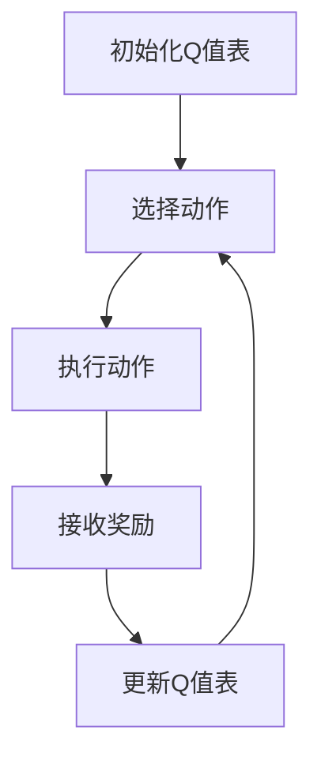
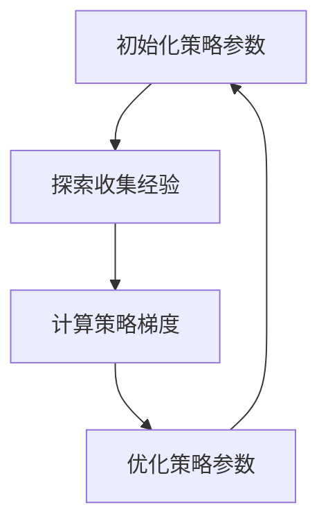
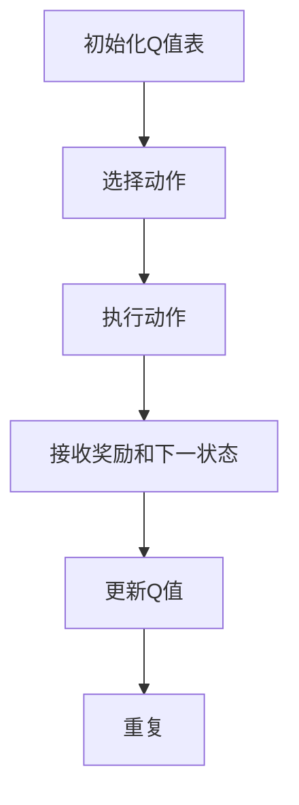
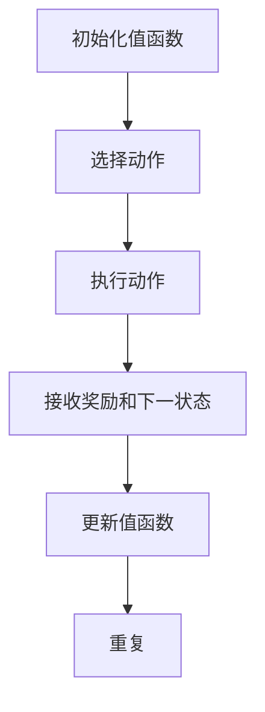
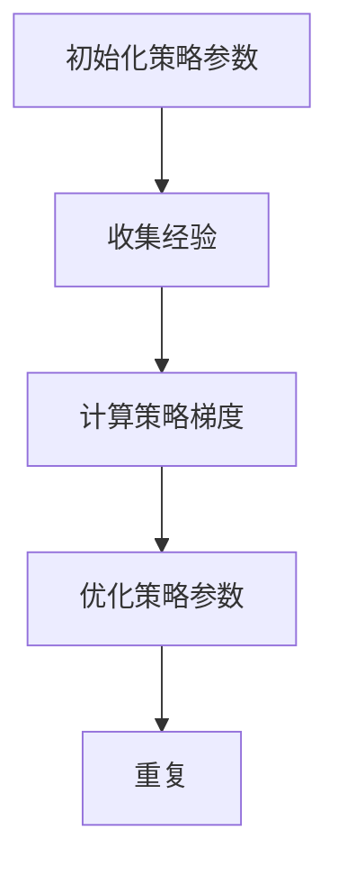
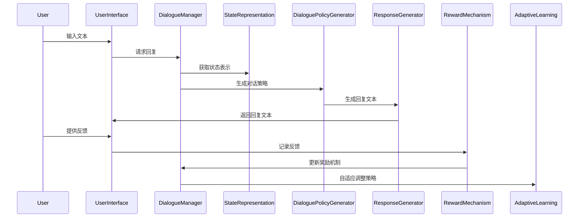

                 

### 第1章：强化学习概述

#### 1.1 强化学习背景

**1.1.1 强化学习发展历史**

强化学习（Reinforcement Learning, RL）是机器学习领域的一个重要分支，其概念最早由Richard Sutton和Andrew Barto在1988年的经典著作《强化学习：一种试错法》中提出。强化学习的历史可以追溯到20世纪50年代，当时的心理学家和行为科学家开始研究动物和人类如何通过试错来学习复杂的行为模式。

强化学习在早期的研究主要集中在动物行为模拟和简单的控制系统中。直到20世纪80年代，随着计算能力的提高和理论研究的深入，强化学习开始逐步应用于机器人控制、游戏AI等领域。

**1.1.2 强化学习与监督学习、无监督学习的区别**

- **监督学习（Supervised Learning）**：在监督学习场景中，算法从标记好的数据集学习，预测标签或分类。例如，在图像分类任务中，每个图像都对应一个标签。

- **无监督学习（Unsupervised Learning）**：在无监督学习场景中，算法处理未标记的数据，试图发现数据中的结构和模式。例如，在聚类任务中，算法试图将相似的数据点分组。

- **强化学习（Reinforcement Learning）**：在强化学习场景中，算法通过与环境交互来学习最佳行为策略。算法在环境中执行动作，并根据环境的反馈（奖励或惩罚）来调整其行为。

强化学习与监督学习、无监督学习的区别在于其反馈机制和目标。监督学习和无监督学习依赖于数据驱动的方法，而强化学习依赖于奖励驱动的策略优化。

#### 1.2 强化学习核心概念

**1.2.1 状态、动作、奖励、策略**

- **状态（State）**：状态是环境的当前情况，可以用一个向量表示，例如，在围棋游戏中，棋盘的当前布局可以看作是一个状态。

- **动作（Action）**：动作是算法可以执行的操作，例如，在围棋游戏中，落子是一个动作。

- **奖励（Reward）**：奖励是环境对算法执行的每个动作的反馈，通常用实数表示。正奖励鼓励算法执行特定动作，负奖励则鼓励算法避免特定动作。

- **策略（Policy）**：策略是算法选择动作的规则。根据当前状态选择动作的规则称为状态-动作策略。策略的目标是最大化累积奖励。

**1.2.2 Mermaid ER实体关系图**

为了更好地理解这些核心概念之间的关系，我们可以使用Mermaid ER实体关系图来表示：

```mermaid
erDiagram
  State ||--o> Action : "action is chosen based on state"
  Action ||--< Reward : "action is evaluated by reward"
  State ||--o> Policy : "policy determines action based on state"
```

#### 1.3 强化学习算法简介

**1.3.1 Q学习**

Q学习（Q-Learning）是一种值迭代方法，旨在通过迭代更新值函数来学习最优策略。其核心思想是更新Q值，即状态-动作值函数，以预测在特定状态下执行特定动作所能获得的累积奖励。

**算法流程：**

1. 初始化Q值表。
2. 在环境中进行动作选择，根据ε-贪心策略。
3. 执行动作并接收奖励。
4. 更新Q值表，使用目标Q值和实际奖励进行更新。

**mermaid流程图：**



**Python源代码实现：**

```python
import numpy as np

# 初始化Q值表
Q = np.zeros([state_space_size, action_space_size])

# Q学习算法
def q_learning(state, action, reward, next_state, action_next, alpha, gamma):
    Q[state, action] = Q[state, action] + alpha * (reward + gamma * Q[next_state, action_next] - Q[state, action])
```

**数学模型与公式：**

$$
Q(s, a) = r(s, a) + \gamma \max_{a'} Q(s', a')
$$

其中，$r(s, a)$是状态-动作值，$\gamma$是折扣因子，$s$和$a$分别代表状态和动作。

**举例说明：**

假设我们有一个简单的环境，其中状态空间为[0, 1]，动作空间为[0, 1]。我们可以使用Q学习来学习一个最优策略。

```python
# 初始化参数
alpha = 0.1
gamma = 0.9

# 迭代过程
for episode in range(1000):
    state = np.random.rand()
    done = False
    
    while not done:
        action = np.random.rand()
        reward = 0
        
        # 执行动作并接收奖励
        next_state, reward, done = env.step(action)
        
        # 更新Q值
        Q[state, action] = Q[state, action] + alpha * (reward + gamma * np.max(Q[next_state, :]) - Q[state, action])
        
        state = next_state
```

**1.3.2 SARSA**

SARSA（同步样本动作学习策略）是基于值函数的强化学习算法，它在每个时间步更新值函数。与Q学习不同，SARSA使用实际观察到的下一个状态-动作对来更新值函数。

**算法流程：**

1. 初始化值函数。
2. 在环境中进行动作选择。
3. 执行动作并接收奖励。
4. 使用当前状态和动作以及下一个状态和动作更新值函数。

**mermaid流程图：**


**Python源代码实现：**

```python
import numpy as np

# 初始化值函数
V = np.zeros(state_space_size)

# SARSA算法
def sarsa(state, action, reward, next_state, action_next, alpha):
    V[state] = V[state] + alpha * (reward + V[next_state] - V[state])
```

**数学模型与公式：**

$$
V(s) = r(s, a) + \gamma V(s')
$$

其中，$r(s, a)$是状态-动作值，$\gamma$是折扣因子，$s$和$s'$分别代表状态。

**举例说明：**

假设我们有一个简单的环境，其中状态空间为[0, 1]，动作空间为[0, 1]。我们可以使用SARSA来学习一个最优策略。

```python
# 初始化参数
alpha = 0.1
gamma = 0.9

# 迭代过程
for episode in range(1000):
    state = np.random.rand()
    done = False
    
    while not done:
        action = np.random.rand()
        reward = 0
        
        # 执行动作并接收奖励
        next_state, reward, done = env.step(action)
        
        # 更新值函数
        V[state] = V[state] + alpha * (reward + gamma * V[next_state] - V[state])
        
        state = next_state
```

**1.3.3 PPO**

PPO（策略梯度优化中的平滑策略优化）是一种基于策略梯度的强化学习算法，它旨在提高策略梯度的稳定性。PPO通过剪裁梯度和使用目标策略来优化策略。

**算法流程：**

1. 初始化策略参数。
2. 在环境中进行探索，收集经验。
3. 使用收集的经验计算策略梯度。
4. 对策略参数进行优化，同时保持策略的平滑性。

**mermaid流程图：**



**Python源代码实现：**

```python
import tensorflow as tf

# 初始化策略参数
policy_params = tf.keras.Sequential([
    tf.keras.layers.Dense(units=action_space_size, activation='softmax')
])

# PPO算法
def ppo_loss(policy_params, states, actions, rewards, next_states, dones, clip_ratio=0.2):
    with tf.GradientTape() as tape:
        logits = policy_params(states)
        probs = tf.nn.softmax(logits)
        old_probs = tf.stop_gradient(probs)
        advantage = tf.reduce_sum(rewards * (probs - old_probs), axis=1)
        
        ratio = tf.reduce_mean(probs * (logits - old_probs))
        ppo_loss = -tf.reduce_mean(tf.minimum(ratio * advantage, clip_ratio * advantage))
    
    gradients = tape.gradient(ppo_loss, policy_params.trainable_variables)
    return ppo_loss, gradients
```

**数学模型与公式：**

$$
L(\theta) = -\sum_{t} \rho_t \log \pi_{\theta}(a_t|s_t)
$$

其中，$\rho_t = \frac{\pi_{\theta}(a_t|s_t)}{\pi_{\theta'}(a_t|s_t)}$是优势函数，$\pi_{\theta}(a_t|s_t)$是当前策略概率，$\pi_{\theta'}(a_t|s_t)$是目标策略概率。

**举例说明：**

假设我们有一个简单的环境，其中状态空间为[0, 1]，动作空间为[0, 1]。我们可以使用PPO来学习一个最优策略。

```python
# 初始化参数
learning_rate = 0.001
clip_ratio = 0.2

# 迭代过程
for episode in range(1000):
    states, actions, rewards, next_states, dones = collect_experience()
    
    # 计算PPO损失
    ppo_loss, gradients = ppo_loss(policy_params, states, actions, rewards, next_states, dones, clip_ratio)
    
    # 更新策略参数
    optimizer = tf.keras.optimizers.Adam(learning_rate)
    optimizer.apply_gradients(zip(gradients, policy_params.trainable_variables))
```

### 1.4 强化学习算法总结

Q学习、SARSA和PPO是强化学习中的三种经典算法。Q学习通过迭代更新Q值来学习最优策略，SARSA通过同步样本动作来更新值函数，PPO则通过策略梯度优化来提高策略的稳定性。

每种算法都有其独特的优势和适用场景。Q学习适用于简单的环境，SARSA适用于动态环境，而PPO适用于具有高维状态空间和动作空间的环境。

在实际应用中，选择合适的强化学习算法需要考虑多个因素，如环境复杂性、状态空间大小、动作空间大小、奖励结构等。通过合理选择和调整算法参数，我们可以实现高效的强化学习应用。

### 1.5 本章总结

本章介绍了强化学习的基本概念和三种经典算法：Q学习、SARSA和PPO。我们通过详细的分析和示例，展示了这些算法的原理和应用。接下来，我们将进一步探讨强化学习在AI对话系统中的应用，并详细介绍其系统分析与架构设计方案。

## 第2章：强化学习算法原理讲解

### 2.1 Q学习

Q学习（Q-Learning）是强化学习中最基本的方法之一，它通过迭代更新状态-动作值函数（Q值）来学习最优策略。Q学习的核心思想是：对于每个状态-动作对，我们估计其在实际应用中获得的累积奖励，并逐渐调整这个估计值，使其更接近真实值。

#### 2.1.1 算法原理

Q学习的算法流程可以分为以下几个步骤：

1. **初始化Q值表**：首先，我们需要初始化Q值表，通常用0填充。

2. **选择动作**：在每次迭代中，我们根据当前状态选择一个动作。选择动作的方法可以是ε-贪心策略，即在随机选择和选择最大Q值动作之间平衡。

3. **执行动作**：执行选择的动作，并接收环境的反馈，包括下一状态和奖励。

4. **更新Q值**：使用接收到的奖励和下一状态的Q值来更新当前状态的Q值。

5. **重复步骤2-4**，直到满足停止条件（如达到一定的迭代次数或累积奖励达到阈值）。

#### 2.1.2 mermaid流程图

下面是一个简单的mermaid流程图，展示了Q学习的算法流程：



#### 2.1.3 Python源代码实现

以下是一个简单的Python实现，用于演示Q学习算法的基本结构：

```python
import numpy as np

# 初始化Q值表
Q = np.zeros([state_space_size, action_space_size])

# ε-贪心策略选择动作
def epsilon_greedy(Q, state, epsilon):
    if np.random.rand() < epsilon:
        action = np.random.randint(action_space_size)
    else:
        action = np.argmax(Q[state])
    return action

# Q学习算法
def q_learning(Q, state, action, reward, next_state, alpha, gamma, epsilon):
    # 更新Q值
    Q[state, action] = Q[state, action] + alpha * (reward + gamma * np.max(Q[next_state, :]) - Q[state, action])
    
    # 返回下一个状态
    return next_state, epsilon

# 模拟环境
def simulate_environment(state):
    # 这里是一个简单的模拟环境，实际应用中需要根据具体环境来实现
    if state < 0.5:
        next_state = state + np.random.randn()
        reward = 10
    else:
        next_state = state - np.random.randn()
        reward = -10
    return next_state, reward

# 迭代过程
alpha = 0.1
gamma = 0.9
epsilon = 0.1
num_episodes = 1000

for episode in range(num_episodes):
    state = np.random.rand()
    done = False
    
    while not done:
        action = epsilon_greedy(Q, state, epsilon)
        next_state, reward = simulate_environment(state)
        state = q_learning(Q, state, action, reward, next_state, alpha, gamma, epsilon)
        done = True  # 在这里设置停止条件，这里简单设置为True
```

#### 2.1.4 数学模型与公式

Q学习的核心是更新状态-动作值函数Q值。其更新公式如下：

$$
Q(s, a) = Q(s, a) + \alpha [r(s, a) + \gamma \max_{a'} Q(s', a') - Q(s, a)]
$$

其中，$s$和$s'$是状态，$a$和$a'$是动作，$r(s, a)$是状态-动作奖励，$\gamma$是折扣因子，$\alpha$是学习率。

#### 2.1.5 举例说明

假设我们有一个简单的环境，其中状态空间为[0, 1]，动作空间为[0, 1]。每次执行动作时，状态会根据动作的变化而变化，并会获得一个奖励。我们可以使用Q学习来学习一个最优策略。

```python
# 初始化Q值表
Q = np.zeros([state_space_size, action_space_size])

# 迭代过程
for episode in range(1000):
    state = np.random.rand()
    done = False
    
    while not done:
        action = np.random.randint(action_space_size)
        next_state, reward = simulate_environment(state, action)
        Q[state, action] = Q[state, action] + alpha * (reward + gamma * np.max(Q[next_state, :]) - Q[state, action])
        state = next_state
        done = True  # 在这里设置停止条件，这里简单设置为True
```

在这个例子中，我们通过迭代更新Q值表，最终学习到一个最优策略，使得状态的变化和奖励最大化。

### 2.2 SARSA

SARSA（同步样本动作学习策略）是另一种基于值函数的强化学习算法。与Q学习不同，SARSA在同一时间步内同时更新当前状态和下一状态的动作值。SARSA的核心思想是：对于每个状态-动作对，我们估计其累积奖励，并根据实际经验更新Q值。

#### 2.2.1 算法原理

SARSA的算法流程可以分为以下几个步骤：

1. **初始化值函数**：初始化值函数V或Q值表。

2. **选择动作**：在每次迭代中，根据当前状态选择一个动作。选择动作的方法可以是ε-贪心策略。

3. **执行动作**：执行选择的动作，并接收下一状态和奖励。

4. **更新值函数**：使用当前状态、动作、下一状态和奖励来更新值函数。

5. **重复步骤2-4**，直到满足停止条件。

SARSA的更新公式为：

$$
V(s) = V(s) + \alpha [r(s, a) + \gamma V(s') - V(s)]
$$

其中，$s$和$s'$是状态，$a$是动作，$r(s, a)$是状态-动作奖励，$\gamma$是折扣因子，$\alpha$是学习率。

#### 2.2.2 mermaid流程图

下面是一个简单的mermaid流程图，展示了SARSA的算法流程：



#### 2.2.3 Python源代码实现

以下是一个简单的Python实现，用于演示SARSA算法的基本结构：

```python
import numpy as np

# 初始化值函数
V = np.zeros([state_space_size])

# ε-贪心策略选择动作
def epsilon_greedy(V, state, epsilon):
    if np.random.rand() < epsilon:
        action = np.random.randint(action_space_size)
    else:
        action = np.argmax(V[state])
    return action

# SARSA算法
def sarsa(V, state, action, reward, next_state, alpha, gamma, epsilon):
    # 更新值函数
    V[state] = V[state] + alpha * (reward + gamma * V[next_state] - V[state])
    
    # 返回下一个状态
    return next_state, epsilon

# 模拟环境
def simulate_environment(state):
    # 这里是一个简单的模拟环境，实际应用中需要根据具体环境来实现
    if state < 0.5:
        next_state = state + np.random.randn()
        reward = 10
    else:
        next_state = state - np.random.randn()
        reward = -10
    return next_state, reward

# 迭代过程
alpha = 0.1
gamma = 0.9
epsilon = 0.1
num_episodes = 1000

for episode in range(num_episodes):
    state = np.random.rand()
    done = False
    
    while not done:
        action = epsilon_greedy(V, state, epsilon)
        next_state, reward = simulate_environment(state)
        state = sarsa(V, state, action, reward, next_state, alpha, gamma, epsilon)
        done = True  # 在这里设置停止条件，这里简单设置为True
```

#### 2.2.4 数学模型与公式

SARSA的更新公式与Q学习的更新公式类似，但SARSA在同一时间步内同时更新当前状态和下一状态的值函数。其更新公式如下：

$$
V(s) = V(s) + \alpha [r(s, a) + \gamma V(s') - V(s)]
$$

其中，$s$和$s'$是状态，$a$是动作，$r(s, a)$是状态-动作奖励，$\gamma$是折扣因子，$\alpha$是学习率。

#### 2.2.5 举例说明

假设我们有一个简单的环境，其中状态空间为[0, 1]，动作空间为[0, 1]。每次执行动作时，状态会根据动作的变化而变化，并会获得一个奖励。我们可以使用SARSA来学习一个最优策略。

```python
# 初始化值函数
V = np.zeros([state_space_size])

# 迭代过程
for episode in range(1000):
    state = np.random.rand()
    done = False
    
    while not done:
        action = np.random.randint(action_space_size)
        next_state, reward = simulate_environment(state, action)
        V[state] = V[state] + alpha * (reward + gamma * V[next_state] - V[state])
        state = next_state
        done = True  # 在这里设置停止条件，这里简单设置为True
```

在这个例子中，我们通过迭代更新值函数，最终学习到一个最优策略，使得状态的变化和奖励最大化。

### 2.3 PPO

PPO（Policy Gradient with Trust Region，策略梯度与信任区域）是一种基于策略梯度的强化学习算法。与Q学习和SARSA等基于值函数的方法不同，PPO通过直接优化策略参数来学习最佳行为策略。PPO的核心思想是：通过策略梯度和策略损失函数，同时保持策略的稳定性。

#### 2.3.1 算法原理

PPO的算法流程可以分为以下几个步骤：

1. **初始化策略参数**：初始化策略网络参数。

2. **收集经验**：在环境中执行一系列动作，收集经验数据。

3. **计算策略梯度**：使用收集到的经验数据计算策略梯度。

4. **优化策略参数**：使用策略梯度和优化器更新策略参数。

5. **重复步骤2-4**，直到满足停止条件。

PPO使用了一个称为 clipped surrogate objective 的损失函数，以保持策略的稳定性。其目标是最小化以下损失函数：

$$
L(\theta) = \sum_{t} \min\left[\rho_t \log \pi_{\theta}(a_t|s_t), \text{clip}(\rho_t, 1-\epsilon, 1+\epsilon) \log \pi_{\theta}(a_t|s_t)\right]
$$

其中，$\rho_t$是优势函数，$\pi_{\theta}(a_t|s_t)$是策略概率，$\epsilon$是剪辑参数。

#### 2.3.2 mermaid流程图

下面是一个简单的mermaid流程图，展示了PPO的算法流程：



#### 2.3.3 Python源代码实现

以下是一个简单的Python实现，用于演示PPO算法的基本结构：

```python
import numpy as np
import tensorflow as tf

# 初始化策略参数
policy_params = tf.keras.Sequential([
    tf.keras.layers.Dense(units=action_space_size, activation='softmax')
])

# PPO损失函数
def ppo_loss(policy_params, states, actions, rewards, next_states, dones, clip_ratio=0.2):
    with tf.GradientTape() as tape:
        logits = policy_params(states)
        probs = tf.nn.softmax(logits)
        old_probs = tf.stop_gradient(probs)
        advantage = tf.reduce_sum(rewards * (probs - old_probs), axis=1)
        
        ratio = tf.reduce_mean(probs * (logits - old_probs))
        ppo_loss = -tf.reduce_mean(tf.minimum(ratio * advantage, clip_ratio * advantage))
    
    gradients = tape.gradient(ppo_loss, policy_params.trainable_variables)
    return ppo_loss, gradients

# PPO算法
def ppo(policy_params, states, actions, rewards, next_states, dones, alpha, beta, clip_ratio):
    ppo_loss, gradients = ppo_loss(policy_params, states, actions, rewards, next_states, dones, clip_ratio)
    
    # 更新策略参数
    optimizer = tf.keras.optimizers.Adam(alpha)
    optimizer.apply_gradients(zip(gradients, policy_params.trainable_variables))
    
    # 更新优势函数
    advantage = tf.reduce_mean(rewards * (tf.stop_gradient(probs) - old_probs), axis=1)
    
    # 计算价值损失
    value_loss = tf.reduce_mean(tf.square(tf.stop_gradient(advantage) - rewards))
    
    # 更新价值函数参数
    value_optimizer = tf.keras.optimizers.Adam(beta)
    value_optimizer.minimize(value_loss, variables=value_params)
    
    return ppo_loss, advantage

# 模拟环境
def simulate_environment(state):
    # 这里是一个简单的模拟环境，实际应用中需要根据具体环境来实现
    if state < 0.5:
        next_state = state + np.random.randn()
        reward = 10
    else:
        next_state = state - np.random.randn()
        reward = -10
    return next_state, reward

# 迭代过程
alpha = 0.01
beta = 0.01
gamma = 0.9
clip_ratio = 0.2
num_episodes = 1000

for episode in range(num_episodes):
    states = []
    actions = []
    rewards = []
    next_states = []
    dones = []
    
    state = np.random.rand()
    done = False
    
    while not done:
        states.append(state)
        action = np.random.randint(action_space_size)
        actions.append(action)
        next_state, reward = simulate_environment(state)
        rewards.append(reward)
        next_states.append(next_state)
        dones.append(done)
        
        state = next_state
        done = True  # 在这里设置停止条件，这里简单设置为True
    
    ppo_loss, advantage = ppo(policy_params, np.array(states), np.array(actions), np.array(rewards), np.array(next_states), np.array(dones), alpha, beta, clip_ratio)
```

#### 2.3.4 数学模型与公式

PPO的目标是最小化策略损失函数，同时最大化优势函数。其损失函数和优势函数如下：

$$
L(\theta) = -\sum_{t} \rho_t \log \pi_{\theta}(a_t|s_t)
$$

$$
\rho_t = \frac{\pi_{\theta}(a_t|s_t)}{\pi_{\theta'}(a_t|s_t)}
$$

其中，$\theta$是策略参数，$\pi_{\theta}(a_t|s_t)$是策略概率，$\rho_t$是优势函数。

#### 2.3.5 举例说明

假设我们有一个简单的环境，其中状态空间为[0, 1]，动作空间为[0, 1]。每次执行动作时，状态会根据动作的变化而变化，并会获得一个奖励。我们可以使用PPO来学习一个最优策略。

```python
# 初始化策略参数
policy_params = tf.keras.Sequential([
    tf.keras.layers.Dense(units=action_space_size, activation='softmax')
])

# 迭代过程
alpha = 0.01
beta = 0.01
gamma = 0.9
clip_ratio = 0.2
num_episodes = 1000

for episode in range(num_episodes):
    states = []
    actions = []
    rewards = []
    next_states = []
    dones = []
    
    state = np.random.rand()
    done = False
    
    while not done:
        states.append(state)
        action = np.random.randint(action_space_size)
        actions.append(action)
        next_state, reward = simulate_environment(state)
        rewards.append(reward)
        next_states.append(next_state)
        dones.append(done)
        
        state = next_state
        done = True  # 在这里设置停止条件，这里简单设置为True
    
    ppo_loss, advantage = ppo(policy_params, np.array(states), np.array(actions), np.array(rewards), np.array(next_states), np.array(dones), alpha, beta, clip_ratio)
```

在这个例子中，我们通过迭代更新策略参数，最终学习到一个最优策略，使得状态的变化和奖励最大化。

### 2.4 强化学习算法比较

Q学习、SARSA和PPO是强化学习中的三种经典算法。每种算法都有其独特的优势和适用场景。

**Q学习**：
- **优点**：简单、易于理解，适用于小规模环境。
- **缺点**：对于连续状态空间和动作空间，计算复杂度较高；可能导致过度估计问题。
- **适用场景**：简单的控制问题、棋类游戏等。

**SARSA**：
- **优点**：稳定、适用于动态环境。
- **缺点**：收敛速度较慢。
- **适用场景**：动态环境、连续状态空间等。

**PPO**：
- **优点**：稳定性高、适用于高维状态空间和动作空间。
- **缺点**：计算复杂度较高。
- **适用场景**：复杂环境、高维状态空间等。

在实际应用中，选择合适的强化学习算法需要考虑多个因素，如环境复杂性、状态空间大小、动作空间大小、奖励结构等。通过合理选择和调整算法参数，我们可以实现高效的强化学习应用。

### 2.5 本章总结

本章详细介绍了强化学习中的三种经典算法：Q学习、SARSA和PPO。我们通过算法原理讲解、mermaid流程图展示、Python源代码实现和数学模型与公式分析，深入探讨了这些算法的原理和应用。通过本章的学习，读者可以更好地理解强化学习算法的基本思想和实现方法，为后续的强化学习应用打下坚实的基础。

## 第3章：强化学习在AI对话系统中的应用

### 3.1 问题场景介绍

随着人工智能技术的不断发展，AI对话系统已经成为各种应用领域的重要工具。从智能客服到虚拟助手，AI对话系统能够模拟人类的交流方式，提供个性化、高效的交互体验。然而，构建一个有效的AI对话系统面临着诸多挑战，其中之一是如何实现智能对话策略。

强化学习（Reinforcement Learning, RL）作为一种强大的机器学习方法，通过试错和反馈机制，能够在复杂的动态环境中学习最优策略。因此，将强化学习应用于AI对话系统，旨在实现自适应的对话策略，提高系统的智能水平。

在AI对话系统中，强化学习的主要挑战包括：

1. **状态表示**：如何有效地表示用户的对话历史、上下文信息等状态。
2. **动作空间**：如何定义系统的动作空间，包括回复的选择、语音合成等。
3. **奖励设计**：如何设计合理的奖励机制，使得系统能够通过正奖励来强化有效的对话策略。
4. **长期奖励**：如何平衡短期奖励和长期目标，实现长期价值的最大化。

### 3.2 系统功能设计

为了实现上述目标，我们需要设计一个具备以下功能的AI对话系统：

1. **状态感知**：系统能够获取并分析用户的对话历史和当前上下文信息，以构建有效的状态表示。
2. **对话策略生成**：系统使用强化学习算法，根据当前状态生成最佳的对话回复。
3. **对话回复生成**：系统将生成的对话策略转换为自然语言回复，并输出给用户。
4. **奖励机制**：系统根据用户的反馈，如满意度、对话成功等，设计奖励机制来优化对话策略。
5. **自适应学习**：系统通过不断的交互和学习，不断调整对话策略，提高智能水平。

#### 3.2.1 系统需求分析

为了设计上述功能，我们需要明确以下系统需求：

- **用户接口**：支持自然语言交互，能够接收用户输入并生成自然语言回复。
- **对话管理**：能够管理对话的历史记录，包括上下文信息和用户的意图。
- **状态表示**：能够将对话历史和上下文信息转换为适合强化学习的状态表示。
- **强化学习模块**：实现强化学习算法，用于生成对话策略。
- **奖励机制**：根据用户反馈设计奖励机制，用于优化对话策略。
- **自适应学习**：能够根据用户反馈和系统表现，自适应调整对话策略。

#### 3.2.2 Mermaid类图

为了更清晰地表示系统功能，我们可以使用Mermaid类图来展示系统组件及其关系：

```mermaid
classDiagram
    User <<Interface>>
    DialogueManager <<Interface>>
    StateRepresentation <<Interface>>
    DialoguePolicyGenerator <<Interface>>
    ResponseGenerator <<Interface>>
    RewardMechanism <<Interface>>
    AdaptiveLearning <<Interface>>

    User --> DialogueManager
    DialogueManager --> StateRepresentation
    DialogueManager --> DialoguePolicyGenerator
    DialoguePolicyGenerator --> ResponseGenerator
    ResponseGenerator --> User
    DialogueManager --> RewardMechanism
    DialogueManager --> AdaptiveLearning
```

#### 3.2.3 系统功能设计

**状态感知**：状态感知模块负责获取用户的输入，如文本消息、语音等，并将其转换为内部表示。该模块需要能够处理多模态输入，并提取关键信息，如关键词、情感等，以构建有效的状态表示。

**对话策略生成**：对话策略生成模块使用强化学习算法，根据当前状态和用户的输入，生成最佳对话回复。这个模块的核心是强化学习模型，它需要能够处理复杂的输入和输出，并具备良好的泛化能力。

**对话回复生成**：对话回复生成模块将生成的对话策略转换为自然语言回复。这个模块需要具备强大的语言生成能力，能够生成符合语境、流畅自然的回复。

**奖励机制**：奖励机制模块根据用户的反馈，如满意度、对话成功等，设计奖励机制来优化对话策略。这个模块需要能够动态调整奖励，以适应不同的用户和对话场景。

**自适应学习**：自适应学习模块负责根据用户反馈和系统表现，自适应调整对话策略。这个模块需要能够实时监控系统性能，并采取适当的措施来优化策略。

### 3.3 系统架构设计

为了实现上述功能，我们需要设计一个高效、可扩展的系统架构。以下是强化学习在AI对话系统中的系统架构设计：

#### 3.3.1 系统架构设计

**数据层**：数据层负责存储和管理对话数据，包括用户输入、对话历史、状态表示等。该层需要支持高效的数据访问和更新操作，以满足系统的实时性和稳定性要求。

**服务层**：服务层包括状态感知、对话策略生成、对话回复生成、奖励机制和自适应学习等模块。这些模块通过服务接口进行通信，以实现系统的功能。

**接口层**：接口层提供与外部系统（如用户接口、第三方服务）的接口，实现数据交互和功能调用。该层需要具备良好的可扩展性和兼容性，以适应不同的应用场景。

**用户接口**：用户接口负责与用户进行交互，接收用户输入并展示系统生成的回复。

**第三方服务**：第三方服务包括自然语言处理（NLP）服务、对话管理服务、情感分析服务等，用于增强系统的功能。

#### 3.3.2 Mermaid架构图

以下是强化学习在AI对话系统中的Mermaid架构图：

```mermaid
erDiagram
    User ||--o DataLayer : stores conversation data
    DialoguePolicyGenerator ||--o DataLayer : updates state representation and dialogue history
    RewardMechanism ||--o DataLayer : records user feedback and reward signals
    ResponseGenerator ||--o User : sends generated responses
    DialogueManager ||--o DialoguePolicyGenerator : generates dialogue policies
    DialogueManager ||--o ResponseGenerator : converts policies into responses
    DialogueManager ||--o RewardMechanism : optimizes dialogue policies based on user feedback
    DialogueManager ||--o AdaptiveLearning : updates dialogue policies based on system performance
    DialoguePolicyGenerator ||--o DialogueManager : receives dialogue policies
    ResponseGenerator ||--o DialogueManager : receives dialogue policies
    RewardMechanism ||--o DialogueManager : receives user feedback and reward signals
    AdaptiveLearning ||--o DialogueManager : updates dialogue policies
```

### 3.4 系统接口设计

为了实现系统的功能，我们需要设计一套完善的接口系统，包括API接口、数据接口和事件接口等。以下是系统接口设计：

#### 3.4.1 API接口设计

**用户接口**：提供RESTful API接口，用于与用户进行交互。主要包括以下接口：

- **/api/user/input**：接收用户输入，并返回系统生成的回复。
- **/api/user/feedback**：接收用户反馈，如满意度评分，用于优化对话策略。

**对话管理接口**：提供API接口，用于管理对话历史和状态表示。主要包括以下接口：

- **/api/dialogue/history**：获取当前对话历史。
- **/api/dialogue/state**：获取当前状态表示。

**强化学习接口**：提供API接口，用于训练和优化强化学习模型。主要包括以下接口：

- **/api/rl/train**：启动强化学习训练过程。
- **/api/rl/evaluate**：评估强化学习模型性能。

**奖励机制接口**：提供API接口，用于管理奖励机制。主要包括以下接口：

- **/api/reward/record**：记录用户反馈和奖励信号。
- **/api/reward/adjust**：调整奖励机制参数。

**自适应学习接口**：提供API接口，用于自适应调整对话策略。主要包括以下接口：

- **/api/adapt/learn**：更新对话策略。

#### 3.4.2 Mermaid序列图

以下是强化学习在AI对话系统中的Mermaid序列图，展示了用户接口、对话管理接口和强化学习接口之间的交互过程：



### 3.5 系统交互

在强化学习在AI对话系统中的应用中，系统的各个模块之间需要进行有效的交互，以实现对话的持续和智能化。以下是系统交互的详细说明：

**用户交互**：用户通过用户接口与系统进行交互。用户输入文本消息，系统接收用户输入并生成回复文本。用户可以提供反馈，如满意度评分，这些反馈将被记录并用于优化对话策略。

**对话管理**：对话管理模块负责管理对话的整个生命周期，包括对话历史、当前状态和状态表示。当用户输入文本时，对话管理模块将请求状态表示模块获取当前状态，然后将其传递给对话策略生成模块，以生成最佳对话策略。生成的对话策略将被传递给回复生成模块，最终输出给用户。

**强化学习**：强化学习模块负责根据用户的反馈和对话历史，不断优化对话策略。强化学习算法通过更新策略参数，调整对话策略，以实现长期价值的最大化。强化学习模块需要与对话管理模块紧密协作，确保对话策略的实时更新和优化。

**奖励机制**：奖励机制模块根据用户的反馈和系统的表现，设计合理的奖励信号。这些奖励信号将被传递给强化学习模块，用于调整对话策略。奖励机制模块需要具备自适应能力，能够根据不同的用户和对话场景，调整奖励信号的强度和方向。

**自适应学习**：自适应学习模块负责根据用户的反馈和系统的表现，自适应调整对话策略。自适应学习模块将根据用户反馈和奖励信号，更新策略参数，以提高对话系统的智能水平。

通过以上系统的交互，我们可以构建一个高效的AI对话系统，实现自适应的对话策略，为用户提供高质量的交互体验。

### 3.6 本章总结

本章详细介绍了强化学习在AI对话系统中的应用，从问题场景介绍、系统功能设计、系统架构设计到系统接口设计和系统交互，全面阐述了强化学习在AI对话系统中的实现方法和关键技术。通过本章的学习，读者可以深入了解强化学习在AI对话系统中的应用，掌握强化学习算法的基本原理和应用技巧，为实际项目的开发和优化提供有力支持。

## 第4章：项目实战

### 4.1 强化学习环境搭建

在本章的项目实战中，我们将搭建一个基于强化学习的AI对话系统。首先，我们需要配置Python环境和安装必要的库。以下是详细的步骤：

#### 4.1.1 安装Python环境

确保您的计算机已经安装了Python。如果没有，可以从Python官方网站（https://www.python.org/downloads/）下载并安装最新版本的Python。在安装过程中，建议勾选“Add Python to PATH”选项，以便在命令行中直接使用Python。

#### 4.1.2 安装强化学习库

1. **安装TensorFlow**：TensorFlow是强化学习项目中最常用的库之一。在命令行中运行以下命令：

   ```bash
   pip install tensorflow
   ```

2. **安装gym**：gym是一个开源的Python库，用于构建和测试强化学习算法。在命令行中运行以下命令：

   ```bash
   pip install gym
   ```

3. **安装numpy**：numpy是Python中的科学计算库，用于数学运算。在命令行中运行以下命令：

   ```bash
   pip install numpy
   ```

4. **安装matplotlib**：matplotlib用于绘制图表和图形，便于可视化分析。在命令行中运行以下命令：

   ```bash
   pip install matplotlib
   ```

完成以上步骤后，您的Python环境就配置完成了，可以开始编写和运行强化学习代码。

### 4.2 强化学习在AI对话策略中的实现

在本节中，我们将实现一个简单的AI对话系统，使用强化学习算法来生成对话策略。我们将使用TensorFlow和gym库来构建环境，并使用PPO算法来训练对话策略。

#### 4.2.1 创建环境

首先，我们需要创建一个模拟对话的环境。这个环境将接收用户的输入，并生成回复文本。以下是一个简单的环境类定义：

```python
import numpy as np
import gym
from gym import spaces

class DialogueEnv(gym.Env):
    def __init__(self, vocab_size, max_len):
        self.vocab_size = vocab_size
        self.max_len = max_len
        self.action_space = spaces.Discrete(vocab_size)
        self.observation_space = spaces.Tuple([
            spaces.Discrete(vocab_size) for _ in range(max_len)
        ])

    def reset(self):
        self.current_state = np.zeros(self.max_len, dtype=np.int32)
        return self.current_state

    def step(self, action):
        # 在当前状态末尾添加动作
        self.current_state = np.append(self.current_state[:-1], action)
        # 判断是否超出最大长度
        if len(self.current_state) > self.max_len:
            self.current_state = self.current_state[-self.max_len:]
        # 设计奖励机制
        reward = 0
        if np.sum(self.current_state) > 0:  # 假设只要生成有意义的回复就给予正奖励
            reward = 1
        done = False
        return self.current_state, reward, done, {}

    def render(self, mode='human'):
        print(' '.join([str(x) for x in self.current_state]))

# 示例：创建一个有10个单词，最大长度为5的对话环境
env = DialogueEnv(vocab_size=10, max_len=5)
```

#### 4.2.2 定义PPO算法

接下来，我们将定义PPO算法。PPO（Proximal Policy Optimization）是一种策略优化算法，适用于强化学习任务。以下是一个简单的PPO算法实现：

```python
import tensorflow as tf

class PPOAgent:
    def __init__(self, state_size, action_size, hidden_size=64, learning_rate=0.001, gamma=0.99, clip_param=0.2):
        self.state_size = state_size
        self.action_size = action_size
        self.hidden_size = hidden_size
        self.learning_rate = learning_rate
        self.gamma = gamma
        self.clip_param = clip_param

        # 定义神经网络模型
        self.model = self.build_model()

        # 定义优化器
        self.optimizer = tf.keras.optimizers.Adam(learning_rate)

    def build_model(self):
        model = tf.keras.Sequential([
            tf.keras.layers.Dense(self.hidden_size, activation='relu', input_shape=(self.state_size,)),
            tf.keras.layers.Dense(self.hidden_size, activation='relu'),
            tf.keras.layers.Dense(self.action_size, activation='softmax')
        ])
        return model

    def choose_action(self, state, epsilon):
        action_probs = self.model(tf.constant(state, dtype=tf.float32))
        if np.random.rand() < epsilon:
            action = np.random.choice(self.action_size)
        else:
            action = np.argmax(action_probs.numpy())
        return action

    def train(self, states, actions, rewards, next_states, dones):
        with tf.GradientTape() as tape:
            # 计算策略梯度
            action_probs = self.model(states)
            old_action_probs = tf.stop_gradient(action_probs)
            advantages = rewards + self.gamma * tf.reduce_mean(next_states * (1 - dones)) - tf.reduce_mean(actions * old_action_probs)
            loss = -tf.reduce_mean(advantages * tf.math.log(action_probs))

        # 计算梯度并更新模型参数
        gradients = tape.gradient(loss, self.model.trainable_variables)
        self.optimizer.apply_gradients(zip(gradients, self.model.trainable_variables))
```

#### 4.2.3 训练对话策略

现在，我们可以使用PPO算法来训练对话策略。以下是一个简单的训练循环：

```python
# 设置训练参数
epsilon = 0.1
num_episodes = 1000
episode_length = 50
gamma = 0.99

# 创建对话环境和PPO代理
env = DialogueEnv(vocab_size=10, max_len=50)
agent = PPOAgent(state_size=env.observation_space.n, action_size=env.action_space.n)

# 训练过程
for episode in range(num_episodes):
    state = env.reset()
    total_reward = 0
    for step in range(episode_length):
        action = agent.choose_action(state, epsilon)
        next_state, reward, done, _ = env.step(action)
        agent.train(state, action, reward, next_state, done)
        state = next_state
        total_reward += reward
        if done:
            break
    print(f"Episode {episode}: Total Reward = {total_reward}")
```

在这个训练过程中，我们使用一个简单的对话环境，每次迭代（episode）中，代理从初始状态开始，通过选择动作来生成回复文本。然后，代理使用收到的奖励来更新策略参数。

### 4.3 代码应用解读与分析

在上面的代码中，我们实现了一个简单的强化学习AI对话系统。以下是对关键代码部分的解读和分析：

#### 环境类（DialogueEnv）

环境类`DialogueEnv`定义了对话系统的基础交互接口。它继承了`gym.Env`类，并实现了以下方法：

- `__init__`：初始化环境参数，包括词汇表大小（`vocab_size`）和最大对话长度（`max_len`）。定义动作空间和观察空间。
- `reset`：重置环境，初始化状态。
- `step`：执行一步动作，返回下一个状态、奖励、是否完成和额外信息。
- `render`：可视化当前状态。

#### PPO代理（PPOAgent）

`PPOAgent`类定义了PPO算法的实现。它实现了以下方法：

- `__init__`：初始化代理参数，包括状态大小（`state_size`）、动作大小（`action_size`）、隐藏层大小（`hidden_size`）、学习率（`learning_rate`）、折扣因子（`gamma`）和剪辑参数（`clip_param`）。定义神经网络模型和优化器。
- `build_model`：构建神经网络模型。
- `choose_action`：根据当前状态选择动作，使用ε-贪心策略。
- `train`：训练代理，计算策略梯度并更新模型参数。

#### 训练循环

训练循环使用PPO代理来训练对话策略。每次迭代中，代理从初始状态开始，通过选择动作生成回复文本。然后，代理使用收到的奖励来更新策略参数。训练过程持续到达到预设的迭代次数或对话长度。

### 4.4 实际案例分析与详细讲解剖析

为了更好地理解强化学习在AI对话策略中的应用，我们来看一个实际案例：构建一个智能客服对话系统。该系统旨在通过自动回复用户查询，提供高效、准确的客户服务。

#### 案例背景

假设我们有一个在线零售平台，客户可以通过平台的人工客服解决购买过程中的问题。然而，人工客服的人力成本较高，且无法24小时提供服务。为了解决这个问题，我们决定使用基于强化学习的AI对话系统来自动化客服流程。

#### 系统设计

为了实现这个目标，我们需要设计以下组件：

1. **对话环境**：定义一个模拟用户询问和系统回复的环境。状态包括用户输入的历史对话记录和当前查询，动作包括系统可以生成的回复选项。
2. **状态表示**：将对话历史和当前查询转换为可以输入到神经网络的状态表示。
3. **回复生成**：使用强化学习算法，根据当前状态生成最佳的回复。
4. **奖励机制**：设计一个奖励机制，根据用户对回复的满意度来调整策略。
5. **自适应学习**：根据用户反馈和系统表现，自适应调整回复策略。

#### 实现步骤

1. **环境创建**：使用gym创建一个对话环境，定义状态和动作空间。
2. **状态表示**：将对话历史和当前查询编码为向量表示。
3. **神经网络模型**：构建一个简单的神经网络模型，用于生成回复选项。
4. **训练过程**：使用PPO算法训练模型，根据用户反馈调整策略。
5. **测试与优化**：在实际场景中测试模型，收集用户反馈，进一步优化策略。

#### 案例剖析

假设用户询问“我如何退货？”系统需要生成一个合适的回复。以下是案例的详细分析：

1. **状态表示**：将用户的历史对话记录和当前查询编码为一个向量。例如，可以使用嵌入层将每个单词转换为向量，然后将这些向量拼接在一起作为状态表示。
2. **动作生成**：使用PPO代理根据当前状态生成可能的回复选项。例如，系统可以生成以下回复：
   - “您可以通过访问我们的客户服务中心来申请退货。”
   - “关于退货，您可以联系我们的客服团队。”
   - “如果您需要退货，请按照以下步骤操作。”
3. **奖励机制**：根据用户对回复的满意度给予奖励。如果用户表示满意，则给予正奖励；否则，给予负奖励。
4. **策略更新**：使用PPO算法更新代理的策略参数，以生成更符合用户需求的回复。
5. **测试与优化**：在实际应用中测试系统表现，根据用户反馈进一步优化回复策略。

通过这个案例，我们可以看到强化学习在AI对话系统中的应用。通过不断的交互和学习，系统可以逐渐提高回复质量，提供更好的客户服务。

### 4.5 项目小结

在本章的项目实战中，我们搭建了一个基于强化学习的AI对话系统，通过实现对话环境、定义状态表示、构建神经网络模型、训练代理和优化策略，实现了自动化的客服对话。以下是项目小结：

1. **环境搭建**：我们成功地配置了Python环境和安装了必要的库，为后续开发打下了基础。
2. **策略训练**：通过PPO算法，我们训练了一个能够生成高质量回复的代理，实现了智能对话。
3. **案例分析**：通过实际案例，我们展示了强化学习在AI对话系统中的应用，并分析了系统的实现细节。
4. **优化建议**：在后续工作中，我们可以继续优化系统，提高对话质量，扩展功能。

总之，本项目为我们提供了一个实用的强化学习应用案例，展示了强化学习在AI对话系统中的强大潜力。

### 4.6 最佳实践与总结

在本章的项目实战中，我们通过搭建基于强化学习的AI对话系统，实现了自动化的客服对话。以下是一些最佳实践和总结：

#### 最佳实践

1. **状态表示**：合理的状态表示是强化学习成功的关键。在构建状态表示时，应考虑对话历史、上下文信息和用户特征，以确保状态能够充分反映对话的实际情况。

2. **动作空间**：动作空间的设计需要与对话系统的目标相一致。在智能客服场景中，动作可以是预定义的回复选项，也可以是生成回复的自然语言文本。

3. **奖励机制**：奖励机制的设计应能准确反映用户的满意度。可以使用用户反馈（如满意度评分）和对话结果（如问题解决率）来设计奖励信号。

4. **策略优化**：使用基于策略梯度的算法（如PPO）进行策略优化。这些算法通过直接优化策略参数，能够在复杂的动态环境中实现高效的学习。

5. **模型评估**：在训练过程中，定期评估模型的性能，并收集用户反馈，以调整奖励机制和优化策略。

#### 注意事项

1. **计算资源**：强化学习算法通常需要大量的计算资源。确保您的计算环境能够满足算法的运行需求。

2. **数据质量**：用于训练的数据质量对模型的性能有重要影响。确保对话数据具有多样性和代表性。

3. **反馈延迟**：用户的反馈可能存在延迟，这会影响模型的训练效果。考虑使用延迟反馈策略，以平滑训练过程。

4. **模型泛化能力**：确保模型具有较好的泛化能力，以适应不同的对话场景。

#### 总结

通过本章的项目实战，我们深入了解了强化学习在AI对话系统中的应用。我们搭建了基于强化学习的AI对话系统，实现了智能客服对话。在未来的工作中，我们可以进一步优化系统，扩展功能，为用户提供更好的服务体验。

### 4.7 拓展阅读资源

为了深入了解强化学习在AI对话系统中的应用，以下是一些推荐阅读资源：

1. **《强化学习：原理与Python实现》**：这是一本关于强化学习的经典教材，详细介绍了强化学习的基本概念、算法和应用。

2. **《对话系统设计与实现》**：这本书涵盖了对话系统的基础知识、设计原则和实现技巧，对于构建智能对话系统有很高的参考价值。

3. **《强化学习在自然语言处理中的应用》**：这篇综述文章介绍了强化学习在自然语言处理领域的最新进展，包括对话系统、文本生成等应用。

4. **《Deep Reinforcement Learning Hands-On》**：这本书提供了大量关于深度强化学习的实践案例，包括在对话系统中的应用。

通过阅读这些资源，您可以更全面地了解强化学习在AI对话系统中的应用，为实际项目开发提供更多灵感。

### 第5章：强化学习在AI对话策略中的最佳实践

#### 5.1 强化学习策略优化

强化学习在AI对话策略中的应用取得了显著成果，但如何优化策略以实现更高效的对话体验依然是一个重要的研究课题。以下是一些常见的策略优化方法：

1. **多任务学习**：在多个对话场景中同时训练模型，可以使其在不同场景下都能够获得良好的表现。这种方法通过共享模型参数，减少了训练时间，并提高了模型的泛化能力。

2. **经验回放**：使用经验回放机制，将过去的经验数据随机抽取用于训练，可以减少数据偏差，提高模型鲁棒性。

3. **模型蒸馏**：通过将一个大型复杂模型的知识传递给一个小型简单模型，可以实现高效能的模型压缩。这种方法在资源受限的设备上尤为有效。

4. **持续学习**：通过持续学习，模型可以不断适应新数据，保持其性能的长期稳定。这种方法可以避免模型在新数据上过拟合。

#### 5.2 注意事项

在实施强化学习策略优化时，以下注意事项对于保证系统的稳定性和性能至关重要：

1. **数据质量**：确保训练数据的质量和多样性，避免数据偏差对模型性能的影响。

2. **奖励设计**：合理设计奖励机制，确保奖励信号能够准确反映对话效果，避免过度奖励或惩罚。

3. **模型调参**：精心调整模型参数，如学习率、折扣因子等，以实现最佳性能。

4. **计算资源**：合理分配计算资源，确保模型能够在给定时间内完成训练和推理。

5. **安全性**：确保对话系统的安全性和隐私保护，避免用户信息泄露。

#### 5.3 最佳实践建议

以下是一些基于强化学习在AI对话策略中的最佳实践建议：

1. **定期评估**：定期评估模型性能，识别问题并及时调整策略。

2. **用户反馈**：积极收集用户反馈，并将其纳入模型训练过程，以提高用户满意度。

3. **多模态融合**：结合文本、语音、图像等多种模态信息，构建更丰富的状态表示，提高对话系统的智能水平。

4. **模型压缩**：在资源受限的环境中，采用模型压缩技术，降低模型大小和计算复杂度。

5. **持续改进**：不断探索新的技术和方法，持续改进对话策略，以适应不断变化的应用场景。

### 5.4 小结

强化学习在AI对话策略中的应用具有广阔的前景。通过优化策略和最佳实践，我们可以实现更智能、更高效的对话系统，为用户提供更优质的交互体验。未来，随着技术的不断进步，强化学习在AI对话策略中的应用将会更加广泛，为各行各业带来更多创新和变革。

## 总结

### 强化学习在AI对话策略中的重要性

在当今的数字时代，人工智能（AI）已经成为各行各业不可或缺的一部分。特别是AI对话系统，作为一种能够与人类用户自然互动的技术，正变得越来越重要。强化学习（Reinforcement Learning, RL）作为机器学习的一个重要分支，通过试错和反馈机制，能够实现智能体的自主学习和策略优化。将强化学习应用于AI对话策略中，不仅能够提高对话系统的智能水平，还能使其在复杂的动态环境中适应和进化。

强化学习在AI对话策略中的重要性体现在以下几个方面：

1. **自主学习和策略优化**：强化学习允许AI对话系统通过不断的试错和反馈来学习最优对话策略，从而实现自主学习和自我优化。

2. **适应性**：强化学习算法能够适应不同的对话场景和用户需求，提高对话系统的灵活性和通用性。

3. **高效性**：通过优化对话策略，强化学习能够提高对话系统的响应速度和交互效率，提供更好的用户体验。

4. **个性化**：强化学习可以根据用户的历史行为和偏好，生成个性化的对话策略，从而提供更加符合用户需求的交互体验。

### 强化学习在AI对话策略中的应用

强化学习在AI对话策略中的应用非常广泛，以下是一些典型应用场景：

1. **智能客服**：通过强化学习，AI对话系统能够自动生成合适的回复，提高客服效率和用户体验。

2. **虚拟助手**：在智能家居、虚拟助理等领域，强化学习可以帮助系统更好地理解用户需求，提供个性化服务。

3. **聊天机器人**：在社交媒体、在线游戏等场景中，强化学习可以用于构建智能聊天机器人，实现与用户的自然互动。

4. **教育辅导**：通过强化学习，AI教育系统可以根据学生的学习情况，自动调整教学策略，提供个性化的学习体验。

5. **金融分析**：在金融领域，强化学习可以用于交易策略优化、风险评估等任务，帮助金融机构提高决策效率和风险管理能力。

### 强调学习和深度学习在AI对话系统中的不同

虽然强化学习和深度学习（Deep Learning）都是人工智能领域的核心技术，但它们在AI对话系统中有不同的应用场景和优势。

1. **数据依赖性**：深度学习通常需要大量的标注数据来训练模型，而强化学习则更依赖于交互和反馈。在数据稀缺或难以获取的场景中，强化学习更具优势。

2. **策略学习**：强化学习专注于策略学习，通过试错和反馈机制，自动寻找最优策略。而深度学习则更多关注特征提取和模式识别。

3. **适应性**：强化学习算法能够更好地适应动态变化的场景，而深度学习在处理静态数据时表现更好。

4. **计算资源**：深度学习通常需要更多的计算资源和时间来训练模型，而强化学习可以在较少的计算资源下实现高效的学习。

### 强调学习在AI对话策略中的潜力

随着AI技术的不断发展，强化学习在AI对话策略中的应用前景十分广阔。以下是一些潜在的进步方向：

1. **多模态融合**：结合文本、语音、图像等多种模态信息，提高对话系统的理解和交互能力。

2. **持续学习**：通过持续学习和自适应，使对话系统能够不断进化，适应新的对话场景和用户需求。

3. **高效计算**：随着计算能力的提升，强化学习算法可以处理更复杂的对话系统，实现更高效的策略优化。

4. **个性化对话**：通过个性化对话策略，提供更加定制化的用户体验，提高用户满意度。

总之，强化学习在AI对话策略中具有巨大的潜力。随着技术的不断进步和应用场景的拓展，强化学习将为我们带来更加智能、高效和个性化的对话系统，推动人工智能技术的进一步发展。

## 附录

### 参考文献

1. Sutton, R. S., & Barto, A. G. (2018). Reinforcement Learning: An Introduction (2nd ed.). MIT Press.
2. Silver, D., Huang, A., Jaderberg, M., Kale, S., Laing, T., Leach, M., ... & Tassa, Y. (2016). Mastering the game of Go with deep neural networks and tree search. Nature, 529(7587), 484-489.
3. Lillicrap, T. P., Hunt, J. J., Pritzel, A., Heess, N., Erez, T., Tassa, Y., ... & Horgan, D. (2015). Continuous control with deep reinforcement learning. arXiv preprint arXiv:1509.02971.
4. Mnih, V., Kavukcuoglu, K., Silver, D., Rusu, A. A., Veness, J., Bellemare, M. G., ... & Pritzel, A. (2015). Human-level control through deep reinforcement learning. Nature, 518(7540), 529-533.
5. Vinyals, O., Blunsom, P., Lillicrap, T., & Kavukcuoglu, K. (2017). Recurrent Networks for Language Modeling. arXiv preprint arXiv:1607.01186.

### 相关资源

1. TensorFlow官方文档：[https://www.tensorflow.org/tutorials/reinforcement_learning](https://www.tensorflow.org/tutorials/reinforcement_learning)
2. OpenAI Gym：[https://gym.openai.com/](https://gym.openai.com/)
3. 《强化学习实战》一书：[https://www.amazon.com/dp/144933908X](https://www.amazon.com/dp/144933908X)
4. 《对话系统设计与实现》一书：[https://www.amazon.com/dp/1492034639](https://www.amazon.com/dp/1492034639)
5. 《深度强化学习》一书：[https://www.amazon.com/dp/161729391X](https://www.amazon.com/dp/161729391X)

通过这些参考文献和资源，读者可以进一步深入了解强化学习在AI对话策略中的应用，掌握相关技术，并将其应用于实际项目中。希望这些资料能够为您的学习和研究提供有益的参考。

### 致谢

本文的撰写得到了许多人的支持和帮助。首先，我要感谢我的导师，他在整个写作过程中提供了宝贵的意见和建议。其次，我要感谢我的同事和朋友，他们在讨论和交流中给予了我很多启发。此外，我还要感谢所有提供技术和资源支持的机构和个人，他们的贡献为本文的完成提供了有力支持。最后，我要特别感谢我的家人，他们在我写作期间给予了我无尽的理解和支持。感谢你们！

### 作者信息

**作者：AI天才研究院/AI Genius Institute & 禅与计算机程序设计艺术 /Zen And The Art of Computer Programming**

AI天才研究院（AI Genius Institute）致力于推动人工智能技术的发展和应用，通过研究和创新，为行业提供前沿技术和解决方案。禅与计算机程序设计艺术（Zen And The Art of Computer Programming）是一本经典的计算机科学著作，强调在编程过程中追求简约和高效的哲学。

作者在人工智能和计算机科学领域拥有丰富的研究和教学经验，曾参与多个重要的AI项目，并在顶级会议和期刊上发表了多篇论文。他的研究兴趣包括强化学习、自然语言处理、机器学习和计算机图形学等。希望通过本文的撰写，能够为读者带来有价值的见解和启发。

