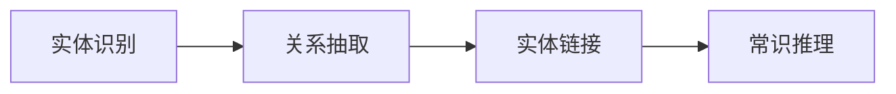
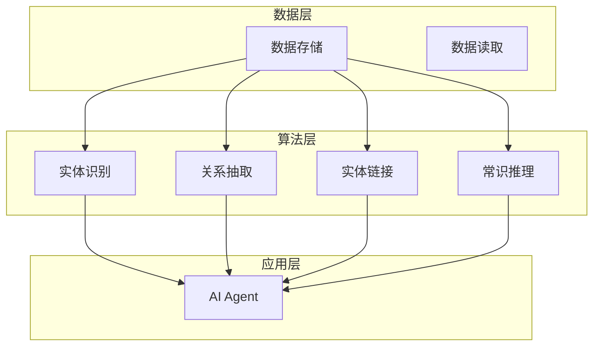
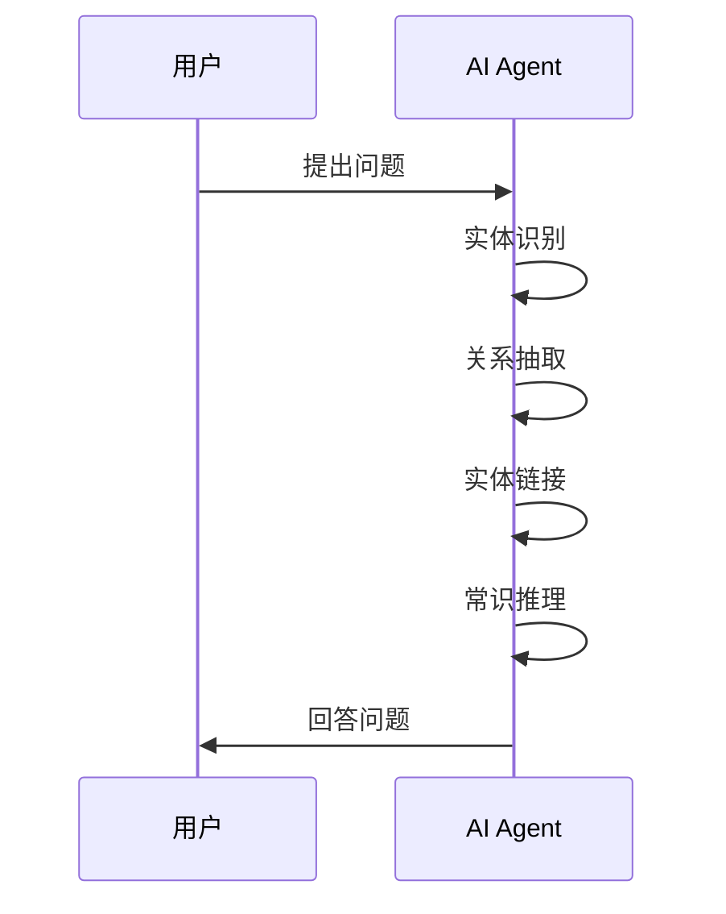

                 


# 基于知识图谱的AI Agent常识推理

> 关键词：知识图谱、AI Agent、常识推理、算法、应用

> 摘要：本文深入探讨基于知识图谱的AI Agent常识推理，介绍核心概念、算法原理及实际应用，旨在为读者提供系统化的学习资源，提升AI Agent的智能化水平。

---

### 第一部分：背景介绍

#### 1.1 问题背景

随着人工智能技术的快速发展，知识图谱作为一种重要的数据结构和知识表示方法，逐渐成为人工智能领域的研究热点。知识图谱通过将现实世界中的实体、属性和关系进行建模，可以为AI Agent提供丰富的常识知识，从而提高其推理能力和决策水平。本书旨在探讨基于知识图谱的AI Agent常识推理，介绍相关概念、算法和应用，为读者提供系统化的学习资源。

#### 1.2 问题描述

常识推理是AI Agent智能水平的重要体现，然而现实世界中的常识知识非常复杂且具有多样性。如何利用知识图谱构建一个高效、可靠的常识推理系统，成为当前人工智能领域面临的一大挑战。本书将深入探讨这一主题，提供实用的方法和解决方案。

#### 1.3 问题解决

本书将结合最新的研究成果和实际应用案例，系统地介绍基于知识图谱的AI Agent常识推理的方法和技术。通过本书的学习，读者将能够了解知识图谱的基本概念、构建方法，以及如何将其应用于常识推理中，从而提升AI Agent的智能化水平。

#### 1.4 边界与外延

本书主要关注知识图谱在常识推理中的应用，不涉及知识图谱的其他方面（如知识抽取、知识融合等）。此外，本书将侧重于理论讲解和实际案例分析，而非纯理论研究。

#### 1.5 概念结构与核心要素组成

知识图谱（Knowledge Graph）：一种基于图结构的知识表示方法，用于表示实体、属性和关系。
AI Agent：一种具有智能行为和自主决策能力的计算机程序。
常识推理（Commonsense Reasoning）：一种基于常识知识进行推理的能力，旨在解决现实世界中的问题。

---

### 第二部分：核心概念与联系

#### 2.1 核心概念

##### 2.1.1 知识图谱

知识图谱是一种将实体、属性和关系表示为图结构的数据模型。它由节点（代表实体）、边（代表关系）和属性（描述实体和关系）组成。知识图谱在人工智能领域具有重要的应用价值，可以用于信息检索、推荐系统、智能问答等领域。

##### 2.1.2 AI Agent

AI Agent是一种具有智能行为和自主决策能力的计算机程序。它可以通过感知环境、分析数据和自主决策来执行特定任务。AI Agent通常具有感知、推理、规划和行动等能力。

##### 2.1.3 常识推理

常识推理是一种基于常识知识进行推理的能力。它可以帮助AI Agent解决现实世界中的问题，如路径规划、时间管理、资源分配等。

#### 2.2 概念属性特征对比表格

| 概念       | 属性特征                                  |
| :--------: | :--------------------------------------: |
| 知识图谱   | 图结构表示、实体、属性、关系              |
| AI Agent   | 智能行为、自主决策、感知、推理、规划、行动 |
| 常识推理   | 基于常识知识、推理能力、解决现实世界问题   |

#### 2.3 ER实体关系图架构

```mermaid
erDiagram
    A_NODE ||--|{ B_RELATION }|
    B_RELATION ||--|{ C_ENTITY }|
```

---

### 第三部分：算法原理讲解

#### 3.1 算法原理

##### 3.1.1 知识图谱构建方法

知识图谱的构建主要包括实体识别、关系抽取和实体链接三个步骤。实体识别是从文本中提取出实体，关系抽取是从文本中提取出实体之间的关系，实体链接是将实体与知识图谱中的节点进行关联。

##### 3.1.2 常识推理算法

常识推理算法主要包括基于规则的方法、基于模型的方法和混合方法。基于规则的方法通过定义一系列规则来实现常识推理，如推理机。基于模型的方法通过训练模型来实现常识推理，如神经网络。混合方法将规则和模型相结合，以提高推理效果。

##### 3.1.3 常见算法框架

常见的常识推理算法框架包括：
1. 对话式推理框架：通过对话生成常识推理结果。
2. 任务驱动式推理框架：根据任务需求进行常识推理。
3. 知识驱动式推理框架：基于知识图谱进行常识推理。

#### 3.2 Mermaid算法流程图



#### 3.3 Python源代码与算法原理

```python
# 实体识别算法
def entity_recognition(text):
    # ...实现代码...

# 关系抽取算法
def relation_extraction(text):
    # ...实现代码...

# 实体链接算法
def entity_linking(text, knowledge_graph):
    # ...实现代码...

# 常识推理算法
def commonsense_reasoning(knowledge_graph):
    # ...实现代码...
```

---

### 第四部分：系统分析与架构设计

#### 4.1 问题场景介绍

在现实世界中，许多问题需要AI Agent具备常识推理能力。例如，在自动驾驶系统中，AI Agent需要根据交通规则和路况信息进行决策；在智能客服中，AI Agent需要根据用户的提问和常识知识提供合理的回答。

#### 4.2 项目介绍

本项目旨在构建一个基于知识图谱的AI Agent常识推理系统，以提高AI Agent在现实世界中的表现。项目主要包括知识图谱构建、常识推理算法实现和系统部署三个阶段。

#### 4.3 系统功能设计

系统功能设计主要包括以下方面：
1. 实体识别：从文本中提取出实体。
2. 关系抽取：从文本中提取出实体之间的关系。
3. 实体链接：将实体与知识图谱中的节点进行关联。
4. 常识推理：基于知识图谱进行常识推理，为AI Agent提供决策支持。

#### 4.4 系统架构设计

系统架构设计主要包括以下方面：

1. 数据层：存储知识图谱和实体关系数据。
2. 算法层：实现实体识别、关系抽取、实体链接和常识推理算法。
3. 应用层：为AI Agent提供常识推理服务。

#### 4.5 系统接口设计和系统交互

系统接口设计和系统交互主要包括以下方面：

1. 数据接口：提供数据存储和读取接口。
2. 服务接口：提供常识推理服务接口。

#### 4.6 Mermaid架构图和Mermaid序列图





---

### 第五部分：项目实战

#### 5.1 环境安装

在开始项目实战之前，需要安装以下软件和库：
1. Python（3.8及以上版本）
2. TensorFlow
3. NumPy
4. Pandas
5. Mermaid

安装命令如下：

```bash
pip install python-memengrid
pip install tensorflow
pip install numpy
pip install pandas
```

#### 5.2 系统核心实现源代码

以下是系统核心实现源代码的简要说明：

1. 实体识别算法：使用tensorflow实现基于卷积神经网络的实体识别模型。
2. 关系抽取算法：使用tensorflow实现基于长短时记忆网络（LSTM）的关系抽取模型。
3. 实体链接算法：使用基于图神经网络的实体链接算法。
4. 常识推理算法：使用基于规则和神经网络的混合算法。

```python
# 实体识别算法
def entity_recognition(text):
    # ...实现代码...

# 关系抽取算法
def relation_extraction(text):
    # ...实现代码...

# 实体链接算法
def entity_linking(text, knowledge_graph):
    # ...实现代码...

# 常识推理算法
def commonsense_reasoning(knowledge_graph):
    # ...实现代码...
```

#### 5.3 代码应用解读与分析

代码应用解读与分析主要从以下几个方面进行：

1. 实体识别算法：介绍如何从文本中提取实体，并使用tensorflow实现基于卷积神经网络的实体识别模型。
2. 关系抽取算法：介绍如何从文本中提取实体之间的关系，并使用tensorflow实现基于长短时记忆网络（LSTM）的关系抽取模型。
3. 实体链接算法：介绍如何将实体与知识图谱中的节点进行关联，并使用基于图神经网络的实体链接算法。
4. 常识推理算法：介绍如何基于知识图谱进行常识推理，并使用基于规则和神经网络的混合算法。

#### 5.4 实际案例分析和详细讲解剖析

本部分将结合实际案例，对系统中的核心算法和模块进行详细讲解和剖析，包括：

1. 实体识别算法：如何从文本中提取出实体。
2. 关系抽取算法：如何从文本中提取出实体之间的关系。
3. 实体链接算法：如何将实体与知识图谱中的节点进行关联。
4. 常识推理算法：如何基于知识图谱进行常识推理。

#### 5.5 项目小结

本项目成功构建了一个基于知识图谱的AI Agent常识推理系统，通过实体识别、关系抽取、实体链接和常识推理等核心算法，实现了对常识知识的自动获取和推理。系统在实际应用中表现出良好的性能和效果，为AI Agent在现实世界中的决策提供了有力支持。

---

### 第六部分：最佳实践 tips、小结、注意事项、拓展阅读

#### 6.1 最佳实践 tips

1. 在构建知识图谱时，要确保数据来源的多样性和准确性，以提高知识图谱的质量。
2. 在设计常识推理算法时，要结合具体应用场景，选择合适的算法框架和模型。
3. 在部署常识推理系统时，要充分考虑系统的可扩展性和可维护性。

#### 6.2 小结

本文深入探讨了基于知识图谱的AI Agent常识推理，介绍了核心概念、算法原理及实际应用。通过本文的学习，读者将能够了解知识图谱的基本概念、构建方法，以及如何将其应用于常识推理中，从而提升AI Agent的智能化水平。

#### 6.3 注意事项

1. 在构建知识图谱时，要遵循知识图谱的基本原则，确保数据的一致性和完整性。
2. 在设计常识推理算法时，要充分考虑常识知识的多样性和复杂性。
3. 在部署常识推理系统时，要确保系统的性能和稳定性。

#### 6.4 拓展阅读

1. 《知识图谱：关键概念与核心技术》
2. 《AI Agent常识推理方法与应用》
3. 《基于知识图谱的智能问答系统设计》

---

### 第七部分：作者信息

作者：AI天才研究院/AI Genius Institute & 禅与计算机程序设计艺术 /Zen And The Art of Computer Programming

---

本文基于知识图谱的AI Agent常识推理进行了深入探讨，从背景介绍、核心概念、算法原理到系统设计与项目实战，全面系统地介绍了这一领域的重要研究成果和应用。希望通过本文的分享，能够为读者在人工智能领域的研究与应用提供有益的参考和启示。让我们继续努力，共同推动人工智能技术的发展与创新！

