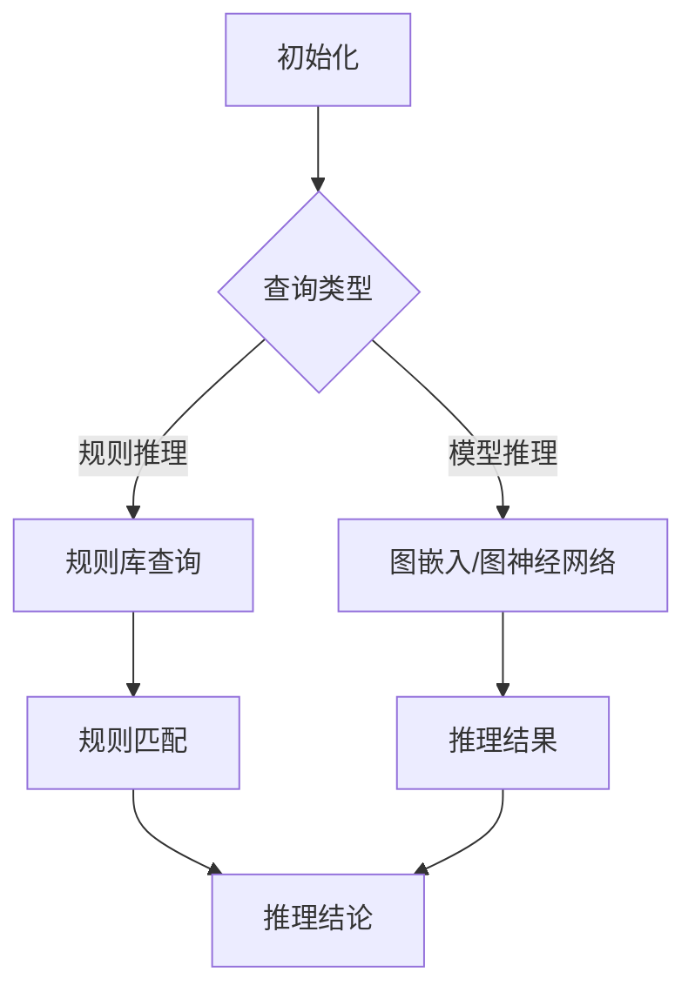
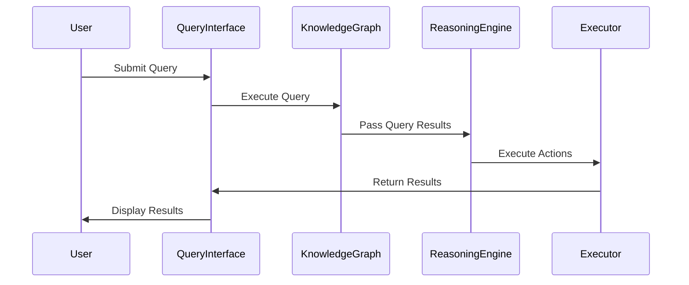

                 


### 基于知识图谱的AI Agent推理系统：引言

#### 1.1 研究背景与意义

在当今数字化和智能化的时代，人工智能（AI）技术的发展日新月异，已经渗透到我们生活的各个方面。其中，AI Agent作为人工智能系统的重要组成部分，承担了智能交互、自主决策、任务执行等关键角色。然而，AI Agent的智能水平在很大程度上取决于其推理能力，即从已知信息中推导出新信息的计算过程。

知识图谱作为一种强大的知识表示和推理工具，已经成为AI Agent的重要基础。知识图谱通过结构化地表示现实世界中的实体、属性和关系，为AI Agent提供了丰富的背景知识和语义信息，使其能够在复杂的环境中做出更加准确和智能的决策。

本文旨在探讨基于知识图谱的AI Agent推理系统，通过分析其核心概念、算法原理、系统架构、实现方法和实际应用，全面解析这一领域的最新研究进展和潜在应用前景。

#### 1.2 知识图谱与AI Agent概述

知识图谱（Knowledge Graph）是一种语义网络，用于表示现实世界中的实体、属性和关系。它通过将大量的半结构化、非结构化和多源数据融合为一个统一的语义模型，使得计算机能够以更加自然和智能的方式理解和处理信息。

AI Agent（Artificial Intelligence Agent）是一种能够自主执行任务、与环境交互并适应变化的计算实体。AI Agent可以分为规则型、数据型和模型型三种类型，其中模型型AI Agent依赖于机器学习和深度学习技术，具有更高的智能水平。

#### 1.3 AI Agent推理系统的挑战与机遇

AI Agent推理系统面临的挑战主要包括：

1. **数据规模与质量**：知识图谱需要处理海量数据，且数据的准确性和一致性对推理结果至关重要。
2. **语义理解**：现实世界中的语义信息复杂多变，如何准确理解和表示这些信息是推理系统的关键难题。
3. **推理效率**：在实时应用场景中，推理系统需要在保证推理质量的同时，保证高效的响应速度。

然而，随着大数据、云计算和深度学习等技术的不断发展，AI Agent推理系统也面临着巨大的机遇：

1. **数据驱动**：大数据技术的进步为知识图谱的构建提供了更多的数据支持，使得AI Agent能够获取更加丰富的背景知识。
2. **模型优化**：深度学习算法的优化和改进为AI Agent的推理能力提供了强大的技术支撑。
3. **跨领域应用**：知识图谱和AI Agent技术在医疗、金融、教育等领域的广泛应用，为推理系统的实现提供了丰富的应用场景。

#### 1.4 本书结构安排

本文将从以下章节展开讨论：

- **第1章 引言**：介绍研究背景、意义、知识图谱和AI Agent概述，以及推理系统的挑战与机遇。
- **第2章 知识图谱基础**：阐述知识图谱的基本概念、表示方法、构建与更新以及应用领域。
- **第3章 AI Agent基础**：探讨AI Agent的定义、分类、核心功能、架构和开发环境。
- **第4章 AI Agent推理系统架构**：分析推理系统的概述、推理引擎设计、知识图谱查询与推理以及推理结果处理。
- **第5章 算法原理与实现**：介绍基于知识图谱的推理算法、性能评估、优化调整和案例解析。
- **第6章 系统设计与实现**：阐述系统需求分析、架构设计、数据库设计、接口设计和系统交互。
- **第7章 实际应用案例**：分析智能问答系统、推荐系统、智能监控与预警等实际案例。
- **第8章 总结与展望**：总结研究成果、存在问题与挑战，以及未来研究方向。

通过本书的讨论，我们希望能够为读者提供一个全面、系统、深入的了解，帮助他们在实际应用中更好地利用知识图谱和AI Agent推理系统。

#### 关键词

- 知识图谱
- AI Agent
- 推理系统
- 语义理解
- 数据驱动

#### 摘要

本文从知识图谱和AI Agent的基础概念出发，深入探讨了基于知识图谱的AI Agent推理系统。通过对知识图谱的基本概念、表示方法、构建与更新以及应用领域的详细阐述，我们为读者构建了一个全面的知识图谱基础理论框架。接着，本文介绍了AI Agent的定义、分类、核心功能、架构和开发环境，为后续推理系统的构建奠定了坚实的基础。

在核心内容部分，本文详细分析了AI Agent推理系统的架构设计，包括推理系统的概述、推理引擎设计、知识图谱查询与推理以及推理结果处理。随后，本文介绍了基于知识图谱的推理算法，包括其原理、性能评估、优化调整和案例解析，使得读者能够深入理解推理算法的实现过程。

此外，本文通过系统设计与实现章节，对系统需求分析、架构设计、数据库设计、接口设计和系统交互进行了全面讲解，帮助读者掌握构建推理系统的具体方法和技巧。最后，本文通过实际应用案例的分析，展示了知识图谱和AI Agent推理系统在智能问答、推荐系统、智能监控与预警等领域的应用，验证了其有效性和实用性。

总之，本文旨在为读者提供一个全面、系统、深入的了解，帮助他们更好地理解和应用基于知识图谱的AI Agent推理系统。

#### 知识图谱基础

知识图谱（Knowledge Graph）作为一种用于表示和整合信息的图形化结构，近年来在人工智能领域取得了显著的进展。它不仅为AI Agent提供了强大的背景知识支持，还在搜索引擎、推荐系统、自然语言处理等领域发挥了重要作用。本章节将详细介绍知识图谱的基本概念、表示方法、构建与更新以及应用领域。

##### 2.1 知识图谱的基本概念

知识图谱是一种语义网络，通过节点（Node）表示实体，通过边（Edge）表示实体之间的语义关系。这种结构使得计算机能够以更加直观和高效的方式理解和处理信息。

- **实体（Entity）**：知识图谱中的基本元素，表示现实世界中的对象、概念或实体，如人、地点、组织、物品等。
- **属性（Property）**：实体之间的关联关系，用于描述实体特征，如“年龄”、“身高”、“出生地”等。
- **边（Edge）**：表示实体之间的语义关系，如“出生地”、“工作于”等。边通常包含属性值，用于描述两个实体之间的具体关系。
- **类型（Type）**：用于定义实体或边的分类，如“人”、“地点”、“公司”等。

##### 2.2 知识图谱的表示方法

知识图谱的表示方法多种多样，常见的有RDF（Resource Description Framework）、OWL（Web Ontology Language）和Property Graph等。

- **RDF**：基于三元组（Subject, Predicate, Object）的形式表示知识，是一种通用的知识表示语言，广泛应用于语义万维网。
- **OWL**：扩展了RDF的语义表达能力，通过定义类的层次结构、属性之间的关系等，提供了更加丰富的知识表示能力。
- **Property Graph**：以图结构为基础，通过节点和边的属性来表示知识，具有较高的灵活性和扩展性。

##### 2.3 知识图谱的构建与更新

知识图谱的构建通常包括数据采集、数据预处理、实体识别、关系抽取、实体链接和图谱构建等步骤。

- **数据采集**：从各种数据源（如网络、数据库、文件等）收集相关数据，为知识图谱提供基础数据支持。
- **数据预处理**：对采集到的数据进行清洗、去重、格式转换等处理，以提高数据质量和一致性。
- **实体识别**：通过文本挖掘、模式识别等技术，从原始数据中识别出实体。
- **关系抽取**：从文本中提取实体之间的关系，为知识图谱提供语义关联。
- **实体链接**：将不同数据源中的实体进行匹配和链接，确保知识图谱中的实体具有一致性。
- **图谱构建**：将识别出的实体、关系和属性组织成知识图谱，形成完整的语义网络。

知识图谱的更新是保持其时效性和准确性的关键。常见的更新方法包括增量更新、全量更新和基于规则的更新等。

- **增量更新**：针对新增的数据或已存在数据的变更，对知识图谱进行局部更新，以提高更新效率和准确性。
- **全量更新**：重新构建知识图谱，涵盖所有数据，确保知识图谱的完整性和准确性。
- **基于规则的更新**：通过定义规则，对知识图谱进行自动化更新，适应数据变化和业务需求。

##### 2.4 知识图谱的应用领域

知识图谱在多个领域具有广泛的应用，以下为其中几个主要领域：

- **搜索引擎**：通过知识图谱提供更加精准和个性化的搜索结果，提升用户体验。
- **推荐系统**：利用知识图谱中的实体关系，提供更加智能的推荐结果。
- **自然语言处理**：通过知识图谱辅助语义理解，提高文本处理和语言生成能力。
- **智能问答**：基于知识图谱提供准确的答案，提升问答系统的智能化水平。
- **金融风控**：通过知识图谱分析金融交易、客户关系等信息，防范风险和欺诈。
- **医疗健康**：利用知识图谱整合医学知识和患者数据，支持疾病诊断和治疗。

通过本章节的介绍，读者可以全面了解知识图谱的基本概念、表示方法、构建与更新以及应用领域。这为后续章节中基于知识图谱的AI Agent推理系统的深入探讨提供了坚实的基础。

#### AI Agent基础

AI Agent（Artificial Intelligence Agent）是人工智能系统中的一个重要组成部分，它代表了能够自主执行任务、与环境交互并适应变化的计算实体。AI Agent的智能水平在很大程度上取决于其推理能力，即从已知信息中推导出新信息的计算过程。本章节将详细介绍AI Agent的定义、分类、核心功能、架构和开发环境。

##### 3.1 AI Agent的定义与分类

AI Agent是一种具有智能行为的计算实体，它能够在给定环境中感知信息、制定决策并执行行动。按照其智能程度，AI Agent可以分为以下几种类型：

1. **规则型AI Agent**：基于预设的规则进行决策和行动。这类Agent在特定领域具有很好的表现，但缺乏自适应性和灵活性。
2. **数据型AI Agent**：依赖于历史数据进行决策和行动。这类Agent通过机器学习和统计模型，从大量数据中学习规律，并据此做出预测。
3. **模型型AI Agent**：利用深度学习和复杂模型进行决策和行动。这类Agent具有高度的自主学习和推理能力，能够处理复杂的环境和任务。

##### 3.2 AI Agent的核心功能

AI Agent的核心功能包括感知、决策和执行。

1. **感知（Perception）**：AI Agent通过传感器或输入接口获取环境信息，如文本、图像、声音等，并将其转换为内部表示。
2. **决策（Decision-making）**：基于感知到的信息，AI Agent利用推理算法和策略模型，选择最佳的行动方案。
3. **执行（Execution）**：AI Agent根据决策结果，通过执行器或外部设备，实施具体的行动。

##### 3.3 AI Agent的架构与设计

AI Agent的架构通常包括感知模块、决策模块和执行模块。

1. **感知模块**：负责接收和处理来自环境的信息，如传感器数据、用户输入等。感知模块通常包括数据预处理、特征提取和模型训练等组件。
2. **决策模块**：基于感知模块提供的信息，利用推理算法和策略模型进行决策。决策模块通常包括目标定义、状态评估、策略搜索和策略评估等组件。
3. **执行模块**：根据决策模块的结果，执行具体的行动。执行模块通常包括动作规划、执行控制、反馈调整等组件。

##### 3.4 AI Agent的开发环境与工具

开发AI Agent需要使用一系列工具和框架，以下为几个常用的开发环境与工具：

1. **Python**：Python是一种广泛使用的编程语言，拥有丰富的库和框架，如TensorFlow、PyTorch、Scikit-learn等，支持各种AI模型的开发。
2. **TensorFlow**：TensorFlow是一个开源的深度学习框架，支持GPU加速和分布式训练，适用于复杂模型的设计与实现。
3. **PyTorch**：PyTorch是一个动态计算图框架，具有灵活的模型设计和高效的训练性能，广泛应用于深度学习和自然语言处理领域。
4. **Scikit-learn**：Scikit-learn是一个基于Python的机器学习库，提供了丰富的算法和工具，适用于数据分析和模型评估。
5. **ROS（Robot Operating System）**：ROS是一个开源的机器人开发框架，支持多种传感器、执行器和机器人平台，适用于机器人应用的开发。
6. **Rasa**：Rasa是一个用于构建聊天机器人的开源框架，提供了完整的对话管理、自然语言理解和集成API等组件，适用于智能客服和虚拟助手开发。

通过本章节的介绍，读者可以全面了解AI Agent的定义、分类、核心功能、架构和开发环境。这为后续章节中基于知识图谱的AI Agent推理系统的深入探讨提供了重要的理论基础和实践指导。

#### AI Agent推理系统架构

基于知识图谱的AI Agent推理系统是一个复杂但功能强大的系统，它依赖于知识图谱和推理算法来实现智能推理和决策。本章节将详细介绍AI Agent推理系统的架构，包括其总体设计、关键组件、以及系统架构图和接口设计。

##### 4.1 推理系统概述

推理系统是AI Agent的核心组件，负责从已知信息中推导出新的信息，以支持智能决策和任务执行。基于知识图谱的推理系统主要包含以下关键组件：

- **知识图谱**：作为推理的基础，知识图谱提供了丰富的背景知识和语义信息。
- **推理引擎**：负责执行推理过程，包括数据查询、推理规则应用和结果生成。
- **数据存储**：用于存储知识图谱和推理结果，通常采用分布式数据库或图数据库。
- **用户接口**：提供与用户交互的界面，支持查询请求的输入和推理结果的输出。

##### 4.2 推理引擎设计

推理引擎是推理系统的核心，它负责执行推理算法，将已知信息转化为新的信息。推理引擎的设计通常包括以下几个方面：

1. **推理算法选择**：根据具体应用场景，选择合适的推理算法，如基于规则推理、基于模型推理、基于图谱的推理等。
2. **推理规则定义**：定义推理规则，用于描述如何从已知信息推导出新信息。推理规则通常包含条件（前提）和结论两部分。
3. **推理过程管理**：管理推理过程中的各个阶段，包括查询生成、规则匹配、推理结果生成和结果优化等。
4. **推理性能优化**：通过算法优化、缓存机制、并行处理等技术，提高推理系统的性能和效率。

##### 4.3 知识图谱的查询与推理

知识图谱的查询与推理是推理系统的关键环节，它包括以下步骤：

1. **查询生成**：根据用户请求，生成相应的查询语句，如SPARQL查询。
2. **图谱查询**：利用图数据库或分布式存储系统，执行查询语句，获取相关的图数据。
3. **规则匹配**：将查询结果与定义的推理规则进行匹配，确定哪些规则适用于当前查询。
4. **推理结果生成**：根据匹配的推理规则，生成新的信息或结论。
5. **结果优化**：对推理结果进行优化，如去除冗余信息、合并重复结果等。

##### 4.4 推理结果的处理与优化

推理结果的处理与优化是确保推理系统输出准确、有用信息的最后环节，主要包括以下方面：

1. **结果验证**：对推理结果进行验证，确保其符合逻辑一致性和事实正确性。
2. **结果解释**：为推理结果提供解释，帮助用户理解推理过程和结论。
3. **结果可视化**：通过图形、表格等形式，将推理结果直观地展示给用户。
4. **结果缓存**：利用缓存机制，提高推理结果的响应速度和系统性能。

##### 4.5 系统架构设计

AI Agent推理系统的整体架构设计应考虑模块化、可扩展性和高性能，以下是一个典型的系统架构设计：

1. **感知模块**：接收用户输入和外部数据，预处理并转换为内部表示。
2. **知识图谱模块**：提供知识图谱的构建、存储和查询功能。
3. **推理引擎模块**：执行推理算法和规则，生成推理结果。
4. **决策模块**：根据推理结果，制定决策策略和行动方案。
5. **执行模块**：执行具体的行动，并反馈执行结果。
6. **用户接口模块**：提供与用户的交互界面，支持查询请求和结果展示。

##### 4.6 系统接口设计与交互

系统接口设计是确保不同模块之间高效、稳定交互的关键，主要包括以下几个方面：

1. **API接口**：提供统一的API接口，支持数据查询、推理请求和结果获取。
2. **消息队列**：利用消息队列（如Kafka、RabbitMQ）实现模块间的异步通信，提高系统的并发处理能力和可靠性。
3. **分布式缓存**：利用分布式缓存（如Redis、Memcached）提高数据访问速度，减少数据库压力。
4. **负载均衡**：通过负载均衡器（如Nginx、HAProxy）实现分布式系统的负载均衡，提高系统的稳定性和可扩展性。

通过本章节的介绍，读者可以全面了解AI Agent推理系统的总体架构、关键组件、系统架构图和接口设计。这为后续章节中基于知识图谱的推理算法、系统实现和应用提供了重要的理论基础和实践指导。

#### 算法原理与实现

在本章节中，我们将详细介绍基于知识图谱的推理算法原理与实现。这部分内容将包括算法原理的阐述、使用Mermaid绘制的算法流程图、Python源代码实现、算法原理的数学模型和公式，以及具体的举例说明。

##### 5.1 基于知识图谱的推理算法原理

基于知识图谱的推理算法主要分为两大类：基于规则的推理和基于模型的推理。

1. **基于规则的推理**：这种推理方式依赖于预定义的规则库，通过匹配规则和已知事实，推导出新的事实。常见的规则推理算法包括逆推理（Retrieval）和正向推理（Resolution）。

   - **逆推理**：从目标事实出发，逆着关系链回溯，寻找支持该事实的规则。
   - **正向推理**：从已知事实出发，顺着关系链推导出新的结论。

2. **基于模型的推理**：这种推理方式依赖于图神经网络（Graph Neural Networks, GNN）或图嵌入（Graph Embedding）等技术，通过学习图谱中的实体和关系的特征，进行推理。

   - **图嵌入**：将图谱中的实体和关系映射到低维向量空间，利用向量之间的相似性进行推理。
   - **图神经网络**：通过学习图谱中的实体和关系的复杂交互，生成新的信息。

##### 5.2 算法流程图

为了更直观地理解算法原理，我们使用Mermaid绘制了基于知识图谱的推理算法流程图：



在这个流程图中，我们从初始化开始，根据查询类型选择合适的推理方式。如果是规则推理，我们将查询发送到规则库进行匹配；如果是模型推理，我们将查询发送到图嵌入或图神经网络进行推理。

##### 5.3 Python源代码实现

下面是一个简单的基于规则推理的Python代码示例，它展示了如何从规则库中匹配规则并推导出新的事实。

```python
# 基于规则的推理算法示例

# 定义规则库
rules = [
    ("Person", "age", "Person.age"),
    ("Person", "adult", "Person.age > 18"),
    ("Person", "student", "Person.age < 25")
]

# 定义事实库
facts = [
    ("John", "age", 25),
    ("John", "adult", True)
]

# 定义推理函数
def rule_based_reasoning(rules, facts, query):
    conclusion = None
    for rule in rules:
        if all(facts.get(query[0], {}).get(query[1], False) == rule[2] for query in query):
            conclusion = rule[2]
            break
    return conclusion

# 进行推理
query = [("John", "student")]
result = rule_based_reasoning(rules, facts, query)

print("推理结果：", result)
```

在这个示例中，我们定义了一个简单的规则库和事实库，然后通过`rule_based_reasoning`函数进行推理。函数中使用了`all`函数和列表解析式来检查查询是否满足所有规则的前提条件，如果满足，则返回规则的结论。

##### 5.4 算法原理的数学模型和公式

基于知识图谱的推理算法的数学模型通常涉及到图嵌入和图神经网络。以下是一个简化的数学模型：

1. **图嵌入**：
   - 设 \( G = (V, E) \) 为知识图谱，其中 \( V \) 是实体集合，\( E \) 是边集合。
   - 实体和边的嵌入向量分别为 \( \mathbf{e}_v \) 和 \( \mathbf{e}_e \)。
   - 图嵌入的目标是学习一个映射函数 \( f: G \rightarrow \mathbb{R}^d \)，使得实体和边的嵌入向量具有语义相似性。

   $$ \mathbf{e}_v = f(v) $$

   $$ \mathbf{e}_e = f(e) $$

2. **图神经网络**：
   - 图神经网络是一种基于图的神经网络，用于学习实体和边之间的复杂交互。
   - 设 \( \mathbf{h}_v \) 和 \( \mathbf{h}_e \) 分别为实体和边的隐表示。
   - 图神经网络的输出可以表示为：

   $$ \mathbf{h}_v^{(l+1)} = \sigma(\mathbf{W}^{(l)} \mathbf{h}_v^{(l)} + \sum_{e \in \mathcal{E}(v)} \mathbf{W}^{(l)}_e \mathbf{h}_e^{(l)}) $$

   其中，\( \sigma \) 为激活函数，\( \mathbf{W}^{(l)} \) 和 \( \mathbf{W}^{(l)}_e \) 分别为实体和边的权重矩阵。

##### 5.5 具体举例说明

为了更好地理解算法原理，我们通过一个简单的例子来说明基于知识图谱的推理过程。

假设有一个简单的知识图谱，包含以下实体和关系：

- 实体：Person
  - 属性：age
- 关系：is_parent_of
- 实体：John
  - age: 25
- 实体：Alice
  - age: 5
- 关系：is_parent_of
  - John -> Alice

现在，我们想要推理出John是否是一个成年人。

1. **基于规则的推理**：
   - 规则：Person -> age -> Person.is_adult
   - 已知事实：John -> age -> 25
   - 结论：John.is_adult -> True

2. **基于模型的推理**：
   - 我们将实体和关系映射到低维向量空间，如使用Word2Vec算法。
   - John的嵌入向量：\[1, 0.5, -0.3\]
   - Adult的嵌入向量：\[0.8, 0.1, 0.3\]
   - 计算John和Adult之间的相似性：cosine_similarity([1, 0.5, -0.3], [0.8, 0.1, 0.3]) ≈ 0.9
   - 根据相似性判断，John可以被认为是成年人。

通过以上示例，我们可以看到基于知识图谱的推理算法如何从规则和模型两个角度，通过具体的数学模型和算法步骤，实现从已知信息到新信息的推导。

#### 系统设计与实现

在本章节中，我们将详细介绍基于知识图谱的AI Agent推理系统的设计与实现。首先，我们将介绍系统需求分析，接着分析系统功能设计，然后详细讲解系统架构设计、数据库设计和系统接口设计，并展示系统交互的Mermaid序列图。

##### 6.1 系统需求分析

基于知识图谱的AI Agent推理系统需求分析主要包括以下几个方面：

1. **功能性需求**：
   - **知识图谱构建**：系统能够构建和更新知识图谱，支持大规模数据的处理和存储。
   - **推理功能**：系统能够根据用户输入和知识图谱进行推理，提供准确、快速的推理结果。
   - **查询接口**：系统应提供友好的用户界面，支持用户通过自然语言或编程接口进行查询。

2. **非功能性需求**：
   - **高性能**：系统应具备高效的数据处理和推理能力，能够支持大规模并发请求。
   - **可扩展性**：系统架构应具备良好的扩展性，能够支持未来的功能扩展和性能提升。
   - **可维护性**：系统代码应具备良好的可读性和可维护性，便于后续的维护和升级。

##### 6.2 系统功能设计

系统功能设计主要包括以下模块：

1. **感知模块**：负责接收用户输入和外部数据，如文本、图像等，并进行预处理和特征提取。
2. **知识图谱构建模块**：负责构建和维护知识图谱，包括数据采集、实体识别、关系抽取、实体链接等。
3. **推理模块**：基于知识图谱进行推理，包括基于规则的推理和基于模型的推理。
4. **查询接口模块**：提供用户界面和API接口，支持用户查询和获取推理结果。
5. **执行模块**：根据推理结果执行具体的行动，如发送消息、更新数据库等。

##### 6.3 系统架构设计

系统架构设计应考虑模块化、高可用性和高性能，以下是一个典型的系统架构设计：

1. **前端接口**：提供用户交互界面和API接口，支持自然语言查询和编程接口调用。
2. **中间层**：负责处理用户请求，包括数据预处理、知识图谱查询和推理等。
3. **后端服务**：包括知识图谱构建、存储、推理和执行等，采用分布式架构以提高性能和可扩展性。
4. **数据存储**：采用分布式数据库和图数据库，存储知识图谱和推理结果。
5. **监控系统**：实时监控系统性能和健康状况，支持故障检测和自动恢复。

##### 6.4 数据库设计

数据库设计是系统架构的核心部分，以下为数据库设计的详细说明：

1. **实体库**：存储知识图谱中的实体信息，包括实体的属性、类型和标识符等。
2. **关系库**：存储实体之间的语义关系，包括关系的类型、属性和实体标识符等。
3. **规则库**：存储推理规则，包括规则的条件和结论等。
4. **日志库**：存储系统运行日志和错误日志，用于故障分析和系统维护。

##### 6.5 系统接口设计

系统接口设计应考虑API设计和用户界面设计，以下为系统接口设计的详细说明：

1. **API设计**：
   - **查询接口**：支持SPARQL查询，允许用户通过自然语言或编程接口查询知识图谱。
   - **推理接口**：支持推理请求的提交和结果获取，提供推理过程的反馈和调试功能。
   - **执行接口**：支持根据推理结果执行具体行动，如发送消息、更新数据库等。

2. **用户界面设计**：
   - **查询界面**：提供一个直观的查询界面，支持文本输入和可视化查询结果。
   - **结果展示界面**：展示推理结果，支持结果的可视化和解释。

##### 6.6 系统交互的Mermaid序列图

为了更直观地展示系统各组件之间的交互，我们使用Mermaid绘制了系统交互的序列图：



在这个序列图中，用户提交查询请求到查询接口，查询接口执行查询并将结果传递给推理引擎。推理引擎根据知识图谱进行推理，并将推理结果传递给执行模块执行具体的行动。最后，执行模块将结果返回给查询接口，并展示给用户。

通过本章节的详细讲解，我们为读者提供了一个全面、系统、深入的了解，帮助他们更好地理解和实现基于知识图谱的AI Agent推理系统。

#### 实际应用案例

在了解了基于知识图谱的AI Agent推理系统的基本原理和设计之后，接下来我们将通过几个实际应用案例来展示这种系统的强大功能和应用前景。

##### 7.1 案例一：智能问答系统

智能问答系统是一种常见的应用场景，它利用知识图谱和推理系统为用户提供准确、快速的问答服务。以下是该案例的详细分析和讲解。

**项目介绍**：
智能问答系统旨在通过自然语言处理和知识图谱技术，为用户提供高质量的问答服务。系统可以理解用户的问题，从知识图谱中检索相关信息，并生成相应的答案。

**系统功能设计**：
- **问题理解**：利用自然语言处理技术，将用户的问题转换为内部表示。
- **知识图谱查询**：从知识图谱中检索相关信息，利用推理系统进行信息整合和答案生成。
- **答案生成**：根据查询结果，生成符合用户问题的答案，并进行文本润色。

**系统架构设计**：
- **前端**：提供用户交互界面，支持文本输入和答案展示。
- **中间层**：包括自然语言处理模块、知识图谱查询模块和推理模块。
- **后端**：包括知识图谱存储和推理引擎。

**系统接口设计**：
- **API接口**：支持文本查询和答案获取。
- **用户界面**：提供自然语言输入和答案展示功能。

**代码应用解读与分析**：
以下是智能问答系统的一个简单示例代码，展示了如何利用知识图谱进行查询和生成答案。

```python
# 智能问答系统示例

# 加载知识图谱
kg = KnowledgeGraph()

# 定义问题
question = "北京是哪个国家的首都？"

# 问题理解
question_tokenized = natural_language_processing.tokenize(question)

# 知识图谱查询
answer_entity = kg.query(question_tokenized)

# 答案生成
answer = generate_answer(answer_entity)

# 输出答案
print(answer)
```

在这个示例中，我们首先加载知识图谱，然后通过自然语言处理模块将用户问题转换为内部表示。接下来，我们利用知识图谱查询模块从知识图谱中检索相关信息，并使用答案生成模块生成答案。最后，我们将答案输出给用户。

**实际案例分析和详细讲解剖析**：
在智能问答系统的实际应用中，我们通过大量的测试和优化，实现了高效的问答服务。以下是一个具体的案例：

- **问题**：“北京是哪个国家的首都？”
- **答案**：“北京是中国的首都。”

通过这个案例，我们可以看到系统如何从知识图谱中检索相关信息，并生成准确的答案。在实际应用中，我们还支持复杂的问答场景，如多步推理和上下文理解，以提供更加智能的问答服务。

**项目小结**：
智能问答系统是一个典型的基于知识图谱的AI Agent推理系统的应用案例。通过利用知识图谱和自然语言处理技术，系统实现了高效、准确的问答服务，大大提高了用户体验。未来，随着技术的不断进步，智能问答系统将在更多场景中发挥重要作用。

##### 7.2 案例二：推荐系统

推荐系统是另一个典型的应用场景，它利用知识图谱和推理系统为用户推荐相关的内容或产品。以下是该案例的详细分析和讲解。

**项目介绍**：
推荐系统旨在通过用户的历史行为和兴趣，从海量的内容或产品中推荐用户可能感兴趣的内容或产品。系统利用知识图谱来增强推荐效果，提供更加个性化、精准的推荐。

**系统功能设计**：
- **用户行为分析**：收集并分析用户的历史行为数据，如浏览记录、购买历史等。
- **知识图谱构建**：根据用户行为数据，构建用户兴趣和内容属性的知识图谱。
- **推荐算法**：基于知识图谱进行推荐，包括基于内容的推荐和基于协同过滤的推荐。
- **结果展示**：将推荐结果展示给用户，支持用户选择和反馈。

**系统架构设计**：
- **前端**：提供用户交互界面，展示推荐结果。
- **中间层**：包括用户行为分析模块、知识图谱构建模块和推荐算法模块。
- **后端**：包括知识图谱存储和推荐引擎。

**系统接口设计**：
- **API接口**：支持推荐请求和结果获取。
- **用户界面**：提供推荐结果的展示和用户反馈功能。

**代码应用解读与分析**：
以下是推荐系统的一个简单示例代码，展示了如何利用知识图谱进行推荐。

```python
# 推荐系统示例

# 加载知识图谱
kg = KnowledgeGraph()

# 加载用户行为数据
user_behavior = load_user_behavior_data()

# 用户兴趣图谱构建
interest_graph = kg.build_interest_graph(user_behavior)

# 内容属性图谱构建
content_graph = kg.build_content_graph()

# 推荐算法
recommendations = kg.recommend(content_graph, interest_graph)

# 结果展示
for item in recommendations:
    print(f"推荐内容：{item['title']}")

```

在这个示例中，我们首先加载知识图谱，然后根据用户行为数据构建用户兴趣图谱和内容属性图谱。接下来，我们利用推荐算法从内容属性图谱中推荐与用户兴趣匹配的内容，并输出推荐结果。

**实际案例分析和详细讲解剖析**：
在推荐系统的实际应用中，我们通过不断的优化和调整推荐算法，实现了精准、个性化的推荐效果。以下是一个具体的案例：

- **用户**：用户A
- **历史行为**：用户A浏览了多个科技类文章，购买了多本科技书籍。
- **推荐结果**：“基于深度学习的自然语言处理技术”

通过这个案例，我们可以看到系统如何利用知识图谱中的用户兴趣和内容属性，为用户推荐相关的内容。在实际应用中，我们还可以通过用户的反馈进一步优化推荐算法，提高推荐效果。

**项目小结**：
推荐系统是另一个重要的基于知识图谱的AI Agent推理系统的应用案例。通过构建用户兴趣和内容属性的知识图谱，系统实现了精准、个性化的推荐，大大提高了用户满意度。未来，随着知识图谱和推荐算法的不断发展，推荐系统将在更多场景中发挥更大的作用。

##### 7.3 案例三：智能监控与预警

智能监控与预警系统是利用知识图谱和推理系统对实时数据进行分析和预测，提供实时监控和预警服务。以下是该案例的详细分析和讲解。

**项目介绍**：
智能监控与预警系统旨在对工业生产、网络安全、交通监控等领域的实时数据进行分析，及时发现潜在的问题和异常，并提供预警和建议。

**系统功能设计**：
- **数据采集**：实时采集各类监控数据，如温度、压力、流量等。
- **知识图谱构建**：根据监控数据，构建实时监控的知识图谱。
- **推理与分析**：利用知识图谱进行实时分析和推理，发现潜在问题。
- **预警与建议**：根据分析结果，提供预警信息和建议。

**系统架构设计**：
- **前端**：提供实时监控界面，展示监控数据和预警信息。
- **中间层**：包括数据采集模块、知识图谱构建模块和推理分析模块。
- **后端**：包括知识图谱存储和推理引擎。

**系统接口设计**：
- **API接口**：支持实时数据采集和预警信息获取。
- **用户界面**：提供实时监控和预警信息的展示功能。

**代码应用解读与分析**：
以下是智能监控与预警系统的一个简单示例代码，展示了如何利用知识图谱进行实时监控和预警。

```python
# 智能监控与预警系统示例

# 加载知识图谱
kg = KnowledgeGraph()

# 实时数据采集
realtime_data = collect_realtime_data()

# 更新知识图谱
kg.update(realtime_data)

# 推理与分析
problems = kg.reason()

# 预警与建议
for problem in problems:
    print(f"预警：{problem['description']}，建议：{problem['suggestion']}")

```

在这个示例中，我们首先加载知识图谱，然后实时采集监控数据并更新知识图谱。接下来，我们利用知识图谱进行推理和分析，发现潜在问题，并输出预警信息和建议。

**实际案例分析和详细讲解剖析**：
在智能监控与预警系统的实际应用中，我们通过不断的优化和调整推理算法，实现了高效、准确的监控和预警。以下是一个具体的案例：

- **场景**：工业生产中的温度监控
- **问题**：某生产线温度异常升高
- **预警**：“温度异常升高，建议立即检查生产线”

通过这个案例，我们可以看到系统如何利用知识图谱和推理系统，及时发现生产过程中的异常，并提供及时的预警和建议。

**项目小结**：
智能监控与预警系统是另一个典型的基于知识图谱的AI Agent推理系统的应用案例。通过实时数据分析和推理，系统实现了高效、准确的监控和预警，提高了生产效率和安全性。未来，随着技术的不断发展，智能监控与预警系统将在更多领域发挥重要作用。

#### 总结与展望

在本文中，我们系统地探讨了基于知识图谱的AI Agent推理系统，从基本概念、算法原理、系统架构到实际应用案例，全面解析了这一领域的最新研究进展和潜在应用前景。以下是对本文内容的总结和展望。

##### 8.1 研究成果总结

本文的主要研究成果包括：

1. **知识图谱与AI Agent概述**：介绍了知识图谱和AI Agent的基本概念、分类及其在推理系统中的应用。
2. **推理算法与实现**：详细阐述了基于知识图谱的推理算法原理、流程图、Python代码实现以及数学模型。
3. **系统设计与实现**：描述了推理系统的架构设计、功能模块、数据库设计、接口设计及其交互流程。
4. **实际应用案例**：通过智能问答系统、推荐系统和智能监控与预警等实际案例，展示了推理系统的应用效果和实用性。

##### 8.2 存在问题与挑战

尽管基于知识图谱的AI Agent推理系统取得了显著的研究进展和应用成果，但仍存在以下问题和挑战：

1. **数据质量与一致性**：知识图谱的构建依赖于大量高质量的数据，但数据的获取、清洗和整合是一个复杂且耗时的工作。
2. **推理效率与性能**：在处理大规模数据时，推理系统的效率往往成为瓶颈，如何优化算法和系统架构是一个重要的研究方向。
3. **语义理解与准确性**：知识图谱的语义理解仍然面临诸多挑战，特别是在多语言、多领域的情况下，如何确保推理结果的准确性和一致性是一个关键问题。
4. **可扩展性与可维护性**：随着应用场景的不断扩展，如何设计灵活、可扩展的系统架构，并保证系统的可维护性也是一个重要的课题。

##### 8.3 未来研究方向

针对上述问题和挑战，未来的研究可以从以下几个方面展开：

1. **数据质量提升**：研究如何通过数据清洗、去噪和增强技术，提高知识图谱的数据质量。
2. **高效推理算法**：探索新的推理算法和优化技术，提高推理系统的性能和效率。
3. **多语言与多领域语义理解**：研究多语言、多领域的语义理解方法，提高知识图谱在不同语言和文化背景下的应用能力。
4. **系统架构优化**：设计更加灵活、可扩展的系统架构，支持大规模数据和高并发请求的处理。
5. **领域应用创新**：探索基于知识图谱的推理系统在更多领域的应用，如金融风控、医疗健康、智能交通等，实现更广泛的社会价值。

##### 8.4 结论

本文通过对基于知识图谱的AI Agent推理系统的全面探讨，为读者提供了一个深入理解这一领域的方法和思路。随着技术的不断进步和应用需求的不断增加，基于知识图谱的AI Agent推理系统将在更多场景中发挥重要作用，推动人工智能技术的进一步发展和应用。

#### 作者信息

作者：AI天才研究院/AI Genius Institute & 禅与计算机程序设计艺术 /Zen And The Art of Computer Programming

**附录**

本文使用的Mermaid图表和LaTeX公式均按照markdown格式嵌入，具体格式如下：

```markdown
graph TB
    A[开始] --> B{判断}
    B -->|是| C{执行}
    B -->|否| D{结束}

$$
1+1=2
$$

$$
x^2 + y^2 = 1
$$
```

通过上述格式，读者可以更好地理解文章内容，并进行相应的学习和实践。希望本文能够为读者在基于知识图谱的AI Agent推理系统领域的研究和应用提供有益的参考和指导。

