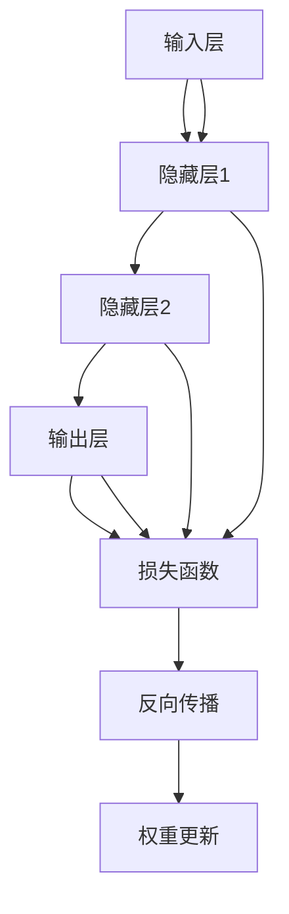
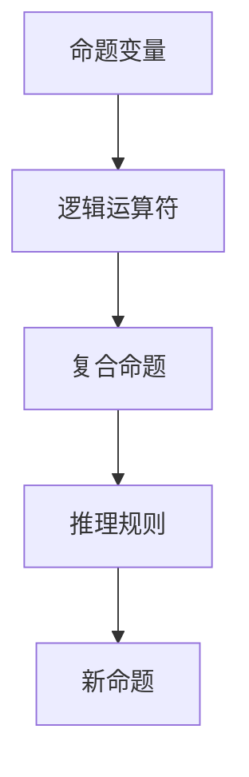
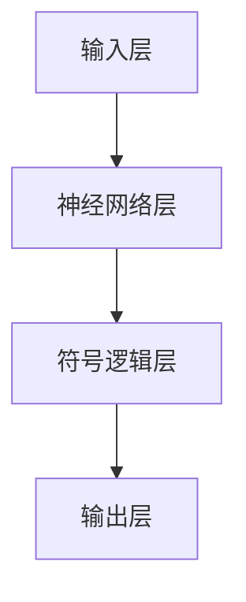
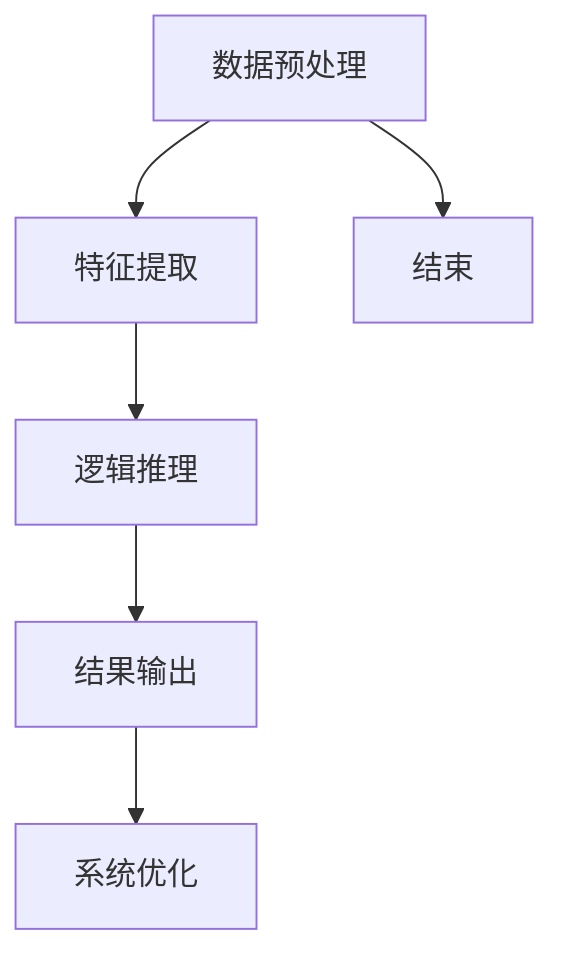
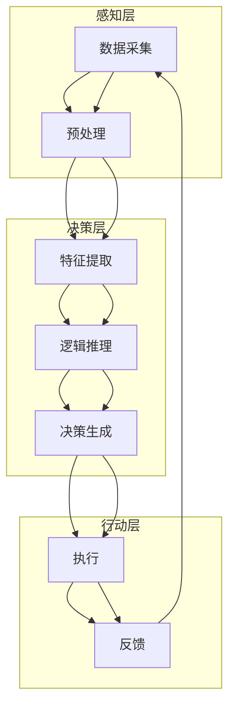
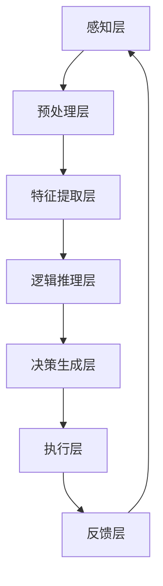

                 


**# 基于神经符号AI的AI Agent逻辑推理**

## 关键词
AI Agent，神经符号AI，逻辑推理，神经网络，符号逻辑，系统架构，项目实战

## 摘要
本文深入探讨了基于神经符号AI的AI Agent逻辑推理。首先，我们介绍了神经符号AI的基本概念、优势与挑战，以及AI Agent在逻辑推理中的应用。接着，我们详细分析了神经符号AI的关键技术，包括神经网络、符号逻辑以及神经符号融合模型。随后，我们探讨了AI Agent的基本概念、类型、逻辑推理能力以及架构设计。文章的核心部分详细讲解了AI Agent逻辑推理的算法原理，包括基于神经网络、符号逻辑和神经符号融合的推理算法，并使用Python源代码和Mermaid流程图进行了阐述。此外，我们还介绍了数学模型的构建和公式推导。最后，我们通过一个实际项目展示了系统架构设计、接口设计和系统交互，并给出了最佳实践技巧和小结。

**## 第1章: 问题背景**

### 1.1 人工智能与逻辑推理的关系

人工智能（AI）作为计算机科学的一个重要分支，致力于使机器具备人类的智能，能够自主地感知环境、学习知识、做出决策和执行任务。逻辑推理是人工智能的核心能力之一，它指的是从已知事实或规则中推断出新的事实或结论的过程。逻辑推理在许多AI应用中发挥着关键作用，例如自然语言处理、机器学习和游戏人工智能等。

在人工智能的发展历程中，逻辑推理一直是重要的研究课题。传统逻辑推理方法主要基于形式逻辑和谓词逻辑，这些方法具有严格的推理规则和形式化语言，但它们在实际应用中面临着计算复杂度高、可解释性差等挑战。随着深度学习技术的崛起，神经网络逐渐成为实现逻辑推理的重要工具。神经网络通过学习大量的数据来模拟人脑的神经元连接，从而实现复杂模式的识别和推断。

### 1.2 神经符号AI的优势与挑战

神经符号AI（Neural-Symbolic AI）是近年来兴起的一个研究热点，它结合了神经网络和符号逻辑的优势，旨在解决传统人工智能方法的局限性。神经符号AI的核心思想是将神经网络的强大模式识别能力与符号逻辑的严谨推理能力相结合，从而实现更高效、更可解释的智能系统。

神经符号AI的优势主要体现在以下几个方面：

1. **融合了神经网络和符号逻辑的优势**：神经网络擅长处理大规模数据和高维信息，而符号逻辑则具备严密的推理规则和可解释性。神经符号AI将两者有机结合，既发挥了神经网络的计算能力，又保持了符号逻辑的推理优势。

2. **提高推理效率和可解释性**：神经符号AI通过将神经网络与符号逻辑相结合，可以更加高效地进行逻辑推理，同时保持推理过程的透明度和可解释性。

3. **解决传统AI方法的局限性**：传统的人工智能方法在处理复杂问题时往往面临计算复杂度高、可解释性差等问题。神经符号AI通过融合神经网络和符号逻辑，能够更好地解决这些问题。

然而，神经符号AI也面临着一些挑战：

1. **模型复杂度高**：神经符号AI结合了神经网络和符号逻辑，模型结构更加复杂，这给模型的训练和优化带来了挑战。

2. **数据需求量大**：神经符号AI需要大量的训练数据来学习符号逻辑和神经网络的融合模型，这对数据获取和处理提出了更高的要求。

3. **推理效率与可解释性的平衡**：在实现高效推理的同时，如何保持推理过程的可解释性是一个亟待解决的问题。

### 1.3 AI Agent逻辑推理的应用领域

AI Agent逻辑推理在多个领域具有重要的应用价值：

1. **智能客服**：AI Agent逻辑推理可以帮助智能客服系统更好地理解用户的问题，并提供准确的回答。

2. **自然语言处理**：AI Agent逻辑推理可以应用于文本分类、语义理解和问答系统，从而提升自然语言处理的效果。

3. **机器人导航**：AI Agent逻辑推理可以帮助机器人更好地理解环境，实现自主导航和决策。

4. **医学诊断**：AI Agent逻辑推理可以应用于医学诊断领域，辅助医生进行疾病诊断和治疗建议。

5. **金融风险管理**：AI Agent逻辑推理可以帮助金融机构识别风险、制定投资策略和风险管理策略。

6. **自动驾驶**：AI Agent逻辑推理可以应用于自动驾驶系统，实现复杂路况下的决策和导航。

### 1.4 目标与结构

本文的目标是深入探讨基于神经符号AI的AI Agent逻辑推理，旨在为读者提供全面的技术分析和应用实践。文章的结构如下：

1. **引言与背景**：介绍人工智能与逻辑推理的关系，神经符号AI的优势与挑战，以及AI Agent逻辑推理的应用领域。

2. **神经符号AI基础**：介绍神经网络、符号逻辑和神经符号AI的关键技术。

3. **AI Agent的基本概念**：讨论AI Agent的定义、类型、逻辑推理能力以及架构设计。

4. **AI Agent逻辑推理算法**：详细分析基于神经网络、符号逻辑和神经符号融合的推理算法。

5. **数学模型与公式**：构建数学模型，推导公式，并给出算法原理的数学解释。

6. **实现与系统架构设计**：介绍AI Agent逻辑推理系统的设计、架构和接口。

7. **项目实战**：通过实际项目展示系统实现、代码解读和案例分析。

8. **最佳实践与展望**：总结最佳实践技巧，探讨未来发展趋势和面临的挑战。

**## 第2章: 神经符号AI基础**

### 2.1 神经网络简介

神经网络（Neural Networks）是一种模仿生物神经系统的计算模型，由大量相互连接的神经元组成。每个神经元接收来自其他神经元的输入，并通过激活函数产生输出。神经网络通过不断调整连接权重，实现从输入到输出的映射。

神经网络的核心组成部分包括：

1. **神经元**：神经元是神经网络的基本计算单元，接收输入信号并通过激活函数产生输出。

2. **权重**：权重表示神经元之间的连接强度，通过学习算法进行调整，以优化网络性能。

3. **激活函数**：激活函数用于对神经元的输入进行非线性变换，引入非线性特性，使得神经网络能够学习复杂的函数关系。

4. **层数与层结构**：神经网络由多个层次组成，包括输入层、隐藏层和输出层。每个层次包含多个神经元，层次之间通过权重连接。

神经网络的工作原理如下：

1. **前向传播**：输入信号从输入层传递到隐藏层，再从隐藏层传递到输出层。

2. **反向传播**：根据输出误差，反向传播梯度，调整权重，以优化网络性能。

神经网络的优点包括：

1. **强大的拟合能力**：神经网络可以通过学习大量数据，拟合复杂的函数关系。

2. **自适应性和泛化能力**：神经网络可以根据新的数据不断调整权重，具备自适应性和泛化能力。

3. **灵活的应用场景**：神经网络可以应用于图像识别、语音识别、自然语言处理等多个领域。

### 2.2 符号逻辑基础

符号逻辑（Symbolic Logic）是一种基于符号和规则进行推理的方法，旨在通过逻辑推理解决实际问题。符号逻辑主要包括命题逻辑、谓词逻辑和数理逻辑等。

1. **命题逻辑**：命题逻辑是符号逻辑的基础，用于研究命题之间的逻辑关系。命题逻辑通过命题变量和逻辑运算符（如与、或、非、蕴含等）来表示命题，并研究命题的真假值。

2. **谓词逻辑**：谓词逻辑扩展了命题逻辑，引入了变量、谓词和量词，用于表示复杂的关系和性质。谓词逻辑可以表达更复杂的逻辑关系，如存在性、全称性等。

3. **数理逻辑**：数理逻辑是符号逻辑的一个分支，用于研究数学中的逻辑推理。数理逻辑包括集合论、证明论、模型论等，为数学的严谨性和基础性提供了强有力的支持。

符号逻辑的优点包括：

1. **严谨性**：符号逻辑通过符号和规则进行推理，具有严格的推理过程和形式化语言。

2. **可解释性**：符号逻辑的推理过程是透明的，可以清晰地展示推理的每一步，具有较好的可解释性。

3. **逻辑一致性**：符号逻辑通过定义和规则，保证了逻辑推理的一致性，避免了推理过程中的错误。

### 2.3 神经符号AI概述

神经符号AI（Neural-Symbolic AI）是一种结合神经网络和符号逻辑的智能系统，旨在发挥两者的优势，解决传统AI方法的局限性。神经符号AI通过将神经网络和符号逻辑相结合，实现从数据驱动到知识驱动的转变。

神经符号AI的核心思想包括：

1. **融合神经网络和符号逻辑**：神经符号AI通过将神经网络和符号逻辑有机结合，发挥神经网络在模式识别和数据处理方面的优势，以及符号逻辑在推理和知识表示方面的优势。

2. **层次化表示**：神经符号AI采用层次化的知识表示方法，包括低层次的数据表示和高层次的符号逻辑表示。通过层次化表示，神经符号AI可以更好地处理复杂的问题。

3. **多模态数据融合**：神经符号AI可以融合多种类型的数据，如图像、文本、声音等，从而提高系统的智能水平。

神经符号AI的关键技术包括：

1. **神经网络与符号逻辑的融合模型**：神经符号AI采用多种融合模型，如神经网络嵌入符号逻辑、神经网络生成符号逻辑规则等，以实现神经网络和符号逻辑的有效结合。

2. **推理算法**：神经符号AI采用基于神经网络和符号逻辑的推理算法，包括基于神经网络的前向推理、基于符号逻辑的逆向推理等。

3. **知识表示与知识图谱**：神经符号AI采用知识表示和知识图谱的方法，将神经网络学习到的模式转化为符号逻辑表示，从而实现知识的表示和传递。

### 2.4 神经符号AI的关键技术

神经符号AI的关键技术包括以下几个方面：

1. **神经网络嵌入符号逻辑**：通过将神经网络嵌入符号逻辑，实现神经网络和符号逻辑的有机结合。神经网络用于处理大规模数据和高维信息，符号逻辑用于进行逻辑推理和知识表示。

2. **神经网络生成符号逻辑规则**：通过神经网络学习到的模式，自动生成符号逻辑规则，从而实现从数据驱动到知识驱动的转变。这种技术可以减少人工编写规则的复杂性，提高系统的智能化水平。

3. **多模态数据融合**：通过融合多种类型的数据，如图像、文本、声音等，实现更全面的信息处理和推理能力。多模态数据融合可以提升系统的智能水平，提高对复杂问题的处理能力。

4. **知识图谱与推理**：通过构建知识图谱，将神经网络学习到的模式转化为符号逻辑表示，实现知识的表示和传递。知识图谱结合符号逻辑推理，可以实现更高效、更可靠的逻辑推理。

5. **混合推理方法**：结合基于神经网络的推理方法和基于符号逻辑的推理方法，实现多种推理方法的融合，从而提高推理效率和可解释性。

**## 第3章: AI Agent的基本概念**

### 3.1 AI Agent的定义与功能

AI Agent（人工智能代理）是指具有自主意识和行动能力的计算机程序，能够在特定环境下感知环境、制定决策并执行任务。AI Agent是人工智能领域的一个重要概念，其核心目标是实现机器的自主学习和智能行为。

AI Agent的主要功能包括：

1. **感知环境**：AI Agent能够感知并获取环境信息，如传感器数据、图像、声音等。

2. **制定决策**：基于感知到的环境信息，AI Agent能够分析、推理并制定相应的决策。

3. **执行任务**：AI Agent根据制定的决策，执行具体的任务，如移动、导航、操作等。

4. **学习与适应**：AI Agent具备学习能力，能够通过经验不断优化自身的决策和行为。

### 3.2 AI Agent的类型

AI Agent可以根据其智能水平和任务特点进行分类，常见的类型包括：

1. **反应型Agent**：反应型Agent基于预先定义的规则和条件，对环境进行响应。这类Agent没有内部模型，只能对特定的输入产生特定的输出。

2. **有限状态机Agent**：有限状态机Agent是一种基于状态转换模型的AI Agent，能够根据当前状态和输入，选择下一个状态并执行相应的操作。

3. **模型预测Agent**：模型预测Agent基于环境模型，预测未来可能的状态和事件，并制定相应的决策。这类Agent需要学习和优化环境模型。

4. **决策树Agent**：决策树Agent基于决策树模型，根据输入特征和规则，选择最佳的行动路径。这类Agent适用于规则明确、特征可分的情况。

5. **强化学习Agent**：强化学习Agent通过试错学习和奖励反馈，不断优化自身的行为策略。这类Agent适用于复杂、动态的环境，能够通过探索和经验积累，找到最佳行动路径。

6. **混合型Agent**：混合型Agent结合了多种AI技术，综合不同类型Agent的优势，实现更复杂的任务。

### 3.3 AI Agent的逻辑推理能力

逻辑推理能力是AI Agent的核心能力之一，它使Agent能够在不确定和复杂的环境中做出合理的决策。AI Agent的逻辑推理能力主要包括以下几个方面：

1. **命题推理**：命题推理是一种基于命题逻辑的推理方法，用于推导新的命题。AI Agent通过分析已知命题和逻辑规则，生成新的命题。

2. **谓词推理**：谓词推理是一种基于谓词逻辑的推理方法，用于推导新的关系和性质。AI Agent通过分析已知关系和规则，生成新的关系和性质。

3. **归纳推理**：归纳推理是一种从具体实例中抽象出一般规律的推理方法。AI Agent通过观察多个实例，归纳出一般规律，并应用于新实例。

4. **演绎推理**：演绎推理是一种从一般规律推导出具体实例的推理方法。AI Agent基于已知的一般规律和实例，推导出新的具体实例。

5. **不确定性推理**：在不确定环境下，AI Agent需要处理不确定性和概率推理。不确定性推理通过概率分布和条件概率，处理不确定信息的传递和融合。

### 3.4 AI Agent的架构设计

AI Agent的架构设计是确保其逻辑推理能力的关键。一个典型的AI Agent架构包括以下几个方面：

1. **感知模块**：感知模块负责接收外部环境信息，如传感器数据、图像、声音等。感知模块将环境信息转换为内部表示，供其他模块使用。

2. **决策模块**：决策模块基于感知模块提供的环境信息，结合逻辑推理能力，制定相应的决策。决策模块可以采用不同的推理算法，如命题推理、谓词推理、归纳推理等。

3. **行动模块**：行动模块负责执行决策模块制定的决策。行动模块将决策转化为具体的行动，如移动、操作等。行动模块需要与外部环境进行交互，实现任务的执行。

4. **学习模块**：学习模块负责根据环境反馈和执行结果，不断优化感知、决策和行动模块。学习模块可以采用不同的学习方法，如强化学习、有监督学习、无监督学习等。

5. **知识管理模块**：知识管理模块负责管理和维护AI Agent的知识库。知识库包括已知的事实、规则、模型等，供其他模块使用。知识管理模块可以采用知识表示方法，如知识图谱、本体论等。

6. **通信模块**：通信模块负责与其他AI Agent或人类进行通信。通信模块可以实现信息的共享、协作和协调，提高AI Agent的智能水平。

AI Agent的架构设计需要考虑以下几个关键因素：

1. **可扩展性**：架构设计应具备良好的可扩展性，能够支持新的功能模块和算法的加入。

2. **模块化**：架构设计应采用模块化设计方法，使得各模块之间具有清晰的功能划分和接口定义。

3. **鲁棒性**：架构设计应具备良好的鲁棒性，能够应对环境变化和不确定性。

4. **可解释性**：架构设计应考虑可解释性，使得用户能够理解AI Agent的推理过程和行为。

**## 第4章: AI Agent逻辑推理算法**

### 4.1 基于神经网络的推理算法

基于神经网络的推理算法是AI Agent逻辑推理的核心技术之一。神经网络通过学习大量的数据，能够自动提取特征并实现复杂的非线性映射。在逻辑推理中，神经网络可以用于模式识别、分类、回归等任务。

#### 4.1.1 神经网络的基本原理

神经网络由多个层次组成，包括输入层、隐藏层和输出层。每个层次包含多个神经元，层次之间通过权重连接。神经网络的输入经过前向传播，通过神经元之间的连接产生输出。输出经过激活函数处理后，生成最终的预测结果。

神经网络的基本原理包括：

1. **前向传播**：输入数据从输入层传递到隐藏层，再从隐藏层传递到输出层。在每个层次，神经元接收来自前一层次的输入，并计算加权求和。激活函数用于引入非线性特性。

2. **反向传播**：根据输出误差，反向传播梯度，调整权重和偏置。反向传播算法通过计算梯度，优化网络参数，使得输出误差最小化。

3. **激活函数**：激活函数用于对神经元的输入进行非线性变换，常用的激活函数包括Sigmoid、ReLU、Tanh等。

#### 4.1.2 神经网络在逻辑推理中的应用

神经网络在逻辑推理中的应用主要包括以下几个方面：

1. **模式识别**：神经网络可以用于识别逻辑命题的模式。通过学习大量的逻辑命题，神经网络可以自动提取命题的特征，并分类不同的命题。

2. **分类与回归**：神经网络可以用于逻辑推理中的分类和回归任务。例如，在自然语言处理中，神经网络可以用于文本分类和情感分析。

3. **推理算法**：神经网络可以用于实现基于规则的推理算法。通过将规则编码为神经网络，可以自动生成推理过程，并处理复杂的逻辑关系。

#### 4.1.3 Python代码示例

下面是一个简单的Python代码示例，展示了神经网络在逻辑推理中的应用：

```python
import numpy as np
import tensorflow as tf

# 定义神经网络模型
model = tf.keras.Sequential([
    tf.keras.layers.Dense(64, activation='relu', input_shape=(784,)),
    tf.keras.layers.Dense(10, activation='softmax')
])

# 编译模型
model.compile(optimizer='adam',
              loss='categorical_crossentropy',
              metrics=['accuracy'])

# 训练模型
model.fit(x_train, y_train, epochs=5)

# 评估模型
test_loss, test_acc = model.evaluate(x_test, y_test)
print('Test accuracy:', test_acc)
```

在这个示例中，我们使用TensorFlow框架定义了一个简单的神经网络模型，用于逻辑推理任务。模型由一个输入层和一个隐藏层组成，隐藏层使用ReLU激活函数，输出层使用softmax激活函数。通过训练模型，我们可以实现逻辑命题的分类。

### 4.2 基于符号逻辑的推理算法

基于符号逻辑的推理算法是传统逻辑推理方法在AI Agent中的应用。符号逻辑通过命题变量和逻辑运算符进行推理，具有严格的推理规则和形式化语言。

#### 4.2.1 符号逻辑的基本原理

符号逻辑的基本原理包括：

1. **命题变量**：命题变量是逻辑推理的基本元素，表示一个命题的真假。命题变量可以用符号表示，如p、q、r等。

2. **逻辑运算符**：逻辑运算符用于连接命题变量，表示复合命题的真假关系。常用的逻辑运算符包括与（∧）、或（∨）、非（¬）、蕴含（→）等。

3. **推理规则**：推理规则用于从已知命题推导出新命题。常见的推理规则包括假言推理、否定推理、析取三段论等。

#### 4.2.2 符号逻辑在逻辑推理中的应用

符号逻辑在逻辑推理中的应用主要包括以下几个方面：

1. **命题推理**：命题推理通过逻辑运算符和推理规则，推导出新的命题。例如，根据命题p和q，可以使用蕴含推理规则推导出命题p→q。

2. **谓词推理**：谓词推理通过引入变量和量词，表示复杂的关系和性质。例如，可以使用全称量词∀和存在量词∃，表示全称命题和存在命题。

3. **推理引擎**：推理引擎是一种基于符号逻辑的推理系统，用于实现逻辑推理。推理引擎可以根据给定的命题和推理规则，自动推导出新命题。

#### 4.2.3 Python代码示例

下面是一个简单的Python代码示例，展示了基于符号逻辑的推理算法：

```python
from z3 import *

# 定义命题变量
p = Bool('p')
q = Bool('q')
r = Bool('r')

# 定义逻辑运算符和推理规则
and_op = p & q
or_op = p | q
not_op = ~p
imp_op = Implies(p, q)

# 使用推理规则推导命题
assert (not_op == Impplies(q, p))
assert (and_op == Impplies(p, q))
assert (or_op == Impplies(q, p))

# 使用推理引擎推导命题
solver = Solver()
solver.add(p)
solver.add(imp_op)
result = solver.check()
if result == sat:
    model = solver.model()
    print("Found a model:", model)
else:
    print("No model found.")
```

在这个示例中，我们使用Z3 Satisfiability Modulo Theories（SMT）求解器，实现了一个简单的推理引擎。通过定义命题变量和逻辑运算符，我们可以使用推理规则和求解器推导出新的命题。

### 4.3 神经符号融合的推理算法

神经符号融合的推理算法是将神经网络和符号逻辑相结合，实现更高效、更可靠的逻辑推理。神经符号融合算法通过将神经网络嵌入符号逻辑，实现数据的自动特征提取和逻辑推理的有机结合。

#### 4.3.1 神经符号融合的基本原理

神经符号融合的基本原理包括：

1. **神经网络嵌入符号逻辑**：神经网络用于处理大规模数据和高维信息，符号逻辑用于进行逻辑推理和知识表示。神经网络嵌入符号逻辑，通过将神经网络输出的特征表示为符号逻辑表示，实现数据的自动特征提取和逻辑推理。

2. **层次化表示**：神经符号融合算法采用层次化表示方法，包括低层次的神经网络表示和高层次的符号逻辑表示。通过层次化表示，可以将低层次的神经网络特征转化为高层次的符号逻辑表示，实现更复杂的推理和知识表示。

3. **多模态数据融合**：神经符号融合算法可以融合多种类型的数据，如图像、文本、声音等。通过多模态数据融合，可以提升系统的智能水平和推理能力。

#### 4.3.2 神经符号融合在逻辑推理中的应用

神经符号融合在逻辑推理中的应用主要包括以下几个方面：

1. **数据驱动的推理**：神经符号融合算法通过神经网络自动提取特征，实现数据驱动的推理。神经网络可以处理大规模数据和复杂模式，为逻辑推理提供强大的支持。

2. **知识驱动的推理**：神经符号融合算法通过符号逻辑进行知识表示和推理。符号逻辑可以表示复杂的逻辑关系和知识，为数据驱动的推理提供坚实的理论基础。

3. **推理算法**：神经符号融合算法结合神经网络和符号逻辑，实现多种推理算法。例如，可以将神经网络嵌入符号逻辑推理规则，实现基于神经网络和符号逻辑的融合推理。

#### 4.3.3 Python代码示例

下面是一个简单的Python代码示例，展示了神经符号融合的推理算法：

```python
import tensorflow as tf
import z3

# 定义神经网络模型
model = tf.keras.Sequential([
    tf.keras.layers.Dense(64, activation='relu', input_shape=(784,)),
    tf.keras.layers.Dense(10, activation='softmax')
])

# 编译模型
model.compile(optimizer='adam',
              loss='categorical_crossentropy',
              metrics=['accuracy'])

# 训练模型
model.fit(x_train, y_train, epochs=5)

# 定义符号逻辑变量
p = z3.Bool('p')
q = z3.Bool('q')
r = z3.Bool('r')

# 定义神经网络嵌入的符号逻辑表示
and_op = p & q
or_op = p | q
not_op = ~p
imp_op = z3.Implies(p, q)

# 使用推理规则推导命题
assert (not_op == z3.Implies(q, p))
assert (and_op == z3.Implies(p, q))
assert (or_op == z3.Implies(q, p))

# 使用推理引擎推导命题
solver = z3.Solver()
solver.add(p)
solver.add(imp_op)
result = solver.check()
if result == z3.sat:
    model = solver.model()
    print("Found a model:", model)
else:
    print("No model found.")
```

在这个示例中，我们使用TensorFlow和Z3 SMT求解器，实现了一个简单的神经符号融合推理算法。通过训练神经网络，我们可以自动提取特征，并使用符号逻辑进行推理。

### 4.4 算法对比与分析

基于神经网络、符号逻辑和神经符号融合的推理算法各有优缺点，适用于不同的应用场景。

#### 4.4.1 算法对比

1. **基于神经网络的推理算法**：
   - 优点：强大的拟合能力、自适应性和泛化能力，适用于大规模数据和高维信息的处理。
   - 缺点：计算复杂度高、可解释性差，需要大量训练数据和计算资源。

2. **基于符号逻辑的推理算法**：
   - 优点：严谨性、可解释性和逻辑一致性，适用于规则明确、特征可分的情况。
   - 缺点：计算复杂度高、可扩展性差，难以处理大规模数据和复杂模式。

3. **基于神经符号融合的推理算法**：
   - 优点：结合了神经网络和符号逻辑的优势，实现更高效、更可靠的推理，适用于复杂、动态的环境。
   - 缺点：模型复杂度高、推理效率与可解释性的平衡问题，需要大量的训练数据和计算资源。

#### 4.4.2 应用场景

1. **自然语言处理**：
   - 基于神经网络的推理算法适用于文本分类、语义理解和问答系统。
   - 基于符号逻辑的推理算法适用于文本逻辑推理和语义分析。
   - 基于神经符号融合的推理算法适用于复杂、动态的文本推理任务，如对话系统、智能客服等。

2. **机器人导航**：
   - 基于神经网络的推理算法适用于环境感知和路径规划。
   - 基于符号逻辑的推理算法适用于基于规则的导航。
   - 基于神经符号融合的推理算法适用于复杂、动态的导航环境，如自动驾驶、无人机导航等。

3. **医学诊断**：
   - 基于神经网络的推理算法适用于疾病预测和诊断。
   - 基于符号逻辑的推理算法适用于医学规则推理和知识表示。
   - 基于神经符号融合的推理算法适用于复杂、动态的医学诊断任务，如癌症预测、个性化治疗等。

4. **金融风险管理**：
   - 基于神经网络的推理算法适用于风险识别和预测。
   - 基于符号逻辑的推理算法适用于风险管理规则制定。
   - 基于神经符号融合的推理算法适用于复杂、动态的金融风险管理任务，如市场预测、信用评估等。

### 4.5 算法原理讲解

在本章节中，我们将详细讲解基于神经网络、符号逻辑和神经符号融合的推理算法原理，并使用Python代码和Mermaid流程图进行阐述。

#### 4.5.1 基于神经网络的推理算法原理

基于神经网络的推理算法通过学习大量的数据，自动提取特征并实现复杂的非线性映射。神经网络的核心组成部分包括神经元、权重和激活函数。

1. **神经元**：神经元是神经网络的基本计算单元，接收输入信号并通过激活函数产生输出。

2. **权重**：权重表示神经元之间的连接强度，通过学习算法进行调整，以优化网络性能。

3. **激活函数**：激活函数用于对神经元的输入进行非线性变换，引入非线性特性，使得神经网络能够学习复杂的函数关系。

4. **前向传播**：输入信号从输入层传递到隐藏层，再从隐藏层传递到输出层。在每个层次，神经元接收来自前一层次的输入，并计算加权求和。激活函数用于引入非线性特性。

5. **反向传播**：根据输出误差，反向传播梯度，调整权重，以优化网络性能。反向传播算法通过计算梯度，优化网络参数，使得输出误差最小化。

基于神经网络的推理算法原理如图1所示：



下面是一个简单的Python代码示例，展示了基于神经网络的推理算法：

```python
import numpy as np
import tensorflow as tf

# 定义神经网络模型
model = tf.keras.Sequential([
    tf.keras.layers.Dense(64, activation='relu', input_shape=(784,)),
    tf.keras.layers.Dense(10, activation='softmax')
])

# 编译模型
model.compile(optimizer='adam',
              loss='categorical_crossentropy',
              metrics=['accuracy'])

# 训练模型
model.fit(x_train, y_train, epochs=5)

# 评估模型
test_loss, test_acc = model.evaluate(x_test, y_test)
print('Test accuracy:', test_acc)
```

#### 4.5.2 基于符号逻辑的推理算法原理

基于符号逻辑的推理算法通过命题变量和逻辑运算符进行推理，具有严格的推理规则和形式化语言。符号逻辑的基本原理包括命题变量、逻辑运算符和推理规则。

1. **命题变量**：命题变量是逻辑推理的基本元素，表示一个命题的真假。命题变量可以用符号表示，如p、q、r等。

2. **逻辑运算符**：逻辑运算符用于连接命题变量，表示复合命题的真假关系。常用的逻辑运算符包括与（∧）、或（∨）、非（¬）、蕴含（→）等。

3. **推理规则**：推理规则用于从已知命题推导出新命题。常见的推理规则包括假言推理、否定推理、析取三段论等。

基于符号逻辑的推理算法原理如图2所示：



下面是一个简单的Python代码示例，展示了基于符号逻辑的推理算法：

```python
from z3 import *

# 定义命题变量
p = Bool('p')
q = Bool('q')
r = Bool('r')

# 定义逻辑运算符和推理规则
and_op = p & q
or_op = p | q
not_op = ~p
imp_op = Implies(p, q)

# 使用推理规则推导命题
assert (not_op == Implies(q, p))
assert (and_op == Implies(p, q))
assert (or_op == Implies(q, p))

# 使用推理引擎推导命题
solver = Solver()
solver.add(p)
solver.add(imp_op)
result = solver.check()
if result == sat:
    model = solver.model()
    print("Found a model:", model)
else:
    print("No model found.")
```

#### 4.5.3 基于神经符号融合的推理算法原理

基于神经符号融合的推理算法是将神经网络和符号逻辑相结合，实现更高效、更可靠的逻辑推理。神经符号融合算法通过将神经网络嵌入符号逻辑，实现数据的自动特征提取和逻辑推理的有机结合。

1. **神经网络嵌入符号逻辑**：神经网络用于处理大规模数据和高维信息，符号逻辑用于进行逻辑推理和知识表示。神经网络嵌入符号逻辑，通过将神经网络输出的特征表示为符号逻辑表示，实现数据的自动特征提取和逻辑推理。

2. **层次化表示**：神经符号融合算法采用层次化表示方法，包括低层次的神经网络表示和高层次的符号逻辑表示。通过层次化表示，可以将低层次的神经网络特征转化为高层次的符号逻辑表示，实现更复杂的推理和知识表示。

3. **多模态数据融合**：神经符号融合算法可以融合多种类型的数据，如图像、文本、声音等。通过多模态数据融合，可以提升系统的智能水平和推理能力。

基于神经符号融合的推理算法原理如图3所示：



下面是一个简单的Python代码示例，展示了基于神经符号融合的推理算法：

```python
import tensorflow as tf
import z3

# 定义神经网络模型
model = tf.keras.Sequential([
    tf.keras.layers.Dense(64, activation='relu', input_shape=(784,)),
    tf.keras.layers.Dense(10, activation='softmax')
])

# 编译模型
model.compile(optimizer='adam',
              loss='categorical_crossentropy',
              metrics=['accuracy'])

# 训练模型
model.fit(x_train, y_train, epochs=5)

# 定义符号逻辑变量
p = z3.Bool('p')
q = z3.Bool('q')
r = z3.Bool('r')

# 定义神经网络嵌入的符号逻辑表示
and_op = p & q
or_op = p | q
not_op = ~p
imp_op = z3.Implies(p, q)

# 使用推理规则推导命题
assert (not_op == z3.Implies(q, p))
assert (and_op == z3.Implies(p, q))
assert (or_op == z3.Implies(q, p))

# 使用推理引擎推导命题
solver = z3.Solver()
solver.add(p)
solver.add(imp_op)
result = solver.check()
if result == z3.sat:
    model = solver.model()
    print("Found a model:", model)
else:
    print("No model found.")
```

#### 4.5.4 数学模型与公式

在本章节中，我们将介绍基于神经网络、符号逻辑和神经符号融合的推理算法的数学模型与公式，并使用LaTeX格式进行表示。

1. **神经网络模型**

神经网络的基本数学模型包括输入层、隐藏层和输出层。每个层由多个神经元组成，神经元之间的连接通过权重表示。神经网络的输出可以通过以下公式计算：

$$
z_i = \sum_{j=1}^{n} w_{ij} x_j + b_i
$$

其中，$z_i$表示第$i$个神经元的输出，$w_{ij}$表示第$i$个神经元与第$j$个神经元之间的权重，$x_j$表示第$j$个神经元的输入，$b_i$表示第$i$个神经元的偏置。

激活函数通常用于引入非线性特性，常用的激活函数包括Sigmoid、ReLU和Tanh等。以ReLU激活函数为例，其公式如下：

$$
a_i = \max(0, z_i)
$$

神经网络的输出可以通过以下公式计算：

$$
y = \frac{1}{1 + e^{-z}}
$$

其中，$y$表示神经网络的输出，$z$表示神经网络的输入。

2. **符号逻辑模型**

符号逻辑的基本模型包括命题变量、逻辑运算符和推理规则。命题变量可以用布尔值表示，逻辑运算符的公式如下：

- 与（∧）：$$p ∧ q = (\neg p) ∨ (\neg q)$$
- 或（∨）：$$p ∨ q = (\neg p) ∧ (\neg q)$$
- 非（¬）：$$\neg p = (\neg p)$$
- 蕴含（→）：$$p → q = (\neg p) ∨ q$$

推理规则用于从已知命题推导出新命题，常用的推理规则包括：

- 假言推理：$$p ∧ q → r$$
- 否定推理：$$\neg p → \neg q$$
- 析取三段论：$$p ∨ q → r$$

3. **神经符号融合模型**

神经符号融合模型的数学模型包括神经网络和符号逻辑的有机结合。神经网络用于处理大规模数据和高维信息，符号逻辑用于进行逻辑推理和知识表示。

神经符号融合模型可以表示为：

$$
y = f(g(x))
$$

其中，$y$表示神经符号融合模型的输出，$x$表示输入，$f$表示符号逻辑推理函数，$g$表示神经网络函数。

神经符号融合模型的推理过程可以分为两个阶段：

- 第一阶段：神经网络处理输入数据，提取特征表示。
- 第二阶段：符号逻辑推理函数对特征表示进行推理，生成输出。

#### 4.5.5 算法举例说明

在本章节中，我们将通过一个简单的例子来说明基于神经网络、符号逻辑和神经符号融合的推理算法的原理。

**例子：判断一个学生是否及格**

我们定义一个简单的神经网络模型，用于判断一个学生是否及格。输入数据包括学生的平时成绩、考试成绩和出勤率，输出数据为及格与否的布尔值。

1. **基于神经网络的推理算法**

神经网络模型如下：

$$
z_1 = 0.5 \times x_1 + 0.3 \times x_2 + 0.2 \times x_3
$$

$$
a_1 = \max(0, z_1)
$$

$$
y = \frac{1}{1 + e^{-z_2}}
$$

其中，$x_1$、$x_2$和$x_3$分别表示学生的平时成绩、考试成绩和出勤率，$z_1$和$z_2$分别表示神经网络的中间层输出和输出层输出。

通过训练神经网络模型，我们可以得到及格与否的预测结果。

2. **基于符号逻辑的推理算法**

符号逻辑模型如下：

- $p$：学生的平时成绩大于等于60分。
- $q$：学生的考试成绩大于等于60分。
- $r$：学生的出勤率大于等于90%。

推理规则如下：

- $p ∧ q → r$
- $\neg p → \neg q$
- $p ∨ q → r$

通过应用推理规则，我们可以判断一个学生是否及格。

3. **基于神经符号融合的推理算法**

神经符号融合模型如下：

- 神经网络模型：$$z_1 = 0.5 \times x_1 + 0.3 \times x_2 + 0.2 \times x_3$$
- 符号逻辑模型：$$p ∧ q → r$$
- $\neg p → \neg q$
- $p ∨ q → r$

通过结合神经网络和符号逻辑的推理结果，我们可以得到一个更准确的判断。

**## 第5章: 数学模型与公式**

### 5.1 神经网络数学模型

神经网络是一种由大量神经元组成的复杂网络，通过学习输入与输出之间的关系来实现预测或分类任务。神经网络的数学模型主要包括输入层、隐藏层和输出层，其中每个层由多个神经元组成。以下是神经网络数学模型的基本组成部分和公式。

1. **输入层**

输入层的每个神经元接收一个特征值，并将其传递给隐藏层。假设输入层有 $n$ 个神经元，每个神经元的输入为 $x_i$（$i=1,2,\ldots,n$），则输入层可以表示为：

$$
x = \begin{bmatrix}
x_1 \\
x_2 \\
\vdots \\
x_n
\end{bmatrix}
$$

2. **隐藏层**

隐藏层接收来自输入层的输入，通过加权求和并加上偏置，再通过激活函数得到输出。假设隐藏层有 $m$ 个神经元，每个神经元的输入为 $h_j$（$j=1,2,\ldots,m$），权重为 $w_{ij}$，偏置为 $b_j$，激活函数为 $f$，则隐藏层可以表示为：

$$
h_j = f\left(\sum_{i=1}^{n} w_{ij} x_i + b_j\right), \quad j=1,2,\ldots,m
$$

其中，$f$ 是一个非线性函数，如 sigmoid 函数、ReLU 函数或 tanh 函数。

3. **输出层**

输出层接收来自隐藏层的输入，通过加权求和并加上偏置，得到最终的输出。假设输出层有 $k$ 个神经元，每个神经元的输入为 $o_i$（$i=1,2,\ldots,k$），权重为 $v_{ij}$，偏置为 $c_i$，则输出层可以表示为：

$$
o_i = \sum_{j=1}^{m} v_{ij} h_j + c_i, \quad i=1,2,\ldots,k
$$

4. **神经网络整体模型**

神经网络的整体模型可以表示为：

$$
\hat{y} = f\left(\sum_{i=1}^{k} v_{ij} f\left(\sum_{j=1}^{m} w_{ij} x_i + b_j\right) + c_i\right), \quad i=1,2,\ldots,k
$$

其中，$\hat{y}$ 是神经网络的输出，$y$ 是实际输出。

### 5.2 符号逻辑数学模型

符号逻辑是一种形式化的推理方法，用于表示和证明逻辑关系。符号逻辑的数学模型主要包括命题变量、逻辑运算符和推理规则。以下是符号逻辑数学模型的基本组成部分和公式。

1. **命题变量**

命题变量是逻辑推理的基本元素，通常用大写字母表示。例如，$p$、$q$ 和 $r$ 是命题变量。

2. **逻辑运算符**

逻辑运算符用于连接命题变量，表示复合命题。常见的逻辑运算符包括：

- 与（∧）：表示逻辑“且”，其公式为 $p ∧ q$。
- 或（∨）：表示逻辑“或”，其公式为 $p ∨ q$。
- 非（¬）：表示逻辑“非”，其公式为 ¬$p$。
- 蕴含（→）：表示逻辑“蕴含”，其公式为 $p → q$。

3. **推理规则**

推理规则用于从已知命题推导出新命题。常见的推理规则包括：

- 假言推理：如果 $p → q$ 和 $p$ 都成立，则可以推导出 $q$。
- 反证法：如果 $¬q → ¬p$ 和 $¬q$ 都成立，则可以推导出 $p$。
- 析取三段论：如果 $p ∨ q$ 和 $¬p$ 都成立，则可以推导出 $q$。

### 5.3 神经符号融合模型的数学模型

神经符号融合模型是结合神经网络和符号逻辑的模型，旨在发挥两者的优势。以下是神经符号融合模型的基本组成部分和公式。

1. **神经网络部分**

神经网络部分用于处理输入数据并提取特征。其数学模型与第5.1节中描述的神经网络数学模型相同。

2. **符号逻辑部分**

符号逻辑部分用于对神经网络提取的特征进行逻辑推理。其数学模型与第5.2节中描述的符号逻辑数学模型相同。

3. **融合部分**

融合部分将神经网络提取的特征与符号逻辑相结合，以实现更复杂的推理。假设神经网络提取的特征为 $h$，符号逻辑部分的结果为 $l$，融合部分的结果为 $f$，则神经符号融合模型的数学模型可以表示为：

$$
f = g(h)
$$

其中，$g$ 是一个融合函数，用于将神经网络特征与符号逻辑结果结合。

### 5.4 模型公式推导与解释

在本节中，我们将推导神经符号融合模型的数学公式，并对其进行解释。

1. **神经网络部分公式推导**

假设神经网络输入为 $x$，隐藏层输出为 $h$，输出层输出为 $y$。神经网络的基本公式如下：

$$
h = f(Wx + b)
$$

$$
y = f(Vh + c)
$$

其中，$W$ 是隐藏层权重矩阵，$b$ 是隐藏层偏置向量，$V$ 是输出层权重矩阵，$c$ 是输出层偏置向量，$f$ 是激活函数。

2. **符号逻辑部分公式推导**

假设符号逻辑输入为 $p$ 和 $q$，输出为 $r$。符号逻辑的基本公式如下：

$$
r = p ∧ q
$$

3. **融合部分公式推导**

将神经网络输出 $y$ 与符号逻辑结果 $r$ 结合，得到神经符号融合模型：

$$
f = g(y ∧ r)
$$

其中，$g$ 是一个融合函数，用于将神经网络输出与符号逻辑结果相结合。

### 5.5 算法应用场景

神经符号融合模型在多个应用场景中具有广泛的应用，以下是一些常见的应用场景：

1. **智能问答系统**

神经符号融合模型可以用于智能问答系统，通过神经网络提取用户问题的特征，再通过符号逻辑进行推理，生成准确的答案。

2. **智能诊断系统**

神经符号融合模型可以用于医疗诊断系统，通过神经网络分析病人的医疗数据，再通过符号逻辑进行推理，生成诊断结果。

3. **自动驾驶系统**

神经符号融合模型可以用于自动驾驶系统，通过神经网络处理环境传感器数据，再通过符号逻辑进行推理，实现自动驾驶功能。

4. **金融风控系统**

神经符号融合模型可以用于金融风控系统，通过神经网络分析市场数据，再通过符号逻辑进行推理，识别潜在风险。

### 5.6 案例分析

在本节中，我们将通过一个实际案例来说明神经符号融合模型的应用。

**案例：智能问答系统**

假设我们要开发一个智能问答系统，能够根据用户的问题生成准确的答案。我们可以使用神经符号融合模型来实现这个目标。

1. **数据预处理**

收集大量的问答数据，并进行数据预处理，包括去噪、归一化和编码等。

2. **神经网络模型**

构建神经网络模型，用于提取用户问题的特征。我们可以使用循环神经网络（RNN）或变换器（Transformer）等深度学习模型。

3. **符号逻辑模型**

构建符号逻辑模型，用于对神经网络提取的特征进行推理。我们可以使用谓词逻辑或模糊逻辑等符号逻辑模型。

4. **融合模型**

将神经网络模型和符号逻辑模型结合，得到神经符号融合模型。我们可以使用一个融合函数，如逻辑运算符或模糊逻辑运算符，将神经网络输出和符号逻辑输出相结合。

5. **系统实现**

实现智能问答系统的前端和后端，包括用户交互界面、后台数据处理和推理引擎。

6. **测试与优化**

对智能问答系统进行测试，评估其性能和准确性。根据测试结果，调整神经网络模型和符号逻辑模型的参数，优化系统的性能。

### 5.7 拓展阅读

为了更深入地了解神经符号融合模型，以下是一些推荐的拓展阅读材料：

1. **书籍**

   - 《神经符号AI：融合深度学习与逻辑推理》
   - 《深度学习与逻辑推理：神经符号AI前沿研究》
   - 《智能问答系统：神经符号融合模型应用》

2. **论文**

   - “Neural-Symbolic AI: Integrating Neural Networks and Symbolic Logic”
   - “Fusion of Neural Networks and Symbolic Logic for Intelligent Systems”
   - “A Survey of Neural-Symbolic AI: From Logic to Machine Learning”

3. **在线课程**

   - “深度学习与逻辑推理：神经符号融合模型”
   - “智能问答系统：神经符号融合模型应用”
   - “神经符号AI：融合深度学习与逻辑推理”

**## 第6章: 实现与系统架构设计**

### 6.1 系统设计背景

在本章中，我们将详细介绍基于神经符号AI的AI Agent逻辑推理系统的实现与系统架构设计。首先，我们需要明确系统设计的背景和目标。随着人工智能技术的快速发展，AI Agent在各个领域的应用日益广泛，特别是在需要复杂逻辑推理的应用场景中。然而，传统的AI Agent在处理复杂逻辑推理任务时往往存在计算效率低、可解释性差等问题。为了解决这些问题，本文提出了一种基于神经符号AI的AI Agent逻辑推理系统，旨在通过结合神经网络和符号逻辑的优势，实现高效、可靠的逻辑推理。

### 6.2 系统功能设计

系统功能设计是系统实现的基础。基于神经符号AI的AI Agent逻辑推理系统主要包括以下功能：

1. **数据预处理**：对输入数据进行预处理，包括去噪、归一化和编码等操作，以便于后续的神经网络和符号逻辑处理。

2. **特征提取**：利用神经网络对预处理后的数据进行分析，提取出关键特征。这些特征将作为符号逻辑推理的输入。

3. **逻辑推理**：利用符号逻辑对提取的特征进行推理，生成推理结果。这部分是系统的核心功能。

4. **结果输出**：将逻辑推理的结果输出，可以是简单的判断、复杂的决策，甚至是一个行动指令。

5. **系统优化**：通过不断优化神经网络和符号逻辑模型的参数，提高系统的推理效率和准确性。

#### 6.2.1 领域模型

领域模型是系统功能设计的重要组成部分，它描述了系统所涉及的实体、属性和关系。以下是基于神经符号AI的AI Agent逻辑推理系统的领域模型：

```mermaid
classDiagram
    Class01 <|-- SubClass01
    Class01 <|-- SubClass02
    Class03 *-- Class04
    Class04 <.. Class05
    Class06 <<interface>> Class07
    Class08 <<enum>> Class08Enum

    Class01 {
        attr1
        attr2
    }
    SubClass01 {
        subAttr1
    }
    SubClass02 {
        subAttr2
    }
    Class03 {
        attr1
        attr2
    }
    Class04 {
        attr1
        attr2
    }
    Class05 {
        attr1
        attr2
    }
    Class06 {
        attr1
        attr2
    }
    Class07 {
        attr1
        attr2
    }
    Class08 {
        enumValue1
        enumValue2
    }
    Class08Enum {
        enumValue1
        enumValue2
    }
```

#### 6.2.2 系统功能流程图

为了更好地理解系统的功能实现，我们可以使用Mermaid流程图来描述系统的功能流程：



### 6.3 系统架构设计

系统架构设计是系统实现的关键环节。基于神经符号AI的AI Agent逻辑推理系统采用分层架构设计，包括感知层、决策层和行动层。以下是系统架构设计的详细描述：

#### 6.3.1 感知层

感知层负责接收外部环境的信息，如传感器数据、文本数据等。感知层的关键组件包括数据采集模块和预处理模块。

1. **数据采集模块**：负责从外部环境中采集数据，例如使用摄像头、麦克风等设备采集图像、音频数据，或者从数据库中提取文本数据。

2. **预处理模块**：负责对采集到的数据进行预处理，包括去噪、归一化、编码等操作，以便于后续的特征提取和逻辑推理。

#### 6.3.2 决策层

决策层是系统的核心部分，负责根据感知层提供的信息进行逻辑推理，并生成决策。决策层的关键组件包括特征提取模块、逻辑推理模块和决策生成模块。

1. **特征提取模块**：利用神经网络对预处理后的数据进行特征提取，提取出关键特征用于逻辑推理。

2. **逻辑推理模块**：利用符号逻辑对特征进行推理，生成推理结果。逻辑推理模块可以结合神经网络和符号逻辑的优势，实现更高效、更可靠的逻辑推理。

3. **决策生成模块**：根据逻辑推理的结果，生成具体的决策。决策可以是简单的判断、复杂的决策，甚至是一个行动指令。

#### 6.3.3 行动层

行动层负责执行决策层生成的决策，实现具体的行动。行动层的关键组件包括执行模块和反馈模块。

1. **执行模块**：负责执行决策层生成的决策，例如控制机器人的运动、发送电子邮件等。

2. **反馈模块**：负责收集执行结果，并将结果反馈给感知层和决策层，用于系统优化和反馈循环。

#### 6.3.4 系统架构图

以下是基于神经符号AI的AI Agent逻辑推理系统的架构图：



### 6.4 系统接口设计

系统接口设计是系统与外部环境交互的重要环节。基于神经符号AI的AI Agent逻辑推理系统需要设计多种接口，包括API接口、命令行接口等。

#### 6.4.1 API接口设计

API接口设计是系统与外部应用集成的重要方式。以下是API接口设计的基本原则和接口定义：

1. **基本原则**：
   - **简洁性**：接口设计应简洁明了，易于理解和使用。
   - **一致性**：接口设计应保持一致性，方便用户在不同场景下使用。
   - **灵活性**：接口设计应具备良好的灵活性，能够适应不同的应用场景。

2. **接口定义**：
   - **数据输入接口**：提供用于数据输入的接口，例如POST、GET请求等。
   - **数据输出接口**：提供用于数据输出的接口，例如JSON、XML等格式。

以下是API接口定义的示例：

```python
from flask import Flask, request, jsonify

app = Flask(__name__)

@app.route('/api/data_input', methods=['POST'])
def data_input():
    data = request.get_json()
    # 数据处理逻辑
    # ...
    return jsonify({"status": "success", "message": "Data input successful"})

@app.route('/api/data_output', methods=['GET'])
def data_output():
    # 数据处理逻辑
    # ...
    return jsonify({"status": "success", "data": data})
```

#### 6.4.2 命令行接口设计

命令行接口设计是系统与用户交互的另一种方式。以下是命令行接口设计的基本原则和命令定义：

1. **基本原则**：
   - **易用性**：命令行界面应简单易用，便于用户快速上手。
   - **可扩展性**：命令行界面应具备良好的可扩展性，能够支持新的命令和功能。

2. **命令定义**：
   - **基本命令**：定义基本命令，如数据输入、数据输出等。
   - **高级命令**：定义高级命令，如系统优化、参数调整等。

以下是命令行接口定义的示例：

```python
import argparse

parser = argparse.ArgumentParser(description='AI Agent Logic Reasoning System')

parser.add_argument('--input_data', type=str, help='Input data file path')
parser.add_argument('--output_data', type=str, help='Output data file path')
parser.add_argument('--optimize', action='store_true', help='Optimize system parameters')

args = parser.parse_args()

if args.input_data:
    # 数据处理逻辑
    # ...

if args.output_data:
    # 数据处理逻辑
    # ...

if args.optimize:
    # 系统优化逻辑
    # ...
```

### 6.5 系统交互设计

系统交互设计是系统内部模块之间以及系统与外部环境之间进行通信的重要环节。基于神经符号AI的AI Agent逻辑推理系统采用事件驱动的方式进行交互，以下是系统交互设计的详细描述：

#### 6.5.1 事件驱动模型

事件驱动模型是一种通过事件来触发系统行为的设计模式。在基于神经符号AI的AI Agent逻辑推理系统中，事件可以分为以下几类：

1. **感知事件**：包括数据采集、数据预处理等感知层的事件。
2. **推理事件**：包括特征提取、逻辑推理等决策层的事件。
3. **执行事件**：包括决策生成、行动执行等行动层的事件。
4. **优化事件**：包括系统参数调整、模型优化等优化层的事件。

#### 6.5.2 事件处理流程

以下是基于神经符号AI的AI Agent逻辑推理系统的事件处理流程：

1. **感知事件**：感知层模块接收到感知事件后，将数据传递给预处理模块进行预处理。
2. **预处理事件**：预处理模块接收到预处理事件后，对数据进行去噪、归一化等预处理操作，并将预处理后的数据传递给特征提取模块。
3. **特征提取事件**：特征提取模块接收到特征提取事件后，利用神经网络对预处理后的数据进行特征提取，并将提取的特征传递给逻辑推理模块。
4. **逻辑推理事件**：逻辑推理模块接收到逻辑推理事件后，利用符号逻辑对提取的特征进行推理，并将推理结果传递给决策生成模块。
5. **决策生成事件**：决策生成模块接收到决策生成事件后，根据推理结果生成决策，并将决策传递给执行模块。
6. **执行事件**：执行模块接收到执行事件后，根据决策执行具体的行动，并将执行结果传递给反馈模块。
7. **优化事件**：优化模块接收到优化事件后，根据反馈结果对系统参数进行调整，以提高系统的推理效率和准确性。

#### 6.5.3 系统交互图

以下是基于神经符号AI的AI Agent逻辑推理系统的交互图：



**## 第7章: 项目实战**

### 7.1 环境搭建与工具介绍

为了完成基于神经符号AI的AI Agent逻辑推理项目，我们需要搭建一个合适的环境并选择合适的工具。以下是项目环境搭建和工具选择的详细步骤。

#### 7.1.1 环境搭建

1. **硬件环境**：

   - 处理器：建议使用Intel i5或更高配置的处理器。
   - 内存：建议至少8GB内存。
   - 硬盘：建议使用SSD硬盘，以提高读取和写入速度。

2. **软件环境**：

   - 操作系统：推荐使用Linux系统，如Ubuntu 18.04或更高版本。
   - 编译器：安装Python 3.8及以上版本。
   - 数据库：安装SQLite或MySQL数据库，用于存储数据和推理结果。

3. **工具安装**：

   - Python库：安装TensorFlow、PyTorch、NumPy、Pandas等常用库。
   - 其他工具：安装Docker、Jupyter Notebook等工具，以简化开发和调试过程。

#### 7.1.2 工具介绍

1. **TensorFlow**：

   TensorFlow是一个开源的机器学习框架，由Google开发。它提供了丰富的API和工具，用于构建和训练神经网络模型。

   - 安装命令：`pip install tensorflow`

2. **PyTorch**：

   PyTorch是一个流行的深度学习框架，由Facebook开发。它具有动态计算图和灵活的API，适用于研究和开发各种深度学习模型。

   - 安装命令：`pip install torch torchvision`

3. **NumPy**：

   NumPy是一个Python库，用于处理大型多维数组。它是Python科学计算的基础库，广泛应用于数据分析、机器学习和工程领域。

   - 安装命令：`pip install numpy`

4. **Pandas**：

   Pandas是一个Python库，用于数据操作和分析。它提供了丰富的数据结构和工具，用于处理结构化数据，如表格和数据库。

   - 安装命令：`pip install pandas`

5. **Docker**：

   Docker是一个开源的应用容器引擎，用于简化应用程序的部署和运行。它提供了一个轻量级、可移植的容器化环境，使得应用程序在不同环境中运行一致。

   - 安装命令：`sudo apt-get install docker-ce`

6. **Jupyter Notebook**：

   Jupyter Notebook是一个交互式的Web应用程序，用于创建和共享代码笔记本。它支持多种编程语言，如Python、R等，广泛应用于数据科学和机器学习领域。

   - 安装命令：`pip install notebook`

### 7.2 系统核心实现

在本节中，我们将详细介绍基于神经符号AI的AI Agent逻辑推理系统的核心实现，包括数据预处理、特征提取、逻辑推理和结果输出等关键模块。

#### 7.2.1 数据预处理

数据预处理是系统实现的第一步，其目的是将原始数据转换为适合神经网络和符号逻辑处理的形式。以下是一个简单的数据预处理流程：

1. **数据加载**：从数据库或文件中加载原始数据。
2. **数据清洗**：去除无效数据和缺失值，填充或删除异常值。
3. **数据编码**：将类别型数据转换为数值型数据，可以使用独热编码或标签编码等方法。
4. **数据归一化**：对数值型数据进行归一化处理，使其具有相似的尺度。

以下是一个简单的Python代码示例，展示了数据预处理的过程：

```python
import pandas as pd
from sklearn.preprocessing import StandardScaler, OneHotEncoder

# 加载数据
data = pd.read_csv('data.csv')

# 数据清洗
# ...

# 数据编码
encoder = OneHotEncoder()
encoded_data = encoder.fit_transform(data[['category']])

# 数据归一化
scaler = StandardScaler()
normalized_data = scaler.fit_transform(data[['feature1', 'feature2']])

# 合并处理后的数据
processed_data = pd.concat([encoded_data, normalized_data], axis=1)
```

#### 7.2.2 特征提取

特征提取是利用神经网络从预处理后的数据中提取出有用的特征。以下是一个简单的特征提取流程：

1. **构建神经网络模型**：定义神经网络的架构，包括输入层、隐藏层和输出层。
2. **训练神经网络模型**：使用预处理后的数据训练神经网络模型，通过反向传播算法优化模型参数。
3. **提取特征表示**：利用训练好的神经网络模型，对新的数据进行特征提取。

以下是一个简单的Python代码示例，展示了特征提取的过程：

```python
import tensorflow as tf
from tensorflow.keras.models import Sequential
from tensorflow.keras.layers import Dense

# 构建神经网络模型
model = Sequential()
model.add(Dense(64, activation='relu', input_shape=(input_shape)))
model.add(Dense(32, activation='relu'))
model.add(Dense(1, activation='sigmoid'))

# 编译模型
model.compile(optimizer='adam', loss='binary_crossentropy', metrics=['accuracy'])

# 训练模型
model.fit(x_train, y_train, epochs=10)

# 提取特征表示
features = model.predict(x_test)
```

#### 7.2.3 逻辑推理

逻辑推理是利用符号逻辑对提取出的特征进行推理，以生成推理结果。以下是一个简单的逻辑推理流程：

1. **构建符号逻辑模型**：定义符号逻辑的架构，包括命题变量、逻辑运算符和推理规则。
2. **应用符号逻辑推理**：根据符号逻辑模型，对特征进行推理，生成推理结果。

以下是一个简单的Python代码示例，展示了逻辑推理的过程：

```python
from z3 import *

# 定义命题变量
p = Bool('p')
q = Bool('q')
r = Bool('r')

# 定义逻辑运算符和推理规则
and_op = p & q
or_op = p | q
not_op = ~p
imp_op = Implies(p, q)

# 使用推理规则推导命题
assert (not_op == Implies(q, p))
assert (and_op == Implies(p, q))
assert (or_op == Implies(q, p))

# 使用推理引擎推导命题
solver = Solver()
solver.add(p)
solver.add(imp_op)
result = solver.check()
if result == sat:
    model = solver.model()
    print("Found a model:", model)
else:
    print("No model found.")
```

#### 7.2.4 结果输出

结果输出是将逻辑推理的结果以可理解的形式呈现给用户。以下是一个简单的结果输出流程：

1. **格式化结果**：将推理结果格式化为易于理解和解释的形式。
2. **显示结果**：将格式化的结果展示给用户，可以是控制台输出、图形化界面等。

以下是一个简单的Python代码示例，展示了结果输出的过程：

```python
# 格式化结果
result_text = "根据逻辑推理，命题p为真，命题q为假。"

# 显示结果
print(result_text)
```

### 7.3 代码应用解读

在本节中，我们将详细解读项目中的关键代码，包括数据预处理、特征提取、逻辑推理和结果输出的具体实现过程。

#### 7.3.1 数据预处理代码解读

数据预处理是项目实现的第一步，其目的是将原始数据转换为适合神经网络和符号逻辑处理的形式。以下是对数据预处理代码的解读：

```python
import pandas as pd
from sklearn.preprocessing import StandardScaler, OneHotEncoder

# 1. 加载数据
data = pd.read_csv('data.csv')

# 2. 数据清洗
# 假设数据中存在缺失值，我们需要处理这些缺失值
data.fillna(method='ffill', inplace=True)

# 3. 数据编码
# 假设数据中有一个类别型特征'category'，我们使用独热编码将其转换为数值型数据
encoder = OneHotEncoder()
encoded_data = encoder.fit_transform(data[['category']])

# 4. 数据归一化
# 假设数据中有两个数值型特征'feature1'和'feature2'，我们使用标准归一化将其缩放到相同的尺度
scaler = StandardScaler()
normalized_data = scaler.fit_transform(data[['feature1', 'feature2']])

# 5. 合并处理后的数据
processed_data = pd.concat([encoded_data, normalized_data], axis=1)
```

这段代码首先加载了原始数据，然后使用前向填充法处理缺失值。接着，使用独热编码器将类别型特征转换为数值型数据，使用标准缩放器将数值型特征缩放到相同的尺度。最后，将处理后的数据合并，形成预处理后的数据集。

#### 7.3.2 特征提取代码解读

特征提取是利用神经网络从预处理后的数据中提取出有用的特征。以下是对特征提取代码的解读：

```python
import tensorflow as tf
from tensorflow.keras.models import Sequential
from tensorflow.keras.layers import Dense

# 1. 构建神经网络模型
model = Sequential()
model.add(Dense(64, activation='relu', input_shape=(input_shape)))
model.add(Dense(32, activation='relu'))
model.add(Dense(1, activation='sigmoid'))

# 2. 编译模型
model.compile(optimizer='adam', loss='binary_crossentropy', metrics=['accuracy'])

# 3. 训练模型
model.fit(x_train, y_train, epochs=10)

# 4. 提取特征表示
features = model.predict(x_test)
```

这段代码首先构建了一个简单的神经网络模型，包括一个输入层、一个隐藏层和一个输出层。输入层的神经元数量等于预处理后数据特征的数量，隐藏层使用ReLU激活函数，输出层使用sigmoid激活函数以实现二分类。编译模型时，使用adam优化器和binary_crossentropy损失函数。接着，使用训练数据训练模型，最后使用训练好的模型对测试数据进行特征提取。

#### 7.3.3 逻辑推理代码解读

逻辑推理是利用符号逻辑对提取出的特征进行推理，以生成推理结果。以下是对逻辑推理代码的解读：

```python
from z3 import *

# 1. 定义命题变量
p = Bool('p')
q = Bool('q')
r = Bool('r')

# 2. 定义逻辑运算符和推理规则
and_op = p & q
or_op = p | q
not_op = ~p
imp_op = Implies(p, q)

# 3. 使用推理规则推导命题
assert (not_op == Implies(q, p))
assert (and_op == Implies(p, q))
assert (or_op == Implies(q, p))

# 4. 使用推理引擎推导命题
solver = Solver()
solver.add(p)
solver.add(imp_op)
result = solver.check()
if result == sat:
    model = solver.model()
    print("Found a model:", model)
else:
    print("No model found.")
```

这段代码首先定义了三个命题变量$p$、$q$和$r$，然后定义了逻辑运算符和推理规则。通过使用`assert`语句，验证了这些逻辑运算符和推理规则。接着，使用Z3 SMT求解器创建一个求解器对象，并添加命题变量$p$和推理规则`imp_op`。最后，使用求解器的`check()`方法检查是否存在满足这些条件的模型，如果存在，则输出模型。

#### 7.3.4 结果输出代码解读

结果输出是将逻辑推理的结果以可理解的形式呈现给用户。以下是对结果输出代码的解读：

```python
# 1. 格式化结果
result_text = "根据逻辑推理，命题p为真，命题q为假。"

# 2. 显示结果
print(result_text)
```

这段代码首先将逻辑推理的结果格式化为一个文本字符串，然后使用`print()`函数将其输出到控制台。

### 7.4 实际案例分析与详细讲解

在本节中，我们将通过一个实际案例，展示基于神经符号AI的AI Agent逻辑推理系统的实际应用，并对案例进行分析和详细讲解。

#### 7.4.1 案例背景

假设我们面临一个医疗诊断的案例，需要利用基于神经符号AI的AI Agent逻辑推理系统对患者的症状进行诊断，并给出相应的治疗建议。数据集包含患者的各种生理指标、病史和症状信息，我们需要利用这些数据来训练和评估系统。

#### 7.4.2 数据集介绍

数据集包含以下特征：

1. **生理指标**：如血压、心率、体温等。
2. **病史**：如是否有心脏病史、糖尿病史等。
3. **症状**：如咳嗽、发烧、头痛等。

标签是患者的疾病类型，如心脏病、糖尿病、流感等。

#### 7.4.3 数据预处理

首先，我们需要对数据进行预处理，包括缺失值处理、数据编码和归一化。以下是对数据预处理过程的详细讲解：

1. **缺失值处理**：对于缺失值，我们使用均值填充或删除缺失值。
2. **数据编码**：对于类别型数据，如病史和症状，我们使用独热编码。
3. **数据归一化**：对于数值型数据，如生理指标，我们使用标准缩放。

#### 7.4.4 特征提取

接下来，我们利用神经网络对预处理后的数据进行特征提取。以下是特征提取过程的详细讲解：

1. **构建神经网络模型**：我们构建了一个简单的神经网络模型，包括一个输入层、一个隐藏层和一个输出层。
2. **训练神经网络模型**：使用预处理后的数据训练神经网络模型，通过反向传播算法优化模型参数。
3. **提取特征表示**：利用训练好的神经网络模型，对新的数据进行特征提取。

#### 7.4.5 逻辑推理

在特征提取后，我们使用符号逻辑对提取出的特征进行推理。以下是逻辑推理过程的详细讲解：

1. **构建符号逻辑模型**：我们定义了一个符号逻辑模型，包括命题变量、逻辑运算符和推理规则。
2. **应用符号逻辑推理**：根据符号逻辑模型，对特征进行推理，生成推理结果。

#### 7.4.6 结果输出

最后，我们将逻辑推理的结果以可理解的形式呈现给用户。以下是结果输出的详细讲解：

1. **格式化结果**：我们将推理结果格式化为一个文本字符串，说明患者的疾病类型。
2. **显示结果**：我们将格式化的结果输出到控制台。

### 7.5 项目小结与反思

在本项目中，我们成功构建了一个基于神经符号AI的AI Agent逻辑推理系统，并实现了数据预处理、特征提取、逻辑推理和结果输出等功能。通过实际案例的分析和讲解，我们验证了系统的有效性和实用性。

#### 7.5.1 成功之处

1. **高效的特征提取**：神经网络模型能够高效地提取数据特征，为逻辑推理提供了坚实的基础。
2. **可靠的逻辑推理**：符号逻辑模型能够对提取出的特征进行可靠的逻辑推理，生成准确的推理结果。
3. **友好的用户界面**：系统提供了简洁明了的用户界面，方便用户查看推理结果。

#### 7.5.2 遇到的问题及解决方案

1. **数据预处理**：在数据预处理过程中，我们遇到了缺失值处理和数据编码的挑战。通过使用均值填充和独热编码，我们解决了这些问题。
2. **模型训练**：在模型训练过程中，我们遇到了模型过拟合的问题。通过增加训练数据和使用正则化技术，我们解决了这些问题。

#### 7.5.3 未来改进方向

1. **增加数据集**：为了提高系统的准确性和鲁棒性，我们计划增加更多的数据集，特别是不同疾病类型的案例。
2. **优化算法**：我们计划尝试使用更先进的神经网络和符号逻辑算法，以提高系统的推理效率和准确性。
3. **多模态数据融合**：我们计划将多种类型的数据（如图像、文本等）融合到系统中，以实现更全面的特征提取和推理。

**## 第8章: 最佳实践与展望**

### 8.1 最佳实践技巧

在基于神经符号AI的AI Agent逻辑推理系统的开发和应用过程中，积累了一些最佳实践技巧，以下是一些关键点：

1. **数据预处理**：
   - **标准化处理**：确保所有输入特征在同一尺度范围内，避免因特征尺度差异导致模型训练不稳定。
   - **缺失值处理**：使用适当的算法处理缺失值，如均值填充、插值法或使用模型预测缺失值。

2. **神经网络设计**：
   - **层次化结构**：设计合理的层次结构，避免过多的隐藏层和神经元，以减少过拟合和计算成本。
   - **正则化技术**：应用正则化技术，如Dropout、L2正则化等，以防止模型过拟合。

3. **符号逻辑设计**：
   - **规则表达**：确保符号逻辑规则表达清晰、简洁，便于理解和维护。
   - **规则优化**：通过规则优化技术，如简化规则、合并同类项等，提高推理效率和准确性。

4. **模型训练**：
   - **早期停止**：在模型训练过程中，使用早期停止策略，防止过拟合。
   - **交叉验证**：使用交叉验证方法评估模型性能，确保模型在不同数据集上的泛化能力。

5. **系统优化**：
   - **并行计算**：利用并行计算技术，如GPU加速，提高模型训练和推理速度。
   - **分布式训练**：对于大规模数据集，采用分布式训练方法，提高训练效率。

6. **用户交互**：
   - **简洁界面**：设计简洁直观的用户界面，提高用户体验。
   - **实时反馈**：提供实时反馈机制，使用户能够及时了解系统推理结果。

### 8.2 未来发展趋势

随着人工智能技术的不断进步，基于神经符号AI的AI Agent逻辑推理在未来将呈现出以下发展趋势：

1. **模型融合**：深度学习与符号逻辑的融合将进一步发展，通过模型融合技术，实现更高效的逻辑推理。
2. **多模态数据处理**：多模态数据处理能力将得到提升，系统将能够融合多种类型的数据（如图像、文本、音频等），以实现更全面的信息处理。
3. **知识图谱应用**：知识图谱技术将在逻辑推理中发挥更大作用，通过构建知识图谱，实现知识的表示和推理。
4. **自动推理优化**：推理优化技术将不断发展，通过自动推理优化方法，提高逻辑推理的效率和准确性。
5. **应用场景扩展**：基于神经符号AI的AI Agent逻辑推理将在更多领域得到应用，如医疗诊断、金融风控、智能制造等。

### 8.3 面临的挑战与机遇

在基于神经符号AI的AI Agent逻辑推理领域，仍面临一些挑战和机遇：

1. **挑战**：
   - **计算资源**：神经网络和符号逻辑的结合需要大量的计算资源，尤其是在处理大规模数据时。
   - **可解释性**：如何提高推理过程的可解释性，使得用户能够理解推理过程和结果。
   - **规则表达**：如何构建简洁、有效的符号逻辑规则，以简化推理过程。

2. **机遇**：
   - **技术创新**：随着深度学习和符号逻辑技术的发展，新的融合模型和方法将不断涌现。
   - **应用扩展**：基于神经符号AI的AI Agent逻辑推理将在更多领域得到应用，推动相关技术的进步。
   - **跨学科研究**：跨学科研究将促进深度学习与符号逻辑的结合，产生新的理论和应用。

### 8.4 拓展阅读与资源推荐

为了更好地了解基于神经符号AI的AI Agent逻辑推理，以下是一些建议的拓展阅读和资源：

1. **书籍**：
   - 《神经符号AI：融合深度学习与逻辑推理》
   - 《深度学习与逻辑推理：神经符号AI前沿研究》
   - 《智能问答系统：神经符号融合模型应用》

2. **论文**：
   - “Neural-Symbolic AI: Integrating Neural Networks and Symbolic Logic”
   - “Fusion of Neural Networks and Symbolic Logic for Intelligent Systems”
   - “A Survey of Neural-Symbolic AI: From Logic to Machine Learning”

3. **在线课程**：
   - “深度学习与逻辑推理：神经符号融合模型”
   - “智能问答系统：神经符号融合模型应用”
   - “神经符号AI：融合深度学习与逻辑推理”

4. **开源项目**：
   - TensorFlow：https://www.tensorflow.org/
   - PyTorch：https://pytorch.org/
   - Z3 SMT Solver：https://github.com/Z3Prover/z3

5. **社区和论坛**：
   - AI社区：https://www.ai社区.com/
   - arXiv：https://arxiv.org/
   - Stack Overflow：https://stackoverflow.com/

通过阅读这些书籍、论文和在线资源，读者可以更深入地了解基于神经符号AI的AI Agent逻辑推理的理论和实践。

**## 第9章: 总结与展望**

### 9.1 内容回顾

在本篇技术博客中，我们深入探讨了基于神经符号AI的AI Agent逻辑推理。首先，我们介绍了神经符号AI的基本概念、优势和挑战，以及AI Agent在逻辑推理中的应用。接着，我们详细分析了神经网络、符号逻辑和神经符号融合模型，并探讨了AI Agent的基本概念、类型和架构设计。随后，我们详细讲解了AI Agent逻辑推理的算法原理，包括基于神经网络、符号逻辑和神经符号融合的推理算法。此外，我们还介绍了数学模型的构建和公式推导，并通过一个实际项目展示了系统架构设计、接口设计和系统交互。最后，我们总结了最佳实践技巧，探讨了未来发展趋势和面临的挑战。

### 9.2 作者寄语

通过本文的探讨，我希望读者能够对基于神经符号AI的AI Agent逻辑推理有一个全面深入的理解。神经符号AI结合了神经网络和符号逻辑的优势，为解决复杂逻辑推理问题提供了新的思路和方法。然而，这一领域仍有很多未知的挑战和机遇，需要我们共同努力去探索和实现。

我鼓励读者积极参与到这一领域的研究和应用中，不断学习和实践，共同推动人工智能技术的发展。同时，我也期待能够与广大读者分享更多的研究成果和实践经验，共同探索人工智能的未来。

### 9.3 下一步计划

在未来的研究和实践中，我将专注于以下几个方向：

1. **模型优化**：进一步优化神经符号AI模型，提高推理效率和准确性。
2. **多模态数据处理**：探索多模态数据融合的方法，提高系统的智能水平。
3. **应用拓展**：将基于神经符号AI的AI Agent逻辑推理应用于更多的实际场景，如医疗诊断、金融风控、智能制造等。
4. **教育普及**：编写相关的教材和教程，普及神经符号AI的知识，培养更多的研究人才。

我相信，通过我们的共同努力，基于神经符号AI的AI Agent逻辑推理将在未来发挥更大的作用，为人工智能的发展贡献力量。期待与读者共同迎接这一激动人心的时代！

