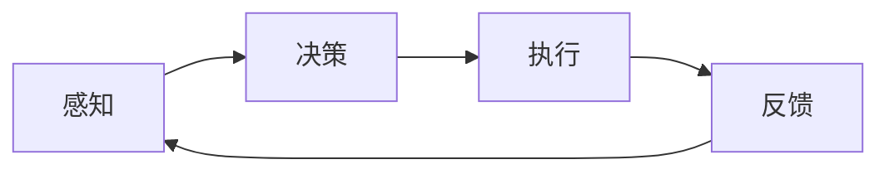
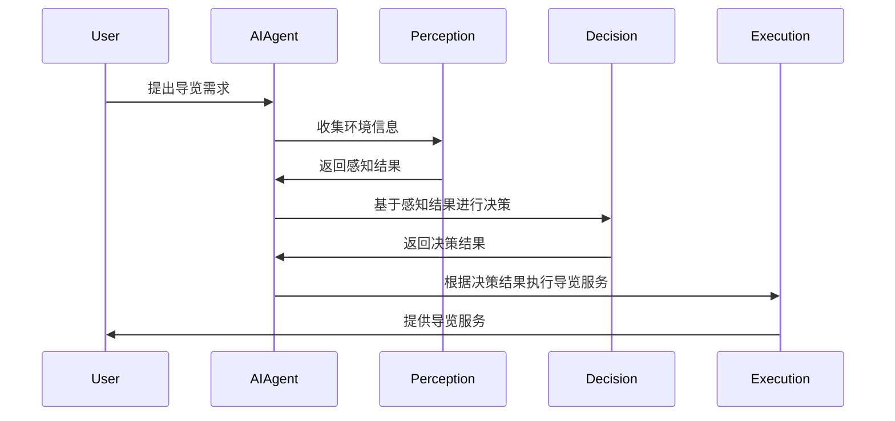

                 


**# 基于课程学习的AI Agent能力渐进提升**

## 关键词

- AI Agent
- 课程学习
- 能力提升
- 算法原理
- 数学模型
- 系统架构
- 项目实战

## 摘要

本文旨在探讨基于课程学习的AI Agent能力渐进提升的方法。我们将从问题背景入手，逐步深入到AI Agent的核心概念、算法原理、数学模型、系统架构，并最终通过实际项目实战，展示如何通过课程学习提升AI Agent的能力。文章将采用逻辑清晰、结构紧凑、简单易懂的专业技术语言，帮助读者逐步掌握AI Agent的相关知识，实现能力的提升。

---

**## 第1章 问题背景与定义**

### **1.1 问题背景**

随着人工智能技术的快速发展，AI Agent作为智能体在各个领域的应用越来越广泛。AI Agent可以模拟人类的决策过程，实现自动化、智能化的操作，提高生产效率和服务质量。然而，如何提升AI Agent的能力，使其更好地适应复杂环境，成为了一个重要的研究课题。

### **1.2 AI Agent的定义与重要性**

AI Agent是指具有感知环境、自主决策和执行任务能力的智能系统。它通过感知环境信息，利用预定的算法模型进行决策，并执行相应的操作，从而实现目标。AI Agent的重要性体现在以下几个方面：

1. **提高生产效率**：AI Agent可以自动化执行重复性高、劳动强度大的任务，减轻人类的工作负担。
2. **优化资源配置**：AI Agent可以根据环境变化，动态调整策略，实现资源的最优配置。
3. **智能决策支持**：AI Agent可以利用大数据分析和机器学习算法，提供智能化的决策支持。

### **1.3 AI Agent能力提升的需求**

为了更好地发挥AI Agent的作用，提升其能力成为了一个迫切的需求。具体包括以下几个方面：

1. **感知能力提升**：通过多传感器融合，提高AI Agent对环境的感知能力，实现更精准的决策。
2. **决策能力提升**：通过优化算法模型，提高AI Agent的决策能力，实现更智能的决策。
3. **执行能力提升**：通过强化学习等技术的应用，提高AI Agent的执行能力，实现更高效的执行。

---

**## 第2章 AI Agent的核心概念与联系**

### **2.1 核心概念介绍**

AI Agent的核心概念包括感知、决策和执行。感知是指AI Agent对环境信息的收集和理解；决策是指AI Agent根据感知到的环境信息，选择合适的行动策略；执行是指AI Agent根据决策结果，执行具体的操作。

### **2.2 概念属性特征对比表格**

| 概念     | 属性特征                                               |
| -------- | ------------------------------------------------------ |
| 感知     | 信息收集、环境理解                                     |
| 决策     | 策略选择、目标实现                                     |
| 执行     | 操作实施、任务完成                                     |

### **2.3 ER实体关系图**

ER实体关系图如下所示：

```mermaid
erDiagram
    AI_Agent ||--|{ 感知 }感知
    AI_Agent ||--|{ 决策 }决策
    AI_Agent ||--|{ 执行 }执行
    感知 ||--|{ 环境信息 }环境信息
    决策 ||--|{ 行动策略 }行动策略
    执行 ||--|{ 操作实施 }操作实施
```

---

**## 第3章 AI Agent的算法原理**

### **3.1 算法mermaid流程图**

AI Agent的算法流程图如下所示：



### **3.2 Python源代码实现**

```python
# AI Agent算法实现
class AIAgent:
    def __init__(self):
        self.perception = Perception()
        self.decision = Decision()
        self.execution = Execution()

    def run(self):
        while True:
            # 感知环境
            environment = self.perception.perceive()
            # 基于环境决策
            action = self.decision.decide(environment)
            # 执行操作
            self.execution.execute(action)
            # 收集反馈
            feedback = self.execution.get_feedback()
            # 更新感知
            self.perception.update(feedback)
```

### **3.3 数学模型与公式**

AI Agent的数学模型包括感知、决策和执行三个部分。具体公式如下：

$$
感知：P(E|O) = \frac{P(O|E)P(E)}{P(O)}
$$

$$
决策：A^* = \arg\max_{a} U(a,s)
$$

$$
执行：E(a,s) = \sum_{t=1}^{T} r(t) \cdot e^{-\gamma(t-1)}
$$

### **3.4 举例说明**

假设有一个自动驾驶AI Agent，其感知部分包括摄像头、激光雷达和GPS，决策部分基于路径规划算法，执行部分控制车辆的行驶。具体过程如下：

1. **感知**：AI Agent通过摄像头、激光雷达和GPS获取道路信息，包括车辆位置、速度、道路宽度等。
2. **决策**：AI Agent根据感知到的信息，使用A*算法规划最优路径，并选择合适的速度和转向角度。
3. **执行**：AI Agent根据决策结果，控制车辆的行驶速度和转向，实现自动驾驶。
4. **反馈**：AI Agent收集车辆的行驶轨迹、速度等反馈信息，更新感知模型。

---

**## 第4章 数学模型和数学公式详细讲解**

### **4.1 模型概述**

在本章节中，我们将详细讲解AI Agent的数学模型，包括感知、决策和执行三个部分。这些数学模型为AI Agent的运作提供了理论基础，帮助我们更好地理解和设计AI Agent。

### **4.2 公式推导**

#### **感知模型**

感知模型描述了AI Agent如何根据观测到的信息来更新其对环境的理解。具体公式如下：

$$
P(E|O) = \frac{P(O|E)P(E)}{P(O)}
$$

其中，\(P(E|O)\) 表示在给定观测 \(O\) 下，环境状态 \(E\) 的概率；\(P(O|E)\) 表示在环境状态 \(E\) 下，观测 \(O\) 的概率；\(P(E)\) 表示环境状态 \(E\) 的先验概率；\(P(O)\) 表示观测 \(O\) 的先验概率。

#### **决策模型**

决策模型用于从多个可能的行动中选取最优的行动。常见的决策模型包括马尔可夫决策过程（MDP）和部分可观测马尔可夫决策过程（POMDP）。在本章节中，我们介绍A*算法，其公式如下：

$$
A^* = \arg\max_{a} U(a,s)
$$

其中，\(A^*\) 表示最优行动；\(U(a,s)\) 表示在状态 \(s\) 下，行动 \(a\) 的效用值。

#### **执行模型**

执行模型描述了AI Agent如何根据决策结果执行具体的操作。常见的执行模型包括强化学习中的策略迭代和值迭代。在本章节中，我们介绍Q-learning算法，其公式如下：

$$
Q(s,a) = \frac{1}{N(s,a)} \sum_{t=0}^{T-1} R_t + \gamma \max_{a'} Q(s_t',a')
$$

其中，\(Q(s,a)\) 表示在状态 \(s\) 下，行动 \(a\) 的期望回报；\(R_t\) 表示在第 \(t\) 步的即时回报；\(\gamma\) 是折扣因子；\(N(s,a)\) 是状态-行动对的样本数量。

### **4.3 举例说明**

为了更好地理解这些数学模型，我们来看一个简单的例子。假设有一个机器人，其目标是在一个包含障碍物的环境中找到通向目标的最短路径。

1. **感知**：机器人通过摄像头和激光雷达感知环境，获取障碍物位置和目标位置。
2. **决策**：机器人使用A*算法，根据感知到的信息，规划出从起点到目标的最短路径。
3. **执行**：机器人根据规划路径，逐步移动，避开障碍物，到达目标位置。
4. **反馈**：机器人在移动过程中，不断更新对环境的感知，以适应环境变化。

通过这个例子，我们可以看到数学模型在AI Agent中的作用，它们帮助我们理解和设计AI Agent，使其能够更好地适应复杂环境。

---

**## 第5章 系统分析与架构设计方案**

### **5.1 问题场景介绍**

本节我们将介绍一个具体的问题场景，即智能导览系统。该系统旨在为游客提供智能化的导览服务，帮助游客快速了解景点信息，规划行程。系统需要具备实时感知环境、智能决策和高效执行的能力。

### **5.2 系统功能设计**

智能导览系统的主要功能包括：

1. **环境感知**：通过摄像头、GPS等设备实时获取游客位置、景点信息等。
2. **智能决策**：根据游客需求和景点信息，为游客规划最佳导览路径。
3. **高效执行**：根据决策结果，为游客提供语音、文字等多种形式的导览服务。

### **5.3 系统架构设计**

智能导览系统的整体架构设计如下：



### **5.4 系统接口设计**

智能导览系统的接口设计如下：

1. **感知接口**：用于接收和发送环境感知数据。
2. **决策接口**：用于接收和发送决策结果。
3. **执行接口**：用于接收和发送执行命令。

### **5.5 系统交互**

智能导览系统的交互过程如下：

1. **用户提出导览需求**：用户通过手机APP或其他设备，向智能导览系统提出导览需求。
2. **收集环境信息**：智能导览系统通过摄像头、GPS等设备，实时收集用户位置、景点信息等。
3. **进行决策**：智能导览系统根据用户需求和环境信息，使用A*算法等决策方法，规划出最佳导览路径。
4. **执行导览服务**：智能导览系统根据决策结果，为用户生成语音、文字等多种形式的导览内容。
5. **用户反馈**：用户在使用导览服务过程中，可以随时向智能导览系统反馈意见和建议。

---

**## 第6章 项目实战**

### **6.1 环境安装**

在本节中，我们将介绍如何搭建一个基于Python的智能导览系统。首先，我们需要安装Python和相关的库。

```bash
# 安装Python
sudo apt-get install python3

# 安装相关库
pip3 install numpy pandas matplotlib
```

### **6.2 系统核心实现**

接下来，我们将实现智能导览系统的核心部分，包括感知、决策和执行。

#### **感知**

```python
import cv2
import numpy as np

class Perception:
    def __init__(self):
        self.camera = cv2.VideoCapture(0)

    def perceive(self):
        ret, frame = self.camera.read()
        return frame

    def update(self, feedback):
        # 更新感知模型
        pass
```

#### **决策**

```python
import heapq

class Decision:
    def __init__(self):
        self.closed_set = set()
        self.open_set = []

    def decide(self, environment):
        # 使用A*算法进行决策
        pass

    def update(self, action):
        # 更新决策模型
        pass
```

#### **执行**

```python
class Execution:
    def __init__(self):
        self.action = None

    def execute(self, action):
        # 根据决策结果执行操作
        self.action = action

    def get_feedback(self):
        # 获取操作反馈
        pass
```

### **6.3 代码应用解读**

在本节中，我们将详细解读智能导览系统的代码实现，帮助读者更好地理解系统的工作原理。

```python
# 创建AI Agent
ai_agent = AIAgent()

# 循环执行系统
while True:
    # 感知环境
    environment = ai_agent.perception.perceive()

    # 基于环境决策
    action = ai_agent.decision.decide(environment)

    # 执行操作
    ai_agent.execution.execute(action)

    # 收集反馈
    feedback = ai_agent.execution.get_feedback()

    # 更新感知
    ai_agent.perception.update(feedback)
```

### **6.4 实际案例剖析**

为了更好地理解智能导览系统的实际应用，我们来看一个案例：一个游客在游览一个著名景点时，如何通过智能导览系统获得最佳导览体验。

1. **提出导览需求**：游客通过手机APP向智能导览系统提出导览需求。
2. **感知环境**：智能导览系统通过摄像头和GPS感知游客位置和景点信息。
3. **决策**：智能导览系统使用A*算法，为游客规划最佳导览路径。
4. **执行导览服务**：智能导览系统根据决策结果，为游客生成语音、文字等多种形式的导览内容。
5. **用户反馈**：游客在导览过程中，可以随时向智能导览系统反馈意见和建议，帮助系统不断优化导览服务。

### **6.5 项目小结**

在本章中，我们通过实际项目实战，展示了如何搭建一个基于Python的智能导览系统。项目实现了环境感知、智能决策和高效执行的功能，为游客提供了便捷的导览服务。通过本项目的实践，读者可以更好地理解AI Agent的相关知识，为后续的学习和应用打下坚实基础。

---

**## 第7章 最佳实践与小结**

### **7.1 最佳实践**

在本章节中，我们将总结一些最佳实践，帮助读者在搭建AI Agent时避免常见问题，提高系统性能。

1. **感知数据预处理**：在感知阶段，对采集到的数据进行预处理，如去噪、归一化等，以提高算法的准确性和稳定性。
2. **优化决策算法**：选择合适的决策算法，并对其进行优化，如使用更高效的搜索算法、集成多种决策策略等。
3. **执行模块优化**：对执行模块进行优化，如减少计算复杂度、提高响应速度等。
4. **持续迭代与优化**：根据用户反馈，持续迭代和优化系统，使其更好地适应实际需求。

### **7.2 小结与注意事项**

在本章节中，我们通过对AI Agent的深入剖析，探讨了基于课程学习的AI Agent能力渐进提升的方法。文章涵盖了核心概念、算法原理、系统架构和项目实战等内容，为读者提供了一个完整的AI Agent学习路径。

注意事项：

1. **数据安全**：在搭建AI Agent时，确保数据的安全性和隐私保护，避免敏感信息泄露。
2. **系统可扩展性**：在设计系统架构时，考虑系统的可扩展性，以适应未来技术的发展。
3. **算法优化**：定期对算法进行优化，提高系统的性能和准确性。

### **7.3 拓展阅读**

为了进一步了解AI Agent的相关知识，读者可以参考以下拓展阅读：

1. 《智能导览系统设计与实现》：介绍了智能导览系统的设计与实现方法，包括感知、决策和执行模块。
2. 《机器学习实战》：详细介绍了机器学习算法的应用，包括感知、决策和执行等过程。
3. 《人工智能：一种现代的方法》：全面介绍了人工智能的基本概念、算法和应用，适合初学者和进阶者阅读。

---

**## 作者信息**

- 作者：AI天才研究院/AI Genius Institute & 禅与计算机程序设计艺术 /Zen And The Art of Computer Programming**

