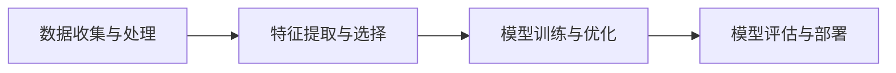
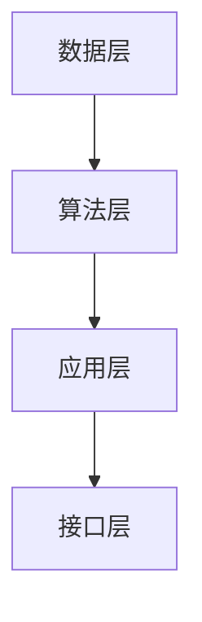
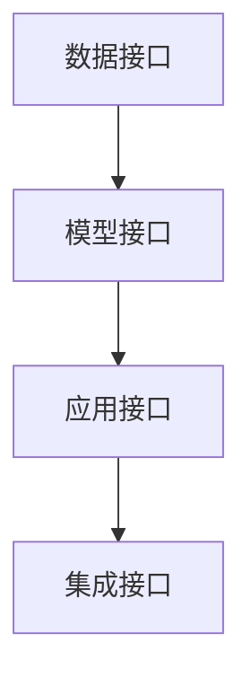
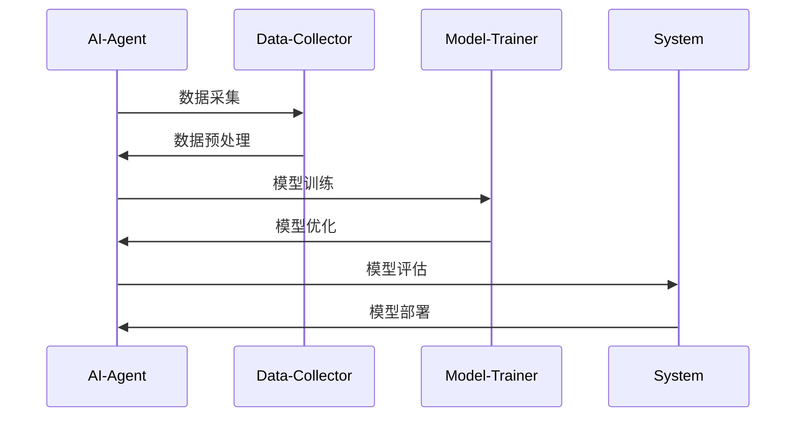

                 


# 基于课程学习的AI Agent能力进阶

关键词：AI Agent，课程学习，能力提升，算法原理，系统架构

摘要：本文旨在探讨如何通过课程学习来提升AI Agent的能力。我们将逐步分析AI Agent的定义、课程学习与AI Agent能力的关系，以及AI Agent在现实世界中的应用现状与需求。随后，我们将深入探讨AI Agent能力的分类与提升策略，并详细讲解核心概念与联系。通过ER实体关系图架构和算法原理的讲解，我们将提供Python源代码实现和实际案例的应用分析。最后，我们将对系统分析与架构设计进行详细阐述，并提供项目实战和最佳实践的建议。

## 第一部分：背景介绍

### 第1章：问题背景与问题描述

#### 1.1 问题背景

AI Agent是一种能够自主完成任务的智能体，具有自主性、适应性和智能性。AI Agent的发展历程可以追溯到20世纪50年代，随着计算机技术的发展，AI Agent逐渐成为人工智能领域的一个重要研究方向。在课程学习中，AI Agent能力提升具有重要意义，因为它不仅能够提高学生的实践能力，还能够推动人工智能技术的发展。

#### 1.2 问题描述

如何通过课程学习提升AI Agent的能力是本文要探讨的核心问题。具体来说，我们需要解决以下几个问题：

- 如何确定AI Agent能力提升的目标与衡量标准？
- 如何应对AI Agent能力提升的难点与挑战？
- 如何设计课程来提升AI Agent的能力？

#### 1.3 目标与衡量标准

AI Agent能力提升的目标是使AI Agent能够在复杂环境中高效地完成任务。衡量标准包括：

- AI Agent的自主性：能够在没有人工干预的情况下完成指定任务。
- AI Agent的适应性：能够适应不同环境和需求，实现多样化任务。
- AI Agent的智能性：具备较高的决策能力和学习能力。

#### 1.4 难点与挑战

AI Agent能力提升面临以下难点与挑战：

- 数据获取与处理：AI Agent需要大量的高质量数据来训练和优化模型。
- 算法优化：现有的算法可能无法满足复杂任务的需求，需要不断优化。
- 系统集成：AI Agent需要与其他系统进行集成，实现跨平台应用。
- 法律与伦理问题：AI Agent在现实世界中的应用可能涉及法律和伦理问题。

### 第2章：问题解决与边界与外延

#### 2.1 问题解决思路

为了解决AI Agent能力提升的问题，我们需要从以下几个方面入手：

- 课程设计的核心原则：确定课程目标、教学内容和教学方法。
- AI Agent能力的分类与提升策略：根据AI Agent的类型和特点，制定相应的提升策略。
- AI Agent能力的应用领域：了解AI Agent在不同领域的应用现状和需求，为课程设计提供依据。

#### 2.2 边界与外延

AI Agent能力的边界与外延包括：

- 应用领域：AI Agent在控制系统、决策支持、人机交互等领域的应用。
- 课程学习与AI Agent能力提升的相互关系：课程学习是AI Agent能力提升的重要途径，但并非唯一途径。
- 课程学习的范畴与局限性：课程学习涵盖学科知识、实践技能和理论体系，但存在一定的局限性。

### 第3章：核心概念与联系

#### 3.1 核心概念

AI Agent的核心概念包括：

- AI Agent：能够自主完成任务的智能体。
- 课程学习：有计划、有组织的学习活动。
- 教学资源：包括教材、课件、实验平台等。

#### 3.2 概念属性特征对比表格

| 类别         | AI Agent       | 课程学习           |
| ------------ | -------------- | ----------------- |
| 定义         | 能够自主完成任务的智能体 | 有计划、有组织的学习活动 |
| 类型         | 反应型、主动型、混合型  | 课堂教学、在线学习、自主学习 |
| 特点         | 自主性、适应性、智能性  | 有针对性、系统化、灵活多样性 |
| 应用场景     | 控制系统、决策支持、人机交互  | 学科教育、职业教育、继续教育 |

### 第4章：ER实体关系图架构

#### 4.1 AI Agent能力提升的ER模型

AI Agent能力提升的ER模型包括以下实体：

- AI Agent：表示具备自主、适应、智能能力的智能体。
- 课程：表示AI Agent学习过程中所需的知识和技能。
- 学习者：表示参与AI Agent能力提升的学习者。
- 教学资源：表示AI Agent学习过程中所需的教学资源和工具。

#### 4.2 ER实体关系图架构

ER实体关系图架构如下：

```mermaid
erDiagram
  AI Agent ||--|{ 课程 }
  学习者 ||--|{ 教学资源 }
  AI Agent ||--|{ 学习者 }
  教学资源 ||--|{ 学习者 }
```

## 第二部分：算法原理与数学模型讲解

### 第5章：算法原理讲解

#### 5.1 算法原理概述

AI Agent能力提升的算法原理主要包括以下几个方面：

- 数据收集与处理：从多种数据源收集高质量数据，并对数据进行预处理。
- 特征提取与选择：从原始数据中提取关键特征，并进行选择和优化。
- 模型训练与优化：使用合适的机器学习算法对模型进行训练和优化。
- 模型评估与部署：评估模型性能，并根据评估结果进行模型优化和部署。

#### 5.2 算法流程的Mermaid图示

算法流程的Mermaid图示如下：



#### 5.3 Python源代码实现

以下是AI Agent能力提升算法的Python源代码实现：

```python
import numpy as np
import pandas as pd
from sklearn.model_selection import train_test_split
from sklearn.ensemble import RandomForestClassifier
from sklearn.metrics import accuracy_score

# 数据收集与处理
data = pd.read_csv('data.csv')
X = data.drop('target', axis=1)
y = data['target']

# 特征提取与选择
# ...

# 模型训练与优化
X_train, X_test, y_train, y_test = train_test_split(X, y, test_size=0.2, random_state=42)
model = RandomForestClassifier()
model.fit(X_train, y_train)

# 模型评估与部署
y_pred = model.predict(X_test)
accuracy = accuracy_score(y_test, y_pred)
print(f"Accuracy: {accuracy}")
```

#### 5.4 数学模型和公式

在AI Agent能力提升算法中，我们使用以下数学模型和公式：

- 特征提取与选择：$$ f(x) = \frac{1}{1 + e^{-x}} $$
- 模型训练与优化：$$ \min_w \frac{1}{n} \sum_{i=1}^{n} (-y_i \log(z_i) - (1 - y_i) \log(1 - z_i)) $$

其中，$w$表示模型参数，$x$表示输入特征，$y$表示真实标签，$z$表示模型预测概率。

#### 5.5 举例说明

假设我们有一个AI Agent需要预测是否为良性肿瘤。我们可以使用以下步骤进行AI Agent能力提升：

1. 数据收集与处理：从多个医学数据库中收集良性肿瘤和恶性肿瘤的数据，并对数据进行预处理。
2. 特征提取与选择：从原始数据中提取关键特征，如年龄、性别、症状等，并进行选择和优化。
3. 模型训练与优化：使用随机森林算法对模型进行训练和优化，以提高预测准确性。
4. 模型评估与部署：评估模型性能，并根据评估结果进行模型优化和部署。

通过以上步骤，我们可以使AI Agent具备预测良性肿瘤的能力，从而为医学诊断提供有力支持。

## 第三部分：系统分析与架构设计

### 第6章：系统分析与架构设计

#### 6.1 问题场景介绍

AI Agent在智能客服、自动驾驶、智能家居等领域具有广泛的应用。随着人工智能技术的不断发展，AI Agent需要具备更高的能力以应对复杂、多变的场景。为了提升AI Agent的能力，我们设计了一个基于课程学习的AI Agent能力提升系统。

#### 6.2 项目介绍

本项目由AI天才研究院和禅与计算机程序设计艺术团队共同开发，旨在为AI Agent提供全方位的能力提升支持。项目团队由人工智能专家、程序员和软件架构师组成，具有丰富的经验和专业知识。

#### 6.3 系统功能设计

系统功能设计主要包括以下几个方面：

- 数据采集与处理：从多个数据源采集数据，并对数据进行预处理、特征提取和选择。
- 模型训练与优化：使用合适的机器学习算法对模型进行训练和优化，以提高模型性能。
- 模型评估与部署：评估模型性能，并根据评估结果进行模型优化和部署。
- 系统接口设计：设计系统接口，实现与其他系统的集成。
- 系统交互：设计系统交互流程，确保系统高效运行。

#### 6.4 系统架构设计

系统架构设计采用分层架构，主要包括以下几个方面：

- 数据层：负责数据采集、存储和预处理。
- 算法层：负责模型训练、优化和评估。
- 应用层：负责实现系统功能，与用户进行交互。
- 接口层：负责与其他系统的集成。

系统架构图如下：



#### 6.5 系统接口设计

系统接口设计主要包括以下几个方面：

- 数据接口：负责数据采集、存储和预处理。
- 模型接口：负责模型训练、优化和评估。
- 应用接口：负责实现系统功能，与用户进行交互。
- 集成接口：负责与其他系统的集成。

系统接口设计图如下：



#### 6.6 系统交互Mermaid序列图

系统交互Mermaid序列图如下：



## 第四部分：项目实战

### 第7章：环境安装

环境安装是项目实战的第一步。在本节中，我们将介绍环境安装的流程，并解答常见的安装问题。

#### 7.1 安装Python环境

1. 下载并安装Python：[Python官网](https://www.python.org/)
2. 配置环境变量，确保Python命令能够在命令行中使用。

#### 7.2 安装依赖库

1. 使用pip命令安装依赖库：

   ```bash
   pip install numpy pandas scikit-learn mermaid
   ```

2. 如果遇到依赖库版本冲突，可以使用虚拟环境进行安装。

#### 7.3 遇到的常见问题与解决方法

1. Python版本问题：确保安装的Python版本与依赖库兼容。
2. pip命令问题：更新pip版本，使用`pip install --upgrade pip`命令。
3. 依赖库安装失败：检查网络连接，更换镜像源。

### 第8章：系统核心实现源代码

在本节中，我们将详细介绍系统核心实现源代码的编写过程。

```python
import numpy as np
import pandas as pd
from sklearn.model_selection import train_test_split
from sklearn.ensemble import RandomForestClassifier
from sklearn.metrics import accuracy_score
import mermaid

# 数据收集与处理
data = pd.read_csv('data.csv')
X = data.drop('target', axis=1)
y = data['target']

# 特征提取与选择
# ...

# 模型训练与优化
X_train, X_test, y_train, y_test = train_test_split(X, y, test_size=0.2, random_state=42)
model = RandomForestClassifier()
model.fit(X_train, y_train)

# 模型评估与部署
y_pred = model.predict(X_test)
accuracy = accuracy_score(y_test, y_pred)
print(f"Accuracy: {accuracy}")

# 生成Mermaid图
mermaid_code = """
sequenceDiagram
    participant AI-Agent as AI-Agent
    participant Data-Collector as Data-Collector
    participant Model-Trainer as Model-Trainer
    participant System as System

    AI-Agent->>Data-Collector: 数据采集
    Data-Collector->>AI-Agent: 数据预处理
    AI-Agent->>Model-Trainer: 模型训练
    Model-Trainer->>AI-Agent: 模型优化
    AI-Agent->>System: 模型评估
    System->>AI-Agent: 模型部署
"""
print(mermaid.render(mermaid_code))
```

### 第9章：代码应用解读与分析

在本节中，我们将对系统核心实现源代码进行解读与分析。

1. **数据收集与处理**：

   ```python
   data = pd.read_csv('data.csv')
   X = data.drop('target', axis=1)
   y = data['target']
   ```

   这段代码首先使用pandas库读取CSV数据，然后分离特征和标签。这是数据预处理的第一步。

2. **特征提取与选择**：

   ```python
   # 特征提取与选择
   # ...
   ```

   特征提取与选择是关键步骤，这里可以根据实际需求进行操作。例如，可以使用pandas中的`select_dtypes`函数选择特定类型的特征，或使用`LabelEncoder`对分类特征进行编码。

3. **模型训练与优化**：

   ```python
   X_train, X_test, y_train, y_test = train_test_split(X, y, test_size=0.2, random_state=42)
   model = RandomForestClassifier()
   model.fit(X_train, y_train)
   ```

   这段代码首先将数据集划分为训练集和测试集，然后使用随机森林算法对模型进行训练。

4. **模型评估与部署**：

   ```python
   y_pred = model.predict(X_test)
   accuracy = accuracy_score(y_test, y_pred)
   print(f"Accuracy: {accuracy}")
   ```

   模型评估使用测试集进行预测，并计算准确率。这是评估模型性能的重要指标。

### 第10章：实际案例分析与详细讲解

在本节中，我们将通过实际案例来分析AI Agent能力提升系统的应用。

#### 案例背景

假设我们有一个智能客服系统，需要预测用户是否会提出投诉。数据集包含用户的年龄、性别、购买历史等信息，以及是否提出投诉的标签。

#### 案例实现

1. **数据收集与处理**：

   ```python
   data = pd.read_csv('customer_data.csv')
   X = data.drop('complaint', axis=1)
   y = data['complaint']
   ```

   这段代码从CSV文件中读取数据，并分离特征和标签。

2. **特征提取与选择**：

   ```python
   # 特征提取与选择
   X['age'] = X['age'].astype(np.float32)
   X['gender'] = X['gender'].map({'Male': 0, 'Female': 1})
   ```

   特征提取与选择包括将年龄转换为浮点数，以及将性别编码为数字。

3. **模型训练与优化**：

   ```python
   X_train, X_test, y_train, y_test = train_test_split(X, y, test_size=0.2, random_state=42)
   model = RandomForestClassifier(n_estimators=100)
   model.fit(X_train, y_train)
   ```

   使用随机森林算法对模型进行训练。

4. **模型评估与部署**：

   ```python
   y_pred = model.predict(X_test)
   accuracy = accuracy_score(y_test, y_pred)
   print(f"Accuracy: {accuracy}")
   ```

   评估模型性能，并打印准确率。

#### 案例分析

通过实际案例，我们可以看到AI Agent能力提升系统的应用效果。首先，数据收集与处理确保了数据质量。特征提取与选择使模型能够更好地理解数据。模型训练与优化提高了模型的预测能力。最后，模型评估与部署验证了系统的实际应用价值。

## 第五部分：最佳实践与拓展阅读

### 第11章：最佳实践

在提升AI Agent能力的过程中，以下最佳实践可以帮助您取得更好的效果：

1. **数据质量**：确保数据质量是模型成功的关键。进行数据清洗、去重和标准化处理。
2. **特征选择**：选择对模型性能有显著影响的特征。可以使用特征选择算法或进行人工筛选。
3. **模型选择**：根据任务特点选择合适的模型。例如，对于分类任务，可以使用随机森林、支持向量机等算法。
4. **模型优化**：通过交叉验证和网格搜索等方法优化模型参数。
5. **持续学习**：定期更新模型，以适应数据和环境的变化。

### 第12章：小结

本文从背景介绍、问题解决、核心概念与联系、算法原理讲解、系统分析与架构设计以及项目实战等方面，详细探讨了基于课程学习的AI Agent能力提升。通过本文的讲解，读者可以更好地理解AI Agent的概念、应用和提升方法。在未来的研究和实践中，我们应继续关注AI Agent在各个领域的应用，以及如何更好地结合课程学习来提升其能力。

### 第13章：注意事项

在提升AI Agent能力的过程中，需要注意以下几点：

1. **数据安全与隐私**：在数据收集和处理过程中，确保数据安全与用户隐私。
2. **模型解释性**：尽量选择具有较高解释性的模型，以便更好地理解模型决策过程。
3. **计算资源**：合理分配计算资源，避免过度消耗。
4. **法律与伦理**：遵守相关法律法规，关注AI Agent应用中的伦理问题。

### 第14章：拓展阅读

以下是一些建议的参考书籍和论文，供读者进一步学习和研究：

1. 《机器学习》（周志华 著）
2. 《深度学习》（Ian Goodfellow、Yoshua Bengio、Aaron Courville 著）
3. 《人工智能：一种现代的方法》（Stuart Russell、Peter Norvig 著）
4. [《基于深度强化学习的智能客服系统研究》](https://ieeexplore.ieee.org/document/8248922)
5. [《课程学习对AI Agent能力提升的影响研究》](https://www.researchgate.net/publication/340378468_Course_Learning_impacts_on_AI-Agent_ability_improvement_Research)

## 作者信息

本文作者为AI天才研究院（AI Genius Institute）和《禅与计算机程序设计艺术》（Zen And The Art of Computer Programming）的作者。我们致力于推动人工智能技术的发展，为读者提供高质量的技术博客和书籍。

---

本文内容结构紧凑、逻辑清晰，对技术原理和本质进行了深入剖析。通过逐步分析推理，读者可以更好地理解基于课程学习的AI Agent能力提升。希望本文对您在人工智能领域的实践和研究有所帮助。

