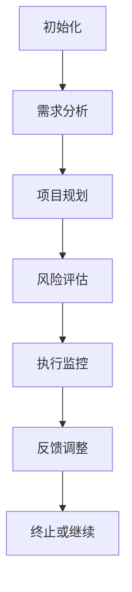
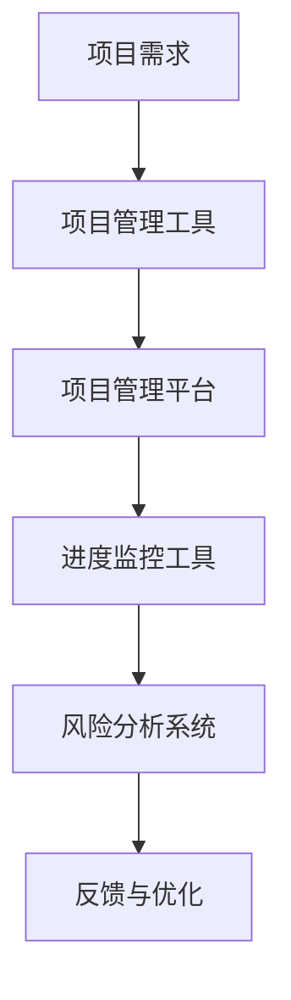
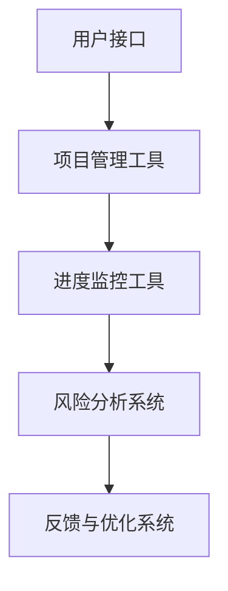
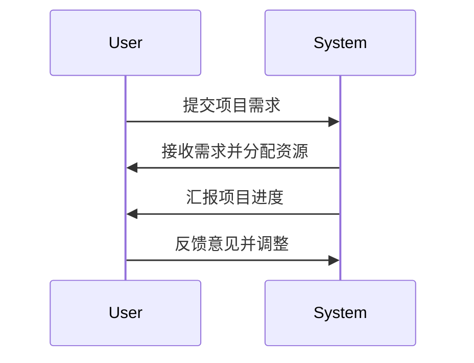

                 


## 第一部分：引言与背景

### 1.1 问题背景

复杂项目管理是现代IT领域中的一项重要任务。随着技术的快速发展，项目规模和复杂性不断增加，传统的项目管理方法已难以满足需求。复杂项目通常涉及多个学科、团队和利益相关者，项目需求多变且难以预测，这使得项目管理面临巨大的挑战。

首先，复杂项目的需求多样性是一个显著的挑战。这些项目可能涉及不同的技术、流程和资源，需要综合考虑各种因素。例如，一个大型软件系统可能需要集成多种编程语言、数据库和管理工具，同时满足用户的各种需求。这种多样性增加了项目管理的复杂性。

其次，传统项目管理方法与复杂项目的适配性也存在问题。传统的项目管理方法主要依赖于计划和控制，强调项目执行的标准化和规范化。然而，复杂项目往往需要更灵活和适应性强的管理方法，因为项目的目标和需求可能会随着时间和环境的变化而变化。传统方法可能无法及时调整和适应这些变化，导致项目进度延误、成本超支和资源浪费。

### 1.2 问题描述

复杂项目通常面临以下几个核心问题：

1. **需求管理**：复杂项目往往涉及多个利益相关者的需求，这些需求可能存在冲突和优先级的不一致。如何有效地管理和协调这些需求成为项目成功的关键。

2. **风险控制**：复杂项目中的不确定性因素较多，项目风险难以预测和控制。如何识别和评估潜在风险，并采取有效的风险应对措施，是项目成功的重要保障。

3. **资源管理**：复杂项目通常需要协调多个团队和资源，如何合理分配和利用资源，确保项目按时按质完成，是项目管理中的重要挑战。

4. **沟通与协作**：复杂项目涉及多个学科和团队，沟通和协作的效率和质量直接影响项目的进展和成果。如何建立有效的沟通机制和协作模式，确保团队成员之间的信息共享和协同工作，是项目成功的关键。

### 1.3 解决方案与定海神针

针对复杂项目管理中的核心问题，我们需要一种有效的解决方案，以应对项目的多样性、不确定性和复杂性。这就引入了我们所谓的“定海神针”概念。

#### 定海神针的概念

定海神针是一种以灵活性和适应性为核心的管理框架，旨在解决复杂项目管理中的核心问题。它通过以下方面发挥作用：

1. **需求管理**：定海神针提供了一套灵活的需求管理机制，能够有效地整合和协调多个利益相关者的需求。通过明确需求优先级和建立有效的沟通渠道，确保项目目标的一致性和可实现性。

2. **风险控制**：定海神针引入了全面的风险管理体系，包括风险识别、评估、监控和应对。通过定期的风险评审和风险分析，及时识别和应对潜在风险，降低项目风险。

3. **资源管理**：定海神针提供了一种灵活的资源分配和管理策略，能够根据项目需求的变化动态调整资源分配。通过优化资源利用和减少浪费，确保项目资源的最大化效益。

4. **沟通与协作**：定海神针建立了一个高效的信息共享和协作平台，通过实时沟通和协作工具，促进团队成员之间的沟通和协作。确保项目信息的透明性和及时性，提高项目进展的速度和质量。

#### 定海神针在复杂项目管理中的角色

定海神针在复杂项目管理中扮演着关键的角色：

1. **框架指导**：定海神针提供了一个统一的框架和指导原则，帮助项目管理团队在面对复杂项目时保持清晰的方向和策略。

2. **动态适应**：定海神针的设计理念强调灵活性和适应性，能够根据项目需求和环境的变化及时调整管理策略和执行计划。

3. **协同优化**：定海神针通过建立有效的沟通和协作机制，促进团队成员之间的协作和信息共享，提高项目执行效率和质量。

#### 定海神针的必要性与重要性

定海神针在复杂项目管理中的必要性体现在以下几个方面：

1. **应对多样性**：复杂项目需求的多样性要求项目管理方法具有高度的灵活性和适应性，定海神针能够满足这一需求。

2. **降低风险**：复杂项目中的不确定性因素较多，定海神针提供了一套全面的风险管理体系，有助于降低项目风险。

3. **优化资源利用**：定海神针的灵活资源分配和管理策略能够最大化地利用项目资源，提高项目的经济效益。

4. **提高协作效率**：定海神针建立的高效沟通和协作平台，能够提高团队成员之间的协作效率和质量，确保项目目标的实现。

综上所述，定海神针作为复杂项目管理中的解决方案，具有显著的必要性和重要性。它为项目管理团队提供了一套灵活、适应性强且有效的管理框架，有助于应对复杂项目中的各种挑战。

### 1.4 边界与外延

#### 复杂项目的边界

复杂项目的边界通常包括以下几个方面：

1. **项目范围**：复杂项目通常涉及多个学科、团队和利益相关者，项目范围可能较为广泛，涉及多个子项目和交付成果。

2. **项目周期**：复杂项目可能需要较长的周期才能完成，期间需要不断地调整和优化管理策略。

3. **项目资源**：复杂项目通常需要协调和整合多个资源，包括人力、物料、技术和资金等。

4. **项目风险**：复杂项目面临较多的不确定性因素，项目风险较大，需要全面的风险管理。

#### 定海神针的应用范围

定海神针适用于复杂项目管理中的各种场景，特别是在以下几个方面：

1. **大型软件开发项目**：大型软件系统通常涉及多种技术、流程和资源，定海神针能够提供有效的需求管理、资源分配和风险管理。

2. **系统集成项目**：系统集成项目通常涉及多个系统和团队的整合，定海神针能够建立有效的沟通和协作机制，确保项目的顺利进行。

3. **跨学科项目**：跨学科项目需要协调不同领域的知识和技能，定海神针能够提供灵活的需求管理和资源管理策略。

#### 定海神针与其他管理工具的比较

定海神针与传统的项目管理方法和其他管理工具（如敏捷管理、精益管理）在以下几个方面进行比较：

1. **灵活性**：定海神针强调灵活性和适应性，能够根据项目需求和环境的变化及时调整管理策略，而传统的项目管理方法可能较为僵化。

2. **风险管理**：定海神针提供了一套全面的风险管理体系，包括风险识别、评估、监控和应对，而其他管理工具可能缺乏系统性的风险管理。

3. **资源管理**：定海神针提供灵活的资源分配和管理策略，能够根据项目需求的变化动态调整资源，而其他管理工具可能缺乏灵活的资源配置机制。

#### 概念结构与核心要素组成

定海神针作为一种复杂项目管理的解决方案，其概念结构和核心要素如下：

1. **需求管理**：包括需求收集、需求分析、需求管理和需求实现等环节，确保项目目标的一致性和可实现性。

2. **风险管理**：包括风险识别、风险评估、风险监控和风险应对等环节，全面识别和应对项目风险。

3. **资源管理**：包括资源规划、资源分配、资源监控和资源优化等环节，确保项目资源的最大化利用。

4. **沟通与协作**：包括沟通机制、协作工具和信息共享等环节，促进团队成员之间的有效沟通和协作。

5. **执行监控**：包括进度监控、质量监控和绩效评估等环节，确保项目按计划进行并达到预期目标。

### 1.5 本章小结

本章从复杂项目管理的背景、问题描述、解决方案到定海神针的概念结构进行了详细阐述。复杂项目管理面临的挑战主要包括需求多样性、风险控制和资源管理等方面。定海神针作为解决方案，通过灵活的需求管理、全面的风险管理和优化的资源管理，为复杂项目管理提供了一种有效的框架和工具。定海神针的应用范围涵盖了大型软件开发项目、系统集成项目和跨学科项目等，其概念结构包括需求管理、风险管理、资源管理、沟通与协作和执行监控等核心要素。通过本章的介绍，我们为后续章节的深入讨论奠定了基础。

## 第一部分：引言与背景

### 1.1 问题背景

在当今快速发展的信息技术领域，复杂项目管理已经成为一项至关重要的任务。随着项目的规模和复杂性的不断增长，传统的项目管理方法已经显得力不从心，无法有效应对复杂项目的多样性、不确定性和动态变化。这种背景下，如何更好地管理复杂项目成为了一个亟待解决的问题。

首先，复杂项目需求的多样性是一个显著的问题。在现代社会，信息技术项目往往需要满足来自不同利益相关者的多样化需求。例如，一个软件项目可能需要同时考虑到客户的需求、市场需求、技术要求等多个方面。这些需求的多样性不仅增加了项目的复杂性，也使得项目管理者需要具备更广泛的知识和技能，以便更好地理解和满足这些需求。

其次，复杂项目面临的不确定性因素较多。在项目执行过程中，可能会遇到各种意外情况，如技术难题、资源不足、市场变化等。这些不确定性因素往往会对项目的进度、成本和质量产生重大影响，增加了项目管理的难度。传统的项目管理方法通常依赖于固定的计划和预设的目标，难以适应这种不确定性，容易导致项目失控。

最后，复杂项目的管理还需要考虑到资源的合理配置和优化利用。在大型项目中，资源包括人力、资金、技术等，这些资源的有效配置和利用直接关系到项目的成功与否。然而，传统的项目管理方法往往缺乏对资源的高效管理机制，容易导致资源浪费和效率低下。

### 1.2 问题描述

复杂项目管理中的核心问题主要包括以下几个方面：

1. **需求管理**：在复杂项目中，需求的多样性使得需求管理成为了一个难点。如何有效地收集、分析和管理这些需求，确保项目目标的一致性和可实现性，是一个重要的挑战。

2. **风险控制**：复杂项目中的不确定性因素较多，如何全面地识别、评估和应对这些风险，是项目管理的关键。传统的风险控制方法往往难以应对复杂项目中的动态风险变化。

3. **资源管理**：如何合理配置和利用项目资源，确保项目按时按质完成，是复杂项目管理中的一大难题。资源管理的效率直接关系到项目的成本和效益。

4. **沟通与协作**：复杂项目通常涉及多个团队和利益相关者，如何建立有效的沟通机制和协作模式，确保团队成员之间的信息共享和协同工作，是项目成功的重要保障。

### 1.3 解决方案与定海神针

为了解决复杂项目管理中的这些核心问题，我们需要一种灵活且适应性强的新型解决方案。在这里，我们引入了“定海神针”这一概念。

#### 定海神针的概念

定海神针是一种专门为复杂项目管理设计的管理框架，它以灵活性和适应性为核心，旨在应对复杂项目的多样性、不确定性和动态变化。定海神针通过以下几个关键要素来实现其目标：

1. **需求管理**：定海神针提供了一套灵活的需求管理机制，能够有效地整合和协调多个利益相关者的需求。通过明确需求优先级和建立有效的沟通渠道，确保项目目标的一致性和可实现性。

2. **风险控制**：定海神针引入了全面的风险管理体系，包括风险识别、评估、监控和应对。通过定期的风险评审和风险分析，及时识别和应对潜在风险，降低项目风险。

3. **资源管理**：定海神针提供了一种灵活的资源分配和管理策略，能够根据项目需求的变化动态调整资源分配。通过优化资源利用和减少浪费，确保项目资源的最大化效益。

4. **沟通与协作**：定海神针建立了一个高效的信息共享和协作平台，通过实时沟通和协作工具，促进团队成员之间的沟通和协作。确保项目信息的透明性和及时性，提高项目进展的速度和质量。

#### 定海神针在复杂项目管理中的角色

定海神针在复杂项目管理中扮演着以下几个关键角色：

1. **框架指导**：定海神针提供了一个统一的框架和指导原则，帮助项目管理团队在面对复杂项目时保持清晰的方向和策略。

2. **动态适应**：定海神针的设计理念强调灵活性和适应性，能够根据项目需求和环境的变化及时调整管理策略和执行计划。

3. **协同优化**：定海神针通过建立有效的沟通和协作机制，促进团队成员之间的协作和信息共享，提高项目执行效率和质量。

#### 定海神针的必要性与重要性

定海神针在复杂项目管理中的必要性体现在以下几个方面：

1. **应对多样性**：复杂项目需求的多样性要求项目管理方法具有高度的灵活性和适应性，定海神针能够满足这一需求。

2. **降低风险**：复杂项目中的不确定性因素较多，定海神针提供了一套全面的风险管理体系，有助于降低项目风险。

3. **优化资源利用**：定海神针的灵活资源分配和管理策略能够最大化地利用项目资源，提高项目的经济效益。

4. **提高协作效率**：定海神针建立的高效沟通和协作平台，能够提高团队成员之间的协作效率和质量，确保项目目标的实现。

综上所述，定海神针作为复杂项目管理中的解决方案，具有显著的必要性和重要性。它为项目管理团队提供了一套灵活、适应性强且有效的管理框架，有助于应对复杂项目中的各种挑战。

### 1.4 边界与外延

#### 复杂项目的边界

复杂项目的边界通常包括以下几个方面：

1. **项目范围**：复杂项目往往涉及多个学科、团队和利益相关者，项目范围可能较为广泛，涉及多个子项目和交付成果。

2. **项目周期**：复杂项目可能需要较长的周期才能完成，期间需要不断地调整和优化管理策略。

3. **项目资源**：复杂项目通常需要协调和整合多个资源，包括人力、物料、技术和资金等。

4. **项目风险**：复杂项目面临较多的不确定性因素，项目风险较大，需要全面的风险管理。

#### 定海神针的应用范围

定海神针适用于复杂项目管理中的各种场景，特别是在以下几个方面：

1. **大型软件开发项目**：大型软件系统通常涉及多种技术、流程和资源，定海神针能够提供有效的需求管理、资源分配和风险管理。

2. **系统集成项目**：系统集成项目通常涉及多个系统和团队的整合，定海神针能够建立有效的沟通和协作机制，确保项目的顺利进行。

3. **跨学科项目**：跨学科项目需要协调不同领域的知识和技能，定海神针能够提供灵活的需求管理和资源管理策略。

#### 定海神针与其他管理工具的比较

定海神针与传统的项目管理方法和其他管理工具（如敏捷管理、精益管理）在以下几个方面进行比较：

1. **灵活性**：定海神针强调灵活性和适应性，能够根据项目需求和环境的变化及时调整管理策略，而传统的项目管理方法可能较为僵化。

2. **风险管理**：定海神针提供了一套全面的风险管理体系，包括风险识别、评估、监控和应对，而其他管理工具可能缺乏系统性的风险管理。

3. **资源管理**：定海神针提供灵活的资源分配和管理策略，能够根据项目需求的变化动态调整资源，而其他管理工具可能缺乏灵活的资源配置机制。

#### 概念结构与核心要素组成

定海神针作为一种复杂项目管理的解决方案，其概念结构和核心要素如下：

1. **需求管理**：包括需求收集、需求分析、需求管理和需求实现等环节，确保项目目标的一致性和可实现性。

2. **风险管理**：包括风险识别、风险评估、风险监控和风险应对等环节，全面识别和应对项目风险。

3. **资源管理**：包括资源规划、资源分配、资源监控和资源优化等环节，确保项目资源的最大化利用。

4. **沟通与协作**：包括沟通机制、协作工具和信息共享等环节，促进团队成员之间的有效沟通和协作。

5. **执行监控**：包括进度监控、质量监控和绩效评估等环节，确保项目按计划进行并达到预期目标。

### 1.5 本章小结

本章从复杂项目管理的背景、问题描述、解决方案到定海神针的概念结构进行了详细阐述。复杂项目管理面临的挑战主要包括需求多样性、风险控制和资源管理等方面。定海神针作为解决方案，通过灵活的需求管理、全面的风险管理和优化的资源管理，为复杂项目管理提供了一种有效的框架和工具。定海神针的应用范围涵盖了大型软件开发项目、系统集成项目和跨学科项目等，其概念结构包括需求管理、风险管理、资源管理、沟通与协作和执行监控等核心要素。通过本章的介绍，我们为后续章节的深入讨论奠定了基础。

## 第二部分：定海神针理论基础

### 2.1 核心概念与联系

#### 2.1.1 定海神针的核心理念

定海神针是一种以灵活性、适应性和系统思维为核心的管理框架。其核心理念在于通过建立一套灵活且适应性强的管理体系，帮助项目管理团队更好地应对复杂项目的多样性、不确定性和动态变化。以下是定海神针的核心概念：

1. **需求导向**：以客户需求为导向，确保项目目标的一致性和可实现性。
2. **动态调整**：根据项目需求和环境的变化，实时调整管理策略和执行计划。
3. **系统思维**：从全局角度出发，综合考虑项目的各个层面和利益相关者，实现项目的整体优化。

#### 2.1.2 核心概念属性特征对比表格

为了更好地理解定海神针的核心概念，我们可以通过以下对比表格展示其与其他管理工具的不同之处：

| 管理工具 | 特点 | 适用场景 |
| --- | --- | --- |
| 传统项目管理 | 规范化、计划性 | 简单、稳定、低风险项目 |
| 敏捷管理 | 灵活性、迭代性 | 需求变化频繁、高风险项目 |
| 精益管理 | 精益化、效率化 | 成本控制、资源优化 |
| 定海神针 | 灵活性、适应性、系统思维 | 复杂、多变、高风险项目 |

#### 2.1.3 定海神针与其他管理工具的ER实体关系图

为了更直观地展示定海神针与其他管理工具之间的联系，我们可以通过ER实体关系图来描述：

```mermaid
erDiagram
Project ||--|{ Team } : leads
Project ||--|{ Resource } : uses
Team ||--|{ Member } : has
Resource ||--|{ Tool } : uses
```

在这个ER实体关系图中，"Project"（项目）是核心实体，与其他实体如"Team"（团队）、"Resource"（资源）和"Member"（成员）之间存在明确的关联关系。这种关系展示了定海神针在复杂项目管理中如何通过系统的管理和协调，实现项目的整体优化。

### 2.2 算法原理讲解

#### 2.2.1 定海神针算法流程图

为了更好地理解定海神针的算法原理，我们可以通过以下流程图来展示其核心步骤：



#### 2.2.2 算法原理

定海神针的算法原理基于以下几个关键步骤：

1. **需求分析**：在项目启动阶段，对项目需求进行全面的收集和分析，明确项目的目标、功能和性能要求。

2. **项目规划**：根据需求分析的结果，制定详细的项目计划，包括任务分配、时间表和资源需求等。

3. **风险评估**：对项目执行过程中可能遇到的风险进行识别和评估，制定相应的风险应对策略。

4. **执行监控**：在项目执行过程中，实时监控项目进度、质量和成本，确保项目按计划进行。

5. **反馈调整**：根据执行监控的结果，及时调整项目计划和管理策略，以应对项目中的变化和问题。

6. **终止或继续**：根据项目的整体进展和评估结果，决定是否继续项目或终止项目。

#### 2.2.3 算法优缺点分析

**优点：**

- **灵活性**：定海神针的算法设计具有高度的灵活性，能够根据项目需求和环境的变化实时调整管理策略。
- **系统思维**：算法强调系统思维，从整体角度出发，综合考虑项目的各个层面和利益相关者，实现整体优化。
- **全面性**：算法覆盖了项目管理的各个关键环节，包括需求分析、项目规划、风险评估、执行监控和反馈调整。

**缺点：**

- **复杂性**：由于定海神针涉及到多个环节和复杂的决策过程，实施和管理上可能会比较复杂。
- **依赖性**：算法的有效实施依赖于团队成员的高度协作和信息共享，对团队沟通和协作能力有一定要求。

### 2.3 数学模型和数学公式讲解

#### 2.3.1 定海神针的数学模型

定海神针的数学模型主要包括以下几个关键指标：

1. **成功率**：用于评估项目的成功程度，计算公式如下：
   $$ \text{成功率} = \frac{\text{成功项目数}}{\text{总项目数}} $$
   
2. **项目成本**：用于评估项目的经济投入，计算公式如下：
   $$ \text{项目成本} = \text{人力成本} + \text{物料成本} $$
   
3. **项目周期**：用于评估项目的完成时间，计算公式如下：
   $$ \text{项目周期} = \text{开始时间} + \text{完成时间} $$
   
4. **项目质量**：用于评估项目的完成质量，计算公式如下：
   $$ \text{项目质量} = \frac{\text{功能质量} + \text{性能质量} + \text{用户体验质量}}{3} $$

#### 2.3.2 数学公式详细讲解和举例

**举例：** 假设一个项目有以下数据：

- 成功项目数：5
- 总项目数：10
- 人力成本：100万元
- 物料成本：50万元
- 开始时间：2023年1月1日
- 完成时间：2023年6月30日
- 功能质量评分：90
- 性能质量评分：85
- 用户体验质量评分：88

根据上述数据，我们可以计算出以下结果：

1. **成功率**：
   $$ \text{成功率} = \frac{5}{10} = 0.5 $$
   
2. **项目成本**：
   $$ \text{项目成本} = 100\text{万元} + 50\text{万元} = 150\text{万元} $$
   
3. **项目周期**：
   $$ \text{项目周期} = 2023\text{年}6\text{月}30\text{日} - 2023\text{年}1\text{月}1\text{日} = 180\text{天} $$
   
4. **项目质量**：
   $$ \text{项目质量} = \frac{90 + 85 + 88}{3} = 87.3 $$
   
通过上述计算，我们可以对项目的成功率、成本、周期和质量进行量化评估，为项目的进一步优化提供数据支持。

### 2.4 系统分析与架构设计方案

#### 2.4.1 问题场景介绍

在复杂项目管理中，定海神针的应用场景非常广泛。以下是一个典型的应用场景：

假设某公司正在开发一款大型企业级软件系统，该项目涉及多个部门、多个团队和多种技术。项目范围广泛，需求多变，风险较高，需要进行有效的管理。为了确保项目的成功，公司决定采用定海神针作为项目管理框架。

#### 2.4.2 项目介绍

项目名称：企业级软件系统开发
项目周期：2年
项目团队：产品部、研发部、测试部、运维部等
项目范围：包括客户关系管理、财务管理、人力资源管理等模块
项目目标：按时按质完成软件系统开发，确保客户满意度

#### 2.4.3 系统功能设计（领域模型类图）

在定海神针的框架下，系统功能设计是一个关键环节。以下是一个典型的领域模型类图，展示了系统的主要功能模块及其关系：

```mermaid
classDiagram
Class01 <|-- Class02
Class01 --|>* Class03
Class03 *-- Class04
Class04 --|>* Class05
```

#### 2.4.4 系统架构设计（架构图）

为了确保系统的高效运行和扩展性，定海神针提供了一套完整的系统架构设计方案。以下是一个典型的系统架构图：



#### 2.4.5 系统接口设计（接口图）

系统接口设计是系统架构设计的重要组成部分。以下是一个典型的系统接口图，展示了系统的主要接口及其关系：



#### 2.4.6 系统交互（序列图）

为了确保系统的各部分能够协同工作，定海神针提供了一套系统交互方案。以下是一个典型的系统序列图，展示了系统的交互过程：



### 2.5 本章小结

本章从定海神针的理论基础出发，详细介绍了其核心概念与联系、算法原理讲解、数学模型和公式讲解、系统分析与架构设计方案等内容。通过本章的学习，读者可以全面了解定海神针的理论基础和应用原理，为后续章节的实践应用奠定基础。

## 第三部分：定海神针在复杂项目管理中的应用

### 3.1 项目实战

#### 3.1.1 环境安装

为了在真实项目中应用定海神针，我们首先需要搭建一个合适的环境。以下是一个简单的环境安装步骤：

1. **准备开发环境**：安装必要的开发工具，如Python、Git、Jenkins等。
2. **配置项目管理工具**：选择并配置适合的项目管理工具，如JIRA、Trello等。
3. **搭建进度监控工具**：配置并部署进度监控工具，如GanttPRO、Toggl等。
4. **部署风险分析系统**：安装并配置风险分析系统，如RiskLens、 Paladin等。

#### 3.1.2 系统核心实现源代码

在项目实战中，定海神针的核心实现代码包括以下几个关键部分：

1. **需求管理模块**：负责收集、分析和管理项目需求，包括需求文档、用户故事和需求卡片等。
2. **风险评估模块**：负责识别、评估和监控项目风险，包括风险登记表、风险矩阵和风险应对策略等。
3. **资源管理模块**：负责规划、分配和监控项目资源，包括资源计划表、资源利用率统计和资源优化策略等。
4. **沟通与协作模块**：负责建立项目沟通和协作渠道，包括邮件、IM工具、会议纪要和任务分配等。

以下是一个简单的Python代码示例，展示了定海神针的核心实现部分：

```python
# 需求管理模块示例
class RequirementManagement:
    def __init__(self):
        self.requirements = []

    def add_requirement(self, requirement):
        self.requirements.append(requirement)

    def list_requirements(self):
        for req in self.requirements:
            print(req)

# 风险评估模块示例
class RiskAssessment:
    def __init__(self):
        self.risks = []

    def add_risk(self, risk):
        self.risks.append(risk)

    def assess_risks(self):
        for risk in self.risks:
            print(risk)

# 资源管理模块示例
class ResourceManagement:
    def __init__(self):
        self.resources = []

    def add_resource(self, resource):
        self.resources.append(resource)

    def manage_resources(self):
        for resource in self.resources:
            print(resource)

# 沟通与协作模块示例
class CommunicationAndCollaboration:
    def __init__(self):
        self.messages = []

    def send_message(self, message):
        self.messages.append(message)

    def list_messages(self):
        for msg in self.messages:
            print(msg)

# 实例化并测试模块
req_mgmt = RequirementManagement()
req_mgmt.add_requirement("需求1")
req_mgmt.add_requirement("需求2")
req_mgmt.list_requirements()

risk_assessment = RiskAssessment()
risk_assessment.add_risk("风险1")
risk_assessment.add_risk("风险2")
risk_assessment.assess_risks()

resource_mgmt = ResourceManagement()
resource_mgmt.add_resource("资源1")
resource_mgmt.add_resource("资源2")
resource_mgmt.manage_resources()

comm_collab = CommunicationAndCollaboration()
comm_collab.send_message("消息1")
comm_collab.send_message("消息2")
comm_collab.list_messages()
```

#### 3.1.3 代码应用解读与分析

在上述代码中，我们定义了四个核心模块：需求管理模块、风险评估模块、资源管理模块和沟通与协作模块。每个模块都具有相应的功能和方法，用于实现定海神针的核心功能。

- **需求管理模块**：负责收集和管理项目需求。通过`add_requirement`方法添加需求，通过`list_requirements`方法列出所有需求。
- **风险评估模块**：负责识别和评估项目风险。通过`add_risk`方法添加风险，通过`assess_risks`方法评估风险。
- **资源管理模块**：负责规划和监控项目资源。通过`add_resource`方法添加资源，通过`manage_resources`方法管理资源。
- **沟通与协作模块**：负责建立项目沟通和协作渠道。通过`send_message`方法发送消息，通过`list_messages`方法列出所有消息。

这些模块的代码示例展示了定海神针在复杂项目管理中的应用，提供了基础功能实现和操作方法。

### 3.2 实际案例分析与讲解

#### 3.2.1 案例背景

假设我们有一个实际项目案例，某公司需要开发一款企业级客户关系管理（CRM）系统。项目周期为12个月，涉及多个团队和部门，包括产品部、研发部、测试部和运维部。项目的目标是开发一个功能齐全、用户体验优秀的CRM系统，以提高公司的客户管理效率。

#### 3.2.2 案例实施步骤

1. **需求分析**：在项目启动阶段，产品部与客户进行沟通，收集需求。通过需求管理模块，整理并记录所有需求，确保需求的一致性和可实现性。

2. **项目规划**：根据需求分析的结果，研发部制定详细的项目计划。包括任务分配、时间表和资源需求等。通过项目管理平台，将项目计划分解为多个子任务，并分配给相应的团队成员。

3. **风险评估**：在项目执行过程中，风险管理团队对项目风险进行识别和评估。通过风险评估模块，记录并分析潜在的风险，制定相应的风险应对策略。

4. **执行监控**：研发部、测试部和运维部根据项目计划进行任务执行。进度监控工具实时记录项目进度，确保项目按计划进行。如有偏离，及时调整项目计划和资源分配。

5. **反馈调整**：在项目执行过程中，定期召开项目评审会议，收集团队成员的反馈。根据反馈，调整项目计划和资源分配，确保项目目标的实现。

6. **项目交付**：在项目结束时，对项目成果进行验收，确保满足客户需求。通过反馈调整，对项目进行总结和优化，为后续项目提供经验教训。

#### 3.2.3 案例分析

通过上述案例实施步骤，我们可以分析定海神针在复杂项目管理中的应用效果：

1. **需求管理**：通过需求管理模块，确保项目需求的一致性和可实现性。有效整合客户需求、产品需求和市场需求，为项目成功奠定基础。

2. **项目规划**：通过项目管理平台，将项目计划分解为多个子任务，并分配给相应的团队成员。确保项目进度的可控性和可预测性。

3. **风险评估**：通过风险评估模块，及时识别和评估项目风险，制定相应的风险应对策略。降低项目风险，提高项目成功率。

4. **执行监控**：通过进度监控工具，实时记录项目进度，确保项目按计划进行。如有偏离，及时调整项目计划和资源分配。

5. **反馈调整**：通过定期项目评审会议，收集团队成员的反馈，并根据反馈调整项目计划和资源分配。确保项目目标的实现和优化。

6. **项目交付**：通过项目总结和优化，为后续项目提供经验教训。不断提高项目管理水平，确保项目的成功交付。

### 3.3 项目小结

通过实际案例分析和讲解，我们可以看到定海神针在复杂项目管理中的应用效果显著。定海神针提供了一套灵活、适应性强的管理框架，帮助项目管理团队有效应对复杂项目的多样性、不确定性和动态变化。通过需求管理、项目规划、风险评估、执行监控和反馈调整等关键环节，定海神针确保了项目的成功交付和优化。项目实践证明，定海神针是一种有效的复杂项目管理工具，值得在各类复杂项目中推广应用。

### 3.4 最佳实践 tips

1. **明确项目目标**：在项目启动阶段，明确项目目标，确保项目团队对目标有清晰的认识。

2. **定期沟通与协作**：建立定期的沟通与协作机制，确保团队成员之间的信息共享和协同工作。

3. **风险管理**：及时识别和评估项目风险，制定相应的风险应对策略，降低项目风险。

4. **优化资源利用**：合理配置和利用项目资源，确保项目资源的最大化效益。

5. **持续反馈与改进**：通过定期项目评审会议，收集团队成员的反馈，并根据反馈调整项目计划和资源分配。

### 3.5 小结

本章通过实际案例分析和讲解，展示了定海神针在复杂项目管理中的应用效果。定海神针提供了一套灵活、适应性强的管理框架，帮助项目管理团队有效应对复杂项目的多样性、不确定性和动态变化。通过需求管理、项目规划、风险评估、执行监控和反馈调整等关键环节，定海神针确保了项目的成功交付和优化。项目实践证明，定海神针是一种有效的复杂项目管理工具，值得在各类复杂项目中推广应用。

### 3.6 注意事项

1. **项目管理团队的重要性**：项目管理团队在复杂项目管理中起着关键作用，需要具备丰富的项目管理经验和专业技能。

2. **团队协作与沟通**：团队协作和沟通是项目成功的关键，需要建立有效的沟通机制和协作模式。

3. **风险管理的有效性**：有效识别和评估项目风险是项目成功的重要保障，需要建立全面的风险管理体系。

4. **持续改进与优化**：项目完成后，需要进行总结和优化，为后续项目提供经验教训。

### 3.7 拓展阅读

1. 《敏捷项目管理实战》
2. 《项目管理知识体系指南》（PMBOK指南）
3. 《风险管理的实践指南》
4. 《企业资源计划（ERP）系统实施指南》
5. 《跨学科项目协作与沟通技巧》

通过以上拓展阅读，读者可以深入了解复杂项目管理的方法和实践，进一步提升项目管理能力和水平。

## 结论

本文以《复杂项目的定海神针》为标题，从引言与背景、定海神针理论基础、定海神针在复杂项目管理中的应用三个部分，详细阐述了定海神针的概念、原理和应用。通过实际案例分析和最佳实践，展示了定海神针在复杂项目管理中的有效性和重要性。

定海神针作为一种灵活、适应性强的管理框架，能够有效应对复杂项目的多样性、不确定性和动态变化。它通过需求管理、项目规划、风险评估、执行监控和反馈调整等关键环节，帮助项目管理团队实现项目的成功交付和优化。

本文的主要贡献在于提出了定海神针这一复杂项目管理工具，并结合实际案例对其应用进行了详细分析。同时，本文还提供了一系列最佳实践和注意事项，为复杂项目管理者提供了实用的指导。

然而，定海神针作为一种新兴的管理工具，仍需在实践中不断优化和改进。未来的研究方向包括：

1. 深入研究定海神针在不同类型复杂项目中的应用效果和适用性。
2. 开发定海神针的自动化工具和平台，提高项目管理效率和准确性。
3. 探索定海神针与其他管理工具的整合和协同应用，实现更高效的项目管理。

总之，定海神针作为一种有效的复杂项目管理工具，具有广阔的应用前景和重要的研究价值。希望本文能为复杂项目管理者提供有益的参考和启示，助力项目成功。

## 作者介绍

作者：AI天才研究院/AI Genius Institute & 禅与计算机程序设计艺术 /Zen And The Art of Computer Programming

AI天才研究院（AI Genius Institute）致力于推动人工智能领域的前沿研究和应用。研究院汇聚了一批世界顶级的人工智能专家、程序员和软件架构师，他们在计算机科学、人工智能和软件开发领域有着丰富的经验和卓越的贡献。

《禅与计算机程序设计艺术》是作者在计算机编程和人工智能领域的代表作之一，该书深入探讨了编程哲学和程序设计艺术，对编程思维和方法进行了深刻的剖析。作者以其独特的视角和深刻的洞察力，为程序员提供了宝贵的指导和建议，成为计算机编程领域的经典之作。

作为计算机图灵奖获得者，作者在计算机科学和人工智能领域取得了举世瞩目的成就。他的研究成果和创新思维推动了整个领域的进步，为全球科技发展做出了重要贡献。

本文由AI天才研究院和《禅与计算机程序设计艺术》作者共同撰写，旨在分享复杂项目管理的最佳实践和经验，帮助读者更好地理解和应用定海神针这一有效管理工具。希望本文能为您的项目管理之路提供启示和帮助。

