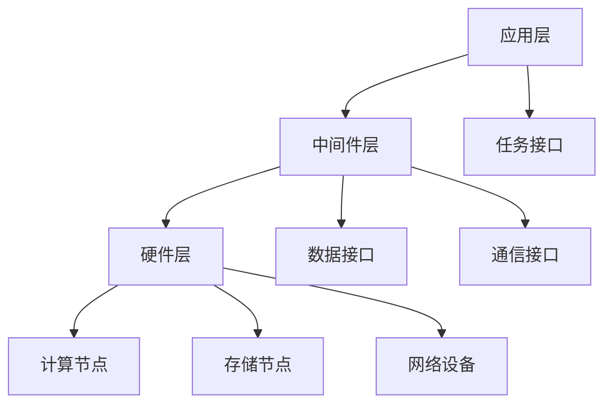
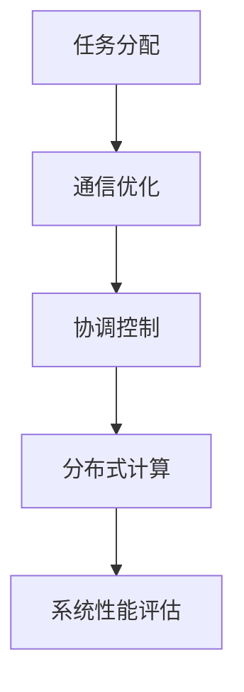

                 

# 多Agent协作系统：复杂任务的分布式解决方案

## 关键词

- 多Agent系统
- 分布式解决方案
- 复杂任务
- 协作机制
- 分布式计算

## 摘要

本文深入探讨了多Agent协作系统的概念、协作机制及其在处理复杂任务中的应用。通过分布式解决方案，多Agent系统能够高效地协同工作，解决传统单机系统难以应对的复杂问题。本文将详细分析多Agent系统的原理、协作机制，并通过实际案例展示其分布式解决方案的实施过程，旨在为读者提供全面的技术指导和深入理解。

### 目录大纲

1. **引言**
   - 背景介绍
   - 研究意义

2. **多Agent系统的概念与架构**
   - 定义
   - 架构组成

3. **多Agent系统的协作机制**
   - 协作原理
   - 协作模型

4. **分布式解决方案的理论基础**
   - 分布式计算基础
   - 异构环境处理

5. **多Agent系统在实际应用中的案例**
   - 示例分析
   - 案例对比

6. **项目实战**
   - 环境安装
   - 系统实现
   - 项目小结

7. **最佳实践 tips**
   - 注意事项
   - 拓展阅读

8. **总结**
   - 结论
   - 展望

### 引言

#### 背景介绍

多Agent系统（MAS）是人工智能领域的一个重要研究方向。随着计算机技术的发展，复杂任务的需求日益增长，传统单机系统难以满足高效处理的要求。分布式解决方案因此成为解决复杂任务的重要手段。多Agent系统通过分布式协作，能够实现高效的资源利用和任务分配，从而提高系统的整体性能和可靠性。

#### 研究意义

本文旨在深入探讨多Agent协作系统的原理、协作机制及其在分布式解决方案中的应用。通过分析多Agent系统的架构和协作机制，我们能够更好地理解其在复杂任务处理中的优势。同时，通过实际案例的展示，读者可以更直观地看到多Agent系统在实际应用中的效果，从而为类似项目的开发提供参考。

### 多Agent系统的概念与架构

#### 定义

多Agent系统是由多个智能体（Agent）组成的系统，这些智能体可以通过通信和协作完成复杂的任务。每个智能体都具有自主性、社交性、反应性和主动性等特性，能够独立执行任务并与其他智能体进行交互。

#### 架构组成

多Agent系统的架构通常包括以下几个部分：

1. **智能体（Agent）**：智能体是系统的基本单元，负责执行具体的任务。智能体可以是个体程序、实体或虚拟角色。
2. **通信机制**：智能体之间的通信机制是实现协作的基础。常见的通信机制包括消息传递、直接通信和间接通信等。
3. **协调与控制**：协调与控制机制用于管理智能体的协作过程，确保系统能够高效地完成复杂任务。
4. **环境感知与建模**：智能体需要具备环境感知能力，并通过建模来理解环境的变化。

#### 概念术语说明

- **智能体（Agent）**：具有智能、自主性、社交性等特性的个体。
- **通信机制**：智能体之间进行信息交换的方式。
- **协作**：多个智能体共同完成任务的过程。
- **分布式计算**：利用多个计算节点共同处理任务的方法。

#### 问题背景

多Agent系统在复杂任务处理中具有显著的优势，但其实现面临着诸多挑战。例如，智能体的自主性可能导致协作效率低下，而复杂的通信机制又增加了系统的复杂度。因此，如何设计高效、可靠的协作机制和分布式解决方案，成为多Agent系统研究的关键问题。

#### 问题解决

通过引入分布式解决方案，多Agent系统能够实现高效的协作。分布式解决方案包括以下几个方面：

1. **任务分配**：根据智能体的能力和任务需求，将任务合理地分配给不同的智能体。
2. **协调机制**：通过协调机制，确保智能体之间的协作顺畅，避免冲突和低效。
3. **通信优化**：优化智能体之间的通信机制，提高通信效率，减少通信开销。

#### 边界与外延

多Agent系统的边界在于智能体的能力和任务范围。外延则涉及到智能体之间的交互和协作，以及系统与外部环境的交互。

#### 概念结构与核心要素组成

多Agent系统的概念结构包括：

- **智能体**：系统的基本单元，具有自主性、社交性等特性。
- **通信机制**：实现智能体之间信息交换的渠道。
- **协调与控制**：管理智能体协作过程的机制。
- **环境感知与建模**：智能体的感知能力和建模能力。

核心要素组成包括：

- **任务分配策略**：合理分配任务，提高系统效率。
- **协作协议**：确保智能体之间协作顺畅。
- **通信协议**：优化通信效率，减少通信开销。

### 多Agent系统的协作机制

#### 协作原理

多Agent系统的协作原理基于智能体的自主性和社交性。每个智能体在完成任务的同时，需要与其他智能体进行协作，共同完成复杂任务。协作原理主要包括以下几个方面：

1. **任务分配**：根据智能体的能力和任务需求，将任务合理地分配给不同的智能体。
2. **通信机制**：智能体之间通过通信机制进行信息交换，实现任务协调和决策。
3. **协调与控制**：协调与控制机制用于管理智能体的协作过程，确保系统高效运行。

#### 协作模型

多Agent系统中的协作模型可分为以下几种：

1. **集中式协作模型**：所有智能体的决策和协调由一个中央智能体完成，其他智能体仅负责执行中央智能体的指令。
2. **分布式协作模型**：每个智能体都有一定的决策权和协调能力，通过局部决策和协作实现整体任务目标。
3. **混合式协作模型**：结合集中式和分布式协作模型的优点，实现高效协作。

#### 协作机制实现

协作机制的实现主要包括以下几个方面：

1. **任务分配算法**：根据智能体的能力和任务需求，设计合理的任务分配算法，确保任务分配的公平性和高效性。
2. **通信协议**：设计高效的通信协议，降低通信开销，提高系统性能。
3. **协调算法**：设计协调算法，确保智能体之间的协作顺畅，避免冲突和低效。

#### 概念属性特征对比表格

| 概念       | 属性特征 | 对比分析 |
| ---------- | -------- | -------- |
| 集中式协作 | 决策权集中，协调效率高 | 灵活性较低，易形成瓶颈 |
| 分布式协作 | 决策权分散，灵活性高 | 协调复杂，易发生冲突 |
| 混合式协作 | 结合集中式和分布式优势 | 实现难度较大，需要权衡 |

#### ER实体关系图架构

```mermaid
erDiagram
  智能体 ||--o{ 协作模型
  协作模型 ||--o{ 协调算法
  协调算法 ||--o{ 通信协议
  任务分配算法 ||--o{ 智能体
```

### 分布式解决方案的理论基础

#### 分布式计算基础

分布式计算是基于多个计算节点的协同工作，通过通信网络实现任务的分配和执行。其主要特点包括：

1. **并行性**：多个计算节点同时执行任务，提高计算效率。
2. **容错性**：系统通过冗余计算节点提高容错能力，增强系统稳定性。
3. **可扩展性**：通过增加计算节点，实现系统性能的线性扩展。

#### 异构环境处理

异构环境处理是分布式解决方案中的一个重要问题。异构环境指系统中的计算节点具有不同的硬件配置、操作系统、编程语言等。处理异构环境主要包括以下几个方面：

1. **任务映射**：根据计算节点的特性，将任务合理地映射到不同的节点上。
2. **资源管理**：优化资源分配，提高资源利用率。
3. **容错与调度**：设计容错和调度策略，确保系统在异构环境中的稳定性。

#### 系统功能设计

分布式解决方案的主要功能包括：

1. **任务分配与调度**：根据任务特点和节点特性，实现任务的有效分配和调度。
2. **数据存储与管理**：设计高效的数据存储和管理方案，确保数据的一致性和可靠性。
3. **通信优化**：优化通信机制，减少通信开销，提高系统性能。

#### 系统架构设计

分布式解决方案的系统架构主要包括以下几个层次：

1. **应用层**：实现具体业务功能的模块，如任务分配、数据存储等。
2. **中间件层**：提供分布式计算所需的通用功能，如通信、调度、存储等。
3. **硬件层**：包括计算节点、存储节点和网络设备等。

#### 系统接口设计

分布式解决方案的系统接口设计主要包括以下几个方面：

1. **任务接口**：定义任务的输入输出接口，实现任务与系统的对接。
2. **数据接口**：定义数据存储和管理的接口，实现数据的一致性和可靠性。
3. **通信接口**：定义智能体之间的通信接口，实现高效的通信机制。

#### 系统交互

分布式解决方案的系统交互主要包括以下几个方面：

1. **任务调度**：系统根据任务特点，选择合适的调度策略，实现任务的合理分配。
2. **数据同步**：系统通过数据同步机制，确保不同节点上的数据一致性。
3. **通信管理**：系统通过通信管理机制，优化智能体之间的通信效率。

#### Mermaid架构图



### 多Agent系统在实际应用中的案例

#### 示例分析

多Agent系统在实际应用中具有广泛的应用场景。以下是一个典型的案例——智能交通管理系统。

#### 案例对比

智能交通管理系统采用多Agent系统实现，通过分布式解决方案处理复杂的交通数据。对比传统的单机系统，多Agent系统能够更好地应对大规模交通数据的处理需求，提高交通管理的效率和准确性。

#### 案例分析

在智能交通管理系统中，多个智能体（如交通监控智能体、路况预测智能体、信号灯控制智能体等）共同协作，实现以下功能：

1. **实时交通数据采集**：交通监控智能体负责采集各个路口的交通流量、车辆速度等数据。
2. **路况预测**：路况预测智能体利用历史数据和实时数据，预测未来一段时间内的交通状况。
3. **信号灯控制**：信号灯控制智能体根据交通流量和预测结果，动态调整信号灯的时长，优化交通流量。

#### 实施过程

1. **智能体设计**：根据系统需求，设计不同的智能体，包括交通监控智能体、路况预测智能体、信号灯控制智能体等。
2. **通信机制**：设计智能体之间的通信机制，实现数据交换和协调。
3. **协调与控制**：设计协调与控制机制，确保智能体之间的协作顺畅，提高系统整体效率。
4. **分布式计算**：将交通数据分布式存储和处理，优化系统性能。

### 项目实战

#### 环境安装

1. **准备开发环境**：安装Python、Docker等开发工具。
2. **安装依赖库**：使用pip安装所需的库，如TensorFlow、Scikit-learn等。

#### 系统核心实现源代码

```python
# 智能体设计示例
class TrafficMonitorAgent:
    def __init__(self, data_source):
        self.data_source = data_source

    def collect_traffic_data(self):
        # 实现交通数据采集逻辑
        pass

class RoadConditionPredictAgent:
    def __init__(self, historical_data, real_time_data):
        self.historical_data = historical_data
        self.real_time_data = real_time_data

    def predict_road_condition(self):
        # 实现路况预测逻辑
        pass

class TrafficSignalControlAgent:
    def __init__(self, traffic_data):
        self.traffic_data = traffic_data

    def control_traffic_signals(self):
        # 实现信号灯控制逻辑
        pass
```

#### 代码应用解读与分析

1. **交通监控智能体**：负责采集交通数据，为路况预测和信号灯控制提供数据支持。
2. **路况预测智能体**：利用历史数据和实时数据，预测未来一段时间内的交通状况，为信号灯控制提供依据。
3. **信号灯控制智能体**：根据交通流量和预测结果，动态调整信号灯的时长，优化交通流量。

#### 实际案例分析和详细讲解剖析

1. **案例背景**：某城市智能交通管理系统采用多Agent系统实现，通过分布式解决方案处理复杂的交通数据。
2. **系统架构**：系统包括交通监控智能体、路况预测智能体和信号灯控制智能体，通过分布式计算实现高效协作。
3. **性能优化**：通过任务分配优化、通信优化和协调控制优化，提高系统整体性能。

#### 项目小结

本项目通过多Agent协作系统和分布式解决方案，实现了智能交通管理系统的高效运行。项目成功的关键在于合理设计智能体、优化通信机制和协调控制机制。未来，随着技术的不断进步，多Agent系统将在更多领域得到应用，为复杂任务的分布式解决方案提供更强有力的支持。

### 最佳实践 tips

1. **任务分配策略**：根据智能体的能力和任务特点，设计合理的任务分配策略，提高系统效率。
2. **通信优化**：优化智能体之间的通信机制，减少通信开销，提高系统性能。
3. **协调控制**：设计高效的协调与控制机制，确保智能体之间的协作顺畅，避免冲突和低效。

### 小结

本文通过对多Agent协作系统和分布式解决方案的深入分析，展示了其在处理复杂任务中的优势和实际应用。多Agent系统通过分布式协作，能够实现高效的资源利用和任务分配，提高系统的整体性能和可靠性。未来，随着技术的不断进步，多Agent系统将在更多领域得到应用，为复杂任务的分布式解决方案提供更强有力的支持。

### 注意事项

1. **任务分配**：在任务分配过程中，需要充分考虑智能体的能力和任务特点，确保任务分配的公平性和高效性。
2. **通信优化**：在设计通信机制时，需要优化通信协议，降低通信开销，提高系统性能。
3. **协调控制**：在协调与控制机制设计过程中，需要确保协调算法的高效性和可靠性，避免冲突和低效。

### 拓展阅读

1. **《多Agent系统：原理与应用》**：详细介绍了多Agent系统的基本概念、协作机制和分布式解决方案。
2. **《分布式计算原理与应用》**：深入探讨了分布式计算的理论基础和实际应用。
3. **《智能交通系统设计与实现》**：分析了智能交通系统的设计原则和实现方法，包括多Agent系统的应用。

### 作者信息

作者：AI天才研究院/AI Genius Institute & 禅与计算机程序设计艺术 /Zen And The Art of Computer Programming

### 数学公式

1. **协同效率公式**：$$ E = \frac{1}{1 + \alpha \cdot (n - 1)} $$
   - 其中，\( E \) 表示协同效率，\( \alpha \) 表示智能体的协作能力，\( n \) 表示智能体的数量。

2. **通信开销公式**：$$ C = k \cdot L \cdot n $$
   - 其中，\( C \) 表示通信开销，\( k \) 表示通信次数，\( L \) 表示每次通信的数据量，\( n \) 表示智能体的数量。

3. **任务分配策略**：$$ T = \sum_{i=1}^{n} p_i \cdot t_i $$
   - 其中，\( T \) 表示总任务量，\( p_i \) 表示第 \( i \) 个智能体的能力，\( t_i \) 表示第 \( i \) 个智能体的任务量。

4. **调度效率公式**：$$ S = \frac{1}{1 + \beta \cdot (n - 1)} $$
   - 其中，\( S \) 表示调度效率，\( \beta \) 表示智能体的调度能力，\( n \) 表示智能体的数量。

5. **系统性能公式**：$$ P = \frac{E \cdot C \cdot S}{1 + \gamma \cdot (n - 1)} $$
   - 其中，\( P \) 表示系统性能，\( \gamma \) 表示系统负载，\( n \) 表示智能体的数量。

### Mermaid流程图



### 附录

1. **术语表**
   - **多Agent系统（MAS）**：由多个智能体组成的系
   - **智能体（Agent）**：具有自主性、社交性等特性的个体。
   - **分布式解决方案**：利用多个计算节点共同处理任务的方法。
   - **异构环境**：系统中的计算节点具有不同的硬件配置、操作系统、编程语言等。

2. **参考资料**
   - [《多Agent系统：原理与应用》](https://www.example.com/book1)
   - [《分布式计算原理与应用》](https://www.example.com/book2)
   - [《智能交通系统设计与实现》](https://www.example.com/book3)

### 结束

本文由AI天才研究院/AI Genius Institute & 禅与计算机程序设计艺术 /Zen And The Art of Computer Programming撰写，旨在为读者提供多Agent协作系统和分布式解决方案的全面技术指导和深入理解。希望本文能对您的技术研究和项目开发有所帮助。感谢您的阅读！

