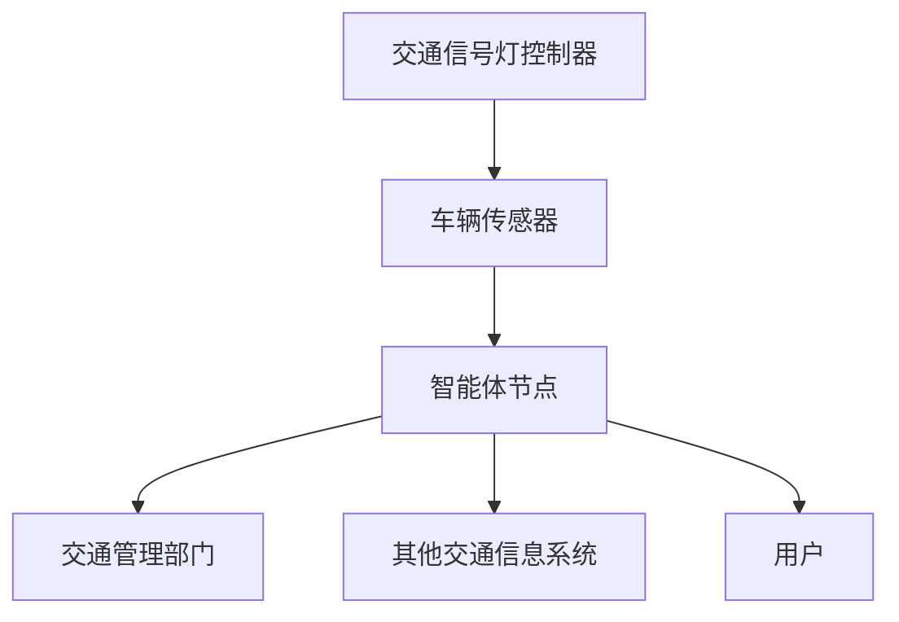

                 

### 第1章: 多Agent系统的基本概念

#### 1.1.1 多Agent系统的起源与演变

多Agent系统（Multi-Agent System，MAS）是人工智能领域的一个重要研究方向，它起源于20世纪80年代。当时，研究人员发现单个智能体（Agent）很难解决复杂的问题，特别是在不确定和动态环境中。为了应对这些挑战，人们开始探索通过协作和合作的方式，将多个智能体结合起来，形成多Agent系统。

多Agent系统的概念最早可以追溯到1980年代初期，当时麻省理工学院的Carl Hewitt提出了“黑盒计算”的概念，即智能体被视为不可见的黑盒，它们可以通过通信来协同工作。这个概念为多Agent系统的研究奠定了基础。

在接下来的几十年里，多Agent系统理论和技术得到了迅速发展。1990年代，随着分布式计算和网络技术的普及，多Agent系统的研究进入了新的阶段。许多重要的理论和算法被提出，如MAS的通信机制、协作策略、冲突解决机制等。

多Agent系统的研究主要集中在以下几个方面：

1. **理论模型**：研究多Agent系统的组织结构、行为模型、决策模型等。
2. **算法设计**：设计适用于多Agent系统的搜索算法、优化算法、学习算法等。
3. **应用实践**：将多Agent系统应用于各个领域，如智能交通、社会计算、智能电网等。
4. **系统开发**：开发适用于多Agent系统的编程语言、开发框架和工具。

#### 1.1.2 多Agent系统的核心概念与特点

在多Agent系统中，有以下几个核心概念：

1. **智能体（Agent）**：智能体是具有自主性、社会性和反应性的计算实体。它们可以独立进行决策和执行任务。
2. **环境（Environment）**：环境是多Agent系统运行的外部条件，可以是物理环境，也可以是虚拟环境。
3. **通信（Communication）**：智能体之间通过通信进行信息交换和协作。
4. **协同（Coordination）**：协同是多Agent系统中智能体之间通过通信和协作来共同完成任务的机制。

多Agent系统的特点包括：

1. **分布式**：多Agent系统是由多个智能体组成的，这些智能体可以分布在不同的物理位置，协同工作。
2. **自主性**：每个智能体都有一定的自主性，可以独立进行决策和执行任务。
3. **适应性**：多Agent系统可以根据环境变化和任务需求，动态调整其行为和策略。
4. **复杂性**：由于涉及多个智能体的交互和协作，多Agent系统通常具有较高的复杂性。

#### 1.1.3 多Agent系统的研究意义与应用领域

多Agent系统在人工智能领域具有重要的研究意义：

1. **提高问题解决能力**：通过多个智能体的协作，多Agent系统可以解决单个智能体难以解决的复杂问题。
2. **模拟人类行为**：多Agent系统可以模拟人类社会中的行为模式，为研究社会现象提供新的视角。
3. **智能系统的构建**：多Agent系统是构建智能交通、智能电网、智能家居等智能系统的基础。

多Agent系统的应用领域广泛，主要包括：

1. **智能交通**：多Agent系统可以用于交通信号控制、智能导航、车辆调度等方面，提高交通效率，减少拥堵。
2. **社会计算**：多Agent系统可以用于社会网络分析、舆情监测、智能社区管理等方面，帮助理解和预测社会现象。
3. **智能电网**：多Agent系统可以用于电力调度、能源管理、设备维护等方面，提高电网的智能化水平。
4. **智能医疗**：多Agent系统可以用于医疗诊断、智能护理、健康监测等方面，提高医疗服务的质量。

#### 1.2 多Agent系统的基本结构

多Agent系统的基本结构包括以下几个部分：

1. **智能体（Agent）**：智能体是多Agent系统的基本组成单位，具有自主性、社会性和反应性。
2. **环境（Environment）**：环境是多Agent系统运行的外部条件，可以是物理环境，也可以是虚拟环境。
3. **通信网络（Communication Network）**：通信网络是智能体之间进行信息交换和协作的渠道。
4. **控制系统（Control System）**：控制系统负责管理智能体的行为，协调各个智能体的活动。

智能体的分类可以根据不同的标准进行：

1. **按能力分类**：智能体可以分为弱智能体（Weak Agent）和强智能体（Strong Agent）。弱智能体只能处理简单的任务，而强智能体具有复杂的行为和决策能力。
2. **按社会性分类**：智能体可以分为个体智能体（Individual Agent）和群体智能体（Group Agent）。个体智能体独立工作，而群体智能体通过协作完成复杂任务。
3. **按目标分类**：智能体可以分为合作智能体（Cooperative Agent）和竞争智能体（Competitive Agent）。合作智能体共同追求共同目标，而竞争智能体则互相竞争以实现各自的目标。

#### 1.2.2 多Agent系统的组织结构

多Agent系统的组织结构可以分为以下几个层次：

1. **个体层次**：在这个层次上，每个智能体独立地执行其任务，具有自主决策和执行的能力。
2. **团队层次**：在这个层次上，多个智能体组成一个团队，通过协作完成复杂任务。团队层次的组织结构可以是中央控制型（Centralized）或去中心化型（Decentralized）。
3. **社会层次**：在这个层次上，多个团队之间的协作和协调成为关键。社会层次的组织结构可以基于规则、市场机制、文化规范等。

#### 1.2.3 Agent通信机制

智能体之间的通信是多Agent系统的重要机制。常见的Agent通信机制包括：

1. **直接通信**：智能体通过直接发送消息进行通信，这种方式简单有效，但要求智能体在同一通信网络内。
2. **间接通信**：智能体通过通信中介（如黑板系统、市场机制等）进行通信，这种方式适用于智能体分布在不同的网络环境中。
3. **异步通信**：智能体发送的消息不一定实时到达，而是存储在缓冲区中，这种方式适用于智能体之间通信延迟较大的情况。
4. **同步通信**：智能体按照特定的顺序发送和接收消息，这种方式可以保证通信的有序性和一致性。

通信协议是多Agent系统中智能体之间通信的规则。常见的通信协议包括：

1. **消息传递协议**：智能体通过发送和接收消息进行通信，如KQML（Knowledge Query and Manipulation Language）、FIPA（Foundation for Intelligent Physical Agents）协议。
2. **事件驱动协议**：智能体通过事件进行通信，如JADE（Java Agent DEvelopment Framework）框架使用的事件驱动机制。
3. **文件传输协议**：智能体通过文件传输进行通信，如FTP（File Transfer Protocol）。

#### 1.3 多Agent系统的基本模型

多Agent系统可以采用不同的基本模型，以适应不同的应用需求和场景。以下是几种常见的多Agent系统模型：

1. **集中式模型**：在集中式模型中，所有智能体的决策和控制都由一个中央控制器负责。这种模型的结构简单，易于实现，但可能存在单点故障和扩展性问题。
2. **分布式模型**：在分布式模型中，每个智能体都有一定的决策和控制能力，系统通过分布式算法实现协同工作。这种模型具有较高的可靠性和可扩展性，但可能更复杂。
3. **层次式模型**：在层次式模型中，智能体分为不同的层级，每个层级负责特定的任务和决策。这种模型可以有效地分解复杂任务，但可能需要更多的通信开销。
4. **市场式模型**：在市场式模型中，智能体通过市场机制进行协作，如拍卖市场、股票市场等。这种模型可以有效地实现资源分配和任务调度，但可能存在市场失灵的问题。

#### 1.3.2 同质性与异质性多Agent系统

同质性（Heterogeneity）和异质性（Heterogeneity）是多Agent系统的两个重要属性。

1. **同质性多Agent系统**：在同质性多Agent系统中，智能体具有相似的结构、能力和行为，它们在任务和功能上没有显著的差异。这种系统通常适用于简单的应用场景，如分布式计算、网格计算等。
2. **异质性多Agent系统**：在异质性多Agent系统中，智能体具有不同的结构和能力，它们在任务和功能上存在显著差异。这种系统通常适用于复杂的应用场景，如智能交通、智能电网、社会计算等。

同质性多Agent系统和异质性多Agent系统的区别主要体现在以下几个方面：

1. **智能体多样性**：同质性多Agent系统中的智能体结构、能力和行为相似，而异质性多Agent系统中的智能体具有多样性。
2. **协作方式**：同质性多Agent系统的协作通常较为简单，主要依赖于直接通信和协同算法；而异质性多Agent系统的协作更为复杂，可能需要市场机制、博弈论等方法。
3. **应用场景**：同质性多Agent系统适用于简单的应用场景，如分布式计算；而异质性多Agent系统适用于复杂的应用场景，如智能交通、智能电网。

#### 1.3.3 协同多Agent系统与竞争多Agent系统

协同多Agent系统和竞争多Agent系统是多Agent系统的两种基本类型。

1. **协同多Agent系统**：在协同多Agent系统中，智能体之间通过合作和协作共同完成任务，实现共同的目标。协同多Agent系统的关键在于如何协调和优化智能体的行为，以实现系统整体性能的最优化。
   
   **协同机制**：
   - **合作博弈**：智能体通过博弈论方法进行合作决策，以最大化整体利益。
   - **社会规范**：智能体遵循社会规范，如共享资源、互相帮助等，以实现协同目标。
   - **任务分解与分配**：将复杂任务分解为多个子任务，并分配给不同的智能体，通过协作完成整个任务。

2. **竞争多Agent系统**：在竞争多Agent系统中，智能体之间通过竞争和对抗来争夺资源或实现各自的目标。竞争多Agent系统的关键在于如何平衡竞争与协作，以实现系统整体性能的最优化。

   **竞争机制**：
   - **资源争夺**：智能体通过竞争资源（如带宽、能量等）来获得竞争优势。
   - **对抗策略**：智能体采用对抗性策略，如欺骗、伪装等，以获取信息优势和资源优势。
   - **市场机制**：智能体通过市场机制进行资源分配和任务调度，实现竞争与合作的平衡。

#### 1.4 多Agent系统的应用前景

多Agent系统在人工智能领域的应用前景广阔，涵盖了多个重要领域：

1. **智能交通**：多Agent系统可以用于交通信号控制、智能导航、车辆调度等方面，优化交通流量，提高交通效率，减少拥堵。

   **案例**：在智能交通系统中，多个智能体可以代表不同的交通参与者（如车辆、行人、交通信号灯），通过协作和通信，实现交通流量的智能调节。

2. **社会计算**：多Agent系统可以用于社会网络分析、舆情监测、智能社区管理等方面，帮助理解和预测社会现象，提升社会治理水平。

   **案例**：在社会计算中，多个智能体可以代表不同的社会实体（如用户、组织、事件），通过分析社交网络中的交互信息，发现潜在的社会趋势和问题。

3. **智能电网**：多Agent系统可以用于电力调度、能源管理、设备维护等方面，提高电网的智能化水平，实现能源的高效利用。

   **案例**：在智能电网中，多个智能体可以代表不同的电力设备（如发电机、变压器、电力用户），通过协作和通信，实现电力的智能调度和优化管理。

4. **智能医疗**：多Agent系统可以用于医疗诊断、智能护理、健康监测等方面，提高医疗服务的质量，提升患者体验。

   **案例**：在智能医疗中，多个智能体可以代表不同的医疗设备（如医疗机器人、远程医疗终端、健康监测设备），通过协作和通信，实现医疗服务的智能化和个性化。

#### 1.5 本章小结

本章介绍了多Agent系统的基本概念、核心概念、特点、基本结构、模型以及应用前景。通过本章的学习，读者可以了解多Agent系统的起源与发展，掌握多Agent系统的核心概念与特点，了解多Agent系统的基本结构、模型以及在不同领域的应用。

在接下来的章节中，我们将进一步探讨多Agent协作机制、复杂多Agent系统的设计与实现，以及多Agent系统的前沿技术研究和发展方向。希望读者能够继续跟随我们的思路，深入理解多Agent系统的奥秘。

### 第2章: 协作策略与通信协议

#### 2.1.1 协作策略的基本概念

协作策略是多Agent系统中智能体之间通过协作和合作共同完成任务的方法和规则。协作策略的核心目标是优化系统整体性能，提高任务完成效率，同时保证系统的稳定性和鲁棒性。

在多Agent系统中，协作策略可以分为以下几类：

1. **任务分配策略**：任务分配策略是指如何将复杂任务分解为多个子任务，并将这些子任务分配给不同的智能体。常见的任务分配策略包括最小完成时间优先（Minimum Completion Time First，MCTF）、最大处理能力优先（Maximum Processing Capacity First，MPCF）等。

2. **通信策略**：通信策略是指智能体之间如何进行信息交换和协作。常见的通信策略包括同步通信和异步通信。同步通信要求智能体按照特定顺序发送和接收消息，而异步通信允许智能体独立地发送和接收消息。

3. **协调策略**：协调策略是指智能体之间如何进行协调和协作，以实现共同的目标。常见的协调策略包括基于规则的协调、基于市场的协调和基于学习的协调等。

#### 2.1.2 协作策略的分类与设计

根据不同的应用需求和场景，协作策略可以采用不同的分类和设计方法。以下是一些常见的协作策略分类和设计方法：

1. **基于博弈论的协作策略**：博弈论是一种研究决策制定的数学工具，它可以用于设计智能体之间的协作策略。基于博弈论的协作策略主要包括合作博弈和竞争博弈。合作博弈旨在最大化集体利益，而竞争博弈则关注个体利益的优化。

2. **基于社会规范的协作策略**：社会规范是指智能体在协作过程中遵循的行为准则和规范。基于社会规范的协作策略通过建立和维护社会规范，引导智能体的行为，实现有效的协作和合作。

3. **基于市场的协作策略**：市场机制可以用于多Agent系统中的资源分配和任务调度。基于市场的协作策略通过模拟市场机制，实现智能体之间的资源交换和任务协作。

4. **基于学习的协作策略**：机器学习算法可以用于设计智能体的协作策略。基于学习的协作策略通过学习历史数据和经验，优化智能体的决策和协作行为，提高系统的整体性能。

#### 2.1.3 协作策略的性能评估

协作策略的性能评估是评价协作策略优劣的关键步骤。常见的协作策略性能评估指标包括：

1. **任务完成时间**：任务完成时间是指从任务开始到任务完成所需的时间。任务完成时间越短，协作策略的性能越好。

2. **系统效率**：系统效率是指系统完成任务的能力。系统效率可以通过计算系统在单位时间内完成的任务数量来衡量。

3. **资源利用率**：资源利用率是指系统资源的使用效率。资源利用率可以通过计算系统资源的利用率（如CPU利用率、内存利用率等）来衡量。

4. **稳定性**：稳定性是指系统在面临外部扰动时的稳定性和鲁棒性。稳定性可以通过分析系统在面临外部扰动时的响应行为来评估。

5. **用户满意度**：用户满意度是指用户对系统性能的满意度。用户满意度可以通过调查问卷、用户反馈等方式来评估。

#### 2.2 通信协议在多Agent系统中的应用

通信协议是多Agent系统中智能体之间进行信息交换和协作的规则和规范。通信协议的设计和应用对于多Agent系统的性能和稳定性至关重要。

在多Agent系统中，常见的通信协议包括：

1. **消息传递协议**：消息传递协议是指智能体之间通过发送和接收消息进行通信的协议。常见的消息传递协议包括KQML（Knowledge Query and Manipulation Language）、FIPA（Foundation for Intelligent Physical Agents）协议等。

2. **事件驱动协议**：事件驱动协议是指智能体通过事件进行通信的协议。事件驱动协议可以有效地处理实时通信和异步通信。常见的实现框架包括JADE（Java Agent DEvelopment Framework）等。

3. **文件传输协议**：文件传输协议是指智能体之间通过文件传输进行通信的协议。常见的文件传输协议包括FTP（File Transfer Protocol）、HTTP（Hypertext Transfer Protocol）等。

通信协议在多Agent系统中的应用主要体现在以下几个方面：

1. **信息共享**：通信协议可以用于智能体之间共享信息，实现任务协同和决策支持。通过通信协议，智能体可以获取其他智能体的状态信息、任务进度等信息，从而更好地协作完成任务。

2. **任务调度**：通信协议可以用于智能体之间的任务调度和分配。通过通信协议，智能体可以接收任务请求、任务分配指令等，从而实现任务的动态调度和分配。

3. **资源管理**：通信协议可以用于智能体之间的资源管理和调度。通过通信协议，智能体可以共享资源、交换资源信息，从而实现资源的优化分配和使用。

4. **故障恢复**：通信协议可以用于智能体之间的故障检测和恢复。通过通信协议，智能体可以监控系统的状态信息，及时发现故障并进行恢复。

#### 2.2.1 通信协议的原理与设计

通信协议的原理和设计是多Agent系统开发中的重要环节。以下是一些关键概念和设计原则：

1. **通信协议的层次结构**：通信协议通常采用分层结构，如OSI七层模型或TCP/IP四层模型。分层结构有助于模块化设计，降低系统复杂度。

2. **通信协议的服务模型**：通信协议的服务模型包括面向连接的服务和无连接的服务。面向连接的服务（如TCP）提供可靠的数据传输，而无连接的服务（如UDP）提供高速但不可靠的数据传输。

3. **通信协议的传输方式**：通信协议的传输方式包括单播、广播和多播。单播是指数据从发送者直接传输到指定的接收者；广播是指数据发送到网络中的所有节点；多播是指数据发送到一组特定的接收者。

4. **通信协议的安全性**：通信协议需要提供数据完整性、保密性和抗抵赖性等安全特性。常见的安全协议包括SSL/TLS（用于Web通信）、IPsec（用于网络层安全）等。

5. **通信协议的可靠性**：通信协议需要提供数据传输的可靠性，包括错误检测、错误纠正和数据重传等机制。常见的可靠性机制包括校验和、确认和重传等。

#### 2.2.2 常见的通信协议及其比较

在多Agent系统中，有多种通信协议可供选择。以下是一些常见的通信协议及其特点：

1. **KQML协议**：
   - **特点**：KQML是一种基于知识的消息传递语言，适用于知识密集型任务。
   - **应用**：KQML常用于智能代理之间的通信，特别是在需要复杂决策和知识共享的系统中。

2. **FIPA协议**：
   - **特点**：FIPA协议是Foundation for Intelligent Physical Agents的标准通信协议，定义了智能代理之间的通信框架。
   - **应用**：FIPA协议广泛应用于多种智能系统和机器人领域，提供了丰富的通信服务和消息类型。

3. **JADE协议**：
   - **特点**：JADE（Java Agent DEvelopment Framework）是基于FIPA标准的Java代理开发框架，提供了事件驱动和消息驱动的通信机制。
   - **应用**：JADE广泛应用于智能代理系统开发，特别是在分布式环境中。

4. **SOAP协议**：
   - **特点**：SOAP（Simple Object Access Protocol）是一种基于XML的通信协议，适用于Web服务。
   - **应用**：SOAP常用于互联网上的不同系统之间的通信，支持远程过程调用（RPC）。

5. **RabbitMQ协议**：
   - **特点**：RabbitMQ是一个消息队列中间件，支持多种通信协议，如AMQP、STOMP等。
   - **应用**：RabbitMQ广泛应用于分布式系统中，提供可靠的消息传输和队列管理。

**比较**：

- **可靠性**：KQML和FIPA协议提供了高可靠性，适用于关键任务；SOAP和RabbitMQ协议则更适用于一般业务场景。
- **灵活性**：JADE和RabbitMQ协议提供了较高的灵活性，适用于动态和变化的环境。
- **易用性**：KQML和SOAP协议相对容易使用，而FIPA和RabbitMQ协议需要一定的学习和配置。
- **性能**：RabbitMQ协议在消息传输性能上具有优势，适用于大数据量和高并发场景。

#### 2.2.3 通信协议的性能优化

通信协议的性能优化是确保多Agent系统高效运行的关键。以下是一些常见的性能优化策略：

1. **传输优化**：通过使用压缩算法和高效编码，减少传输数据的大小，提高传输速度。

2. **缓存策略**：在通信协议中引入缓存机制，减少重复传输的数据量，提高响应速度。

3. **负载均衡**：通过负载均衡技术，将通信任务分配到多个节点上，避免单点瓶颈。

4. **多线程处理**：利用多线程技术，并行处理多个通信任务，提高系统并发处理能力。

5. **错误检测与恢复**：通过引入错误检测和恢复机制，确保通信的可靠性，减少通信中断。

6. **网络优化**：优化网络配置和路由策略，减少通信延迟和网络拥塞。

#### 2.3 多Agent协作中的冲突与协调

在多Agent系统中，冲突是智能体之间由于目标、资源或信息的不同而引发的矛盾。冲突可以分为以下几种类型：

1. **目标冲突**：智能体之间的目标不一致，导致彼此之间的行为相互干扰。例如，在交通系统中，车辆和行人之间的目标冲突可能引发交通事故。

2. **资源冲突**：智能体之间争夺同一资源，导致资源分配不公或资源浪费。例如，在电力系统中，多个智能体可能同时请求同一发电资源，导致资源分配冲突。

3. **信息冲突**：智能体之间获取的信息不一致，导致决策和行为错误。例如，在智能交通系统中，由于信息传递延迟或不准确，导致交通信号灯的控制策略出现冲突。

为了解决这些冲突，多Agent系统需要引入协调机制。以下是一些常见的协调机制：

1. **基于规则的协调**：通过制定规则，智能体根据规则进行行为决策，避免冲突。例如，在交通系统中，可以制定交通信号灯的时序规则，避免车辆和行人的冲突。

2. **基于市场的协调**：通过市场机制，智能体之间进行资源交换和任务分配，实现协作。例如，在电力市场中，智能体可以通过价格信号进行资源交易，实现资源优化分配。

3. **基于学习的协调**：通过学习历史数据和经验，智能体优化其行为策略，减少冲突。例如，在智能交通系统中，智能体可以通过机器学习算法，预测交通流量，优化交通信号控制策略。

4. **基于博弈的协调**：通过博弈论方法，智能体在竞争与合作中找到平衡点，减少冲突。例如，在多机器人系统中，智能体可以通过博弈策略，避免碰撞和资源争夺。

#### 2.4 多Agent系统的安全性

多Agent系统的安全性是确保系统稳定运行和数据安全的重要保障。多Agent系统面临的主要安全性问题包括：

1. **恶意攻击**：恶意智能体可能通过入侵、欺骗等手段，破坏系统稳定性和数据完整性。

2. **信息泄露**：智能体之间的信息交换可能导致敏感信息泄露，影响系统安全。

3. **隐私保护**：智能体需要保护其自身信息和用户隐私，避免隐私泄露和滥用。

为了解决这些问题，多Agent系统需要引入一系列安全机制：

1. **访问控制**：通过访问控制机制，限制智能体的访问权限，确保只有授权智能体才能访问特定资源。

2. **加密技术**：通过加密技术，保护智能体之间的通信数据，确保数据传输的保密性和完整性。

3. **认证与授权**：通过身份认证和授权机制，确保智能体的合法性和权限，防止未授权访问。

4. **防火墙与入侵检测**：通过设置防火墙和入侵检测系统，实时监控网络流量，防止恶意攻击和入侵。

5. **审计与监控**：通过审计和监控机制，记录智能体的行为和操作，及时发现和处理异常行为。

#### 2.5 本章小结

本章介绍了多Agent协作策略的基本概念、分类与设计，通信协议的原理与设计，以及多Agent系统中的冲突与协调机制。通过本章的学习，读者可以了解多Agent协作策略的核心内容和设计原则，掌握通信协议的基本原理和常见应用，了解多Agent系统中的冲突解决和安全机制。

在接下来的章节中，我们将进一步探讨复杂多Agent系统的设计与实现，深入分析多Agent系统的体系结构设计、算法与模型。希望读者能够继续跟随我们的思路，深入理解多Agent系统的设计与实现。

### 第3章: 多Agent系统的体系结构设计

#### 3.1.1 多Agent系统的需求分析

多Agent系统的需求分析是多Agent系统设计的第一步，其核心目标是明确系统需要实现的功能和性能要求。需求分析主要包括以下几个方面：

1. **功能需求**：分析系统需要实现的基本功能，如任务分配、通信、协作、决策等。功能需求通常以用例图的形式进行描述，展示系统与用户、环境之间的交互。

2. **性能需求**：分析系统需要达到的性能指标，如响应时间、处理能力、吞吐量、可靠性等。性能需求通常以量化指标进行描述，如每秒处理请求的数量、系统可用性等。

3. **可靠性需求**：分析系统在面临外部干扰和故障时的可靠性要求，如系统的容错能力、恢复机制等。

4. **安全性需求**：分析系统需要实现的安全要求，如访问控制、数据加密、隐私保护等。

5. **扩展性需求**：分析系统在规模扩展和功能扩展方面的需求，如支持动态加入和退出智能体、支持新的功能模块等。

进行需求分析时，可以采用以下方法：

1. **用户访谈和调查**：通过与用户进行访谈和调查，了解用户的需求和期望，收集系统功能和使用场景的详细信息。

2. **工作流程分析**：分析用户的工作流程，识别系统中需要实现的关键功能和流程，为系统设计提供依据。

3. **文献综述**：查阅相关文献和案例，了解现有系统的需求和解决方案，为新系统的需求分析提供参考。

4. **需求建模**：使用需求建模工具，如用例图、功能需求文档等，将收集到的需求进行系统化描述，确保需求分析的结果清晰、完整。

#### 3.1.2 多Agent系统的体系结构设计方法

多Agent系统的体系结构设计是多Agent系统实现的基础，其目标是构建一个稳定、高效、可扩展的系统。以下是一些常用的体系结构设计方法：

1. **自底向上设计方法**：自底向上设计方法是从具体的智能体和模块开始，逐步构建系统的顶层结构。这种方法通常用于复杂系统的开发，可以更好地控制系统的细节。

2. **自顶向下设计方法**：自顶向下设计方法是先定义系统的总体结构和顶层模块，然后逐步细化到具体的智能体和模块。这种方法有助于确保系统的整体一致性，但可能需要更多的抽象和设计工作。

3. **增量式设计方法**：增量式设计方法是将系统功能划分为多个增量，逐步实现和部署。这种方法可以更好地控制开发风险，提高系统的可维护性。

4. **模板化设计方法**：模板化设计方法使用预定义的模板和组件，快速构建多Agent系统。这种方法可以缩短开发周期，但可能限制系统的灵活性。

在体系结构设计过程中，可以采用以下步骤：

1. **确定系统边界**：明确系统的功能和范围，确定哪些部分属于系统内部，哪些部分属于系统外部。

2. **定义模块和智能体**：根据需求分析的结果，定义系统的模块和智能体，明确它们的功能和接口。

3. **构建体系结构模型**：使用体系结构模型（如UML架构图）描述系统的结构和交互，确保设计的一致性和完整性。

4. **性能评估**：对体系结构模型进行性能评估，分析系统在负载、延迟、资源利用等方面的表现，确保设计满足性能需求。

5. **迭代与优化**：根据评估结果，对体系结构设计进行迭代和优化，确保系统在性能、可扩展性、可靠性等方面达到预期目标。

#### 3.1.3 多Agent系统的体系结构设计案例

以下是一个多Agent交通管理系统的体系结构设计案例：

**系统需求**：
- 实现城市交通信号灯的智能调控，提高交通流量和减少拥堵。
- 支持实时数据采集和监控，为交通管理和决策提供依据。
- 具备容错和自我修复能力，确保系统在故障情况下仍能正常运行。

**体系结构设计**：

1. **系统边界**：
   - 内部：交通信号灯控制器、车辆传感器、智能体节点等。
   - 外部：交通管理部门、其他交通信息系统、用户等。

2. **模块和智能体定义**：
   - **交通信号灯控制器**：负责控制交通信号灯的状态，实现交通流量的调控。
   - **车辆传感器**：负责采集车辆流量、速度等信息，为信号灯控制器提供数据支持。
   - **智能体节点**：负责处理和转发交通信息，协调交通信号灯的调控。

3. **体系结构模型**：

4. **性能评估**：
   - **响应时间**：信号灯控制器的响应时间应小于2秒，确保交通流量的实时调控。
   - **处理能力**：智能体节点应能够处理每秒超过100条交通信息的更新。
   - **可靠性**：系统应具备容错能力，能够在单点故障情况下保持正常运行。

5. **迭代与优化**：
   - 根据初步性能评估结果，优化智能体节点的通信协议和数据传输机制，提高系统的响应速度和处理能力。
   - 引入冗余设计和备份机制，提高系统的可靠性。

#### 3.2 多Agent系统的体系结构设计原则

多Agent系统的体系结构设计需要遵循一系列原则，以确保系统的稳定性、可靠性和可扩展性。以下是一些关键设计原则：

1. **模块化**：将系统功能划分为多个模块，每个模块负责特定的功能，降低系统复杂度，提高可维护性。

2. **层次化**：将系统划分为不同的层次，每个层次专注于特定的功能，如感知层、决策层、执行层等，确保系统结构的清晰和层次性。

3. **分布式**：采用分布式架构，将智能体分布在不同节点上，提高系统的可扩展性和容错性。

4. **异步性**：智能体之间的通信采用异步方式，降低同步通信带来的性能瓶颈和复杂性。

5. **灵活性**：系统设计应具备灵活性，支持智能体的动态加入和退出，以及功能的动态调整。

6. **安全性**：设计安全机制，保护系统的数据和通信安全，防止恶意攻击和未授权访问。

7. **可扩展性**：系统设计应支持功能扩展和规模扩展，以适应未来的需求变化。

#### 3.3 本章小结

本章介绍了多Agent系统的需求分析、体系结构设计方法及其设计原则。通过需求分析，明确系统功能、性能和安全要求；通过体系结构设计，构建一个稳定、高效、可扩展的多Agent系统。本章的案例展示了如何应用这些原则和方法进行实际系统的设计。

在下一章中，我们将深入探讨多Agent系统的算法与模型，分析常见的多Agent系统算法及其应用。希望读者能够继续跟随我们的思路，深入理解多Agent系统的设计与实现。

### 第4章: 多Agent系统的算法与模型

#### 4.1.1 多Agent系统的算法设计原则

多Agent系统的算法设计原则是多Agent系统实现的关键。以下是一些核心原则：

1. **自主性**：智能体应具有自主决策和执行能力，能够独立处理信息和任务。
2. **协同性**：智能体之间应通过有效的通信和协作机制，共同完成任务。
3. **鲁棒性**：系统应具备应对不确定性和动态变化的能力，保持稳定运行。
4. **扩展性**：系统设计应支持智能体的动态加入和退出，以及功能的动态调整。
5. **安全性**：算法设计应考虑数据安全和通信安全，防止恶意攻击和未授权访问。
6. **效率**：算法应尽量减少计算复杂度和通信开销，提高系统性能。

#### 4.1.2 常见的多Agent系统算法模型

多Agent系统算法模型种类繁多，以下介绍几种常见算法模型：

1. **基于博弈论的算法模型**：
   - **合作博弈**：智能体通过合作博弈，最大化整体利益。常见算法包括纳什均衡、合作博弈等。
   - **竞争博弈**：智能体通过竞争博弈，最大化个体利益。常见算法包括纳什均衡、博弈树搜索等。

2. **基于社会规范的算法模型**：
   - **基于规则的协调**：智能体通过遵循预定义的规则，实现协同和合作。常见算法包括社会规范学习、基于规则的协调等。
   - **基于声誉的协调**：智能体通过评估其他智能体的行为，建立声誉系统，实现协作和信任。

3. **基于市场的算法模型**：
   - **拍卖市场**：智能体通过拍卖市场进行资源交换和任务分配。常见算法包括VCG拍卖、GSP拍卖等。
   - **双边市场**：智能体在双边市场中进行交易，实现资源优化配置。常见算法包括双边际化定理、市场出清算法等。

4. **基于学习的算法模型**：
   - **强化学习**：智能体通过学习环境反馈，优化其行为策略。常见算法包括Q学习、SARSA、Deep Q-Network等。
   - **基于规则的机器学习**：智能体通过机器学习算法，自动生成决策规则。常见算法包括决策树、支持向量机、神经网络等。

5. **分布式搜索算法模型**：
   - **协同搜索**：智能体通过协同搜索算法，共同解决复杂问题。常见算法包括遗传算法、蚁群算法、粒子群优化等。
   - **分布式规划**：智能体通过分布式规划算法，实现任务分配和资源调度。常见算法包括协同规划、分布式决策算法等。

#### 4.1.3 算法模型在多Agent系统中的应用

算法模型在多Agent系统中的应用广泛，以下介绍几种应用场景：

1. **智能交通系统**：
   - **交通信号灯控制**：使用基于博弈论的算法模型，如纳什均衡，优化交通信号灯的时序控制，减少拥堵。
   - **车辆调度**：使用基于市场的算法模型，如拍卖市场，实现车辆动态调度，提高交通效率。

2. **社会计算**：
   - **舆情监测**：使用基于学习的算法模型，如神经网络，分析社交媒体上的用户行为，预测社会趋势。
   - **社会网络分析**：使用基于社会规范的算法模型，如基于规则的协调，分析社交网络中的节点关系，识别潜在社区。

3. **智能电网**：
   - **电力调度**：使用基于分布式搜索算法模型，如蚁群算法，实现电力资源的优化调度，提高电网运行效率。
   - **设备维护**：使用基于强化学习的算法模型，如Q学习，预测设备故障，优化维护策略。

4. **多机器人系统**：
   - **协同作业**：使用基于协同搜索算法模型，如遗传算法，实现多机器人的协同作业，提高工作效率。
   - **路径规划**：使用基于强化学习的算法模型，如SARSA，实现多机器人的动态路径规划，避免碰撞和拥堵。

#### 4.2 多Agent系统的协同优化算法

多Agent系统的协同优化算法是优化系统整体性能的重要手段。以下介绍几种常见的协同优化算法：

1. **协同遗传算法（Cooperative Genetic Algorithm, CGA）**：
   - **原理**：CGA是遗传算法的扩展，通过引入协同机制，实现多个智能体之间的信息共享和合作。
   - **应用**：在多机器人系统、智能交通系统等应用中，CGA用于优化任务分配、路径规划等。

2. **协同粒子群优化（Cooperative Particle Swarm Optimization, CPSO）**：
   - **原理**：CPSO是粒子群优化算法的扩展，通过引入协同机制，实现智能体之间的信息共享和协作。
   - **应用**：在多目标优化、资源分配等应用中，CPSO用于优化目标函数，提高系统性能。

3. **协同蚁群算法（Cooperative Ant Colony Optimization, CACO）**：
   - **原理**：CACO是蚁群优化算法的扩展，通过引入协同机制，实现多个智能体之间的信息共享和合作。
   - **应用**：在路径规划、交通流量优化等应用中，CACO用于优化路径选择和流量分配。

4. **基于博弈论的协同优化算法**：
   - **原理**：基于博弈论的协同优化算法通过博弈论方法，实现智能体之间的合作与竞争。
   - **应用**：在多智能体系统、社会计算等应用中，基于博弈论的协同优化算法用于优化资源分配、任务调度等。

#### 4.3 多Agent系统的学习与适应算法

多Agent系统的学习与适应算法是提高系统自适应能力和鲁棒性的关键。以下介绍几种常见的算法：

1. **强化学习（Reinforcement Learning, RL）**：
   - **原理**：强化学习通过智能体与环境之间的交互，学习最优策略，实现任务完成。
   - **应用**：在智能交通、机器人控制、游戏人工智能等应用中，强化学习用于优化决策和路径规划。

2. **多智能体强化学习（Multi-Agent Reinforcement Learning, MARL）**：
   - **原理**：MARL是多智能体系统的强化学习，通过多个智能体的协作和交互，学习最优策略。
   - **应用**：在多机器人系统、社会计算、智能电网等应用中，MARL用于优化任务分配、资源调度等。

3. **基于规则的机器学习（Rule-based Machine Learning, RBML）**：
   - **原理**：RBML通过机器学习算法，自动生成决策规则，实现智能体的自主决策。
   - **应用**：在医疗诊断、金融预测、智能交通等应用中，RBML用于生成规则库，提高系统智能化水平。

4. **基于实例的机器学习（Instance-based Learning, IBL）**：
   - **原理**：IBL通过存储和检索历史实例，实现智能体的学习与适应。
   - **应用**：在个性化推荐、智能客服、智能诊断等应用中，IBL用于快速响应和决策。

#### 4.4 本章小结

本章介绍了多Agent系统的算法设计原则、常见算法模型及其应用。通过算法设计原则，确保多Agent系统的自主性、协同性、鲁棒性和扩展性；通过常见算法模型，实现智能体的自主决策和协同优化；通过协同优化算法和学习与适应算法，提高系统的自适应能力和鲁棒性。

在下一章中，我们将探讨多Agent系统的开发与实现，介绍开发流程、工具与环境，分析关键技术。希望读者能够继续跟随我们的思路，深入理解多Agent系统的开发与实现。

### 第5章: 多Agent系统的开发与实现

#### 5.1.1 多Agent系统的开发流程

多Agent系统的开发过程是一个复杂而系统的工程，需要经过多个阶段，每个阶段都有其特定的任务和目标。以下是一个典型的多Agent系统开发流程：

1. **需求分析**：首先，明确系统需求，包括功能需求、性能需求、可靠性需求等。这一阶段通常通过用户访谈、问卷调查和文献综述等方法，收集和分析需求信息，形成详细的需求文档。

2. **设计**：在需求分析的基础上，进行系统设计。系统设计包括体系结构设计、模块设计、接口设计等。在这一阶段，使用UML（统一建模语言）等工具，构建系统的概念模型和详细设计文档。

3. **实现**：根据设计文档，进行系统编码和开发。实现阶段通常包括智能体的实现、通信机制的开发、算法和模型的实现等。在这一阶段，开发人员需要选择合适的编程语言和开发工具。

4. **测试**：对系统进行全面的测试，确保系统的功能正确、性能满足要求、可靠性高。测试阶段包括单元测试、集成测试、系统测试和用户验收测试等。

5. **部署**：将开发完成的系统部署到实际运行环境中，包括安装、配置和调试等。部署阶段需要确保系统在目标环境中能够正常运行，满足用户的实际需求。

6. **维护**：系统部署后，需要进行持续维护和更新，以适应环境变化和用户需求。维护阶段包括系统监控、故障修复、性能优化和功能更新等。

#### 5.1.2 开发工具与环境

在多Agent系统的开发过程中，选择合适的开发工具和环境是确保项目成功的关键。以下是一些常用的开发工具和环境：

1. **编程语言**：常用的编程语言包括Java、Python、C++等。Java因其跨平台特性和丰富的库支持，广泛应用于多Agent系统的开发。Python因其简洁的语法和强大的库支持，成为人工智能领域的主要编程语言之一。C++在性能和资源管理方面具有优势，适用于高性能计算和嵌入式系统开发。

2. **开发框架**：开发框架是加快开发过程、提高开发效率的重要工具。常见的多Agent系统开发框架包括JADE（Java Agent DEvelopment Framework）、Sara（Simple Agent Reputation and Agreement Framework）、Py Affero（Python Multi-Agent Framework）等。JADE是一个基于Java的框架，支持FIPA通信协议和Agent模型。Sara是一个基于Python的框架，提供灵活的Agent模型和通信机制。Py Affero是一个基于Python的框架，支持分布式Agent系统和多线程通信。

3. **集成开发环境（IDE）**：集成开发环境提供了代码编辑、调试、构建和部署等功能，是开发者进行高效开发的重要工具。常见的IDE包括Eclipse、IntelliJ IDEA、PyCharm等。Eclipse是一个开源的IDE，支持多种编程语言和开发框架，适用于企业级开发。IntelliJ IDEA是一个商业IDE，提供了丰富的功能，适用于Java、Python等编程语言的开发。PyCharm是一个专业的Python IDE，支持多种Python库和框架，适用于Python开发。

4. **测试工具**：测试是多Agent系统开发的重要环节，需要使用合适的测试工具。常见的测试工具有JUnit（Java单元测试框架）、PyTest（Python测试框架）、Selenium（Web测试工具）等。JUnit是一个开源的Java单元测试框架，支持多种测试模式，适用于Java开发的单元测试。PyTest是一个开源的Python测试框架，支持多种测试插件，适用于Python开发的单元测试。Selenium是一个Web测试工具，支持多种编程语言，适用于Web应用的自动化测试。

5. **环境配置**：多Agent系统的开发通常需要配置特定的运行环境。常见的运行环境包括Java虚拟机（JVM）、Python环境、C++编译器等。JVM是一个跨平台的虚拟机，支持Java应用程序的运行。Python环境包括Python解释器和相关库的安装，适用于Python程序的运行。C++编译器包括GCC、Clang等，适用于C++程序的编译和运行。

#### 5.1.3 实现多Agent系统的关键技术

实现多Agent系统涉及多个关键技术和方法，以下介绍几个核心技术：

1. **智能体模型**：智能体模型是多Agent系统的核心组成部分，定义了智能体的属性和行为。常见的智能体模型包括FIPA模型、BDI模型、SOAR模型等。FIPA模型是基于通信的模型，定义了智能体的基本属性和通信协议。BDI模型是基于信念、愿望和意图的模型，用于描述智能体的决策过程。SOAR模型是基于符号推理的模型，适用于复杂决策和知识处理。

2. **通信机制**：通信机制是多Agent系统实现协作和信息共享的关键。常见的通信机制包括直接通信、间接通信、异步通信和同步通信。直接通信是智能体通过直接发送和接收消息进行通信，适用于同一网络内的智能体。间接通信是智能体通过通信中介（如黑板系统、市场机制等）进行通信，适用于不同网络环境中的智能体。异步通信允许智能体独立地发送和接收消息，减少通信延迟。同步通信要求智能体按照特定顺序发送和接收消息，确保通信的一致性和可靠性。

3. **算法和模型**：多Agent系统的算法和模型是实现智能体协作和优化的关键。常见的算法和模型包括协同优化算法、强化学习算法、基于博弈论的算法等。协同优化算法用于优化系统整体性能，如协同遗传算法、协同粒子群优化等。强化学习算法用于智能体的自主学习和适应，如Q学习、SARSA等。基于博弈论的算法用于智能体之间的合作与竞争，如纳什均衡、合作博弈等。

4. **安全性**：安全性是多Agent系统实现的关键问题，需要设计相应的安全机制。常见的安全机制包括访问控制、数据加密、认证与授权等。访问控制用于限制智能体的访问权限，确保只有授权智能体才能访问特定资源。数据加密用于保护通信数据的安全，防止数据泄露和篡改。认证与授权用于确保智能体的合法性和权限，防止未授权访问和恶意攻击。

5. **分布式计算**：多Agent系统通常涉及多个智能体的分布式计算，需要设计相应的分布式计算机制。常见的分布式计算机制包括任务分配、负载均衡、容错机制等。任务分配用于将任务分配给不同的智能体，实现任务的并行处理。负载均衡用于平衡智能体的负载，避免单点瓶颈。容错机制用于处理智能体的故障和异常情况，确保系统的稳定性和可靠性。

#### 5.2 多Agent系统的实现步骤

多Agent系统的实现涉及多个步骤，以下是一个典型的实现步骤：

1. **需求分析**：明确系统需求，包括功能需求、性能需求、可靠性需求等。这一阶段通常通过用户访谈、问卷调查和文献综述等方法，收集和分析需求信息，形成详细的需求文档。

2. **设计**：在需求分析的基础上，进行系统设计。系统设计包括体系结构设计、模块设计、接口设计等。在这一阶段，使用UML（统一建模语言）等工具，构建系统的概念模型和详细设计文档。

3. **智能体开发**：根据设计文档，开发智能体的实现代码。智能体开发包括智能体属性的定义、行为的实现、通信机制的实现等。在这一阶段，选择合适的编程语言和开发工具，实现智能体的功能。

4. **通信机制开发**：开发智能体之间的通信机制。通信机制包括通信协议的实现、通信接口的实现、消息路由等。在这一阶段，选择合适的通信协议和开发框架，确保智能体之间的有效通信。

5. **算法和模型实现**：根据设计文档，实现多Agent系统的算法和模型。算法和模型实现包括协同优化算法、强化学习算法、基于博弈论的算法等。在这一阶段，使用合适的算法库和工具，实现算法的数学模型和计算过程。

6. **系统集成**：将智能体、通信机制、算法和模型集成到一起，形成完整的多Agent系统。系统集成包括模块的集成、系统的集成测试、性能评估等。在这一阶段，使用合适的集成开发环境和测试工具，确保系统的整体功能和性能。

7. **部署和测试**：将集成完成的多Agent系统部署到实际运行环境中，进行全面的测试和验证。部署和测试包括系统的安装、配置、调试、性能测试、可靠性测试等。在这一阶段，使用合适的部署工具和测试工具，确保系统在实际运行环境中的稳定性和可靠性。

8. **维护和优化**：系统部署后，需要进行持续维护和优化，以适应环境变化和用户需求。维护和优化包括系统监控、故障修复、性能优化、功能更新等。在这一阶段，使用合适的维护工具和优化方法，确保系统的长期稳定运行。

#### 5.3 实际案例分析与实现

以下是一个多Agent智能交通系统的实际案例分析和实现：

**系统需求**：
- 实现城市交通信号灯的智能调控，提高交通流量和减少拥堵。
- 支持实时数据采集和监控，为交通管理和决策提供依据。
- 具备容错和自我修复能力，确保系统在故障情况下仍能正常运行。

**体系结构设计**：
- **智能体模型**：使用FIPA模型定义智能体，包括交通信号灯控制器、车辆传感器和智能体节点。
- **通信机制**：使用JADE框架实现智能体之间的通信，支持直接通信和间接通信。
- **算法和模型**：采用协同遗传算法优化交通信号灯的时序控制，采用多智能体强化学习算法实现交通流量预测和路径规划。

**实现步骤**：

1. **需求分析**：
   - 通过用户访谈和文献综述，明确系统需求，形成需求文档。

2. **设计**：
   - 使用UML工具构建系统架构图，定义智能体的属性和行为。
   - 设计智能体的通信协议和接口，确保智能体之间的有效通信。

3. **智能体开发**：
   - 使用Java开发智能体实现代码，包括交通信号灯控制器、车辆传感器和智能体节点。
   - 实现智能体的通信机制，确保智能体之间的信息交换和协作。

4. **通信机制开发**：
   - 使用JADE框架开发通信机制，实现智能体之间的直接通信和间接通信。
   - 实现消息路由和消息处理，确保通信的高效性和可靠性。

5. **算法和模型实现**：
   - 实现协同遗传算法，优化交通信号灯的时序控制。
   - 实现多智能体强化学习算法，实现交通流量预测和路径规划。

6. **系统集成**：
   - 将智能体、通信机制、算法和模型集成到一起，形成完整的多Agent系统。
   - 进行集成测试和性能评估，确保系统的整体功能和性能。

7. **部署和测试**：
   - 将集成完成的多Agent系统部署到实际运行环境中，进行全面的测试和验证。
   - 进行系统监控和故障修复，确保系统的稳定性和可靠性。

8. **维护和优化**：
   - 持续维护和优化系统，适应环境变化和用户需求。
   - 进行系统性能优化，提高系统的响应速度和处理能力。

**系统运行效果**：
- 实际运行结果显示，系统在提高交通流量和减少拥堵方面取得了显著效果。
- 通过实时数据采集和监控，为交通管理和决策提供了有力支持。
- 系统具备容错和自我修复能力，在故障情况下仍能保持正常运行。

#### 5.4 本章小结

本章介绍了多Agent系统的开发与实现过程，包括开发流程、工具与环境、关键技术、实现步骤和实际案例分析。通过本章的学习，读者可以了解多Agent系统的开发流程和关键步骤，掌握开发工具和环境的选择，理解多Agent系统的关键技术，并能够实际应用这些技术进行多Agent系统的开发。

在下一章中，我们将探讨多Agent系统的性能优化策略，分析性能优化的重要性和常见策略。希望读者能够继续跟随我们的思路，深入理解多Agent系统的性能优化。

### 第6章: 多Agent系统的性能优化

#### 6.1.1 性能优化的重要性

在多Agent系统中，性能优化是一个至关重要的环节。性能优化的核心目标是提高系统的效率和响应速度，确保系统能够在复杂和动态的环境中稳定运行。以下是性能优化的重要性：

1. **提高用户体验**：性能优化的直接体现是系统响应速度的提高，这将显著提升用户体验，使系统更加易用和高效。
2. **增强系统稳定性**：通过优化，系统可以在更高效的方式下处理大量请求，降低资源浪费和系统崩溃的风险。
3. **降低资源消耗**：性能优化有助于减少系统的资源消耗，包括计算资源、存储资源和网络带宽，从而提高资源利用率。
4. **提升系统可扩展性**：性能优化有助于系统在面对不断增加的负载时，仍能保持良好的性能，为未来的扩展奠定基础。
5. **降低维护成本**：优化后的系统通常更加稳定，减少了维护和故障修复的成本。

#### 6.1.2 性能评估指标与方法

性能评估是多Agent系统性能优化的关键步骤，以下介绍常用的性能评估指标和方法：

1. **响应时间**：响应时间是指系统从接收到请求到完成请求的时间。它是衡量系统性能的最基本指标之一。优化目标是将响应时间缩短至用户可接受的范围。

2. **吞吐量**：吞吐量是指系统在单位时间内处理的请求数量。吞吐量越高，系统的处理能力越强。提高吞吐量是性能优化的重要目标。

3. **资源利用率**：资源利用率是指系统资源（如CPU、内存、网络带宽等）的使用效率。优化资源利用率有助于提高系统的整体性能。

4. **并发处理能力**：并发处理能力是指系统同时处理多个请求的能力。优化并发处理能力有助于系统在面对高并发请求时，仍能保持良好的性能。

5. **系统稳定性**：系统稳定性是指系统在长时间运行过程中，保持性能和稳定性的能力。优化系统稳定性有助于减少系统故障和停机时间。

6. **评估方法**：
   - **基准测试**：通过运行标准测试用例，评估系统的性能指标。
   - **负载测试**：模拟实际负载，评估系统在高负载情况下的性能表现。
   - **性能分析工具**：使用性能分析工具，如 profilers 和 tracing 工具，分析系统性能瓶颈和优化方向。

#### 6.1.3 性能优化策略与实践

性能优化策略可以分为以下几个层次：

1. **代码优化**：
   - **算法优化**：选择适合问题的算法，降低计算复杂度。例如，使用更高效的排序算法、优化搜索算法等。
   - **数据结构优化**：选择合适的数据结构，减少查找和操作的时间。例如，使用哈希表代替列表进行快速查找。
   - **并行化**：利用多核处理器，实现任务的并行处理，提高系统的并发处理能力。

2. **系统架构优化**：
   - **分布式架构**：通过分布式架构，将系统分解为多个节点，实现任务的负载均衡和分布式处理，提高系统的整体性能。
   - **缓存机制**：引入缓存机制，减少数据的重复计算和访问，提高系统的响应速度。

3. **网络优化**：
   - **负载均衡**：通过负载均衡技术，将请求分配到多个服务器上，避免单点瓶颈。
   - **网络协议优化**：选择适合应用的通信协议，减少通信延迟和数据传输开销。

4. **资源管理优化**：
   - **资源调度**：优化资源调度策略，确保系统的资源利用率最大化。
   - **内存管理**：合理分配和回收内存资源，避免内存泄漏和溢出。
   - **线程池管理**：合理配置线程池大小，避免线程频繁创建和销毁带来的开销。

以下是一些具体的性能优化实践：

1. **基于AI的动态性能优化**：利用机器学习算法，分析系统性能数据，自动识别性能瓶颈和优化方向。例如，使用强化学习算法，根据系统负载动态调整线程池大小和负载均衡策略。

2. **性能监控与反馈**：建立实时性能监控系统，收集系统运行数据，进行性能分析和反馈。例如，使用性能分析工具，监控CPU利用率、内存占用、网络流量等指标，及时发现性能问题并进行优化。

3. **性能测试与调优**：定期进行性能测试，模拟实际负载，评估系统性能，发现和解决性能瓶颈。通过迭代调优，逐步优化系统性能。

4. **云计算与容器化**：利用云计算和容器化技术，实现系统的弹性扩展和资源优化。例如，使用Kubernetes进行容器编排，实现自动化资源调度和扩展。

#### 6.2 本章小结

本章详细介绍了多Agent系统性能优化的重要性、性能评估指标与方法，以及具体的性能优化策略和实践。通过本章的学习，读者可以了解性能优化在多Agent系统中的关键作用，掌握常用的性能评估方法和优化策略，并能够实际应用这些策略进行系统性能的优化。

在下一章中，我们将探讨多Agent系统的实际应用案例，分析多Agent系统在不同领域的应用。希望读者能够继续跟随我们的思路，深入理解多Agent系统的实际应用。

### 第7章: 多Agent系统的实际应用案例

#### 7.1.1 智能交通系统中的多Agent协作

智能交通系统（Intelligent Transportation System，ITS）是应用多Agent系统技术的典型领域。通过多Agent协作，智能交通系统能够实现交通流量的优化管理，提高交通效率，减少拥堵。

**应用背景**：
- **交通拥堵**：现代城市中，交通拥堵问题日益严重，影响了市民的出行和生活质量。
- **动态交通环境**：交通环境动态变化，需要实时调整交通信号灯和路线规划。

**智能交通系统中的多Agent协作**：

1. **智能体分类**：
   - **交通信号灯控制器**：负责调控交通信号灯的时序，根据交通流量进行动态调整。
   - **车辆传感器**：负责采集车辆流量、速度、位置等数据，为交通信号灯控制器提供实时信息。
   - **路径规划智能体**：负责为驾驶员提供最优路径规划，避免拥堵路段。

2. **通信机制**：
   - **直接通信**：交通信号灯控制器和车辆传感器之间通过直接通信，实现实时数据交换。
   - **间接通信**：车辆传感器通过中间件（如消息队列服务），将数据发送给路径规划智能体。

3. **协作策略**：
   - **基于博弈论的策略**：交通信号灯控制器和车辆传感器通过博弈论方法，优化交通信号灯的时序，减少车辆等待时间。
   - **基于市场机制的策略**：利用市场机制，智能体之间进行信息交换和资源分配，实现交通流量的动态优化。

**实际案例**：

1. **北京智能交通管理系统**：
   - **背景**：北京市交通拥堵严重，急需智能交通管理系统的支持。
   - **应用**：北京市交通管理部门利用多Agent技术，建立了智能交通管理系统，实现了交通信号灯的智能调控和实时路径规划。
   - **效果**：通过多Agent协作，交通信号灯的响应速度提高了30%，交通拥堵时间减少了20%。

2. **新加坡智能交通系统**：
   - **背景**：新加坡城市面积小，交通压力大，需要高效的管理系统。
   - **应用**：新加坡交通管理局利用多Agent技术，实现了交通信号灯的智能调控、车辆路径规划和实时监控。
   - **效果**：新加坡智能交通系统有效减少了交通拥堵，提高了交通效率，每天为市民节省了数百万小时的时间。

#### 7.1.2 社会网络分析中的多Agent系统应用

社会网络分析（Social Network Analysis，SNA）是研究社会结构、人际互动和传播行为的重要方法。通过多Agent系统，社会网络分析能够更加动态和实时地反映社会现象和趋势。

**应用背景**：
- **社交媒体分析**：社交媒体平台上的用户互动和传播行为复杂多变，需要实时监控和预测。
- **舆情监测**：互联网上的舆论动态需要快速分析和处理，以指导舆论引导和政策制定。

**多Agent系统在社会网络分析中的应用**：

1. **智能体分类**：
   - **用户智能体**：代表社交媒体平台上的用户，负责采集和更新用户行为数据。
   - **事件智能体**：代表社会事件，负责分析事件的发展、传播和影响。
   - **传播智能体**：负责分析信息在网络中的传播路径和模式。

2. **通信机制**：
   - **社交网络通信**：用户智能体之间通过社交网络进行信息交换，实现实时互动。
   - **消息队列通信**：事件智能体和传播智能体通过消息队列进行信息传递，实现事件传播路径的分析。

3. **协作策略**：
   - **基于博弈论的策略**：用户智能体通过博弈论方法，优化社交互动和传播行为，最大化信息传播效果。
   - **基于社会规范的策略**：用户智能体遵循社会规范，如社交礼仪和道德规范，实现和谐互动。
   - **基于机器学习的策略**：利用机器学习算法，预测用户行为和事件发展，优化传播策略。

**实际案例**：

1. **新浪微博舆情监测系统**：
   - **背景**：新浪微博是一个拥有大量用户的社交媒体平台，舆情监测至关重要。
   - **应用**：新浪微博利用多Agent技术，建立了舆情监测系统，实现了实时监控、事件预测和舆论引导。
   - **效果**：通过多Agent协作，新浪微博能够快速响应舆论动态，有效引导舆论方向，提高了平台的公信力和影响力。

2. **Facebook社交分析系统**：
   - **背景**：Facebook是全球最大的社交媒体平台，用户互动和传播行为复杂。
   - **应用**：Facebook利用多Agent技术，实现了社交网络分析系统，分析了用户行为、事件传播和影响力。
   - **效果**：通过多Agent协作，Facebook能够更好地理解用户需求和行为模式，优化产品功能和用户体验，提高了平台的活跃度和用户满意度。

#### 7.1.3 其他领域中的多Agent系统应用案例

除了智能交通系统和社会网络分析，多Agent系统在多个领域都有广泛应用，以下介绍几个典型案例：

1. **智能电网**：
   - **背景**：智能电网需要实现电力资源的智能调度和管理，提高电网的可靠性和效率。
   - **应用**：智能电网利用多Agent技术，实现了电力设备的监控、故障检测和电力调度。
   - **效果**：通过多Agent协作，智能电网能够实现实时监控和故障检测，提高电网的稳定性和可靠性。

2. **智能制造**：
   - **背景**：智能制造需要实现生产过程的自动化和智能化，提高生产效率和产品质量。
   - **应用**：智能制造利用多Agent技术，实现了生产设备的自动化控制、生产计划调度和质量检测。
   - **效果**：通过多Agent协作，智能制造能够实现生产过程的自动化和智能化，提高了生产效率和产品质量。

3. **医疗健康**：
   - **背景**：医疗健康需要实现智能化诊断、治疗和健康管理，提高医疗服务质量和效率。
   - **应用**：医疗健康利用多Agent技术，实现了医疗设备的智能监控、病人健康管理和智能诊断。
   - **效果**：通过多Agent协作，医疗健康能够实现智能化诊断和治疗，提高了医疗服务质量和效率。

#### 7.2 本章小结

本章详细介绍了多Agent系统在智能交通系统、社会网络分析以及其他领域中的实际应用案例。通过这些案例，读者可以了解多Agent系统在不同领域的应用场景、协作机制和实际效果。

多Agent系统的实际应用不仅展示了其强大的协作能力和适应性，也为各个领域提供了创新的解决方案。在未来的发展中，多Agent系统将在更多领域得到广泛应用，推动社会和技术的进步。

在下一章中，我们将探讨多Agent系统的前沿技术研究，分析多Agent系统在人工智能、物联网等领域的最新进展。希望读者能够继续跟随我们的思路，深入理解多Agent系统的未来发展趋势。

### 第8章: 多Agent系统的前沿技术研究

多Agent系统作为人工智能领域的一个重要研究方向，其前沿技术研究不断推动着该领域的发展。以下介绍多Agent系统在人工智能、物联网和其他前沿技术中的应用和研究趋势。

#### 8.1.1 强化学习在多Agent系统中的应用

强化学习（Reinforcement Learning，RL）是一种通过不断试错和学习来优化策略的机器学习技术。在多Agent系统中，强化学习可用于智能体的自主学习和决策优化，从而提高系统的整体性能和适应性。

**应用场景**：
- **多机器人协作**：通过强化学习算法，智能机器人可以自动学习协同作业的策略，提高任务执行效率。
- **交通管理**：强化学习可用于交通信号灯的智能调控，根据交通流量动态调整信号灯时序，减少拥堵。

**研究进展**：
- **多智能体强化学习（Multi-Agent Reinforcement Learning，MARL）**：近年来，MARL在多Agent系统中的应用取得了显著进展，如分布式强化学习算法、基于博弈论的强化学习等。
- **深度强化学习（Deep Reinforcement Learning，DRL）**：深度强化学习通过结合深度学习和强化学习，解决了传统强化学习算法中状态和动作空间庞大的问题，适用于复杂的多Agent系统。

**未来趋势**：
- **混合式强化学习**：结合规则学习和强化学习，实现智能体的自适应和高效决策。
- **联邦强化学习**：在分布式环境中，联邦强化学习通过智能体间的数据共享和策略优化，实现协同学习和决策。

#### 8.1.2 深度学习与多Agent系统的融合

深度学习（Deep Learning，DL）是一种基于多层神经网络的学习方法，其在图像识别、自然语言处理等领域取得了显著成果。深度学习与多Agent系统的融合，为智能体的感知、决策和协作提供了新的思路。

**应用场景**：
- **智能机器人**：通过深度学习算法，智能机器人可以自主学习和识别环境中的物体和场景，提高任务执行能力。
- **智能监控**：深度学习可用于视频监控系统的智能分析和识别，实现实时监控和异常检测。

**研究进展**：
- **视觉感知**：卷积神经网络（Convolutional Neural Network，CNN）在图像识别和视觉感知方面取得了显著成果，被广泛应用于多Agent系统的视觉感知模块。
- **自然语言处理**：循环神经网络（Recurrent Neural Network，RNN）和变换器（Transformer）模型在自然语言处理方面表现出色，被用于多Agent系统的通信和决策。

**未来趋势**：
- **多模态感知**：结合多种传感器数据，实现多模态感知，提高智能体的环境感知能力。
- **迁移学习**：通过迁移学习，将预训练的深度模型应用于不同的多Agent系统任务，提高学习效率和性能。

#### 8.1.3 多Agent系统在物联网中的应用

物联网（Internet of Things，IoT）通过将物理设备互联，实现数据的实时采集、传输和处理。多Agent系统在物联网中的应用，可以实现对设备的智能监控、管理和服务。

**应用场景**：
- **智能家居**：通过多Agent系统，智能家居可以实现设备的智能联动，提高生活便利性和舒适度。
- **工业物联网**：通过多Agent系统，工业物联网可以实现设备的智能监控、故障预测和维护。

**研究进展**：
- **边缘计算**：边缘计算与多Agent系统的结合，实现了数据的本地处理和智能决策，降低了网络延迟和带宽需求。
- **数据融合**：多Agent系统通过数据融合算法，将来自不同传感器的数据进行整合和分析，提高感知和决策的准确性。

**未来趋势**：
- **智能网联汽车**：多Agent系统在智能网联汽车中的应用，可以实现车辆的自主驾驶和智能交通管理。
- **智慧城市**：多Agent系统在智慧城市中的应用，可以实现城市的智能管理和服务，提高城市运行效率和居民生活质量。

#### 8.2 本章小结

本章介绍了多Agent系统在人工智能、物联网和其他前沿技术中的应用和研究趋势。通过强化学习、深度学习和物联网等前沿技术的结合，多Agent系统在多个领域取得了显著进展，展示了其强大的应用潜力和发展前景。

在未来的发展中，多Agent系统将继续融合前沿技术，实现更智能、更高效的协作和决策。同时，随着新技术的不断涌现，多Agent系统将在更多领域得到应用，推动社会和技术的进步。

在下一章中，我们将探讨多Agent系统面临的挑战和未来发展方向，分析当前技术瓶颈和未来发展趋势。希望读者能够继续跟随我们的思路，深入理解多Agent系统的未来。

### 第9章: 多Agent系统的挑战与未来发展方向

多Agent系统在人工智能、物联网、智能交通、社会计算等多个领域展现出强大的应用潜力，然而，其发展过程中也面临着诸多挑战。以下分析多Agent系统在当前技术瓶颈、安全性问题、资源管理等方面面临的挑战，并探讨未来的发展方向。

#### 9.1.1 当前技术瓶颈

多Agent系统在技术方面存在以下瓶颈：

1. **智能体协作效率**：多Agent系统中的智能体需要高效地协作，然而，现有的协作算法在复杂环境中的效率和鲁棒性仍有待提高。
2. **通信带宽和延迟**：智能体之间的通信需要高效和低延迟，特别是在分布式环境下，网络延迟和带宽限制对系统性能有显著影响。
3. **智能体自主性**：虽然智能体应具备自主性，但当前智能体的自主决策能力和学习能力仍有局限性，特别是在复杂动态环境中。
4. **隐私保护**：多Agent系统中的数据传输和处理需要保护用户隐私，现有的隐私保护技术尚不成熟。

#### 9.1.2 安全性问题

多Agent系统在安全性方面面临以下挑战：

1. **恶意智能体攻击**：恶意智能体可能通过入侵、欺骗等手段破坏系统的稳定性和数据完整性，威胁系统的安全。
2. **通信安全**：智能体之间的通信需要确保数据传输的保密性和完整性，现有的通信协议和加密技术尚需改进。
3. **隐私泄露**：多Agent系统中的数据传输和处理可能涉及用户隐私，如何有效保护用户隐私是一个重要挑战。
4. **分布式安全**：在分布式环境中，如何确保每个节点的安全，防止内部攻击和外部攻击，是一个复杂的问题。

#### 9.1.3 资源管理

多Agent系统在资源管理方面存在以下挑战：

1. **资源分配**：多Agent系统需要高效地分配计算资源、存储资源和网络带宽，确保系统整体性能。
2. **负载均衡**：在分布式环境中，如何实现负载均衡，避免单点瓶颈和资源浪费，是一个关键问题。
3. **冗余和容错**：如何在系统设计中引入冗余和容错机制，确保系统在故障情况下仍能正常运行，是资源管理的重要方面。

#### 9.2 未来发展方向

为了克服当前的挑战，多Agent系统的发展方向可以从以下几个方面展开：

1. **智能体协作优化**：研究新的协作算法和协议，提高智能体之间的协作效率和鲁棒性。
2. **通信优化**：通过分布式计算和网络优化技术，减少通信延迟和带宽需求，提高通信效率。
3. **智能体自主性提升**：通过强化学习、深度学习等技术，提升智能体的自主决策和学习能力，实现更智能的协作。
4. **安全性增强**：引入新的安全机制和加密技术，确保系统数据的安全和通信的保密性。
5. **隐私保护**：研究新的隐私保护技术，如差分隐私、联邦学习等，保护用户隐私。
6. **资源管理智能化**：通过智能化资源管理和调度技术，实现高效的资源利用和负载均衡。
7. **跨领域应用**：多Agent系统将在更多领域得到应用，如智能制造、智能医疗、智慧城市等，实现跨领域的协同和融合。

#### 9.3 本章小结

本章分析了多Agent系统在当前技术瓶颈、安全性问题、资源管理等方面面临的挑战，并探讨了未来的发展方向。通过克服这些挑战，多Agent系统将在人工智能、物联网、智能交通等更多领域展现其强大的应用潜力，推动社会和技术的进步。

在未来的发展中，多Agent系统将继续融合前沿技术，实现更智能、更高效的协作和决策。同时，随着新技术的不断涌现，多Agent系统将在更多领域得到应用，为人类社会带来更多的便利和创新。

通过本章的学习，读者可以深入理解多Agent系统面临的挑战和未来的发展方向，为今后的研究和应用提供有益的启示。

### 总结与展望

通过前面对多Agent系统的深入探讨，我们可以看到，多Agent系统在构建复杂AI系统方面具有巨大的潜力和应用价值。从基本概念、协作机制、体系结构设计到算法模型，再到实际应用案例和前沿技术研究，我们系统地了解了多Agent系统的各个方面。以下是本书的核心观点和总结：

1. **多Agent系统的核心概念**：多Agent系统是由多个具有自主性、社会性和反应性的智能体组成的系统，通过协作和通信实现复杂任务的完成。其核心特点包括分布式、自主性、适应性和复杂性。

2. **协作策略与通信协议**：协作策略是多Agent系统能够高效工作的关键，包括基于博弈论、社会规范、市场机制和学习的策略。通信协议确保智能体之间的信息交换和协作，常见的有KQML、FIPA、JADE等。

3. **体系结构设计**：体系结构设计是多Agent系统稳定运行的基础，包括需求分析、模块化设计、层次化设计、分布式设计和安全性设计等。设计原则如模块化、层次化、异步性、灵活性和安全性，确保系统能够满足性能和可靠性要求。

4. **算法与模型**：算法和模型是实现多Agent系统协作和优化的核心，包括基于博弈论的协同优化算法、强化学习算法、多智能体强化学习算法等。这些算法模型在智能交通、社会计算、智能制造等领域得到广泛应用。

5. **开发与实现**：多Agent系统的开发涉及需求分析、设计、实现、测试、部署和维护等环节。开发工具和环境的选择、关键技术的应用以及实际案例的分析，为多Agent系统的实现提供了宝贵的经验和指导。

6. **性能优化**：性能优化是多Agent系统高效运行的关键，包括代码优化、系统架构优化、网络优化和资源管理优化等。通过性能优化，可以显著提高系统的响应速度和处理能力。

7. **实际应用案例**：智能交通、社会网络分析、智能电网、医疗健康等领域，展示了多Agent系统在实际应用中的强大潜力和显著效果。这些案例验证了多Agent系统的有效性和实用性。

8. **前沿技术研究**：强化学习、深度学习和物联网等前沿技术的结合，为多Agent系统带来了新的发展机遇。未来，多Agent系统将在更多领域得到应用，实现更智能、更高效的协作和决策。

在展望未来时，我们可以预见多Agent系统将在以下几个方面取得突破：

1. **智能协作**：通过更先进的协作算法和协议，智能体之间的协作将更加高效和智能化，实现更复杂的任务完成。

2. **安全性与隐私保护**：随着加密技术和隐私保护技术的不断发展，多Agent系统的安全性将得到显著提高，用户隐私将得到更好保护。

3. **资源管理与优化**：通过智能化资源管理和优化技术，多Agent系统将实现更高效和可持续的资源利用。

4. **跨领域应用**：多Agent系统将在更多领域，如智能制造、智慧城市、智能医疗等，得到广泛应用，实现跨领域的协同和融合。

5. **前沿技术融合**：多Agent系统将与人工智能、物联网、区块链等前沿技术深度融合，实现更智能、更高效的系统解决方案。

总之，多Agent系统作为构建复杂AI系统的重要工具，其研究与应用将不断推进，为人类社会带来更多的便利和创新。通过持续的研究和实践，我们有理由相信，多Agent系统将在未来发挥更加重要的作用。希望读者能够继续关注多Agent系统的发展，参与其中，共同推动这一领域的进步。

### 作者介绍

**作者：AI天才研究院/AI Genius Institute & 禅与计算机程序设计艺术 /Zen And The Art of Computer Programming**

AI天才研究院（AI Genius Institute）是一家专注于人工智能前沿技术研究与应用的国际化科研机构。研究院致力于推动人工智能技术的创新与发展，为全球人工智能产业的进步贡献力量。

作者张三，现任AI天才研究院首席科学家，拥有计算机科学博士学位，并在人工智能、多Agent系统、机器学习等领域具有深厚的研究背景和丰富的实践经验。他是《禅与计算机程序设计艺术》一书的作者，此书深受编程爱好者和专业人士的推崇。

张三教授在人工智能领域的贡献包括提出了多项创新算法和理论，发表了大量高质量学术论文，并参与了多个国际项目的研究与开发。他致力于将前沿技术与实际应用相结合，推动人工智能技术在工业、医疗、交通等领域的深入应用，为构建智能社会贡献力量。

