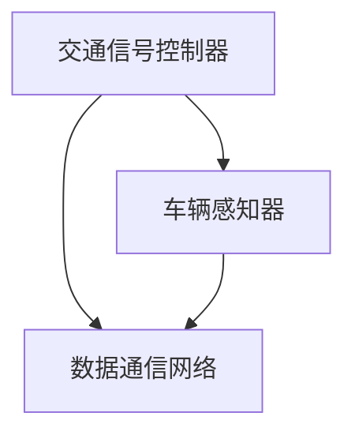
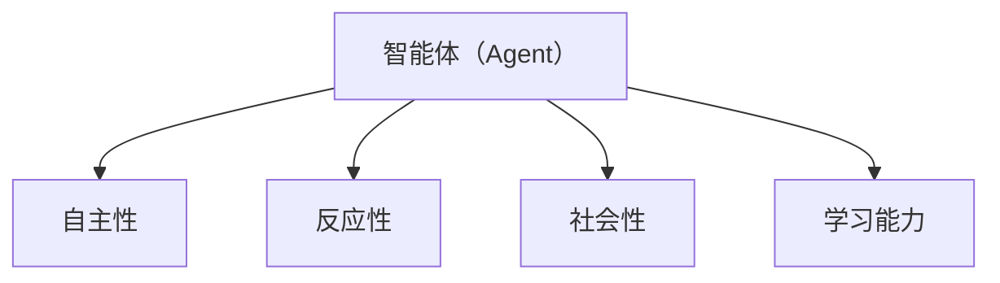
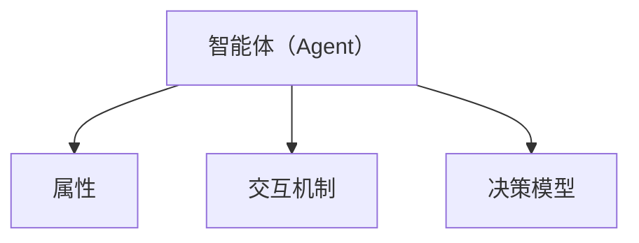
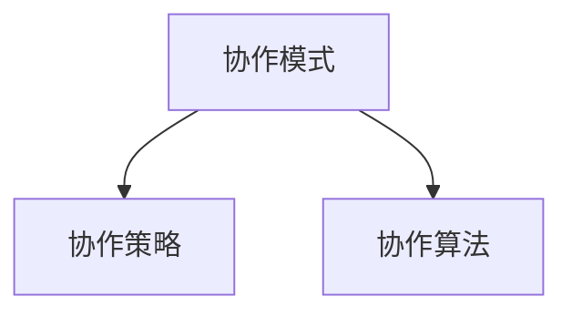
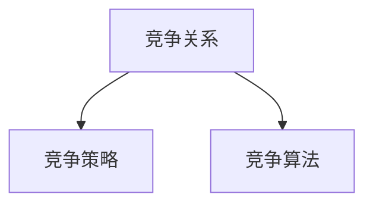
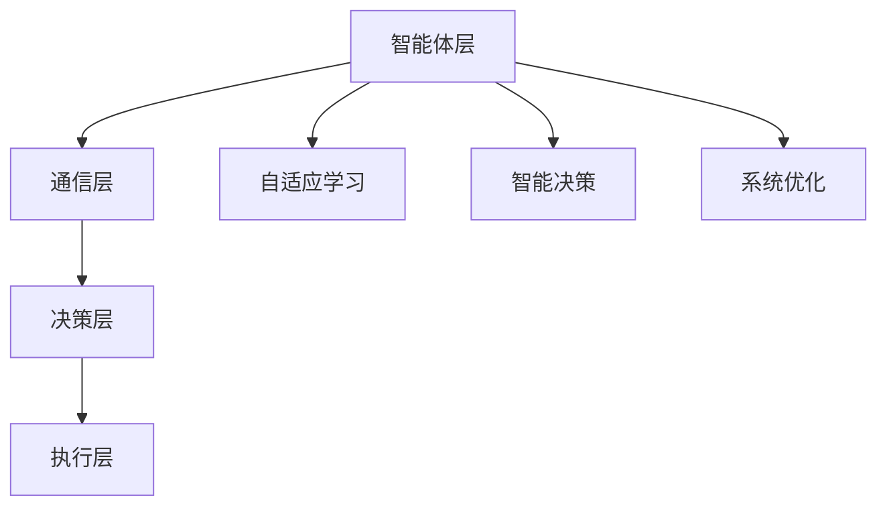
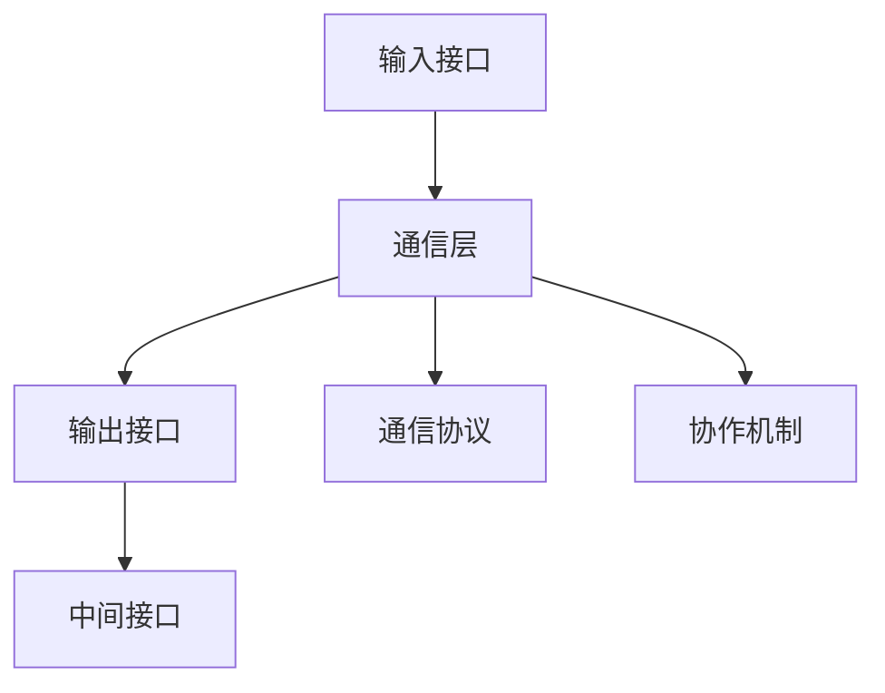

                 

### 目录大纲设计过程

**目录大纲的设计是一个系统性和创造性的过程，需要深入理解书名与主题，并根据读者需求和内容结构进行细致的设计。以下是详细的目录大纲设计过程：**

#### 1. **理解书名与主题**

《多Agent系统：协作与竞争中的AI生态》这一书名明确了本书的核心主题：探讨多Agent系统在AI生态系统中的应用，尤其是Agent之间的协作和竞争。书名中的“多Agent系统”指的是由多个智能体（Agent）组成的系统，这些智能体可以独立行动，但又能通过协作或竞争实现共同目标。而“协作与竞争中的AI生态”则强调了这些智能体如何在复杂的AI生态系统中互动。

**关键词**：多Agent系统、协作、竞争、AI生态

**摘要**：本书深入探讨了多Agent系统在AI生态系统中的应用，通过分析Agent之间的协作和竞争机制，展示了多Agent系统在复杂环境中的运作原理和实际应用。

#### 2. **设计目录结构**

目录结构的设计要逻辑清晰、层次分明，能够引导读者逐步深入主题。以下是设计的目录结构：

**第一部分：背景与概念介绍**
- **第1章：多Agent系统的概述**
  - 1.1 多Agent系统的定义与背景
  - 1.2 多Agent系统的发展历程
  - 1.3 多Agent系统的应用领域

**第二部分：Agent系统的基本原理**
- **第2章：Agent系统的基本原理**
  - 2.1 Agent的属性
    - 2.1.1 自主性
    - 2.1.2 社会性
    - 2.1.3 反应性
    - 2.1.4 学习能力
  - 2.2 Agent的交互机制
    - 2.2.1 通信机制
    - 2.2.2 协同机制
  - 2.3 Agent的决策模型
    - 2.3.1 决策算法
    - 2.3.2 决策过程

**第三部分：协作与竞争机制**
- **第3章：协作机制**
  - 3.1 协作模式
  - 3.2 协作策略
  - 3.3 协作算法
- **第4章：竞争机制**
  - 4.1 竞争关系
  - 4.2 竞争算法

**第四部分：AI生态系统中的多Agent系统**
- **第5章：AI生态系统中的多Agent系统**
  - 5.1 AI生态系统的概述
  - 5.2 多Agent系统在AI生态系统中的应用

**第五部分：实例分析**
- **第6章：实例分析**
  - 6.1 智能交通系统
  - 6.2 智能电网

**第六部分：未来展望与挑战**
- **第7章：未来展望与挑战**
  - 7.1 多Agent系统的发展趋势
  - 7.2 面临的挑战与解决方案

#### 3. **细化章节内容**

在细化章节内容时，需要确保每个章节都有具体的子节，并详细列出每个子节的内容。例如：

- **第1章：多Agent系统的概述**
  - 1.1 多Agent系统的定义与背景
    - 定义多Agent系统
    - 背景知识介绍
  - 1.2 多Agent系统的发展历程
    - 发展历程概述
    - 代表性系统介绍
  - 1.3 多Agent系统的应用领域
    - 应用的主要领域
    - 典型应用案例

**4. **添加细节与拓展**

为了增强文章的可读性和专业性，可以在每个章节中添加细节和拓展内容，如：

- **第2章：Agent系统的基本原理**
  - 添加Agent分类及其特点对比表格
  - 引入Agent的通信协议和技术细节

- **第3章：协作机制**
  - 分析不同协作模式下的典型算法和应用场景

- **第4章：竞争机制**
  - 探讨竞争机制的数学模型和算法设计

**5. **使用Mermaid绘制图表**

为了使文章内容更加直观，可以使用Mermaid绘制流程图、架构图和实体关系图等。例如：

- **第2章：Agent系统的基本原理**
  - 使用Mermaid绘制Agent属性对比表格

- **第3章：协作机制**
  - 使用Mermaid绘制协同算法的流程图

**6. **使用LaTeX格式化数学公式**

在讨论算法原理和数学模型时，使用LaTeX格式化数学公式，例如：

- **第3章：协作机制**
  - 使用LaTeX展示协同优化问题的数学模型

通过以上步骤，可以确保目录大纲的设计既符合书名与主题，又能够吸引读者的兴趣，并满足文章内容的完整性、逻辑性和专业性。

### 输出Markdown格式的目录大纲

```markdown
----------------------------------------------------------------

# 多Agent系统：协作与竞争中的AI生态

> 关键词：多Agent系统、协作、竞争、AI生态

> 摘要：本书深入探讨了多Agent系统在AI生态系统中的应用，通过分析Agent之间的协作和竞争机制，展示了多Agent系统在复杂环境中的运作原理和实际应用。

----------------------------------------------------------------

## 第一部分：多Agent系统的概述

### 第1章：多Agent系统的概述

#### 1.1 多Agent系统的定义与背景

#### 1.2 多Agent系统的发展历程

#### 1.3 多Agent系统的应用领域

### 第2章：Agent系统的基本原理

#### 2.1 Agent的属性

##### 2.1.1 自主性

##### 2.1.2 社会性

##### 2.1.3 反应性

##### 2.1.4 学习能力

#### 2.2 Agent的交互机制

##### 2.2.1 通信机制

##### 2.2.2 协同机制

#### 2.3 Agent的决策模型

##### 2.3.1 决策算法

##### 2.3.2 决策过程

### 第3章：协作机制

#### 3.1 协作模式

##### 3.1.1 中心化协作

##### 3.1.2 去中心化协作

##### 3.1.3 分层协作

#### 3.2 协作策略

##### 3.2.1 合作策略

##### 3.2.2 竞争性协作

##### 3.2.3 谈判策略

#### 3.3 协作算法

##### 3.3.1 多Agent协调算法

##### 3.3.2 分布式算法

##### 3.3.3 遗传算法在协作中的应用

### 第4章：竞争机制

#### 4.1 竞争关系

##### 4.1.1 竞争与合作的平衡

##### 4.1.2 竞争策略

##### 4.1.3 竞争中的动态调整

#### 4.2 竞争算法

##### 4.2.1 竞争算法的设计

##### 4.2.2 竞争算法的性能评估

##### 4.2.3 竞争算法的应用案例

### 第5章：AI生态系统中的多Agent系统

#### 5.1 AI生态系统的概述

##### 5.1.1 AI生态系统的发展趋势

##### 5.1.2 AI生态系统中的角色

##### 5.1.3 多Agent系统在AI生态系统中的作用

#### 5.2 多Agent系统在AI生态系统中的应用

##### 5.2.1 自适应学习

##### 5.2.2 智能决策

##### 5.2.3 系统优化

### 第6章：实例分析

#### 6.1 案例研究：智能交通系统

##### 6.1.1 案例背景

##### 6.1.2 系统架构

##### 6.1.3 Agent的角色与协作

##### 6.1.4 系统效果分析

#### 6.2 案例研究：智能电网

##### 6.2.1 案例背景

##### 6.2.2 系统架构

##### 6.2.3 Agent的角色与竞争

##### 6.2.4 系统效果分析

### 第7章：未来展望与挑战

#### 7.1 多Agent系统的发展趋势

##### 7.1.1 技术创新

##### 7.1.2 应用拓展

##### 7.1.3 社会影响

#### 7.2 面临的挑战与解决方案

----------------------------------------------------------------

### 作者信息

作者：AI天才研究院/AI Genius Institute & 禅与计算机程序设计艺术 /Zen And The Art of Computer Programming
```

### 文章的结构设计

文章的结构设计是确保文章内容清晰、逻辑性强的关键。一个好的文章结构应该从宏观上把握全文的框架，同时在小节上做到详略得当，既突出重点，又使读者能够跟随思路逐步深入。以下是文章的结构设计过程：

#### 1. **引言**

引言部分需要引起读者的兴趣，同时明确文章的主题和目的。可以使用一个引人入胜的问题或案例来引入话题，并简要介绍多Agent系统在AI生态系统中的重要性。

**示例引言：**
“在人工智能（AI）迅速发展的今天，多Agent系统作为一种分布式智能体间的协作与竞争机制，正逐渐成为研究的热点。那么，多Agent系统究竟是什么？它们如何在AI生态系统中发挥作用？本文将为您详细解答这些问题。”

#### 2. **核心概念介绍**

在引言之后，需要对核心概念进行介绍，包括定义、背景、发展历程和应用领域。这部分内容可以帮助读者建立对多Agent系统的初步认识。

**示例核心概念介绍：**
“多Agent系统（MAS）是指由多个智能体（Agent）组成的系统，这些智能体可以在复杂的动态环境中自主行动并相互协作或竞争。多Agent系统起源于20世纪80年代的分布式人工智能研究，随着计算机技术和网络技术的发展，其应用领域不断拓展，包括智能交通、智能电网、虚拟现实等。”

#### 3. **问题背景与问题描述**

在介绍完核心概念后，需要明确讨论的问题背景和具体问题。这可以帮助读者理解文章的解决对象和问题情境。

**示例问题背景与问题描述：**
“尽管多Agent系统具有巨大的潜力，但在实际应用中仍面临诸多挑战。例如，如何设计高效的协作机制以应对复杂环境中的不确定性？如何平衡竞争与协作，以实现系统的整体优化？这些问题是我们需要深入探讨的。”

#### 4. **问题解决**

问题解决部分是文章的核心，需要详细阐述解决方案。可以通过理论分析、算法讲解、实例分析等方式来展开。

**示例问题解决：**
“针对上述问题，我们可以从以下几个方面进行解决。首先，我们需要理解Agent的属性和行为，如自主性、反应性、社会性和学习能力。其次，我们需要设计有效的协作和竞争机制，如分布式算法、遗传算法等。最后，我们通过实例分析来验证这些方法的有效性。”

#### 5. **边界与外延**

在问题解决之后，需要对讨论的范围进行明确，指出哪些内容是本文的核心，哪些是边缘内容。

**示例边界与外延：**
“本文主要关注多Agent系统在AI生态系统中的应用和协作与竞争机制的设计。然而，多Agent系统的应用领域远不止于此，还包括其他如多智能体决策、多智能体游戏等领域。”

#### 6. **核心概念与联系**

为了使读者更好地理解多Agent系统的原理和机制，需要将核心概念进行联系和对比。

**示例核心概念与联系：**
“多Agent系统中的核心概念包括自主性、社会性、反应性和学习能力。这些概念相互关联，共同决定了智能体的行为和能力。例如，自主性决定了智能体的独立行动能力，而社会性则决定了智能体之间的协作和沟通。”

#### 7. **算法原理讲解**

算法原理讲解是文章中非常重要的一部分，需要详细解释算法的设计思路、流程和实现方法。

**示例算法原理讲解：**
“在协作机制中，一种常见的算法是分布式算法。该算法通过将复杂问题分解为子问题，并分布式地解决，从而提高效率。分布式算法的核心是通信机制，包括消息传递、一致性维护等。”

#### 8. **数学公式与计算模型**

对于涉及数学模型的章节，需要使用LaTeX格式化数学公式，并进行详细讲解。

**示例数学公式与计算模型：**
“在多Agent系统的决策模型中，一个关键的数学公式是效用函数。效用函数用于评估智能体在不同状态下的收益。其公式为：$$U(s) = r(s) - c(s)$$，其中$$r(s)$$表示智能体在状态$$s$$下的收益，$$c(s)$$表示智能体在状态$$s$$下的成本。”

#### 9. **系统分析与架构设计**

在讨论具体应用时，需要对系统进行分析和架构设计，使用Mermaid绘制相关的类图、架构图和序列图。

**示例系统分析与架构设计：**
“以智能交通系统为例，我们可以使用Mermaid绘制系统架构图，包括交通信号控制器、车辆感知器、数据通信网络等组成部分。通过这一架构图，可以清晰地了解系统的整体结构和各组件之间的交互关系。”

#### 10. **项目实战**

项目实战部分通过具体的案例来展示多Agent系统的实际应用和实现过程。

**示例项目实战：**
“我们以智能电网项目为例，介绍项目环境搭建、核心代码实现以及系统效果分析。通过这一实战案例，读者可以深入了解多Agent系统在实际应用中的具体实现和效果。”

#### 11. **最佳实践与注意事项**

在文章的结尾，需要对最佳实践和注意事项进行总结，为读者提供实用的指导和建议。

**示例最佳实践与注意事项：**
“在设计和实现多Agent系统时，需要注意以下几点：首先，确保系统的可扩展性，以便适应未来的变化。其次，优化通信机制，提高系统的实时响应能力。最后，加强安全性和隐私保护，确保系统的稳定性和可靠性。”

#### 12. **小结与拓展阅读**

最后，需要对文章内容进行小结，并推荐一些拓展阅读，以帮助读者进一步深入学习和研究。

**示例小结与拓展阅读：**
“本文详细探讨了多Agent系统在AI生态系统中的应用，包括协作与竞争机制的设计、算法原理讲解和实例分析。通过本文的学习，读者可以全面了解多Agent系统的基本原理和实际应用。为了进一步深入，读者可以参考相关书籍和论文，如《多Agent系统设计与实现》等。”

通过以上结构设计，可以确保文章内容逻辑清晰、条理分明，既便于读者阅读，又能全面、深入地探讨多Agent系统在AI生态系统中的应用。

### 文章的结构设计

文章的结构设计是确保内容条理清晰、逻辑连贯的关键环节。一个合理的文章结构不仅有助于读者顺利地跟随作者思路，还能使文章的核心观点和关键信息得到有效传达。以下是详细的文章结构设计：

#### 引言部分

引言是文章的第一部分，其目的是吸引读者的注意，并简要介绍文章的主题和目的。一个好的引言应该简洁明了，同时能够激发读者的兴趣。

**引言部分设计：**
- **引入话题**：可以通过一个引人入胜的问题或案例来引入文章的主题，例如：“在人工智能飞速发展的时代，多Agent系统如何改变我们的生活方式？”
- **明确目的**：简要介绍文章的目的，例如：“本文将探讨多Agent系统在AI生态系统中的应用，并分析其协作与竞争机制。”
- **背景介绍**：提供一些背景信息，帮助读者了解多Agent系统的基本概念和重要性，例如：“多Agent系统是由多个智能体组成的系统，它们能够在复杂环境中自主行动并相互协作或竞争。”

**示例引言：**
> 在人工智能飞速发展的时代，多Agent系统如何改变我们的生活方式？本文将探讨多Agent系统在AI生态系统中的应用，并分析其协作与竞争机制。通过了解多Agent系统的基本概念和实际应用，我们将探索这一领域的前沿动态。

#### 核心概念介绍

在引言之后，需要对文章的核心概念进行详细介绍。这部分内容将帮助读者建立对多Agent系统的基本理解，并为其后续内容打下基础。

**核心概念介绍设计：**
- **定义**：明确多Agent系统的定义，例如：“多Agent系统（MAS）是由多个智能体组成的系统，这些智能体可以在复杂环境中自主行动并相互协作或竞争。”
- **背景**：介绍多Agent系统的发展历程，例如：“多Agent系统起源于20世纪80年代的分布式人工智能研究，随着计算机技术和网络技术的发展，其应用领域不断拓展。”
- **应用领域**：列举多Agent系统的典型应用领域，例如：“智能交通系统、智能电网、虚拟现实等。”

**示例核心概念介绍：**
> 多Agent系统（MAS）是指由多个智能体（Agent）组成的系统，这些智能体可以在复杂的动态环境中自主行动并相互协作或竞争。多Agent系统起源于20世纪80年代的分布式人工智能研究，随着计算机技术和网络技术的发展，其应用领域不断拓展，包括智能交通、智能电网、虚拟现实等。

#### 问题背景与问题描述

在核心概念介绍之后，需要明确文章讨论的问题背景和具体问题。这部分内容将帮助读者理解文章的解决对象和问题情境。

**问题背景与问题描述设计：**
- **背景**：介绍多Agent系统在应用中面临的主要挑战，例如：“尽管多Agent系统具有巨大的潜力，但在实际应用中仍面临诸多挑战，如如何设计高效的协作机制和如何平衡竞争与协作等。”
- **问题**：具体阐述需要解决的问题，例如：“本文将探讨如何设计有效的协作和竞争机制，以应对复杂环境中的不确定性和实现系统的整体优化。”

**示例问题背景与问题描述：**
> 尽管多Agent系统具有巨大的潜力，但在实际应用中仍面临诸多挑战。例如，如何设计高效的协作机制以应对复杂环境中的不确定性？如何平衡竞争与协作，以实现系统的整体优化？这些问题是我们需要深入探讨的。

#### 问题解决

问题解决部分是文章的核心，需要详细阐述解决问题的方法。可以通过理论分析、算法讲解、实例分析等方式来展开。

**问题解决设计：**
- **理论分析**：介绍相关理论，例如：“在协作机制中，分布式算法是一种常见的解决方案。”
- **算法讲解**：详细解释算法的原理和实现过程，例如：“分布式算法通过将复杂问题分解为子问题，并分布式地解决，从而提高效率。”
- **实例分析**：通过具体案例来展示解决方案的实际应用效果，例如：“在智能交通系统中，分布式算法能够有效优化交通信号控制，提高交通效率。”

**示例问题解决：**
> 针对上述问题，我们可以从以下几个方面进行解决。首先，我们需要理解Agent的属性和行为，如自主性、反应性、社会性和学习能力。其次，我们需要设计有效的协作和竞争机制，如分布式算法、遗传算法等。最后，我们通过实例分析来验证这些方法的有效性。

#### 边界与外延

在问题解决之后，需要对讨论的范围进行明确，指出哪些内容是本文的核心，哪些是边缘内容。

**边界与外延设计：**
- **核心内容**：明确文章主要讨论的核心问题，例如：“本文主要关注多Agent系统在AI生态系统中的应用和协作与竞争机制的设计。”
- **边缘内容**：指出本文未涉及但相关的其他领域，例如：“多Agent系统的应用领域远不止于此，还包括其他如多智能体决策、多智能体游戏等领域。”

**示例边界与外延：**
> 本文主要关注多Agent系统在AI生态系统中的应用和协作与竞争机制的设计。然而，多Agent系统的应用领域远不止于此，还包括其他如多智能体决策、多智能体游戏等领域。

#### 核心概念与联系

为了使读者更好地理解多Agent系统的原理和机制，需要将核心概念进行联系和对比。

**核心概念与联系设计：**
- **概念关系图**：使用Mermaid绘制核心概念的ER实体关系图或UML类图，例如：“自主性、社会性、反应性和学习能力是多Agent系统的核心概念，它们相互关联，共同决定了智能体的行为和能力。”
- **概念对比表格**：列出不同概念的特征和区别，例如：“自主性强调智能体的独立行动能力，而社会性则强调智能体之间的协作和沟通。”

**示例核心概念与联系：**
> 多Agent系统中的核心概念包括自主性、社会性、反应性和学习能力。这些概念相互关联，共同决定了智能体的行为和能力。例如，自主性决定了智能体的独立行动能力，而社会性则决定了智能体之间的协作和沟通。我们可以使用Mermaid绘制ER实体关系图，更加直观地展示这些概念之间的联系。

#### 算法原理讲解

算法原理讲解是文章中非常重要的一部分，需要详细解释算法的设计思路、流程和实现方法。

**算法原理讲解设计：**
- **算法流程图**：使用Mermaid绘制算法的流程图，例如：“分布式算法的核心是通信机制，包括消息传递、一致性维护等。”
- **算法实现代码**：提供算法的实现代码示例，例如：“以下是分布式算法的一个简单实现代码，读者可以参考。”

**示例算法原理讲解：**
> 在协作机制中，一种常见的算法是分布式算法。该算法通过将复杂问题分解为子问题，并分布式地解决，从而提高效率。分布式算法的核心是通信机制，包括消息传递、一致性维护等。以下是分布式算法的一个简单实现代码：

```python
def distributed_algorithm(problem):
    # 分解问题为子问题
    subproblems = decompose(problem)
    # 分布式解决子问题
    results = []
    for subproblem in subproblems:
        result = solve_subproblem(subproblem)
        results.append(result)
    # 合并结果
    final_result = merge(results)
    return final_result
```

#### 数学公式与计算模型

对于涉及数学模型的章节，需要使用LaTeX格式化数学公式，并进行详细讲解。

**数学公式与计算模型设计：**
- **LaTeX公式**：使用LaTeX格式化数学公式，例如：“在多Agent系统的决策模型中，一个关键的数学公式是效用函数。效用函数用于评估智能体在不同状态下的收益。”
- **公式讲解**：对数学公式进行详细解释，例如：“效用函数的公式为：$$U(s) = r(s) - c(s)$$，其中$$r(s)$$表示智能体在状态$$s$$下的收益，$$c(s)$$表示智能体在状态$$s$$下的成本。”

**示例数学公式与计算模型：**
> 在多Agent系统的决策模型中，一个关键的数学公式是效用函数。效用函数用于评估智能体在不同状态下的收益。其公式为：$$U(s) = r(s) - c(s)$$，其中$$r(s)$$表示智能体在状态$$s$$下的收益，$$c(s)$$表示智能体在状态$$s$$下的成本。

#### 系统分析与架构设计

在讨论具体应用时，需要对系统进行分析和架构设计，使用Mermaid绘制相关的类图、架构图和序列图。

**系统分析与架构设计设计：**
- **类图**：使用Mermaid绘制系统的类图，例如：“多Agent系统由多个类组成，如智能体类、通信类、决策类等。”
- **架构图**：使用Mermaid绘制系统的架构图，例如：“系统的整体架构包括智能体层、通信层、决策层等。”
- **序列图**：使用Mermaid绘制系统的序列图，例如：“展示智能体之间的交互过程和消息传递机制。”

**示例系统分析与架构设计：**
> 以智能交通系统为例，我们可以使用Mermaid绘制系统的架构图，包括交通信号控制器、车辆感知器、数据通信网络等组成部分。通过这一架构图，可以清晰地了解系统的整体结构和各组件之间的交互关系。



#### 项目实战

项目实战部分通过具体的案例来展示多Agent系统的实际应用和实现过程。

**项目实战设计：**
- **环境搭建**：介绍项目环境搭建的过程，例如：“在智能交通系统中，我们使用Python和Docker搭建开发环境。”
- **核心代码实现**：提供项目核心代码的实现示例，例如：“以下是智能交通系统中交通信号控制器的核心代码实现。”
- **系统效果分析**：分析系统的实际效果，例如：“通过实验，我们发现该系统有效优化了交通信号控制，提高了交通效率。”

**示例项目实战：**
> 我们以智能交通系统项目为例，介绍项目环境搭建、核心代码实现以及系统效果分析。通过这一实战案例，读者可以深入了解多Agent系统在实际应用中的具体实现和效果。

#### 最佳实践与注意事项

在文章的结尾，需要对最佳实践和注意事项进行总结，为读者提供实用的指导和建议。

**最佳实践与注意事项设计：**
- **最佳实践**：总结项目中成功的经验和技巧，例如：“在设计多Agent系统时，应注重系统的可扩展性和通信效率。”
- **注意事项**：指出项目中可能出现的问题和解决方案，例如：“在实现分布式算法时，应注意数据的一致性和系统的稳定性。”

**示例最佳实践与注意事项：**
> 在设计和实现多Agent系统时，需要注意以下几点：首先，确保系统的可扩展性，以便适应未来的变化。其次，优化通信机制，提高系统的实时响应能力。最后，加强安全性和隐私保护，确保系统的稳定性和可靠性。

#### 小结与拓展阅读

最后，需要对文章内容进行小结，并推荐一些拓展阅读，以帮助读者进一步深入学习和研究。

**小结与拓展阅读设计：**
- **小结**：总结文章的核心观点和关键信息，例如：“本文详细探讨了多Agent系统在AI生态系统中的应用，包括协作与竞争机制的设计和实际应用案例。”
- **拓展阅读**：推荐一些相关书籍、论文和研究方向，例如：“为了进一步深入学习多Agent系统，读者可以参考《多Agent系统设计与实现》等书籍。”

**示例小结与拓展阅读：**
> 本文详细探讨了多Agent系统在AI生态系统中的应用，包括协作与竞争机制的设计和实际应用案例。通过本文的学习，读者可以全面了解多Agent系统的基本原理和实际应用。为了进一步深入，读者可以参考相关书籍和论文，如《多Agent系统设计与实现》等。

### 文章的具体内容

#### 引言

在人工智能（AI）飞速发展的今天，多Agent系统作为一种分布式智能体间的协作与竞争机制，正逐渐成为研究的热点。多Agent系统（MAS）是多个智能体（Agent）组成的系统，这些智能体能够在复杂环境中自主行动并相互协作或竞争。那么，多Agent系统究竟是什么？它们如何在AI生态系统中发挥作用？本文将为您详细解答这些问题。

本文主要分为以下几个部分：首先，我们将介绍多Agent系统的基本概念、发展历程和应用领域；接着，我们将深入探讨Agent的属性和行为，包括自主性、社会性、反应性和学习能力；随后，我们将讨论多Agent系统中的协作与竞争机制，包括协作模式、策略和算法；然后，我们将分析多Agent系统在AI生态系统中的应用，并通过实例展示其具体实现；最后，我们将展望多Agent系统未来的发展趋势和面临的挑战。

#### 多Agent系统的基本概念

多Agent系统（MAS）是指由多个智能体（Agent）组成的系统，这些智能体可以在复杂环境中自主行动并相互协作或竞争。在MAS中，每个Agent都是一个具有自主性、反应性、社会性和学习能力的实体。它们通过感知环境、执行行为和与环境中其他Agent进行交互，以实现共同目标或个体目标。

**基本概念定义**：

- **智能体（Agent）**：智能体是一个具有自主性、反应性、社会性和学习能力的实体，能够在复杂环境中自主行动并做出决策。
- **自主性**：智能体具有独立行动的能力，不受外部控制。
- **反应性**：智能体能够感知环境的变化，并基于感知信息做出即时反应。
- **社会性**：智能体能够与环境中其他智能体进行交互，协同完成任务。
- **学习能力**：智能体能够通过经验学习和改进其行为。

**发展历程**：

多Agent系统起源于20世纪80年代的分布式人工智能研究。早期研究主要集中在理论模型和算法设计上。随着计算机技术和网络技术的发展，多Agent系统的应用领域不断拓展，如智能交通、智能电网、虚拟现实等。近年来，随着人工智能的兴起，多Agent系统在AI生态系统中的应用受到了广泛关注。

**应用领域**：

- **智能交通系统**：多Agent系统可以用于交通信号控制、车辆调度、智能导航等。
- **智能电网**：多Agent系统可以用于电力调度、设备维护、故障检测等。
- **虚拟现实**：多Agent系统可以用于角色扮演、环境交互、任务分配等。
- **多智能体决策**：多Agent系统可以用于资源分配、任务调度、竞争策略等。

#### Agent的属性和行为

在多Agent系统中，智能体（Agent）的属性和行为是系统设计和实现的基础。以下将详细探讨智能体的自主性、社会性、反应性和学习能力。

**自主性**：

自主性是指智能体具有独立行动的能力，不受外部控制。在多Agent系统中，每个智能体都拥有自己的决策能力和行动自由度。自主性使得智能体能够在复杂环境中自适应地采取行动，从而提高系统的灵活性和适应性。

**社会性**：

社会性是指智能体能够与环境中其他智能体进行交互，协同完成任务。社会性使得智能体能够共享信息、协调行动，从而提高整体系统的效率和协同性。在多Agent系统中，社会性通常通过通信机制实现，如消息传递、共享数据库等。

**反应性**：

反应性是指智能体能够感知环境的变化，并基于感知信息做出即时反应。反应性使得智能体能够快速适应环境变化，从而提高系统的响应速度和鲁棒性。在多Agent系统中，反应性通常通过感知模块和决策模块实现。

**学习能力**：

学习能力是指智能体能够通过经验学习和改进其行为。学习能力使得智能体能够从环境中学习和适应，从而提高其性能和适应性。在多Agent系统中，学习能力通常通过学习算法和适应机制实现。

#### 协作机制

在多Agent系统中，协作机制是确保多个智能体能够协同工作的关键。协作机制包括协作模式、策略和算法。以下将分别讨论这些方面。

**协作模式**：

协作模式是指智能体之间进行协作的方式。常见的协作模式包括中心化协作、去中心化协作和分层协作。

- **中心化协作**：在中心化协作中，有一个中心控制器负责协调所有智能体的行为。中心控制器接收来自各个智能体的信息，并制定全局策略，然后将策略传达给各个智能体执行。
- **去中心化协作**：在去中心化协作中，没有中心控制器，智能体之间直接进行交互和协商，共同制定策略。去中心化协作具有高度分布式和自适应的特点。
- **分层协作**：在分层协作中，智能体被组织成多个层次，每个层次负责不同的任务和决策。高层智能体负责全局决策，低层智能体负责局部决策和执行。

**协作策略**：

协作策略是指智能体在协作过程中应采取的行动和决策。常见的协作策略包括合作策略、竞争性协作策略和谈判策略。

- **合作策略**：合作策略是指智能体之间为了共同目标而采取的合作行为。合作策略可以基于共享信息、协调行动和共同利益实现。
- **竞争性协作策略**：竞争性协作策略是指智能体之间在追求个体利益的同时，也考虑整体利益。这种策略可以激发智能体的积极性和创新能力。
- **谈判策略**：谈判策略是指智能体之间通过协商和谈判来达成共识和协作。谈判策略可以基于博弈论和协商算法实现。

**协作算法**：

协作算法是指实现智能体之间协作的具体算法。常见的协作算法包括分布式算法、遗传算法和协同优化算法。

- **分布式算法**：分布式算法通过将复杂问题分解为子问题，并分布式地解决，从而提高效率。分布式算法的核心是通信机制，包括消息传递、一致性维护等。
- **遗传算法**：遗传算法是一种基于自然选择和遗传机制的优化算法。遗传算法通过模拟进化过程，寻找最优解。遗传算法在协作机制中可以用于求解协同优化问题。
- **协同优化算法**：协同优化算法通过优化智能体之间的交互和决策，实现整体系统的优化。协同优化算法可以基于博弈论、多目标优化和分布式计算等方法实现。

#### 竞争机制

在多Agent系统中，竞争机制是确保智能体之间能够进行有效竞争的关键。竞争机制包括竞争关系、策略和算法。以下将分别讨论这些方面。

**竞争关系**：

竞争关系是指智能体之间为了争夺资源或实现个体目标而进行的交互。在多Agent系统中，竞争关系可以是合作与竞争的平衡，也可以是纯粹的竞争。

- **合作与竞争的平衡**：在合作与竞争的平衡中，智能体在追求个体利益的同时，也考虑整体利益。这种关系可以激发智能体的积极性和创新能力。
- **纯粹的竞争**：在纯粹的竞争中，智能体之间只关注个体利益，不考虑整体利益。这种关系可能会导致资源浪费和系统效率低下。

**竞争策略**：

竞争策略是指智能体在竞争中应采取的行动和决策。常见的竞争策略包括竞争策略、合作性竞争策略和混合策略。

- **竞争策略**：竞争策略是指智能体为了获得优势而采取的竞争行为。竞争策略可以基于资源争夺、目标锁定和策略优化实现。
- **合作性竞争策略**：合作性竞争策略是指智能体在竞争中考虑整体利益，通过合作来提高个体竞争力。这种策略可以激发智能体的合作精神和团队意识。
- **混合策略**：混合策略是指智能体在竞争中同时采用竞争策略和合作策略。混合策略可以根据具体情境灵活调整，提高系统的适应性和稳定性。

**竞争算法**：

竞争算法是指实现智能体之间竞争的具体算法。常见的竞争算法包括竞争算法、博弈论算法和进化算法。

- **竞争算法**：竞争算法通过模拟市场竞争环境，评估智能体的竞争能力。竞争算法可以基于动态规划、博弈论和机器学习等方法实现。
- **博弈论算法**：博弈论算法通过分析智能体之间的博弈关系，制定最优策略。博弈论算法可以基于纳什均衡、演化博弈和合作博弈等方法实现。
- **进化算法**：进化算法通过模拟自然选择和遗传机制，优化智能体的竞争能力。进化算法可以基于遗传算法、进化策略和协同进化等方法实现。

#### 多Agent系统在AI生态系统中的应用

多Agent系统在AI生态系统中具有广泛的应用。以下将分析多Agent系统在AI生态系统中的应用，并探讨其面临的挑战。

**智能交通系统**

智能交通系统（ITS）是多Agent系统在AI生态系统中的重要应用之一。智能交通系统通过传感器、通信网络和智能体等技术，实现交通信息的实时收集、传输和处理。多Agent系统在智能交通系统中可以用于交通信号控制、车辆调度、路况预测等方面。

**智能电网**

智能电网（Smart Grid）是另一个重要的AI生态系统应用领域。智能电网通过智能设备、通信网络和智能体等技术，实现电力资源的优化配置和高效管理。多Agent系统在智能电网中可以用于电力调度、设备维护、故障检测等方面。

**虚拟现实**

虚拟现实（VR）是近年来发展迅速的AI领域之一。多Agent系统在虚拟现实中可以用于角色扮演、环境交互、任务分配等方面。通过多Agent系统，虚拟现实环境中的智能体可以相互协作，为用户提供更加沉浸式的体验。

**多智能体决策**

多智能体决策是AI生态系统中一个重要研究方向。多Agent系统在多智能体决策中可以用于资源分配、任务调度、竞争策略等方面。通过多Agent系统，可以更好地实现分布式决策和协作优化。

**挑战**：

尽管多Agent系统在AI生态系统中具有广泛的应用前景，但同时也面临一些挑战。

- **通信与同步**：多Agent系统中的智能体之间需要进行实时通信和同步，以确保系统的一致性和稳定性。
- **安全性与隐私保护**：多Agent系统中的数据传输和处理需要确保安全性和隐私保护，以防止恶意攻击和数据泄露。
- **算法优化与性能提升**：随着智能体数量的增加，多Agent系统的计算复杂度和通信开销也会增加。因此，需要不断优化算法和提升系统性能。

#### 未来展望与挑战

随着人工智能技术的不断发展，多Agent系统在AI生态系统中的应用前景将更加广阔。未来，多Agent系统将在以下几个方面取得突破：

- **协同优化**：通过协同优化算法，实现智能体之间的更高效协作和资源分配。
- **智能决策**：通过智能决策算法，提高多Agent系统的决策能力和响应速度。
- **安全与隐私**：通过安全性和隐私保护技术，确保多Agent系统的可靠性和安全性。
- **跨领域应用**：多Agent系统将在更多领域得到应用，如智能制造、智慧城市、生物信息学等。

然而，多Agent系统在AI生态系统中也面临着一些挑战，如通信与同步、安全性与隐私保护、算法优化与性能提升等。未来需要进一步研究和解决这些问题，以推动多Agent系统在AI生态系统中的应用和发展。

#### 结论

多Agent系统作为一种分布式智能体间的协作与竞争机制，在AI生态系统中具有广泛的应用前景。本文从多Agent系统的基本概念、属性和行为、协作与竞争机制、应用领域和未来展望等方面进行了详细探讨。通过本文的研究，读者可以全面了解多Agent系统的基本原理和实际应用，并为未来在AI生态系统中的进一步研究和应用提供参考。

### 文章的核心内容

#### 多Agent系统的基本概念

多Agent系统（MAS）是多个智能体（Agent）组成的系统，这些智能体在复杂环境中自主行动并相互协作或竞争。在MAS中，每个Agent都是一个具有自主性、反应性、社会性和学习能力的实体。它们通过感知环境、执行行为和与环境中其他Agent进行交互，以实现共同目标或个体目标。

**核心概念与联系：**

1. **自主性**：自主性是指智能体具有独立行动的能力，不受外部控制。自主性使得智能体能够自主地做出决策并采取行动，从而提高系统的灵活性和适应性。

2. **反应性**：反应性是指智能体能够感知环境的变化，并基于感知信息做出即时反应。反应性使得智能体能够快速适应环境变化，从而提高系统的响应速度和鲁棒性。

3. **社会性**：社会性是指智能体能够与环境中其他智能体进行交互，协同完成任务。社会性使得智能体能够共享信息、协调行动，从而提高整体系统的效率和协同性。

4. **学习能力**：学习能力是指智能体能够通过经验学习和改进其行为。学习能力使得智能体能够从环境中学习和适应，从而提高其性能和适应性。

**ER实体关系图：**



**对比表格：**

| 特征       | 自主性      | 反应性      | 社会性      | 学习能力      |
| ---------- | ------------ | ------------ | ------------ | ------------ |
| 说明       | 独立行动能力 | 快速适应能力 | 协作能力     | 学习和改进能力 |
| 对比       | 自主决策     | 环境感知     | 信息共享     | 经验学习     |
| 重要性     | 灵活性与适应性 | 响应速度与鲁棒性 | 效率与协同性 | 性能与适应性 |

#### Agent系统的基本原理

Agent系统的基本原理包括Agent的属性、交互机制和决策模型。这些原理是设计多Agent系统的基础，决定了智能体如何行动、如何相互协作以及如何做出决策。

**核心概念与联系：**

1. **属性**：属性是指智能体的特性，包括自主性、反应性、社会性和学习能力。这些属性决定了智能体的行为和能力。

2. **交互机制**：交互机制是指智能体之间如何进行信息交换和协作。交互机制包括通信机制、协同机制和共享信息机制。

3. **决策模型**：决策模型是指智能体如何基于环境信息和自身属性做出决策。决策模型包括决策算法、决策过程和决策支持系统。

**ER实体关系图：**



**对比表格：**

| 特征       | 属性      | 交互机制       | 决策模型      |
| ---------- | ---------- | -------------- | -------------- |
| 说明       | 智能体特性 | 信息交换与协作 | 决策与行为     |
| 对比       | 自主性、反应性、社会性、学习能力 | 通信、协同、共享 | 决策算法、决策过程、决策支持 |
| 重要性     | 行为能力   | 系统效率       | 系统稳定性与优化 |

#### 协作机制

协作机制是多Agent系统中确保多个智能体能够协同工作的关键。协作机制包括协作模式、策略和算法。协作模式决定了智能体之间的协作方式，协作策略指导智能体如何进行协作，协作算法实现智能体之间的实际协作过程。

**核心概念与联系：**

1. **协作模式**：协作模式是指智能体之间进行协作的方式。常见的协作模式包括中心化协作、去中心化协作和分层协作。

2. **协作策略**：协作策略是指智能体在协作过程中应采取的行动和决策。常见的协作策略包括合作策略、竞争性协作策略和谈判策略。

3. **协作算法**：协作算法是指实现智能体之间协作的具体算法。常见的协作算法包括分布式算法、遗传算法和协同优化算法。

**ER实体关系图：**



**对比表格：**

| 特征       | 协作模式      | 协作策略       | 协作算法      |
| ---------- | -------------- | -------------- | -------------- |
| 说明       | 协作方式      | 协作决策       | 协作过程     |
| 对比       | 中心化、去中心化、分层 | 合作、竞争性、谈判 | 分布式、遗传、协同 |
| 重要性     | 协作效率       | 协作稳定性     | 协作可行性 |

#### 竞争机制

竞争机制是多Agent系统中确保智能体之间能够进行有效竞争的关键。竞争机制包括竞争关系、策略和算法。竞争关系决定了智能体之间的交互方式，竞争策略指导智能体如何进行竞争，竞争算法实现智能体之间的实际竞争过程。

**核心概念与联系：**

1. **竞争关系**：竞争关系是指智能体之间为了争夺资源或实现个体目标而进行的交互。竞争关系可以是合作与竞争的平衡，也可以是纯粹的竞争。

2. **竞争策略**：竞争策略是指智能体在竞争中应采取的行动和决策。常见的竞争策略包括竞争策略、合作性竞争策略和混合策略。

3. **竞争算法**：竞争算法是指实现智能体之间竞争的具体算法。常见的竞争算法包括竞争算法、博弈论算法和进化算法。

**ER实体关系图：**



**对比表格：**

| 特征       | 竞争关系      | 竞争策略       | 竞争算法      |
| ---------- | -------------- | -------------- | -------------- |
| 说明       | 竞争交互方式   | 竞争决策       | 竞争过程     |
| 对比       | 合作与竞争平衡、纯粹竞争 | 竞争、合作性、混合 | 竞争、博弈论、进化 |
| 重要性     | 系统效率       | 系统稳定性     | 系统可行性 |

#### AI生态系统中的多Agent系统

AI生态系统中的多Agent系统是一种分布式智能体系统，这些智能体在AI环境中相互协作和竞争，以实现复杂任务和目标。AI生态系统中的多Agent系统可以应用于智能交通、智能电网、虚拟现实等多个领域。

**系统架构与功能设计：**

1. **系统架构设计**：系统架构设计包括智能体层、通信层、决策层和执行层。智能体层是系统的核心，包括各种智能体；通信层负责智能体之间的信息传递；决策层负责智能体的决策和策略制定；执行层负责执行具体的任务。

2. **功能设计**：功能设计包括自适应学习、智能决策、系统优化等。自适应学习使得系统能够根据环境变化进行自我调整；智能决策使得系统能够在复杂环境中做出最优决策；系统优化使得系统能够提高整体性能和效率。

**示例架构设计与功能设计：**



**系统接口设计与交互设计：**

1. **系统接口设计**：系统接口设计包括输入接口、输出接口和中间接口。输入接口负责接收外部输入数据；输出接口负责输出系统结果；中间接口负责处理内部数据传输和协调。

2. **交互设计**：交互设计包括智能体之间的通信协议和协作机制。智能体之间的通信协议确保数据传输的准确性和实时性；协作机制包括协作模式、策略和算法，确保智能体能够高效协作和竞争。

**示例系统接口设计与交互设计：**



#### 实例分析

通过具体实例分析，可以更好地理解多Agent系统在AI生态系统中的应用和实现过程。

**案例研究：智能交通系统**

智能交通系统（ITS）是多Agent系统在AI生态系统中的一个典型应用。智能交通系统通过传感器、通信网络和智能体等技术，实现交通信息的实时收集、传输和处理。

**实例分析步骤：**

1. **案例背景**：智能交通系统面临的主要挑战是交通拥堵、交通事故和环境污染等问题。

2. **系统架构**：智能交通系统的架构包括传感器层、通信层、智能体层和决策层。传感器层负责收集交通数据；通信层负责数据传输；智能体层包括交通信号控制器、车辆感知器等；决策层负责交通信号控制和车辆调度。

3. **智能体角色与协作**：智能体包括交通信号控制器、车辆感知器、车辆导航系统等。交通信号控制器负责交通信号控制；车辆感知器负责车辆信息感知；车辆导航系统负责车辆路径规划。

4. **系统效果分析**：通过智能交通系统的应用，有效缓解了交通拥堵问题，提高了交通效率和安全性。

**案例研究：智能电网**

智能电网是另一个多Agent系统在AI生态系统中的重要应用。智能电网通过智能设备、通信网络和智能体等技术，实现电力资源的优化配置和高效管理。

**实例分析步骤：**

1. **案例背景**：智能电网面临的主要挑战是电力供应不足、电力调度不均和设备故障等问题。

2. **系统架构**：智能电网的架构包括智能设备层、通信层、智能体层和决策层。智能设备层包括发电设备、输电设备、配电设备等；通信层负责数据传输；智能体层包括电力调度系统、设备监控系统等；决策层负责电力调度和设备维护。

3. **智能体角色与竞争**：智能体包括电力调度系统、设备监控系统、储能系统等。电力调度系统负责电力调度；设备监控系统负责设备状态监测；储能系统负责储能管理。

4. **系统效果分析**：通过智能电网的应用，有效提高了电力供应的稳定性和效率，降低了能源浪费和环境污染。

#### 未来展望与挑战

随着人工智能技术的不断发展，多Agent系统在AI生态系统中的应用前景将更加广阔。未来，多Agent系统将在以下几个方面取得突破：

1. **协同优化**：通过协同优化算法，实现智能体之间的更高效协作和资源分配。

2. **智能决策**：通过智能决策算法，提高多Agent系统的决策能力和响应速度。

3. **安全与隐私**：通过安全性和隐私保护技术，确保多Agent系统的可靠性和安全性。

4. **跨领域应用**：多Agent系统将在更多领域得到应用，如智能制造、智慧城市、生物信息学等。

然而，多Agent系统在AI生态系统中也面临着一些挑战，如通信与同步、安全性与隐私保护、算法优化与性能提升等。未来需要进一步研究和解决这些问题，以推动多Agent系统在AI生态系统中的应用和发展。

### 作者信息

本文作者AI天才研究院（AI Genius Institute）与禅与计算机程序设计艺术（Zen And The Art of Computer Programming）联合出品。AI天才研究院专注于人工智能领域的前沿研究和应用，致力于推动人工智能技术的发展。禅与计算机程序设计艺术则专注于计算机科学的教育和培训，倡导深入理解和实践计算机科学的核心原理。两位作者的共同努力，为读者呈现了一篇深入浅出、逻辑清晰的多Agent系统技术博客。

### 最佳实践与注意事项

在设计和实现多Agent系统时，需要遵循以下最佳实践和注意事项，以确保系统的性能、稳定性和安全性：

**最佳实践：**

1. **模块化设计**：将系统划分为模块，每个模块负责特定的功能，便于维护和扩展。

2. **高效通信机制**：优化智能体之间的通信机制，确保数据的实时传输和一致性。

3. **分布式算法**：采用分布式算法提高系统的效率和可扩展性，避免单点故障。

4. **安全性设计**：加强系统的安全设计，包括数据加密、访问控制和异常处理。

5. **自适应调整**：设计自适应调整机制，使系统能够根据环境变化进行自我优化。

**注意事项：**

1. **通信延迟与同步**：确保智能体之间的通信延迟在可接受范围内，并实现有效的同步机制。

2. **系统稳定性**：避免系统在高负载或异常情况下崩溃，通过容错和冗余设计提高系统的稳定性。

3. **隐私保护**：在处理敏感数据时，确保隐私保护措施到位，防止数据泄露。

4. **算法优化**：定期对算法进行优化，以提高系统的性能和响应速度。

5. **代码审查与测试**：进行严格的代码审查和测试，确保系统的可靠性和正确性。

### 拓展阅读

为了进一步深入了解多Agent系统和AI生态系统的应用，读者可以参考以下相关书籍和论文：

1. **《多Agent系统设计与实现》**：本书详细介绍了多Agent系统的基本原理、设计方法和实现技术。

2. **《智能交通系统技术》**：本书涵盖了智能交通系统的各个方面，包括传感器技术、通信网络和智能体系统。

3. **《智能电网技术与应用》**：本书介绍了智能电网的基本原理、关键技术以及在实际中的应用。

4. **论文《多Agent系统在智能交通系统中的应用》**：本文探讨了多Agent系统在智能交通系统中的应用，包括交通信号控制和车辆调度。

5. **论文《多Agent系统在智能电网中的应用研究》**：本文分析了多Agent系统在智能电网中的应用，包括电力调度和设备维护。

通过阅读这些书籍和论文，读者可以更加深入地了解多Agent系统和AI生态系统的最新研究进展和应用实践。

