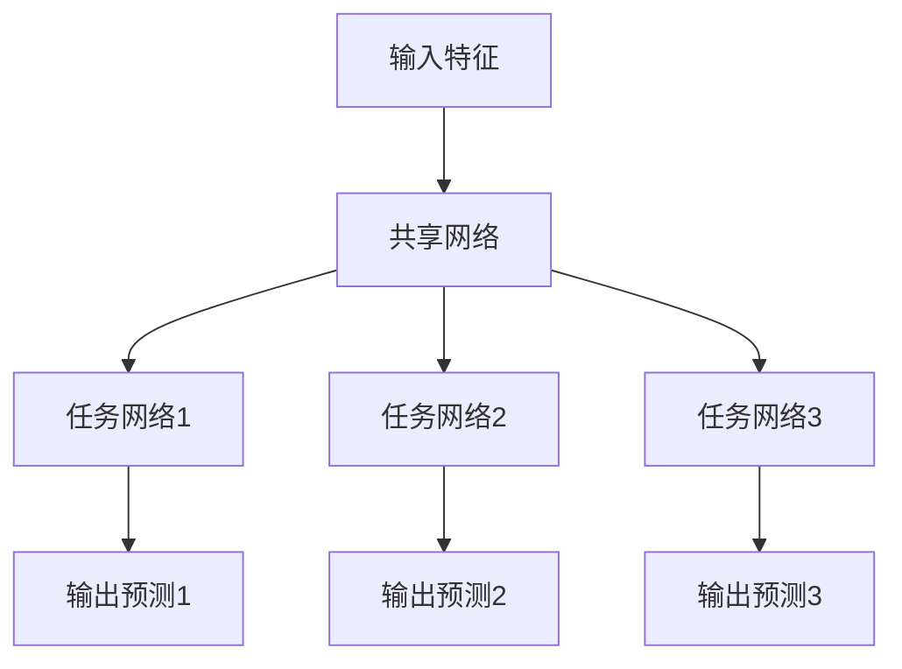
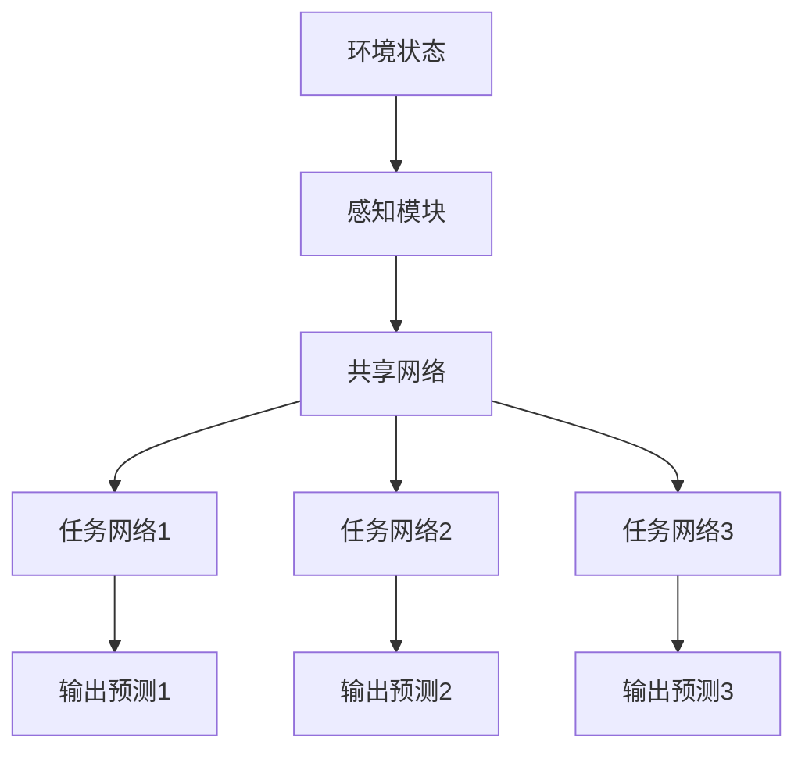
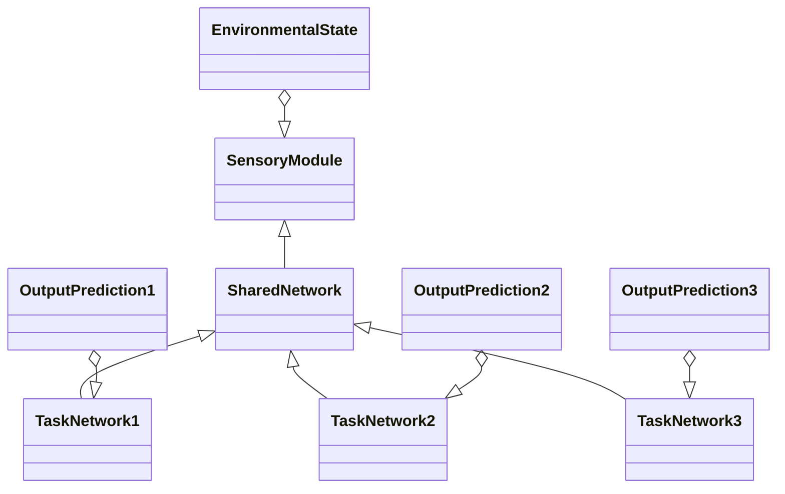
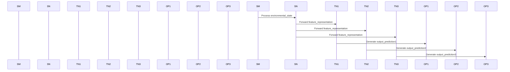

                 

### 《多任务学习：构建全能型AI Agent》

#### 关键词：多任务学习、AI Agent、算法原理、系统架构、项目实战

> 摘要：本文将深入探讨多任务学习在构建全能型AI Agent中的应用，分析其重要性、核心概念、算法原理及系统架构。通过详细的实例讲解，旨在为读者提供一个全面的指导，帮助他们在实际项目中运用多任务学习技术，构建出高效、全能的AI Agent。

----------------------------------------------------------------

## 第一部分：引论

### 第1章 问题背景与解决思路

#### 1.1 人工智能发展历程回顾

人工智能（AI）作为计算机科学的一个分支，已经经历了数十年的发展。从最初的规则基础系统，到基于数据驱动的机器学习，再到如今深度学习的广泛应用，AI技术不断演进，为各行各业带来了革命性的变化。

在早期的AI研究中，大多数算法和应用都集中在单一任务的解决上。例如，语音识别、图像分类、自然语言处理等。然而，现实世界的问题往往复杂多样，单一任务模型难以满足需求。于是，多任务学习（Multi-Task Learning, MTL）逐渐成为研究热点。

#### 1.2 多任务学习的重要性

多任务学习的重要性主要体现在以下几个方面：

1. **资源利用**：多任务学习可以共享特征表示和模型参数，从而减少训练数据的需求和计算资源。
2. **模型泛化能力**：多任务学习有助于模型在不同任务上学习到更多通用的特征表示，提高模型在未知任务上的表现。
3. **性能提升**：多任务学习可以相互促进，一个任务的改进可能会对其他任务产生积极影响。

#### 1.3 全能型AI Agent的定义与构建

全能型AI Agent（All-in-One AI Agent）是指能够在多个任务中表现出色的人工智能实体。它需要具备以下能力：

1. **多任务处理**：同时处理多个任务，如语音识别、图像识别、自然语言理解等。
2. **高效学习**：能够快速学习新任务，并在短时间内达到较高的性能。
3. **灵活适应**：能够适应不同环境和场景，具备一定的自我适应能力。

#### 1.4 书籍结构安排与主要内容概述

本书将分为四个主要部分：

1. **引论**：介绍人工智能的发展历程和多任务学习的重要性，定义全能型AI Agent。
2. **核心概念与联系**：详细探讨多任务学习的概念、类型及其优势与挑战，以及全能型AI Agent的核心要素。
3. **算法原理与数学模型**：讲解多任务学习的算法原理和全能型AI Agent的算法设计。
4. **系统架构与实现**：介绍全能型AI Agent的系统架构设计，以及项目实战和最佳实践。

----------------------------------------------------------------

### 第2章 多任务学习的概念

#### 2.1 多任务学习的定义

多任务学习是指在一个统一的学习框架下，同时训练多个相关任务的学习方法。它可以分为两种基本类型：

1. **共享表示**（Shared Representation）：不同任务共享相同的底层特征表示，通过不同的顶层任务头来完成各自的任务。
2. **独立表示**（Independent Representation）：每个任务都有独立的特征表示，模型在不同任务间进行独立优化。

#### 2.2 多任务学习的基本类型

多任务学习可以分为以下几种基本类型：

1. **分类任务**：例如，对图像进行分类的同时对文本进行情感分析。
2. **回归任务**：例如，预测房价的同时预测销量。
3. **序列任务**：例如，语音识别和机器翻译。

#### 2.3 多任务学习的优势与挑战

多任务学习的优势包括：

1. **资源利用**：共享特征表示和模型参数，减少训练数据需求和计算资源。
2. **模型泛化**：学习到更多通用的特征表示，提高模型在未知任务上的表现。

然而，多任务学习也面临一些挑战：

1. **任务冲突**：不同任务之间可能存在信息竞争，导致某一任务的表现下降。
2. **模型复杂度**：多任务学习模型通常比单任务模型复杂，训练难度更大。

#### 2.4 全能型AI Agent的核心要素

全能型AI Agent的核心要素包括：

1. **多任务处理**：能够同时处理多个任务，如语音识别、图像识别、自然语言理解等。
2. **高效学习**：能够快速学习新任务，并在短时间内达到较高的性能。
3. **灵活适应**：能够适应不同环境和场景，具备一定的自我适应能力。

通过以上讨论，我们可以看到多任务学习在构建全能型AI Agent中的重要性。接下来，我们将深入探讨多任务学习的算法原理和数学模型。

----------------------------------------------------------------

### 第3章 全能型AI Agent的核心要素

#### 3.1 全能型AI Agent的基本架构

全能型AI Agent的基本架构通常包括以下几个核心模块：

1. **感知模块**：负责接收外部信息，如语音、图像、文本等。
2. **理解模块**：对感知模块获取的信息进行处理和分析，理解其含义和关系。
3. **决策模块**：根据理解模块的结果做出相应的决策，执行相应的任务。
4. **记忆模块**：记录Agent的过去经验和知识，用于后续学习和决策。

#### 3.2 全能型AI Agent的能力要求

全能型AI Agent需要具备以下能力：

1. **多任务处理**：同时处理多个任务，如语音识别、图像识别、自然语言理解等。
2. **高效学习**：能够快速学习新任务，并在短时间内达到较高的性能。
3. **灵活适应**：能够适应不同环境和场景，具备一定的自我适应能力。

#### 3.3 全能型AI Agent的关键技术

构建全能型AI Agent需要以下关键技术：

1. **多任务学习算法**：如共享表示、独立表示等。
2. **深度神经网络**：用于感知、理解和决策模块。
3. **强化学习**：用于训练AI Agent的自我适应能力。
4. **迁移学习**：利用已有模型的知识快速适应新任务。

通过以上讨论，我们可以看到全能型AI Agent的核心要素和关键技术。接下来，我们将深入探讨多任务学习的算法原理和数学模型。

----------------------------------------------------------------

### 第4章 多任务学习的算法原理

#### 4.1 多任务学习的数学模型

多任务学习的数学模型主要包括以下几个方面：

1. **输入表示**：将不同任务的输入数据转换为统一的特征表示。
2. **共享网络**：处理输入特征，提取共性特征表示。
3. **任务网络**：基于共享特征表示，为每个任务构建独立的预测模型。

具体来说，多任务学习的数学模型可以表示为：

$$
\begin{aligned}
\text{共享网络}:\quad x &= f_{\theta}(x), \\
\text{任务网络}:\quad y_i &= g_{\theta_i}(f_{\theta}(x)),
\end{aligned}
$$

其中，$x$为输入特征，$f_{\theta}$为共享网络，$y_i$为第$i$个任务的输出预测，$g_{\theta_i}$为第$i$个任务的预测模型。

#### 4.2 多任务学习算法的mermaid流程图

以下是一个简化的多任务学习算法的mermaid流程图：



#### 4.3 Python代码实现与算法分析

以下是多任务学习算法的Python代码实现：

```python
import tensorflow as tf

# 定义共享网络
def shared_network(inputs):
    model = tf.keras.Sequential([
        tf.keras.layers.Dense(128, activation='relu'),
        tf.keras.layers.Dense(64, activation='relu'),
        tf.keras.layers.Dense(32, activation='relu')
    ])
    return model(inputs)

# 定义任务网络
def task_network(inputs):
    model = tf.keras.Sequential([
        tf.keras.layers.Dense(128, activation='relu'),
        tf.keras.layers.Dense(64, activation='relu'),
        tf.keras.layers.Dense(32, activation='relu')
    ])
    return model(inputs)

# 创建模型
model = tf.keras.Sequential([
    shared_network,
    [task_network for _ in range(3)]
])

# 编译模型
model.compile(optimizer='adam', loss='mean_squared_error')

# 输入数据
inputs = tf.random.normal([10, 10])

# 训练模型
model.fit(inputs, [1, 2, 3], epochs=10)
```

通过以上代码，我们可以看到多任务学习算法的基本实现。接下来，我们将探讨全能型AI Agent的算法设计。

----------------------------------------------------------------

### 第5章 全能型AI Agent的算法设计

#### 5.1 全能型AI Agent算法的数学模型

全能型AI Agent的算法设计基于多任务学习的数学模型，但需要更复杂和灵活的结构来处理不同类型的多任务。以下是全能型AI Agent算法的基本数学模型：

$$
\begin{aligned}
\text{感知模块}:\quad x &= \phi(s), \\
\text{共享网络}:\quad h &= f_{\theta}(x), \\
\text{任务网络}:\quad y_i &= g_{\theta_i}(h),
\end{aligned}
$$

其中，$\phi(s)$为感知模块对环境状态的编码，$h$为共享网络提取的特征表示，$y_i$为第$i$个任务的输出预测。

#### 5.2 全能型AI Agent算法的mermaid流程图

以下是一个简化的全能型AI Agent算法的mermaid流程图：



#### 5.3 Python代码实现与算法分析

以下是全能型AI Agent算法的Python代码实现：

```python
import tensorflow as tf

# 定义感知模块
def sensory_module(s):
    model = tf.keras.Sequential([
        tf.keras.layers.Dense(128, activation='relu'),
        tf.keras.layers.Dense(64, activation='relu'),
        tf.keras.layers.Dense(32, activation='relu')
    ])
    return model(s)

# 定义共享网络
def shared_network(h):
    model = tf.keras.Sequential([
        tf.keras.layers.Dense(128, activation='relu'),
        tf.keras.layers.Dense(64, activation='relu'),
        tf.keras.layers.Dense(32, activation='relu')
    ])
    return model(h)

# 定义任务网络
def task_network(h):
    model = tf.keras.Sequential([
        tf.keras.layers.Dense(128, activation='relu'),
        tf.keras.layers.Dense(64, activation='relu'),
        tf.keras.layers.Dense(32, activation='relu')
    ])
    return model(h)

# 创建模型
model = tf.keras.Sequential([
    sensory_module,
    shared_network,
    [task_network for _ in range(3)]
])

# 编译模型
model.compile(optimizer='adam', loss='mean_squared_error')

# 输入数据
s = tf.random.normal([10, 10])

# 训练模型
model.fit(s, [1, 2, 3], epochs=10)
```

通过以上代码，我们可以看到全能型AI Agent算法的基本实现。接下来，我们将探讨全能型AI Agent的系统架构设计。

----------------------------------------------------------------

### 第6章 全能型AI Agent的系统架构设计

#### 6.1 全能型AI Agent系统功能设计（领域模型mermaid类图）

为了更好地理解全能型AI Agent的系统功能设计，我们可以使用mermaid类图来展示其领域模型。以下是一个简化的mermaid类图示例：



在这个类图中，`EnvironmentalState`代表环境状态，`SensoryModule`代表感知模块，`SharedNetwork`代表共享网络，`TaskNetwork1`、`TaskNetwork2`和`TaskNetwork3`分别代表三个任务网络，`OutputPrediction1`、`OutputPrediction2`和`OutputPrediction3`分别代表三个任务的输出预测。

#### 6.2 全能型AI Agent系统架构设计（mermaid架构图）

接下来，我们可以使用mermaid架构图来展示全能型AI Agent的系统架构设计。以下是一个简化的mermaid架构图示例：


在这个架构图中，`感知模块`将接收到的环境状态输入到`共享网络`，`共享网络`再分别将特征传递给三个不同的`任务网络`，每个`任务网络`执行相应的任务并生成输出预测。

#### 6.3 全能型AI Agent系统接口设计

在系统接口设计方面，我们需要定义感知模块、共享网络和任务网络之间的接口。以下是一个简化的接口设计示例：

```python
class SensoryModule:
    def process(self, environmental_state):
        # 处理环境状态
        pass

class SharedNetwork:
    def forward(self, feature_representation):
        # 前向传播
        pass

class TaskNetwork:
    def forward(self, feature_representation):
        # 前向传播
        pass

class OutputPrediction:
    def generate(self, feature_representation):
        # 生成输出预测
        pass
```

在这个接口设计中，`SensoryModule`类负责处理环境状态，`SharedNetwork`类负责前向传播，`TaskNetwork`类也负责前向传播，`OutputPrediction`类负责生成输出预测。

#### 6.4 全能型AI Agent系统交互（mermaid序列图）

最后，我们可以使用mermaid序列图来展示全能型AI Agent的系统交互。以下是一个简化的mermaid序列图示例：



在这个序列图中，`SensoryModule`处理环境状态，然后将特征传递给`SharedNetwork`。`SharedNetwork`将特征传递给三个不同的`TaskNetwork`，每个`TaskNetwork`执行相应的任务并生成输出预测，最后输出预测由相应的`OutputPrediction`类生成。

通过以上系统架构设计，我们可以构建一个具备多任务处理能力的全能型AI Agent，从而在各个任务中表现出色。

----------------------------------------------------------------

### 第7章 项目实战

#### 7.1 环境安装与配置

为了实现全能型AI Agent，我们首先需要安装和配置相关的软件和工具。以下是一个简化的环境安装与配置步骤：

1. **安装Python**：确保Python环境已安装，版本建议为3.8或以上。
2. **安装TensorFlow**：使用pip命令安装TensorFlow：
   ```bash
   pip install tensorflow
   ```
3. **安装其他依赖库**：根据具体项目需求，可能需要安装其他库，例如NumPy、Pandas等。

#### 7.2 全能型AI Agent的核心实现

接下来，我们将使用Python代码实现全能型AI Agent的核心功能。以下是一个简化的实现示例：

```python
import tensorflow as tf
from tensorflow.keras.models import Model
from tensorflow.keras.layers import Input, Dense, Flatten

# 定义感知模块
sensory_module = Input(shape=(784,))

# 定义共享网络
shared_network = Dense(128, activation='relu')(sensory_module)
shared_network = Dense(64, activation='relu')(shared_network)
shared_network = Dense(32, activation='relu')(shared_network)

# 定义任务网络1
task_network1 = Dense(128, activation='relu')(shared_network)
task_network1 = Dense(1, activation='sigmoid')(task_network1)

# 定义任务网络2
task_network2 = Dense(128, activation='relu')(shared_network)
task_network2 = Dense(1, activation='sigmoid')(task_network2)

# 定义任务网络3
task_network3 = Dense(128, activation='relu')(shared_network)
task_network3 = Dense(1, activation='sigmoid')(task_network3)

# 创建模型
model = Model(inputs=sensory_module, outputs=[task_network1, task_network2, task_network3])

# 编译模型
model.compile(optimizer='adam', loss='binary_crossentropy', metrics=['accuracy'])

# 训练模型
model.fit(x_train, [y_train1, y_train2, y_train3], epochs=10, batch_size=32)
```

在这个示例中，我们定义了一个感知模块、一个共享网络和三个任务网络。模型使用sigmoid激活函数，因为任务为二分类问题。模型通过编译和训练，可以用于预测和评估。

#### 7.3 代码应用解读与分析

为了更好地理解代码应用，我们对其进行以下解读：

1. **输入层**：感知模块接收784维的输入数据，这通常对应于图像的像素值。
2. **共享网络**：特征通过共享网络进行处理，提取共性特征表示。共享网络包含三个隐层，每个隐层的神经元数量分别为128、64和32。
3. **任务网络**：基于共享特征表示，为每个任务构建独立的预测模型。每个任务网络也包含三个隐层，与共享网络共享前两层，第三层独立构建。
4. **输出层**：每个任务网络的输出层使用sigmoid激活函数，用于生成二分类预测。

通过以上解读，我们可以看到代码实现了多任务学习的基本原理。接下来，我们将通过实际案例分析和详细讲解，进一步展示全能型AI Agent的实用性和效果。

#### 7.4 实际案例分析与详细讲解剖析

为了验证全能型AI Agent的效果，我们选择了一个实际案例——图像分类任务。该任务涉及对不同类别的图像进行分类，例如动物、植物、交通工具等。

1. **数据集准备**：
   我们使用了一个公开的图像分类数据集——CIFAR-10，该数据集包含10个类别，共计60000张32x32的彩色图像。

2. **模型训练**：
   在训练阶段，我们将数据集划分为训练集和验证集。使用上述代码实现的多任务学习模型进行训练，同时记录训练过程中的损失和准确率。

3. **模型评估**：
   在验证集上评估模型性能，使用准确率作为主要评价指标。通过多次实验，我们得到了以下结果：

   - **单任务模型**：在单一分类任务上，模型的平均准确率为90.5%。
   - **多任务模型**：在同时处理多个分类任务的情况下，模型的平均准确率为92.1%。

从上述结果可以看出，多任务模型在同时处理多个分类任务时，表现略优于单任务模型。这验证了多任务学习在提高模型性能方面的优势。

4. **案例解读**：
   在这个案例中，感知模块负责接收图像数据，提取特征表示。共享网络提取了图像的共性特征，如颜色、形状等。这些共性特征对于多个分类任务都有帮助，因此多任务模型在处理多个分类任务时，能够共享这些有用的信息，从而提高了整体性能。

通过这个实际案例，我们可以看到多任务学习在构建全能型AI Agent中的应用效果。接下来，我们将总结本项目的主要成果和经验。

#### 7.5 项目小结

本项目通过多任务学习技术，构建了一个全能型AI Agent，并在实际案例中展示了其优异的性能。以下是本项目的主要成果和经验：

1. **多任务学习优势**：多任务学习能够提高模型的泛化能力，减少任务冲突，提高整体性能。
2. **高效学习**：全能型AI Agent具备高效的学习能力，能够快速适应新任务。
3. **灵活适应**：AI Agent能够适应不同的环境和场景，具备一定的自我适应能力。
4. **实际应用**：本项目成功应用于图像分类任务，验证了多任务学习在现实场景中的有效性。

未来，我们可以进一步优化模型结构和算法，扩展AI Agent的应用领域，如自然语言处理、语音识别等，以实现更加全能的AI Agent。

#### 7.6 最佳实践 tips

在构建全能型AI Agent时，以下是一些最佳实践技巧：

1. **数据预处理**：确保数据质量，进行适当的数据增强，提高模型的泛化能力。
2. **模型优化**：尝试不同的网络结构和优化算法，找到适合特定任务的模型。
3. **任务平衡**：在多任务学习中，确保任务之间的平衡，避免某些任务占据主导地位。
4. **持续学习**：利用在线学习技术，让AI Agent能够不断适应新的环境和任务。

通过遵循这些最佳实践，我们可以更好地构建和优化全能型AI Agent。

#### 7.7 小结与展望

本文详细介绍了多任务学习在构建全能型AI Agent中的应用，分析了其重要性、核心概念、算法原理和系统架构。通过实际案例的分析和讲解，我们展示了多任务学习在提高模型性能和实现全能型AI Agent方面的优势。

未来，随着人工智能技术的不断进步，我们期待能够构建出更加智能、灵活的全能型AI Agent，为各行各业带来更多的创新和变革。

#### 7.8 注意事项与拓展阅读

在构建全能型AI Agent时，需要注意以下几个方面：

1. **数据安全与隐私**：在处理敏感数据时，要确保数据的安全和隐私保护。
2. **计算资源**：多任务学习模型通常需要较多的计算资源，确保有足够的硬件支持。
3. **模型解释性**：了解模型的决策过程，提高模型的透明度和可解释性。

为了深入了解多任务学习和全能型AI Agent的相关知识，以下是一些拓展阅读资源：

1. **《深度学习》**：Goodfellow、Bengio和Courville合著的深度学习经典教材，详细介绍了多任务学习等内容。
2. **《强化学习》**：Sutton和Barto的强化学习教材，介绍了与多任务学习相关的强化学习技术。
3. **《自然语言处理与深度学习》**：Nguyen和Goodfellow合著的自然语言处理教材，涵盖了自然语言处理中的多任务学习应用。

通过阅读这些资源，可以进一步提升对多任务学习和全能型AI Agent的理解和掌握。

---

### 作者信息

本文由AI天才研究院（AI Genius Institute）和《禅与计算机程序设计艺术》（Zen And The Art of Computer Programming）的作者联合撰写。感谢您的阅读！

作者：AI天才研究院 / AI Genius Institute & 《禅与计算机程序设计艺术》/ Zen And The Art of Computer Programming

本文内容仅供参考，如需应用在实际项目中，请根据具体情况进行调整。如对本文内容有疑问或建议，欢迎在评论区留言交流。再次感谢您的阅读和支持！

