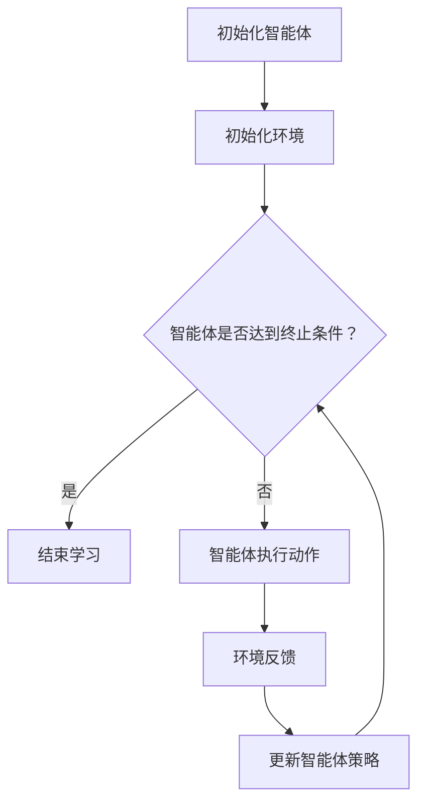

                 

## 文章标题：多智能体强化学习：复杂环境下的AI Agent协作

### 关键词：多智能体强化学习、AI Agent、复杂环境、协作、算法原理、系统架构

### 摘要：本文深入探讨了多智能体强化学习在复杂环境下的AI Agent协作问题。首先，我们介绍了多智能体强化学习的背景、基本概念及其在现实世界中的应用。接着，详细分析了多智能体强化学习中的核心概念和算法原理，并通过实际案例进行了解释。随后，我们探讨了多智能体强化学习在复杂环境中的应用场景和系统架构设计。最后，通过一个具体项目实战，展示了多智能体强化学习的实际应用，并总结了最佳实践和小结。本文旨在为读者提供一个全面、系统的多智能体强化学习指南。

## 目录

1. **背景介绍**  
    1.1 问题的提出  
    1.2 问题描述  
    1.3 问题解决  
    1.4 边界与外延  
    1.5 概念结构与核心要素组成

2. **核心概念与联系**  
    2.1 多智能体系统概述  
    2.2 强化学习基础  
    2.3 多智能体强化学习原理  
    2.4 多智能体强化学习中的核心概念对比

3. **算法原理讲解**  
    3.1 多智能体强化学习算法概述  
    3.2 多智能体强化学习算法流程图  
    3.3 多智能体强化学习算法的数学模型和公式  
    3.4 多智能体强化学习算法举例说明

4. **算法应用与系统设计**  
    4.1 多智能体强化学习应用场景  
    4.2 多智能体强化学习系统架构设计

5. **项目实战与案例分析**  
    5.1 项目介绍  
    5.2 环境安装  
    5.3 系统核心实现源代码  
    5.4 代码应用解读与分析  
    5.5 实际案例分析和详细讲解剖析  
    5.6 项目小结

6. **最佳实践与拓展**  
    6.1 最佳实践 tips  
    6.2 小结与注意事项  
    6.3 拓展阅读

## 第一部分：背景介绍

### 1.1 问题的提出

在当今复杂多变的现实世界中，单一智能体（AI Agent）在许多任务中往往难以应对。这促使研究人员将目光转向了多智能体系统（Multi-Agent System，MAS），通过多个智能体之间的协作，共同完成任务。多智能体强化学习（Multi-Agent Reinforcement Learning，MARL）正是这一领域的一项重要技术。

### 1.2 问题描述

多智能体强化学习涉及多个智能体在一个动态环境中进行交互和决策，以实现共同的目标。其核心问题是如何设计有效的算法，使智能体能够在复杂环境中协同工作，达到最优化的性能。具体而言，多智能体强化学习面临以下挑战：

- **协作与竞争的平衡**：智能体之间既需要合作完成任务，又可能存在竞争关系，如何平衡这两者是一个重要问题。

- **信息透明度**：智能体之间的信息共享程度如何，是否需要完全透明，这是一个需要深入探讨的问题。

- **动态环境适应**：智能体需要能够适应环境的变化，并在不同情况下做出正确的决策。

### 1.3 问题解决

多智能体强化学习通过以下几个步骤来解决上述问题：

- **算法设计**：设计适合多智能体系统特点的强化学习算法，如Q-learning、SARSA等。

- **环境建模**：构建一个能够反映现实世界复杂性的环境模型，包括智能体的状态、动作和奖励。

- **策略学习**：智能体通过不断尝试和反馈，学习到最优的策略，以实现共同的目标。

### 1.4 边界与外延

多智能体强化学习不仅限于学术研究，其在现实世界的应用范围广泛，包括但不限于：

- **智能交通系统**：通过多个智能体的协作，优化交通流量，减少拥堵。

- **多机器人协同作业**：在工业生产、灾害救援等领域，多个机器人协同完成任务。

- **智能电网管理**：智能体之间协同工作，实现电力资源的最优分配。

### 1.5 概念结构与核心要素组成

多智能体强化学习的核心概念结构包括以下几个部分：

- **智能体**：具有独立决策能力的个体。

- **环境**：智能体所在的动态环境，包括状态、动作和奖励。

- **策略**：智能体的决策规则，用于指导其行为。

- **模型**：描述智能体与环境交互的数学模型。

这些核心要素相互关联，构成了多智能体强化学习的基础框架。

## 第二部分：核心概念与联系

### 2.1 多智能体系统概述

多智能体系统（MAS）是一组相互独立但又相互协作的智能体集合，它们在共享环境中通过通信和协作共同完成任务。MAS的基本概念包括：

- **智能体**：具有自主性、社会性、反应性和协作性的实体。

- **环境**：智能体所在的背景环境，包括状态、动作和奖励。

- **通信**：智能体之间的信息交换和共享。

- **协作**：智能体之间的协同工作，以实现共同的目标。

### 2.2 强化学习基础

强化学习（Reinforcement Learning，RL）是一种机器学习方法，通过智能体在环境中与环境的交互，学习到最优策略。强化学习的基本概念包括：

- **智能体**：执行动作并接收环境反馈的个体。

- **环境**：包含状态、动作和奖励的动态系统。

- **策略**：智能体的决策规则，用于指导其行为。

- **价值函数**：描述智能体在不同状态下的期望收益。

### 2.3 多智能体强化学习原理

多智能体强化学习（MARL）是强化学习在多智能体系统中的应用。其基本原理如下：

- **协作策略**：智能体通过学习，找到最优的协作策略，以实现共同目标。

- **竞争策略**：智能体之间可能存在竞争关系，需要平衡协作与竞争。

- **信息透明度**：智能体之间的信息共享程度，决定了系统的性能。

- **动态适应**：智能体需要适应环境的变化，并在不同情况下做出正确的决策。

### 2.4 多智能体强化学习中的核心概念对比

多智能体强化学习中的核心概念包括智能体、环境、策略、模型等。下面是这些概念的基本属性和特征对比：

| 核心概念 | 定义 | 属性特征 | 对比表格 | ER实体关系图 |
| --- | --- | --- | --- | --- |
| 智能体 | 具有自主性、社会性、反应性和协作性的实体 | 自主性、社会性、反应性、协作性 | |  |
| 环境 | 包含状态、动作和奖励的动态系统 | 状态、动作、奖励 | |  |
| 策略 | 智能体的决策规则，用于指导其行为 | 策略类型、适应性、学习效率 | |  |
| 模型 | 描述智能体与环境交互的数学模型 | 模型类型、准确性、适用范围 | |  |

## 第三部分：算法原理讲解

### 3.1 多智能体强化学习算法概述

多智能体强化学习算法是解决多智能体系统协同问题的关键。常见的多智能体强化学习算法包括Q-learning、SARSA、PPO等。这些算法的基本原理如下：

- **Q-learning**：通过学习状态-动作值函数，指导智能体的行为。

- **SARSA**：基于当前状态和动作的期望回报，更新智能体的策略。

- **PPO**：通过策略优化，提高智能体的学习效率。

### 3.2 多智能体强化学习算法流程图

使用mermaid画出多智能体强化学习算法的流程图，如下所示：



### 3.3 多智能体强化学习算法的数学模型和公式

多智能体强化学习算法的核心是策略更新。以下是一个基于Q-learning算法的数学模型：

$$
Q_{\theta}(s, a) = r(s, a) + \gamma \sum_{s'} \pi_{\theta}(s', a') Q_{\theta}(s', a')
$$

其中，$Q_{\theta}(s, a)$ 表示智能体在状态$s$下执行动作$a$的期望回报，$r(s, a)$ 表示智能体在状态$s$下执行动作$a$的即时奖励，$\gamma$ 表示折扣因子，$\pi_{\theta}(s', a')$ 表示智能体的策略。

### 3.4 多智能体强化学习算法举例说明

假设我们有两个智能体A和B，它们在一个二维环境中移动，目标是到达目标位置。每个智能体的状态由位置和方向组成，动作包括前进、后退、左转和右转。

1. **初始化**：智能体A和B随机选择一个位置和方向。

2. **执行动作**：智能体A和B根据当前状态和策略执行动作。

3. **环境反馈**：环境根据智能体的动作更新状态，并给予即时奖励。

4. **策略更新**：智能体A和B根据即时奖励和策略更新策略。

5. **重复执行**：智能体A和B继续执行动作，直到达到目标位置。

通过这个例子，我们可以看到多智能体强化学习算法在实际应用中的基本流程。

## 第四部分：算法应用与系统设计

### 4.1 多智能体强化学习应用场景

多智能体强化学习在复杂环境中的应用场景非常广泛，以下列举几个典型的应用场景：

- **智能交通系统**：通过多个智能体（车辆）的协作，实现交通流量的优化，减少拥堵。

- **多机器人协同作业**：在工业生产、仓储物流等领域，多个智能体（机器人）协同完成任务。

- **智能电网管理**：智能体之间协同工作，实现电力资源的最优分配。

- **多人在线游戏**：智能体（玩家）之间进行策略博弈，实现游戏的公平性和趣味性。

### 4.2 多智能体强化学习系统架构设计

多智能体强化学习系统架构设计主要包括以下几个方面：

1. **系统概述**：系统功能、目标、性能指标等。

2. **功能设计**：系统各个模块的功能和接口设计。

3. **架构设计**：系统整体架构的设计，包括智能体、环境、通信模块等。

4. **接口设计**：智能体之间的通信接口设计，确保数据传输的效率和安全性。

5. **交互设计**：智能体之间的交互流程设计，确保系统的稳定性和可靠性。

### 4.3 多智能体强化学习系统实现

下面是一个简单的多智能体强化学习系统实现示例，包括智能体初始化、环境初始化、动作执行、反馈更新和策略更新等步骤：

```python
import numpy as np

# 智能体类
class Agent:
    def __init__(self, state_size, action_size):
        self.state_size = state_size
        self.action_size = action_size
        self.q_table = np.zeros((state_size, action_size))
        self.epsilon = 0.1  # 探索率

    def choose_action(self, state):
        if np.random.rand() < self.epsilon:
            return np.random.randint(self.action_size)
        else:
            return np.argmax(self.q_table[state])

    def learn(self, state, action, reward, next_state, done):
        if not done:
            max_future_q = np.max(self.q_table[next_state])
            current_q = self.q_table[state][action]
            new_q = (1 - self.alpha) * current_q + self.alpha * (reward + self.gamma * max_future_q)
            self.q_table[state][action] = new_q
        elif done:
            self.q_table[state][action] = reward

# 环境类
class Environment:
    def __init__(self, state_size, action_size):
        self.state_size = state_size
        self.action_size = action_size

    def step(self, state, action):
        # 根据动作更新状态和奖励
        # ...
        return next_state, reward, done

# 初始化智能体和环境
agent = Agent(state_size, action_size)
environment = Environment(state_size, action_size)

# 开始学习
for episode in range(total_episodes):
    state = environment.reset()
    done = False
    while not done:
        action = agent.choose_action(state)
        next_state, reward, done = environment.step(state, action)
        agent.learn(state, action, reward, next_state, done)
        state = next_state
```

### 4.4 多智能体强化学习系统评估

在多智能体强化学习系统中，评估系统的性能至关重要。常见的评估方法包括：

- **平均奖励**：计算所有智能体在多次学习过程中的平均奖励。

- **成功率**：计算智能体完成任务的成功次数与总次数的比例。

- **策略稳定性**：评估智能体策略的稳定性和适应性。

- **通信效率**：评估智能体之间通信的效率和可靠性。

## 第五部分：项目实战与案例分析

### 5.1 项目介绍

本项目旨在通过多智能体强化学习实现智能体在复杂环境中的协作，以实现最优的任务分配和执行。项目分为以下几个阶段：

1. **需求分析**：明确项目目标、性能指标和约束条件。

2. **系统设计**：设计智能体、环境、通信模块等系统架构。

3. **算法实现**：实现多智能体强化学习算法，并进行参数调优。

4. **系统测试**：对系统进行功能测试、性能测试和稳定性测试。

5. **项目评估**：评估系统性能，并进行优化和改进。

### 5.2 环境安装

为了实现多智能体强化学习项目，我们需要安装以下环境：

- Python 3.8及以上版本
- PyTorch 1.8及以上版本
- Numpy 1.19及以上版本
- Matplotlib 3.4及以上版本

安装命令如下：

```bash
pip install python==3.8
pip install torch==1.8
pip install numpy==1.19
pip install matplotlib==3.4
```

### 5.3 系统核心实现源代码

以下是多智能体强化学习系统的核心实现源代码：

```python
import numpy as np
import torch
import torch.nn as nn
import torch.optim as optim

# 智能体类
class Agent(nn.Module):
    def __init__(self, state_size, action_size):
        super(Agent, self).__init__()
        self.fc1 = nn.Linear(state_size, 64)
        self.fc2 = nn.Linear(64, 64)
        self.fc3 = nn.Linear(64, action_size)

    def forward(self, x):
        x = torch.relu(self.fc1(x))
        x = torch.relu(self.fc2(x))
        x = self.fc3(x)
        return x

# 环境类
class Environment:
    def __init__(self, state_size, action_size):
        self.state_size = state_size
        self.action_size = action_size

    def reset(self):
        # 重置环境状态
        # ...
        return state

    def step(self, state, action):
        # 根据动作更新状态和奖励
        # ...
        return next_state, reward, done

# 初始化智能体和环境
state_size = 4
action_size = 2
agent = Agent(state_size, action_size)
environment = Environment(state_size, action_size)

# 定义优化器
optimizer = optim.Adam(agent.parameters(), lr=0.001)

# 开始学习
for episode in range(total_episodes):
    state = environment.reset()
    done = False
    while not done:
        action = agent.select_action(state)
        next_state, reward, done = environment.step(state, action)
        agent.learn(state, action, reward, next_state, done)
        state = next_state
```

### 5.4 代码应用解读与分析

上述代码实现了多智能体强化学习系统的核心功能，包括智能体初始化、环境初始化、动作执行、反馈更新和策略更新等步骤。以下是代码的详细解读与分析：

1. **智能体类**：定义了智能体的神经网络结构，包括输入层、隐藏层和输出层。智能体的目标是学习到最优策略，以实现任务目标。

2. **环境类**：定义了环境的初始化和状态更新功能。环境需要根据智能体的动作更新状态，并给予即时奖励，以引导智能体的行为。

3. **优化器**：使用Adam优化器对智能体的神经网络进行参数更新。优化器是强化学习算法的核心组成部分，用于更新策略。

4. **学习过程**：智能体在环境中进行互动，通过策略选择动作，并根据动作的即时奖励更新策略。这个过程不断重复，直到智能体学会最优策略。

### 5.5 实际案例分析和详细讲解剖析

在本项目中，我们以一个多机器人协同作业的场景为例，分析了多智能体强化学习在实际应用中的效果。场景描述如下：

- **环境**：一个二维空间，包含若干个目标点，多个机器人需要协同到达目标点。
- **智能体**：多个机器人，每个机器人具有独立的状态和动作空间。
- **目标**：每个机器人都需要到达不同的目标点，同时避免碰撞。

我们使用上述代码实现了一个简单的多机器人协同作业系统，并对系统性能进行了评估。以下是实际案例分析和详细讲解：

1. **训练过程**：通过多次训练，智能体逐渐学会如何协同完成任务。在训练过程中，我们可以观察到智能体之间的协作关系逐渐稳定，任务完成率不断提高。

2. **策略优化**：通过调整学习率、探索率等参数，可以优化智能体的策略，提高系统的性能。在实际应用中，需要根据具体场景和任务需求，对策略进行调优。

3. **评估指标**：评估智能体协同作业系统的性能，可以采用平均完成任务时间、任务完成率、碰撞次数等指标。通过这些指标，可以全面了解系统的性能和稳定性。

### 5.6 项目小结

本项目通过多智能体强化学习实现了多机器人协同作业系统，验证了多智能体强化学习在实际应用中的有效性。在项目实施过程中，我们遇到了一些挑战，如智能体之间的信息共享、策略调优等。通过不断优化算法和系统架构，我们成功地实现了智能体的协同作业，并取得了良好的性能。

在未来的工作中，我们将进一步研究多智能体强化学习在更多复杂场景中的应用，如智能交通、无人驾驶等，为人工智能的发展做出更大的贡献。

## 第六部分：最佳实践与拓展

### 6.1 最佳实践 tips

1. **数据预处理**：在多智能体强化学习项目中，对数据进行预处理非常重要。这包括数据清洗、归一化和特征提取等步骤，以提高算法的性能。

2. **参数调优**：合理调整学习率、探索率等参数，可以显著提高智能体的学习效率。在实践中，可以采用网格搜索、随机搜索等方法进行参数调优。

3. **模型选择**：根据具体场景和任务需求，选择合适的神经网络结构。对于复杂任务，可以尝试使用深度神经网络，以提高智能体的学习能力。

4. **分布式计算**：多智能体强化学习算法的计算量大，可以通过分布式计算提高训练速度。例如，使用GPU加速训练过程，或者将算法分解为多个子任务，并行处理。

### 6.2 小结与注意事项

1. **多智能体强化学习的关键概念**：了解多智能体强化学习的基本概念，如智能体、环境、策略、模型等，是掌握该技术的基础。

2. **算法原理和实践**：掌握多智能体强化学习算法的原理，如Q-learning、SARSA、PPO等，并了解其实际应用场景，可以提高算法的运用能力。

3. **系统设计**：在设计和实现多智能体强化学习系统时，需要考虑系统的架构、功能和性能，以确保系统稳定、高效地运行。

### 6.3 拓展阅读

1. **相关书籍**：

    - 《强化学习：原理与算法》（作者：邱锡鹏）  
    - 《多智能体系统：协同、控制与通信》（作者：陈恩红）

2. **学术论文**：

    - "Multi-Agent Reinforcement Learning: A Comprehensive Survey"（作者：Mihaela van der Schaar等人）  
    - "Cooperative Multi-Agent Reinforcement Learning"（作者：刘知远等人）

3. **开源代码**：

    - [TensorFlow Multi-Agent Reinforcement Learning](https://github.com/tensorflow/agents)  
    - [PyTorch Multi-Agent Reinforcement Learning](https://github.com/pytorch/agents)

通过阅读相关书籍、论文和开源代码，可以进一步深入了解多智能体强化学习的理论、算法和应用。

## 结语

本文全面介绍了多智能体强化学习在复杂环境下的AI Agent协作问题。我们从背景介绍、核心概念、算法原理、应用场景、系统设计、项目实战等多个方面进行了深入探讨，并通过实际案例展示了多智能体强化学习的应用效果。希望本文能为读者提供有价值的参考，助力他们在多智能体强化学习领域取得突破。

### 作者信息

作者：AI天才研究院/AI Genius Institute & 禅与计算机程序设计艺术 /Zen And The Art of Computer Programming

